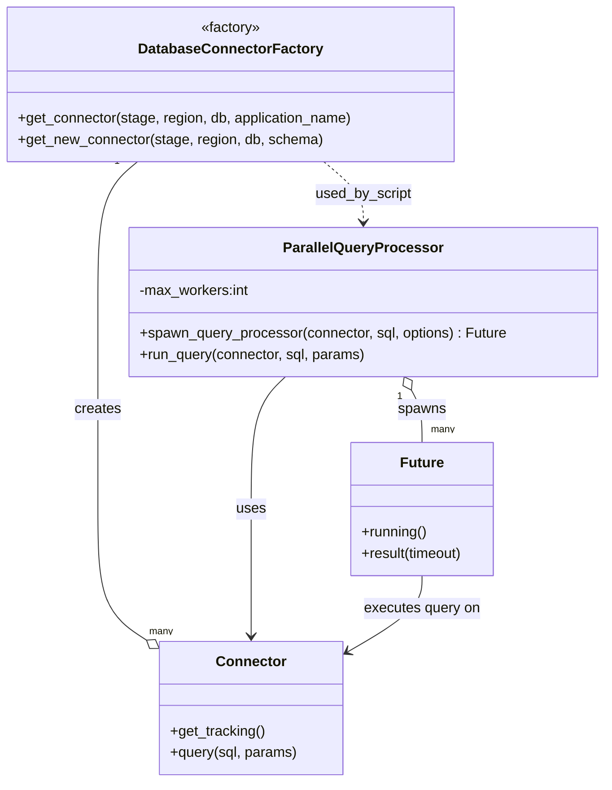

# Diagram: tools/ide_local_testing/localTest/test/partview/ParallelQueryProcessorTest.py


> Auto-generated by Obscura crawlers

## Diagram 1

```mermaid
flowchart LR
    A[Start script] --> B[DatabaseConnectorFactory.get_connector(AWS_STAGE, region, partview)]
    B --> C[connectorFactory.get_tracking()]
    A --> D[DatabaseConnectorFactory.get_new_connector(AWS_STAGE, region, partview, package_container_search)]
    D --> E[second_connector.get_tracking()]
    F[ParallelQueryProcessor(2)] --> G[processor.spawn_query_processor(trackingConnector1, count, options) --> FutureOne]
    F --> H[processor.spawn_query_processor(trackingConnector2, summary, options) --> FutureTwo]
    C --> G
    E --> H
    G --> I[print(FutureOne.running())]
    H --> J[print(FutureTwo.running())]
    I --> K[concurrent.futures.wait((FutureOne, FutureTwo), ALL_COMPLETED)]
    J --> K
    K --> L[for row in FutureOne.result(0): print row]
    K --> M[for row in FutureTwo.result(0): print row]
    L --> Z[End]
    M --> Z
```

> SVG rendering failed for this diagram.

## Diagram 2



### SVG

<svg id="container" width="678.841796875" xmlns="http://www.w3.org/2000/svg" class="classDiagram" height="880" viewBox="0 0 678.841796875 880" role="graphics-document document" aria-roledescription="class"><style>#container{font-family:"trebuchet ms",verdana,arial,sans-serif;font-size:16px;fill:#333;}@keyframes edge-animation-frame{from{stroke-dashoffset:0;}}@keyframes dash{to{stroke-dashoffset:0;}}#container .edge-animation-slow{stroke-dasharray:9,5!important;stroke-dashoffset:900;animation:dash 50s linear infinite;stroke-linecap:round;}#container .edge-animation-fast{stroke-dasharray:9,5!important;stroke-dashoffset:900;animation:dash 20s linear infinite;stroke-linecap:round;}#container .error-icon{fill:#552222;}#container .error-text{fill:#552222;stroke:#552222;}#container .edge-thickness-normal{stroke-width:1px;}#container .edge-thickness-thick{stroke-width:3.5px;}#container .edge-pattern-solid{stroke-dasharray:0;}#container .edge-thickness-invisible{stroke-width:0;fill:none;}#container .edge-pattern-dashed{stroke-dasharray:3;}#container .edge-pattern-dotted{stroke-dasharray:2;}#container .marker{fill:#333333;stroke:#333333;}#container .marker.cross{stroke:#333333;}#container svg{font-family:"trebuchet ms",verdana,arial,sans-serif;font-size:16px;}#container p{margin:0;}#container g.classGroup text{fill:#9370DB;stroke:none;font-family:"trebuchet ms",verdana,arial,sans-serif;font-size:10px;}#container g.classGroup text .title{font-weight:bolder;}#container .nodeLabel,#container .edgeLabel{color:#131300;}#container .edgeLabel .label rect{fill:#ECECFF;}#container .label text{fill:#131300;}#container .labelBkg{background:#ECECFF;}#container .edgeLabel .label span{background:#ECECFF;}#container .classTitle{font-weight:bolder;}#container .node rect,#container .node circle,#container .node ellipse,#container .node polygon,#container .node path{fill:#ECECFF;stroke:#9370DB;stroke-width:1px;}#container .divider{stroke:#9370DB;stroke-width:1;}#container g.clickable{cursor:pointer;}#container g.classGroup rect{fill:#ECECFF;stroke:#9370DB;}#container g.classGroup line{stroke:#9370DB;stroke-width:1;}#container .classLabel .box{stroke:none;stroke-width:0;fill:#ECECFF;opacity:0.5;}#container .classLabel .label{fill:#9370DB;font-size:10px;}#container .relation{stroke:#333333;stroke-width:1;fill:none;}#container .dashed-line{stroke-dasharray:3;}#container .dotted-line{stroke-dasharray:1 2;}#container #compositionStart,#container .composition{fill:#333333!important;stroke:#333333!important;stroke-width:1;}#container #compositionEnd,#container .composition{fill:#333333!important;stroke:#333333!important;stroke-width:1;}#container #dependencyStart,#container .dependency{fill:#333333!important;stroke:#333333!important;stroke-width:1;}#container #dependencyStart,#container .dependency{fill:#333333!important;stroke:#333333!important;stroke-width:1;}#container #extensionStart,#container .extension{fill:transparent!important;stroke:#333333!important;stroke-width:1;}#container #extensionEnd,#container .extension{fill:transparent!important;stroke:#333333!important;stroke-width:1;}#container #aggregationStart,#container .aggregation{fill:transparent!important;stroke:#333333!important;stroke-width:1;}#container #aggregationEnd,#container .aggregation{fill:transparent!important;stroke:#333333!important;stroke-width:1;}#container #lollipopStart,#container .lollipop{fill:#ECECFF!important;stroke:#333333!important;stroke-width:1;}#container #lollipopEnd,#container .lollipop{fill:#ECECFF!important;stroke:#333333!important;stroke-width:1;}#container .edgeTerminals{font-size:11px;line-height:initial;}#container .classTitleText{text-anchor:middle;font-size:18px;fill:#333;}#container .label-icon{display:inline-block;height:1em;overflow:visible;vertical-align:-0.125em;}#container .node .label-icon path{fill:currentColor;stroke:revert;stroke-width:revert;}#container :root{--mermaid-font-family:"trebuchet ms",verdana,arial,sans-serif;}</style><g><defs><marker id="container_class-aggregationStart" class="marker aggregation class" refX="18" refY="7" markerWidth="190" markerHeight="240" orient="auto"><path d="M 18,7 L9,13 L1,7 L9,1 Z"></path></marker></defs><defs><marker id="container_class-aggregationEnd" class="marker aggregation class" refX="1" refY="7" markerWidth="20" markerHeight="28" orient="auto"><path d="M 18,7 L9,13 L1,7 L9,1 Z"></path></marker></defs><defs><marker id="container_class-extensionStart" class="marker extension class" refX="18" refY="7" markerWidth="190" markerHeight="240" orient="auto"><path d="M 1,7 L18,13 V 1 Z"></path></marker></defs><defs><marker id="container_class-extensionEnd" class="marker extension class" refX="1" refY="7" markerWidth="20" markerHeight="28" orient="auto"><path d="M 1,1 V 13 L18,7 Z"></path></marker></defs><defs><marker id="container_class-compositionStart" class="marker composition class" refX="18" refY="7" markerWidth="190" markerHeight="240" orient="auto"><path d="M 18,7 L9,13 L1,7 L9,1 Z"></path></marker></defs><defs><marker id="container_class-compositionEnd" class="marker composition class" refX="1" refY="7" markerWidth="20" markerHeight="28" orient="auto"><path d="M 18,7 L9,13 L1,7 L9,1 Z"></path></marker></defs><defs><marker id="container_class-dependencyStart" class="marker dependency class" refX="6" refY="7" markerWidth="190" markerHeight="240" orient="auto"><path d="M 5,7 L9,13 L1,7 L9,1 Z"></path></marker></defs><defs><marker id="container_class-dependencyEnd" class="marker dependency class" refX="13" refY="7" markerWidth="20" markerHeight="28" orient="auto"><path d="M 18,7 L9,13 L14,7 L9,1 Z"></path></marker></defs><defs><marker id="container_class-lollipopStart" class="marker lollipop class" refX="13" refY="7" markerWidth="190" markerHeight="240" orient="auto"><circle stroke="black" fill="transparent" cx="7" cy="7" r="6"></circle></marker></defs><defs><marker id="container_class-lollipopEnd" class="marker lollipop class" refX="1" refY="7" markerWidth="190" markerHeight="240" orient="auto"><circle stroke="black" fill="transparent" cx="7" cy="7" r="6"></circle></marker></defs><g class="root"><g class="clusters"></g><g class="edgePaths"><path d="M154.699,182L147.295,188.167C139.89,194.333,125.081,206.667,117.676,233C110.271,259.333,110.271,299.667,110.271,340C110.271,380.333,110.271,420.667,110.271,459.5C110.271,498.333,110.271,535.667,110.271,573C110.271,610.333,110.271,647.667,119.454,672.313C128.636,696.96,147.001,708.92,156.183,714.9L165.365,720.88" id="id_DatabaseConnectorFactory_Connector_1" class="edge-thickness-normal edge-pattern-solid relation" style=";;;" data-edge="true" data-et="edge" data-id="id_DatabaseConnectorFactory_Connector_1" data-points="W3sieCI6MTU0LjY5OTEwODQ5Mjk0MzU0LCJ5IjoxODJ9LHsieCI6MTEwLjI3MTQ4NDM3NSwieSI6MjE5fSx7IngiOjExMC4yNzE0ODQzNzUsInkiOjM0MH0seyJ4IjoxMTAuMjcxNDg0Mzc1LCJ5Ijo0NjF9LHsieCI6MTEwLjI3MTQ4NDM3NSwieSI6NTczfSx7IngiOjExMC4yNzE0ODQzNzUsInkiOjY4NX0seyJ4IjoxNzkuODIwMzEyNSwieSI6NzMwLjI5MzI2NjU1NTM3MDF9XQ==" marker-end="url(#container_class-aggregationEnd)"></path><path d="M320.72,424L314.308,430.167C307.897,436.333,295.073,448.667,288.662,473.5C282.25,498.333,282.25,535.667,282.25,573C282.25,610.333,282.25,647.667,282.25,671.5C282.25,695.333,282.25,705.667,282.25,710.833L282.25,716" id="id_ParallelQueryProcessor_Connector_2" class="edge-thickness-normal edge-pattern-solid relation" style=";;;" data-edge="true" data-et="edge" data-id="id_ParallelQueryProcessor_Connector_2" data-points="W3sieCI6MzIwLjcxOTc5OTE5OTM4MDIsInkiOjQyNH0seyJ4IjoyODIuMjUsInkiOjQ2MX0seyJ4IjoyODIuMjUsInkiOjU3M30seyJ4IjoyODIuMjUsInkiOjY4NX0seyJ4IjoyODIuMjUsInkiOjcyMn1d" marker-end="url(#container_class-dependencyEnd)"></path><path d="M462.805,439.099L464.821,442.749C466.838,446.399,470.871,453.7,472.888,463.517C474.904,473.333,474.904,485.667,474.904,491.833L474.904,498" id="id_ParallelQueryProcessor_Future_3" class="edge-thickness-normal edge-pattern-solid relation" style=";;;" data-edge="true" data-et="edge" data-id="id_ParallelQueryProcessor_Future_3" data-points="W3sieCI6NDU0LjQ2MzI3ODAyMTY5NDI0LCJ5Ijo0MjR9LHsieCI6NDc0LjkwNDI5Njg3NSwieSI6NDYxfSx7IngiOjQ3NC45MDQyOTY4NzUsInkiOjQ5OH1d" marker-start="url(#container_class-aggregationStart)"></path><path d="M474.904,648L474.904,654.167C474.904,660.333,474.904,672.667,460.731,687.073C446.558,701.479,418.213,717.958,404.04,726.197L389.867,734.437" id="id_Future_Connector_4" class="edge-thickness-normal edge-pattern-solid relation" style=";;;" data-edge="true" data-et="edge" data-id="id_Future_Connector_4" data-points="W3sieCI6NDc0LjkwNDI5Njg3NSwieSI6NjQ4fSx7IngiOjQ3NC45MDQyOTY4NzUsInkiOjY4NX0seyJ4IjozODQuNjc5Njg3NSwieSI6NzM3LjQ1MjI3NTQ2OTEzNX1d" marker-end="url(#container_class-dependencyEnd)"></path><path d="M363.629,182L371.034,188.167C378.438,194.333,393.247,206.667,400.652,218C408.057,229.333,408.057,239.667,408.057,244.833L408.057,250" id="id_DatabaseConnectorFactory_ParallelQueryProcessor_5" class="edge-thickness-normal edge-pattern-dashed relation" style=";;;" data-edge="true" data-et="edge" data-id="id_DatabaseConnectorFactory_ParallelQueryProcessor_5" data-points="W3sieCI6MzYzLjYyOTAxNjUwNzA1NjQ2LCJ5IjoxODJ9LHsieCI6NDA4LjA1NjY0MDYyNSwieSI6MjE5fSx7IngiOjQwOC4wNTY2NDA2MjUsInkiOjI1Nn1d" marker-end="url(#container_class-dependencyEnd)"></path></g><g class="edgeLabels"><g class="edgeLabel" transform="translate(110.271484375, 461)"><g class="label" data-id="id_DatabaseConnectorFactory_Connector_1" transform="translate(-26.171875, -12)"><foreignObject width="52.34375" height="24"><div xmlns="http://www.w3.org/1999/xhtml" class="labelBkg" style="display: table-cell; white-space: nowrap; line-height: 1.5; max-width: 200px; text-align: center;"><span class="edgeLabel"><p>creates</p></span></div></foreignObject></g></g><g class="edgeLabel" transform="translate(282.25, 573)"><g class="label" data-id="id_ParallelQueryProcessor_Connector_2" transform="translate(-16.4921875, -12)"><foreignObject width="32.984375" height="24"><div xmlns="http://www.w3.org/1999/xhtml" class="labelBkg" style="display: table-cell; white-space: nowrap; line-height: 1.5; max-width: 200px; text-align: center;"><span class="edgeLabel"><p>uses</p></span></div></foreignObject></g></g><g class="edgeLabel" transform="translate(474.904296875, 461)"><g class="label" data-id="id_ParallelQueryProcessor_Future_3" transform="translate(-26.8828125, -12)"><foreignObject width="53.765625" height="24"><div xmlns="http://www.w3.org/1999/xhtml" class="labelBkg" style="display: table-cell; white-space: nowrap; line-height: 1.5; max-width: 200px; text-align: center;"><span class="edgeLabel"><p>spawns</p></span></div></foreignObject></g></g><g class="edgeLabel" transform="translate(474.904296875, 685)"><g class="label" data-id="id_Future_Connector_4" transform="translate(-66.1484375, -12)"><foreignObject width="132.296875" height="24"><div xmlns="http://www.w3.org/1999/xhtml" class="labelBkg" style="display: table-cell; white-space: nowrap; line-height: 1.5; max-width: 200px; text-align: center;"><span class="edgeLabel"><p>executes query on</p></span></div></foreignObject></g></g><g class="edgeLabel" transform="translate(408.056640625, 219)"><g class="label" data-id="id_DatabaseConnectorFactory_ParallelQueryProcessor_5" transform="translate(-54.8203125, -12)"><foreignObject width="109.640625" height="24"><div xmlns="http://www.w3.org/1999/xhtml" class="labelBkg" style="display: table-cell; white-space: nowrap; line-height: 1.5; max-width: 200px; text-align: center;"><span class="edgeLabel"><p>used_by_script</p></span></div></foreignObject></g></g><g class="edgeTerminals" transform="translate(131.65256834773743, 181.6728591392243)"><g class="inner" transform="translate(0, 0)"><foreignObject style="width: 9px; height: 12px;"><div xmlns="http://www.w3.org/1999/xhtml" style="display: inline-block; padding-right: 1px; white-space: nowrap;"><span class="edgeLabel">1</span></div></foreignObject></g></g><g class="edgeTerminals" transform="translate(449.796191353677, 446.5714039891255)"><g class="inner" transform="translate(0, 0)"><foreignObject style="width: 9px; height: 12px;"><div xmlns="http://www.w3.org/1999/xhtml" style="display: inline-block; padding-right: 1px; white-space: nowrap;"><span class="edgeLabel">1</span></div></foreignObject></g></g><g class="edgeTerminals" transform="translate(168.3417067867471, 703.1736445484861)"><g class="inner" transform="translate(0, 0)"></g><foreignObject style="width: 36px; height: 12px;"><div xmlns="http://www.w3.org/1999/xhtml" style="display: inline-block; padding-right: 1px; white-space: nowrap;"><span class="edgeLabel">many</span></div></foreignObject></g><g class="edgeTerminals" transform="translate(484.9042984374999, 475.5000013392857)"><g class="inner" transform="translate(0, 0)"></g><foreignObject style="width: 36px; height: 12px;"><div xmlns="http://www.w3.org/1999/xhtml" style="display: inline-block; padding-right: 1px; white-space: nowrap;"><span class="edgeLabel">many</span></div></foreignObject></g></g><g class="nodes"><g class="node default" id="classId-DatabaseConnectorFactory-0" transform="translate(259.1640625, 95)"><g class="basic label-container"><path d="M-251.1640625 -87 L251.1640625 -87 L251.1640625 87 L-251.1640625 87" stroke="none" stroke-width="0" fill="#ECECFF" style=""></path><path d="M-251.1640625 -87 C-109.6793566891196 -87, 31.8053491217608 -87, 251.1640625 -87 M-251.1640625 -87 C-148.76586385171646 -87, -46.36766520343295 -87, 251.1640625 -87 M251.1640625 -87 C251.1640625 -49.665568328208956, 251.1640625 -12.331136656417911, 251.1640625 87 M251.1640625 -87 C251.1640625 -35.73207664655522, 251.1640625 15.535846706889558, 251.1640625 87 M251.1640625 87 C122.48430530354878 87, -6.19545189290244 87, -251.1640625 87 M251.1640625 87 C52.75381395120826 87, -145.65643459758348 87, -251.1640625 87 M-251.1640625 87 C-251.1640625 27.92947428415588, -251.1640625 -31.14105143168824, -251.1640625 -87 M-251.1640625 87 C-251.1640625 28.46194462671432, -251.1640625 -30.07611074657136, -251.1640625 -87" stroke="#9370DB" stroke-width="1.3" fill="none" stroke-dasharray="0 0" style=""></path></g><g class="annotation-group text" transform="translate(-34.2734375, -63)"><g class="label" style="" transform="translate(0,-12)"><foreignObject width="68.546875" height="24"><div xmlns="http://www.w3.org/1999/xhtml" style="display: table-cell; white-space: nowrap; line-height: 1.5; max-width: 119px; text-align: center;"><span class="nodeLabel markdown-node-label" style=""><p>«factory»</p></span></div></foreignObject></g></g><g class="label-group text" transform="translate(-98.1875, -39)"><g class="label" style="font-weight: bolder" transform="translate(0,-12)"><foreignObject width="196.375" height="24"><div xmlns="http://www.w3.org/1999/xhtml" style="display: table-cell; white-space: nowrap; line-height: 1.5; max-width: 244px; text-align: center;"><span class="nodeLabel markdown-node-label" style=""><p>DatabaseConnectorFactory</p></span></div></foreignObject></g></g><g class="members-group text" transform="translate(-239.1640625, 9)"></g><g class="methods-group text" transform="translate(-239.1640625, 39)"><g class="label" style="" transform="translate(0,-12)"><foreignObject width="380.140625" height="24"><div xmlns="http://www.w3.org/1999/xhtml" style="display: table-cell; white-space: nowrap; line-height: 1.5; max-width: 438px; text-align: center;"><span class="nodeLabel markdown-node-label" style=""><p>+get_connector(stage, region, db, application_name)</p></span></div></foreignObject></g><g class="label" style="" transform="translate(0,12)"><foreignObject width="342.390625" height="24"><div xmlns="http://www.w3.org/1999/xhtml" style="display: table-cell; white-space: nowrap; line-height: 1.5; max-width: 400px; text-align: center;"><span class="nodeLabel markdown-node-label" style=""><p>+get_new_connector(stage, region, db, schema)</p></span></div></foreignObject></g></g><g class="divider" style=""><path d="M-251.1640625 -15 C-128.8095281704019 -15, -6.45499384080378 -15, 251.1640625 -15 M-251.1640625 -15 C-123.53831858136364 -15, 4.08742533727272 -15, 251.1640625 -15" stroke="#9370DB" stroke-width="1.3" fill="none" stroke-dasharray="0 0" style=""></path></g><g class="divider" style=""><path d="M-251.1640625 9 C-110.17716660608363 9, 30.809729287832738 9, 251.1640625 9 M-251.1640625 9 C-111.67088914365735 9, 27.822284212685304 9, 251.1640625 9" stroke="#9370DB" stroke-width="1.3" fill="none" stroke-dasharray="0 0" style=""></path></g></g><g class="node default" id="classId-Connector-1" transform="translate(282.25, 797)"><g class="basic label-container"><path d="M-102.4296875 -75 L102.4296875 -75 L102.4296875 75 L-102.4296875 75" stroke="none" stroke-width="0" fill="#ECECFF" style=""></path><path d="M-102.4296875 -75 C-35.426956791218956 -75, 31.57577391756209 -75, 102.4296875 -75 M-102.4296875 -75 C-56.56070214851422 -75, -10.691716797028434 -75, 102.4296875 -75 M102.4296875 -75 C102.4296875 -21.45294445364371, 102.4296875 32.09411109271258, 102.4296875 75 M102.4296875 -75 C102.4296875 -35.429513800410554, 102.4296875 4.140972399178892, 102.4296875 75 M102.4296875 75 C58.763790943960466 75, 15.097894387920931 75, -102.4296875 75 M102.4296875 75 C40.76643538249481 75, -20.896816735010376 75, -102.4296875 75 M-102.4296875 75 C-102.4296875 37.61885128478779, -102.4296875 0.23770256957557478, -102.4296875 -75 M-102.4296875 75 C-102.4296875 16.4720607338462, -102.4296875 -42.0558785323076, -102.4296875 -75" stroke="#9370DB" stroke-width="1.3" fill="none" stroke-dasharray="0 0" style=""></path></g><g class="annotation-group text" transform="translate(0, -51)"></g><g class="label-group text" transform="translate(-37.421875, -51)"><g class="label" style="font-weight: bolder" transform="translate(0,-12)"><foreignObject width="74.84375" height="24"><div xmlns="http://www.w3.org/1999/xhtml" style="display: table-cell; white-space: nowrap; line-height: 1.5; max-width: 125px; text-align: center;"><span class="nodeLabel markdown-node-label" style=""><p>Connector</p></span></div></foreignObject></g></g><g class="members-group text" transform="translate(-90.4296875, -3)"></g><g class="methods-group text" transform="translate(-90.4296875, 27)"><g class="label" style="" transform="translate(0,-12)"><foreignObject width="107.0625" height="24"><div xmlns="http://www.w3.org/1999/xhtml" style="display: table-cell; white-space: nowrap; line-height: 1.5; max-width: 164px; text-align: center;"><span class="nodeLabel markdown-node-label" style=""><p>+get_tracking()</p></span></div></foreignObject></g><g class="label" style="" transform="translate(0,12)"><foreignObject width="143.4375" height="24"><div xmlns="http://www.w3.org/1999/xhtml" style="display: table-cell; white-space: nowrap; line-height: 1.5; max-width: 201px; text-align: center;"><span class="nodeLabel markdown-node-label" style=""><p>+query(sql, params)</p></span></div></foreignObject></g></g><g class="divider" style=""><path d="M-102.4296875 -27 C-25.797107894919705 -27, 50.83547171016059 -27, 102.4296875 -27 M-102.4296875 -27 C-28.878298426568847 -27, 44.673090646862306 -27, 102.4296875 -27" stroke="#9370DB" stroke-width="1.3" fill="none" stroke-dasharray="0 0" style=""></path></g><g class="divider" style=""><path d="M-102.4296875 -3 C-32.91157741524998 -3, 36.60653266950004 -3, 102.4296875 -3 M-102.4296875 -3 C-46.36099080996136 -3, 9.707705880077285 -3, 102.4296875 -3" stroke="#9370DB" stroke-width="1.3" fill="none" stroke-dasharray="0 0" style=""></path></g></g><g class="node default" id="classId-ParallelQueryProcessor-2" transform="translate(408.056640625, 340)"><g class="basic label-container"><path d="M-262.78515625 -84 L262.78515625 -84 L262.78515625 84 L-262.78515625 84" stroke="none" stroke-width="0" fill="#ECECFF" style=""></path><path d="M-262.78515625 -84 C-68.11793995999369 -84, 126.54927633001262 -84, 262.78515625 -84 M-262.78515625 -84 C-59.5098429146004 -84, 143.7654704207992 -84, 262.78515625 -84 M262.78515625 -84 C262.78515625 -29.892698661216563, 262.78515625 24.214602677566873, 262.78515625 84 M262.78515625 -84 C262.78515625 -31.556994500136142, 262.78515625 20.886010999727716, 262.78515625 84 M262.78515625 84 C97.24116074806159 84, -68.30283475387682 84, -262.78515625 84 M262.78515625 84 C152.49441295364585 84, 42.20366965729167 84, -262.78515625 84 M-262.78515625 84 C-262.78515625 47.38502069044323, -262.78515625 10.770041380886454, -262.78515625 -84 M-262.78515625 84 C-262.78515625 20.346310644486998, -262.78515625 -43.307378711026004, -262.78515625 -84" stroke="#9370DB" stroke-width="1.3" fill="none" stroke-dasharray="0 0" style=""></path></g><g class="annotation-group text" transform="translate(0, -60)"></g><g class="label-group text" transform="translate(-85.2890625, -60)"><g class="label" style="font-weight: bolder" transform="translate(0,-12)"><foreignObject width="170.578125" height="24"><div xmlns="http://www.w3.org/1999/xhtml" style="display: table-cell; white-space: nowrap; line-height: 1.5; max-width: 218px; text-align: center;"><span class="nodeLabel markdown-node-label" style=""><p>ParallelQueryProcessor</p></span></div></foreignObject></g></g><g class="members-group text" transform="translate(-250.78515625, -12)"><g class="label" style="" transform="translate(0,-12)"><foreignObject width="125.296875" height="24"><div xmlns="http://www.w3.org/1999/xhtml" style="display: table-cell; white-space: nowrap; line-height: 1.5; max-width: 183px; text-align: center;"><span class="nodeLabel markdown-node-label" style=""><p>-max_workers:int</p></span></div></foreignObject></g></g><g class="methods-group text" transform="translate(-250.78515625, 36)"><g class="label" style="" transform="translate(0,-12)"><foreignObject width="416.28125" height="24"><div xmlns="http://www.w3.org/1999/xhtml" style="display: table-cell; white-space: nowrap; line-height: 1.5; max-width: 474px; text-align: center;"><span class="nodeLabel markdown-node-label" style=""><p>+spawn_query_processor(connector, sql, options) : Future</p></span></div></foreignObject></g><g class="label" style="" transform="translate(0,12)"><foreignObject width="255.9375" height="24"><div xmlns="http://www.w3.org/1999/xhtml" style="display: table-cell; white-space: nowrap; line-height: 1.5; max-width: 313px; text-align: center;"><span class="nodeLabel markdown-node-label" style=""><p>+run_query(connector, sql, params)</p></span></div></foreignObject></g></g><g class="divider" style=""><path d="M-262.78515625 -36 C-143.60868536070166 -36, -24.43221447140334 -36, 262.78515625 -36 M-262.78515625 -36 C-73.56355883397015 -36, 115.6580385820597 -36, 262.78515625 -36" stroke="#9370DB" stroke-width="1.3" fill="none" stroke-dasharray="0 0" style=""></path></g><g class="divider" style=""><path d="M-262.78515625 12 C-65.40736542491126 12, 131.97042540017748 12, 262.78515625 12 M-262.78515625 12 C-64.26555082857237 12, 134.25405459285525 12, 262.78515625 12" stroke="#9370DB" stroke-width="1.3" fill="none" stroke-dasharray="0 0" style=""></path></g></g><g class="node default" id="classId-Future-3" transform="translate(474.904296875, 573)"><g class="basic label-container"><path d="M-82.203125 -75 L82.203125 -75 L82.203125 75 L-82.203125 75" stroke="none" stroke-width="0" fill="#ECECFF" style=""></path><path d="M-82.203125 -75 C-44.81278461856475 -75, -7.422444237129497 -75, 82.203125 -75 M-82.203125 -75 C-43.411368746575135 -75, -4.619612493150271 -75, 82.203125 -75 M82.203125 -75 C82.203125 -26.561312512819093, 82.203125 21.877374974361814, 82.203125 75 M82.203125 -75 C82.203125 -43.38989052658661, 82.203125 -11.779781053173231, 82.203125 75 M82.203125 75 C45.296608103859356 75, 8.390091207718712 75, -82.203125 75 M82.203125 75 C27.375039259336482 75, -27.453046481327036 75, -82.203125 75 M-82.203125 75 C-82.203125 36.720803569079536, -82.203125 -1.5583928618409288, -82.203125 -75 M-82.203125 75 C-82.203125 15.26189636535753, -82.203125 -44.47620726928494, -82.203125 -75" stroke="#9370DB" stroke-width="1.3" fill="none" stroke-dasharray="0 0" style=""></path></g><g class="annotation-group text" transform="translate(0, -51)"></g><g class="label-group text" transform="translate(-23.234375, -51)"><g class="label" style="font-weight: bolder" transform="translate(0,-12)"><foreignObject width="46.46875" height="24"><div xmlns="http://www.w3.org/1999/xhtml" style="display: table-cell; white-space: nowrap; line-height: 1.5; max-width: 96px; text-align: center;"><span class="nodeLabel markdown-node-label" style=""><p>Future</p></span></div></foreignObject></g></g><g class="members-group text" transform="translate(-70.203125, -3)"></g><g class="methods-group text" transform="translate(-70.203125, 27)"><g class="label" style="" transform="translate(0,-12)"><foreignObject width="74.8125" height="24"><div xmlns="http://www.w3.org/1999/xhtml" style="display: table-cell; white-space: nowrap; line-height: 1.5; max-width: 132px; text-align: center;"><span class="nodeLabel markdown-node-label" style=""><p>+running()</p></span></div></foreignObject></g><g class="label" style="" transform="translate(0,12)"><foreignObject width="117.171875" height="24"><div xmlns="http://www.w3.org/1999/xhtml" style="display: table-cell; white-space: nowrap; line-height: 1.5; max-width: 175px; text-align: center;"><span class="nodeLabel markdown-node-label" style=""><p>+result(timeout)</p></span></div></foreignObject></g></g><g class="divider" style=""><path d="M-82.203125 -27 C-28.6925864787097 -27, 24.8179520425806 -27, 82.203125 -27 M-82.203125 -27 C-33.633111288371076 -27, 14.936902423257848 -27, 82.203125 -27" stroke="#9370DB" stroke-width="1.3" fill="none" stroke-dasharray="0 0" style=""></path></g><g class="divider" style=""><path d="M-82.203125 -3 C-24.60272916852371 -3, 32.99766666295258 -3, 82.203125 -3 M-82.203125 -3 C-30.90279401835153 -3, 20.397536963296943 -3, 82.203125 -3" stroke="#9370DB" stroke-width="1.3" fill="none" stroke-dasharray="0 0" style=""></path></g></g></g></g></g></svg>
