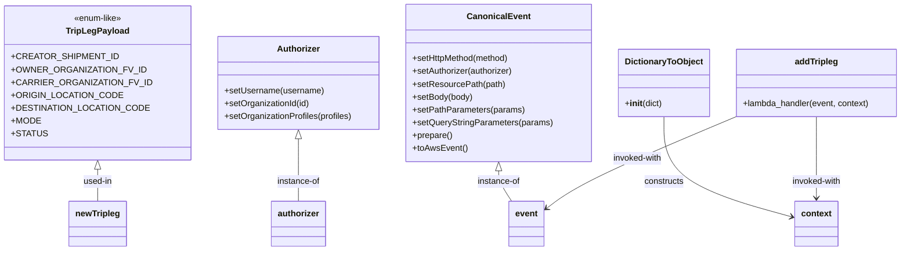

# Diagram: tools/ide_local_testing/localTest/test/partview/addTripleg.py


> Auto-generated by Obscura crawlers

## Diagram 1

```mermaid
flowchart TD
    A[Start script] --> B[generate creatorShipmentId (uuid4)]
    B --> C[build newTripleg payload<br/>(TripLegPayload constants + fields)]
    C --> D[configure Authorizer<br/>(setUsername, setOrganizationId, setOrganizationProfiles)]
    D --> E[build CanonicalEvent<br/>(setHttpMethod, setAuthorizer, setResourcePath, setBody, setPathParameters, setQueryStringParameters, prepare, toAwsEvent)]
    E --> F[json.dumps(event)]
    F --> G[print start timestamp]
    G --> H[call addTripleg(event, context)]
    H --> I[print end timestamp]
    I --> J[print retval]
    J --> K[End]
```

> SVG rendering failed for this diagram.

## Diagram 2



### SVG

<svg id="container" width="1639.46875" xmlns="http://www.w3.org/2000/svg" class="classDiagram" height="468" viewBox="0 0 1639.46875 468" role="graphics-document document" aria-roledescription="class"><style>#container{font-family:"trebuchet ms",verdana,arial,sans-serif;font-size:16px;fill:#333;}@keyframes edge-animation-frame{from{stroke-dashoffset:0;}}@keyframes dash{to{stroke-dashoffset:0;}}#container .edge-animation-slow{stroke-dasharray:9,5!important;stroke-dashoffset:900;animation:dash 50s linear infinite;stroke-linecap:round;}#container .edge-animation-fast{stroke-dasharray:9,5!important;stroke-dashoffset:900;animation:dash 20s linear infinite;stroke-linecap:round;}#container .error-icon{fill:#552222;}#container .error-text{fill:#552222;stroke:#552222;}#container .edge-thickness-normal{stroke-width:1px;}#container .edge-thickness-thick{stroke-width:3.5px;}#container .edge-pattern-solid{stroke-dasharray:0;}#container .edge-thickness-invisible{stroke-width:0;fill:none;}#container .edge-pattern-dashed{stroke-dasharray:3;}#container .edge-pattern-dotted{stroke-dasharray:2;}#container .marker{fill:#333333;stroke:#333333;}#container .marker.cross{stroke:#333333;}#container svg{font-family:"trebuchet ms",verdana,arial,sans-serif;font-size:16px;}#container p{margin:0;}#container g.classGroup text{fill:#9370DB;stroke:none;font-family:"trebuchet ms",verdana,arial,sans-serif;font-size:10px;}#container g.classGroup text .title{font-weight:bolder;}#container .nodeLabel,#container .edgeLabel{color:#131300;}#container .edgeLabel .label rect{fill:#ECECFF;}#container .label text{fill:#131300;}#container .labelBkg{background:#ECECFF;}#container .edgeLabel .label span{background:#ECECFF;}#container .classTitle{font-weight:bolder;}#container .node rect,#container .node circle,#container .node ellipse,#container .node polygon,#container .node path{fill:#ECECFF;stroke:#9370DB;stroke-width:1px;}#container .divider{stroke:#9370DB;stroke-width:1;}#container g.clickable{cursor:pointer;}#container g.classGroup rect{fill:#ECECFF;stroke:#9370DB;}#container g.classGroup line{stroke:#9370DB;stroke-width:1;}#container .classLabel .box{stroke:none;stroke-width:0;fill:#ECECFF;opacity:0.5;}#container .classLabel .label{fill:#9370DB;font-size:10px;}#container .relation{stroke:#333333;stroke-width:1;fill:none;}#container .dashed-line{stroke-dasharray:3;}#container .dotted-line{stroke-dasharray:1 2;}#container #compositionStart,#container .composition{fill:#333333!important;stroke:#333333!important;stroke-width:1;}#container #compositionEnd,#container .composition{fill:#333333!important;stroke:#333333!important;stroke-width:1;}#container #dependencyStart,#container .dependency{fill:#333333!important;stroke:#333333!important;stroke-width:1;}#container #dependencyStart,#container .dependency{fill:#333333!important;stroke:#333333!important;stroke-width:1;}#container #extensionStart,#container .extension{fill:transparent!important;stroke:#333333!important;stroke-width:1;}#container #extensionEnd,#container .extension{fill:transparent!important;stroke:#333333!important;stroke-width:1;}#container #aggregationStart,#container .aggregation{fill:transparent!important;stroke:#333333!important;stroke-width:1;}#container #aggregationEnd,#container .aggregation{fill:transparent!important;stroke:#333333!important;stroke-width:1;}#container #lollipopStart,#container .lollipop{fill:#ECECFF!important;stroke:#333333!important;stroke-width:1;}#container #lollipopEnd,#container .lollipop{fill:#ECECFF!important;stroke:#333333!important;stroke-width:1;}#container .edgeTerminals{font-size:11px;line-height:initial;}#container .classTitleText{text-anchor:middle;font-size:18px;fill:#333;}#container .label-icon{display:inline-block;height:1em;overflow:visible;vertical-align:-0.125em;}#container .node .label-icon path{fill:currentColor;stroke:revert;stroke-width:revert;}#container :root{--mermaid-font-family:"trebuchet ms",verdana,arial,sans-serif;}</style><g><defs><marker id="container_class-aggregationStart" class="marker aggregation class" refX="18" refY="7" markerWidth="190" markerHeight="240" orient="auto"><path d="M 18,7 L9,13 L1,7 L9,1 Z"></path></marker></defs><defs><marker id="container_class-aggregationEnd" class="marker aggregation class" refX="1" refY="7" markerWidth="20" markerHeight="28" orient="auto"><path d="M 18,7 L9,13 L1,7 L9,1 Z"></path></marker></defs><defs><marker id="container_class-extensionStart" class="marker extension class" refX="18" refY="7" markerWidth="190" markerHeight="240" orient="auto"><path d="M 1,7 L18,13 V 1 Z"></path></marker></defs><defs><marker id="container_class-extensionEnd" class="marker extension class" refX="1" refY="7" markerWidth="20" markerHeight="28" orient="auto"><path d="M 1,1 V 13 L18,7 Z"></path></marker></defs><defs><marker id="container_class-compositionStart" class="marker composition class" refX="18" refY="7" markerWidth="190" markerHeight="240" orient="auto"><path d="M 18,7 L9,13 L1,7 L9,1 Z"></path></marker></defs><defs><marker id="container_class-compositionEnd" class="marker composition class" refX="1" refY="7" markerWidth="20" markerHeight="28" orient="auto"><path d="M 18,7 L9,13 L1,7 L9,1 Z"></path></marker></defs><defs><marker id="container_class-dependencyStart" class="marker dependency class" refX="6" refY="7" markerWidth="190" markerHeight="240" orient="auto"><path d="M 5,7 L9,13 L1,7 L9,1 Z"></path></marker></defs><defs><marker id="container_class-dependencyEnd" class="marker dependency class" refX="13" refY="7" markerWidth="20" markerHeight="28" orient="auto"><path d="M 18,7 L9,13 L14,7 L9,1 Z"></path></marker></defs><defs><marker id="container_class-lollipopStart" class="marker lollipop class" refX="13" refY="7" markerWidth="190" markerHeight="240" orient="auto"><circle stroke="black" fill="transparent" cx="7" cy="7" r="6"></circle></marker></defs><defs><marker id="container_class-lollipopEnd" class="marker lollipop class" refX="1" refY="7" markerWidth="190" markerHeight="240" orient="auto"><circle stroke="black" fill="transparent" cx="7" cy="7" r="6"></circle></marker></defs><g class="root"><g class="clusters"></g><g class="edgePaths"><path d="M163.461,316.25L163.461,320.042C163.461,323.833,163.461,331.417,163.461,341.375C163.461,351.333,163.461,363.667,163.461,369.833L163.461,376" id="id_TripLegPayload_newTripleg_1" class="edge-thickness-normal edge-pattern-solid relation" style=";;;" data-edge="true" data-et="edge" data-id="id_TripLegPayload_newTripleg_1" data-points="W3sieCI6MTYzLjQ2MDkzNzUsInkiOjI5OX0seyJ4IjoxNjMuNDYwOTM3NSwieSI6MzM5fSx7IngiOjE2My40NjA5Mzc1LCJ5IjozNzZ9XQ==" marker-start="url(#container_class-extensionStart)"></path><path d="M520.59,259.25L520.59,272.542C520.59,285.833,520.59,312.417,520.59,331.875C520.59,351.333,520.59,363.667,520.59,369.833L520.59,376" id="id_Authorizer_authorizer_2" class="edge-thickness-normal edge-pattern-solid relation" style=";;;" data-edge="true" data-et="edge" data-id="id_Authorizer_authorizer_2" data-points="W3sieCI6NTIwLjU4OTg0Mzc1LCJ5IjoyNDJ9LHsieCI6NTIwLjU4OTg0Mzc1LCJ5IjozMzl9LHsieCI6NTIwLjU4OTg0Mzc1LCJ5IjozNzZ9XQ==" marker-start="url(#container_class-extensionStart)"></path><path d="M892.832,319.25L892.832,322.542C892.832,325.833,892.832,332.417,897.07,341.875C901.308,351.333,909.784,363.667,914.022,369.833L918.26,376" id="id_CanonicalEvent_event_3" class="edge-thickness-normal edge-pattern-solid relation" style=";;;" data-edge="true" data-et="edge" data-id="id_CanonicalEvent_event_3" data-points="W3sieCI6ODkyLjgzMjAzMTI1LCJ5IjozMDJ9LHsieCI6ODkyLjgzMjAzMTI1LCJ5IjozMzl9LHsieCI6OTE4LjI2MDM4MzcwMjUzMTYsInkiOjM3Nn1d" marker-start="url(#container_class-extensionStart)"></path><path d="M1195.609,218L1195.609,238.167C1195.609,258.333,1195.609,298.667,1235.417,329.905C1275.224,361.144,1354.839,383.288,1394.646,394.36L1434.454,405.432" id="id_DictionaryToObject_context_4" class="edge-thickness-normal edge-pattern-solid relation" style=";;;" data-edge="true" data-et="edge" data-id="id_DictionaryToObject_context_4" data-points="W3sieCI6MTE5NS42MDkzNzUsInkiOjIxOH0seyJ4IjoxMTk1LjYwOTM3NSwieSI6MzM5fSx7IngiOjE0NDAuMjM0Mzc1LCJ5Ijo0MDcuMDM5NjA4MzE3NzQ2NzR9XQ==" marker-end="url(#container_class-dependencyEnd)"></path><path d="M1331.124,218L1283.583,238.167C1236.041,258.333,1140.959,298.667,1083.16,327.04C1025.36,355.413,1004.843,371.827,994.584,380.033L984.326,388.24" id="id_addTripleg_event_5" class="edge-thickness-normal edge-pattern-solid relation" style=";;;" data-edge="true" data-et="edge" data-id="id_addTripleg_event_5" data-points="W3sieCI6MTMzMS4xMjM3MTU2MDgwMTYzLCJ5IjoyMTh9LHsieCI6MTA0NS44NzY5NTMxMjUsInkiOjMzOX0seyJ4Ijo5NzkuNjQwNjI1LCJ5IjozOTEuOTg4MDE0NDc3NTYxNzZ9XQ==" marker-end="url(#container_class-dependencyEnd)"></path><path d="M1479.641,218L1479.641,238.167C1479.641,258.333,1479.641,298.667,1479.641,324C1479.641,349.333,1479.641,359.667,1479.641,364.833L1479.641,370" id="id_addTripleg_context_6" class="edge-thickness-normal edge-pattern-solid relation" style=";;;" data-edge="true" data-et="edge" data-id="id_addTripleg_context_6" data-points="W3sieCI6MTQ3OS42NDA2MjUsInkiOjIxOH0seyJ4IjoxNDc5LjY0MDYyNSwieSI6MzM5fSx7IngiOjE0NzkuNjQwNjI1LCJ5IjozNzZ9XQ==" marker-end="url(#container_class-dependencyEnd)"></path></g><g class="edgeLabels"><g class="edgeLabel" transform="translate(163.4609375, 339)"><g class="label" data-id="id_TripLegPayload_newTripleg_1" transform="translate(-27.7109375, -12)"><foreignObject width="55.421875" height="24"><div xmlns="http://www.w3.org/1999/xhtml" class="labelBkg" style="display: table-cell; white-space: nowrap; line-height: 1.5; max-width: 200px; text-align: center;"><span class="edgeLabel"><p>used-in</p></span></div></foreignObject></g></g><g class="edgeLabel" transform="translate(520.58984375, 339)"><g class="label" data-id="id_Authorizer_authorizer_2" transform="translate(-41.15625, -12)"><foreignObject width="82.3125" height="24"><div xmlns="http://www.w3.org/1999/xhtml" class="labelBkg" style="display: table-cell; white-space: nowrap; line-height: 1.5; max-width: 200px; text-align: center;"><span class="edgeLabel"><p>instance-of</p></span></div></foreignObject></g></g><g class="edgeLabel" transform="translate(892.83203125, 339)"><g class="label" data-id="id_CanonicalEvent_event_3" transform="translate(-41.15625, -12)"><foreignObject width="82.3125" height="24"><div xmlns="http://www.w3.org/1999/xhtml" class="labelBkg" style="display: table-cell; white-space: nowrap; line-height: 1.5; max-width: 200px; text-align: center;"><span class="edgeLabel"><p>instance-of</p></span></div></foreignObject></g></g><g class="edgeLabel" transform="translate(1195.609375, 339)"><g class="label" data-id="id_DictionaryToObject_context_4" transform="translate(-37.84375, -12)"><foreignObject width="75.6875" height="24"><div xmlns="http://www.w3.org/1999/xhtml" class="labelBkg" style="display: table-cell; white-space: nowrap; line-height: 1.5; max-width: 200px; text-align: center;"><span class="edgeLabel"><p>constructs</p></span></div></foreignObject></g></g><g class="edgeLabel" transform="translate(1149.45629, 295.06225)"><g class="label" data-id="id_addTripleg_event_5" transform="translate(-47.4296875, -12)"><foreignObject width="94.859375" height="24"><div xmlns="http://www.w3.org/1999/xhtml" class="labelBkg" style="display: table-cell; white-space: nowrap; line-height: 1.5; max-width: 200px; text-align: center;"><span class="edgeLabel"><p>invoked-with</p></span></div></foreignObject></g></g><g class="edgeLabel" transform="translate(1479.640625, 339)"><g class="label" data-id="id_addTripleg_context_6" transform="translate(-47.4296875, -12)"><foreignObject width="94.859375" height="24"><div xmlns="http://www.w3.org/1999/xhtml" class="labelBkg" style="display: table-cell; white-space: nowrap; line-height: 1.5; max-width: 200px; text-align: center;"><span class="edgeLabel"><p>invoked-with</p></span></div></foreignObject></g></g></g><g class="nodes"><g class="node default" id="classId-TripLegPayload-0" transform="translate(163.4609375, 155)"><g class="basic label-container"><path d="M-155.4609375 -144 L155.4609375 -144 L155.4609375 144 L-155.4609375 144" stroke="none" stroke-width="0" fill="#ECECFF" style=""></path><path d="M-155.4609375 -144 C-67.45565828878527 -144, 20.549620922429455 -144, 155.4609375 -144 M-155.4609375 -144 C-39.66931322834343 -144, 76.12231104331315 -144, 155.4609375 -144 M155.4609375 -144 C155.4609375 -78.42271938626864, 155.4609375 -12.845438772537278, 155.4609375 144 M155.4609375 -144 C155.4609375 -48.48972246612419, 155.4609375 47.020555067751616, 155.4609375 144 M155.4609375 144 C66.19145700933926 144, -23.07802348132148 144, -155.4609375 144 M155.4609375 144 C55.44925583308925 144, -44.56242583382149 144, -155.4609375 144 M-155.4609375 144 C-155.4609375 67.06171622602884, -155.4609375 -9.87656754794233, -155.4609375 -144 M-155.4609375 144 C-155.4609375 68.31329622252215, -155.4609375 -7.373407554955691, -155.4609375 -144" stroke="#9370DB" stroke-width="1.3" fill="none" stroke-dasharray="0 0" style=""></path></g><g class="annotation-group text" transform="translate(-45.578125, -120)"><g class="label" style="" transform="translate(0,-12)"><foreignObject width="91.15625" height="24"><div xmlns="http://www.w3.org/1999/xhtml" style="display: table-cell; white-space: nowrap; line-height: 1.5; max-width: 141px; text-align: center;"><span class="nodeLabel markdown-node-label" style=""><p>«enum-like»</p></span></div></foreignObject></g></g><g class="label-group text" transform="translate(-55.953125, -96)"><g class="label" style="font-weight: bolder" transform="translate(0,-12)"><foreignObject width="111.90625" height="24"><div xmlns="http://www.w3.org/1999/xhtml" style="display: table-cell; white-space: nowrap; line-height: 1.5; max-width: 159px; text-align: center;"><span class="nodeLabel markdown-node-label" style=""><p>TripLegPayload</p></span></div></foreignObject></g></g><g class="members-group text" transform="translate(-143.4609375, -48)"><g class="label" style="" transform="translate(0,-12)"><foreignObject width="175.90625" height="24"><div xmlns="http://www.w3.org/1999/xhtml" style="display: table-cell; white-space: nowrap; line-height: 1.5; max-width: 233px; text-align: center;"><span class="nodeLabel markdown-node-label" style=""><p>+CREATOR_SHIPMENT_ID</p></span></div></foreignObject></g><g class="label" style="" transform="translate(0,12)"><foreignObject width="223.96875" height="24"><div xmlns="http://www.w3.org/1999/xhtml" style="display: table-cell; white-space: nowrap; line-height: 1.5; max-width: 281px; text-align: center;"><span class="nodeLabel markdown-node-label" style=""><p>+OWNER_ORGANIZATION_FV_ID</p></span></div></foreignObject></g><g class="label" style="" transform="translate(0,36)"><foreignObject width="230.96875" height="24"><div xmlns="http://www.w3.org/1999/xhtml" style="display: table-cell; white-space: nowrap; line-height: 1.5; max-width: 288px; text-align: center;"><span class="nodeLabel markdown-node-label" style=""><p>+CARRIER_ORGANIZATION_FV_ID</p></span></div></foreignObject></g><g class="label" style="" transform="translate(0,60)"><foreignObject width="184.421875" height="24"><div xmlns="http://www.w3.org/1999/xhtml" style="display: table-cell; white-space: nowrap; line-height: 1.5; max-width: 242px; text-align: center;"><span class="nodeLabel markdown-node-label" style=""><p>+ORIGIN_LOCATION_CODE</p></span></div></foreignObject></g><g class="label" style="" transform="translate(0,84)"><foreignObject width="227.5625" height="24"><div xmlns="http://www.w3.org/1999/xhtml" style="display: table-cell; white-space: nowrap; line-height: 1.5; max-width: 285px; text-align: center;"><span class="nodeLabel markdown-node-label" style=""><p>+DESTINATION_LOCATION_CODE</p></span></div></foreignObject></g><g class="label" style="" transform="translate(0,108)"><foreignObject width="50.21875" height="24"><div xmlns="http://www.w3.org/1999/xhtml" style="display: table-cell; white-space: nowrap; line-height: 1.5; max-width: 108px; text-align: center;"><span class="nodeLabel markdown-node-label" style=""><p>+MODE</p></span></div></foreignObject></g><g class="label" style="" transform="translate(0,132)"><foreignObject width="59.03125" height="24"><div xmlns="http://www.w3.org/1999/xhtml" style="display: table-cell; white-space: nowrap; line-height: 1.5; max-width: 117px; text-align: center;"><span class="nodeLabel markdown-node-label" style=""><p>+STATUS</p></span></div></foreignObject></g></g><g class="methods-group text" transform="translate(-143.4609375, 144)"></g><g class="divider" style=""><path d="M-155.4609375 -72 C-37.096221694314295 -72, 81.26849411137141 -72, 155.4609375 -72 M-155.4609375 -72 C-84.9897042626182 -72, -14.518471025236408 -72, 155.4609375 -72" stroke="#9370DB" stroke-width="1.3" fill="none" stroke-dasharray="0 0" style=""></path></g><g class="divider" style=""><path d="M-155.4609375 120 C-32.93829179836433 120, 89.58435390327134 120, 155.4609375 120 M-155.4609375 120 C-33.89494935742756 120, 87.67103878514487 120, 155.4609375 120" stroke="#9370DB" stroke-width="1.3" fill="none" stroke-dasharray="0 0" style=""></path></g></g><g class="node default" id="classId-Authorizer-1" transform="translate(520.58984375, 155)"><g class="basic label-container"><path d="M-151.66796875 -87 L151.66796875 -87 L151.66796875 87 L-151.66796875 87" stroke="none" stroke-width="0" fill="#ECECFF" style=""></path><path d="M-151.66796875 -87 C-35.67141587057466 -87, 80.32513700885067 -87, 151.66796875 -87 M-151.66796875 -87 C-49.569489658412465 -87, 52.52898943317507 -87, 151.66796875 -87 M151.66796875 -87 C151.66796875 -45.15125979067533, 151.66796875 -3.3025195813506656, 151.66796875 87 M151.66796875 -87 C151.66796875 -39.99410169074464, 151.66796875 7.011796618510715, 151.66796875 87 M151.66796875 87 C85.65674196860408 87, 19.64551518720816 87, -151.66796875 87 M151.66796875 87 C90.04134381035671 87, 28.414718870713415 87, -151.66796875 87 M-151.66796875 87 C-151.66796875 50.57992964015934, -151.66796875 14.159859280318685, -151.66796875 -87 M-151.66796875 87 C-151.66796875 17.530312114323138, -151.66796875 -51.939375771353724, -151.66796875 -87" stroke="#9370DB" stroke-width="1.3" fill="none" stroke-dasharray="0 0" style=""></path></g><g class="annotation-group text" transform="translate(0, -63)"></g><g class="label-group text" transform="translate(-38.3671875, -63)"><g class="label" style="font-weight: bolder" transform="translate(0,-12)"><foreignObject width="76.734375" height="24"><div xmlns="http://www.w3.org/1999/xhtml" style="display: table-cell; white-space: nowrap; line-height: 1.5; max-width: 126px; text-align: center;"><span class="nodeLabel markdown-node-label" style=""><p>Authorizer</p></span></div></foreignObject></g></g><g class="members-group text" transform="translate(-139.66796875, -15)"></g><g class="methods-group text" transform="translate(-139.66796875, 15)"><g class="label" style="" transform="translate(0,-12)"><foreignObject width="185.90625" height="24"><div xmlns="http://www.w3.org/1999/xhtml" style="display: table-cell; white-space: nowrap; line-height: 1.5; max-width: 243px; text-align: center;"><span class="nodeLabel markdown-node-label" style=""><p>+setUsername(username)</p></span></div></foreignObject></g><g class="label" style="" transform="translate(0,12)"><foreignObject width="160.78125" height="24"><div xmlns="http://www.w3.org/1999/xhtml" style="display: table-cell; white-space: nowrap; line-height: 1.5; max-width: 218px; text-align: center;"><span class="nodeLabel markdown-node-label" style=""><p>+setOrganizationId(id)</p></span></div></foreignObject></g><g class="label" style="" transform="translate(0,36)"><foreignObject width="240.96875" height="24"><div xmlns="http://www.w3.org/1999/xhtml" style="display: table-cell; white-space: nowrap; line-height: 1.5; max-width: 298px; text-align: center;"><span class="nodeLabel markdown-node-label" style=""><p>+setOrganizationProfiles(profiles)</p></span></div></foreignObject></g></g><g class="divider" style=""><path d="M-151.66796875 -39 C-45.268358250431874 -39, 61.13125224913625 -39, 151.66796875 -39 M-151.66796875 -39 C-71.37806599626815 -39, 8.911836757463703 -39, 151.66796875 -39" stroke="#9370DB" stroke-width="1.3" fill="none" stroke-dasharray="0 0" style=""></path></g><g class="divider" style=""><path d="M-151.66796875 -15 C-89.48564900068072 -15, -27.30332925136146 -15, 151.66796875 -15 M-151.66796875 -15 C-82.74386601336806 -15, -13.819763276736126 -15, 151.66796875 -15" stroke="#9370DB" stroke-width="1.3" fill="none" stroke-dasharray="0 0" style=""></path></g></g><g class="node default" id="classId-CanonicalEvent-2" transform="translate(892.83203125, 155)"><g class="basic label-container"><path d="M-170.57421875 -147 L170.57421875 -147 L170.57421875 147 L-170.57421875 147" stroke="none" stroke-width="0" fill="#ECECFF" style=""></path><path d="M-170.57421875 -147 C-34.65826618967435 -147, 101.2576863706513 -147, 170.57421875 -147 M-170.57421875 -147 C-71.55996945745613 -147, 27.454279835087732 -147, 170.57421875 -147 M170.57421875 -147 C170.57421875 -37.80918155874434, 170.57421875 71.38163688251132, 170.57421875 147 M170.57421875 -147 C170.57421875 -82.876884084034, 170.57421875 -18.753768168068007, 170.57421875 147 M170.57421875 147 C68.81611984535758 147, -32.94197905928485 147, -170.57421875 147 M170.57421875 147 C45.82661942865083 147, -78.92097989269834 147, -170.57421875 147 M-170.57421875 147 C-170.57421875 69.49948317302778, -170.57421875 -8.001033653944432, -170.57421875 -147 M-170.57421875 147 C-170.57421875 63.83397276376377, -170.57421875 -19.332054472472464, -170.57421875 -147" stroke="#9370DB" stroke-width="1.3" fill="none" stroke-dasharray="0 0" style=""></path></g><g class="annotation-group text" transform="translate(0, -123)"></g><g class="label-group text" transform="translate(-55.7109375, -123)"><g class="label" style="font-weight: bolder" transform="translate(0,-12)"><foreignObject width="111.421875" height="24"><div xmlns="http://www.w3.org/1999/xhtml" style="display: table-cell; white-space: nowrap; line-height: 1.5; max-width: 161px; text-align: center;"><span class="nodeLabel markdown-node-label" style=""><p>CanonicalEvent</p></span></div></foreignObject></g></g><g class="members-group text" transform="translate(-158.57421875, -75)"></g><g class="methods-group text" transform="translate(-158.57421875, -45)"><g class="label" style="" transform="translate(0,-12)"><foreignObject width="184" height="24"><div xmlns="http://www.w3.org/1999/xhtml" style="display: table-cell; white-space: nowrap; line-height: 1.5; max-width: 241px; text-align: center;"><span class="nodeLabel markdown-node-label" style=""><p>+setHttpMethod(method)</p></span></div></foreignObject></g><g class="label" style="" transform="translate(0,12)"><foreignObject width="190.75" height="24"><div xmlns="http://www.w3.org/1999/xhtml" style="display: table-cell; white-space: nowrap; line-height: 1.5; max-width: 248px; text-align: center;"><span class="nodeLabel markdown-node-label" style=""><p>+setAuthorizer(authorizer)</p></span></div></foreignObject></g><g class="label" style="" transform="translate(0,36)"><foreignObject width="171.828125" height="24"><div xmlns="http://www.w3.org/1999/xhtml" style="display: table-cell; white-space: nowrap; line-height: 1.5; max-width: 229px; text-align: center;"><span class="nodeLabel markdown-node-label" style=""><p>+setResourcePath(path)</p></span></div></foreignObject></g><g class="label" style="" transform="translate(0,60)"><foreignObject width="113.125" height="24"><div xmlns="http://www.w3.org/1999/xhtml" style="display: table-cell; white-space: nowrap; line-height: 1.5; max-width: 170px; text-align: center;"><span class="nodeLabel markdown-node-label" style=""><p>+setBody(body)</p></span></div></foreignObject></g><g class="label" style="" transform="translate(0,84)"><foreignObject width="207.6875" height="24"><div xmlns="http://www.w3.org/1999/xhtml" style="display: table-cell; white-space: nowrap; line-height: 1.5; max-width: 265px; text-align: center;"><span class="nodeLabel markdown-node-label" style=""><p>+setPathParameters(params)</p></span></div></foreignObject></g><g class="label" style="" transform="translate(0,108)"><foreignObject width="261.4375" height="24"><div xmlns="http://www.w3.org/1999/xhtml" style="display: table-cell; white-space: nowrap; line-height: 1.5; max-width: 319px; text-align: center;"><span class="nodeLabel markdown-node-label" style=""><p>+setQueryStringParameters(params)</p></span></div></foreignObject></g><g class="label" style="" transform="translate(0,132)"><foreignObject width="74.75" height="24"><div xmlns="http://www.w3.org/1999/xhtml" style="display: table-cell; white-space: nowrap; line-height: 1.5; max-width: 132px; text-align: center;"><span class="nodeLabel markdown-node-label" style=""><p>+prepare()</p></span></div></foreignObject></g><g class="label" style="" transform="translate(0,156)"><foreignObject width="101.1875" height="24"><div xmlns="http://www.w3.org/1999/xhtml" style="display: table-cell; white-space: nowrap; line-height: 1.5; max-width: 159px; text-align: center;"><span class="nodeLabel markdown-node-label" style=""><p>+toAwsEvent()</p></span></div></foreignObject></g></g><g class="divider" style=""><path d="M-170.57421875 -99 C-79.61252487760278 -99, 11.34916899479444 -99, 170.57421875 -99 M-170.57421875 -99 C-61.777388244890105 -99, 47.01944226021979 -99, 170.57421875 -99" stroke="#9370DB" stroke-width="1.3" fill="none" stroke-dasharray="0 0" style=""></path></g><g class="divider" style=""><path d="M-170.57421875 -75 C-47.30733286038162 -75, 75.95955302923676 -75, 170.57421875 -75 M-170.57421875 -75 C-52.442243811344625 -75, 65.68973112731075 -75, 170.57421875 -75" stroke="#9370DB" stroke-width="1.3" fill="none" stroke-dasharray="0 0" style=""></path></g></g><g class="node default" id="classId-DictionaryToObject-3" transform="translate(1195.609375, 155)"><g class="basic label-container"><path d="M-82.203125 -63 L82.203125 -63 L82.203125 63 L-82.203125 63" stroke="none" stroke-width="0" fill="#ECECFF" style=""></path><path d="M-82.203125 -63 C-43.72567201925063 -63, -5.2482190385012615 -63, 82.203125 -63 M-82.203125 -63 C-24.751080958368092 -63, 32.700963083263815 -63, 82.203125 -63 M82.203125 -63 C82.203125 -16.563675555083996, 82.203125 29.872648889832007, 82.203125 63 M82.203125 -63 C82.203125 -23.308320980197863, 82.203125 16.383358039604275, 82.203125 63 M82.203125 63 C28.313577318597353 63, -25.575970362805293 63, -82.203125 63 M82.203125 63 C46.164420402965604 63, 10.125715805931208 63, -82.203125 63 M-82.203125 63 C-82.203125 27.90825609037141, -82.203125 -7.183487819257181, -82.203125 -63 M-82.203125 63 C-82.203125 24.661014361535422, -82.203125 -13.677971276929156, -82.203125 -63" stroke="#9370DB" stroke-width="1.3" fill="none" stroke-dasharray="0 0" style=""></path></g><g class="annotation-group text" transform="translate(0, -39)"></g><g class="label-group text" transform="translate(-70.109375, -39)"><g class="label" style="font-weight: bolder" transform="translate(0,-12)"><foreignObject width="140.21875" height="24"><div xmlns="http://www.w3.org/1999/xhtml" style="display: table-cell; white-space: nowrap; line-height: 1.5; max-width: 188px; text-align: center;"><span class="nodeLabel markdown-node-label" style=""><p>DictionaryToObject</p></span></div></foreignObject></g></g><g class="members-group text" transform="translate(-70.203125, 9)"></g><g class="methods-group text" transform="translate(-70.203125, 39)"><g class="label" style="" transform="translate(0,-12)"><foreignObject width="70.296875" height="24"><div xmlns="http://www.w3.org/1999/xhtml" style="display: table-cell; white-space: nowrap; line-height: 1.5; max-width: 159px; text-align: center;"><span class="nodeLabel markdown-node-label" style=""><p>+<strong>init</strong>(dict)</p></span></div></foreignObject></g></g><g class="divider" style=""><path d="M-82.203125 -15 C-32.477801119457624 -15, 17.247522761084753 -15, 82.203125 -15 M-82.203125 -15 C-18.709518061441024 -15, 44.78408887711795 -15, 82.203125 -15" stroke="#9370DB" stroke-width="1.3" fill="none" stroke-dasharray="0 0" style=""></path></g><g class="divider" style=""><path d="M-82.203125 9 C-32.691652745666346 9, 16.819819508667308 9, 82.203125 9 M-82.203125 9 C-38.28086722537766 9, 5.641390549244676 9, 82.203125 9" stroke="#9370DB" stroke-width="1.3" fill="none" stroke-dasharray="0 0" style=""></path></g></g><g class="node default" id="classId-addTripleg-4" transform="translate(1479.640625, 155)"><g class="basic label-container"><path d="M-151.828125 -63 L151.828125 -63 L151.828125 63 L-151.828125 63" stroke="none" stroke-width="0" fill="#ECECFF" style=""></path><path d="M-151.828125 -63 C-67.52891515859528 -63, 16.770294682809435 -63, 151.828125 -63 M-151.828125 -63 C-71.63158639589753 -63, 8.564952208204943 -63, 151.828125 -63 M151.828125 -63 C151.828125 -37.130919963443034, 151.828125 -11.261839926886061, 151.828125 63 M151.828125 -63 C151.828125 -23.751040004419792, 151.828125 15.497919991160416, 151.828125 63 M151.828125 63 C65.53805618154824 63, -20.752012636903515 63, -151.828125 63 M151.828125 63 C67.18770288608883 63, -17.452719227822342 63, -151.828125 63 M-151.828125 63 C-151.828125 32.41235708858703, -151.828125 1.8247141771740658, -151.828125 -63 M-151.828125 63 C-151.828125 37.316969475931685, -151.828125 11.633938951863371, -151.828125 -63" stroke="#9370DB" stroke-width="1.3" fill="none" stroke-dasharray="0 0" style=""></path></g><g class="annotation-group text" transform="translate(0, -39)"></g><g class="label-group text" transform="translate(-39.46875, -39)"><g class="label" style="font-weight: bolder" transform="translate(0,-12)"><foreignObject width="78.9375" height="24"><div xmlns="http://www.w3.org/1999/xhtml" style="display: table-cell; white-space: nowrap; line-height: 1.5; max-width: 128px; text-align: center;"><span class="nodeLabel markdown-node-label" style=""><p>addTripleg</p></span></div></foreignObject></g></g><g class="members-group text" transform="translate(-139.828125, 9)"></g><g class="methods-group text" transform="translate(-139.828125, 39)"><g class="label" style="" transform="translate(0,-12)"><foreignObject width="240.1875" height="24"><div xmlns="http://www.w3.org/1999/xhtml" style="display: table-cell; white-space: nowrap; line-height: 1.5; max-width: 298px; text-align: center;"><span class="nodeLabel markdown-node-label" style=""><p>+lambda_handler(event, context)</p></span></div></foreignObject></g></g><g class="divider" style=""><path d="M-151.828125 -15 C-57.054507135247164 -15, 37.71911072950567 -15, 151.828125 -15 M-151.828125 -15 C-50.137844707401584 -15, 51.55243558519683 -15, 151.828125 -15" stroke="#9370DB" stroke-width="1.3" fill="none" stroke-dasharray="0 0" style=""></path></g><g class="divider" style=""><path d="M-151.828125 9 C-81.15617700593448 9, -10.484229011868962 9, 151.828125 9 M-151.828125 9 C-63.43084109905361 9, 24.966442801892782 9, 151.828125 9" stroke="#9370DB" stroke-width="1.3" fill="none" stroke-dasharray="0 0" style=""></path></g></g><g class="node default" id="classId-newTripleg-5" transform="translate(163.4609375, 418)"><g class="basic label-container"><path d="M-52.5078125 -42 L52.5078125 -42 L52.5078125 42 L-52.5078125 42" stroke="none" stroke-width="0" fill="#ECECFF" style=""></path><path d="M-52.5078125 -42 C-24.761962656869503 -42, 2.9838871862609935 -42, 52.5078125 -42 M-52.5078125 -42 C-16.928523761155482 -42, 18.650764977689036 -42, 52.5078125 -42 M52.5078125 -42 C52.5078125 -9.524114068676909, 52.5078125 22.951771862646183, 52.5078125 42 M52.5078125 -42 C52.5078125 -11.747549048078888, 52.5078125 18.504901903842224, 52.5078125 42 M52.5078125 42 C28.919557960992382 42, 5.331303421984764 42, -52.5078125 42 M52.5078125 42 C17.118161524973566 42, -18.27148945005287 42, -52.5078125 42 M-52.5078125 42 C-52.5078125 8.808517427131406, -52.5078125 -24.382965145737188, -52.5078125 -42 M-52.5078125 42 C-52.5078125 8.461800733483386, -52.5078125 -25.076398533033228, -52.5078125 -42" stroke="#9370DB" stroke-width="1.3" fill="none" stroke-dasharray="0 0" style=""></path></g><g class="annotation-group text" transform="translate(0, -18)"></g><g class="label-group text" transform="translate(-40.5078125, -18)"><g class="label" style="font-weight: bolder" transform="translate(0,-12)"><foreignObject width="81.015625" height="24"><div xmlns="http://www.w3.org/1999/xhtml" style="display: table-cell; white-space: nowrap; line-height: 1.5; max-width: 130px; text-align: center;"><span class="nodeLabel markdown-node-label" style=""><p>newTripleg</p></span></div></foreignObject></g></g><g class="members-group text" transform="translate(-40.5078125, 30)"></g><g class="methods-group text" transform="translate(-40.5078125, 60)"></g><g class="divider" style=""><path d="M-52.5078125 6 C-18.604805552832033 6, 15.298201394335933 6, 52.5078125 6 M-52.5078125 6 C-22.438292900712753 6, 7.631226698574494 6, 52.5078125 6" stroke="#9370DB" stroke-width="1.3" fill="none" stroke-dasharray="0 0" style=""></path></g><g class="divider" style=""><path d="M-52.5078125 24 C-15.491584001673573 24, 21.524644496652854 24, 52.5078125 24 M-52.5078125 24 C-28.328292178642727 24, -4.148771857285453 24, 52.5078125 24" stroke="#9370DB" stroke-width="1.3" fill="none" stroke-dasharray="0 0" style=""></path></g></g><g class="node default" id="classId-authorizer-6" transform="translate(520.58984375, 418)"><g class="basic label-container"><path d="M-50.03125 -42 L50.03125 -42 L50.03125 42 L-50.03125 42" stroke="none" stroke-width="0" fill="#ECECFF" style=""></path><path d="M-50.03125 -42 C-17.55142055366911 -42, 14.928408892661778 -42, 50.03125 -42 M-50.03125 -42 C-29.982901594512253 -42, -9.934553189024506 -42, 50.03125 -42 M50.03125 -42 C50.03125 -24.354423646367962, 50.03125 -6.708847292735925, 50.03125 42 M50.03125 -42 C50.03125 -14.692069330525023, 50.03125 12.615861338949955, 50.03125 42 M50.03125 42 C16.834765708445175 42, -16.36171858310965 42, -50.03125 42 M50.03125 42 C26.26099830790604 42, 2.4907466158120783 42, -50.03125 42 M-50.03125 42 C-50.03125 15.31628036324907, -50.03125 -11.367439273501859, -50.03125 -42 M-50.03125 42 C-50.03125 10.180734023214427, -50.03125 -21.638531953571146, -50.03125 -42" stroke="#9370DB" stroke-width="1.3" fill="none" stroke-dasharray="0 0" style=""></path></g><g class="annotation-group text" transform="translate(0, -18)"></g><g class="label-group text" transform="translate(-38.03125, -18)"><g class="label" style="font-weight: bolder" transform="translate(0,-12)"><foreignObject width="76.0625" height="24"><div xmlns="http://www.w3.org/1999/xhtml" style="display: table-cell; white-space: nowrap; line-height: 1.5; max-width: 126px; text-align: center;"><span class="nodeLabel markdown-node-label" style=""><p>authorizer</p></span></div></foreignObject></g></g><g class="members-group text" transform="translate(-38.03125, 30)"></g><g class="methods-group text" transform="translate(-38.03125, 60)"></g><g class="divider" style=""><path d="M-50.03125 6 C-29.503247204795922 6, -8.975244409591845 6, 50.03125 6 M-50.03125 6 C-11.379155332133564 6, 27.27293933573287 6, 50.03125 6" stroke="#9370DB" stroke-width="1.3" fill="none" stroke-dasharray="0 0" style=""></path></g><g class="divider" style=""><path d="M-50.03125 24 C-15.194847052444857 24, 19.641555895110287 24, 50.03125 24 M-50.03125 24 C-18.139229312782337 24, 13.752791374435326 24, 50.03125 24" stroke="#9370DB" stroke-width="1.3" fill="none" stroke-dasharray="0 0" style=""></path></g></g><g class="node default" id="classId-event-7" transform="translate(947.125, 418)"><g class="basic label-container"><path d="M-32.515625 -42 L32.515625 -42 L32.515625 42 L-32.515625 42" stroke="none" stroke-width="0" fill="#ECECFF" style=""></path><path d="M-32.515625 -42 C-14.73594759064617 -42, 3.0437298187076607 -42, 32.515625 -42 M-32.515625 -42 C-15.823938749321094 -42, 0.8677475013578118 -42, 32.515625 -42 M32.515625 -42 C32.515625 -8.55373600054196, 32.515625 24.89252799891608, 32.515625 42 M32.515625 -42 C32.515625 -12.221717653121878, 32.515625 17.556564693756243, 32.515625 42 M32.515625 42 C7.147806474583714 42, -18.220012050832572 42, -32.515625 42 M32.515625 42 C12.623528269007124 42, -7.268568461985751 42, -32.515625 42 M-32.515625 42 C-32.515625 21.03363872159123, -32.515625 0.0672774431824621, -32.515625 -42 M-32.515625 42 C-32.515625 24.120405614879306, -32.515625 6.240811229758613, -32.515625 -42" stroke="#9370DB" stroke-width="1.3" fill="none" stroke-dasharray="0 0" style=""></path></g><g class="annotation-group text" transform="translate(0, -18)"></g><g class="label-group text" transform="translate(-20.515625, -18)"><g class="label" style="font-weight: bolder" transform="translate(0,-12)"><foreignObject width="41.03125" height="24"><div xmlns="http://www.w3.org/1999/xhtml" style="display: table-cell; white-space: nowrap; line-height: 1.5; max-width: 91px; text-align: center;"><span class="nodeLabel markdown-node-label" style=""><p>event</p></span></div></foreignObject></g></g><g class="members-group text" transform="translate(-20.515625, 30)"></g><g class="methods-group text" transform="translate(-20.515625, 60)"></g><g class="divider" style=""><path d="M-32.515625 6 C-17.674507996950993 6, -2.8333909939019897 6, 32.515625 6 M-32.515625 6 C-8.761104214806249 6, 14.993416570387502 6, 32.515625 6" stroke="#9370DB" stroke-width="1.3" fill="none" stroke-dasharray="0 0" style=""></path></g><g class="divider" style=""><path d="M-32.515625 24 C-7.048476473897217 24, 18.418672052205565 24, 32.515625 24 M-32.515625 24 C-17.76895660112718 24, -3.022288202254355 24, 32.515625 24" stroke="#9370DB" stroke-width="1.3" fill="none" stroke-dasharray="0 0" style=""></path></g></g><g class="node default" id="classId-context-8" transform="translate(1479.640625, 418)"><g class="basic label-container"><path d="M-39.40625 -42 L39.40625 -42 L39.40625 42 L-39.40625 42" stroke="none" stroke-width="0" fill="#ECECFF" style=""></path><path d="M-39.40625 -42 C-8.014214938541492 -42, 23.377820122917015 -42, 39.40625 -42 M-39.40625 -42 C-11.576026205783926 -42, 16.25419758843215 -42, 39.40625 -42 M39.40625 -42 C39.40625 -24.79159160064678, 39.40625 -7.583183201293558, 39.40625 42 M39.40625 -42 C39.40625 -16.228247580440108, 39.40625 9.543504839119784, 39.40625 42 M39.40625 42 C13.187839212815433 42, -13.030571574369134 42, -39.40625 42 M39.40625 42 C15.619558005494685 42, -8.16713398901063 42, -39.40625 42 M-39.40625 42 C-39.40625 9.86668802927624, -39.40625 -22.26662394144752, -39.40625 -42 M-39.40625 42 C-39.40625 17.35612358217091, -39.40625 -7.287752835658182, -39.40625 -42" stroke="#9370DB" stroke-width="1.3" fill="none" stroke-dasharray="0 0" style=""></path></g><g class="annotation-group text" transform="translate(0, -18)"></g><g class="label-group text" transform="translate(-27.40625, -18)"><g class="label" style="font-weight: bolder" transform="translate(0,-12)"><foreignObject width="54.8125" height="24"><div xmlns="http://www.w3.org/1999/xhtml" style="display: table-cell; white-space: nowrap; line-height: 1.5; max-width: 104px; text-align: center;"><span class="nodeLabel markdown-node-label" style=""><p>context</p></span></div></foreignObject></g></g><g class="members-group text" transform="translate(-27.40625, 30)"></g><g class="methods-group text" transform="translate(-27.40625, 60)"></g><g class="divider" style=""><path d="M-39.40625 6 C-8.114105063583544 6, 23.178039872832912 6, 39.40625 6 M-39.40625 6 C-10.203499804000128 6, 18.999250391999745 6, 39.40625 6" stroke="#9370DB" stroke-width="1.3" fill="none" stroke-dasharray="0 0" style=""></path></g><g class="divider" style=""><path d="M-39.40625 24 C-20.737088096702735 24, -2.0679261934054693 24, 39.40625 24 M-39.40625 24 C-20.176826335036917 24, -0.9474026700738349 24, 39.40625 24" stroke="#9370DB" stroke-width="1.3" fill="none" stroke-dasharray="0 0" style=""></path></g></g></g></g></g></svg>
