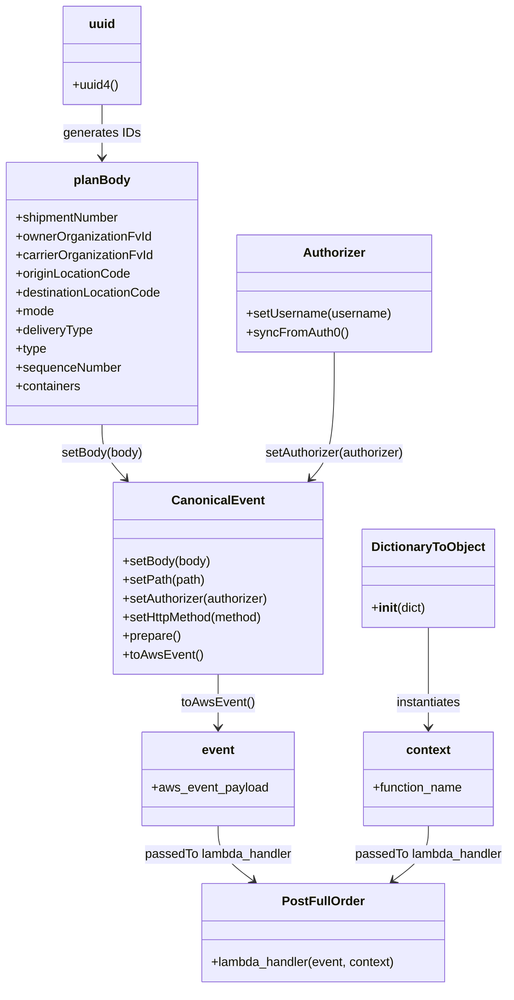

# Diagram: tools/ide_local_testing/localTest/test/partview/asn_order/postAsnOrderShortPlanned.py

> Auto-generated by Obscura crawlers

## Mermaid

### SVG

<svg id="container" width="652.439453125" xmlns="http://www.w3.org/2000/svg" class="classDiagram" height="1266" viewBox="0 0 652.439453125 1266" role="graphics-document document" aria-roledescription="class"><g><defs><marker id="container_class-aggregationStart" class="marker aggregation class" refX="18" refY="7" markerWidth="190" markerHeight="240" orient="auto"><path d="M 18,7 L9,13 L1,7 L9,1 Z"></path></marker></defs><defs><marker id="container_class-aggregationEnd" class="marker aggregation class" refX="1" refY="7" markerWidth="20" markerHeight="28" orient="auto"><path d="M 18,7 L9,13 L1,7 L9,1 Z"></path></marker></defs><defs><marker id="container_class-extensionStart" class="marker extension class" refX="18" refY="7" markerWidth="190" markerHeight="240" orient="auto"><path d="M 1,7 L18,13 V 1 Z"></path></marker></defs><defs><marker id="container_class-extensionEnd" class="marker extension class" refX="1" refY="7" markerWidth="20" markerHeight="28" orient="auto"><path d="M 1,1 V 13 L18,7 Z"></path></marker></defs><defs><marker id="container_class-compositionStart" class="marker composition class" refX="18" refY="7" markerWidth="190" markerHeight="240" orient="auto"><path d="M 18,7 L9,13 L1,7 L9,1 Z"></path></marker></defs><defs><marker id="container_class-compositionEnd" class="marker composition class" refX="1" refY="7" markerWidth="20" markerHeight="28" orient="auto"><path d="M 18,7 L9,13 L1,7 L9,1 Z"></path></marker></defs><defs><marker id="container_class-dependencyStart" class="marker dependency class" refX="6" refY="7" markerWidth="190" markerHeight="240" orient="auto"><path d="M 5,7 L9,13 L1,7 L9,1 Z"></path></marker></defs><defs><marker id="container_class-dependencyEnd" class="marker dependency class" refX="13" refY="7" markerWidth="20" markerHeight="28" orient="auto"><path d="M 18,7 L9,13 L14,7 L9,1 Z"></path></marker></defs><defs><marker id="container_class-lollipopStart" class="marker lollipop class" refX="13" refY="7" markerWidth="190" markerHeight="240" orient="auto"><circle stroke="black" fill="transparent" cx="7" cy="7" r="6"></circle></marker></defs><defs><marker id="container_class-lollipopEnd" class="marker lollipop class" refX="1" refY="7" markerWidth="190" markerHeight="240" orient="auto"><circle stroke="black" fill="transparent" cx="7" cy="7" r="6"></circle></marker></defs><g class="root"><g class="clusters"></g><g class="edgePaths"><path d="M132.094,134L132.094,140.167C132.094,146.333,132.094,158.667,132.094,170C132.094,181.333,132.094,191.667,132.094,196.833L132.094,202" id="id_uuid_planBody_1" class="edge-thickness-normal edge-pattern-solid relation" style=";;;" data-edge="true" data-et="edge" data-id="id_uuid_planBody_1" data-points="W3sieCI6MTMyLjA5Mzc1LCJ5IjoxMzR9LHsieCI6MTMyLjA5Mzc1LCJ5IjoxNzF9LHsieCI6MTMyLjA5Mzc1LCJ5IjoyMDh9XQ==" marker-end="url(#container_class-dependencyEnd)"></path><path d="M132.094,544L132.094,550.167C132.094,556.333,132.094,568.667,137.159,580.268C142.224,591.87,152.355,602.74,157.421,608.176L162.486,613.611" id="id_planBody_CanonicalEvent_2" class="edge-thickness-normal edge-pattern-solid relation" style=";;;" data-edge="true" data-et="edge" data-id="id_planBody_CanonicalEvent_2" data-points="W3sieCI6MTMyLjA5Mzc1LCJ5Ijo1NDR9LHsieCI6MTMyLjA5Mzc1LCJ5Ijo1ODF9LHsieCI6MTY2LjU3NjY0Nzk0OTIxODc0LCJ5Ijo2MTh9XQ==" marker-end="url(#container_class-dependencyEnd)"></path><path d="M430.324,451L430.324,472.667C430.324,494.333,430.324,537.667,425.259,564.768C420.193,591.87,410.063,602.74,404.997,608.176L399.932,613.611" id="id_Authorizer_CanonicalEvent_3" class="edge-thickness-normal edge-pattern-solid relation" style=";;;" data-edge="true" data-et="edge" data-id="id_Authorizer_CanonicalEvent_3" data-points="W3sieCI6NDMwLjMyNDIxODc1LCJ5Ijo0NTF9LHsieCI6NDMwLjMyNDIxODc1LCJ5Ijo1ODF9LHsieCI6Mzk1Ljg0MTMyMDgwMDc4MTI2LCJ5Ijo2MTh9XQ==" marker-end="url(#container_class-dependencyEnd)"></path><path d="M281.209,864L281.209,870.167C281.209,876.333,281.209,888.667,281.209,900C281.209,911.333,281.209,921.667,281.209,926.833L281.209,932" id="id_CanonicalEvent_event_4" class="edge-thickness-normal edge-pattern-solid relation" style=";;;" data-edge="true" data-et="edge" data-id="id_CanonicalEvent_event_4" data-points="W3sieCI6MjgxLjIwODk4NDM3NSwieSI6ODY0fSx7IngiOjI4MS4yMDg5ODQzNzUsInkiOjkwMX0seyJ4IjoyODEuMjA4OTg0Mzc1LCJ5Ijo5Mzh9XQ==" marker-end="url(#container_class-dependencyEnd)"></path><path d="M548.643,804L548.643,820.167C548.643,836.333,548.643,868.667,548.643,890C548.643,911.333,548.643,921.667,548.643,926.833L548.643,932" id="id_DictionaryToObject_context_5" class="edge-thickness-normal edge-pattern-solid relation" style=";;;" data-edge="true" data-et="edge" data-id="id_DictionaryToObject_context_5" data-points="W3sieCI6NTQ4LjY0MjU3ODEyNSwieSI6ODA0fSx7IngiOjU0OC42NDI1NzgxMjUsInkiOjkwMX0seyJ4Ijo1NDguNjQyNTc4MTI1LCJ5Ijo5Mzh9XQ==" marker-end="url(#container_class-dependencyEnd)"></path><path d="M281.209,1058L281.209,1064.167C281.209,1070.333,281.209,1082.667,288.654,1094.401C296.099,1106.136,310.989,1117.271,318.434,1122.839L325.879,1128.407" id="id_event_PostFullOrder_6" class="edge-thickness-normal edge-pattern-solid relation" style=";;;" data-edge="true" data-et="edge" data-id="id_event_PostFullOrder_6" data-points="W3sieCI6MjgxLjIwODk4NDM3NSwieSI6MTA1OH0seyJ4IjoyODEuMjA4OTg0Mzc1LCJ5IjoxMDk1fSx7IngiOjMzMC42ODQxOTkyMTg3NSwieSI6MTEzMn1d" marker-end="url(#container_class-dependencyEnd)"></path><path d="M548.643,1058L548.643,1064.167C548.643,1070.333,548.643,1082.667,541.198,1094.401C533.752,1106.136,518.862,1117.271,511.417,1122.839L503.972,1128.407" id="id_context_PostFullOrder_7" class="edge-thickness-normal edge-pattern-solid relation" style=";;;" data-edge="true" data-et="edge" data-id="id_context_PostFullOrder_7" data-points="W3sieCI6NTQ4LjY0MjU3ODEyNSwieSI6MTA1OH0seyJ4Ijo1NDguNjQyNTc4MTI1LCJ5IjoxMDk1fSx7IngiOjQ5OS4xNjczNjMyODEyNSwieSI6MTEzMn1d" marker-end="url(#container_class-dependencyEnd)"></path></g><g class="edgeLabels"><g class="edgeLabel" transform="translate(132.09375, 171)"><g class="label" data-id="id_uuid_planBody_1" transform="translate(-48.8359375, -12)"><foreignObject width="97.671875" height="24">

generates IDs

</foreignObject></g></g><g class="edgeLabel" transform="translate(132.09375, 581)"><g class="label" data-id="id_planBody_CanonicalEvent_2" transform="translate(-52.5703125, -12)"><foreignObject width="105.140625" height="24">

setBody(body)

</foreignObject></g></g><g class="edgeLabel" transform="translate(430.32421875, 581)"><g class="label" data-id="id_Authorizer_CanonicalEvent_3" transform="translate(-91.3828125, -12)"><foreignObject width="182.765625" height="24">

setAuthorizer(authorizer)

</foreignObject></g></g><g class="edgeLabel" transform="translate(281.208984375, 901)"><g class="label" data-id="id_CanonicalEvent_event_4" transform="translate(-46.640625, -12)"><foreignObject width="93.28125" height="24">

toAwsEvent()

</foreignObject></g></g><g class="edgeLabel" transform="translate(548.642578125, 901)"><g class="label" data-id="id_DictionaryToObject_context_5" transform="translate(-42.9140625, -12)"><foreignObject width="85.828125" height="24">

instantiates

</foreignObject></g></g><g class="edgeLabel" transform="translate(281.208984375, 1095)"><g class="label" data-id="id_event_PostFullOrder_6" transform="translate(-95.796875, -12)"><foreignObject width="191.59375" height="24">

passedTo lambda_handler

</foreignObject></g></g><g class="edgeLabel" transform="translate(548.642578125, 1095)"><g class="label" data-id="id_context_PostFullOrder_7" transform="translate(-95.796875, -12)"><foreignObject width="191.59375" height="24">

passedTo lambda_handler

</foreignObject></g></g></g><g class="nodes"><g class="node default" id="classId-PostFullOrder-0" transform="translate(414.92578125, 1195)"><g class="basic label-container"><path d="M-157.1171875 -63 L157.1171875 -63 L157.1171875 63 L-157.1171875 63" stroke="none" stroke-width="0" fill="#ECECFF" style=""></path><path d="M-157.1171875 -63 C-41.131811495813395 -63, 74.85356450837321 -63, 157.1171875 -63 M-157.1171875 -63 C-60.505246134830244 -63, 36.10669523033951 -63, 157.1171875 -63 M157.1171875 -63 C157.1171875 -17.07111665625623, 157.1171875 28.85776668748754, 157.1171875 63 M157.1171875 -63 C157.1171875 -13.07502914920147, 157.1171875 36.84994170159706, 157.1171875 63 M157.1171875 63 C66.0102175155616 63, -25.096752468876787 63, -157.1171875 63 M157.1171875 63 C48.65204399546107 63, -59.81309950907786 63, -157.1171875 63 M-157.1171875 63 C-157.1171875 23.3754052369871, -157.1171875 -16.249189526025802, -157.1171875 -63 M-157.1171875 63 C-157.1171875 19.218860665544383, -157.1171875 -24.562278668911233, -157.1171875 -63" stroke="#9370DB" stroke-width="1.3" fill="none" stroke-dasharray="0 0" style=""></path></g><g class="annotation-group text" transform="translate(0, -39)"></g><g class="label-group text" transform="translate(-50.046875, -39)"><g class="label" style="font-weight: bolder" transform="translate(0,-12)"><foreignObject width="100.09375" height="24">

PostFullOrder

</foreignObject></g></g><g class="members-group text" transform="translate(-145.1171875, 9)"></g><g class="methods-group text" transform="translate(-145.1171875, 39)"><g class="label" style="" transform="translate(0,-12)"><foreignObject width="240.1875" height="24">

+lambda_handler(event, context)

</foreignObject></g></g><g class="divider" style=""><path d="M-157.1171875 -15 C-88.41454468732817 -15, -19.71190187465635 -15, 157.1171875 -15 M-157.1171875 -15 C-85.92190574151775 -15, -14.726623983035495 -15, 157.1171875 -15" stroke="#9370DB" stroke-width="1.3" fill="none" stroke-dasharray="0 0" style=""></path></g><g class="divider" style=""><path d="M-157.1171875 9 C-56.22670420856508 9, 44.66377908286984 9, 157.1171875 9 M-157.1171875 9 C-77.90256834679276 9, 1.3120508064144758 9, 157.1171875 9" stroke="#9370DB" stroke-width="1.3" fill="none" stroke-dasharray="0 0" style=""></path></g></g><g class="node default" id="classId-CanonicalEvent-1" transform="translate(281.208984375, 741)"><g class="basic label-container"><path d="M-135.23046875 -123 L135.23046875 -123 L135.23046875 123 L-135.23046875 123" stroke="none" stroke-width="0" fill="#ECECFF" style=""></path><path d="M-135.23046875 -123 C-74.09500464501188 -123, -12.959540540023767 -123, 135.23046875 -123 M-135.23046875 -123 C-40.947851310978635 -123, 53.33476612804273 -123, 135.23046875 -123 M135.23046875 -123 C135.23046875 -61.59910986968701, 135.23046875 -0.19821973937402504, 135.23046875 123 M135.23046875 -123 C135.23046875 -32.717584585258976, 135.23046875 57.56483082948205, 135.23046875 123 M135.23046875 123 C41.03329422843386 123, -53.16388029313228 123, -135.23046875 123 M135.23046875 123 C41.03895229430228 123, -53.152564161395446 123, -135.23046875 123 M-135.23046875 123 C-135.23046875 48.28688965409131, -135.23046875 -26.426220691817377, -135.23046875 -123 M-135.23046875 123 C-135.23046875 46.780788110895855, -135.23046875 -29.43842377820829, -135.23046875 -123" stroke="#9370DB" stroke-width="1.3" fill="none" stroke-dasharray="0 0" style=""></path></g><g class="annotation-group text" transform="translate(0, -99)"></g><g class="label-group text" transform="translate(-55.7109375, -99)"><g class="label" style="font-weight: bolder" transform="translate(0,-12)"><foreignObject width="111.421875" height="24">

CanonicalEvent

</foreignObject></g></g><g class="members-group text" transform="translate(-123.23046875, -51)"></g><g class="methods-group text" transform="translate(-123.23046875, -21)"><g class="label" style="" transform="translate(0,-12)"><foreignObject width="113.125" height="24">

+setBody(body)

</foreignObject></g><g class="label" style="" transform="translate(0,12)"><foreignObject width="105.796875" height="24">

+setPath(path)

</foreignObject></g><g class="label" style="" transform="translate(0,36)"><foreignObject width="190.75" height="24">

+setAuthorizer(authorizer)

</foreignObject></g><g class="label" style="" transform="translate(0,60)"><foreignObject width="184" height="24">

+setHttpMethod(method)

</foreignObject></g><g class="label" style="" transform="translate(0,84)"><foreignObject width="74.75" height="24">

+prepare()

</foreignObject></g><g class="label" style="" transform="translate(0,108)"><foreignObject width="101.1875" height="24">

+toAwsEvent()

</foreignObject></g></g><g class="divider" style=""><path d="M-135.23046875 -75 C-55.011087319955834 -75, 25.20829411008833 -75, 135.23046875 -75 M-135.23046875 -75 C-29.889345812533705 -75, 75.45177712493259 -75, 135.23046875 -75" stroke="#9370DB" stroke-width="1.3" fill="none" stroke-dasharray="0 0" style=""></path></g><g class="divider" style=""><path d="M-135.23046875 -51 C-79.4641543304839 -51, -23.697839910967787 -51, 135.23046875 -51 M-135.23046875 -51 C-70.25964242579235 -51, -5.2888161015847 -51, 135.23046875 -51" stroke="#9370DB" stroke-width="1.3" fill="none" stroke-dasharray="0 0" style=""></path></g></g><g class="node default" id="classId-DictionaryToObject-2" transform="translate(548.642578125, 741)"><g class="basic label-container"><path d="M-82.203125 -63 L82.203125 -63 L82.203125 63 L-82.203125 63" stroke="none" stroke-width="0" fill="#ECECFF" style=""></path><path d="M-82.203125 -63 C-23.19899879916705 -63, 35.8051274016659 -63, 82.203125 -63 M-82.203125 -63 C-38.871431375187704 -63, 4.460262249624591 -63, 82.203125 -63 M82.203125 -63 C82.203125 -35.02929501803415, 82.203125 -7.058590036068296, 82.203125 63 M82.203125 -63 C82.203125 -27.43701964301175, 82.203125 8.125960713976497, 82.203125 63 M82.203125 63 C39.164490538435814 63, -3.874143923128372 63, -82.203125 63 M82.203125 63 C46.88481578286416 63, 11.566506565728318 63, -82.203125 63 M-82.203125 63 C-82.203125 28.498052168924623, -82.203125 -6.003895662150754, -82.203125 -63 M-82.203125 63 C-82.203125 26.783721443858298, -82.203125 -9.432557112283405, -82.203125 -63" stroke="#9370DB" stroke-width="1.3" fill="none" stroke-dasharray="0 0" style=""></path></g><g class="annotation-group text" transform="translate(0, -39)"></g><g class="label-group text" transform="translate(-70.109375, -39)"><g class="label" style="font-weight: bolder" transform="translate(0,-12)"><foreignObject width="140.21875" height="24">

DictionaryToObject

</foreignObject></g></g><g class="members-group text" transform="translate(-70.203125, 9)"></g><g class="methods-group text" transform="translate(-70.203125, 39)"><g class="label" style="" transform="translate(0,-12)"><foreignObject width="70.296875" height="24">

+<strong>init</strong>(dict)

</foreignObject></g></g><g class="divider" style=""><path d="M-82.203125 -15 C-48.53634116792884 -15, -14.869557335857678 -15, 82.203125 -15 M-82.203125 -15 C-17.13936747204383 -15, 47.92439005591234 -15, 82.203125 -15" stroke="#9370DB" stroke-width="1.3" fill="none" stroke-dasharray="0 0" style=""></path></g><g class="divider" style=""><path d="M-82.203125 9 C-22.45069455017935 9, 37.3017358996413 9, 82.203125 9 M-82.203125 9 C-35.74330195748259 9, 10.716521085034813 9, 82.203125 9" stroke="#9370DB" stroke-width="1.3" fill="none" stroke-dasharray="0 0" style=""></path></g></g><g class="node default" id="classId-Authorizer-3" transform="translate(430.32421875, 376)"><g class="basic label-container"><path d="M-124.13671875 -75 L124.13671875 -75 L124.13671875 75 L-124.13671875 75" stroke="none" stroke-width="0" fill="#ECECFF" style=""></path><path d="M-124.13671875 -75 C-42.48364601289775 -75, 39.1694267242045 -75, 124.13671875 -75 M-124.13671875 -75 C-63.037320033795716 -75, -1.9379213175914316 -75, 124.13671875 -75 M124.13671875 -75 C124.13671875 -40.00284822453583, 124.13671875 -5.005696449071664, 124.13671875 75 M124.13671875 -75 C124.13671875 -38.11568769595578, 124.13671875 -1.2313753919115555, 124.13671875 75 M124.13671875 75 C72.31565947487748 75, 20.494600199754956 75, -124.13671875 75 M124.13671875 75 C35.724465735319754 75, -52.68778727936049 75, -124.13671875 75 M-124.13671875 75 C-124.13671875 39.299726174785896, -124.13671875 3.5994523495717914, -124.13671875 -75 M-124.13671875 75 C-124.13671875 26.124510993128524, -124.13671875 -22.75097801374295, -124.13671875 -75" stroke="#9370DB" stroke-width="1.3" fill="none" stroke-dasharray="0 0" style=""></path></g><g class="annotation-group text" transform="translate(0, -51)"></g><g class="label-group text" transform="translate(-38.3671875, -51)"><g class="label" style="font-weight: bolder" transform="translate(0,-12)"><foreignObject width="76.734375" height="24">

Authorizer

</foreignObject></g></g><g class="members-group text" transform="translate(-112.13671875, -3)"></g><g class="methods-group text" transform="translate(-112.13671875, 27)"><g class="label" style="" transform="translate(0,-12)"><foreignObject width="185.90625" height="24">

+setUsername(username)

</foreignObject></g><g class="label" style="" transform="translate(0,12)"><foreignObject width="129.0625" height="24">

+syncFromAuth0()

</foreignObject></g></g><g class="divider" style=""><path d="M-124.13671875 -27 C-38.02488987932253 -27, 48.08693899135494 -27, 124.13671875 -27 M-124.13671875 -27 C-25.24316451739854 -27, 73.65038971520292 -27, 124.13671875 -27" stroke="#9370DB" stroke-width="1.3" fill="none" stroke-dasharray="0 0" style=""></path></g><g class="divider" style=""><path d="M-124.13671875 -3 C-37.321207562026274 -3, 49.49430362594745 -3, 124.13671875 -3 M-124.13671875 -3 C-44.58881129598798 -3, 34.95909615802404 -3, 124.13671875 -3" stroke="#9370DB" stroke-width="1.3" fill="none" stroke-dasharray="0 0" style=""></path></g></g><g class="node default" id="classId-uuid-4" transform="translate(132.09375, 71)"><g class="basic label-container"><path d="M-49.89453125 -63 L49.89453125 -63 L49.89453125 63 L-49.89453125 63" stroke="none" stroke-width="0" fill="#ECECFF" style=""></path><path d="M-49.89453125 -63 C-22.988623589291652 -63, 3.917284071416695 -63, 49.89453125 -63 M-49.89453125 -63 C-20.683291424505843 -63, 8.527948400988315 -63, 49.89453125 -63 M49.89453125 -63 C49.89453125 -24.971979525359878, 49.89453125 13.056040949280245, 49.89453125 63 M49.89453125 -63 C49.89453125 -24.749050242750577, 49.89453125 13.501899514498845, 49.89453125 63 M49.89453125 63 C28.17935178072095 63, 6.464172311441899 63, -49.89453125 63 M49.89453125 63 C14.851370643421795 63, -20.19178996315641 63, -49.89453125 63 M-49.89453125 63 C-49.89453125 34.324134698521334, -49.89453125 5.648269397042668, -49.89453125 -63 M-49.89453125 63 C-49.89453125 13.592408895972248, -49.89453125 -35.815182208055504, -49.89453125 -63" stroke="#9370DB" stroke-width="1.3" fill="none" stroke-dasharray="0 0" style=""></path></g><g class="annotation-group text" transform="translate(0, -39)"></g><g class="label-group text" transform="translate(-16.2109375, -39)"><g class="label" style="font-weight: bolder" transform="translate(0,-12)"><foreignObject width="32.421875" height="24">

uuid

</foreignObject></g></g><g class="members-group text" transform="translate(-37.89453125, 9)"></g><g class="methods-group text" transform="translate(-37.89453125, 39)"><g class="label" style="" transform="translate(0,-12)"><foreignObject width="59.578125" height="24">

+uuid4()

</foreignObject></g></g><g class="divider" style=""><path d="M-49.89453125 -15 C-18.909948000362707 -15, 12.074635249274586 -15, 49.89453125 -15 M-49.89453125 -15 C-23.309536106424524 -15, 3.275459037150952 -15, 49.89453125 -15" stroke="#9370DB" stroke-width="1.3" fill="none" stroke-dasharray="0 0" style=""></path></g><g class="divider" style=""><path d="M-49.89453125 9 C-23.72870256632367 9, 2.437126117352662 9, 49.89453125 9 M-49.89453125 9 C-19.57062055711232 9, 10.753290135775359 9, 49.89453125 9" stroke="#9370DB" stroke-width="1.3" fill="none" stroke-dasharray="0 0" style=""></path></g></g><g class="node default" id="classId-planBody-5" transform="translate(132.09375, 376)"><g class="basic label-container"><path d="M-124.09375 -168 L124.09375 -168 L124.09375 168 L-124.09375 168" stroke="none" stroke-width="0" fill="#ECECFF" style=""></path><path d="M-124.09375 -168 C-51.05058448213238 -168, 21.992581035735242 -168, 124.09375 -168 M-124.09375 -168 C-28.98326202550797 -168, 66.12722594898406 -168, 124.09375 -168 M124.09375 -168 C124.09375 -70.04645586948662, 124.09375 27.907088261026757, 124.09375 168 M124.09375 -168 C124.09375 -77.0023077359929, 124.09375 13.995384528014199, 124.09375 168 M124.09375 168 C65.02223158284937 168, 5.95071316569873 168, -124.09375 168 M124.09375 168 C55.07247605246941 168, -13.948797895061176 168, -124.09375 168 M-124.09375 168 C-124.09375 84.80596675474038, -124.09375 1.6119335094807639, -124.09375 -168 M-124.09375 168 C-124.09375 63.25929173858373, -124.09375 -41.481416522832546, -124.09375 -168" stroke="#9370DB" stroke-width="1.3" fill="none" stroke-dasharray="0 0" style=""></path></g><g class="annotation-group text" transform="translate(0, -144)"></g><g class="label-group text" transform="translate(-34.671875, -144)"><g class="label" style="font-weight: bolder" transform="translate(0,-12)"><foreignObject width="69.34375" height="24">

planBody

</foreignObject></g></g><g class="members-group text" transform="translate(-112.09375, -96)"><g class="label" style="" transform="translate(0,-12)"><foreignObject width="134.796875" height="24">

+shipmentNumber

</foreignObject></g><g class="label" style="" transform="translate(0,12)"><foreignObject width="174.609375" height="24">

+ownerOrganizationFvId

</foreignObject></g><g class="label" style="" transform="translate(0,36)"><foreignObject width="177.484375" height="24">

+carrierOrganizationFvId

</foreignObject></g><g class="label" style="" transform="translate(0,60)"><foreignObject width="148.609375" height="24">

+originLocationCode

</foreignObject></g><g class="label" style="" transform="translate(0,84)"><foreignObject width="189.515625" height="24">

+destinationLocationCode

</foreignObject></g><g class="label" style="" transform="translate(0,108)"><foreignObject width="49.328125" height="24">

+mode

</foreignObject></g><g class="label" style="" transform="translate(0,132)"><foreignObject width="99.78125" height="24">

+deliveryType

</foreignObject></g><g class="label" style="" transform="translate(0,156)"><foreignObject width="39.703125" height="24">

+type

</foreignObject></g><g class="label" style="" transform="translate(0,180)"><foreignObject width="135.5625" height="24">

+sequenceNumber

</foreignObject></g><g class="label" style="" transform="translate(0,204)"><foreignObject width="84.421875" height="24">

+containers

</foreignObject></g></g><g class="methods-group text" transform="translate(-112.09375, 168)"></g><g class="divider" style=""><path d="M-124.09375 -120 C-56.342156735386936 -120, 11.409436529226127 -120, 124.09375 -120 M-124.09375 -120 C-32.60183189681767 -120, 58.89008620636466 -120, 124.09375 -120" stroke="#9370DB" stroke-width="1.3" fill="none" stroke-dasharray="0 0" style=""></path></g><g class="divider" style=""><path d="M-124.09375 144 C-70.87913667976002 144, -17.664523359520032 144, 124.09375 144 M-124.09375 144 C-47.3085440007893 144, 29.476661998421406 144, 124.09375 144" stroke="#9370DB" stroke-width="1.3" fill="none" stroke-dasharray="0 0" style=""></path></g></g><g class="node default" id="classId-event-6" transform="translate(281.208984375, 998)"><g class="basic label-container"><path d="M-96.9609375 -60 L96.9609375 -60 L96.9609375 60 L-96.9609375 60" stroke="none" stroke-width="0" fill="#ECECFF" style=""></path><path d="M-96.9609375 -60 C-26.040839617959392 -60, 44.879258264081216 -60, 96.9609375 -60 M-96.9609375 -60 C-40.44450839524837 -60, 16.07192070950326 -60, 96.9609375 -60 M96.9609375 -60 C96.9609375 -29.331122211637084, 96.9609375 1.337755576725833, 96.9609375 60 M96.9609375 -60 C96.9609375 -25.302208678675683, 96.9609375 9.395582642648634, 96.9609375 60 M96.9609375 60 C25.810868419634446 60, -45.33920066073111 60, -96.9609375 60 M96.9609375 60 C31.91905008211576 60, -33.12283733576848 60, -96.9609375 60 M-96.9609375 60 C-96.9609375 28.869918104564498, -96.9609375 -2.2601637908710046, -96.9609375 -60 M-96.9609375 60 C-96.9609375 31.42286902405498, -96.9609375 2.8457380481099577, -96.9609375 -60" stroke="#9370DB" stroke-width="1.3" fill="none" stroke-dasharray="0 0" style=""></path></g><g class="annotation-group text" transform="translate(0, -36)"></g><g class="label-group text" transform="translate(-20.515625, -36)"><g class="label" style="font-weight: bolder" transform="translate(0,-12)"><foreignObject width="41.03125" height="24">

event

</foreignObject></g></g><g class="members-group text" transform="translate(-84.9609375, 12)"><g class="label" style="" transform="translate(0,-12)"><foreignObject width="149.40625" height="24">

+aws_event_payload

</foreignObject></g></g><g class="methods-group text" transform="translate(-84.9609375, 60)"></g><g class="divider" style=""><path d="M-96.9609375 -12 C-19.496960299029055 -12, 57.96701690194189 -12, 96.9609375 -12 M-96.9609375 -12 C-25.262645674796744 -12, 46.43564615040651 -12, 96.9609375 -12" stroke="#9370DB" stroke-width="1.3" fill="none" stroke-dasharray="0 0" style=""></path></g><g class="divider" style=""><path d="M-96.9609375 36 C-24.711973846374136 36, 47.53698980725173 36, 96.9609375 36 M-96.9609375 36 C-25.769952477911133 36, 45.421032544177734 36, 96.9609375 36" stroke="#9370DB" stroke-width="1.3" fill="none" stroke-dasharray="0 0" style=""></path></g></g><g class="node default" id="classId-context-7" transform="translate(548.642578125, 998)"><g class="basic label-container"><path d="M-84.34375 -60 L84.34375 -60 L84.34375 60 L-84.34375 60" stroke="none" stroke-width="0" fill="#ECECFF" style=""></path><path d="M-84.34375 -60 C-39.07108644240912 -60, 6.201577115181763 -60, 84.34375 -60 M-84.34375 -60 C-27.353495281724697 -60, 29.636759436550605 -60, 84.34375 -60 M84.34375 -60 C84.34375 -29.193682383199743, 84.34375 1.612635233600514, 84.34375 60 M84.34375 -60 C84.34375 -32.97873238313487, 84.34375 -5.95746476626973, 84.34375 60 M84.34375 60 C43.30620825276849 60, 2.2686665055369843 60, -84.34375 60 M84.34375 60 C43.97328423375494 60, 3.602818467509877 60, -84.34375 60 M-84.34375 60 C-84.34375 28.013727377105013, -84.34375 -3.9725452457899735, -84.34375 -60 M-84.34375 60 C-84.34375 18.929252561402954, -84.34375 -22.14149487719409, -84.34375 -60" stroke="#9370DB" stroke-width="1.3" fill="none" stroke-dasharray="0 0" style=""></path></g><g class="annotation-group text" transform="translate(0, -36)"></g><g class="label-group text" transform="translate(-27.40625, -36)"><g class="label" style="font-weight: bolder" transform="translate(0,-12)"><foreignObject width="54.8125" height="24">

context

</foreignObject></g></g><g class="members-group text" transform="translate(-72.34375, 12)"><g class="label" style="" transform="translate(0,-12)"><foreignObject width="117.28125" height="24">

+function_name

</foreignObject></g></g><g class="methods-group text" transform="translate(-72.34375, 60)"></g><g class="divider" style=""><path d="M-84.34375 -12 C-31.13740950338064 -12, 22.068930993238723 -12, 84.34375 -12 M-84.34375 -12 C-33.055657788388565 -12, 18.23243442322287 -12, 84.34375 -12" stroke="#9370DB" stroke-width="1.3" fill="none" stroke-dasharray="0 0" style=""></path></g><g class="divider" style=""><path d="M-84.34375 36 C-33.40925545319518 36, 17.525239093609642 36, 84.34375 36 M-84.34375 36 C-32.248438344256364 36, 19.846873311487272 36, 84.34375 36" stroke="#9370DB" stroke-width="1.3" fill="none" stroke-dasharray="0 0" style=""></path></g></g></g></g></g></svg>
