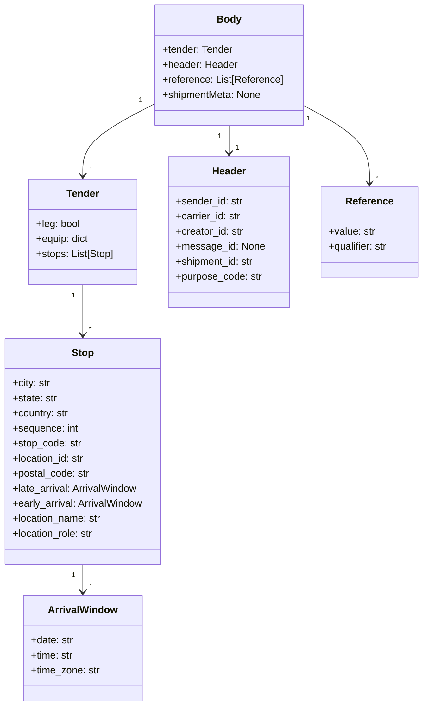

# Diagram: tools/ide_local_testing/localTest/test/partview/carrierShipmentWithParts/createShipmentWithParts.py


> Auto-generated by Obscura crawlers

## Diagram 1

```mermaid
flowchart TD
    RS[RandomString.randomAlpaNumericString] -->|generates| ShipmentId[shipmentId]
    ShipmentId --> Body{body}
    subgraph TenderObject ["body.tender"]
        TLEG[leg: False]
        TEQUIP[equip: {}]
        TSTOPS[stops: List]
        THEADER[header]
        TREF[reference: List]
    end
    Body --> TenderObject
    TSTOPS --> Stop1[Stop 1: Tilbury\nearly/late arrival]
    TSTOPS --> Stop2[Stop 2: Portland\nearly/late arrival]
    THEADER --> Header[header: sender_id, carrier_id,\ncreator_id, shipment_id, purpose_code]
    TREF --> References[reference items...]
    AuthorizerObj[Authorizer().setUsername(...)\n.syncFromAuth0().setActorType("system")] --> Auth[authorizer]
    Auth --> CE[CanonicalEvent]
    CE -->|setBody(body)\n.setHttpMethod("PUT")\n.prepare()\n.toAwsEvent()| AwsEvent[event]
    AwsEvent --> Submit[submitTender (lambda_handler)]
    Submit --> PrintOuts["print(shipmentId)\nprint(submitTender(...))"]
```

> SVG rendering failed for this diagram.

## Diagram 2



### SVG

<svg id="container" width="674.875" xmlns="http://www.w3.org/2000/svg" class="classDiagram" height="1126" viewBox="0 0 674.875 1126" role="graphics-document document" aria-roledescription="class"><style>#container{font-family:"trebuchet ms",verdana,arial,sans-serif;font-size:16px;fill:#333;}@keyframes edge-animation-frame{from{stroke-dashoffset:0;}}@keyframes dash{to{stroke-dashoffset:0;}}#container .edge-animation-slow{stroke-dasharray:9,5!important;stroke-dashoffset:900;animation:dash 50s linear infinite;stroke-linecap:round;}#container .edge-animation-fast{stroke-dasharray:9,5!important;stroke-dashoffset:900;animation:dash 20s linear infinite;stroke-linecap:round;}#container .error-icon{fill:#552222;}#container .error-text{fill:#552222;stroke:#552222;}#container .edge-thickness-normal{stroke-width:1px;}#container .edge-thickness-thick{stroke-width:3.5px;}#container .edge-pattern-solid{stroke-dasharray:0;}#container .edge-thickness-invisible{stroke-width:0;fill:none;}#container .edge-pattern-dashed{stroke-dasharray:3;}#container .edge-pattern-dotted{stroke-dasharray:2;}#container .marker{fill:#333333;stroke:#333333;}#container .marker.cross{stroke:#333333;}#container svg{font-family:"trebuchet ms",verdana,arial,sans-serif;font-size:16px;}#container p{margin:0;}#container g.classGroup text{fill:#9370DB;stroke:none;font-family:"trebuchet ms",verdana,arial,sans-serif;font-size:10px;}#container g.classGroup text .title{font-weight:bolder;}#container .nodeLabel,#container .edgeLabel{color:#131300;}#container .edgeLabel .label rect{fill:#ECECFF;}#container .label text{fill:#131300;}#container .labelBkg{background:#ECECFF;}#container .edgeLabel .label span{background:#ECECFF;}#container .classTitle{font-weight:bolder;}#container .node rect,#container .node circle,#container .node ellipse,#container .node polygon,#container .node path{fill:#ECECFF;stroke:#9370DB;stroke-width:1px;}#container .divider{stroke:#9370DB;stroke-width:1;}#container g.clickable{cursor:pointer;}#container g.classGroup rect{fill:#ECECFF;stroke:#9370DB;}#container g.classGroup line{stroke:#9370DB;stroke-width:1;}#container .classLabel .box{stroke:none;stroke-width:0;fill:#ECECFF;opacity:0.5;}#container .classLabel .label{fill:#9370DB;font-size:10px;}#container .relation{stroke:#333333;stroke-width:1;fill:none;}#container .dashed-line{stroke-dasharray:3;}#container .dotted-line{stroke-dasharray:1 2;}#container #compositionStart,#container .composition{fill:#333333!important;stroke:#333333!important;stroke-width:1;}#container #compositionEnd,#container .composition{fill:#333333!important;stroke:#333333!important;stroke-width:1;}#container #dependencyStart,#container .dependency{fill:#333333!important;stroke:#333333!important;stroke-width:1;}#container #dependencyStart,#container .dependency{fill:#333333!important;stroke:#333333!important;stroke-width:1;}#container #extensionStart,#container .extension{fill:transparent!important;stroke:#333333!important;stroke-width:1;}#container #extensionEnd,#container .extension{fill:transparent!important;stroke:#333333!important;stroke-width:1;}#container #aggregationStart,#container .aggregation{fill:transparent!important;stroke:#333333!important;stroke-width:1;}#container #aggregationEnd,#container .aggregation{fill:transparent!important;stroke:#333333!important;stroke-width:1;}#container #lollipopStart,#container .lollipop{fill:#ECECFF!important;stroke:#333333!important;stroke-width:1;}#container #lollipopEnd,#container .lollipop{fill:#ECECFF!important;stroke:#333333!important;stroke-width:1;}#container .edgeTerminals{font-size:11px;line-height:initial;}#container .classTitleText{text-anchor:middle;font-size:18px;fill:#333;}#container .label-icon{display:inline-block;height:1em;overflow:visible;vertical-align:-0.125em;}#container .node .label-icon path{fill:currentColor;stroke:revert;stroke-width:revert;}#container :root{--mermaid-font-family:"trebuchet ms",verdana,arial,sans-serif;}</style><g><defs><marker id="container_class-aggregationStart" class="marker aggregation class" refX="18" refY="7" markerWidth="190" markerHeight="240" orient="auto"><path d="M 18,7 L9,13 L1,7 L9,1 Z"></path></marker></defs><defs><marker id="container_class-aggregationEnd" class="marker aggregation class" refX="1" refY="7" markerWidth="20" markerHeight="28" orient="auto"><path d="M 18,7 L9,13 L1,7 L9,1 Z"></path></marker></defs><defs><marker id="container_class-extensionStart" class="marker extension class" refX="18" refY="7" markerWidth="190" markerHeight="240" orient="auto"><path d="M 1,7 L18,13 V 1 Z"></path></marker></defs><defs><marker id="container_class-extensionEnd" class="marker extension class" refX="1" refY="7" markerWidth="20" markerHeight="28" orient="auto"><path d="M 1,1 V 13 L18,7 Z"></path></marker></defs><defs><marker id="container_class-compositionStart" class="marker composition class" refX="18" refY="7" markerWidth="190" markerHeight="240" orient="auto"><path d="M 18,7 L9,13 L1,7 L9,1 Z"></path></marker></defs><defs><marker id="container_class-compositionEnd" class="marker composition class" refX="1" refY="7" markerWidth="20" markerHeight="28" orient="auto"><path d="M 18,7 L9,13 L1,7 L9,1 Z"></path></marker></defs><defs><marker id="container_class-dependencyStart" class="marker dependency class" refX="6" refY="7" markerWidth="190" markerHeight="240" orient="auto"><path d="M 5,7 L9,13 L1,7 L9,1 Z"></path></marker></defs><defs><marker id="container_class-dependencyEnd" class="marker dependency class" refX="13" refY="7" markerWidth="20" markerHeight="28" orient="auto"><path d="M 18,7 L9,13 L14,7 L9,1 Z"></path></marker></defs><defs><marker id="container_class-lollipopStart" class="marker lollipop class" refX="13" refY="7" markerWidth="190" markerHeight="240" orient="auto"><circle stroke="black" fill="transparent" cx="7" cy="7" r="6"></circle></marker></defs><defs><marker id="container_class-lollipopEnd" class="marker lollipop class" refX="1" refY="7" markerWidth="190" markerHeight="240" orient="auto"><circle stroke="black" fill="transparent" cx="7" cy="7" r="6"></circle></marker></defs><g class="root"><g class="clusters"></g><g class="edgePaths"><path d="M247.922,165.317L228.88,175.264C209.839,185.212,171.755,205.106,152.714,224.22C133.672,243.333,133.672,261.667,133.672,270.833L133.672,280" id="id_Body_Tender_1" class="edge-thickness-normal edge-pattern-solid relation" style=";;;" data-edge="true" data-et="edge" data-id="id_Body_Tender_1" data-points="W3sieCI6MjQ3LjkyMTg3NSwieSI6MTY1LjMxNzI1MDQ1MTExODk1fSx7IngiOjEzMy42NzE4NzUsInkiOjIyNX0seyJ4IjoxMzMuNjcxODc1LCJ5IjoyODZ9XQ==" marker-end="url(#container_class-dependencyEnd)"></path><path d="M133.672,454L133.672,464.167C133.672,474.333,133.672,494.667,133.672,508C133.672,521.333,133.672,527.667,133.672,530.833L133.672,534" id="id_Tender_Stop_2" class="edge-thickness-normal edge-pattern-solid relation" style=";;;" data-edge="true" data-et="edge" data-id="id_Tender_Stop_2" data-points="W3sieCI6MTMzLjY3MTg3NSwieSI6NDU0fSx7IngiOjEzMy42NzE4NzUsInkiOjUxNX0seyJ4IjoxMzMuNjcxODc1LCJ5Ijo1NDB9XQ==" marker-end="url(#container_class-dependencyEnd)"></path><path d="M133.672,900L133.672,904.167C133.672,908.333,133.672,916.667,133.672,924C133.672,931.333,133.672,937.667,133.672,940.833L133.672,944" id="id_Stop_ArrivalWindow_3" class="edge-thickness-normal edge-pattern-solid relation" style=";;;" data-edge="true" data-et="edge" data-id="id_Stop_ArrivalWindow_3" data-points="W3sieCI6MTMzLjY3MTg3NSwieSI6OTAwfSx7IngiOjEzMy42NzE4NzUsInkiOjkyNX0seyJ4IjoxMzMuNjcxODc1LCJ5Ijo5NTB9XQ==" marker-end="url(#container_class-dependencyEnd)"></path><path d="M365.301,200L365.301,204.167C365.301,208.333,365.301,216.667,365.301,224C365.301,231.333,365.301,237.667,365.301,240.833L365.301,244" id="id_Body_Header_4" class="edge-thickness-normal edge-pattern-solid relation" style=";;;" data-edge="true" data-et="edge" data-id="id_Body_Header_4" data-points="W3sieCI6MzY1LjMwMDc4MTI1LCJ5IjoyMDB9LHsieCI6MzY1LjMwMDc4MTI1LCJ5IjoyMjV9LHsieCI6MzY1LjMwMDc4MTI1LCJ5IjoyNTB9XQ==" marker-end="url(#container_class-dependencyEnd)"></path><path d="M482.68,167.652L500.305,177.21C517.931,186.768,553.182,205.884,570.808,226.609C588.434,247.333,588.434,269.667,588.434,280.833L588.434,292" id="id_Body_Reference_5" class="edge-thickness-normal edge-pattern-solid relation" style=";;;" data-edge="true" data-et="edge" data-id="id_Body_Reference_5" data-points="W3sieCI6NDgyLjY3OTY4NzUsInkiOjE2Ny42NTE5OTA0NzY1MjM5M30seyJ4Ijo1ODguNDMzNTkzNzUsInkiOjIyNX0seyJ4Ijo1ODguNDMzNTkzNzUsInkiOjI5OH1d" marker-end="url(#container_class-dependencyEnd)"></path></g><g class="edgeLabels"><g class="edgeLabel"><g class="label" data-id="id_Body_Tender_1" transform="translate(0, 0)"><foreignObject width="0" height="0"><div xmlns="http://www.w3.org/1999/xhtml" class="labelBkg" style="display: table-cell; white-space: nowrap; line-height: 1.5; max-width: 200px; text-align: center;"><span class="edgeLabel"></span></div></foreignObject></g></g><g class="edgeLabel"><g class="label" data-id="id_Tender_Stop_2" transform="translate(0, 0)"><foreignObject width="0" height="0"><div xmlns="http://www.w3.org/1999/xhtml" class="labelBkg" style="display: table-cell; white-space: nowrap; line-height: 1.5; max-width: 200px; text-align: center;"><span class="edgeLabel"></span></div></foreignObject></g></g><g class="edgeLabel"><g class="label" data-id="id_Stop_ArrivalWindow_3" transform="translate(0, 0)"><foreignObject width="0" height="0"><div xmlns="http://www.w3.org/1999/xhtml" class="labelBkg" style="display: table-cell; white-space: nowrap; line-height: 1.5; max-width: 200px; text-align: center;"><span class="edgeLabel"></span></div></foreignObject></g></g><g class="edgeLabel"><g class="label" data-id="id_Body_Header_4" transform="translate(0, 0)"><foreignObject width="0" height="0"><div xmlns="http://www.w3.org/1999/xhtml" class="labelBkg" style="display: table-cell; white-space: nowrap; line-height: 1.5; max-width: 200px; text-align: center;"><span class="edgeLabel"></span></div></foreignObject></g></g><g class="edgeLabel"><g class="label" data-id="id_Body_Reference_5" transform="translate(0, 0)"><foreignObject width="0" height="0"><div xmlns="http://www.w3.org/1999/xhtml" class="labelBkg" style="display: table-cell; white-space: nowrap; line-height: 1.5; max-width: 200px; text-align: center;"><span class="edgeLabel"></span></div></foreignObject></g></g><g class="edgeTerminals" transform="translate(225.46550514319605, 160.1248180785522)"><g class="inner" transform="translate(0, 0)"><foreignObject style="width: 9px; height: 12px;"><div xmlns="http://www.w3.org/1999/xhtml" style="display: inline-block; padding-right: 1px; white-space: nowrap;"><span class="edgeLabel">1</span></div></foreignObject></g></g><g class="edgeTerminals" transform="translate(118.67187750000015, 471.5000021428571)"><g class="inner" transform="translate(0, 0)"><foreignObject style="width: 9px; height: 12px;"><div xmlns="http://www.w3.org/1999/xhtml" style="display: inline-block; padding-right: 1px; white-space: nowrap;"><span class="edgeLabel">1</span></div></foreignObject></g></g><g class="edgeTerminals" transform="translate(118.67187750000015, 917.5000021428572)"><g class="inner" transform="translate(0, 0)"><foreignObject style="width: 9px; height: 12px;"><div xmlns="http://www.w3.org/1999/xhtml" style="display: inline-block; padding-right: 1px; white-space: nowrap;"><span class="edgeLabel">1</span></div></foreignObject></g></g><g class="edgeTerminals" transform="translate(350.300780625, 217.4999994642857)"><g class="inner" transform="translate(0, 0)"><foreignObject style="width: 9px; height: 12px;"><div xmlns="http://www.w3.org/1999/xhtml" style="display: inline-block; padding-right: 1px; white-space: nowrap;"><span class="edgeLabel">1</span></div></foreignObject></g></g><g class="edgeTerminals" transform="translate(490.9128810260872, 189.18021798055753)"><g class="inner" transform="translate(0, 0)"><foreignObject style="width: 9px; height: 12px;"><div xmlns="http://www.w3.org/1999/xhtml" style="display: inline-block; padding-right: 1px; white-space: nowrap;"><span class="edgeLabel">1</span></div></foreignObject></g></g><g class="edgeTerminals" transform="translate(143.67187749999985, 263.5000021428571)"><g class="inner" transform="translate(0, 0)"></g><foreignObject style="width: 9px; height: 12px;"><div xmlns="http://www.w3.org/1999/xhtml" style="display: inline-block; padding-right: 1px; white-space: nowrap;"><span class="edgeLabel">1</span></div></foreignObject></g><g class="edgeTerminals" transform="translate(143.67187749999985, 517.5000021428572)"><g class="inner" transform="translate(0, 0)"></g><foreignObject style="width: 9px; height: 12px;"><div xmlns="http://www.w3.org/1999/xhtml" style="display: inline-block; padding-right: 1px; white-space: nowrap;"><span class="edgeLabel">*</span></div></foreignObject></g><g class="edgeTerminals" transform="translate(143.67187749999985, 927.5000021428572)"><g class="inner" transform="translate(0, 0)"></g><foreignObject style="width: 9px; height: 12px;"><div xmlns="http://www.w3.org/1999/xhtml" style="display: inline-block; padding-right: 1px; white-space: nowrap;"><span class="edgeLabel">1</span></div></foreignObject></g><g class="edgeTerminals" transform="translate(375.300780625, 227.4999994642857)"><g class="inner" transform="translate(0, 0)"></g><foreignObject style="width: 9px; height: 12px;"><div xmlns="http://www.w3.org/1999/xhtml" style="display: inline-block; padding-right: 1px; white-space: nowrap;"><span class="edgeLabel">1</span></div></foreignObject></g><g class="edgeTerminals" transform="translate(598.4335918749999, 275.49999839285715)"><g class="inner" transform="translate(0, 0)"></g><foreignObject style="width: 9px; height: 12px;"><div xmlns="http://www.w3.org/1999/xhtml" style="display: inline-block; padding-right: 1px; white-space: nowrap;"><span class="edgeLabel">*</span></div></foreignObject></g></g><g class="nodes"><g class="node default" id="classId-Body-0" transform="translate(365.30078125, 104)"><g class="basic label-container"><path d="M-117.37890625 -96 L117.37890625 -96 L117.37890625 96 L-117.37890625 96" stroke="none" stroke-width="0" fill="#ECECFF" style=""></path><path d="M-117.37890625 -96 C-38.157349370706854 -96, 41.06420750858629 -96, 117.37890625 -96 M-117.37890625 -96 C-28.09674492430659 -96, 61.18541640138682 -96, 117.37890625 -96 M117.37890625 -96 C117.37890625 -31.700574214018744, 117.37890625 32.59885157196251, 117.37890625 96 M117.37890625 -96 C117.37890625 -21.99888668079889, 117.37890625 52.00222663840222, 117.37890625 96 M117.37890625 96 C58.83124059268432 96, 0.2835749353686339 96, -117.37890625 96 M117.37890625 96 C51.07283453565097 96, -15.233237178698062 96, -117.37890625 96 M-117.37890625 96 C-117.37890625 35.716819853073616, -117.37890625 -24.566360293852767, -117.37890625 -96 M-117.37890625 96 C-117.37890625 39.49103868035227, -117.37890625 -17.017922639295463, -117.37890625 -96" stroke="#9370DB" stroke-width="1.3" fill="none" stroke-dasharray="0 0" style=""></path></g><g class="annotation-group text" transform="translate(0, -72)"></g><g class="label-group text" transform="translate(-18.5546875, -72)"><g class="label" style="font-weight: bolder" transform="translate(0,-12)"><foreignObject width="37.109375" height="24"><div xmlns="http://www.w3.org/1999/xhtml" style="display: table-cell; white-space: nowrap; line-height: 1.5; max-width: 87px; text-align: center;"><span class="nodeLabel markdown-node-label" style=""><p>Body</p></span></div></foreignObject></g></g><g class="members-group text" transform="translate(-105.37890625, -24)"><g class="label" style="" transform="translate(0,-12)"><foreignObject width="114.203125" height="24"><div xmlns="http://www.w3.org/1999/xhtml" style="display: table-cell; white-space: nowrap; line-height: 1.5; max-width: 172px; text-align: center;"><span class="nodeLabel markdown-node-label" style=""><p>+tender: Tender</p></span></div></foreignObject></g><g class="label" style="" transform="translate(0,12)"><foreignObject width="119.9375" height="24"><div xmlns="http://www.w3.org/1999/xhtml" style="display: table-cell; white-space: nowrap; line-height: 1.5; max-width: 178px; text-align: center;"><span class="nodeLabel markdown-node-label" style=""><p>+header: Header</p></span></div></foreignObject></g><g class="label" style="" transform="translate(0,36)"><foreignObject width="192.203125" height="24"><div xmlns="http://www.w3.org/1999/xhtml" style="display: table-cell; white-space: nowrap; line-height: 1.5; max-width: 250px; text-align: center;"><span class="nodeLabel markdown-node-label" style=""><p>+reference: List[Reference]</p></span></div></foreignObject></g><g class="label" style="" transform="translate(0,60)"><foreignObject width="158.421875" height="24"><div xmlns="http://www.w3.org/1999/xhtml" style="display: table-cell; white-space: nowrap; line-height: 1.5; max-width: 216px; text-align: center;"><span class="nodeLabel markdown-node-label" style=""><p>+shipmentMeta: None</p></span></div></foreignObject></g></g><g class="methods-group text" transform="translate(-105.37890625, 96)"></g><g class="divider" style=""><path d="M-117.37890625 -48 C-43.73308686760261 -48, 29.912732514794783 -48, 117.37890625 -48 M-117.37890625 -48 C-25.267377423309213 -48, 66.84415140338157 -48, 117.37890625 -48" stroke="#9370DB" stroke-width="1.3" fill="none" stroke-dasharray="0 0" style=""></path></g><g class="divider" style=""><path d="M-117.37890625 72 C-48.81796934581314 72, 19.74296755837372 72, 117.37890625 72 M-117.37890625 72 C-63.782236354177044 72, -10.185566458354089 72, 117.37890625 72" stroke="#9370DB" stroke-width="1.3" fill="none" stroke-dasharray="0 0" style=""></path></g></g><g class="node default" id="classId-Tender-1" transform="translate(133.671875, 370)"><g class="basic label-container"><path d="M-86.9375 -84 L86.9375 -84 L86.9375 84 L-86.9375 84" stroke="none" stroke-width="0" fill="#ECECFF" style=""></path><path d="M-86.9375 -84 C-31.989216511293392 -84, 22.959066977413215 -84, 86.9375 -84 M-86.9375 -84 C-40.269899224273004 -84, 6.397701551453991 -84, 86.9375 -84 M86.9375 -84 C86.9375 -37.548477520451556, 86.9375 8.903044959096889, 86.9375 84 M86.9375 -84 C86.9375 -17.396074098602128, 86.9375 49.207851802795744, 86.9375 84 M86.9375 84 C38.409593230501336 84, -10.118313538997327 84, -86.9375 84 M86.9375 84 C32.41430125835175 84, -22.108897483296502 84, -86.9375 84 M-86.9375 84 C-86.9375 46.55332389045253, -86.9375 9.106647780905064, -86.9375 -84 M-86.9375 84 C-86.9375 35.46643232348078, -86.9375 -13.067135353038438, -86.9375 -84" stroke="#9370DB" stroke-width="1.3" fill="none" stroke-dasharray="0 0" style=""></path></g><g class="annotation-group text" transform="translate(0, -60)"></g><g class="label-group text" transform="translate(-25.34375, -60)"><g class="label" style="font-weight: bolder" transform="translate(0,-12)"><foreignObject width="50.6875" height="24"><div xmlns="http://www.w3.org/1999/xhtml" style="display: table-cell; white-space: nowrap; line-height: 1.5; max-width: 101px; text-align: center;"><span class="nodeLabel markdown-node-label" style=""><p>Tender</p></span></div></foreignObject></g></g><g class="members-group text" transform="translate(-74.9375, -12)"><g class="label" style="" transform="translate(0,-12)"><foreignObject width="70.59375" height="24"><div xmlns="http://www.w3.org/1999/xhtml" style="display: table-cell; white-space: nowrap; line-height: 1.5; max-width: 128px; text-align: center;"><span class="nodeLabel markdown-node-label" style=""><p>+leg: bool</p></span></div></foreignObject></g><g class="label" style="" transform="translate(0,12)"><foreignObject width="85.1875" height="24"><div xmlns="http://www.w3.org/1999/xhtml" style="display: table-cell; white-space: nowrap; line-height: 1.5; max-width: 143px; text-align: center;"><span class="nodeLabel markdown-node-label" style=""><p>+equip: dict</p></span></div></foreignObject></g><g class="label" style="" transform="translate(0,36)"><foreignObject width="124.53125" height="24"><div xmlns="http://www.w3.org/1999/xhtml" style="display: table-cell; white-space: nowrap; line-height: 1.5; max-width: 182px; text-align: center;"><span class="nodeLabel markdown-node-label" style=""><p>+stops: List[Stop]</p></span></div></foreignObject></g></g><g class="methods-group text" transform="translate(-74.9375, 84)"></g><g class="divider" style=""><path d="M-86.9375 -36 C-47.99584676318826 -36, -9.054193526376523 -36, 86.9375 -36 M-86.9375 -36 C-17.89738620604821 -36, 51.14272758790358 -36, 86.9375 -36" stroke="#9370DB" stroke-width="1.3" fill="none" stroke-dasharray="0 0" style=""></path></g><g class="divider" style=""><path d="M-86.9375 60 C-51.39227643034318 60, -15.847052860686361 60, 86.9375 60 M-86.9375 60 C-40.491179630954214 60, 5.955140738091572 60, 86.9375 60" stroke="#9370DB" stroke-width="1.3" fill="none" stroke-dasharray="0 0" style=""></path></g></g><g class="node default" id="classId-Stop-2" transform="translate(133.671875, 720)"><g class="basic label-container"><path d="M-125.671875 -180 L125.671875 -180 L125.671875 180 L-125.671875 180" stroke="none" stroke-width="0" fill="#ECECFF" style=""></path><path d="M-125.671875 -180 C-70.23206461605811 -180, -14.792254232116221 -180, 125.671875 -180 M-125.671875 -180 C-33.6300365366979 -180, 58.4118019266042 -180, 125.671875 -180 M125.671875 -180 C125.671875 -38.53749145251393, 125.671875 102.92501709497213, 125.671875 180 M125.671875 -180 C125.671875 -44.58834092074616, 125.671875 90.82331815850767, 125.671875 180 M125.671875 180 C59.31297434920209 180, -7.045926301595813 180, -125.671875 180 M125.671875 180 C30.535476138485052 180, -64.6009227230299 180, -125.671875 180 M-125.671875 180 C-125.671875 94.09807614465191, -125.671875 8.196152289303825, -125.671875 -180 M-125.671875 180 C-125.671875 79.59623629780751, -125.671875 -20.807527404384984, -125.671875 -180" stroke="#9370DB" stroke-width="1.3" fill="none" stroke-dasharray="0 0" style=""></path></g><g class="annotation-group text" transform="translate(0, -156)"></g><g class="label-group text" transform="translate(-16.96875, -156)"><g class="label" style="font-weight: bolder" transform="translate(0,-12)"><foreignObject width="33.9375" height="24"><div xmlns="http://www.w3.org/1999/xhtml" style="display: table-cell; white-space: nowrap; line-height: 1.5; max-width: 83px; text-align: center;"><span class="nodeLabel markdown-node-label" style=""><p>Stop</p></span></div></foreignObject></g></g><g class="members-group text" transform="translate(-113.671875, -108)"><g class="label" style="" transform="translate(0,-12)"><foreignObject width="61.28125" height="24"><div xmlns="http://www.w3.org/1999/xhtml" style="display: table-cell; white-space: nowrap; line-height: 1.5; max-width: 119px; text-align: center;"><span class="nodeLabel markdown-node-label" style=""><p>+city: str</p></span></div></foreignObject></g><g class="label" style="" transform="translate(0,12)"><foreignObject width="71.59375" height="24"><div xmlns="http://www.w3.org/1999/xhtml" style="display: table-cell; white-space: nowrap; line-height: 1.5; max-width: 130px; text-align: center;"><span class="nodeLabel markdown-node-label" style=""><p>+state: str</p></span></div></foreignObject></g><g class="label" style="" transform="translate(0,36)"><foreignObject width="90.75" height="24"><div xmlns="http://www.w3.org/1999/xhtml" style="display: table-cell; white-space: nowrap; line-height: 1.5; max-width: 149px; text-align: center;"><span class="nodeLabel markdown-node-label" style=""><p>+country: str</p></span></div></foreignObject></g><g class="label" style="" transform="translate(0,60)"><foreignObject width="104.953125" height="24"><div xmlns="http://www.w3.org/1999/xhtml" style="display: table-cell; white-space: nowrap; line-height: 1.5; max-width: 163px; text-align: center;"><span class="nodeLabel markdown-node-label" style=""><p>+sequence: int</p></span></div></foreignObject></g><g class="label" style="" transform="translate(0,84)"><foreignObject width="109.984375" height="24"><div xmlns="http://www.w3.org/1999/xhtml" style="display: table-cell; white-space: nowrap; line-height: 1.5; max-width: 168px; text-align: center;"><span class="nodeLabel markdown-node-label" style=""><p>+stop_code: str</p></span></div></foreignObject></g><g class="label" style="" transform="translate(0,108)"><foreignObject width="117.046875" height="24"><div xmlns="http://www.w3.org/1999/xhtml" style="display: table-cell; white-space: nowrap; line-height: 1.5; max-width: 175px; text-align: center;"><span class="nodeLabel markdown-node-label" style=""><p>+location_id: str</p></span></div></foreignObject></g><g class="label" style="" transform="translate(0,132)"><foreignObject width="123.671875" height="24"><div xmlns="http://www.w3.org/1999/xhtml" style="display: table-cell; white-space: nowrap; line-height: 1.5; max-width: 182px; text-align: center;"><span class="nodeLabel markdown-node-label" style=""><p>+postal_code: str</p></span></div></foreignObject></g><g class="label" style="" transform="translate(0,156)"><foreignObject width="202.265625" height="24"><div xmlns="http://www.w3.org/1999/xhtml" style="display: table-cell; white-space: nowrap; line-height: 1.5; max-width: 260px; text-align: center;"><span class="nodeLabel markdown-node-label" style=""><p>+late_arrival: ArrivalWindow</p></span></div></foreignObject></g><g class="label" style="" transform="translate(0,180)"><foreignObject width="210.375" height="24"><div xmlns="http://www.w3.org/1999/xhtml" style="display: table-cell; white-space: nowrap; line-height: 1.5; max-width: 268px; text-align: center;"><span class="nodeLabel markdown-node-label" style=""><p>+early_arrival: ArrivalWindow</p></span></div></foreignObject></g><g class="label" style="" transform="translate(0,204)"><foreignObject width="143.484375" height="24"><div xmlns="http://www.w3.org/1999/xhtml" style="display: table-cell; white-space: nowrap; line-height: 1.5; max-width: 202px; text-align: center;"><span class="nodeLabel markdown-node-label" style=""><p>+location_name: str</p></span></div></foreignObject></g><g class="label" style="" transform="translate(0,228)"><foreignObject width="131.34375" height="24"><div xmlns="http://www.w3.org/1999/xhtml" style="display: table-cell; white-space: nowrap; line-height: 1.5; max-width: 190px; text-align: center;"><span class="nodeLabel markdown-node-label" style=""><p>+location_role: str</p></span></div></foreignObject></g></g><g class="methods-group text" transform="translate(-113.671875, 180)"></g><g class="divider" style=""><path d="M-125.671875 -132 C-67.03259789134617 -132, -8.393320782692342 -132, 125.671875 -132 M-125.671875 -132 C-51.23657317814627 -132, 23.198728643707454 -132, 125.671875 -132" stroke="#9370DB" stroke-width="1.3" fill="none" stroke-dasharray="0 0" style=""></path></g><g class="divider" style=""><path d="M-125.671875 156 C-25.27041791574608 156, 75.13103916850784 156, 125.671875 156 M-125.671875 156 C-27.822563436010412 156, 70.02674812797918 156, 125.671875 156" stroke="#9370DB" stroke-width="1.3" fill="none" stroke-dasharray="0 0" style=""></path></g></g><g class="node default" id="classId-ArrivalWindow-3" transform="translate(133.671875, 1034)"><g class="basic label-container"><path d="M-93.78515625 -84 L93.78515625 -84 L93.78515625 84 L-93.78515625 84" stroke="none" stroke-width="0" fill="#ECECFF" style=""></path><path d="M-93.78515625 -84 C-38.3768863910311 -84, 17.0313834679378 -84, 93.78515625 -84 M-93.78515625 -84 C-29.874220104366636 -84, 34.03671604126673 -84, 93.78515625 -84 M93.78515625 -84 C93.78515625 -45.53580220883255, 93.78515625 -7.0716044176651, 93.78515625 84 M93.78515625 -84 C93.78515625 -16.987172883799133, 93.78515625 50.025654232401735, 93.78515625 84 M93.78515625 84 C19.48131591177149 84, -54.82252442645702 84, -93.78515625 84 M93.78515625 84 C42.856271794274704 84, -8.072612661450592 84, -93.78515625 84 M-93.78515625 84 C-93.78515625 40.07013399466429, -93.78515625 -3.859732010671422, -93.78515625 -84 M-93.78515625 84 C-93.78515625 19.731894252653717, -93.78515625 -44.536211494692566, -93.78515625 -84" stroke="#9370DB" stroke-width="1.3" fill="none" stroke-dasharray="0 0" style=""></path></g><g class="annotation-group text" transform="translate(0, -60)"></g><g class="label-group text" transform="translate(-53.1171875, -60)"><g class="label" style="font-weight: bolder" transform="translate(0,-12)"><foreignObject width="106.234375" height="24"><div xmlns="http://www.w3.org/1999/xhtml" style="display: table-cell; white-space: nowrap; line-height: 1.5; max-width: 155px; text-align: center;"><span class="nodeLabel markdown-node-label" style=""><p>ArrivalWindow</p></span></div></foreignObject></g></g><g class="members-group text" transform="translate(-81.78515625, -12)"><g class="label" style="" transform="translate(0,-12)"><foreignObject width="68.03125" height="24"><div xmlns="http://www.w3.org/1999/xhtml" style="display: table-cell; white-space: nowrap; line-height: 1.5; max-width: 126px; text-align: center;"><span class="nodeLabel markdown-node-label" style=""><p>+date: str</p></span></div></foreignObject></g><g class="label" style="" transform="translate(0,12)"><foreignObject width="68.140625" height="24"><div xmlns="http://www.w3.org/1999/xhtml" style="display: table-cell; white-space: nowrap; line-height: 1.5; max-width: 126px; text-align: center;"><span class="nodeLabel markdown-node-label" style=""><p>+time: str</p></span></div></foreignObject></g><g class="label" style="" transform="translate(0,36)"><foreignObject width="110.453125" height="24"><div xmlns="http://www.w3.org/1999/xhtml" style="display: table-cell; white-space: nowrap; line-height: 1.5; max-width: 169px; text-align: center;"><span class="nodeLabel markdown-node-label" style=""><p>+time_zone: str</p></span></div></foreignObject></g></g><g class="methods-group text" transform="translate(-81.78515625, 84)"></g><g class="divider" style=""><path d="M-93.78515625 -36 C-52.524406349899344 -36, -11.263656449798688 -36, 93.78515625 -36 M-93.78515625 -36 C-43.493406884231575 -36, 6.798342481536849 -36, 93.78515625 -36" stroke="#9370DB" stroke-width="1.3" fill="none" stroke-dasharray="0 0" style=""></path></g><g class="divider" style=""><path d="M-93.78515625 60 C-26.421405678467707 60, 40.942344893064586 60, 93.78515625 60 M-93.78515625 60 C-23.29241303246819 60, 47.20033018506362 60, 93.78515625 60" stroke="#9370DB" stroke-width="1.3" fill="none" stroke-dasharray="0 0" style=""></path></g></g><g class="node default" id="classId-Header-4" transform="translate(365.30078125, 370)"><g class="basic label-container"><path d="M-94.69140625 -120 L94.69140625 -120 L94.69140625 120 L-94.69140625 120" stroke="none" stroke-width="0" fill="#ECECFF" style=""></path><path d="M-94.69140625 -120 C-43.11688116551759 -120, 8.45764391896482 -120, 94.69140625 -120 M-94.69140625 -120 C-25.22667364968767 -120, 44.23805895062466 -120, 94.69140625 -120 M94.69140625 -120 C94.69140625 -69.34505110841377, 94.69140625 -18.69010221682754, 94.69140625 120 M94.69140625 -120 C94.69140625 -51.627607148024765, 94.69140625 16.74478570395047, 94.69140625 120 M94.69140625 120 C46.76607696604726 120, -1.1592523179054837 120, -94.69140625 120 M94.69140625 120 C34.272554659976926 120, -26.146296930046148 120, -94.69140625 120 M-94.69140625 120 C-94.69140625 55.84978575795289, -94.69140625 -8.300428484094226, -94.69140625 -120 M-94.69140625 120 C-94.69140625 41.76993036874438, -94.69140625 -36.460139262511234, -94.69140625 -120" stroke="#9370DB" stroke-width="1.3" fill="none" stroke-dasharray="0 0" style=""></path></g><g class="annotation-group text" transform="translate(0, -96)"></g><g class="label-group text" transform="translate(-26.4765625, -96)"><g class="label" style="font-weight: bolder" transform="translate(0,-12)"><foreignObject width="52.953125" height="24"><div xmlns="http://www.w3.org/1999/xhtml" style="display: table-cell; white-space: nowrap; line-height: 1.5; max-width: 103px; text-align: center;"><span class="nodeLabel markdown-node-label" style=""><p>Header</p></span></div></foreignObject></g></g><g class="members-group text" transform="translate(-82.69140625, -48)"><g class="label" style="" transform="translate(0,-12)"><foreignObject width="106.640625" height="24"><div xmlns="http://www.w3.org/1999/xhtml" style="display: table-cell; white-space: nowrap; line-height: 1.5; max-width: 165px; text-align: center;"><span class="nodeLabel markdown-node-label" style=""><p>+sender_id: str</p></span></div></foreignObject></g><g class="label" style="" transform="translate(0,12)"><foreignObject width="104.5625" height="24"><div xmlns="http://www.w3.org/1999/xhtml" style="display: table-cell; white-space: nowrap; line-height: 1.5; max-width: 163px; text-align: center;"><span class="nodeLabel markdown-node-label" style=""><p>+carrier_id: str</p></span></div></foreignObject></g><g class="label" style="" transform="translate(0,36)"><foreignObject width="108.28125" height="24"><div xmlns="http://www.w3.org/1999/xhtml" style="display: table-cell; white-space: nowrap; line-height: 1.5; max-width: 166px; text-align: center;"><span class="nodeLabel markdown-node-label" style=""><p>+creator_id: str</p></span></div></foreignObject></g><g class="label" style="" transform="translate(0,60)"><foreignObject width="138.90625" height="24"><div xmlns="http://www.w3.org/1999/xhtml" style="display: table-cell; white-space: nowrap; line-height: 1.5; max-width: 196px; text-align: center;"><span class="nodeLabel markdown-node-label" style=""><p>+message_id: None</p></span></div></foreignObject></g><g class="label" style="" transform="translate(0,84)"><foreignObject width="126.34375" height="24"><div xmlns="http://www.w3.org/1999/xhtml" style="display: table-cell; white-space: nowrap; line-height: 1.5; max-width: 185px; text-align: center;"><span class="nodeLabel markdown-node-label" style=""><p>+shipment_id: str</p></span></div></foreignObject></g><g class="label" style="" transform="translate(0,108)"><foreignObject width="138.171875" height="24"><div xmlns="http://www.w3.org/1999/xhtml" style="display: table-cell; white-space: nowrap; line-height: 1.5; max-width: 196px; text-align: center;"><span class="nodeLabel markdown-node-label" style=""><p>+purpose_code: str</p></span></div></foreignObject></g></g><g class="methods-group text" transform="translate(-82.69140625, 120)"></g><g class="divider" style=""><path d="M-94.69140625 -72 C-44.37293908553238 -72, 5.94552807893524 -72, 94.69140625 -72 M-94.69140625 -72 C-51.72639381999916 -72, -8.76138138999832 -72, 94.69140625 -72" stroke="#9370DB" stroke-width="1.3" fill="none" stroke-dasharray="0 0" style=""></path></g><g class="divider" style=""><path d="M-94.69140625 96 C-32.90158638848051 96, 28.88823347303898 96, 94.69140625 96 M-94.69140625 96 C-21.182222524148372 96, 52.326961201703256 96, 94.69140625 96" stroke="#9370DB" stroke-width="1.3" fill="none" stroke-dasharray="0 0" style=""></path></g></g><g class="node default" id="classId-Reference-5" transform="translate(588.43359375, 370)"><g class="basic label-container"><path d="M-78.44140625 -72 L78.44140625 -72 L78.44140625 72 L-78.44140625 72" stroke="none" stroke-width="0" fill="#ECECFF" style=""></path><path d="M-78.44140625 -72 C-16.0735741111001 -72, 46.2942580277998 -72, 78.44140625 -72 M-78.44140625 -72 C-33.65056313530145 -72, 11.140279979397107 -72, 78.44140625 -72 M78.44140625 -72 C78.44140625 -30.321745512487276, 78.44140625 11.356508975025449, 78.44140625 72 M78.44140625 -72 C78.44140625 -20.54624992203624, 78.44140625 30.907500155927522, 78.44140625 72 M78.44140625 72 C35.28548472725252 72, -7.870436795494953 72, -78.44140625 72 M78.44140625 72 C18.91123715780561 72, -40.61893193438878 72, -78.44140625 72 M-78.44140625 72 C-78.44140625 33.56996722663305, -78.44140625 -4.860065546733907, -78.44140625 -72 M-78.44140625 72 C-78.44140625 25.702934826361485, -78.44140625 -20.59413034727703, -78.44140625 -72" stroke="#9370DB" stroke-width="1.3" fill="none" stroke-dasharray="0 0" style=""></path></g><g class="annotation-group text" transform="translate(0, -48)"></g><g class="label-group text" transform="translate(-36.5078125, -48)"><g class="label" style="font-weight: bolder" transform="translate(0,-12)"><foreignObject width="73.015625" height="24"><div xmlns="http://www.w3.org/1999/xhtml" style="display: table-cell; white-space: nowrap; line-height: 1.5; max-width: 122px; text-align: center;"><span class="nodeLabel markdown-node-label" style=""><p>Reference</p></span></div></foreignObject></g></g><g class="members-group text" transform="translate(-66.44140625, 0)"><g class="label" style="" transform="translate(0,-12)"><foreignObject width="74.21875" height="24"><div xmlns="http://www.w3.org/1999/xhtml" style="display: table-cell; white-space: nowrap; line-height: 1.5; max-width: 132px; text-align: center;"><span class="nodeLabel markdown-node-label" style=""><p>+value: str</p></span></div></foreignObject></g><g class="label" style="" transform="translate(0,12)"><foreignObject width="96.375" height="24"><div xmlns="http://www.w3.org/1999/xhtml" style="display: table-cell; white-space: nowrap; line-height: 1.5; max-width: 155px; text-align: center;"><span class="nodeLabel markdown-node-label" style=""><p>+qualifier: str</p></span></div></foreignObject></g></g><g class="methods-group text" transform="translate(-66.44140625, 72)"></g><g class="divider" style=""><path d="M-78.44140625 -24 C-28.925688618549174 -24, 20.590029012901653 -24, 78.44140625 -24 M-78.44140625 -24 C-37.81320414237839 -24, 2.814997965243222 -24, 78.44140625 -24" stroke="#9370DB" stroke-width="1.3" fill="none" stroke-dasharray="0 0" style=""></path></g><g class="divider" style=""><path d="M-78.44140625 48 C-45.572703418634866 48, -12.704000587269732 48, 78.44140625 48 M-78.44140625 48 C-41.24600781287224 48, -4.050609375744486 48, 78.44140625 48" stroke="#9370DB" stroke-width="1.3" fill="none" stroke-dasharray="0 0" style=""></path></g></g></g></g></g></svg>
