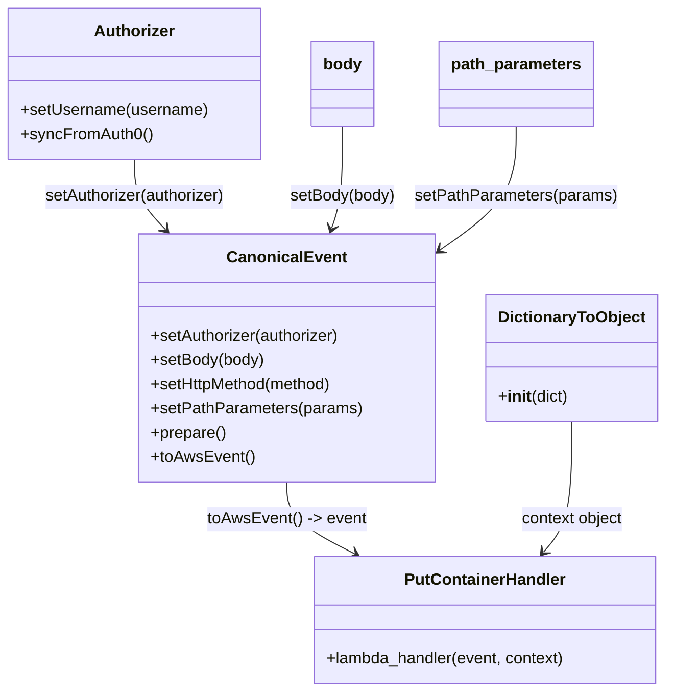

# Diagram: tools/ide_local_testing/localTest/test/partview/container/putContainer.py


> Auto-generated by Obscura crawlers

## Diagram 1



### SVG

<svg id="container" width="653.189453125" xmlns="http://www.w3.org/2000/svg" class="classDiagram" height="686" viewBox="0 0 653.189453125 686" role="graphics-document document" aria-roledescription="class"><style>#container{font-family:"trebuchet ms",verdana,arial,sans-serif;font-size:16px;fill:#333;}@keyframes edge-animation-frame{from{stroke-dashoffset:0;}}@keyframes dash{to{stroke-dashoffset:0;}}#container .edge-animation-slow{stroke-dasharray:9,5!important;stroke-dashoffset:900;animation:dash 50s linear infinite;stroke-linecap:round;}#container .edge-animation-fast{stroke-dasharray:9,5!important;stroke-dashoffset:900;animation:dash 20s linear infinite;stroke-linecap:round;}#container .error-icon{fill:#552222;}#container .error-text{fill:#552222;stroke:#552222;}#container .edge-thickness-normal{stroke-width:1px;}#container .edge-thickness-thick{stroke-width:3.5px;}#container .edge-pattern-solid{stroke-dasharray:0;}#container .edge-thickness-invisible{stroke-width:0;fill:none;}#container .edge-pattern-dashed{stroke-dasharray:3;}#container .edge-pattern-dotted{stroke-dasharray:2;}#container .marker{fill:#333333;stroke:#333333;}#container .marker.cross{stroke:#333333;}#container svg{font-family:"trebuchet ms",verdana,arial,sans-serif;font-size:16px;}#container p{margin:0;}#container g.classGroup text{fill:#9370DB;stroke:none;font-family:"trebuchet ms",verdana,arial,sans-serif;font-size:10px;}#container g.classGroup text .title{font-weight:bolder;}#container .nodeLabel,#container .edgeLabel{color:#131300;}#container .edgeLabel .label rect{fill:#ECECFF;}#container .label text{fill:#131300;}#container .labelBkg{background:#ECECFF;}#container .edgeLabel .label span{background:#ECECFF;}#container .classTitle{font-weight:bolder;}#container .node rect,#container .node circle,#container .node ellipse,#container .node polygon,#container .node path{fill:#ECECFF;stroke:#9370DB;stroke-width:1px;}#container .divider{stroke:#9370DB;stroke-width:1;}#container g.clickable{cursor:pointer;}#container g.classGroup rect{fill:#ECECFF;stroke:#9370DB;}#container g.classGroup line{stroke:#9370DB;stroke-width:1;}#container .classLabel .box{stroke:none;stroke-width:0;fill:#ECECFF;opacity:0.5;}#container .classLabel .label{fill:#9370DB;font-size:10px;}#container .relation{stroke:#333333;stroke-width:1;fill:none;}#container .dashed-line{stroke-dasharray:3;}#container .dotted-line{stroke-dasharray:1 2;}#container #compositionStart,#container .composition{fill:#333333!important;stroke:#333333!important;stroke-width:1;}#container #compositionEnd,#container .composition{fill:#333333!important;stroke:#333333!important;stroke-width:1;}#container #dependencyStart,#container .dependency{fill:#333333!important;stroke:#333333!important;stroke-width:1;}#container #dependencyStart,#container .dependency{fill:#333333!important;stroke:#333333!important;stroke-width:1;}#container #extensionStart,#container .extension{fill:transparent!important;stroke:#333333!important;stroke-width:1;}#container #extensionEnd,#container .extension{fill:transparent!important;stroke:#333333!important;stroke-width:1;}#container #aggregationStart,#container .aggregation{fill:transparent!important;stroke:#333333!important;stroke-width:1;}#container #aggregationEnd,#container .aggregation{fill:transparent!important;stroke:#333333!important;stroke-width:1;}#container #lollipopStart,#container .lollipop{fill:#ECECFF!important;stroke:#333333!important;stroke-width:1;}#container #lollipopEnd,#container .lollipop{fill:#ECECFF!important;stroke:#333333!important;stroke-width:1;}#container .edgeTerminals{font-size:11px;line-height:initial;}#container .classTitleText{text-anchor:middle;font-size:18px;fill:#333;}#container .label-icon{display:inline-block;height:1em;overflow:visible;vertical-align:-0.125em;}#container .node .label-icon path{fill:currentColor;stroke:revert;stroke-width:revert;}#container :root{--mermaid-font-family:"trebuchet ms",verdana,arial,sans-serif;}</style><g><defs><marker id="container_class-aggregationStart" class="marker aggregation class" refX="18" refY="7" markerWidth="190" markerHeight="240" orient="auto"><path d="M 18,7 L9,13 L1,7 L9,1 Z"></path></marker></defs><defs><marker id="container_class-aggregationEnd" class="marker aggregation class" refX="1" refY="7" markerWidth="20" markerHeight="28" orient="auto"><path d="M 18,7 L9,13 L1,7 L9,1 Z"></path></marker></defs><defs><marker id="container_class-extensionStart" class="marker extension class" refX="18" refY="7" markerWidth="190" markerHeight="240" orient="auto"><path d="M 1,7 L18,13 V 1 Z"></path></marker></defs><defs><marker id="container_class-extensionEnd" class="marker extension class" refX="1" refY="7" markerWidth="20" markerHeight="28" orient="auto"><path d="M 1,1 V 13 L18,7 Z"></path></marker></defs><defs><marker id="container_class-compositionStart" class="marker composition class" refX="18" refY="7" markerWidth="190" markerHeight="240" orient="auto"><path d="M 18,7 L9,13 L1,7 L9,1 Z"></path></marker></defs><defs><marker id="container_class-compositionEnd" class="marker composition class" refX="1" refY="7" markerWidth="20" markerHeight="28" orient="auto"><path d="M 18,7 L9,13 L1,7 L9,1 Z"></path></marker></defs><defs><marker id="container_class-dependencyStart" class="marker dependency class" refX="6" refY="7" markerWidth="190" markerHeight="240" orient="auto"><path d="M 5,7 L9,13 L1,7 L9,1 Z"></path></marker></defs><defs><marker id="container_class-dependencyEnd" class="marker dependency class" refX="13" refY="7" markerWidth="20" markerHeight="28" orient="auto"><path d="M 18,7 L9,13 L14,7 L9,1 Z"></path></marker></defs><defs><marker id="container_class-lollipopStart" class="marker lollipop class" refX="13" refY="7" markerWidth="190" markerHeight="240" orient="auto"><circle stroke="black" fill="transparent" cx="7" cy="7" r="6"></circle></marker></defs><defs><marker id="container_class-lollipopEnd" class="marker lollipop class" refX="1" refY="7" markerWidth="190" markerHeight="240" orient="auto"><circle stroke="black" fill="transparent" cx="7" cy="7" r="6"></circle></marker></defs><g class="root"><g class="clusters"></g><g class="edgePaths"><path d="M132.137,158L132.137,164.167C132.137,170.333,132.137,182.667,137.335,194.277C142.533,205.887,152.93,216.774,158.128,222.217L163.327,227.661" id="id_Authorizer_CanonicalEvent_1" class="edge-thickness-normal edge-pattern-solid relation" style=";;;" data-edge="true" data-et="edge" data-id="id_Authorizer_CanonicalEvent_1" data-points="W3sieCI6MTMyLjEzNjcxODc1LCJ5IjoxNTh9LHsieCI6MTMyLjEzNjcxODc1LCJ5IjoxOTV9LHsieCI6MTY3LjQ3MDU0NDQzMzU5Mzc0LCJ5IjoyMzJ9XQ==" marker-end="url(#container_class-dependencyEnd)"></path><path d="M336.672,125L336.672,136.667C336.672,148.333,336.672,171.667,334.985,188.549C333.299,205.43,329.926,215.861,328.24,221.076L326.553,226.291" id="id_body_CanonicalEvent_2" class="edge-thickness-normal edge-pattern-solid relation" style=";;;" data-edge="true" data-et="edge" data-id="id_body_CanonicalEvent_2" data-points="W3sieCI6MzM2LjY3MTg3NSwieSI6MTI1fSx7IngiOjMzNi42NzE4NzUsInkiOjE5NX0seyJ4IjozMjQuNzA2OTQ1ODAwNzgxMiwieSI6MjMyfV0=" marker-end="url(#container_class-dependencyEnd)"></path><path d="M509.094,125L509.094,136.667C509.094,148.333,509.094,171.667,496.497,192.324C483.901,212.982,458.708,230.964,446.111,239.955L433.514,248.946" id="id_path_parameters_CanonicalEvent_3" class="edge-thickness-normal edge-pattern-solid relation" style=";;;" data-edge="true" data-et="edge" data-id="id_path_parameters_CanonicalEvent_3" data-points="W3sieCI6NTA5LjA5Mzc1LCJ5IjoxMjV9LHsieCI6NTA5LjA5Mzc1LCJ5IjoxOTV9LHsieCI6NDI4LjYzMDg1OTM3NSwieSI6MjUyLjQzMTkyOTY2ODY0NDV9XQ==" marker-end="url(#container_class-dependencyEnd)"></path><path d="M284.932,478L284.932,484.167C284.932,490.333,284.932,502.667,295.745,514.534C306.558,526.401,328.184,537.801,338.997,543.502L349.81,549.202" id="id_CanonicalEvent_PutContainerHandler_4" class="edge-thickness-normal edge-pattern-solid relation" style=";;;" data-edge="true" data-et="edge" data-id="id_CanonicalEvent_PutContainerHandler_4" data-points="W3sieCI6Mjg0LjkzMTY0MDYyNSwieSI6NDc4fSx7IngiOjI4NC45MzE2NDA2MjUsInkiOjUxNX0seyJ4IjozNTUuMTE3NDYwOTM3NSwieSI6NTUyfV0=" marker-end="url(#container_class-dependencyEnd)"></path><path d="M560.834,418L560.834,434.167C560.834,450.333,560.834,482.667,556.171,504.243C551.507,525.819,542.18,536.637,537.517,542.046L532.854,547.456" id="id_DictionaryToObject_PutContainerHandler_5" class="edge-thickness-normal edge-pattern-solid relation" style=";;;" data-edge="true" data-et="edge" data-id="id_DictionaryToObject_PutContainerHandler_5" data-points="W3sieCI6NTYwLjgzMzk4NDM3NSwieSI6NDE4fSx7IngiOjU2MC44MzM5ODQzNzUsInkiOjUxNX0seyJ4Ijo1MjguOTM1OTM3NSwieSI6NTUyfV0=" marker-end="url(#container_class-dependencyEnd)"></path></g><g class="edgeLabels"><g class="edgeLabel" transform="translate(132.13671875, 195)"><g class="label" data-id="id_Authorizer_CanonicalEvent_1" transform="translate(-91.3828125, -12)"><foreignObject width="182.765625" height="24"><div xmlns="http://www.w3.org/1999/xhtml" class="labelBkg" style="display: table-cell; white-space: nowrap; line-height: 1.5; max-width: 200px; text-align: center;"><span class="edgeLabel"><p>setAuthorizer(authorizer)</p></span></div></foreignObject></g></g><g class="edgeLabel" transform="translate(336.671875, 195)"><g class="label" data-id="id_body_CanonicalEvent_2" transform="translate(-52.5703125, -12)"><foreignObject width="105.140625" height="24"><div xmlns="http://www.w3.org/1999/xhtml" class="labelBkg" style="display: table-cell; white-space: nowrap; line-height: 1.5; max-width: 200px; text-align: center;"><span class="edgeLabel"><p>setBody(body)</p></span></div></foreignObject></g></g><g class="edgeLabel" transform="translate(509.09375, 195)"><g class="label" data-id="id_path_parameters_CanonicalEvent_3" transform="translate(-99.8515625, -12)"><foreignObject width="199.703125" height="24"><div xmlns="http://www.w3.org/1999/xhtml" class="labelBkg" style="display: table-cell; white-space: nowrap; line-height: 1.5; max-width: 200px; text-align: center;"><span class="edgeLabel"><p>setPathParameters(params)</p></span></div></foreignObject></g></g><g class="edgeLabel" transform="translate(284.931640625, 515)"><g class="label" data-id="id_CanonicalEvent_PutContainerHandler_4" transform="translate(-78.2734375, -12)"><foreignObject width="156.546875" height="24"><div xmlns="http://www.w3.org/1999/xhtml" class="labelBkg" style="display: table-cell; white-space: nowrap; line-height: 1.5; max-width: 200px; text-align: center;"><span class="edgeLabel"><p>toAwsEvent() -&gt; event</p></span></div></foreignObject></g></g><g class="edgeLabel" transform="translate(560.833984375, 515)"><g class="label" data-id="id_DictionaryToObject_PutContainerHandler_5" transform="translate(-51.7109375, -12)"><foreignObject width="103.421875" height="24"><div xmlns="http://www.w3.org/1999/xhtml" class="labelBkg" style="display: table-cell; white-space: nowrap; line-height: 1.5; max-width: 200px; text-align: center;"><span class="edgeLabel"><p>context object</p></span></div></foreignObject></g></g></g><g class="nodes"><g class="node default" id="classId-Authorizer-0" transform="translate(132.13671875, 83)"><g class="basic label-container"><path d="M-124.13671875 -75 L124.13671875 -75 L124.13671875 75 L-124.13671875 75" stroke="none" stroke-width="0" fill="#ECECFF" style=""></path><path d="M-124.13671875 -75 C-39.07232294629678 -75, 45.99207285740644 -75, 124.13671875 -75 M-124.13671875 -75 C-29.589828219527902 -75, 64.9570623109442 -75, 124.13671875 -75 M124.13671875 -75 C124.13671875 -36.972996214843214, 124.13671875 1.0540075703135727, 124.13671875 75 M124.13671875 -75 C124.13671875 -30.958962233249338, 124.13671875 13.082075533501325, 124.13671875 75 M124.13671875 75 C70.0474855943076 75, 15.958252438615219 75, -124.13671875 75 M124.13671875 75 C59.52330786115877 75, -5.09010302768246 75, -124.13671875 75 M-124.13671875 75 C-124.13671875 32.21307978292227, -124.13671875 -10.573840434155457, -124.13671875 -75 M-124.13671875 75 C-124.13671875 24.735972181814077, -124.13671875 -25.528055636371846, -124.13671875 -75" stroke="#9370DB" stroke-width="1.3" fill="none" stroke-dasharray="0 0" style=""></path></g><g class="annotation-group text" transform="translate(0, -51)"></g><g class="label-group text" transform="translate(-38.3671875, -51)"><g class="label" style="font-weight: bolder" transform="translate(0,-12)"><foreignObject width="76.734375" height="24"><div xmlns="http://www.w3.org/1999/xhtml" style="display: table-cell; white-space: nowrap; line-height: 1.5; max-width: 126px; text-align: center;"><span class="nodeLabel markdown-node-label" style=""><p>Authorizer</p></span></div></foreignObject></g></g><g class="members-group text" transform="translate(-112.13671875, -3)"></g><g class="methods-group text" transform="translate(-112.13671875, 27)"><g class="label" style="" transform="translate(0,-12)"><foreignObject width="185.90625" height="24"><div xmlns="http://www.w3.org/1999/xhtml" style="display: table-cell; white-space: nowrap; line-height: 1.5; max-width: 243px; text-align: center;"><span class="nodeLabel markdown-node-label" style=""><p>+setUsername(username)</p></span></div></foreignObject></g><g class="label" style="" transform="translate(0,12)"><foreignObject width="129.0625" height="24"><div xmlns="http://www.w3.org/1999/xhtml" style="display: table-cell; white-space: nowrap; line-height: 1.5; max-width: 186px; text-align: center;"><span class="nodeLabel markdown-node-label" style=""><p>+syncFromAuth0()</p></span></div></foreignObject></g></g><g class="divider" style=""><path d="M-124.13671875 -27 C-32.784078529578494 -27, 58.56856169084301 -27, 124.13671875 -27 M-124.13671875 -27 C-36.38482112620663 -27, 51.36707649758674 -27, 124.13671875 -27" stroke="#9370DB" stroke-width="1.3" fill="none" stroke-dasharray="0 0" style=""></path></g><g class="divider" style=""><path d="M-124.13671875 -3 C-62.463913655109515 -3, -0.7911085602190298 -3, 124.13671875 -3 M-124.13671875 -3 C-51.69469745313232 -3, 20.74732384373536 -3, 124.13671875 -3" stroke="#9370DB" stroke-width="1.3" fill="none" stroke-dasharray="0 0" style=""></path></g></g><g class="node default" id="classId-CanonicalEvent-1" transform="translate(284.931640625, 355)"><g class="basic label-container"><path d="M-143.69921875 -123 L143.69921875 -123 L143.69921875 123 L-143.69921875 123" stroke="none" stroke-width="0" fill="#ECECFF" style=""></path><path d="M-143.69921875 -123 C-30.529002335041184 -123, 82.64121407991763 -123, 143.69921875 -123 M-143.69921875 -123 C-37.66516328894902 -123, 68.36889217210197 -123, 143.69921875 -123 M143.69921875 -123 C143.69921875 -57.34397516742034, 143.69921875 8.312049665159321, 143.69921875 123 M143.69921875 -123 C143.69921875 -33.30899900694773, 143.69921875 56.38200198610454, 143.69921875 123 M143.69921875 123 C39.638694053064825 123, -64.42183064387035 123, -143.69921875 123 M143.69921875 123 C58.94350740070067 123, -25.812203948598665 123, -143.69921875 123 M-143.69921875 123 C-143.69921875 44.16433883647473, -143.69921875 -34.67132232705055, -143.69921875 -123 M-143.69921875 123 C-143.69921875 73.49882065336405, -143.69921875 23.997641306728084, -143.69921875 -123" stroke="#9370DB" stroke-width="1.3" fill="none" stroke-dasharray="0 0" style=""></path></g><g class="annotation-group text" transform="translate(0, -99)"></g><g class="label-group text" transform="translate(-55.7109375, -99)"><g class="label" style="font-weight: bolder" transform="translate(0,-12)"><foreignObject width="111.421875" height="24"><div xmlns="http://www.w3.org/1999/xhtml" style="display: table-cell; white-space: nowrap; line-height: 1.5; max-width: 161px; text-align: center;"><span class="nodeLabel markdown-node-label" style=""><p>CanonicalEvent</p></span></div></foreignObject></g></g><g class="members-group text" transform="translate(-131.69921875, -51)"></g><g class="methods-group text" transform="translate(-131.69921875, -21)"><g class="label" style="" transform="translate(0,-12)"><foreignObject width="190.75" height="24"><div xmlns="http://www.w3.org/1999/xhtml" style="display: table-cell; white-space: nowrap; line-height: 1.5; max-width: 248px; text-align: center;"><span class="nodeLabel markdown-node-label" style=""><p>+setAuthorizer(authorizer)</p></span></div></foreignObject></g><g class="label" style="" transform="translate(0,12)"><foreignObject width="113.125" height="24"><div xmlns="http://www.w3.org/1999/xhtml" style="display: table-cell; white-space: nowrap; line-height: 1.5; max-width: 170px; text-align: center;"><span class="nodeLabel markdown-node-label" style=""><p>+setBody(body)</p></span></div></foreignObject></g><g class="label" style="" transform="translate(0,36)"><foreignObject width="184" height="24"><div xmlns="http://www.w3.org/1999/xhtml" style="display: table-cell; white-space: nowrap; line-height: 1.5; max-width: 241px; text-align: center;"><span class="nodeLabel markdown-node-label" style=""><p>+setHttpMethod(method)</p></span></div></foreignObject></g><g class="label" style="" transform="translate(0,60)"><foreignObject width="207.6875" height="24"><div xmlns="http://www.w3.org/1999/xhtml" style="display: table-cell; white-space: nowrap; line-height: 1.5; max-width: 265px; text-align: center;"><span class="nodeLabel markdown-node-label" style=""><p>+setPathParameters(params)</p></span></div></foreignObject></g><g class="label" style="" transform="translate(0,84)"><foreignObject width="74.75" height="24"><div xmlns="http://www.w3.org/1999/xhtml" style="display: table-cell; white-space: nowrap; line-height: 1.5; max-width: 132px; text-align: center;"><span class="nodeLabel markdown-node-label" style=""><p>+prepare()</p></span></div></foreignObject></g><g class="label" style="" transform="translate(0,108)"><foreignObject width="101.1875" height="24"><div xmlns="http://www.w3.org/1999/xhtml" style="display: table-cell; white-space: nowrap; line-height: 1.5; max-width: 159px; text-align: center;"><span class="nodeLabel markdown-node-label" style=""><p>+toAwsEvent()</p></span></div></foreignObject></g></g><g class="divider" style=""><path d="M-143.69921875 -75 C-56.79527992555643 -75, 30.108658898887143 -75, 143.69921875 -75 M-143.69921875 -75 C-73.46864185422729 -75, -3.238064958454572 -75, 143.69921875 -75" stroke="#9370DB" stroke-width="1.3" fill="none" stroke-dasharray="0 0" style=""></path></g><g class="divider" style=""><path d="M-143.69921875 -51 C-61.30115338137939 -51, 21.096911987241214 -51, 143.69921875 -51 M-143.69921875 -51 C-44.712638659908734 -51, 54.27394143018253 -51, 143.69921875 -51" stroke="#9370DB" stroke-width="1.3" fill="none" stroke-dasharray="0 0" style=""></path></g></g><g class="node default" id="classId-DictionaryToObject-2" transform="translate(560.833984375, 355)"><g class="basic label-container"><path d="M-82.203125 -63 L82.203125 -63 L82.203125 63 L-82.203125 63" stroke="none" stroke-width="0" fill="#ECECFF" style=""></path><path d="M-82.203125 -63 C-21.930884427047864 -63, 38.34135614590427 -63, 82.203125 -63 M-82.203125 -63 C-18.74393764496351 -63, 44.71524971007298 -63, 82.203125 -63 M82.203125 -63 C82.203125 -25.483471905533868, 82.203125 12.033056188932264, 82.203125 63 M82.203125 -63 C82.203125 -19.62612276723639, 82.203125 23.747754465527223, 82.203125 63 M82.203125 63 C17.6456743791707 63, -46.9117762416586 63, -82.203125 63 M82.203125 63 C20.31250043300451 63, -41.57812413399098 63, -82.203125 63 M-82.203125 63 C-82.203125 26.208992643291857, -82.203125 -10.582014713416285, -82.203125 -63 M-82.203125 63 C-82.203125 13.204843919473888, -82.203125 -36.590312161052225, -82.203125 -63" stroke="#9370DB" stroke-width="1.3" fill="none" stroke-dasharray="0 0" style=""></path></g><g class="annotation-group text" transform="translate(0, -39)"></g><g class="label-group text" transform="translate(-70.109375, -39)"><g class="label" style="font-weight: bolder" transform="translate(0,-12)"><foreignObject width="140.21875" height="24"><div xmlns="http://www.w3.org/1999/xhtml" style="display: table-cell; white-space: nowrap; line-height: 1.5; max-width: 188px; text-align: center;"><span class="nodeLabel markdown-node-label" style=""><p>DictionaryToObject</p></span></div></foreignObject></g></g><g class="members-group text" transform="translate(-70.203125, 9)"></g><g class="methods-group text" transform="translate(-70.203125, 39)"><g class="label" style="" transform="translate(0,-12)"><foreignObject width="70.296875" height="24"><div xmlns="http://www.w3.org/1999/xhtml" style="display: table-cell; white-space: nowrap; line-height: 1.5; max-width: 159px; text-align: center;"><span class="nodeLabel markdown-node-label" style=""><p>+<strong>init</strong>(dict)</p></span></div></foreignObject></g></g><g class="divider" style=""><path d="M-82.203125 -15 C-42.26196105845055 -15, -2.3207971169011046 -15, 82.203125 -15 M-82.203125 -15 C-22.0678392211895 -15, 38.067446557621 -15, 82.203125 -15" stroke="#9370DB" stroke-width="1.3" fill="none" stroke-dasharray="0 0" style=""></path></g><g class="divider" style=""><path d="M-82.203125 9 C-47.54149668006737 9, -12.879868360134736 9, 82.203125 9 M-82.203125 9 C-46.611432510247155 9, -11.01974002049431 9, 82.203125 9" stroke="#9370DB" stroke-width="1.3" fill="none" stroke-dasharray="0 0" style=""></path></g></g><g class="node default" id="classId-PutContainerHandler-3" transform="translate(474.623046875, 615)"><g class="basic label-container"><path d="M-170.56640625 -63 L170.56640625 -63 L170.56640625 63 L-170.56640625 63" stroke="none" stroke-width="0" fill="#ECECFF" style=""></path><path d="M-170.56640625 -63 C-57.91954981217485 -63, 54.7273066256503 -63, 170.56640625 -63 M-170.56640625 -63 C-50.14817383647599 -63, 70.27005857704802 -63, 170.56640625 -63 M170.56640625 -63 C170.56640625 -19.337936930686077, 170.56640625 24.324126138627847, 170.56640625 63 M170.56640625 -63 C170.56640625 -30.242515937000533, 170.56640625 2.5149681259989336, 170.56640625 63 M170.56640625 63 C71.3824384234951 63, -27.801529403009795 63, -170.56640625 63 M170.56640625 63 C82.26101026434918 63, -6.044385721301637 63, -170.56640625 63 M-170.56640625 63 C-170.56640625 28.203094385153882, -170.56640625 -6.5938112296922355, -170.56640625 -63 M-170.56640625 63 C-170.56640625 24.9537019430809, -170.56640625 -13.092596113838198, -170.56640625 -63" stroke="#9370DB" stroke-width="1.3" fill="none" stroke-dasharray="0 0" style=""></path></g><g class="annotation-group text" transform="translate(0, -39)"></g><g class="label-group text" transform="translate(-76.9453125, -39)"><g class="label" style="font-weight: bolder" transform="translate(0,-12)"><foreignObject width="153.890625" height="24"><div xmlns="http://www.w3.org/1999/xhtml" style="display: table-cell; white-space: nowrap; line-height: 1.5; max-width: 203px; text-align: center;"><span class="nodeLabel markdown-node-label" style=""><p>PutContainerHandler</p></span></div></foreignObject></g></g><g class="members-group text" transform="translate(-158.56640625, 9)"></g><g class="methods-group text" transform="translate(-158.56640625, 39)"><g class="label" style="" transform="translate(0,-12)"><foreignObject width="240.1875" height="24"><div xmlns="http://www.w3.org/1999/xhtml" style="display: table-cell; white-space: nowrap; line-height: 1.5; max-width: 298px; text-align: center;"><span class="nodeLabel markdown-node-label" style=""><p>+lambda_handler(event, context)</p></span></div></foreignObject></g></g><g class="divider" style=""><path d="M-170.56640625 -15 C-89.40205751306357 -15, -8.237708776127135 -15, 170.56640625 -15 M-170.56640625 -15 C-70.21090012353153 -15, 30.14460600293694 -15, 170.56640625 -15" stroke="#9370DB" stroke-width="1.3" fill="none" stroke-dasharray="0 0" style=""></path></g><g class="divider" style=""><path d="M-170.56640625 9 C-82.14071145316295 9, 6.284983343674099 9, 170.56640625 9 M-170.56640625 9 C-48.61901669833834 9, 73.32837285332332 9, 170.56640625 9" stroke="#9370DB" stroke-width="1.3" fill="none" stroke-dasharray="0 0" style=""></path></g></g><g class="node default" id="classId-body-4" transform="translate(336.671875, 83)"><g class="basic label-container"><path d="M-30.3984375 -42 L30.3984375 -42 L30.3984375 42 L-30.3984375 42" stroke="none" stroke-width="0" fill="#ECECFF" style=""></path><path d="M-30.3984375 -42 C-12.171954006792348 -42, 6.054529486415305 -42, 30.3984375 -42 M-30.3984375 -42 C-7.842935631883403 -42, 14.712566236233194 -42, 30.3984375 -42 M30.3984375 -42 C30.3984375 -23.169204358270495, 30.3984375 -4.3384087165409895, 30.3984375 42 M30.3984375 -42 C30.3984375 -13.891183751428304, 30.3984375 14.217632497143391, 30.3984375 42 M30.3984375 42 C15.543351227417585 42, 0.6882649548351694 42, -30.3984375 42 M30.3984375 42 C13.004286905766843 42, -4.389863688466313 42, -30.3984375 42 M-30.3984375 42 C-30.3984375 12.290364525538827, -30.3984375 -17.419270948922346, -30.3984375 -42 M-30.3984375 42 C-30.3984375 17.264268445041928, -30.3984375 -7.471463109916144, -30.3984375 -42" stroke="#9370DB" stroke-width="1.3" fill="none" stroke-dasharray="0 0" style=""></path></g><g class="annotation-group text" transform="translate(0, -18)"></g><g class="label-group text" transform="translate(-18.3984375, -18)"><g class="label" style="font-weight: bolder" transform="translate(0,-12)"><foreignObject width="36.796875" height="24"><div xmlns="http://www.w3.org/1999/xhtml" style="display: table-cell; white-space: nowrap; line-height: 1.5; max-width: 86px; text-align: center;"><span class="nodeLabel markdown-node-label" style=""><p>body</p></span></div></foreignObject></g></g><g class="members-group text" transform="translate(-18.3984375, 30)"></g><g class="methods-group text" transform="translate(-18.3984375, 60)"></g><g class="divider" style=""><path d="M-30.3984375 6 C-8.783526763891253 6, 12.831383972217495 6, 30.3984375 6 M-30.3984375 6 C-17.402797880796246 6, -4.4071582615924925 6, 30.3984375 6" stroke="#9370DB" stroke-width="1.3" fill="none" stroke-dasharray="0 0" style=""></path></g><g class="divider" style=""><path d="M-30.3984375 24 C-15.826339832267886 24, -1.2542421645357713 24, 30.3984375 24 M-30.3984375 24 C-16.64335152094676 24, -2.8882655418935137 24, 30.3984375 24" stroke="#9370DB" stroke-width="1.3" fill="none" stroke-dasharray="0 0" style=""></path></g></g><g class="node default" id="classId-path_parameters-5" transform="translate(509.09375, 83)"><g class="basic label-container"><path d="M-74.8515625 -42 L74.8515625 -42 L74.8515625 42 L-74.8515625 42" stroke="none" stroke-width="0" fill="#ECECFF" style=""></path><path d="M-74.8515625 -42 C-31.800800772718517 -42, 11.249960954562965 -42, 74.8515625 -42 M-74.8515625 -42 C-29.131535277617893 -42, 16.588491944764215 -42, 74.8515625 -42 M74.8515625 -42 C74.8515625 -17.864079352533963, 74.8515625 6.271841294932074, 74.8515625 42 M74.8515625 -42 C74.8515625 -11.734865072299915, 74.8515625 18.53026985540017, 74.8515625 42 M74.8515625 42 C17.83503403016436 42, -39.18149443967128 42, -74.8515625 42 M74.8515625 42 C19.007449096541897 42, -36.836664306916205 42, -74.8515625 42 M-74.8515625 42 C-74.8515625 13.878433125802275, -74.8515625 -14.24313374839545, -74.8515625 -42 M-74.8515625 42 C-74.8515625 18.00853112063662, -74.8515625 -5.982937758726763, -74.8515625 -42" stroke="#9370DB" stroke-width="1.3" fill="none" stroke-dasharray="0 0" style=""></path></g><g class="annotation-group text" transform="translate(0, -18)"></g><g class="label-group text" transform="translate(-62.8515625, -18)"><g class="label" style="font-weight: bolder" transform="translate(0,-12)"><foreignObject width="125.703125" height="24"><div xmlns="http://www.w3.org/1999/xhtml" style="display: table-cell; white-space: nowrap; line-height: 1.5; max-width: 174px; text-align: center;"><span class="nodeLabel markdown-node-label" style=""><p>path_parameters</p></span></div></foreignObject></g></g><g class="members-group text" transform="translate(-62.8515625, 30)"></g><g class="methods-group text" transform="translate(-62.8515625, 60)"></g><g class="divider" style=""><path d="M-74.8515625 6 C-34.91592305464358 6, 5.019716390712844 6, 74.8515625 6 M-74.8515625 6 C-21.18198136738293 6, 32.48759976523414 6, 74.8515625 6" stroke="#9370DB" stroke-width="1.3" fill="none" stroke-dasharray="0 0" style=""></path></g><g class="divider" style=""><path d="M-74.8515625 24 C-44.72031594585491 24, -14.589069391709813 24, 74.8515625 24 M-74.8515625 24 C-25.10898702911679 24, 24.63358844176642 24, 74.8515625 24" stroke="#9370DB" stroke-width="1.3" fill="none" stroke-dasharray="0 0" style=""></path></g></g></g></g></g></svg>

## Diagram 2

```mermaid
flowchart LR
    A[Create body dict] --> B[Create path_parameters dict]
    B --> C[Instantiate Authorizer and setUsername]
    C --> D[syncFromAuth0 -> authorizer ready]
    A --> E[Instantiate CanonicalEvent]
    D --> E
    E --> F[setBody, setHttpMethod("PUT"), setPathParameters]
    F --> G[prepare() -> toAwsEvent() => event]
    H[DictionaryToObject({"function_name":"putPackageContainer"})] --> I[context object]
    G --> J[call putContainer.lambda_handler(event, context)]
    J --> K[response]
    K --> L[print(response)]
```

> SVG rendering failed for this diagram.
