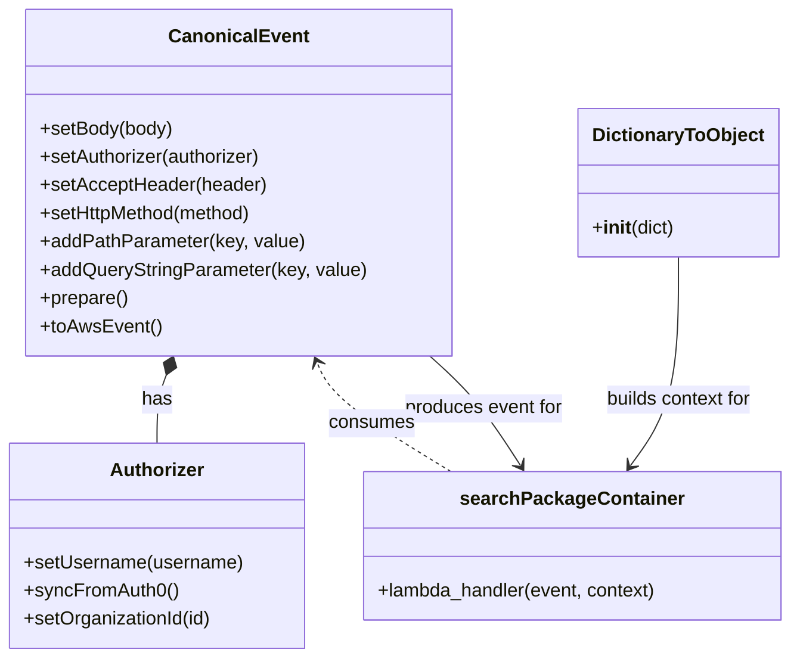

# Diagram: tools/ide_local_testing/localTest/test/partview/containerSearch/searchContainerCount.py


> Auto-generated by Obscura crawlers

## Diagram 1



### SVG

<svg id="container" width="667.9140625" xmlns="http://www.w3.org/2000/svg" class="classDiagram" height="558" viewBox="0 0 667.9140625 558" role="graphics-document document" aria-roledescription="class"><style>#container{font-family:"trebuchet ms",verdana,arial,sans-serif;font-size:16px;fill:#333;}@keyframes edge-animation-frame{from{stroke-dashoffset:0;}}@keyframes dash{to{stroke-dashoffset:0;}}#container .edge-animation-slow{stroke-dasharray:9,5!important;stroke-dashoffset:900;animation:dash 50s linear infinite;stroke-linecap:round;}#container .edge-animation-fast{stroke-dasharray:9,5!important;stroke-dashoffset:900;animation:dash 20s linear infinite;stroke-linecap:round;}#container .error-icon{fill:#552222;}#container .error-text{fill:#552222;stroke:#552222;}#container .edge-thickness-normal{stroke-width:1px;}#container .edge-thickness-thick{stroke-width:3.5px;}#container .edge-pattern-solid{stroke-dasharray:0;}#container .edge-thickness-invisible{stroke-width:0;fill:none;}#container .edge-pattern-dashed{stroke-dasharray:3;}#container .edge-pattern-dotted{stroke-dasharray:2;}#container .marker{fill:#333333;stroke:#333333;}#container .marker.cross{stroke:#333333;}#container svg{font-family:"trebuchet ms",verdana,arial,sans-serif;font-size:16px;}#container p{margin:0;}#container g.classGroup text{fill:#9370DB;stroke:none;font-family:"trebuchet ms",verdana,arial,sans-serif;font-size:10px;}#container g.classGroup text .title{font-weight:bolder;}#container .nodeLabel,#container .edgeLabel{color:#131300;}#container .edgeLabel .label rect{fill:#ECECFF;}#container .label text{fill:#131300;}#container .labelBkg{background:#ECECFF;}#container .edgeLabel .label span{background:#ECECFF;}#container .classTitle{font-weight:bolder;}#container .node rect,#container .node circle,#container .node ellipse,#container .node polygon,#container .node path{fill:#ECECFF;stroke:#9370DB;stroke-width:1px;}#container .divider{stroke:#9370DB;stroke-width:1;}#container g.clickable{cursor:pointer;}#container g.classGroup rect{fill:#ECECFF;stroke:#9370DB;}#container g.classGroup line{stroke:#9370DB;stroke-width:1;}#container .classLabel .box{stroke:none;stroke-width:0;fill:#ECECFF;opacity:0.5;}#container .classLabel .label{fill:#9370DB;font-size:10px;}#container .relation{stroke:#333333;stroke-width:1;fill:none;}#container .dashed-line{stroke-dasharray:3;}#container .dotted-line{stroke-dasharray:1 2;}#container #compositionStart,#container .composition{fill:#333333!important;stroke:#333333!important;stroke-width:1;}#container #compositionEnd,#container .composition{fill:#333333!important;stroke:#333333!important;stroke-width:1;}#container #dependencyStart,#container .dependency{fill:#333333!important;stroke:#333333!important;stroke-width:1;}#container #dependencyStart,#container .dependency{fill:#333333!important;stroke:#333333!important;stroke-width:1;}#container #extensionStart,#container .extension{fill:transparent!important;stroke:#333333!important;stroke-width:1;}#container #extensionEnd,#container .extension{fill:transparent!important;stroke:#333333!important;stroke-width:1;}#container #aggregationStart,#container .aggregation{fill:transparent!important;stroke:#333333!important;stroke-width:1;}#container #aggregationEnd,#container .aggregation{fill:transparent!important;stroke:#333333!important;stroke-width:1;}#container #lollipopStart,#container .lollipop{fill:#ECECFF!important;stroke:#333333!important;stroke-width:1;}#container #lollipopEnd,#container .lollipop{fill:#ECECFF!important;stroke:#333333!important;stroke-width:1;}#container .edgeTerminals{font-size:11px;line-height:initial;}#container .classTitleText{text-anchor:middle;font-size:18px;fill:#333;}#container .label-icon{display:inline-block;height:1em;overflow:visible;vertical-align:-0.125em;}#container .node .label-icon path{fill:currentColor;stroke:revert;stroke-width:revert;}#container :root{--mermaid-font-family:"trebuchet ms",verdana,arial,sans-serif;}</style><g><defs><marker id="container_class-aggregationStart" class="marker aggregation class" refX="18" refY="7" markerWidth="190" markerHeight="240" orient="auto"><path d="M 18,7 L9,13 L1,7 L9,1 Z"></path></marker></defs><defs><marker id="container_class-aggregationEnd" class="marker aggregation class" refX="1" refY="7" markerWidth="20" markerHeight="28" orient="auto"><path d="M 18,7 L9,13 L1,7 L9,1 Z"></path></marker></defs><defs><marker id="container_class-extensionStart" class="marker extension class" refX="18" refY="7" markerWidth="190" markerHeight="240" orient="auto"><path d="M 1,7 L18,13 V 1 Z"></path></marker></defs><defs><marker id="container_class-extensionEnd" class="marker extension class" refX="1" refY="7" markerWidth="20" markerHeight="28" orient="auto"><path d="M 1,1 V 13 L18,7 Z"></path></marker></defs><defs><marker id="container_class-compositionStart" class="marker composition class" refX="18" refY="7" markerWidth="190" markerHeight="240" orient="auto"><path d="M 18,7 L9,13 L1,7 L9,1 Z"></path></marker></defs><defs><marker id="container_class-compositionEnd" class="marker composition class" refX="1" refY="7" markerWidth="20" markerHeight="28" orient="auto"><path d="M 18,7 L9,13 L1,7 L9,1 Z"></path></marker></defs><defs><marker id="container_class-dependencyStart" class="marker dependency class" refX="6" refY="7" markerWidth="190" markerHeight="240" orient="auto"><path d="M 5,7 L9,13 L1,7 L9,1 Z"></path></marker></defs><defs><marker id="container_class-dependencyEnd" class="marker dependency class" refX="13" refY="7" markerWidth="20" markerHeight="28" orient="auto"><path d="M 18,7 L9,13 L14,7 L9,1 Z"></path></marker></defs><defs><marker id="container_class-lollipopStart" class="marker lollipop class" refX="13" refY="7" markerWidth="190" markerHeight="240" orient="auto"><circle stroke="black" fill="transparent" cx="7" cy="7" r="6"></circle></marker></defs><defs><marker id="container_class-lollipopEnd" class="marker lollipop class" refX="1" refY="7" markerWidth="190" markerHeight="240" orient="auto"><circle stroke="black" fill="transparent" cx="7" cy="7" r="6"></circle></marker></defs><g class="root"><g class="clusters"></g><g class="edgePaths"><path d="M139.965,318.149L138.66,321.625C137.355,325.1,134.746,332.05,133.441,341.692C132.137,351.333,132.137,363.667,132.137,369.833L132.137,376" id="id_CanonicalEvent_Authorizer_1" class="edge-thickness-normal edge-pattern-solid relation" style=";;;" data-edge="true" data-et="edge" data-id="id_CanonicalEvent_Authorizer_1" data-points="W3sieCI6MTQ2LjAyNzQyODY2ODQ3ODI1LCJ5IjozMDJ9LHsieCI6MTMyLjEzNjcxODc1LCJ5IjozMzl9LHsieCI6MTMyLjEzNjcxODc1LCJ5IjozNzZ9XQ==" marker-start="url(#container_class-compositionStart)"></path><path d="M573.566,218L573.566,238.167C573.566,258.333,573.566,298.667,566.738,328.192C559.91,357.718,546.253,376.435,539.425,385.794L532.596,395.153" id="id_DictionaryToObject_searchPackageContainer_2" class="edge-thickness-normal edge-pattern-solid relation" style=";;;" data-edge="true" data-et="edge" data-id="id_DictionaryToObject_searchPackageContainer_2" data-points="W3sieCI6NTczLjU2NjQwNjI1LCJ5IjoyMTh9LHsieCI6NTczLjU2NjQwNjI1LCJ5IjozMzl9LHsieCI6NTI5LjA1OTY5NjMyMDU2NDUsInkiOjQwMH1d" marker-end="url(#container_class-dependencyEnd)"></path><path d="M363.592,302L370.404,308.167C377.216,314.333,390.839,326.667,403.562,342.155C416.286,357.644,428.108,376.289,434.02,385.611L439.931,394.933" id="id_CanonicalEvent_searchPackageContainer_3" class="edge-thickness-normal edge-pattern-solid relation" style=";;;" data-edge="true" data-et="edge" data-id="id_CanonicalEvent_searchPackageContainer_3" data-points="W3sieCI6MzYzLjU5MjM1OTQ1OTkxODUsInkiOjMwMn0seyJ4Ijo0MDQuNDYyODkwNjI1LCJ5IjozMzl9LHsieCI6NDQzLjE0NDIwMDQ3ODgzMDY3LCJ5Ijo0MDB9XQ==" marker-end="url(#container_class-dependencyEnd)"></path><path d="M379.831,400L363.166,389.833C346.502,379.667,313.174,359.333,294.268,343.92C275.361,328.506,270.876,318.012,268.634,312.764L266.392,307.517" id="id_searchPackageContainer_CanonicalEvent_4" class="edge-thickness-normal edge-pattern-dashed relation" style=";;;" data-edge="true" data-et="edge" data-id="id_searchPackageContainer_CanonicalEvent_4" data-points="W3sieCI6Mzc5LjgzMDYyOTQxMDI4MjI2LCJ5Ijo0MDB9LHsieCI6Mjc5Ljg0NTcwMzEyNSwieSI6MzM5fSx7IngiOjI2NC4wMzQwNjI5MjQ1OTI0LCJ5IjozMDJ9XQ==" marker-end="url(#container_class-dependencyEnd)"></path></g><g class="edgeLabels"><g class="edgeLabel" transform="translate(132.13671875, 339)"><g class="label" data-id="id_CanonicalEvent_Authorizer_1" transform="translate(-12.703125, -12)"><foreignObject width="25.40625" height="24"><div xmlns="http://www.w3.org/1999/xhtml" class="labelBkg" style="display: table-cell; white-space: nowrap; line-height: 1.5; max-width: 200px; text-align: center;"><span class="edgeLabel"><p>has</p></span></div></foreignObject></g></g><g class="edgeLabel" transform="translate(573.56640625, 339)"><g class="label" data-id="id_DictionaryToObject_searchPackageContainer_2" transform="translate(-63.9375, -12)"><foreignObject width="127.875" height="24"><div xmlns="http://www.w3.org/1999/xhtml" class="labelBkg" style="display: table-cell; white-space: nowrap; line-height: 1.5; max-width: 200px; text-align: center;"><span class="edgeLabel"><p>builds context for</p></span></div></foreignObject></g></g><g class="edgeLabel" transform="translate(404.462890625, 339)"><g class="label" data-id="id_CanonicalEvent_searchPackageContainer_3" transform="translate(-68.2421875, -12)"><foreignObject width="136.484375" height="24"><div xmlns="http://www.w3.org/1999/xhtml" class="labelBkg" style="display: table-cell; white-space: nowrap; line-height: 1.5; max-width: 200px; text-align: center;"><span class="edgeLabel"><p>produces event for</p></span></div></foreignObject></g></g><g class="edgeLabel" transform="translate(312.66368, 359.02198)"><g class="label" data-id="id_searchPackageContainer_CanonicalEvent_4" transform="translate(-36.375, -12)"><foreignObject width="72.75" height="24"><div xmlns="http://www.w3.org/1999/xhtml" class="labelBkg" style="display: table-cell; white-space: nowrap; line-height: 1.5; max-width: 200px; text-align: center;"><span class="edgeLabel"><p>consumes</p></span></div></foreignObject></g></g></g><g class="nodes"><g class="node default" id="classId-Authorizer-0" transform="translate(132.13671875, 463)"><g class="basic label-container"><path d="M-124.13671875 -87 L124.13671875 -87 L124.13671875 87 L-124.13671875 87" stroke="none" stroke-width="0" fill="#ECECFF" style=""></path><path d="M-124.13671875 -87 C-28.41544675407154 -87, 67.30582524185692 -87, 124.13671875 -87 M-124.13671875 -87 C-57.7424946899786 -87, 8.651729370042801 -87, 124.13671875 -87 M124.13671875 -87 C124.13671875 -25.035215322206255, 124.13671875 36.92956935558749, 124.13671875 87 M124.13671875 -87 C124.13671875 -33.639747177497966, 124.13671875 19.720505645004067, 124.13671875 87 M124.13671875 87 C26.981748963851757 87, -70.17322082229649 87, -124.13671875 87 M124.13671875 87 C56.08001595816269 87, -11.97668683367462 87, -124.13671875 87 M-124.13671875 87 C-124.13671875 38.97653233893942, -124.13671875 -9.046935322121158, -124.13671875 -87 M-124.13671875 87 C-124.13671875 38.84877110809414, -124.13671875 -9.302457783811718, -124.13671875 -87" stroke="#9370DB" stroke-width="1.3" fill="none" stroke-dasharray="0 0" style=""></path></g><g class="annotation-group text" transform="translate(0, -63)"></g><g class="label-group text" transform="translate(-38.3671875, -63)"><g class="label" style="font-weight: bolder" transform="translate(0,-12)"><foreignObject width="76.734375" height="24"><div xmlns="http://www.w3.org/1999/xhtml" style="display: table-cell; white-space: nowrap; line-height: 1.5; max-width: 126px; text-align: center;"><span class="nodeLabel markdown-node-label" style=""><p>Authorizer</p></span></div></foreignObject></g></g><g class="members-group text" transform="translate(-112.13671875, -15)"></g><g class="methods-group text" transform="translate(-112.13671875, 15)"><g class="label" style="" transform="translate(0,-12)"><foreignObject width="185.90625" height="24"><div xmlns="http://www.w3.org/1999/xhtml" style="display: table-cell; white-space: nowrap; line-height: 1.5; max-width: 243px; text-align: center;"><span class="nodeLabel markdown-node-label" style=""><p>+setUsername(username)</p></span></div></foreignObject></g><g class="label" style="" transform="translate(0,12)"><foreignObject width="129.0625" height="24"><div xmlns="http://www.w3.org/1999/xhtml" style="display: table-cell; white-space: nowrap; line-height: 1.5; max-width: 186px; text-align: center;"><span class="nodeLabel markdown-node-label" style=""><p>+syncFromAuth0()</p></span></div></foreignObject></g><g class="label" style="" transform="translate(0,36)"><foreignObject width="160.78125" height="24"><div xmlns="http://www.w3.org/1999/xhtml" style="display: table-cell; white-space: nowrap; line-height: 1.5; max-width: 218px; text-align: center;"><span class="nodeLabel markdown-node-label" style=""><p>+setOrganizationId(id)</p></span></div></foreignObject></g></g><g class="divider" style=""><path d="M-124.13671875 -39 C-34.059076831304225 -39, 56.01856508739155 -39, 124.13671875 -39 M-124.13671875 -39 C-46.349106967306625 -39, 31.43850481538675 -39, 124.13671875 -39" stroke="#9370DB" stroke-width="1.3" fill="none" stroke-dasharray="0 0" style=""></path></g><g class="divider" style=""><path d="M-124.13671875 -15 C-64.93788696510566 -15, -5.739055180211324 -15, 124.13671875 -15 M-124.13671875 -15 C-37.902091095322234 -15, 48.33253655935553 -15, 124.13671875 -15" stroke="#9370DB" stroke-width="1.3" fill="none" stroke-dasharray="0 0" style=""></path></g></g><g class="node default" id="classId-CanonicalEvent-1" transform="translate(201.21484375, 155)"><g class="basic label-container"><path d="M-178.44140625 -147 L178.44140625 -147 L178.44140625 147 L-178.44140625 147" stroke="none" stroke-width="0" fill="#ECECFF" style=""></path><path d="M-178.44140625 -147 C-63.167457876545 -147, 52.10649049691 -147, 178.44140625 -147 M-178.44140625 -147 C-84.32777666152028 -147, 9.78585292695945 -147, 178.44140625 -147 M178.44140625 -147 C178.44140625 -36.09562424673014, 178.44140625 74.80875150653972, 178.44140625 147 M178.44140625 -147 C178.44140625 -48.37355927358375, 178.44140625 50.2528814528325, 178.44140625 147 M178.44140625 147 C36.25162081999102 147, -105.93816461001796 147, -178.44140625 147 M178.44140625 147 C44.951887004034944 147, -88.53763224193011 147, -178.44140625 147 M-178.44140625 147 C-178.44140625 42.340947959541694, -178.44140625 -62.31810408091661, -178.44140625 -147 M-178.44140625 147 C-178.44140625 37.40503945815668, -178.44140625 -72.18992108368664, -178.44140625 -147" stroke="#9370DB" stroke-width="1.3" fill="none" stroke-dasharray="0 0" style=""></path></g><g class="annotation-group text" transform="translate(0, -123)"></g><g class="label-group text" transform="translate(-55.7109375, -123)"><g class="label" style="font-weight: bolder" transform="translate(0,-12)"><foreignObject width="111.421875" height="24"><div xmlns="http://www.w3.org/1999/xhtml" style="display: table-cell; white-space: nowrap; line-height: 1.5; max-width: 161px; text-align: center;"><span class="nodeLabel markdown-node-label" style=""><p>CanonicalEvent</p></span></div></foreignObject></g></g><g class="members-group text" transform="translate(-166.44140625, -75)"></g><g class="methods-group text" transform="translate(-166.44140625, -45)"><g class="label" style="" transform="translate(0,-12)"><foreignObject width="113.125" height="24"><div xmlns="http://www.w3.org/1999/xhtml" style="display: table-cell; white-space: nowrap; line-height: 1.5; max-width: 170px; text-align: center;"><span class="nodeLabel markdown-node-label" style=""><p>+setBody(body)</p></span></div></foreignObject></g><g class="label" style="" transform="translate(0,12)"><foreignObject width="190.75" height="24"><div xmlns="http://www.w3.org/1999/xhtml" style="display: table-cell; white-space: nowrap; line-height: 1.5; max-width: 248px; text-align: center;"><span class="nodeLabel markdown-node-label" style=""><p>+setAuthorizer(authorizer)</p></span></div></foreignObject></g><g class="label" style="" transform="translate(0,36)"><foreignObject width="191.859375" height="24"><div xmlns="http://www.w3.org/1999/xhtml" style="display: table-cell; white-space: nowrap; line-height: 1.5; max-width: 249px; text-align: center;"><span class="nodeLabel markdown-node-label" style=""><p>+setAcceptHeader(header)</p></span></div></foreignObject></g><g class="label" style="" transform="translate(0,60)"><foreignObject width="184" height="24"><div xmlns="http://www.w3.org/1999/xhtml" style="display: table-cell; white-space: nowrap; line-height: 1.5; max-width: 241px; text-align: center;"><span class="nodeLabel markdown-node-label" style=""><p>+setHttpMethod(method)</p></span></div></foreignObject></g><g class="label" style="" transform="translate(0,84)"><foreignObject width="223.4375" height="24"><div xmlns="http://www.w3.org/1999/xhtml" style="display: table-cell; white-space: nowrap; line-height: 1.5; max-width: 281px; text-align: center;"><span class="nodeLabel markdown-node-label" style=""><p>+addPathParameter(key, value)</p></span></div></foreignObject></g><g class="label" style="" transform="translate(0,108)"><foreignObject width="277.171875" height="24"><div xmlns="http://www.w3.org/1999/xhtml" style="display: table-cell; white-space: nowrap; line-height: 1.5; max-width: 335px; text-align: center;"><span class="nodeLabel markdown-node-label" style=""><p>+addQueryStringParameter(key, value)</p></span></div></foreignObject></g><g class="label" style="" transform="translate(0,132)"><foreignObject width="74.75" height="24"><div xmlns="http://www.w3.org/1999/xhtml" style="display: table-cell; white-space: nowrap; line-height: 1.5; max-width: 132px; text-align: center;"><span class="nodeLabel markdown-node-label" style=""><p>+prepare()</p></span></div></foreignObject></g><g class="label" style="" transform="translate(0,156)"><foreignObject width="101.1875" height="24"><div xmlns="http://www.w3.org/1999/xhtml" style="display: table-cell; white-space: nowrap; line-height: 1.5; max-width: 159px; text-align: center;"><span class="nodeLabel markdown-node-label" style=""><p>+toAwsEvent()</p></span></div></foreignObject></g></g><g class="divider" style=""><path d="M-178.44140625 -99 C-36.73170651659561 -99, 104.97799321680878 -99, 178.44140625 -99 M-178.44140625 -99 C-82.45762997065367 -99, 13.52614630869266 -99, 178.44140625 -99" stroke="#9370DB" stroke-width="1.3" fill="none" stroke-dasharray="0 0" style=""></path></g><g class="divider" style=""><path d="M-178.44140625 -75 C-41.380550977147465 -75, 95.68030429570507 -75, 178.44140625 -75 M-178.44140625 -75 C-89.63878915634906 -75, -0.8361720626981253 -75, 178.44140625 -75" stroke="#9370DB" stroke-width="1.3" fill="none" stroke-dasharray="0 0" style=""></path></g></g><g class="node default" id="classId-DictionaryToObject-2" transform="translate(573.56640625, 155)"><g class="basic label-container"><path d="M-82.203125 -63 L82.203125 -63 L82.203125 63 L-82.203125 63" stroke="none" stroke-width="0" fill="#ECECFF" style=""></path><path d="M-82.203125 -63 C-31.716262867159067 -63, 18.770599265681867 -63, 82.203125 -63 M-82.203125 -63 C-45.00312961442754 -63, -7.803134228855086 -63, 82.203125 -63 M82.203125 -63 C82.203125 -15.805599380987545, 82.203125 31.38880123802491, 82.203125 63 M82.203125 -63 C82.203125 -23.387533812318082, 82.203125 16.224932375363835, 82.203125 63 M82.203125 63 C18.988076244699606 63, -44.22697251060079 63, -82.203125 63 M82.203125 63 C37.63823884448748 63, -6.926647311025036 63, -82.203125 63 M-82.203125 63 C-82.203125 35.42248865276498, -82.203125 7.844977305529966, -82.203125 -63 M-82.203125 63 C-82.203125 14.431647306969083, -82.203125 -34.136705386061834, -82.203125 -63" stroke="#9370DB" stroke-width="1.3" fill="none" stroke-dasharray="0 0" style=""></path></g><g class="annotation-group text" transform="translate(0, -39)"></g><g class="label-group text" transform="translate(-70.109375, -39)"><g class="label" style="font-weight: bolder" transform="translate(0,-12)"><foreignObject width="140.21875" height="24"><div xmlns="http://www.w3.org/1999/xhtml" style="display: table-cell; white-space: nowrap; line-height: 1.5; max-width: 188px; text-align: center;"><span class="nodeLabel markdown-node-label" style=""><p>DictionaryToObject</p></span></div></foreignObject></g></g><g class="members-group text" transform="translate(-70.203125, 9)"></g><g class="methods-group text" transform="translate(-70.203125, 39)"><g class="label" style="" transform="translate(0,-12)"><foreignObject width="70.296875" height="24"><div xmlns="http://www.w3.org/1999/xhtml" style="display: table-cell; white-space: nowrap; line-height: 1.5; max-width: 159px; text-align: center;"><span class="nodeLabel markdown-node-label" style=""><p>+<strong>init</strong>(dict)</p></span></div></foreignObject></g></g><g class="divider" style=""><path d="M-82.203125 -15 C-25.14340846066367 -15, 31.916308078672657 -15, 82.203125 -15 M-82.203125 -15 C-16.477632955342543 -15, 49.247859089314915 -15, 82.203125 -15" stroke="#9370DB" stroke-width="1.3" fill="none" stroke-dasharray="0 0" style=""></path></g><g class="divider" style=""><path d="M-82.203125 9 C-32.259030194231464 9, 17.685064611537072 9, 82.203125 9 M-82.203125 9 C-33.31385602663865 9, 15.575412946722693 9, 82.203125 9" stroke="#9370DB" stroke-width="1.3" fill="none" stroke-dasharray="0 0" style=""></path></g></g><g class="node default" id="classId-searchPackageContainer-3" transform="translate(483.09375, 463)"><g class="basic label-container"><path d="M-176.8203125 -63 L176.8203125 -63 L176.8203125 63 L-176.8203125 63" stroke="none" stroke-width="0" fill="#ECECFF" style=""></path><path d="M-176.8203125 -63 C-95.7657308650617 -63, -14.711149230123397 -63, 176.8203125 -63 M-176.8203125 -63 C-102.98356480306086 -63, -29.146817106121716 -63, 176.8203125 -63 M176.8203125 -63 C176.8203125 -27.966751092845463, 176.8203125 7.0664978143090735, 176.8203125 63 M176.8203125 -63 C176.8203125 -26.69260381597293, 176.8203125 9.61479236805414, 176.8203125 63 M176.8203125 63 C66.7601527265982 63, -43.300007046803586 63, -176.8203125 63 M176.8203125 63 C96.05025523211407 63, 15.280197964228137 63, -176.8203125 63 M-176.8203125 63 C-176.8203125 20.165050383799134, -176.8203125 -22.669899232401733, -176.8203125 -63 M-176.8203125 63 C-176.8203125 21.975393071950634, -176.8203125 -19.04921385609873, -176.8203125 -63" stroke="#9370DB" stroke-width="1.3" fill="none" stroke-dasharray="0 0" style=""></path></g><g class="annotation-group text" transform="translate(0, -39)"></g><g class="label-group text" transform="translate(-89.453125, -39)"><g class="label" style="font-weight: bolder" transform="translate(0,-12)"><foreignObject width="178.90625" height="24"><div xmlns="http://www.w3.org/1999/xhtml" style="display: table-cell; white-space: nowrap; line-height: 1.5; max-width: 227px; text-align: center;"><span class="nodeLabel markdown-node-label" style=""><p>searchPackageContainer</p></span></div></foreignObject></g></g><g class="members-group text" transform="translate(-164.8203125, 9)"></g><g class="methods-group text" transform="translate(-164.8203125, 39)"><g class="label" style="" transform="translate(0,-12)"><foreignObject width="240.1875" height="24"><div xmlns="http://www.w3.org/1999/xhtml" style="display: table-cell; white-space: nowrap; line-height: 1.5; max-width: 298px; text-align: center;"><span class="nodeLabel markdown-node-label" style=""><p>+lambda_handler(event, context)</p></span></div></foreignObject></g></g><g class="divider" style=""><path d="M-176.8203125 -15 C-74.03988070069526 -15, 28.740551098609473 -15, 176.8203125 -15 M-176.8203125 -15 C-68.63262276340241 -15, 39.55506697319518 -15, 176.8203125 -15" stroke="#9370DB" stroke-width="1.3" fill="none" stroke-dasharray="0 0" style=""></path></g><g class="divider" style=""><path d="M-176.8203125 9 C-94.53948136819433 9, -12.258650236388661 9, 176.8203125 9 M-176.8203125 9 C-101.37487715808574 9, -25.929441816171476 9, 176.8203125 9" stroke="#9370DB" stroke-width="1.3" fill="none" stroke-dasharray="0 0" style=""></path></g></g></g></g></g></svg>

## Diagram 2

```mermaid
sequenceDiagram
    participant User
    participant Authorizer
    participant CanonicalEvent
    participant DictionaryToObject
    participant searchPackageContainer
    participant Console
    User->>Authorizer: setUsername("shipper-org-admin@yopmail.com")
    Authorizer->>Authorizer: syncFromAuth0()
    Authorizer->>Authorizer: setOrganizationId(18)
    User->>CanonicalEvent: setBody(None)
    CanonicalEvent->>CanonicalEvent: setAuthorizer(authorizer)
    CanonicalEvent->>CanonicalEvent: setAcceptHeader("application/json;version=COUNT")
    CanonicalEvent->>CanonicalEvent: setHttpMethod("GET")
    CanonicalEvent->>CanonicalEvent: addPathParameter("type","app")
    CanonicalEvent->>CanonicalEvent: addQueryStringParameter("status","active, delivered")
    CanonicalEvent->>CanonicalEvent: addQueryStringParameter("lifecycleState","Created/Packaged, In Route")
    CanonicalEvent->>CanonicalEvent: addQueryStringParameter("exception","DM")
    CanonicalEvent->>CanonicalEvent: addQueryStringParameter("pageNumber",0)
    CanonicalEvent->>CanonicalEvent: addQueryStringParameter("pageSize",20)
    CanonicalEvent->>CanonicalEvent: prepare()
    CanonicalEvent->>CanonicalEvent: toAwsEvent()
    CanonicalEvent-->>searchPackageContainer: event
    User->>DictionaryToObject: DictionaryToObject({'function_name': "searchPartviewPackageContainer"})
    DictionaryToObject-->>searchPackageContainer: context
    searchPackageContainer->>searchPackageContainer: lambda_handler(event, context)
    searchPackageContainer-->>Console: result
    Console->>Console: print(result)
```

> SVG rendering failed for this diagram.
