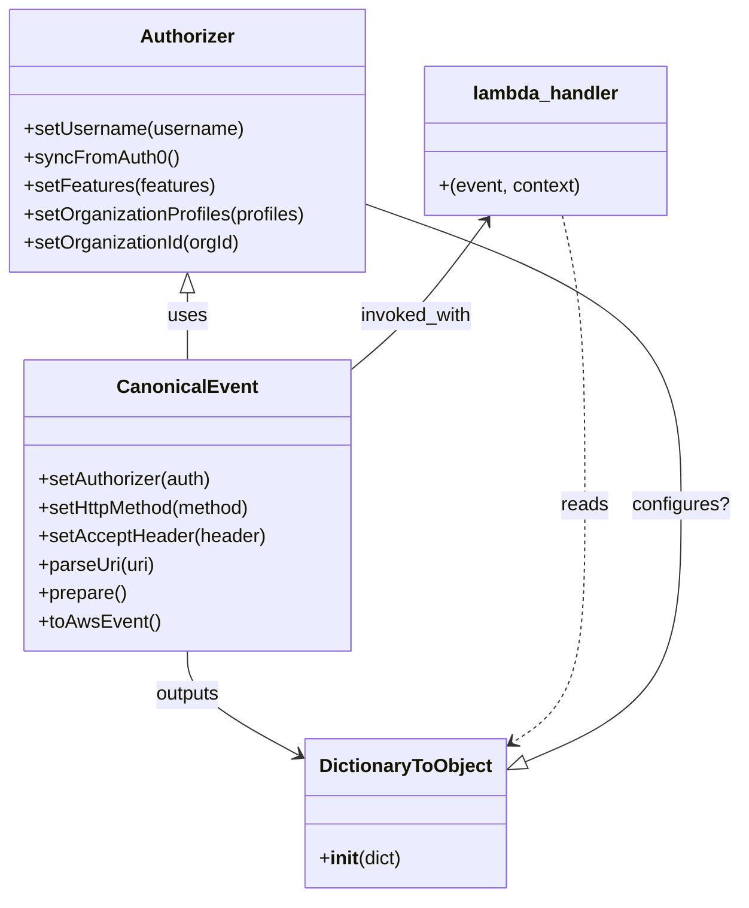

# Diagram: tools/ide_local_testing/localTest/test/partview/containerSearch/searchContainerCountByUrl.py


> Auto-generated by Obscura crawlers

## Diagram 1



### SVG

<svg id="container" width="627.18359375" xmlns="http://www.w3.org/2000/svg" class="classDiagram" height="758" viewBox="0 0 627.18359375 758" role="graphics-document document" aria-roledescription="class"><style>#container{font-family:"trebuchet ms",verdana,arial,sans-serif;font-size:16px;fill:#333;}@keyframes edge-animation-frame{from{stroke-dashoffset:0;}}@keyframes dash{to{stroke-dashoffset:0;}}#container .edge-animation-slow{stroke-dasharray:9,5!important;stroke-dashoffset:900;animation:dash 50s linear infinite;stroke-linecap:round;}#container .edge-animation-fast{stroke-dasharray:9,5!important;stroke-dashoffset:900;animation:dash 20s linear infinite;stroke-linecap:round;}#container .error-icon{fill:#552222;}#container .error-text{fill:#552222;stroke:#552222;}#container .edge-thickness-normal{stroke-width:1px;}#container .edge-thickness-thick{stroke-width:3.5px;}#container .edge-pattern-solid{stroke-dasharray:0;}#container .edge-thickness-invisible{stroke-width:0;fill:none;}#container .edge-pattern-dashed{stroke-dasharray:3;}#container .edge-pattern-dotted{stroke-dasharray:2;}#container .marker{fill:#333333;stroke:#333333;}#container .marker.cross{stroke:#333333;}#container svg{font-family:"trebuchet ms",verdana,arial,sans-serif;font-size:16px;}#container p{margin:0;}#container g.classGroup text{fill:#9370DB;stroke:none;font-family:"trebuchet ms",verdana,arial,sans-serif;font-size:10px;}#container g.classGroup text .title{font-weight:bolder;}#container .nodeLabel,#container .edgeLabel{color:#131300;}#container .edgeLabel .label rect{fill:#ECECFF;}#container .label text{fill:#131300;}#container .labelBkg{background:#ECECFF;}#container .edgeLabel .label span{background:#ECECFF;}#container .classTitle{font-weight:bolder;}#container .node rect,#container .node circle,#container .node ellipse,#container .node polygon,#container .node path{fill:#ECECFF;stroke:#9370DB;stroke-width:1px;}#container .divider{stroke:#9370DB;stroke-width:1;}#container g.clickable{cursor:pointer;}#container g.classGroup rect{fill:#ECECFF;stroke:#9370DB;}#container g.classGroup line{stroke:#9370DB;stroke-width:1;}#container .classLabel .box{stroke:none;stroke-width:0;fill:#ECECFF;opacity:0.5;}#container .classLabel .label{fill:#9370DB;font-size:10px;}#container .relation{stroke:#333333;stroke-width:1;fill:none;}#container .dashed-line{stroke-dasharray:3;}#container .dotted-line{stroke-dasharray:1 2;}#container #compositionStart,#container .composition{fill:#333333!important;stroke:#333333!important;stroke-width:1;}#container #compositionEnd,#container .composition{fill:#333333!important;stroke:#333333!important;stroke-width:1;}#container #dependencyStart,#container .dependency{fill:#333333!important;stroke:#333333!important;stroke-width:1;}#container #dependencyStart,#container .dependency{fill:#333333!important;stroke:#333333!important;stroke-width:1;}#container #extensionStart,#container .extension{fill:transparent!important;stroke:#333333!important;stroke-width:1;}#container #extensionEnd,#container .extension{fill:transparent!important;stroke:#333333!important;stroke-width:1;}#container #aggregationStart,#container .aggregation{fill:transparent!important;stroke:#333333!important;stroke-width:1;}#container #aggregationEnd,#container .aggregation{fill:transparent!important;stroke:#333333!important;stroke-width:1;}#container #lollipopStart,#container .lollipop{fill:#ECECFF!important;stroke:#333333!important;stroke-width:1;}#container #lollipopEnd,#container .lollipop{fill:#ECECFF!important;stroke:#333333!important;stroke-width:1;}#container .edgeTerminals{font-size:11px;line-height:initial;}#container .classTitleText{text-anchor:middle;font-size:18px;fill:#333;}#container .label-icon{display:inline-block;height:1em;overflow:visible;vertical-align:-0.125em;}#container .node .label-icon path{fill:currentColor;stroke:revert;stroke-width:revert;}#container :root{--mermaid-font-family:"trebuchet ms",verdana,arial,sans-serif;}</style><g><defs><marker id="container_class-aggregationStart" class="marker aggregation class" refX="18" refY="7" markerWidth="190" markerHeight="240" orient="auto"><path d="M 18,7 L9,13 L1,7 L9,1 Z"></path></marker></defs><defs><marker id="container_class-aggregationEnd" class="marker aggregation class" refX="1" refY="7" markerWidth="20" markerHeight="28" orient="auto"><path d="M 18,7 L9,13 L1,7 L9,1 Z"></path></marker></defs><defs><marker id="container_class-extensionStart" class="marker extension class" refX="18" refY="7" markerWidth="190" markerHeight="240" orient="auto"><path d="M 1,7 L18,13 V 1 Z"></path></marker></defs><defs><marker id="container_class-extensionEnd" class="marker extension class" refX="1" refY="7" markerWidth="20" markerHeight="28" orient="auto"><path d="M 1,1 V 13 L18,7 Z"></path></marker></defs><defs><marker id="container_class-compositionStart" class="marker composition class" refX="18" refY="7" markerWidth="190" markerHeight="240" orient="auto"><path d="M 18,7 L9,13 L1,7 L9,1 Z"></path></marker></defs><defs><marker id="container_class-compositionEnd" class="marker composition class" refX="1" refY="7" markerWidth="20" markerHeight="28" orient="auto"><path d="M 18,7 L9,13 L1,7 L9,1 Z"></path></marker></defs><defs><marker id="container_class-dependencyStart" class="marker dependency class" refX="6" refY="7" markerWidth="190" markerHeight="240" orient="auto"><path d="M 5,7 L9,13 L1,7 L9,1 Z"></path></marker></defs><defs><marker id="container_class-dependencyEnd" class="marker dependency class" refX="13" refY="7" markerWidth="20" markerHeight="28" orient="auto"><path d="M 18,7 L9,13 L14,7 L9,1 Z"></path></marker></defs><defs><marker id="container_class-lollipopStart" class="marker lollipop class" refX="13" refY="7" markerWidth="190" markerHeight="240" orient="auto"><circle stroke="black" fill="transparent" cx="7" cy="7" r="6"></circle></marker></defs><defs><marker id="container_class-lollipopEnd" class="marker lollipop class" refX="1" refY="7" markerWidth="190" markerHeight="240" orient="auto"><circle stroke="black" fill="transparent" cx="7" cy="7" r="6"></circle></marker></defs><g class="root"><g class="clusters"></g><g class="edgePaths"><path d="M159.668,247.25L159.668,250.542C159.668,253.833,159.668,260.417,159.668,269.875C159.668,279.333,159.668,291.667,159.668,297.833L159.668,304" id="id_Authorizer_CanonicalEvent_1" class="edge-thickness-normal edge-pattern-solid relation" style=";;;" data-edge="true" data-et="edge" data-id="id_Authorizer_CanonicalEvent_1" data-points="W3sieCI6MTU5LjY2Nzk2ODc1LCJ5IjoyMzB9LHsieCI6MTU5LjY2Nzk2ODc1LCJ5IjoyNjd9LHsieCI6MTU5LjY2Nzk2ODc1LCJ5IjozMDR9XQ==" marker-start="url(#container_class-extensionStart)"></path><path d="M159.668,550L159.668,556.167C159.668,562.333,159.668,574.667,176.097,589.663C192.526,604.66,225.384,622.319,241.813,631.149L258.242,639.979" id="id_CanonicalEvent_DictionaryToObject_2" class="edge-thickness-normal edge-pattern-solid relation" style=";;;" data-edge="true" data-et="edge" data-id="id_CanonicalEvent_DictionaryToObject_2" data-points="W3sieCI6MTU5LjY2Nzk2ODc1LCJ5Ijo1NTB9LHsieCI6MTU5LjY2Nzk2ODc1LCJ5Ijo1ODd9LHsieCI6MjYzLjUyNzM0Mzc1LCJ5Ijo2NDIuODE5NjE3MDY0MTU4Nn1d" marker-end="url(#container_class-dependencyEnd)"></path><path d="M478.106,182L481.37,196.167C484.635,210.333,491.163,238.667,494.427,279.5C497.691,320.333,497.691,373.667,497.691,427C497.691,480.333,497.691,533.667,486.9,567.434C476.11,601.202,454.528,615.405,443.737,622.506L432.946,629.607" id="id_lambda_handler_DictionaryToObject_3" class="edge-thickness-normal edge-pattern-dashed relation" style=";;;" data-edge="true" data-et="edge" data-id="id_lambda_handler_DictionaryToObject_3" data-points="W3sieCI6NDc4LjEwNjA0OTQwODc4MzgsInkiOjE4Mn0seyJ4Ijo0OTcuNjkxNDA2MjUsInkiOjI2N30seyJ4Ijo0OTcuNjkxNDA2MjUsInkiOjQyN30seyJ4Ijo0OTcuNjkxNDA2MjUsInkiOjU4N30seyJ4Ijo0MjcuOTMzNTkzNzUsInkiOjYzMi45MDUwOTQ4NTM3MzV9XQ==" marker-end="url(#container_class-dependencyEnd)"></path><path d="M413.359,186.822L403.462,200.185C393.565,213.548,373.771,240.274,354.12,261.669C334.469,283.063,314.961,299.127,305.207,307.158L295.453,315.19" id="id_lambda_handler_CanonicalEvent_4" class="edge-thickness-normal edge-pattern-solid relation" style=";;;" data-edge="true" data-et="edge" data-id="id_lambda_handler_CanonicalEvent_4" data-points="W3sieCI6NDE2LjkzMDEzNjE5MDg3ODQsInkiOjE4Mn0seyJ4IjozNTMuOTc2NTYyNSwieSI6MjY3fSx7IngiOjI5NS40NTMxMjUsInkiOjMxNS4xOTAwOTcwOTkwODkzfV0=" marker-start="url(#container_class-dependencyStart)"></path><path d="M311.336,172.601L355.854,188.335C400.371,204.068,489.406,235.534,533.924,277.934C578.441,320.333,578.441,373.667,578.441,427C578.441,480.333,578.441,533.667,555.998,569.978C533.555,606.288,488.669,625.577,466.225,635.221L443.782,644.865" id="id_Authorizer_DictionaryToObject_5" class="edge-thickness-normal edge-pattern-solid relation" style=";;;" data-edge="true" data-et="edge" data-id="id_Authorizer_DictionaryToObject_5" data-points="W3sieCI6MzExLjMzNTkzNzUsInkiOjE3Mi42MDE0NDAyMTc4OTgyNH0seyJ4Ijo1NzguNDQxNDA2MjUsInkiOjI2N30seyJ4Ijo1NzguNDQxNDA2MjUsInkiOjQyN30seyJ4Ijo1NzguNDQxNDA2MjUsInkiOjU4N30seyJ4Ijo0MjcuOTMzNTkzNzUsInkiOjY1MS42NzU4NjUzMTAzNzAzfV0=" marker-end="url(#container_class-extensionEnd)"></path></g><g class="edgeLabels"><g class="edgeLabel" transform="translate(159.66796875, 267)"><g class="label" data-id="id_Authorizer_CanonicalEvent_1" transform="translate(-16.4921875, -12)"><foreignObject width="32.984375" height="24"><div xmlns="http://www.w3.org/1999/xhtml" class="labelBkg" style="display: table-cell; white-space: nowrap; line-height: 1.5; max-width: 200px; text-align: center;"><span class="edgeLabel"><p>uses</p></span></div></foreignObject></g></g><g class="edgeLabel" transform="translate(159.66796875, 587)"><g class="label" data-id="id_CanonicalEvent_DictionaryToObject_2" transform="translate(-28.25, -12)"><foreignObject width="56.5" height="24"><div xmlns="http://www.w3.org/1999/xhtml" class="labelBkg" style="display: table-cell; white-space: nowrap; line-height: 1.5; max-width: 200px; text-align: center;"><span class="edgeLabel"><p>outputs</p></span></div></foreignObject></g></g><g class="edgeLabel" transform="translate(497.69140625, 427)"><g class="label" data-id="id_lambda_handler_DictionaryToObject_3" transform="translate(-20.0078125, -12)"><foreignObject width="40.015625" height="24"><div xmlns="http://www.w3.org/1999/xhtml" class="labelBkg" style="display: table-cell; white-space: nowrap; line-height: 1.5; max-width: 200px; text-align: center;"><span class="edgeLabel"><p>reads</p></span></div></foreignObject></g></g><g class="edgeLabel" transform="translate(353.9765625, 267)"><g class="label" data-id="id_lambda_handler_CanonicalEvent_4" transform="translate(-48.203125, -12)"><foreignObject width="96.40625" height="24"><div xmlns="http://www.w3.org/1999/xhtml" class="labelBkg" style="display: table-cell; white-space: nowrap; line-height: 1.5; max-width: 200px; text-align: center;"><span class="edgeLabel"><p>invoked_with</p></span></div></foreignObject></g></g><g class="edgeLabel" transform="translate(578.44140625, 427)"><g class="label" data-id="id_Authorizer_DictionaryToObject_5" transform="translate(-40.7421875, -12)"><foreignObject width="81.484375" height="24"><div xmlns="http://www.w3.org/1999/xhtml" class="labelBkg" style="display: table-cell; white-space: nowrap; line-height: 1.5; max-width: 200px; text-align: center;"><span class="edgeLabel"><p>configures?</p></span></div></foreignObject></g></g></g><g class="nodes"><g class="node default" id="classId-Authorizer-0" transform="translate(159.66796875, 119)"><g class="basic label-container"><path d="M-151.66796875 -111 L151.66796875 -111 L151.66796875 111 L-151.66796875 111" stroke="none" stroke-width="0" fill="#ECECFF" style=""></path><path d="M-151.66796875 -111 C-84.26444834834149 -111, -16.860927946682978 -111, 151.66796875 -111 M-151.66796875 -111 C-55.85083844806992 -111, 39.966291853860156 -111, 151.66796875 -111 M151.66796875 -111 C151.66796875 -66.58400350300356, 151.66796875 -22.168007006007116, 151.66796875 111 M151.66796875 -111 C151.66796875 -65.02483405118696, 151.66796875 -19.0496681023739, 151.66796875 111 M151.66796875 111 C38.72139412118128 111, -74.22518050763745 111, -151.66796875 111 M151.66796875 111 C43.11348599431564 111, -65.44099676136872 111, -151.66796875 111 M-151.66796875 111 C-151.66796875 28.5526602222878, -151.66796875 -53.8946795554244, -151.66796875 -111 M-151.66796875 111 C-151.66796875 34.65288145971722, -151.66796875 -41.69423708056556, -151.66796875 -111" stroke="#9370DB" stroke-width="1.3" fill="none" stroke-dasharray="0 0" style=""></path></g><g class="annotation-group text" transform="translate(0, -87)"></g><g class="label-group text" transform="translate(-38.3671875, -87)"><g class="label" style="font-weight: bolder" transform="translate(0,-12)"><foreignObject width="76.734375" height="24"><div xmlns="http://www.w3.org/1999/xhtml" style="display: table-cell; white-space: nowrap; line-height: 1.5; max-width: 126px; text-align: center;"><span class="nodeLabel markdown-node-label" style=""><p>Authorizer</p></span></div></foreignObject></g></g><g class="members-group text" transform="translate(-139.66796875, -39)"></g><g class="methods-group text" transform="translate(-139.66796875, -9)"><g class="label" style="" transform="translate(0,-12)"><foreignObject width="185.90625" height="24"><div xmlns="http://www.w3.org/1999/xhtml" style="display: table-cell; white-space: nowrap; line-height: 1.5; max-width: 243px; text-align: center;"><span class="nodeLabel markdown-node-label" style=""><p>+setUsername(username)</p></span></div></foreignObject></g><g class="label" style="" transform="translate(0,12)"><foreignObject width="129.0625" height="24"><div xmlns="http://www.w3.org/1999/xhtml" style="display: table-cell; white-space: nowrap; line-height: 1.5; max-width: 186px; text-align: center;"><span class="nodeLabel markdown-node-label" style=""><p>+syncFromAuth0()</p></span></div></foreignObject></g><g class="label" style="" transform="translate(0,36)"><foreignObject width="161.296875" height="24"><div xmlns="http://www.w3.org/1999/xhtml" style="display: table-cell; white-space: nowrap; line-height: 1.5; max-width: 219px; text-align: center;"><span class="nodeLabel markdown-node-label" style=""><p>+setFeatures(features)</p></span></div></foreignObject></g><g class="label" style="" transform="translate(0,60)"><foreignObject width="240.96875" height="24"><div xmlns="http://www.w3.org/1999/xhtml" style="display: table-cell; white-space: nowrap; line-height: 1.5; max-width: 298px; text-align: center;"><span class="nodeLabel markdown-node-label" style=""><p>+setOrganizationProfiles(profiles)</p></span></div></foreignObject></g><g class="label" style="" transform="translate(0,84)"><foreignObject width="184.578125" height="24"><div xmlns="http://www.w3.org/1999/xhtml" style="display: table-cell; white-space: nowrap; line-height: 1.5; max-width: 242px; text-align: center;"><span class="nodeLabel markdown-node-label" style=""><p>+setOrganizationId(orgId)</p></span></div></foreignObject></g></g><g class="divider" style=""><path d="M-151.66796875 -63 C-55.83419897600818 -63, 39.99957079798364 -63, 151.66796875 -63 M-151.66796875 -63 C-64.25590257589194 -63, 23.156163598216125 -63, 151.66796875 -63" stroke="#9370DB" stroke-width="1.3" fill="none" stroke-dasharray="0 0" style=""></path></g><g class="divider" style=""><path d="M-151.66796875 -39 C-61.84623218673741 -39, 27.97550437652518 -39, 151.66796875 -39 M-151.66796875 -39 C-40.730777914341004 -39, 70.20641292131799 -39, 151.66796875 -39" stroke="#9370DB" stroke-width="1.3" fill="none" stroke-dasharray="0 0" style=""></path></g></g><g class="node default" id="classId-CanonicalEvent-1" transform="translate(159.66796875, 427)"><g class="basic label-container"><path d="M-135.78515625 -123 L135.78515625 -123 L135.78515625 123 L-135.78515625 123" stroke="none" stroke-width="0" fill="#ECECFF" style=""></path><path d="M-135.78515625 -123 C-49.79732612110537 -123, 36.19050400778926 -123, 135.78515625 -123 M-135.78515625 -123 C-39.52501851725083 -123, 56.735119215498344 -123, 135.78515625 -123 M135.78515625 -123 C135.78515625 -33.711044901124964, 135.78515625 55.57791019775007, 135.78515625 123 M135.78515625 -123 C135.78515625 -70.38669094811613, 135.78515625 -17.773381896232266, 135.78515625 123 M135.78515625 123 C54.789289899704585 123, -26.20657645059083 123, -135.78515625 123 M135.78515625 123 C65.90932943727982 123, -3.9664973754403547 123, -135.78515625 123 M-135.78515625 123 C-135.78515625 55.824814290918596, -135.78515625 -11.350371418162808, -135.78515625 -123 M-135.78515625 123 C-135.78515625 71.47615614534935, -135.78515625 19.9523122906987, -135.78515625 -123" stroke="#9370DB" stroke-width="1.3" fill="none" stroke-dasharray="0 0" style=""></path></g><g class="annotation-group text" transform="translate(0, -99)"></g><g class="label-group text" transform="translate(-55.7109375, -99)"><g class="label" style="font-weight: bolder" transform="translate(0,-12)"><foreignObject width="111.421875" height="24"><div xmlns="http://www.w3.org/1999/xhtml" style="display: table-cell; white-space: nowrap; line-height: 1.5; max-width: 161px; text-align: center;"><span class="nodeLabel markdown-node-label" style=""><p>CanonicalEvent</p></span></div></foreignObject></g></g><g class="members-group text" transform="translate(-123.78515625, -51)"></g><g class="methods-group text" transform="translate(-123.78515625, -21)"><g class="label" style="" transform="translate(0,-12)"><foreignObject width="148.9375" height="24"><div xmlns="http://www.w3.org/1999/xhtml" style="display: table-cell; white-space: nowrap; line-height: 1.5; max-width: 206px; text-align: center;"><span class="nodeLabel markdown-node-label" style=""><p>+setAuthorizer(auth)</p></span></div></foreignObject></g><g class="label" style="" transform="translate(0,12)"><foreignObject width="184" height="24"><div xmlns="http://www.w3.org/1999/xhtml" style="display: table-cell; white-space: nowrap; line-height: 1.5; max-width: 241px; text-align: center;"><span class="nodeLabel markdown-node-label" style=""><p>+setHttpMethod(method)</p></span></div></foreignObject></g><g class="label" style="" transform="translate(0,36)"><foreignObject width="191.859375" height="24"><div xmlns="http://www.w3.org/1999/xhtml" style="display: table-cell; white-space: nowrap; line-height: 1.5; max-width: 249px; text-align: center;"><span class="nodeLabel markdown-node-label" style=""><p>+setAcceptHeader(header)</p></span></div></foreignObject></g><g class="label" style="" transform="translate(0,60)"><foreignObject width="99.8125" height="24"><div xmlns="http://www.w3.org/1999/xhtml" style="display: table-cell; white-space: nowrap; line-height: 1.5; max-width: 157px; text-align: center;"><span class="nodeLabel markdown-node-label" style=""><p>+parseUri(uri)</p></span></div></foreignObject></g><g class="label" style="" transform="translate(0,84)"><foreignObject width="74.75" height="24"><div xmlns="http://www.w3.org/1999/xhtml" style="display: table-cell; white-space: nowrap; line-height: 1.5; max-width: 132px; text-align: center;"><span class="nodeLabel markdown-node-label" style=""><p>+prepare()</p></span></div></foreignObject></g><g class="label" style="" transform="translate(0,108)"><foreignObject width="101.1875" height="24"><div xmlns="http://www.w3.org/1999/xhtml" style="display: table-cell; white-space: nowrap; line-height: 1.5; max-width: 159px; text-align: center;"><span class="nodeLabel markdown-node-label" style=""><p>+toAwsEvent()</p></span></div></foreignObject></g></g><g class="divider" style=""><path d="M-135.78515625 -75 C-44.6491965764767 -75, 46.486763097046605 -75, 135.78515625 -75 M-135.78515625 -75 C-34.25554637771404 -75, 67.27406349457192 -75, 135.78515625 -75" stroke="#9370DB" stroke-width="1.3" fill="none" stroke-dasharray="0 0" style=""></path></g><g class="divider" style=""><path d="M-135.78515625 -51 C-71.62295131399357 -51, -7.460746377987135 -51, 135.78515625 -51 M-135.78515625 -51 C-43.48738224859076 -51, 48.810391752818475 -51, 135.78515625 -51" stroke="#9370DB" stroke-width="1.3" fill="none" stroke-dasharray="0 0" style=""></path></g></g><g class="node default" id="classId-DictionaryToObject-2" transform="translate(345.73046875, 687)"><g class="basic label-container"><path d="M-82.203125 -63 L82.203125 -63 L82.203125 63 L-82.203125 63" stroke="none" stroke-width="0" fill="#ECECFF" style=""></path><path d="M-82.203125 -63 C-23.28594687336099 -63, 35.63123125327802 -63, 82.203125 -63 M-82.203125 -63 C-26.897603931003353 -63, 28.407917137993294 -63, 82.203125 -63 M82.203125 -63 C82.203125 -34.711870098099226, 82.203125 -6.423740196198445, 82.203125 63 M82.203125 -63 C82.203125 -12.743095841375244, 82.203125 37.51380831724951, 82.203125 63 M82.203125 63 C37.64866250461555 63, -6.905799990768898 63, -82.203125 63 M82.203125 63 C44.901425192269095 63, 7.599725384538189 63, -82.203125 63 M-82.203125 63 C-82.203125 28.005766014075597, -82.203125 -6.988467971848806, -82.203125 -63 M-82.203125 63 C-82.203125 30.46009285169086, -82.203125 -2.079814296618281, -82.203125 -63" stroke="#9370DB" stroke-width="1.3" fill="none" stroke-dasharray="0 0" style=""></path></g><g class="annotation-group text" transform="translate(0, -39)"></g><g class="label-group text" transform="translate(-70.109375, -39)"><g class="label" style="font-weight: bolder" transform="translate(0,-12)"><foreignObject width="140.21875" height="24"><div xmlns="http://www.w3.org/1999/xhtml" style="display: table-cell; white-space: nowrap; line-height: 1.5; max-width: 188px; text-align: center;"><span class="nodeLabel markdown-node-label" style=""><p>DictionaryToObject</p></span></div></foreignObject></g></g><g class="members-group text" transform="translate(-70.203125, 9)"></g><g class="methods-group text" transform="translate(-70.203125, 39)"><g class="label" style="" transform="translate(0,-12)"><foreignObject width="70.296875" height="24"><div xmlns="http://www.w3.org/1999/xhtml" style="display: table-cell; white-space: nowrap; line-height: 1.5; max-width: 159px; text-align: center;"><span class="nodeLabel markdown-node-label" style=""><p>+<strong>init</strong>(dict)</p></span></div></foreignObject></g></g><g class="divider" style=""><path d="M-82.203125 -15 C-18.819348600657882 -15, 44.564427798684235 -15, 82.203125 -15 M-82.203125 -15 C-34.10729880327202 -15, 13.988527393455954 -15, 82.203125 -15" stroke="#9370DB" stroke-width="1.3" fill="none" stroke-dasharray="0 0" style=""></path></g><g class="divider" style=""><path d="M-82.203125 9 C-21.54564638584244 9, 39.11183222831512 9, 82.203125 9 M-82.203125 9 C-24.531567796445927 9, 33.139989407108146 9, 82.203125 9" stroke="#9370DB" stroke-width="1.3" fill="none" stroke-dasharray="0 0" style=""></path></g></g><g class="node default" id="classId-lambda_handler-3" transform="translate(463.58984375, 119)"><g class="basic label-container"><path d="M-102.25390625 -63 L102.25390625 -63 L102.25390625 63 L-102.25390625 63" stroke="none" stroke-width="0" fill="#ECECFF" style=""></path><path d="M-102.25390625 -63 C-57.91035911318214 -63, -13.566811976364278 -63, 102.25390625 -63 M-102.25390625 -63 C-49.034754963712686 -63, 4.184396322574628 -63, 102.25390625 -63 M102.25390625 -63 C102.25390625 -34.69427967000594, 102.25390625 -6.388559340011888, 102.25390625 63 M102.25390625 -63 C102.25390625 -20.883061150445712, 102.25390625 21.233877699108575, 102.25390625 63 M102.25390625 63 C52.21490691181034 63, 2.1759075736206768 63, -102.25390625 63 M102.25390625 63 C33.705110329579156 63, -34.84368559084169 63, -102.25390625 63 M-102.25390625 63 C-102.25390625 21.170732049286535, -102.25390625 -20.65853590142693, -102.25390625 -63 M-102.25390625 63 C-102.25390625 37.21967324986777, -102.25390625 11.439346499735535, -102.25390625 -63" stroke="#9370DB" stroke-width="1.3" fill="none" stroke-dasharray="0 0" style=""></path></g><g class="annotation-group text" transform="translate(0, -39)"></g><g class="label-group text" transform="translate(-59.9765625, -39)"><g class="label" style="font-weight: bolder" transform="translate(0,-12)"><foreignObject width="119.953125" height="24"><div xmlns="http://www.w3.org/1999/xhtml" style="display: table-cell; white-space: nowrap; line-height: 1.5; max-width: 170px; text-align: center;"><span class="nodeLabel markdown-node-label" style=""><p>lambda_handler</p></span></div></foreignObject></g></g><g class="members-group text" transform="translate(-90.25390625, 9)"></g><g class="methods-group text" transform="translate(-90.25390625, 39)"><g class="label" style="" transform="translate(0,-12)"><foreignObject width="120.53125" height="24"><div xmlns="http://www.w3.org/1999/xhtml" style="display: table-cell; white-space: nowrap; line-height: 1.5; max-width: 171px; text-align: center;"><span class="nodeLabel markdown-node-label" style=""><p>+(event, context)</p></span></div></foreignObject></g></g><g class="divider" style=""><path d="M-102.25390625 -15 C-26.423599123053194 -15, 49.40670800389361 -15, 102.25390625 -15 M-102.25390625 -15 C-53.25691452621496 -15, -4.2599228024299265 -15, 102.25390625 -15" stroke="#9370DB" stroke-width="1.3" fill="none" stroke-dasharray="0 0" style=""></path></g><g class="divider" style=""><path d="M-102.25390625 9 C-22.57956556293324 9, 57.09477512413352 9, 102.25390625 9 M-102.25390625 9 C-39.37020150175421 9, 23.51350324649158 9, 102.25390625 9" stroke="#9370DB" stroke-width="1.3" fill="none" stroke-dasharray="0 0" style=""></path></g></g></g></g></g></svg>

## Diagram 2

```mermaid
flowchart TD
    A[Script Start] --> B[Create Authorizer]
    B --> C{set activeOrgId?}
    C -- yes --> B2[setOrganizationId(activeOrgId)]
    C -- no --> D[skip orgId]
    B --> E[Build CanonicalEvent]
    E --> F[parseUri(uri)]
    F --> G[toAwsEvent()]
    G --> H[Call lambda_handler(event, DictionaryToObject(...))]
    H --> I{retval.body exists?}
    I -- yes --> J[json.loads(retval.body) -> prettyRetval]
    I -- no --> K[prettyRetval = ""]
    J --> L[print(prettyRetval)]
    K --> L
    L --> M[Script End]
```

> SVG rendering failed for this diagram.
