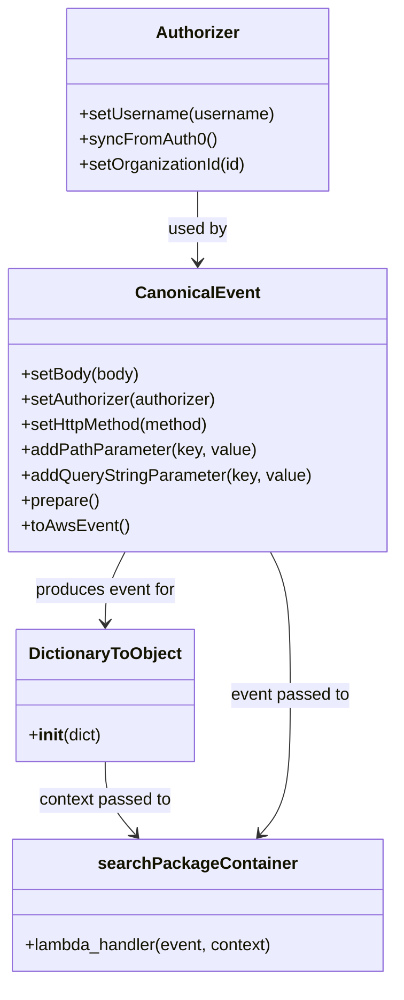

# Diagram: tools/ide_local_testing/localTest/test/partview/containerSearch/searchContainerFull.py


> Auto-generated by Obscura crawlers

## Diagram 1

```mermaid
flowchart TD
  A[Create Authorizer] --> B[Set Username]
  B --> C[Sync From Auth0]
  C --> D[Set OrganizationId]
  D --> E[Create CanonicalEvent]
  E --> F[Set Body None]
  F --> G[Set Authorizer]
  G --> H[Set HttpMethod GET]
  H --> I[Add PathParameter type=app]
  I --> J[Add Query pageNumber=0]
  J --> K[Add Query pageSize=20]
  K --> L[Add Query trackingNumber:contains=R7O9ESQI84]
  L --> M[Prepare Event]
  M --> N[Convert to AWS Event]
  N --> O[Create Context DictionaryToObject(function_name=searchPartviewPackageContainer)]
  O --> P[Call searchPackageContainer.lambda_handler(event, context)]
  P --> Q[Print Result]
```

> SVG rendering failed for this diagram.

## Diagram 2



### SVG

<svg id="container" width="372.8828125" xmlns="http://www.w3.org/2000/svg" class="classDiagram" height="934" viewBox="0 0 372.8828125 934" role="graphics-document document" aria-roledescription="class"><style>#container{font-family:"trebuchet ms",verdana,arial,sans-serif;font-size:16px;fill:#333;}@keyframes edge-animation-frame{from{stroke-dashoffset:0;}}@keyframes dash{to{stroke-dashoffset:0;}}#container .edge-animation-slow{stroke-dasharray:9,5!important;stroke-dashoffset:900;animation:dash 50s linear infinite;stroke-linecap:round;}#container .edge-animation-fast{stroke-dasharray:9,5!important;stroke-dashoffset:900;animation:dash 20s linear infinite;stroke-linecap:round;}#container .error-icon{fill:#552222;}#container .error-text{fill:#552222;stroke:#552222;}#container .edge-thickness-normal{stroke-width:1px;}#container .edge-thickness-thick{stroke-width:3.5px;}#container .edge-pattern-solid{stroke-dasharray:0;}#container .edge-thickness-invisible{stroke-width:0;fill:none;}#container .edge-pattern-dashed{stroke-dasharray:3;}#container .edge-pattern-dotted{stroke-dasharray:2;}#container .marker{fill:#333333;stroke:#333333;}#container .marker.cross{stroke:#333333;}#container svg{font-family:"trebuchet ms",verdana,arial,sans-serif;font-size:16px;}#container p{margin:0;}#container g.classGroup text{fill:#9370DB;stroke:none;font-family:"trebuchet ms",verdana,arial,sans-serif;font-size:10px;}#container g.classGroup text .title{font-weight:bolder;}#container .nodeLabel,#container .edgeLabel{color:#131300;}#container .edgeLabel .label rect{fill:#ECECFF;}#container .label text{fill:#131300;}#container .labelBkg{background:#ECECFF;}#container .edgeLabel .label span{background:#ECECFF;}#container .classTitle{font-weight:bolder;}#container .node rect,#container .node circle,#container .node ellipse,#container .node polygon,#container .node path{fill:#ECECFF;stroke:#9370DB;stroke-width:1px;}#container .divider{stroke:#9370DB;stroke-width:1;}#container g.clickable{cursor:pointer;}#container g.classGroup rect{fill:#ECECFF;stroke:#9370DB;}#container g.classGroup line{stroke:#9370DB;stroke-width:1;}#container .classLabel .box{stroke:none;stroke-width:0;fill:#ECECFF;opacity:0.5;}#container .classLabel .label{fill:#9370DB;font-size:10px;}#container .relation{stroke:#333333;stroke-width:1;fill:none;}#container .dashed-line{stroke-dasharray:3;}#container .dotted-line{stroke-dasharray:1 2;}#container #compositionStart,#container .composition{fill:#333333!important;stroke:#333333!important;stroke-width:1;}#container #compositionEnd,#container .composition{fill:#333333!important;stroke:#333333!important;stroke-width:1;}#container #dependencyStart,#container .dependency{fill:#333333!important;stroke:#333333!important;stroke-width:1;}#container #dependencyStart,#container .dependency{fill:#333333!important;stroke:#333333!important;stroke-width:1;}#container #extensionStart,#container .extension{fill:transparent!important;stroke:#333333!important;stroke-width:1;}#container #extensionEnd,#container .extension{fill:transparent!important;stroke:#333333!important;stroke-width:1;}#container #aggregationStart,#container .aggregation{fill:transparent!important;stroke:#333333!important;stroke-width:1;}#container #aggregationEnd,#container .aggregation{fill:transparent!important;stroke:#333333!important;stroke-width:1;}#container #lollipopStart,#container .lollipop{fill:#ECECFF!important;stroke:#333333!important;stroke-width:1;}#container #lollipopEnd,#container .lollipop{fill:#ECECFF!important;stroke:#333333!important;stroke-width:1;}#container .edgeTerminals{font-size:11px;line-height:initial;}#container .classTitleText{text-anchor:middle;font-size:18px;fill:#333;}#container .label-icon{display:inline-block;height:1em;overflow:visible;vertical-align:-0.125em;}#container .node .label-icon path{fill:currentColor;stroke:revert;stroke-width:revert;}#container :root{--mermaid-font-family:"trebuchet ms",verdana,arial,sans-serif;}</style><g><defs><marker id="container_class-aggregationStart" class="marker aggregation class" refX="18" refY="7" markerWidth="190" markerHeight="240" orient="auto"><path d="M 18,7 L9,13 L1,7 L9,1 Z"></path></marker></defs><defs><marker id="container_class-aggregationEnd" class="marker aggregation class" refX="1" refY="7" markerWidth="20" markerHeight="28" orient="auto"><path d="M 18,7 L9,13 L1,7 L9,1 Z"></path></marker></defs><defs><marker id="container_class-extensionStart" class="marker extension class" refX="18" refY="7" markerWidth="190" markerHeight="240" orient="auto"><path d="M 1,7 L18,13 V 1 Z"></path></marker></defs><defs><marker id="container_class-extensionEnd" class="marker extension class" refX="1" refY="7" markerWidth="20" markerHeight="28" orient="auto"><path d="M 1,1 V 13 L18,7 Z"></path></marker></defs><defs><marker id="container_class-compositionStart" class="marker composition class" refX="18" refY="7" markerWidth="190" markerHeight="240" orient="auto"><path d="M 18,7 L9,13 L1,7 L9,1 Z"></path></marker></defs><defs><marker id="container_class-compositionEnd" class="marker composition class" refX="1" refY="7" markerWidth="20" markerHeight="28" orient="auto"><path d="M 18,7 L9,13 L1,7 L9,1 Z"></path></marker></defs><defs><marker id="container_class-dependencyStart" class="marker dependency class" refX="6" refY="7" markerWidth="190" markerHeight="240" orient="auto"><path d="M 5,7 L9,13 L1,7 L9,1 Z"></path></marker></defs><defs><marker id="container_class-dependencyEnd" class="marker dependency class" refX="13" refY="7" markerWidth="20" markerHeight="28" orient="auto"><path d="M 18,7 L9,13 L14,7 L9,1 Z"></path></marker></defs><defs><marker id="container_class-lollipopStart" class="marker lollipop class" refX="13" refY="7" markerWidth="190" markerHeight="240" orient="auto"><circle stroke="black" fill="transparent" cx="7" cy="7" r="6"></circle></marker></defs><defs><marker id="container_class-lollipopEnd" class="marker lollipop class" refX="1" refY="7" markerWidth="190" markerHeight="240" orient="auto"><circle stroke="black" fill="transparent" cx="7" cy="7" r="6"></circle></marker></defs><g class="root"><g class="clusters"></g><g class="edgePaths"><path d="M186.441,182L186.441,188.167C186.441,194.333,186.441,206.667,186.441,218C186.441,229.333,186.441,239.667,186.441,244.833L186.441,250" id="id_Authorizer_CanonicalEvent_1" class="edge-thickness-normal edge-pattern-solid relation" style=";;;" data-edge="true" data-et="edge" data-id="id_Authorizer_CanonicalEvent_1" data-points="W3sieCI6MTg2LjQ0MTQwNjI1LCJ5IjoxODJ9LHsieCI6MTg2LjQ0MTQwNjI1LCJ5IjoyMTl9LHsieCI6MTg2LjQ0MTQwNjI1LCJ5IjoyNTZ9XQ==" marker-end="url(#container_class-dependencyEnd)"></path><path d="M117.948,526L114.819,532.167C111.691,538.333,105.433,550.667,102.304,562C99.176,573.333,99.176,583.667,99.176,588.833L99.176,594" id="id_CanonicalEvent_DictionaryToObject_2" class="edge-thickness-normal edge-pattern-solid relation" style=";;;" data-edge="true" data-et="edge" data-id="id_CanonicalEvent_DictionaryToObject_2" data-points="W3sieCI6MTE3Ljk0ODAzNzc5MDY5NzY3LCJ5Ijo1MjZ9LHsieCI6OTkuMTc1NzgxMjUsInkiOjU2M30seyJ4Ijo5OS4xNzU3ODEyNSwieSI6NjAwfV0=" marker-end="url(#container_class-dependencyEnd)"></path><path d="M99.176,726L99.176,732.167C99.176,738.333,99.176,750.667,103.9,762.247C108.624,773.826,118.071,784.653,122.795,790.066L127.519,795.479" id="id_DictionaryToObject_searchPackageContainer_3" class="edge-thickness-normal edge-pattern-solid relation" style=";;;" data-edge="true" data-et="edge" data-id="id_DictionaryToObject_searchPackageContainer_3" data-points="W3sieCI6OTkuMTc1NzgxMjUsInkiOjcyNn0seyJ4Ijo5OS4xNzU3ODEyNSwieSI6NzYzfSx7IngiOjEzMS40NjQwNjI1LCJ5Ijo4MDB9XQ==" marker-end="url(#container_class-dependencyEnd)"></path><path d="M254.935,526L258.063,532.167C261.192,538.333,267.45,550.667,270.578,573.5C273.707,596.333,273.707,629.667,273.707,663C273.707,696.333,273.707,729.667,268.983,751.747C264.259,773.826,254.812,784.653,250.088,790.066L245.364,795.479" id="id_CanonicalEvent_searchPackageContainer_4" class="edge-thickness-normal edge-pattern-solid relation" style=";;;" data-edge="true" data-et="edge" data-id="id_CanonicalEvent_searchPackageContainer_4" data-points="W3sieCI6MjU0LjkzNDc3NDcwOTMwMjMzLCJ5Ijo1MjZ9LHsieCI6MjczLjcwNzAzMTI1LCJ5Ijo1NjN9LHsieCI6MjczLjcwNzAzMTI1LCJ5Ijo2NjN9LHsieCI6MjczLjcwNzAzMTI1LCJ5Ijo3NjN9LHsieCI6MjQxLjQxODc1LCJ5Ijo4MDB9XQ==" marker-end="url(#container_class-dependencyEnd)"></path></g><g class="edgeLabels"><g class="edgeLabel" transform="translate(186.44140625, 219)"><g class="label" data-id="id_Authorizer_CanonicalEvent_1" transform="translate(-28.3125, -12)"><foreignObject width="56.625" height="24"><div xmlns="http://www.w3.org/1999/xhtml" class="labelBkg" style="display: table-cell; white-space: nowrap; line-height: 1.5; max-width: 200px; text-align: center;"><span class="edgeLabel"><p>used by</p></span></div></foreignObject></g></g><g class="edgeLabel" transform="translate(99.17578125, 563)"><g class="label" data-id="id_CanonicalEvent_DictionaryToObject_2" transform="translate(-68.2421875, -12)"><foreignObject width="136.484375" height="24"><div xmlns="http://www.w3.org/1999/xhtml" class="labelBkg" style="display: table-cell; white-space: nowrap; line-height: 1.5; max-width: 200px; text-align: center;"><span class="edgeLabel"><p>produces event for</p></span></div></foreignObject></g></g><g class="edgeLabel" transform="translate(99.17578125, 763)"><g class="label" data-id="id_DictionaryToObject_searchPackageContainer_3" transform="translate(-64.015625, -12)"><foreignObject width="128.03125" height="24"><div xmlns="http://www.w3.org/1999/xhtml" class="labelBkg" style="display: table-cell; white-space: nowrap; line-height: 1.5; max-width: 200px; text-align: center;"><span class="edgeLabel"><p>context passed to</p></span></div></foreignObject></g></g><g class="edgeLabel" transform="translate(273.70703125, 663)"><g class="label" data-id="id_CanonicalEvent_searchPackageContainer_4" transform="translate(-57.328125, -12)"><foreignObject width="114.65625" height="24"><div xmlns="http://www.w3.org/1999/xhtml" class="labelBkg" style="display: table-cell; white-space: nowrap; line-height: 1.5; max-width: 200px; text-align: center;"><span class="edgeLabel"><p>event passed to</p></span></div></foreignObject></g></g></g><g class="nodes"><g class="node default" id="classId-Authorizer-0" transform="translate(186.44140625, 95)"><g class="basic label-container"><path d="M-124.13671875 -87 L124.13671875 -87 L124.13671875 87 L-124.13671875 87" stroke="none" stroke-width="0" fill="#ECECFF" style=""></path><path d="M-124.13671875 -87 C-65.0552342979812 -87, -5.973749845962388 -87, 124.13671875 -87 M-124.13671875 -87 C-71.58244785779158 -87, -19.028176965583157 -87, 124.13671875 -87 M124.13671875 -87 C124.13671875 -19.357699520712558, 124.13671875 48.284600958574885, 124.13671875 87 M124.13671875 -87 C124.13671875 -50.304829554474104, 124.13671875 -13.609659108948208, 124.13671875 87 M124.13671875 87 C48.7373101576177 87, -26.6620984347646 87, -124.13671875 87 M124.13671875 87 C46.574637928419705 87, -30.98744289316059 87, -124.13671875 87 M-124.13671875 87 C-124.13671875 46.930635748449305, -124.13671875 6.86127149689861, -124.13671875 -87 M-124.13671875 87 C-124.13671875 19.999480158828675, -124.13671875 -47.00103968234265, -124.13671875 -87" stroke="#9370DB" stroke-width="1.3" fill="none" stroke-dasharray="0 0" style=""></path></g><g class="annotation-group text" transform="translate(0, -63)"></g><g class="label-group text" transform="translate(-38.3671875, -63)"><g class="label" style="font-weight: bolder" transform="translate(0,-12)"><foreignObject width="76.734375" height="24"><div xmlns="http://www.w3.org/1999/xhtml" style="display: table-cell; white-space: nowrap; line-height: 1.5; max-width: 126px; text-align: center;"><span class="nodeLabel markdown-node-label" style=""><p>Authorizer</p></span></div></foreignObject></g></g><g class="members-group text" transform="translate(-112.13671875, -15)"></g><g class="methods-group text" transform="translate(-112.13671875, 15)"><g class="label" style="" transform="translate(0,-12)"><foreignObject width="185.90625" height="24"><div xmlns="http://www.w3.org/1999/xhtml" style="display: table-cell; white-space: nowrap; line-height: 1.5; max-width: 243px; text-align: center;"><span class="nodeLabel markdown-node-label" style=""><p>+setUsername(username)</p></span></div></foreignObject></g><g class="label" style="" transform="translate(0,12)"><foreignObject width="129.0625" height="24"><div xmlns="http://www.w3.org/1999/xhtml" style="display: table-cell; white-space: nowrap; line-height: 1.5; max-width: 186px; text-align: center;"><span class="nodeLabel markdown-node-label" style=""><p>+syncFromAuth0()</p></span></div></foreignObject></g><g class="label" style="" transform="translate(0,36)"><foreignObject width="160.78125" height="24"><div xmlns="http://www.w3.org/1999/xhtml" style="display: table-cell; white-space: nowrap; line-height: 1.5; max-width: 218px; text-align: center;"><span class="nodeLabel markdown-node-label" style=""><p>+setOrganizationId(id)</p></span></div></foreignObject></g></g><g class="divider" style=""><path d="M-124.13671875 -39 C-46.97768162442708 -39, 30.181355501145845 -39, 124.13671875 -39 M-124.13671875 -39 C-33.45161068172858 -39, 57.23349738654284 -39, 124.13671875 -39" stroke="#9370DB" stroke-width="1.3" fill="none" stroke-dasharray="0 0" style=""></path></g><g class="divider" style=""><path d="M-124.13671875 -15 C-45.40146439271547 -15, 33.333789964569064 -15, 124.13671875 -15 M-124.13671875 -15 C-66.76603280482338 -15, -9.395346859646764 -15, 124.13671875 -15" stroke="#9370DB" stroke-width="1.3" fill="none" stroke-dasharray="0 0" style=""></path></g></g><g class="node default" id="classId-CanonicalEvent-1" transform="translate(186.44140625, 391)"><g class="basic label-container"><path d="M-178.44140625 -135 L178.44140625 -135 L178.44140625 135 L-178.44140625 135" stroke="none" stroke-width="0" fill="#ECECFF" style=""></path><path d="M-178.44140625 -135 C-98.10570828933818 -135, -17.770010328676364 -135, 178.44140625 -135 M-178.44140625 -135 C-48.25563145823787 -135, 81.93014333352426 -135, 178.44140625 -135 M178.44140625 -135 C178.44140625 -44.62528284795985, 178.44140625 45.749434304080296, 178.44140625 135 M178.44140625 -135 C178.44140625 -47.01680021637513, 178.44140625 40.96639956724974, 178.44140625 135 M178.44140625 135 C49.60880550415479 135, -79.22379524169042 135, -178.44140625 135 M178.44140625 135 C77.60323078819961 135, -23.23494467360078 135, -178.44140625 135 M-178.44140625 135 C-178.44140625 72.87412424001832, -178.44140625 10.748248480036636, -178.44140625 -135 M-178.44140625 135 C-178.44140625 47.920345763780105, -178.44140625 -39.15930847243979, -178.44140625 -135" stroke="#9370DB" stroke-width="1.3" fill="none" stroke-dasharray="0 0" style=""></path></g><g class="annotation-group text" transform="translate(0, -111)"></g><g class="label-group text" transform="translate(-55.7109375, -111)"><g class="label" style="font-weight: bolder" transform="translate(0,-12)"><foreignObject width="111.421875" height="24"><div xmlns="http://www.w3.org/1999/xhtml" style="display: table-cell; white-space: nowrap; line-height: 1.5; max-width: 161px; text-align: center;"><span class="nodeLabel markdown-node-label" style=""><p>CanonicalEvent</p></span></div></foreignObject></g></g><g class="members-group text" transform="translate(-166.44140625, -63)"></g><g class="methods-group text" transform="translate(-166.44140625, -33)"><g class="label" style="" transform="translate(0,-12)"><foreignObject width="113.125" height="24"><div xmlns="http://www.w3.org/1999/xhtml" style="display: table-cell; white-space: nowrap; line-height: 1.5; max-width: 170px; text-align: center;"><span class="nodeLabel markdown-node-label" style=""><p>+setBody(body)</p></span></div></foreignObject></g><g class="label" style="" transform="translate(0,12)"><foreignObject width="190.75" height="24"><div xmlns="http://www.w3.org/1999/xhtml" style="display: table-cell; white-space: nowrap; line-height: 1.5; max-width: 248px; text-align: center;"><span class="nodeLabel markdown-node-label" style=""><p>+setAuthorizer(authorizer)</p></span></div></foreignObject></g><g class="label" style="" transform="translate(0,36)"><foreignObject width="184" height="24"><div xmlns="http://www.w3.org/1999/xhtml" style="display: table-cell; white-space: nowrap; line-height: 1.5; max-width: 241px; text-align: center;"><span class="nodeLabel markdown-node-label" style=""><p>+setHttpMethod(method)</p></span></div></foreignObject></g><g class="label" style="" transform="translate(0,60)"><foreignObject width="223.4375" height="24"><div xmlns="http://www.w3.org/1999/xhtml" style="display: table-cell; white-space: nowrap; line-height: 1.5; max-width: 281px; text-align: center;"><span class="nodeLabel markdown-node-label" style=""><p>+addPathParameter(key, value)</p></span></div></foreignObject></g><g class="label" style="" transform="translate(0,84)"><foreignObject width="277.171875" height="24"><div xmlns="http://www.w3.org/1999/xhtml" style="display: table-cell; white-space: nowrap; line-height: 1.5; max-width: 335px; text-align: center;"><span class="nodeLabel markdown-node-label" style=""><p>+addQueryStringParameter(key, value)</p></span></div></foreignObject></g><g class="label" style="" transform="translate(0,108)"><foreignObject width="74.75" height="24"><div xmlns="http://www.w3.org/1999/xhtml" style="display: table-cell; white-space: nowrap; line-height: 1.5; max-width: 132px; text-align: center;"><span class="nodeLabel markdown-node-label" style=""><p>+prepare()</p></span></div></foreignObject></g><g class="label" style="" transform="translate(0,132)"><foreignObject width="101.1875" height="24"><div xmlns="http://www.w3.org/1999/xhtml" style="display: table-cell; white-space: nowrap; line-height: 1.5; max-width: 159px; text-align: center;"><span class="nodeLabel markdown-node-label" style=""><p>+toAwsEvent()</p></span></div></foreignObject></g></g><g class="divider" style=""><path d="M-178.44140625 -87 C-41.80874114303805 -87, 94.8239239639239 -87, 178.44140625 -87 M-178.44140625 -87 C-36.36287530954766 -87, 105.71565563090468 -87, 178.44140625 -87" stroke="#9370DB" stroke-width="1.3" fill="none" stroke-dasharray="0 0" style=""></path></g><g class="divider" style=""><path d="M-178.44140625 -63 C-58.222379358945986 -63, 61.99664753210803 -63, 178.44140625 -63 M-178.44140625 -63 C-74.5293588483866 -63, 29.382688553226814 -63, 178.44140625 -63" stroke="#9370DB" stroke-width="1.3" fill="none" stroke-dasharray="0 0" style=""></path></g></g><g class="node default" id="classId-DictionaryToObject-2" transform="translate(99.17578125, 663)"><g class="basic label-container"><path d="M-82.203125 -63 L82.203125 -63 L82.203125 63 L-82.203125 63" stroke="none" stroke-width="0" fill="#ECECFF" style=""></path><path d="M-82.203125 -63 C-44.1856775848483 -63, -6.168230169696599 -63, 82.203125 -63 M-82.203125 -63 C-32.86584759216715 -63, 16.4714298156657 -63, 82.203125 -63 M82.203125 -63 C82.203125 -31.56524428457992, 82.203125 -0.1304885691598372, 82.203125 63 M82.203125 -63 C82.203125 -22.003962785203562, 82.203125 18.992074429592876, 82.203125 63 M82.203125 63 C35.460331733413994 63, -11.282461533172011 63, -82.203125 63 M82.203125 63 C38.43749991790449 63, -5.328125164191022 63, -82.203125 63 M-82.203125 63 C-82.203125 13.141432392363853, -82.203125 -36.71713521527229, -82.203125 -63 M-82.203125 63 C-82.203125 18.692296363551947, -82.203125 -25.615407272896107, -82.203125 -63" stroke="#9370DB" stroke-width="1.3" fill="none" stroke-dasharray="0 0" style=""></path></g><g class="annotation-group text" transform="translate(0, -39)"></g><g class="label-group text" transform="translate(-70.109375, -39)"><g class="label" style="font-weight: bolder" transform="translate(0,-12)"><foreignObject width="140.21875" height="24"><div xmlns="http://www.w3.org/1999/xhtml" style="display: table-cell; white-space: nowrap; line-height: 1.5; max-width: 188px; text-align: center;"><span class="nodeLabel markdown-node-label" style=""><p>DictionaryToObject</p></span></div></foreignObject></g></g><g class="members-group text" transform="translate(-70.203125, 9)"></g><g class="methods-group text" transform="translate(-70.203125, 39)"><g class="label" style="" transform="translate(0,-12)"><foreignObject width="70.296875" height="24"><div xmlns="http://www.w3.org/1999/xhtml" style="display: table-cell; white-space: nowrap; line-height: 1.5; max-width: 159px; text-align: center;"><span class="nodeLabel markdown-node-label" style=""><p>+<strong>init</strong>(dict)</p></span></div></foreignObject></g></g><g class="divider" style=""><path d="M-82.203125 -15 C-36.04804520511815 -15, 10.1070345897637 -15, 82.203125 -15 M-82.203125 -15 C-27.389392225423933 -15, 27.424340549152134 -15, 82.203125 -15" stroke="#9370DB" stroke-width="1.3" fill="none" stroke-dasharray="0 0" style=""></path></g><g class="divider" style=""><path d="M-82.203125 9 C-20.772504802189125 9, 40.65811539562175 9, 82.203125 9 M-82.203125 9 C-46.82151062674295 9, -11.439896253485898 9, 82.203125 9" stroke="#9370DB" stroke-width="1.3" fill="none" stroke-dasharray="0 0" style=""></path></g></g><g class="node default" id="classId-searchPackageContainer-3" transform="translate(186.44140625, 863)"><g class="basic label-container"><path d="M-176.8203125 -63 L176.8203125 -63 L176.8203125 63 L-176.8203125 63" stroke="none" stroke-width="0" fill="#ECECFF" style=""></path><path d="M-176.8203125 -63 C-96.31996708967206 -63, -15.819621679344124 -63, 176.8203125 -63 M-176.8203125 -63 C-89.19987412246442 -63, -1.579435744928844 -63, 176.8203125 -63 M176.8203125 -63 C176.8203125 -37.097281411697566, 176.8203125 -11.194562823395131, 176.8203125 63 M176.8203125 -63 C176.8203125 -20.756530644686933, 176.8203125 21.486938710626134, 176.8203125 63 M176.8203125 63 C93.9545380484345 63, 11.088763596869 63, -176.8203125 63 M176.8203125 63 C52.667093971223395 63, -71.48612455755321 63, -176.8203125 63 M-176.8203125 63 C-176.8203125 23.728257405281155, -176.8203125 -15.543485189437689, -176.8203125 -63 M-176.8203125 63 C-176.8203125 32.72817091105054, -176.8203125 2.4563418221010735, -176.8203125 -63" stroke="#9370DB" stroke-width="1.3" fill="none" stroke-dasharray="0 0" style=""></path></g><g class="annotation-group text" transform="translate(0, -39)"></g><g class="label-group text" transform="translate(-89.453125, -39)"><g class="label" style="font-weight: bolder" transform="translate(0,-12)"><foreignObject width="178.90625" height="24"><div xmlns="http://www.w3.org/1999/xhtml" style="display: table-cell; white-space: nowrap; line-height: 1.5; max-width: 227px; text-align: center;"><span class="nodeLabel markdown-node-label" style=""><p>searchPackageContainer</p></span></div></foreignObject></g></g><g class="members-group text" transform="translate(-164.8203125, 9)"></g><g class="methods-group text" transform="translate(-164.8203125, 39)"><g class="label" style="" transform="translate(0,-12)"><foreignObject width="240.1875" height="24"><div xmlns="http://www.w3.org/1999/xhtml" style="display: table-cell; white-space: nowrap; line-height: 1.5; max-width: 298px; text-align: center;"><span class="nodeLabel markdown-node-label" style=""><p>+lambda_handler(event, context)</p></span></div></foreignObject></g></g><g class="divider" style=""><path d="M-176.8203125 -15 C-55.51223197483253 -15, 65.79584855033494 -15, 176.8203125 -15 M-176.8203125 -15 C-64.50529128835522 -15, 47.80972992328955 -15, 176.8203125 -15" stroke="#9370DB" stroke-width="1.3" fill="none" stroke-dasharray="0 0" style=""></path></g><g class="divider" style=""><path d="M-176.8203125 9 C-68.71761271007013 9, 39.385087079859744 9, 176.8203125 9 M-176.8203125 9 C-73.87900663990821 9, 29.062299220183576 9, 176.8203125 9" stroke="#9370DB" stroke-width="1.3" fill="none" stroke-dasharray="0 0" style=""></path></g></g></g></g></g></svg>
