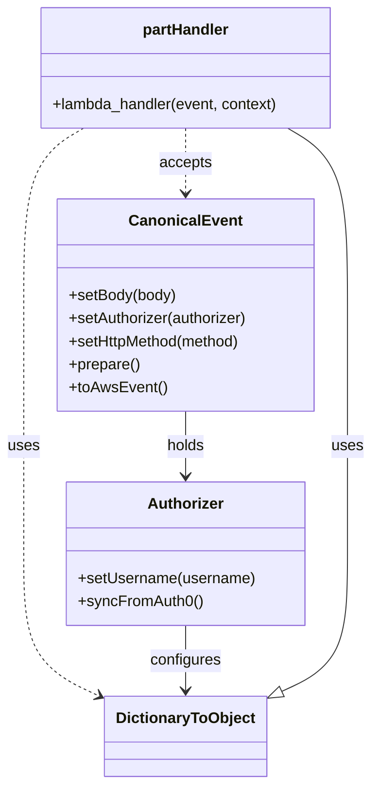

# Diagram: tools/ide_local_testing/localTest/test/partview/part/postPart.py


> Auto-generated by Obscura crawlers

## Diagram 1



### SVG

<svg id="container" width="389.4453125" xmlns="http://www.w3.org/2000/svg" class="classDiagram" height="820" viewBox="0 0 389.4453125 820" role="graphics-document document" aria-roledescription="class"><style>#container{font-family:"trebuchet ms",verdana,arial,sans-serif;font-size:16px;fill:#333;}@keyframes edge-animation-frame{from{stroke-dashoffset:0;}}@keyframes dash{to{stroke-dashoffset:0;}}#container .edge-animation-slow{stroke-dasharray:9,5!important;stroke-dashoffset:900;animation:dash 50s linear infinite;stroke-linecap:round;}#container .edge-animation-fast{stroke-dasharray:9,5!important;stroke-dashoffset:900;animation:dash 20s linear infinite;stroke-linecap:round;}#container .error-icon{fill:#552222;}#container .error-text{fill:#552222;stroke:#552222;}#container .edge-thickness-normal{stroke-width:1px;}#container .edge-thickness-thick{stroke-width:3.5px;}#container .edge-pattern-solid{stroke-dasharray:0;}#container .edge-thickness-invisible{stroke-width:0;fill:none;}#container .edge-pattern-dashed{stroke-dasharray:3;}#container .edge-pattern-dotted{stroke-dasharray:2;}#container .marker{fill:#333333;stroke:#333333;}#container .marker.cross{stroke:#333333;}#container svg{font-family:"trebuchet ms",verdana,arial,sans-serif;font-size:16px;}#container p{margin:0;}#container g.classGroup text{fill:#9370DB;stroke:none;font-family:"trebuchet ms",verdana,arial,sans-serif;font-size:10px;}#container g.classGroup text .title{font-weight:bolder;}#container .nodeLabel,#container .edgeLabel{color:#131300;}#container .edgeLabel .label rect{fill:#ECECFF;}#container .label text{fill:#131300;}#container .labelBkg{background:#ECECFF;}#container .edgeLabel .label span{background:#ECECFF;}#container .classTitle{font-weight:bolder;}#container .node rect,#container .node circle,#container .node ellipse,#container .node polygon,#container .node path{fill:#ECECFF;stroke:#9370DB;stroke-width:1px;}#container .divider{stroke:#9370DB;stroke-width:1;}#container g.clickable{cursor:pointer;}#container g.classGroup rect{fill:#ECECFF;stroke:#9370DB;}#container g.classGroup line{stroke:#9370DB;stroke-width:1;}#container .classLabel .box{stroke:none;stroke-width:0;fill:#ECECFF;opacity:0.5;}#container .classLabel .label{fill:#9370DB;font-size:10px;}#container .relation{stroke:#333333;stroke-width:1;fill:none;}#container .dashed-line{stroke-dasharray:3;}#container .dotted-line{stroke-dasharray:1 2;}#container #compositionStart,#container .composition{fill:#333333!important;stroke:#333333!important;stroke-width:1;}#container #compositionEnd,#container .composition{fill:#333333!important;stroke:#333333!important;stroke-width:1;}#container #dependencyStart,#container .dependency{fill:#333333!important;stroke:#333333!important;stroke-width:1;}#container #dependencyStart,#container .dependency{fill:#333333!important;stroke:#333333!important;stroke-width:1;}#container #extensionStart,#container .extension{fill:transparent!important;stroke:#333333!important;stroke-width:1;}#container #extensionEnd,#container .extension{fill:transparent!important;stroke:#333333!important;stroke-width:1;}#container #aggregationStart,#container .aggregation{fill:transparent!important;stroke:#333333!important;stroke-width:1;}#container #aggregationEnd,#container .aggregation{fill:transparent!important;stroke:#333333!important;stroke-width:1;}#container #lollipopStart,#container .lollipop{fill:#ECECFF!important;stroke:#333333!important;stroke-width:1;}#container #lollipopEnd,#container .lollipop{fill:#ECECFF!important;stroke:#333333!important;stroke-width:1;}#container .edgeTerminals{font-size:11px;line-height:initial;}#container .classTitleText{text-anchor:middle;font-size:18px;fill:#333;}#container .label-icon{display:inline-block;height:1em;overflow:visible;vertical-align:-0.125em;}#container .node .label-icon path{fill:currentColor;stroke:revert;stroke-width:revert;}#container :root{--mermaid-font-family:"trebuchet ms",verdana,arial,sans-serif;}</style><g><defs><marker id="container_class-aggregationStart" class="marker aggregation class" refX="18" refY="7" markerWidth="190" markerHeight="240" orient="auto"><path d="M 18,7 L9,13 L1,7 L9,1 Z"></path></marker></defs><defs><marker id="container_class-aggregationEnd" class="marker aggregation class" refX="1" refY="7" markerWidth="20" markerHeight="28" orient="auto"><path d="M 18,7 L9,13 L1,7 L9,1 Z"></path></marker></defs><defs><marker id="container_class-extensionStart" class="marker extension class" refX="18" refY="7" markerWidth="190" markerHeight="240" orient="auto"><path d="M 1,7 L18,13 V 1 Z"></path></marker></defs><defs><marker id="container_class-extensionEnd" class="marker extension class" refX="1" refY="7" markerWidth="20" markerHeight="28" orient="auto"><path d="M 1,1 V 13 L18,7 Z"></path></marker></defs><defs><marker id="container_class-compositionStart" class="marker composition class" refX="18" refY="7" markerWidth="190" markerHeight="240" orient="auto"><path d="M 18,7 L9,13 L1,7 L9,1 Z"></path></marker></defs><defs><marker id="container_class-compositionEnd" class="marker composition class" refX="1" refY="7" markerWidth="20" markerHeight="28" orient="auto"><path d="M 18,7 L9,13 L1,7 L9,1 Z"></path></marker></defs><defs><marker id="container_class-dependencyStart" class="marker dependency class" refX="6" refY="7" markerWidth="190" markerHeight="240" orient="auto"><path d="M 5,7 L9,13 L1,7 L9,1 Z"></path></marker></defs><defs><marker id="container_class-dependencyEnd" class="marker dependency class" refX="13" refY="7" markerWidth="20" markerHeight="28" orient="auto"><path d="M 18,7 L9,13 L14,7 L9,1 Z"></path></marker></defs><defs><marker id="container_class-lollipopStart" class="marker lollipop class" refX="13" refY="7" markerWidth="190" markerHeight="240" orient="auto"><circle stroke="black" fill="transparent" cx="7" cy="7" r="6"></circle></marker></defs><defs><marker id="container_class-lollipopEnd" class="marker lollipop class" refX="1" refY="7" markerWidth="190" markerHeight="240" orient="auto"><circle stroke="black" fill="transparent" cx="7" cy="7" r="6"></circle></marker></defs><g class="root"><g class="clusters"></g><g class="edgePaths"><path d="M292.479,724.633L304.558,719.028C316.637,713.422,340.795,702.211,352.874,677.939C364.953,653.667,364.953,616.333,364.953,579C364.953,541.667,364.953,504.333,364.953,461C364.953,417.667,364.953,368.333,364.953,319C364.953,269.667,364.953,220.333,354.456,189.5C343.958,158.667,322.963,146.333,312.465,140.167L301.968,134" id="id_DictionaryToObject_partHandler_1" class="edge-thickness-normal edge-pattern-solid relation" style=";;;" data-edge="true" data-et="edge" data-id="id_DictionaryToObject_partHandler_1" data-points="W3sieCI6Mjc2LjgzMjAzMTI1LCJ5Ijo3MzEuODk0OTQ5NDAyMjM1fSx7IngiOjM2NC45NTMxMjUsInkiOjY5MX0seyJ4IjozNjQuOTUzMTI1LCJ5Ijo1Nzl9LHsieCI6MzY0Ljk1MzEyNSwieSI6NDY3fSx7IngiOjM2NC45NTMxMjUsInkiOjMxOX0seyJ4IjozNjQuOTUzMTI1LCJ5IjoxNzF9LHsieCI6MzAxLjk2Nzg1MTU2MjUsInkiOjEzNH1d" marker-start="url(#container_class-extensionStart)"></path><path d="M194.723,430L194.723,436.167C194.723,442.333,194.723,454.667,194.723,466C194.723,477.333,194.723,487.667,194.723,492.833L194.723,498" id="id_CanonicalEvent_Authorizer_2" class="edge-thickness-normal edge-pattern-solid relation" style=";;;" data-edge="true" data-et="edge" data-id="id_CanonicalEvent_Authorizer_2" data-points="W3sieCI6MTk0LjcyMjY1NjI1LCJ5Ijo0MzB9LHsieCI6MTk0LjcyMjY1NjI1LCJ5Ijo0Njd9LHsieCI6MTk0LjcyMjY1NjI1LCJ5Ijo1MDR9XQ==" marker-end="url(#container_class-dependencyEnd)"></path><path d="M194.723,134L194.723,140.167C194.723,146.333,194.723,158.667,194.723,170C194.723,181.333,194.723,191.667,194.723,196.833L194.723,202" id="id_partHandler_CanonicalEvent_3" class="edge-thickness-normal edge-pattern-dashed relation" style=";;;" data-edge="true" data-et="edge" data-id="id_partHandler_CanonicalEvent_3" data-points="W3sieCI6MTk0LjcyMjY1NjI1LCJ5IjoxMzR9LHsieCI6MTk0LjcyMjY1NjI1LCJ5IjoxNzF9LHsieCI6MTk0LjcyMjY1NjI1LCJ5IjoyMDh9XQ==" marker-end="url(#container_class-dependencyEnd)"></path><path d="M87.477,134L76.98,140.167C66.482,146.333,45.487,158.667,34.99,189.5C24.492,220.333,24.492,269.667,24.492,319C24.492,368.333,24.492,417.667,24.492,461C24.492,504.333,24.492,541.667,24.492,579C24.492,616.333,24.492,653.667,38.272,678.728C52.052,703.79,79.611,716.579,93.391,722.974L107.171,729.369" id="id_partHandler_DictionaryToObject_4" class="edge-thickness-normal edge-pattern-dashed relation" style=";;;" data-edge="true" data-et="edge" data-id="id_partHandler_DictionaryToObject_4" data-points="W3sieCI6ODcuNDc3NDYwOTM3NSwieSI6MTM0fSx7IngiOjI0LjQ5MjE4NzUsInkiOjE3MX0seyJ4IjoyNC40OTIxODc1LCJ5IjozMTl9LHsieCI6MjQuNDkyMTg3NSwieSI6NDY3fSx7IngiOjI0LjQ5MjE4NzUsInkiOjU3OX0seyJ4IjoyNC40OTIxODc1LCJ5Ijo2OTF9LHsieCI6MTEyLjYxMzI4MTI1LCJ5Ijo3MzEuODk0OTQ5NDAyMjM1fV0=" marker-end="url(#container_class-dependencyEnd)"></path><path d="M194.723,654L194.723,660.167C194.723,666.333,194.723,678.667,194.723,690C194.723,701.333,194.723,711.667,194.723,716.833L194.723,722" id="id_Authorizer_DictionaryToObject_5" class="edge-thickness-normal edge-pattern-solid relation" style=";;;" data-edge="true" data-et="edge" data-id="id_Authorizer_DictionaryToObject_5" data-points="W3sieCI6MTk0LjcyMjY1NjI1LCJ5Ijo2NTR9LHsieCI6MTk0LjcyMjY1NjI1LCJ5Ijo2OTF9LHsieCI6MTk0LjcyMjY1NjI1LCJ5Ijo3Mjh9XQ==" marker-end="url(#container_class-dependencyEnd)"></path></g><g class="edgeLabels"><g class="edgeLabel" transform="translate(364.953125, 467)"><g class="label" data-id="id_DictionaryToObject_partHandler_1" transform="translate(-16.4921875, -12)"><foreignObject width="32.984375" height="24"><div xmlns="http://www.w3.org/1999/xhtml" class="labelBkg" style="display: table-cell; white-space: nowrap; line-height: 1.5; max-width: 200px; text-align: center;"><span class="edgeLabel"><p>uses</p></span></div></foreignObject></g></g><g class="edgeLabel" transform="translate(194.72265625, 467)"><g class="label" data-id="id_CanonicalEvent_Authorizer_2" transform="translate(-20.1875, -12)"><foreignObject width="40.375" height="24"><div xmlns="http://www.w3.org/1999/xhtml" class="labelBkg" style="display: table-cell; white-space: nowrap; line-height: 1.5; max-width: 200px; text-align: center;"><span class="edgeLabel"><p>holds</p></span></div></foreignObject></g></g><g class="edgeLabel" transform="translate(194.72265625, 171)"><g class="label" data-id="id_partHandler_CanonicalEvent_3" transform="translate(-27.421875, -12)"><foreignObject width="54.84375" height="24"><div xmlns="http://www.w3.org/1999/xhtml" class="labelBkg" style="display: table-cell; white-space: nowrap; line-height: 1.5; max-width: 200px; text-align: center;"><span class="edgeLabel"><p>accepts</p></span></div></foreignObject></g></g><g class="edgeLabel" transform="translate(24.4921875, 467)"><g class="label" data-id="id_partHandler_DictionaryToObject_4" transform="translate(-16.4921875, -12)"><foreignObject width="32.984375" height="24"><div xmlns="http://www.w3.org/1999/xhtml" class="labelBkg" style="display: table-cell; white-space: nowrap; line-height: 1.5; max-width: 200px; text-align: center;"><span class="edgeLabel"><p>uses</p></span></div></foreignObject></g></g><g class="edgeLabel" transform="translate(194.72265625, 691)"><g class="label" data-id="id_Authorizer_DictionaryToObject_5" transform="translate(-37.3046875, -12)"><foreignObject width="74.609375" height="24"><div xmlns="http://www.w3.org/1999/xhtml" class="labelBkg" style="display: table-cell; white-space: nowrap; line-height: 1.5; max-width: 200px; text-align: center;"><span class="edgeLabel"><p>configures</p></span></div></foreignObject></g></g></g><g class="nodes"><g class="node default" id="classId-partHandler-0" transform="translate(194.72265625, 71)"><g class="basic label-container"><path d="M-154.328125 -63 L154.328125 -63 L154.328125 63 L-154.328125 63" stroke="none" stroke-width="0" fill="#ECECFF" style=""></path><path d="M-154.328125 -63 C-68.30147506600377 -63, 17.72517486799245 -63, 154.328125 -63 M-154.328125 -63 C-44.61467632238384 -63, 65.09877235523231 -63, 154.328125 -63 M154.328125 -63 C154.328125 -13.99634760864388, 154.328125 35.00730478271224, 154.328125 63 M154.328125 -63 C154.328125 -31.059626756116472, 154.328125 0.8807464877670554, 154.328125 63 M154.328125 63 C73.85420286727488 63, -6.619719265450243 63, -154.328125 63 M154.328125 63 C39.5546254923763 63, -75.2188740152474 63, -154.328125 63 M-154.328125 63 C-154.328125 24.601340528480087, -154.328125 -13.797318943039826, -154.328125 -63 M-154.328125 63 C-154.328125 29.036274500986075, -154.328125 -4.927450998027851, -154.328125 -63" stroke="#9370DB" stroke-width="1.3" fill="none" stroke-dasharray="0 0" style=""></path></g><g class="annotation-group text" transform="translate(0, -39)"></g><g class="label-group text" transform="translate(-44.46875, -39)"><g class="label" style="font-weight: bolder" transform="translate(0,-12)"><foreignObject width="88.9375" height="24"><div xmlns="http://www.w3.org/1999/xhtml" style="display: table-cell; white-space: nowrap; line-height: 1.5; max-width: 139px; text-align: center;"><span class="nodeLabel markdown-node-label" style=""><p>partHandler</p></span></div></foreignObject></g></g><g class="members-group text" transform="translate(-142.328125, 9)"></g><g class="methods-group text" transform="translate(-142.328125, 39)"><g class="label" style="" transform="translate(0,-12)"><foreignObject width="240.1875" height="24"><div xmlns="http://www.w3.org/1999/xhtml" style="display: table-cell; white-space: nowrap; line-height: 1.5; max-width: 298px; text-align: center;"><span class="nodeLabel markdown-node-label" style=""><p>+lambda_handler(event, context)</p></span></div></foreignObject></g></g><g class="divider" style=""><path d="M-154.328125 -15 C-75.11604831410729 -15, 4.0960283717854225 -15, 154.328125 -15 M-154.328125 -15 C-69.83709388187722 -15, 14.653937236245554 -15, 154.328125 -15" stroke="#9370DB" stroke-width="1.3" fill="none" stroke-dasharray="0 0" style=""></path></g><g class="divider" style=""><path d="M-154.328125 9 C-47.05011801041206 9, 60.22788897917587 9, 154.328125 9 M-154.328125 9 C-79.30948328097135 9, -4.290841561942699 9, 154.328125 9" stroke="#9370DB" stroke-width="1.3" fill="none" stroke-dasharray="0 0" style=""></path></g></g><g class="node default" id="classId-CanonicalEvent-1" transform="translate(194.72265625, 319)"><g class="basic label-container"><path d="M-135.23046875 -111 L135.23046875 -111 L135.23046875 111 L-135.23046875 111" stroke="none" stroke-width="0" fill="#ECECFF" style=""></path><path d="M-135.23046875 -111 C-77.08553540162487 -111, -18.940602053249734 -111, 135.23046875 -111 M-135.23046875 -111 C-58.575648020911586 -111, 18.079172708176827 -111, 135.23046875 -111 M135.23046875 -111 C135.23046875 -48.824947606836346, 135.23046875 13.350104786327307, 135.23046875 111 M135.23046875 -111 C135.23046875 -26.353863320436275, 135.23046875 58.29227335912745, 135.23046875 111 M135.23046875 111 C48.29431829666265 111, -38.641832156674695 111, -135.23046875 111 M135.23046875 111 C28.68170192473879 111, -77.86706490052242 111, -135.23046875 111 M-135.23046875 111 C-135.23046875 60.7368443556787, -135.23046875 10.473688711357397, -135.23046875 -111 M-135.23046875 111 C-135.23046875 57.99343078507117, -135.23046875 4.986861570142338, -135.23046875 -111" stroke="#9370DB" stroke-width="1.3" fill="none" stroke-dasharray="0 0" style=""></path></g><g class="annotation-group text" transform="translate(0, -87)"></g><g class="label-group text" transform="translate(-55.7109375, -87)"><g class="label" style="font-weight: bolder" transform="translate(0,-12)"><foreignObject width="111.421875" height="24"><div xmlns="http://www.w3.org/1999/xhtml" style="display: table-cell; white-space: nowrap; line-height: 1.5; max-width: 161px; text-align: center;"><span class="nodeLabel markdown-node-label" style=""><p>CanonicalEvent</p></span></div></foreignObject></g></g><g class="members-group text" transform="translate(-123.23046875, -39)"></g><g class="methods-group text" transform="translate(-123.23046875, -9)"><g class="label" style="" transform="translate(0,-12)"><foreignObject width="113.125" height="24"><div xmlns="http://www.w3.org/1999/xhtml" style="display: table-cell; white-space: nowrap; line-height: 1.5; max-width: 170px; text-align: center;"><span class="nodeLabel markdown-node-label" style=""><p>+setBody(body)</p></span></div></foreignObject></g><g class="label" style="" transform="translate(0,12)"><foreignObject width="190.75" height="24"><div xmlns="http://www.w3.org/1999/xhtml" style="display: table-cell; white-space: nowrap; line-height: 1.5; max-width: 248px; text-align: center;"><span class="nodeLabel markdown-node-label" style=""><p>+setAuthorizer(authorizer)</p></span></div></foreignObject></g><g class="label" style="" transform="translate(0,36)"><foreignObject width="184" height="24"><div xmlns="http://www.w3.org/1999/xhtml" style="display: table-cell; white-space: nowrap; line-height: 1.5; max-width: 241px; text-align: center;"><span class="nodeLabel markdown-node-label" style=""><p>+setHttpMethod(method)</p></span></div></foreignObject></g><g class="label" style="" transform="translate(0,60)"><foreignObject width="74.75" height="24"><div xmlns="http://www.w3.org/1999/xhtml" style="display: table-cell; white-space: nowrap; line-height: 1.5; max-width: 132px; text-align: center;"><span class="nodeLabel markdown-node-label" style=""><p>+prepare()</p></span></div></foreignObject></g><g class="label" style="" transform="translate(0,84)"><foreignObject width="101.1875" height="24"><div xmlns="http://www.w3.org/1999/xhtml" style="display: table-cell; white-space: nowrap; line-height: 1.5; max-width: 159px; text-align: center;"><span class="nodeLabel markdown-node-label" style=""><p>+toAwsEvent()</p></span></div></foreignObject></g></g><g class="divider" style=""><path d="M-135.23046875 -63 C-62.74170390862932 -63, 9.747060932741363 -63, 135.23046875 -63 M-135.23046875 -63 C-31.04033800317302 -63, 73.14979274365396 -63, 135.23046875 -63" stroke="#9370DB" stroke-width="1.3" fill="none" stroke-dasharray="0 0" style=""></path></g><g class="divider" style=""><path d="M-135.23046875 -39 C-29.656857028515446 -39, 75.9167546929691 -39, 135.23046875 -39 M-135.23046875 -39 C-76.89182380879703 -39, -18.553178867594042 -39, 135.23046875 -39" stroke="#9370DB" stroke-width="1.3" fill="none" stroke-dasharray="0 0" style=""></path></g></g><g class="node default" id="classId-DictionaryToObject-2" transform="translate(194.72265625, 770)"><g class="basic label-container"><path d="M-82.109375 -42 L82.109375 -42 L82.109375 42 L-82.109375 42" stroke="none" stroke-width="0" fill="#ECECFF" style=""></path><path d="M-82.109375 -42 C-34.019348021286405 -42, 14.07067895742719 -42, 82.109375 -42 M-82.109375 -42 C-35.04688986192217 -42, 12.015595276155665 -42, 82.109375 -42 M82.109375 -42 C82.109375 -16.873593455822892, 82.109375 8.252813088354216, 82.109375 42 M82.109375 -42 C82.109375 -15.408190435184384, 82.109375 11.183619129631232, 82.109375 42 M82.109375 42 C46.37096432277663 42, 10.632553645553259 42, -82.109375 42 M82.109375 42 C32.58196727777253 42, -16.945440444454945 42, -82.109375 42 M-82.109375 42 C-82.109375 21.786713596575456, -82.109375 1.5734271931509127, -82.109375 -42 M-82.109375 42 C-82.109375 10.84047598859734, -82.109375 -20.31904802280532, -82.109375 -42" stroke="#9370DB" stroke-width="1.3" fill="none" stroke-dasharray="0 0" style=""></path></g><g class="annotation-group text" transform="translate(0, -18)"></g><g class="label-group text" transform="translate(-70.109375, -18)"><g class="label" style="font-weight: bolder" transform="translate(0,-12)"><foreignObject width="140.21875" height="24"><div xmlns="http://www.w3.org/1999/xhtml" style="display: table-cell; white-space: nowrap; line-height: 1.5; max-width: 188px; text-align: center;"><span class="nodeLabel markdown-node-label" style=""><p>DictionaryToObject</p></span></div></foreignObject></g></g><g class="members-group text" transform="translate(-70.109375, 30)"></g><g class="methods-group text" transform="translate(-70.109375, 60)"></g><g class="divider" style=""><path d="M-82.109375 6 C-35.71130651487479 6, 10.686761970250416 6, 82.109375 6 M-82.109375 6 C-25.86359314638529 6, 30.382188707229417 6, 82.109375 6" stroke="#9370DB" stroke-width="1.3" fill="none" stroke-dasharray="0 0" style=""></path></g><g class="divider" style=""><path d="M-82.109375 24 C-23.08960780502045 24, 35.9301593899591 24, 82.109375 24 M-82.109375 24 C-36.158833826269465 24, 9.79170734746107 24, 82.109375 24" stroke="#9370DB" stroke-width="1.3" fill="none" stroke-dasharray="0 0" style=""></path></g></g><g class="node default" id="classId-Authorizer-3" transform="translate(194.72265625, 579)"><g class="basic label-container"><path d="M-124.13671875 -75 L124.13671875 -75 L124.13671875 75 L-124.13671875 75" stroke="none" stroke-width="0" fill="#ECECFF" style=""></path><path d="M-124.13671875 -75 C-61.44436067105519 -75, 1.2479974078896134 -75, 124.13671875 -75 M-124.13671875 -75 C-67.27450103381372 -75, -10.412283317627427 -75, 124.13671875 -75 M124.13671875 -75 C124.13671875 -35.331400965892165, 124.13671875 4.33719806821567, 124.13671875 75 M124.13671875 -75 C124.13671875 -32.60465184113623, 124.13671875 9.790696317727537, 124.13671875 75 M124.13671875 75 C60.467097895811854 75, -3.202522958376292 75, -124.13671875 75 M124.13671875 75 C50.70340150796778 75, -22.729915734064434 75, -124.13671875 75 M-124.13671875 75 C-124.13671875 15.152307869809896, -124.13671875 -44.69538426038021, -124.13671875 -75 M-124.13671875 75 C-124.13671875 15.68307172290254, -124.13671875 -43.63385655419492, -124.13671875 -75" stroke="#9370DB" stroke-width="1.3" fill="none" stroke-dasharray="0 0" style=""></path></g><g class="annotation-group text" transform="translate(0, -51)"></g><g class="label-group text" transform="translate(-38.3671875, -51)"><g class="label" style="font-weight: bolder" transform="translate(0,-12)"><foreignObject width="76.734375" height="24"><div xmlns="http://www.w3.org/1999/xhtml" style="display: table-cell; white-space: nowrap; line-height: 1.5; max-width: 126px; text-align: center;"><span class="nodeLabel markdown-node-label" style=""><p>Authorizer</p></span></div></foreignObject></g></g><g class="members-group text" transform="translate(-112.13671875, -3)"></g><g class="methods-group text" transform="translate(-112.13671875, 27)"><g class="label" style="" transform="translate(0,-12)"><foreignObject width="185.90625" height="24"><div xmlns="http://www.w3.org/1999/xhtml" style="display: table-cell; white-space: nowrap; line-height: 1.5; max-width: 243px; text-align: center;"><span class="nodeLabel markdown-node-label" style=""><p>+setUsername(username)</p></span></div></foreignObject></g><g class="label" style="" transform="translate(0,12)"><foreignObject width="129.0625" height="24"><div xmlns="http://www.w3.org/1999/xhtml" style="display: table-cell; white-space: nowrap; line-height: 1.5; max-width: 186px; text-align: center;"><span class="nodeLabel markdown-node-label" style=""><p>+syncFromAuth0()</p></span></div></foreignObject></g></g><g class="divider" style=""><path d="M-124.13671875 -27 C-43.43681181948571 -27, 37.263095111028576 -27, 124.13671875 -27 M-124.13671875 -27 C-72.18044732783034 -27, -20.224175905660672 -27, 124.13671875 -27" stroke="#9370DB" stroke-width="1.3" fill="none" stroke-dasharray="0 0" style=""></path></g><g class="divider" style=""><path d="M-124.13671875 -3 C-52.27948764179443 -3, 19.577743466411135 -3, 124.13671875 -3 M-124.13671875 -3 C-53.379340457837415 -3, 17.37803783432517 -3, 124.13671875 -3" stroke="#9370DB" stroke-width="1.3" fill="none" stroke-dasharray="0 0" style=""></path></g></g></g></g></g></svg>

## Diagram 2

```mermaid
flowchart TD
    Body[body (dict)] --> Auth[Authorizer.setUsername("shipper-org-admin@yopmail.com")\n.syncFromAuth0()]
    Auth --> CE[CanonicalEvent\n.setBody(body)\n.setAuthorizer(authorizer)\n.setHttpMethod("POST")]
    CE --> Prep[prepare() -> toAwsEvent()]
    Prep --> Context[DictionaryToObject({'function_name': "postPart"})]
    Prep --> EventObj[event (AWS event)]
    EventObj --> Lambda[partHandler.lambda_handler(event, context)]
    Lambda --> Result[result]
    Result --> Print[print(result)]
```

> SVG rendering failed for this diagram.
