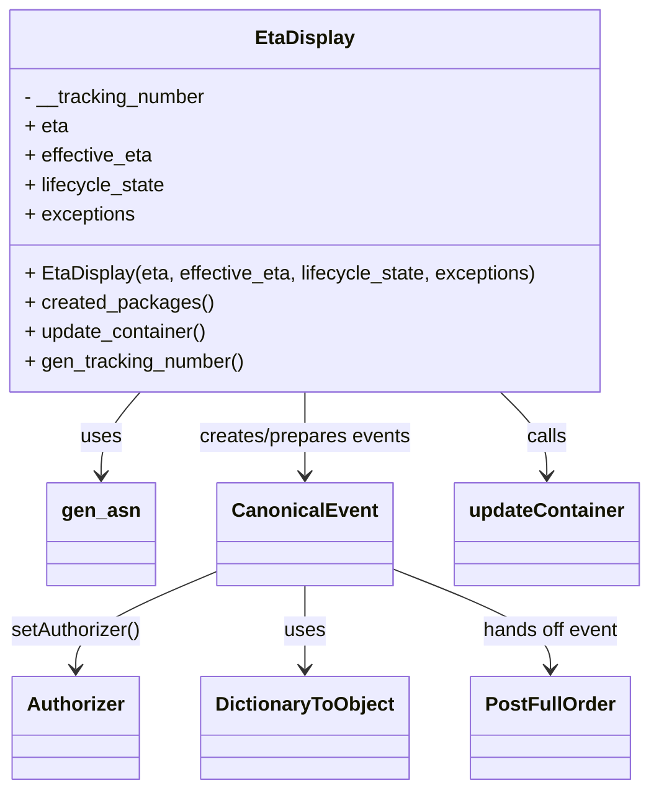
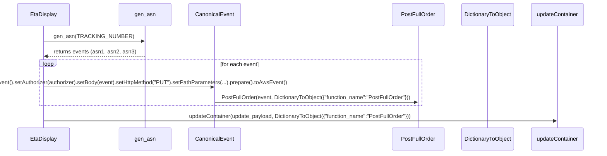

# Diagram: tools/ide_local_testing/localTest/test/partview/searchContainer/eta_display.py

> Auto-generated by Obscura crawlers

## Diagram 1

### SVG

<svg id="container" width="522.01171875" xmlns="http://www.w3.org/2000/svg" class="classDiagram" height="644" viewBox="0 0 522.01171875 644" role="graphics-document document" aria-roledescription="class"><g><defs><marker id="container_class-aggregationStart" class="marker aggregation class" refX="18" refY="7" markerWidth="190" markerHeight="240" orient="auto"><path d="M 18,7 L9,13 L1,7 L9,1 Z"></path></marker></defs><defs><marker id="container_class-aggregationEnd" class="marker aggregation class" refX="1" refY="7" markerWidth="20" markerHeight="28" orient="auto"><path d="M 18,7 L9,13 L1,7 L9,1 Z"></path></marker></defs><defs><marker id="container_class-extensionStart" class="marker extension class" refX="18" refY="7" markerWidth="190" markerHeight="240" orient="auto"><path d="M 1,7 L18,13 V 1 Z"></path></marker></defs><defs><marker id="container_class-extensionEnd" class="marker extension class" refX="1" refY="7" markerWidth="20" markerHeight="28" orient="auto"><path d="M 1,1 V 13 L18,7 Z"></path></marker></defs><defs><marker id="container_class-compositionStart" class="marker composition class" refX="18" refY="7" markerWidth="190" markerHeight="240" orient="auto"><path d="M 18,7 L9,13 L1,7 L9,1 Z"></path></marker></defs><defs><marker id="container_class-compositionEnd" class="marker composition class" refX="1" refY="7" markerWidth="20" markerHeight="28" orient="auto"><path d="M 18,7 L9,13 L1,7 L9,1 Z"></path></marker></defs><defs><marker id="container_class-dependencyStart" class="marker dependency class" refX="6" refY="7" markerWidth="190" markerHeight="240" orient="auto"><path d="M 5,7 L9,13 L1,7 L9,1 Z"></path></marker></defs><defs><marker id="container_class-dependencyEnd" class="marker dependency class" refX="13" refY="7" markerWidth="20" markerHeight="28" orient="auto"><path d="M 18,7 L9,13 L14,7 L9,1 Z"></path></marker></defs><defs><marker id="container_class-lollipopStart" class="marker lollipop class" refX="13" refY="7" markerWidth="190" markerHeight="240" orient="auto"><circle stroke="black" fill="transparent" cx="7" cy="7" r="6"></circle></marker></defs><defs><marker id="container_class-lollipopEnd" class="marker lollipop class" refX="1" refY="7" markerWidth="190" markerHeight="240" orient="auto"><circle stroke="black" fill="transparent" cx="7" cy="7" r="6"></circle></marker></defs><g class="root"><g class="clusters"></g><g class="edgePaths"><path d="M120.164,320L115.059,326.167C109.954,332.333,99.745,344.667,94.64,356C89.535,367.333,89.535,377.667,89.535,382.833L89.535,388" id="id_EtaDisplay_gen_asn_1" class="edge-thickness-normal edge-pattern-solid relation" style=";;;" data-edge="true" data-et="edge" data-id="id_EtaDisplay_gen_asn_1" data-points="W3sieCI6MTIwLjE2Mzc5OTM4NDcxNTAyLCJ5IjozMjB9LHsieCI6ODkuNTM1MTU2MjUsInkiOjM1N30seyJ4Ijo4OS41MzUxNTYyNSwieSI6Mzk0fV0=" marker-end="url(#container_class-dependencyEnd)"></path><path d="M249.301,320L249.301,326.167C249.301,332.333,249.301,344.667,249.301,356C249.301,367.333,249.301,377.667,249.301,382.833L249.301,388" id="id_EtaDisplay_CanonicalEvent_2" class="edge-thickness-normal edge-pattern-solid relation" style=";;;" data-edge="true" data-et="edge" data-id="id_EtaDisplay_CanonicalEvent_2" data-points="W3sieCI6MjQ5LjMwMDc4MTI1LCJ5IjozMjB9LHsieCI6MjQ5LjMwMDc4MTI1LCJ5IjozNTd9LHsieCI6MjQ5LjMwMDc4MTI1LCJ5IjozOTR9XQ==" marker-end="url(#container_class-dependencyEnd)"></path><path d="M181.59,465.314L162.462,473.595C143.335,481.876,105.079,498.438,85.952,511.886C66.824,525.333,66.824,535.667,66.824,540.833L66.824,546" id="id_CanonicalEvent_Authorizer_3" class="edge-thickness-normal edge-pattern-solid relation" style=";;;" data-edge="true" data-et="edge" data-id="id_CanonicalEvent_Authorizer_3" data-points="W3sieCI6MTgxLjU4OTg0Mzc1LCJ5Ijo0NjUuMzE0MjUyNjg2NTYwOH0seyJ4Ijo2Ni44MjQyMTg3NSwieSI6NTE1fSx7IngiOjY2LjgyNDIxODc1LCJ5Ijo1NTJ9XQ==" marker-end="url(#container_class-dependencyEnd)"></path><path d="M249.301,478L249.301,484.167C249.301,490.333,249.301,502.667,249.301,514C249.301,525.333,249.301,535.667,249.301,540.833L249.301,546" id="id_CanonicalEvent_DictionaryToObject_4" class="edge-thickness-normal edge-pattern-solid relation" style=";;;" data-edge="true" data-et="edge" data-id="id_CanonicalEvent_DictionaryToObject_4" data-points="W3sieCI6MjQ5LjMwMDc4MTI1LCJ5Ijo0Nzh9LHsieCI6MjQ5LjMwMDc4MTI1LCJ5Ijo1MTV9LHsieCI6MjQ5LjMwMDc4MTI1LCJ5Ijo1NTJ9XQ==" marker-end="url(#container_class-dependencyEnd)"></path><path d="M317.012,463.551L338.086,472.126C359.16,480.701,401.309,497.85,422.383,511.592C443.457,525.333,443.457,535.667,443.457,540.833L443.457,546" id="id_CanonicalEvent_PostFullOrder_5" class="edge-thickness-normal edge-pattern-solid relation" style=";;;" data-edge="true" data-et="edge" data-id="id_CanonicalEvent_PostFullOrder_5" data-points="W3sieCI6MzE3LjAxMTcxODc1LCJ5Ijo0NjMuNTUwODIwODU5NDg4MTd9LHsieCI6NDQzLjQ1NzAzMTI1LCJ5Ijo1MTV9LHsieCI6NDQzLjQ1NzAzMTI1LCJ5Ijo1NTJ9XQ==" marker-end="url(#container_class-dependencyEnd)"></path><path d="M403.855,320L409.964,326.167C416.074,332.333,428.293,344.667,434.402,356C440.512,367.333,440.512,377.667,440.512,382.833L440.512,388" id="id_EtaDisplay_updateContainer_6" class="edge-thickness-normal edge-pattern-solid relation" style=";;;" data-edge="true" data-et="edge" data-id="id_EtaDisplay_updateContainer_6" data-points="W3sieCI6NDAzLjg1NDY5OTY0Mzc4MjQsInkiOjMyMH0seyJ4Ijo0NDAuNTExNzE4NzUsInkiOjM1N30seyJ4Ijo0NDAuNTExNzE4NzUsInkiOjM5NH1d" marker-end="url(#container_class-dependencyEnd)"></path></g><g class="edgeLabels"><g class="edgeLabel" transform="translate(89.53515625, 357)"><g class="label" data-id="id_EtaDisplay_gen_asn_1" transform="translate(-16.4921875, -12)"><foreignObject width="32.984375" height="24">

uses

</foreignObject></g></g><g class="edgeLabel" transform="translate(249.30078125, 357)"><g class="label" data-id="id_EtaDisplay_CanonicalEvent_2" transform="translate(-88.046875, -12)"><foreignObject width="176.09375" height="24">

creates/prepares events

</foreignObject></g></g><g class="edgeLabel" transform="translate(66.82421875, 515)"><g class="label" data-id="id_CanonicalEvent_Authorizer_3" transform="translate(-53.890625, -12)"><foreignObject width="107.78125" height="24">

setAuthorizer()

</foreignObject></g></g><g class="edgeLabel" transform="translate(249.30078125, 515)"><g class="label" data-id="id_CanonicalEvent_DictionaryToObject_4" transform="translate(-16.4921875, -12)"><foreignObject width="32.984375" height="24">

uses

</foreignObject></g></g><g class="edgeLabel" transform="translate(443.45703125, 515)"><g class="label" data-id="id_CanonicalEvent_PostFullOrder_5" transform="translate(-56.6953125, -12)"><foreignObject width="113.390625" height="24">

hands off event

</foreignObject></g></g><g class="edgeLabel" transform="translate(440.51171875, 357)"><g class="label" data-id="id_EtaDisplay_updateContainer_6" transform="translate(-16.4453125, -12)"><foreignObject width="32.890625" height="24">

calls

</foreignObject></g></g></g><g class="nodes"><g class="node default" id="classId-EtaDisplay-0" transform="translate(249.30078125, 164)"><g class="basic label-container"><path d="M-241.30078125 -156 L241.30078125 -156 L241.30078125 156 L-241.30078125 156" stroke="none" stroke-width="0" fill="#ECECFF" style=""></path><path d="M-241.30078125 -156 C-111.37697923692744 -156, 18.54682277614512 -156, 241.30078125 -156 M-241.30078125 -156 C-77.89058337184645 -156, 85.51961450630711 -156, 241.30078125 -156 M241.30078125 -156 C241.30078125 -81.13381729373032, 241.30078125 -6.267634587460634, 241.30078125 156 M241.30078125 -156 C241.30078125 -59.86861116980144, 241.30078125 36.26277766039712, 241.30078125 156 M241.30078125 156 C130.17301450725313 156, 19.045247764506286 156, -241.30078125 156 M241.30078125 156 C90.23260719886252 156, -60.83556685227495 156, -241.30078125 156 M-241.30078125 156 C-241.30078125 62.94383902651906, -241.30078125 -30.112321946961885, -241.30078125 -156 M-241.30078125 156 C-241.30078125 33.69450968704248, -241.30078125 -88.61098062591503, -241.30078125 -156" stroke="#9370DB" stroke-width="1.3" fill="none" stroke-dasharray="0 0" style=""></path></g><g class="annotation-group text" transform="translate(0, -132)"></g><g class="label-group text" transform="translate(-38.2890625, -132)"><g class="label" style="font-weight: bolder" transform="translate(0,-12)"><foreignObject width="76.578125" height="24">

EtaDisplay

</foreignObject></g></g><g class="members-group text" transform="translate(-229.30078125, -84)"><g class="label" style="" transform="translate(0,-12)"><foreignObject width="150.1875" height="24">

- __tracking_number

</foreignObject></g><g class="label" style="" transform="translate(0,12)"><foreignObject width="35.3125" height="24">

+ eta

</foreignObject></g><g class="label" style="" transform="translate(0,36)"><foreignObject width="105.46875" height="24">

+ effective_eta

</foreignObject></g><g class="label" style="" transform="translate(0,60)"><foreignObject width="115.875" height="24">

+ lifecycle_state

</foreignObject></g><g class="label" style="" transform="translate(0,84)"><foreignObject width="90.453125" height="24">

+ exceptions

</foreignObject></g></g><g class="methods-group text" transform="translate(-229.30078125, 60)"><g class="label" style="" transform="translate(0,-12)"><foreignObject width="420.3125" height="24">

+ EtaDisplay(eta, effective_eta, lifecycle_state, exceptions)

</foreignObject></g><g class="label" style="" transform="translate(0,12)"><foreignObject width="151.796875" height="24">

+ created_packages()

</foreignObject></g><g class="label" style="" transform="translate(0,36)"><foreignObject width="150.828125" height="24">

+ update_container()

</foreignObject></g><g class="label" style="" transform="translate(0,60)"><foreignObject width="180.09375" height="24">

+ gen_tracking_number()

</foreignObject></g></g><g class="divider" style=""><path d="M-241.30078125 -108 C-142.92781615740543 -108, -44.55485106481086 -108, 241.30078125 -108 M-241.30078125 -108 C-85.03496515951488 -108, 71.23085093097023 -108, 241.30078125 -108" stroke="#9370DB" stroke-width="1.3" fill="none" stroke-dasharray="0 0" style=""></path></g><g class="divider" style=""><path d="M-241.30078125 36 C-52.751286519150995 36, 135.798208211698 36, 241.30078125 36 M-241.30078125 36 C-102.21624986843011 36, 36.86828151313978 36, 241.30078125 36" stroke="#9370DB" stroke-width="1.3" fill="none" stroke-dasharray="0 0" style=""></path></g></g><g class="node default" id="classId-gen_asn-1" transform="translate(89.53515625, 436)"><g class="basic label-container"><path d="M-42.0546875 -42 L42.0546875 -42 L42.0546875 42 L-42.0546875 42" stroke="none" stroke-width="0" fill="#ECECFF" style=""></path><path d="M-42.0546875 -42 C-9.498929926223454 -42, 23.056827647553092 -42, 42.0546875 -42 M-42.0546875 -42 C-22.809595243817032 -42, -3.5645029876340644 -42, 42.0546875 -42 M42.0546875 -42 C42.0546875 -9.854907604429343, 42.0546875 22.290184791141314, 42.0546875 42 M42.0546875 -42 C42.0546875 -18.32890639689547, 42.0546875 5.342187206209061, 42.0546875 42 M42.0546875 42 C22.856549290782834 42, 3.658411081565667 42, -42.0546875 42 M42.0546875 42 C8.6511453575351 42, -24.7523967849298 42, -42.0546875 42 M-42.0546875 42 C-42.0546875 8.54696635021564, -42.0546875 -24.90606729956872, -42.0546875 -42 M-42.0546875 42 C-42.0546875 9.17603903545654, -42.0546875 -23.64792192908692, -42.0546875 -42" stroke="#9370DB" stroke-width="1.3" fill="none" stroke-dasharray="0 0" style=""></path></g><g class="annotation-group text" transform="translate(0, -18)"></g><g class="label-group text" transform="translate(-30.0546875, -18)"><g class="label" style="font-weight: bolder" transform="translate(0,-12)"><foreignObject width="60.109375" height="24">

gen_asn

</foreignObject></g></g><g class="members-group text" transform="translate(-30.0546875, 30)"></g><g class="methods-group text" transform="translate(-30.0546875, 60)"></g><g class="divider" style=""><path d="M-42.0546875 6 C-23.612690495171865 6, -5.17069349034373 6, 42.0546875 6 M-42.0546875 6 C-19.496902201080992 6, 3.0608830978380155 6, 42.0546875 6" stroke="#9370DB" stroke-width="1.3" fill="none" stroke-dasharray="0 0" style=""></path></g><g class="divider" style=""><path d="M-42.0546875 24 C-12.420380213358648 24, 17.213927073282704 24, 42.0546875 24 M-42.0546875 24 C-22.043141919904357 24, -2.031596339808715 24, 42.0546875 24" stroke="#9370DB" stroke-width="1.3" fill="none" stroke-dasharray="0 0" style=""></path></g></g><g class="node default" id="classId-CanonicalEvent-2" transform="translate(249.30078125, 436)"><g class="basic label-container"><path d="M-67.7109375 -42 L67.7109375 -42 L67.7109375 42 L-67.7109375 42" stroke="none" stroke-width="0" fill="#ECECFF" style=""></path><path d="M-67.7109375 -42 C-38.232165104737994 -42, -8.753392709475989 -42, 67.7109375 -42 M-67.7109375 -42 C-37.054033789366756 -42, -6.397130078733511 -42, 67.7109375 -42 M67.7109375 -42 C67.7109375 -14.486430549335633, 67.7109375 13.027138901328733, 67.7109375 42 M67.7109375 -42 C67.7109375 -22.501869286501403, 67.7109375 -3.0037385730028063, 67.7109375 42 M67.7109375 42 C18.84336779826873 42, -30.02420190346254 42, -67.7109375 42 M67.7109375 42 C24.8635062379782 42, -17.9839250240436 42, -67.7109375 42 M-67.7109375 42 C-67.7109375 12.491088579375539, -67.7109375 -17.017822841248922, -67.7109375 -42 M-67.7109375 42 C-67.7109375 22.336894560099744, -67.7109375 2.673789120199487, -67.7109375 -42" stroke="#9370DB" stroke-width="1.3" fill="none" stroke-dasharray="0 0" style=""></path></g><g class="annotation-group text" transform="translate(0, -18)"></g><g class="label-group text" transform="translate(-55.7109375, -18)"><g class="label" style="font-weight: bolder" transform="translate(0,-12)"><foreignObject width="111.421875" height="24">

CanonicalEvent

</foreignObject></g></g><g class="members-group text" transform="translate(-55.7109375, 30)"></g><g class="methods-group text" transform="translate(-55.7109375, 60)"></g><g class="divider" style=""><path d="M-67.7109375 6 C-35.68648521657188 6, -3.662032933143763 6, 67.7109375 6 M-67.7109375 6 C-16.689671576367772 6, 34.331594347264456 6, 67.7109375 6" stroke="#9370DB" stroke-width="1.3" fill="none" stroke-dasharray="0 0" style=""></path></g><g class="divider" style=""><path d="M-67.7109375 24 C-38.29222193295759 24, -8.873506365915183 24, 67.7109375 24 M-67.7109375 24 C-22.562196354604836 24, 22.586544790790327 24, 67.7109375 24" stroke="#9370DB" stroke-width="1.3" fill="none" stroke-dasharray="0 0" style=""></path></g></g><g class="node default" id="classId-Authorizer-3" transform="translate(66.82421875, 594)"><g class="basic label-container"><path d="M-50.3671875 -42 L50.3671875 -42 L50.3671875 42 L-50.3671875 42" stroke="none" stroke-width="0" fill="#ECECFF" style=""></path><path d="M-50.3671875 -42 C-28.523743709133836 -42, -6.680299918267671 -42, 50.3671875 -42 M-50.3671875 -42 C-13.456930311289923 -42, 23.453326877420153 -42, 50.3671875 -42 M50.3671875 -42 C50.3671875 -24.24007668326052, 50.3671875 -6.480153366521037, 50.3671875 42 M50.3671875 -42 C50.3671875 -22.66373843425243, 50.3671875 -3.32747686850486, 50.3671875 42 M50.3671875 42 C14.987843621435665 42, -20.39150025712867 42, -50.3671875 42 M50.3671875 42 C22.85804960311955 42, -4.6510882937609 42, -50.3671875 42 M-50.3671875 42 C-50.3671875 13.945112453518398, -50.3671875 -14.109775092963204, -50.3671875 -42 M-50.3671875 42 C-50.3671875 22.451121115198035, -50.3671875 2.9022422303960695, -50.3671875 -42" stroke="#9370DB" stroke-width="1.3" fill="none" stroke-dasharray="0 0" style=""></path></g><g class="annotation-group text" transform="translate(0, -18)"></g><g class="label-group text" transform="translate(-38.3671875, -18)"><g class="label" style="font-weight: bolder" transform="translate(0,-12)"><foreignObject width="76.734375" height="24">

Authorizer

</foreignObject></g></g><g class="members-group text" transform="translate(-38.3671875, 30)"></g><g class="methods-group text" transform="translate(-38.3671875, 60)"></g><g class="divider" style=""><path d="M-50.3671875 6 C-24.214018716738845 6, 1.9391500665223091 6, 50.3671875 6 M-50.3671875 6 C-15.272386319473867 6, 19.822414861052266 6, 50.3671875 6" stroke="#9370DB" stroke-width="1.3" fill="none" stroke-dasharray="0 0" style=""></path></g><g class="divider" style=""><path d="M-50.3671875 24 C-22.033703675835667 24, 6.299780148328665 24, 50.3671875 24 M-50.3671875 24 C-19.45002849994667 24, 11.467130500106663 24, 50.3671875 24" stroke="#9370DB" stroke-width="1.3" fill="none" stroke-dasharray="0 0" style=""></path></g></g><g class="node default" id="classId-DictionaryToObject-4" transform="translate(249.30078125, 594)"><g class="basic label-container"><path d="M-82.109375 -42 L82.109375 -42 L82.109375 42 L-82.109375 42" stroke="none" stroke-width="0" fill="#ECECFF" style=""></path><path d="M-82.109375 -42 C-40.78959633606067 -42, 0.5301823278786628 -42, 82.109375 -42 M-82.109375 -42 C-25.38675026519492 -42, 31.33587446961016 -42, 82.109375 -42 M82.109375 -42 C82.109375 -23.763157666792956, 82.109375 -5.526315333585913, 82.109375 42 M82.109375 -42 C82.109375 -10.199927907410906, 82.109375 21.600144185178188, 82.109375 42 M82.109375 42 C19.139277658259445 42, -43.83081968348111 42, -82.109375 42 M82.109375 42 C43.840779828396975 42, 5.572184656793951 42, -82.109375 42 M-82.109375 42 C-82.109375 23.906131032861467, -82.109375 5.812262065722933, -82.109375 -42 M-82.109375 42 C-82.109375 12.526755111406864, -82.109375 -16.946489777186272, -82.109375 -42" stroke="#9370DB" stroke-width="1.3" fill="none" stroke-dasharray="0 0" style=""></path></g><g class="annotation-group text" transform="translate(0, -18)"></g><g class="label-group text" transform="translate(-70.109375, -18)"><g class="label" style="font-weight: bolder" transform="translate(0,-12)"><foreignObject width="140.21875" height="24">

DictionaryToObject

</foreignObject></g></g><g class="members-group text" transform="translate(-70.109375, 30)"></g><g class="methods-group text" transform="translate(-70.109375, 60)"></g><g class="divider" style=""><path d="M-82.109375 6 C-32.181141479504824 6, 17.747092040990353 6, 82.109375 6 M-82.109375 6 C-44.08505769747549 6, -6.060740394950983 6, 82.109375 6" stroke="#9370DB" stroke-width="1.3" fill="none" stroke-dasharray="0 0" style=""></path></g><g class="divider" style=""><path d="M-82.109375 24 C-19.956135251110773 24, 42.197104497778454 24, 82.109375 24 M-82.109375 24 C-23.824184261235317 24, 34.46100647752937 24, 82.109375 24" stroke="#9370DB" stroke-width="1.3" fill="none" stroke-dasharray="0 0" style=""></path></g></g><g class="node default" id="classId-PostFullOrder-5" transform="translate(443.45703125, 594)"><g class="basic label-container"><path d="M-62.046875 -42 L62.046875 -42 L62.046875 42 L-62.046875 42" stroke="none" stroke-width="0" fill="#ECECFF" style=""></path><path d="M-62.046875 -42 C-34.26288467107018 -42, -6.478894342140364 -42, 62.046875 -42 M-62.046875 -42 C-31.11182475459964 -42, -0.1767745091992765 -42, 62.046875 -42 M62.046875 -42 C62.046875 -20.54412096623765, 62.046875 0.9117580675247012, 62.046875 42 M62.046875 -42 C62.046875 -10.94738831451108, 62.046875 20.10522337097784, 62.046875 42 M62.046875 42 C26.08408229427136 42, -9.878710411457277 42, -62.046875 42 M62.046875 42 C16.915706309660578 42, -28.215462380678844 42, -62.046875 42 M-62.046875 42 C-62.046875 11.290938167861107, -62.046875 -19.418123664277786, -62.046875 -42 M-62.046875 42 C-62.046875 21.306897368856312, -62.046875 0.6137947377126238, -62.046875 -42" stroke="#9370DB" stroke-width="1.3" fill="none" stroke-dasharray="0 0" style=""></path></g><g class="annotation-group text" transform="translate(0, -18)"></g><g class="label-group text" transform="translate(-50.046875, -18)"><g class="label" style="font-weight: bolder" transform="translate(0,-12)"><foreignObject width="100.09375" height="24">

PostFullOrder

</foreignObject></g></g><g class="members-group text" transform="translate(-50.046875, 30)"></g><g class="methods-group text" transform="translate(-50.046875, 60)"></g><g class="divider" style=""><path d="M-62.046875 6 C-26.23632756023617 6, 9.57421987952766 6, 62.046875 6 M-62.046875 6 C-23.064816360612525 6, 15.91724227877495 6, 62.046875 6" stroke="#9370DB" stroke-width="1.3" fill="none" stroke-dasharray="0 0" style=""></path></g><g class="divider" style=""><path d="M-62.046875 24 C-34.401025570787965 24, -6.75517614157593 24, 62.046875 24 M-62.046875 24 C-14.145639023253018 24, 33.75559695349396 24, 62.046875 24" stroke="#9370DB" stroke-width="1.3" fill="none" stroke-dasharray="0 0" style=""></path></g></g><g class="node default" id="classId-updateContainer-6" transform="translate(440.51171875, 436)"><g class="basic label-container"><path d="M-73.5 -42 L73.5 -42 L73.5 42 L-73.5 42" stroke="none" stroke-width="0" fill="#ECECFF" style=""></path><path d="M-73.5 -42 C-34.44484338312696 -42, 4.6103132337460835 -42, 73.5 -42 M-73.5 -42 C-22.258290419996477 -42, 28.983419160007045 -42, 73.5 -42 M73.5 -42 C73.5 -15.93973661315016, 73.5 10.12052677369968, 73.5 42 M73.5 -42 C73.5 -16.116993946644772, 73.5 9.766012106710455, 73.5 42 M73.5 42 C24.732462877502492 42, -24.035074244995016 42, -73.5 42 M73.5 42 C31.09834534458229 42, -11.303309310835417 42, -73.5 42 M-73.5 42 C-73.5 14.041639215300293, -73.5 -13.916721569399414, -73.5 -42 M-73.5 42 C-73.5 14.527403499915824, -73.5 -12.945193000168352, -73.5 -42" stroke="#9370DB" stroke-width="1.3" fill="none" stroke-dasharray="0 0" style=""></path></g><g class="annotation-group text" transform="translate(0, -18)"></g><g class="label-group text" transform="translate(-61.5, -18)"><g class="label" style="font-weight: bolder" transform="translate(0,-12)"><foreignObject width="123" height="24">

updateContainer

</foreignObject></g></g><g class="members-group text" transform="translate(-61.5, 30)"></g><g class="methods-group text" transform="translate(-61.5, 60)"></g><g class="divider" style=""><path d="M-73.5 6 C-42.669532026849275 6, -11.83906405369855 6, 73.5 6 M-73.5 6 C-22.159158600563934 6, 29.18168279887213 6, 73.5 6" stroke="#9370DB" stroke-width="1.3" fill="none" stroke-dasharray="0 0" style=""></path></g><g class="divider" style=""><path d="M-73.5 24 C-36.025832439877426 24, 1.4483351202451473 24, 73.5 24 M-73.5 24 C-23.624250916918932 24, 26.251498166162136 24, 73.5 24" stroke="#9370DB" stroke-width="1.3" fill="none" stroke-dasharray="0 0" style=""></path></g></g></g></g></g></svg>

## Diagram 2

### SVG

<svg id="container" width="1786" xmlns="http://www.w3.org/2000/svg" height="466" viewBox="-50 -10 1786 466" role="graphics-document document" aria-roledescription="sequence"><g><rect x="1536" y="380" fill="#eaeaea" stroke="#666" width="150" height="65" name="U" rx="3" ry="3" class="actor actor-bottom"></rect><text x="1611" y="412.5" dominant-baseline="central" alignment-baseline="central" class="actor actor-box" style="text-anchor: middle; font-size: 16px; font-weight: 400;"><tspan x="1611" dy="0">updateContainer</tspan></text></g><g><rect x="1328" y="380" fill="#eaeaea" stroke="#666" width="158" height="65" name="D" rx="3" ry="3" class="actor actor-bottom"></rect><text x="1407" y="412.5" dominant-baseline="central" alignment-baseline="central" class="actor actor-box" style="text-anchor: middle; font-size: 16px; font-weight: 400;"><tspan x="1407" dy="0">DictionaryToObject</tspan></text></g><g><rect x="1128" y="380" fill="#eaeaea" stroke="#666" width="150" height="65" name="P" rx="3" ry="3" class="actor actor-bottom"></rect><text x="1203" y="412.5" dominant-baseline="central" alignment-baseline="central" class="actor actor-box" style="text-anchor: middle; font-size: 16px; font-weight: 400;"><tspan x="1203" dy="0">PostFullOrder</tspan></text></g><g><rect x="504" y="380" fill="#eaeaea" stroke="#666" width="150" height="65" name="C" rx="3" ry="3" class="actor actor-bottom"></rect><text x="579" y="412.5" dominant-baseline="central" alignment-baseline="central" class="actor actor-box" style="text-anchor: middle; font-size: 16px; font-weight: 400;"><tspan x="579" dy="0">CanonicalEvent</tspan></text></g><g><rect x="304" y="380" fill="#eaeaea" stroke="#666" width="150" height="65" name="G" rx="3" ry="3" class="actor actor-bottom"></rect><text x="379" y="412.5" dominant-baseline="central" alignment-baseline="central" class="actor actor-box" style="text-anchor: middle; font-size: 16px; font-weight: 400;"><tspan x="379" dy="0">gen_asn</tspan></text></g><g><rect x="0" y="380" fill="#eaeaea" stroke="#666" width="150" height="65" name="E" rx="3" ry="3" class="actor actor-bottom"></rect><text x="75" y="412.5" dominant-baseline="central" alignment-baseline="central" class="actor actor-box" style="text-anchor: middle; font-size: 16px; font-weight: 400;"><tspan x="75" dy="0">EtaDisplay</tspan></text></g><g><line id="actor5" x1="1611" y1="65" x2="1611" y2="380" class="actor-line 200" stroke-width="0.5px" stroke="#999" name="U"></line><g id="root-5"><rect x="1536" y="0" fill="#eaeaea" stroke="#666" width="150" height="65" name="U" rx="3" ry="3" class="actor actor-top"></rect><text x="1611" y="32.5" dominant-baseline="central" alignment-baseline="central" class="actor actor-box" style="text-anchor: middle; font-size: 16px; font-weight: 400;"><tspan x="1611" dy="0">updateContainer</tspan></text></g></g><g><line id="actor4" x1="1407" y1="65" x2="1407" y2="380" class="actor-line 200" stroke-width="0.5px" stroke="#999" name="D"></line><g id="root-4"><rect x="1328" y="0" fill="#eaeaea" stroke="#666" width="158" height="65" name="D" rx="3" ry="3" class="actor actor-top"></rect><text x="1407" y="32.5" dominant-baseline="central" alignment-baseline="central" class="actor actor-box" style="text-anchor: middle; font-size: 16px; font-weight: 400;"><tspan x="1407" dy="0">DictionaryToObject</tspan></text></g></g><g><line id="actor3" x1="1203" y1="65" x2="1203" y2="380" class="actor-line 200" stroke-width="0.5px" stroke="#999" name="P"></line><g id="root-3"><rect x="1128" y="0" fill="#eaeaea" stroke="#666" width="150" height="65" name="P" rx="3" ry="3" class="actor actor-top"></rect><text x="1203" y="32.5" dominant-baseline="central" alignment-baseline="central" class="actor actor-box" style="text-anchor: middle; font-size: 16px; font-weight: 400;"><tspan x="1203" dy="0">PostFullOrder</tspan></text></g></g><g><line id="actor2" x1="579" y1="65" x2="579" y2="380" class="actor-line 200" stroke-width="0.5px" stroke="#999" name="C"></line><g id="root-2"><rect x="504" y="0" fill="#eaeaea" stroke="#666" width="150" height="65" name="C" rx="3" ry="3" class="actor actor-top"></rect><text x="579" y="32.5" dominant-baseline="central" alignment-baseline="central" class="actor actor-box" style="text-anchor: middle; font-size: 16px; font-weight: 400;"><tspan x="579" dy="0">CanonicalEvent</tspan></text></g></g><g><line id="actor1" x1="379" y1="65" x2="379" y2="380" class="actor-line 200" stroke-width="0.5px" stroke="#999" name="G"></line><g id="root-1"><rect x="304" y="0" fill="#eaeaea" stroke="#666" width="150" height="65" name="G" rx="3" ry="3" class="actor actor-top"></rect><text x="379" y="32.5" dominant-baseline="central" alignment-baseline="central" class="actor actor-box" style="text-anchor: middle; font-size: 16px; font-weight: 400;"><tspan x="379" dy="0">gen_asn</tspan></text></g></g><g><line id="actor0" x1="75" y1="65" x2="75" y2="380" class="actor-line 200" stroke-width="0.5px" stroke="#999" name="E"></line><g id="root-0"><rect x="0" y="0" fill="#eaeaea" stroke="#666" width="150" height="65" name="E" rx="3" ry="3" class="actor actor-top"></rect><text x="75" y="32.5" dominant-baseline="central" alignment-baseline="central" class="actor actor-box" style="text-anchor: middle; font-size: 16px; font-weight: 400;"><tspan x="75" dy="0">EtaDisplay</tspan></text></g></g><g></g><defs><symbol id="computer" width="24" height="24"><path transform="scale(.5)" d="M2 2v13h20v-13h-20zm18 11h-16v-9h16v9zm-10.228 6l.466-1h3.524l.467 1h-4.457zm14.228 3h-24l2-6h2.104l-1.33 4h18.45l-1.297-4h2.073l2 6zm-5-10h-14v-7h14v7z"></path></symbol></defs><defs><symbol id="database" fill-rule="evenodd" clip-rule="evenodd"><path transform="scale(.5)" d="M12.258.001l.256.004.255.005.253.008.251.01.249.012.247.015.246.016.242.019.241.02.239.023.236.024.233.027.231.028.229.031.225.032.223.034.22.036.217.038.214.04.211.041.208.043.205.045.201.046.198.048.194.05.191.051.187.053.183.054.18.056.175.057.172.059.168.06.163.061.16.063.155.064.15.066.074.033.073.033.071.034.07.034.069.035.068.035.067.035.066.035.064.036.064.036.062.036.06.036.06.037.058.037.058.037.055.038.055.038.053.038.052.038.051.039.05.039.048.039.047.039.045.04.044.04.043.04.041.04.04.041.039.041.037.041.036.041.034.041.033.042.032.042.03.042.029.042.027.042.026.043.024.043.023.043.021.043.02.043.018.044.017.043.015.044.013.044.012.044.011.045.009.044.007.045.006.045.004.045.002.045.001.045v17l-.001.045-.002.045-.004.045-.006.045-.007.045-.009.044-.011.045-.012.044-.013.044-.015.044-.017.043-.018.044-.02.043-.021.043-.023.043-.024.043-.026.043-.027.042-.029.042-.03.042-.032.042-.033.042-.034.041-.036.041-.037.041-.039.041-.04.041-.041.04-.043.04-.044.04-.045.04-.047.039-.048.039-.05.039-.051.039-.052.038-.053.038-.055.038-.055.038-.058.037-.058.037-.06.037-.06.036-.062.036-.064.036-.064.036-.066.035-.067.035-.068.035-.069.035-.07.034-.071.034-.073.033-.074.033-.15.066-.155.064-.16.063-.163.061-.168.06-.172.059-.175.057-.18.056-.183.054-.187.053-.191.051-.194.05-.198.048-.201.046-.205.045-.208.043-.211.041-.214.04-.217.038-.22.036-.223.034-.225.032-.229.031-.231.028-.233.027-.236.024-.239.023-.241.02-.242.019-.246.016-.247.015-.249.012-.251.01-.253.008-.255.005-.256.004-.258.001-.258-.001-.256-.004-.255-.005-.253-.008-.251-.01-.249-.012-.247-.015-.245-.016-.243-.019-.241-.02-.238-.023-.236-.024-.234-.027-.231-.028-.228-.031-.226-.032-.223-.034-.22-.036-.217-.038-.214-.04-.211-.041-.208-.043-.204-.045-.201-.046-.198-.048-.195-.05-.19-.051-.187-.053-.184-.054-.179-.056-.176-.057-.172-.059-.167-.06-.164-.061-.159-.063-.155-.064-.151-.066-.074-.033-.072-.033-.072-.034-.07-.034-.069-.035-.068-.035-.067-.035-.066-.035-.064-.036-.063-.036-.062-.036-.061-.036-.06-.037-.058-.037-.057-.037-.056-.038-.055-.038-.053-.038-.052-.038-.051-.039-.049-.039-.049-.039-.046-.039-.046-.04-.044-.04-.043-.04-.041-.04-.04-.041-.039-.041-.037-.041-.036-.041-.034-.041-.033-.042-.032-.042-.03-.042-.029-.042-.027-.042-.026-.043-.024-.043-.023-.043-.021-.043-.02-.043-.018-.044-.017-.043-.015-.044-.013-.044-.012-.044-.011-.045-.009-.044-.007-.045-.006-.045-.004-.045-.002-.045-.001-.045v-17l.001-.045.002-.045.004-.045.006-.045.007-.045.009-.044.011-.045.012-.044.013-.044.015-.044.017-.043.018-.044.02-.043.021-.043.023-.043.024-.043.026-.043.027-.042.029-.042.03-.042.032-.042.033-.042.034-.041.036-.041.037-.041.039-.041.04-.041.041-.04.043-.04.044-.04.046-.04.046-.039.049-.039.049-.039.051-.039.052-.038.053-.038.055-.038.056-.038.057-.037.058-.037.06-.037.061-.036.062-.036.063-.036.064-.036.066-.035.067-.035.068-.035.069-.035.07-.034.072-.034.072-.033.074-.033.151-.066.155-.064.159-.063.164-.061.167-.06.172-.059.176-.057.179-.056.184-.054.187-.053.19-.051.195-.05.198-.048.201-.046.204-.045.208-.043.211-.041.214-.04.217-.038.22-.036.223-.034.226-.032.228-.031.231-.028.234-.027.236-.024.238-.023.241-.02.243-.019.245-.016.247-.015.249-.012.251-.01.253-.008.255-.005.256-.004.258-.001.258.001zm-9.258 20.499v.01l.001.021.003.021.004.022.005.021.006.022.007.022.009.023.01.022.011.023.012.023.013.023.015.023.016.024.017.023.018.024.019.024.021.024.022.025.023.024.024.025.052.049.056.05.061.051.066.051.07.051.075.051.079.052.084.052.088.052.092.052.097.052.102.051.105.052.11.052.114.051.119.051.123.051.127.05.131.05.135.05.139.048.144.049.147.047.152.047.155.047.16.045.163.045.167.043.171.043.176.041.178.041.183.039.187.039.19.037.194.035.197.035.202.033.204.031.209.03.212.029.216.027.219.025.222.024.226.021.23.02.233.018.236.016.24.015.243.012.246.01.249.008.253.005.256.004.259.001.26-.001.257-.004.254-.005.25-.008.247-.011.244-.012.241-.014.237-.016.233-.018.231-.021.226-.021.224-.024.22-.026.216-.027.212-.028.21-.031.205-.031.202-.034.198-.034.194-.036.191-.037.187-.039.183-.04.179-.04.175-.042.172-.043.168-.044.163-.045.16-.046.155-.046.152-.047.148-.048.143-.049.139-.049.136-.05.131-.05.126-.05.123-.051.118-.052.114-.051.11-.052.106-.052.101-.052.096-.052.092-.052.088-.053.083-.051.079-.052.074-.052.07-.051.065-.051.06-.051.056-.05.051-.05.023-.024.023-.025.021-.024.02-.024.019-.024.018-.024.017-.024.015-.023.014-.024.013-.023.012-.023.01-.023.01-.022.008-.022.006-.022.006-.022.004-.022.004-.021.001-.021.001-.021v-4.127l-.077.055-.08.053-.083.054-.085.053-.087.052-.09.052-.093.051-.095.05-.097.05-.1.049-.102.049-.105.048-.106.047-.109.047-.111.046-.114.045-.115.045-.118.044-.12.043-.122.042-.124.042-.126.041-.128.04-.13.04-.132.038-.134.038-.135.037-.138.037-.139.035-.142.035-.143.034-.144.033-.147.032-.148.031-.15.03-.151.03-.153.029-.154.027-.156.027-.158.026-.159.025-.161.024-.162.023-.163.022-.165.021-.166.02-.167.019-.169.018-.169.017-.171.016-.173.015-.173.014-.175.013-.175.012-.177.011-.178.01-.179.008-.179.008-.181.006-.182.005-.182.004-.184.003-.184.002h-.37l-.184-.002-.184-.003-.182-.004-.182-.005-.181-.006-.179-.008-.179-.008-.178-.01-.176-.011-.176-.012-.175-.013-.173-.014-.172-.015-.171-.016-.17-.017-.169-.018-.167-.019-.166-.02-.165-.021-.163-.022-.162-.023-.161-.024-.159-.025-.157-.026-.156-.027-.155-.027-.153-.029-.151-.03-.15-.03-.148-.031-.146-.032-.145-.033-.143-.034-.141-.035-.14-.035-.137-.037-.136-.037-.134-.038-.132-.038-.13-.04-.128-.04-.126-.041-.124-.042-.122-.042-.12-.044-.117-.043-.116-.045-.113-.045-.112-.046-.109-.047-.106-.047-.105-.048-.102-.049-.1-.049-.097-.05-.095-.05-.093-.052-.09-.051-.087-.052-.085-.053-.083-.054-.08-.054-.077-.054v4.127zm0-5.654v.011l.001.021.003.021.004.021.005.022.006.022.007.022.009.022.01.022.011.023.012.023.013.023.015.024.016.023.017.024.018.024.019.024.021.024.022.024.023.025.024.024.052.05.056.05.061.05.066.051.07.051.075.052.079.051.084.052.088.052.092.052.097.052.102.052.105.052.11.051.114.051.119.052.123.05.127.051.131.05.135.049.139.049.144.048.147.048.152.047.155.046.16.045.163.045.167.044.171.042.176.042.178.04.183.04.187.038.19.037.194.036.197.034.202.033.204.032.209.03.212.028.216.027.219.025.222.024.226.022.23.02.233.018.236.016.24.014.243.012.246.01.249.008.253.006.256.003.259.001.26-.001.257-.003.254-.006.25-.008.247-.01.244-.012.241-.015.237-.016.233-.018.231-.02.226-.022.224-.024.22-.025.216-.027.212-.029.21-.03.205-.032.202-.033.198-.035.194-.036.191-.037.187-.039.183-.039.179-.041.175-.042.172-.043.168-.044.163-.045.16-.045.155-.047.152-.047.148-.048.143-.048.139-.05.136-.049.131-.05.126-.051.123-.051.118-.051.114-.052.11-.052.106-.052.101-.052.096-.052.092-.052.088-.052.083-.052.079-.052.074-.051.07-.052.065-.051.06-.05.056-.051.051-.049.023-.025.023-.024.021-.025.02-.024.019-.024.018-.024.017-.024.015-.023.014-.023.013-.024.012-.022.01-.023.01-.023.008-.022.006-.022.006-.022.004-.021.004-.022.001-.021.001-.021v-4.139l-.077.054-.08.054-.083.054-.085.052-.087.053-.09.051-.093.051-.095.051-.097.05-.1.049-.102.049-.105.048-.106.047-.109.047-.111.046-.114.045-.115.044-.118.044-.12.044-.122.042-.124.042-.126.041-.128.04-.13.039-.132.039-.134.038-.135.037-.138.036-.139.036-.142.035-.143.033-.144.033-.147.033-.148.031-.15.03-.151.03-.153.028-.154.028-.156.027-.158.026-.159.025-.161.024-.162.023-.163.022-.165.021-.166.02-.167.019-.169.018-.169.017-.171.016-.173.015-.173.014-.175.013-.175.012-.177.011-.178.009-.179.009-.179.007-.181.007-.182.005-.182.004-.184.003-.184.002h-.37l-.184-.002-.184-.003-.182-.004-.182-.005-.181-.007-.179-.007-.179-.009-.178-.009-.176-.011-.176-.012-.175-.013-.173-.014-.172-.015-.171-.016-.17-.017-.169-.018-.167-.019-.166-.02-.165-.021-.163-.022-.162-.023-.161-.024-.159-.025-.157-.026-.156-.027-.155-.028-.153-.028-.151-.03-.15-.03-.148-.031-.146-.033-.145-.033-.143-.033-.141-.035-.14-.036-.137-.036-.136-.037-.134-.038-.132-.039-.13-.039-.128-.04-.126-.041-.124-.042-.122-.043-.12-.043-.117-.044-.116-.044-.113-.046-.112-.046-.109-.046-.106-.047-.105-.048-.102-.049-.1-.049-.097-.05-.095-.051-.093-.051-.09-.051-.087-.053-.085-.052-.083-.054-.08-.054-.077-.054v4.139zm0-5.666v.011l.001.02.003.022.004.021.005.022.006.021.007.022.009.023.01.022.011.023.012.023.013.023.015.023.016.024.017.024.018.023.019.024.021.025.022.024.023.024.024.025.052.05.056.05.061.05.066.051.07.051.075.052.079.051.084.052.088.052.092.052.097.052.102.052.105.051.11.052.114.051.119.051.123.051.127.05.131.05.135.05.139.049.144.048.147.048.152.047.155.046.16.045.163.045.167.043.171.043.176.042.178.04.183.04.187.038.19.037.194.036.197.034.202.033.204.032.209.03.212.028.216.027.219.025.222.024.226.021.23.02.233.018.236.017.24.014.243.012.246.01.249.008.253.006.256.003.259.001.26-.001.257-.003.254-.006.25-.008.247-.01.244-.013.241-.014.237-.016.233-.018.231-.02.226-.022.224-.024.22-.025.216-.027.212-.029.21-.03.205-.032.202-.033.198-.035.194-.036.191-.037.187-.039.183-.039.179-.041.175-.042.172-.043.168-.044.163-.045.16-.045.155-.047.152-.047.148-.048.143-.049.139-.049.136-.049.131-.051.126-.05.123-.051.118-.052.114-.051.11-.052.106-.052.101-.052.096-.052.092-.052.088-.052.083-.052.079-.052.074-.052.07-.051.065-.051.06-.051.056-.05.051-.049.023-.025.023-.025.021-.024.02-.024.019-.024.018-.024.017-.024.015-.023.014-.024.013-.023.012-.023.01-.022.01-.023.008-.022.006-.022.006-.022.004-.022.004-.021.001-.021.001-.021v-4.153l-.077.054-.08.054-.083.053-.085.053-.087.053-.09.051-.093.051-.095.051-.097.05-.1.049-.102.048-.105.048-.106.048-.109.046-.111.046-.114.046-.115.044-.118.044-.12.043-.122.043-.124.042-.126.041-.128.04-.13.039-.132.039-.134.038-.135.037-.138.036-.139.036-.142.034-.143.034-.144.033-.147.032-.148.032-.15.03-.151.03-.153.028-.154.028-.156.027-.158.026-.159.024-.161.024-.162.023-.163.023-.165.021-.166.02-.167.019-.169.018-.169.017-.171.016-.173.015-.173.014-.175.013-.175.012-.177.01-.178.01-.179.009-.179.007-.181.006-.182.006-.182.004-.184.003-.184.001-.185.001-.185-.001-.184-.001-.184-.003-.182-.004-.182-.006-.181-.006-.179-.007-.179-.009-.178-.01-.176-.01-.176-.012-.175-.013-.173-.014-.172-.015-.171-.016-.17-.017-.169-.018-.167-.019-.166-.02-.165-.021-.163-.023-.162-.023-.161-.024-.159-.024-.157-.026-.156-.027-.155-.028-.153-.028-.151-.03-.15-.03-.148-.032-.146-.032-.145-.033-.143-.034-.141-.034-.14-.036-.137-.036-.136-.037-.134-.038-.132-.039-.13-.039-.128-.041-.126-.041-.124-.041-.122-.043-.12-.043-.117-.044-.116-.044-.113-.046-.112-.046-.109-.046-.106-.048-.105-.048-.102-.048-.1-.05-.097-.049-.095-.051-.093-.051-.09-.052-.087-.052-.085-.053-.083-.053-.08-.054-.077-.054v4.153zm8.74-8.179l-.257.004-.254.005-.25.008-.247.011-.244.012-.241.014-.237.016-.233.018-.231.021-.226.022-.224.023-.22.026-.216.027-.212.028-.21.031-.205.032-.202.033-.198.034-.194.036-.191.038-.187.038-.183.04-.179.041-.175.042-.172.043-.168.043-.163.045-.16.046-.155.046-.152.048-.148.048-.143.048-.139.049-.136.05-.131.05-.126.051-.123.051-.118.051-.114.052-.11.052-.106.052-.101.052-.096.052-.092.052-.088.052-.083.052-.079.052-.074.051-.07.052-.065.051-.06.05-.056.05-.051.05-.023.025-.023.024-.021.024-.02.025-.019.024-.018.024-.017.023-.015.024-.014.023-.013.023-.012.023-.01.023-.01.022-.008.022-.006.023-.006.021-.004.022-.004.021-.001.021-.001.021.001.021.001.021.004.021.004.022.006.021.006.023.008.022.01.022.01.023.012.023.013.023.014.023.015.024.017.023.018.024.019.024.02.025.021.024.023.024.023.025.051.05.056.05.06.05.065.051.07.052.074.051.079.052.083.052.088.052.092.052.096.052.101.052.106.052.11.052.114.052.118.051.123.051.126.051.131.05.136.05.139.049.143.048.148.048.152.048.155.046.16.046.163.045.168.043.172.043.175.042.179.041.183.04.187.038.191.038.194.036.198.034.202.033.205.032.21.031.212.028.216.027.22.026.224.023.226.022.231.021.233.018.237.016.241.014.244.012.247.011.25.008.254.005.257.004.26.001.26-.001.257-.004.254-.005.25-.008.247-.011.244-.012.241-.014.237-.016.233-.018.231-.021.226-.022.224-.023.22-.026.216-.027.212-.028.21-.031.205-.032.202-.033.198-.034.194-.036.191-.038.187-.038.183-.04.179-.041.175-.042.172-.043.168-.043.163-.045.16-.046.155-.046.152-.048.148-.048.143-.048.139-.049.136-.05.131-.05.126-.051.123-.051.118-.051.114-.052.11-.052.106-.052.101-.052.096-.052.092-.052.088-.052.083-.052.079-.052.074-.051.07-.052.065-.051.06-.05.056-.05.051-.05.023-.025.023-.024.021-.024.02-.025.019-.024.018-.024.017-.023.015-.024.014-.023.013-.023.012-.023.01-.023.01-.022.008-.022.006-.023.006-.021.004-.022.004-.021.001-.021.001-.021-.001-.021-.001-.021-.004-.021-.004-.022-.006-.021-.006-.023-.008-.022-.01-.022-.01-.023-.012-.023-.013-.023-.014-.023-.015-.024-.017-.023-.018-.024-.019-.024-.02-.025-.021-.024-.023-.024-.023-.025-.051-.05-.056-.05-.06-.05-.065-.051-.07-.052-.074-.051-.079-.052-.083-.052-.088-.052-.092-.052-.096-.052-.101-.052-.106-.052-.11-.052-.114-.052-.118-.051-.123-.051-.126-.051-.131-.05-.136-.05-.139-.049-.143-.048-.148-.048-.152-.048-.155-.046-.16-.046-.163-.045-.168-.043-.172-.043-.175-.042-.179-.041-.183-.04-.187-.038-.191-.038-.194-.036-.198-.034-.202-.033-.205-.032-.21-.031-.212-.028-.216-.027-.22-.026-.224-.023-.226-.022-.231-.021-.233-.018-.237-.016-.241-.014-.244-.012-.247-.011-.25-.008-.254-.005-.257-.004-.26-.001-.26.001z"></path></symbol></defs><defs><symbol id="clock" width="24" height="24"><path transform="scale(.5)" d="M12 2c5.514 0 10 4.486 10 10s-4.486 10-10 10-10-4.486-10-10 4.486-10 10-10zm0-2c-6.627 0-12 5.373-12 12s5.373 12 12 12 12-5.373 12-12-5.373-12-12-12zm5.848 12.459c.202.038.202.333.001.372-1.907.361-6.045 1.111-6.547 1.111-.719 0-1.301-.582-1.301-1.301 0-.512.77-5.447 1.125-7.445.034-.192.312-.181.343.014l.985 6.238 5.394 1.011z"></path></symbol></defs><defs><marker id="arrowhead" refX="7.9" refY="5" markerUnits="userSpaceOnUse" markerWidth="12" markerHeight="12" orient="auto-start-reverse"><path d="M -1 0 L 10 5 L 0 10 z"></path></marker></defs><defs><marker id="crosshead" markerWidth="15" markerHeight="8" orient="auto" refX="4" refY="4.5"><path fill="none" stroke="#000000" stroke-width="1pt" d="M 1,2 L 6,7 M 6,2 L 1,7" style="stroke-dasharray: 0, 0;"></path></marker></defs><defs><marker id="filled-head" refX="15.5" refY="7" markerWidth="20" markerHeight="28" orient="auto"><path d="M 18,7 L9,13 L14,7 L9,1 Z"></path></marker></defs><defs><marker id="sequencenumber" refX="15" refY="15" markerWidth="60" markerHeight="40" orient="auto"><circle cx="15" cy="15" r="6"></circle></marker></defs><g><line x1="64" y1="171" x2="1214" y2="171" class="loopLine"></line><line x1="1214" y1="171" x2="1214" y2="312" class="loopLine"></line><line x1="64" y1="312" x2="1214" y2="312" class="loopLine"></line><line x1="64" y1="171" x2="64" y2="312" class="loopLine"></line><polygon points="64,171 114,171 114,184 105.6,191 64,191" class="labelBox"></polygon><text x="89" y="184" text-anchor="middle" dominant-baseline="middle" alignment-baseline="middle" class="labelText" style="font-size: 16px; font-weight: 400;">loop</text><text x="664" y="189" text-anchor="middle" class="loopText" style="font-size: 16px; font-weight: 400;"><tspan x="664">[for each event]</tspan></text></g><text x="226" y="80" text-anchor="middle" dominant-baseline="middle" alignment-baseline="middle" class="messageText" dy="1em" style="font-size: 16px; font-weight: 400;">gen_asn(TRACKING_NUMBER)</text><line x1="76" y1="113" x2="375" y2="113" class="messageLine0" stroke-width="2" stroke="none" marker-end="url(#arrowhead)" style="fill: none;"></line><text x="229" y="128" text-anchor="middle" dominant-baseline="middle" alignment-baseline="middle" class="messageText" dy="1em" style="font-size: 16px; font-weight: 400;">returns events (asn1, asn2, asn3)</text><line x1="378" y1="161" x2="79" y2="161" class="messageLine1" stroke-width="2" stroke="none" marker-end="url(#arrowhead)" style="stroke-dasharray: 3, 3; fill: none;"></line><text x="326" y="221" text-anchor="middle" dominant-baseline="middle" alignment-baseline="middle" class="messageText" dy="1em" style="font-size: 16px; font-weight: 400;">CanonicalEvent().setAuthorizer(authorizer).setBody(event).setHttpMethod("PUT").setPathParameters(...).prepare().toAwsEvent()</text><line x1="76" y1="254" x2="575" y2="254" class="messageLine0" stroke-width="2" stroke="none" marker-end="url(#arrowhead)" style="fill: none;"></line><text x="890" y="269" text-anchor="middle" dominant-baseline="middle" alignment-baseline="middle" class="messageText" dy="1em" style="font-size: 16px; font-weight: 400;">PostFullOrder(event, DictionaryToObject({"function_name":"PostFullOrder"}))</text><line x1="580" y1="302" x2="1199" y2="302" class="messageLine0" stroke-width="2" stroke="none" marker-end="url(#arrowhead)" style="fill: none;"></line><text x="842" y="327" text-anchor="middle" dominant-baseline="middle" alignment-baseline="middle" class="messageText" dy="1em" style="font-size: 16px; font-weight: 400;">updateContainer(update_payload, DictionaryToObject({"function_name":"PostFullOrder"}))</text><line x1="76" y1="360" x2="1607" y2="360" class="messageLine0" stroke-width="2" stroke="none" marker-end="url(#arrowhead)" style="fill: none;"></line></svg>
