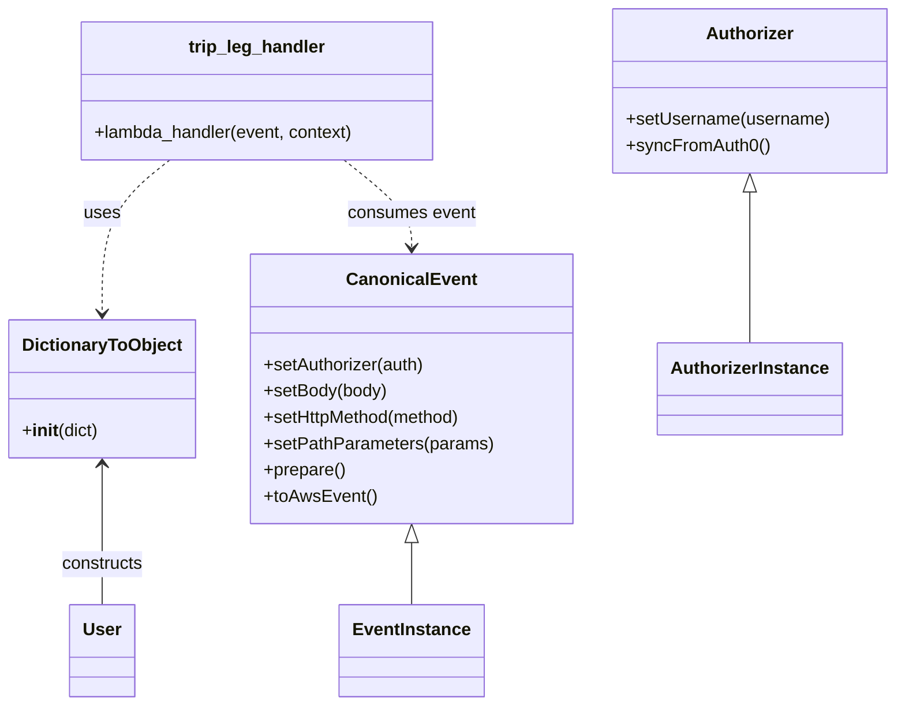

# Diagram: tools/ide_local_testing/localTest/test/partview/tripLeg/putTripLeg.py


> Auto-generated by Obscura crawlers

## Diagram 1

```mermaid
flowchart LR
    User[Caller Script] -->|creates| AuthorizerClass[Authorizer]
    AuthorizerClass -->|setUsername / syncFromAuth0| AuthorizerInstance[Authorizer Instance]
    User -->|creates| CanonicalEventClass[CanonicalEvent]
    CanonicalEventClass -->|setAuthorizer / setBody / setHttpMethod / setPathParameters / prepare / toAwsEvent| EventInstance[AWS Event]
    EventInstance -->|invokes| TripLegHandler[trip_leg_handler.lambda_handler]
    DictObj[DictionaryToObject({'function_name':\"getPackageContainer\"})] -->|passed as second arg| TripLegHandler
    TripLegHandler -->|returns| Response[Handler Response]
```

> SVG rendering failed for this diagram.

## Diagram 2



### SVG

<svg id="container" width="804.09375" xmlns="http://www.w3.org/2000/svg" class="classDiagram" height="644" viewBox="0 0 804.09375 644" role="graphics-document document" aria-roledescription="class"><style>#container{font-family:"trebuchet ms",verdana,arial,sans-serif;font-size:16px;fill:#333;}@keyframes edge-animation-frame{from{stroke-dashoffset:0;}}@keyframes dash{to{stroke-dashoffset:0;}}#container .edge-animation-slow{stroke-dasharray:9,5!important;stroke-dashoffset:900;animation:dash 50s linear infinite;stroke-linecap:round;}#container .edge-animation-fast{stroke-dasharray:9,5!important;stroke-dashoffset:900;animation:dash 20s linear infinite;stroke-linecap:round;}#container .error-icon{fill:#552222;}#container .error-text{fill:#552222;stroke:#552222;}#container .edge-thickness-normal{stroke-width:1px;}#container .edge-thickness-thick{stroke-width:3.5px;}#container .edge-pattern-solid{stroke-dasharray:0;}#container .edge-thickness-invisible{stroke-width:0;fill:none;}#container .edge-pattern-dashed{stroke-dasharray:3;}#container .edge-pattern-dotted{stroke-dasharray:2;}#container .marker{fill:#333333;stroke:#333333;}#container .marker.cross{stroke:#333333;}#container svg{font-family:"trebuchet ms",verdana,arial,sans-serif;font-size:16px;}#container p{margin:0;}#container g.classGroup text{fill:#9370DB;stroke:none;font-family:"trebuchet ms",verdana,arial,sans-serif;font-size:10px;}#container g.classGroup text .title{font-weight:bolder;}#container .nodeLabel,#container .edgeLabel{color:#131300;}#container .edgeLabel .label rect{fill:#ECECFF;}#container .label text{fill:#131300;}#container .labelBkg{background:#ECECFF;}#container .edgeLabel .label span{background:#ECECFF;}#container .classTitle{font-weight:bolder;}#container .node rect,#container .node circle,#container .node ellipse,#container .node polygon,#container .node path{fill:#ECECFF;stroke:#9370DB;stroke-width:1px;}#container .divider{stroke:#9370DB;stroke-width:1;}#container g.clickable{cursor:pointer;}#container g.classGroup rect{fill:#ECECFF;stroke:#9370DB;}#container g.classGroup line{stroke:#9370DB;stroke-width:1;}#container .classLabel .box{stroke:none;stroke-width:0;fill:#ECECFF;opacity:0.5;}#container .classLabel .label{fill:#9370DB;font-size:10px;}#container .relation{stroke:#333333;stroke-width:1;fill:none;}#container .dashed-line{stroke-dasharray:3;}#container .dotted-line{stroke-dasharray:1 2;}#container #compositionStart,#container .composition{fill:#333333!important;stroke:#333333!important;stroke-width:1;}#container #compositionEnd,#container .composition{fill:#333333!important;stroke:#333333!important;stroke-width:1;}#container #dependencyStart,#container .dependency{fill:#333333!important;stroke:#333333!important;stroke-width:1;}#container #dependencyStart,#container .dependency{fill:#333333!important;stroke:#333333!important;stroke-width:1;}#container #extensionStart,#container .extension{fill:transparent!important;stroke:#333333!important;stroke-width:1;}#container #extensionEnd,#container .extension{fill:transparent!important;stroke:#333333!important;stroke-width:1;}#container #aggregationStart,#container .aggregation{fill:transparent!important;stroke:#333333!important;stroke-width:1;}#container #aggregationEnd,#container .aggregation{fill:transparent!important;stroke:#333333!important;stroke-width:1;}#container #lollipopStart,#container .lollipop{fill:#ECECFF!important;stroke:#333333!important;stroke-width:1;}#container #lollipopEnd,#container .lollipop{fill:#ECECFF!important;stroke:#333333!important;stroke-width:1;}#container .edgeTerminals{font-size:11px;line-height:initial;}#container .classTitleText{text-anchor:middle;font-size:18px;fill:#333;}#container .label-icon{display:inline-block;height:1em;overflow:visible;vertical-align:-0.125em;}#container .node .label-icon path{fill:currentColor;stroke:revert;stroke-width:revert;}#container :root{--mermaid-font-family:"trebuchet ms",verdana,arial,sans-serif;}</style><g><defs><marker id="container_class-aggregationStart" class="marker aggregation class" refX="18" refY="7" markerWidth="190" markerHeight="240" orient="auto"><path d="M 18,7 L9,13 L1,7 L9,1 Z"></path></marker></defs><defs><marker id="container_class-aggregationEnd" class="marker aggregation class" refX="1" refY="7" markerWidth="20" markerHeight="28" orient="auto"><path d="M 18,7 L9,13 L1,7 L9,1 Z"></path></marker></defs><defs><marker id="container_class-extensionStart" class="marker extension class" refX="18" refY="7" markerWidth="190" markerHeight="240" orient="auto"><path d="M 1,7 L18,13 V 1 Z"></path></marker></defs><defs><marker id="container_class-extensionEnd" class="marker extension class" refX="1" refY="7" markerWidth="20" markerHeight="28" orient="auto"><path d="M 1,1 V 13 L18,7 Z"></path></marker></defs><defs><marker id="container_class-compositionStart" class="marker composition class" refX="18" refY="7" markerWidth="190" markerHeight="240" orient="auto"><path d="M 18,7 L9,13 L1,7 L9,1 Z"></path></marker></defs><defs><marker id="container_class-compositionEnd" class="marker composition class" refX="1" refY="7" markerWidth="20" markerHeight="28" orient="auto"><path d="M 18,7 L9,13 L1,7 L9,1 Z"></path></marker></defs><defs><marker id="container_class-dependencyStart" class="marker dependency class" refX="6" refY="7" markerWidth="190" markerHeight="240" orient="auto"><path d="M 5,7 L9,13 L1,7 L9,1 Z"></path></marker></defs><defs><marker id="container_class-dependencyEnd" class="marker dependency class" refX="13" refY="7" markerWidth="20" markerHeight="28" orient="auto"><path d="M 18,7 L9,13 L14,7 L9,1 Z"></path></marker></defs><defs><marker id="container_class-lollipopStart" class="marker lollipop class" refX="13" refY="7" markerWidth="190" markerHeight="240" orient="auto"><circle stroke="black" fill="transparent" cx="7" cy="7" r="6"></circle></marker></defs><defs><marker id="container_class-lollipopEnd" class="marker lollipop class" refX="1" refY="7" markerWidth="190" markerHeight="240" orient="auto"><circle stroke="black" fill="transparent" cx="7" cy="7" r="6"></circle></marker></defs><g class="root"><g class="clusters"></g><g class="edgePaths"><path d="M671.957,175.25L671.957,178.542C671.957,181.833,671.957,188.417,671.957,211.375C671.957,234.333,671.957,273.667,671.957,293.333L671.957,313" id="id_Authorizer_AuthorizerInstance_1" class="edge-thickness-normal edge-pattern-solid relation" style=";;;" data-edge="true" data-et="edge" data-id="id_Authorizer_AuthorizerInstance_1" data-points="W3sieCI6NjcxLjk1NzAzMTI1LCJ5IjoxNTh9LHsieCI6NjcxLjk1NzAzMTI1LCJ5IjoxOTV9LHsieCI6NjcxLjk1NzAzMTI1LCJ5IjozMTN9XQ==" marker-start="url(#container_class-extensionStart)"></path><path d="M366.105,495.25L366.105,498.542C366.105,501.833,366.105,508.417,366.105,517.875C366.105,527.333,366.105,539.667,366.105,545.833L366.105,552" id="id_CanonicalEvent_EventInstance_2" class="edge-thickness-normal edge-pattern-solid relation" style=";;;" data-edge="true" data-et="edge" data-id="id_CanonicalEvent_EventInstance_2" data-points="W3sieCI6MzY2LjEwNTQ2ODc1LCJ5Ijo0Nzh9LHsieCI6MzY2LjEwNTQ2ODc1LCJ5Ijo1MTV9LHsieCI6MzY2LjEwNTQ2ODc1LCJ5Ijo1NTJ9XQ==" marker-start="url(#container_class-extensionStart)"></path><path d="M150.557,146L140.498,154.167C130.439,162.333,110.321,178.667,100.262,202C90.203,225.333,90.203,255.667,90.203,270.833L90.203,286" id="id_trip_leg_handler_DictionaryToObject_3" class="edge-thickness-normal edge-pattern-dashed relation" style=";;;" data-edge="true" data-et="edge" data-id="id_trip_leg_handler_DictionaryToObject_3" data-points="W3sieCI6MTUwLjU1Njc2MjY5NTMxMjUsInkiOjE0Nn0seyJ4Ijo5MC4yMDMxMjUsInkiOjE5NX0seyJ4Ijo5MC4yMDMxMjUsInkiOjI5Mn1d" marker-end="url(#container_class-dependencyEnd)"></path><path d="M305.752,146L315.811,154.167C325.87,162.333,345.988,178.667,356.047,192C366.105,205.333,366.105,215.667,366.105,220.833L366.105,226" id="id_trip_leg_handler_CanonicalEvent_4" class="edge-thickness-normal edge-pattern-dashed relation" style=";;;" data-edge="true" data-et="edge" data-id="id_trip_leg_handler_CanonicalEvent_4" data-points="W3sieCI6MzA1Ljc1MTgzMTA1NDY4NzUsInkiOjE0Nn0seyJ4IjozNjYuMTA1NDY4NzUsInkiOjE5NX0seyJ4IjozNjYuMTA1NDY4NzUsInkiOjIzMn1d" marker-end="url(#container_class-dependencyEnd)"></path><path d="M90.203,424L90.203,439.167C90.203,454.333,90.203,484.667,90.203,506C90.203,527.333,90.203,539.667,90.203,545.833L90.203,552" id="id_DictionaryToObject_User_5" class="edge-thickness-normal edge-pattern-solid relation" style=";;;" data-edge="true" data-et="edge" data-id="id_DictionaryToObject_User_5" data-points="W3sieCI6OTAuMjAzMTI1LCJ5Ijo0MTh9LHsieCI6OTAuMjAzMTI1LCJ5Ijo1MTV9LHsieCI6OTAuMjAzMTI1LCJ5Ijo1NTJ9XQ==" marker-start="url(#container_class-dependencyStart)"></path></g><g class="edgeLabels"><g class="edgeLabel"><g class="label" data-id="id_Authorizer_AuthorizerInstance_1" transform="translate(0, 0)"><foreignObject width="0" height="0"><div xmlns="http://www.w3.org/1999/xhtml" class="labelBkg" style="display: table-cell; white-space: nowrap; line-height: 1.5; max-width: 200px; text-align: center;"><span class="edgeLabel"></span></div></foreignObject></g></g><g class="edgeLabel"><g class="label" data-id="id_CanonicalEvent_EventInstance_2" transform="translate(0, 0)"><foreignObject width="0" height="0"><div xmlns="http://www.w3.org/1999/xhtml" class="labelBkg" style="display: table-cell; white-space: nowrap; line-height: 1.5; max-width: 200px; text-align: center;"><span class="edgeLabel"></span></div></foreignObject></g></g><g class="edgeLabel" transform="translate(90.203125, 195)"><g class="label" data-id="id_trip_leg_handler_DictionaryToObject_3" transform="translate(-16.4921875, -12)"><foreignObject width="32.984375" height="24"><div xmlns="http://www.w3.org/1999/xhtml" class="labelBkg" style="display: table-cell; white-space: nowrap; line-height: 1.5; max-width: 200px; text-align: center;"><span class="edgeLabel"><p>uses</p></span></div></foreignObject></g></g><g class="edgeLabel" transform="translate(366.10546875, 195)"><g class="label" data-id="id_trip_leg_handler_CanonicalEvent_4" transform="translate(-58.65625, -12)"><foreignObject width="117.3125" height="24"><div xmlns="http://www.w3.org/1999/xhtml" class="labelBkg" style="display: table-cell; white-space: nowrap; line-height: 1.5; max-width: 200px; text-align: center;"><span class="edgeLabel"><p>consumes event</p></span></div></foreignObject></g></g><g class="edgeLabel" transform="translate(90.203125, 515)"><g class="label" data-id="id_DictionaryToObject_User_5" transform="translate(-37.84375, -12)"><foreignObject width="75.6875" height="24"><div xmlns="http://www.w3.org/1999/xhtml" class="labelBkg" style="display: table-cell; white-space: nowrap; line-height: 1.5; max-width: 200px; text-align: center;"><span class="edgeLabel"><p>constructs</p></span></div></foreignObject></g></g></g><g class="nodes"><g class="node default" id="classId-Authorizer-0" transform="translate(671.95703125, 83)"><g class="basic label-container"><path d="M-124.13671875 -75 L124.13671875 -75 L124.13671875 75 L-124.13671875 75" stroke="none" stroke-width="0" fill="#ECECFF" style=""></path><path d="M-124.13671875 -75 C-47.38351096352571 -75, 29.369696822948583 -75, 124.13671875 -75 M-124.13671875 -75 C-44.0348431779842 -75, 36.0670323940316 -75, 124.13671875 -75 M124.13671875 -75 C124.13671875 -34.93046394666447, 124.13671875 5.139072106671065, 124.13671875 75 M124.13671875 -75 C124.13671875 -37.57746336291495, 124.13671875 -0.15492672582989542, 124.13671875 75 M124.13671875 75 C34.18218754447682 75, -55.772343661046364 75, -124.13671875 75 M124.13671875 75 C46.95378396803238 75, -30.229150813935235 75, -124.13671875 75 M-124.13671875 75 C-124.13671875 20.912563445611845, -124.13671875 -33.17487310877631, -124.13671875 -75 M-124.13671875 75 C-124.13671875 25.341711031215546, -124.13671875 -24.31657793756891, -124.13671875 -75" stroke="#9370DB" stroke-width="1.3" fill="none" stroke-dasharray="0 0" style=""></path></g><g class="annotation-group text" transform="translate(0, -51)"></g><g class="label-group text" transform="translate(-38.3671875, -51)"><g class="label" style="font-weight: bolder" transform="translate(0,-12)"><foreignObject width="76.734375" height="24"><div xmlns="http://www.w3.org/1999/xhtml" style="display: table-cell; white-space: nowrap; line-height: 1.5; max-width: 126px; text-align: center;"><span class="nodeLabel markdown-node-label" style=""><p>Authorizer</p></span></div></foreignObject></g></g><g class="members-group text" transform="translate(-112.13671875, -3)"></g><g class="methods-group text" transform="translate(-112.13671875, 27)"><g class="label" style="" transform="translate(0,-12)"><foreignObject width="185.90625" height="24"><div xmlns="http://www.w3.org/1999/xhtml" style="display: table-cell; white-space: nowrap; line-height: 1.5; max-width: 243px; text-align: center;"><span class="nodeLabel markdown-node-label" style=""><p>+setUsername(username)</p></span></div></foreignObject></g><g class="label" style="" transform="translate(0,12)"><foreignObject width="129.0625" height="24"><div xmlns="http://www.w3.org/1999/xhtml" style="display: table-cell; white-space: nowrap; line-height: 1.5; max-width: 186px; text-align: center;"><span class="nodeLabel markdown-node-label" style=""><p>+syncFromAuth0()</p></span></div></foreignObject></g></g><g class="divider" style=""><path d="M-124.13671875 -27 C-68.46966647842986 -27, -12.802614206859715 -27, 124.13671875 -27 M-124.13671875 -27 C-30.87843266211368 -27, 62.37985342577264 -27, 124.13671875 -27" stroke="#9370DB" stroke-width="1.3" fill="none" stroke-dasharray="0 0" style=""></path></g><g class="divider" style=""><path d="M-124.13671875 -3 C-38.12870346020344 -3, 47.87931182959312 -3, 124.13671875 -3 M-124.13671875 -3 C-54.294823382564545 -3, 15.547071984870911 -3, 124.13671875 -3" stroke="#9370DB" stroke-width="1.3" fill="none" stroke-dasharray="0 0" style=""></path></g></g><g class="node default" id="classId-CanonicalEvent-1" transform="translate(366.10546875, 355)"><g class="basic label-container"><path d="M-143.69921875 -123 L143.69921875 -123 L143.69921875 123 L-143.69921875 123" stroke="none" stroke-width="0" fill="#ECECFF" style=""></path><path d="M-143.69921875 -123 C-67.99709862375367 -123, 7.705021502492656 -123, 143.69921875 -123 M-143.69921875 -123 C-57.43202412061129 -123, 28.835170508777423 -123, 143.69921875 -123 M143.69921875 -123 C143.69921875 -39.60181753181128, 143.69921875 43.796364936377444, 143.69921875 123 M143.69921875 -123 C143.69921875 -64.71460398345712, 143.69921875 -6.429207966914262, 143.69921875 123 M143.69921875 123 C62.99403448951638 123, -17.71114977096724 123, -143.69921875 123 M143.69921875 123 C40.06871014864653 123, -63.56179845270694 123, -143.69921875 123 M-143.69921875 123 C-143.69921875 39.03021478083106, -143.69921875 -44.93957043833788, -143.69921875 -123 M-143.69921875 123 C-143.69921875 28.72374934374328, -143.69921875 -65.55250131251344, -143.69921875 -123" stroke="#9370DB" stroke-width="1.3" fill="none" stroke-dasharray="0 0" style=""></path></g><g class="annotation-group text" transform="translate(0, -99)"></g><g class="label-group text" transform="translate(-55.7109375, -99)"><g class="label" style="font-weight: bolder" transform="translate(0,-12)"><foreignObject width="111.421875" height="24"><div xmlns="http://www.w3.org/1999/xhtml" style="display: table-cell; white-space: nowrap; line-height: 1.5; max-width: 161px; text-align: center;"><span class="nodeLabel markdown-node-label" style=""><p>CanonicalEvent</p></span></div></foreignObject></g></g><g class="members-group text" transform="translate(-131.69921875, -51)"></g><g class="methods-group text" transform="translate(-131.69921875, -21)"><g class="label" style="" transform="translate(0,-12)"><foreignObject width="148.9375" height="24"><div xmlns="http://www.w3.org/1999/xhtml" style="display: table-cell; white-space: nowrap; line-height: 1.5; max-width: 206px; text-align: center;"><span class="nodeLabel markdown-node-label" style=""><p>+setAuthorizer(auth)</p></span></div></foreignObject></g><g class="label" style="" transform="translate(0,12)"><foreignObject width="113.125" height="24"><div xmlns="http://www.w3.org/1999/xhtml" style="display: table-cell; white-space: nowrap; line-height: 1.5; max-width: 170px; text-align: center;"><span class="nodeLabel markdown-node-label" style=""><p>+setBody(body)</p></span></div></foreignObject></g><g class="label" style="" transform="translate(0,36)"><foreignObject width="184" height="24"><div xmlns="http://www.w3.org/1999/xhtml" style="display: table-cell; white-space: nowrap; line-height: 1.5; max-width: 241px; text-align: center;"><span class="nodeLabel markdown-node-label" style=""><p>+setHttpMethod(method)</p></span></div></foreignObject></g><g class="label" style="" transform="translate(0,60)"><foreignObject width="207.6875" height="24"><div xmlns="http://www.w3.org/1999/xhtml" style="display: table-cell; white-space: nowrap; line-height: 1.5; max-width: 265px; text-align: center;"><span class="nodeLabel markdown-node-label" style=""><p>+setPathParameters(params)</p></span></div></foreignObject></g><g class="label" style="" transform="translate(0,84)"><foreignObject width="74.75" height="24"><div xmlns="http://www.w3.org/1999/xhtml" style="display: table-cell; white-space: nowrap; line-height: 1.5; max-width: 132px; text-align: center;"><span class="nodeLabel markdown-node-label" style=""><p>+prepare()</p></span></div></foreignObject></g><g class="label" style="" transform="translate(0,108)"><foreignObject width="101.1875" height="24"><div xmlns="http://www.w3.org/1999/xhtml" style="display: table-cell; white-space: nowrap; line-height: 1.5; max-width: 159px; text-align: center;"><span class="nodeLabel markdown-node-label" style=""><p>+toAwsEvent()</p></span></div></foreignObject></g></g><g class="divider" style=""><path d="M-143.69921875 -75 C-54.53127495622029 -75, 34.63666883755943 -75, 143.69921875 -75 M-143.69921875 -75 C-43.26245001103274 -75, 57.17431872793452 -75, 143.69921875 -75" stroke="#9370DB" stroke-width="1.3" fill="none" stroke-dasharray="0 0" style=""></path></g><g class="divider" style=""><path d="M-143.69921875 -51 C-36.45707042062055 -51, 70.7850779087589 -51, 143.69921875 -51 M-143.69921875 -51 C-65.0422413954001 -51, 13.614735959199805 -51, 143.69921875 -51" stroke="#9370DB" stroke-width="1.3" fill="none" stroke-dasharray="0 0" style=""></path></g></g><g class="node default" id="classId-trip_leg_handler-2" transform="translate(228.154296875, 83)"><g class="basic label-container"><path d="M-162.6015625 -63 L162.6015625 -63 L162.6015625 63 L-162.6015625 63" stroke="none" stroke-width="0" fill="#ECECFF" style=""></path><path d="M-162.6015625 -63 C-34.589313994692986 -63, 93.42293451061403 -63, 162.6015625 -63 M-162.6015625 -63 C-43.624233422253425 -63, 75.35309565549315 -63, 162.6015625 -63 M162.6015625 -63 C162.6015625 -19.82213377202023, 162.6015625 23.35573245595954, 162.6015625 63 M162.6015625 -63 C162.6015625 -13.74393073176379, 162.6015625 35.51213853647242, 162.6015625 63 M162.6015625 63 C36.3715560752364 63, -89.8584503495272 63, -162.6015625 63 M162.6015625 63 C56.5993047852933 63, -49.4029529294134 63, -162.6015625 63 M-162.6015625 63 C-162.6015625 35.851170933560546, -162.6015625 8.702341867121092, -162.6015625 -63 M-162.6015625 63 C-162.6015625 19.501952720477867, -162.6015625 -23.996094559044266, -162.6015625 -63" stroke="#9370DB" stroke-width="1.3" fill="none" stroke-dasharray="0 0" style=""></path></g><g class="annotation-group text" transform="translate(0, -39)"></g><g class="label-group text" transform="translate(-61.015625, -39)"><g class="label" style="font-weight: bolder" transform="translate(0,-12)"><foreignObject width="122.03125" height="24"><div xmlns="http://www.w3.org/1999/xhtml" style="display: table-cell; white-space: nowrap; line-height: 1.5; max-width: 171px; text-align: center;"><span class="nodeLabel markdown-node-label" style=""><p>trip_leg_handler</p></span></div></foreignObject></g></g><g class="members-group text" transform="translate(-150.6015625, 9)"></g><g class="methods-group text" transform="translate(-150.6015625, 39)"><g class="label" style="" transform="translate(0,-12)"><foreignObject width="240.1875" height="24"><div xmlns="http://www.w3.org/1999/xhtml" style="display: table-cell; white-space: nowrap; line-height: 1.5; max-width: 298px; text-align: center;"><span class="nodeLabel markdown-node-label" style=""><p>+lambda_handler(event, context)</p></span></div></foreignObject></g></g><g class="divider" style=""><path d="M-162.6015625 -15 C-41.729712104851586 -15, 79.14213829029683 -15, 162.6015625 -15 M-162.6015625 -15 C-94.4081336527696 -15, -26.214704805539213 -15, 162.6015625 -15" stroke="#9370DB" stroke-width="1.3" fill="none" stroke-dasharray="0 0" style=""></path></g><g class="divider" style=""><path d="M-162.6015625 9 C-70.71847907208692 9, 21.164604355826157 9, 162.6015625 9 M-162.6015625 9 C-73.44923864344717 9, 15.703085213105652 9, 162.6015625 9" stroke="#9370DB" stroke-width="1.3" fill="none" stroke-dasharray="0 0" style=""></path></g></g><g class="node default" id="classId-DictionaryToObject-3" transform="translate(90.203125, 355)"><g class="basic label-container"><path d="M-82.203125 -63 L82.203125 -63 L82.203125 63 L-82.203125 63" stroke="none" stroke-width="0" fill="#ECECFF" style=""></path><path d="M-82.203125 -63 C-44.69819638088326 -63, -7.193267761766521 -63, 82.203125 -63 M-82.203125 -63 C-43.0327780146557 -63, -3.862431029311395 -63, 82.203125 -63 M82.203125 -63 C82.203125 -26.965815402620528, 82.203125 9.068369194758944, 82.203125 63 M82.203125 -63 C82.203125 -33.96752636271103, 82.203125 -4.935052725422061, 82.203125 63 M82.203125 63 C46.95366274834544 63, 11.704200496690873 63, -82.203125 63 M82.203125 63 C34.79238190035286 63, -12.618361199294284 63, -82.203125 63 M-82.203125 63 C-82.203125 18.35416205358991, -82.203125 -26.29167589282018, -82.203125 -63 M-82.203125 63 C-82.203125 21.725855531789243, -82.203125 -19.548288936421514, -82.203125 -63" stroke="#9370DB" stroke-width="1.3" fill="none" stroke-dasharray="0 0" style=""></path></g><g class="annotation-group text" transform="translate(0, -39)"></g><g class="label-group text" transform="translate(-70.109375, -39)"><g class="label" style="font-weight: bolder" transform="translate(0,-12)"><foreignObject width="140.21875" height="24"><div xmlns="http://www.w3.org/1999/xhtml" style="display: table-cell; white-space: nowrap; line-height: 1.5; max-width: 188px; text-align: center;"><span class="nodeLabel markdown-node-label" style=""><p>DictionaryToObject</p></span></div></foreignObject></g></g><g class="members-group text" transform="translate(-70.203125, 9)"></g><g class="methods-group text" transform="translate(-70.203125, 39)"><g class="label" style="" transform="translate(0,-12)"><foreignObject width="70.296875" height="24"><div xmlns="http://www.w3.org/1999/xhtml" style="display: table-cell; white-space: nowrap; line-height: 1.5; max-width: 159px; text-align: center;"><span class="nodeLabel markdown-node-label" style=""><p>+<strong>init</strong>(dict)</p></span></div></foreignObject></g></g><g class="divider" style=""><path d="M-82.203125 -15 C-42.04069739732912 -15, -1.8782697946582374 -15, 82.203125 -15 M-82.203125 -15 C-44.24396359858034 -15, -6.284802197160687 -15, 82.203125 -15" stroke="#9370DB" stroke-width="1.3" fill="none" stroke-dasharray="0 0" style=""></path></g><g class="divider" style=""><path d="M-82.203125 9 C-19.220865072225884 9, 43.76139485554823 9, 82.203125 9 M-82.203125 9 C-34.852329426303605 9, 12.49846614739279 9, 82.203125 9" stroke="#9370DB" stroke-width="1.3" fill="none" stroke-dasharray="0 0" style=""></path></g></g><g class="node default" id="classId-AuthorizerInstance-4" transform="translate(671.95703125, 355)"><g class="basic label-container"><path d="M-81.265625 -42 L81.265625 -42 L81.265625 42 L-81.265625 42" stroke="none" stroke-width="0" fill="#ECECFF" style=""></path><path d="M-81.265625 -42 C-46.81366267299153 -42, -12.361700345983067 -42, 81.265625 -42 M-81.265625 -42 C-22.29333535444855 -42, 36.6789542911029 -42, 81.265625 -42 M81.265625 -42 C81.265625 -15.15879185416648, 81.265625 11.682416291667039, 81.265625 42 M81.265625 -42 C81.265625 -21.718796007102853, 81.265625 -1.4375920142057055, 81.265625 42 M81.265625 42 C40.89268945129082 42, 0.5197539025816411 42, -81.265625 42 M81.265625 42 C37.61404338145994 42, -6.037538237080113 42, -81.265625 42 M-81.265625 42 C-81.265625 14.122062418199594, -81.265625 -13.755875163600813, -81.265625 -42 M-81.265625 42 C-81.265625 18.24747443706416, -81.265625 -5.505051125871681, -81.265625 -42" stroke="#9370DB" stroke-width="1.3" fill="none" stroke-dasharray="0 0" style=""></path></g><g class="annotation-group text" transform="translate(0, -18)"></g><g class="label-group text" transform="translate(-69.265625, -18)"><g class="label" style="font-weight: bolder" transform="translate(0,-12)"><foreignObject width="138.53125" height="24"><div xmlns="http://www.w3.org/1999/xhtml" style="display: table-cell; white-space: nowrap; line-height: 1.5; max-width: 187px; text-align: center;"><span class="nodeLabel markdown-node-label" style=""><p>AuthorizerInstance</p></span></div></foreignObject></g></g><g class="members-group text" transform="translate(-69.265625, 30)"></g><g class="methods-group text" transform="translate(-69.265625, 60)"></g><g class="divider" style=""><path d="M-81.265625 6 C-35.456402325850476 6, 10.352820348299048 6, 81.265625 6 M-81.265625 6 C-27.035755004004947 6, 27.194114991990105 6, 81.265625 6" stroke="#9370DB" stroke-width="1.3" fill="none" stroke-dasharray="0 0" style=""></path></g><g class="divider" style=""><path d="M-81.265625 24 C-21.62523879018321 24, 38.01514741963358 24, 81.265625 24 M-81.265625 24 C-19.857500653396706 24, 41.55062369320659 24, 81.265625 24" stroke="#9370DB" stroke-width="1.3" fill="none" stroke-dasharray="0 0" style=""></path></g></g><g class="node default" id="classId-EventInstance-5" transform="translate(366.10546875, 594)"><g class="basic label-container"><path d="M-63.1171875 -42 L63.1171875 -42 L63.1171875 42 L-63.1171875 42" stroke="none" stroke-width="0" fill="#ECECFF" style=""></path><path d="M-63.1171875 -42 C-16.71185199976182 -42, 29.69348350047636 -42, 63.1171875 -42 M-63.1171875 -42 C-21.279784363437955 -42, 20.55761877312409 -42, 63.1171875 -42 M63.1171875 -42 C63.1171875 -11.53051826819279, 63.1171875 18.93896346361442, 63.1171875 42 M63.1171875 -42 C63.1171875 -13.590693091538736, 63.1171875 14.818613816922529, 63.1171875 42 M63.1171875 42 C22.726143495497787 42, -17.664900509004426 42, -63.1171875 42 M63.1171875 42 C23.764784788269992 42, -15.587617923460016 42, -63.1171875 42 M-63.1171875 42 C-63.1171875 18.629626046517636, -63.1171875 -4.740747906964728, -63.1171875 -42 M-63.1171875 42 C-63.1171875 16.927240615268197, -63.1171875 -8.145518769463607, -63.1171875 -42" stroke="#9370DB" stroke-width="1.3" fill="none" stroke-dasharray="0 0" style=""></path></g><g class="annotation-group text" transform="translate(0, -18)"></g><g class="label-group text" transform="translate(-51.1171875, -18)"><g class="label" style="font-weight: bolder" transform="translate(0,-12)"><foreignObject width="102.234375" height="24"><div xmlns="http://www.w3.org/1999/xhtml" style="display: table-cell; white-space: nowrap; line-height: 1.5; max-width: 151px; text-align: center;"><span class="nodeLabel markdown-node-label" style=""><p>EventInstance</p></span></div></foreignObject></g></g><g class="members-group text" transform="translate(-51.1171875, 30)"></g><g class="methods-group text" transform="translate(-51.1171875, 60)"></g><g class="divider" style=""><path d="M-63.1171875 6 C-25.99161700750497 6, 11.133953484990059 6, 63.1171875 6 M-63.1171875 6 C-32.63083013176187 6, -2.144472763523737 6, 63.1171875 6" stroke="#9370DB" stroke-width="1.3" fill="none" stroke-dasharray="0 0" style=""></path></g><g class="divider" style=""><path d="M-63.1171875 24 C-37.46309310255711 24, -11.80899870511422 24, 63.1171875 24 M-63.1171875 24 C-32.373698621018264 24, -1.63020974203652 24, 63.1171875 24" stroke="#9370DB" stroke-width="1.3" fill="none" stroke-dasharray="0 0" style=""></path></g></g><g class="node default" id="classId-User-6" transform="translate(90.203125, 594)"><g class="basic label-container"><path d="M-28.65625 -42 L28.65625 -42 L28.65625 42 L-28.65625 42" stroke="none" stroke-width="0" fill="#ECECFF" style=""></path><path d="M-28.65625 -42 C-13.557742389968926 -42, 1.5407652200621484 -42, 28.65625 -42 M-28.65625 -42 C-16.44898529119077 -42, -4.241720582381539 -42, 28.65625 -42 M28.65625 -42 C28.65625 -18.658191494395318, 28.65625 4.683617011209364, 28.65625 42 M28.65625 -42 C28.65625 -19.354520305637283, 28.65625 3.290959388725433, 28.65625 42 M28.65625 42 C14.557337377506476 42, 0.45842475501295255 42, -28.65625 42 M28.65625 42 C9.824776128853625 42, -9.00669774229275 42, -28.65625 42 M-28.65625 42 C-28.65625 20.783470429304263, -28.65625 -0.4330591413914746, -28.65625 -42 M-28.65625 42 C-28.65625 19.724127776698577, -28.65625 -2.5517444466028465, -28.65625 -42" stroke="#9370DB" stroke-width="1.3" fill="none" stroke-dasharray="0 0" style=""></path></g><g class="annotation-group text" transform="translate(0, -18)"></g><g class="label-group text" transform="translate(-16.65625, -18)"><g class="label" style="font-weight: bolder" transform="translate(0,-12)"><foreignObject width="33.3125" height="24"><div xmlns="http://www.w3.org/1999/xhtml" style="display: table-cell; white-space: nowrap; line-height: 1.5; max-width: 84px; text-align: center;"><span class="nodeLabel markdown-node-label" style=""><p>User</p></span></div></foreignObject></g></g><g class="members-group text" transform="translate(-16.65625, 30)"></g><g class="methods-group text" transform="translate(-16.65625, 60)"></g><g class="divider" style=""><path d="M-28.65625 6 C-11.64719562690573 6, 5.361858746188538 6, 28.65625 6 M-28.65625 6 C-11.580752308023655 6, 5.49474538395269 6, 28.65625 6" stroke="#9370DB" stroke-width="1.3" fill="none" stroke-dasharray="0 0" style=""></path></g><g class="divider" style=""><path d="M-28.65625 24 C-8.73293028884449 24, 11.190389422311021 24, 28.65625 24 M-28.65625 24 C-10.235651820204144 24, 8.184946359591713 24, 28.65625 24" stroke="#9370DB" stroke-width="1.3" fill="none" stroke-dasharray="0 0" style=""></path></g></g></g></g></g></svg>
