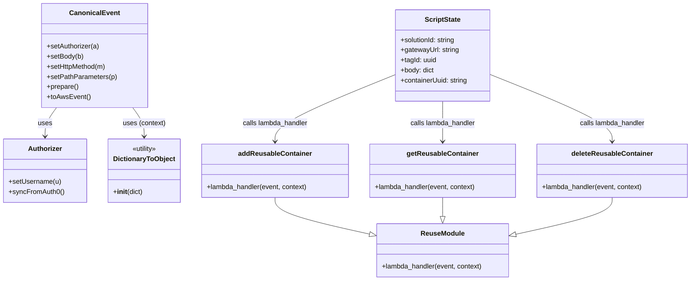
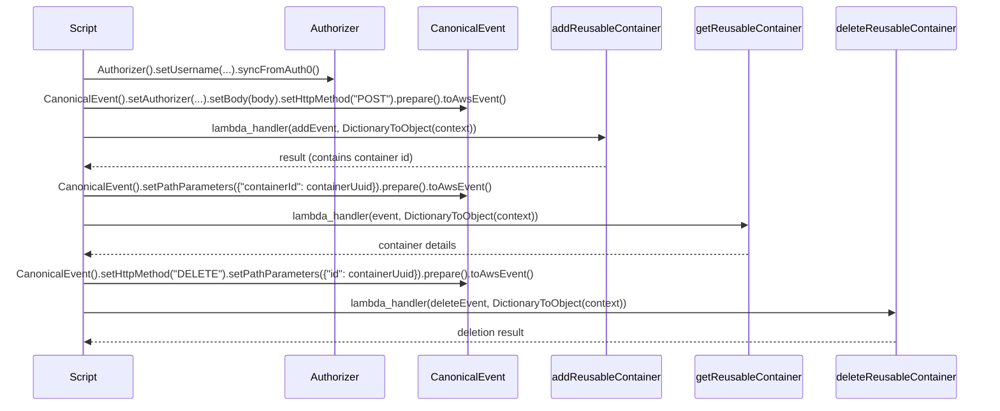

# Diagram: tools/ide_local_testing/localTest/test/reusableContainerTracking/addGetDeleteReuseableContainer.py

> Auto-generated by Obscura crawlers

## Diagram 1

### SVG

<svg id="container" width="1620.7734375" xmlns="http://www.w3.org/2000/svg" class="classDiagram" height="662" viewBox="0 0 1620.7734375 662" role="graphics-document document" aria-roledescription="class"><g><defs><marker id="container_class-aggregationStart" class="marker aggregation class" refX="18" refY="7" markerWidth="190" markerHeight="240" orient="auto"><path d="M 18,7 L9,13 L1,7 L9,1 Z"></path></marker></defs><defs><marker id="container_class-aggregationEnd" class="marker aggregation class" refX="1" refY="7" markerWidth="20" markerHeight="28" orient="auto"><path d="M 18,7 L9,13 L1,7 L9,1 Z"></path></marker></defs><defs><marker id="container_class-extensionStart" class="marker extension class" refX="18" refY="7" markerWidth="190" markerHeight="240" orient="auto"><path d="M 1,7 L18,13 V 1 Z"></path></marker></defs><defs><marker id="container_class-extensionEnd" class="marker extension class" refX="1" refY="7" markerWidth="20" markerHeight="28" orient="auto"><path d="M 1,1 V 13 L18,7 Z"></path></marker></defs><defs><marker id="container_class-compositionStart" class="marker composition class" refX="18" refY="7" markerWidth="190" markerHeight="240" orient="auto"><path d="M 18,7 L9,13 L1,7 L9,1 Z"></path></marker></defs><defs><marker id="container_class-compositionEnd" class="marker composition class" refX="1" refY="7" markerWidth="20" markerHeight="28" orient="auto"><path d="M 18,7 L9,13 L1,7 L9,1 Z"></path></marker></defs><defs><marker id="container_class-dependencyStart" class="marker dependency class" refX="6" refY="7" markerWidth="190" markerHeight="240" orient="auto"><path d="M 5,7 L9,13 L1,7 L9,1 Z"></path></marker></defs><defs><marker id="container_class-dependencyEnd" class="marker dependency class" refX="13" refY="7" markerWidth="20" markerHeight="28" orient="auto"><path d="M 18,7 L9,13 L14,7 L9,1 Z"></path></marker></defs><defs><marker id="container_class-lollipopStart" class="marker lollipop class" refX="13" refY="7" markerWidth="190" markerHeight="240" orient="auto"><circle stroke="black" fill="transparent" cx="7" cy="7" r="6"></circle></marker></defs><defs><marker id="container_class-lollipopEnd" class="marker lollipop class" refX="1" refY="7" markerWidth="190" markerHeight="240" orient="auto"><circle stroke="black" fill="transparent" cx="7" cy="7" r="6"></circle></marker></defs><g class="root"><g class="clusters"></g><g class="edgePaths"><path d="M130.068,254L125.676,260.167C121.284,266.333,112.499,278.667,108.107,290C103.715,301.333,103.715,311.667,103.715,316.833L103.715,322" id="id_CanonicalEvent_Authorizer_1" class="edge-thickness-normal edge-pattern-solid relation" style=";;;" data-edge="true" data-et="edge" data-id="id_CanonicalEvent_Authorizer_1" data-points="W3sieCI6MTMwLjA2Nzg1ODg4NjcxODc0LCJ5IjoyNTR9LHsieCI6MTAzLjcxNDg0Mzc1LCJ5IjoyOTF9LHsieCI6MTAzLjcxNDg0Mzc1LCJ5IjozMjh9XQ==" marker-end="url(#container_class-dependencyEnd)"></path><path d="M305.28,254L309.672,260.167C314.064,266.333,322.848,278.667,327.241,290C331.633,301.333,331.633,311.667,331.633,316.833L331.633,322" id="id_CanonicalEvent_DictionaryToObject_2" class="edge-thickness-normal edge-pattern-solid relation" style=";;;" data-edge="true" data-et="edge" data-id="id_CanonicalEvent_DictionaryToObject_2" data-points="W3sieCI6MzA1LjI3OTc5NzM2MzI4MTI2LCJ5IjoyNTR9LHsieCI6MzMxLjYzMjgxMjUsInkiOjI5MX0seyJ4IjozMzEuNjMyODEyNSwieSI6MzI4fV0=" marker-end="url(#container_class-dependencyEnd)"></path><path d="M920.66,176.628L873.463,195.69C826.266,214.752,731.871,252.876,684.674,279.105C637.477,305.333,637.477,319.667,637.477,326.833L637.477,334" id="id_ScriptState_addReusableContainer_3" class="edge-thickness-normal edge-pattern-solid relation" style=";;;" data-edge="true" data-et="edge" data-id="id_ScriptState_addReusableContainer_3" data-points="W3sieCI6OTIwLjY2MDE1NjI1LCJ5IjoxNzYuNjI3NTE0Mzk2MTUwNX0seyJ4Ijo2MzcuNDc2NTYyNSwieSI6MjkxfSx7IngiOjYzNy40NzY1NjI1LCJ5IjozNDB9XQ==" marker-end="url(#container_class-dependencyEnd)"></path><path d="M1033.633,239L1033.633,247.667C1033.633,256.333,1033.633,273.667,1033.633,289.5C1033.633,305.333,1033.633,319.667,1033.633,326.833L1033.633,334" id="id_ScriptState_getReusableContainer_4" class="edge-thickness-normal edge-pattern-solid relation" style=";;;" data-edge="true" data-et="edge" data-id="id_ScriptState_getReusableContainer_4" data-points="W3sieCI6MTAzMy42MzI4MTI1LCJ5IjoyMzl9LHsieCI6MTAzMy42MzI4MTI1LCJ5IjoyOTF9LHsieCI6MTAzMy42MzI4MTI1LCJ5IjozNDB9XQ==" marker-end="url(#container_class-dependencyEnd)"></path><path d="M1146.605,176.096L1194.581,195.246C1242.557,214.397,1338.509,252.699,1386.485,279.016C1434.461,305.333,1434.461,319.667,1434.461,326.833L1434.461,334" id="id_ScriptState_deleteReusableContainer_5" class="edge-thickness-normal edge-pattern-solid relation" style=";;;" data-edge="true" data-et="edge" data-id="id_ScriptState_deleteReusableContainer_5" data-points="W3sieCI6MTE0Ni42MDU0Njg3NSwieSI6MTc2LjA5NTcwMDMwNzk1NjE4fSx7IngiOjE0MzQuNDYwOTM3NSwieSI6MjkxfSx7IngiOjE0MzQuNDYwOTM3NSwieSI6MzQwfV0=" marker-end="url(#container_class-dependencyEnd)"></path><path d="M637.477,466L637.477,472.167C637.477,478.333,637.477,490.667,674.582,505.076C711.688,519.485,785.899,535.97,823.004,544.212L860.11,552.455" id="id_addReusableContainer_ReuseModule_6" class="edge-thickness-normal edge-pattern-solid relation" style=";;;" data-edge="true" data-et="edge" data-id="id_addReusableContainer_ReuseModule_6" data-points="W3sieCI6NjM3LjQ3NjU2MjUsInkiOjQ2Nn0seyJ4Ijo2MzcuNDc2NTYyNSwieSI6NTAzfSx7IngiOjg3Ni45NDkyMTg3NSwieSI6NTU2LjE5NTE1NjU4Mjc4Nzd9XQ==" marker-end="url(#container_class-extensionEnd)"></path><path d="M1033.633,466L1033.633,472.167C1033.633,478.333,1033.633,490.667,1033.633,498.125C1033.633,505.583,1033.633,508.167,1033.633,509.458L1033.633,510.75" id="id_getReusableContainer_ReuseModule_7" class="edge-thickness-normal edge-pattern-solid relation" style=";;;" data-edge="true" data-et="edge" data-id="id_getReusableContainer_ReuseModule_7" data-points="W3sieCI6MTAzMy42MzI4MTI1LCJ5Ijo0NjZ9LHsieCI6MTAzMy42MzI4MTI1LCJ5Ijo1MDN9LHsieCI6MTAzMy42MzI4MTI1LCJ5Ijo1Mjh9XQ==" marker-end="url(#container_class-extensionEnd)"></path><path d="M1434.461,466L1434.461,472.167C1434.461,478.333,1434.461,490.667,1396.578,505.15C1358.696,519.634,1282.93,536.268,1245.048,544.585L1207.165,552.902" id="id_deleteReusableContainer_ReuseModule_8" class="edge-thickness-normal edge-pattern-solid relation" style=";;;" data-edge="true" data-et="edge" data-id="id_deleteReusableContainer_ReuseModule_8" data-points="W3sieCI6MTQzNC40NjA5Mzc1LCJ5Ijo0NjZ9LHsieCI6MTQzNC40NjA5Mzc1LCJ5Ijo1MDN9LHsieCI6MTE5MC4zMTY0MDYyNSwieSI6NTU2LjYwMDgyNjQxNDA2NDZ9XQ==" marker-end="url(#container_class-extensionEnd)"></path></g><g class="edgeLabels"><g class="edgeLabel" transform="translate(103.71484375, 291)"><g class="label" data-id="id_CanonicalEvent_Authorizer_1" transform="translate(-16.4921875, -12)"><foreignObject width="32.984375" height="24">

uses

</foreignObject></g></g><g class="edgeLabel" transform="translate(331.6328125, 291)"><g class="label" data-id="id_CanonicalEvent_DictionaryToObject_2" transform="translate(-50.640625, -12)"><foreignObject width="101.28125" height="24">

uses (context)

</foreignObject></g></g><g class="edgeLabel" transform="translate(637.4765625, 291)"><g class="label" data-id="id_ScriptState_addReusableContainer_3" transform="translate(-78.390625, -12)"><foreignObject width="156.78125" height="24">

calls lambda_handler

</foreignObject></g></g><g class="edgeLabel" transform="translate(1033.6328125, 291)"><g class="label" data-id="id_ScriptState_getReusableContainer_4" transform="translate(-78.390625, -12)"><foreignObject width="156.78125" height="24">

calls lambda_handler

</foreignObject></g></g><g class="edgeLabel" transform="translate(1434.4609375, 291)"><g class="label" data-id="id_ScriptState_deleteReusableContainer_5" transform="translate(-78.390625, -12)"><foreignObject width="156.78125" height="24">

calls lambda_handler

</foreignObject></g></g><g class="edgeLabel"><g class="label" data-id="id_addReusableContainer_ReuseModule_6" transform="translate(0, 0)"><foreignObject width="0" height="0">

</foreignObject></g></g><g class="edgeLabel"><g class="label" data-id="id_getReusableContainer_ReuseModule_7" transform="translate(0, 0)"><foreignObject width="0" height="0">

</foreignObject></g></g><g class="edgeLabel"><g class="label" data-id="id_deleteReusableContainer_ReuseModule_8" transform="translate(0, 0)"><foreignObject width="0" height="0">

</foreignObject></g></g></g><g class="nodes"><g class="node default" id="classId-CanonicalEvent-0" transform="translate(217.673828125, 131)"><g class="basic label-container"><path d="M-121.67578125 -123 L121.67578125 -123 L121.67578125 123 L-121.67578125 123" stroke="none" stroke-width="0" fill="#ECECFF" style=""></path><path d="M-121.67578125 -123 C-52.24271880864873 -123, 17.190343632702536 -123, 121.67578125 -123 M-121.67578125 -123 C-69.86606611024135 -123, -18.056350970482697 -123, 121.67578125 -123 M121.67578125 -123 C121.67578125 -54.57735472069609, 121.67578125 13.845290558607815, 121.67578125 123 M121.67578125 -123 C121.67578125 -29.21127205137479, 121.67578125 64.57745589725042, 121.67578125 123 M121.67578125 123 C49.611854991435166 123, -22.452071267129668 123, -121.67578125 123 M121.67578125 123 C45.91508929599958 123, -29.845602658000843 123, -121.67578125 123 M-121.67578125 123 C-121.67578125 56.535665798717716, -121.67578125 -9.928668402564568, -121.67578125 -123 M-121.67578125 123 C-121.67578125 30.230481660457116, -121.67578125 -62.53903667908577, -121.67578125 -123" stroke="#9370DB" stroke-width="1.3" fill="none" stroke-dasharray="0 0" style=""></path></g><g class="annotation-group text" transform="translate(0, -99)"></g><g class="label-group text" transform="translate(-55.7109375, -99)"><g class="label" style="font-weight: bolder" transform="translate(0,-12)"><foreignObject width="111.421875" height="24">

CanonicalEvent

</foreignObject></g></g><g class="members-group text" transform="translate(-109.67578125, -51)"></g><g class="methods-group text" transform="translate(-109.67578125, -21)"><g class="label" style="" transform="translate(0,-12)"><foreignObject width="124.46875" height="24">

+setAuthorizer(a)

</foreignObject></g><g class="label" style="" transform="translate(0,12)"><foreignObject width="86.34375" height="24">

+setBody(b)

</foreignObject></g><g class="label" style="" transform="translate(0,36)"><foreignObject width="141.203125" height="24">

+setHttpMethod(m)

</foreignObject></g><g class="label" style="" transform="translate(0,60)"><foreignObject width="163.640625" height="24">

+setPathParameters(p)

</foreignObject></g><g class="label" style="" transform="translate(0,84)"><foreignObject width="74.75" height="24">

+prepare()

</foreignObject></g><g class="label" style="" transform="translate(0,108)"><foreignObject width="101.1875" height="24">

+toAwsEvent()

</foreignObject></g></g><g class="divider" style=""><path d="M-121.67578125 -75 C-49.313329832710934 -75, 23.04912158457813 -75, 121.67578125 -75 M-121.67578125 -75 C-69.46368651756339 -75, -17.25159178512679 -75, 121.67578125 -75" stroke="#9370DB" stroke-width="1.3" fill="none" stroke-dasharray="0 0" style=""></path></g><g class="divider" style=""><path d="M-121.67578125 -51 C-70.86949524153897 -51, -20.06320923307794 -51, 121.67578125 -51 M-121.67578125 -51 C-72.0178891595831 -51, -22.359997069166212 -51, 121.67578125 -51" stroke="#9370DB" stroke-width="1.3" fill="none" stroke-dasharray="0 0" style=""></path></g></g><g class="node default" id="classId-Authorizer-1" transform="translate(103.71484375, 403)"><g class="basic label-container"><path d="M-95.71484375 -75 L95.71484375 -75 L95.71484375 75 L-95.71484375 75" stroke="none" stroke-width="0" fill="#ECECFF" style=""></path><path d="M-95.71484375 -75 C-38.91910789050337 -75, 17.87662796899326 -75, 95.71484375 -75 M-95.71484375 -75 C-53.989615559170694 -75, -12.264387368341389 -75, 95.71484375 -75 M95.71484375 -75 C95.71484375 -23.652950025612967, 95.71484375 27.694099948774067, 95.71484375 75 M95.71484375 -75 C95.71484375 -34.15329488787714, 95.71484375 6.693410224245724, 95.71484375 75 M95.71484375 75 C55.402820775496046 75, 15.090797800992092 75, -95.71484375 75 M95.71484375 75 C41.802172931663726 75, -12.110497886672547 75, -95.71484375 75 M-95.71484375 75 C-95.71484375 37.794764000270426, -95.71484375 0.5895280005408523, -95.71484375 -75 M-95.71484375 75 C-95.71484375 20.945902116727737, -95.71484375 -33.108195766544526, -95.71484375 -75" stroke="#9370DB" stroke-width="1.3" fill="none" stroke-dasharray="0 0" style=""></path></g><g class="annotation-group text" transform="translate(0, -51)"></g><g class="label-group text" transform="translate(-38.3671875, -51)"><g class="label" style="font-weight: bolder" transform="translate(0,-12)"><foreignObject width="76.734375" height="24">

Authorizer

</foreignObject></g></g><g class="members-group text" transform="translate(-83.71484375, -3)"></g><g class="methods-group text" transform="translate(-83.71484375, 27)"><g class="label" style="" transform="translate(0,-12)"><foreignObject width="123.03125" height="24">

+setUsername(u)

</foreignObject></g><g class="label" style="" transform="translate(0,12)"><foreignObject width="129.0625" height="24">

+syncFromAuth0()

</foreignObject></g></g><g class="divider" style=""><path d="M-95.71484375 -27 C-28.48225666240664 -27, 38.75033042518672 -27, 95.71484375 -27 M-95.71484375 -27 C-55.71775166882051 -27, -15.720659587641023 -27, 95.71484375 -27" stroke="#9370DB" stroke-width="1.3" fill="none" stroke-dasharray="0 0" style=""></path></g><g class="divider" style=""><path d="M-95.71484375 -3 C-42.3569160955666 -3, 11.001011558866793 -3, 95.71484375 -3 M-95.71484375 -3 C-54.342768508233014 -3, -12.970693266466029 -3, 95.71484375 -3" stroke="#9370DB" stroke-width="1.3" fill="none" stroke-dasharray="0 0" style=""></path></g></g><g class="node default" id="classId-DictionaryToObject-2" transform="translate(331.6328125, 403)"><g class="basic label-container"><path d="M-82.203125 -75 L82.203125 -75 L82.203125 75 L-82.203125 75" stroke="none" stroke-width="0" fill="#ECECFF" style=""></path><path d="M-82.203125 -75 C-36.02557891647242 -75, 10.151967167055162 -75, 82.203125 -75 M-82.203125 -75 C-21.940394865912793 -75, 38.32233526817441 -75, 82.203125 -75 M82.203125 -75 C82.203125 -43.69739518620227, 82.203125 -12.39479037240455, 82.203125 75 M82.203125 -75 C82.203125 -28.360277068751735, 82.203125 18.27944586249653, 82.203125 75 M82.203125 75 C40.52437208902787 75, -1.1543808219442582 75, -82.203125 75 M82.203125 75 C43.937208003906974 75, 5.671291007813949 75, -82.203125 75 M-82.203125 75 C-82.203125 21.153211288662085, -82.203125 -32.69357742267583, -82.203125 -75 M-82.203125 75 C-82.203125 40.59491527463595, -82.203125 6.189830549271903, -82.203125 -75" stroke="#9370DB" stroke-width="1.3" fill="none" stroke-dasharray="0 0" style=""></path></g><g class="annotation-group text" transform="translate(-30.3125, -51)"><g class="label" style="" transform="translate(0,-12)"><foreignObject width="60.625" height="24">

«utility»

</foreignObject></g></g><g class="label-group text" transform="translate(-70.109375, -27)"><g class="label" style="font-weight: bolder" transform="translate(0,-12)"><foreignObject width="140.21875" height="24">

DictionaryToObject

</foreignObject></g></g><g class="members-group text" transform="translate(-70.203125, 21)"></g><g class="methods-group text" transform="translate(-70.203125, 51)"><g class="label" style="" transform="translate(0,-12)"><foreignObject width="70.296875" height="24">

+<strong>init</strong>(dict)

</foreignObject></g></g><g class="divider" style=""><path d="M-82.203125 -3 C-40.89997675660246 -3, 0.403171486795074 -3, 82.203125 -3 M-82.203125 -3 C-37.26564944022162 -3, 7.671826119556755 -3, 82.203125 -3" stroke="#9370DB" stroke-width="1.3" fill="none" stroke-dasharray="0 0" style=""></path></g><g class="divider" style=""><path d="M-82.203125 21 C-30.07235459454661 21, 22.05841581090678 21, 82.203125 21 M-82.203125 21 C-36.69315223211115 21, 8.816820535777694 21, 82.203125 21" stroke="#9370DB" stroke-width="1.3" fill="none" stroke-dasharray="0 0" style=""></path></g></g><g class="node default" id="classId-ReuseModule-3" transform="translate(1033.6328125, 591)"><g class="basic label-container"><path d="M-156.68359375 -63 L156.68359375 -63 L156.68359375 63 L-156.68359375 63" stroke="none" stroke-width="0" fill="#ECECFF" style=""></path><path d="M-156.68359375 -63 C-69.28565231575858 -63, 18.112289118482835 -63, 156.68359375 -63 M-156.68359375 -63 C-80.01867300367556 -63, -3.3537522573511183 -63, 156.68359375 -63 M156.68359375 -63 C156.68359375 -16.805034358912586, 156.68359375 29.389931282174828, 156.68359375 63 M156.68359375 -63 C156.68359375 -27.107312764309796, 156.68359375 8.785374471380408, 156.68359375 63 M156.68359375 63 C70.49151003690358 63, -15.700573676192846 63, -156.68359375 63 M156.68359375 63 C68.2306466756404 63, -20.2223003987192 63, -156.68359375 63 M-156.68359375 63 C-156.68359375 19.33527131504627, -156.68359375 -24.32945736990746, -156.68359375 -63 M-156.68359375 63 C-156.68359375 26.89903436765792, -156.68359375 -9.201931264684163, -156.68359375 -63" stroke="#9370DB" stroke-width="1.3" fill="none" stroke-dasharray="0 0" style=""></path></g><g class="annotation-group text" transform="translate(0, -39)"></g><g class="label-group text" transform="translate(-49.1796875, -39)"><g class="label" style="font-weight: bolder" transform="translate(0,-12)"><foreignObject width="98.359375" height="24">

ReuseModule

</foreignObject></g></g><g class="members-group text" transform="translate(-144.68359375, 9)"></g><g class="methods-group text" transform="translate(-144.68359375, 39)"><g class="label" style="" transform="translate(0,-12)"><foreignObject width="240.1875" height="24">

+lambda_handler(event, context)

</foreignObject></g></g><g class="divider" style=""><path d="M-156.68359375 -15 C-34.630427533909526 -15, 87.42273868218095 -15, 156.68359375 -15 M-156.68359375 -15 C-82.03117633690039 -15, -7.378758923800774 -15, 156.68359375 -15" stroke="#9370DB" stroke-width="1.3" fill="none" stroke-dasharray="0 0" style=""></path></g><g class="divider" style=""><path d="M-156.68359375 9 C-61.6998920357764 9, 33.2838096784472 9, 156.68359375 9 M-156.68359375 9 C-53.77575462288904 9, 49.13208450422192 9, 156.68359375 9" stroke="#9370DB" stroke-width="1.3" fill="none" stroke-dasharray="0 0" style=""></path></g></g><g class="node default" id="classId-addReusableContainer-4" transform="translate(637.4765625, 403)"><g class="basic label-container"><path d="M-173.640625 -63 L173.640625 -63 L173.640625 63 L-173.640625 63" stroke="none" stroke-width="0" fill="#ECECFF" style=""></path><path d="M-173.640625 -63 C-65.02322917331213 -63, 43.59416665337574 -63, 173.640625 -63 M-173.640625 -63 C-81.8200631190156 -63, 10.0004987619688 -63, 173.640625 -63 M173.640625 -63 C173.640625 -35.99383580118435, 173.640625 -8.987671602368707, 173.640625 63 M173.640625 -63 C173.640625 -12.806368234069673, 173.640625 37.387263531860654, 173.640625 63 M173.640625 63 C92.51294485001132 63, 11.385264700022645 63, -173.640625 63 M173.640625 63 C82.95524800758552 63, -7.730128984828951 63, -173.640625 63 M-173.640625 63 C-173.640625 13.082626300314182, -173.640625 -36.834747399371636, -173.640625 -63 M-173.640625 63 C-173.640625 13.156391167450721, -173.640625 -36.68721766509856, -173.640625 -63" stroke="#9370DB" stroke-width="1.3" fill="none" stroke-dasharray="0 0" style=""></path></g><g class="annotation-group text" transform="translate(0, -39)"></g><g class="label-group text" transform="translate(-83.09375, -39)"><g class="label" style="font-weight: bolder" transform="translate(0,-12)"><foreignObject width="166.1875" height="24">

addReusableContainer

</foreignObject></g></g><g class="members-group text" transform="translate(-161.640625, 9)"></g><g class="methods-group text" transform="translate(-161.640625, 39)"><g class="label" style="" transform="translate(0,-12)"><foreignObject width="240.1875" height="24">

+lambda_handler(event, context)

</foreignObject></g></g><g class="divider" style=""><path d="M-173.640625 -15 C-61.78691673356296 -15, 50.06679153287408 -15, 173.640625 -15 M-173.640625 -15 C-101.4496078916465 -15, -29.258590783292988 -15, 173.640625 -15" stroke="#9370DB" stroke-width="1.3" fill="none" stroke-dasharray="0 0" style=""></path></g><g class="divider" style=""><path d="M-173.640625 9 C-89.45347723214815 9, -5.266329464296291 9, 173.640625 9 M-173.640625 9 C-76.3510982516215 9, 20.938428496757012 9, 173.640625 9" stroke="#9370DB" stroke-width="1.3" fill="none" stroke-dasharray="0 0" style=""></path></g></g><g class="node default" id="classId-getReusableContainer-5" transform="translate(1033.6328125, 403)"><g class="basic label-container"><path d="M-172.515625 -63 L172.515625 -63 L172.515625 63 L-172.515625 63" stroke="none" stroke-width="0" fill="#ECECFF" style=""></path><path d="M-172.515625 -63 C-92.7843291722961 -63, -13.053033344592194 -63, 172.515625 -63 M-172.515625 -63 C-75.13092484908667 -63, 22.253775301826664 -63, 172.515625 -63 M172.515625 -63 C172.515625 -24.271302969576766, 172.515625 14.457394060846468, 172.515625 63 M172.515625 -63 C172.515625 -15.259457706526767, 172.515625 32.481084586946466, 172.515625 63 M172.515625 63 C73.24176625947939 63, -26.032092481041218 63, -172.515625 63 M172.515625 63 C94.6850454338811 63, 16.8544658677622 63, -172.515625 63 M-172.515625 63 C-172.515625 15.286152926716738, -172.515625 -32.42769414656652, -172.515625 -63 M-172.515625 63 C-172.515625 13.898644198614882, -172.515625 -35.202711602770236, -172.515625 -63" stroke="#9370DB" stroke-width="1.3" fill="none" stroke-dasharray="0 0" style=""></path></g><g class="annotation-group text" transform="translate(0, -39)"></g><g class="label-group text" transform="translate(-80.84375, -39)"><g class="label" style="font-weight: bolder" transform="translate(0,-12)"><foreignObject width="161.6875" height="24">

getReusableContainer

</foreignObject></g></g><g class="members-group text" transform="translate(-160.515625, 9)"></g><g class="methods-group text" transform="translate(-160.515625, 39)"><g class="label" style="" transform="translate(0,-12)"><foreignObject width="240.1875" height="24">

+lambda_handler(event, context)

</foreignObject></g></g><g class="divider" style=""><path d="M-172.515625 -15 C-76.41719985272962 -15, 19.681225294540752 -15, 172.515625 -15 M-172.515625 -15 C-87.10372944894938 -15, -1.6918338978987606 -15, 172.515625 -15" stroke="#9370DB" stroke-width="1.3" fill="none" stroke-dasharray="0 0" style=""></path></g><g class="divider" style=""><path d="M-172.515625 9 C-101.38943437234327 9, -30.263243744686548 9, 172.515625 9 M-172.515625 9 C-81.83740105788965 9, 8.8408228842207 9, 172.515625 9" stroke="#9370DB" stroke-width="1.3" fill="none" stroke-dasharray="0 0" style=""></path></g></g><g class="node default" id="classId-deleteReusableContainer-6" transform="translate(1434.4609375, 403)"><g class="basic label-container"><path d="M-178.3125 -63 L178.3125 -63 L178.3125 63 L-178.3125 63" stroke="none" stroke-width="0" fill="#ECECFF" style=""></path><path d="M-178.3125 -63 C-79.06525824111083 -63, 20.18198351777835 -63, 178.3125 -63 M-178.3125 -63 C-71.00334363574221 -63, 36.305812728515576 -63, 178.3125 -63 M178.3125 -63 C178.3125 -33.124400800044754, 178.3125 -3.2488016000895144, 178.3125 63 M178.3125 -63 C178.3125 -32.4503749299091, 178.3125 -1.9007498598182053, 178.3125 63 M178.3125 63 C67.43353090170748 63, -43.44543819658503 63, -178.3125 63 M178.3125 63 C53.14918497563558 63, -72.01413004872884 63, -178.3125 63 M-178.3125 63 C-178.3125 32.299804059374985, -178.3125 1.5996081187499698, -178.3125 -63 M-178.3125 63 C-178.3125 19.634340026084885, -178.3125 -23.73131994783023, -178.3125 -63" stroke="#9370DB" stroke-width="1.3" fill="none" stroke-dasharray="0 0" style=""></path></g><g class="annotation-group text" transform="translate(0, -39)"></g><g class="label-group text" transform="translate(-92.4375, -39)"><g class="label" style="font-weight: bolder" transform="translate(0,-12)"><foreignObject width="184.875" height="24">

deleteReusableContainer

</foreignObject></g></g><g class="members-group text" transform="translate(-166.3125, 9)"></g><g class="methods-group text" transform="translate(-166.3125, 39)"><g class="label" style="" transform="translate(0,-12)"><foreignObject width="240.1875" height="24">

+lambda_handler(event, context)

</foreignObject></g></g><g class="divider" style=""><path d="M-178.3125 -15 C-42.01526193224703 -15, 94.28197613550594 -15, 178.3125 -15 M-178.3125 -15 C-104.77455822941144 -15, -31.23661645882288 -15, 178.3125 -15" stroke="#9370DB" stroke-width="1.3" fill="none" stroke-dasharray="0 0" style=""></path></g><g class="divider" style=""><path d="M-178.3125 9 C-84.86527511461797 9, 8.581949770764055 9, 178.3125 9 M-178.3125 9 C-38.33776826548544 9, 101.63696346902913 9, 178.3125 9" stroke="#9370DB" stroke-width="1.3" fill="none" stroke-dasharray="0 0" style=""></path></g></g><g class="node default" id="classId-ScriptState-7" transform="translate(1033.6328125, 131)"><g class="basic label-container"><path d="M-112.97265625 -108 L112.97265625 -108 L112.97265625 108 L-112.97265625 108" stroke="none" stroke-width="0" fill="#ECECFF" style=""></path><path d="M-112.97265625 -108 C-31.241716889930515 -108, 50.48922247013897 -108, 112.97265625 -108 M-112.97265625 -108 C-39.5399100514351 -108, 33.8928361471298 -108, 112.97265625 -108 M112.97265625 -108 C112.97265625 -29.144904261902298, 112.97265625 49.710191476195405, 112.97265625 108 M112.97265625 -108 C112.97265625 -49.182719729271454, 112.97265625 9.634560541457091, 112.97265625 108 M112.97265625 108 C34.209821206069094 108, -44.55301383786181 108, -112.97265625 108 M112.97265625 108 C41.992801579034676 108, -28.987053091930647 108, -112.97265625 108 M-112.97265625 108 C-112.97265625 44.071448382079005, -112.97265625 -19.85710323584199, -112.97265625 -108 M-112.97265625 108 C-112.97265625 62.559913194097746, -112.97265625 17.11982638819549, -112.97265625 -108" stroke="#9370DB" stroke-width="1.3" fill="none" stroke-dasharray="0 0" style=""></path></g><g class="annotation-group text" transform="translate(0, -84)"></g><g class="label-group text" transform="translate(-41.0546875, -84)"><g class="label" style="font-weight: bolder" transform="translate(0,-12)"><foreignObject width="82.109375" height="24">

ScriptState

</foreignObject></g></g><g class="members-group text" transform="translate(-100.97265625, -36)"><g class="label" style="" transform="translate(0,-12)"><foreignObject width="131.8125" height="24">

+solutionId: string

</foreignObject></g><g class="label" style="" transform="translate(0,12)"><foreignObject width="137.90625" height="24">

+gatewayUrl: string

</foreignObject></g><g class="label" style="" transform="translate(0,36)"><foreignObject width="85.515625" height="24">

+tagId: uuid

</foreignObject></g><g class="label" style="" transform="translate(0,60)"><foreignObject width="79.921875" height="24">

+body: dict

</foreignObject></g><g class="label" style="" transform="translate(0,84)"><foreignObject width="160.890625" height="24">

+containerUuid: string

</foreignObject></g></g><g class="methods-group text" transform="translate(-100.97265625, 108)"></g><g class="divider" style=""><path d="M-112.97265625 -60 C-35.37102777133839 -60, 42.23060070732322 -60, 112.97265625 -60 M-112.97265625 -60 C-47.81025509889092 -60, 17.35214605221816 -60, 112.97265625 -60" stroke="#9370DB" stroke-width="1.3" fill="none" stroke-dasharray="0 0" style=""></path></g><g class="divider" style=""><path d="M-112.97265625 84 C-58.36461823639313 84, -3.756580222786255 84, 112.97265625 84 M-112.97265625 84 C-51.674413024149096 84, 9.623830201701807 84, 112.97265625 84" stroke="#9370DB" stroke-width="1.3" fill="none" stroke-dasharray="0 0" style=""></path></g></g></g></g></g></svg>

## Diagram 2

### SVG

<svg id="container" width="1571" xmlns="http://www.w3.org/2000/svg" height="651" viewBox="-50 -10 1571 651" role="graphics-document document" aria-roledescription="sequence"><g><rect x="1267" y="565" fill="#eaeaea" stroke="#666" width="204" height="65" name="deleteReusableContainer" rx="3" ry="3" class="actor actor-bottom"></rect><text x="1369" y="597.5" dominant-baseline="central" alignment-baseline="central" class="actor actor-box" style="text-anchor: middle; font-size: 16px; font-weight: 400;"><tspan x="1369" dy="0">deleteReusableContainer</tspan></text></g><g><rect x="1037" y="565" fill="#eaeaea" stroke="#666" width="180" height="65" name="getReusableContainer" rx="3" ry="3" class="actor actor-bottom"></rect><text x="1127" y="597.5" dominant-baseline="central" alignment-baseline="central" class="actor actor-box" style="text-anchor: middle; font-size: 16px; font-weight: 400;"><tspan x="1127" dy="0">getReusableContainer</tspan></text></g><g><rect x="802" y="565" fill="#eaeaea" stroke="#666" width="185" height="65" name="addReusableContainer" rx="3" ry="3" class="actor actor-bottom"></rect><text x="894.5" y="597.5" dominant-baseline="central" alignment-baseline="central" class="actor actor-box" style="text-anchor: middle; font-size: 16px; font-weight: 400;"><tspan x="894.5" dy="0">addReusableContainer</tspan></text></g><g><rect x="602" y="565" fill="#eaeaea" stroke="#666" width="150" height="65" name="CanonicalEvent" rx="3" ry="3" class="actor actor-bottom"></rect><text x="677" y="597.5" dominant-baseline="central" alignment-baseline="central" class="actor actor-box" style="text-anchor: middle; font-size: 16px; font-weight: 400;"><tspan x="677" dy="0">CanonicalEvent</tspan></text></g><g><rect x="402" y="565" fill="#eaeaea" stroke="#666" width="150" height="65" name="Authorizer" rx="3" ry="3" class="actor actor-bottom"></rect><text x="477" y="597.5" dominant-baseline="central" alignment-baseline="central" class="actor actor-box" style="text-anchor: middle; font-size: 16px; font-weight: 400;"><tspan x="477" dy="0">Authorizer</tspan></text></g><g><rect x="0" y="565" fill="#eaeaea" stroke="#666" width="150" height="65" name="Script" rx="3" ry="3" class="actor actor-bottom"></rect><text x="75" y="597.5" dominant-baseline="central" alignment-baseline="central" class="actor actor-box" style="text-anchor: middle; font-size: 16px; font-weight: 400;"><tspan x="75" dy="0">Script</tspan></text></g><g><line id="actor5" x1="1369" y1="65" x2="1369" y2="565" class="actor-line 200" stroke-width="0.5px" stroke="#999" name="deleteReusableContainer"></line><g id="root-5"><rect x="1267" y="0" fill="#eaeaea" stroke="#666" width="204" height="65" name="deleteReusableContainer" rx="3" ry="3" class="actor actor-top"></rect><text x="1369" y="32.5" dominant-baseline="central" alignment-baseline="central" class="actor actor-box" style="text-anchor: middle; font-size: 16px; font-weight: 400;"><tspan x="1369" dy="0">deleteReusableContainer</tspan></text></g></g><g><line id="actor4" x1="1127" y1="65" x2="1127" y2="565" class="actor-line 200" stroke-width="0.5px" stroke="#999" name="getReusableContainer"></line><g id="root-4"><rect x="1037" y="0" fill="#eaeaea" stroke="#666" width="180" height="65" name="getReusableContainer" rx="3" ry="3" class="actor actor-top"></rect><text x="1127" y="32.5" dominant-baseline="central" alignment-baseline="central" class="actor actor-box" style="text-anchor: middle; font-size: 16px; font-weight: 400;"><tspan x="1127" dy="0">getReusableContainer</tspan></text></g></g><g><line id="actor3" x1="894.5" y1="65" x2="894.5" y2="565" class="actor-line 200" stroke-width="0.5px" stroke="#999" name="addReusableContainer"></line><g id="root-3"><rect x="802" y="0" fill="#eaeaea" stroke="#666" width="185" height="65" name="addReusableContainer" rx="3" ry="3" class="actor actor-top"></rect><text x="894.5" y="32.5" dominant-baseline="central" alignment-baseline="central" class="actor actor-box" style="text-anchor: middle; font-size: 16px; font-weight: 400;"><tspan x="894.5" dy="0">addReusableContainer</tspan></text></g></g><g><line id="actor2" x1="677" y1="65" x2="677" y2="565" class="actor-line 200" stroke-width="0.5px" stroke="#999" name="CanonicalEvent"></line><g id="root-2"><rect x="602" y="0" fill="#eaeaea" stroke="#666" width="150" height="65" name="CanonicalEvent" rx="3" ry="3" class="actor actor-top"></rect><text x="677" y="32.5" dominant-baseline="central" alignment-baseline="central" class="actor actor-box" style="text-anchor: middle; font-size: 16px; font-weight: 400;"><tspan x="677" dy="0">CanonicalEvent</tspan></text></g></g><g><line id="actor1" x1="477" y1="65" x2="477" y2="565" class="actor-line 200" stroke-width="0.5px" stroke="#999" name="Authorizer"></line><g id="root-1"><rect x="402" y="0" fill="#eaeaea" stroke="#666" width="150" height="65" name="Authorizer" rx="3" ry="3" class="actor actor-top"></rect><text x="477" y="32.5" dominant-baseline="central" alignment-baseline="central" class="actor actor-box" style="text-anchor: middle; font-size: 16px; font-weight: 400;"><tspan x="477" dy="0">Authorizer</tspan></text></g></g><g><line id="actor0" x1="75" y1="65" x2="75" y2="565" class="actor-line 200" stroke-width="0.5px" stroke="#999" name="Script"></line><g id="root-0"><rect x="0" y="0" fill="#eaeaea" stroke="#666" width="150" height="65" name="Script" rx="3" ry="3" class="actor actor-top"></rect><text x="75" y="32.5" dominant-baseline="central" alignment-baseline="central" class="actor actor-box" style="text-anchor: middle; font-size: 16px; font-weight: 400;"><tspan x="75" dy="0">Script</tspan></text></g></g><g></g><defs><symbol id="computer" width="24" height="24"><path transform="scale(.5)" d="M2 2v13h20v-13h-20zm18 11h-16v-9h16v9zm-10.228 6l.466-1h3.524l.467 1h-4.457zm14.228 3h-24l2-6h2.104l-1.33 4h18.45l-1.297-4h2.073l2 6zm-5-10h-14v-7h14v7z"></path></symbol></defs><defs><symbol id="database" fill-rule="evenodd" clip-rule="evenodd"><path transform="scale(.5)" d="M12.258.001l.256.004.255.005.253.008.251.01.249.012.247.015.246.016.242.019.241.02.239.023.236.024.233.027.231.028.229.031.225.032.223.034.22.036.217.038.214.04.211.041.208.043.205.045.201.046.198.048.194.05.191.051.187.053.183.054.18.056.175.057.172.059.168.06.163.061.16.063.155.064.15.066.074.033.073.033.071.034.07.034.069.035.068.035.067.035.066.035.064.036.064.036.062.036.06.036.06.037.058.037.058.037.055.038.055.038.053.038.052.038.051.039.05.039.048.039.047.039.045.04.044.04.043.04.041.04.04.041.039.041.037.041.036.041.034.041.033.042.032.042.03.042.029.042.027.042.026.043.024.043.023.043.021.043.02.043.018.044.017.043.015.044.013.044.012.044.011.045.009.044.007.045.006.045.004.045.002.045.001.045v17l-.001.045-.002.045-.004.045-.006.045-.007.045-.009.044-.011.045-.012.044-.013.044-.015.044-.017.043-.018.044-.02.043-.021.043-.023.043-.024.043-.026.043-.027.042-.029.042-.03.042-.032.042-.033.042-.034.041-.036.041-.037.041-.039.041-.04.041-.041.04-.043.04-.044.04-.045.04-.047.039-.048.039-.05.039-.051.039-.052.038-.053.038-.055.038-.055.038-.058.037-.058.037-.06.037-.06.036-.062.036-.064.036-.064.036-.066.035-.067.035-.068.035-.069.035-.07.034-.071.034-.073.033-.074.033-.15.066-.155.064-.16.063-.163.061-.168.06-.172.059-.175.057-.18.056-.183.054-.187.053-.191.051-.194.05-.198.048-.201.046-.205.045-.208.043-.211.041-.214.04-.217.038-.22.036-.223.034-.225.032-.229.031-.231.028-.233.027-.236.024-.239.023-.241.02-.242.019-.246.016-.247.015-.249.012-.251.01-.253.008-.255.005-.256.004-.258.001-.258-.001-.256-.004-.255-.005-.253-.008-.251-.01-.249-.012-.247-.015-.245-.016-.243-.019-.241-.02-.238-.023-.236-.024-.234-.027-.231-.028-.228-.031-.226-.032-.223-.034-.22-.036-.217-.038-.214-.04-.211-.041-.208-.043-.204-.045-.201-.046-.198-.048-.195-.05-.19-.051-.187-.053-.184-.054-.179-.056-.176-.057-.172-.059-.167-.06-.164-.061-.159-.063-.155-.064-.151-.066-.074-.033-.072-.033-.072-.034-.07-.034-.069-.035-.068-.035-.067-.035-.066-.035-.064-.036-.063-.036-.062-.036-.061-.036-.06-.037-.058-.037-.057-.037-.056-.038-.055-.038-.053-.038-.052-.038-.051-.039-.049-.039-.049-.039-.046-.039-.046-.04-.044-.04-.043-.04-.041-.04-.04-.041-.039-.041-.037-.041-.036-.041-.034-.041-.033-.042-.032-.042-.03-.042-.029-.042-.027-.042-.026-.043-.024-.043-.023-.043-.021-.043-.02-.043-.018-.044-.017-.043-.015-.044-.013-.044-.012-.044-.011-.045-.009-.044-.007-.045-.006-.045-.004-.045-.002-.045-.001-.045v-17l.001-.045.002-.045.004-.045.006-.045.007-.045.009-.044.011-.045.012-.044.013-.044.015-.044.017-.043.018-.044.02-.043.021-.043.023-.043.024-.043.026-.043.027-.042.029-.042.03-.042.032-.042.033-.042.034-.041.036-.041.037-.041.039-.041.04-.041.041-.04.043-.04.044-.04.046-.04.046-.039.049-.039.049-.039.051-.039.052-.038.053-.038.055-.038.056-.038.057-.037.058-.037.06-.037.061-.036.062-.036.063-.036.064-.036.066-.035.067-.035.068-.035.069-.035.07-.034.072-.034.072-.033.074-.033.151-.066.155-.064.159-.063.164-.061.167-.06.172-.059.176-.057.179-.056.184-.054.187-.053.19-.051.195-.05.198-.048.201-.046.204-.045.208-.043.211-.041.214-.04.217-.038.22-.036.223-.034.226-.032.228-.031.231-.028.234-.027.236-.024.238-.023.241-.02.243-.019.245-.016.247-.015.249-.012.251-.01.253-.008.255-.005.256-.004.258-.001.258.001zm-9.258 20.499v.01l.001.021.003.021.004.022.005.021.006.022.007.022.009.023.01.022.011.023.012.023.013.023.015.023.016.024.017.023.018.024.019.024.021.024.022.025.023.024.024.025.052.049.056.05.061.051.066.051.07.051.075.051.079.052.084.052.088.052.092.052.097.052.102.051.105.052.11.052.114.051.119.051.123.051.127.05.131.05.135.05.139.048.144.049.147.047.152.047.155.047.16.045.163.045.167.043.171.043.176.041.178.041.183.039.187.039.19.037.194.035.197.035.202.033.204.031.209.03.212.029.216.027.219.025.222.024.226.021.23.02.233.018.236.016.24.015.243.012.246.01.249.008.253.005.256.004.259.001.26-.001.257-.004.254-.005.25-.008.247-.011.244-.012.241-.014.237-.016.233-.018.231-.021.226-.021.224-.024.22-.026.216-.027.212-.028.21-.031.205-.031.202-.034.198-.034.194-.036.191-.037.187-.039.183-.04.179-.04.175-.042.172-.043.168-.044.163-.045.16-.046.155-.046.152-.047.148-.048.143-.049.139-.049.136-.05.131-.05.126-.05.123-.051.118-.052.114-.051.11-.052.106-.052.101-.052.096-.052.092-.052.088-.053.083-.051.079-.052.074-.052.07-.051.065-.051.06-.051.056-.05.051-.05.023-.024.023-.025.021-.024.02-.024.019-.024.018-.024.017-.024.015-.023.014-.024.013-.023.012-.023.01-.023.01-.022.008-.022.006-.022.006-.022.004-.022.004-.021.001-.021.001-.021v-4.127l-.077.055-.08.053-.083.054-.085.053-.087.052-.09.052-.093.051-.095.05-.097.05-.1.049-.102.049-.105.048-.106.047-.109.047-.111.046-.114.045-.115.045-.118.044-.12.043-.122.042-.124.042-.126.041-.128.04-.13.04-.132.038-.134.038-.135.037-.138.037-.139.035-.142.035-.143.034-.144.033-.147.032-.148.031-.15.03-.151.03-.153.029-.154.027-.156.027-.158.026-.159.025-.161.024-.162.023-.163.022-.165.021-.166.02-.167.019-.169.018-.169.017-.171.016-.173.015-.173.014-.175.013-.175.012-.177.011-.178.01-.179.008-.179.008-.181.006-.182.005-.182.004-.184.003-.184.002h-.37l-.184-.002-.184-.003-.182-.004-.182-.005-.181-.006-.179-.008-.179-.008-.178-.01-.176-.011-.176-.012-.175-.013-.173-.014-.172-.015-.171-.016-.17-.017-.169-.018-.167-.019-.166-.02-.165-.021-.163-.022-.162-.023-.161-.024-.159-.025-.157-.026-.156-.027-.155-.027-.153-.029-.151-.03-.15-.03-.148-.031-.146-.032-.145-.033-.143-.034-.141-.035-.14-.035-.137-.037-.136-.037-.134-.038-.132-.038-.13-.04-.128-.04-.126-.041-.124-.042-.122-.042-.12-.044-.117-.043-.116-.045-.113-.045-.112-.046-.109-.047-.106-.047-.105-.048-.102-.049-.1-.049-.097-.05-.095-.05-.093-.052-.09-.051-.087-.052-.085-.053-.083-.054-.08-.054-.077-.054v4.127zm0-5.654v.011l.001.021.003.021.004.021.005.022.006.022.007.022.009.022.01.022.011.023.012.023.013.023.015.024.016.023.017.024.018.024.019.024.021.024.022.024.023.025.024.024.052.05.056.05.061.05.066.051.07.051.075.052.079.051.084.052.088.052.092.052.097.052.102.052.105.052.11.051.114.051.119.052.123.05.127.051.131.05.135.049.139.049.144.048.147.048.152.047.155.046.16.045.163.045.167.044.171.042.176.042.178.04.183.04.187.038.19.037.194.036.197.034.202.033.204.032.209.03.212.028.216.027.219.025.222.024.226.022.23.02.233.018.236.016.24.014.243.012.246.01.249.008.253.006.256.003.259.001.26-.001.257-.003.254-.006.25-.008.247-.01.244-.012.241-.015.237-.016.233-.018.231-.02.226-.022.224-.024.22-.025.216-.027.212-.029.21-.03.205-.032.202-.033.198-.035.194-.036.191-.037.187-.039.183-.039.179-.041.175-.042.172-.043.168-.044.163-.045.16-.045.155-.047.152-.047.148-.048.143-.048.139-.05.136-.049.131-.05.126-.051.123-.051.118-.051.114-.052.11-.052.106-.052.101-.052.096-.052.092-.052.088-.052.083-.052.079-.052.074-.051.07-.052.065-.051.06-.05.056-.051.051-.049.023-.025.023-.024.021-.025.02-.024.019-.024.018-.024.017-.024.015-.023.014-.023.013-.024.012-.022.01-.023.01-.023.008-.022.006-.022.006-.022.004-.021.004-.022.001-.021.001-.021v-4.139l-.077.054-.08.054-.083.054-.085.052-.087.053-.09.051-.093.051-.095.051-.097.05-.1.049-.102.049-.105.048-.106.047-.109.047-.111.046-.114.045-.115.044-.118.044-.12.044-.122.042-.124.042-.126.041-.128.04-.13.039-.132.039-.134.038-.135.037-.138.036-.139.036-.142.035-.143.033-.144.033-.147.033-.148.031-.15.03-.151.03-.153.028-.154.028-.156.027-.158.026-.159.025-.161.024-.162.023-.163.022-.165.021-.166.02-.167.019-.169.018-.169.017-.171.016-.173.015-.173.014-.175.013-.175.012-.177.011-.178.009-.179.009-.179.007-.181.007-.182.005-.182.004-.184.003-.184.002h-.37l-.184-.002-.184-.003-.182-.004-.182-.005-.181-.007-.179-.007-.179-.009-.178-.009-.176-.011-.176-.012-.175-.013-.173-.014-.172-.015-.171-.016-.17-.017-.169-.018-.167-.019-.166-.02-.165-.021-.163-.022-.162-.023-.161-.024-.159-.025-.157-.026-.156-.027-.155-.028-.153-.028-.151-.03-.15-.03-.148-.031-.146-.033-.145-.033-.143-.033-.141-.035-.14-.036-.137-.036-.136-.037-.134-.038-.132-.039-.13-.039-.128-.04-.126-.041-.124-.042-.122-.043-.12-.043-.117-.044-.116-.044-.113-.046-.112-.046-.109-.046-.106-.047-.105-.048-.102-.049-.1-.049-.097-.05-.095-.051-.093-.051-.09-.051-.087-.053-.085-.052-.083-.054-.08-.054-.077-.054v4.139zm0-5.666v.011l.001.02.003.022.004.021.005.022.006.021.007.022.009.023.01.022.011.023.012.023.013.023.015.023.016.024.017.024.018.023.019.024.021.025.022.024.023.024.024.025.052.05.056.05.061.05.066.051.07.051.075.052.079.051.084.052.088.052.092.052.097.052.102.052.105.051.11.052.114.051.119.051.123.051.127.05.131.05.135.05.139.049.144.048.147.048.152.047.155.046.16.045.163.045.167.043.171.043.176.042.178.04.183.04.187.038.19.037.194.036.197.034.202.033.204.032.209.03.212.028.216.027.219.025.222.024.226.021.23.02.233.018.236.017.24.014.243.012.246.01.249.008.253.006.256.003.259.001.26-.001.257-.003.254-.006.25-.008.247-.01.244-.013.241-.014.237-.016.233-.018.231-.02.226-.022.224-.024.22-.025.216-.027.212-.029.21-.03.205-.032.202-.033.198-.035.194-.036.191-.037.187-.039.183-.039.179-.041.175-.042.172-.043.168-.044.163-.045.16-.045.155-.047.152-.047.148-.048.143-.049.139-.049.136-.049.131-.051.126-.05.123-.051.118-.052.114-.051.11-.052.106-.052.101-.052.096-.052.092-.052.088-.052.083-.052.079-.052.074-.052.07-.051.065-.051.06-.051.056-.05.051-.049.023-.025.023-.025.021-.024.02-.024.019-.024.018-.024.017-.024.015-.023.014-.024.013-.023.012-.023.01-.022.01-.023.008-.022.006-.022.006-.022.004-.022.004-.021.001-.021.001-.021v-4.153l-.077.054-.08.054-.083.053-.085.053-.087.053-.09.051-.093.051-.095.051-.097.05-.1.049-.102.048-.105.048-.106.048-.109.046-.111.046-.114.046-.115.044-.118.044-.12.043-.122.043-.124.042-.126.041-.128.04-.13.039-.132.039-.134.038-.135.037-.138.036-.139.036-.142.034-.143.034-.144.033-.147.032-.148.032-.15.03-.151.03-.153.028-.154.028-.156.027-.158.026-.159.024-.161.024-.162.023-.163.023-.165.021-.166.02-.167.019-.169.018-.169.017-.171.016-.173.015-.173.014-.175.013-.175.012-.177.01-.178.01-.179.009-.179.007-.181.006-.182.006-.182.004-.184.003-.184.001-.185.001-.185-.001-.184-.001-.184-.003-.182-.004-.182-.006-.181-.006-.179-.007-.179-.009-.178-.01-.176-.01-.176-.012-.175-.013-.173-.014-.172-.015-.171-.016-.17-.017-.169-.018-.167-.019-.166-.02-.165-.021-.163-.023-.162-.023-.161-.024-.159-.024-.157-.026-.156-.027-.155-.028-.153-.028-.151-.03-.15-.03-.148-.032-.146-.032-.145-.033-.143-.034-.141-.034-.14-.036-.137-.036-.136-.037-.134-.038-.132-.039-.13-.039-.128-.041-.126-.041-.124-.041-.122-.043-.12-.043-.117-.044-.116-.044-.113-.046-.112-.046-.109-.046-.106-.048-.105-.048-.102-.048-.1-.05-.097-.049-.095-.051-.093-.051-.09-.052-.087-.052-.085-.053-.083-.053-.08-.054-.077-.054v4.153zm8.74-8.179l-.257.004-.254.005-.25.008-.247.011-.244.012-.241.014-.237.016-.233.018-.231.021-.226.022-.224.023-.22.026-.216.027-.212.028-.21.031-.205.032-.202.033-.198.034-.194.036-.191.038-.187.038-.183.04-.179.041-.175.042-.172.043-.168.043-.163.045-.16.046-.155.046-.152.048-.148.048-.143.048-.139.049-.136.05-.131.05-.126.051-.123.051-.118.051-.114.052-.11.052-.106.052-.101.052-.096.052-.092.052-.088.052-.083.052-.079.052-.074.051-.07.052-.065.051-.06.05-.056.05-.051.05-.023.025-.023.024-.021.024-.02.025-.019.024-.018.024-.017.023-.015.024-.014.023-.013.023-.012.023-.01.023-.01.022-.008.022-.006.023-.006.021-.004.022-.004.021-.001.021-.001.021.001.021.001.021.004.021.004.022.006.021.006.023.008.022.01.022.01.023.012.023.013.023.014.023.015.024.017.023.018.024.019.024.02.025.021.024.023.024.023.025.051.05.056.05.06.05.065.051.07.052.074.051.079.052.083.052.088.052.092.052.096.052.101.052.106.052.11.052.114.052.118.051.123.051.126.051.131.05.136.05.139.049.143.048.148.048.152.048.155.046.16.046.163.045.168.043.172.043.175.042.179.041.183.04.187.038.191.038.194.036.198.034.202.033.205.032.21.031.212.028.216.027.22.026.224.023.226.022.231.021.233.018.237.016.241.014.244.012.247.011.25.008.254.005.257.004.26.001.26-.001.257-.004.254-.005.25-.008.247-.011.244-.012.241-.014.237-.016.233-.018.231-.021.226-.022.224-.023.22-.026.216-.027.212-.028.21-.031.205-.032.202-.033.198-.034.194-.036.191-.038.187-.038.183-.04.179-.041.175-.042.172-.043.168-.043.163-.045.16-.046.155-.046.152-.048.148-.048.143-.048.139-.049.136-.05.131-.05.126-.051.123-.051.118-.051.114-.052.11-.052.106-.052.101-.052.096-.052.092-.052.088-.052.083-.052.079-.052.074-.051.07-.052.065-.051.06-.05.056-.05.051-.05.023-.025.023-.024.021-.024.02-.025.019-.024.018-.024.017-.023.015-.024.014-.023.013-.023.012-.023.01-.023.01-.022.008-.022.006-.023.006-.021.004-.022.004-.021.001-.021.001-.021-.001-.021-.001-.021-.004-.021-.004-.022-.006-.021-.006-.023-.008-.022-.01-.022-.01-.023-.012-.023-.013-.023-.014-.023-.015-.024-.017-.023-.018-.024-.019-.024-.02-.025-.021-.024-.023-.024-.023-.025-.051-.05-.056-.05-.06-.05-.065-.051-.07-.052-.074-.051-.079-.052-.083-.052-.088-.052-.092-.052-.096-.052-.101-.052-.106-.052-.11-.052-.114-.052-.118-.051-.123-.051-.126-.051-.131-.05-.136-.05-.139-.049-.143-.048-.148-.048-.152-.048-.155-.046-.16-.046-.163-.045-.168-.043-.172-.043-.175-.042-.179-.041-.183-.04-.187-.038-.191-.038-.194-.036-.198-.034-.202-.033-.205-.032-.21-.031-.212-.028-.216-.027-.22-.026-.224-.023-.226-.022-.231-.021-.233-.018-.237-.016-.241-.014-.244-.012-.247-.011-.25-.008-.254-.005-.257-.004-.26-.001-.26.001z"></path></symbol></defs><defs><symbol id="clock" width="24" height="24"><path transform="scale(.5)" d="M12 2c5.514 0 10 4.486 10 10s-4.486 10-10 10-10-4.486-10-10 4.486-10 10-10zm0-2c-6.627 0-12 5.373-12 12s5.373 12 12 12 12-5.373 12-12-5.373-12-12-12zm5.848 12.459c.202.038.202.333.001.372-1.907.361-6.045 1.111-6.547 1.111-.719 0-1.301-.582-1.301-1.301 0-.512.77-5.447 1.125-7.445.034-.192.312-.181.343.014l.985 6.238 5.394 1.011z"></path></symbol></defs><defs><marker id="arrowhead" refX="7.9" refY="5" markerUnits="userSpaceOnUse" markerWidth="12" markerHeight="12" orient="auto-start-reverse"><path d="M -1 0 L 10 5 L 0 10 z"></path></marker></defs><defs><marker id="crosshead" markerWidth="15" markerHeight="8" orient="auto" refX="4" refY="4.5"><path fill="none" stroke="#000000" stroke-width="1pt" d="M 1,2 L 6,7 M 6,2 L 1,7" style="stroke-dasharray: 0, 0;"></path></marker></defs><defs><marker id="filled-head" refX="15.5" refY="7" markerWidth="20" markerHeight="28" orient="auto"><path d="M 18,7 L9,13 L14,7 L9,1 Z"></path></marker></defs><defs><marker id="sequencenumber" refX="15" refY="15" markerWidth="60" markerHeight="40" orient="auto"><circle cx="15" cy="15" r="6"></circle></marker></defs><text x="275" y="80" text-anchor="middle" dominant-baseline="middle" alignment-baseline="middle" class="messageText" dy="1em" style="font-size: 16px; font-weight: 400;">Authorizer().setUsername(...).syncFromAuth0()</text><line x1="76" y1="113" x2="473" y2="113" class="messageLine0" stroke-width="2" stroke="none" marker-end="url(#arrowhead)" style="fill: none;"></line><text x="375" y="128" text-anchor="middle" dominant-baseline="middle" alignment-baseline="middle" class="messageText" dy="1em" style="font-size: 16px; font-weight: 400;">CanonicalEvent().setAuthorizer(...).setBody(body).setHttpMethod("POST").prepare().toAwsEvent()</text><line x1="76" y1="161" x2="673" y2="161" class="messageLine0" stroke-width="2" stroke="none" marker-end="url(#arrowhead)" style="fill: none;"></line><text x="483" y="176" text-anchor="middle" dominant-baseline="middle" alignment-baseline="middle" class="messageText" dy="1em" style="font-size: 16px; font-weight: 400;">lambda_handler(addEvent, DictionaryToObject(context))</text><line x1="76" y1="209" x2="890.5" y2="209" class="messageLine0" stroke-width="2" stroke="none" marker-end="url(#arrowhead)" style="fill: none;"></line><text x="486" y="224" text-anchor="middle" dominant-baseline="middle" alignment-baseline="middle" class="messageText" dy="1em" style="font-size: 16px; font-weight: 400;">result (contains container id)</text><line x1="893.5" y1="257" x2="79" y2="257" class="messageLine1" stroke-width="2" stroke="none" marker-end="url(#arrowhead)" style="stroke-dasharray: 3, 3; fill: none;"></line><text x="375" y="272" text-anchor="middle" dominant-baseline="middle" alignment-baseline="middle" class="messageText" dy="1em" style="font-size: 16px; font-weight: 400;">CanonicalEvent().setPathParameters({"containerId": containerUuid}).prepare().toAwsEvent()</text><line x1="76" y1="305" x2="673" y2="305" class="messageLine0" stroke-width="2" stroke="none" marker-end="url(#arrowhead)" style="fill: none;"></line><text x="600" y="320" text-anchor="middle" dominant-baseline="middle" alignment-baseline="middle" class="messageText" dy="1em" style="font-size: 16px; font-weight: 400;">lambda_handler(event, DictionaryToObject(context))</text><line x1="76" y1="353" x2="1123" y2="353" class="messageLine0" stroke-width="2" stroke="none" marker-end="url(#arrowhead)" style="fill: none;"></line><text x="603" y="368" text-anchor="middle" dominant-baseline="middle" alignment-baseline="middle" class="messageText" dy="1em" style="font-size: 16px; font-weight: 400;">container details</text><line x1="1126" y1="401" x2="79" y2="401" class="messageLine1" stroke-width="2" stroke="none" marker-end="url(#arrowhead)" style="stroke-dasharray: 3, 3; fill: none;"></line><text x="375" y="416" text-anchor="middle" dominant-baseline="middle" alignment-baseline="middle" class="messageText" dy="1em" style="font-size: 16px; font-weight: 400;">CanonicalEvent().setHttpMethod("DELETE").setPathParameters({"id": containerUuid}).prepare().toAwsEvent()</text><line x1="76" y1="449" x2="673" y2="449" class="messageLine0" stroke-width="2" stroke="none" marker-end="url(#arrowhead)" style="fill: none;"></line><text x="721" y="464" text-anchor="middle" dominant-baseline="middle" alignment-baseline="middle" class="messageText" dy="1em" style="font-size: 16px; font-weight: 400;">lambda_handler(deleteEvent, DictionaryToObject(context))</text><line x1="76" y1="497" x2="1365" y2="497" class="messageLine0" stroke-width="2" stroke="none" marker-end="url(#arrowhead)" style="fill: none;"></line><text x="724" y="512" text-anchor="middle" dominant-baseline="middle" alignment-baseline="middle" class="messageText" dy="1em" style="font-size: 16px; font-weight: 400;">deletion result</text><line x1="1368" y1="545" x2="79" y2="545" class="messageLine1" stroke-width="2" stroke="none" marker-end="url(#arrowhead)" style="stroke-dasharray: 3, 3; fill: none;"></line></svg>
