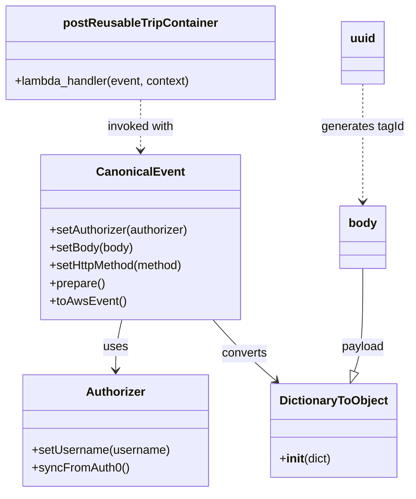
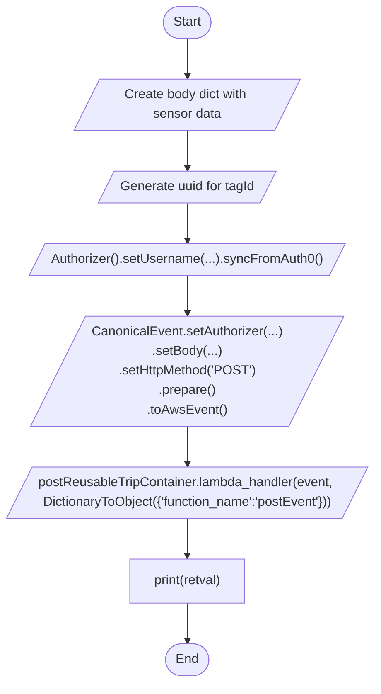

# Diagram: tools/ide_local_testing/localTest/test/reusableContainerTracking/addReusableContainerEvent.py

> Auto-generated by Obscura crawlers

## Diagram 1

### SVG

<svg id="container" width="552.189453125" xmlns="http://www.w3.org/2000/svg" class="classDiagram" height="662" viewBox="0 0 552.189453125 662" role="graphics-document document" aria-roledescription="class"><g><defs><marker id="container_class-aggregationStart" class="marker aggregation class" refX="18" refY="7" markerWidth="190" markerHeight="240" orient="auto"><path d="M 18,7 L9,13 L1,7 L9,1 Z"></path></marker></defs><defs><marker id="container_class-aggregationEnd" class="marker aggregation class" refX="1" refY="7" markerWidth="20" markerHeight="28" orient="auto"><path d="M 18,7 L9,13 L1,7 L9,1 Z"></path></marker></defs><defs><marker id="container_class-extensionStart" class="marker extension class" refX="18" refY="7" markerWidth="190" markerHeight="240" orient="auto"><path d="M 1,7 L18,13 V 1 Z"></path></marker></defs><defs><marker id="container_class-extensionEnd" class="marker extension class" refX="1" refY="7" markerWidth="20" markerHeight="28" orient="auto"><path d="M 1,1 V 13 L18,7 Z"></path></marker></defs><defs><marker id="container_class-compositionStart" class="marker composition class" refX="18" refY="7" markerWidth="190" markerHeight="240" orient="auto"><path d="M 18,7 L9,13 L1,7 L9,1 Z"></path></marker></defs><defs><marker id="container_class-compositionEnd" class="marker composition class" refX="1" refY="7" markerWidth="20" markerHeight="28" orient="auto"><path d="M 18,7 L9,13 L1,7 L9,1 Z"></path></marker></defs><defs><marker id="container_class-dependencyStart" class="marker dependency class" refX="6" refY="7" markerWidth="190" markerHeight="240" orient="auto"><path d="M 5,7 L9,13 L1,7 L9,1 Z"></path></marker></defs><defs><marker id="container_class-dependencyEnd" class="marker dependency class" refX="13" refY="7" markerWidth="20" markerHeight="28" orient="auto"><path d="M 18,7 L9,13 L14,7 L9,1 Z"></path></marker></defs><defs><marker id="container_class-lollipopStart" class="marker lollipop class" refX="13" refY="7" markerWidth="190" markerHeight="240" orient="auto"><circle stroke="black" fill="transparent" cx="7" cy="7" r="6"></circle></marker></defs><defs><marker id="container_class-lollipopEnd" class="marker lollipop class" refX="1" refY="7" markerWidth="190" markerHeight="240" orient="auto"><circle stroke="black" fill="transparent" cx="7" cy="7" r="6"></circle></marker></defs><g class="root"><g class="clusters"></g><g class="edgePaths"><path d="M164.719,430L163.314,436.167C161.909,442.333,159.099,454.667,157.694,466C156.289,477.333,156.289,487.667,156.289,492.833L156.289,498" id="id_CanonicalEvent_Authorizer_1" class="edge-thickness-normal edge-pattern-solid relation" style=";;;" data-edge="true" data-et="edge" data-id="id_CanonicalEvent_Authorizer_1" data-points="W3sieCI6MTY0LjcxODc1LCJ5Ijo0MzB9LHsieCI6MTU2LjI4OTA2MjUsInkiOjQ2N30seyJ4IjoxNTYuMjg5MDYyNSwieSI6NTA0fV0=" marker-end="url(#container_class-dependencyEnd)"></path><path d="M286.135,430L291.476,436.167C296.816,442.333,307.497,454.667,321.567,468.348C335.636,482.029,353.095,497.057,361.824,504.571L370.553,512.086" id="id_CanonicalEvent_DictionaryToObject_2" class="edge-thickness-normal edge-pattern-solid relation" style=";;;" data-edge="true" data-et="edge" data-id="id_CanonicalEvent_DictionaryToObject_2" data-points="W3sieCI6Mjg2LjEzNTI1MzkwNjI1LCJ5Ijo0MzB9LHsieCI6MzE4LjE3NzczNDM3NSwieSI6NDY3fSx7IngiOjM3NS4xMDA1ODU5Mzc1LCJ5Ijo1MTZ9XQ==" marker-end="url(#container_class-dependencyEnd)"></path><path d="M190.008,134L190.008,140.167C190.008,146.333,190.008,158.667,190.008,170C190.008,181.333,190.008,191.667,190.008,196.833L190.008,202" id="id_postReusableTripContainer_CanonicalEvent_3" class="edge-thickness-normal edge-pattern-dashed relation" style=";;;" data-edge="true" data-et="edge" data-id="id_postReusableTripContainer_CanonicalEvent_3" data-points="W3sieCI6MTkwLjAwNzgxMjUsInkiOjEzNH0seyJ4IjoxOTAuMDA3ODEyNSwieSI6MTcxfSx7IngiOjE5MC4wMDc4MTI1LCJ5IjoyMDh9XQ==" marker-end="url(#container_class-dependencyEnd)"></path><path d="M488.197,113L488.197,122.667C488.197,132.333,488.197,151.667,488.197,178C488.197,204.333,488.197,237.667,488.197,254.333L488.197,271" id="id_uuid_body_4" class="edge-thickness-normal edge-pattern-dashed relation" style=";;;" data-edge="true" data-et="edge" data-id="id_uuid_body_4" data-points="W3sieCI6NDg4LjE5NzI2NTYyNSwieSI6MTEzfSx7IngiOjQ4OC4xOTcyNjU2MjUsInkiOjE3MX0seyJ4Ijo0ODguMTk3MjY1NjI1LCJ5IjoyNzd9XQ==" marker-end="url(#container_class-dependencyEnd)"></path><path d="M488.197,361L488.197,378.667C488.197,396.333,488.197,431.667,486.252,454.792C484.307,477.917,480.417,488.834,478.472,494.292L476.527,499.751" id="id_body_DictionaryToObject_5" class="edge-thickness-normal edge-pattern-solid relation" style=";;;" data-edge="true" data-et="edge" data-id="id_body_DictionaryToObject_5" data-points="W3sieCI6NDg4LjE5NzI2NTYyNSwieSI6MzYxfSx7IngiOjQ4OC4xOTcyNjU2MjUsInkiOjQ2N30seyJ4Ijo0NzAuNzM2NTcyMjY1NjI1LCJ5Ijo1MTZ9XQ==" marker-end="url(#container_class-extensionEnd)"></path></g><g class="edgeLabels"><g class="edgeLabel" transform="translate(156.2890625, 467)"><g class="label" data-id="id_CanonicalEvent_Authorizer_1" transform="translate(-16.4921875, -12)"><foreignObject width="32.984375" height="24">

uses

</foreignObject></g></g><g class="edgeLabel" transform="translate(328.09152, 475.53393)"><g class="label" data-id="id_CanonicalEvent_DictionaryToObject_2" transform="translate(-30.9453125, -12)"><foreignObject width="61.890625" height="24">

converts

</foreignObject></g></g><g class="edgeLabel" transform="translate(190.0078125, 171)"><g class="label" data-id="id_postReusableTripContainer_CanonicalEvent_3" transform="translate(-46.3203125, -12)"><foreignObject width="92.640625" height="24">

invoked with

</foreignObject></g></g><g class="edgeLabel" transform="translate(488.197265625, 171)"><g class="label" data-id="id_uuid_body_4" transform="translate(-55.9921875, -12)"><foreignObject width="111.984375" height="24">

generates tagId

</foreignObject></g></g><g class="edgeLabel" transform="translate(488.197265625, 467)"><g class="label" data-id="id_body_DictionaryToObject_5" transform="translate(-28.875, -12)"><foreignObject width="57.75" height="24">

payload

</foreignObject></g></g></g><g class="nodes"><g class="node default" id="classId-CanonicalEvent-0" transform="translate(190.0078125, 319)"><g class="basic label-container"><path d="M-135.23046875 -111 L135.23046875 -111 L135.23046875 111 L-135.23046875 111" stroke="none" stroke-width="0" fill="#ECECFF" style=""></path><path d="M-135.23046875 -111 C-31.20349833646077 -111, 72.82347207707846 -111, 135.23046875 -111 M-135.23046875 -111 C-79.74176571496942 -111, -24.253062679938836 -111, 135.23046875 -111 M135.23046875 -111 C135.23046875 -32.69313135839026, 135.23046875 45.61373728321948, 135.23046875 111 M135.23046875 -111 C135.23046875 -38.34899719133678, 135.23046875 34.302005617326444, 135.23046875 111 M135.23046875 111 C37.90231641439097 111, -59.42583592121807 111, -135.23046875 111 M135.23046875 111 C62.83949958716045 111, -9.551469575679107 111, -135.23046875 111 M-135.23046875 111 C-135.23046875 60.08295924767942, -135.23046875 9.165918495358838, -135.23046875 -111 M-135.23046875 111 C-135.23046875 46.6767781833867, -135.23046875 -17.646443633226596, -135.23046875 -111" stroke="#9370DB" stroke-width="1.3" fill="none" stroke-dasharray="0 0" style=""></path></g><g class="annotation-group text" transform="translate(0, -87)"></g><g class="label-group text" transform="translate(-55.7109375, -87)"><g class="label" style="font-weight: bolder" transform="translate(0,-12)"><foreignObject width="111.421875" height="24">

CanonicalEvent

</foreignObject></g></g><g class="members-group text" transform="translate(-123.23046875, -39)"></g><g class="methods-group text" transform="translate(-123.23046875, -9)"><g class="label" style="" transform="translate(0,-12)"><foreignObject width="190.75" height="24">

+setAuthorizer(authorizer)

</foreignObject></g><g class="label" style="" transform="translate(0,12)"><foreignObject width="113.125" height="24">

+setBody(body)

</foreignObject></g><g class="label" style="" transform="translate(0,36)"><foreignObject width="184" height="24">

+setHttpMethod(method)

</foreignObject></g><g class="label" style="" transform="translate(0,60)"><foreignObject width="74.75" height="24">

+prepare()

</foreignObject></g><g class="label" style="" transform="translate(0,84)"><foreignObject width="101.1875" height="24">

+toAwsEvent()

</foreignObject></g></g><g class="divider" style=""><path d="M-135.23046875 -63 C-80.69369196069748 -63, -26.156915171394957 -63, 135.23046875 -63 M-135.23046875 -63 C-49.97063908637651 -63, 35.289190577246984 -63, 135.23046875 -63" stroke="#9370DB" stroke-width="1.3" fill="none" stroke-dasharray="0 0" style=""></path></g><g class="divider" style=""><path d="M-135.23046875 -39 C-74.54836180241395 -39, -13.866254854827886 -39, 135.23046875 -39 M-135.23046875 -39 C-55.76756791158466 -39, 23.695332926830673 -39, 135.23046875 -39" stroke="#9370DB" stroke-width="1.3" fill="none" stroke-dasharray="0 0" style=""></path></g></g><g class="node default" id="classId-Authorizer-1" transform="translate(156.2890625, 579)"><g class="basic label-container"><path d="M-124.13671875 -75 L124.13671875 -75 L124.13671875 75 L-124.13671875 75" stroke="none" stroke-width="0" fill="#ECECFF" style=""></path><path d="M-124.13671875 -75 C-29.30207035014601 -75, 65.53257804970798 -75, 124.13671875 -75 M-124.13671875 -75 C-29.27591622591737 -75, 65.58488629816526 -75, 124.13671875 -75 M124.13671875 -75 C124.13671875 -17.611265223545892, 124.13671875 39.777469552908215, 124.13671875 75 M124.13671875 -75 C124.13671875 -18.25904906586119, 124.13671875 38.48190186827762, 124.13671875 75 M124.13671875 75 C54.42084913489845 75, -15.295020480203107 75, -124.13671875 75 M124.13671875 75 C58.137162644929546 75, -7.862393460140908 75, -124.13671875 75 M-124.13671875 75 C-124.13671875 21.45323369398122, -124.13671875 -32.09353261203756, -124.13671875 -75 M-124.13671875 75 C-124.13671875 44.47347483191138, -124.13671875 13.946949663822764, -124.13671875 -75" stroke="#9370DB" stroke-width="1.3" fill="none" stroke-dasharray="0 0" style=""></path></g><g class="annotation-group text" transform="translate(0, -51)"></g><g class="label-group text" transform="translate(-38.3671875, -51)"><g class="label" style="font-weight: bolder" transform="translate(0,-12)"><foreignObject width="76.734375" height="24">

Authorizer

</foreignObject></g></g><g class="members-group text" transform="translate(-112.13671875, -3)"></g><g class="methods-group text" transform="translate(-112.13671875, 27)"><g class="label" style="" transform="translate(0,-12)"><foreignObject width="185.90625" height="24">

+setUsername(username)

</foreignObject></g><g class="label" style="" transform="translate(0,12)"><foreignObject width="129.0625" height="24">

+syncFromAuth0()

</foreignObject></g></g><g class="divider" style=""><path d="M-124.13671875 -27 C-63.565035176964145 -27, -2.9933516039282893 -27, 124.13671875 -27 M-124.13671875 -27 C-63.34830373870022 -27, -2.559888727400434 -27, 124.13671875 -27" stroke="#9370DB" stroke-width="1.3" fill="none" stroke-dasharray="0 0" style=""></path></g><g class="divider" style=""><path d="M-124.13671875 -3 C-66.04746972523752 -3, -7.958220700475039 -3, 124.13671875 -3 M-124.13671875 -3 C-31.77035436610649 -3, 60.59601001778702 -3, 124.13671875 -3" stroke="#9370DB" stroke-width="1.3" fill="none" stroke-dasharray="0 0" style=""></path></g></g><g class="node default" id="classId-DictionaryToObject-2" transform="translate(448.287109375, 579)"><g class="basic label-container"><path d="M-82.203125 -63 L82.203125 -63 L82.203125 63 L-82.203125 63" stroke="none" stroke-width="0" fill="#ECECFF" style=""></path><path d="M-82.203125 -63 C-48.86014739765962 -63, -15.517169795319234 -63, 82.203125 -63 M-82.203125 -63 C-32.862765878858276 -63, 16.477593242283447 -63, 82.203125 -63 M82.203125 -63 C82.203125 -19.359082718151008, 82.203125 24.281834563697984, 82.203125 63 M82.203125 -63 C82.203125 -17.408908232155888, 82.203125 28.182183535688225, 82.203125 63 M82.203125 63 C25.78549878557906 63, -30.632127428841883 63, -82.203125 63 M82.203125 63 C17.91687582781185 63, -46.3693733443763 63, -82.203125 63 M-82.203125 63 C-82.203125 30.56825217048423, -82.203125 -1.8634956590315426, -82.203125 -63 M-82.203125 63 C-82.203125 28.059149468063247, -82.203125 -6.881701063873507, -82.203125 -63" stroke="#9370DB" stroke-width="1.3" fill="none" stroke-dasharray="0 0" style=""></path></g><g class="annotation-group text" transform="translate(0, -39)"></g><g class="label-group text" transform="translate(-70.109375, -39)"><g class="label" style="font-weight: bolder" transform="translate(0,-12)"><foreignObject width="140.21875" height="24">

DictionaryToObject

</foreignObject></g></g><g class="members-group text" transform="translate(-70.203125, 9)"></g><g class="methods-group text" transform="translate(-70.203125, 39)"><g class="label" style="" transform="translate(0,-12)"><foreignObject width="70.296875" height="24">

+<strong>init</strong>(dict)

</foreignObject></g></g><g class="divider" style=""><path d="M-82.203125 -15 C-30.387439810073737 -15, 21.428245379852527 -15, 82.203125 -15 M-82.203125 -15 C-25.304274315457114 -15, 31.59457636908577 -15, 82.203125 -15" stroke="#9370DB" stroke-width="1.3" fill="none" stroke-dasharray="0 0" style=""></path></g><g class="divider" style=""><path d="M-82.203125 9 C-27.186975581675235 9, 27.82917383664953 9, 82.203125 9 M-82.203125 9 C-40.92862842069442 9, 0.34586815861115383 9, 82.203125 9" stroke="#9370DB" stroke-width="1.3" fill="none" stroke-dasharray="0 0" style=""></path></g></g><g class="node default" id="classId-postReusableTripContainer-3" transform="translate(190.0078125, 71)"><g class="basic label-container"><path d="M-182.0078125 -63 L182.0078125 -63 L182.0078125 63 L-182.0078125 63" stroke="none" stroke-width="0" fill="#ECECFF" style=""></path><path d="M-182.0078125 -63 C-66.97651052574021 -63, 48.05479144851958 -63, 182.0078125 -63 M-182.0078125 -63 C-80.32835105406353 -63, 21.351110391872936 -63, 182.0078125 -63 M182.0078125 -63 C182.0078125 -35.56475357490241, 182.0078125 -8.129507149804823, 182.0078125 63 M182.0078125 -63 C182.0078125 -31.927065906347533, 182.0078125 -0.8541318126950657, 182.0078125 63 M182.0078125 63 C78.87739090506905 63, -24.2530306898619 63, -182.0078125 63 M182.0078125 63 C41.036637735819454 63, -99.93453702836109 63, -182.0078125 63 M-182.0078125 63 C-182.0078125 25.868852146479284, -182.0078125 -11.262295707041432, -182.0078125 -63 M-182.0078125 63 C-182.0078125 13.848161636652698, -182.0078125 -35.303676726694604, -182.0078125 -63" stroke="#9370DB" stroke-width="1.3" fill="none" stroke-dasharray="0 0" style=""></path></g><g class="annotation-group text" transform="translate(0, -39)"></g><g class="label-group text" transform="translate(-99.828125, -39)"><g class="label" style="font-weight: bolder" transform="translate(0,-12)"><foreignObject width="199.65625" height="24">

postReusableTripContainer

</foreignObject></g></g><g class="members-group text" transform="translate(-170.0078125, 9)"></g><g class="methods-group text" transform="translate(-170.0078125, 39)"><g class="label" style="" transform="translate(0,-12)"><foreignObject width="240.1875" height="24">

+lambda_handler(event, context)

</foreignObject></g></g><g class="divider" style=""><path d="M-182.0078125 -15 C-98.54326563144957 -15, -15.078718762899143 -15, 182.0078125 -15 M-182.0078125 -15 C-43.334178715003674 -15, 95.33945506999265 -15, 182.0078125 -15" stroke="#9370DB" stroke-width="1.3" fill="none" stroke-dasharray="0 0" style=""></path></g><g class="divider" style=""><path d="M-182.0078125 9 C-57.12958706078902 9, 67.74863837842196 9, 182.0078125 9 M-182.0078125 9 C-74.07144714221181 9, 33.86491821557638 9, 182.0078125 9" stroke="#9370DB" stroke-width="1.3" fill="none" stroke-dasharray="0 0" style=""></path></g></g><g class="node default" id="classId-uuid-4" transform="translate(488.197265625, 71)"><g class="basic label-container"><path d="M-28.2109375 -42 L28.2109375 -42 L28.2109375 42 L-28.2109375 42" stroke="none" stroke-width="0" fill="#ECECFF" style=""></path><path d="M-28.2109375 -42 C-16.041745890460383 -42, -3.8725542809207703 -42, 28.2109375 -42 M-28.2109375 -42 C-13.224136671158874 -42, 1.7626641576822522 -42, 28.2109375 -42 M28.2109375 -42 C28.2109375 -15.20097787827368, 28.2109375 11.598044243452641, 28.2109375 42 M28.2109375 -42 C28.2109375 -19.115574661882228, 28.2109375 3.7688506762355445, 28.2109375 42 M28.2109375 42 C15.517718140218658 42, 2.8244987804373167 42, -28.2109375 42 M28.2109375 42 C12.917844837427328 42, -2.375247825145344 42, -28.2109375 42 M-28.2109375 42 C-28.2109375 8.477392370427417, -28.2109375 -25.045215259145166, -28.2109375 -42 M-28.2109375 42 C-28.2109375 10.827994441607629, -28.2109375 -20.344011116784742, -28.2109375 -42" stroke="#9370DB" stroke-width="1.3" fill="none" stroke-dasharray="0 0" style=""></path></g><g class="annotation-group text" transform="translate(0, -18)"></g><g class="label-group text" transform="translate(-16.2109375, -18)"><g class="label" style="font-weight: bolder" transform="translate(0,-12)"><foreignObject width="32.421875" height="24">

uuid

</foreignObject></g></g><g class="members-group text" transform="translate(-16.2109375, 30)"></g><g class="methods-group text" transform="translate(-16.2109375, 60)"></g><g class="divider" style=""><path d="M-28.2109375 6 C-6.903290157891927 6, 14.404357184216146 6, 28.2109375 6 M-28.2109375 6 C-15.563618555538866 6, -2.916299611077733 6, 28.2109375 6" stroke="#9370DB" stroke-width="1.3" fill="none" stroke-dasharray="0 0" style=""></path></g><g class="divider" style=""><path d="M-28.2109375 24 C-14.163599074287013 24, -0.11626064857402696 24, 28.2109375 24 M-28.2109375 24 C-11.635962414614987 24, 4.939012670770026 24, 28.2109375 24" stroke="#9370DB" stroke-width="1.3" fill="none" stroke-dasharray="0 0" style=""></path></g></g><g class="node default" id="classId-body-5" transform="translate(488.197265625, 319)"><g class="basic label-container"><path d="M-30.3984375 -42 L30.3984375 -42 L30.3984375 42 L-30.3984375 42" stroke="none" stroke-width="0" fill="#ECECFF" style=""></path><path d="M-30.3984375 -42 C-7.606700733017984 -42, 15.185036033964032 -42, 30.3984375 -42 M-30.3984375 -42 C-14.321812125820973 -42, 1.7548132483580545 -42, 30.3984375 -42 M30.3984375 -42 C30.3984375 -13.346490449283081, 30.3984375 15.307019101433838, 30.3984375 42 M30.3984375 -42 C30.3984375 -9.109168023789273, 30.3984375 23.781663952421454, 30.3984375 42 M30.3984375 42 C15.664289011947579 42, 0.9301405238951581 42, -30.3984375 42 M30.3984375 42 C8.601870801083972 42, -13.194695897832055 42, -30.3984375 42 M-30.3984375 42 C-30.3984375 18.072407426452685, -30.3984375 -5.85518514709463, -30.3984375 -42 M-30.3984375 42 C-30.3984375 20.30839968408506, -30.3984375 -1.3832006318298795, -30.3984375 -42" stroke="#9370DB" stroke-width="1.3" fill="none" stroke-dasharray="0 0" style=""></path></g><g class="annotation-group text" transform="translate(0, -18)"></g><g class="label-group text" transform="translate(-18.3984375, -18)"><g class="label" style="font-weight: bolder" transform="translate(0,-12)"><foreignObject width="36.796875" height="24">

body

</foreignObject></g></g><g class="members-group text" transform="translate(-18.3984375, 30)"></g><g class="methods-group text" transform="translate(-18.3984375, 60)"></g><g class="divider" style=""><path d="M-30.3984375 6 C-7.218481041440807 6, 15.961475417118386 6, 30.3984375 6 M-30.3984375 6 C-14.821059560473449 6, 0.7563183790531021 6, 30.3984375 6" stroke="#9370DB" stroke-width="1.3" fill="none" stroke-dasharray="0 0" style=""></path></g><g class="divider" style=""><path d="M-30.3984375 24 C-8.377864650840163 24, 13.642708198319674 24, 30.3984375 24 M-30.3984375 24 C-13.036508496127986 24, 4.3254205077440275 24, 30.3984375 24" stroke="#9370DB" stroke-width="1.3" fill="none" stroke-dasharray="0 0" style=""></path></g></g></g></g></g></svg>

## Diagram 2

### SVG

<svg id="container" width="793.890625" xmlns="http://www.w3.org/2000/svg" class="flowchart" height="741" viewBox="0 0 793.890625 741" role="graphics-document document" aria-roledescription="flowchart-v2"><g><marker id="container_flowchart-v2-pointEnd" class="marker flowchart-v2" viewBox="0 0 10 10" refX="5" refY="5" markerUnits="userSpaceOnUse" markerWidth="8" markerHeight="8" orient="auto"><path d="M 0 0 L 10 5 L 0 10 z" class="arrowMarkerPath" style="stroke-width: 1; stroke-dasharray: 1, 0;"></path></marker><marker id="container_flowchart-v2-pointStart" class="marker flowchart-v2" viewBox="0 0 10 10" refX="4.5" refY="5" markerUnits="userSpaceOnUse" markerWidth="8" markerHeight="8" orient="auto"><path d="M 0 5 L 10 10 L 10 0 z" class="arrowMarkerPath" style="stroke-width: 1; stroke-dasharray: 1, 0;"></path></marker><marker id="container_flowchart-v2-circleEnd" class="marker flowchart-v2" viewBox="0 0 10 10" refX="11" refY="5" markerUnits="userSpaceOnUse" markerWidth="11" markerHeight="11" orient="auto"><circle cx="5" cy="5" r="5" class="arrowMarkerPath" style="stroke-width: 1; stroke-dasharray: 1, 0;"></circle></marker><marker id="container_flowchart-v2-circleStart" class="marker flowchart-v2" viewBox="0 0 10 10" refX="-1" refY="5" markerUnits="userSpaceOnUse" markerWidth="11" markerHeight="11" orient="auto"><circle cx="5" cy="5" r="5" class="arrowMarkerPath" style="stroke-width: 1; stroke-dasharray: 1, 0;"></circle></marker><marker id="container_flowchart-v2-crossEnd" class="marker cross flowchart-v2" viewBox="0 0 11 11" refX="12" refY="5.2" markerUnits="userSpaceOnUse" markerWidth="11" markerHeight="11" orient="auto"><path d="M 1,1 l 9,9 M 10,1 l -9,9" class="arrowMarkerPath" style="stroke-width: 2; stroke-dasharray: 1, 0;"></path></marker><marker id="container_flowchart-v2-crossStart" class="marker cross flowchart-v2" viewBox="0 0 11 11" refX="-1" refY="5.2" markerUnits="userSpaceOnUse" markerWidth="11" markerHeight="11" orient="auto"><path d="M 1,1 l 9,9 M 10,1 l -9,9" class="arrowMarkerPath" style="stroke-width: 2; stroke-dasharray: 1, 0;"></path></marker><g class="root"><g class="clusters"></g><g class="edgePaths"><path d="M397.445,47.5L397.362,51.583C397.279,55.667,397.112,63.833,397.099,71.5C397.086,79.167,397.226,86.334,397.297,89.917L397.367,93.501" id="L_Start_CreateBody_0" class="edge-thickness-normal edge-pattern-solid edge-thickness-normal edge-pattern-solid flowchart-link" style=";" data-edge="true" data-et="edge" data-id="L_Start_CreateBody_0" data-points="W3sieCI6Mzk3LjQ0NTMxMjUsInkiOjQ3LjV9LHsieCI6Mzk2Ljk0NTMxMjUsInkiOjcyfSx7IngiOjM5Ny40NDUzMTI1LCJ5Ijo5Ny41fV0=" marker-end="url(#container_flowchart-v2-pointEnd)"></path><path d="M397.445,160.5L397.362,164.583C397.279,168.667,397.112,176.833,397.099,184.5C397.086,192.167,397.226,199.334,397.297,202.917L397.367,206.501" id="L_CreateBody_GenerateUUID_0" class="edge-thickness-normal edge-pattern-solid edge-thickness-normal edge-pattern-solid flowchart-link" style=";" data-edge="true" data-et="edge" data-id="L_CreateBody_GenerateUUID_0" data-points="W3sieCI6Mzk3LjQ0NTMxMjUsInkiOjE2MC41fSx7IngiOjM5Ni45NDUzMTI1LCJ5IjoxODV9LHsieCI6Mzk3LjQ0NTMxMjUsInkiOjIxMC41fV0=" marker-end="url(#container_flowchart-v2-pointEnd)"></path><path d="M397.445,249.5L397.362,253.583C397.279,257.667,397.112,265.833,397.099,273.5C397.086,281.167,397.226,288.334,397.297,291.917L397.367,295.501" id="L_GenerateUUID_SetAuthorizer_0" class="edge-thickness-normal edge-pattern-solid edge-thickness-normal edge-pattern-solid flowchart-link" style=";" data-edge="true" data-et="edge" data-id="L_GenerateUUID_SetAuthorizer_0" data-points="W3sieCI6Mzk3LjQ0NTMxMjUsInkiOjI0OS41fSx7IngiOjM5Ni45NDUzMTI1LCJ5IjoyNzR9LHsieCI6Mzk3LjQ0NTMxMjUsInkiOjI5OS41fV0=" marker-end="url(#container_flowchart-v2-pointEnd)"></path><path d="M397.445,338.5L397.362,342.583C397.279,346.667,397.112,354.833,397.099,362.5C397.086,370.167,397.226,377.334,397.297,380.917L397.367,384.501" id="L_SetAuthorizer_BuildEvent_0" class="edge-thickness-normal edge-pattern-solid edge-thickness-normal edge-pattern-solid flowchart-link" style=";" data-edge="true" data-et="edge" data-id="L_SetAuthorizer_BuildEvent_0" data-points="W3sieCI6Mzk3LjQ0NTMxMjUsInkiOjMzOC41fSx7IngiOjM5Ni45NDUzMTI1LCJ5IjozNjN9LHsieCI6Mzk3LjQ0NTMxMjUsInkiOjM4OC41fV0=" marker-end="url(#container_flowchart-v2-pointEnd)"></path><path d="M397.445,427.5L397.362,431.583C397.279,435.667,397.112,443.833,397.099,451.5C397.086,459.167,397.226,466.334,397.297,469.917L397.367,473.501" id="L_BuildEvent_CallLambda_0" class="edge-thickness-normal edge-pattern-solid edge-thickness-normal edge-pattern-solid flowchart-link" style=";" data-edge="true" data-et="edge" data-id="L_BuildEvent_CallLambda_0" data-points="W3sieCI6Mzk3LjQ0NTMxMjUsInkiOjQyNy41fSx7IngiOjM5Ni45NDUzMTI1LCJ5Ijo0NTJ9LHsieCI6Mzk3LjQ0NTMxMjUsInkiOjQ3Ny41fV0=" marker-end="url(#container_flowchart-v2-pointEnd)"></path><path d="M397.445,540.5L397.362,544.583C397.279,548.667,397.112,556.833,397.029,564.417C396.945,572,396.945,579,396.945,582.5L396.945,586" id="L_CallLambda_PrintResult_0" class="edge-thickness-normal edge-pattern-solid edge-thickness-normal edge-pattern-solid flowchart-link" style=";" data-edge="true" data-et="edge" data-id="L_CallLambda_PrintResult_0" data-points="W3sieCI6Mzk3LjQ0NTMxMjUsInkiOjU0MC41fSx7IngiOjM5Ni45NDUzMTI1LCJ5Ijo1NjV9LHsieCI6Mzk2Ljk0NTMxMjUsInkiOjU5MH1d" marker-end="url(#container_flowchart-v2-pointEnd)"></path><path d="M396.945,644L396.945,648.167C396.945,652.333,396.945,660.667,397.016,668.417C397.086,676.167,397.226,683.334,397.297,686.917L397.367,690.501" id="L_PrintResult_End_0" class="edge-thickness-normal edge-pattern-solid edge-thickness-normal edge-pattern-solid flowchart-link" style=";" data-edge="true" data-et="edge" data-id="L_PrintResult_End_0" data-points="W3sieCI6Mzk2Ljk0NTMxMjUsInkiOjY0NH0seyJ4IjozOTYuOTQ1MzEyNSwieSI6NjY5fSx7IngiOjM5Ny40NDUzMTI1LCJ5Ijo2OTQuNX1d" marker-end="url(#container_flowchart-v2-pointEnd)"></path></g><g class="edgeLabels"><g class="edgeLabel"><g class="label" data-id="L_Start_CreateBody_0" transform="translate(0, 0)"><foreignObject width="0" height="0">

</foreignObject></g></g><g class="edgeLabel"><g class="label" data-id="L_CreateBody_GenerateUUID_0" transform="translate(0, 0)"><foreignObject width="0" height="0">

</foreignObject></g></g><g class="edgeLabel"><g class="label" data-id="L_GenerateUUID_SetAuthorizer_0" transform="translate(0, 0)"><foreignObject width="0" height="0">

</foreignObject></g></g><g class="edgeLabel"><g class="label" data-id="L_SetAuthorizer_BuildEvent_0" transform="translate(0, 0)"><foreignObject width="0" height="0">

</foreignObject></g></g><g class="edgeLabel"><g class="label" data-id="L_BuildEvent_CallLambda_0" transform="translate(0, 0)"><foreignObject width="0" height="0">

</foreignObject></g></g><g class="edgeLabel"><g class="label" data-id="L_CallLambda_PrintResult_0" transform="translate(0, 0)"><foreignObject width="0" height="0">

</foreignObject></g></g><g class="edgeLabel"><g class="label" data-id="L_PrintResult_End_0" transform="translate(0, 0)"><foreignObject width="0" height="0">

</foreignObject></g></g></g><g class="nodes"><g class="node default" id="flowchart-Start-0" transform="translate(396.9453125, 27.5)"><g class="basic label-container outer-path"><path d="M-10.3984375 -19.5 C-3.4169543259278106 -19.5, 3.564528848144379 -19.5, 10.3984375 -19.5 C10.3984375 -19.5, 10.398437499999998 -19.5, 10.398437499999998 -19.5 C10.682619497139585 -19.490886836478435, 10.966801494279173 -19.48177367295687, 11.6478067896239 -19.45993515863156 C11.933255100907488 -19.432398303343852, 12.218703412191074 -19.404861448056145, 12.892042152847864 -19.3399052695533 C13.357950742208217 -19.264580782000593, 13.823859331568569 -19.189256294447883, 14.126030759676757 -19.140403561325776 C14.554904808851399 -19.042515858266384, 14.98377885802604 -18.944628155206992, 15.34470188623539 -18.862249829261074 C15.769573029702737 -18.73615030407411, 16.194444173170083 -18.610050778887143, 16.543047751460602 -18.50658706670804 C16.81348843959692 -18.40706239354756, 17.08392912773324 -18.307537720387074, 17.716144095147794 -18.074876768247425 C18.151273673320855 -17.882257811650536, 18.58640325149392 -17.689638855053648, 18.85917041279238 -17.568892924097174 C19.089108106292414 -17.44893457668033, 19.31904579979245 -17.328976229263485, 19.967429764076783 -16.990714730406097 C20.38389536648134 -16.738250834804912, 20.800360968885897 -16.48578693920373, 21.036368073605697 -16.342718045390892 C21.390684595699586 -16.095562177693232, 21.74500111779347 -15.848406309995571, 22.061592844578712 -15.627565626425154 C22.446168976464985 -15.32087639524652, 22.83074510835126 -15.014187164067888, 23.03889120850187 -14.848196188198123 C23.288502742002542 -14.621505597832082, 23.538114275503215 -14.394815007466038, 23.964247236767985 -14.007812326905688 C24.305210500909777 -13.655739763074692, 24.646173765051568 -13.303667199243696, 24.833858442968648 -13.10986736009568 C25.04407369497783 -12.862936563499003, 25.254288946987007 -12.616005766902326, 25.644151408126582 -12.158051136245305 C25.874354513414016 -11.849599947094466, 26.104557618701453 -11.541148757943628, 26.391796464640635 -11.156274872382312 C26.556380886714827 -10.903429002970848, 26.72096530878902 -10.650583133559383, 27.073721378604247 -10.108655082055241 C27.265981332470233 -9.767278065534775, 27.458241286336214 -9.425901049014307, 27.6871239742735 -9.019496659696287 C27.896548614302475 -8.584621913706663, 28.10597325433145 -8.149747167717038, 28.22948364880834 -7.893275190886684 C28.39541343208763 -7.483425418152723, 28.561343215366918 -7.073575645418761, 28.698571729970325 -6.734618561215508 C28.81428422649575 -6.386110957963556, 28.929996723021173 -6.037603354711604, 29.09246063421488 -5.548287939305138 C29.191059963459573 -5.172285963675516, 29.289659292704265 -4.796283988045894, 29.40953178754556 -4.339158212148133 C29.485396525773684 -3.949608815364816, 29.56126126400181 -3.560059418581499, 29.648482276581777 -3.1121979531509023 C29.684661964942066 -2.831595434716058, 29.720841653302358 -2.550992916281214, 29.808330202509367 -1.872449005199798 C29.827094896269113 -1.580173753303564, 29.84585959002886 -1.28789850140733, 29.888418715913414 -0.6250057626472757 C29.888418715913414 -0.12734392355533752, 29.888418715913414 0.37031791553660065, 29.888418715913414 0.625005762647271 C29.862631576108974 1.0266612801060195, 29.836844436304535 1.4283167975647681, 29.808330202509367 1.8724490051997846 C29.760797673618026 2.2411019129215286, 29.713265144726684 2.609754820643273, 29.648482276581777 3.1121979531508885 C29.597011686303095 3.3764885559188116, 29.545541096024415 3.6407791586867346, 29.40953178754556 4.339158212148129 C29.317507773392933 4.690085661572125, 29.225483759240305 5.041013110996121, 29.092460634214884 5.548287939305125 C28.95263264052163 5.9694275777439, 28.812804646828376 6.390567216182675, 28.69857172997033 6.734618561215495 C28.53188592128725 7.146335731313575, 28.365200112604175 7.558052901411654, 28.229483648808344 7.893275190886679 C28.081871593623216 8.199794781870613, 27.934259538438088 8.506314372854547, 27.687123974273504 9.019496659696284 C27.507291550344718 9.33880733838939, 27.32745912641593 9.658118017082499, 27.07372137860425 10.108655082055236 C26.84655079829131 10.457650097258071, 26.619380217978367 10.806645112460906, 26.39179646464064 11.156274872382301 C26.184194966040952 11.43444196762029, 25.976593467441262 11.712609062858276, 25.644151408126582 12.158051136245302 C25.457480299527752 12.377325642292472, 25.27080919092892 12.596600148339643, 24.83385844296866 13.10986736009567 C24.531755560026554 13.421813389841358, 24.22965267708445 13.733759419587045, 23.96424723676799 14.007812326905684 C23.703012720907072 14.24505860232404, 23.441778205046155 14.482304877742395, 23.038891208501887 14.848196188198111 C22.74473505084132 15.082777896108308, 22.450578893180758 15.317359604018506, 22.061592844578715 15.627565626425152 C21.750883794608537 15.84430280930636, 21.440174744638355 16.061039992187567, 21.036368073605708 16.34271804539089 C20.793252415323742 16.490096186147607, 20.550136757041777 16.637474326904325, 19.967429764076787 16.990714730406093 C19.600017743424544 17.18239334624174, 19.2326057227723 17.37407196207738, 18.859170412792388 17.56889292409717 C18.595881107787335 17.685443289223173, 18.33259180278228 17.801993654349175, 17.716144095147804 18.07487676824742 C17.414138046062117 18.18601778602427, 17.112131996976427 18.297158803801114, 16.543047751460616 18.506587066708033 C16.111207543340708 18.634754973702513, 15.679367335220796 18.762922880696998, 15.344701886235413 18.86224982926107 C14.947224512173063 18.952971446108535, 14.549747138110714 19.043693062956, 14.126030759676766 19.140403561325773 C13.739752579753054 19.202854021823814, 13.353474399829341 19.265304482321856, 12.892042152847878 19.3399052695533 C12.468487216869146 19.38076510482783, 12.044932280890414 19.421624940102358, 11.6478067896239 19.45993515863156 C11.325837642035912 19.47026008251978, 11.003868494447923 19.480585006407996, 10.398437500000004 19.5 C10.398437500000004 19.5, 10.398437500000002 19.5, 10.3984375 19.5 C2.2254467279783334 19.5, -5.947544044043333 19.5, -10.398437499999996 19.5 C-10.829999032241188 19.48616066164459, -11.261560564482382 19.47232132328918, -11.647806789623893 19.45993515863156 C-11.957864972664948 19.43002421861311, -12.267923155706002 19.400113278594663, -12.892042152847871 19.3399052695533 C-13.23882014297858 19.283840893412442, -13.58559813310929 19.22777651727159, -14.126030759676759 19.140403561325773 C-14.52469236793393 19.049411650751193, -14.923353976191104 18.95841974017661, -15.344701886235388 18.862249829261074 C-15.619816743965572 18.780597183594114, -15.894931601695758 18.69894453792715, -16.54304775146059 18.506587066708043 C-17.005426090065367 18.336427563922978, -17.467804428670142 18.166268061137913, -17.716144095147797 18.074876768247425 C-17.97444740203289 17.96053355658475, -18.23275070891798 17.84619034492208, -18.85917041279238 17.568892924097174 C-19.08094646265663 17.453192500937334, -19.302722512520877 17.337492077777497, -19.96742976407678 16.990714730406097 C-20.22067201315873 16.837197790795972, -20.47391426224068 16.68368085118585, -21.036368073605686 16.3427180453909 C-21.3295641288452 16.138197169508487, -21.622760184084708 15.933676293626071, -22.061592844578712 15.627565626425156 C-22.32969669792659 15.413759937923393, -22.597800551274464 15.199954249421632, -23.03889120850187 14.848196188198125 C-23.356354570019736 14.559884362887859, -23.673817931537602 14.271572537577592, -23.964247236767974 14.007812326905697 C-24.221641518448063 13.742031598607472, -24.47903580012815 13.476250870309247, -24.833858442968655 13.109867360095677 C-25.06537438007907 12.837915566735767, -25.29689031718949 12.565963773375856, -25.64415140812658 12.158051136245307 C-25.842773768149332 11.891915268684063, -26.041396128172085 11.625779401122816, -26.391796464640635 11.156274872382316 C-26.562479615534837 10.894059717765321, -26.73316276642904 10.631844563148327, -27.073721378604244 10.108655082055249 C-27.246010093417755 9.80273902277969, -27.418298808231267 9.496822963504133, -27.6871239742735 9.019496659696289 C-27.82855068793295 8.725821062735532, -27.969977401592402 8.432145465774775, -28.22948364880834 7.893275190886686 C-28.33429449625162 7.634390371321904, -28.4391053436949 7.37550555175712, -28.698571729970325 6.73461856121551 C-28.808846257752073 6.402489253396849, -28.919120785533824 6.070359945578188, -29.09246063421488 5.5482879393051325 C-29.204866275057118 5.119636513860768, -29.317271915899358 4.690985088416403, -29.409531787545557 4.339158212148136 C-29.478222897042663 3.9864438827516286, -29.546914006539772 3.6337295533551215, -29.648482276581777 3.112197953150904 C-29.68087430988663 2.8609717393689444, -29.71326634319148 2.609745525586985, -29.808330202509364 1.872449005199809 C-29.836056886529413 1.440583521011055, -29.863783570549458 1.0087180368223008, -29.888418715913414 0.6250057626472781 C-29.888418715913414 0.16142113036586597, -29.888418715913414 -0.3021635019155462, -29.888418715913414 -0.6250057626472687 C-29.868228641225716 -0.9394824730430942, -29.848038566538023 -1.2539591834389197, -29.808330202509367 -1.8724490051997822 C-29.7567781763161 -2.2722763402557518, -29.705226150122833 -2.672103675311721, -29.648482276581777 -3.112197953150895 C-29.572611705045638 -3.5017773027379904, -29.496741133509502 -3.8913566523250855, -29.40953178754556 -4.339158212148126 C-29.318957134946647 -4.684558617810538, -29.228382482347733 -5.02995902347295, -29.092460634214884 -5.548287939305123 C-28.956963858334134 -5.9563826397784805, -28.821467082453385 -6.364477340251838, -28.698571729970332 -6.734618561215485 C-28.601180102521333 -6.975177763953533, -28.503788475072337 -7.215736966691581, -28.229483648808344 -7.893275190886676 C-28.047796701234386 -8.270552025001917, -27.866109753660428 -8.647828859117158, -27.687123974273504 -9.019496659696282 C-27.52506689834842 -9.307245408059654, -27.363009822423333 -9.594994156423025, -27.073721378604247 -10.108655082055243 C-26.85649325414521 -10.442375815143262, -26.639265129686173 -10.77609654823128, -26.39179646464064 -11.156274872382308 C-26.15747417850725 -11.470245388601635, -25.923151892373856 -11.784215904820961, -25.644151408126586 -12.158051136245302 C-25.344766797139357 -12.509725335777857, -25.045382186152132 -12.861399535310413, -24.833858442968662 -13.10986736009567 C-24.610111083010633 -13.340904879252221, -24.386363723052607 -13.57194239840877, -23.964247236767996 -14.007812326905677 C-23.71957231751496 -14.23001961482767, -23.474897398261923 -14.452226902749665, -23.038891208501887 -14.848196188198107 C-22.75667390665967 -15.07325697629947, -22.47445660481745 -15.298317764400833, -22.06159284457872 -15.627565626425149 C-21.683940282535765 -15.890999705390392, -21.306287720492808 -16.154433784355636, -21.03636807360571 -16.342718045390885 C-20.618834921339328 -16.595829095991927, -20.20130176907294 -16.848940146592966, -19.96742976407679 -16.99071473040609 C-19.675906548925454 -17.14280220502101, -19.384383333774117 -17.294889679635933, -18.859170412792388 -17.56889292409717 C-18.477519519174198 -17.73783845343043, -18.095868625556005 -17.906783982763688, -17.716144095147804 -18.07487676824742 C-17.356988896985463 -18.20704920116542, -16.997833698823122 -18.33922163408342, -16.54304775146062 -18.506587066708033 C-16.213143101760416 -18.604501035034207, -15.883238452060215 -18.702415003360386, -15.344701886235413 -18.862249829261067 C-15.074590721854925 -18.92390093989084, -14.804479557474437 -18.98555205052061, -14.126030759676768 -19.140403561325773 C-13.806157588190548 -19.19211817503817, -13.486284416704326 -19.24383278875057, -12.89204215284788 -19.3399052695533 C-12.464988403587956 -19.381102631137125, -12.037934654328033 -19.422299992720955, -11.647806789623903 -19.45993515863156 C-11.27707517355806 -19.471823799973475, -10.906343557492217 -19.483712441315394, -10.398437500000005 -19.5 C-10.398437500000004 -19.5, -10.398437500000002 -19.5, -10.3984375 -19.5" stroke="none" stroke-width="0" fill="#ECECFF" style=""></path><path d="M-10.3984375 -19.5 C-5.036854844176426 -19.5, 0.3247278116471488 -19.5, 10.3984375 -19.5 M-10.3984375 -19.5 C-4.301738839191351 -19.5, 1.7949598216172973 -19.5, 10.3984375 -19.5 M10.3984375 -19.5 C10.3984375 -19.5, 10.3984375 -19.5, 10.398437499999998 -19.5 M10.3984375 -19.5 C10.3984375 -19.5, 10.398437499999998 -19.5, 10.398437499999998 -19.5 M10.398437499999998 -19.5 C10.729685068709632 -19.48937753520576, 11.060932637419263 -19.478755070411523, 11.6478067896239 -19.45993515863156 M10.398437499999998 -19.5 C10.733102154422147 -19.489267955917914, 11.067766808844295 -19.47853591183583, 11.6478067896239 -19.45993515863156 M11.6478067896239 -19.45993515863156 C12.13717429343065 -19.412726464089854, 12.626541797237401 -19.365517769548145, 12.892042152847864 -19.3399052695533 M11.6478067896239 -19.45993515863156 C11.950752978967001 -19.43071030409173, 12.253699168310105 -19.401485449551895, 12.892042152847864 -19.3399052695533 M12.892042152847864 -19.3399052695533 C13.307055949091776 -19.27280905745664, 13.722069745335688 -19.205712845359987, 14.126030759676757 -19.140403561325776 M12.892042152847864 -19.3399052695533 C13.140242512550298 -19.299778160219148, 13.388442872252734 -19.259651050884994, 14.126030759676757 -19.140403561325776 M14.126030759676757 -19.140403561325776 C14.471911042637238 -19.061458643819826, 14.81779132559772 -18.98251372631388, 15.34470188623539 -18.862249829261074 M14.126030759676757 -19.140403561325776 C14.39951826263404 -19.077981823448518, 14.673005765591322 -19.015560085571263, 15.34470188623539 -18.862249829261074 M15.34470188623539 -18.862249829261074 C15.674052819159188 -18.764500201167618, 16.003403752082985 -18.666750573074157, 16.543047751460602 -18.50658706670804 M15.34470188623539 -18.862249829261074 C15.604012394329802 -18.785287831607285, 15.863322902424215 -18.7083258339535, 16.543047751460602 -18.50658706670804 M16.543047751460602 -18.50658706670804 C17.00858385508544 -18.33526547720553, 17.474119958710283 -18.16394388770302, 17.716144095147794 -18.074876768247425 M16.543047751460602 -18.50658706670804 C16.824053404910913 -18.403174388650537, 17.105059058361228 -18.29976171059304, 17.716144095147794 -18.074876768247425 M17.716144095147794 -18.074876768247425 C18.01734947570233 -17.941542081216088, 18.318554856256863 -17.808207394184752, 18.85917041279238 -17.568892924097174 M17.716144095147794 -18.074876768247425 C17.95518124352983 -17.96906211344377, 18.194218391911868 -17.86324745864011, 18.85917041279238 -17.568892924097174 M18.85917041279238 -17.568892924097174 C19.12666228321197 -17.429342586635997, 19.394154153631558 -17.289792249174816, 19.967429764076783 -16.990714730406097 M18.85917041279238 -17.568892924097174 C19.298211934945552 -17.339845243209382, 19.737253457098728 -17.110797562321586, 19.967429764076783 -16.990714730406097 M19.967429764076783 -16.990714730406097 C20.214458742500863 -16.840964311982006, 20.461487720924943 -16.69121389355791, 21.036368073605697 -16.342718045390892 M19.967429764076783 -16.990714730406097 C20.256818911987395 -16.815285328303283, 20.546208059898007 -16.639855926200465, 21.036368073605697 -16.342718045390892 M21.036368073605697 -16.342718045390892 C21.30425932575839 -16.155848704714572, 21.572150577911085 -15.96897936403825, 22.061592844578712 -15.627565626425154 M21.036368073605697 -16.342718045390892 C21.395045085616132 -16.092520488690013, 21.753722097626568 -15.842322931989134, 22.061592844578712 -15.627565626425154 M22.061592844578712 -15.627565626425154 C22.29144798898771 -15.444262265461255, 22.52130313339671 -15.260958904497356, 23.03889120850187 -14.848196188198123 M22.061592844578712 -15.627565626425154 C22.28489868021632 -15.449485164922015, 22.508204515853922 -15.271404703418876, 23.03889120850187 -14.848196188198123 M23.03889120850187 -14.848196188198123 C23.38519534951701 -14.533691930033646, 23.731499490532148 -14.219187671869166, 23.964247236767985 -14.007812326905688 M23.03889120850187 -14.848196188198123 C23.291800529714358 -14.618510634286894, 23.544709850926843 -14.388825080375662, 23.964247236767985 -14.007812326905688 M23.964247236767985 -14.007812326905688 C24.211898471964364 -13.752092094020885, 24.45954970716074 -13.49637186113608, 24.833858442968648 -13.10986736009568 M23.964247236767985 -14.007812326905688 C24.236355140322566 -13.726838576011223, 24.50846304387715 -13.44586482511676, 24.833858442968648 -13.10986736009568 M24.833858442968648 -13.10986736009568 C25.050924565898264 -12.85488914069026, 25.267990688827883 -12.599910921284836, 25.644151408126582 -12.158051136245305 M24.833858442968648 -13.10986736009568 C25.07934781039656 -12.821501580374134, 25.32483717782447 -12.533135800652586, 25.644151408126582 -12.158051136245305 M25.644151408126582 -12.158051136245305 C25.82004756013689 -11.922366317020597, 25.995943712147195 -11.686681497795888, 26.391796464640635 -11.156274872382312 M25.644151408126582 -12.158051136245305 C25.903152846853885 -11.81101280386719, 26.162154285581188 -11.463974471489076, 26.391796464640635 -11.156274872382312 M26.391796464640635 -11.156274872382312 C26.539087097889936 -10.929996906638404, 26.68637773113924 -10.703718940894499, 27.073721378604247 -10.108655082055241 M26.391796464640635 -11.156274872382312 C26.606738354228618 -10.826066409996256, 26.8216802438166 -10.495857947610203, 27.073721378604247 -10.108655082055241 M27.073721378604247 -10.108655082055241 C27.25257580551558 -9.791080936099561, 27.43143023242691 -9.473506790143883, 27.6871239742735 -9.019496659696287 M27.073721378604247 -10.108655082055241 C27.213516222067277 -9.860435181723732, 27.35331106553031 -9.61221528139222, 27.6871239742735 -9.019496659696287 M27.6871239742735 -9.019496659696287 C27.819219597150166 -8.745197272399343, 27.95131522002683 -8.4708978851024, 28.22948364880834 -7.893275190886684 M27.6871239742735 -9.019496659696287 C27.895259509505518 -8.587298767399965, 28.10339504473754 -8.155100875103642, 28.22948364880834 -7.893275190886684 M28.22948364880834 -7.893275190886684 C28.325011430057888 -7.657319724296299, 28.42053921130743 -7.421364257705912, 28.698571729970325 -6.734618561215508 M28.22948364880834 -7.893275190886684 C28.39575490090069 -7.482581983582609, 28.56202615299304 -7.071888776278534, 28.698571729970325 -6.734618561215508 M28.698571729970325 -6.734618561215508 C28.845893082875552 -6.290910118734923, 28.993214435780782 -5.847201676254336, 29.09246063421488 -5.548287939305138 M28.698571729970325 -6.734618561215508 C28.832251482815934 -6.331996444620689, 28.965931235661547 -5.92937432802587, 29.09246063421488 -5.548287939305138 M29.09246063421488 -5.548287939305138 C29.20095797666476 -5.134540549498083, 29.309455319114637 -4.720793159691028, 29.40953178754556 -4.339158212148133 M29.09246063421488 -5.548287939305138 C29.15716529585813 -5.301541021281677, 29.221869957501383 -5.0547941032582155, 29.40953178754556 -4.339158212148133 M29.40953178754556 -4.339158212148133 C29.501802058204476 -3.8653698736432096, 29.594072328863394 -3.3915815351382865, 29.648482276581777 -3.1121979531509023 M29.40953178754556 -4.339158212148133 C29.472705927338023 -4.014772356173011, 29.535880067130485 -3.690386500197889, 29.648482276581777 -3.1121979531509023 M29.648482276581777 -3.1121979531509023 C29.701167965969354 -2.7035781502269884, 29.753853655356934 -2.2949583473030746, 29.808330202509367 -1.872449005199798 M29.648482276581777 -3.1121979531509023 C29.686121343676774 -2.820276781436595, 29.72376041077177 -2.528355609722288, 29.808330202509367 -1.872449005199798 M29.808330202509367 -1.872449005199798 C29.82774186103998 -1.570096754776782, 29.84715351957059 -1.2677445043537658, 29.888418715913414 -0.6250057626472757 M29.808330202509367 -1.872449005199798 C29.83753434763062 -1.4175708717746538, 29.866738492751868 -0.9626927383495096, 29.888418715913414 -0.6250057626472757 M29.888418715913414 -0.6250057626472757 C29.888418715913414 -0.33831063626825864, 29.888418715913414 -0.05161550988924157, 29.888418715913414 0.625005762647271 M29.888418715913414 -0.6250057626472757 C29.888418715913414 -0.36447986165813295, 29.888418715913414 -0.10395396066899021, 29.888418715913414 0.625005762647271 M29.888418715913414 0.625005762647271 C29.868855204672954 0.9297232415994866, 29.849291693432495 1.234440720551702, 29.808330202509367 1.8724490051997846 M29.888418715913414 0.625005762647271 C29.86272415391205 1.0252193060956305, 29.837029591910692 1.42543284954399, 29.808330202509367 1.8724490051997846 M29.808330202509367 1.8724490051997846 C29.76667836781327 2.1954924100176214, 29.725026533117177 2.518535814835458, 29.648482276581777 3.1121979531508885 M29.808330202509367 1.8724490051997846 C29.749597029691284 2.327971895400015, 29.690863856873204 2.7834947856002454, 29.648482276581777 3.1121979531508885 M29.648482276581777 3.1121979531508885 C29.577386597875737 3.4772592372293993, 29.506290919169693 3.8423205213079097, 29.40953178754556 4.339158212148129 M29.648482276581777 3.1121979531508885 C29.573688801589462 3.496246639629885, 29.49889532659715 3.8802953261088815, 29.40953178754556 4.339158212148129 M29.40953178754556 4.339158212148129 C29.29246617551733 4.785580127368966, 29.175400563489102 5.232002042589803, 29.092460634214884 5.548287939305125 M29.40953178754556 4.339158212148129 C29.31041329344973 4.717139988362603, 29.211294799353904 5.095121764577077, 29.092460634214884 5.548287939305125 M29.092460634214884 5.548287939305125 C29.011208411635582 5.793006687930391, 28.929956189056277 6.0377254365556565, 28.69857172997033 6.734618561215495 M29.092460634214884 5.548287939305125 C28.99293701223603 5.84803723176969, 28.893413390257173 6.147786524234255, 28.69857172997033 6.734618561215495 M28.69857172997033 6.734618561215495 C28.522875929762147 7.168590584576913, 28.34718012955397 7.6025626079383315, 28.229483648808344 7.893275190886679 M28.69857172997033 6.734618561215495 C28.582701918328617 7.020819236160936, 28.466832106686905 7.3070199111063765, 28.229483648808344 7.893275190886679 M28.229483648808344 7.893275190886679 C28.066950422735832 8.230778912480181, 27.904417196663317 8.568282634073682, 27.687123974273504 9.019496659696284 M28.229483648808344 7.893275190886679 C28.103481828550112 8.15492066665996, 27.97748000829188 8.416566142433242, 27.687123974273504 9.019496659696284 M27.687123974273504 9.019496659696284 C27.5090702614857 9.335649056644547, 27.331016548697892 9.651801453592808, 27.07372137860425 10.108655082055236 M27.687123974273504 9.019496659696284 C27.551131960510318 9.260964250817457, 27.415139946747132 9.50243184193863, 27.07372137860425 10.108655082055236 M27.07372137860425 10.108655082055236 C26.874617618082 10.414531925063178, 26.67551385755975 10.72040876807112, 26.39179646464064 11.156274872382301 M27.07372137860425 10.108655082055236 C26.884144126324696 10.39989665017675, 26.69456687404514 10.691138218298262, 26.39179646464064 11.156274872382301 M26.39179646464064 11.156274872382301 C26.108572989934604 11.535768526299048, 25.825349515228563 11.915262180215795, 25.644151408126582 12.158051136245302 M26.39179646464064 11.156274872382301 C26.24073703643765 11.358680744377295, 26.089677608234656 11.561086616372291, 25.644151408126582 12.158051136245302 M25.644151408126582 12.158051136245302 C25.370251578937964 12.479789460952048, 25.096351749749346 12.801527785658795, 24.83385844296866 13.10986736009567 M25.644151408126582 12.158051136245302 C25.347366063684667 12.506672089391277, 25.050580719242756 12.855293042537252, 24.83385844296866 13.10986736009567 M24.83385844296866 13.10986736009567 C24.521538467729968 13.432363376476461, 24.209218492491278 13.75485939285725, 23.96424723676799 14.007812326905684 M24.83385844296866 13.10986736009567 C24.65672643588775 13.292770700214948, 24.47959442880684 13.475674040334226, 23.96424723676799 14.007812326905684 M23.96424723676799 14.007812326905684 C23.718949396409876 14.23058533529372, 23.473651556051763 14.453358343681757, 23.038891208501887 14.848196188198111 M23.96424723676799 14.007812326905684 C23.683560801008614 14.262724321306223, 23.40287436524924 14.51763631570676, 23.038891208501887 14.848196188198111 M23.038891208501887 14.848196188198111 C22.81504453161516 15.026707956205033, 22.59119785472843 15.205219724211958, 22.061592844578715 15.627565626425152 M23.038891208501887 14.848196188198111 C22.829945300776444 15.01482498932503, 22.620999393051004 15.181453790451947, 22.061592844578715 15.627565626425152 M22.061592844578715 15.627565626425152 C21.67581965127842 15.896664306219055, 21.29004645797813 16.165762986012957, 21.036368073605708 16.34271804539089 M22.061592844578715 15.627565626425152 C21.803999006202773 15.80725193701867, 21.546405167826833 15.986938247612187, 21.036368073605708 16.34271804539089 M21.036368073605708 16.34271804539089 C20.813309452047697 16.477937492617315, 20.590250830489687 16.613156939843744, 19.967429764076787 16.990714730406093 M21.036368073605708 16.34271804539089 C20.630339360138382 16.588855037584356, 20.224310646671054 16.83499202977782, 19.967429764076787 16.990714730406093 M19.967429764076787 16.990714730406093 C19.661509375976596 17.150313200926604, 19.355588987876402 17.30991167144711, 18.859170412792388 17.56889292409717 M19.967429764076787 16.990714730406093 C19.598887952763807 17.182982757305776, 19.23034614145083 17.375250784205463, 18.859170412792388 17.56889292409717 M18.859170412792388 17.56889292409717 C18.475608125038875 17.738684570914643, 18.09204583728536 17.90847621773212, 17.716144095147804 18.07487676824742 M18.859170412792388 17.56889292409717 C18.5239145698601 17.717300740752062, 18.18865872692781 17.86570855740695, 17.716144095147804 18.07487676824742 M17.716144095147804 18.07487676824742 C17.274119660670777 18.237545846164046, 16.83209522619375 18.40021492408067, 16.543047751460616 18.506587066708033 M17.716144095147804 18.07487676824742 C17.3099163092895 18.224372348571766, 16.903688523431192 18.37386792889611, 16.543047751460616 18.506587066708033 M16.543047751460616 18.506587066708033 C16.123864116279204 18.630998569290075, 15.704680481097796 18.755410071872117, 15.344701886235413 18.86224982926107 M16.543047751460616 18.506587066708033 C16.227395685093246 18.60027094311436, 15.911743618725877 18.69395481952069, 15.344701886235413 18.86224982926107 M15.344701886235413 18.86224982926107 C15.023511719886834 18.93555938876842, 14.702321553538257 19.00886894827577, 14.126030759676766 19.140403561325773 M15.344701886235413 18.86224982926107 C15.012601603358261 18.938049551670904, 14.68050132048111 19.013849274080734, 14.126030759676766 19.140403561325773 M14.126030759676766 19.140403561325773 C13.637403926471634 19.219400958360694, 13.148777093266503 19.298398355395612, 12.892042152847878 19.3399052695533 M14.126030759676766 19.140403561325773 C13.649375061694643 19.217465558055377, 13.172719363712519 19.29452755478498, 12.892042152847878 19.3399052695533 M12.892042152847878 19.3399052695533 C12.473183182559458 19.38031209066541, 12.05432421227104 19.42071891177752, 11.6478067896239 19.45993515863156 M12.892042152847878 19.3399052695533 C12.613953330671631 19.3667321637779, 12.335864508495384 19.393559058002502, 11.6478067896239 19.45993515863156 M11.6478067896239 19.45993515863156 C11.261241688511003 19.472331549020925, 10.874676587398106 19.48472793941029, 10.398437500000004 19.5 M11.6478067896239 19.45993515863156 C11.186455212087258 19.47472980575679, 10.725103634550619 19.48952445288202, 10.398437500000004 19.5 M10.398437500000004 19.5 C10.398437500000002 19.5, 10.398437500000002 19.5, 10.3984375 19.5 M10.398437500000004 19.5 C10.398437500000002 19.5, 10.398437500000002 19.5, 10.3984375 19.5 M10.3984375 19.5 C5.00405484532156 19.5, -0.3903278093568794 19.5, -10.398437499999996 19.5 M10.3984375 19.5 C4.552505612385401 19.5, -1.2934262752291978 19.5, -10.398437499999996 19.5 M-10.398437499999996 19.5 C-10.835000594918366 19.486000271264484, -11.271563689836734 19.472000542528967, -11.647806789623893 19.45993515863156 M-10.398437499999996 19.5 C-10.747983189663495 19.488790750081904, -11.097528879326996 19.477581500163804, -11.647806789623893 19.45993515863156 M-11.647806789623893 19.45993515863156 C-12.122947627966477 19.414098893397114, -12.598088466309061 19.368262628162665, -12.892042152847871 19.3399052695533 M-11.647806789623893 19.45993515863156 C-11.953248548106204 19.43046955953823, -12.258690306588514 19.4010039604449, -12.892042152847871 19.3399052695533 M-12.892042152847871 19.3399052695533 C-13.159659881595603 19.296638910575847, -13.427277610343335 19.253372551598396, -14.126030759676759 19.140403561325773 M-12.892042152847871 19.3399052695533 C-13.289869015923399 19.275587707524647, -13.687695878998927 19.211270145495995, -14.126030759676759 19.140403561325773 M-14.126030759676759 19.140403561325773 C-14.51654889003396 19.0512703464407, -14.907067020391159 18.96213713155563, -15.344701886235388 18.862249829261074 M-14.126030759676759 19.140403561325773 C-14.43100085105493 19.070796128084538, -14.735970942433102 19.001188694843304, -15.344701886235388 18.862249829261074 M-15.344701886235388 18.862249829261074 C-15.75371550305902 18.740856734744106, -16.162729119882652 18.61946364022714, -16.54304775146059 18.506587066708043 M-15.344701886235388 18.862249829261074 C-15.78035678150627 18.732949743143887, -16.216011676777153 18.6036496570267, -16.54304775146059 18.506587066708043 M-16.54304775146059 18.506587066708043 C-16.806534000349476 18.409621691476747, -17.07002024923836 18.312656316245455, -17.716144095147797 18.074876768247425 M-16.54304775146059 18.506587066708043 C-16.872555194290783 18.38532528181312, -17.202062637120974 18.2640634969182, -17.716144095147797 18.074876768247425 M-17.716144095147797 18.074876768247425 C-18.019284742204544 17.9406853961432, -18.32242538926129 17.806494024038972, -18.85917041279238 17.568892924097174 M-17.716144095147797 18.074876768247425 C-18.161454190954395 17.877751198488497, -18.606764286760992 17.68062562872957, -18.85917041279238 17.568892924097174 M-18.85917041279238 17.568892924097174 C-19.084230322264986 17.451479313483066, -19.309290231737595 17.33406570286896, -19.96742976407678 16.990714730406097 M-18.85917041279238 17.568892924097174 C-19.107203176115124 17.439494390344265, -19.355235939437865 17.31009585659136, -19.96742976407678 16.990714730406097 M-19.96742976407678 16.990714730406097 C-20.25799592915883 16.814571813577036, -20.548562094240882 16.638428896747975, -21.036368073605686 16.3427180453909 M-19.96742976407678 16.990714730406097 C-20.2804064777652 16.800986407312852, -20.59338319145362 16.61125808421961, -21.036368073605686 16.3427180453909 M-21.036368073605686 16.3427180453909 C-21.42731587698689 16.07000978160982, -21.81826368036809 15.797301517828737, -22.061592844578712 15.627565626425156 M-21.036368073605686 16.3427180453909 C-21.281554679592105 16.171686483011882, -21.52674128557852 16.000654920632865, -22.061592844578712 15.627565626425156 M-22.061592844578712 15.627565626425156 C-22.2996810305986 15.437696633867011, -22.537769216618486 15.247827641308868, -23.03889120850187 14.848196188198125 M-22.061592844578712 15.627565626425156 C-22.261017521715438 15.468529753322153, -22.46044219885216 15.309493880219149, -23.03889120850187 14.848196188198125 M-23.03889120850187 14.848196188198125 C-23.267347566670487 14.640718168333386, -23.49580392483911 14.433240148468649, -23.964247236767974 14.007812326905697 M-23.03889120850187 14.848196188198125 C-23.247676173252465 14.658583207359088, -23.456461138003057 14.468970226520051, -23.964247236767974 14.007812326905697 M-23.964247236767974 14.007812326905697 C-24.188984290224287 13.77575286795682, -24.4137213436806 13.543693409007945, -24.833858442968655 13.109867360095677 M-23.964247236767974 14.007812326905697 C-24.29724801874627 13.663961679640456, -24.630248800724566 13.320111032375216, -24.833858442968655 13.109867360095677 M-24.833858442968655 13.109867360095677 C-25.03227654392604 12.876794168401346, -25.230694644883425 12.643720976707016, -25.64415140812658 12.158051136245307 M-24.833858442968655 13.109867360095677 C-25.064537758046 12.838898310580955, -25.295217073123347 12.567929261066233, -25.64415140812658 12.158051136245307 M-25.64415140812658 12.158051136245307 C-25.84675893954697 11.886575502067814, -26.049366470967357 11.61509986789032, -26.391796464640635 11.156274872382316 M-25.64415140812658 12.158051136245307 C-25.926142577943747 11.780208658614365, -26.208133747760915 11.402366180983423, -26.391796464640635 11.156274872382316 M-26.391796464640635 11.156274872382316 C-26.620560251615988 10.804832263910122, -26.849324038591345 10.453389655437928, -27.073721378604244 10.108655082055249 M-26.391796464640635 11.156274872382316 C-26.551100628683212 10.911540897255227, -26.710404792725786 10.666806922128137, -27.073721378604244 10.108655082055249 M-27.073721378604244 10.108655082055249 C-27.238478447078723 9.816112223516534, -27.403235515553202 9.523569364977819, -27.6871239742735 9.019496659696289 M-27.073721378604244 10.108655082055249 C-27.298478850543454 9.709575431465227, -27.523236322482667 9.310495780875204, -27.6871239742735 9.019496659696289 M-27.6871239742735 9.019496659696289 C-27.799714632269758 8.785699749312906, -27.912305290266012 8.551902838929523, -28.22948364880834 7.893275190886686 M-27.6871239742735 9.019496659696289 C-27.870751546711556 8.638190076528034, -28.05437911914961 8.256883493359776, -28.22948364880834 7.893275190886686 M-28.22948364880834 7.893275190886686 C-28.39395630288075 7.487024555465393, -28.55842895695316 7.0807739200440984, -28.698571729970325 6.73461856121551 M-28.22948364880834 7.893275190886686 C-28.337111940587377 7.627431229341003, -28.444740232366414 7.36158726779532, -28.698571729970325 6.73461856121551 M-28.698571729970325 6.73461856121551 C-28.798541037752155 6.433526934122768, -28.89851034553399 6.132435307030027, -29.09246063421488 5.5482879393051325 M-28.698571729970325 6.73461856121551 C-28.818450266220243 6.373563510081672, -28.93832880247016 6.012508458947833, -29.09246063421488 5.5482879393051325 M-29.09246063421488 5.5482879393051325 C-29.187211299384995 5.186962587813432, -29.281961964555112 4.8256372363217315, -29.409531787545557 4.339158212148136 M-29.09246063421488 5.5482879393051325 C-29.196989309649798 5.1496747968572905, -29.301517985084715 4.751061654409448, -29.409531787545557 4.339158212148136 M-29.409531787545557 4.339158212148136 C-29.50464853346709 3.850753824772441, -29.599765279388624 3.3623494373967464, -29.648482276581777 3.112197953150904 M-29.409531787545557 4.339158212148136 C-29.49087450283086 3.9214805609470695, -29.572217218116165 3.5038029097460033, -29.648482276581777 3.112197953150904 M-29.648482276581777 3.112197953150904 C-29.693993428178572 2.7592224485595502, -29.73950457977537 2.4062469439681964, -29.808330202509364 1.872449005199809 M-29.648482276581777 3.112197953150904 C-29.70843212769708 2.6472387463377234, -29.768381978812386 2.182279539524543, -29.808330202509364 1.872449005199809 M-29.808330202509364 1.872449005199809 C-29.82849139544208 1.5584221514507233, -29.848652588374797 1.2443952977016375, -29.888418715913414 0.6250057626472781 M-29.808330202509364 1.872449005199809 C-29.836503188288482 1.4336320108652216, -29.8646761740676 0.9948150165306343, -29.888418715913414 0.6250057626472781 M-29.888418715913414 0.6250057626472781 C-29.888418715913414 0.1761970263188315, -29.888418715913414 -0.27261171000961515, -29.888418715913414 -0.6250057626472687 M-29.888418715913414 0.6250057626472781 C-29.888418715913414 0.20345192524280148, -29.888418715913414 -0.21810191216167518, -29.888418715913414 -0.6250057626472687 M-29.888418715913414 -0.6250057626472687 C-29.856684992882283 -1.1192841138573202, -29.824951269851155 -1.6135624650673717, -29.808330202509367 -1.8724490051997822 M-29.888418715913414 -0.6250057626472687 C-29.86552582149087 -0.9815810720901577, -29.84263292706833 -1.3381563815330466, -29.808330202509367 -1.8724490051997822 M-29.808330202509367 -1.8724490051997822 C-29.7637275850537 -2.2183780984028854, -29.719124967598034 -2.5643071916059887, -29.648482276581777 -3.112197953150895 M-29.808330202509367 -1.8724490051997822 C-29.767362465312047 -2.1901866849074527, -29.726394728114727 -2.507924364615123, -29.648482276581777 -3.112197953150895 M-29.648482276581777 -3.112197953150895 C-29.56683262153758 -3.5314516751421605, -29.485182966493376 -3.950705397133426, -29.40953178754556 -4.339158212148126 M-29.648482276581777 -3.112197953150895 C-29.591691438965785 -3.403806901561225, -29.534900601349797 -3.6954158499715555, -29.40953178754556 -4.339158212148126 M-29.40953178754556 -4.339158212148126 C-29.30970474093713 -4.719842006181766, -29.209877694328693 -5.100525800215406, -29.092460634214884 -5.548287939305123 M-29.40953178754556 -4.339158212148126 C-29.295809090834815 -4.772832142434735, -29.182086394124067 -5.206506072721344, -29.092460634214884 -5.548287939305123 M-29.092460634214884 -5.548287939305123 C-28.999355458340165 -5.82870589474454, -28.906250282465447 -6.109123850183958, -28.698571729970332 -6.734618561215485 M-29.092460634214884 -5.548287939305123 C-28.967257257731013 -5.925380560825551, -28.842053881247143 -6.30247318234598, -28.698571729970332 -6.734618561215485 M-28.698571729970332 -6.734618561215485 C-28.58894419441677 -7.005400693537, -28.479316658863205 -7.276182825858515, -28.229483648808344 -7.893275190886676 M-28.698571729970332 -6.734618561215485 C-28.590552599098526 -7.001427902876668, -28.48253346822672 -7.268237244537851, -28.229483648808344 -7.893275190886676 M-28.229483648808344 -7.893275190886676 C-28.059789818355632 -8.245648060688051, -27.89009598790292 -8.598020930489426, -27.687123974273504 -9.019496659696282 M-28.229483648808344 -7.893275190886676 C-28.048045474699265 -8.270035441579198, -27.866607300590186 -8.64679569227172, -27.687123974273504 -9.019496659696282 M-27.687123974273504 -9.019496659696282 C-27.521305062538666 -9.313924928467051, -27.35548615080383 -9.60835319723782, -27.073721378604247 -10.108655082055243 M-27.687123974273504 -9.019496659696282 C-27.49005143090646 -9.369418916203417, -27.292978887539412 -9.719341172710553, -27.073721378604247 -10.108655082055243 M-27.073721378604247 -10.108655082055243 C-26.91228329093457 -10.356667336912286, -26.750845203264895 -10.60467959176933, -26.39179646464064 -11.156274872382308 M-27.073721378604247 -10.108655082055243 C-26.888720333156247 -10.392866367599897, -26.703719287708243 -10.67707765314455, -26.39179646464064 -11.156274872382308 M-26.39179646464064 -11.156274872382308 C-26.13439002501007 -11.501176051278208, -25.8769835853795 -11.846077230174108, -25.644151408126586 -12.158051136245302 M-26.39179646464064 -11.156274872382308 C-26.21178469132284 -11.397474249218245, -26.03177291800504 -11.638673626054182, -25.644151408126586 -12.158051136245302 M-25.644151408126586 -12.158051136245302 C-25.396547995356165 -12.448900193918751, -25.14894458258574 -12.739749251592201, -24.833858442968662 -13.10986736009567 M-25.644151408126586 -12.158051136245302 C-25.352238900485585 -12.500948178012656, -25.060326392844583 -12.843845219780011, -24.833858442968662 -13.10986736009567 M-24.833858442968662 -13.10986736009567 C-24.53956284752665 -13.413751724507287, -24.245267252084638 -13.717636088918905, -23.964247236767996 -14.007812326905677 M-24.833858442968662 -13.10986736009567 C-24.639329424400135 -13.310734542897121, -24.444800405831607 -13.511601725698572, -23.964247236767996 -14.007812326905677 M-23.964247236767996 -14.007812326905677 C-23.730231609323816 -14.220339128036276, -23.496215981879633 -14.432865929166873, -23.038891208501887 -14.848196188198107 M-23.964247236767996 -14.007812326905677 C-23.759593843060973 -14.193673124238321, -23.554940449353953 -14.379533921570964, -23.038891208501887 -14.848196188198107 M-23.038891208501887 -14.848196188198107 C-22.66997733354229 -15.142395186267878, -22.301063458582693 -15.43659418433765, -22.06159284457872 -15.627565626425149 M-23.038891208501887 -14.848196188198107 C-22.688979845781233 -15.12724118843541, -22.33906848306058 -15.40628618867271, -22.06159284457872 -15.627565626425149 M-22.06159284457872 -15.627565626425149 C-21.825135378896103 -15.79250811840663, -21.588677913213488 -15.95745061038811, -21.03636807360571 -16.342718045390885 M-22.06159284457872 -15.627565626425149 C-21.67579773756187 -15.89667959227909, -21.290002630545022 -16.165793558133032, -21.03636807360571 -16.342718045390885 M-21.03636807360571 -16.342718045390885 C-20.67792102533654 -16.560010752520327, -20.31947397706737 -16.777303459649765, -19.96742976407679 -16.99071473040609 M-21.03636807360571 -16.342718045390885 C-20.7120982085092 -16.539292343233637, -20.38782834341269 -16.73586664107639, -19.96742976407679 -16.99071473040609 M-19.96742976407679 -16.99071473040609 C-19.628892738248204 -17.16732927993755, -19.29035571241962 -17.34394382946901, -18.859170412792388 -17.56889292409717 M-19.96742976407679 -16.99071473040609 C-19.70904397620987 -17.12551443043227, -19.450658188342945 -17.260314130458443, -18.859170412792388 -17.56889292409717 M-18.859170412792388 -17.56889292409717 C-18.509081507949144 -17.723866897252893, -18.158992603105904 -17.878840870408613, -17.716144095147804 -18.07487676824742 M-18.859170412792388 -17.56889292409717 C-18.491872369142776 -17.73148487251151, -18.124574325493164 -17.894076820925843, -17.716144095147804 -18.07487676824742 M-17.716144095147804 -18.07487676824742 C-17.318865302042695 -18.221079036515007, -16.921586508937587 -18.367281304782594, -16.54304775146062 -18.506587066708033 M-17.716144095147804 -18.07487676824742 C-17.32510782491457 -18.21878173039291, -16.93407155468134 -18.362686692538393, -16.54304775146062 -18.506587066708033 M-16.54304775146062 -18.506587066708033 C-16.18014900553215 -18.61429350960521, -15.817250259603684 -18.721999952502394, -15.344701886235413 -18.862249829261067 M-16.54304775146062 -18.506587066708033 C-16.292044315676744 -18.581083568904766, -16.04104087989287 -18.6555800711015, -15.344701886235413 -18.862249829261067 M-15.344701886235413 -18.862249829261067 C-14.888987759334068 -18.966263604913706, -14.433273632432721 -19.070277380566342, -14.126030759676768 -19.140403561325773 M-15.344701886235413 -18.862249829261067 C-14.906275171109664 -18.96231786598683, -14.467848455983914 -19.06238590271259, -14.126030759676768 -19.140403561325773 M-14.126030759676768 -19.140403561325773 C-13.763152856866737 -19.19907084649193, -13.400274954056707 -19.257738131658094, -12.89204215284788 -19.3399052695533 M-14.126030759676768 -19.140403561325773 C-13.791233323283 -19.19453101444902, -13.456435886889233 -19.24865846757227, -12.89204215284788 -19.3399052695533 M-12.89204215284788 -19.3399052695533 C-12.541077017266653 -19.37376245408549, -12.190111881685427 -19.40761963861768, -11.647806789623903 -19.45993515863156 M-12.89204215284788 -19.3399052695533 C-12.552884765400169 -19.372623374823945, -12.213727377952457 -19.405341480094588, -11.647806789623903 -19.45993515863156 M-11.647806789623903 -19.45993515863156 C-11.21479338302379 -19.473821055771758, -10.781779976423676 -19.487706952911957, -10.398437500000005 -19.5 M-11.647806789623903 -19.45993515863156 C-11.326969626892351 -19.470223781968706, -11.006132464160798 -19.480512405305856, -10.398437500000005 -19.5 M-10.398437500000005 -19.5 C-10.398437500000004 -19.5, -10.398437500000002 -19.5, -10.3984375 -19.5 M-10.398437500000005 -19.5 C-10.398437500000004 -19.5, -10.398437500000002 -19.5, -10.3984375 -19.5" stroke="#9370DB" stroke-width="1.3" fill="none" stroke-dasharray="0 0" style=""></path></g><g class="label" style="" transform="translate(-17.5234375, -12)"><rect></rect><foreignObject width="35.046875" height="24">

Start

</foreignObject></g></g><g class="node default" id="flowchart-CreateBody-1" transform="translate(396.9453125, 128.5)"><polygon points="-31.5,0 215,0 246.5,-63 0,-63" class="label-container" transform="translate(-107.5,31.5)"></polygon><g class="label" style="" transform="translate(-100, -24)"><rect></rect><foreignObject width="200" height="48">

Create body dict with sensor data

</foreignObject></g></g><g class="node default" id="flowchart-GenerateUUID-3" transform="translate(396.9453125, 229.5)"><polygon points="-19.5,0 183.453125,0 202.953125,-39 0,-39" class="label-container" transform="translate(-91.7265625,19.5)"></polygon><g class="label" style="" transform="translate(-84.2265625, -12)"><rect></rect><foreignObject width="168.453125" height="24">

Generate uuid for tagId

</foreignObject></g></g><g class="node default" id="flowchart-SetAuthorizer-5" transform="translate(396.9453125, 318.5)"><polygon points="-19.5,0 346.9375,0 366.4375,-39 0,-39" class="label-container" transform="translate(-173.46875,19.5)"></polygon><g class="label" style="" transform="translate(-165.96875, -12)"><rect></rect><foreignObject width="331.9375" height="24">

Authorizer().setUsername(...).syncFromAuth0()

</foreignObject></g></g><g class="node default" id="flowchart-BuildEvent-7" transform="translate(396.9453125, 407.5)"><polygon points="-19.5,0 738.890625,0 758.390625,-39 0,-39" class="label-container" transform="translate(-369.4453125,19.5)"></polygon><g class="label" style="" transform="translate(-361.9453125, -12)"><rect></rect><foreignObject width="723.890625" height="24">

CanonicalEvent.setAuthorizer(...)\n.setBody(...)\n.setHttpMethod('POST')\n.prepare()\n.toAwsEvent()

</foreignObject></g></g><g class="node default" id="flowchart-CallLambda-9" transform="translate(396.9453125, 508.5)"><polygon points="-31.5,0 387.796875,0 419.296875,-63 0,-63" class="label-container" transform="translate(-193.8984375,31.5)"></polygon><g class="label" style="" transform="translate(-186.3984375, -24)"><rect></rect><foreignObject width="372.796875" height="48">

postReusableTripContainer.lambda_handler(event, DictionaryToObject({'function_name':'postEvent'}))

</foreignObject></g></g><g class="node default" id="flowchart-PrintResult-11" transform="translate(396.9453125, 617)"><rect class="basic label-container" style="" x="-73.34375" y="-27" width="146.6875" height="54"></rect><g class="label" style="" transform="translate(-43.34375, -12)"><rect></rect><foreignObject width="86.6875" height="24">

print(retval)

</foreignObject></g></g><g class="node default" id="flowchart-End-13" transform="translate(396.9453125, 713.5)"><g class="basic label-container outer-path"><path d="M-6.5546875 -19.5 C-3.402588196858826 -19.5, -0.2504888937176517 -19.5, 6.5546875 -19.5 C6.5546875 -19.5, 6.554687499999999 -19.5, 6.554687499999999 -19.5 C7.0073975834721836 -19.485482468769767, 7.460107666944368 -19.470964937539538, 7.8040567896239 -19.45993515863156 C8.066594844336942 -19.4346084282416, 8.329132899049984 -19.409281697851636, 9.048292152847864 -19.3399052695533 C9.370673505211427 -19.287785152607885, 9.69305485757499 -19.23566503566247, 10.282280759676757 -19.140403561325776 C10.690724651821881 -19.047178908289137, 11.099168543967005 -18.953954255252498, 11.50095188623539 -18.862249829261074 C11.96612055916038 -18.724190208857127, 12.431289232085371 -18.58613058845318, 12.699297751460602 -18.50658706670804 C12.973637902657966 -18.40562735509485, 13.247978053855332 -18.30466764348166, 13.872394095147794 -18.074876768247425 C14.209453823121828 -17.9256704251949, 14.546513551095863 -17.77646408214238, 15.015420412792382 -17.568892924097174 C15.403820125771933 -17.36626504261763, 15.792219838751484 -17.16363716113809, 16.123679764076783 -16.990714730406097 C16.479624794763737 -16.774938761038484, 16.835569825450687 -16.559162791670868, 17.192618073605697 -16.342718045390892 C17.410893472115813 -16.190458576379946, 17.62916887062593 -16.038199107369, 18.217842844578712 -15.627565626425154 C18.550653539781255 -15.362157953465674, 18.883464234983794 -15.096750280506193, 19.19514120850187 -14.848196188198123 C19.397553659519783 -14.664370555723632, 19.5999661105377 -14.480544923249141, 20.120497236767985 -14.007812326905688 C20.295183158107914 -13.827434771141345, 20.469869079447843 -13.647057215377, 20.990108442968648 -13.10986736009568 C21.230405547524533 -12.827600707791742, 21.47070265208042 -12.545334055487803, 21.800401408126582 -12.158051136245305 C22.02060965105695 -11.862992152102242, 22.24081789398732 -11.567933167959179, 22.548046464640635 -11.156274872382312 C22.802541427670768 -10.765302267701745, 23.0570363907009 -10.37432966302118, 23.229971378604247 -10.108655082055241 C23.4393915873387 -9.736808295351574, 23.648811796073154 -9.364961508647909, 23.8433739742735 -9.019496659696287 C23.964659947777278 -8.76764374061159, 24.085945921281056 -8.515790821526892, 24.38573364880834 -7.893275190886684 C24.570664294498048 -7.436492920642307, 24.755594940187756 -6.97971065039793, 24.854821729970325 -6.734618561215508 C24.95833164886329 -6.422863177575805, 25.061841567756257 -6.111107793936101, 25.24871063421488 -5.548287939305138 C25.36370597641552 -5.109760860197518, 25.478701318616164 -4.6712337810898985, 25.56578178754556 -4.339158212148133 C25.650689541633852 -3.9031748401649353, 25.735597295722144 -3.4671914681817375, 25.804732276581777 -3.1121979531509023 C25.851349340216686 -2.75064521317898, 25.897966403851598 -2.3890924732070578, 25.964580202509367 -1.872449005199798 C25.99228558029453 -1.4409153828173935, 26.0199909580797 -1.009381760434989, 26.044668715913414 -0.6250057626472757 C26.044668715913414 -0.3366878907349672, 26.044668715913414 -0.04837001882265868, 26.044668715913414 0.625005762647271 C26.02244141850803 0.9712138612876676, 26.000214121102648 1.317421959928064, 25.964580202509367 1.8724490051997846 C25.92738149376236 2.1609548445256777, 25.89018278501535 2.4494606838515702, 25.804732276581777 3.1121979531508885 C25.72109822491118 3.5416411324163293, 25.637464173240584 3.9710843116817705, 25.56578178754556 4.339158212148129 C25.463447424384 4.729403490876708, 25.36111306122244 5.119648769605287, 25.248710634214884 5.548287939305125 C25.151992881148907 5.839586401658597, 25.055275128082933 6.130884864012067, 24.85482172997033 6.734618561215495 C24.6987943288376 7.120009258597924, 24.542766927704868 7.505399955980353, 24.385733648808344 7.893275190886679 C24.24408419169069 8.187413319404342, 24.102434734573038 8.481551447922007, 23.843373974273504 9.019496659696284 C23.62238865147111 9.411878477522368, 23.401403328668714 9.804260295348453, 23.22997137860425 10.108655082055236 C23.07952132656264 10.339786763486863, 22.929071274521032 10.57091844491849, 22.54804646464064 11.156274872382301 C22.383340012369864 11.37696651335866, 22.218633560099086 11.597658154335019, 21.800401408126582 12.158051136245302 C21.5233051168107 12.48354420725058, 21.24620882549482 12.809037278255856, 20.99010844296866 13.10986736009567 C20.7127905302839 13.396220873166746, 20.435472617599146 13.68257438623782, 20.12049723676799 14.007812326905684 C19.90425316709839 14.20419946947506, 19.68800909742879 14.400586612044435, 19.195141208501887 14.848196188198111 C18.9403011685592 15.051424338474135, 18.68546112861651 15.254652488750159, 18.217842844578715 15.627565626425152 C17.92436172114448 15.832285353539806, 17.630880597710238 16.03700508065446, 17.192618073605708 16.34271804539089 C16.944724302989663 16.492992705923832, 16.696830532373617 16.643267366456776, 16.123679764076787 16.990714730406093 C15.879896560826014 17.117896271391427, 15.636113357575239 17.245077812376763, 15.015420412792386 17.56889292409717 C14.614573670794305 17.746335886083596, 14.213726928796223 17.923778848070025, 13.872394095147804 18.07487676824742 C13.514321526993061 18.206650783314902, 13.156248958838319 18.33842479838238, 12.699297751460616 18.506587066708033 C12.413089694346061 18.591532115722885, 12.126881637231506 18.676477164737737, 11.500951886235413 18.86224982926107 C11.238461019845962 18.922161656601478, 10.975970153456514 18.98207348394189, 10.282280759676766 19.140403561325773 C9.856723821186009 19.20920430689761, 9.43116688269525 19.27800505246945, 9.048292152847878 19.3399052695533 C8.779244189943586 19.36586000295716, 8.510196227039295 19.39181473636102, 7.804056789623901 19.45993515863156 C7.382306342261559 19.473459874591025, 6.960555894899217 19.486984590550488, 6.5546875000000036 19.5 C6.554687500000002 19.5, 6.554687500000001 19.5, 6.5546875 19.5 C1.9256147810538486 19.5, -2.7034579378923027 19.5, -6.5546874999999964 19.5 C-7.039529998895571 19.484452044749094, -7.524372497791146 19.468904089498185, -7.8040567896238935 19.45993515863156 C-8.274651605750059 19.41453744269294, -8.745246421876224 19.36913972675432, -9.048292152847871 19.3399052695533 C-9.468474909314555 19.27197338005371, -9.888657665781238 19.20404149055412, -10.282280759676759 19.140403561325773 C-10.722974111069963 19.03981817966315, -11.163667462463167 18.939232798000525, -11.500951886235388 18.862249829261074 C-11.888139316971127 18.747334632207004, -12.275326747706867 18.632419435152936, -12.699297751460593 18.506587066708043 C-12.957391717972767 18.41160610123709, -13.21548568448494 18.316625135766138, -13.872394095147797 18.074876768247425 C-14.193042676270931 17.932935153086422, -14.513691257394063 17.790993537925416, -15.01542041279238 17.568892924097174 C-15.399283931984595 17.368631572010916, -15.78314745117681 17.168370219924654, -16.12367976407678 16.990714730406097 C-16.34980198461943 16.853638111471476, -16.57592420516208 16.716561492536854, -17.192618073605686 16.3427180453909 C-17.531798130136316 16.106120720823135, -17.870978186666946 15.869523396255369, -18.217842844578712 15.627565626425156 C-18.602356802777635 15.320925977107672, -18.986870760976558 15.01428632779019, -19.19514120850187 14.848196188198125 C-19.51874551347599 14.554307320521348, -19.842349818450113 14.26041845284457, -20.120497236767974 14.007812326905697 C-20.42004101331934 13.698508784614988, -20.71958478987071 13.38920524232428, -20.990108442968655 13.109867360095677 C-21.204436768441532 12.85810511336803, -21.41876509391441 12.606342866640382, -21.80040140812658 12.158051136245307 C-22.04017378461727 11.836777995460645, -22.279946161107965 11.515504854675985, -22.548046464640635 11.156274872382316 C-22.730486340884802 10.875998230504983, -22.912926217128966 10.59572158862765, -23.229971378604244 10.108655082055249 C-23.386276067602868 9.831120279172147, -23.54258075660149 9.553585476289047, -23.8433739742735 9.019496659696289 C-24.02284344226836 8.646824469373508, -24.20231291026322 8.274152279050726, -24.38573364880834 7.893275190886686 C-24.491725268723883 7.6314738404867315, -24.597716888639425 7.369672490086778, -24.854821729970325 6.73461856121551 C-24.962492656211257 6.410330886410222, -25.070163582452185 6.086043211604934, -25.24871063421488 5.5482879393051325 C-25.326493562604526 5.251667922021006, -25.40427649099417 4.955047904736879, -25.565781787545557 4.339158212148136 C-25.62543330678671 4.032860268197874, -25.685084826027865 3.726562324247612, -25.804732276581777 3.112197953150904 C-25.847709322991538 2.778876467974545, -25.890686369401294 2.445554982798186, -25.964580202509364 1.872449005199809 C-25.983395897746956 1.5793793641185059, -26.002211592984544 1.2863097230372025, -26.044668715913414 0.6250057626472781 C-26.044668715913414 0.1371463420681983, -26.044668715913414 -0.3507130785108815, -26.044668715913414 -0.6250057626472687 C-26.016339549614035 -1.066255394651544, -25.98801038331466 -1.5075050266558194, -25.964580202509367 -1.8724490051997822 C-25.92638501077222 -2.168683369819391, -25.88818981903507 -2.464917734438999, -25.804732276581777 -3.112197953150895 C-25.74129483706626 -3.437935797555487, -25.677857397550742 -3.7636736419600787, -25.56578178754556 -4.339158212148126 C-25.48607727069514 -4.643106079054899, -25.406372753844717 -4.947053945961672, -25.248710634214884 -5.548287939305123 C-25.110633132832458 -5.964155373806755, -24.972555631450035 -6.380022808308388, -24.854821729970332 -6.734618561215485 C-24.75753575112488 -6.974916809860197, -24.66024977227943 -7.21521505850491, -24.385733648808344 -7.893275190886676 C-24.184622692455775 -8.310886394837908, -23.98351173610321 -8.728497598789142, -23.843373974273504 -9.019496659696282 C-23.598615597512612 -9.45408994210843, -23.353857220751717 -9.88868322452058, -23.229971378604247 -10.108655082055243 C-23.029272278121006 -10.416982795652032, -22.82857317763776 -10.725310509248821, -22.54804646464064 -11.156274872382308 C-22.313352987570497 -11.470742750640692, -22.07865951050035 -11.785210628899076, -21.800401408126586 -12.158051136245302 C-21.60990160452272 -12.381823045304305, -21.419401800918852 -12.605594954363308, -20.990108442968662 -13.10986736009567 C-20.675680371439203 -13.434540158974603, -20.361252299909744 -13.759212957853535, -20.120497236767996 -14.007812326905677 C-19.89156216464412 -14.215725102118503, -19.662627092520243 -14.423637877331329, -19.195141208501887 -14.848196188198107 C-18.84293620162743 -15.129070308611633, -18.49073119475297 -15.409944429025158, -18.21784284457872 -15.627565626425149 C-17.86485587446133 -15.873794056219383, -17.51186890434394 -16.120022486013617, -17.19261807360571 -16.342718045390885 C-16.88094727901332 -16.531654712653683, -16.56927648442093 -16.72059137991648, -16.12367976407679 -16.99071473040609 C-15.88348710984702 -17.116023084267024, -15.64329445561725 -17.241331438127958, -15.01542041279239 -17.56889292409717 C-14.584293000682273 -17.75974024049803, -14.153165588572156 -17.950587556898892, -13.872394095147806 -18.07487676824742 C-13.57318657502622 -18.18498790149616, -13.273979054904634 -18.2950990347449, -12.699297751460618 -18.506587066708033 C-12.397616238111762 -18.596124556311395, -12.095934724762905 -18.685662045914757, -11.500951886235413 -18.862249829261067 C-11.135938788971366 -18.945561686778525, -10.770925691707319 -19.02887354429598, -10.282280759676768 -19.140403561325773 C-9.984808939837718 -19.188496498228933, -9.68733711999867 -19.236589435132096, -9.04829215284788 -19.3399052695533 C-8.57325117021447 -19.385731901827576, -8.098210187581058 -19.431558534101853, -7.804056789623903 -19.45993515863156 C-7.309045971579227 -19.475809192086146, -6.814035153534551 -19.491683225540733, -6.554687500000006 -19.5 C-6.554687500000004 -19.5, -6.554687500000003 -19.5, -6.5546875 -19.5" stroke="none" stroke-width="0" fill="#ECECFF" style=""></path><path d="M-6.5546875 -19.5 C-2.3141866013754635 -19.5, 1.926314297249073 -19.5, 6.5546875 -19.5 M-6.5546875 -19.5 C-3.420086559180334 -19.5, -0.285485618360668 -19.5, 6.5546875 -19.5 M6.5546875 -19.5 C6.5546875 -19.5, 6.5546875 -19.5, 6.554687499999999 -19.5 M6.5546875 -19.5 C6.5546875 -19.5, 6.554687499999999 -19.5, 6.554687499999999 -19.5 M6.554687499999999 -19.5 C6.89131443177842 -19.48920502950244, 7.22794136355684 -19.47841005900488, 7.8040567896239 -19.45993515863156 M6.554687499999999 -19.5 C7.003833870444772 -19.48559675011021, 7.452980240889543 -19.471193500220423, 7.8040567896239 -19.45993515863156 M7.8040567896239 -19.45993515863156 C8.220640406697319 -19.419747838107586, 8.63722402377074 -19.379560517583613, 9.048292152847864 -19.3399052695533 M7.8040567896239 -19.45993515863156 C8.177359045457763 -19.423923138972913, 8.550661301291624 -19.387911119314268, 9.048292152847864 -19.3399052695533 M9.048292152847864 -19.3399052695533 C9.343706112919312 -19.292145031458425, 9.639120072990762 -19.244384793363547, 10.282280759676757 -19.140403561325776 M9.048292152847864 -19.3399052695533 C9.385671302934584 -19.285360424981665, 9.723050453021306 -19.230815580410027, 10.282280759676757 -19.140403561325776 M10.282280759676757 -19.140403561325776 C10.591218150514077 -19.069890617872037, 10.900155541351397 -18.9993776744183, 11.50095188623539 -18.862249829261074 M10.282280759676757 -19.140403561325776 C10.66844139733412 -19.052264915714144, 11.054602034991484 -18.96412627010251, 11.50095188623539 -18.862249829261074 M11.50095188623539 -18.862249829261074 C11.861203771771203 -18.75532896063478, 12.221455657307018 -18.648408092008488, 12.699297751460602 -18.50658706670804 M11.50095188623539 -18.862249829261074 C11.767045066573846 -18.783274770088227, 12.033138246912301 -18.70429971091538, 12.699297751460602 -18.50658706670804 M12.699297751460602 -18.50658706670804 C12.955943261270978 -18.412139146692734, 13.212588771081352 -18.317691226677432, 13.872394095147794 -18.074876768247425 M12.699297751460602 -18.50658706670804 C13.120002331215915 -18.35176389240758, 13.540706910971227 -18.196940718107122, 13.872394095147794 -18.074876768247425 M13.872394095147794 -18.074876768247425 C14.298376888570438 -17.886306821929818, 14.724359681993084 -17.69773687561221, 15.015420412792382 -17.568892924097174 M13.872394095147794 -18.074876768247425 C14.209498016460818 -17.92565086211468, 14.546601937773843 -17.776424955981938, 15.015420412792382 -17.568892924097174 M15.015420412792382 -17.568892924097174 C15.366637937671491 -17.385662966333303, 15.7178554625506 -17.202433008569436, 16.123679764076783 -16.990714730406097 M15.015420412792382 -17.568892924097174 C15.42232633641689 -17.35661036437795, 15.829232260041401 -17.14432780465873, 16.123679764076783 -16.990714730406097 M16.123679764076783 -16.990714730406097 C16.481754028183847 -16.77364800722645, 16.83982829229091 -16.556581284046796, 17.192618073605697 -16.342718045390892 M16.123679764076783 -16.990714730406097 C16.433620899476963 -16.802826592710222, 16.74356203487714 -16.614938455014347, 17.192618073605697 -16.342718045390892 M17.192618073605697 -16.342718045390892 C17.56731896337229 -16.081342925229805, 17.942019853138888 -15.819967805068718, 18.217842844578712 -15.627565626425154 M17.192618073605697 -16.342718045390892 C17.592411697795438 -16.063839319943185, 17.992205321985182 -15.784960594495475, 18.217842844578712 -15.627565626425154 M18.217842844578712 -15.627565626425154 C18.42866526319783 -15.459440357796582, 18.639487681816945 -15.29131508916801, 19.19514120850187 -14.848196188198123 M18.217842844578712 -15.627565626425154 C18.44000388208837 -15.450398110964697, 18.662164919598023 -15.273230595504241, 19.19514120850187 -14.848196188198123 M19.19514120850187 -14.848196188198123 C19.550428945230397 -14.525533266099663, 19.90571668195893 -14.202870344001202, 20.120497236767985 -14.007812326905688 M19.19514120850187 -14.848196188198123 C19.493101884862096 -14.577596185535254, 19.791062561222322 -14.306996182872386, 20.120497236767985 -14.007812326905688 M20.120497236767985 -14.007812326905688 C20.39748893389514 -13.721795658180632, 20.674480631022295 -13.435778989455578, 20.990108442968648 -13.10986736009568 M20.120497236767985 -14.007812326905688 C20.359686536864125 -13.76082973674967, 20.598875836960268 -13.513847146593653, 20.990108442968648 -13.10986736009568 M20.990108442968648 -13.10986736009568 C21.25187305791632 -12.802383748549605, 21.51363767286399 -12.49490013700353, 21.800401408126582 -12.158051136245305 M20.990108442968648 -13.10986736009568 C21.25555787366337 -12.798055354301164, 21.52100730435809 -12.486243348506648, 21.800401408126582 -12.158051136245305 M21.800401408126582 -12.158051136245305 C22.078597478705657 -11.785293745852751, 22.356793549284735 -11.412536355460198, 22.548046464640635 -11.156274872382312 M21.800401408126582 -12.158051136245305 C22.060260627015882 -11.809863456595494, 22.320119845905186 -11.461675776945683, 22.548046464640635 -11.156274872382312 M22.548046464640635 -11.156274872382312 C22.76042328286703 -10.830007048425761, 22.972800101093423 -10.503739224469212, 23.229971378604247 -10.108655082055241 M22.548046464640635 -11.156274872382312 C22.699632441398222 -10.923398105548445, 22.85121841815581 -10.690521338714579, 23.229971378604247 -10.108655082055241 M23.229971378604247 -10.108655082055241 C23.44061087835721 -9.734643320681608, 23.651250378110174 -9.360631559307976, 23.8433739742735 -9.019496659696287 M23.229971378604247 -10.108655082055241 C23.464050825913468 -9.693023320243404, 23.698130273222688 -9.277391558431566, 23.8433739742735 -9.019496659696287 M23.8433739742735 -9.019496659696287 C23.953757401731593 -8.790283110752567, 24.064140829189686 -8.561069561808846, 24.38573364880834 -7.893275190886684 M23.8433739742735 -9.019496659696287 C24.034891017609784 -8.621807421400227, 24.226408060946063 -8.224118183104167, 24.38573364880834 -7.893275190886684 M24.38573364880834 -7.893275190886684 C24.53790013824807 -7.5174210200316205, 24.6900666276878 -7.141566849176557, 24.854821729970325 -6.734618561215508 M24.38573364880834 -7.893275190886684 C24.480002128146772 -7.660430224363697, 24.574270607485204 -7.42758525784071, 24.854821729970325 -6.734618561215508 M24.854821729970325 -6.734618561215508 C24.98430470516859 -6.3446364702287825, 25.113787680366855 -5.954654379242057, 25.24871063421488 -5.548287939305138 M24.854821729970325 -6.734618561215508 C24.945891767927915 -6.460330116927297, 25.036961805885504 -6.186041672639087, 25.24871063421488 -5.548287939305138 M25.24871063421488 -5.548287939305138 C25.33305038824153 -5.226663904120903, 25.417390142268182 -4.905039868936668, 25.56578178754556 -4.339158212148133 M25.24871063421488 -5.548287939305138 C25.331484479979114 -5.232635390994428, 25.41425832574335 -4.916982842683719, 25.56578178754556 -4.339158212148133 M25.56578178754556 -4.339158212148133 C25.650477606049403 -3.9042630845984774, 25.73517342455325 -3.4693679570488216, 25.804732276581777 -3.1121979531509023 M25.56578178754556 -4.339158212148133 C25.646374842244036 -3.9253299096196037, 25.72696789694251 -3.511501607091074, 25.804732276581777 -3.1121979531509023 M25.804732276581777 -3.1121979531509023 C25.854094535076673 -2.7293540239449636, 25.90345679357157 -2.346510094739025, 25.964580202509367 -1.872449005199798 M25.804732276581777 -3.1121979531509023 C25.85479871851266 -2.723892516272193, 25.904865160443546 -2.3355870793934845, 25.964580202509367 -1.872449005199798 M25.964580202509367 -1.872449005199798 C25.99415335043755 -1.4118233552029662, 26.023726498365736 -0.9511977052061343, 26.044668715913414 -0.6250057626472757 M25.964580202509367 -1.872449005199798 C25.993569899289465 -1.4209110777876997, 26.022559596069563 -0.9693731503756015, 26.044668715913414 -0.6250057626472757 M26.044668715913414 -0.6250057626472757 C26.044668715913414 -0.22502290182527251, 26.044668715913414 0.17495995899673067, 26.044668715913414 0.625005762647271 M26.044668715913414 -0.6250057626472757 C26.044668715913414 -0.3309104561459839, 26.044668715913414 -0.036815149644692124, 26.044668715913414 0.625005762647271 M26.044668715913414 0.625005762647271 C26.020977164330482 0.994020802027656, 25.997285612747554 1.363035841408041, 25.964580202509367 1.8724490051997846 M26.044668715913414 0.625005762647271 C26.01833836079313 1.035122297125819, 25.992008005672847 1.445238831604367, 25.964580202509367 1.8724490051997846 M25.964580202509367 1.8724490051997846 C25.902780969149273 2.351751655501713, 25.840981735789182 2.831054305803642, 25.804732276581777 3.1121979531508885 M25.964580202509367 1.8724490051997846 C25.92945863083224 2.144844979588794, 25.894337059155113 2.417240953977804, 25.804732276581777 3.1121979531508885 M25.804732276581777 3.1121979531508885 C25.722613824159538 3.5338588505980173, 25.640495371737302 3.9555197480451456, 25.56578178754556 4.339158212148129 M25.804732276581777 3.1121979531508885 C25.748873539148292 3.399020764123501, 25.693014801714806 3.6858435750961136, 25.56578178754556 4.339158212148129 M25.56578178754556 4.339158212148129 C25.480590943644202 4.664027821889314, 25.395400099742844 4.988897431630499, 25.248710634214884 5.548287939305125 M25.56578178754556 4.339158212148129 C25.44317187571037 4.806722945447651, 25.320561963875175 5.274287678747174, 25.248710634214884 5.548287939305125 M25.248710634214884 5.548287939305125 C25.12675834818556 5.915588794367378, 25.004806062156238 6.28288964942963, 24.85482172997033 6.734618561215495 M25.248710634214884 5.548287939305125 C25.125227902501425 5.920198252924584, 25.00174517078797 6.292108566544042, 24.85482172997033 6.734618561215495 M24.85482172997033 6.734618561215495 C24.67785254663787 7.171735865513069, 24.500883363305412 7.608853169810644, 24.385733648808344 7.893275190886679 M24.85482172997033 6.734618561215495 C24.68476285795095 7.154667262967982, 24.51470398593157 7.57471596472047, 24.385733648808344 7.893275190886679 M24.385733648808344 7.893275190886679 C24.225745299601723 8.225494421216514, 24.0657569503951 8.557713651546347, 23.843373974273504 9.019496659696284 M24.385733648808344 7.893275190886679 C24.201943179303083 8.274920033300427, 24.018152709797825 8.656564875714174, 23.843373974273504 9.019496659696284 M23.843373974273504 9.019496659696284 C23.633798289184575 9.391619510411008, 23.424222604095647 9.763742361125734, 23.22997137860425 10.108655082055236 M23.843373974273504 9.019496659696284 C23.69850975333807 9.276717753060183, 23.55364553240263 9.533938846424082, 23.22997137860425 10.108655082055236 M23.22997137860425 10.108655082055236 C22.97399805359461 10.5018988477321, 22.71802472858497 10.895142613408963, 22.54804646464064 11.156274872382301 M23.22997137860425 10.108655082055236 C23.01788581601431 10.434475459141103, 22.805800253424373 10.76029583622697, 22.54804646464064 11.156274872382301 M22.54804646464064 11.156274872382301 C22.29739662159392 11.492122827394457, 22.046746778547195 11.827970782406613, 21.800401408126582 12.158051136245302 M22.54804646464064 11.156274872382301 C22.291264213434268 11.500339695654514, 22.03448196222789 11.844404518926726, 21.800401408126582 12.158051136245302 M21.800401408126582 12.158051136245302 C21.542721605227676 12.460736495126511, 21.285041802328767 12.763421854007719, 20.99010844296866 13.10986736009567 M21.800401408126582 12.158051136245302 C21.507896848215402 12.501643636297937, 21.21539228830422 12.845236136350572, 20.99010844296866 13.10986736009567 M20.99010844296866 13.10986736009567 C20.660896690089615 13.449805523730861, 20.331684937210575 13.78974368736605, 20.12049723676799 14.007812326905684 M20.99010844296866 13.10986736009567 C20.76131309317103 13.346117343209285, 20.5325177433734 13.582367326322897, 20.12049723676799 14.007812326905684 M20.12049723676799 14.007812326905684 C19.846278287467015 14.256850721225016, 19.572059338166042 14.505889115544347, 19.195141208501887 14.848196188198111 M20.12049723676799 14.007812326905684 C19.855060891017185 14.248874593055708, 19.589624545266382 14.489936859205732, 19.195141208501887 14.848196188198111 M19.195141208501887 14.848196188198111 C18.890258786910724 15.09133180615509, 18.58537636531956 15.334467424112068, 18.217842844578715 15.627565626425152 M19.195141208501887 14.848196188198111 C18.912219699207455 15.073818563002865, 18.629298189913026 15.29944093780762, 18.217842844578715 15.627565626425152 M18.217842844578715 15.627565626425152 C17.987176077315986 15.788468777864214, 17.756509310053257 15.949371929303277, 17.192618073605708 16.34271804539089 M18.217842844578715 15.627565626425152 C17.912976761941625 15.840227008232777, 17.60811067930453 16.0528883900404, 17.192618073605708 16.34271804539089 M17.192618073605708 16.34271804539089 C16.977650757419177 16.473032495751337, 16.762683441232642 16.603346946111785, 16.123679764076787 16.990714730406093 M17.192618073605708 16.34271804539089 C16.861542899974523 16.543417761259793, 16.53046772634334 16.744117477128697, 16.123679764076787 16.990714730406093 M16.123679764076787 16.990714730406093 C15.726286109702908 17.19803474535016, 15.328892455329031 17.40535476029423, 15.015420412792386 17.56889292409717 M16.123679764076787 16.990714730406093 C15.764718656130503 17.177984510496106, 15.405757548184221 17.36525429058612, 15.015420412792386 17.56889292409717 M15.015420412792386 17.56889292409717 C14.580569895665384 17.76138834864702, 14.145719378538384 17.953883773196868, 13.872394095147804 18.07487676824742 M15.015420412792386 17.56889292409717 C14.639219370830238 17.735425965766407, 14.26301832886809 17.90195900743564, 13.872394095147804 18.07487676824742 M13.872394095147804 18.07487676824742 C13.576883187479027 18.183627513942415, 13.281372279810249 18.292378259637413, 12.699297751460616 18.506587066708033 M13.872394095147804 18.07487676824742 C13.50168510262925 18.211301104290612, 13.130976110110693 18.3477254403338, 12.699297751460616 18.506587066708033 M12.699297751460616 18.506587066708033 C12.295919224924745 18.626307696006787, 11.892540698388874 18.74602832530554, 11.500951886235413 18.86224982926107 M12.699297751460616 18.506587066708033 C12.333003117560683 18.615301391329766, 11.96670848366075 18.7240157159515, 11.500951886235413 18.86224982926107 M11.500951886235413 18.86224982926107 C11.015787449482966 18.972985445955988, 10.53062301273052 19.083721062650906, 10.282280759676766 19.140403561325773 M11.500951886235413 18.86224982926107 C11.11881686899425 18.949469653282332, 10.736681851753087 19.036689477303597, 10.282280759676766 19.140403561325773 M10.282280759676766 19.140403561325773 C9.789073792264796 19.220141438939784, 9.295866824852826 19.299879316553795, 9.048292152847878 19.3399052695533 M10.282280759676766 19.140403561325773 C9.979342218501873 19.189380315339456, 9.676403677326983 19.23835706935314, 9.048292152847878 19.3399052695533 M9.048292152847878 19.3399052695533 C8.79527568896561 19.364313463527203, 8.542259225083344 19.388721657501108, 7.804056789623901 19.45993515863156 M9.048292152847878 19.3399052695533 C8.573699493871233 19.385688652583596, 8.099106834894586 19.431472035613893, 7.804056789623901 19.45993515863156 M7.804056789623901 19.45993515863156 C7.466205057238743 19.470769406100647, 7.128353324853586 19.481603653569735, 6.5546875000000036 19.5 M7.804056789623901 19.45993515863156 C7.4706209869083855 19.470627795831227, 7.13718518419287 19.481320433030895, 6.5546875000000036 19.5 M6.5546875000000036 19.5 C6.554687500000003 19.5, 6.554687500000002 19.5, 6.5546875 19.5 M6.5546875000000036 19.5 C6.554687500000003 19.5, 6.554687500000001 19.5, 6.5546875 19.5 M6.5546875 19.5 C2.901228108863705 19.5, -0.7522312822725903 19.5, -6.5546874999999964 19.5 M6.5546875 19.5 C1.3796749792541236 19.5, -3.7953375414917527 19.5, -6.5546874999999964 19.5 M-6.5546874999999964 19.5 C-7.041136511796769 19.48440052700724, -7.527585523593542 19.468801054014477, -7.8040567896238935 19.45993515863156 M-6.5546874999999964 19.5 C-6.878080270408923 19.489629423298826, -7.201473040817849 19.479258846597656, -7.8040567896238935 19.45993515863156 M-7.8040567896238935 19.45993515863156 C-8.066938564457596 19.434575269974943, -8.329820339291299 19.409215381318326, -9.048292152847871 19.3399052695533 M-7.8040567896238935 19.45993515863156 C-8.287654197483002 19.413283098306366, -8.771251605342112 19.366631037981172, -9.048292152847871 19.3399052695533 M-9.048292152847871 19.3399052695533 C-9.53055503110477 19.2619367474012, -10.012817909361667 19.183968225249103, -10.282280759676759 19.140403561325773 M-9.048292152847871 19.3399052695533 C-9.30511327128802 19.298384422801416, -9.561934389728169 19.25686357604953, -10.282280759676759 19.140403561325773 M-10.282280759676759 19.140403561325773 C-10.568606870262439 19.07505149503708, -10.854932980848117 19.009699428748387, -11.500951886235388 18.862249829261074 M-10.282280759676759 19.140403561325773 C-10.698554132077703 19.045391880512877, -11.114827504478649 18.950380199699982, -11.500951886235388 18.862249829261074 M-11.500951886235388 18.862249829261074 C-11.928746819633002 18.735282538570093, -12.356541753030616 18.60831524787911, -12.699297751460593 18.506587066708043 M-11.500951886235388 18.862249829261074 C-11.773348204549567 18.78140403182288, -12.045744522863746 18.700558234384683, -12.699297751460593 18.506587066708043 M-12.699297751460593 18.506587066708043 C-12.952093851401115 18.4135557651084, -13.204889951341634 18.320524463508757, -13.872394095147797 18.074876768247425 M-12.699297751460593 18.506587066708043 C-12.939977054635348 18.418014858324643, -13.180656357810104 18.329442649941242, -13.872394095147797 18.074876768247425 M-13.872394095147797 18.074876768247425 C-14.294360346243744 17.88808482607135, -14.716326597339693 17.701292883895277, -15.01542041279238 17.568892924097174 M-13.872394095147797 18.074876768247425 C-14.26617611953963 17.900561147177882, -14.659958143931464 17.72624552610834, -15.01542041279238 17.568892924097174 M-15.01542041279238 17.568892924097174 C-15.313539223400756 17.413364531556997, -15.611658034009132 17.257836139016817, -16.12367976407678 16.990714730406097 M-15.01542041279238 17.568892924097174 C-15.45015056971448 17.34209447968887, -15.88488072663658 17.115296035280565, -16.12367976407678 16.990714730406097 M-16.12367976407678 16.990714730406097 C-16.53019389568886 16.744283474880646, -16.93670802730094 16.4978522193552, -17.192618073605686 16.3427180453909 M-16.12367976407678 16.990714730406097 C-16.539435090426938 16.738681408323135, -16.9551904167771 16.486648086240173, -17.192618073605686 16.3427180453909 M-17.192618073605686 16.3427180453909 C-17.436490817441797 16.17260297637176, -17.68036356127791 16.00248790735262, -18.217842844578712 15.627565626425156 M-17.192618073605686 16.3427180453909 C-17.440487789870886 16.169814861431377, -17.688357506136086 15.996911677471852, -18.217842844578712 15.627565626425156 M-18.217842844578712 15.627565626425156 C-18.557796642932992 15.356461518788123, -18.89775044128727 15.085357411151092, -19.19514120850187 14.848196188198125 M-18.217842844578712 15.627565626425156 C-18.542895737221734 15.368344594563096, -18.867948629864756 15.109123562701036, -19.19514120850187 14.848196188198125 M-19.19514120850187 14.848196188198125 C-19.420280774378053 14.643730391335861, -19.64542034025424 14.439264594473595, -20.120497236767974 14.007812326905697 M-19.19514120850187 14.848196188198125 C-19.395413785265678 14.666313932903245, -19.595686362029486 14.484431677608363, -20.120497236767974 14.007812326905697 M-20.120497236767974 14.007812326905697 C-20.32780409743777 13.793750973054339, -20.53511095810757 13.579689619202979, -20.990108442968655 13.109867360095677 M-20.120497236767974 14.007812326905697 C-20.29800143832137 13.824524665435838, -20.475505639874772 13.64123700396598, -20.990108442968655 13.109867360095677 M-20.990108442968655 13.109867360095677 C-21.19095788857354 12.873938172630965, -21.391807334178424 12.638008985166252, -21.80040140812658 12.158051136245307 M-20.990108442968655 13.109867360095677 C-21.264276995867963 12.787813377227543, -21.53844554876727 12.465759394359408, -21.80040140812658 12.158051136245307 M-21.80040140812658 12.158051136245307 C-22.0278665773657 11.853268531968103, -22.255331746604824 11.548485927690901, -22.548046464640635 11.156274872382316 M-21.80040140812658 12.158051136245307 C-22.087854973166774 11.77288954664995, -22.37530853820697 11.387727957054592, -22.548046464640635 11.156274872382316 M-22.548046464640635 11.156274872382316 C-22.789010858299296 10.78608885572294, -23.029975251957957 10.415902839063566, -23.229971378604244 10.108655082055249 M-22.548046464640635 11.156274872382316 C-22.69304279032883 10.93352157916011, -22.838039116017026 10.710768285937908, -23.229971378604244 10.108655082055249 M-23.229971378604244 10.108655082055249 C-23.375650657157973 9.849986771356535, -23.521329935711705 9.591318460657822, -23.8433739742735 9.019496659696289 M-23.229971378604244 10.108655082055249 C-23.403098805131624 9.801249805202946, -23.576226231659003 9.493844528350646, -23.8433739742735 9.019496659696289 M-23.8433739742735 9.019496659696289 C-23.96287713336684 8.771345792880979, -24.082380292460183 8.523194926065669, -24.38573364880834 7.893275190886686 M-23.8433739742735 9.019496659696289 C-23.973711848064877 8.74884727598475, -24.104049721856256 8.478197892273208, -24.38573364880834 7.893275190886686 M-24.38573364880834 7.893275190886686 C-24.56886296714006 7.440942234042834, -24.75199228547178 6.988609277198981, -24.854821729970325 6.73461856121551 M-24.38573364880834 7.893275190886686 C-24.53578173154759 7.52265352553841, -24.68582981428684 7.152031860190135, -24.854821729970325 6.73461856121551 M-24.854821729970325 6.73461856121551 C-24.96533490325328 6.401770491170215, -25.075848076536232 6.06892242112492, -25.24871063421488 5.5482879393051325 M-24.854821729970325 6.73461856121551 C-25.000552467724273 6.295700798140469, -25.14628320547822 5.856783035065429, -25.24871063421488 5.5482879393051325 M-25.24871063421488 5.5482879393051325 C-25.329977846142405 5.238380838793037, -25.411245058069927 4.9284737382809425, -25.565781787545557 4.339158212148136 M-25.24871063421488 5.5482879393051325 C-25.33117988051302 5.233796960772893, -25.413649126811155 4.919305982240654, -25.565781787545557 4.339158212148136 M-25.565781787545557 4.339158212148136 C-25.61445826722541 4.08921477676973, -25.663134746905257 3.839271341391326, -25.804732276581777 3.112197953150904 M-25.565781787545557 4.339158212148136 C-25.614967434691593 4.0866003094434555, -25.66415308183763 3.8340424067387744, -25.804732276581777 3.112197953150904 M-25.804732276581777 3.112197953150904 C-25.844929645612485 2.80043509681707, -25.885127014643196 2.4886722404832367, -25.964580202509364 1.872449005199809 M-25.804732276581777 3.112197953150904 C-25.859370076591468 2.688437965729734, -25.914007876601154 2.2646779783085638, -25.964580202509364 1.872449005199809 M-25.964580202509364 1.872449005199809 C-25.98479389755623 1.557604388643908, -26.005007592603096 1.2427597720880068, -26.044668715913414 0.6250057626472781 M-25.964580202509364 1.872449005199809 C-25.992838877007557 1.4322973398989494, -26.02109755150575 0.9921456745980897, -26.044668715913414 0.6250057626472781 M-26.044668715913414 0.6250057626472781 C-26.044668715913414 0.27247365201948315, -26.044668715913414 -0.08005845860831184, -26.044668715913414 -0.6250057626472687 M-26.044668715913414 0.6250057626472781 C-26.044668715913414 0.2918767051529727, -26.044668715913414 -0.04125235234133273, -26.044668715913414 -0.6250057626472687 M-26.044668715913414 -0.6250057626472687 C-26.0274707867496 -0.8928773912922311, -26.010272857585786 -1.1607490199371935, -25.964580202509367 -1.8724490051997822 M-26.044668715913414 -0.6250057626472687 C-26.02685591290352 -0.9024545477621602, -26.00904310989363 -1.1799033328770516, -25.964580202509367 -1.8724490051997822 M-25.964580202509367 -1.8724490051997822 C-25.905519868492576 -2.3305092930519162, -25.846459534475784 -2.7885695809040505, -25.804732276581777 -3.112197953150895 M-25.964580202509367 -1.8724490051997822 C-25.901034386408156 -2.3652978063400614, -25.83748857030694 -2.858146607480341, -25.804732276581777 -3.112197953150895 M-25.804732276581777 -3.112197953150895 C-25.719273699159842 -3.5510096865358016, -25.633815121737907 -3.989821419920708, -25.56578178754556 -4.339158212148126 M-25.804732276581777 -3.112197953150895 C-25.723909210583336 -3.5272073150918444, -25.643086144584895 -3.9422166770327935, -25.56578178754556 -4.339158212148126 M-25.56578178754556 -4.339158212148126 C-25.489613062471033 -4.629622572591562, -25.41344433739651 -4.920086933034999, -25.248710634214884 -5.548287939305123 M-25.56578178754556 -4.339158212148126 C-25.45642534317486 -4.756181729916406, -25.34706889880416 -5.173205247684686, -25.248710634214884 -5.548287939305123 M-25.248710634214884 -5.548287939305123 C-25.09846199188829 -6.000812911122632, -24.948213349561698 -6.453337882940143, -24.854821729970332 -6.734618561215485 M-25.248710634214884 -5.548287939305123 C-25.10159406238035 -5.991379613828212, -24.954477490545816 -6.434471288351301, -24.854821729970332 -6.734618561215485 M-24.854821729970332 -6.734618561215485 C-24.743044472464646 -7.010710548320791, -24.631267214958957 -7.286802535426096, -24.385733648808344 -7.893275190886676 M-24.854821729970332 -6.734618561215485 C-24.670480251191414 -7.189945577799454, -24.48613877241249 -7.645272594383424, -24.385733648808344 -7.893275190886676 M-24.385733648808344 -7.893275190886676 C-24.250000802190193 -8.175127351106937, -24.114267955572043 -8.4569795113272, -23.843373974273504 -9.019496659696282 M-24.385733648808344 -7.893275190886676 C-24.171320997878826 -8.338507648237618, -23.956908346949305 -8.783740105588562, -23.843373974273504 -9.019496659696282 M-23.843373974273504 -9.019496659696282 C-23.598800826066764 -9.453761050054105, -23.354227677860028 -9.888025440411928, -23.229971378604247 -10.108655082055243 M-23.843373974273504 -9.019496659696282 C-23.60746213356257 -9.438382021542816, -23.371550292851634 -9.85726738338935, -23.229971378604247 -10.108655082055243 M-23.229971378604247 -10.108655082055243 C-23.048046990413642 -10.388139795854382, -22.86612260222304 -10.667624509653521, -22.54804646464064 -11.156274872382308 M-23.229971378604247 -10.108655082055243 C-23.083349165360854 -10.333906175174173, -22.93672695211746 -10.559157268293102, -22.54804646464064 -11.156274872382308 M-22.54804646464064 -11.156274872382308 C-22.33463280598573 -11.44222973259562, -22.121219147330816 -11.728184592808931, -21.800401408126586 -12.158051136245302 M-22.54804646464064 -11.156274872382308 C-22.28530908318522 -11.50831902766472, -22.02257170172979 -11.86036318294713, -21.800401408126586 -12.158051136245302 M-21.800401408126586 -12.158051136245302 C-21.536696374314005 -12.467814074203064, -21.272991340501424 -12.777577012160826, -20.990108442968662 -13.10986736009567 M-21.800401408126586 -12.158051136245302 C-21.48646062566059 -12.52682384306644, -21.172519843194593 -12.895596549887578, -20.990108442968662 -13.10986736009567 M-20.990108442968662 -13.10986736009567 C-20.66903006175723 -13.441407149721819, -20.347951680545798 -13.77294693934797, -20.120497236767996 -14.007812326905677 M-20.990108442968662 -13.10986736009567 C-20.802341107007233 -13.303752550460825, -20.614573771045805 -13.49763774082598, -20.120497236767996 -14.007812326905677 M-20.120497236767996 -14.007812326905677 C-19.796952450982964 -14.301647140829715, -19.47340766519793 -14.595481954753751, -19.195141208501887 -14.848196188198107 M-20.120497236767996 -14.007812326905677 C-19.833028284188792 -14.26888402362642, -19.545559331609592 -14.529955720347163, -19.195141208501887 -14.848196188198107 M-19.195141208501887 -14.848196188198107 C-18.852757949405603 -15.121237726126225, -18.51037469030932 -15.394279264054342, -18.21784284457872 -15.627565626425149 M-19.195141208501887 -14.848196188198107 C-18.96602343668478 -15.030911514142282, -18.736905664867674 -15.213626840086457, -18.21784284457872 -15.627565626425149 M-18.21784284457872 -15.627565626425149 C-17.827997673774234 -15.89950474145291, -17.438152502969746 -16.17144385648067, -17.19261807360571 -16.342718045390885 M-18.21784284457872 -15.627565626425149 C-18.002362009184388 -15.777875729181211, -17.786881173790057 -15.928185831937274, -17.19261807360571 -16.342718045390885 M-17.19261807360571 -16.342718045390885 C-16.79129826779114 -16.586000470092635, -16.389978461976572 -16.82928289479439, -16.12367976407679 -16.99071473040609 M-17.19261807360571 -16.342718045390885 C-16.778310299118168 -16.59387385302797, -16.36400252463062 -16.845029660665055, -16.12367976407679 -16.99071473040609 M-16.12367976407679 -16.99071473040609 C-15.739150479792203 -17.1913234117146, -15.354621195507614 -17.391932093023108, -15.01542041279239 -17.56889292409717 M-16.12367976407679 -16.99071473040609 C-15.86839671424831 -17.12389573398501, -15.613113664419831 -17.25707673756393, -15.01542041279239 -17.56889292409717 M-15.01542041279239 -17.56889292409717 C-14.588561459215597 -17.75785072052465, -14.161702505638806 -17.94680851695213, -13.872394095147806 -18.07487676824742 M-15.01542041279239 -17.56889292409717 C-14.585365813976164 -17.759265337876702, -14.15531121515994 -17.94963775165623, -13.872394095147806 -18.07487676824742 M-13.872394095147806 -18.07487676824742 C-13.407970641162716 -18.245788892397282, -12.943547187177625 -18.41670101654714, -12.699297751460618 -18.506587066708033 M-13.872394095147806 -18.07487676824742 C-13.528441222700748 -18.20145460477344, -13.184488350253691 -18.328032441299452, -12.699297751460618 -18.506587066708033 M-12.699297751460618 -18.506587066708033 C-12.353185678991787 -18.60931131303744, -12.007073606522958 -18.712035559366846, -11.500951886235413 -18.862249829261067 M-12.699297751460618 -18.506587066708033 C-12.367394285923778 -18.605094273082525, -12.035490820386936 -18.703601479457017, -11.500951886235413 -18.862249829261067 M-11.500951886235413 -18.862249829261067 C-11.052148889663075 -18.96468618451545, -10.603345893090736 -19.06712253976983, -10.282280759676768 -19.140403561325773 M-11.500951886235413 -18.862249829261067 C-11.210131196510341 -18.928627753908458, -10.919310506785267 -18.99500567855585, -10.282280759676768 -19.140403561325773 M-10.282280759676768 -19.140403561325773 C-9.985095687555928 -19.188450139081617, -9.687910615435088 -19.236496716837458, -9.04829215284788 -19.3399052695533 M-10.282280759676768 -19.140403561325773 C-9.965676222004921 -19.191589727671698, -9.649071684333075 -19.242775894017623, -9.04829215284788 -19.3399052695533 M-9.04829215284788 -19.3399052695533 C-8.783058696339008 -19.365492022112807, -8.517825239830136 -19.39107877467232, -7.804056789623903 -19.45993515863156 M-9.04829215284788 -19.3399052695533 C-8.654258611070201 -19.377917211433925, -8.260225069292522 -19.41592915331455, -7.804056789623903 -19.45993515863156 M-7.804056789623903 -19.45993515863156 C-7.4811794058801695 -19.470289207885518, -7.158302022136436 -19.480643257139477, -6.554687500000006 -19.5 M-7.804056789623903 -19.45993515863156 C-7.432271971209654 -19.471857574122854, -7.060487152795405 -19.483779989614153, -6.554687500000006 -19.5 M-6.554687500000006 -19.5 C-6.554687500000004 -19.5, -6.554687500000003 -19.5, -6.5546875 -19.5 M-6.554687500000006 -19.5 C-6.554687500000005 -19.5, -6.5546875000000036 -19.5, -6.5546875 -19.5" stroke="#9370DB" stroke-width="1.3" fill="none" stroke-dasharray="0 0" style=""></path></g><g class="label" style="" transform="translate(-13.6796875, -12)"><rect></rect><foreignObject width="27.359375" height="24">

End

</foreignObject></g></g></g></g></g></svg>
