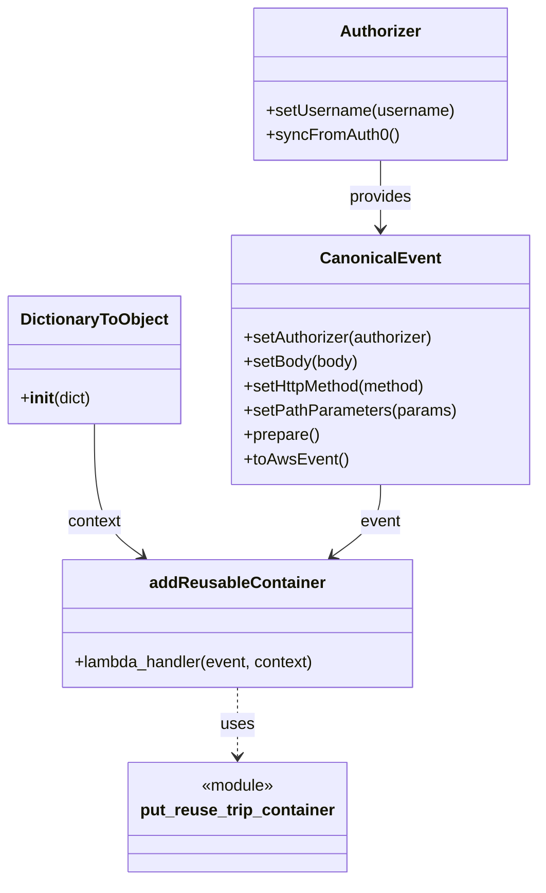

# Diagram: tools/ide_local_testing/localTest/test/reusableContainerTracking/putReuseableContainer.py


> Auto-generated by Obscura crawlers

## Diagram 1

```mermaid
flowchart LR
    Start[Script Entry] --> Auth[Authorizer.setUsername(...)\n.syncFromAuth0()]
    Start --> DTO[DictionaryToObject({function_name: \"addReusableContainer\"})]
    Auth --> CE[CanonicalEvent\n.setAuthorizer(...)\n.setBody(...)\n.setHttpMethod(\"POST\")\n.setPathParameters(...)\n.prepare()\n.toAwsEvent()]
    CE --> Handler[addReusableContainer.lambda_handler(event, context)]
    DTO --> Handler
    Handler --> Print[print(response)]
```

> SVG rendering failed for this diagram.

## Diagram 2



> SVG rendering failed for this diagram.
