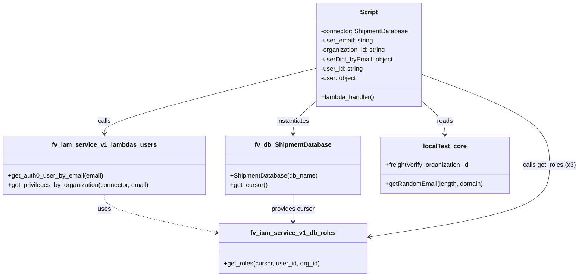
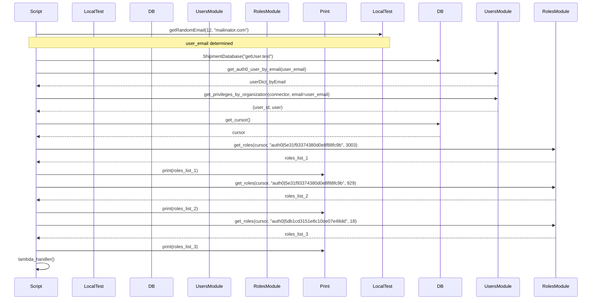

# Diagram: tools/ide_local_testing/localTest/test/role/getRoles.py

> Auto-generated by Obscura crawlers

## Diagram 1

### SVG

<svg id="container" width="1463.4375" xmlns="http://www.w3.org/2000/svg" class="classDiagram" height="704" viewBox="0 0 1463.4375 704" role="graphics-document document" aria-roledescription="class"><g><defs><marker id="container_class-aggregationStart" class="marker aggregation class" refX="18" refY="7" markerWidth="190" markerHeight="240" orient="auto"><path d="M 18,7 L9,13 L1,7 L9,1 Z"></path></marker></defs><defs><marker id="container_class-aggregationEnd" class="marker aggregation class" refX="1" refY="7" markerWidth="20" markerHeight="28" orient="auto"><path d="M 18,7 L9,13 L1,7 L9,1 Z"></path></marker></defs><defs><marker id="container_class-extensionStart" class="marker extension class" refX="18" refY="7" markerWidth="190" markerHeight="240" orient="auto"><path d="M 1,7 L18,13 V 1 Z"></path></marker></defs><defs><marker id="container_class-extensionEnd" class="marker extension class" refX="1" refY="7" markerWidth="20" markerHeight="28" orient="auto"><path d="M 1,1 V 13 L18,7 Z"></path></marker></defs><defs><marker id="container_class-compositionStart" class="marker composition class" refX="18" refY="7" markerWidth="190" markerHeight="240" orient="auto"><path d="M 18,7 L9,13 L1,7 L9,1 Z"></path></marker></defs><defs><marker id="container_class-compositionEnd" class="marker composition class" refX="1" refY="7" markerWidth="20" markerHeight="28" orient="auto"><path d="M 18,7 L9,13 L1,7 L9,1 Z"></path></marker></defs><defs><marker id="container_class-dependencyStart" class="marker dependency class" refX="6" refY="7" markerWidth="190" markerHeight="240" orient="auto"><path d="M 5,7 L9,13 L1,7 L9,1 Z"></path></marker></defs><defs><marker id="container_class-dependencyEnd" class="marker dependency class" refX="13" refY="7" markerWidth="20" markerHeight="28" orient="auto"><path d="M 18,7 L9,13 L14,7 L9,1 Z"></path></marker></defs><defs><marker id="container_class-lollipopStart" class="marker lollipop class" refX="13" refY="7" markerWidth="190" markerHeight="240" orient="auto"><circle stroke="black" fill="transparent" cx="7" cy="7" r="6"></circle></marker></defs><defs><marker id="container_class-lollipopEnd" class="marker lollipop class" refX="1" refY="7" markerWidth="190" markerHeight="240" orient="auto"><circle stroke="black" fill="transparent" cx="7" cy="7" r="6"></circle></marker></defs><g class="root"><g class="clusters"></g><g class="edgePaths"><path d="M263.742,496L263.742,502.167C263.742,508.333,263.742,520.667,311.169,536.805C358.595,552.944,453.448,572.888,500.874,582.86L548.3,592.832" id="id_fv_iam_service_v1_lambdas_users_fv_iam_service_v1_db_roles_1" class="edge-thickness-normal edge-pattern-dashed relation" style=";;;" data-edge="true" data-et="edge" data-id="id_fv_iam_service_v1_lambdas_users_fv_iam_service_v1_db_roles_1" data-points="W3sieCI6MjYzLjc0MjE4NzUsInkiOjQ5Nn0seyJ4IjoyNjMuNzQyMTg3NSwieSI6NTMzfSx7IngiOjU1NC4xNzE4NzUsInkiOjU5NC4wNjY3NTg2NTY5NDE5fV0=" marker-end="url(#container_class-dependencyEnd)"></path><path d="M795.887,259.142L786.462,267.452C777.036,275.762,758.186,292.381,748.761,305.857C739.336,319.333,739.336,329.667,739.336,334.833L739.336,340" id="id_Script_fv_db_ShipmentDatabase_2" class="edge-thickness-normal edge-pattern-solid relation" style=";;;" data-edge="true" data-et="edge" data-id="id_Script_fv_db_ShipmentDatabase_2" data-points="W3sieCI6Nzk1Ljg4NjcxODc1LCJ5IjoyNTkuMTQyMzgyNjIxNDU0Mn0seyJ4Ijo3MzkuMzM1OTM3NSwieSI6MzA5fSx7IngiOjczOS4zMzU5Mzc1LCJ5IjozNDZ9XQ==" marker-end="url(#container_class-dependencyEnd)"></path><path d="M795.887,174.226L707.196,196.688C618.505,219.15,441.124,264.075,352.433,291.704C263.742,319.333,263.742,329.667,263.742,334.833L263.742,340" id="id_Script_fv_iam_service_v1_lambdas_users_3" class="edge-thickness-normal edge-pattern-solid relation" style=";;;" data-edge="true" data-et="edge" data-id="id_Script_fv_iam_service_v1_lambdas_users_3" data-points="W3sieCI6Nzk1Ljg4NjcxODc1LCJ5IjoxNzQuMjI1NjA2NDcyMTU4NX0seyJ4IjoyNjMuNzQyMTg3NSwieSI6MzA5fSx7IngiOjI2My43NDIxODc1LCJ5IjozNDZ9XQ==" marker-end="url(#container_class-dependencyEnd)"></path><path d="M1066.16,259.142L1075.585,267.452C1085.01,275.762,1103.861,292.381,1113.286,306.357C1122.711,320.333,1122.711,331.667,1122.711,337.333L1122.711,343" id="id_Script_localTest_core_4" class="edge-thickness-normal edge-pattern-solid relation" style=";;;" data-edge="true" data-et="edge" data-id="id_Script_localTest_core_4" data-points="W3sieCI6MTA2Ni4xNjAxNTYyNSwieSI6MjU5LjE0MjM4MjYyMTQ1NDJ9LHsieCI6MTEyMi43MTA5Mzc1LCJ5IjozMDl9LHsieCI6MTEyMi43MTA5Mzc1LCJ5IjozNDl9XQ==" marker-end="url(#container_class-dependencyEnd)"></path><path d="M739.336,496L739.336,502.167C739.336,508.333,739.336,520.667,739.336,532C739.336,543.333,739.336,553.667,739.336,558.833L739.336,564" id="id_fv_db_ShipmentDatabase_fv_iam_service_v1_db_roles_5" class="edge-thickness-normal edge-pattern-solid relation" style=";;;" data-edge="true" data-et="edge" data-id="id_fv_db_ShipmentDatabase_fv_iam_service_v1_db_roles_5" data-points="W3sieCI6NzM5LjMzNTkzNzUsInkiOjQ5Nn0seyJ4Ijo3MzkuMzM1OTM3NSwieSI6NTMzfSx7IngiOjczOS4zMzU5Mzc1LCJ5Ijo1NzB9XQ==" marker-end="url(#container_class-dependencyEnd)"></path><path d="M1066.16,189.94L1119.856,209.783C1173.552,229.627,1280.944,269.313,1334.64,307.823C1388.336,346.333,1388.336,383.667,1388.336,421C1388.336,458.333,1388.336,495.667,1312.018,526.093C1235.701,556.519,1083.065,580.037,1006.748,591.796L930.43,603.556" id="id_Script_fv_iam_service_v1_db_roles_6" class="edge-thickness-normal edge-pattern-solid relation" style=";;;" data-edge="true" data-et="edge" data-id="id_Script_fv_iam_service_v1_db_roles_6" data-points="W3sieCI6MTA2Ni4xNjAxNTYyNSwieSI6MTg5LjkzOTgyMzM1NjU2Njl9LHsieCI6MTM4OC4zMzU5Mzc1LCJ5IjozMDl9LHsieCI6MTM4OC4zMzU5Mzc1LCJ5Ijo0MjF9LHsieCI6MTM4OC4zMzU5Mzc1LCJ5Ijo1MzN9LHsieCI6OTI0LjUsInkiOjYwNC40NjkzMjc4MTIwMTg1fV0=" marker-end="url(#container_class-dependencyEnd)"></path></g><g class="edgeLabels"><g class="edgeLabel" transform="translate(263.7421875, 533)"><g class="label" data-id="id_fv_iam_service_v1_lambdas_users_fv_iam_service_v1_db_roles_1" transform="translate(-16.4921875, -12)"><foreignObject width="32.984375" height="24">

uses

</foreignObject></g></g><g class="edgeLabel" transform="translate(739.3359375, 309)"><g class="label" data-id="id_Script_fv_db_ShipmentDatabase_2" transform="translate(-42.9140625, -12)"><foreignObject width="85.828125" height="24">

instantiates

</foreignObject></g></g><g class="edgeLabel" transform="translate(263.7421875, 309)"><g class="label" data-id="id_Script_fv_iam_service_v1_lambdas_users_3" transform="translate(-16.4453125, -12)"><foreignObject width="32.890625" height="24">

calls

</foreignObject></g></g><g class="edgeLabel" transform="translate(1122.7109375, 309)"><g class="label" data-id="id_Script_localTest_core_4" transform="translate(-20.0078125, -12)"><foreignObject width="40.015625" height="24">

reads

</foreignObject></g></g><g class="edgeLabel" transform="translate(739.3359375, 533)"><g class="label" data-id="id_fv_db_ShipmentDatabase_fv_iam_service_v1_db_roles_5" transform="translate(-56.296875, -12)"><foreignObject width="112.59375" height="24">

provides cursor

</foreignObject></g></g><g class="edgeLabel" transform="translate(1388.3359375, 421)"><g class="label" data-id="id_Script_fv_iam_service_v1_db_roles_6" transform="translate(-67.1015625, -12)"><foreignObject width="134.203125" height="24">

calls get_roles (x3)

</foreignObject></g></g></g><g class="nodes"><g class="node default" id="classId-fv_iam_service_v1_db_roles-0" transform="translate(739.3359375, 633)"><g class="basic label-container"><path d="M-185.1640625 -63 L185.1640625 -63 L185.1640625 63 L-185.1640625 63" stroke="none" stroke-width="0" fill="#ECECFF" style=""></path><path d="M-185.1640625 -63 C-51.91602608661793 -63, 81.33201032676413 -63, 185.1640625 -63 M-185.1640625 -63 C-83.66230579818045 -63, 17.83945090363909 -63, 185.1640625 -63 M185.1640625 -63 C185.1640625 -32.72495230835857, 185.1640625 -2.4499046167171272, 185.1640625 63 M185.1640625 -63 C185.1640625 -19.189740934992955, 185.1640625 24.62051813001409, 185.1640625 63 M185.1640625 63 C85.90745319760875 63, -13.349156104782509 63, -185.1640625 63 M185.1640625 63 C75.91057681866418 63, -33.342908862671635 63, -185.1640625 63 M-185.1640625 63 C-185.1640625 33.205983113516794, -185.1640625 3.411966227033588, -185.1640625 -63 M-185.1640625 63 C-185.1640625 36.60266961806151, -185.1640625 10.205339236123017, -185.1640625 -63" stroke="#9370DB" stroke-width="1.3" fill="none" stroke-dasharray="0 0" style=""></path></g><g class="annotation-group text" transform="translate(0, -39)"></g><g class="label-group text" transform="translate(-101.78125, -39)"><g class="label" style="font-weight: bolder" transform="translate(0,-12)"><foreignObject width="203.5625" height="24">

fv_iam_service_v1_db_roles

</foreignObject></g></g><g class="members-group text" transform="translate(-173.1640625, 9)"></g><g class="methods-group text" transform="translate(-173.1640625, 39)"><g class="label" style="" transform="translate(0,-12)"><foreignObject width="244.546875" height="24">

+get_roles(cursor, user_id, org_id)

</foreignObject></g></g><g class="divider" style=""><path d="M-185.1640625 -15 C-83.62691624075858 -15, 17.91023001848285 -15, 185.1640625 -15 M-185.1640625 -15 C-69.29380648754204 -15, 46.576449524915915 -15, 185.1640625 -15" stroke="#9370DB" stroke-width="1.3" fill="none" stroke-dasharray="0 0" style=""></path></g><g class="divider" style=""><path d="M-185.1640625 9 C-86.19148376418818 9, 12.781094971623645 9, 185.1640625 9 M-185.1640625 9 C-86.79505679837817 9, 11.57394890324366 9, 185.1640625 9" stroke="#9370DB" stroke-width="1.3" fill="none" stroke-dasharray="0 0" style=""></path></g></g><g class="node default" id="classId-fv_iam_service_v1_lambdas_users-1" transform="translate(263.7421875, 421)"><g class="basic label-container"><path d="M-255.7421875 -75 L255.7421875 -75 L255.7421875 75 L-255.7421875 75" stroke="none" stroke-width="0" fill="#ECECFF" style=""></path><path d="M-255.7421875 -75 C-99.24005334292119 -75, 57.26208081415763 -75, 255.7421875 -75 M-255.7421875 -75 C-64.31926231233592 -75, 127.10366287532815 -75, 255.7421875 -75 M255.7421875 -75 C255.7421875 -29.871520341093763, 255.7421875 15.256959317812473, 255.7421875 75 M255.7421875 -75 C255.7421875 -20.105505626892032, 255.7421875 34.788988746215935, 255.7421875 75 M255.7421875 75 C143.6884553049236 75, 31.634723109847158 75, -255.7421875 75 M255.7421875 75 C64.35849134308879 75, -127.02520481382243 75, -255.7421875 75 M-255.7421875 75 C-255.7421875 30.67663000746414, -255.7421875 -13.646739985071719, -255.7421875 -75 M-255.7421875 75 C-255.7421875 41.03450777144082, -255.7421875 7.069015542881644, -255.7421875 -75" stroke="#9370DB" stroke-width="1.3" fill="none" stroke-dasharray="0 0" style=""></path></g><g class="annotation-group text" transform="translate(0, -51)"></g><g class="label-group text" transform="translate(-124.921875, -51)"><g class="label" style="font-weight: bolder" transform="translate(0,-12)"><foreignObject width="249.84375" height="24">

fv_iam_service_v1_lambdas_users

</foreignObject></g></g><g class="members-group text" transform="translate(-243.7421875, -3)"></g><g class="methods-group text" transform="translate(-243.7421875, 27)"><g class="label" style="" transform="translate(0,-12)"><foreignObject width="242.765625" height="24">

+get_auth0_user_by_email(email)

</foreignObject></g><g class="label" style="" transform="translate(0,12)"><foreignObject width="362.5625" height="24">

+get_privileges_by_organization(connector, email)

</foreignObject></g></g><g class="divider" style=""><path d="M-255.7421875 -27 C-126.90315628179104 -27, 1.9358749364179175 -27, 255.7421875 -27 M-255.7421875 -27 C-77.08870313483735 -27, 101.56478123032531 -27, 255.7421875 -27" stroke="#9370DB" stroke-width="1.3" fill="none" stroke-dasharray="0 0" style=""></path></g><g class="divider" style=""><path d="M-255.7421875 -3 C-92.03677945522463 -3, 71.66862858955074 -3, 255.7421875 -3 M-255.7421875 -3 C-104.10466981155312 -3, 47.532847876893754 -3, 255.7421875 -3" stroke="#9370DB" stroke-width="1.3" fill="none" stroke-dasharray="0 0" style=""></path></g></g><g class="node default" id="classId-fv_db_ShipmentDatabase-2" transform="translate(739.3359375, 421)"><g class="basic label-container"><path d="M-169.8515625 -75 L169.8515625 -75 L169.8515625 75 L-169.8515625 75" stroke="none" stroke-width="0" fill="#ECECFF" style=""></path><path d="M-169.8515625 -75 C-99.54737838722116 -75, -29.243194274442317 -75, 169.8515625 -75 M-169.8515625 -75 C-86.93127849354424 -75, -4.010994487088482 -75, 169.8515625 -75 M169.8515625 -75 C169.8515625 -26.171038949944673, 169.8515625 22.657922100110653, 169.8515625 75 M169.8515625 -75 C169.8515625 -21.7197006960507, 169.8515625 31.560598607898598, 169.8515625 75 M169.8515625 75 C39.03428274789135 75, -91.7829970042173 75, -169.8515625 75 M169.8515625 75 C75.70341814091442 75, -18.444726218171155 75, -169.8515625 75 M-169.8515625 75 C-169.8515625 41.554974370713644, -169.8515625 8.109948741427289, -169.8515625 -75 M-169.8515625 75 C-169.8515625 23.23039278056838, -169.8515625 -28.53921443886324, -169.8515625 -75" stroke="#9370DB" stroke-width="1.3" fill="none" stroke-dasharray="0 0" style=""></path></g><g class="annotation-group text" transform="translate(0, -51)"></g><g class="label-group text" transform="translate(-93.40625, -51)"><g class="label" style="font-weight: bolder" transform="translate(0,-12)"><foreignObject width="186.8125" height="24">

fv_db_ShipmentDatabase

</foreignObject></g></g><g class="members-group text" transform="translate(-157.8515625, -3)"></g><g class="methods-group text" transform="translate(-157.8515625, 27)"><g class="label" style="" transform="translate(0,-12)"><foreignObject width="222.296875" height="24">

+ShipmentDatabase(db_name)

</foreignObject></g><g class="label" style="" transform="translate(0,12)"><foreignObject width="94.640625" height="24">

+get_cursor()

</foreignObject></g></g><g class="divider" style=""><path d="M-169.8515625 -27 C-96.1167234823111 -27, -22.381884464622203 -27, 169.8515625 -27 M-169.8515625 -27 C-57.12582388122007 -27, 55.59991473755986 -27, 169.8515625 -27" stroke="#9370DB" stroke-width="1.3" fill="none" stroke-dasharray="0 0" style=""></path></g><g class="divider" style=""><path d="M-169.8515625 -3 C-78.74474008608189 -3, 12.36208232783622 -3, 169.8515625 -3 M-169.8515625 -3 C-81.7278351741512 -3, 6.395892151697609 -3, 169.8515625 -3" stroke="#9370DB" stroke-width="1.3" fill="none" stroke-dasharray="0 0" style=""></path></g></g><g class="node default" id="classId-localTest_core-3" transform="translate(1122.7109375, 421)"><g class="basic label-container"><path d="M-163.5234375 -72 L163.5234375 -72 L163.5234375 72 L-163.5234375 72" stroke="none" stroke-width="0" fill="#ECECFF" style=""></path><path d="M-163.5234375 -72 C-32.95045734512183 -72, 97.62252280975633 -72, 163.5234375 -72 M-163.5234375 -72 C-81.55447136935298 -72, 0.41449476129403706 -72, 163.5234375 -72 M163.5234375 -72 C163.5234375 -28.278350047424922, 163.5234375 15.443299905150155, 163.5234375 72 M163.5234375 -72 C163.5234375 -21.980502025545483, 163.5234375 28.038995948909033, 163.5234375 72 M163.5234375 72 C55.1350635169986 72, -53.2533104660028 72, -163.5234375 72 M163.5234375 72 C65.90493360886018 72, -31.713570282279647 72, -163.5234375 72 M-163.5234375 72 C-163.5234375 34.43020757184684, -163.5234375 -3.139584856306314, -163.5234375 -72 M-163.5234375 72 C-163.5234375 35.61435165058775, -163.5234375 -0.7712966988245, -163.5234375 -72" stroke="#9370DB" stroke-width="1.3" fill="none" stroke-dasharray="0 0" style=""></path></g><g class="annotation-group text" transform="translate(0, -48)"></g><g class="label-group text" transform="translate(-52.421875, -48)"><g class="label" style="font-weight: bolder" transform="translate(0,-12)"><foreignObject width="104.84375" height="24">

localTest_core

</foreignObject></g></g><g class="members-group text" transform="translate(-151.5234375, 0)"><g class="label" style="" transform="translate(0,-12)"><foreignObject width="216.921875" height="24">

+freightVerify_organization_id

</foreignObject></g></g><g class="methods-group text" transform="translate(-151.5234375, 48)"><g class="label" style="" transform="translate(0,-12)"><foreignObject width="250.625" height="24">

+getRandomEmail(length, domain)

</foreignObject></g></g><g class="divider" style=""><path d="M-163.5234375 -24 C-83.36437804036699 -24, -3.205318580733973 -24, 163.5234375 -24 M-163.5234375 -24 C-76.31513377663084 -24, 10.893169946738311 -24, 163.5234375 -24" stroke="#9370DB" stroke-width="1.3" fill="none" stroke-dasharray="0 0" style=""></path></g><g class="divider" style=""><path d="M-163.5234375 24 C-54.10845375578768 24, 55.30652998842464 24, 163.5234375 24 M-163.5234375 24 C-40.383647457007115 24, 82.75614258598577 24, 163.5234375 24" stroke="#9370DB" stroke-width="1.3" fill="none" stroke-dasharray="0 0" style=""></path></g></g><g class="node default" id="classId-Script-4" transform="translate(931.0234375, 140)"><g class="basic label-container"><path d="M-135.13671875 -132 L135.13671875 -132 L135.13671875 132 L-135.13671875 132" stroke="none" stroke-width="0" fill="#ECECFF" style=""></path><path d="M-135.13671875 -132 C-69.53903313427539 -132, -3.9413475185507707 -132, 135.13671875 -132 M-135.13671875 -132 C-52.73842309102034 -132, 29.659872567959326 -132, 135.13671875 -132 M135.13671875 -132 C135.13671875 -71.59983258466335, 135.13671875 -11.199665169326678, 135.13671875 132 M135.13671875 -132 C135.13671875 -59.674390122547806, 135.13671875 12.651219754904389, 135.13671875 132 M135.13671875 132 C74.4617431076125 132, 13.786767465225026 132, -135.13671875 132 M135.13671875 132 C60.742994224099846 132, -13.650730301800309 132, -135.13671875 132 M-135.13671875 132 C-135.13671875 51.15432592393998, -135.13671875 -29.691348152120042, -135.13671875 -132 M-135.13671875 132 C-135.13671875 45.660731801667254, -135.13671875 -40.67853639666549, -135.13671875 -132" stroke="#9370DB" stroke-width="1.3" fill="none" stroke-dasharray="0 0" style=""></path></g><g class="annotation-group text" transform="translate(0, -108)"></g><g class="label-group text" transform="translate(-21.7421875, -108)"><g class="label" style="font-weight: bolder" transform="translate(0,-12)"><foreignObject width="43.484375" height="24">

Script

</foreignObject></g></g><g class="members-group text" transform="translate(-123.13671875, -60)"><g class="label" style="" transform="translate(0,-12)"><foreignObject width="224.53125" height="24">

-connector: ShipmentDatabase

</foreignObject></g><g class="label" style="" transform="translate(0,12)"><foreignObject width="135.0625" height="24">

-user_email: string

</foreignObject></g><g class="label" style="" transform="translate(0,36)"><foreignObject width="168.921875" height="24">

-organization_id: string

</foreignObject></g><g class="label" style="" transform="translate(0,60)"><foreignObject width="185.734375" height="24">

-userDict_byEmail: object

</foreignObject></g><g class="label" style="" transform="translate(0,84)"><foreignObject width="108.96875" height="24">

-user_id: string

</foreignObject></g><g class="label" style="" transform="translate(0,108)"><foreignObject width="91.84375" height="24">

-user: object

</foreignObject></g></g><g class="methods-group text" transform="translate(-123.13671875, 108)"><g class="label" style="" transform="translate(0,-12)"><foreignObject width="138.015625" height="24">

+lambda_handler()

</foreignObject></g></g><g class="divider" style=""><path d="M-135.13671875 -84 C-36.07637934754473 -84, 62.98396005491054 -84, 135.13671875 -84 M-135.13671875 -84 C-28.78917579889621 -84, 77.55836715220758 -84, 135.13671875 -84" stroke="#9370DB" stroke-width="1.3" fill="none" stroke-dasharray="0 0" style=""></path></g><g class="divider" style=""><path d="M-135.13671875 84 C-69.13433628278919 84, -3.1319538155783846 84, 135.13671875 84 M-135.13671875 84 C-56.97633260345647 84, 21.18405354308706 84, 135.13671875 84" stroke="#9370DB" stroke-width="1.3" fill="none" stroke-dasharray="0 0" style=""></path></g></g></g></g></g></svg>

## Diagram 2

### SVG

<svg id="container" width="2050" xmlns="http://www.w3.org/2000/svg" height="1114" viewBox="-50 -10 2050 1114" role="graphics-document document" aria-roledescription="sequence"><g><rect x="1800" y="1028" fill="#eaeaea" stroke="#666" width="150" height="65" name="RolesModule" rx="3" ry="3" class="actor actor-bottom"></rect><text x="1875" y="1060.5" dominant-baseline="central" alignment-baseline="central" class="actor actor-box" style="text-anchor: middle; font-size: 16px; font-weight: 400;"><tspan x="1875" dy="0">RolesModule</tspan></text></g><g><rect x="1600" y="1028" fill="#eaeaea" stroke="#666" width="150" height="65" name="UsersModule" rx="3" ry="3" class="actor actor-bottom"></rect><text x="1675" y="1060.5" dominant-baseline="central" alignment-baseline="central" class="actor actor-box" style="text-anchor: middle; font-size: 16px; font-weight: 400;"><tspan x="1675" dy="0">UsersModule</tspan></text></g><g><rect x="1400" y="1028" fill="#eaeaea" stroke="#666" width="150" height="65" name="DB" rx="3" ry="3" class="actor actor-bottom"></rect><text x="1475" y="1060.5" dominant-baseline="central" alignment-baseline="central" class="actor actor-box" style="text-anchor: middle; font-size: 16px; font-weight: 400;"><tspan x="1475" dy="0">DB</tspan></text></g><g><rect x="1200" y="1028" fill="#eaeaea" stroke="#666" width="150" height="65" name="LocalTest" rx="3" ry="3" class="actor actor-bottom"></rect><text x="1275" y="1060.5" dominant-baseline="central" alignment-baseline="central" class="actor actor-box" style="text-anchor: middle; font-size: 16px; font-weight: 400;"><tspan x="1275" dy="0">LocalTest</tspan></text></g><g><rect x="1000" y="1028" fill="#eaeaea" stroke="#666" width="150" height="65" name="Stdout" rx="3" ry="3" class="actor actor-bottom"></rect><text x="1075" y="1060.5" dominant-baseline="central" alignment-baseline="central" class="actor actor-box" style="text-anchor: middle; font-size: 16px; font-weight: 400;"><tspan x="1075" dy="0">Print</tspan></text></g><g><rect x="800" y="1028" fill="#eaeaea" stroke="#666" width="150" height="65" name="RolesDB" rx="3" ry="3" class="actor actor-bottom"></rect><text x="875" y="1060.5" dominant-baseline="central" alignment-baseline="central" class="actor actor-box" style="text-anchor: middle; font-size: 16px; font-weight: 400;"><tspan x="875" dy="0">RolesModule</tspan></text></g><g><rect x="600" y="1028" fill="#eaeaea" stroke="#666" width="150" height="65" name="Lambdas" rx="3" ry="3" class="actor actor-bottom"></rect><text x="675" y="1060.5" dominant-baseline="central" alignment-baseline="central" class="actor actor-box" style="text-anchor: middle; font-size: 16px; font-weight: 400;"><tspan x="675" dy="0">UsersModule</tspan></text></g><g><rect x="400" y="1028" fill="#eaeaea" stroke="#666" width="150" height="65" name="ShipmentDatabase" rx="3" ry="3" class="actor actor-bottom"></rect><text x="475" y="1060.5" dominant-baseline="central" alignment-baseline="central" class="actor actor-box" style="text-anchor: middle; font-size: 16px; font-weight: 400;"><tspan x="475" dy="0">DB</tspan></text></g><g><rect x="200" y="1028" fill="#eaeaea" stroke="#666" width="150" height="65" name="localTest_core" rx="3" ry="3" class="actor actor-bottom"></rect><text x="275" y="1060.5" dominant-baseline="central" alignment-baseline="central" class="actor actor-box" style="text-anchor: middle; font-size: 16px; font-weight: 400;"><tspan x="275" dy="0">LocalTest</tspan></text></g><g><rect x="0" y="1028" fill="#eaeaea" stroke="#666" width="150" height="65" name="Script" rx="3" ry="3" class="actor actor-bottom"></rect><text x="75" y="1060.5" dominant-baseline="central" alignment-baseline="central" class="actor actor-box" style="text-anchor: middle; font-size: 16px; font-weight: 400;"><tspan x="75" dy="0">Script</tspan></text></g><g><line id="actor9" x1="1875" y1="65" x2="1875" y2="1028" class="actor-line 200" stroke-width="0.5px" stroke="#999" name="RolesModule"></line><g id="root-9"><rect x="1800" y="0" fill="#eaeaea" stroke="#666" width="150" height="65" name="RolesModule" rx="3" ry="3" class="actor actor-top"></rect><text x="1875" y="32.5" dominant-baseline="central" alignment-baseline="central" class="actor actor-box" style="text-anchor: middle; font-size: 16px; font-weight: 400;"><tspan x="1875" dy="0">RolesModule</tspan></text></g></g><g><line id="actor8" x1="1675" y1="65" x2="1675" y2="1028" class="actor-line 200" stroke-width="0.5px" stroke="#999" name="UsersModule"></line><g id="root-8"><rect x="1600" y="0" fill="#eaeaea" stroke="#666" width="150" height="65" name="UsersModule" rx="3" ry="3" class="actor actor-top"></rect><text x="1675" y="32.5" dominant-baseline="central" alignment-baseline="central" class="actor actor-box" style="text-anchor: middle; font-size: 16px; font-weight: 400;"><tspan x="1675" dy="0">UsersModule</tspan></text></g></g><g><line id="actor7" x1="1475" y1="65" x2="1475" y2="1028" class="actor-line 200" stroke-width="0.5px" stroke="#999" name="DB"></line><g id="root-7"><rect x="1400" y="0" fill="#eaeaea" stroke="#666" width="150" height="65" name="DB" rx="3" ry="3" class="actor actor-top"></rect><text x="1475" y="32.5" dominant-baseline="central" alignment-baseline="central" class="actor actor-box" style="text-anchor: middle; font-size: 16px; font-weight: 400;"><tspan x="1475" dy="0">DB</tspan></text></g></g><g><line id="actor6" x1="1275" y1="65" x2="1275" y2="1028" class="actor-line 200" stroke-width="0.5px" stroke="#999" name="LocalTest"></line><g id="root-6"><rect x="1200" y="0" fill="#eaeaea" stroke="#666" width="150" height="65" name="LocalTest" rx="3" ry="3" class="actor actor-top"></rect><text x="1275" y="32.5" dominant-baseline="central" alignment-baseline="central" class="actor actor-box" style="text-anchor: middle; font-size: 16px; font-weight: 400;"><tspan x="1275" dy="0">LocalTest</tspan></text></g></g><g><line id="actor5" x1="1075" y1="65" x2="1075" y2="1028" class="actor-line 200" stroke-width="0.5px" stroke="#999" name="Stdout"></line><g id="root-5"><rect x="1000" y="0" fill="#eaeaea" stroke="#666" width="150" height="65" name="Stdout" rx="3" ry="3" class="actor actor-top"></rect><text x="1075" y="32.5" dominant-baseline="central" alignment-baseline="central" class="actor actor-box" style="text-anchor: middle; font-size: 16px; font-weight: 400;"><tspan x="1075" dy="0">Print</tspan></text></g></g><g><line id="actor4" x1="875" y1="65" x2="875" y2="1028" class="actor-line 200" stroke-width="0.5px" stroke="#999" name="RolesDB"></line><g id="root-4"><rect x="800" y="0" fill="#eaeaea" stroke="#666" width="150" height="65" name="RolesDB" rx="3" ry="3" class="actor actor-top"></rect><text x="875" y="32.5" dominant-baseline="central" alignment-baseline="central" class="actor actor-box" style="text-anchor: middle; font-size: 16px; font-weight: 400;"><tspan x="875" dy="0">RolesModule</tspan></text></g></g><g><line id="actor3" x1="675" y1="65" x2="675" y2="1028" class="actor-line 200" stroke-width="0.5px" stroke="#999" name="Lambdas"></line><g id="root-3"><rect x="600" y="0" fill="#eaeaea" stroke="#666" width="150" height="65" name="Lambdas" rx="3" ry="3" class="actor actor-top"></rect><text x="675" y="32.5" dominant-baseline="central" alignment-baseline="central" class="actor actor-box" style="text-anchor: middle; font-size: 16px; font-weight: 400;"><tspan x="675" dy="0">UsersModule</tspan></text></g></g><g><line id="actor2" x1="475" y1="65" x2="475" y2="1028" class="actor-line 200" stroke-width="0.5px" stroke="#999" name="ShipmentDatabase"></line><g id="root-2"><rect x="400" y="0" fill="#eaeaea" stroke="#666" width="150" height="65" name="ShipmentDatabase" rx="3" ry="3" class="actor actor-top"></rect><text x="475" y="32.5" dominant-baseline="central" alignment-baseline="central" class="actor actor-box" style="text-anchor: middle; font-size: 16px; font-weight: 400;"><tspan x="475" dy="0">DB</tspan></text></g></g><g><line id="actor1" x1="275" y1="65" x2="275" y2="1028" class="actor-line 200" stroke-width="0.5px" stroke="#999" name="localTest_core"></line><g id="root-1"><rect x="200" y="0" fill="#eaeaea" stroke="#666" width="150" height="65" name="localTest_core" rx="3" ry="3" class="actor actor-top"></rect><text x="275" y="32.5" dominant-baseline="central" alignment-baseline="central" class="actor actor-box" style="text-anchor: middle; font-size: 16px; font-weight: 400;"><tspan x="275" dy="0">LocalTest</tspan></text></g></g><g><line id="actor0" x1="75" y1="65" x2="75" y2="1028" class="actor-line 200" stroke-width="0.5px" stroke="#999" name="Script"></line><g id="root-0"><rect x="0" y="0" fill="#eaeaea" stroke="#666" width="150" height="65" name="Script" rx="3" ry="3" class="actor actor-top"></rect><text x="75" y="32.5" dominant-baseline="central" alignment-baseline="central" class="actor actor-box" style="text-anchor: middle; font-size: 16px; font-weight: 400;"><tspan x="75" dy="0">Script</tspan></text></g></g><g></g><defs><symbol id="computer" width="24" height="24"><path transform="scale(.5)" d="M2 2v13h20v-13h-20zm18 11h-16v-9h16v9zm-10.228 6l.466-1h3.524l.467 1h-4.457zm14.228 3h-24l2-6h2.104l-1.33 4h18.45l-1.297-4h2.073l2 6zm-5-10h-14v-7h14v7z"></path></symbol></defs><defs><symbol id="database" fill-rule="evenodd" clip-rule="evenodd"><path transform="scale(.5)" d="M12.258.001l.256.004.255.005.253.008.251.01.249.012.247.015.246.016.242.019.241.02.239.023.236.024.233.027.231.028.229.031.225.032.223.034.22.036.217.038.214.04.211.041.208.043.205.045.201.046.198.048.194.05.191.051.187.053.183.054.18.056.175.057.172.059.168.06.163.061.16.063.155.064.15.066.074.033.073.033.071.034.07.034.069.035.068.035.067.035.066.035.064.036.064.036.062.036.06.036.06.037.058.037.058.037.055.038.055.038.053.038.052.038.051.039.05.039.048.039.047.039.045.04.044.04.043.04.041.04.04.041.039.041.037.041.036.041.034.041.033.042.032.042.03.042.029.042.027.042.026.043.024.043.023.043.021.043.02.043.018.044.017.043.015.044.013.044.012.044.011.045.009.044.007.045.006.045.004.045.002.045.001.045v17l-.001.045-.002.045-.004.045-.006.045-.007.045-.009.044-.011.045-.012.044-.013.044-.015.044-.017.043-.018.044-.02.043-.021.043-.023.043-.024.043-.026.043-.027.042-.029.042-.03.042-.032.042-.033.042-.034.041-.036.041-.037.041-.039.041-.04.041-.041.04-.043.04-.044.04-.045.04-.047.039-.048.039-.05.039-.051.039-.052.038-.053.038-.055.038-.055.038-.058.037-.058.037-.06.037-.06.036-.062.036-.064.036-.064.036-.066.035-.067.035-.068.035-.069.035-.07.034-.071.034-.073.033-.074.033-.15.066-.155.064-.16.063-.163.061-.168.06-.172.059-.175.057-.18.056-.183.054-.187.053-.191.051-.194.05-.198.048-.201.046-.205.045-.208.043-.211.041-.214.04-.217.038-.22.036-.223.034-.225.032-.229.031-.231.028-.233.027-.236.024-.239.023-.241.02-.242.019-.246.016-.247.015-.249.012-.251.01-.253.008-.255.005-.256.004-.258.001-.258-.001-.256-.004-.255-.005-.253-.008-.251-.01-.249-.012-.247-.015-.245-.016-.243-.019-.241-.02-.238-.023-.236-.024-.234-.027-.231-.028-.228-.031-.226-.032-.223-.034-.22-.036-.217-.038-.214-.04-.211-.041-.208-.043-.204-.045-.201-.046-.198-.048-.195-.05-.19-.051-.187-.053-.184-.054-.179-.056-.176-.057-.172-.059-.167-.06-.164-.061-.159-.063-.155-.064-.151-.066-.074-.033-.072-.033-.072-.034-.07-.034-.069-.035-.068-.035-.067-.035-.066-.035-.064-.036-.063-.036-.062-.036-.061-.036-.06-.037-.058-.037-.057-.037-.056-.038-.055-.038-.053-.038-.052-.038-.051-.039-.049-.039-.049-.039-.046-.039-.046-.04-.044-.04-.043-.04-.041-.04-.04-.041-.039-.041-.037-.041-.036-.041-.034-.041-.033-.042-.032-.042-.03-.042-.029-.042-.027-.042-.026-.043-.024-.043-.023-.043-.021-.043-.02-.043-.018-.044-.017-.043-.015-.044-.013-.044-.012-.044-.011-.045-.009-.044-.007-.045-.006-.045-.004-.045-.002-.045-.001-.045v-17l.001-.045.002-.045.004-.045.006-.045.007-.045.009-.044.011-.045.012-.044.013-.044.015-.044.017-.043.018-.044.02-.043.021-.043.023-.043.024-.043.026-.043.027-.042.029-.042.03-.042.032-.042.033-.042.034-.041.036-.041.037-.041.039-.041.04-.041.041-.04.043-.04.044-.04.046-.04.046-.039.049-.039.049-.039.051-.039.052-.038.053-.038.055-.038.056-.038.057-.037.058-.037.06-.037.061-.036.062-.036.063-.036.064-.036.066-.035.067-.035.068-.035.069-.035.07-.034.072-.034.072-.033.074-.033.151-.066.155-.064.159-.063.164-.061.167-.06.172-.059.176-.057.179-.056.184-.054.187-.053.19-.051.195-.05.198-.048.201-.046.204-.045.208-.043.211-.041.214-.04.217-.038.22-.036.223-.034.226-.032.228-.031.231-.028.234-.027.236-.024.238-.023.241-.02.243-.019.245-.016.247-.015.249-.012.251-.01.253-.008.255-.005.256-.004.258-.001.258.001zm-9.258 20.499v.01l.001.021.003.021.004.022.005.021.006.022.007.022.009.023.01.022.011.023.012.023.013.023.015.023.016.024.017.023.018.024.019.024.021.024.022.025.023.024.024.025.052.049.056.05.061.051.066.051.07.051.075.051.079.052.084.052.088.052.092.052.097.052.102.051.105.052.11.052.114.051.119.051.123.051.127.05.131.05.135.05.139.048.144.049.147.047.152.047.155.047.16.045.163.045.167.043.171.043.176.041.178.041.183.039.187.039.19.037.194.035.197.035.202.033.204.031.209.03.212.029.216.027.219.025.222.024.226.021.23.02.233.018.236.016.24.015.243.012.246.01.249.008.253.005.256.004.259.001.26-.001.257-.004.254-.005.25-.008.247-.011.244-.012.241-.014.237-.016.233-.018.231-.021.226-.021.224-.024.22-.026.216-.027.212-.028.21-.031.205-.031.202-.034.198-.034.194-.036.191-.037.187-.039.183-.04.179-.04.175-.042.172-.043.168-.044.163-.045.16-.046.155-.046.152-.047.148-.048.143-.049.139-.049.136-.05.131-.05.126-.05.123-.051.118-.052.114-.051.11-.052.106-.052.101-.052.096-.052.092-.052.088-.053.083-.051.079-.052.074-.052.07-.051.065-.051.06-.051.056-.05.051-.05.023-.024.023-.025.021-.024.02-.024.019-.024.018-.024.017-.024.015-.023.014-.024.013-.023.012-.023.01-.023.01-.022.008-.022.006-.022.006-.022.004-.022.004-.021.001-.021.001-.021v-4.127l-.077.055-.08.053-.083.054-.085.053-.087.052-.09.052-.093.051-.095.05-.097.05-.1.049-.102.049-.105.048-.106.047-.109.047-.111.046-.114.045-.115.045-.118.044-.12.043-.122.042-.124.042-.126.041-.128.04-.13.04-.132.038-.134.038-.135.037-.138.037-.139.035-.142.035-.143.034-.144.033-.147.032-.148.031-.15.03-.151.03-.153.029-.154.027-.156.027-.158.026-.159.025-.161.024-.162.023-.163.022-.165.021-.166.02-.167.019-.169.018-.169.017-.171.016-.173.015-.173.014-.175.013-.175.012-.177.011-.178.01-.179.008-.179.008-.181.006-.182.005-.182.004-.184.003-.184.002h-.37l-.184-.002-.184-.003-.182-.004-.182-.005-.181-.006-.179-.008-.179-.008-.178-.01-.176-.011-.176-.012-.175-.013-.173-.014-.172-.015-.171-.016-.17-.017-.169-.018-.167-.019-.166-.02-.165-.021-.163-.022-.162-.023-.161-.024-.159-.025-.157-.026-.156-.027-.155-.027-.153-.029-.151-.03-.15-.03-.148-.031-.146-.032-.145-.033-.143-.034-.141-.035-.14-.035-.137-.037-.136-.037-.134-.038-.132-.038-.13-.04-.128-.04-.126-.041-.124-.042-.122-.042-.12-.044-.117-.043-.116-.045-.113-.045-.112-.046-.109-.047-.106-.047-.105-.048-.102-.049-.1-.049-.097-.05-.095-.05-.093-.052-.09-.051-.087-.052-.085-.053-.083-.054-.08-.054-.077-.054v4.127zm0-5.654v.011l.001.021.003.021.004.021.005.022.006.022.007.022.009.022.01.022.011.023.012.023.013.023.015.024.016.023.017.024.018.024.019.024.021.024.022.024.023.025.024.024.052.05.056.05.061.05.066.051.07.051.075.052.079.051.084.052.088.052.092.052.097.052.102.052.105.052.11.051.114.051.119.052.123.05.127.051.131.05.135.049.139.049.144.048.147.048.152.047.155.046.16.045.163.045.167.044.171.042.176.042.178.04.183.04.187.038.19.037.194.036.197.034.202.033.204.032.209.03.212.028.216.027.219.025.222.024.226.022.23.02.233.018.236.016.24.014.243.012.246.01.249.008.253.006.256.003.259.001.26-.001.257-.003.254-.006.25-.008.247-.01.244-.012.241-.015.237-.016.233-.018.231-.02.226-.022.224-.024.22-.025.216-.027.212-.029.21-.03.205-.032.202-.033.198-.035.194-.036.191-.037.187-.039.183-.039.179-.041.175-.042.172-.043.168-.044.163-.045.16-.045.155-.047.152-.047.148-.048.143-.048.139-.05.136-.049.131-.05.126-.051.123-.051.118-.051.114-.052.11-.052.106-.052.101-.052.096-.052.092-.052.088-.052.083-.052.079-.052.074-.051.07-.052.065-.051.06-.05.056-.051.051-.049.023-.025.023-.024.021-.025.02-.024.019-.024.018-.024.017-.024.015-.023.014-.023.013-.024.012-.022.01-.023.01-.023.008-.022.006-.022.006-.022.004-.021.004-.022.001-.021.001-.021v-4.139l-.077.054-.08.054-.083.054-.085.052-.087.053-.09.051-.093.051-.095.051-.097.05-.1.049-.102.049-.105.048-.106.047-.109.047-.111.046-.114.045-.115.044-.118.044-.12.044-.122.042-.124.042-.126.041-.128.04-.13.039-.132.039-.134.038-.135.037-.138.036-.139.036-.142.035-.143.033-.144.033-.147.033-.148.031-.15.03-.151.03-.153.028-.154.028-.156.027-.158.026-.159.025-.161.024-.162.023-.163.022-.165.021-.166.02-.167.019-.169.018-.169.017-.171.016-.173.015-.173.014-.175.013-.175.012-.177.011-.178.009-.179.009-.179.007-.181.007-.182.005-.182.004-.184.003-.184.002h-.37l-.184-.002-.184-.003-.182-.004-.182-.005-.181-.007-.179-.007-.179-.009-.178-.009-.176-.011-.176-.012-.175-.013-.173-.014-.172-.015-.171-.016-.17-.017-.169-.018-.167-.019-.166-.02-.165-.021-.163-.022-.162-.023-.161-.024-.159-.025-.157-.026-.156-.027-.155-.028-.153-.028-.151-.03-.15-.03-.148-.031-.146-.033-.145-.033-.143-.033-.141-.035-.14-.036-.137-.036-.136-.037-.134-.038-.132-.039-.13-.039-.128-.04-.126-.041-.124-.042-.122-.043-.12-.043-.117-.044-.116-.044-.113-.046-.112-.046-.109-.046-.106-.047-.105-.048-.102-.049-.1-.049-.097-.05-.095-.051-.093-.051-.09-.051-.087-.053-.085-.052-.083-.054-.08-.054-.077-.054v4.139zm0-5.666v.011l.001.02.003.022.004.021.005.022.006.021.007.022.009.023.01.022.011.023.012.023.013.023.015.023.016.024.017.024.018.023.019.024.021.025.022.024.023.024.024.025.052.05.056.05.061.05.066.051.07.051.075.052.079.051.084.052.088.052.092.052.097.052.102.052.105.051.11.052.114.051.119.051.123.051.127.05.131.05.135.05.139.049.144.048.147.048.152.047.155.046.16.045.163.045.167.043.171.043.176.042.178.04.183.04.187.038.19.037.194.036.197.034.202.033.204.032.209.03.212.028.216.027.219.025.222.024.226.021.23.02.233.018.236.017.24.014.243.012.246.01.249.008.253.006.256.003.259.001.26-.001.257-.003.254-.006.25-.008.247-.01.244-.013.241-.014.237-.016.233-.018.231-.02.226-.022.224-.024.22-.025.216-.027.212-.029.21-.03.205-.032.202-.033.198-.035.194-.036.191-.037.187-.039.183-.039.179-.041.175-.042.172-.043.168-.044.163-.045.16-.045.155-.047.152-.047.148-.048.143-.049.139-.049.136-.049.131-.051.126-.05.123-.051.118-.052.114-.051.11-.052.106-.052.101-.052.096-.052.092-.052.088-.052.083-.052.079-.052.074-.052.07-.051.065-.051.06-.051.056-.05.051-.049.023-.025.023-.025.021-.024.02-.024.019-.024.018-.024.017-.024.015-.023.014-.024.013-.023.012-.023.01-.022.01-.023.008-.022.006-.022.006-.022.004-.022.004-.021.001-.021.001-.021v-4.153l-.077.054-.08.054-.083.053-.085.053-.087.053-.09.051-.093.051-.095.051-.097.05-.1.049-.102.048-.105.048-.106.048-.109.046-.111.046-.114.046-.115.044-.118.044-.12.043-.122.043-.124.042-.126.041-.128.04-.13.039-.132.039-.134.038-.135.037-.138.036-.139.036-.142.034-.143.034-.144.033-.147.032-.148.032-.15.03-.151.03-.153.028-.154.028-.156.027-.158.026-.159.024-.161.024-.162.023-.163.023-.165.021-.166.02-.167.019-.169.018-.169.017-.171.016-.173.015-.173.014-.175.013-.175.012-.177.01-.178.01-.179.009-.179.007-.181.006-.182.006-.182.004-.184.003-.184.001-.185.001-.185-.001-.184-.001-.184-.003-.182-.004-.182-.006-.181-.006-.179-.007-.179-.009-.178-.01-.176-.01-.176-.012-.175-.013-.173-.014-.172-.015-.171-.016-.17-.017-.169-.018-.167-.019-.166-.02-.165-.021-.163-.023-.162-.023-.161-.024-.159-.024-.157-.026-.156-.027-.155-.028-.153-.028-.151-.03-.15-.03-.148-.032-.146-.032-.145-.033-.143-.034-.141-.034-.14-.036-.137-.036-.136-.037-.134-.038-.132-.039-.13-.039-.128-.041-.126-.041-.124-.041-.122-.043-.12-.043-.117-.044-.116-.044-.113-.046-.112-.046-.109-.046-.106-.048-.105-.048-.102-.048-.1-.05-.097-.049-.095-.051-.093-.051-.09-.052-.087-.052-.085-.053-.083-.053-.08-.054-.077-.054v4.153zm8.74-8.179l-.257.004-.254.005-.25.008-.247.011-.244.012-.241.014-.237.016-.233.018-.231.021-.226.022-.224.023-.22.026-.216.027-.212.028-.21.031-.205.032-.202.033-.198.034-.194.036-.191.038-.187.038-.183.04-.179.041-.175.042-.172.043-.168.043-.163.045-.16.046-.155.046-.152.048-.148.048-.143.048-.139.049-.136.05-.131.05-.126.051-.123.051-.118.051-.114.052-.11.052-.106.052-.101.052-.096.052-.092.052-.088.052-.083.052-.079.052-.074.051-.07.052-.065.051-.06.05-.056.05-.051.05-.023.025-.023.024-.021.024-.02.025-.019.024-.018.024-.017.023-.015.024-.014.023-.013.023-.012.023-.01.023-.01.022-.008.022-.006.023-.006.021-.004.022-.004.021-.001.021-.001.021.001.021.001.021.004.021.004.022.006.021.006.023.008.022.01.022.01.023.012.023.013.023.014.023.015.024.017.023.018.024.019.024.02.025.021.024.023.024.023.025.051.05.056.05.06.05.065.051.07.052.074.051.079.052.083.052.088.052.092.052.096.052.101.052.106.052.11.052.114.052.118.051.123.051.126.051.131.05.136.05.139.049.143.048.148.048.152.048.155.046.16.046.163.045.168.043.172.043.175.042.179.041.183.04.187.038.191.038.194.036.198.034.202.033.205.032.21.031.212.028.216.027.22.026.224.023.226.022.231.021.233.018.237.016.241.014.244.012.247.011.25.008.254.005.257.004.26.001.26-.001.257-.004.254-.005.25-.008.247-.011.244-.012.241-.014.237-.016.233-.018.231-.021.226-.022.224-.023.22-.026.216-.027.212-.028.21-.031.205-.032.202-.033.198-.034.194-.036.191-.038.187-.038.183-.04.179-.041.175-.042.172-.043.168-.043.163-.045.16-.046.155-.046.152-.048.148-.048.143-.048.139-.049.136-.05.131-.05.126-.051.123-.051.118-.051.114-.052.11-.052.106-.052.101-.052.096-.052.092-.052.088-.052.083-.052.079-.052.074-.051.07-.052.065-.051.06-.05.056-.05.051-.05.023-.025.023-.024.021-.024.02-.025.019-.024.018-.024.017-.023.015-.024.014-.023.013-.023.012-.023.01-.023.01-.022.008-.022.006-.023.006-.021.004-.022.004-.021.001-.021.001-.021-.001-.021-.001-.021-.004-.021-.004-.022-.006-.021-.006-.023-.008-.022-.01-.022-.01-.023-.012-.023-.013-.023-.014-.023-.015-.024-.017-.023-.018-.024-.019-.024-.02-.025-.021-.024-.023-.024-.023-.025-.051-.05-.056-.05-.06-.05-.065-.051-.07-.052-.074-.051-.079-.052-.083-.052-.088-.052-.092-.052-.096-.052-.101-.052-.106-.052-.11-.052-.114-.052-.118-.051-.123-.051-.126-.051-.131-.05-.136-.05-.139-.049-.143-.048-.148-.048-.152-.048-.155-.046-.16-.046-.163-.045-.168-.043-.172-.043-.175-.042-.179-.041-.183-.04-.187-.038-.191-.038-.194-.036-.198-.034-.202-.033-.205-.032-.21-.031-.212-.028-.216-.027-.22-.026-.224-.023-.226-.022-.231-.021-.233-.018-.237-.016-.241-.014-.244-.012-.247-.011-.25-.008-.254-.005-.257-.004-.26-.001-.26.001z"></path></symbol></defs><defs><symbol id="clock" width="24" height="24"><path transform="scale(.5)" d="M12 2c5.514 0 10 4.486 10 10s-4.486 10-10 10-10-4.486-10-10 4.486-10 10-10zm0-2c-6.627 0-12 5.373-12 12s5.373 12 12 12 12-5.373 12-12-5.373-12-12-12zm5.848 12.459c.202.038.202.333.001.372-1.907.361-6.045 1.111-6.547 1.111-.719 0-1.301-.582-1.301-1.301 0-.512.77-5.447 1.125-7.445.034-.192.312-.181.343.014l.985 6.238 5.394 1.011z"></path></symbol></defs><defs><marker id="arrowhead" refX="7.9" refY="5" markerUnits="userSpaceOnUse" markerWidth="12" markerHeight="12" orient="auto-start-reverse"><path d="M -1 0 L 10 5 L 0 10 z"></path></marker></defs><defs><marker id="crosshead" markerWidth="15" markerHeight="8" orient="auto" refX="4" refY="4.5"><path fill="none" stroke="#000000" stroke-width="1pt" d="M 1,2 L 6,7 M 6,2 L 1,7" style="stroke-dasharray: 0, 0;"></path></marker></defs><defs><marker id="filled-head" refX="15.5" refY="7" markerWidth="20" markerHeight="28" orient="auto"><path d="M 18,7 L9,13 L14,7 L9,1 Z"></path></marker></defs><defs><marker id="sequencenumber" refX="15" refY="15" markerWidth="60" markerHeight="40" orient="auto"><circle cx="15" cy="15" r="6"></circle></marker></defs><g><rect x="50" y="123" fill="#EDF2AE" stroke="#666" width="1250" height="39" class="note"></rect><text x="675" y="128" text-anchor="middle" dominant-baseline="middle" alignment-baseline="middle" class="noteText" dy="1em" style="font-size: 16px; font-weight: 400;"><tspan x="675">user_email determined</tspan></text></g><text x="674" y="80" text-anchor="middle" dominant-baseline="middle" alignment-baseline="middle" class="messageText" dy="1em" style="font-size: 16px; font-weight: 400;">getRandomEmail(12, "mailinator.com")</text><line x1="76" y1="113" x2="1271" y2="113" class="messageLine0" stroke-width="2" stroke="none" marker-end="url(#arrowhead)" style="fill: none;"></line><text x="774" y="177" text-anchor="middle" dominant-baseline="middle" alignment-baseline="middle" class="messageText" dy="1em" style="font-size: 16px; font-weight: 400;">ShipmentDatabase("getUser.test")</text><line x1="76" y1="210" x2="1471" y2="210" class="messageLine0" stroke-width="2" stroke="none" marker-end="url(#arrowhead)" style="fill: none;"></line><text x="874" y="225" text-anchor="middle" dominant-baseline="middle" alignment-baseline="middle" class="messageText" dy="1em" style="font-size: 16px; font-weight: 400;">get_auth0_user_by_email(user_email)</text><line x1="76" y1="258" x2="1671" y2="258" class="messageLine0" stroke-width="2" stroke="none" marker-end="url(#arrowhead)" style="fill: none;"></line><text x="877" y="273" text-anchor="middle" dominant-baseline="middle" alignment-baseline="middle" class="messageText" dy="1em" style="font-size: 16px; font-weight: 400;">userDict_byEmail</text><line x1="1674" y1="306" x2="79" y2="306" class="messageLine1" stroke-width="2" stroke="none" marker-end="url(#arrowhead)" style="stroke-dasharray: 3, 3; fill: none;"></line><text x="874" y="321" text-anchor="middle" dominant-baseline="middle" alignment-baseline="middle" class="messageText" dy="1em" style="font-size: 16px; font-weight: 400;">get_privileges_by_organization(connector, email=user_email)</text><line x1="76" y1="354" x2="1671" y2="354" class="messageLine0" stroke-width="2" stroke="none" marker-end="url(#arrowhead)" style="fill: none;"></line><text x="877" y="369" text-anchor="middle" dominant-baseline="middle" alignment-baseline="middle" class="messageText" dy="1em" style="font-size: 16px; font-weight: 400;">(user_id, user)</text><line x1="1674" y1="402" x2="79" y2="402" class="messageLine1" stroke-width="2" stroke="none" marker-end="url(#arrowhead)" style="stroke-dasharray: 3, 3; fill: none;"></line><text x="774" y="417" text-anchor="middle" dominant-baseline="middle" alignment-baseline="middle" class="messageText" dy="1em" style="font-size: 16px; font-weight: 400;">get_cursor()</text><line x1="76" y1="450" x2="1471" y2="450" class="messageLine0" stroke-width="2" stroke="none" marker-end="url(#arrowhead)" style="fill: none;"></line><text x="777" y="465" text-anchor="middle" dominant-baseline="middle" alignment-baseline="middle" class="messageText" dy="1em" style="font-size: 16px; font-weight: 400;">cursor</text><line x1="1474" y1="498" x2="79" y2="498" class="messageLine1" stroke-width="2" stroke="none" marker-end="url(#arrowhead)" style="stroke-dasharray: 3, 3; fill: none;"></line><text x="974" y="513" text-anchor="middle" dominant-baseline="middle" alignment-baseline="middle" class="messageText" dy="1em" style="font-size: 16px; font-weight: 400;">get_roles(cursor, "auth0|5e31f93374380d0e8f88fc9b", 3003)</text><line x1="76" y1="546" x2="1871" y2="546" class="messageLine0" stroke-width="2" stroke="none" marker-end="url(#arrowhead)" style="fill: none;"></line><text x="977" y="561" text-anchor="middle" dominant-baseline="middle" alignment-baseline="middle" class="messageText" dy="1em" style="font-size: 16px; font-weight: 400;">roles_list_1</text><line x1="1874" y1="594" x2="79" y2="594" class="messageLine1" stroke-width="2" stroke="none" marker-end="url(#arrowhead)" style="stroke-dasharray: 3, 3; fill: none;"></line><text x="574" y="609" text-anchor="middle" dominant-baseline="middle" alignment-baseline="middle" class="messageText" dy="1em" style="font-size: 16px; font-weight: 400;">print(roles_list_1)</text><line x1="76" y1="642" x2="1071" y2="642" class="messageLine0" stroke-width="2" stroke="none" marker-end="url(#arrowhead)" style="fill: none;"></line><text x="974" y="657" text-anchor="middle" dominant-baseline="middle" alignment-baseline="middle" class="messageText" dy="1em" style="font-size: 16px; font-weight: 400;">get_roles(cursor, "auth0|5e31f93374380d0e8f88fc9b", 929)</text><line x1="76" y1="690" x2="1871" y2="690" class="messageLine0" stroke-width="2" stroke="none" marker-end="url(#arrowhead)" style="fill: none;"></line><text x="977" y="705" text-anchor="middle" dominant-baseline="middle" alignment-baseline="middle" class="messageText" dy="1em" style="font-size: 16px; font-weight: 400;">roles_list_2</text><line x1="1874" y1="738" x2="79" y2="738" class="messageLine1" stroke-width="2" stroke="none" marker-end="url(#arrowhead)" style="stroke-dasharray: 3, 3; fill: none;"></line><text x="574" y="753" text-anchor="middle" dominant-baseline="middle" alignment-baseline="middle" class="messageText" dy="1em" style="font-size: 16px; font-weight: 400;">print(roles_list_2)</text><line x1="76" y1="786" x2="1071" y2="786" class="messageLine0" stroke-width="2" stroke="none" marker-end="url(#arrowhead)" style="fill: none;"></line><text x="974" y="801" text-anchor="middle" dominant-baseline="middle" alignment-baseline="middle" class="messageText" dy="1em" style="font-size: 16px; font-weight: 400;">get_roles(cursor, "auth0|5db1cd3151e8c10de07e48dd", 18)</text><line x1="76" y1="834" x2="1871" y2="834" class="messageLine0" stroke-width="2" stroke="none" marker-end="url(#arrowhead)" style="fill: none;"></line><text x="977" y="849" text-anchor="middle" dominant-baseline="middle" alignment-baseline="middle" class="messageText" dy="1em" style="font-size: 16px; font-weight: 400;">roles_list_3</text><line x1="1874" y1="882" x2="79" y2="882" class="messageLine1" stroke-width="2" stroke="none" marker-end="url(#arrowhead)" style="stroke-dasharray: 3, 3; fill: none;"></line><text x="574" y="897" text-anchor="middle" dominant-baseline="middle" alignment-baseline="middle" class="messageText" dy="1em" style="font-size: 16px; font-weight: 400;">print(roles_list_3)</text><line x1="76" y1="930" x2="1071" y2="930" class="messageLine0" stroke-width="2" stroke="none" marker-end="url(#arrowhead)" style="fill: none;"></line><text x="76" y="945" text-anchor="middle" dominant-baseline="middle" alignment-baseline="middle" class="messageText" dy="1em" style="font-size: 16px; font-weight: 400;">lambda_handler()</text><path d="M 76,978 C 136,968 136,1008 76,998" class="messageLine0" stroke-width="2" stroke="none" marker-end="url(#arrowhead)" style="fill: none;"></path></svg>
