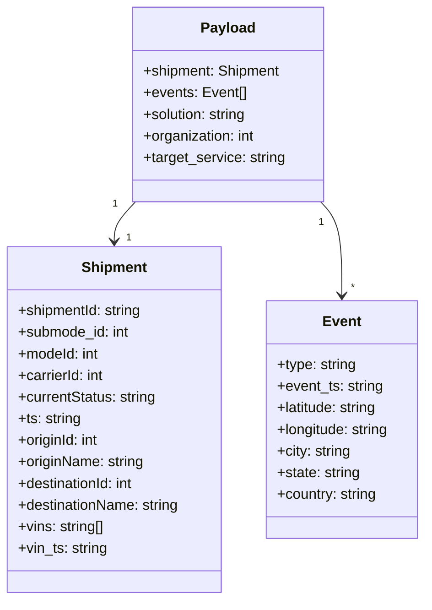

# Diagram: tools/ide_local_testing/localTest/test/scheduledServices/progressUpdateWithNoProgress.py


> Auto-generated by Obscura crawlers

## Diagram 1

```mermaid
flowchart TD
    A[localTest.core.get_event()] --> B[event object]
    B --> C[populate event.notification with payload]
    C --> D[scheduled_services.finished_vehicle_event_orchestrator.post_message.lambda_handler]
    D --> E[post_message lambda handler]
    E --> F[returns response]
    F --> G[print(response)]
    subgraph OrchestratorModule
        D
        E
    end
```

> SVG rendering failed for this diagram.

## Diagram 2



### SVG

<svg id="container" width="479.4609375" xmlns="http://www.w3.org/2000/svg" class="classDiagram" height="666" viewBox="0 0 479.4609375 666" role="graphics-document document" aria-roledescription="class"><style>#container{font-family:"trebuchet ms",verdana,arial,sans-serif;font-size:16px;fill:#333;}@keyframes edge-animation-frame{from{stroke-dashoffset:0;}}@keyframes dash{to{stroke-dashoffset:0;}}#container .edge-animation-slow{stroke-dasharray:9,5!important;stroke-dashoffset:900;animation:dash 50s linear infinite;stroke-linecap:round;}#container .edge-animation-fast{stroke-dasharray:9,5!important;stroke-dashoffset:900;animation:dash 20s linear infinite;stroke-linecap:round;}#container .error-icon{fill:#552222;}#container .error-text{fill:#552222;stroke:#552222;}#container .edge-thickness-normal{stroke-width:1px;}#container .edge-thickness-thick{stroke-width:3.5px;}#container .edge-pattern-solid{stroke-dasharray:0;}#container .edge-thickness-invisible{stroke-width:0;fill:none;}#container .edge-pattern-dashed{stroke-dasharray:3;}#container .edge-pattern-dotted{stroke-dasharray:2;}#container .marker{fill:#333333;stroke:#333333;}#container .marker.cross{stroke:#333333;}#container svg{font-family:"trebuchet ms",verdana,arial,sans-serif;font-size:16px;}#container p{margin:0;}#container g.classGroup text{fill:#9370DB;stroke:none;font-family:"trebuchet ms",verdana,arial,sans-serif;font-size:10px;}#container g.classGroup text .title{font-weight:bolder;}#container .nodeLabel,#container .edgeLabel{color:#131300;}#container .edgeLabel .label rect{fill:#ECECFF;}#container .label text{fill:#131300;}#container .labelBkg{background:#ECECFF;}#container .edgeLabel .label span{background:#ECECFF;}#container .classTitle{font-weight:bolder;}#container .node rect,#container .node circle,#container .node ellipse,#container .node polygon,#container .node path{fill:#ECECFF;stroke:#9370DB;stroke-width:1px;}#container .divider{stroke:#9370DB;stroke-width:1;}#container g.clickable{cursor:pointer;}#container g.classGroup rect{fill:#ECECFF;stroke:#9370DB;}#container g.classGroup line{stroke:#9370DB;stroke-width:1;}#container .classLabel .box{stroke:none;stroke-width:0;fill:#ECECFF;opacity:0.5;}#container .classLabel .label{fill:#9370DB;font-size:10px;}#container .relation{stroke:#333333;stroke-width:1;fill:none;}#container .dashed-line{stroke-dasharray:3;}#container .dotted-line{stroke-dasharray:1 2;}#container #compositionStart,#container .composition{fill:#333333!important;stroke:#333333!important;stroke-width:1;}#container #compositionEnd,#container .composition{fill:#333333!important;stroke:#333333!important;stroke-width:1;}#container #dependencyStart,#container .dependency{fill:#333333!important;stroke:#333333!important;stroke-width:1;}#container #dependencyStart,#container .dependency{fill:#333333!important;stroke:#333333!important;stroke-width:1;}#container #extensionStart,#container .extension{fill:transparent!important;stroke:#333333!important;stroke-width:1;}#container #extensionEnd,#container .extension{fill:transparent!important;stroke:#333333!important;stroke-width:1;}#container #aggregationStart,#container .aggregation{fill:transparent!important;stroke:#333333!important;stroke-width:1;}#container #aggregationEnd,#container .aggregation{fill:transparent!important;stroke:#333333!important;stroke-width:1;}#container #lollipopStart,#container .lollipop{fill:#ECECFF!important;stroke:#333333!important;stroke-width:1;}#container #lollipopEnd,#container .lollipop{fill:#ECECFF!important;stroke:#333333!important;stroke-width:1;}#container .edgeTerminals{font-size:11px;line-height:initial;}#container .classTitleText{text-anchor:middle;font-size:18px;fill:#333;}#container .label-icon{display:inline-block;height:1em;overflow:visible;vertical-align:-0.125em;}#container .node .label-icon path{fill:currentColor;stroke:revert;stroke-width:revert;}#container :root{--mermaid-font-family:"trebuchet ms",verdana,arial,sans-serif;}</style><g><defs><marker id="container_class-aggregationStart" class="marker aggregation class" refX="18" refY="7" markerWidth="190" markerHeight="240" orient="auto"><path d="M 18,7 L9,13 L1,7 L9,1 Z"></path></marker></defs><defs><marker id="container_class-aggregationEnd" class="marker aggregation class" refX="1" refY="7" markerWidth="20" markerHeight="28" orient="auto"><path d="M 18,7 L9,13 L1,7 L9,1 Z"></path></marker></defs><defs><marker id="container_class-extensionStart" class="marker extension class" refX="18" refY="7" markerWidth="190" markerHeight="240" orient="auto"><path d="M 1,7 L18,13 V 1 Z"></path></marker></defs><defs><marker id="container_class-extensionEnd" class="marker extension class" refX="1" refY="7" markerWidth="20" markerHeight="28" orient="auto"><path d="M 1,1 V 13 L18,7 Z"></path></marker></defs><defs><marker id="container_class-compositionStart" class="marker composition class" refX="18" refY="7" markerWidth="190" markerHeight="240" orient="auto"><path d="M 18,7 L9,13 L1,7 L9,1 Z"></path></marker></defs><defs><marker id="container_class-compositionEnd" class="marker composition class" refX="1" refY="7" markerWidth="20" markerHeight="28" orient="auto"><path d="M 18,7 L9,13 L1,7 L9,1 Z"></path></marker></defs><defs><marker id="container_class-dependencyStart" class="marker dependency class" refX="6" refY="7" markerWidth="190" markerHeight="240" orient="auto"><path d="M 5,7 L9,13 L1,7 L9,1 Z"></path></marker></defs><defs><marker id="container_class-dependencyEnd" class="marker dependency class" refX="13" refY="7" markerWidth="20" markerHeight="28" orient="auto"><path d="M 18,7 L9,13 L14,7 L9,1 Z"></path></marker></defs><defs><marker id="container_class-lollipopStart" class="marker lollipop class" refX="13" refY="7" markerWidth="190" markerHeight="240" orient="auto"><circle stroke="black" fill="transparent" cx="7" cy="7" r="6"></circle></marker></defs><defs><marker id="container_class-lollipopEnd" class="marker lollipop class" refX="1" refY="7" markerWidth="190" markerHeight="240" orient="auto"><circle stroke="black" fill="transparent" cx="7" cy="7" r="6"></circle></marker></defs><g class="root"><g class="clusters"></g><g class="edgePaths"><path d="M153.137,224L149.115,228.167C145.094,232.333,137.051,240.667,133.029,248C129.008,255.333,129.008,261.667,129.008,264.833L129.008,268" id="id_Payload_Shipment_1" class="edge-thickness-normal edge-pattern-solid relation" style=";;;" data-edge="true" data-et="edge" data-id="id_Payload_Shipment_1" data-points="W3sieCI6MTUzLjEzNjYxNTk1Mzk0NzM3LCJ5IjoyMjR9LHsieCI6MTI5LjAwNzgxMjUsInkiOjI0OX0seyJ4IjoxMjkuMDA3ODEyNSwieSI6Mjc0fV0=" marker-end="url(#container_class-dependencyEnd)"></path><path d="M361.609,224L365.631,228.167C369.652,232.333,377.695,240.667,381.717,258C385.738,275.333,385.738,301.667,385.738,314.833L385.738,328" id="id_Payload_Event_2" class="edge-thickness-normal edge-pattern-solid relation" style=";;;" data-edge="true" data-et="edge" data-id="id_Payload_Event_2" data-points="W3sieCI6MzYxLjYwOTQ3Nzc5NjA1MjYsInkiOjIyNH0seyJ4IjozODUuNzM4MjgxMjUsInkiOjI0OX0seyJ4IjozODUuNzM4MjgxMjUsInkiOjMzNH1d" marker-end="url(#container_class-dependencyEnd)"></path></g><g class="edgeLabels"><g class="edgeLabel"><g class="label" data-id="id_Payload_Shipment_1" transform="translate(0, 0)"><foreignObject width="0" height="0"><div xmlns="http://www.w3.org/1999/xhtml" class="labelBkg" style="display: table-cell; white-space: nowrap; line-height: 1.5; max-width: 200px; text-align: center;"><span class="edgeLabel"></span></div></foreignObject></g></g><g class="edgeLabel"><g class="label" data-id="id_Payload_Event_2" transform="translate(0, 0)"><foreignObject width="0" height="0"><div xmlns="http://www.w3.org/1999/xhtml" class="labelBkg" style="display: table-cell; white-space: nowrap; line-height: 1.5; max-width: 200px; text-align: center;"><span class="edgeLabel"></span></div></foreignObject></g></g><g class="edgeTerminals" transform="translate(130.2265012128605, 226.26563949675847)"><g class="inner" transform="translate(0, 0)"><foreignObject style="width: 9px; height: 12px;"><div xmlns="http://www.w3.org/1999/xhtml" style="display: inline-block; padding-right: 1px; white-space: nowrap;"><span class="edgeLabel">1</span></div></foreignObject></g></g><g class="edgeTerminals" transform="translate(362.8281663295426, 246.98958966131994)"><g class="inner" transform="translate(0, 0)"><foreignObject style="width: 9px; height: 12px;"><div xmlns="http://www.w3.org/1999/xhtml" style="display: inline-block; padding-right: 1px; white-space: nowrap;"><span class="edgeLabel">1</span></div></foreignObject></g></g><g class="edgeTerminals" transform="translate(142.14287528604967, 256.06511924737805)"><g class="inner" transform="translate(0, 0)"></g><foreignObject style="width: 9px; height: 12px;"><div xmlns="http://www.w3.org/1999/xhtml" style="display: inline-block; padding-right: 1px; white-space: nowrap;"><span class="edgeLabel">1</span></div></foreignObject></g><g class="edgeTerminals" transform="translate(395.738280625, 311.4999994642857)"><g class="inner" transform="translate(0, 0)"></g><foreignObject style="width: 9px; height: 12px;"><div xmlns="http://www.w3.org/1999/xhtml" style="display: inline-block; padding-right: 1px; white-space: nowrap;"><span class="edgeLabel">*</span></div></foreignObject></g></g><g class="nodes"><g class="node default" id="classId-Payload-0" transform="translate(257.373046875, 116)"><g class="basic label-container"><path d="M-106.2578125 -108 L106.2578125 -108 L106.2578125 108 L-106.2578125 108" stroke="none" stroke-width="0" fill="#ECECFF" style=""></path><path d="M-106.2578125 -108 C-41.28972151844049 -108, 23.678369463119026 -108, 106.2578125 -108 M-106.2578125 -108 C-53.07094203613583 -108, 0.11592842772833478 -108, 106.2578125 -108 M106.2578125 -108 C106.2578125 -31.13770457304686, 106.2578125 45.72459085390628, 106.2578125 108 M106.2578125 -108 C106.2578125 -38.25413853080818, 106.2578125 31.491722938383646, 106.2578125 108 M106.2578125 108 C38.71541630929549 108, -28.826979881409017 108, -106.2578125 108 M106.2578125 108 C57.184540883040476 108, 8.111269266080953 108, -106.2578125 108 M-106.2578125 108 C-106.2578125 21.80068136765567, -106.2578125 -64.39863726468866, -106.2578125 -108 M-106.2578125 108 C-106.2578125 62.760071114762816, -106.2578125 17.520142229525632, -106.2578125 -108" stroke="#9370DB" stroke-width="1.3" fill="none" stroke-dasharray="0 0" style=""></path></g><g class="annotation-group text" transform="translate(0, -84)"></g><g class="label-group text" transform="translate(-28.90625, -84)"><g class="label" style="font-weight: bolder" transform="translate(0,-12)"><foreignObject width="57.8125" height="24"><div xmlns="http://www.w3.org/1999/xhtml" style="display: table-cell; white-space: nowrap; line-height: 1.5; max-width: 107px; text-align: center;"><span class="nodeLabel markdown-node-label" style=""><p>Payload</p></span></div></foreignObject></g></g><g class="members-group text" transform="translate(-94.2578125, -36)"><g class="label" style="" transform="translate(0,-12)"><foreignObject width="154.28125" height="24"><div xmlns="http://www.w3.org/1999/xhtml" style="display: table-cell; white-space: nowrap; line-height: 1.5; max-width: 212px; text-align: center;"><span class="nodeLabel markdown-node-label" style=""><p>+shipment: Shipment</p></span></div></foreignObject></g><g class="label" style="" transform="translate(0,12)"><foreignObject width="114.109375" height="24"><div xmlns="http://www.w3.org/1999/xhtml" style="display: table-cell; white-space: nowrap; line-height: 1.5; max-width: 171px; text-align: center;"><span class="nodeLabel markdown-node-label" style=""><p>+events: Event[]</p></span></div></foreignObject></g><g class="label" style="" transform="translate(0,36)"><foreignObject width="117.53125" height="24"><div xmlns="http://www.w3.org/1999/xhtml" style="display: table-cell; white-space: nowrap; line-height: 1.5; max-width: 176px; text-align: center;"><span class="nodeLabel markdown-node-label" style=""><p>+solution: string</p></span></div></foreignObject></g><g class="label" style="" transform="translate(0,60)"><foreignObject width="126.09375" height="24"><div xmlns="http://www.w3.org/1999/xhtml" style="display: table-cell; white-space: nowrap; line-height: 1.5; max-width: 184px; text-align: center;"><span class="nodeLabel markdown-node-label" style=""><p>+organization: int</p></span></div></foreignObject></g><g class="label" style="" transform="translate(0,84)"><foreignObject width="159.609375" height="24"><div xmlns="http://www.w3.org/1999/xhtml" style="display: table-cell; white-space: nowrap; line-height: 1.5; max-width: 218px; text-align: center;"><span class="nodeLabel markdown-node-label" style=""><p>+target_service: string</p></span></div></foreignObject></g></g><g class="methods-group text" transform="translate(-94.2578125, 108)"></g><g class="divider" style=""><path d="M-106.2578125 -60 C-32.120110346303804 -60, 42.01759180739239 -60, 106.2578125 -60 M-106.2578125 -60 C-56.363819094416435 -60, -6.46982568883287 -60, 106.2578125 -60" stroke="#9370DB" stroke-width="1.3" fill="none" stroke-dasharray="0 0" style=""></path></g><g class="divider" style=""><path d="M-106.2578125 84 C-43.05507410442711 84, 20.147664291145773 84, 106.2578125 84 M-106.2578125 84 C-62.99061499992929 84, -19.723417499858584 84, 106.2578125 84" stroke="#9370DB" stroke-width="1.3" fill="none" stroke-dasharray="0 0" style=""></path></g></g><g class="node default" id="classId-Shipment-1" transform="translate(129.0078125, 466)"><g class="basic label-container"><path d="M-121.0078125 -192 L121.0078125 -192 L121.0078125 192 L-121.0078125 192" stroke="none" stroke-width="0" fill="#ECECFF" style=""></path><path d="M-121.0078125 -192 C-71.61197657565867 -192, -22.216140651317332 -192, 121.0078125 -192 M-121.0078125 -192 C-71.22378372554638 -192, -21.43975495109278 -192, 121.0078125 -192 M121.0078125 -192 C121.0078125 -68.36787520663825, 121.0078125 55.26424958672351, 121.0078125 192 M121.0078125 -192 C121.0078125 -45.88523227617691, 121.0078125 100.22953544764619, 121.0078125 192 M121.0078125 192 C52.51068965682556 192, -15.986433186348876 192, -121.0078125 192 M121.0078125 192 C43.97295035204057 192, -33.06191179591886 192, -121.0078125 192 M-121.0078125 192 C-121.0078125 97.61867588126732, -121.0078125 3.2373517625346437, -121.0078125 -192 M-121.0078125 192 C-121.0078125 70.54181719003783, -121.0078125 -50.916365619924335, -121.0078125 -192" stroke="#9370DB" stroke-width="1.3" fill="none" stroke-dasharray="0 0" style=""></path></g><g class="annotation-group text" transform="translate(0, -168)"></g><g class="label-group text" transform="translate(-35.109375, -168)"><g class="label" style="font-weight: bolder" transform="translate(0,-12)"><foreignObject width="70.21875" height="24"><div xmlns="http://www.w3.org/1999/xhtml" style="display: table-cell; white-space: nowrap; line-height: 1.5; max-width: 120px; text-align: center;"><span class="nodeLabel markdown-node-label" style=""><p>Shipment</p></span></div></foreignObject></g></g><g class="members-group text" transform="translate(-109.0078125, -120)"><g class="label" style="" transform="translate(0,-12)"><foreignObject width="140.4375" height="24"><div xmlns="http://www.w3.org/1999/xhtml" style="display: table-cell; white-space: nowrap; line-height: 1.5; max-width: 198px; text-align: center;"><span class="nodeLabel markdown-node-label" style=""><p>+shipmentId: string</p></span></div></foreignObject></g><g class="label" style="" transform="translate(0,12)"><foreignObject width="125.453125" height="24"><div xmlns="http://www.w3.org/1999/xhtml" style="display: table-cell; white-space: nowrap; line-height: 1.5; max-width: 183px; text-align: center;"><span class="nodeLabel markdown-node-label" style=""><p>+submode_id: int</p></span></div></foreignObject></g><g class="label" style="" transform="translate(0,36)"><foreignObject width="91.375" height="24"><div xmlns="http://www.w3.org/1999/xhtml" style="display: table-cell; white-space: nowrap; line-height: 1.5; max-width: 149px; text-align: center;"><span class="nodeLabel markdown-node-label" style=""><p>+modeId: int</p></span></div></foreignObject></g><g class="label" style="" transform="translate(0,60)"><foreignObject width="97.96875" height="24"><div xmlns="http://www.w3.org/1999/xhtml" style="display: table-cell; white-space: nowrap; line-height: 1.5; max-width: 156px; text-align: center;"><span class="nodeLabel markdown-node-label" style=""><p>+carrierId: int</p></span></div></foreignObject></g><g class="label" style="" transform="translate(0,84)"><foreignObject width="155.890625" height="24"><div xmlns="http://www.w3.org/1999/xhtml" style="display: table-cell; white-space: nowrap; line-height: 1.5; max-width: 214px; text-align: center;"><span class="nodeLabel markdown-node-label" style=""><p>+currentStatus: string</p></span></div></foreignObject></g><g class="label" style="" transform="translate(0,108)"><foreignObject width="70.875" height="24"><div xmlns="http://www.w3.org/1999/xhtml" style="display: table-cell; white-space: nowrap; line-height: 1.5; max-width: 129px; text-align: center;"><span class="nodeLabel markdown-node-label" style=""><p>+ts: string</p></span></div></foreignObject></g><g class="label" style="" transform="translate(0,132)"><foreignObject width="92.265625" height="24"><div xmlns="http://www.w3.org/1999/xhtml" style="display: table-cell; white-space: nowrap; line-height: 1.5; max-width: 150px; text-align: center;"><span class="nodeLabel markdown-node-label" style=""><p>+originId: int</p></span></div></foreignObject></g><g class="label" style="" transform="translate(0,156)"><foreignObject width="142.015625" height="24"><div xmlns="http://www.w3.org/1999/xhtml" style="display: table-cell; white-space: nowrap; line-height: 1.5; max-width: 200px; text-align: center;"><span class="nodeLabel markdown-node-label" style=""><p>+originName: string</p></span></div></foreignObject></g><g class="label" style="" transform="translate(0,180)"><foreignObject width="133.15625" height="24"><div xmlns="http://www.w3.org/1999/xhtml" style="display: table-cell; white-space: nowrap; line-height: 1.5; max-width: 191px; text-align: center;"><span class="nodeLabel markdown-node-label" style=""><p>+destinationId: int</p></span></div></foreignObject></g><g class="label" style="" transform="translate(0,204)"><foreignObject width="182.90625" height="24"><div xmlns="http://www.w3.org/1999/xhtml" style="display: table-cell; white-space: nowrap; line-height: 1.5; max-width: 241px; text-align: center;"><span class="nodeLabel markdown-node-label" style=""><p>+destinationName: string</p></span></div></foreignObject></g><g class="label" style="" transform="translate(0,228)"><foreignObject width="97.078125" height="24"><div xmlns="http://www.w3.org/1999/xhtml" style="display: table-cell; white-space: nowrap; line-height: 1.5; max-width: 154px; text-align: center;"><span class="nodeLabel markdown-node-label" style=""><p>+vins: string[]</p></span></div></foreignObject></g><g class="label" style="" transform="translate(0,252)"><foreignObject width="100.546875" height="24"><div xmlns="http://www.w3.org/1999/xhtml" style="display: table-cell; white-space: nowrap; line-height: 1.5; max-width: 159px; text-align: center;"><span class="nodeLabel markdown-node-label" style=""><p>+vin_ts: string</p></span></div></foreignObject></g></g><g class="methods-group text" transform="translate(-109.0078125, 192)"></g><g class="divider" style=""><path d="M-121.0078125 -144 C-36.24379147092414 -144, 48.520229558151726 -144, 121.0078125 -144 M-121.0078125 -144 C-27.484681679253114 -144, 66.03844914149377 -144, 121.0078125 -144" stroke="#9370DB" stroke-width="1.3" fill="none" stroke-dasharray="0 0" style=""></path></g><g class="divider" style=""><path d="M-121.0078125 168 C-55.91648176601663 168, 9.174848967966739 168, 121.0078125 168 M-121.0078125 168 C-61.86164178303224 168, -2.715471066064481 168, 121.0078125 168" stroke="#9370DB" stroke-width="1.3" fill="none" stroke-dasharray="0 0" style=""></path></g></g><g class="node default" id="classId-Event-2" transform="translate(385.73828125, 466)"><g class="basic label-container"><path d="M-85.72265625 -132 L85.72265625 -132 L85.72265625 132 L-85.72265625 132" stroke="none" stroke-width="0" fill="#ECECFF" style=""></path><path d="M-85.72265625 -132 C-27.501550729981297 -132, 30.719554790037407 -132, 85.72265625 -132 M-85.72265625 -132 C-20.14258230360764 -132, 45.43749164278472 -132, 85.72265625 -132 M85.72265625 -132 C85.72265625 -47.639944124230794, 85.72265625 36.72011175153841, 85.72265625 132 M85.72265625 -132 C85.72265625 -43.281264535513245, 85.72265625 45.43747092897351, 85.72265625 132 M85.72265625 132 C27.645551536404326 132, -30.431553177191347 132, -85.72265625 132 M85.72265625 132 C17.96490375847742 132, -49.79284873304516 132, -85.72265625 132 M-85.72265625 132 C-85.72265625 47.31602966112004, -85.72265625 -37.36794067775992, -85.72265625 -132 M-85.72265625 132 C-85.72265625 54.42028770493896, -85.72265625 -23.159424590122086, -85.72265625 -132" stroke="#9370DB" stroke-width="1.3" fill="none" stroke-dasharray="0 0" style=""></path></g><g class="annotation-group text" transform="translate(0, -108)"></g><g class="label-group text" transform="translate(-20.2109375, -108)"><g class="label" style="font-weight: bolder" transform="translate(0,-12)"><foreignObject width="40.421875" height="24"><div xmlns="http://www.w3.org/1999/xhtml" style="display: table-cell; white-space: nowrap; line-height: 1.5; max-width: 90px; text-align: center;"><span class="nodeLabel markdown-node-label" style=""><p>Event</p></span></div></foreignObject></g></g><g class="members-group text" transform="translate(-73.72265625, -60)"><g class="label" style="" transform="translate(0,-12)"><foreignObject width="89.421875" height="24"><div xmlns="http://www.w3.org/1999/xhtml" style="display: table-cell; white-space: nowrap; line-height: 1.5; max-width: 147px; text-align: center;"><span class="nodeLabel markdown-node-label" style=""><p>+type: string</p></span></div></foreignObject></g><g class="label" style="" transform="translate(0,12)"><foreignObject width="119.28125" height="24"><div xmlns="http://www.w3.org/1999/xhtml" style="display: table-cell; white-space: nowrap; line-height: 1.5; max-width: 177px; text-align: center;"><span class="nodeLabel markdown-node-label" style=""><p>+event_ts: string</p></span></div></foreignObject></g><g class="label" style="" transform="translate(0,36)"><foreignObject width="114.6875" height="24"><div xmlns="http://www.w3.org/1999/xhtml" style="display: table-cell; white-space: nowrap; line-height: 1.5; max-width: 173px; text-align: center;"><span class="nodeLabel markdown-node-label" style=""><p>+latitude: string</p></span></div></foreignObject></g><g class="label" style="" transform="translate(0,60)"><foreignObject width="127.234375" height="24"><div xmlns="http://www.w3.org/1999/xhtml" style="display: table-cell; white-space: nowrap; line-height: 1.5; max-width: 185px; text-align: center;"><span class="nodeLabel markdown-node-label" style=""><p>+longitude: string</p></span></div></foreignObject></g><g class="label" style="" transform="translate(0,84)"><foreignObject width="83.5" height="24"><div xmlns="http://www.w3.org/1999/xhtml" style="display: table-cell; white-space: nowrap; line-height: 1.5; max-width: 142px; text-align: center;"><span class="nodeLabel markdown-node-label" style=""><p>+city: string</p></span></div></foreignObject></g><g class="label" style="" transform="translate(0,108)"><foreignObject width="93.796875" height="24"><div xmlns="http://www.w3.org/1999/xhtml" style="display: table-cell; white-space: nowrap; line-height: 1.5; max-width: 152px; text-align: center;"><span class="nodeLabel markdown-node-label" style=""><p>+state: string</p></span></div></foreignObject></g><g class="label" style="" transform="translate(0,132)"><foreignObject width="112.953125" height="24"><div xmlns="http://www.w3.org/1999/xhtml" style="display: table-cell; white-space: nowrap; line-height: 1.5; max-width: 171px; text-align: center;"><span class="nodeLabel markdown-node-label" style=""><p>+country: string</p></span></div></foreignObject></g></g><g class="methods-group text" transform="translate(-73.72265625, 132)"></g><g class="divider" style=""><path d="M-85.72265625 -84 C-42.86217293534626 -84, -0.001689620692516769 -84, 85.72265625 -84 M-85.72265625 -84 C-43.4805525990422 -84, -1.2384489480843968 -84, 85.72265625 -84" stroke="#9370DB" stroke-width="1.3" fill="none" stroke-dasharray="0 0" style=""></path></g><g class="divider" style=""><path d="M-85.72265625 108 C-33.8468512531559 108, 18.028953743688206 108, 85.72265625 108 M-85.72265625 108 C-34.44752413441823 108, 16.82760798116354 108, 85.72265625 108" stroke="#9370DB" stroke-width="1.3" fill="none" stroke-dasharray="0 0" style=""></path></g></g></g></g></g></svg>
