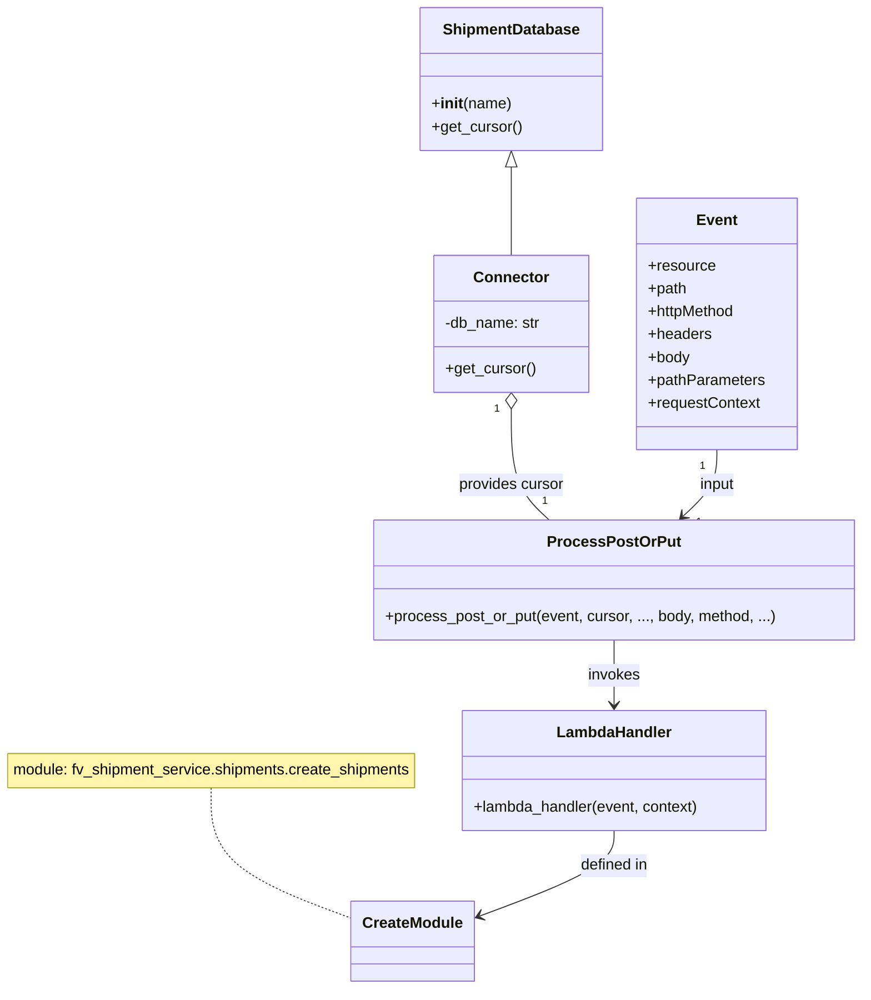

# Diagram: tools/ide_local_testing/localTest/test/shipment/cancelShipment.py


> Auto-generated by Obscura crawlers

## Diagram 1

```mermaid
flowchart LR
  subgraph AWS_Event
    Event[event (AWS API Gateway)]
    EventBody[event.body]
  end
  Event -->|contains| EventBody
  EventBody --> Tender[tender]
  Tender --> Stops[stops (list)]
  Stops --> Stop1[stop: Tilbury]
  Stops --> Stop2[stop: Newark]
  Tender --> Header[header (sender_id, carrier_id, creator_id, shipment_id)]
  Tender --> Reference[reference (list of qualifiers)]
  Event --> PathParams[pathParameters.shipment_id]
  Event --> Headers[headers]
  Event --> RequestContext[requestContext]

  Event -->|invokes| Process[process_post_or_put()]
  Process -->|method| HTTP_METHOD[HTTP Method: POST]
  Process -->|cursor| Cursor[connector.get_cursor()]
  Cursor -->|backed by| ShipmentDB[ShipmentDatabase("createUsers.test")]
  ShipmentDB --> Connector[connector]
  Process -->|calls| Lambda[lambda_handler]
  Lambda --> CreateModule[fv_shipment_service.shipments.create_shipments]
```

> SVG rendering failed for this diagram.

## Diagram 2



### SVG

<svg id="container" width="912.6484375" xmlns="http://www.w3.org/2000/svg" class="classDiagram" height="1038" viewBox="0 0 912.6484375 1038" role="graphics-document document" aria-roledescription="class"><style>#container{font-family:"trebuchet ms",verdana,arial,sans-serif;font-size:16px;fill:#333;}@keyframes edge-animation-frame{from{stroke-dashoffset:0;}}@keyframes dash{to{stroke-dashoffset:0;}}#container .edge-animation-slow{stroke-dasharray:9,5!important;stroke-dashoffset:900;animation:dash 50s linear infinite;stroke-linecap:round;}#container .edge-animation-fast{stroke-dasharray:9,5!important;stroke-dashoffset:900;animation:dash 20s linear infinite;stroke-linecap:round;}#container .error-icon{fill:#552222;}#container .error-text{fill:#552222;stroke:#552222;}#container .edge-thickness-normal{stroke-width:1px;}#container .edge-thickness-thick{stroke-width:3.5px;}#container .edge-pattern-solid{stroke-dasharray:0;}#container .edge-thickness-invisible{stroke-width:0;fill:none;}#container .edge-pattern-dashed{stroke-dasharray:3;}#container .edge-pattern-dotted{stroke-dasharray:2;}#container .marker{fill:#333333;stroke:#333333;}#container .marker.cross{stroke:#333333;}#container svg{font-family:"trebuchet ms",verdana,arial,sans-serif;font-size:16px;}#container p{margin:0;}#container g.classGroup text{fill:#9370DB;stroke:none;font-family:"trebuchet ms",verdana,arial,sans-serif;font-size:10px;}#container g.classGroup text .title{font-weight:bolder;}#container .nodeLabel,#container .edgeLabel{color:#131300;}#container .edgeLabel .label rect{fill:#ECECFF;}#container .label text{fill:#131300;}#container .labelBkg{background:#ECECFF;}#container .edgeLabel .label span{background:#ECECFF;}#container .classTitle{font-weight:bolder;}#container .node rect,#container .node circle,#container .node ellipse,#container .node polygon,#container .node path{fill:#ECECFF;stroke:#9370DB;stroke-width:1px;}#container .divider{stroke:#9370DB;stroke-width:1;}#container g.clickable{cursor:pointer;}#container g.classGroup rect{fill:#ECECFF;stroke:#9370DB;}#container g.classGroup line{stroke:#9370DB;stroke-width:1;}#container .classLabel .box{stroke:none;stroke-width:0;fill:#ECECFF;opacity:0.5;}#container .classLabel .label{fill:#9370DB;font-size:10px;}#container .relation{stroke:#333333;stroke-width:1;fill:none;}#container .dashed-line{stroke-dasharray:3;}#container .dotted-line{stroke-dasharray:1 2;}#container #compositionStart,#container .composition{fill:#333333!important;stroke:#333333!important;stroke-width:1;}#container #compositionEnd,#container .composition{fill:#333333!important;stroke:#333333!important;stroke-width:1;}#container #dependencyStart,#container .dependency{fill:#333333!important;stroke:#333333!important;stroke-width:1;}#container #dependencyStart,#container .dependency{fill:#333333!important;stroke:#333333!important;stroke-width:1;}#container #extensionStart,#container .extension{fill:transparent!important;stroke:#333333!important;stroke-width:1;}#container #extensionEnd,#container .extension{fill:transparent!important;stroke:#333333!important;stroke-width:1;}#container #aggregationStart,#container .aggregation{fill:transparent!important;stroke:#333333!important;stroke-width:1;}#container #aggregationEnd,#container .aggregation{fill:transparent!important;stroke:#333333!important;stroke-width:1;}#container #lollipopStart,#container .lollipop{fill:#ECECFF!important;stroke:#333333!important;stroke-width:1;}#container #lollipopEnd,#container .lollipop{fill:#ECECFF!important;stroke:#333333!important;stroke-width:1;}#container .edgeTerminals{font-size:11px;line-height:initial;}#container .classTitleText{text-anchor:middle;font-size:18px;fill:#333;}#container .label-icon{display:inline-block;height:1em;overflow:visible;vertical-align:-0.125em;}#container .node .label-icon path{fill:currentColor;stroke:revert;stroke-width:revert;}#container :root{--mermaid-font-family:"trebuchet ms",verdana,arial,sans-serif;}</style><g><defs><marker id="container_class-aggregationStart" class="marker aggregation class" refX="18" refY="7" markerWidth="190" markerHeight="240" orient="auto"><path d="M 18,7 L9,13 L1,7 L9,1 Z"></path></marker></defs><defs><marker id="container_class-aggregationEnd" class="marker aggregation class" refX="1" refY="7" markerWidth="20" markerHeight="28" orient="auto"><path d="M 18,7 L9,13 L1,7 L9,1 Z"></path></marker></defs><defs><marker id="container_class-extensionStart" class="marker extension class" refX="18" refY="7" markerWidth="190" markerHeight="240" orient="auto"><path d="M 1,7 L18,13 V 1 Z"></path></marker></defs><defs><marker id="container_class-extensionEnd" class="marker extension class" refX="1" refY="7" markerWidth="20" markerHeight="28" orient="auto"><path d="M 1,1 V 13 L18,7 Z"></path></marker></defs><defs><marker id="container_class-compositionStart" class="marker composition class" refX="18" refY="7" markerWidth="190" markerHeight="240" orient="auto"><path d="M 18,7 L9,13 L1,7 L9,1 Z"></path></marker></defs><defs><marker id="container_class-compositionEnd" class="marker composition class" refX="1" refY="7" markerWidth="20" markerHeight="28" orient="auto"><path d="M 18,7 L9,13 L1,7 L9,1 Z"></path></marker></defs><defs><marker id="container_class-dependencyStart" class="marker dependency class" refX="6" refY="7" markerWidth="190" markerHeight="240" orient="auto"><path d="M 5,7 L9,13 L1,7 L9,1 Z"></path></marker></defs><defs><marker id="container_class-dependencyEnd" class="marker dependency class" refX="13" refY="7" markerWidth="20" markerHeight="28" orient="auto"><path d="M 18,7 L9,13 L14,7 L9,1 Z"></path></marker></defs><defs><marker id="container_class-lollipopStart" class="marker lollipop class" refX="13" refY="7" markerWidth="190" markerHeight="240" orient="auto"><circle stroke="black" fill="transparent" cx="7" cy="7" r="6"></circle></marker></defs><defs><marker id="container_class-lollipopEnd" class="marker lollipop class" refX="1" refY="7" markerWidth="190" markerHeight="240" orient="auto"><circle stroke="black" fill="transparent" cx="7" cy="7" r="6"></circle></marker></defs><g class="root"><g class="clusters"></g><g class="edgePaths"><path d="M226.063,827L226.063,840.667C226.063,854.333,226.063,881.667,251.395,904.657C276.727,927.648,327.391,946.296,352.723,955.62L378.055,964.944" id="edgeNote1" class="edge-thickness-normal edge-pattern-dotted relation" style="fill: none;;;fill: none" data-edge="true" data-et="edge" data-id="edgeNote1" data-points="W3sieCI6MjI2LjA2MjUsInkiOjgyN30seyJ4IjoyMjYuMDYyNSwieSI6OTA5fSx7IngiOjM3OC4wNTQ2ODc1LCJ5Ijo5NjQuOTQzODM1NzY2MDI0OH1d"></path><path d="M547.85,175.25L547.85,176.542C547.85,177.833,547.85,180.417,547.85,195.875C547.85,211.333,547.85,239.667,547.85,253.833L547.85,268" id="id_ShipmentDatabase_Connector_1" class="edge-thickness-normal edge-pattern-solid relation" style=";;;" data-edge="true" data-et="edge" data-id="id_ShipmentDatabase_Connector_1" data-points="W3sieCI6NTQ3Ljg0OTYwOTM3NSwieSI6MTU4fSx7IngiOjU0Ny44NDk2MDkzNzUsInkiOjE4M30seyJ4Ijo1NDcuODQ5NjA5Mzc1LCJ5IjoyNjh9XQ==" marker-start="url(#container_class-extensionStart)"></path><path d="M547.85,429.25L547.85,442.542C547.85,455.833,547.85,482.417,554.477,501.875C561.105,521.333,574.361,533.667,580.989,539.833L587.617,546" id="id_Connector_ProcessPostOrPut_2" class="edge-thickness-normal edge-pattern-solid relation" style=";;;" data-edge="true" data-et="edge" data-id="id_Connector_ProcessPostOrPut_2" data-points="W3sieCI6NTQ3Ljg0OTYwOTM3NSwieSI6NDEyfSx7IngiOjU0Ny44NDk2MDkzNzUsInkiOjUwOX0seyJ4Ijo1ODcuNjE2NjYwMTU2MjUsInkiOjU0Nn1d" marker-start="url(#container_class-aggregationStart)"></path><path d="M655.328,672L655.328,678.167C655.328,684.333,655.328,696.667,655.328,708C655.328,719.333,655.328,729.667,655.328,734.833L655.328,740" id="id_ProcessPostOrPut_LambdaHandler_3" class="edge-thickness-normal edge-pattern-solid relation" style=";;;" data-edge="true" data-et="edge" data-id="id_ProcessPostOrPut_LambdaHandler_3" data-points="W3sieCI6NjU1LjMyODEyNSwieSI6NjcyfSx7IngiOjY1NS4zMjgxMjUsInkiOjcwOX0seyJ4Ijo2NTUuMzI4MTI1LCJ5Ijo3NDZ9XQ==" marker-end="url(#container_class-dependencyEnd)"></path><path d="M762.807,472L762.807,478.167C762.807,484.333,762.807,496.667,756.911,508.319C751.015,519.971,739.224,530.942,733.328,536.427L727.432,541.913" id="id_Event_ProcessPostOrPut_4" class="edge-thickness-normal edge-pattern-solid relation" style=";;;" data-edge="true" data-et="edge" data-id="id_Event_ProcessPostOrPut_4" data-points="W3sieCI6NzYyLjgwNjY0MDYyNSwieSI6NDcyfSx7IngiOjc2Mi44MDY2NDA2MjUsInkiOjUwOX0seyJ4Ijo3MjMuMDM5NTg5ODQzNzUsInkiOjU0Nn1d" marker-end="url(#container_class-dependencyEnd)"></path><path d="M655.328,872L655.328,878.167C655.328,884.333,655.328,896.667,630.935,911.812C606.541,926.957,557.754,944.914,533.36,953.893L508.967,962.871" id="id_LambdaHandler_CreateModule_5" class="edge-thickness-normal edge-pattern-solid relation" style=";;;" data-edge="true" data-et="edge" data-id="id_LambdaHandler_CreateModule_5" data-points="W3sieCI6NjU1LjMyODEyNSwieSI6ODcyfSx7IngiOjY1NS4zMjgxMjUsInkiOjkwOX0seyJ4Ijo1MDMuMzM1OTM3NSwieSI6OTY0Ljk0MzgzNTc2NjAyNDh9XQ==" marker-end="url(#container_class-dependencyEnd)"></path></g><g class="edgeLabels"><g class="edgeLabel"><g class="label" data-id="edgeNote1" transform="translate(0, 0)"><foreignObject width="0" height="0"><div xmlns="http://www.w3.org/1999/xhtml" class="labelBkg" style="display: table-cell; white-space: nowrap; line-height: 1.5; max-width: 200px; text-align: center;"><span class="edgeLabel"></span></div></foreignObject></g></g><g class="edgeLabel"><g class="label" data-id="id_ShipmentDatabase_Connector_1" transform="translate(0, 0)"><foreignObject width="0" height="0"><div xmlns="http://www.w3.org/1999/xhtml" class="labelBkg" style="display: table-cell; white-space: nowrap; line-height: 1.5; max-width: 200px; text-align: center;"><span class="edgeLabel"></span></div></foreignObject></g></g><g class="edgeLabel" transform="translate(547.849609375, 509)"><g class="label" data-id="id_Connector_ProcessPostOrPut_2" transform="translate(-56.296875, -12)"><foreignObject width="112.59375" height="24"><div xmlns="http://www.w3.org/1999/xhtml" class="labelBkg" style="display: table-cell; white-space: nowrap; line-height: 1.5; max-width: 200px; text-align: center;"><span class="edgeLabel"><p>provides cursor</p></span></div></foreignObject></g></g><g class="edgeLabel" transform="translate(655.328125, 709)"><g class="label" data-id="id_ProcessPostOrPut_LambdaHandler_3" transform="translate(-27.5859375, -12)"><foreignObject width="55.171875" height="24"><div xmlns="http://www.w3.org/1999/xhtml" class="labelBkg" style="display: table-cell; white-space: nowrap; line-height: 1.5; max-width: 200px; text-align: center;"><span class="edgeLabel"><p>invokes</p></span></div></foreignObject></g></g><g class="edgeLabel" transform="translate(762.806640625, 509)"><g class="label" data-id="id_Event_ProcessPostOrPut_4" transform="translate(-19.2421875, -12)"><foreignObject width="38.484375" height="24"><div xmlns="http://www.w3.org/1999/xhtml" class="labelBkg" style="display: table-cell; white-space: nowrap; line-height: 1.5; max-width: 200px; text-align: center;"><span class="edgeLabel"><p>input</p></span></div></foreignObject></g></g><g class="edgeLabel" transform="translate(655.328125, 909)"><g class="label" data-id="id_LambdaHandler_CreateModule_5" transform="translate(-36.640625, -12)"><foreignObject width="73.28125" height="24"><div xmlns="http://www.w3.org/1999/xhtml" class="labelBkg" style="display: table-cell; white-space: nowrap; line-height: 1.5; max-width: 200px; text-align: center;"><span class="edgeLabel"><p>defined in</p></span></div></foreignObject></g></g><g class="edgeTerminals" transform="translate(532.8496096875, 429.50000026785716)"><g class="inner" transform="translate(0, 0)"><foreignObject style="width: 9px; height: 12px;"><div xmlns="http://www.w3.org/1999/xhtml" style="display: inline-block; padding-right: 1px; white-space: nowrap;"><span class="edgeLabel">1</span></div></foreignObject></g></g><g class="edgeTerminals" transform="translate(747.8066403125, 489.49999973214284)"><g class="inner" transform="translate(0, 0)"><foreignObject style="width: 9px; height: 12px;"><div xmlns="http://www.w3.org/1999/xhtml" style="display: inline-block; padding-right: 1px; white-space: nowrap;"><span class="edgeLabel">1</span></div></foreignObject></g></g><g class="edgeTerminals" transform="translate(580.0222332508504, 518.0976217367092)"><g class="inner" transform="translate(0, 0)"></g><foreignObject style="width: 9px; height: 12px;"><div xmlns="http://www.w3.org/1999/xhtml" style="display: inline-block; padding-right: 1px; white-space: nowrap;"><span class="edgeLabel">1</span></div></foreignObject></g><g class="edgeTerminals" transform="translate(741.0693230946006, 540.0611882632907)"><g class="inner" transform="translate(0, 0)"></g><foreignObject style="width: 9px; height: 12px;"><div xmlns="http://www.w3.org/1999/xhtml" style="display: inline-block; padding-right: 1px; white-space: nowrap;"><span class="edgeLabel">1</span></div></foreignObject></g></g><g class="nodes"><g class="node default" id="classId-ShipmentDatabase-0" transform="translate(547.849609375, 83)"><g class="basic label-container"><path d="M-93.95703125 -75 L93.95703125 -75 L93.95703125 75 L-93.95703125 75" stroke="none" stroke-width="0" fill="#ECECFF" style=""></path><path d="M-93.95703125 -75 C-22.733213439966022 -75, 48.490604370067956 -75, 93.95703125 -75 M-93.95703125 -75 C-47.03922719451178 -75, -0.1214231390235625 -75, 93.95703125 -75 M93.95703125 -75 C93.95703125 -28.006304039081158, 93.95703125 18.987391921837684, 93.95703125 75 M93.95703125 -75 C93.95703125 -22.008894117022507, 93.95703125 30.982211765954986, 93.95703125 75 M93.95703125 75 C33.82310434853695 75, -26.310822552926098 75, -93.95703125 75 M93.95703125 75 C34.24811341270494 75, -25.460804424590123 75, -93.95703125 75 M-93.95703125 75 C-93.95703125 16.343808348769493, -93.95703125 -42.312383302461015, -93.95703125 -75 M-93.95703125 75 C-93.95703125 39.8571508583075, -93.95703125 4.714301716614997, -93.95703125 -75" stroke="#9370DB" stroke-width="1.3" fill="none" stroke-dasharray="0 0" style=""></path></g><g class="annotation-group text" transform="translate(0, -51)"></g><g class="label-group text" transform="translate(-69.2734375, -51)"><g class="label" style="font-weight: bolder" transform="translate(0,-12)"><foreignObject width="138.546875" height="24"><div xmlns="http://www.w3.org/1999/xhtml" style="display: table-cell; white-space: nowrap; line-height: 1.5; max-width: 187px; text-align: center;"><span class="nodeLabel markdown-node-label" style=""><p>ShipmentDatabase</p></span></div></foreignObject></g></g><g class="members-group text" transform="translate(-81.95703125, -3)"></g><g class="methods-group text" transform="translate(-81.95703125, 27)"><g class="label" style="" transform="translate(0,-12)"><foreignObject width="83.3125" height="24"><div xmlns="http://www.w3.org/1999/xhtml" style="display: table-cell; white-space: nowrap; line-height: 1.5; max-width: 172px; text-align: center;"><span class="nodeLabel markdown-node-label" style=""><p>+<strong>init</strong>(name)</p></span></div></foreignObject></g><g class="label" style="" transform="translate(0,12)"><foreignObject width="94.640625" height="24"><div xmlns="http://www.w3.org/1999/xhtml" style="display: table-cell; white-space: nowrap; line-height: 1.5; max-width: 152px; text-align: center;"><span class="nodeLabel markdown-node-label" style=""><p>+get_cursor()</p></span></div></foreignObject></g></g><g class="divider" style=""><path d="M-93.95703125 -27 C-32.459579040001906 -27, 29.03787316999619 -27, 93.95703125 -27 M-93.95703125 -27 C-54.22848916248983 -27, -14.499947074979659 -27, 93.95703125 -27" stroke="#9370DB" stroke-width="1.3" fill="none" stroke-dasharray="0 0" style=""></path></g><g class="divider" style=""><path d="M-93.95703125 -3 C-22.516275943259743 -3, 48.924479363480515 -3, 93.95703125 -3 M-93.95703125 -3 C-32.07707224199816 -3, 29.80288676600368 -3, 93.95703125 -3" stroke="#9370DB" stroke-width="1.3" fill="none" stroke-dasharray="0 0" style=""></path></g></g><g class="node default" id="classId-Connector-1" transform="translate(547.849609375, 340)"><g class="basic label-container"><path d="M-81.484375 -72 L81.484375 -72 L81.484375 72 L-81.484375 72" stroke="none" stroke-width="0" fill="#ECECFF" style=""></path><path d="M-81.484375 -72 C-46.58231995481896 -72, -11.680264909637927 -72, 81.484375 -72 M-81.484375 -72 C-32.4072522395407 -72, 16.669870520918593 -72, 81.484375 -72 M81.484375 -72 C81.484375 -23.191379947435003, 81.484375 25.617240105129994, 81.484375 72 M81.484375 -72 C81.484375 -40.06280785917034, 81.484375 -8.125615718340683, 81.484375 72 M81.484375 72 C44.65585583915825 72, 7.827336678316499 72, -81.484375 72 M81.484375 72 C26.262666579265463 72, -28.959041841469073 72, -81.484375 72 M-81.484375 72 C-81.484375 42.746985403264226, -81.484375 13.493970806528452, -81.484375 -72 M-81.484375 72 C-81.484375 38.227262127945274, -81.484375 4.454524255890547, -81.484375 -72" stroke="#9370DB" stroke-width="1.3" fill="none" stroke-dasharray="0 0" style=""></path></g><g class="annotation-group text" transform="translate(0, -48)"></g><g class="label-group text" transform="translate(-37.421875, -48)"><g class="label" style="font-weight: bolder" transform="translate(0,-12)"><foreignObject width="74.84375" height="24"><div xmlns="http://www.w3.org/1999/xhtml" style="display: table-cell; white-space: nowrap; line-height: 1.5; max-width: 125px; text-align: center;"><span class="nodeLabel markdown-node-label" style=""><p>Connector</p></span></div></foreignObject></g></g><g class="members-group text" transform="translate(-69.484375, 0)"><g class="label" style="" transform="translate(0,-12)"><foreignObject width="101.546875" height="24"><div xmlns="http://www.w3.org/1999/xhtml" style="display: table-cell; white-space: nowrap; line-height: 1.5; max-width: 160px; text-align: center;"><span class="nodeLabel markdown-node-label" style=""><p>-db_name: str</p></span></div></foreignObject></g></g><g class="methods-group text" transform="translate(-69.484375, 48)"><g class="label" style="" transform="translate(0,-12)"><foreignObject width="94.640625" height="24"><div xmlns="http://www.w3.org/1999/xhtml" style="display: table-cell; white-space: nowrap; line-height: 1.5; max-width: 152px; text-align: center;"><span class="nodeLabel markdown-node-label" style=""><p>+get_cursor()</p></span></div></foreignObject></g></g><g class="divider" style=""><path d="M-81.484375 -24 C-24.687290553432597 -24, 32.10979389313481 -24, 81.484375 -24 M-81.484375 -24 C-47.32376719032892 -24, -13.163159380657845 -24, 81.484375 -24" stroke="#9370DB" stroke-width="1.3" fill="none" stroke-dasharray="0 0" style=""></path></g><g class="divider" style=""><path d="M-81.484375 24 C-20.59237718416042 24, 40.29962063167916 24, 81.484375 24 M-81.484375 24 C-23.15350047583032 24, 35.17737404833936 24, 81.484375 24" stroke="#9370DB" stroke-width="1.3" fill="none" stroke-dasharray="0 0" style=""></path></g></g><g class="node default" id="classId-ProcessPostOrPut-2" transform="translate(655.328125, 609)"><g class="basic label-container"><path d="M-249.3203125 -63 L249.3203125 -63 L249.3203125 63 L-249.3203125 63" stroke="none" stroke-width="0" fill="#ECECFF" style=""></path><path d="M-249.3203125 -63 C-61.736557978982376 -63, 125.84719654203525 -63, 249.3203125 -63 M-249.3203125 -63 C-81.49279749100037 -63, 86.33471751799925 -63, 249.3203125 -63 M249.3203125 -63 C249.3203125 -34.88062683491942, 249.3203125 -6.761253669838837, 249.3203125 63 M249.3203125 -63 C249.3203125 -26.86230734393323, 249.3203125 9.275385312133537, 249.3203125 63 M249.3203125 63 C107.38200242589866 63, -34.556307648202676 63, -249.3203125 63 M249.3203125 63 C80.5960706055622 63, -88.12817128887559 63, -249.3203125 63 M-249.3203125 63 C-249.3203125 31.78191623279516, -249.3203125 0.5638324655903233, -249.3203125 -63 M-249.3203125 63 C-249.3203125 37.15713543103816, -249.3203125 11.314270862076306, -249.3203125 -63" stroke="#9370DB" stroke-width="1.3" fill="none" stroke-dasharray="0 0" style=""></path></g><g class="annotation-group text" transform="translate(0, -39)"></g><g class="label-group text" transform="translate(-65.21875, -39)"><g class="label" style="font-weight: bolder" transform="translate(0,-12)"><foreignObject width="130.4375" height="24"><div xmlns="http://www.w3.org/1999/xhtml" style="display: table-cell; white-space: nowrap; line-height: 1.5; max-width: 178px; text-align: center;"><span class="nodeLabel markdown-node-label" style=""><p>ProcessPostOrPut</p></span></div></foreignObject></g></g><g class="members-group text" transform="translate(-237.3203125, 9)"></g><g class="methods-group text" transform="translate(-237.3203125, 39)"><g class="label" style="" transform="translate(0,-12)"><foreignObject width="409.421875" height="24"><div xmlns="http://www.w3.org/1999/xhtml" style="display: table-cell; white-space: nowrap; line-height: 1.5; max-width: 467px; text-align: center;"><span class="nodeLabel markdown-node-label" style=""><p>+process_post_or_put(event, cursor, ..., body, method, ...)</p></span></div></foreignObject></g></g><g class="divider" style=""><path d="M-249.3203125 -15 C-147.89594117560222 -15, -46.471569851204436 -15, 249.3203125 -15 M-249.3203125 -15 C-148.97208125951835 -15, -48.62385001903672 -15, 249.3203125 -15" stroke="#9370DB" stroke-width="1.3" fill="none" stroke-dasharray="0 0" style=""></path></g><g class="divider" style=""><path d="M-249.3203125 9 C-145.56618556089464 9, -41.81205862178928 9, 249.3203125 9 M-249.3203125 9 C-65.69757617042137 9, 117.92516015915726 9, 249.3203125 9" stroke="#9370DB" stroke-width="1.3" fill="none" stroke-dasharray="0 0" style=""></path></g></g><g class="node default" id="classId-LambdaHandler-3" transform="translate(655.328125, 809)"><g class="basic label-container"><path d="M-161.203125 -63 L161.203125 -63 L161.203125 63 L-161.203125 63" stroke="none" stroke-width="0" fill="#ECECFF" style=""></path><path d="M-161.203125 -63 C-90.1689531671801 -63, -19.134781334360213 -63, 161.203125 -63 M-161.203125 -63 C-72.5430675822698 -63, 16.1169898354604 -63, 161.203125 -63 M161.203125 -63 C161.203125 -31.237779661619058, 161.203125 0.5244406767618841, 161.203125 63 M161.203125 -63 C161.203125 -24.82365746831669, 161.203125 13.352685063366621, 161.203125 63 M161.203125 63 C92.18555396786235 63, 23.167982935724694 63, -161.203125 63 M161.203125 63 C48.41717464761294 63, -64.36877570477412 63, -161.203125 63 M-161.203125 63 C-161.203125 31.8809811444317, -161.203125 0.7619622888634012, -161.203125 -63 M-161.203125 63 C-161.203125 27.6792578722211, -161.203125 -7.641484255557799, -161.203125 -63" stroke="#9370DB" stroke-width="1.3" fill="none" stroke-dasharray="0 0" style=""></path></g><g class="annotation-group text" transform="translate(0, -39)"></g><g class="label-group text" transform="translate(-58.21875, -39)"><g class="label" style="font-weight: bolder" transform="translate(0,-12)"><foreignObject width="116.4375" height="24"><div xmlns="http://www.w3.org/1999/xhtml" style="display: table-cell; white-space: nowrap; line-height: 1.5; max-width: 167px; text-align: center;"><span class="nodeLabel markdown-node-label" style=""><p>LambdaHandler</p></span></div></foreignObject></g></g><g class="members-group text" transform="translate(-149.203125, 9)"></g><g class="methods-group text" transform="translate(-149.203125, 39)"><g class="label" style="" transform="translate(0,-12)"><foreignObject width="240.1875" height="24"><div xmlns="http://www.w3.org/1999/xhtml" style="display: table-cell; white-space: nowrap; line-height: 1.5; max-width: 298px; text-align: center;"><span class="nodeLabel markdown-node-label" style=""><p>+lambda_handler(event, context)</p></span></div></foreignObject></g></g><g class="divider" style=""><path d="M-161.203125 -15 C-41.135745526546614 -15, 78.93163394690677 -15, 161.203125 -15 M-161.203125 -15 C-94.99828476344632 -15, -28.793444526892642 -15, 161.203125 -15" stroke="#9370DB" stroke-width="1.3" fill="none" stroke-dasharray="0 0" style=""></path></g><g class="divider" style=""><path d="M-161.203125 9 C-73.82367887001138 9, 13.555767259977245 9, 161.203125 9 M-161.203125 9 C-51.368859221043394 9, 58.46540655791321 9, 161.203125 9" stroke="#9370DB" stroke-width="1.3" fill="none" stroke-dasharray="0 0" style=""></path></g></g><g class="node default" id="classId-Event-4" transform="translate(762.806640625, 340)"><g class="basic label-container"><path d="M-83.47265625 -132 L83.47265625 -132 L83.47265625 132 L-83.47265625 132" stroke="none" stroke-width="0" fill="#ECECFF" style=""></path><path d="M-83.47265625 -132 C-17.349273223649035 -132, 48.77410980270193 -132, 83.47265625 -132 M-83.47265625 -132 C-29.76813356005846 -132, 23.936389129883082 -132, 83.47265625 -132 M83.47265625 -132 C83.47265625 -67.92792309244724, 83.47265625 -3.8558461848944887, 83.47265625 132 M83.47265625 -132 C83.47265625 -35.03781584146732, 83.47265625 61.92436831706536, 83.47265625 132 M83.47265625 132 C22.19908738007277 132, -39.07448148985446 132, -83.47265625 132 M83.47265625 132 C30.6445357872976 132, -22.183584675404802 132, -83.47265625 132 M-83.47265625 132 C-83.47265625 76.45738376396115, -83.47265625 20.914767527922294, -83.47265625 -132 M-83.47265625 132 C-83.47265625 46.279467385458176, -83.47265625 -39.44106522908365, -83.47265625 -132" stroke="#9370DB" stroke-width="1.3" fill="none" stroke-dasharray="0 0" style=""></path></g><g class="annotation-group text" transform="translate(0, -108)"></g><g class="label-group text" transform="translate(-20.2109375, -108)"><g class="label" style="font-weight: bolder" transform="translate(0,-12)"><foreignObject width="40.421875" height="24"><div xmlns="http://www.w3.org/1999/xhtml" style="display: table-cell; white-space: nowrap; line-height: 1.5; max-width: 90px; text-align: center;"><span class="nodeLabel markdown-node-label" style=""><p>Event</p></span></div></foreignObject></g></g><g class="members-group text" transform="translate(-71.47265625, -60)"><g class="label" style="" transform="translate(0,-12)"><foreignObject width="70.28125" height="24"><div xmlns="http://www.w3.org/1999/xhtml" style="display: table-cell; white-space: nowrap; line-height: 1.5; max-width: 128px; text-align: center;"><span class="nodeLabel markdown-node-label" style=""><p>+resource</p></span></div></foreignObject></g><g class="label" style="" transform="translate(0,12)"><foreignObject width="41.1875" height="24"><div xmlns="http://www.w3.org/1999/xhtml" style="display: table-cell; white-space: nowrap; line-height: 1.5; max-width: 99px; text-align: center;"><span class="nodeLabel markdown-node-label" style=""><p>+path</p></span></div></foreignObject></g><g class="label" style="" transform="translate(0,36)"><foreignObject width="93.65625" height="24"><div xmlns="http://www.w3.org/1999/xhtml" style="display: table-cell; white-space: nowrap; line-height: 1.5; max-width: 151px; text-align: center;"><span class="nodeLabel markdown-node-label" style=""><p>+httpMethod</p></span></div></foreignObject></g><g class="label" style="" transform="translate(0,60)"><foreignObject width="66.328125" height="24"><div xmlns="http://www.w3.org/1999/xhtml" style="display: table-cell; white-space: nowrap; line-height: 1.5; max-width: 124px; text-align: center;"><span class="nodeLabel markdown-node-label" style=""><p>+headers</p></span></div></foreignObject></g><g class="label" style="" transform="translate(0,84)"><foreignObject width="44.28125" height="24"><div xmlns="http://www.w3.org/1999/xhtml" style="display: table-cell; white-space: nowrap; line-height: 1.5; max-width: 102px; text-align: center;"><span class="nodeLabel markdown-node-label" style=""><p>+body</p></span></div></foreignObject></g><g class="label" style="" transform="translate(0,108)"><foreignObject width="122.734375" height="24"><div xmlns="http://www.w3.org/1999/xhtml" style="display: table-cell; white-space: nowrap; line-height: 1.5; max-width: 180px; text-align: center;"><span class="nodeLabel markdown-node-label" style=""><p>+pathParameters</p></span></div></foreignObject></g><g class="label" style="" transform="translate(0,132)"><foreignObject width="118.265625" height="24"><div xmlns="http://www.w3.org/1999/xhtml" style="display: table-cell; white-space: nowrap; line-height: 1.5; max-width: 176px; text-align: center;"><span class="nodeLabel markdown-node-label" style=""><p>+requestContext</p></span></div></foreignObject></g></g><g class="methods-group text" transform="translate(-71.47265625, 132)"></g><g class="divider" style=""><path d="M-83.47265625 -84 C-28.661830589058454 -84, 26.148995071883093 -84, 83.47265625 -84 M-83.47265625 -84 C-38.16424388660846 -84, 7.144168476783079 -84, 83.47265625 -84" stroke="#9370DB" stroke-width="1.3" fill="none" stroke-dasharray="0 0" style=""></path></g><g class="divider" style=""><path d="M-83.47265625 108 C-24.89803030065484 108, 33.67659564869032 108, 83.47265625 108 M-83.47265625 108 C-43.61704521378178 108, -3.761434177563558 108, 83.47265625 108" stroke="#9370DB" stroke-width="1.3" fill="none" stroke-dasharray="0 0" style=""></path></g></g><g class="node default" id="classId-CreateModule-5" transform="translate(440.6953125, 988)"><g class="basic label-container"><path d="M-62.640625 -42 L62.640625 -42 L62.640625 42 L-62.640625 42" stroke="none" stroke-width="0" fill="#ECECFF" style=""></path><path d="M-62.640625 -42 C-33.322663723988484 -42, -4.004702447976975 -42, 62.640625 -42 M-62.640625 -42 C-19.641151710232386 -42, 23.35832157953523 -42, 62.640625 -42 M62.640625 -42 C62.640625 -24.313640760668456, 62.640625 -6.627281521336911, 62.640625 42 M62.640625 -42 C62.640625 -16.304358292477545, 62.640625 9.39128341504491, 62.640625 42 M62.640625 42 C24.110751188454728 42, -14.419122623090544 42, -62.640625 42 M62.640625 42 C12.910863730876201 42, -36.8188975382476 42, -62.640625 42 M-62.640625 42 C-62.640625 21.062539157744343, -62.640625 0.1250783154886861, -62.640625 -42 M-62.640625 42 C-62.640625 12.223225144926438, -62.640625 -17.553549710147124, -62.640625 -42" stroke="#9370DB" stroke-width="1.3" fill="none" stroke-dasharray="0 0" style=""></path></g><g class="annotation-group text" transform="translate(0, -18)"></g><g class="label-group text" transform="translate(-50.640625, -18)"><g class="label" style="font-weight: bolder" transform="translate(0,-12)"><foreignObject width="101.28125" height="24"><div xmlns="http://www.w3.org/1999/xhtml" style="display: table-cell; white-space: nowrap; line-height: 1.5; max-width: 150px; text-align: center;"><span class="nodeLabel markdown-node-label" style=""><p>CreateModule</p></span></div></foreignObject></g></g><g class="members-group text" transform="translate(-50.640625, 30)"></g><g class="methods-group text" transform="translate(-50.640625, 60)"></g><g class="divider" style=""><path d="M-62.640625 6 C-24.658996158972066 6, 13.322632682055868 6, 62.640625 6 M-62.640625 6 C-17.352669461492297 6, 27.935286077015405 6, 62.640625 6" stroke="#9370DB" stroke-width="1.3" fill="none" stroke-dasharray="0 0" style=""></path></g><g class="divider" style=""><path d="M-62.640625 24 C-32.95082399483998 24, -3.261022989679951 24, 62.640625 24 M-62.640625 24 C-27.67542124638795 24, 7.289782507224103 24, 62.640625 24" stroke="#9370DB" stroke-width="1.3" fill="none" stroke-dasharray="0 0" style=""></path></g></g><g class="node undefined" id="note0" transform="translate(226.0625, 809)"><g class="basic label-container"><path d="M-218.0625 -18 L218.0625 -18 L218.0625 18 L-218.0625 18" stroke="none" stroke-width="0" fill="#fff5ad" style="fill:#fff5ad !important;stroke:#aaaa33 !important"></path><path d="M-218.0625 -18 C-78.197666959341 -18, 61.66716608131799 -18, 218.0625 -18 M-218.0625 -18 C-50.67631301298695 -18, 116.7098739740261 -18, 218.0625 -18 M218.0625 -18 C218.0625 -8.170295091867159, 218.0625 1.6594098162656827, 218.0625 18 M218.0625 -18 C218.0625 -5.30137814878079, 218.0625 7.39724370243842, 218.0625 18 M218.0625 18 C100.02435920955566 18, -18.01378158088869 18, -218.0625 18 M218.0625 18 C104.82771786384743 18, -8.40706427230515 18, -218.0625 18 M-218.0625 18 C-218.0625 8.086012153878679, -218.0625 -1.8279756922426422, -218.0625 -18 M-218.0625 18 C-218.0625 6.353940797870431, -218.0625 -5.2921184042591385, -218.0625 -18" stroke="#aaaa33" stroke-width="1.3" fill="none" stroke-dasharray="0 0" style="fill:#fff5ad !important;stroke:#aaaa33 !important"></path></g><g class="label" style="text-align:left !important;white-space:nowrap !important" transform="translate(-212.0625, -12)"><rect></rect><foreignObject width="424.125" height="24"><div style="text-align: center; white-space: break-spaces; display: table; line-height: 1.5; max-width: 200px; width: 200px;" xmlns="http://www.w3.org/1999/xhtml"><span style="text-align:left !important;white-space:nowrap !important" class="nodeLabel"><p>module: fv_shipment_service.shipments.create_shipments</p></span></div></foreignObject></g></g></g></g></g></svg>
