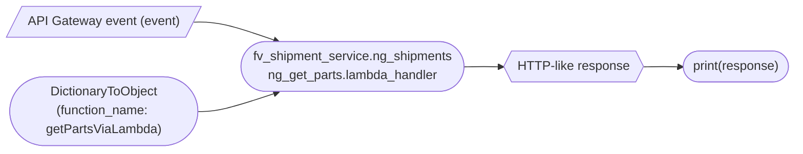

# Diagram: tools/ide_local_testing/localTest/test/shipment/getNgPartsViaLambda.py

> Auto-generated by Obscura crawlers

## Mermaid

### SVG

<svg id="container" width="1332.1385498046875" xmlns="http://www.w3.org/2000/svg" class="flowchart" height="168" viewBox="0 0 1332.1385498046875 168" role="graphics-document document" aria-roledescription="flowchart-v2"><g><marker id="container_flowchart-v2-pointEnd" class="marker flowchart-v2" viewBox="0 0 10 10" refX="5" refY="5" markerUnits="userSpaceOnUse" markerWidth="8" markerHeight="8" orient="auto"><path d="M 0 0 L 10 5 L 0 10 z" class="arrowMarkerPath" style="stroke-width: 1; stroke-dasharray: 1, 0;"></path></marker><marker id="container_flowchart-v2-pointStart" class="marker flowchart-v2" viewBox="0 0 10 10" refX="4.5" refY="5" markerUnits="userSpaceOnUse" markerWidth="8" markerHeight="8" orient="auto"><path d="M 0 5 L 10 10 L 10 0 z" class="arrowMarkerPath" style="stroke-width: 1; stroke-dasharray: 1, 0;"></path></marker><marker id="container_flowchart-v2-circleEnd" class="marker flowchart-v2" viewBox="0 0 10 10" refX="11" refY="5" markerUnits="userSpaceOnUse" markerWidth="11" markerHeight="11" orient="auto"><circle cx="5" cy="5" r="5" class="arrowMarkerPath" style="stroke-width: 1; stroke-dasharray: 1, 0;"></circle></marker><marker id="container_flowchart-v2-circleStart" class="marker flowchart-v2" viewBox="0 0 10 10" refX="-1" refY="5" markerUnits="userSpaceOnUse" markerWidth="11" markerHeight="11" orient="auto"><circle cx="5" cy="5" r="5" class="arrowMarkerPath" style="stroke-width: 1; stroke-dasharray: 1, 0;"></circle></marker><marker id="container_flowchart-v2-crossEnd" class="marker cross flowchart-v2" viewBox="0 0 11 11" refX="12" refY="5.2" markerUnits="userSpaceOnUse" markerWidth="11" markerHeight="11" orient="auto"><path d="M 1,1 l 9,9 M 10,1 l -9,9" class="arrowMarkerPath" style="stroke-width: 2; stroke-dasharray: 1, 0;"></path></marker><marker id="container_flowchart-v2-crossStart" class="marker cross flowchart-v2" viewBox="0 0 11 11" refX="-1" refY="5.2" markerUnits="userSpaceOnUse" markerWidth="11" markerHeight="11" orient="auto"><path d="M 1,1 l 9,9 M 10,1 l -9,9" class="arrowMarkerPath" style="stroke-width: 2; stroke-dasharray: 1, 0;"></path></marker><g class="root"><g class="clusters"></g><g class="edgePaths"><path d="M273.937,28L285.239,27.917C296.541,27.833,319.145,27.667,358.735,32.714C398.325,37.762,454.902,48.024,483.19,53.155L511.478,58.286" id="L_Event_GetParts_0" class="edge-thickness-normal edge-pattern-solid edge-thickness-normal edge-pattern-solid flowchart-link" style=";" data-edge="true" data-et="edge" data-id="L_Event_GetParts_0" data-points="W3sieCI6MjczLjkzNjkzNTQyNDgwNDcsInkiOjI4fSx7IngiOjM0MS43NDg4NzA4NDk2MDk0LCJ5IjoyNy41fSx7IngiOjUxNS40MTM5ODI0MjkxMjY3LCJ5Ijo1OS4wMDAwMDAwMDAwMDAwMX1d" marker-end="url(#container_flowchart-v2-pointEnd)"></path><path d="M317.249,129L321.332,128.917C325.416,128.833,333.582,128.667,365.953,123.615C398.324,118.564,454.899,108.628,483.187,103.66L511.474,98.692" id="L_DTO_GetParts_0" class="edge-thickness-normal edge-pattern-solid edge-thickness-normal edge-pattern-solid flowchart-link" style=";" data-edge="true" data-et="edge" data-id="L_DTO_GetParts_0" data-points="W3sieCI6MzE3LjI0ODg4MTYyMDY0MjcsInkiOjEyOX0seyJ4IjozNDEuNzQ4ODcwODQ5NjA5NCwieSI6MTI4LjV9LHsieCI6NTE1LjQxMzk4MjQyOTEyNjcsInkiOjk4fV0=" marker-end="url(#container_flowchart-v2-pointEnd)"></path><path d="M881.432,78.5L885.515,78.417C889.599,78.333,897.765,78.167,905.432,78.154C913.099,78.141,920.266,78.281,923.849,78.351L927.433,78.422" id="L_GetParts_Response_0" class="edge-thickness-normal edge-pattern-solid edge-thickness-normal edge-pattern-solid flowchart-link" style=";" data-edge="true" data-et="edge" data-id="L_GetParts_Response_0" data-points="W3sieCI6ODgxLjQzMTk1ODI4MTQzNTUsInkiOjc4LjUwMDAwMDAwMDAwMDAxfSx7IngiOjkwNS45MzE5NzYzMTgzNTk0LCJ5Ijo3OH0seyJ4Ijo5MzEuNDMxOTc2MzE4MzU5NCwieSI6NzguNX1d" marker-end="url(#container_flowchart-v2-pointEnd)"></path><path d="M1137.877,78.5L1141.961,78.417C1146.044,78.333,1154.211,78.167,1161.877,78.154C1169.544,78.141,1176.711,78.281,1180.295,78.351L1183.878,78.422" id="L_Response_Print_0" class="edge-thickness-normal edge-pattern-solid edge-thickness-normal edge-pattern-solid flowchart-link" style=";" data-edge="true" data-et="edge" data-id="L_Response_Print_0" data-points="W3sieCI6MTEzNy44NzcyODg4MTgzNTk0LCJ5Ijo3OC41fSx7IngiOjExNjIuMzc3Mjg4ODE4MzU5NCwieSI6Nzh9LHsieCI6MTE4Ny44NzcyODg4MTgzNjQ0LCJ5Ijo3OC41MDAwMDAwMDAwMDAwMX1d" marker-end="url(#container_flowchart-v2-pointEnd)"></path></g><g class="edgeLabels"><g class="edgeLabel"><g class="label" data-id="L_Event_GetParts_0" transform="translate(0, 0)"><foreignObject width="0" height="0">

</foreignObject></g></g><g class="edgeLabel"><g class="label" data-id="L_DTO_GetParts_0" transform="translate(0, 0)"><foreignObject width="0" height="0">

</foreignObject></g></g><g class="edgeLabel"><g class="label" data-id="L_GetParts_Response_0" transform="translate(0, 0)"><foreignObject width="0" height="0">

</foreignObject></g></g><g class="edgeLabel"><g class="label" data-id="L_Response_Print_0" transform="translate(0, 0)"><foreignObject width="0" height="0">

</foreignObject></g></g></g><g class="nodes"><g class="node default" id="flowchart-Event-0" transform="translate(162.3744354248047, 27.5)"><polygon points="-19.5,0 202.625,0 222.125,-39 0,-39" class="label-container" transform="translate(-101.3125,19.5)"></polygon><g class="label" style="" transform="translate(-93.8125, -12)"><rect></rect><foreignObject width="187.625" height="24">

API Gateway event (event)

</foreignObject></g></g><g class="node default" id="flowchart-DTO-1" transform="translate(162.3744354248047, 128.5)"><g class="basic label-container outer-path"><path d="M-122.890625 -31.5 C-50.98688789516281 -31.5, 20.916849209674382 -31.5, 122.890625 -31.5 C122.890625 -31.5, 122.890625 -31.5, 122.890625 -31.5 C123.3841799015146 -31.484172654954765, 123.8777348030292 -31.468345309909527, 124.90883692939245 -31.435279871635593 C125.63030866094118 -31.365680361389792, 126.35178039248991 -31.296080851143994, 126.91875559306193 -31.241385435432253 C127.45886032319984 -31.154065491238295, 127.99896505333774 -31.066745547044338, 128.91212180409323 -30.91911344521856 C129.55743810822338 -30.77182420988328, 130.20275441235356 -30.624534974548006, 130.88074439314948 -30.469788185729428 C131.58288915646398 -30.261395305610762, 132.28503391977844 -30.053002425492096, 132.81653386774406 -29.895256030836062 C133.2459787895753 -29.737216329856825, 133.67542371140655 -29.579176628877587, 134.71153565370028 -29.197877856399685 C135.38618164823367 -28.899232087282122, 136.0608276427671 -28.600586318164563, 136.55796278220308 -28.380519338926202 C137.1113911479628 -28.091796114997145, 137.6648195137225 -27.80307289106809, 138.34822788812403 -27.44653917988677 C138.7612340354939 -27.196172426257622, 139.1742401828638 -26.94580567262847, 140.0749743881323 -26.399775304092984 C140.52792569234973 -26.08381608221683, 140.98087699656716 -25.767856860340682, 141.7311067104733 -25.244529088840633 C142.22713678784478 -24.848958302051596, 142.72316686521626 -24.45338751526256, 143.3098194521953 -23.985547688627737 C143.64957150815903 -23.676993860748304, 143.9893235641227 -23.368440032868868, 144.80462534400982 -22.62800452807842 C145.12282446398632 -22.299437812069076, 145.44102358396282 -21.97087109605973, 146.20938190787243 -21.177478043231485 C146.66776178946571 -20.63903895175786, 147.126141671059 -20.100599860284238, 147.51831669774293 -19.63992875855011 C147.79506091939848 -19.26911671344895, 148.071805141054 -18.89830466834779, 148.72605101980412 -18.02167479384835 C149.01903682577995 -17.571569918164638, 149.31202263175578 -17.121465042480928, 149.8276220346684 -16.329365901781543 C150.12415663549427 -15.802838690630784, 150.42069123632018 -15.276311479480025, 150.8185031507495 -14.56995614258631 C151.14222683783336 -13.897736979779422, 151.4659505249172 -13.225517816972532, 151.6946226249981 -12.750675308355413 C151.95978928240334 -12.0957085379159, 152.22495593980858 -11.44074176747639, 152.45238029456743 -10.878999214271206 C152.6448904453692 -10.299189312383412, 152.837400596171 -9.71937941049562, 153.08866237065482 -8.962618978877531 C153.1939162350642 -8.561240376571133, 153.2991700994736 -8.159861774264735, 153.60085423372743 -7.009409419623907 C153.7094851436809 -6.451612656163847, 153.81811605363436 -5.8938158927037865, 153.98685117755517 -5.027396693551458 C154.06695099329383 -4.406158340180153, 154.1470508090325 -3.7849199868088483, 154.24506705789975 -3.024725316091981 C154.2818898087316 -2.4511812490964777, 154.31871255956344 -1.8776371821009743, 154.37444081032166 -1.0096246935071378 C154.37444081032166 -0.5255200291971434, 154.37444081032166 -0.04141536488714903, 154.37444081032166 1.00962469350713 C154.33088561672784 1.6880319908503783, 154.28733042313402 2.366439288193627, 154.24506705789975 3.02472531609196 C154.1564129169569 3.712309326504515, 154.06775877601405 4.39989333691707, 153.9868511775552 5.027396693551435 C153.83610948504167 5.801423425340272, 153.68536779252818 6.57545015712911, 153.60085423372743 7.0094094196239 C153.4829145743943 7.4591644560327985, 153.3649749150612 7.908919492441697, 153.08866237065482 8.96261897887751 C152.91614279176252 9.482220463239011, 152.74362321287026 10.001821947600513, 152.45238029456746 10.878999214271184 C152.1503476895398 11.625025588092608, 151.8483150845122 12.37105196191403, 151.6946226249981 12.750675308355405 C151.47269367678888 13.21151551783063, 151.25076472857967 13.672355727305858, 150.8185031507495 14.569956142586303 C150.45835113040772 15.209442524049791, 150.09819911006593 15.84892890551328, 149.8276220346684 16.329365901781536 C149.46243995842286 16.890383636012555, 149.09725788217733 17.451401370243573, 148.72605101980412 18.021674793848334 C148.3271673566494 18.556142563426395, 147.92828369349465 19.090610333004456, 147.51831669774293 19.639928758550102 C147.0856401219329 20.148175284491185, 146.6529635461229 20.656421810432267, 146.20938190787246 21.177478043231467 C145.6882597882977 21.715579416614105, 145.16713766872294 22.253680789996743, 144.80462534400982 22.628004528078414 C144.29543812641242 23.090434886744873, 143.786250908815 23.552865245411333, 143.30981945219537 23.985547688627715 C142.74334662882347 24.437294690791877, 142.17687380545158 24.88904169295604, 141.7311067104733 25.24452908884063 C141.33543670646245 25.520531355360195, 140.93976670245158 25.79653362187976, 140.0749743881323 26.399775304092973 C139.40508346686767 26.805867117279615, 138.735192545603 27.21195893046626, 138.34822788812403 27.446539179886766 C137.8472225956698 27.70791332005093, 137.34621730321558 27.9692874602151, 136.55796278220308 28.3805193389262 C135.93876715500875 28.654618875299455, 135.31957152781445 28.928718411672715, 134.7115356537003 29.197877856399682 C134.26716190794502 29.3614115025835, 133.82278816218974 29.52494514876732, 132.81653386774408 29.895256030836055 C132.13144068010413 30.098588092800068, 131.44634749246416 30.301920154764083, 130.8807443931495 30.46978818572942 C130.13798471368162 30.639318235608084, 129.39522503421375 30.808848285486746, 128.91212180409323 30.919113445218557 C128.489229875784 30.98748333261171, 128.06633794747475 31.055853220004863, 126.91875559306196 31.24138543543225 C126.37841580020729 31.29351136539526, 125.83807600735261 31.345637295358273, 124.90883692939245 31.435279871635593 C124.28512170067256 31.455281205032595, 123.66140647195266 31.4752825384296, 122.890625 31.5 C122.890625 31.5, 122.890625 31.5, 122.890625 31.5 C66.5712855985145 31.5, 10.251946197029014 31.5, -122.890625 31.5 C-123.5735190858554 31.47810091583932, -124.25641317171078 31.456201831678637, -124.90883692939244 31.435279871635593 C-125.38251978143141 31.38958425658637, -125.8562026334704 31.34388864153715, -126.91875559306195 31.24138543543225 C-127.58982770010294 31.13289170140778, -128.26089980714394 31.024397967383305, -128.91212180409323 30.919113445218557 C-129.39351821522953 30.809237855781863, -129.8749146263658 30.699362266345165, -130.88074439314948 30.469788185729428 C-131.41904336194804 30.310023877378963, -131.9573423307466 30.150259569028496, -132.81653386774403 29.89525603083607 C-133.23534108013607 29.741131105264365, -133.6541482925281 29.58700617969266, -134.71153565370028 29.197877856399685 C-135.2713769803873 28.950052708178255, -135.8312183070743 28.70222755995682, -136.55796278220308 28.380519338926206 C-136.94421139713546 28.17901368392002, -137.33046001206787 27.97750802891383, -138.34822788812403 27.446539179886773 C-138.84462780541193 27.145618632857122, -139.34102772269986 26.844698085827474, -140.07497438813226 26.399775304092994 C-140.4856566986512 26.11330110242566, -140.89633900917016 25.82682690075832, -141.73110671047328 25.244529088840636 C-142.15134546314297 24.909399866609416, -142.5715842158127 24.574270644378196, -143.3098194521953 23.98554768862774 C-143.6184892424974 23.705221952030517, -143.92715903279947 23.424896215433293, -144.80462534400982 22.628004528078435 C-145.3203558346519 22.09547045422973, -145.83608632529402 21.56293638038103, -146.20938190787246 21.177478043231478 C-146.65255750994334 20.656898763632885, -147.09573311201422 20.136319484034292, -147.51831669774293 19.639928758550113 C-148.00042271810472 18.99395061202733, -148.4825287384665 18.34797246550455, -148.72605101980412 18.021674793848355 C-149.14598277560475 17.376546849473208, -149.56591453140538 16.73141890509806, -149.8276220346684 16.329365901781557 C-150.21215155621815 15.646594798433624, -150.59668107776793 14.96382369508569, -150.8185031507495 14.569956142586314 C-151.07136646470713 14.044880060745143, -151.32422977866472 13.519803978903974, -151.6946226249981 12.750675308355417 C-151.9704449380119 12.069388862549637, -152.24626725102573 11.388102416743855, -152.45238029456743 10.878999214271209 C-152.6313390935932 10.340003824818076, -152.81029789261896 9.801008435364945, -153.08866237065482 8.962618978877522 C-153.20599839254675 8.515165873650004, -153.32333441443868 8.067712768422485, -153.60085423372743 7.009409419623911 C-153.7202049709323 6.3965686088641736, -153.83955570813717 5.783727798104435, -153.98685117755517 5.027396693551461 C-154.08036908180202 4.30209029541197, -154.17388698604884 3.5767838972724784, -154.24506705789975 3.024725316091999 C-154.28042549495385 2.4739891181577844, -154.31578393200792 1.9232529202235702, -154.37444081032166 1.0096246935071416 C-154.37444081032166 0.4185356469773396, -154.37444081032166 -0.1725533995524624, -154.37444081032166 -1.0096246935071262 C-154.33868559810998 -1.5665409847918643, -154.3029303858983 -2.123457276076602, -154.24506705789975 -3.024725316091956 C-154.17546209572237 -3.5645676576852594, -154.105857133545 -4.1044099992785625, -153.9868511775552 -5.027396693551446 C-153.85342714942942 -5.712500878798965, -153.72000312130362 -6.397605064046483, -153.60085423372743 -7.009409419623896 C-153.42459453615865 -7.6815640378898005, -153.2483348385899 -8.353718656155705, -153.08866237065482 -8.962618978877506 C-152.89037721807242 -9.559822266006968, -152.69209206549002 -10.15702555313643, -152.45238029456746 -10.878999214271168 C-152.2306092053141 -11.426778092379312, -152.00883811606073 -11.974556970487457, -151.6946226249981 -12.750675308355401 C-151.46824939320425 -13.220744167786549, -151.2418761614104 -13.690813027217697, -150.8185031507495 -14.5699561425863 C-150.44717520768958 -15.229286506520726, -150.0758472646297 -15.888616870455152, -149.8276220346684 -16.329365901781546 C-149.4768078483605 -16.868310698749696, -149.12599366205262 -17.40725549571784, -148.72605101980412 -18.021674793848344 C-148.36687187134945 -18.502942130884012, -148.00769272289477 -18.98420946791968, -147.51831669774293 -19.639928758550102 C-147.12860813904675 -20.097702606639835, -146.73889958035053 -20.555476454729572, -146.20938190787246 -21.177478043231467 C-145.71400910846353 -21.688991129484403, -145.21863630905457 -22.200504215737343, -144.80462534400985 -22.628004528078403 C-144.4809958099338 -22.92191630815803, -144.15736627585775 -23.215828088237654, -143.30981945219537 -23.98554768862771 C-142.83420375990687 -24.364838546562666, -142.35858806761837 -24.74412940449762, -141.7311067104733 -25.244529088840626 C-141.14163322166237 -25.655720276739075, -140.55215973285144 -26.066911464637524, -140.0749743881323 -26.39977530409297 C-139.5238939291916 -26.733843516811067, -138.97281347025088 -27.06791172952916, -138.34822788812403 -27.446539179886763 C-137.725234364326 -27.771554502205785, -137.10224084052803 -28.096569824524806, -136.55796278220308 -28.3805193389262 C-135.8529505800619 -28.692607327370183, -135.1479383779207 -29.00469531581417, -134.7115356537003 -29.19787785639968 C-134.0478769856965 -29.442110381018562, -133.38421831769267 -29.686342905637446, -132.81653386774408 -29.895256030836055 C-132.18852950826758 -30.08164442826653, -131.56052514879107 -30.268032825697006, -130.8807443931495 -30.469788185729417 C-130.2224386088866 -30.620042185140722, -129.56413282462364 -30.770296184552024, -128.91212180409323 -30.919113445218553 C-128.47587767229948 -30.9896420133232, -128.03963354050575 -31.06017058142784, -126.91875559306196 -31.24138543543225 C-126.415622322657 -31.289922096921927, -125.91248905225206 -31.338458758411605, -124.90883692939246 -31.435279871635593 C-124.43842049211362 -31.45036521116908, -123.96800405483476 -31.465450550702563, -122.89062500000001 -31.5 C-122.89062500000001 -31.5, -122.890625 -31.5, -122.890625 -31.5" stroke="none" stroke-width="0" fill="#ECECFF" style=""></path><path d="M-122.890625 -31.5 C-62.437553959498985 -31.5, -1.9844829189979691 -31.5, 122.890625 -31.5 M-122.890625 -31.5 C-64.19524009177672 -31.5, -5.499855183553464 -31.5, 122.890625 -31.5 M122.890625 -31.5 C122.890625 -31.5, 122.890625 -31.5, 122.890625 -31.5 M122.890625 -31.5 C122.890625 -31.5, 122.890625 -31.5, 122.890625 -31.5 M122.890625 -31.5 C123.34343926810983 -31.48547912777122, 123.79625353621965 -31.470958255542445, 124.90883692939245 -31.435279871635593 M122.890625 -31.5 C123.40722478546289 -31.483433650380686, 123.92382457092576 -31.466867300761376, 124.90883692939245 -31.435279871635593 M124.90883692939245 -31.435279871635593 C125.66279033039122 -31.36254689380287, 126.41674373139 -31.289813915970146, 126.91875559306193 -31.241385435432253 M124.90883692939245 -31.435279871635593 C125.60004226088539 -31.368600124602505, 126.29124759237834 -31.301920377569413, 126.91875559306193 -31.241385435432253 M126.91875559306193 -31.241385435432253 C127.59614754371316 -31.131869958103998, 128.27353949436437 -31.022354480775746, 128.91212180409323 -30.91911344521856 M126.91875559306193 -31.241385435432253 C127.43049867665067 -31.158650782304512, 127.94224176023941 -31.07591612917677, 128.91212180409323 -30.91911344521856 M128.91212180409323 -30.91911344521856 C129.60557533271947 -30.7608372025168, 130.2990288613457 -30.602560959815037, 130.88074439314948 -30.469788185729428 M128.91212180409323 -30.91911344521856 C129.66074896135194 -30.748244181823015, 130.40937611861062 -30.577374918427466, 130.88074439314948 -30.469788185729428 M130.88074439314948 -30.469788185729428 C131.64772110080153 -30.24215352484119, 132.4146978084536 -30.01451886395295, 132.81653386774406 -29.895256030836062 M130.88074439314948 -30.469788185729428 C131.30336311537553 -30.34435716734368, 131.72598183760155 -30.218926148957937, 132.81653386774406 -29.895256030836062 M132.81653386774406 -29.895256030836062 C133.22113253284354 -29.74635998201039, 133.62573119794303 -29.597463933184713, 134.71153565370028 -29.197877856399685 M132.81653386774406 -29.895256030836062 C133.43755848737877 -29.666713230121836, 134.05858310701348 -29.438170429407606, 134.71153565370028 -29.197877856399685 M134.71153565370028 -29.197877856399685 C135.3071510273911 -28.934216598769076, 135.90276640108186 -28.670555341138467, 136.55796278220308 -28.380519338926202 M134.71153565370028 -29.197877856399685 C135.17773687862987 -28.991504403491334, 135.64393810355946 -28.78513095058298, 136.55796278220308 -28.380519338926202 M136.55796278220308 -28.380519338926202 C137.11811379313176 -28.088288915318564, 137.6782648040604 -27.796058491710923, 138.34822788812403 -27.44653917988677 M136.55796278220308 -28.380519338926202 C136.9819438967688 -28.159328663030127, 137.40592501133452 -27.938137987134052, 138.34822788812403 -27.44653917988677 M138.34822788812403 -27.44653917988677 C138.7004189549376 -27.23303888547995, 139.05261002175115 -27.01953859107313, 140.0749743881323 -26.399775304092984 M138.34822788812403 -27.44653917988677 C138.98260814289193 -27.061974141414293, 139.6169883976598 -26.677409102941816, 140.0749743881323 -26.399775304092984 M140.0749743881323 -26.399775304092984 C140.73176609269362 -25.941625843045653, 141.38855779725492 -25.483476381998322, 141.7311067104733 -25.244529088840633 M140.0749743881323 -26.399775304092984 C140.56407005058568 -26.058603342575488, 141.05316571303905 -25.717431381057995, 141.7311067104733 -25.244529088840633 M141.7311067104733 -25.244529088840633 C142.2463375709819 -24.83364618845405, 142.76156843149047 -24.42276328806747, 143.3098194521953 -23.985547688627737 M141.7311067104733 -25.244529088840633 C142.15189534696145 -24.908961348897233, 142.57268398344956 -24.573393608953833, 143.3098194521953 -23.985547688627737 M143.3098194521953 -23.985547688627737 C143.72896749186373 -23.6048885290503, 144.14811553153214 -23.22422936947286, 144.80462534400982 -22.62800452807842 M143.3098194521953 -23.985547688627737 C143.8937072952173 -23.455276198420925, 144.4775951382393 -22.925004708214114, 144.80462534400982 -22.62800452807842 M144.80462534400982 -22.62800452807842 C145.14544831105974 -22.276076832513397, 145.48627127810963 -21.924149136948376, 146.20938190787243 -21.177478043231485 M144.80462534400982 -22.62800452807842 C145.24654878223498 -22.171682295521904, 145.68847222046014 -21.715360062965388, 146.20938190787243 -21.177478043231485 M146.20938190787243 -21.177478043231485 C146.66922589219243 -20.637319133385247, 147.12906987651246 -20.097160223539007, 147.51831669774293 -19.63992875855011 M146.20938190787243 -21.177478043231485 C146.6204168136637 -20.694653054340357, 147.03145171945496 -20.21182806544923, 147.51831669774293 -19.63992875855011 M147.51831669774293 -19.63992875855011 C147.92809699285073 -19.09086049485856, 148.3378772879585 -18.541792231167015, 148.72605101980412 -18.02167479384835 M147.51831669774293 -19.63992875855011 C147.8304613942112 -19.221683302249495, 148.14260609067946 -18.803437845948878, 148.72605101980412 -18.02167479384835 M148.72605101980412 -18.02167479384835 C149.09964674953912 -17.447731428475187, 149.47324247927412 -16.873788063102023, 149.8276220346684 -16.329365901781543 M148.72605101980412 -18.02167479384835 C148.98361065066698 -17.625994036398158, 149.24117028152986 -17.230313278947968, 149.8276220346684 -16.329365901781543 M149.8276220346684 -16.329365901781543 C150.19496393835388 -15.677113154386664, 150.56230584203936 -15.024860406991785, 150.8185031507495 -14.56995614258631 M149.8276220346684 -16.329365901781543 C150.13659641410212 -15.780750604048416, 150.44557079353584 -15.23213530631529, 150.8185031507495 -14.56995614258631 M150.8185031507495 -14.56995614258631 C150.99467634490864 -14.20412873541236, 151.1708495390678 -13.838301328238407, 151.6946226249981 -12.750675308355413 M150.8185031507495 -14.56995614258631 C151.0230130653655 -14.145286929075047, 151.22752297998147 -13.720617715563781, 151.6946226249981 -12.750675308355413 M151.6946226249981 -12.750675308355413 C151.92173838372938 -12.18969499330463, 152.14885414246066 -11.62871467825385, 152.45238029456743 -10.878999214271206 M151.6946226249981 -12.750675308355413 C151.93009174604174 -12.169062026891828, 152.1655608670854 -11.587448745428244, 152.45238029456743 -10.878999214271206 M152.45238029456743 -10.878999214271206 C152.61624183211526 -10.385474370967698, 152.78010336966307 -9.89194952766419, 153.08866237065482 -8.962618978877531 M152.45238029456743 -10.878999214271206 C152.61536916858205 -10.388102694489676, 152.77835804259664 -9.897206174708147, 153.08866237065482 -8.962618978877531 M153.08866237065482 -8.962618978877531 C153.22762442860054 -8.432696425393615, 153.36658648654625 -7.902773871909701, 153.60085423372743 -7.009409419623907 M153.08866237065482 -8.962618978877531 C153.19963989574632 -8.539413577740035, 153.3106174208378 -8.11620817660254, 153.60085423372743 -7.009409419623907 M153.60085423372743 -7.009409419623907 C153.6885255567938 -6.559235705018907, 153.77619687986012 -6.109061990413908, 153.98685117755517 -5.027396693551458 M153.60085423372743 -7.009409419623907 C153.75178174132665 -6.234428566641948, 153.90270924892587 -5.459447713659989, 153.98685117755517 -5.027396693551458 M153.98685117755517 -5.027396693551458 C154.06888738462314 -4.39114007141369, 154.1509235916911 -3.754883449275923, 154.24506705789975 -3.024725316091981 M153.98685117755517 -5.027396693551458 C154.06278107639653 -4.438499392192237, 154.13871097523793 -3.8496020908330166, 154.24506705789975 -3.024725316091981 M154.24506705789975 -3.024725316091981 C154.27215038149927 -2.6028806897638663, 154.2992337050988 -2.181036063435752, 154.37444081032166 -1.0096246935071378 M154.24506705789975 -3.024725316091981 C154.2898576415951 -2.327075820728438, 154.33464822529044 -1.6294263253648942, 154.37444081032166 -1.0096246935071378 M154.37444081032166 -1.0096246935071378 C154.37444081032166 -0.5675892756308726, 154.37444081032166 -0.12555385775460737, 154.37444081032166 1.00962469350713 M154.37444081032166 -1.0096246935071378 C154.37444081032166 -0.30157213290598717, 154.37444081032166 0.40648042769516346, 154.37444081032166 1.00962469350713 M154.37444081032166 1.00962469350713 C154.3363912567531 1.6022772033842672, 154.29834170318455 2.1949297132614043, 154.24506705789975 3.02472531609196 M154.37444081032166 1.00962469350713 C154.33649589135865 1.6006474349433168, 154.29855097239565 2.191670176379504, 154.24506705789975 3.02472531609196 M154.24506705789975 3.02472531609196 C154.16605449507094 3.637531150596997, 154.0870419322421 4.2503369851020345, 153.9868511775552 5.027396693551435 M154.24506705789975 3.02472531609196 C154.15353105042502 3.734660514236743, 154.06199504295031 4.444595712381526, 153.9868511775552 5.027396693551435 M153.9868511775552 5.027396693551435 C153.8834819773115 5.558175689714608, 153.78011277706779 6.088954685877781, 153.60085423372743 7.0094094196239 M153.9868511775552 5.027396693551435 C153.87033255624263 5.625695187772059, 153.75381393493006 6.223993681992682, 153.60085423372743 7.0094094196239 M153.60085423372743 7.0094094196239 C153.43654956402602 7.635974335289682, 153.27224489432461 8.262539250955465, 153.08866237065482 8.96261897887751 M153.60085423372743 7.0094094196239 C153.45099755947652 7.580877866836087, 153.3011408852256 8.152346314048275, 153.08866237065482 8.96261897887751 M153.08866237065482 8.96261897887751 C152.8698860692818 9.62153834134313, 152.6511097679088 10.28045770380875, 152.45238029456746 10.878999214271184 M153.08866237065482 8.96261897887751 C152.9604554777893 9.3487577131941, 152.8322485849238 9.734896447510692, 152.45238029456746 10.878999214271184 M152.45238029456746 10.878999214271184 C152.28863227428573 11.283459990219665, 152.124884254004 11.687920766168146, 151.6946226249981 12.750675308355405 M152.45238029456746 10.878999214271184 C152.18557913305438 11.538003241458034, 151.9187779715413 12.197007268644882, 151.6946226249981 12.750675308355405 M151.6946226249981 12.750675308355405 C151.39131049461162 13.380509436942878, 151.08799836422511 14.010343565530354, 150.8185031507495 14.569956142586303 M151.6946226249981 12.750675308355405 C151.4939786073152 13.167316904168194, 151.29333458963228 13.583958499980984, 150.8185031507495 14.569956142586303 M150.8185031507495 14.569956142586303 C150.5795226639315 14.994290196330036, 150.34054217711352 15.418624250073767, 149.8276220346684 16.329365901781536 M150.8185031507495 14.569956142586303 C150.56504489784797 15.019996936044159, 150.31158664494643 15.470037729502014, 149.8276220346684 16.329365901781536 M149.8276220346684 16.329365901781536 C149.47936876670198 16.86437644047429, 149.1311154987356 17.399386979167044, 148.72605101980412 18.021674793848334 M149.8276220346684 16.329365901781536 C149.4783308150487 16.86597101294277, 149.12903959542905 17.402576124104, 148.72605101980412 18.021674793848334 M148.72605101980412 18.021674793848334 C148.34241474098724 18.53571245747897, 147.95877846217033 19.049750121109607, 147.51831669774293 19.639928758550102 M148.72605101980412 18.021674793848334 C148.4338493991441 18.413198345417484, 148.14164777848407 18.80472189698664, 147.51831669774293 19.639928758550102 M147.51831669774293 19.639928758550102 C147.04182584889546 20.199642022703742, 146.56533500004795 20.75935528685738, 146.20938190787246 21.177478043231467 M147.51831669774293 19.639928758550102 C147.14102163486794 20.083121008100335, 146.76372657199295 20.52631325765057, 146.20938190787246 21.177478043231467 M146.20938190787246 21.177478043231467 C145.72044778645676 21.68234266583107, 145.2315136650411 22.18720728843067, 144.80462534400982 22.628004528078414 M146.20938190787246 21.177478043231467 C145.71390549755282 21.68909811625632, 145.21842908723315 22.200718189281176, 144.80462534400982 22.628004528078414 M144.80462534400982 22.628004528078414 C144.23743205664562 23.143114464550568, 143.67023876928144 23.658224401022718, 143.30981945219537 23.985547688627715 M144.80462534400982 22.628004528078414 C144.4554881465142 22.945081693179898, 144.1063509490186 23.26215885828138, 143.30981945219537 23.985547688627715 M143.30981945219537 23.985547688627715 C142.92103880714998 24.295589907163954, 142.53225816210457 24.605632125700197, 141.7311067104733 25.24452908884063 M143.30981945219537 23.985547688627715 C142.94530701566896 24.2762366566742, 142.58079457914258 24.56692562472069, 141.7311067104733 25.24452908884063 M141.7311067104733 25.24452908884063 C141.31792527380406 25.532746572724978, 140.90474383713482 25.82096405660933, 140.0749743881323 26.399775304092973 M141.7311067104733 25.24452908884063 C141.19226533320747 25.620401507553996, 140.65342395594166 25.996273926267367, 140.0749743881323 26.399775304092973 M140.0749743881323 26.399775304092973 C139.60041698478688 26.687454790809813, 139.12585958144146 26.975134277526656, 138.34822788812403 27.446539179886766 M140.0749743881323 26.399775304092973 C139.61738412741718 26.677169209237327, 139.15979386670207 26.954563114381678, 138.34822788812403 27.446539179886766 M138.34822788812403 27.446539179886766 C137.85100746936075 27.705938753870694, 137.35378705059745 27.965338327854624, 136.55796278220308 28.3805193389262 M138.34822788812403 27.446539179886766 C137.82158187512607 27.721290067534934, 137.2949358621281 27.9960409551831, 136.55796278220308 28.3805193389262 M136.55796278220308 28.3805193389262 C135.83211648477618 28.70182996333169, 135.1062701873493 29.023140587737178, 134.7115356537003 29.197877856399682 M136.55796278220308 28.3805193389262 C135.9397649341548 28.654177188069575, 135.3215670861065 28.927835037212947, 134.7115356537003 29.197877856399682 M134.7115356537003 29.197877856399682 C134.23628000061714 29.37277632994939, 133.76102434753395 29.547674803499095, 132.81653386774408 29.895256030836055 M134.7115356537003 29.197877856399682 C134.2437987079425 29.370009376151486, 133.77606176218467 29.542140895903295, 132.81653386774408 29.895256030836055 M132.81653386774408 29.895256030836055 C132.25308119017242 30.062485827915864, 131.68962851260076 30.229715624995677, 130.8807443931495 30.46978818572942 M132.81653386774408 29.895256030836055 C132.07155438828116 30.116362029863566, 131.32657490881823 30.337468028891074, 130.8807443931495 30.46978818572942 M130.8807443931495 30.46978818572942 C130.1974215978724 30.62575215465346, 129.51409880259527 30.781716123577496, 128.91212180409323 30.919113445218557 M130.8807443931495 30.46978818572942 C130.35193640736625 30.59048515768985, 129.82312842158296 30.711182129650282, 128.91212180409323 30.919113445218557 M128.91212180409323 30.919113445218557 C128.1333887510561 31.04501296606858, 127.35465569801897 31.170912486918603, 126.91875559306196 31.24138543543225 M128.91212180409323 30.919113445218557 C128.47561722538705 30.989684120360206, 128.03911264668088 31.060254795501855, 126.91875559306196 31.24138543543225 M126.91875559306196 31.24138543543225 C126.25695480902348 31.30522856113655, 125.595154024985 31.36907168684085, 124.90883692939245 31.435279871635593 M126.91875559306196 31.24138543543225 C126.3296376322474 31.298216936594024, 125.74051967143284 31.355048437755798, 124.90883692939245 31.435279871635593 M124.90883692939245 31.435279871635593 C124.12574571839689 31.46039208257765, 123.3426545074013 31.4855042935197, 122.890625 31.5 M124.90883692939245 31.435279871635593 C124.18328125420655 31.458547029930358, 123.45772557902065 31.481814188225123, 122.890625 31.5 M122.890625 31.5 C122.890625 31.5, 122.890625 31.5, 122.890625 31.5 M122.890625 31.5 C122.890625 31.5, 122.890625 31.5, 122.890625 31.5 M122.890625 31.5 C69.43959207890458 31.5, 15.988559157809163 31.5, -122.890625 31.5 M122.890625 31.5 C68.33324897086405 31.5, 13.77587294172811 31.5, -122.890625 31.5 M-122.890625 31.5 C-123.5880239007906 31.477635774656257, -124.28542280158122 31.455271549312513, -124.90883692939244 31.435279871635593 M-122.890625 31.5 C-123.41124694012055 31.483304667709465, -123.9318688802411 31.46660933541893, -124.90883692939244 31.435279871635593 M-124.90883692939244 31.435279871635593 C-125.62767967847189 31.36593397616679, -126.34652242755135 31.296588080697987, -126.91875559306195 31.24138543543225 M-124.90883692939244 31.435279871635593 C-125.57938286683505 31.370593111499982, -126.24992880427766 31.30590635136437, -126.91875559306195 31.24138543543225 M-126.91875559306195 31.24138543543225 C-127.56534870191716 31.136849275996987, -128.21194181077237 31.032313116561728, -128.91212180409323 30.919113445218557 M-126.91875559306195 31.24138543543225 C-127.61476518142084 31.128860002821355, -128.31077476977973 31.016334570210464, -128.91212180409323 30.919113445218557 M-128.91212180409323 30.919113445218557 C-129.6287180232544 30.75555503442236, -130.3453142424156 30.59199662362617, -130.88074439314948 30.469788185729428 M-128.91212180409323 30.919113445218557 C-129.5572761902744 30.771861166598526, -130.20243057645553 30.624608887978496, -130.88074439314948 30.469788185729428 M-130.88074439314948 30.469788185729428 C-131.4579784717292 30.298468141170474, -132.03521255030893 30.127148096611517, -132.81653386774403 29.89525603083607 M-130.88074439314948 30.469788185729428 C-131.2957637953788 30.346612605629065, -131.7107831976081 30.223437025528703, -132.81653386774403 29.89525603083607 M-132.81653386774403 29.89525603083607 C-133.38699186894897 29.685322213136697, -133.9574498701539 29.47538839543732, -134.71153565370028 29.197877856399685 M-132.81653386774403 29.89525603083607 C-133.5423250392245 29.628158170591213, -134.26811621070496 29.36106031034636, -134.71153565370028 29.197877856399685 M-134.71153565370028 29.197877856399685 C-135.4264729079004 28.881396341825422, -136.14141016210053 28.564914827251155, -136.55796278220308 28.380519338926206 M-134.71153565370028 29.197877856399685 C-135.1256640251107 29.01455551105796, -135.5397923965211 28.831233165716235, -136.55796278220308 28.380519338926206 M-136.55796278220308 28.380519338926206 C-137.22852316186967 28.030688418368566, -137.89908354153627 27.680857497810923, -138.34822788812403 27.446539179886773 M-136.55796278220308 28.380519338926206 C-137.2369510319233 28.0262916039599, -137.91593928164352 27.672063868993593, -138.34822788812403 27.446539179886773 M-138.34822788812403 27.446539179886773 C-138.9931517253324 27.05558255977791, -139.63807556254076 26.664625939669044, -140.07497438813226 26.399775304092994 M-138.34822788812403 27.446539179886773 C-139.03038920394073 27.033008981413825, -139.71255051975743 26.619478782940874, -140.07497438813226 26.399775304092994 M-140.07497438813226 26.399775304092994 C-140.61741016768417 26.021395585944013, -141.15984594723608 25.643015867795032, -141.73110671047328 25.244529088840636 M-140.07497438813226 26.399775304092994 C-140.4324817604611 26.150393637401116, -140.7899891327899 25.90101197070924, -141.73110671047328 25.244529088840636 M-141.73110671047328 25.244529088840636 C-142.06395316798483 24.979092896391393, -142.39679962549639 24.713656703942153, -143.3098194521953 23.98554768862774 M-141.73110671047328 25.244529088840636 C-142.3068148846177 24.785417140198398, -142.8825230587621 24.32630519155616, -143.3098194521953 23.98554768862774 M-143.3098194521953 23.98554768862774 C-143.9045737075304 23.445407610267697, -144.4993279628655 22.905267531907654, -144.80462534400982 22.628004528078435 M-143.3098194521953 23.98554768862774 C-143.90480186143142 23.4452004069314, -144.49978427066756 22.904853125235057, -144.80462534400982 22.628004528078435 M-144.80462534400982 22.628004528078435 C-145.1993898485532 22.220377766368806, -145.5941543530966 21.812751004659177, -146.20938190787246 21.177478043231478 M-144.80462534400982 22.628004528078435 C-145.16691414285032 22.253911598812067, -145.5292029416908 21.8798186695457, -146.20938190787246 21.177478043231478 M-146.20938190787246 21.177478043231478 C-146.561292036462 20.76410438193662, -146.91320216505153 20.35073072064176, -147.51831669774293 19.639928758550113 M-146.20938190787246 21.177478043231478 C-146.6399301589178 20.671731568664107, -147.07047840996313 20.165985094096737, -147.51831669774293 19.639928758550113 M-147.51831669774293 19.639928758550113 C-147.9258376324862 19.093887831915026, -148.3333585672295 18.547846905279936, -148.72605101980412 18.021674793848355 M-147.51831669774293 19.639928758550113 C-147.7825447940277 19.28588718120329, -148.0467728903125 18.931845603856466, -148.72605101980412 18.021674793848355 M-148.72605101980412 18.021674793848355 C-149.13498555089697 17.393441539792693, -149.5439200819898 16.765208285737035, -149.8276220346684 16.329365901781557 M-148.72605101980412 18.021674793848355 C-149.13165318185818 17.398560953502653, -149.53725534391222 16.77544711315695, -149.8276220346684 16.329365901781557 M-149.8276220346684 16.329365901781557 C-150.2053684575003 15.658638877070409, -150.5831148803322 14.987911852359261, -150.8185031507495 14.569956142586314 M-149.8276220346684 16.329365901781557 C-150.09940441378444 15.846788766710844, -150.37118679290052 15.364211631640131, -150.8185031507495 14.569956142586314 M-150.8185031507495 14.569956142586314 C-151.11312810752207 13.958161115883879, -151.40775306429464 13.346366089181444, -151.6946226249981 12.750675308355417 M-150.8185031507495 14.569956142586314 C-151.1566174085861 13.867854651702451, -151.4947316664227 13.16575316081859, -151.6946226249981 12.750675308355417 M-151.6946226249981 12.750675308355417 C-151.97125111307963 12.067397594546037, -152.24787960116115 11.384119880736659, -152.45238029456743 10.878999214271209 M-151.6946226249981 12.750675308355417 C-151.93209170906806 12.164122079550145, -152.16956079313806 11.577568850744875, -152.45238029456743 10.878999214271209 M-152.45238029456743 10.878999214271209 C-152.64699885004936 10.292839133415521, -152.84161740553125 9.706679052559833, -153.08866237065482 8.962618978877522 M-152.45238029456743 10.878999214271209 C-152.5805672735643 10.492920457354145, -152.70875425256116 10.106841700437084, -153.08866237065482 8.962618978877522 M-153.08866237065482 8.962618978877522 C-153.24951476172356 8.349219097865111, -153.4103671527923 7.7358192168527005, -153.60085423372743 7.009409419623911 M-153.08866237065482 8.962618978877522 C-153.29020619270477 8.194045035756002, -153.49175001475473 7.42547109263448, -153.60085423372743 7.009409419623911 M-153.60085423372743 7.009409419623911 C-153.74101089955983 6.289734562696364, -153.88116756539222 5.570059705768818, -153.98685117755517 5.027396693551461 M-153.60085423372743 7.009409419623911 C-153.73257321327173 6.333060298480082, -153.86429219281604 5.656711177336252, -153.98685117755517 5.027396693551461 M-153.98685117755517 5.027396693551461 C-154.0564331880626 4.487732360577886, -154.12601519857006 3.94806802760431, -154.24506705789975 3.024725316091999 M-153.98685117755517 5.027396693551461 C-154.0428404287258 4.5931551178000944, -154.09882967989648 4.158913542048727, -154.24506705789975 3.024725316091999 M-154.24506705789975 3.024725316091999 C-154.2752296437932 2.554918694000234, -154.30539222968667 2.085112071908469, -154.37444081032166 1.0096246935071416 M-154.24506705789975 3.024725316091999 C-154.28779352428876 2.3592261138999224, -154.3305199906778 1.6937269117078457, -154.37444081032166 1.0096246935071416 M-154.37444081032166 1.0096246935071416 C-154.37444081032166 0.25332031653369247, -154.37444081032166 -0.5029840604397566, -154.37444081032166 -1.0096246935071262 M-154.37444081032166 1.0096246935071416 C-154.37444081032166 0.24732594198676117, -154.37444081032166 -0.5149728095336192, -154.37444081032166 -1.0096246935071262 M-154.37444081032166 -1.0096246935071262 C-154.3358930553212 -1.6100370928268712, -154.29734530032079 -2.2104494921466165, -154.24506705789975 -3.024725316091956 M-154.37444081032166 -1.0096246935071262 C-154.32993700482666 -1.7028073869168794, -154.2854331993317 -2.3959900803266327, -154.24506705789975 -3.024725316091956 M-154.24506705789975 -3.024725316091956 C-154.17353899367333 -3.5794828574180806, -154.10201092944695 -4.134240398744206, -153.9868511775552 -5.027396693551446 M-154.24506705789975 -3.024725316091956 C-154.17825123613423 -3.5429356354289316, -154.1114354143687 -4.061145954765907, -153.9868511775552 -5.027396693551446 M-153.9868511775552 -5.027396693551446 C-153.89051690396494 -5.522052828181512, -153.79418263037465 -6.0167089628115775, -153.60085423372743 -7.009409419623896 M-153.9868511775552 -5.027396693551446 C-153.84885300028296 -5.735988167919258, -153.71085482301072 -6.444579642287069, -153.60085423372743 -7.009409419623896 M-153.60085423372743 -7.009409419623896 C-153.4510084179896 -7.580836458619532, -153.30116260225182 -8.152263497615168, -153.08866237065482 -8.962618978877506 M-153.60085423372743 -7.009409419623896 C-153.49671754519645 -7.406527746118881, -153.39258085666546 -7.803646072613866, -153.08866237065482 -8.962618978877506 M-153.08866237065482 -8.962618978877506 C-152.90039025511314 -9.52966459380109, -152.7121181395715 -10.096710208724675, -152.45238029456746 -10.878999214271168 M-153.08866237065482 -8.962618978877506 C-152.88126920027523 -9.587254164446518, -152.67387602989567 -10.211889350015532, -152.45238029456746 -10.878999214271168 M-152.45238029456746 -10.878999214271168 C-152.26192453873819 -11.349428613381045, -152.07146878290888 -11.819858012490924, -151.6946226249981 -12.750675308355401 M-152.45238029456746 -10.878999214271168 C-152.16177020021232 -11.596811765892323, -151.87116010585717 -12.314624317513477, -151.6946226249981 -12.750675308355401 M-151.6946226249981 -12.750675308355401 C-151.38140052054501 -13.401087710131632, -151.06817841609194 -14.051500111907863, -150.8185031507495 -14.5699561425863 M-151.6946226249981 -12.750675308355401 C-151.4157954294455 -13.329665945866624, -151.1369682338929 -13.908656583377848, -150.8185031507495 -14.5699561425863 M-150.8185031507495 -14.5699561425863 C-150.55380337934756 -15.03995739046879, -150.28910360794563 -15.509958638351282, -149.8276220346684 -16.329365901781546 M-150.8185031507495 -14.5699561425863 C-150.59336849426148 -14.969705522536817, -150.36823383777346 -15.369454902487336, -149.8276220346684 -16.329365901781546 M-149.8276220346684 -16.329365901781546 C-149.48447559536152 -16.856530980277764, -149.14132915605464 -17.38369605877398, -148.72605101980412 -18.021674793848344 M-149.8276220346684 -16.329365901781546 C-149.51455726112493 -16.810317463606875, -149.20149248758148 -17.291269025432204, -148.72605101980412 -18.021674793848344 M-148.72605101980412 -18.021674793848344 C-148.26839218693564 -18.634895936314688, -147.8107333540672 -19.24811707878103, -147.51831669774293 -19.639928758550102 M-148.72605101980412 -18.021674793848344 C-148.35912802717434 -18.51331817659996, -147.99220503454453 -19.004961559351575, -147.51831669774293 -19.639928758550102 M-147.51831669774293 -19.639928758550102 C-147.16225509166793 -20.058178981525142, -146.80619348559293 -20.47642920450018, -146.20938190787246 -21.177478043231467 M-147.51831669774293 -19.639928758550102 C-147.15617588554096 -20.065319962958522, -146.79403507333896 -20.490711167366943, -146.20938190787246 -21.177478043231467 M-146.20938190787246 -21.177478043231467 C-145.7233155465068 -21.679381468131957, -145.2372491851411 -22.181284893032448, -144.80462534400985 -22.628004528078403 M-146.20938190787246 -21.177478043231467 C-145.83092394220617 -21.568266964758738, -145.4524659765399 -21.95905588628601, -144.80462534400985 -22.628004528078403 M-144.80462534400985 -22.628004528078403 C-144.40079284392544 -22.994754519832615, -143.99696034384104 -23.361504511586823, -143.30981945219537 -23.98554768862771 M-144.80462534400985 -22.628004528078403 C-144.4283046845293 -22.969768994119597, -144.05198402504877 -23.311533460160792, -143.30981945219537 -23.98554768862771 M-143.30981945219537 -23.98554768862771 C-142.7530200311304 -24.42958040987214, -142.19622061006547 -24.873613131116574, -141.7311067104733 -25.244529088840626 M-143.30981945219537 -23.98554768862771 C-142.71650321733026 -24.45870159712455, -142.1231869824651 -24.93185550562138, -141.7311067104733 -25.244529088840626 M-141.7311067104733 -25.244529088840626 C-141.13599903877113 -25.65965043882417, -140.54089136706892 -26.074771788807716, -140.0749743881323 -26.39977530409297 M-141.7311067104733 -25.244529088840626 C-141.35694542368682 -25.50552780532182, -140.98278413690036 -25.766526521803016, -140.0749743881323 -26.39977530409297 M-140.0749743881323 -26.39977530409297 C-139.4562614250683 -26.77484273826331, -138.83754846200432 -27.14991017243365, -138.34822788812403 -27.446539179886763 M-140.0749743881323 -26.39977530409297 C-139.4577421555981 -26.773945110714404, -138.84050992306393 -27.14811491733584, -138.34822788812403 -27.446539179886763 M-138.34822788812403 -27.446539179886763 C-137.93493669878575 -27.662152928638903, -137.52164550944747 -27.87776667739104, -136.55796278220308 -28.3805193389262 M-138.34822788812403 -27.446539179886763 C-137.65401487466656 -27.808709664342867, -136.9598018612091 -28.170880148798975, -136.55796278220308 -28.3805193389262 M-136.55796278220308 -28.3805193389262 C-136.0078985976563 -28.62401643635077, -135.4578344131095 -28.867513533775348, -134.7115356537003 -29.19787785639968 M-136.55796278220308 -28.3805193389262 C-135.86637522321206 -28.6866646360755, -135.17478766422104 -28.992809933224795, -134.7115356537003 -29.19787785639968 M-134.7115356537003 -29.19787785639968 C-134.30731012562856 -29.346636587349902, -133.9030845975568 -29.495395318300126, -132.81653386774408 -29.895256030836055 M-134.7115356537003 -29.19787785639968 C-134.0918895539169 -29.42591334906573, -133.4722434541335 -29.65394884173178, -132.81653386774408 -29.895256030836055 M-132.81653386774408 -29.895256030836055 C-132.27283919177566 -30.056621756751888, -131.72914451580723 -30.217987482667723, -130.8807443931495 -30.469788185729417 M-132.81653386774408 -29.895256030836055 C-132.26742609392716 -30.058228335779397, -131.7183183201102 -30.221200640722742, -130.8807443931495 -30.469788185729417 M-130.8807443931495 -30.469788185729417 C-130.36649038682546 -30.58716330685187, -129.8522363805014 -30.704538427974324, -128.91212180409323 -30.919113445218553 M-130.8807443931495 -30.469788185729417 C-130.30946273064384 -30.600179497235093, -129.73818106813815 -30.73057080874077, -128.91212180409323 -30.919113445218553 M-128.91212180409323 -30.919113445218553 C-128.32028616514168 -31.014796841570316, -127.72845052619012 -31.110480237922076, -126.91875559306196 -31.24138543543225 M-128.91212180409323 -30.919113445218553 C-128.45986113017605 -30.992231443643576, -128.00760045625887 -31.065349442068598, -126.91875559306196 -31.24138543543225 M-126.91875559306196 -31.24138543543225 C-126.4256467733482 -31.288955050219915, -125.93253795363447 -31.336524665007577, -124.90883692939246 -31.435279871635593 M-126.91875559306196 -31.24138543543225 C-126.25003099711891 -31.30589649294388, -125.58130640117588 -31.370407550455514, -124.90883692939246 -31.435279871635593 M-124.90883692939246 -31.435279871635593 C-124.26300284830975 -31.455990513576136, -123.61716876722706 -31.476701155516682, -122.89062500000001 -31.5 M-124.90883692939246 -31.435279871635593 C-124.20208143441133 -31.45794414474352, -123.49532593943019 -31.48060841785145, -122.89062500000001 -31.5 M-122.89062500000001 -31.5 C-122.89062500000001 -31.5, -122.89062500000001 -31.5, -122.890625 -31.5 M-122.89062500000001 -31.5 C-122.89062500000001 -31.5, -122.890625 -31.5, -122.890625 -31.5" stroke="#9370DB" stroke-width="1.3" fill="none" stroke-dasharray="0 0" style=""></path></g><g class="label" style="" transform="translate(-139.015625, -24)"><rect></rect><foreignObject width="278.03125" height="48">

DictionaryToObject\n(function_name: getPartsViaLambda)

</foreignObject></g></g><g class="node default" id="flowchart-GetParts-2" transform="translate(623.8404235839844, 78)"><g class="basic label-container outer-path"><path d="M-237.6015625 -19.5 C-66.84926480867293 -19.5, 103.90303288265414 -19.5, 237.6015625 -19.5 C237.6015625 -19.5, 237.6015625 -19.5, 237.6015625 -19.5 C238.09131817980924 -19.484294488600117, 238.58107385961847 -19.468588977200238, 238.8509317896239 -19.45993515863156 C239.13629314636472 -19.432406691744013, 239.42165450310554 -19.40487822485647, 240.09516715284786 -19.3399052695533 C240.5165414619262 -19.271780739068085, 240.93791577100455 -19.203656208582867, 241.32915575967675 -19.140403561325776 C241.78473369479644 -19.03642087055857, 242.2403116299161 -18.932438179791365, 242.54782688623538 -18.862249829261074 C242.84871176810645 -18.772948775698715, 243.14959664997752 -18.683647722136357, 243.7461727514606 -18.50658706670804 C244.0822814912601 -18.382895943506696, 244.41839023105956 -18.259204820305353, 244.9192690951478 -18.074876768247425 C245.26551550020025 -17.92160375576538, 245.6117619052527 -17.768330743283336, 246.0622954127924 -17.568892924097174 C246.34717571034548 -17.420271055338265, 246.63205600789857 -17.271649186579353, 247.17055476407677 -16.990714730406097 C247.44788131705914 -16.822597744236464, 247.7252078700415 -16.654480758066835, 248.2394930736057 -16.342718045390892 C248.4998218984381 -16.16112392664099, 248.76015072327056 -15.979529807891089, 249.2647178445787 -15.627565626425154 C249.47140811968393 -15.462735632287968, 249.67809839478912 -15.297905638150782, 250.24201620850187 -14.848196188198123 C250.58948881789564 -14.53263075796816, 250.9369614272894 -14.217065327738197, 251.167372236768 -14.007812326905688 C251.4156371592711 -13.751458411492012, 251.6639020817742 -13.495104496078335, 252.03698344296865 -13.10986736009568 C252.35201370542094 -12.739814888089475, 252.66704396787324 -12.369762416083267, 252.8472764081266 -12.158051136245305 C253.00903277288555 -11.941312343776287, 253.1707891376445 -11.72457355130727, 253.59492146464063 -11.156274872382312 C253.81150934556257 -10.823537725296754, 254.0280972264845 -10.490800578211196, 254.27684637860426 -10.108655082055241 C254.43592481161815 -9.826195215800977, 254.59500324463207 -9.543735349546713, 254.8902489742735 -9.019496659696287 C255.0004145207172 -8.79073554534093, 255.11058006716084 -8.561974430985574, 255.43260864880835 -7.893275190886684 C255.59383818468683 -7.4950351201058005, 255.75506772056534 -7.096795049324917, 255.90169672997033 -6.734618561215508 C256.0012077090871 -6.434907347037152, 256.10071868820387 -6.135196132858796, 256.2955856342149 -5.548287939305138 C256.3807762340573 -5.223419260266507, 256.4659668338997 -4.898550581227876, 256.6126567875456 -4.339158212148133 C256.6896503793616 -3.9438123907742795, 256.7666439711776 -3.548466569400426, 256.8516072765818 -3.1121979531509023 C256.91219033324256 -2.6423277291676452, 256.9727733899033 -2.172457505184388, 257.01145520250935 -1.872449005199798 C257.03761020609016 -1.465063712489623, 257.063765209671 -1.057678419779448, 257.0915437159134 -0.6250057626472757 C257.0915437159134 -0.3457831343912614, 257.0915437159134 -0.06656050613524711, 257.0915437159134 0.625005762647271 C257.06910883847934 0.9744470877900182, 257.04667396104526 1.3238884129327655, 257.01145520250935 1.8724490051997846 C256.9624153615423 2.252792327728275, 256.91337552057524 2.633135650256765, 256.8516072765818 3.1121979531508885 C256.7754131054513 3.5034389182620473, 256.69921893432087 3.8946798833732057, 256.6126567875456 4.339158212148129 C256.53331979366754 4.641704554675743, 256.4539827997895 4.944250897203357, 256.2955856342149 5.548287939305125 C256.15953641065187 5.9580465241768685, 256.02348718708885 6.3678051090486125, 255.90169672997033 6.734618561215495 C255.7706629053114 7.058274641489697, 255.6396290806525 7.381930721763899, 255.43260864880835 7.893275190886679 C255.2489675369422 8.27460988896711, 255.06532642507602 8.655944587047541, 254.8902489742735 9.019496659696284 C254.65028282107744 9.445580863903842, 254.41031666788137 9.871665068111401, 254.27684637860426 10.108655082055236 C254.07107019932454 10.42478255206994, 253.86529402004484 10.740910022084645, 253.59492146464063 11.156274872382301 C253.3696325760558 11.45814145884601, 253.14434368747098 11.76000804530972, 252.8472764081266 12.158051136245302 C252.56041643549875 12.4950131828888, 252.2735564628709 12.831975229532295, 252.03698344296865 13.10986736009567 C251.7182373601163 13.438998860180833, 251.3994912772639 13.768130360265996, 251.167372236768 14.007812326905684 C250.83944657403958 14.305625737358035, 250.5115209113112 14.603439147810384, 250.2420162085019 14.848196188198111 C249.99741771848667 15.043256974946068, 249.75281922847145 15.238317761694024, 249.2647178445787 15.627565626425152 C248.92820843267097 15.862300024914342, 248.5916990207632 16.09703442340353, 248.2394930736057 16.34271804539089 C247.893411134136 16.55251495090066, 247.54732919466625 16.762311856410438, 247.1705547640768 16.990714730406093 C246.82430158448105 17.171354792415443, 246.47804840488533 17.351994854424788, 246.0622954127924 17.56889292409717 C245.6273852876623 17.76141473534178, 245.1924751625322 17.95393654658639, 244.9192690951478 18.07487676824742 C244.63763369197167 18.178521200025365, 244.35599828879555 18.28216563180331, 243.74617275146062 18.506587066708033 C243.48754085792797 18.583347655122008, 243.22890896439534 18.660108243535987, 242.5478268862354 18.86224982926107 C242.14970348270816 18.95311889811816, 241.7515800791809 19.043987966975248, 241.32915575967675 19.140403561325773 C240.9907334258696 19.19511705975132, 240.65231109206243 19.249830558176864, 240.09516715284786 19.3399052695533 C239.62827791783542 19.38494551253849, 239.161388682823 19.429985755523685, 238.8509317896239 19.45993515863156 C238.42603708603147 19.4735607047684, 238.00114238243904 19.48718625090524, 237.6015625 19.5 C237.6015625 19.5, 237.6015625 19.5, 237.6015625 19.5 C48.145446038538125 19.5, -141.31067042292375 19.5, -237.6015625 19.5 C-237.94551025808457 19.488970264851925, -238.28945801616916 19.47794052970385, -238.8509317896239 19.45993515863156 C-239.327640650315 19.413947628166973, -239.8043495110061 19.367960097702387, -240.09516715284786 19.3399052695533 C-240.4450439607059 19.28333990059398, -240.79492076856394 19.22677453163466, -241.32915575967675 19.140403561325773 C-241.72190508247166 19.05076109132668, -242.11465440526658 18.961118621327593, -242.54782688623538 18.862249829261074 C-242.98142326733472 18.733560699344636, -243.41501964843408 18.6048715694282, -243.7461727514606 18.506587066708043 C-244.06347184077856 18.389818068758405, -244.3807709300965 18.27304907080877, -244.9192690951478 18.074876768247425 C-245.25417318231462 17.926624663435447, -245.5890772694814 17.77837255862347, -246.06229541279237 17.568892924097174 C-246.30319885544245 17.443213752372646, -246.54410229809253 17.317534580648115, -247.17055476407677 16.990714730406097 C-247.38521101061505 16.860588852294466, -247.59986725715333 16.730462974182835, -248.23949307360567 16.3427180453909 C-248.4506300826284 16.195438007870447, -248.66176709165117 16.048157970349994, -249.2647178445787 15.627565626425156 C-249.54585905483285 15.4033629927293, -249.82700026508695 15.17916035903344, -250.24201620850187 14.848196188198125 C-250.55281874340434 14.565933549384138, -250.86362127830685 14.283670910570148, -251.167372236768 14.007812326905697 C-251.3696456985288 13.79894837067757, -251.57191916028967 13.590084414449441, -252.03698344296865 13.109867360095677 C-252.33046830333032 12.76512334335323, -252.623953163692 12.420379326610782, -252.8472764081266 12.158051136245307 C-253.00475629014375 11.947042441054691, -253.16223617216093 11.736033745864077, -253.59492146464063 11.156274872382316 C-253.79365749447177 10.85096296246542, -253.99239352430294 10.545651052548525, -254.27684637860423 10.108655082055249 C-254.48190939489183 9.74454493175456, -254.68697241117943 9.380434781453868, -254.8902489742735 9.019496659696289 C-255.10218029891178 8.579416729481022, -255.31411162355005 8.139336799265756, -255.43260864880835 7.893275190886686 C-255.60958075092492 7.456150677135944, -255.78655285304148 7.019026163385202, -255.90169672997033 6.73461856121551 C-255.9847447041533 6.484491294874199, -256.0677926783362 6.234364028532887, -256.2955856342149 5.5482879393051325 C-256.4109697049489 5.108278469823751, -256.52635377568294 4.668269000342368, -256.6126567875456 4.339158212148136 C-256.66160744272815 4.087806943510239, -256.71055809791073 3.836455674872342, -256.8516072765818 3.112197953150904 C-256.91474541346764 2.6225110314992692, -256.97788355035357 2.1328241098476344, -257.01145520250935 1.872449005199809 C-257.0281144055883 1.6129684701778626, -257.04477360866736 1.3534879351559161, -257.0915437159134 0.6250057626472781 C-257.0915437159134 0.2790570089476966, -257.0915437159134 -0.06689174475188497, -257.0915437159134 -0.6250057626472687 C-257.06718313513613 -1.004441471760086, -257.04282255435885 -1.3838771808729033, -257.01145520250935 -1.8724490051997822 C-256.96898731608366 -2.2018215460848074, -256.92651942965796 -2.531194086969833, -256.8516072765818 -3.112197953150895 C-256.79865910921035 -3.384075602004091, -256.7457109418389 -3.655953250857287, -256.6126567875456 -4.339158212148126 C-256.52355642226524 -4.678936521304572, -256.4344560569849 -5.018714830461018, -256.2955856342149 -5.548287939305123 C-256.14115513945137 -6.01340798437498, -255.98672464468783 -6.478528029444837, -255.90169672997033 -6.734618561215485 C-255.77115109407532 -7.057068805804306, -255.64060545818035 -7.379519050393126, -255.43260864880835 -7.893275190886676 C-255.31604405932043 -8.135324055041004, -255.1994794698325 -8.377372919195329, -254.8902489742735 -9.019496659696282 C-254.7555375645839 -9.258690408609587, -254.6208261548943 -9.49788415752289, -254.27684637860426 -10.108655082055243 C-254.09366560979365 -10.39006993387214, -253.91048484098303 -10.671484785689035, -253.59492146464063 -11.156274872382308 C-253.31667962293207 -11.529093591918556, -253.03843778122348 -11.901912311454806, -252.8472764081266 -12.158051136245302 C-252.62486826924524 -12.419304391556958, -252.40246013036386 -12.680557646868614, -252.03698344296865 -13.10986736009567 C-251.83069632417892 -13.322875746733502, -251.62440920538918 -13.535884133371331, -251.167372236768 -14.007812326905677 C-250.86558455443125 -14.28188791513938, -250.56379687209454 -14.555963503373084, -250.2420162085019 -14.848196188198107 C-249.98978277583038 -15.049345638540094, -249.7375493431589 -15.25049508888208, -249.2647178445787 -15.627565626425149 C-248.96351297536572 -15.837673104239494, -248.66230810615272 -16.04778058205384, -248.2394930736057 -16.342718045390885 C-248.01978759064025 -16.47590480029728, -247.80008210767477 -16.609091555203676, -247.1705547640768 -16.99071473040609 C-246.84629560724036 -17.159880524829763, -246.5220364504039 -17.329046319253433, -246.0622954127924 -17.56889292409717 C-245.79962914186245 -17.685167490519767, -245.5369628709325 -17.80144205694236, -244.9192690951478 -18.07487676824742 C-244.66510263891146 -18.16841237363135, -244.41093618267516 -18.261947979015286, -243.74617275146062 -18.506587066708033 C-243.39023961316482 -18.61222615382306, -243.034306474869 -18.717865240938085, -242.5478268862354 -18.862249829261067 C-242.16354261483747 -18.949960206518423, -241.77925834343952 -19.03767058377578, -241.32915575967678 -19.140403561325773 C-241.0696712123364 -19.182355010607047, -240.810186664996 -19.22430645988832, -240.0951671528479 -19.3399052695533 C-239.74304664254308 -19.373873911695533, -239.39092613223823 -19.407842553837767, -238.8509317896239 -19.45993515863156 C-238.3542351914269 -19.47586325177446, -237.8575385932299 -19.491791344917356, -237.6015625 -19.5 C-237.6015625 -19.5, -237.6015625 -19.5, -237.6015625 -19.5" stroke="none" stroke-width="0" fill="#ECECFF" style=""></path><path d="M-237.6015625 -19.5 C-83.51893588884403 -19.5, 70.56369072231195 -19.5, 237.6015625 -19.5 M-237.6015625 -19.5 C-57.86549229344075 -19.5, 121.8705779131185 -19.5, 237.6015625 -19.5 M237.6015625 -19.5 C237.6015625 -19.5, 237.6015625 -19.5, 237.6015625 -19.5 M237.6015625 -19.5 C237.6015625 -19.5, 237.6015625 -19.5, 237.6015625 -19.5 M237.6015625 -19.5 C238.0112783303044 -19.486861210785623, 238.4209941606088 -19.473722421571246, 238.8509317896239 -19.45993515863156 M237.6015625 -19.5 C237.95033560627027 -19.48881552532758, 238.29910871254057 -19.477631050655162, 238.8509317896239 -19.45993515863156 M238.8509317896239 -19.45993515863156 C239.2219865767209 -19.424139949578983, 239.59304136381792 -19.388344740526406, 240.09516715284786 -19.3399052695533 M238.8509317896239 -19.45993515863156 C239.330010966098 -19.41371896665411, 239.80909014257213 -19.36750277467666, 240.09516715284786 -19.3399052695533 M240.09516715284786 -19.3399052695533 C240.43481463452557 -19.28499369872121, 240.77446211620327 -19.23008212788912, 241.32915575967675 -19.140403561325776 M240.09516715284786 -19.3399052695533 C240.47098367835093 -19.279146168210644, 240.846800203854 -19.218387066867994, 241.32915575967675 -19.140403561325776 M241.32915575967675 -19.140403561325776 C241.7151790961838 -19.05229625380573, 242.10120243269085 -18.96418894628568, 242.54782688623538 -18.862249829261074 M241.32915575967675 -19.140403561325776 C241.6794633457788 -19.060448140768617, 242.02977093188088 -18.980492720211455, 242.54782688623538 -18.862249829261074 M242.54782688623538 -18.862249829261074 C242.95429525944755 -18.741612149687732, 243.36076363265974 -18.620974470114387, 243.7461727514606 -18.50658706670804 M242.54782688623538 -18.862249829261074 C242.835814911154 -18.77677649514522, 243.1238029360726 -18.69130316102937, 243.7461727514606 -18.50658706670804 M243.7461727514606 -18.50658706670804 C244.11793001862384 -18.369776955905458, 244.48968728578708 -18.23296684510288, 244.9192690951478 -18.074876768247425 M243.7461727514606 -18.50658706670804 C244.097919232687 -18.377141110107893, 244.44966571391342 -18.24769515350775, 244.9192690951478 -18.074876768247425 M244.9192690951478 -18.074876768247425 C245.22034360613353 -17.941600013292096, 245.52141811711925 -17.808323258336763, 246.0622954127924 -17.568892924097174 M244.9192690951478 -18.074876768247425 C245.36862210484577 -17.875961520437567, 245.81797511454374 -17.67704627262771, 246.0622954127924 -17.568892924097174 M246.0622954127924 -17.568892924097174 C246.32956303071876 -17.42945957901806, 246.59683064864512 -17.290026233938953, 247.17055476407677 -16.990714730406097 M246.0622954127924 -17.568892924097174 C246.32835350346286 -17.43009058861273, 246.5944115941333 -17.291288253128293, 247.17055476407677 -16.990714730406097 M247.17055476407677 -16.990714730406097 C247.41169046720788 -16.844536850097338, 247.65282617033898 -16.698358969788575, 248.2394930736057 -16.342718045390892 M247.17055476407677 -16.990714730406097 C247.46819777415635 -16.810281788551382, 247.76584078423593 -16.629848846696664, 248.2394930736057 -16.342718045390892 M248.2394930736057 -16.342718045390892 C248.55900185291287 -16.119842552258337, 248.87851063222007 -15.896967059125782, 249.2647178445787 -15.627565626425154 M248.2394930736057 -16.342718045390892 C248.62867846906752 -16.071239161080964, 249.01786386452935 -15.799760276771035, 249.2647178445787 -15.627565626425154 M249.2647178445787 -15.627565626425154 C249.48632553907672 -15.450839387291424, 249.7079332335747 -15.274113148157694, 250.24201620850187 -14.848196188198123 M249.2647178445787 -15.627565626425154 C249.544790089976 -15.404215463756259, 249.82486233537333 -15.180865301087366, 250.24201620850187 -14.848196188198123 M250.24201620850187 -14.848196188198123 C250.57430013455735 -14.546424718305436, 250.90658406061286 -14.244653248412748, 251.167372236768 -14.007812326905688 M250.24201620850187 -14.848196188198123 C250.45248261960913 -14.657056162266603, 250.66294903071636 -14.465916136335084, 251.167372236768 -14.007812326905688 M251.167372236768 -14.007812326905688 C251.35846426297408 -13.810494120900774, 251.54955628918017 -13.61317591489586, 252.03698344296865 -13.10986736009568 M251.167372236768 -14.007812326905688 C251.41555116472296 -13.751547207923267, 251.6637300926779 -13.495282088940844, 252.03698344296865 -13.10986736009568 M252.03698344296865 -13.10986736009568 C252.30010830208138 -12.800785928353221, 252.56323316119415 -12.49170449661076, 252.8472764081266 -12.158051136245305 M252.03698344296865 -13.10986736009568 C252.28598195915143 -12.817379534570462, 252.53498047533418 -12.524891709045242, 252.8472764081266 -12.158051136245305 M252.8472764081266 -12.158051136245305 C253.10232977527312 -11.816302860108722, 253.35738314241962 -11.474554583972138, 253.59492146464063 -11.156274872382312 M252.8472764081266 -12.158051136245305 C253.04791586049595 -11.88921254870048, 253.24855531286534 -11.620373961155654, 253.59492146464063 -11.156274872382312 M253.59492146464063 -11.156274872382312 C253.7377438906033 -10.936861272912362, 253.88056631656593 -10.717447673442411, 254.27684637860426 -10.108655082055241 M253.59492146464063 -11.156274872382312 C253.817187671186 -10.814814292295235, 254.03945387773138 -10.473353712208159, 254.27684637860426 -10.108655082055241 M254.27684637860426 -10.108655082055241 C254.49451009032882 -9.72217112104747, 254.71217380205334 -9.335687160039699, 254.8902489742735 -9.019496659696287 M254.27684637860426 -10.108655082055241 C254.46059784796128 -9.782385741357938, 254.64434931731827 -9.456116400660635, 254.8902489742735 -9.019496659696287 M254.8902489742735 -9.019496659696287 C255.04553233708927 -8.69704743427767, 255.200815699905 -8.374598208859053, 255.43260864880835 -7.893275190886684 M254.8902489742735 -9.019496659696287 C255.01056165737822 -8.769664798950316, 255.13087434048293 -8.519832938204344, 255.43260864880835 -7.893275190886684 M255.43260864880835 -7.893275190886684 C255.55041254320423 -7.602297294145501, 255.6682164376001 -7.3113193974043185, 255.90169672997033 -6.734618561215508 M255.43260864880835 -7.893275190886684 C255.57958985642864 -7.530228766376206, 255.72657106404895 -7.167182341865728, 255.90169672997033 -6.734618561215508 M255.90169672997033 -6.734618561215508 C256.031563543797 -6.343480409436299, 256.1614303576237 -5.952342257657089, 256.2955856342149 -5.548287939305138 M255.90169672997033 -6.734618561215508 C256.0412879149126 -6.3141921530044565, 256.1808790998548 -5.893765744793404, 256.2955856342149 -5.548287939305138 M256.2955856342149 -5.548287939305138 C256.39877572395244 -5.15477940426801, 256.50196581369005 -4.761270869230881, 256.6126567875456 -4.339158212148133 M256.2955856342149 -5.548287939305138 C256.3952997414967 -5.168034831872339, 256.4950138487784 -4.787781724439538, 256.6126567875456 -4.339158212148133 M256.6126567875456 -4.339158212148133 C256.6629678112087 -4.080821738876549, 256.71327883487186 -3.822485265604965, 256.8516072765818 -3.1121979531509023 M256.6126567875456 -4.339158212148133 C256.6617536909173 -4.087055989968622, 256.71085059428896 -3.83495376778911, 256.8516072765818 -3.1121979531509023 M256.8516072765818 -3.1121979531509023 C256.9042995879765 -2.7035267912472447, 256.9569918993712 -2.2948556293435867, 257.01145520250935 -1.872449005199798 M256.8516072765818 -3.1121979531509023 C256.8883498564843 -2.8272297590701942, 256.92509243638676 -2.542261564989486, 257.01145520250935 -1.872449005199798 M257.01145520250935 -1.872449005199798 C257.04190658480866 -1.3981441459751296, 257.0723579671079 -0.9238392867504613, 257.0915437159134 -0.6250057626472757 M257.01145520250935 -1.872449005199798 C257.03760791890824 -1.4650993371948586, 257.06376063530706 -1.0577496691899193, 257.0915437159134 -0.6250057626472757 M257.0915437159134 -0.6250057626472757 C257.0915437159134 -0.16604160119270728, 257.0915437159134 0.29292256026186114, 257.0915437159134 0.625005762647271 M257.0915437159134 -0.6250057626472757 C257.0915437159134 -0.18242185489564378, 257.0915437159134 0.26016205285598815, 257.0915437159134 0.625005762647271 M257.0915437159134 0.625005762647271 C257.0627850998813 1.0729444208843952, 257.0340264838492 1.5208830791215195, 257.01145520250935 1.8724490051997846 M257.0915437159134 0.625005762647271 C257.07538017749226 0.8767659205303735, 257.05921663907105 1.1285260784134759, 257.01145520250935 1.8724490051997846 M257.01145520250935 1.8724490051997846 C256.9669338332661 2.2177479533116093, 256.9224124640229 2.5630469014234345, 256.8516072765818 3.1121979531508885 M257.01145520250935 1.8724490051997846 C256.9689618644808 2.2020189436905917, 256.92646852645225 2.5315888821813983, 256.8516072765818 3.1121979531508885 M256.8516072765818 3.1121979531508885 C256.765252681025 3.555610550284829, 256.6788980854682 3.999023147418769, 256.6126567875456 4.339158212148129 M256.8516072765818 3.1121979531508885 C256.7777700819298 3.491336342192129, 256.70393288727786 3.8704747312333687, 256.6126567875456 4.339158212148129 M256.6126567875456 4.339158212148129 C256.5016419280656 4.762505985489706, 256.3906270685856 5.185853758831282, 256.2955856342149 5.548287939305125 M256.6126567875456 4.339158212148129 C256.5372412750501 4.626750246583231, 256.4618257625546 4.9143422810183335, 256.2955856342149 5.548287939305125 M256.2955856342149 5.548287939305125 C256.16609737347784 5.938285949492564, 256.0366091127408 6.328283959680002, 255.90169672997033 6.734618561215495 M256.2955856342149 5.548287939305125 C256.19317964607154 5.856718459414415, 256.0907736579282 6.165148979523703, 255.90169672997033 6.734618561215495 M255.90169672997033 6.734618561215495 C255.72183507347208 7.178880330154715, 255.54197341697386 7.6231420990939345, 255.43260864880835 7.893275190886679 M255.90169672997033 6.734618561215495 C255.73512883651026 7.146044478433037, 255.5685609430502 7.557470395650578, 255.43260864880835 7.893275190886679 M255.43260864880835 7.893275190886679 C255.31368810592028 8.14021624268576, 255.1947675630322 8.387157294484842, 254.8902489742735 9.019496659696284 M255.43260864880835 7.893275190886679 C255.31918348273356 8.128804975150775, 255.20575831665874 8.36433475941487, 254.8902489742735 9.019496659696284 M254.8902489742735 9.019496659696284 C254.6456846332262 9.453745412050687, 254.40112029217892 9.88799416440509, 254.27684637860426 10.108655082055236 M254.8902489742735 9.019496659696284 C254.6758446036847 9.400193330473455, 254.4614402330959 9.780890001250626, 254.27684637860426 10.108655082055236 M254.27684637860426 10.108655082055236 C254.10346804982032 10.37501075366744, 253.9300897210364 10.641366425279642, 253.59492146464063 11.156274872382301 M254.27684637860426 10.108655082055236 C254.10436621054646 10.373630937602172, 253.93188604248869 10.638606793149107, 253.59492146464063 11.156274872382301 M253.59492146464063 11.156274872382301 C253.39016632116991 11.430628111055773, 253.18541117769917 11.704981349729245, 252.8472764081266 12.158051136245302 M253.59492146464063 11.156274872382301 C253.39210356522844 11.428032380503893, 253.18928566581624 11.699789888625487, 252.8472764081266 12.158051136245302 M252.8472764081266 12.158051136245302 C252.57859472923445 12.473659924692642, 252.3099130503423 12.789268713139982, 252.03698344296865 13.10986736009567 M252.8472764081266 12.158051136245302 C252.61902384772114 12.426169581636163, 252.3907712873157 12.694288027027024, 252.03698344296865 13.10986736009567 M252.03698344296865 13.10986736009567 C251.73135369340918 13.425455169184914, 251.42572394384973 13.74104297827416, 251.167372236768 14.007812326905684 M252.03698344296865 13.10986736009567 C251.81314246251543 13.341001550099898, 251.5893014820622 13.572135740104127, 251.167372236768 14.007812326905684 M251.167372236768 14.007812326905684 C250.82561581088135 14.318186470516412, 250.4838593849947 14.628560614127142, 250.2420162085019 14.848196188198111 M251.167372236768 14.007812326905684 C250.89302805493952 14.256964454093005, 250.61868387311108 14.506116581280326, 250.2420162085019 14.848196188198111 M250.2420162085019 14.848196188198111 C249.98238120913643 15.055248191014563, 249.72274620977097 15.262300193831017, 249.2647178445787 15.627565626425152 M250.2420162085019 14.848196188198111 C249.98630219052706 15.052121312697238, 249.73058817255222 15.256046437196366, 249.2647178445787 15.627565626425152 M249.2647178445787 15.627565626425152 C248.95636132795326 15.84266178388461, 248.64800481132778 16.057757941344068, 248.2394930736057 16.34271804539089 M249.2647178445787 15.627565626425152 C249.01152038711243 15.80418521201235, 248.75832292964617 15.980804797599548, 248.2394930736057 16.34271804539089 M248.2394930736057 16.34271804539089 C247.94429698642918 16.521667648202072, 247.64910089925263 16.700617251013252, 247.1705547640768 16.990714730406093 M248.2394930736057 16.34271804539089 C247.86242502331788 16.571298913373187, 247.4853569730301 16.799879781355486, 247.1705547640768 16.990714730406093 M247.1705547640768 16.990714730406093 C246.7993958329471 17.184348107037803, 246.42823690181746 17.37798148366951, 246.0622954127924 17.56889292409717 M247.1705547640768 16.990714730406093 C246.74005214130784 17.21530767295457, 246.30954951853886 17.43990061550305, 246.0622954127924 17.56889292409717 M246.0622954127924 17.56889292409717 C245.77144702364146 17.69764287826337, 245.48059863449052 17.826392832429573, 244.9192690951478 18.07487676824742 M246.0622954127924 17.56889292409717 C245.6614618940226 17.746330032552684, 245.2606283752528 17.923767141008202, 244.9192690951478 18.07487676824742 M244.9192690951478 18.07487676824742 C244.5274667566878 18.219063650581816, 244.1356644182278 18.36325053291621, 243.74617275146062 18.506587066708033 M244.9192690951478 18.07487676824742 C244.47885837139123 18.236951985701943, 244.03844764763465 18.399027203156464, 243.74617275146062 18.506587066708033 M243.74617275146062 18.506587066708033 C243.47297506553238 18.58767070584762, 243.19977737960411 18.668754344987207, 242.5478268862354 18.86224982926107 M243.74617275146062 18.506587066708033 C243.32813923708156 18.63065721947304, 242.91010572270253 18.754727372238047, 242.5478268862354 18.86224982926107 M242.5478268862354 18.86224982926107 C242.20919947426248 18.939539326293517, 241.87057206228954 19.016828823325962, 241.32915575967675 19.140403561325773 M242.5478268862354 18.86224982926107 C242.0631679893527 18.972870059779677, 241.57850909246997 19.083490290298283, 241.32915575967675 19.140403561325773 M241.32915575967675 19.140403561325773 C240.94838345075718 19.201963875298535, 240.56761114183757 19.263524189271294, 240.09516715284786 19.3399052695533 M241.32915575967675 19.140403561325773 C240.850801511845 19.217740166422615, 240.37244726401323 19.295076771519458, 240.09516715284786 19.3399052695533 M240.09516715284786 19.3399052695533 C239.6725061702386 19.380678866221412, 239.24984518762935 19.421452462889526, 238.8509317896239 19.45993515863156 M240.09516715284786 19.3399052695533 C239.67827388600196 19.380122461618413, 239.26138061915609 19.420339653683527, 238.8509317896239 19.45993515863156 M238.8509317896239 19.45993515863156 C238.60095943808685 19.467951285403686, 238.35098708654982 19.475967412175812, 237.6015625 19.5 M238.8509317896239 19.45993515863156 C238.54721527563308 19.469674756086913, 238.2434987616423 19.479414353542268, 237.6015625 19.5 M237.6015625 19.5 C237.6015625 19.5, 237.6015625 19.5, 237.6015625 19.5 M237.6015625 19.5 C237.6015625 19.5, 237.6015625 19.5, 237.6015625 19.5 M237.6015625 19.5 C53.01547246096169 19.5, -131.57061757807662 19.5, -237.6015625 19.5 M237.6015625 19.5 C56.09883068930466 19.5, -125.40390112139067 19.5, -237.6015625 19.5 M-237.6015625 19.5 C-238.008979961719 19.486934914992652, -238.416397423438 19.473869829985308, -238.8509317896239 19.45993515863156 M-237.6015625 19.5 C-237.88885463646358 19.490787100363832, -238.17614677292713 19.481574200727668, -238.8509317896239 19.45993515863156 M-238.8509317896239 19.45993515863156 C-239.19439461795227 19.42680171265721, -239.5378574462806 19.393668266682855, -240.09516715284786 19.3399052695533 M-238.8509317896239 19.45993515863156 C-239.34284049979598 19.412481316968037, -239.8347492099681 19.36502747530451, -240.09516715284786 19.3399052695533 M-240.09516715284786 19.3399052695533 C-240.57976301017257 19.261559569438038, -241.06435886749728 19.18321386932278, -241.32915575967675 19.140403561325773 M-240.09516715284786 19.3399052695533 C-240.39941592945874 19.290716686835356, -240.7036647060696 19.241528104117414, -241.32915575967675 19.140403561325773 M-241.32915575967675 19.140403561325773 C-241.78755054811336 19.035777942170665, -242.24594533654997 18.93115232301556, -242.54782688623538 18.862249829261074 M-241.32915575967675 19.140403561325773 C-241.7551234874873 19.043179207152214, -242.18109121529787 18.94595485297866, -242.54782688623538 18.862249829261074 M-242.54782688623538 18.862249829261074 C-242.93977555642527 18.745921521329272, -243.33172422661514 18.62959321339747, -243.7461727514606 18.506587066708043 M-242.54782688623538 18.862249829261074 C-242.89196193316445 18.76011235373425, -243.23609698009355 18.657974878207423, -243.7461727514606 18.506587066708043 M-243.7461727514606 18.506587066708043 C-244.18679148367445 18.344435300218432, -244.6274102158883 18.182283533728825, -244.9192690951478 18.074876768247425 M-243.7461727514606 18.506587066708043 C-244.17268454685723 18.349626783370265, -244.59919634225386 18.192666500032487, -244.9192690951478 18.074876768247425 M-244.9192690951478 18.074876768247425 C-245.15732703793088 17.96949557871532, -245.39538498071397 17.864114389183218, -246.06229541279237 17.568892924097174 M-244.9192690951478 18.074876768247425 C-245.2142484442844 17.944298160636137, -245.50922779342102 17.81371955302485, -246.06229541279237 17.568892924097174 M-246.06229541279237 17.568892924097174 C-246.30228875451527 17.443688551443408, -246.54228209623818 17.318484178789642, -247.17055476407677 16.990714730406097 M-246.06229541279237 17.568892924097174 C-246.41452275014916 17.385136147810517, -246.76675008750595 17.201379371523856, -247.17055476407677 16.990714730406097 M-247.17055476407677 16.990714730406097 C-247.58218317187567 16.741183170601367, -247.9938115796746 16.49165161079664, -248.23949307360567 16.3427180453909 M-247.17055476407677 16.990714730406097 C-247.47226635568265 16.8078153905205, -247.7739779472885 16.6249160506349, -248.23949307360567 16.3427180453909 M-248.23949307360567 16.3427180453909 C-248.5838371850133 16.102518499689282, -248.92818129642092 15.86231895398766, -249.2647178445787 15.627565626425156 M-248.23949307360567 16.3427180453909 C-248.63209470263388 16.068856144431436, -249.02469633166206 15.794994243471974, -249.2647178445787 15.627565626425156 M-249.2647178445787 15.627565626425156 C-249.58582566720645 15.371490682917566, -249.9069334898342 15.115415739409977, -250.24201620850187 14.848196188198125 M-249.2647178445787 15.627565626425156 C-249.51346563050737 15.429195886603628, -249.76221341643603 15.230826146782102, -250.24201620850187 14.848196188198125 M-250.24201620850187 14.848196188198125 C-250.42711927710295 14.680090478853437, -250.61222234570405 14.51198476950875, -251.167372236768 14.007812326905697 M-250.24201620850187 14.848196188198125 C-250.5272977230968 14.589111064778258, -250.81257923769175 14.330025941358391, -251.167372236768 14.007812326905697 M-251.167372236768 14.007812326905697 C-251.47803054270435 13.68703212050516, -251.78868884864067 13.366251914104623, -252.03698344296865 13.109867360095677 M-251.167372236768 14.007812326905697 C-251.39063905123032 13.77727101042697, -251.61390586569266 13.546729693948244, -252.03698344296865 13.109867360095677 M-252.03698344296865 13.109867360095677 C-252.23869102652162 12.872930154967724, -252.44039861007457 12.635992949839773, -252.8472764081266 12.158051136245307 M-252.03698344296865 13.109867360095677 C-252.29353640220882 12.80850565589524, -252.550089361449 12.507143951694804, -252.8472764081266 12.158051136245307 M-252.8472764081266 12.158051136245307 C-253.0017514793923 11.951068613717752, -253.156226550658 11.744086091190196, -253.59492146464063 11.156274872382316 M-252.8472764081266 12.158051136245307 C-253.06658145369286 11.864202354287151, -253.28588649925914 11.570353572328994, -253.59492146464063 11.156274872382316 M-253.59492146464063 11.156274872382316 C-253.75911178370842 10.904034451020182, -253.92330210277618 10.65179402965805, -254.27684637860423 10.108655082055249 M-253.59492146464063 11.156274872382316 C-253.85747672409096 10.752919487907668, -254.1200319835413 10.34956410343302, -254.27684637860423 10.108655082055249 M-254.27684637860423 10.108655082055249 C-254.40998606167284 9.872252092912104, -254.54312574474145 9.635849103768958, -254.8902489742735 9.019496659696289 M-254.27684637860423 10.108655082055249 C-254.5051534450042 9.703272767064758, -254.73346051140416 9.297890452074268, -254.8902489742735 9.019496659696289 M-254.8902489742735 9.019496659696289 C-255.089981016561 8.604748800305186, -255.28971305884852 8.190000940914084, -255.43260864880835 7.893275190886686 M-254.8902489742735 9.019496659696289 C-255.04247989034832 8.70338590524711, -255.19471080642316 8.387275150797931, -255.43260864880835 7.893275190886686 M-255.43260864880835 7.893275190886686 C-255.530496843354 7.65148945781946, -255.62838503789962 7.409703724752235, -255.90169672997033 6.73461856121551 M-255.43260864880835 7.893275190886686 C-255.56310064690254 7.570957432702908, -255.6935926449967 7.248639674519131, -255.90169672997033 6.73461856121551 M-255.90169672997033 6.73461856121551 C-256.0262353547495 6.359528065915843, -256.15077397952865 5.984437570616176, -256.2955856342149 5.5482879393051325 M-255.90169672997033 6.73461856121551 C-256.04689822578877 6.297294790526899, -256.19209972160724 5.859971019838289, -256.2955856342149 5.5482879393051325 M-256.2955856342149 5.5482879393051325 C-256.3795276630309 5.228180602724236, -256.4634696918469 4.90807326614334, -256.6126567875456 4.339158212148136 M-256.2955856342149 5.5482879393051325 C-256.40976012218164 5.112891133151861, -256.5239346101484 4.67749432699859, -256.6126567875456 4.339158212148136 M-256.6126567875456 4.339158212148136 C-256.67011343220736 4.044130485276065, -256.72757007686914 3.7491027584039944, -256.8516072765818 3.112197953150904 M-256.6126567875456 4.339158212148136 C-256.66834814610064 4.053194856340597, -256.7240395046557 3.7672315005330588, -256.8516072765818 3.112197953150904 M-256.8516072765818 3.112197953150904 C-256.9057942239929 2.691934689452985, -256.9599811714041 2.2716714257550663, -257.01145520250935 1.872449005199809 M-256.8516072765818 3.112197953150904 C-256.8880392902152 2.8296384497247984, -256.92447130384863 2.5470789462986927, -257.01145520250935 1.872449005199809 M-257.01145520250935 1.872449005199809 C-257.0387478179896 1.4473444888927223, -257.0660404334698 1.0222399725856355, -257.0915437159134 0.6250057626472781 M-257.01145520250935 1.872449005199809 C-257.042015976867 1.3964402763666592, -257.07257675122463 0.9204315475335095, -257.0915437159134 0.6250057626472781 M-257.0915437159134 0.6250057626472781 C-257.0915437159134 0.37133756290751674, -257.0915437159134 0.11766936316775534, -257.0915437159134 -0.6250057626472687 M-257.0915437159134 0.6250057626472781 C-257.0915437159134 0.37373978826283966, -257.0915437159134 0.12247381387840117, -257.0915437159134 -0.6250057626472687 M-257.0915437159134 -0.6250057626472687 C-257.074708838068 -0.8872225739585307, -257.0578739602226 -1.1494393852697926, -257.01145520250935 -1.8724490051997822 M-257.0915437159134 -0.6250057626472687 C-257.06721013417706 -1.0040209399047955, -257.0428765524407 -1.383036117162322, -257.01145520250935 -1.8724490051997822 M-257.01145520250935 -1.8724490051997822 C-256.9767396683762 -2.1416958325789035, -256.94202413424307 -2.4109426599580246, -256.8516072765818 -3.112197953150895 M-257.01145520250935 -1.8724490051997822 C-256.9571386162497 -2.2937177222061713, -256.90282202999015 -2.7149864392125607, -256.8516072765818 -3.112197953150895 M-256.8516072765818 -3.112197953150895 C-256.7770262651235 -3.495155684286944, -256.7024452536652 -3.878113415422993, -256.6126567875456 -4.339158212148126 M-256.8516072765818 -3.112197953150895 C-256.7770816432422 -3.4948713293513993, -256.70255600990265 -3.8775447055519034, -256.6126567875456 -4.339158212148126 M-256.6126567875456 -4.339158212148126 C-256.5159882232082 -4.707797344387328, -256.41931965887085 -5.0764364766265295, -256.2955856342149 -5.548287939305123 M-256.6126567875456 -4.339158212148126 C-256.5382365677476 -4.622954764165028, -256.46381634794966 -4.90675131618193, -256.2955856342149 -5.548287939305123 M-256.2955856342149 -5.548287939305123 C-256.20949904555926 -5.807567028300592, -256.1234124569037 -6.06684611729606, -255.90169672997033 -6.734618561215485 M-256.2955856342149 -5.548287939305123 C-256.1421534122071 -6.010401345887895, -255.98872119019927 -6.472514752470668, -255.90169672997033 -6.734618561215485 M-255.90169672997033 -6.734618561215485 C-255.79747222504486 -6.9920551034251215, -255.6932477201194 -7.249491645634759, -255.43260864880835 -7.893275190886676 M-255.90169672997033 -6.734618561215485 C-255.76957630160132 -7.060958573661628, -255.63745587323234 -7.38729858610777, -255.43260864880835 -7.893275190886676 M-255.43260864880835 -7.893275190886676 C-255.30773773975008 -8.152572305355642, -255.18286683069178 -8.411869419824608, -254.8902489742735 -9.019496659696282 M-255.43260864880835 -7.893275190886676 C-255.2371761020252 -8.299095055868518, -255.04174355524205 -8.704914920850362, -254.8902489742735 -9.019496659696282 M-254.8902489742735 -9.019496659696282 C-254.72428596163775 -9.314180794208433, -254.558322949002 -9.608864928720584, -254.27684637860426 -10.108655082055243 M-254.8902489742735 -9.019496659696282 C-254.74733353460644 -9.273257494582692, -254.60441809493938 -9.5270183294691, -254.27684637860426 -10.108655082055243 M-254.27684637860426 -10.108655082055243 C-254.1025142229033 -10.376476087950408, -253.92818206720233 -10.644297093845573, -253.59492146464063 -11.156274872382308 M-254.27684637860426 -10.108655082055243 C-254.0717593546458 -10.423723824432388, -253.86667233068735 -10.738792566809533, -253.59492146464063 -11.156274872382308 M-253.59492146464063 -11.156274872382308 C-253.40827803142471 -11.406360069325075, -253.2216345982088 -11.65644526626784, -252.8472764081266 -12.158051136245302 M-253.59492146464063 -11.156274872382308 C-253.4374776106763 -11.36723529326435, -253.28003375671196 -11.578195714146393, -252.8472764081266 -12.158051136245302 M-252.8472764081266 -12.158051136245302 C-252.58260581306 -12.468948277393984, -252.31793521799344 -12.779845418542665, -252.03698344296865 -13.10986736009567 M-252.8472764081266 -12.158051136245302 C-252.6578596037674 -12.38055089276709, -252.46844279940822 -12.603050649288878, -252.03698344296865 -13.10986736009567 M-252.03698344296865 -13.10986736009567 C-251.74778548347854 -13.408487996863252, -251.45858752398843 -13.707108633630837, -251.167372236768 -14.007812326905677 M-252.03698344296865 -13.10986736009567 C-251.8582851744029 -13.294387993790489, -251.6795869058372 -13.478908627485309, -251.167372236768 -14.007812326905677 M-251.167372236768 -14.007812326905677 C-250.9450187848346 -14.209747848801653, -250.72266533290116 -14.411683370697629, -250.2420162085019 -14.848196188198107 M-251.167372236768 -14.007812326905677 C-250.82081591563062 -14.322545608384853, -250.47425959449325 -14.63727888986403, -250.2420162085019 -14.848196188198107 M-250.2420162085019 -14.848196188198107 C-250.03183472744573 -15.015810326176297, -249.82165324638953 -15.183424464154486, -249.2647178445787 -15.627565626425149 M-250.2420162085019 -14.848196188198107 C-249.95539064399938 -15.076772448462258, -249.66876507949686 -15.305348708726408, -249.2647178445787 -15.627565626425149 M-249.2647178445787 -15.627565626425149 C-248.89327292473382 -15.886669522917513, -248.52182800488896 -16.145773419409878, -248.2394930736057 -16.342718045390885 M-249.2647178445787 -15.627565626425149 C-248.9001815268485 -15.88185038115087, -248.53564520911834 -16.136135135876593, -248.2394930736057 -16.342718045390885 M-248.2394930736057 -16.342718045390885 C-247.95224184537082 -16.51685142802246, -247.66499061713594 -16.690984810654037, -247.1705547640768 -16.99071473040609 M-248.2394930736057 -16.342718045390885 C-248.00876717696565 -16.48258543982996, -247.7780412803256 -16.622452834269037, -247.1705547640768 -16.99071473040609 M-247.1705547640768 -16.99071473040609 C-246.8861733535113 -17.139076330143123, -246.60179194294582 -17.287437929880152, -246.0622954127924 -17.56889292409717 M-247.1705547640768 -16.99071473040609 C-246.76238184911062 -17.203658278696707, -246.35420893414448 -17.41660182698733, -246.0622954127924 -17.56889292409717 M-246.0622954127924 -17.56889292409717 C-245.63206521528778 -17.7593430702071, -245.20183501778317 -17.949793216317026, -244.9192690951478 -18.07487676824742 M-246.0622954127924 -17.56889292409717 C-245.83156384840106 -17.671030943244535, -245.60083228400973 -17.773168962391903, -244.9192690951478 -18.07487676824742 M-244.9192690951478 -18.07487676824742 C-244.57933521480524 -18.199975578527823, -244.23940133446268 -18.32507438880823, -243.74617275146062 -18.506587066708033 M-244.9192690951478 -18.07487676824742 C-244.63398471947346 -18.179864055635434, -244.34870034379915 -18.284851343023448, -243.74617275146062 -18.506587066708033 M-243.74617275146062 -18.506587066708033 C-243.4511965264105 -18.594134461941106, -243.15622030136038 -18.681681857174176, -242.5478268862354 -18.862249829261067 M-243.74617275146062 -18.506587066708033 C-243.40446474930718 -18.608004208085266, -243.06275674715374 -18.709421349462502, -242.5478268862354 -18.862249829261067 M-242.5478268862354 -18.862249829261067 C-242.12620380187371 -18.958482546918876, -241.704580717512 -19.054715264576686, -241.32915575967678 -19.140403561325773 M-242.5478268862354 -18.862249829261067 C-242.2541080048762 -18.929289247236486, -241.96038912351696 -18.996328665211905, -241.32915575967678 -19.140403561325773 M-241.32915575967678 -19.140403561325773 C-241.0171031792222 -19.190853802529766, -240.7050505987676 -19.24130404373376, -240.0951671528479 -19.3399052695533 M-241.32915575967678 -19.140403561325773 C-240.98288603851833 -19.196385764480876, -240.63661631735988 -19.252367967635983, -240.0951671528479 -19.3399052695533 M-240.0951671528479 -19.3399052695533 C-239.79375267354018 -19.368982361868166, -239.49233819423247 -19.39805945418303, -238.8509317896239 -19.45993515863156 M-240.0951671528479 -19.3399052695533 C-239.6682795724535 -19.381086601026517, -239.2413919920591 -19.422267932499732, -238.8509317896239 -19.45993515863156 M-238.8509317896239 -19.45993515863156 C-238.38020445137917 -19.475030468153886, -237.90947711313444 -19.490125777676216, -237.6015625 -19.5 M-238.8509317896239 -19.45993515863156 C-238.4747219385269 -19.471999476308188, -238.0985120874299 -19.484063793984816, -237.6015625 -19.5 M-237.6015625 -19.5 C-237.6015625 -19.5, -237.6015625 -19.5, -237.6015625 -19.5 M-237.6015625 -19.5 C-237.6015625 -19.5, -237.6015625 -19.5, -237.6015625 -19.5" stroke="#9370DB" stroke-width="1.3" fill="none" stroke-dasharray="0 0" style=""></path></g><g class="label" style="" transform="translate(-244.7265625, -12)"><rect></rect><foreignObject width="489.453125" height="24">

fv_shipment_service.ng_shipments\nng_get_parts.lambda_handler

</foreignObject></g></g><g class="node default" id="flowchart-Response-3" transform="translate(1034.1546325683594, 78)"><g class="basic label-container"><path d="M-93.47265625 -19.5 C-58.406007704965724 -19.5, -23.339359159931448 -19.5, 0 -19.5 C33.86746736873617 -19.5, 67.73493473747234 -19.5, 93.47265625 -19.5 C96.62826940033537 -13.18877369932926, 99.78388255067074 -6.877547398658519, 103.22265625 0 C100.19337328670444 6.058565926591103, 97.1640903234089 12.117131853182206, 93.47265625 19.5 C73.41966309641641 19.5, 53.366669942832836 19.5, 0 19.5 C-26.118502159949802 19.5, -52.237004319899604 19.5, -93.47265625 19.5 C-96.99624077442927 12.452830951141454, -100.51982529885855 5.405661902282908, -103.22265625 0 C-100.9032293859921 -4.638853728015783, -98.58380252198421 -9.277707456031566, -93.47265625 -19.5" stroke="none" stroke-width="0" fill="#ECECFF" style=""></path><path d="M-93.47265625 -19.5 C-58.69308502172452 -19.5, -23.91351379344904 -19.5, 0 -19.5 M-93.47265625 -19.5 C-56.17269413419714 -19.5, -18.872732018394274 -19.5, 0 -19.5 M0 -19.5 C28.869132142857563 -19.5, 57.738264285715125 -19.5, 93.47265625 -19.5 M0 -19.5 C31.67997166333605 -19.5, 63.3599433266721 -19.5, 93.47265625 -19.5 M93.47265625 -19.5 C96.11343121189154 -14.218450076216918, 98.75420617378309 -8.936900152433834, 103.22265625 0 M93.47265625 -19.5 C96.70954861558528 -13.026215268829445, 99.94644098117055 -6.552430537658889, 103.22265625 0 M103.22265625 0 C99.93202514909062 6.5812622018187605, 96.64139404818124 13.162524403637521, 93.47265625 19.5 M103.22265625 0 C99.46959895571607 7.506114588567875, 95.71654166143213 15.01222917713575, 93.47265625 19.5 M93.47265625 19.5 C73.52372746735068 19.5, 53.574798684701356 19.5, 0 19.5 M93.47265625 19.5 C66.42830322113784 19.5, 39.38395019227567 19.5, 0 19.5 M0 19.5 C-33.20231197906489 19.5, -66.40462395812978 19.5, -93.47265625 19.5 M0 19.5 C-27.277142290459764 19.5, -54.55428458091953 19.5, -93.47265625 19.5 M-93.47265625 19.5 C-96.8852154147786 12.674881670442787, -100.29777457955721 5.849763340885575, -103.22265625 0 M-93.47265625 19.5 C-96.99911383201405 12.447084835971907, -100.5255714140281 5.394169671943812, -103.22265625 0 M-103.22265625 0 C-99.48690820986612 -7.471496080267768, -95.75116016973223 -14.942992160535535, -93.47265625 -19.5 M-103.22265625 0 C-100.60858205971256 -5.22814838057488, -97.99450786942512 -10.45629676114976, -93.47265625 -19.5" stroke="#9370DB" stroke-width="1.3" fill="none" stroke-dasharray="0 0" style=""></path></g><g class="label" style="" transform="translate(-69.7265625, -12)"><rect></rect><foreignObject width="139.453125" height="24">

HTTP-like response

</foreignObject></g></g><g class="node default" id="flowchart-Print-4" transform="translate(1255.7578964233398, 78)"><g class="basic label-container outer-path"><path d="M-48.890625 -19.5 C-12.734548988961379 -19.5, 23.421527022077242 -19.5, 48.890625 -19.5 C48.890625 -19.5, 48.890625 -19.5, 48.890625 -19.5 C49.371091027519476 -19.48459238966784, 49.851557055038946 -19.46918477933568, 50.1399942896239 -19.45993515863156 C50.63032381393166 -19.41263365912912, 51.12065333823942 -19.36533215962668, 51.384229652847864 -19.3399052695533 C51.84125394231289 -19.266017126708892, 52.29827823177792 -19.19212898386449, 52.61821825967676 -19.140403561325776 C53.025508338005416 -19.047442258763407, 53.43279841633408 -18.954480956201035, 53.83688938623539 -18.862249829261074 C54.29294075183873 -18.726896177812474, 54.74899211744206 -18.59154252636387, 55.035235251460605 -18.50658706670804 C55.27306828226182 -18.419062312868757, 55.51090131306303 -18.331537559029474, 56.2083315951478 -18.074876768247425 C56.56111756052466 -17.918708886398928, 56.91390352590152 -17.76254100455043, 57.35135791279238 -17.568892924097174 C57.639745965811166 -17.41844106155864, 57.928134018829944 -17.267989199020104, 58.45961726407678 -16.990714730406097 C58.79890575409202 -16.785036053878375, 59.13819424410726 -16.579357377350654, 59.5285555736057 -16.342718045390892 C59.750056665960194 -16.18820847199214, 59.971557758314695 -16.03369889859339, 60.55378034457871 -15.627565626425154 C60.924930399341186 -15.33158333446983, 61.29608045410367 -15.035601042514507, 61.531078708501866 -14.848196188198123 C61.76490393322198 -14.635842305783747, 61.99872915794209 -14.42348842336937, 62.45643473676799 -14.007812326905688 C62.726989493335196 -13.728442327791425, 62.997544249902404 -13.449072328677163, 63.32604594296865 -13.10986736009568 C63.56034298889493 -12.834648718071081, 63.79464003482121 -12.559430076046482, 64.13633890812658 -12.158051136245305 C64.30515326160116 -11.931855281893338, 64.47396761507576 -11.70565942754137, 64.88398396464063 -11.156274872382312 C65.04689231385588 -10.906003900970779, 65.20980066307112 -10.655732929559246, 65.56590887860425 -10.108655082055241 C65.80634685679975 -9.68173310478373, 66.04678483499526 -9.254811127512218, 66.1793114742735 -9.019496659696287 C66.31936658668462 -8.728669222075244, 66.45942169909576 -8.437841784454198, 66.72167114880834 -7.893275190886684 C66.81858659593149 -7.653892162759812, 66.91550204305463 -7.41450913463294, 67.19075922997033 -6.734618561215508 C67.30775689287232 -6.382240241600771, 67.42475455577433 -6.0298619219860345, 67.58464813421489 -5.548287939305138 C67.70108366278868 -5.104268805375977, 67.81751919136246 -4.660249671446816, 67.90171928754556 -4.339158212148133 C67.98817025227761 -3.895250779666887, 68.07462121700968 -3.4513433471856407, 68.14066977658177 -3.1121979531509023 C68.17635902756679 -2.835399170150872, 68.2120482785518 -2.558600387150842, 68.30051770250937 -1.872449005199798 C68.32314681816999 -1.5199822628922717, 68.34577593383061 -1.1675155205847454, 68.38060621591342 -0.6250057626472757 C68.38060621591342 -0.25208986456109456, 68.38060621591342 0.12082603352508658, 68.38060621591342 0.625005762647271 C68.35892141581417 0.9627640278487237, 68.33723661571491 1.3005222930501765, 68.30051770250937 1.8724490051997846 C68.25043690547729 2.2608657774086556, 68.2003561084452 2.649282549617527, 68.14066977658177 3.1121979531508885 C68.05164039509782 3.5693450107045335, 67.96261101361388 4.026492068258179, 67.90171928754556 4.339158212148129 C67.8125825385906 4.679075268024772, 67.72344578963563 5.018992323901416, 67.58464813421489 5.548287939305125 C67.46154405865518 5.919057800920143, 67.33843998309547 6.289827662535161, 67.19075922997033 6.734618561215495 C67.05166380946115 7.078186939100185, 66.91256838895197 7.421755316984875, 66.72167114880834 7.893275190886679 C66.5582713900591 8.232578286124227, 66.39487163130987 8.571881381361775, 66.1793114742735 9.019496659696284 C66.04713012054964 9.254198038046464, 65.91494876682577 9.488899416396645, 65.56590887860425 10.108655082055236 C65.31085429825309 10.500487409219199, 65.05579971790192 10.892319736383161, 64.88398396464065 11.156274872382301 C64.65851439337129 11.458383557182737, 64.43304482210193 11.760492241983172, 64.13633890812659 12.158051136245302 C63.83917678239019 12.507114678139239, 63.54201465665379 12.856178220033176, 63.32604594296866 13.10986736009567 C63.052394942418886 13.392434485328293, 62.7787439418691 13.675001610560916, 62.45643473676799 14.007812326905684 C62.09169206382493 14.339061971910278, 61.72694939088188 14.670311616914873, 61.53107870850189 14.848196188198111 C61.311562956393864 15.023254158944765, 61.09204720428584 15.198312129691418, 60.55378034457871 15.627565626425152 C60.17643114335989 15.890788094011759, 59.79908194214107 16.154010561598366, 59.52855557360571 16.34271804539089 C59.14950927746719 16.572498137633346, 58.77046298132867 16.802278229875803, 58.45961726407678 16.990714730406093 C58.13533610341827 17.15989200420964, 57.81105494275976 17.329069278013193, 57.35135791279239 17.56889292409717 C57.1045691955288 17.67813896850257, 56.85778047826521 17.78738501290797, 56.208331595147804 18.07487676824742 C55.95337995287714 18.16870132935017, 55.69842831060648 18.26252589045292, 55.03523525146062 18.506587066708033 C54.69265663915635 18.60826260060811, 54.350078026852074 18.70993813450819, 53.83688938623541 18.86224982926107 C53.458096582809944 18.948706814788885, 53.079303779384475 19.0351638003167, 52.618218259676766 19.140403561325773 C52.172053566671806 19.212536008831943, 51.72588887366685 19.284668456338117, 51.38422965284788 19.3399052695533 C51.05786955363982 19.371388835818454, 50.73150945443176 19.402872402083613, 50.1399942896239 19.45993515863156 C49.823410501576724 19.47008738452127, 49.50682671352955 19.480239610410983, 48.89062500000001 19.5 C48.89062500000001 19.5, 48.890625 19.5, 48.890625 19.5 C24.068733307589273 19.5, -0.7531583848214538 19.5, -48.89062499999999 19.5 C-49.26650149824097 19.487946372300634, -49.64237799648195 19.475892744601264, -50.13999428962389 19.45993515863156 C-50.44427593534406 19.430581474221153, -50.74855758106422 19.40122778981075, -51.38422965284787 19.3399052695533 C-51.6742647671102 19.29301464153527, -51.96429988137254 19.24612401351724, -52.61821825967676 19.140403561325773 C-52.9773814335391 19.05842691065044, -53.33654460740145 18.976450259975103, -53.836889386235384 18.862249829261074 C-54.30039918436392 18.724682554189105, -54.76390898249246 18.587115279117135, -55.03523525146059 18.506587066708043 C-55.43293635189169 18.360229385440725, -55.83063745232279 18.21387170417341, -56.2083315951478 18.074876768247425 C-56.55541983092365 17.921231102276153, -56.902508066699504 17.767585436304877, -57.35135791279238 17.568892924097174 C-57.58453735003606 17.447243361045704, -57.81771678727974 17.325593797994234, -58.45961726407678 16.990714730406097 C-58.68582893189556 16.853583888007037, -58.91204059971434 16.716453045607977, -59.528555573605686 16.3427180453909 C-59.91363738273672 16.074101645263937, -60.298719191867754 15.805485245136977, -60.55378034457871 15.627565626425156 C-60.88207416873921 15.365760037922719, -61.210367992899705 15.10395444942028, -61.531078708501866 14.848196188198125 C-61.88530634901164 14.526496017436928, -62.23953398952141 14.204795846675731, -62.456434736767974 14.007812326905697 C-62.71700388654597 13.738753286634868, -62.97757303632395 13.46969424636404, -63.326045942968655 13.109867360095677 C-63.49230340215434 12.914571888218745, -63.65856086134002 12.719276416341811, -64.13633890812658 12.158051136245307 C-64.34017289937793 11.884932157627105, -64.54400689062929 11.611813179008902, -64.88398396464063 11.156274872382316 C-65.03406265639407 10.92571370007753, -65.18414134814749 10.695152527772745, -65.56590887860425 10.108655082055249 C-65.8072393642298 9.680148367465502, -66.04856984985537 9.251641652875755, -66.1793114742735 9.019496659696289 C-66.36551645584217 8.632838031320588, -66.55172143741085 8.24617940294489, -66.72167114880834 7.893275190886686 C-66.88169333914733 7.498017286930813, -67.04171552948631 7.1027593829749405, -67.19075922997033 6.73461856121551 C-67.28107060555172 6.46261508712798, -67.3713819811331 6.19061161304045, -67.58464813421489 5.5482879393051325 C-67.66960334776525 5.224316890215172, -67.75455856131559 4.90034584112521, -67.90171928754556 4.339158212148136 C-67.96420408082781 4.01831200480948, -68.02668887411008 3.6974657974708243, -68.14066977658177 3.112197953150904 C-68.20360564975648 2.6240797489017273, -68.26654152293119 2.1359615446525506, -68.30051770250937 1.872449005199809 C-68.32062823421494 1.559211240956519, -68.3407387659205 1.2459734767132291, -68.38060621591342 0.6250057626472781 C-68.38060621591342 0.342710341906527, -68.38060621591342 0.06041492116577585, -68.38060621591342 -0.6250057626472687 C-68.35592696521516 -1.0094050130051866, -68.3312477145169 -1.3938042633631045, -68.30051770250937 -1.8724490051997822 C-68.25189918088084 -2.2495246581375836, -68.20328065925231 -2.6266003110753857, -68.14066977658177 -3.112197953150895 C-68.08216005391571 -3.412633013006823, -68.02365033124967 -3.7130680728627508, -67.90171928754556 -4.339158212148126 C-67.78648050143057 -4.778613648410408, -67.67124171531559 -5.218069084672691, -67.58464813421489 -5.548287939305123 C-67.48211929458594 -5.857088468515335, -67.379590454957 -6.165888997725548, -67.19075922997033 -6.734618561215485 C-67.05898818993391 -7.0600955777251775, -66.9272171498975 -7.38557259423487, -66.72167114880834 -7.893275190886676 C-66.60504303067248 -8.13545597363777, -66.48841491253661 -8.377636756388862, -66.1793114742735 -9.019496659696282 C-65.97926693612249 -9.37469599388946, -65.77922239797147 -9.72989532808264, -65.56590887860425 -10.108655082055243 C-65.3345301435313 -10.46411495301723, -65.10315140845834 -10.819574823979215, -64.88398396464063 -11.156274872382308 C-64.67125049335353 -11.441318343489117, -64.4585170220664 -11.726361814595926, -64.13633890812659 -12.158051136245302 C-63.83015255306408 -12.517715051398884, -63.523966198001574 -12.877378966552465, -63.32604594296866 -13.10986736009567 C-63.13019892104195 -13.312095489574531, -62.93435189911524 -13.514323619053393, -62.456434736767996 -14.007812326905677 C-62.19426482358366 -14.245908105423903, -61.93209491039933 -14.48400388394213, -61.53107870850189 -14.848196188198107 C-61.16112728760404 -15.143222601543377, -60.79117586670619 -15.438249014888648, -60.55378034457872 -15.627565626425149 C-60.23781694586558 -15.847968015532354, -59.92185354715244 -16.06837040463956, -59.528555573605715 -16.342718045390885 C-59.170747589309805 -16.55962334818418, -58.81293960501389 -16.776528650977475, -58.45961726407679 -16.99071473040609 C-58.0879868167921 -17.184594096713848, -57.71635636950742 -17.378473463021606, -57.35135791279239 -17.56889292409717 C-57.06526957431971 -17.695535745029993, -56.77918123584702 -17.822178565962815, -56.208331595147804 -18.07487676824742 C-55.93581628018009 -18.175164923259494, -55.663300965212386 -18.275453078271568, -55.03523525146062 -18.506587066708033 C-54.715250276734324 -18.60155692757139, -54.39526530200803 -18.696526788434745, -53.83688938623541 -18.862249829261067 C-53.57518579232129 -18.921981966796416, -53.31348219840717 -18.98171410433176, -52.618218259676766 -19.140403561325773 C-52.28900122195493 -19.19362881886838, -51.95978418423311 -19.246854076410987, -51.38422965284788 -19.3399052695533 C-51.03086969726699 -19.373993479490665, -50.67750974168611 -19.40808168942803, -50.1399942896239 -19.45993515863156 C-49.6618068211372 -19.475269700010486, -49.1836193526505 -19.49060424138941, -48.89062500000001 -19.5 C-48.89062500000001 -19.5, -48.890625 -19.5, -48.890625 -19.5" stroke="none" stroke-width="0" fill="#ECECFF" style=""></path><path d="M-48.890625 -19.5 C-10.625127261648501 -19.5, 27.640370476702998 -19.5, 48.890625 -19.5 M-48.890625 -19.5 C-18.38043539861469 -19.5, 12.12975420277062 -19.5, 48.890625 -19.5 M48.890625 -19.5 C48.890625 -19.5, 48.890625 -19.5, 48.890625 -19.5 M48.890625 -19.5 C48.890625 -19.5, 48.890625 -19.5, 48.890625 -19.5 M48.890625 -19.5 C49.35225390258566 -19.48519645960023, 49.81388280517132 -19.470392919200457, 50.1399942896239 -19.45993515863156 M48.890625 -19.5 C49.29533116659968 -19.487021860949913, 49.70003733319937 -19.47404372189983, 50.1399942896239 -19.45993515863156 M50.1399942896239 -19.45993515863156 C50.622122700852536 -19.41342481064458, 51.10425111208117 -19.3669144626576, 51.384229652847864 -19.3399052695533 M50.1399942896239 -19.45993515863156 C50.42470472582952 -19.432469485265198, 50.70941516203514 -19.40500381189884, 51.384229652847864 -19.3399052695533 M51.384229652847864 -19.3399052695533 C51.77929140853787 -19.276034748643013, 52.17435316422788 -19.212164227732725, 52.61821825967676 -19.140403561325776 M51.384229652847864 -19.3399052695533 C51.754870888674255 -19.2799828689106, 52.125512124500645 -19.220060468267903, 52.61821825967676 -19.140403561325776 M52.61821825967676 -19.140403561325776 C52.91159780720309 -19.073441594083356, 53.20497735472941 -19.00647962684094, 53.83688938623539 -18.862249829261074 M52.61821825967676 -19.140403561325776 C52.908258586558226 -19.074203749405097, 53.198298913439686 -19.008003937484414, 53.83688938623539 -18.862249829261074 M53.83688938623539 -18.862249829261074 C54.14350677802997 -18.771247396843975, 54.450124169824555 -18.680244964426876, 55.035235251460605 -18.50658706670804 M53.83688938623539 -18.862249829261074 C54.2892878518076 -18.72798033936725, 54.74168631737981 -18.59371084947342, 55.035235251460605 -18.50658706670804 M55.035235251460605 -18.50658706670804 C55.334862060464026 -18.39632163127492, 55.63448886946745 -18.2860561958418, 56.2083315951478 -18.074876768247425 M55.035235251460605 -18.50658706670804 C55.33943146171661 -18.394640049374885, 55.64362767197262 -18.282693032041735, 56.2083315951478 -18.074876768247425 M56.2083315951478 -18.074876768247425 C56.444207867691674 -17.97046133941327, 56.68008414023555 -17.866045910579118, 57.35135791279238 -17.568892924097174 M56.2083315951478 -18.074876768247425 C56.5613318072177 -17.918614045743322, 56.914332019287606 -17.762351323239216, 57.35135791279238 -17.568892924097174 M57.35135791279238 -17.568892924097174 C57.708554126950766 -17.382543887965838, 58.06575034110916 -17.196194851834502, 58.45961726407678 -16.990714730406097 M57.35135791279238 -17.568892924097174 C57.62410833853525 -17.426599201692106, 57.89685876427812 -17.284305479287035, 58.45961726407678 -16.990714730406097 M58.45961726407678 -16.990714730406097 C58.754703018595954 -16.8118320119002, 59.04978877311512 -16.6329492933943, 59.5285555736057 -16.342718045390892 M58.45961726407678 -16.990714730406097 C58.80263697058011 -16.782774168516234, 59.14565667708344 -16.57483360662637, 59.5285555736057 -16.342718045390892 M59.5285555736057 -16.342718045390892 C59.80944122947759 -16.14678437119873, 60.09032688534948 -15.95085069700657, 60.55378034457871 -15.627565626425154 M59.5285555736057 -16.342718045390892 C59.93141249272063 -16.06170249801127, 60.334269411835564 -15.780686950631651, 60.55378034457871 -15.627565626425154 M60.55378034457871 -15.627565626425154 C60.851904849777014 -15.389819266955774, 61.15002935497531 -15.152072907486396, 61.531078708501866 -14.848196188198123 M60.55378034457871 -15.627565626425154 C60.926359485799075 -15.330443676049253, 61.298938627019446 -15.03332172567335, 61.531078708501866 -14.848196188198123 M61.531078708501866 -14.848196188198123 C61.7617698151699 -14.638688628874423, 61.99246092183794 -14.429181069550722, 62.45643473676799 -14.007812326905688 M61.531078708501866 -14.848196188198123 C61.80199037330742 -14.602161382151582, 62.07290203811298 -14.356126576105039, 62.45643473676799 -14.007812326905688 M62.45643473676799 -14.007812326905688 C62.78255999465895 -13.671061222751634, 63.108685252549925 -13.33431011859758, 63.32604594296865 -13.10986736009568 M62.45643473676799 -14.007812326905688 C62.64223737549253 -13.81595584774226, 62.82804001421707 -13.624099368578833, 63.32604594296865 -13.10986736009568 M63.32604594296865 -13.10986736009568 C63.525240008585584 -12.875882676158604, 63.72443407420252 -12.641897992221526, 64.13633890812658 -12.158051136245305 M63.32604594296865 -13.10986736009568 C63.588748190331685 -12.801282352161719, 63.85145043769472 -12.492697344227757, 64.13633890812658 -12.158051136245305 M64.13633890812658 -12.158051136245305 C64.36015223420436 -11.858161669114535, 64.58396556028215 -11.558272201983764, 64.88398396464063 -11.156274872382312 M64.13633890812658 -12.158051136245305 C64.31774308720023 -11.914986062547296, 64.4991472662739 -11.671920988849289, 64.88398396464063 -11.156274872382312 M64.88398396464063 -11.156274872382312 C65.07448001121234 -10.863621789497243, 65.26497605778404 -10.570968706612176, 65.56590887860425 -10.108655082055241 M64.88398396464063 -11.156274872382312 C65.08250935607849 -10.851286559601848, 65.28103474751634 -10.546298246821381, 65.56590887860425 -10.108655082055241 M65.56590887860425 -10.108655082055241 C65.77291545925121 -9.741093936427262, 65.97992203989817 -9.373532790799285, 66.1793114742735 -9.019496659696287 M65.56590887860425 -10.108655082055241 C65.69758023017233 -9.87485926417596, 65.82925158174042 -9.641063446296679, 66.1793114742735 -9.019496659696287 M66.1793114742735 -9.019496659696287 C66.34473756010311 -8.6759858529199, 66.5101636459327 -8.332475046143513, 66.72167114880834 -7.893275190886684 M66.1793114742735 -9.019496659696287 C66.38187425514032 -8.598870711077144, 66.58443703600715 -8.178244762458002, 66.72167114880834 -7.893275190886684 M66.72167114880834 -7.893275190886684 C66.84103226041024 -7.5984509375398765, 66.96039337201215 -7.303626684193069, 67.19075922997033 -6.734618561215508 M66.72167114880834 -7.893275190886684 C66.84032663988441 -7.600193833880942, 66.95898213096048 -7.3071124768752, 67.19075922997033 -6.734618561215508 M67.19075922997033 -6.734618561215508 C67.31629789355165 -6.356516108378308, 67.44183655713297 -5.978413655541107, 67.58464813421489 -5.548287939305138 M67.19075922997033 -6.734618561215508 C67.32689986274877 -6.324584666350935, 67.46304049552724 -5.914550771486363, 67.58464813421489 -5.548287939305138 M67.58464813421489 -5.548287939305138 C67.67478827885357 -5.2045445008120135, 67.76492842349226 -4.860801062318888, 67.90171928754556 -4.339158212148133 M67.58464813421489 -5.548287939305138 C67.71009114821811 -5.069919359564637, 67.83553416222135 -4.591550779824137, 67.90171928754556 -4.339158212148133 M67.90171928754556 -4.339158212148133 C67.95051160080341 -4.0886199958281235, 67.99930391406126 -3.838081779508115, 68.14066977658177 -3.1121979531509023 M67.90171928754556 -4.339158212148133 C67.98105443392869 -3.9317890029598535, 68.06038958031183 -3.5244197937715738, 68.14066977658177 -3.1121979531509023 M68.14066977658177 -3.1121979531509023 C68.18468820636912 -2.770799704142398, 68.22870663615646 -2.4294014551338936, 68.30051770250937 -1.872449005199798 M68.14066977658177 -3.1121979531509023 C68.19736212915275 -2.6725032617817446, 68.25405448172371 -2.232808570412587, 68.30051770250937 -1.872449005199798 M68.30051770250937 -1.872449005199798 C68.3166123934291 -1.621761202724374, 68.33270708434883 -1.37107340024895, 68.38060621591342 -0.6250057626472757 M68.30051770250937 -1.872449005199798 C68.31831319929327 -1.5952697785240368, 68.33610869607718 -1.3180905518482757, 68.38060621591342 -0.6250057626472757 M68.38060621591342 -0.6250057626472757 C68.38060621591342 -0.17199371044919298, 68.38060621591342 0.28101834174888973, 68.38060621591342 0.625005762647271 M68.38060621591342 -0.6250057626472757 C68.38060621591342 -0.25423138553708136, 68.38060621591342 0.11654299157311299, 68.38060621591342 0.625005762647271 M68.38060621591342 0.625005762647271 C68.36276191882018 0.9029450935318402, 68.34491762172694 1.1808844244164094, 68.30051770250937 1.8724490051997846 M68.38060621591342 0.625005762647271 C68.36184098909298 0.9172893173939771, 68.34307576227255 1.2095728721406833, 68.30051770250937 1.8724490051997846 M68.30051770250937 1.8724490051997846 C68.26194143313128 2.1716389327501595, 68.2233651637532 2.4708288603005344, 68.14066977658177 3.1121979531508885 M68.30051770250937 1.8724490051997846 C68.25790717314972 2.2029278565124883, 68.21529664379007 2.5334067078251916, 68.14066977658177 3.1121979531508885 M68.14066977658177 3.1121979531508885 C68.06133626567615 3.5195587645078086, 67.98200275477052 3.9269195758647286, 67.90171928754556 4.339158212148129 M68.14066977658177 3.1121979531508885 C68.04695584034476 3.5933992092804736, 67.95324190410777 4.074600465410059, 67.90171928754556 4.339158212148129 M67.90171928754556 4.339158212148129 C67.79204594998967 4.757390180973899, 67.6823726124338 5.175622149799668, 67.58464813421489 5.548287939305125 M67.90171928754556 4.339158212148129 C67.81902604128864 4.654503399605404, 67.73633279503173 4.969848587062679, 67.58464813421489 5.548287939305125 M67.58464813421489 5.548287939305125 C67.50314032863692 5.793776463200762, 67.42163252305895 6.039264987096398, 67.19075922997033 6.734618561215495 M67.58464813421489 5.548287939305125 C67.47450374171284 5.88002530039557, 67.36435934921079 6.211762661486013, 67.19075922997033 6.734618561215495 M67.19075922997033 6.734618561215495 C67.07882690504556 7.011093567843935, 66.96689458012081 7.287568574472377, 66.72167114880834 7.893275190886679 M67.19075922997033 6.734618561215495 C67.0731638294768 7.025081473986902, 66.95556842898327 7.315544386758311, 66.72167114880834 7.893275190886679 M66.72167114880834 7.893275190886679 C66.52732214862644 8.296845048166833, 66.33297314844455 8.700414905446989, 66.1793114742735 9.019496659696284 M66.72167114880834 7.893275190886679 C66.54133405948416 8.267749015463933, 66.36099697015996 8.642222840041187, 66.1793114742735 9.019496659696284 M66.1793114742735 9.019496659696284 C66.00653914840957 9.32627141936278, 65.83376682254566 9.633046179029273, 65.56590887860425 10.108655082055236 M66.1793114742735 9.019496659696284 C65.94328002496664 9.438594398716578, 65.70724857565978 9.857692137736871, 65.56590887860425 10.108655082055236 M65.56590887860425 10.108655082055236 C65.2953285713519 10.524339094980832, 65.02474826409957 10.940023107906427, 64.88398396464065 11.156274872382301 M65.56590887860425 10.108655082055236 C65.38220691189844 10.390870633800391, 65.19850494519264 10.673086185545548, 64.88398396464065 11.156274872382301 M64.88398396464065 11.156274872382301 C64.68589254123708 11.421699333243163, 64.48780111783351 11.687123794104025, 64.13633890812659 12.158051136245302 M64.88398396464065 11.156274872382301 C64.69699025948213 11.40682940181771, 64.50999655432364 11.657383931253118, 64.13633890812659 12.158051136245302 M64.13633890812659 12.158051136245302 C63.924516423814346 12.40686987935927, 63.712693939502095 12.65568862247324, 63.32604594296866 13.10986736009567 M64.13633890812659 12.158051136245302 C63.844018450122746 12.501427379721882, 63.5516979921189 12.84480362319846, 63.32604594296866 13.10986736009567 M63.32604594296866 13.10986736009567 C63.090515618157916 13.35307175786206, 62.85498529334717 13.59627615562845, 62.45643473676799 14.007812326905684 M63.32604594296866 13.10986736009567 C63.00139977557922 13.445091181871303, 62.676753608189784 13.780315003646937, 62.45643473676799 14.007812326905684 M62.45643473676799 14.007812326905684 C62.089816617946205 14.340765202235756, 61.72319849912443 14.673718077565828, 61.53107870850189 14.848196188198111 M62.45643473676799 14.007812326905684 C62.11167464021592 14.320914324741986, 61.76691454366384 14.634016322578288, 61.53107870850189 14.848196188198111 M61.53107870850189 14.848196188198111 C61.26998956097437 15.056407835477293, 61.00890041344687 15.264619482756476, 60.55378034457871 15.627565626425152 M61.53107870850189 14.848196188198111 C61.2690631521264 15.05714662188078, 61.00704759575091 15.266097055563447, 60.55378034457871 15.627565626425152 M60.55378034457871 15.627565626425152 C60.33773951122563 15.77826635951532, 60.12169867787255 15.928967092605486, 59.52855557360571 16.34271804539089 M60.55378034457871 15.627565626425152 C60.16947625478016 15.895639523212708, 59.7851721649816 16.163713420000263, 59.52855557360571 16.34271804539089 M59.52855557360571 16.34271804539089 C59.197854044862844 16.543191255532708, 58.86715251611999 16.74366446567453, 58.45961726407678 16.990714730406093 M59.52855557360571 16.34271804539089 C59.27572052891774 16.495988135304383, 59.02288548422977 16.649258225217874, 58.45961726407678 16.990714730406093 M58.45961726407678 16.990714730406093 C58.0583816188675 17.20003910950808, 57.65714597365822 17.40936348861007, 57.35135791279239 17.56889292409717 M58.45961726407678 16.990714730406093 C58.09411824321719 17.181395335475248, 57.728619222357594 17.372075940544406, 57.35135791279239 17.56889292409717 M57.35135791279239 17.56889292409717 C56.90615240936506 17.765972193912418, 56.46094690593774 17.963051463727666, 56.208331595147804 18.07487676824742 M57.35135791279239 17.56889292409717 C56.94271339758903 17.749787728968847, 56.534068882385675 17.93068253384053, 56.208331595147804 18.07487676824742 M56.208331595147804 18.07487676824742 C55.8510344588727 18.206365417215185, 55.49373732259758 18.337854066182945, 55.03523525146062 18.506587066708033 M56.208331595147804 18.07487676824742 C55.929072763427094 18.177646599760983, 55.64981393170639 18.280416431274546, 55.03523525146062 18.506587066708033 M55.03523525146062 18.506587066708033 C54.74018595285972 18.59415614978741, 54.44513665425882 18.681725232866786, 53.83688938623541 18.86224982926107 M55.03523525146062 18.506587066708033 C54.57671631736992 18.642673079531153, 54.11819738327922 18.778759092354278, 53.83688938623541 18.86224982926107 M53.83688938623541 18.86224982926107 C53.48420246270073 18.9427483180606, 53.13151553916604 19.02324680686013, 52.618218259676766 19.140403561325773 M53.83688938623541 18.86224982926107 C53.401898723839636 18.961533609373554, 52.96690806144386 19.06081738948604, 52.618218259676766 19.140403561325773 M52.618218259676766 19.140403561325773 C52.156752220752736 19.21500981177643, 51.695286181828706 19.28961606222709, 51.38422965284788 19.3399052695533 M52.618218259676766 19.140403561325773 C52.19944959451606 19.208106831509454, 51.78068092935535 19.27581010169314, 51.38422965284788 19.3399052695533 M51.38422965284788 19.3399052695533 C51.12834535990345 19.36459011954776, 50.872461066959026 19.38927496954222, 50.1399942896239 19.45993515863156 M51.38422965284788 19.3399052695533 C50.93625021094673 19.383121307539398, 50.488270769045585 19.426337345525496, 50.1399942896239 19.45993515863156 M50.1399942896239 19.45993515863156 C49.68261373062382 19.474602462921442, 49.22523317162375 19.489269767211322, 48.89062500000001 19.5 M50.1399942896239 19.45993515863156 C49.82669069807775 19.469982195003997, 49.513387106531596 19.480029231376438, 48.89062500000001 19.5 M48.89062500000001 19.5 C48.89062500000001 19.5, 48.89062500000001 19.5, 48.890625 19.5 M48.89062500000001 19.5 C48.89062500000001 19.5, 48.890625 19.5, 48.890625 19.5 M48.890625 19.5 C11.310058099682124 19.5, -26.270508800635753 19.5, -48.89062499999999 19.5 M48.890625 19.5 C25.365950086442687 19.5, 1.841275172885375 19.5, -48.89062499999999 19.5 M-48.89062499999999 19.5 C-49.29780171375688 19.48694263531121, -49.70497842751377 19.47388527062242, -50.13999428962389 19.45993515863156 M-48.89062499999999 19.5 C-49.35280145544658 19.485178900645725, -49.81497791089318 19.47035780129145, -50.13999428962389 19.45993515863156 M-50.13999428962389 19.45993515863156 C-50.43424974617767 19.43154868863178, -50.72850520273145 19.403162218631998, -51.38422965284787 19.3399052695533 M-50.13999428962389 19.45993515863156 C-50.42973371976639 19.431984344268358, -50.71947314990888 19.40403352990516, -51.38422965284787 19.3399052695533 M-51.38422965284787 19.3399052695533 C-51.84936085558938 19.2647064638404, -52.31449205833089 19.189507658127503, -52.61821825967676 19.140403561325773 M-51.38422965284787 19.3399052695533 C-51.83264966616771 19.26740819934889, -52.281069679487544 19.194911129144476, -52.61821825967676 19.140403561325773 M-52.61821825967676 19.140403561325773 C-52.955349685798204 19.063455513301708, -53.292481111919656 18.986507465277644, -53.836889386235384 18.862249829261074 M-52.61821825967676 19.140403561325773 C-52.87697597994513 19.081343800226445, -53.1357337002135 19.02228403912712, -53.836889386235384 18.862249829261074 M-53.836889386235384 18.862249829261074 C-54.29509787902132 18.726255953787668, -54.75330637180726 18.590262078314264, -55.03523525146059 18.506587066708043 M-53.836889386235384 18.862249829261074 C-54.2786223211068 18.73114581289473, -54.72035525597821 18.600041796528387, -55.03523525146059 18.506587066708043 M-55.03523525146059 18.506587066708043 C-55.45867876910118 18.350755937947337, -55.88212228674177 18.194924809186634, -56.2083315951478 18.074876768247425 M-55.03523525146059 18.506587066708043 C-55.386813742407774 18.377202932083534, -55.73839223335496 18.24781879745903, -56.2083315951478 18.074876768247425 M-56.2083315951478 18.074876768247425 C-56.53942014420748 17.928313688971556, -56.87050869326717 17.781750609695685, -57.35135791279238 17.568892924097174 M-56.2083315951478 18.074876768247425 C-56.613052850544165 17.89571867411293, -57.01777410594054 17.716560579978438, -57.35135791279238 17.568892924097174 M-57.35135791279238 17.568892924097174 C-57.71942842457974 17.376870773858123, -58.087498936367105 17.18484862361907, -58.45961726407678 16.990714730406097 M-57.35135791279238 17.568892924097174 C-57.590966024437364 17.443889525728306, -57.83057413608235 17.318886127359438, -58.45961726407678 16.990714730406097 M-58.45961726407678 16.990714730406097 C-58.85064201739174 16.753673227030053, -59.24166677070671 16.516631723654005, -59.528555573605686 16.3427180453909 M-58.45961726407678 16.990714730406097 C-58.85573174803891 16.75058780240116, -59.25184623200105 16.51046087439622, -59.528555573605686 16.3427180453909 M-59.528555573605686 16.3427180453909 C-59.81896416866643 16.140141581061986, -60.10937276372717 15.937565116733074, -60.55378034457871 15.627565626425156 M-59.528555573605686 16.3427180453909 C-59.81327801889001 16.14410799299656, -60.09800046417434 15.94549794060222, -60.55378034457871 15.627565626425156 M-60.55378034457871 15.627565626425156 C-60.7991135937836 15.431918888776202, -61.044446842988485 15.236272151127249, -61.531078708501866 14.848196188198125 M-60.55378034457871 15.627565626425156 C-60.86068657102205 15.382816077954276, -61.16759279746539 15.138066529483394, -61.531078708501866 14.848196188198125 M-61.531078708501866 14.848196188198125 C-61.73315075409587 14.664679702923, -61.93522279968987 14.481163217647874, -62.456434736767974 14.007812326905697 M-61.531078708501866 14.848196188198125 C-61.72061954906732 14.67606021177241, -61.91016038963277 14.503924235346695, -62.456434736767974 14.007812326905697 M-62.456434736767974 14.007812326905697 C-62.784984596079184 13.668557622721767, -63.11353445539039 13.329302918537838, -63.326045942968655 13.109867360095677 M-62.456434736767974 14.007812326905697 C-62.78548722155826 13.668038620648298, -63.11453970634856 13.3282649143909, -63.326045942968655 13.109867360095677 M-63.326045942968655 13.109867360095677 C-63.52177390748399 12.879954155739282, -63.71750187199932 12.650040951382888, -64.13633890812658 12.158051136245307 M-63.326045942968655 13.109867360095677 C-63.53539114020499 12.863958579342691, -63.74473633744134 12.618049798589707, -64.13633890812658 12.158051136245307 M-64.13633890812658 12.158051136245307 C-64.353433016154 11.867164809168665, -64.57052712418142 11.576278482092023, -64.88398396464063 11.156274872382316 M-64.13633890812658 12.158051136245307 C-64.3064146415154 11.930165147722331, -64.47649037490424 11.702279159199357, -64.88398396464063 11.156274872382316 M-64.88398396464063 11.156274872382316 C-65.14365199646501 10.75735504487033, -65.40332002828937 10.358435217358345, -65.56590887860425 10.108655082055249 M-64.88398396464063 11.156274872382316 C-65.07506950919893 10.862716162287477, -65.26615505375722 10.569157452192638, -65.56590887860425 10.108655082055249 M-65.56590887860425 10.108655082055249 C-65.80394046501361 9.686005897073636, -66.04197205142296 9.263356712092024, -66.1793114742735 9.019496659696289 M-65.56590887860425 10.108655082055249 C-65.75309052291074 9.776295118392268, -65.94027216721723 9.443935154729287, -66.1793114742735 9.019496659696289 M-66.1793114742735 9.019496659696289 C-66.37184152063351 8.619703898946673, -66.56437156699351 8.219911138197057, -66.72167114880834 7.893275190886686 M-66.1793114742735 9.019496659696289 C-66.39488490564774 8.571853816915173, -66.61045833702197 8.124210974134055, -66.72167114880834 7.893275190886686 M-66.72167114880834 7.893275190886686 C-66.88289347706068 7.495052923081742, -67.04411580531301 7.096830655276797, -67.19075922997033 6.73461856121551 M-66.72167114880834 7.893275190886686 C-66.89706194478981 7.460056533862102, -67.07245274077128 7.026837876837518, -67.19075922997033 6.73461856121551 M-67.19075922997033 6.73461856121551 C-67.2952403394416 6.419938106292132, -67.39972144891289 6.105257651368753, -67.58464813421489 5.5482879393051325 M-67.19075922997033 6.73461856121551 C-67.32672403415847 6.325114234050448, -67.46268883834664 5.915609906885385, -67.58464813421489 5.5482879393051325 M-67.58464813421489 5.5482879393051325 C-67.65067667351816 5.29649250199178, -67.71670521282144 5.044697064678427, -67.90171928754556 4.339158212148136 M-67.58464813421489 5.5482879393051325 C-67.71051647248139 5.068297413812095, -67.83638481074789 4.588306888319057, -67.90171928754556 4.339158212148136 M-67.90171928754556 4.339158212148136 C-67.95267285571846 4.077522408620728, -68.00362642389136 3.8158866050933193, -68.14066977658177 3.112197953150904 M-67.90171928754556 4.339158212148136 C-67.99156667551209 3.8778108641922, -68.0814140634786 3.416463516236264, -68.14066977658177 3.112197953150904 M-68.14066977658177 3.112197953150904 C-68.17525170621744 2.843987335871067, -68.20983363585312 2.5757767185912295, -68.30051770250937 1.872449005199809 M-68.14066977658177 3.112197953150904 C-68.19786909426541 2.6685713404794273, -68.25506841194907 2.2249447278079506, -68.30051770250937 1.872449005199809 M-68.30051770250937 1.872449005199809 C-68.31904049161076 1.5839416136192122, -68.33756328071217 1.2954342220386152, -68.38060621591342 0.6250057626472781 M-68.30051770250937 1.872449005199809 C-68.32868920224773 1.4336551571495633, -68.35686070198608 0.9948613090993175, -68.38060621591342 0.6250057626472781 M-68.38060621591342 0.6250057626472781 C-68.38060621591342 0.31020681481783985, -68.38060621591342 -0.004592133011598443, -68.38060621591342 -0.6250057626472687 M-68.38060621591342 0.6250057626472781 C-68.38060621591342 0.25734153963416256, -68.38060621591342 -0.11032268337895301, -68.38060621591342 -0.6250057626472687 M-68.38060621591342 -0.6250057626472687 C-68.36338836097215 -0.8931877513597504, -68.3461705060309 -1.161369740072232, -68.30051770250937 -1.8724490051997822 M-68.38060621591342 -0.6250057626472687 C-68.3622009370894 -0.9116828368050318, -68.34379565826538 -1.198359910962795, -68.30051770250937 -1.8724490051997822 M-68.30051770250937 -1.8724490051997822 C-68.26395970050865 -2.155985649523249, -68.22740169850795 -2.439522293846715, -68.14066977658177 -3.112197953150895 M-68.30051770250937 -1.8724490051997822 C-68.25713493081564 -2.208917215559057, -68.21375215912191 -2.5453854259183317, -68.14066977658177 -3.112197953150895 M-68.14066977658177 -3.112197953150895 C-68.07037278715701 -3.4731581365730717, -68.00007579773225 -3.834118319995248, -67.90171928754556 -4.339158212148126 M-68.14066977658177 -3.112197953150895 C-68.07039706581763 -3.4730334707820765, -68.0001243550535 -3.8338689884132577, -67.90171928754556 -4.339158212148126 M-67.90171928754556 -4.339158212148126 C-67.80261453407535 -4.717087589401904, -67.70350978060513 -5.095016966655683, -67.58464813421489 -5.548287939305123 M-67.90171928754556 -4.339158212148126 C-67.7764186404715 -4.816983885085486, -67.65111799339743 -5.294809558022846, -67.58464813421489 -5.548287939305123 M-67.58464813421489 -5.548287939305123 C-67.48198390163599 -5.857496250508683, -67.37931966905708 -6.166704561712244, -67.19075922997033 -6.734618561215485 M-67.58464813421489 -5.548287939305123 C-67.46079801741641 -5.921304758265798, -67.33694790061793 -6.294321577226472, -67.19075922997033 -6.734618561215485 M-67.19075922997033 -6.734618561215485 C-67.02099950143779 -7.153928372771933, -66.85123977290525 -7.573238184328381, -66.72167114880834 -7.893275190886676 M-67.19075922997033 -6.734618561215485 C-67.02654568035739 -7.140229203612439, -66.86233213074445 -7.545839846009391, -66.72167114880834 -7.893275190886676 M-66.72167114880834 -7.893275190886676 C-66.59617211779957 -8.153876614025503, -66.47067308679078 -8.414478037164331, -66.1793114742735 -9.019496659696282 M-66.72167114880834 -7.893275190886676 C-66.53914469891846 -8.272295269523399, -66.35661824902859 -8.651315348160121, -66.1793114742735 -9.019496659696282 M-66.1793114742735 -9.019496659696282 C-65.98837277175792 -9.358527660652914, -65.79743406924233 -9.697558661609547, -65.56590887860425 -10.108655082055243 M-66.1793114742735 -9.019496659696282 C-66.0172226883554 -9.307301712363229, -65.85513390243732 -9.595106765030176, -65.56590887860425 -10.108655082055243 M-65.56590887860425 -10.108655082055243 C-65.31871757707977 -10.488407301355403, -65.07152627555529 -10.868159520655563, -64.88398396464063 -11.156274872382308 M-65.56590887860425 -10.108655082055243 C-65.41878024611587 -10.334684171127073, -65.2716516136275 -10.560713260198902, -64.88398396464063 -11.156274872382308 M-64.88398396464063 -11.156274872382308 C-64.61908806940828 -11.511211239481158, -64.35419217417594 -11.866147606580006, -64.13633890812659 -12.158051136245302 M-64.88398396464063 -11.156274872382308 C-64.71719957735297 -11.379750756977515, -64.55041519006532 -11.603226641572721, -64.13633890812659 -12.158051136245302 M-64.13633890812659 -12.158051136245302 C-63.88184607910216 -12.4569928942696, -63.627353250077725 -12.755934652293899, -63.32604594296866 -13.10986736009567 M-64.13633890812659 -12.158051136245302 C-63.8869470608362 -12.451000990870709, -63.63755521354582 -12.743950845496116, -63.32604594296866 -13.10986736009567 M-63.32604594296866 -13.10986736009567 C-63.019703118123736 -13.426191477961725, -62.71336029327881 -13.74251559582778, -62.456434736767996 -14.007812326905677 M-63.32604594296866 -13.10986736009567 C-63.126506085163754 -13.315908645806235, -62.92696622735885 -13.521949931516803, -62.456434736767996 -14.007812326905677 M-62.456434736767996 -14.007812326905677 C-62.092603097346355 -14.338234595370743, -61.72877145792472 -14.668656863835807, -61.53107870850189 -14.848196188198107 M-62.456434736767996 -14.007812326905677 C-62.23776787372993 -14.206399786308694, -62.01910101069186 -14.40498724571171, -61.53107870850189 -14.848196188198107 M-61.53107870850189 -14.848196188198107 C-61.28850810261122 -15.041639791320996, -61.045937496720555 -15.235083394443885, -60.55378034457872 -15.627565626425149 M-61.53107870850189 -14.848196188198107 C-61.210675105703295 -15.103709535132031, -60.89027150290471 -15.359222882065957, -60.55378034457872 -15.627565626425149 M-60.55378034457872 -15.627565626425149 C-60.15069172628931 -15.90874279711879, -59.7476031079999 -16.189919967812433, -59.528555573605715 -16.342718045390885 M-60.55378034457872 -15.627565626425149 C-60.27648274066923 -15.820996430892608, -59.999185136759735 -16.014427235360067, -59.528555573605715 -16.342718045390885 M-59.528555573605715 -16.342718045390885 C-59.29219568372406 -16.486000799642035, -59.0558357938424 -16.629283553893185, -58.45961726407679 -16.99071473040609 M-59.528555573605715 -16.342718045390885 C-59.10348353172829 -16.600399215177575, -58.67841148985085 -16.858080384964264, -58.45961726407679 -16.99071473040609 M-58.45961726407679 -16.99071473040609 C-58.18344449354677 -17.134793887894496, -57.907271723016756 -17.278873045382905, -57.35135791279239 -17.56889292409717 M-58.45961726407679 -16.99071473040609 C-58.237107079139115 -17.1067981513635, -58.01459689420144 -17.222881572320908, -57.35135791279239 -17.56889292409717 M-57.35135791279239 -17.56889292409717 C-56.955853814358974 -17.74397085626141, -56.56034971592557 -17.919048788425645, -56.208331595147804 -18.07487676824742 M-57.35135791279239 -17.56889292409717 C-57.090517737769126 -17.68435913203109, -56.829677562745864 -17.79982533996501, -56.208331595147804 -18.07487676824742 M-56.208331595147804 -18.07487676824742 C-55.760865557758514 -18.239548406337388, -55.313399520369224 -18.40422004442735, -55.03523525146062 -18.506587066708033 M-56.208331595147804 -18.07487676824742 C-55.859989067126364 -18.20307003860234, -55.51164653910493 -18.331263308957258, -55.03523525146062 -18.506587066708033 M-55.03523525146062 -18.506587066708033 C-54.73272217999829 -18.596371358394535, -54.43020910853596 -18.68615565008104, -53.83688938623541 -18.862249829261067 M-55.03523525146062 -18.506587066708033 C-54.68298109849767 -18.611134250287655, -54.330726945534714 -18.71568143386728, -53.83688938623541 -18.862249829261067 M-53.83688938623541 -18.862249829261067 C-53.49536350925796 -18.940200882016544, -53.15383763228051 -19.01815193477202, -52.618218259676766 -19.140403561325773 M-53.83688938623541 -18.862249829261067 C-53.47343659587655 -18.945205556909368, -53.109983805517686 -19.028161284557672, -52.618218259676766 -19.140403561325773 M-52.618218259676766 -19.140403561325773 C-52.2246053479349 -19.20403984438248, -51.830992436193036 -19.267676127439184, -51.38422965284788 -19.3399052695533 M-52.618218259676766 -19.140403561325773 C-52.27170546343019 -19.19642506297605, -51.9251926671836 -19.25244656462633, -51.38422965284788 -19.3399052695533 M-51.38422965284788 -19.3399052695533 C-51.031435412713 -19.37393890560196, -50.678641172578125 -19.407972541650622, -50.1399942896239 -19.45993515863156 M-51.38422965284788 -19.3399052695533 C-50.906514096575975 -19.385989914729837, -50.428798540304065 -19.432074559906372, -50.1399942896239 -19.45993515863156 M-50.1399942896239 -19.45993515863156 C-49.84638089888204 -19.469350768588857, -49.552767508140185 -19.47876637854615, -48.89062500000001 -19.5 M-50.1399942896239 -19.45993515863156 C-49.686144979818195 -19.474489222632936, -49.23229567001249 -19.489043286634313, -48.89062500000001 -19.5 M-48.89062500000001 -19.5 C-48.89062500000001 -19.5, -48.890625 -19.5, -48.890625 -19.5 M-48.89062500000001 -19.5 C-48.89062500000001 -19.5, -48.890625 -19.5, -48.890625 -19.5" stroke="#9370DB" stroke-width="1.3" fill="none" stroke-dasharray="0 0" style=""></path></g><g class="label" style="" transform="translate(-56.015625, -12)"><rect></rect><foreignObject width="112.03125" height="24">

print(response)

</foreignObject></g></g></g></g></g></svg>
