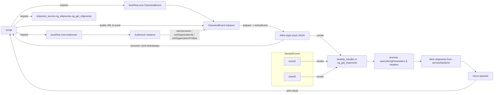

# Diagram: tools/ide_local_testing/localTest/test/shipment/getNgShipmentAPIViaLambda.py

> Auto-generated by Obscura crawlers

## Mermaid

### SVG

<svg id="container" width="3275.21875" xmlns="http://www.w3.org/2000/svg" class="flowchart" height="640" viewBox="0 0 3275.21875 640" role="graphics-document document" aria-roledescription="flowchart-v2"><g><marker id="container_flowchart-v2-pointEnd" class="marker flowchart-v2" viewBox="0 0 10 10" refX="5" refY="5" markerUnits="userSpaceOnUse" markerWidth="8" markerHeight="8" orient="auto"><path d="M 0 0 L 10 5 L 0 10 z" class="arrowMarkerPath" style="stroke-width: 1; stroke-dasharray: 1, 0;"></path></marker><marker id="container_flowchart-v2-pointStart" class="marker flowchart-v2" viewBox="0 0 10 10" refX="4.5" refY="5" markerUnits="userSpaceOnUse" markerWidth="8" markerHeight="8" orient="auto"><path d="M 0 5 L 10 10 L 10 0 z" class="arrowMarkerPath" style="stroke-width: 1; stroke-dasharray: 1, 0;"></path></marker><marker id="container_flowchart-v2-circleEnd" class="marker flowchart-v2" viewBox="0 0 10 10" refX="11" refY="5" markerUnits="userSpaceOnUse" markerWidth="11" markerHeight="11" orient="auto"><circle cx="5" cy="5" r="5" class="arrowMarkerPath" style="stroke-width: 1; stroke-dasharray: 1, 0;"></circle></marker><marker id="container_flowchart-v2-circleStart" class="marker flowchart-v2" viewBox="0 0 10 10" refX="-1" refY="5" markerUnits="userSpaceOnUse" markerWidth="11" markerHeight="11" orient="auto"><circle cx="5" cy="5" r="5" class="arrowMarkerPath" style="stroke-width: 1; stroke-dasharray: 1, 0;"></circle></marker><marker id="container_flowchart-v2-crossEnd" class="marker cross flowchart-v2" viewBox="0 0 11 11" refX="12" refY="5.2" markerUnits="userSpaceOnUse" markerWidth="11" markerHeight="11" orient="auto"><path d="M 1,1 l 9,9 M 10,1 l -9,9" class="arrowMarkerPath" style="stroke-width: 2; stroke-dasharray: 1, 0;"></path></marker><marker id="container_flowchart-v2-crossStart" class="marker cross flowchart-v2" viewBox="0 0 11 11" refX="-1" refY="5.2" markerUnits="userSpaceOnUse" markerWidth="11" markerHeight="11" orient="auto"><path d="M 1,1 l 9,9 M 10,1 l -9,9" class="arrowMarkerPath" style="stroke-width: 2; stroke-dasharray: 1, 0;"></path></marker><g class="root"><g class="clusters"><g class="cluster" id="SampleEvents" data-look="classic"><rect style="" x="1806.28125" y="360" width="266.1875" height="228"></rect><g class="cluster-label" transform="translate(1888.6875, 360)"><foreignObject width="101.375" height="24">

SampleEvents

</foreignObject></g></g></g><g class="edgePaths"><path d="M110.344,217.192L119.219,219.826C128.094,222.461,145.844,227.731,178.932,230.365C212.021,233,260.448,233,284.661,233L308.875,233" id="L_A_B_0" class="edge-thickness-normal edge-pattern-solid edge-thickness-normal edge-pattern-solid flowchart-link" style=";" data-edge="true" data-et="edge" data-id="L_A_B_0" data-points="W3sieCI6MTEwLjM0Mzc1LCJ5IjoyMTcuMTkxNTMwNzQ5NjYzMzF9LHsieCI6MTYzLjU5Mzc1LCJ5IjoyMzN9LHsieCI6MzEyLjg3NSwieSI6MjMzfV0=" marker-end="url(#container_flowchart-v2-pointEnd)"></path><path d="M76.054,175L90.644,151.667C105.234,128.333,134.414,81.667,193.723,58.333C253.031,35,342.469,35,438.693,35C534.917,35,637.927,35,704.427,35C770.927,35,800.917,35,815.911,35L830.906,35" id="L_A_C_0" class="edge-thickness-normal edge-pattern-solid edge-thickness-normal edge-pattern-solid flowchart-link" style=";" data-edge="true" data-et="edge" data-id="L_A_C_0" data-points="W3sieCI6NzYuMDU0NDUzNTkyODE0MzcsInkiOjE3NX0seyJ4IjoxNjMuNTkzNzUsInkiOjM1fSx7IngiOjQzMS45MDYyNSwieSI6MzV9LHsieCI6NzQwLjkzNzUsInkiOjM1fSx7IngiOjgzNC45MDYyNSwieSI6MzV9XQ==" marker-end="url(#container_flowchart-v2-pointEnd)"></path><path d="M89.488,175L101.839,164C114.19,153,138.892,131,159.451,120C180.01,109,196.427,109,204.635,109L212.844,109" id="L_A_D_0" class="edge-thickness-normal edge-pattern-solid edge-thickness-normal edge-pattern-solid flowchart-link" style=";" data-edge="true" data-et="edge" data-id="L_A_D_0" data-points="W3sieCI6ODkuNDg3OTAzMjI1ODA2NDUsInkiOjE3NX0seyJ4IjoxNjMuNTkzNzUsInkiOjEwOX0seyJ4IjoyMTYuODQzNzUsInkiOjEwOX1d" marker-end="url(#container_flowchart-v2-pointEnd)"></path><path d="M550.938,233L582.604,233C614.271,233,677.604,233,730.277,233C782.951,233,824.964,233,845.97,233L866.977,233" id="L_B_E_0" class="edge-thickness-normal edge-pattern-solid edge-thickness-normal edge-pattern-solid flowchart-link" style=";" data-edge="true" data-et="edge" data-id="L_B_E_0" data-points="W3sieCI6NTUwLjkzNzUsInkiOjIzM30seyJ4Ijo3NDAuOTM3NSwieSI6MjMzfSx7IngiOjg3MC45NzY1NjI1LCJ5IjoyMzN9XQ==" marker-end="url(#container_flowchart-v2-pointEnd)"></path><path d="M1107.891,35L1128.724,35C1149.557,35,1191.224,35,1243.945,52.841C1296.667,70.682,1360.443,106.365,1392.332,124.206L1424.22,142.047" id="L_C_F_0" class="edge-thickness-normal edge-pattern-solid edge-thickness-normal edge-pattern-solid flowchart-link" style=";" data-edge="true" data-et="edge" data-id="L_C_F_0" data-points="W3sieCI6MTEwNy44OTA2MjUsInkiOjM1fSx7IngiOjEyMzIuODkwNjI1LCJ5IjozNX0seyJ4IjoxNDI3LjcxMDU5MjgzMDg4MjQsInkiOjE0NH1d" marker-end="url(#container_flowchart-v2-pointEnd)"></path><path d="M110.344,186.808L119.219,184.174C128.094,181.539,145.844,176.269,199.438,173.635C253.031,171,342.469,171,438.693,171C534.917,171,637.927,171,727.842,171C817.758,171,894.578,171,976.57,171C1058.563,171,1145.727,171,1209.475,171C1273.224,171,1313.557,171,1333.724,171L1353.891,171" id="L_A_F_0" class="edge-thickness-normal edge-pattern-solid edge-thickness-normal edge-pattern-solid flowchart-link" style=";" data-edge="true" data-et="edge" data-id="L_A_F_0" data-points="W3sieCI6MTEwLjM0Mzc1LCJ5IjoxODYuODA4NDY5MjUwMzM2Njl9LHsieCI6MTYzLjU5Mzc1LCJ5IjoxNzF9LHsieCI6NDMxLjkwNjI1LCJ5IjoxNzF9LHsieCI6NzQwLjkzNzUsInkiOjE3MX0seyJ4Ijo5NzEuMzk4NDM3NSwieSI6MTcxfSx7IngiOjEyMzIuODkwNjI1LCJ5IjoxNzF9LHsieCI6MTM1Ny44OTA2MjUsInkiOjE3MX1d" marker-end="url(#container_flowchart-v2-pointEnd)"></path><path d="M1071.82,233L1098.665,233C1125.51,233,1179.201,233,1228.27,227.331C1277.339,221.663,1321.788,210.326,1344.012,204.657L1366.236,198.989" id="L_E_F_0" class="edge-thickness-normal edge-pattern-solid edge-thickness-normal edge-pattern-solid flowchart-link" style=";" data-edge="true" data-et="edge" data-id="L_E_F_0" data-points="W3sieCI6MTA3MS44MjAzMTI1LCJ5IjoyMzN9LHsieCI6MTIzMi44OTA2MjUsInkiOjIzM30seyJ4IjoxMzcwLjExMjE0NzE3NzQxOTMsInkiOjE5OH1d" marker-end="url(#container_flowchart-v2-pointEnd)"></path><path d="M1594.047,171L1611.733,171C1629.419,171,1664.792,171,1700.164,171C1735.536,171,1770.909,171,1802.101,178.509C1833.293,186.019,1860.306,201.037,1873.812,208.547L1887.318,216.056" id="L_F_G_0" class="edge-thickness-normal edge-pattern-solid edge-thickness-normal edge-pattern-solid flowchart-link" style=";" data-edge="true" data-et="edge" data-id="L_F_G_0" data-points="W3sieCI6MTU5NC4wNDY4NzUsInkiOjE3MX0seyJ4IjoxNzAwLjE2NDA2MjUsInkiOjE3MX0seyJ4IjoxODA2LjI4MTI1LCJ5IjoxNzF9LHsieCI6MTg5MC44MTM3NjY4OTE4OTE5LCJ5IjoyMTh9XQ==" marker-end="url(#container_flowchart-v2-pointEnd)"></path><path d="M1890.814,272L1876.725,279.833C1862.636,287.667,1834.459,303.333,1802.684,311.167C1770.909,319,1735.536,319,1680.484,319C1625.432,319,1550.701,319,1472.822,319C1394.943,319,1313.917,319,1229.822,319C1145.727,319,1058.563,319,976.57,319C894.578,319,817.758,319,727.842,319C637.927,319,534.917,319,438.693,319C342.469,319,253.031,319,195.369,304.497C137.707,289.995,111.82,260.99,98.876,246.487L85.933,231.984" id="L_G_A_0" class="edge-thickness-normal edge-pattern-solid edge-thickness-normal edge-pattern-solid flowchart-link" style=";" data-edge="true" data-et="edge" data-id="L_G_A_0" data-points="W3sieCI6MTg5MC44MTM3NjY4OTE4OTE5LCJ5IjoyNzJ9LHsieCI6MTgwNi4yODEyNSwieSI6MzE5fSx7IngiOjE3MDAuMTY0MDYyNSwieSI6MzE5fSx7IngiOjE0NzUuOTY4NzUsInkiOjMxOX0seyJ4IjoxMjMyLjg5MDYyNSwieSI6MzE5fSx7IngiOjk3MS4zOTg0Mzc1LCJ5IjozMTl9LHsieCI6NzQwLjkzNzUsInkiOjMxOX0seyJ4Ijo0MzEuOTA2MjUsInkiOjMxOX0seyJ4IjoxNjMuNTkzNzUsInkiOjMxOX0seyJ4Ijo4My4yNjkyMzA3NjkyMzA3NywieSI6MjI5fV0=" marker-end="url(#container_flowchart-v2-pointEnd)"></path><path d="M2047.469,245L2051.635,245C2055.802,245,2064.135,245,2076.444,245C2088.753,245,2105.036,245,2135.945,267.531C2166.854,290.062,2212.387,335.124,2235.154,357.655L2257.921,380.186" id="L_G_H_0" class="edge-thickness-normal edge-pattern-solid edge-thickness-normal edge-pattern-solid flowchart-link" style=";" data-edge="true" data-et="edge" data-id="L_G_H_0" data-points="W3sieCI6MjA0Ny40Njg3NSwieSI6MjQ1fSx7IngiOjIwNzIuNDY4NzUsInkiOjI0NX0seyJ4IjoyMTIxLjMyMDMxMjUsInkiOjI0NX0seyJ4IjoyMjYwLjc2MzkwMzYwMTY5NSwieSI6MzgzfV0=" marker-end="url(#container_flowchart-v2-pointEnd)"></path><path d="M2430.172,422L2434.339,422C2438.505,422,2446.839,422,2454.505,422C2462.172,422,2469.172,422,2472.672,422L2476.172,422" id="L_H_I_0" class="edge-thickness-normal edge-pattern-solid edge-thickness-normal edge-pattern-solid flowchart-link" style=";" data-edge="true" data-et="edge" data-id="L_H_I_0" data-points="W3sieCI6MjQzMC4xNzE4NzUsInkiOjQyMn0seyJ4IjoyNDU1LjE3MTg3NSwieSI6NDIyfSx7IngiOjI0ODAuMTcxODc1LCJ5Ijo0MjJ9XQ==" marker-end="url(#container_flowchart-v2-pointEnd)"></path><path d="M2740.172,422L2744.339,422C2748.505,422,2756.839,422,2764.505,422C2772.172,422,2779.172,422,2782.672,422L2786.172,422" id="L_I_J_0" class="edge-thickness-normal edge-pattern-solid edge-thickness-normal edge-pattern-solid flowchart-link" style=";" data-edge="true" data-et="edge" data-id="L_I_J_0" data-points="W3sieCI6Mjc0MC4xNzE4NzUsInkiOjQyMn0seyJ4IjoyNzY1LjE3MTg3NSwieSI6NDIyfSx7IngiOjI3OTAuMTcxODc1LCJ5Ijo0MjJ9XQ==" marker-end="url(#container_flowchart-v2-pointEnd)"></path><path d="M3050.172,422L3054.339,422C3058.505,422,3066.839,422,3083.667,433.551C3100.496,445.101,3125.819,468.203,3138.481,479.754L3151.143,491.304" id="L_J_K_0" class="edge-thickness-normal edge-pattern-solid edge-thickness-normal edge-pattern-solid flowchart-link" style=";" data-edge="true" data-et="edge" data-id="L_J_K_0" data-points="W3sieCI6MzA1MC4xNzE4NzUsInkiOjQyMn0seyJ4IjozMDc1LjE3MTg3NSwieSI6NDIyfSx7IngiOjMxNTQuMDk4MDExMzYzNjM2NSwieSI6NDk0fV0=" marker-end="url(#container_flowchart-v2-pointEnd)"></path><path d="M3154.098,548L3140.944,560C3127.789,572,3101.481,596,3062.493,608C3023.505,620,2971.839,620,2920.172,620C2868.505,620,2816.839,620,2765.172,620C2713.505,620,2661.839,620,2610.172,620C2558.505,620,2506.839,620,2455.172,620C2403.505,620,2351.839,620,2296.197,620C2240.555,620,2180.938,620,2142.987,620C2105.036,620,2088.753,620,2058.428,620C2028.104,620,1983.74,620,1939.375,620C1895.01,620,1850.646,620,1810.777,620C1770.909,620,1735.536,620,1680.484,620C1625.432,620,1550.701,620,1472.822,620C1394.943,620,1313.917,620,1229.822,620C1145.727,620,1058.563,620,976.57,620C894.578,620,817.758,620,727.842,620C637.927,620,534.917,620,438.693,620C342.469,620,253.031,620,192.195,555.48C131.358,490.96,99.122,361.92,83.004,297.401L66.886,232.881" id="L_K_A_0" class="edge-thickness-normal edge-pattern-solid edge-thickness-normal edge-pattern-solid flowchart-link" style=";" data-edge="true" data-et="edge" data-id="L_K_A_0" data-points="W3sieCI6MzE1NC4wOTgwMTEzNjM2MzY1LCJ5Ijo1NDh9LHsieCI6MzA3NS4xNzE4NzUsInkiOjYyMH0seyJ4IjoyOTIwLjE3MTg3NSwieSI6NjIwfSx7IngiOjI3NjUuMTcxODc1LCJ5Ijo2MjB9LHsieCI6MjYxMC4xNzE4NzUsInkiOjYyMH0seyJ4IjoyNDU1LjE3MTg3NSwieSI6NjIwfSx7IngiOjIzMDAuMTcxODc1LCJ5Ijo2MjB9LHsieCI6MjEyMS4zMjAzMTI1LCJ5Ijo2MjB9LHsieCI6MjA3Mi40Njg3NSwieSI6NjIwfSx7IngiOjE5MzkuMzc1LCJ5Ijo2MjB9LHsieCI6MTgwNi4yODEyNSwieSI6NjIwfSx7IngiOjE3MDAuMTY0MDYyNSwieSI6NjIwfSx7IngiOjE0NzUuOTY4NzUsInkiOjYyMH0seyJ4IjoxMjMyLjg5MDYyNSwieSI6NjIwfSx7IngiOjk3MS4zOTg0Mzc1LCJ5Ijo2MjB9LHsieCI6NzQwLjkzNzUsInkiOjYyMH0seyJ4Ijo0MzEuOTA2MjUsInkiOjYyMH0seyJ4IjoxNjMuNTkzNzUsInkiOjYyMH0seyJ4Ijo2NS45MTY4Mjg2NDgzMjUzNiwieSI6MjI5fV0=" marker-end="url(#container_flowchart-v2-pointEnd)"></path><path d="M1992.852,422L2006.121,422C2019.391,422,2045.93,422,2067.341,422C2088.753,422,2105.036,422,2120.654,422C2136.271,422,2151.221,422,2158.697,422L2166.172,422" id="L_E1_H_0" class="edge-thickness-normal edge-pattern-solid edge-thickness-normal edge-pattern-solid flowchart-link" style=";" data-edge="true" data-et="edge" data-id="L_E1_H_0" data-points="W3sieCI6MTk5Mi44NTE1NjI1LCJ5Ijo0MjJ9LHsieCI6MjA3Mi40Njg3NSwieSI6NDIyfSx7IngiOjIxMjEuMzIwMzEyNSwieSI6NDIyfSx7IngiOjIxNzAuMTcxODc1LCJ5Ijo0MjJ9XQ==" marker-end="url(#container_flowchart-v2-pointEnd)"></path><path d="M1993.508,526L2006.668,526C2019.828,526,2046.148,526,2067.451,526C2088.753,526,2105.036,526,2131.232,515.502C2157.428,505.004,2193.537,484.007,2211.591,473.509L2229.645,463.011" id="L_E2_H_0" class="edge-thickness-normal edge-pattern-solid edge-thickness-normal edge-pattern-solid flowchart-link" style=";" data-edge="true" data-et="edge" data-id="L_E2_H_0" data-points="W3sieCI6MTk5My41MDc4MTI1LCJ5Ijo1MjZ9LHsieCI6MjA3Mi40Njg3NSwieSI6NTI2fSx7IngiOjIxMjEuMzIwMzEyNSwieSI6NTI2fSx7IngiOjIyMzMuMTAyNTM5MDYyNSwieSI6NDYxfV0=" marker-end="url(#container_flowchart-v2-pointEnd)"></path></g><g class="edgeLabels"><g class="edgeLabel" transform="translate(163.59375, 233)"><g class="label" data-id="L_A_B_0" transform="translate(-28.25, -12)"><foreignObject width="56.5" height="24">

imports

</foreignObject></g></g><g class="edgeLabel" transform="translate(431.90625, 35)"><g class="label" data-id="L_A_C_0" transform="translate(-28.25, -12)"><foreignObject width="56.5" height="24">

imports

</foreignObject></g></g><g class="edgeLabel" transform="translate(163.59375, 109)"><g class="label" data-id="L_A_D_0" transform="translate(-28.25, -12)"><foreignObject width="56.5" height="24">

imports

</foreignObject></g></g><g class="edgeLabel"><g class="label" data-id="L_B_E_0" transform="translate(0, 0)"><foreignObject width="0" height="0">

</foreignObject></g></g><g class="edgeLabel"><g class="label" data-id="L_C_F_0" transform="translate(0, 0)"><foreignObject width="0" height="0">

</foreignObject></g></g><g class="edgeLabel" transform="translate(740.9375, 171)"><g class="label" data-id="L_A_F_0" transform="translate(-68.96875, -12)"><foreignObject width="137.9375" height="24">

builds URL &amp; event

</foreignObject></g></g><g class="edgeLabel" transform="translate(1232.890625, 233)"><g class="label" data-id="L_E_F_0" transform="translate(-100, -36)"><foreignObject width="200" height="72">

setUsername / setOrganizationId / setOrganizationProfiles

</foreignObject></g></g><g class="edgeLabel" transform="translate(1700.1640625, 171)"><g class="label" data-id="L_F_G_0" transform="translate(-81.1171875, -12)"><foreignObject width="162.234375" height="24">

prepare -&gt; toAwsEvent

</foreignObject></g></g><g class="edgeLabel" transform="translate(971.3984375, 319)"><g class="label" data-id="L_G_A_0" transform="translate(-100, -24)"><foreignObject width="200" height="48">

jsonvent / print timestamps

</foreignObject></g></g><g class="edgeLabel" transform="translate(2121.3203125, 245)"><g class="label" data-id="L_G_H_0" transform="translate(-23.8515625, -12)"><foreignObject width="47.703125" height="24">

invoke

</foreignObject></g></g><g class="edgeLabel"><g class="label" data-id="L_H_I_0" transform="translate(0, 0)"><foreignObject width="0" height="0">

</foreignObject></g></g><g class="edgeLabel"><g class="label" data-id="L_I_J_0" transform="translate(0, 0)"><foreignObject width="0" height="0">

</foreignObject></g></g><g class="edgeLabel"><g class="label" data-id="L_J_K_0" transform="translate(0, 0)"><foreignObject width="0" height="0">

</foreignObject></g></g><g class="edgeLabel" transform="translate(1939.375, 620)"><g class="label" data-id="L_K_A_0" transform="translate(-40.2734375, -12)"><foreignObject width="80.546875" height="24">

print retval

</foreignObject></g></g><g class="edgeLabel" transform="translate(2121.3203125, 422)"><g class="label" data-id="L_E1_H_0" transform="translate(-23.8515625, -12)"><foreignObject width="47.703125" height="24">

invoke

</foreignObject></g></g><g class="edgeLabel" transform="translate(2121.3203125, 526)"><g class="label" data-id="L_E2_H_0" transform="translate(-23.8515625, -12)"><foreignObject width="47.703125" height="24">

invoke

</foreignObject></g></g></g><g class="nodes"><g class="node default" id="flowchart-A-0" transform="translate(59.171875, 202)"><rect class="basic label-container" style="" x="-51.171875" y="-27" width="102.34375" height="54"></rect><g class="label" style="" transform="translate(-21.171875, -12)"><rect></rect><foreignObject width="42.34375" height="24">

Script

</foreignObject></g></g><g class="node default" id="flowchart-B-1" transform="translate(431.90625, 233)"><rect class="basic label-container" style="" x="-119.03125" y="-27" width="238.0625" height="54"></rect><g class="label" style="" transform="translate(-89.03125, -12)"><rect></rect><foreignObject width="178.0625" height="24">

localTest.core.Authorizer

</foreignObject></g></g><g class="node default" id="flowchart-C-3" transform="translate(971.3984375, 35)"><rect class="basic label-container" style="" x="-136.4921875" y="-27" width="272.984375" height="54"></rect><g class="label" style="" transform="translate(-106.4921875, -12)"><rect></rect><foreignObject width="212.984375" height="24">

localTest.core.CanonicalEvent

</foreignObject></g></g><g class="node default" id="flowchart-D-5" transform="translate(431.90625, 109)"><rect class="basic label-container" style="" x="-215.0625" y="-27" width="430.125" height="54"></rect><g class="label" style="" transform="translate(-185.0625, -12)"><rect></rect><foreignObject width="370.125" height="24">

shipment_service.ng_shipments.ng_get_shipments

</foreignObject></g></g><g class="node default" id="flowchart-E-7" transform="translate(971.3984375, 233)"><rect class="basic label-container" style="" x="-100.421875" y="-27" width="200.84375" height="54"></rect><g class="label" style="" transform="translate(-70.421875, -12)"><rect></rect><foreignObject width="140.84375" height="24">

Authorizer instance

</foreignObject></g></g><g class="node default" id="flowchart-F-9" transform="translate(1475.96875, 171)"><rect class="basic label-container" style="" x="-118.078125" y="-27" width="236.15625" height="54"></rect><g class="label" style="" transform="translate(-88.078125, -12)"><rect></rect><foreignObject width="176.15625" height="24">

CanonicalEvent instance

</foreignObject></g></g><g class="node default" id="flowchart-G-15" transform="translate(1939.375, 245)"><rect class="basic label-container" style="" x="-108.09375" y="-27" width="216.1875" height="54"></rect><g class="label" style="" transform="translate(-78.09375, -12)"><rect></rect><foreignObject width="156.1875" height="24">

AWS-style event JSON

</foreignObject></g></g><g class="node default" id="flowchart-H-19" transform="translate(2300.171875, 422)"><rect class="basic label-container" style="" x="-130" y="-39" width="260" height="78"></rect><g class="label" style="" transform="translate(-100, -24)"><rect></rect><foreignObject width="200" height="48">

lambda_handler in ng_get_shipments

</foreignObject></g></g><g class="node default" id="flowchart-I-21" transform="translate(2610.171875, 422)"><rect class="basic label-container" style="" x="-130" y="-51" width="260" height="102"></rect><g class="label" style="" transform="translate(-100, -36)"><rect></rect><foreignObject width="200" height="72">

process queryStringParameters &amp; headers

</foreignObject></g></g><g class="node default" id="flowchart-J-23" transform="translate(2920.171875, 422)"><rect class="basic label-container" style="" x="-130" y="-39" width="260" height="78"></rect><g class="label" style="" transform="translate(-100, -24)"><rect></rect><foreignObject width="200" height="48">

fetch shipments from service/backend

</foreignObject></g></g><g class="node default" id="flowchart-K-25" transform="translate(3183.6953125, 521)"><rect class="basic label-container" style="" x="-83.5234375" y="-27" width="167.046875" height="54"></rect><g class="label" style="" transform="translate(-53.5234375, -12)"><rect></rect><foreignObject width="107.046875" height="24">

return payload

</foreignObject></g></g><g class="node default" id="flowchart-E1-28" transform="translate(1939.375, 422)"><rect class="basic label-container" style="" x="-53.4765625" y="-27" width="106.953125" height="54"></rect><g class="label" style="" transform="translate(-23.4765625, -12)"><rect></rect><foreignObject width="46.953125" height="24">

event1

</foreignObject></g></g><g class="node default" id="flowchart-E2-29" transform="translate(1939.375, 526)"><rect class="basic label-container" style="" x="-54.1328125" y="-27" width="108.265625" height="54"></rect><g class="label" style="" transform="translate(-24.1328125, -12)"><rect></rect><foreignObject width="48.265625" height="24">

event2

</foreignObject></g></g></g></g></g></svg>
