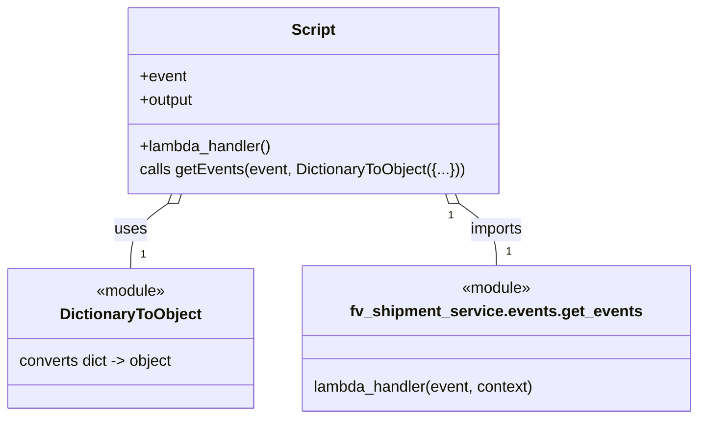

# Diagram: tools/ide_local_testing/localTest/test/shipment/getNgShipmentEventsViaLambda.py


> Auto-generated by Obscura crawlers

## Diagram 1



> SVG rendering failed for this diagram.

## Diagram 2

```mermaid
flowchart TD
    A[Start script] --> B[Define lambda_handler]
    B --> C[Create event dict]
    C --> D[Import getEvents from fv_shipment_service.events.get_events]
    D --> E[Call getEvents(event, DictionaryToObject({...}))]
    E --> F[Process events and return output]
    F --> G[print(output)]
    G --> H[End]
```

> SVG rendering failed for this diagram.
