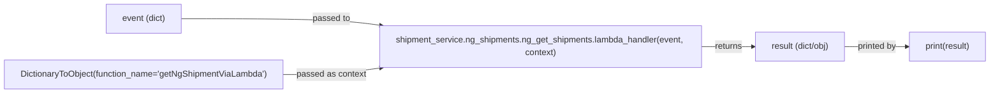
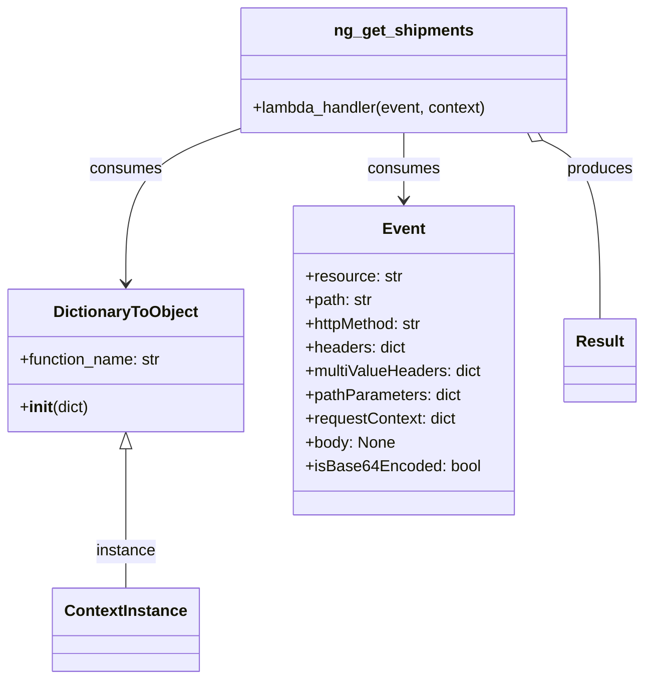

# Diagram: tools/ide_local_testing/localTest/test/shipment/getNgShipmentViaLambda.py

> Auto-generated by Obscura crawlers

## Diagram 1

### SVG

<svg id="container" width="1876.453125" xmlns="http://www.w3.org/2000/svg" class="flowchart" height="174" viewBox="0 0 1876.453125 174" role="graphics-document document" aria-roledescription="flowchart-v2"><g><marker id="container_flowchart-v2-pointEnd" class="marker flowchart-v2" viewBox="0 0 10 10" refX="5" refY="5" markerUnits="userSpaceOnUse" markerWidth="8" markerHeight="8" orient="auto"><path d="M 0 0 L 10 5 L 0 10 z" class="arrowMarkerPath" style="stroke-width: 1; stroke-dasharray: 1, 0;"></path></marker><marker id="container_flowchart-v2-pointStart" class="marker flowchart-v2" viewBox="0 0 10 10" refX="4.5" refY="5" markerUnits="userSpaceOnUse" markerWidth="8" markerHeight="8" orient="auto"><path d="M 0 5 L 10 10 L 10 0 z" class="arrowMarkerPath" style="stroke-width: 1; stroke-dasharray: 1, 0;"></path></marker><marker id="container_flowchart-v2-circleEnd" class="marker flowchart-v2" viewBox="0 0 10 10" refX="11" refY="5" markerUnits="userSpaceOnUse" markerWidth="11" markerHeight="11" orient="auto"><circle cx="5" cy="5" r="5" class="arrowMarkerPath" style="stroke-width: 1; stroke-dasharray: 1, 0;"></circle></marker><marker id="container_flowchart-v2-circleStart" class="marker flowchart-v2" viewBox="0 0 10 10" refX="-1" refY="5" markerUnits="userSpaceOnUse" markerWidth="11" markerHeight="11" orient="auto"><circle cx="5" cy="5" r="5" class="arrowMarkerPath" style="stroke-width: 1; stroke-dasharray: 1, 0;"></circle></marker><marker id="container_flowchart-v2-crossEnd" class="marker cross flowchart-v2" viewBox="0 0 11 11" refX="12" refY="5.2" markerUnits="userSpaceOnUse" markerWidth="11" markerHeight="11" orient="auto"><path d="M 1,1 l 9,9 M 10,1 l -9,9" class="arrowMarkerPath" style="stroke-width: 2; stroke-dasharray: 1, 0;"></path></marker><marker id="container_flowchart-v2-crossStart" class="marker cross flowchart-v2" viewBox="0 0 11 11" refX="-1" refY="5.2" markerUnits="userSpaceOnUse" markerWidth="11" markerHeight="11" orient="auto"><path d="M 1,1 l 9,9 M 10,1 l -9,9" class="arrowMarkerPath" style="stroke-width: 2; stroke-dasharray: 1, 0;"></path></marker><g class="root"><g class="clusters"></g><g class="edgePaths"><path d="M341.492,35L388.262,35C435.031,35,528.57,35,591.063,37.079C653.555,39.159,685.001,43.317,700.724,45.396L716.447,47.476" id="L_Event_Lambda_0" class="edge-thickness-normal edge-pattern-solid edge-thickness-normal edge-pattern-solid flowchart-link" style=";" data-edge="true" data-et="edge" data-id="L_Event_Lambda_0" data-points="W3sieCI6MzQxLjQ5MjE4NzUsInkiOjM1fSx7IngiOjYyMi4xMDkzNzUsInkiOjM1fSx7IngiOjcyMC40MTIxMDkzNzUsInkiOjQ4fV0=" marker-end="url(#container_flowchart-v2-pointEnd)"></path><path d="M532.531,139L547.461,139C562.391,139,592.25,139,622.903,136.921C653.555,134.841,685.001,130.683,700.724,128.604L716.447,126.524" id="L_Context_Lambda_0" class="edge-thickness-normal edge-pattern-solid edge-thickness-normal edge-pattern-solid flowchart-link" style=";" data-edge="true" data-et="edge" data-id="L_Context_Lambda_0" data-points="W3sieCI6NTMyLjUzMTI1LCJ5IjoxMzl9LHsieCI6NjIyLjEwOTM3NSwieSI6MTM5fSx7IngiOjcyMC40MTIxMDkzNzUsInkiOjEyNn1d" marker-end="url(#container_flowchart-v2-pointEnd)"></path><path d="M1318.953,87L1327.497,87C1336.042,87,1353.13,87,1369.552,87C1385.974,87,1401.729,87,1409.607,87L1417.484,87" id="L_Lambda_Result_0" class="edge-thickness-normal edge-pattern-solid edge-thickness-normal edge-pattern-solid flowchart-link" style=";" data-edge="true" data-et="edge" data-id="L_Lambda_Result_0" data-points="W3sieCI6MTMxOC45NTMxMjUsInkiOjg3fSx7IngiOjEzNzAuMjE4NzUsInkiOjg3fSx7IngiOjE0MjEuNDg0Mzc1LCJ5Ijo4N31d" marker-end="url(#container_flowchart-v2-pointEnd)"></path><path d="M1596.109,87L1606.522,87C1616.935,87,1637.76,87,1657.919,87C1678.078,87,1697.57,87,1707.316,87L1717.063,87" id="L_Result_Print_0" class="edge-thickness-normal edge-pattern-solid edge-thickness-normal edge-pattern-solid flowchart-link" style=";" data-edge="true" data-et="edge" data-id="L_Result_Print_0" data-points="W3sieCI6MTU5Ni4xMDkzNzUsInkiOjg3fSx7IngiOjE2NTguNTg1OTM3NSwieSI6ODd9LHsieCI6MTcyMS4wNjI1LCJ5Ijo4N31d" marker-end="url(#container_flowchart-v2-pointEnd)"></path></g><g class="edgeLabels"><g class="edgeLabel" transform="translate(622.109375, 35)"><g class="label" data-id="L_Event_Lambda_0" transform="translate(-35.046875, -12)"><foreignObject width="70.09375" height="24">

passed to

</foreignObject></g></g><g class="edgeLabel" transform="translate(622.109375, 139)"><g class="label" data-id="L_Context_Lambda_0" transform="translate(-64.578125, -12)"><foreignObject width="129.15625" height="24">

passed as context

</foreignObject></g></g><g class="edgeLabel" transform="translate(1370.21875, 87)"><g class="label" data-id="L_Lambda_Result_0" transform="translate(-26.265625, -12)"><foreignObject width="52.53125" height="24">

returns

</foreignObject></g></g><g class="edgeLabel" transform="translate(1658.5859375, 87)"><g class="label" data-id="L_Result_Print_0" transform="translate(-37.4765625, -12)"><foreignObject width="74.953125" height="24">

printed by

</foreignObject></g></g></g><g class="nodes"><g class="node default" id="flowchart-Event-0" transform="translate(270.265625, 35)"><rect class="basic label-container" style="" x="-71.2265625" y="-27" width="142.453125" height="54"></rect><g class="label" style="" transform="translate(-41.2265625, -12)"><rect></rect><foreignObject width="82.453125" height="24">

event (dict)

</foreignObject></g></g><g class="node default" id="flowchart-Lambda-1" transform="translate(1015.3203125, 87)"><rect class="basic label-container" style="" x="-303.6328125" y="-39" width="607.265625" height="78"></rect><g class="label" style="" transform="translate(-273.6328125, -24)"><rect></rect><foreignObject width="547.265625" height="48">

shipment_service.ng_shipments.ng_get_shipments.lambda_handler(event, context)

</foreignObject></g></g><g class="node default" id="flowchart-Context-2" transform="translate(270.265625, 139)"><rect class="basic label-container" style="" x="-262.265625" y="-27" width="524.53125" height="54"></rect><g class="label" style="" transform="translate(-232.265625, -12)"><rect></rect><foreignObject width="464.53125" height="24">

DictionaryToObject(function_name='getNgShipmentViaLambda')

</foreignObject></g></g><g class="node default" id="flowchart-Result-5" transform="translate(1508.796875, 87)"><rect class="basic label-container" style="" x="-87.3125" y="-27" width="174.625" height="54"></rect><g class="label" style="" transform="translate(-57.3125, -12)"><rect></rect><foreignObject width="114.625" height="24">

result (dict/obj)

</foreignObject></g></g><g class="node default" id="flowchart-Print-7" transform="translate(1794.7578125, 87)"><rect class="basic label-container" style="" x="-73.6953125" y="-27" width="147.390625" height="54"></rect><g class="label" style="" transform="translate(-43.6953125, -12)"><rect></rect><foreignObject width="87.390625" height="24">

print(result)

</foreignObject></g></g></g></g></g></svg>

## Diagram 2

### SVG

<svg id="container" width="650.3359375" xmlns="http://www.w3.org/2000/svg" class="classDiagram" height="686" viewBox="0 0 650.3359375 686" role="graphics-document document" aria-roledescription="class"><g><defs><marker id="container_class-aggregationStart" class="marker aggregation class" refX="18" refY="7" markerWidth="190" markerHeight="240" orient="auto"><path d="M 18,7 L9,13 L1,7 L9,1 Z"></path></marker></defs><defs><marker id="container_class-aggregationEnd" class="marker aggregation class" refX="1" refY="7" markerWidth="20" markerHeight="28" orient="auto"><path d="M 18,7 L9,13 L1,7 L9,1 Z"></path></marker></defs><defs><marker id="container_class-extensionStart" class="marker extension class" refX="18" refY="7" markerWidth="190" markerHeight="240" orient="auto"><path d="M 1,7 L18,13 V 1 Z"></path></marker></defs><defs><marker id="container_class-extensionEnd" class="marker extension class" refX="1" refY="7" markerWidth="20" markerHeight="28" orient="auto"><path d="M 1,1 V 13 L18,7 Z"></path></marker></defs><defs><marker id="container_class-compositionStart" class="marker composition class" refX="18" refY="7" markerWidth="190" markerHeight="240" orient="auto"><path d="M 18,7 L9,13 L1,7 L9,1 Z"></path></marker></defs><defs><marker id="container_class-compositionEnd" class="marker composition class" refX="1" refY="7" markerWidth="20" markerHeight="28" orient="auto"><path d="M 18,7 L9,13 L1,7 L9,1 Z"></path></marker></defs><defs><marker id="container_class-dependencyStart" class="marker dependency class" refX="6" refY="7" markerWidth="190" markerHeight="240" orient="auto"><path d="M 5,7 L9,13 L1,7 L9,1 Z"></path></marker></defs><defs><marker id="container_class-dependencyEnd" class="marker dependency class" refX="13" refY="7" markerWidth="20" markerHeight="28" orient="auto"><path d="M 18,7 L9,13 L14,7 L9,1 Z"></path></marker></defs><defs><marker id="container_class-lollipopStart" class="marker lollipop class" refX="13" refY="7" markerWidth="190" markerHeight="240" orient="auto"><circle stroke="black" fill="transparent" cx="7" cy="7" r="6"></circle></marker></defs><defs><marker id="container_class-lollipopEnd" class="marker lollipop class" refX="1" refY="7" markerWidth="190" markerHeight="240" orient="auto"><circle stroke="black" fill="transparent" cx="7" cy="7" r="6"></circle></marker></defs><g class="root"><g class="clusters"></g><g class="edgePaths"><path d="M127.453,453.25L127.453,470.542C127.453,487.833,127.453,522.417,127.453,545.875C127.453,569.333,127.453,581.667,127.453,587.833L127.453,594" id="id_DictionaryToObject_ContextInstance_1" class="edge-thickness-normal edge-pattern-solid relation" style=";;;" data-edge="true" data-et="edge" data-id="id_DictionaryToObject_ContextInstance_1" data-points="W3sieCI6MTI3LjQ1MzEyNSwieSI6NDM2fSx7IngiOjEyNy40NTMxMjUsInkiOjU1N30seyJ4IjoxMjcuNDUzMTI1LCJ5Ijo1OTR9XQ==" marker-start="url(#container_class-extensionStart)"></path><path d="M409.48,134L409.48,140.167C409.48,146.333,409.48,158.667,409.48,170C409.48,181.333,409.48,191.667,409.48,196.833L409.48,202" id="id_ng_get_shipments_Event_2" class="edge-thickness-normal edge-pattern-solid relation" style=";;;" data-edge="true" data-et="edge" data-id="id_ng_get_shipments_Event_2" data-points="W3sieCI6NDA5LjQ4MDQ2ODc1LCJ5IjoxMzR9LHsieCI6NDA5LjQ4MDQ2ODc1LCJ5IjoxNzF9LHsieCI6NDA5LjQ4MDQ2ODc1LCJ5IjoyMDh9XQ==" marker-end="url(#container_class-dependencyEnd)"></path><path d="M243.621,129.81L224.26,136.675C204.898,143.54,166.176,157.27,146.814,183.302C127.453,209.333,127.453,247.667,127.453,266.833L127.453,286" id="id_ng_get_shipments_DictionaryToObject_3" class="edge-thickness-normal edge-pattern-solid relation" style=";;;" data-edge="true" data-et="edge" data-id="id_ng_get_shipments_DictionaryToObject_3" data-points="W3sieCI6MjQzLjYyMTA5Mzc1LCJ5IjoxMjkuODA5Njc4ODA0NDE1NTd9LHsieCI6MTI3LjQ1MzEyNSwieSI6MTcxfSx7IngiOjEyNy40NTMxMjUsInkiOjI5Mn1d" marker-end="url(#container_class-dependencyEnd)"></path><path d="M549.434,141.786L559.061,146.655C568.688,151.524,587.942,161.262,597.568,191.298C607.195,221.333,607.195,271.667,607.195,296.833L607.195,322" id="id_ng_get_shipments_Result_4" class="edge-thickness-normal edge-pattern-solid relation" style=";;;" data-edge="true" data-et="edge" data-id="id_ng_get_shipments_Result_4" data-points="W3sieCI6NTM0LjA0MDgyMDMxMjUsInkiOjEzNH0seyJ4Ijo2MDcuMTk1MzEyNSwieSI6MTcxfSx7IngiOjYwNy4xOTUzMTI1LCJ5IjozMjJ9XQ==" marker-start="url(#container_class-aggregationStart)"></path></g><g class="edgeLabels"><g class="edgeLabel" transform="translate(127.453125, 557)"><g class="label" data-id="id_DictionaryToObject_ContextInstance_1" transform="translate(-30.578125, -12)"><foreignObject width="61.15625" height="24">

instance

</foreignObject></g></g><g class="edgeLabel" transform="translate(409.48046875, 171)"><g class="label" data-id="id_ng_get_shipments_Event_2" transform="translate(-36.375, -12)"><foreignObject width="72.75" height="24">

consumes

</foreignObject></g></g><g class="edgeLabel" transform="translate(127.453125, 171)"><g class="label" data-id="id_ng_get_shipments_DictionaryToObject_3" transform="translate(-36.375, -12)"><foreignObject width="72.75" height="24">

consumes

</foreignObject></g></g><g class="edgeLabel" transform="translate(607.1953125, 171)"><g class="label" data-id="id_ng_get_shipments_Result_4" transform="translate(-33.4765625, -12)"><foreignObject width="66.953125" height="24">

produces

</foreignObject></g></g></g><g class="nodes"><g class="node default" id="classId-DictionaryToObject-0" transform="translate(127.453125, 364)"><g class="basic label-container"><path d="M-119.453125 -72 L119.453125 -72 L119.453125 72 L-119.453125 72" stroke="none" stroke-width="0" fill="#ECECFF" style=""></path><path d="M-119.453125 -72 C-30.22682058974837 -72, 58.99948382050326 -72, 119.453125 -72 M-119.453125 -72 C-52.377681522960756 -72, 14.697761954078487 -72, 119.453125 -72 M119.453125 -72 C119.453125 -40.49964318579505, 119.453125 -8.99928637159011, 119.453125 72 M119.453125 -72 C119.453125 -38.27880012666762, 119.453125 -4.557600253335238, 119.453125 72 M119.453125 72 C70.66871987989899 72, 21.88431475979796 72, -119.453125 72 M119.453125 72 C54.11518501279923 72, -11.22275497440154 72, -119.453125 72 M-119.453125 72 C-119.453125 28.612945231130702, -119.453125 -14.774109537738596, -119.453125 -72 M-119.453125 72 C-119.453125 35.57831302798881, -119.453125 -0.8433739440223746, -119.453125 -72" stroke="#9370DB" stroke-width="1.3" fill="none" stroke-dasharray="0 0" style=""></path></g><g class="annotation-group text" transform="translate(0, -48)"></g><g class="label-group text" transform="translate(-70.109375, -48)"><g class="label" style="font-weight: bolder" transform="translate(0,-12)"><foreignObject width="140.21875" height="24">

DictionaryToObject

</foreignObject></g></g><g class="members-group text" transform="translate(-107.453125, 0)"><g class="label" style="" transform="translate(0,-12)"><foreignObject width="144.796875" height="24">

+function_name: str

</foreignObject></g></g><g class="methods-group text" transform="translate(-107.453125, 48)"><g class="label" style="" transform="translate(0,-12)"><foreignObject width="70.296875" height="24">

+<strong>init</strong>(dict)

</foreignObject></g></g><g class="divider" style=""><path d="M-119.453125 -24 C-51.58159772380753 -24, 16.289929552384933 -24, 119.453125 -24 M-119.453125 -24 C-34.14195493232616 -24, 51.169215135347685 -24, 119.453125 -24" stroke="#9370DB" stroke-width="1.3" fill="none" stroke-dasharray="0 0" style=""></path></g><g class="divider" style=""><path d="M-119.453125 24 C-65.62090198392669 24, -11.788678967853372 24, 119.453125 24 M-119.453125 24 C-41.00557388169584 24, 37.441977236608324 24, 119.453125 24" stroke="#9370DB" stroke-width="1.3" fill="none" stroke-dasharray="0 0" style=""></path></g></g><g class="node default" id="classId-ng_get_shipments-1" transform="translate(409.48046875, 71)"><g class="basic label-container"><path d="M-165.859375 -63 L165.859375 -63 L165.859375 63 L-165.859375 63" stroke="none" stroke-width="0" fill="#ECECFF" style=""></path><path d="M-165.859375 -63 C-34.79258492127852 -63, 96.27420515744296 -63, 165.859375 -63 M-165.859375 -63 C-83.83805784967882 -63, -1.8167406993576378 -63, 165.859375 -63 M165.859375 -63 C165.859375 -32.60468803477263, 165.859375 -2.2093760695452573, 165.859375 63 M165.859375 -63 C165.859375 -16.964328182557146, 165.859375 29.071343634885707, 165.859375 63 M165.859375 63 C83.6132377074235 63, 1.3671004148469876 63, -165.859375 63 M165.859375 63 C38.491065001825916 63, -88.87724499634817 63, -165.859375 63 M-165.859375 63 C-165.859375 32.89558594632854, -165.859375 2.7911718926570686, -165.859375 -63 M-165.859375 63 C-165.859375 24.869463271527387, -165.859375 -13.261073456945226, -165.859375 -63" stroke="#9370DB" stroke-width="1.3" fill="none" stroke-dasharray="0 0" style=""></path></g><g class="annotation-group text" transform="translate(0, -39)"></g><g class="label-group text" transform="translate(-67.53125, -39)"><g class="label" style="font-weight: bolder" transform="translate(0,-12)"><foreignObject width="135.0625" height="24">

ng_get_shipments

</foreignObject></g></g><g class="members-group text" transform="translate(-153.859375, 9)"></g><g class="methods-group text" transform="translate(-153.859375, 39)"><g class="label" style="" transform="translate(0,-12)"><foreignObject width="240.1875" height="24">

+lambda_handler(event, context)

</foreignObject></g></g><g class="divider" style=""><path d="M-165.859375 -15 C-72.95506895524164 -15, 19.949237089516714 -15, 165.859375 -15 M-165.859375 -15 C-72.22068253694552 -15, 21.418009926108965 -15, 165.859375 -15" stroke="#9370DB" stroke-width="1.3" fill="none" stroke-dasharray="0 0" style=""></path></g><g class="divider" style=""><path d="M-165.859375 9 C-81.90877193969796 9, 2.041831120604087 9, 165.859375 9 M-165.859375 9 C-80.14916455217552 9, 5.5610458956489595 9, 165.859375 9" stroke="#9370DB" stroke-width="1.3" fill="none" stroke-dasharray="0 0" style=""></path></g></g><g class="node default" id="classId-Event-2" transform="translate(409.48046875, 364)"><g class="basic label-container"><path d="M-112.57421875 -156 L112.57421875 -156 L112.57421875 156 L-112.57421875 156" stroke="none" stroke-width="0" fill="#ECECFF" style=""></path><path d="M-112.57421875 -156 C-44.66515024482324 -156, 23.243918260353524 -156, 112.57421875 -156 M-112.57421875 -156 C-53.98011055316255 -156, 4.613997643674907 -156, 112.57421875 -156 M112.57421875 -156 C112.57421875 -49.297190579378366, 112.57421875 57.40561884124327, 112.57421875 156 M112.57421875 -156 C112.57421875 -38.53058114831218, 112.57421875 78.93883770337564, 112.57421875 156 M112.57421875 156 C67.13127773489154 156, 21.688336719783067 156, -112.57421875 156 M112.57421875 156 C38.923756654157884 156, -34.72670544168423 156, -112.57421875 156 M-112.57421875 156 C-112.57421875 44.85306237628194, -112.57421875 -66.29387524743612, -112.57421875 -156 M-112.57421875 156 C-112.57421875 45.48597490774846, -112.57421875 -65.02805018450309, -112.57421875 -156" stroke="#9370DB" stroke-width="1.3" fill="none" stroke-dasharray="0 0" style=""></path></g><g class="annotation-group text" transform="translate(0, -132)"></g><g class="label-group text" transform="translate(-20.2109375, -132)"><g class="label" style="font-weight: bolder" transform="translate(0,-12)"><foreignObject width="40.421875" height="24">

Event

</foreignObject></g></g><g class="members-group text" transform="translate(-100.57421875, -84)"><g class="label" style="" transform="translate(0,-12)"><foreignObject width="97.78125" height="24">

+resource: str

</foreignObject></g><g class="label" style="" transform="translate(0,12)"><foreignObject width="68.703125" height="24">

+path: str

</foreignObject></g><g class="label" style="" transform="translate(0,36)"><foreignObject width="121.15625" height="24">

+httpMethod: str

</foreignObject></g><g class="label" style="" transform="translate(0,60)"><foreignObject width="101.90625" height="24">

+headers: dict

</foreignObject></g><g class="label" style="" transform="translate(0,84)"><foreignObject width="180.9375" height="24">

+multiValueHeaders: dict

</foreignObject></g><g class="label" style="" transform="translate(0,108)"><foreignObject width="158.3125" height="24">

+pathParameters: dict

</foreignObject></g><g class="label" style="" transform="translate(0,132)"><foreignObject width="153.90625" height="24">

+requestContext: dict

</foreignObject></g><g class="label" style="" transform="translate(0,156)"><foreignObject width="90.796875" height="24">

+body: None

</foreignObject></g><g class="label" style="" transform="translate(0,180)"><foreignObject width="174.75" height="24">

+isBase64Encoded: bool

</foreignObject></g></g><g class="methods-group text" transform="translate(-100.57421875, 156)"></g><g class="divider" style=""><path d="M-112.57421875 -108 C-52.29901254314045 -108, 7.976193663719101 -108, 112.57421875 -108 M-112.57421875 -108 C-40.04826818233195 -108, 32.477682385336095 -108, 112.57421875 -108" stroke="#9370DB" stroke-width="1.3" fill="none" stroke-dasharray="0 0" style=""></path></g><g class="divider" style=""><path d="M-112.57421875 132 C-30.025137721161528 132, 52.523943307676944 132, 112.57421875 132 M-112.57421875 132 C-29.154086808144584 132, 54.26604513371083 132, 112.57421875 132" stroke="#9370DB" stroke-width="1.3" fill="none" stroke-dasharray="0 0" style=""></path></g></g><g class="node default" id="classId-ContextInstance-3" transform="translate(127.453125, 636)"><g class="basic label-container"><path d="M-71.078125 -42 L71.078125 -42 L71.078125 42 L-71.078125 42" stroke="none" stroke-width="0" fill="#ECECFF" style=""></path><path d="M-71.078125 -42 C-24.491463798787393 -42, 22.095197402425214 -42, 71.078125 -42 M-71.078125 -42 C-34.38800169334945 -42, 2.3021216133010967 -42, 71.078125 -42 M71.078125 -42 C71.078125 -19.713856126365478, 71.078125 2.572287747269044, 71.078125 42 M71.078125 -42 C71.078125 -10.281599790843238, 71.078125 21.436800418313524, 71.078125 42 M71.078125 42 C23.11004755270894 42, -24.858029894582117 42, -71.078125 42 M71.078125 42 C34.26294315555082 42, -2.552238688898356 42, -71.078125 42 M-71.078125 42 C-71.078125 19.826529303539036, -71.078125 -2.346941392921927, -71.078125 -42 M-71.078125 42 C-71.078125 20.480948685606144, -71.078125 -1.038102628787712, -71.078125 -42" stroke="#9370DB" stroke-width="1.3" fill="none" stroke-dasharray="0 0" style=""></path></g><g class="annotation-group text" transform="translate(0, -18)"></g><g class="label-group text" transform="translate(-59.078125, -18)"><g class="label" style="font-weight: bolder" transform="translate(0,-12)"><foreignObject width="118.15625" height="24">

ContextInstance

</foreignObject></g></g><g class="members-group text" transform="translate(-59.078125, 30)"></g><g class="methods-group text" transform="translate(-59.078125, 60)"></g><g class="divider" style=""><path d="M-71.078125 6 C-26.81730114278715 6, 17.443522714425697 6, 71.078125 6 M-71.078125 6 C-18.83219599676356 6, 33.41373300647288 6, 71.078125 6" stroke="#9370DB" stroke-width="1.3" fill="none" stroke-dasharray="0 0" style=""></path></g><g class="divider" style=""><path d="M-71.078125 24 C-21.382602585581537 24, 28.312919828836925 24, 71.078125 24 M-71.078125 24 C-34.27747686627279 24, 2.5231712674544156 24, 71.078125 24" stroke="#9370DB" stroke-width="1.3" fill="none" stroke-dasharray="0 0" style=""></path></g></g><g class="node default" id="classId-Result-4" transform="translate(607.1953125, 364)"><g class="basic label-container"><path d="M-35.140625 -42 L35.140625 -42 L35.140625 42 L-35.140625 42" stroke="none" stroke-width="0" fill="#ECECFF" style=""></path><path d="M-35.140625 -42 C-12.096391504784716 -42, 10.947841990430568 -42, 35.140625 -42 M-35.140625 -42 C-12.925095930568549 -42, 9.290433138862902 -42, 35.140625 -42 M35.140625 -42 C35.140625 -12.956055295101063, 35.140625 16.087889409797874, 35.140625 42 M35.140625 -42 C35.140625 -10.54328653271309, 35.140625 20.91342693457382, 35.140625 42 M35.140625 42 C11.542529226977734 42, -12.055566546044531 42, -35.140625 42 M35.140625 42 C20.605372317589897 42, 6.070119635179793 42, -35.140625 42 M-35.140625 42 C-35.140625 13.576646874089857, -35.140625 -14.846706251820287, -35.140625 -42 M-35.140625 42 C-35.140625 25.102908825876792, -35.140625 8.205817651753584, -35.140625 -42" stroke="#9370DB" stroke-width="1.3" fill="none" stroke-dasharray="0 0" style=""></path></g><g class="annotation-group text" transform="translate(0, -18)"></g><g class="label-group text" transform="translate(-23.140625, -18)"><g class="label" style="font-weight: bolder" transform="translate(0,-12)"><foreignObject width="46.28125" height="24">

Result

</foreignObject></g></g><g class="members-group text" transform="translate(-23.140625, 30)"></g><g class="methods-group text" transform="translate(-23.140625, 60)"></g><g class="divider" style=""><path d="M-35.140625 6 C-16.38064809849233 6, 2.3793288030153406 6, 35.140625 6 M-35.140625 6 C-19.03000226635842 6, -2.919379532716839 6, 35.140625 6" stroke="#9370DB" stroke-width="1.3" fill="none" stroke-dasharray="0 0" style=""></path></g><g class="divider" style=""><path d="M-35.140625 24 C-16.57255539355234 24, 1.9955142128953227 24, 35.140625 24 M-35.140625 24 C-8.460352288712294 24, 18.219920422575413 24, 35.140625 24" stroke="#9370DB" stroke-width="1.3" fill="none" stroke-dasharray="0 0" style=""></path></g></g></g></g></g></svg>
