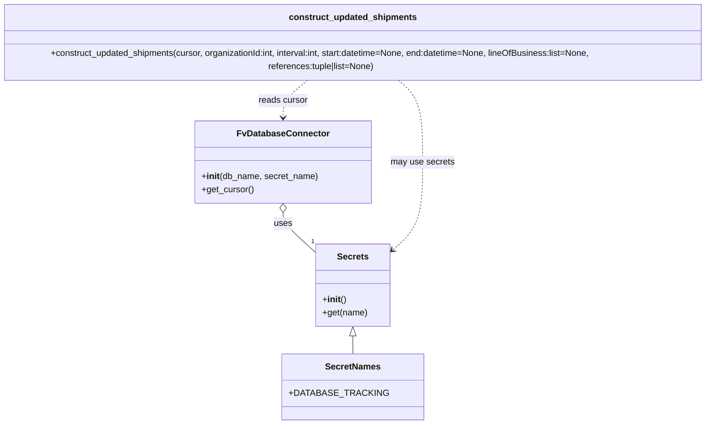

# Diagram: tools/ide_local_testing/localTest/test/shipment/getNgShipmentsUpdated.py


> Auto-generated by Obscura crawlers

## Diagram 1

```mermaid
flowchart TD
    A[main script] --> B[Secrets: Secrets()]
    A --> C[DB_CONN: FvDatabaseConnector("ng_shipment_api", SecretNames.DATABASE_TRACKING)]
    C --> D[get_cursor()]
    A --> E[construct_updated_shipments(...)]
    D --> E
    B --> E
    E --> F[retval]
    F --> G[print(retval)]
```

> SVG rendering failed for this diagram.

## Diagram 2



### SVG

<svg id="container" width="1356.46875" xmlns="http://www.w3.org/2000/svg" class="classDiagram" height="760" viewBox="0 0 1356.46875 760" role="graphics-document document" aria-roledescription="class"><style>#container{font-family:"trebuchet ms",verdana,arial,sans-serif;font-size:16px;fill:#333;}@keyframes edge-animation-frame{from{stroke-dashoffset:0;}}@keyframes dash{to{stroke-dashoffset:0;}}#container .edge-animation-slow{stroke-dasharray:9,5!important;stroke-dashoffset:900;animation:dash 50s linear infinite;stroke-linecap:round;}#container .edge-animation-fast{stroke-dasharray:9,5!important;stroke-dashoffset:900;animation:dash 20s linear infinite;stroke-linecap:round;}#container .error-icon{fill:#552222;}#container .error-text{fill:#552222;stroke:#552222;}#container .edge-thickness-normal{stroke-width:1px;}#container .edge-thickness-thick{stroke-width:3.5px;}#container .edge-pattern-solid{stroke-dasharray:0;}#container .edge-thickness-invisible{stroke-width:0;fill:none;}#container .edge-pattern-dashed{stroke-dasharray:3;}#container .edge-pattern-dotted{stroke-dasharray:2;}#container .marker{fill:#333333;stroke:#333333;}#container .marker.cross{stroke:#333333;}#container svg{font-family:"trebuchet ms",verdana,arial,sans-serif;font-size:16px;}#container p{margin:0;}#container g.classGroup text{fill:#9370DB;stroke:none;font-family:"trebuchet ms",verdana,arial,sans-serif;font-size:10px;}#container g.classGroup text .title{font-weight:bolder;}#container .nodeLabel,#container .edgeLabel{color:#131300;}#container .edgeLabel .label rect{fill:#ECECFF;}#container .label text{fill:#131300;}#container .labelBkg{background:#ECECFF;}#container .edgeLabel .label span{background:#ECECFF;}#container .classTitle{font-weight:bolder;}#container .node rect,#container .node circle,#container .node ellipse,#container .node polygon,#container .node path{fill:#ECECFF;stroke:#9370DB;stroke-width:1px;}#container .divider{stroke:#9370DB;stroke-width:1;}#container g.clickable{cursor:pointer;}#container g.classGroup rect{fill:#ECECFF;stroke:#9370DB;}#container g.classGroup line{stroke:#9370DB;stroke-width:1;}#container .classLabel .box{stroke:none;stroke-width:0;fill:#ECECFF;opacity:0.5;}#container .classLabel .label{fill:#9370DB;font-size:10px;}#container .relation{stroke:#333333;stroke-width:1;fill:none;}#container .dashed-line{stroke-dasharray:3;}#container .dotted-line{stroke-dasharray:1 2;}#container #compositionStart,#container .composition{fill:#333333!important;stroke:#333333!important;stroke-width:1;}#container #compositionEnd,#container .composition{fill:#333333!important;stroke:#333333!important;stroke-width:1;}#container #dependencyStart,#container .dependency{fill:#333333!important;stroke:#333333!important;stroke-width:1;}#container #dependencyStart,#container .dependency{fill:#333333!important;stroke:#333333!important;stroke-width:1;}#container #extensionStart,#container .extension{fill:transparent!important;stroke:#333333!important;stroke-width:1;}#container #extensionEnd,#container .extension{fill:transparent!important;stroke:#333333!important;stroke-width:1;}#container #aggregationStart,#container .aggregation{fill:transparent!important;stroke:#333333!important;stroke-width:1;}#container #aggregationEnd,#container .aggregation{fill:transparent!important;stroke:#333333!important;stroke-width:1;}#container #lollipopStart,#container .lollipop{fill:#ECECFF!important;stroke:#333333!important;stroke-width:1;}#container #lollipopEnd,#container .lollipop{fill:#ECECFF!important;stroke:#333333!important;stroke-width:1;}#container .edgeTerminals{font-size:11px;line-height:initial;}#container .classTitleText{text-anchor:middle;font-size:18px;fill:#333;}#container .label-icon{display:inline-block;height:1em;overflow:visible;vertical-align:-0.125em;}#container .node .label-icon path{fill:currentColor;stroke:revert;stroke-width:revert;}#container :root{--mermaid-font-family:"trebuchet ms",verdana,arial,sans-serif;}</style><g><defs><marker id="container_class-aggregationStart" class="marker aggregation class" refX="18" refY="7" markerWidth="190" markerHeight="240" orient="auto"><path d="M 18,7 L9,13 L1,7 L9,1 Z"></path></marker></defs><defs><marker id="container_class-aggregationEnd" class="marker aggregation class" refX="1" refY="7" markerWidth="20" markerHeight="28" orient="auto"><path d="M 18,7 L9,13 L1,7 L9,1 Z"></path></marker></defs><defs><marker id="container_class-extensionStart" class="marker extension class" refX="18" refY="7" markerWidth="190" markerHeight="240" orient="auto"><path d="M 1,7 L18,13 V 1 Z"></path></marker></defs><defs><marker id="container_class-extensionEnd" class="marker extension class" refX="1" refY="7" markerWidth="20" markerHeight="28" orient="auto"><path d="M 1,1 V 13 L18,7 Z"></path></marker></defs><defs><marker id="container_class-compositionStart" class="marker composition class" refX="18" refY="7" markerWidth="190" markerHeight="240" orient="auto"><path d="M 18,7 L9,13 L1,7 L9,1 Z"></path></marker></defs><defs><marker id="container_class-compositionEnd" class="marker composition class" refX="1" refY="7" markerWidth="20" markerHeight="28" orient="auto"><path d="M 18,7 L9,13 L1,7 L9,1 Z"></path></marker></defs><defs><marker id="container_class-dependencyStart" class="marker dependency class" refX="6" refY="7" markerWidth="190" markerHeight="240" orient="auto"><path d="M 5,7 L9,13 L1,7 L9,1 Z"></path></marker></defs><defs><marker id="container_class-dependencyEnd" class="marker dependency class" refX="13" refY="7" markerWidth="20" markerHeight="28" orient="auto"><path d="M 18,7 L9,13 L14,7 L9,1 Z"></path></marker></defs><defs><marker id="container_class-lollipopStart" class="marker lollipop class" refX="13" refY="7" markerWidth="190" markerHeight="240" orient="auto"><circle stroke="black" fill="transparent" cx="7" cy="7" r="6"></circle></marker></defs><defs><marker id="container_class-lollipopEnd" class="marker lollipop class" refX="1" refY="7" markerWidth="190" markerHeight="240" orient="auto"><circle stroke="black" fill="transparent" cx="7" cy="7" r="6"></circle></marker></defs><g class="root"><g class="clusters"></g><g class="edgePaths"><path d="M678.234,599.25L678.234,600.542C678.234,601.833,678.234,604.417,678.234,609.875C678.234,615.333,678.234,623.667,678.234,627.833L678.234,632" id="id_Secrets_SecretNames_1" class="edge-thickness-normal edge-pattern-solid relation" style=";;;" data-edge="true" data-et="edge" data-id="id_Secrets_SecretNames_1" data-points="W3sieCI6Njc4LjIzNDM3NSwieSI6NTgyfSx7IngiOjY3OC4yMzQzNzUsInkiOjYwN30seyJ4Ijo2NzguMjM0Mzc1LCJ5Ijo2MzJ9XQ==" marker-start="url(#container_class-extensionStart)"></path><path d="M553.229,375.25L553.229,378.542C553.229,381.833,553.229,388.417,563.013,400.475C572.797,412.532,592.365,430.065,602.149,438.831L611.934,447.597" id="id_FvDatabaseConnector_Secrets_2" class="edge-thickness-normal edge-pattern-solid relation" style=";;;" data-edge="true" data-et="edge" data-id="id_FvDatabaseConnector_Secrets_2" data-points="W3sieCI6NTUzLjIyODUxNTYyNSwieSI6MzU4fSx7IngiOjU1My4yMjg1MTU2MjUsInkiOjM5NX0seyJ4Ijo2MTEuOTMzNTkzNzUsInkiOjQ0Ny41OTcyODQ1MDIyODg5N31d" marker-start="url(#container_class-aggregationStart)"></path><path d="M599.481,134L591.772,140.167C584.063,146.333,568.646,158.667,560.937,170C553.229,181.333,553.229,191.667,553.229,196.833L553.229,202" id="id_construct_updated_shipments_FvDatabaseConnector_3" class="edge-thickness-normal edge-pattern-dashed relation" style=";;;" data-edge="true" data-et="edge" data-id="id_construct_updated_shipments_FvDatabaseConnector_3" data-points="W3sieCI6NTk5LjQ4MDY4MzU5Mzc1LCJ5IjoxMzR9LHsieCI6NTUzLjIyODUxNTYyNSwieSI6MTcxfSx7IngiOjU1My4yMjg1MTU2MjUsInkiOjIwOH1d" marker-end="url(#container_class-dependencyEnd)"></path><path d="M756.988,134L764.697,140.167C772.405,146.333,787.823,158.667,795.532,183.5C803.24,208.333,803.24,245.667,803.24,283C803.24,320.333,803.24,357.667,794.201,384.432C785.161,411.198,767.083,427.396,758.043,435.495L749.004,443.593" id="id_construct_updated_shipments_Secrets_4" class="edge-thickness-normal edge-pattern-dashed relation" style=";;;" data-edge="true" data-et="edge" data-id="id_construct_updated_shipments_Secrets_4" data-points="W3sieCI6NzU2Ljk4ODA2NjQwNjI1LCJ5IjoxMzR9LHsieCI6ODAzLjI0MDIzNDM3NSwieSI6MTcxfSx7IngiOjgwMy4yNDAyMzQzNzUsInkiOjI4M30seyJ4Ijo4MDMuMjQwMjM0Mzc1LCJ5IjozOTV9LHsieCI6NzQ0LjUzNTE1NjI1LCJ5Ijo0NDcuNTk3Mjg0NTAyMjg4OTd9XQ==" marker-end="url(#container_class-dependencyEnd)"></path></g><g class="edgeLabels"><g class="edgeLabel"><g class="label" data-id="id_Secrets_SecretNames_1" transform="translate(0, 0)"><foreignObject width="0" height="0"><div xmlns="http://www.w3.org/1999/xhtml" class="labelBkg" style="display: table-cell; white-space: nowrap; line-height: 1.5; max-width: 200px; text-align: center;"><span class="edgeLabel"></span></div></foreignObject></g></g><g class="edgeLabel" transform="translate(553.228515625, 395)"><g class="label" data-id="id_FvDatabaseConnector_Secrets_2" transform="translate(-16.4921875, -12)"><foreignObject width="32.984375" height="24"><div xmlns="http://www.w3.org/1999/xhtml" class="labelBkg" style="display: table-cell; white-space: nowrap; line-height: 1.5; max-width: 200px; text-align: center;"><span class="edgeLabel"><p>uses</p></span></div></foreignObject></g></g><g class="edgeLabel" transform="translate(553.228515625, 171)"><g class="label" data-id="id_construct_updated_shipments_FvDatabaseConnector_3" transform="translate(-44.984375, -12)"><foreignObject width="89.96875" height="24"><div xmlns="http://www.w3.org/1999/xhtml" class="labelBkg" style="display: table-cell; white-space: nowrap; line-height: 1.5; max-width: 200px; text-align: center;"><span class="edgeLabel"><p>reads cursor</p></span></div></foreignObject></g></g><g class="edgeLabel" transform="translate(803.240234375, 283)"><g class="label" data-id="id_construct_updated_shipments_Secrets_4" transform="translate(-57.7734375, -12)"><foreignObject width="115.546875" height="24"><div xmlns="http://www.w3.org/1999/xhtml" class="labelBkg" style="display: table-cell; white-space: nowrap; line-height: 1.5; max-width: 200px; text-align: center;"><span class="edgeLabel"><p>may use secrets</p></span></div></foreignObject></g></g><g class="edgeTerminals" transform="translate(603.9092789819285, 419.7476991004019)"><g class="inner" transform="translate(0, 0)"></g><foreignObject style="width: 9px; height: 12px;"><div xmlns="http://www.w3.org/1999/xhtml" style="display: inline-block; padding-right: 1px; white-space: nowrap;"><span class="edgeLabel">1</span></div></foreignObject></g></g><g class="nodes"><g class="node default" id="classId-Secrets-0" transform="translate(678.234375, 507)"><g class="basic label-container"><path d="M-66.30078125 -75 L66.30078125 -75 L66.30078125 75 L-66.30078125 75" stroke="none" stroke-width="0" fill="#ECECFF" style=""></path><path d="M-66.30078125 -75 C-36.82679954180823 -75, -7.352817833616463 -75, 66.30078125 -75 M-66.30078125 -75 C-34.82675448914344 -75, -3.3527277282868866 -75, 66.30078125 -75 M66.30078125 -75 C66.30078125 -16.149478789710265, 66.30078125 42.70104242057947, 66.30078125 75 M66.30078125 -75 C66.30078125 -20.126979598512598, 66.30078125 34.746040802974804, 66.30078125 75 M66.30078125 75 C29.598169278337764 75, -7.104442693324472 75, -66.30078125 75 M66.30078125 75 C19.451694997404466 75, -27.397391255191067 75, -66.30078125 75 M-66.30078125 75 C-66.30078125 35.744146766451344, -66.30078125 -3.511706467097312, -66.30078125 -75 M-66.30078125 75 C-66.30078125 35.844970441350114, -66.30078125 -3.3100591172997724, -66.30078125 -75" stroke="#9370DB" stroke-width="1.3" fill="none" stroke-dasharray="0 0" style=""></path></g><g class="annotation-group text" transform="translate(0, -51)"></g><g class="label-group text" transform="translate(-27.1640625, -51)"><g class="label" style="font-weight: bolder" transform="translate(0,-12)"><foreignObject width="54.328125" height="24"><div xmlns="http://www.w3.org/1999/xhtml" style="display: table-cell; white-space: nowrap; line-height: 1.5; max-width: 103px; text-align: center;"><span class="nodeLabel markdown-node-label" style=""><p>Secrets</p></span></div></foreignObject></g></g><g class="members-group text" transform="translate(-54.30078125, -3)"></g><g class="methods-group text" transform="translate(-54.30078125, 27)"><g class="label" style="" transform="translate(0,-12)"><foreignObject width="42.796875" height="24"><div xmlns="http://www.w3.org/1999/xhtml" style="display: table-cell; white-space: nowrap; line-height: 1.5; max-width: 132px; text-align: center;"><span class="nodeLabel markdown-node-label" style=""><p>+<strong>init</strong>()</p></span></div></foreignObject></g><g class="label" style="" transform="translate(0,12)"><foreignObject width="81.4375" height="24"><div xmlns="http://www.w3.org/1999/xhtml" style="display: table-cell; white-space: nowrap; line-height: 1.5; max-width: 139px; text-align: center;"><span class="nodeLabel markdown-node-label" style=""><p>+get(name)</p></span></div></foreignObject></g></g><g class="divider" style=""><path d="M-66.30078125 -27 C-19.963276570650763 -27, 26.374228108698475 -27, 66.30078125 -27 M-66.30078125 -27 C-38.29997064353394 -27, -10.299160037067878 -27, 66.30078125 -27" stroke="#9370DB" stroke-width="1.3" fill="none" stroke-dasharray="0 0" style=""></path></g><g class="divider" style=""><path d="M-66.30078125 -3 C-34.007165853393985 -3, -1.7135504567879707 -3, 66.30078125 -3 M-66.30078125 -3 C-23.938746633431286 -3, 18.423287983137428 -3, 66.30078125 -3" stroke="#9370DB" stroke-width="1.3" fill="none" stroke-dasharray="0 0" style=""></path></g></g><g class="node default" id="classId-SecretNames-1" transform="translate(678.234375, 692)"><g class="basic label-container"><path d="M-114.9375 -60 L114.9375 -60 L114.9375 60 L-114.9375 60" stroke="none" stroke-width="0" fill="#ECECFF" style=""></path><path d="M-114.9375 -60 C-33.228541318035795 -60, 48.48041736392841 -60, 114.9375 -60 M-114.9375 -60 C-50.90418294354993 -60, 13.129134112900147 -60, 114.9375 -60 M114.9375 -60 C114.9375 -21.953244569087822, 114.9375 16.093510861824356, 114.9375 60 M114.9375 -60 C114.9375 -35.30990141286489, 114.9375 -10.61980282572977, 114.9375 60 M114.9375 60 C45.3054223958454 60, -24.326655208309205 60, -114.9375 60 M114.9375 60 C66.29308110490375 60, 17.648662209807497 60, -114.9375 60 M-114.9375 60 C-114.9375 31.498328412827156, -114.9375 2.9966568256543127, -114.9375 -60 M-114.9375 60 C-114.9375 17.43777906584691, -114.9375 -25.124441868306178, -114.9375 -60" stroke="#9370DB" stroke-width="1.3" fill="none" stroke-dasharray="0 0" style=""></path></g><g class="annotation-group text" transform="translate(0, -36)"></g><g class="label-group text" transform="translate(-48.03125, -36)"><g class="label" style="font-weight: bolder" transform="translate(0,-12)"><foreignObject width="96.0625" height="24"><div xmlns="http://www.w3.org/1999/xhtml" style="display: table-cell; white-space: nowrap; line-height: 1.5; max-width: 145px; text-align: center;"><span class="nodeLabel markdown-node-label" style=""><p>SecretNames</p></span></div></foreignObject></g></g><g class="members-group text" transform="translate(-102.9375, 12)"><g class="label" style="" transform="translate(0,-12)"><foreignObject width="157.84375" height="24"><div xmlns="http://www.w3.org/1999/xhtml" style="display: table-cell; white-space: nowrap; line-height: 1.5; max-width: 215px; text-align: center;"><span class="nodeLabel markdown-node-label" style=""><p>+DATABASE_TRACKING</p></span></div></foreignObject></g></g><g class="methods-group text" transform="translate(-102.9375, 60)"></g><g class="divider" style=""><path d="M-114.9375 -12 C-53.83289392795506 -12, 7.271712144089875 -12, 114.9375 -12 M-114.9375 -12 C-62.23609413151853 -12, -9.534688263037054 -12, 114.9375 -12" stroke="#9370DB" stroke-width="1.3" fill="none" stroke-dasharray="0 0" style=""></path></g><g class="divider" style=""><path d="M-114.9375 36 C-25.83454098577957 36, 63.26841802844086 36, 114.9375 36 M-114.9375 36 C-64.8439464321659 36, -14.7503928643318 36, 114.9375 36" stroke="#9370DB" stroke-width="1.3" fill="none" stroke-dasharray="0 0" style=""></path></g></g><g class="node default" id="classId-FvDatabaseConnector-2" transform="translate(553.228515625, 283)"><g class="basic label-container"><path d="M-157.23828125 -75 L157.23828125 -75 L157.23828125 75 L-157.23828125 75" stroke="none" stroke-width="0" fill="#ECECFF" style=""></path><path d="M-157.23828125 -75 C-43.28727493927482 -75, 70.66373137145035 -75, 157.23828125 -75 M-157.23828125 -75 C-60.77387020369227 -75, 35.69054084261546 -75, 157.23828125 -75 M157.23828125 -75 C157.23828125 -43.97299197022759, 157.23828125 -12.945983940455179, 157.23828125 75 M157.23828125 -75 C157.23828125 -21.697160231183112, 157.23828125 31.605679537633776, 157.23828125 75 M157.23828125 75 C67.1550484057187 75, -22.928184438562596 75, -157.23828125 75 M157.23828125 75 C81.33207803882785 75, 5.42587482765569 75, -157.23828125 75 M-157.23828125 75 C-157.23828125 40.54968031584733, -157.23828125 6.099360631694665, -157.23828125 -75 M-157.23828125 75 C-157.23828125 38.55204174876802, -157.23828125 2.1040834975360383, -157.23828125 -75" stroke="#9370DB" stroke-width="1.3" fill="none" stroke-dasharray="0 0" style=""></path></g><g class="annotation-group text" transform="translate(0, -51)"></g><g class="label-group text" transform="translate(-79.3046875, -51)"><g class="label" style="font-weight: bolder" transform="translate(0,-12)"><foreignObject width="158.609375" height="24"><div xmlns="http://www.w3.org/1999/xhtml" style="display: table-cell; white-space: nowrap; line-height: 1.5; max-width: 207px; text-align: center;"><span class="nodeLabel markdown-node-label" style=""><p>FvDatabaseConnector</p></span></div></foreignObject></g></g><g class="members-group text" transform="translate(-145.23828125, -3)"></g><g class="methods-group text" transform="translate(-145.23828125, 27)"><g class="label" style="" transform="translate(0,-12)"><foreignObject width="211.171875" height="24"><div xmlns="http://www.w3.org/1999/xhtml" style="display: table-cell; white-space: nowrap; line-height: 1.5; max-width: 300px; text-align: center;"><span class="nodeLabel markdown-node-label" style=""><p>+<strong>init</strong>(db_name, secret_name)</p></span></div></foreignObject></g><g class="label" style="" transform="translate(0,12)"><foreignObject width="94.640625" height="24"><div xmlns="http://www.w3.org/1999/xhtml" style="display: table-cell; white-space: nowrap; line-height: 1.5; max-width: 152px; text-align: center;"><span class="nodeLabel markdown-node-label" style=""><p>+get_cursor()</p></span></div></foreignObject></g></g><g class="divider" style=""><path d="M-157.23828125 -27 C-71.34973065442712 -27, 14.53881994114576 -27, 157.23828125 -27 M-157.23828125 -27 C-85.69509194485836 -27, -14.151902639716724 -27, 157.23828125 -27" stroke="#9370DB" stroke-width="1.3" fill="none" stroke-dasharray="0 0" style=""></path></g><g class="divider" style=""><path d="M-157.23828125 -3 C-80.949734458031 -3, -4.6611876660620055 -3, 157.23828125 -3 M-157.23828125 -3 C-81.21225192027357 -3, -5.186222590547146 -3, 157.23828125 -3" stroke="#9370DB" stroke-width="1.3" fill="none" stroke-dasharray="0 0" style=""></path></g></g><g class="node default" id="classId-construct_updated_shipments-3" transform="translate(678.234375, 71)"><g class="basic label-container"><path d="M-670.234375 -63 L670.234375 -63 L670.234375 63 L-670.234375 63" stroke="none" stroke-width="0" fill="#ECECFF" style=""></path><path d="M-670.234375 -63 C-189.78373742861476 -63, 290.6669001427705 -63, 670.234375 -63 M-670.234375 -63 C-162.63242890979666 -63, 344.9695171804067 -63, 670.234375 -63 M670.234375 -63 C670.234375 -19.991397706895597, 670.234375 23.017204586208805, 670.234375 63 M670.234375 -63 C670.234375 -14.6182311277312, 670.234375 33.7635377445376, 670.234375 63 M670.234375 63 C207.8432780419189 63, -254.5478189161622 63, -670.234375 63 M670.234375 63 C167.82233852912879 63, -334.58969794174243 63, -670.234375 63 M-670.234375 63 C-670.234375 26.57048877131149, -670.234375 -9.859022457377023, -670.234375 -63 M-670.234375 63 C-670.234375 14.789391481130224, -670.234375 -33.42121703773955, -670.234375 -63" stroke="#9370DB" stroke-width="1.3" fill="none" stroke-dasharray="0 0" style=""></path></g><g class="annotation-group text" transform="translate(0, -39)"></g><g class="label-group text" transform="translate(-111.734375, -39)"><g class="label" style="font-weight: bolder" transform="translate(0,-12)"><foreignObject width="223.46875" height="24"><div xmlns="http://www.w3.org/1999/xhtml" style="display: table-cell; white-space: nowrap; line-height: 1.5; max-width: 271px; text-align: center;"><span class="nodeLabel markdown-node-label" style=""><p>construct_updated_shipments</p></span></div></foreignObject></g></g><g class="members-group text" transform="translate(-658.234375, 9)"></g><g class="methods-group text" transform="translate(-658.234375, 39)"><g class="label" style="" transform="translate(0,-12)"><foreignObject width="1204.734375" height="24"><div xmlns="http://www.w3.org/1999/xhtml" style="display: table-cell; white-space: nowrap; line-height: 1.5; max-width: 1262px; text-align: center;"><span class="nodeLabel markdown-node-label" style=""><p>+construct_updated_shipments(cursor, organizationId:int, interval:int, start:datetime=None, end:datetime=None, lineOfBusiness:list=None, references:tuple|list=None)</p></span></div></foreignObject></g></g><g class="divider" style=""><path d="M-670.234375 -15 C-376.13829437389035 -15, -82.04221374778069 -15, 670.234375 -15 M-670.234375 -15 C-286.4445291479641 -15, 97.34531670407182 -15, 670.234375 -15" stroke="#9370DB" stroke-width="1.3" fill="none" stroke-dasharray="0 0" style=""></path></g><g class="divider" style=""><path d="M-670.234375 9 C-301.59181254140435 9, 67.0507499171913 9, 670.234375 9 M-670.234375 9 C-182.73165342124668 9, 304.77106815750665 9, 670.234375 9" stroke="#9370DB" stroke-width="1.3" fill="none" stroke-dasharray="0 0" style=""></path></g></g></g></g></g></svg>
