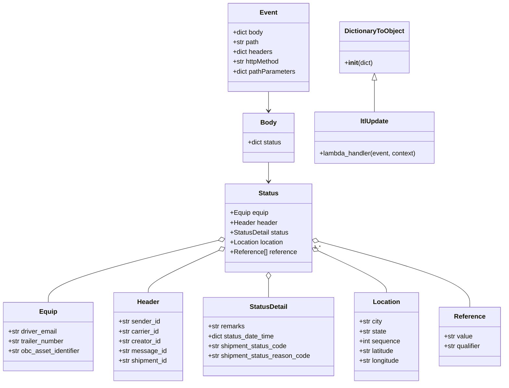

# Diagram: tools/ide_local_testing/localTest/test/shipment/ltlUpdate.py


> Auto-generated by Obscura crawlers

## Diagram 1



### SVG

<svg id="container" width="1243.6171875" xmlns="http://www.w3.org/2000/svg" class="classDiagram" height="940" viewBox="0 0 1243.6171875 940" role="graphics-document document" aria-roledescription="class"><style>#container{font-family:"trebuchet ms",verdana,arial,sans-serif;font-size:16px;fill:#333;}@keyframes edge-animation-frame{from{stroke-dashoffset:0;}}@keyframes dash{to{stroke-dashoffset:0;}}#container .edge-animation-slow{stroke-dasharray:9,5!important;stroke-dashoffset:900;animation:dash 50s linear infinite;stroke-linecap:round;}#container .edge-animation-fast{stroke-dasharray:9,5!important;stroke-dashoffset:900;animation:dash 20s linear infinite;stroke-linecap:round;}#container .error-icon{fill:#552222;}#container .error-text{fill:#552222;stroke:#552222;}#container .edge-thickness-normal{stroke-width:1px;}#container .edge-thickness-thick{stroke-width:3.5px;}#container .edge-pattern-solid{stroke-dasharray:0;}#container .edge-thickness-invisible{stroke-width:0;fill:none;}#container .edge-pattern-dashed{stroke-dasharray:3;}#container .edge-pattern-dotted{stroke-dasharray:2;}#container .marker{fill:#333333;stroke:#333333;}#container .marker.cross{stroke:#333333;}#container svg{font-family:"trebuchet ms",verdana,arial,sans-serif;font-size:16px;}#container p{margin:0;}#container g.classGroup text{fill:#9370DB;stroke:none;font-family:"trebuchet ms",verdana,arial,sans-serif;font-size:10px;}#container g.classGroup text .title{font-weight:bolder;}#container .nodeLabel,#container .edgeLabel{color:#131300;}#container .edgeLabel .label rect{fill:#ECECFF;}#container .label text{fill:#131300;}#container .labelBkg{background:#ECECFF;}#container .edgeLabel .label span{background:#ECECFF;}#container .classTitle{font-weight:bolder;}#container .node rect,#container .node circle,#container .node ellipse,#container .node polygon,#container .node path{fill:#ECECFF;stroke:#9370DB;stroke-width:1px;}#container .divider{stroke:#9370DB;stroke-width:1;}#container g.clickable{cursor:pointer;}#container g.classGroup rect{fill:#ECECFF;stroke:#9370DB;}#container g.classGroup line{stroke:#9370DB;stroke-width:1;}#container .classLabel .box{stroke:none;stroke-width:0;fill:#ECECFF;opacity:0.5;}#container .classLabel .label{fill:#9370DB;font-size:10px;}#container .relation{stroke:#333333;stroke-width:1;fill:none;}#container .dashed-line{stroke-dasharray:3;}#container .dotted-line{stroke-dasharray:1 2;}#container #compositionStart,#container .composition{fill:#333333!important;stroke:#333333!important;stroke-width:1;}#container #compositionEnd,#container .composition{fill:#333333!important;stroke:#333333!important;stroke-width:1;}#container #dependencyStart,#container .dependency{fill:#333333!important;stroke:#333333!important;stroke-width:1;}#container #dependencyStart,#container .dependency{fill:#333333!important;stroke:#333333!important;stroke-width:1;}#container #extensionStart,#container .extension{fill:transparent!important;stroke:#333333!important;stroke-width:1;}#container #extensionEnd,#container .extension{fill:transparent!important;stroke:#333333!important;stroke-width:1;}#container #aggregationStart,#container .aggregation{fill:transparent!important;stroke:#333333!important;stroke-width:1;}#container #aggregationEnd,#container .aggregation{fill:transparent!important;stroke:#333333!important;stroke-width:1;}#container #lollipopStart,#container .lollipop{fill:#ECECFF!important;stroke:#333333!important;stroke-width:1;}#container #lollipopEnd,#container .lollipop{fill:#ECECFF!important;stroke:#333333!important;stroke-width:1;}#container .edgeTerminals{font-size:11px;line-height:initial;}#container .classTitleText{text-anchor:middle;font-size:18px;fill:#333;}#container .label-icon{display:inline-block;height:1em;overflow:visible;vertical-align:-0.125em;}#container .node .label-icon path{fill:currentColor;stroke:revert;stroke-width:revert;}#container :root{--mermaid-font-family:"trebuchet ms",verdana,arial,sans-serif;}</style><g><defs><marker id="container_class-aggregationStart" class="marker aggregation class" refX="18" refY="7" markerWidth="190" markerHeight="240" orient="auto"><path d="M 18,7 L9,13 L1,7 L9,1 Z"></path></marker></defs><defs><marker id="container_class-aggregationEnd" class="marker aggregation class" refX="1" refY="7" markerWidth="20" markerHeight="28" orient="auto"><path d="M 18,7 L9,13 L1,7 L9,1 Z"></path></marker></defs><defs><marker id="container_class-extensionStart" class="marker extension class" refX="18" refY="7" markerWidth="190" markerHeight="240" orient="auto"><path d="M 1,7 L18,13 V 1 Z"></path></marker></defs><defs><marker id="container_class-extensionEnd" class="marker extension class" refX="1" refY="7" markerWidth="20" markerHeight="28" orient="auto"><path d="M 1,1 V 13 L18,7 Z"></path></marker></defs><defs><marker id="container_class-compositionStart" class="marker composition class" refX="18" refY="7" markerWidth="190" markerHeight="240" orient="auto"><path d="M 18,7 L9,13 L1,7 L9,1 Z"></path></marker></defs><defs><marker id="container_class-compositionEnd" class="marker composition class" refX="1" refY="7" markerWidth="20" markerHeight="28" orient="auto"><path d="M 18,7 L9,13 L1,7 L9,1 Z"></path></marker></defs><defs><marker id="container_class-dependencyStart" class="marker dependency class" refX="6" refY="7" markerWidth="190" markerHeight="240" orient="auto"><path d="M 5,7 L9,13 L1,7 L9,1 Z"></path></marker></defs><defs><marker id="container_class-dependencyEnd" class="marker dependency class" refX="13" refY="7" markerWidth="20" markerHeight="28" orient="auto"><path d="M 18,7 L9,13 L14,7 L9,1 Z"></path></marker></defs><defs><marker id="container_class-lollipopStart" class="marker lollipop class" refX="13" refY="7" markerWidth="190" markerHeight="240" orient="auto"><circle stroke="black" fill="transparent" cx="7" cy="7" r="6"></circle></marker></defs><defs><marker id="container_class-lollipopEnd" class="marker lollipop class" refX="1" refY="7" markerWidth="190" markerHeight="240" orient="auto"><circle stroke="black" fill="transparent" cx="7" cy="7" r="6"></circle></marker></defs><g class="root"><g class="clusters"></g><g class="edgePaths"><path d="M665.246,224L665.246,228.167C665.246,232.333,665.246,240.667,665.246,248.5C665.246,256.333,665.246,263.667,665.246,267.333L665.246,271" id="id_Event_Body_1" class="edge-thickness-normal edge-pattern-solid relation" style=";;;" data-edge="true" data-et="edge" data-id="id_Event_Body_1" data-points="W3sieCI6NjY1LjI0NjA5Mzc1LCJ5IjoyMjR9LHsieCI6NjY1LjI0NjA5Mzc1LCJ5IjoyNDl9LHsieCI6NjY1LjI0NjA5Mzc1LCJ5IjoyNzd9XQ==" marker-end="url(#container_class-dependencyEnd)"></path><path d="M665.246,397L665.246,401.667C665.246,406.333,665.246,415.667,665.246,423.5C665.246,431.333,665.246,437.667,665.246,440.833L665.246,444" id="id_Body_Status_2" class="edge-thickness-normal edge-pattern-solid relation" style=";;;" data-edge="true" data-et="edge" data-id="id_Body_Status_2" data-points="W3sieCI6NjY1LjI0NjA5Mzc1LCJ5IjozOTd9LHsieCI6NjY1LjI0NjA5Mzc1LCJ5Ijo0MjV9LHsieCI6NjY1LjI0NjA5Mzc1LCJ5Ijo0NTB9XQ==" marker-end="url(#container_class-dependencyEnd)"></path><path d="M543.432,587.695L472.804,604.913C402.175,622.13,260.917,656.565,190.289,681.949C119.66,707.333,119.66,723.667,119.66,731.833L119.66,740" id="id_Status_Equip_3" class="edge-thickness-normal edge-pattern-solid relation" style=";;;" data-edge="true" data-et="edge" data-id="id_Status_Equip_3" data-points="W3sieCI6NTYwLjE5MTQwNjI1LCJ5Ijo1ODMuNjA5NjY1NjQwNDM4Mn0seyJ4IjoxMTkuNjYwMTU2MjUsInkiOjY5MX0seyJ4IjoxMTkuNjYwMTU2MjUsInkiOjc0MH1d" marker-start="url(#container_class-aggregationStart)"></path><path d="M544.444,612.017L515.005,625.181C485.566,638.345,426.687,664.672,397.248,682.003C367.809,699.333,367.809,707.667,367.809,711.833L367.809,716" id="id_Status_Header_4" class="edge-thickness-normal edge-pattern-solid relation" style=";;;" data-edge="true" data-et="edge" data-id="id_Status_Header_4" data-points="W3sieCI6NTYwLjE5MTQwNjI1LCJ5Ijo2MDQuOTc1NDkzODAxMjE4N30seyJ4IjozNjcuODA4NTkzNzUsInkiOjY5MX0seyJ4IjozNjcuODA4NTkzNzUsInkiOjcxNn1d" marker-start="url(#container_class-aggregationStart)"></path><path d="M665.246,683.25L665.246,684.542C665.246,685.833,665.246,688.417,665.246,695.875C665.246,703.333,665.246,715.667,665.246,721.833L665.246,728" id="id_Status_StatusDetail_5" class="edge-thickness-normal edge-pattern-solid relation" style=";;;" data-edge="true" data-et="edge" data-id="id_Status_StatusDetail_5" data-points="W3sieCI6NjY1LjI0NjA5Mzc1LCJ5Ijo2NjZ9LHsieCI6NjY1LjI0NjA5Mzc1LCJ5Ijo2OTF9LHsieCI6NjY1LjI0NjA5Mzc1LCJ5Ijo3Mjh9XQ==" marker-start="url(#container_class-aggregationStart)"></path><path d="M785.973,613.517L814.055,626.431C842.137,639.345,898.301,665.172,926.383,682.253C954.465,699.333,954.465,707.667,954.465,711.833L954.465,716" id="id_Status_Location_6" class="edge-thickness-normal edge-pattern-solid relation" style=";;;" data-edge="true" data-et="edge" data-id="id_Status_Location_6" data-points="W3sieCI6NzcwLjMwMDc4MTI1LCJ5Ijo2MDYuMzEwMzk5NzgzOTAwNn0seyJ4Ijo5NTQuNDY0ODQzNzUsInkiOjY5MX0seyJ4Ijo5NTQuNDY0ODQzNzUsInkiOjcxNn1d" marker-start="url(#container_class-aggregationStart)"></path><path d="M786.957,590.773L848.994,607.478C911.03,624.182,1035.103,657.591,1097.139,684.462C1159.176,711.333,1159.176,731.667,1159.176,741.833L1159.176,752" id="id_Status_Reference_7" class="edge-thickness-normal edge-pattern-solid relation" style=";;;" data-edge="true" data-et="edge" data-id="id_Status_Reference_7" data-points="W3sieCI6NzcwLjMwMDc4MTI1LCJ5Ijo1ODYuMjg3OTgwNjM5OTU3fSx7IngiOjExNTkuMTc1NzgxMjUsInkiOjY5MX0seyJ4IjoxMTU5LjE3NTc4MTI1LCJ5Ijo3NTJ9XQ==" marker-start="url(#container_class-aggregationStart)"></path><path d="M927.832,196.25L927.832,205.042C927.832,213.833,927.832,231.417,927.832,244.375C927.832,257.333,927.832,265.667,927.832,269.833L927.832,274" id="id_DictionaryToObject_ltlUpdate_8" class="edge-thickness-normal edge-pattern-solid relation" style=";;;" data-edge="true" data-et="edge" data-id="id_DictionaryToObject_ltlUpdate_8" data-points="W3sieCI6OTI3LjgzMjAzMTI1LCJ5IjoxNzl9LHsieCI6OTI3LjgzMjAzMTI1LCJ5IjoyNDl9LHsieCI6OTI3LjgzMjAzMTI1LCJ5IjoyNzR9XQ==" marker-start="url(#container_class-extensionStart)"></path></g><g class="edgeLabels"><g class="edgeLabel"><g class="label" data-id="id_Event_Body_1" transform="translate(0, 0)"><foreignObject width="0" height="0"><div xmlns="http://www.w3.org/1999/xhtml" class="labelBkg" style="display: table-cell; white-space: nowrap; line-height: 1.5; max-width: 200px; text-align: center;"><span class="edgeLabel"></span></div></foreignObject></g></g><g class="edgeLabel"><g class="label" data-id="id_Body_Status_2" transform="translate(0, 0)"><foreignObject width="0" height="0"><div xmlns="http://www.w3.org/1999/xhtml" class="labelBkg" style="display: table-cell; white-space: nowrap; line-height: 1.5; max-width: 200px; text-align: center;"><span class="edgeLabel"></span></div></foreignObject></g></g><g class="edgeLabel"><g class="label" data-id="id_Status_Equip_3" transform="translate(0, 0)"><foreignObject width="0" height="0"><div xmlns="http://www.w3.org/1999/xhtml" class="labelBkg" style="display: table-cell; white-space: nowrap; line-height: 1.5; max-width: 200px; text-align: center;"><span class="edgeLabel"></span></div></foreignObject></g></g><g class="edgeLabel"><g class="label" data-id="id_Status_Header_4" transform="translate(0, 0)"><foreignObject width="0" height="0"><div xmlns="http://www.w3.org/1999/xhtml" class="labelBkg" style="display: table-cell; white-space: nowrap; line-height: 1.5; max-width: 200px; text-align: center;"><span class="edgeLabel"></span></div></foreignObject></g></g><g class="edgeLabel"><g class="label" data-id="id_Status_StatusDetail_5" transform="translate(0, 0)"><foreignObject width="0" height="0"><div xmlns="http://www.w3.org/1999/xhtml" class="labelBkg" style="display: table-cell; white-space: nowrap; line-height: 1.5; max-width: 200px; text-align: center;"><span class="edgeLabel"></span></div></foreignObject></g></g><g class="edgeLabel"><g class="label" data-id="id_Status_Location_6" transform="translate(0, 0)"><foreignObject width="0" height="0"><div xmlns="http://www.w3.org/1999/xhtml" class="labelBkg" style="display: table-cell; white-space: nowrap; line-height: 1.5; max-width: 200px; text-align: center;"><span class="edgeLabel"></span></div></foreignObject></g></g><g class="edgeLabel"><g class="label" data-id="id_Status_Reference_7" transform="translate(0, 0)"><foreignObject width="0" height="0"><div xmlns="http://www.w3.org/1999/xhtml" class="labelBkg" style="display: table-cell; white-space: nowrap; line-height: 1.5; max-width: 200px; text-align: center;"><span class="edgeLabel"></span></div></foreignObject></g></g><g class="edgeLabel"><g class="label" data-id="id_DictionaryToObject_ltlUpdate_8" transform="translate(0, 0)"><foreignObject width="0" height="0"><div xmlns="http://www.w3.org/1999/xhtml" class="labelBkg" style="display: table-cell; white-space: nowrap; line-height: 1.5; max-width: 200px; text-align: center;"><span class="edgeLabel"></span></div></foreignObject></g></g><g class="edgeTerminals" transform="translate(783.2987761573966, 605.3222173970635)"><g class="inner" transform="translate(0, 0)"><foreignObject style="width: 36px; height: 12px;"><div xmlns="http://www.w3.org/1999/xhtml" style="display: inline-block; padding-right: 1px; white-space: nowrap;"><span class="edgeLabel">1..*</span></div></foreignObject></g></g></g><g class="nodes"><g class="node default" id="classId-Event-0" transform="translate(665.24609375, 116)"><g class="basic label-container"><path d="M-99.33984375 -108 L99.33984375 -108 L99.33984375 108 L-99.33984375 108" stroke="none" stroke-width="0" fill="#ECECFF" style=""></path><path d="M-99.33984375 -108 C-21.175418860666426 -108, 56.98900602866715 -108, 99.33984375 -108 M-99.33984375 -108 C-28.936309574938193 -108, 41.467224600123615 -108, 99.33984375 -108 M99.33984375 -108 C99.33984375 -61.63847775414915, 99.33984375 -15.2769555082983, 99.33984375 108 M99.33984375 -108 C99.33984375 -31.852724422034058, 99.33984375 44.294551155931885, 99.33984375 108 M99.33984375 108 C35.202623883078985 108, -28.93459598384203 108, -99.33984375 108 M99.33984375 108 C32.393253952781464 108, -34.55333584443707 108, -99.33984375 108 M-99.33984375 108 C-99.33984375 63.455894179742614, -99.33984375 18.91178835948523, -99.33984375 -108 M-99.33984375 108 C-99.33984375 63.316368022635665, -99.33984375 18.63273604527133, -99.33984375 -108" stroke="#9370DB" stroke-width="1.3" fill="none" stroke-dasharray="0 0" style=""></path></g><g class="annotation-group text" transform="translate(0, -84)"></g><g class="label-group text" transform="translate(-20.2109375, -84)"><g class="label" style="font-weight: bolder" transform="translate(0,-12)"><foreignObject width="40.421875" height="24"><div xmlns="http://www.w3.org/1999/xhtml" style="display: table-cell; white-space: nowrap; line-height: 1.5; max-width: 90px; text-align: center;"><span class="nodeLabel markdown-node-label" style=""><p>Event</p></span></div></foreignObject></g></g><g class="members-group text" transform="translate(-87.33984375, -36)"><g class="label" style="" transform="translate(0,-12)"><foreignObject width="76.03125" height="24"><div xmlns="http://www.w3.org/1999/xhtml" style="display: table-cell; white-space: nowrap; line-height: 1.5; max-width: 134px; text-align: center;"><span class="nodeLabel markdown-node-label" style=""><p>+dict body</p></span></div></foreignObject></g><g class="label" style="" transform="translate(0,12)"><foreignObject width="64.859375" height="24"><div xmlns="http://www.w3.org/1999/xhtml" style="display: table-cell; white-space: nowrap; line-height: 1.5; max-width: 122px; text-align: center;"><span class="nodeLabel markdown-node-label" style=""><p>+str path</p></span></div></foreignObject></g><g class="label" style="" transform="translate(0,36)"><foreignObject width="98.078125" height="24"><div xmlns="http://www.w3.org/1999/xhtml" style="display: table-cell; white-space: nowrap; line-height: 1.5; max-width: 155px; text-align: center;"><span class="nodeLabel markdown-node-label" style=""><p>+dict headers</p></span></div></foreignObject></g><g class="label" style="" transform="translate(0,60)"><foreignObject width="117.3125" height="24"><div xmlns="http://www.w3.org/1999/xhtml" style="display: table-cell; white-space: nowrap; line-height: 1.5; max-width: 175px; text-align: center;"><span class="nodeLabel markdown-node-label" style=""><p>+str httpMethod</p></span></div></foreignObject></g><g class="label" style="" transform="translate(0,84)"><foreignObject width="154.46875" height="24"><div xmlns="http://www.w3.org/1999/xhtml" style="display: table-cell; white-space: nowrap; line-height: 1.5; max-width: 212px; text-align: center;"><span class="nodeLabel markdown-node-label" style=""><p>+dict pathParameters</p></span></div></foreignObject></g></g><g class="methods-group text" transform="translate(-87.33984375, 108)"></g><g class="divider" style=""><path d="M-99.33984375 -60 C-25.52133665737452 -60, 48.29717043525096 -60, 99.33984375 -60 M-99.33984375 -60 C-37.21211083316336 -60, 24.915622083673284 -60, 99.33984375 -60" stroke="#9370DB" stroke-width="1.3" fill="none" stroke-dasharray="0 0" style=""></path></g><g class="divider" style=""><path d="M-99.33984375 84 C-20.737863863760083 84, 57.864116022479834 84, 99.33984375 84 M-99.33984375 84 C-48.94575945284225 84, 1.4483248443154935 84, 99.33984375 84" stroke="#9370DB" stroke-width="1.3" fill="none" stroke-dasharray="0 0" style=""></path></g></g><g class="node default" id="classId-Body-1" transform="translate(665.24609375, 337)"><g class="basic label-container"><path d="M-63.34765625 -60 L63.34765625 -60 L63.34765625 60 L-63.34765625 60" stroke="none" stroke-width="0" fill="#ECECFF" style=""></path><path d="M-63.34765625 -60 C-15.774993594545613 -60, 31.797669060908774 -60, 63.34765625 -60 M-63.34765625 -60 C-25.070045777273826 -60, 13.207564695452348 -60, 63.34765625 -60 M63.34765625 -60 C63.34765625 -24.290637431625207, 63.34765625 11.418725136749586, 63.34765625 60 M63.34765625 -60 C63.34765625 -15.007329510953873, 63.34765625 29.985340978092253, 63.34765625 60 M63.34765625 60 C27.481830080520893 60, -8.383996088958213 60, -63.34765625 60 M63.34765625 60 C31.548321474217467 60, -0.2510133015650666 60, -63.34765625 60 M-63.34765625 60 C-63.34765625 35.285548036538344, -63.34765625 10.571096073076696, -63.34765625 -60 M-63.34765625 60 C-63.34765625 35.53651657707344, -63.34765625 11.073033154146884, -63.34765625 -60" stroke="#9370DB" stroke-width="1.3" fill="none" stroke-dasharray="0 0" style=""></path></g><g class="annotation-group text" transform="translate(0, -36)"></g><g class="label-group text" transform="translate(-18.5546875, -36)"><g class="label" style="font-weight: bolder" transform="translate(0,-12)"><foreignObject width="37.109375" height="24"><div xmlns="http://www.w3.org/1999/xhtml" style="display: table-cell; white-space: nowrap; line-height: 1.5; max-width: 87px; text-align: center;"><span class="nodeLabel markdown-node-label" style=""><p>Body</p></span></div></foreignObject></g></g><g class="members-group text" transform="translate(-51.34765625, 12)"><g class="label" style="" transform="translate(0,-12)"><foreignObject width="84.140625" height="24"><div xmlns="http://www.w3.org/1999/xhtml" style="display: table-cell; white-space: nowrap; line-height: 1.5; max-width: 142px; text-align: center;"><span class="nodeLabel markdown-node-label" style=""><p>+dict status</p></span></div></foreignObject></g></g><g class="methods-group text" transform="translate(-51.34765625, 60)"></g><g class="divider" style=""><path d="M-63.34765625 -12 C-28.87449083954987 -12, 5.598674570900258 -12, 63.34765625 -12 M-63.34765625 -12 C-25.48682865309638 -12, 12.373998943807237 -12, 63.34765625 -12" stroke="#9370DB" stroke-width="1.3" fill="none" stroke-dasharray="0 0" style=""></path></g><g class="divider" style=""><path d="M-63.34765625 36 C-19.976520723652357 36, 23.394614802695287 36, 63.34765625 36 M-63.34765625 36 C-30.52311463715531 36, 2.301426975689381 36, 63.34765625 36" stroke="#9370DB" stroke-width="1.3" fill="none" stroke-dasharray="0 0" style=""></path></g></g><g class="node default" id="classId-Status-2" transform="translate(665.24609375, 558)"><g class="basic label-container"><path d="M-105.0546875 -108 L105.0546875 -108 L105.0546875 108 L-105.0546875 108" stroke="none" stroke-width="0" fill="#ECECFF" style=""></path><path d="M-105.0546875 -108 C-43.989194749790954 -108, 17.07629800041809 -108, 105.0546875 -108 M-105.0546875 -108 C-29.84602330535141 -108, 45.36264088929718 -108, 105.0546875 -108 M105.0546875 -108 C105.0546875 -44.57390893479431, 105.0546875 18.85218213041138, 105.0546875 108 M105.0546875 -108 C105.0546875 -54.486783728673984, 105.0546875 -0.9735674573479685, 105.0546875 108 M105.0546875 108 C31.685147601671105 108, -41.68439229665779 108, -105.0546875 108 M105.0546875 108 C33.30188283047421 108, -38.450921839051574 108, -105.0546875 108 M-105.0546875 108 C-105.0546875 26.25173613438662, -105.0546875 -55.49652773122676, -105.0546875 -108 M-105.0546875 108 C-105.0546875 51.457154053778254, -105.0546875 -5.085691892443492, -105.0546875 -108" stroke="#9370DB" stroke-width="1.3" fill="none" stroke-dasharray="0 0" style=""></path></g><g class="annotation-group text" transform="translate(0, -84)"></g><g class="label-group text" transform="translate(-23.484375, -84)"><g class="label" style="font-weight: bolder" transform="translate(0,-12)"><foreignObject width="46.96875" height="24"><div xmlns="http://www.w3.org/1999/xhtml" style="display: table-cell; white-space: nowrap; line-height: 1.5; max-width: 96px; text-align: center;"><span class="nodeLabel markdown-node-label" style=""><p>Status</p></span></div></foreignObject></g></g><g class="members-group text" transform="translate(-93.0546875, -36)"><g class="label" style="" transform="translate(0,-12)"><foreignObject width="94.984375" height="24"><div xmlns="http://www.w3.org/1999/xhtml" style="display: table-cell; white-space: nowrap; line-height: 1.5; max-width: 152px; text-align: center;"><span class="nodeLabel markdown-node-label" style=""><p>+Equip equip</p></span></div></foreignObject></g><g class="label" style="" transform="translate(0,12)"><foreignObject width="115.9375" height="24"><div xmlns="http://www.w3.org/1999/xhtml" style="display: table-cell; white-space: nowrap; line-height: 1.5; max-width: 174px; text-align: center;"><span class="nodeLabel markdown-node-label" style=""><p>+Header header</p></span></div></foreignObject></g><g class="label" style="" transform="translate(0,36)"><foreignObject width="144.234375" height="24"><div xmlns="http://www.w3.org/1999/xhtml" style="display: table-cell; white-space: nowrap; line-height: 1.5; max-width: 202px; text-align: center;"><span class="nodeLabel markdown-node-label" style=""><p>+StatusDetail status</p></span></div></foreignObject></g><g class="label" style="" transform="translate(0,60)"><foreignObject width="133.5" height="24"><div xmlns="http://www.w3.org/1999/xhtml" style="display: table-cell; white-space: nowrap; line-height: 1.5; max-width: 191px; text-align: center;"><span class="nodeLabel markdown-node-label" style=""><p>+Location location</p></span></div></foreignObject></g><g class="label" style="" transform="translate(0,84)"><foreignObject width="162.625" height="24"><div xmlns="http://www.w3.org/1999/xhtml" style="display: table-cell; white-space: nowrap; line-height: 1.5; max-width: 220px; text-align: center;"><span class="nodeLabel markdown-node-label" style=""><p>+Reference[] reference</p></span></div></foreignObject></g></g><g class="methods-group text" transform="translate(-93.0546875, 108)"></g><g class="divider" style=""><path d="M-105.0546875 -60 C-22.031582601260567 -60, 60.991522297478866 -60, 105.0546875 -60 M-105.0546875 -60 C-40.75502225291575 -60, 23.5446429941685 -60, 105.0546875 -60" stroke="#9370DB" stroke-width="1.3" fill="none" stroke-dasharray="0 0" style=""></path></g><g class="divider" style=""><path d="M-105.0546875 84 C-34.73313586210219 84, 35.588415775795625 84, 105.0546875 84 M-105.0546875 84 C-44.808685694919156 84, 15.437316110161689 84, 105.0546875 84" stroke="#9370DB" stroke-width="1.3" fill="none" stroke-dasharray="0 0" style=""></path></g></g><g class="node default" id="classId-Equip-3" transform="translate(119.66015625, 824)"><g class="basic label-container"><path d="M-111.66015625 -84 L111.66015625 -84 L111.66015625 84 L-111.66015625 84" stroke="none" stroke-width="0" fill="#ECECFF" style=""></path><path d="M-111.66015625 -84 C-36.09015912904495 -84, 39.4798379919101 -84, 111.66015625 -84 M-111.66015625 -84 C-42.659406451107955 -84, 26.34134334778409 -84, 111.66015625 -84 M111.66015625 -84 C111.66015625 -40.812401320614725, 111.66015625 2.3751973587705493, 111.66015625 84 M111.66015625 -84 C111.66015625 -29.21328334409214, 111.66015625 25.57343331181572, 111.66015625 84 M111.66015625 84 C63.39943864778421 84, 15.138721045568417 84, -111.66015625 84 M111.66015625 84 C48.88762796694768 84, -13.884900316104634 84, -111.66015625 84 M-111.66015625 84 C-111.66015625 18.947622699962693, -111.66015625 -46.104754600074614, -111.66015625 -84 M-111.66015625 84 C-111.66015625 42.293310648957075, -111.66015625 0.5866212979141494, -111.66015625 -84" stroke="#9370DB" stroke-width="1.3" fill="none" stroke-dasharray="0 0" style=""></path></g><g class="annotation-group text" transform="translate(0, -60)"></g><g class="label-group text" transform="translate(-20.4609375, -60)"><g class="label" style="font-weight: bolder" transform="translate(0,-12)"><foreignObject width="40.921875" height="24"><div xmlns="http://www.w3.org/1999/xhtml" style="display: table-cell; white-space: nowrap; line-height: 1.5; max-width: 91px; text-align: center;"><span class="nodeLabel markdown-node-label" style=""><p>Equip</p></span></div></foreignObject></g></g><g class="members-group text" transform="translate(-99.66015625, -12)"><g class="label" style="" transform="translate(0,-12)"><foreignObject width="121.671875" height="24"><div xmlns="http://www.w3.org/1999/xhtml" style="display: table-cell; white-space: nowrap; line-height: 1.5; max-width: 179px; text-align: center;"><span class="nodeLabel markdown-node-label" style=""><p>+str driver_email</p></span></div></foreignObject></g><g class="label" style="" transform="translate(0,12)"><foreignObject width="139.609375" height="24"><div xmlns="http://www.w3.org/1999/xhtml" style="display: table-cell; white-space: nowrap; line-height: 1.5; max-width: 198px; text-align: center;"><span class="nodeLabel markdown-node-label" style=""><p>+str trailer_number</p></span></div></foreignObject></g><g class="label" style="" transform="translate(0,36)"><foreignObject width="178.859375" height="24"><div xmlns="http://www.w3.org/1999/xhtml" style="display: table-cell; white-space: nowrap; line-height: 1.5; max-width: 237px; text-align: center;"><span class="nodeLabel markdown-node-label" style=""><p>+str obc_asset_identifier</p></span></div></foreignObject></g></g><g class="methods-group text" transform="translate(-99.66015625, 84)"></g><g class="divider" style=""><path d="M-111.66015625 -36 C-36.14027700464146 -36, 39.37960224071708 -36, 111.66015625 -36 M-111.66015625 -36 C-24.773208827605572 -36, 62.113738594788856 -36, 111.66015625 -36" stroke="#9370DB" stroke-width="1.3" fill="none" stroke-dasharray="0 0" style=""></path></g><g class="divider" style=""><path d="M-111.66015625 60 C-66.8085108524844 60, -21.956865454968806 60, 111.66015625 60 M-111.66015625 60 C-58.0120984244223 60, -4.364040598844596 60, 111.66015625 60" stroke="#9370DB" stroke-width="1.3" fill="none" stroke-dasharray="0 0" style=""></path></g></g><g class="node default" id="classId-Header-4" transform="translate(367.80859375, 824)"><g class="basic label-container"><path d="M-86.48828125 -108 L86.48828125 -108 L86.48828125 108 L-86.48828125 108" stroke="none" stroke-width="0" fill="#ECECFF" style=""></path><path d="M-86.48828125 -108 C-27.623740963958127 -108, 31.240799322083745 -108, 86.48828125 -108 M-86.48828125 -108 C-48.20105133280798 -108, -9.913821415615956 -108, 86.48828125 -108 M86.48828125 -108 C86.48828125 -49.32367031450997, 86.48828125 9.352659370980064, 86.48828125 108 M86.48828125 -108 C86.48828125 -23.777942295280482, 86.48828125 60.444115409439036, 86.48828125 108 M86.48828125 108 C30.353751701243112 108, -25.780777847513775 108, -86.48828125 108 M86.48828125 108 C33.116877988656164 108, -20.254525272687673 108, -86.48828125 108 M-86.48828125 108 C-86.48828125 36.142500047967914, -86.48828125 -35.71499990406417, -86.48828125 -108 M-86.48828125 108 C-86.48828125 38.63661597897189, -86.48828125 -30.72676804205622, -86.48828125 -108" stroke="#9370DB" stroke-width="1.3" fill="none" stroke-dasharray="0 0" style=""></path></g><g class="annotation-group text" transform="translate(0, -84)"></g><g class="label-group text" transform="translate(-26.4765625, -84)"><g class="label" style="font-weight: bolder" transform="translate(0,-12)"><foreignObject width="52.953125" height="24"><div xmlns="http://www.w3.org/1999/xhtml" style="display: table-cell; white-space: nowrap; line-height: 1.5; max-width: 103px; text-align: center;"><span class="nodeLabel markdown-node-label" style=""><p>Header</p></span></div></foreignObject></g></g><g class="members-group text" transform="translate(-74.48828125, -36)"><g class="label" style="" transform="translate(0,-12)"><foreignObject width="102.8125" height="24"><div xmlns="http://www.w3.org/1999/xhtml" style="display: table-cell; white-space: nowrap; line-height: 1.5; max-width: 160px; text-align: center;"><span class="nodeLabel markdown-node-label" style=""><p>+str sender_id</p></span></div></foreignObject></g><g class="label" style="" transform="translate(0,12)"><foreignObject width="100.734375" height="24"><div xmlns="http://www.w3.org/1999/xhtml" style="display: table-cell; white-space: nowrap; line-height: 1.5; max-width: 158px; text-align: center;"><span class="nodeLabel markdown-node-label" style=""><p>+str carrier_id</p></span></div></foreignObject></g><g class="label" style="" transform="translate(0,36)"><foreignObject width="104.4375" height="24"><div xmlns="http://www.w3.org/1999/xhtml" style="display: table-cell; white-space: nowrap; line-height: 1.5; max-width: 162px; text-align: center;"><span class="nodeLabel markdown-node-label" style=""><p>+str creator_id</p></span></div></foreignObject></g><g class="label" style="" transform="translate(0,60)"><foreignObject width="116.125" height="24"><div xmlns="http://www.w3.org/1999/xhtml" style="display: table-cell; white-space: nowrap; line-height: 1.5; max-width: 173px; text-align: center;"><span class="nodeLabel markdown-node-label" style=""><p>+str message_id</p></span></div></foreignObject></g><g class="label" style="" transform="translate(0,84)"><foreignObject width="122.5" height="24"><div xmlns="http://www.w3.org/1999/xhtml" style="display: table-cell; white-space: nowrap; line-height: 1.5; max-width: 180px; text-align: center;"><span class="nodeLabel markdown-node-label" style=""><p>+str shipment_id</p></span></div></foreignObject></g></g><g class="methods-group text" transform="translate(-74.48828125, 108)"></g><g class="divider" style=""><path d="M-86.48828125 -60 C-43.94752172164213 -60, -1.4067621932842655 -60, 86.48828125 -60 M-86.48828125 -60 C-27.626908607484488 -60, 31.234464035031024 -60, 86.48828125 -60" stroke="#9370DB" stroke-width="1.3" fill="none" stroke-dasharray="0 0" style=""></path></g><g class="divider" style=""><path d="M-86.48828125 84 C-49.33274672498569 84, -12.177212199971379 84, 86.48828125 84 M-86.48828125 84 C-33.08545602956066 84, 20.31736919087868 84, 86.48828125 84" stroke="#9370DB" stroke-width="1.3" fill="none" stroke-dasharray="0 0" style=""></path></g></g><g class="node default" id="classId-StatusDetail-5" transform="translate(665.24609375, 824)"><g class="basic label-container"><path d="M-160.94921875 -96 L160.94921875 -96 L160.94921875 96 L-160.94921875 96" stroke="none" stroke-width="0" fill="#ECECFF" style=""></path><path d="M-160.94921875 -96 C-84.37449896520303 -96, -7.7997791804060626 -96, 160.94921875 -96 M-160.94921875 -96 C-44.12321422019009 -96, 72.70279030961981 -96, 160.94921875 -96 M160.94921875 -96 C160.94921875 -25.274844918448935, 160.94921875 45.45031016310213, 160.94921875 96 M160.94921875 -96 C160.94921875 -24.76891812258698, 160.94921875 46.46216375482604, 160.94921875 96 M160.94921875 96 C91.27256722141863 96, 21.595915692837252 96, -160.94921875 96 M160.94921875 96 C91.40997868225398 96, 21.870738614507957 96, -160.94921875 96 M-160.94921875 96 C-160.94921875 20.763695774654735, -160.94921875 -54.47260845069053, -160.94921875 -96 M-160.94921875 96 C-160.94921875 55.15203192972197, -160.94921875 14.304063859443943, -160.94921875 -96" stroke="#9370DB" stroke-width="1.3" fill="none" stroke-dasharray="0 0" style=""></path></g><g class="annotation-group text" transform="translate(0, -72)"></g><g class="label-group text" transform="translate(-45.1171875, -72)"><g class="label" style="font-weight: bolder" transform="translate(0,-12)"><foreignObject width="90.234375" height="24"><div xmlns="http://www.w3.org/1999/xhtml" style="display: table-cell; white-space: nowrap; line-height: 1.5; max-width: 139px; text-align: center;"><span class="nodeLabel markdown-node-label" style=""><p>StatusDetail</p></span></div></foreignObject></g></g><g class="members-group text" transform="translate(-148.94921875, -24)"><g class="label" style="" transform="translate(0,-12)"><foreignObject width="90.25" height="24"><div xmlns="http://www.w3.org/1999/xhtml" style="display: table-cell; white-space: nowrap; line-height: 1.5; max-width: 148px; text-align: center;"><span class="nodeLabel markdown-node-label" style=""><p>+str remarks</p></span></div></foreignObject></g><g class="label" style="" transform="translate(0,12)"><foreignObject width="164.75" height="24"><div xmlns="http://www.w3.org/1999/xhtml" style="display: table-cell; white-space: nowrap; line-height: 1.5; max-width: 222px; text-align: center;"><span class="nodeLabel markdown-node-label" style=""><p>+dict status_date_time</p></span></div></foreignObject></g><g class="label" style="" transform="translate(0,36)"><foreignObject width="195.46875" height="24"><div xmlns="http://www.w3.org/1999/xhtml" style="display: table-cell; white-space: nowrap; line-height: 1.5; max-width: 253px; text-align: center;"><span class="nodeLabel markdown-node-label" style=""><p>+str shipment_status_code</p></span></div></foreignObject></g><g class="label" style="" transform="translate(0,60)"><foreignObject width="252.78125" height="24"><div xmlns="http://www.w3.org/1999/xhtml" style="display: table-cell; white-space: nowrap; line-height: 1.5; max-width: 310px; text-align: center;"><span class="nodeLabel markdown-node-label" style=""><p>+str shipment_status_reason_code</p></span></div></foreignObject></g></g><g class="methods-group text" transform="translate(-148.94921875, 96)"></g><g class="divider" style=""><path d="M-160.94921875 -48 C-84.35853300616246 -48, -7.767847262324921 -48, 160.94921875 -48 M-160.94921875 -48 C-48.352799201177945 -48, 64.24362034764411 -48, 160.94921875 -48" stroke="#9370DB" stroke-width="1.3" fill="none" stroke-dasharray="0 0" style=""></path></g><g class="divider" style=""><path d="M-160.94921875 72 C-60.05623736340068 72, 40.836744023198634 72, 160.94921875 72 M-160.94921875 72 C-63.949144504894946 72, 33.05092974021011 72, 160.94921875 72" stroke="#9370DB" stroke-width="1.3" fill="none" stroke-dasharray="0 0" style=""></path></g></g><g class="node default" id="classId-Location-6" transform="translate(954.46484375, 824)"><g class="basic label-container"><path d="M-78.26953125 -108 L78.26953125 -108 L78.26953125 108 L-78.26953125 108" stroke="none" stroke-width="0" fill="#ECECFF" style=""></path><path d="M-78.26953125 -108 C-22.79282532800785 -108, 32.6838805939843 -108, 78.26953125 -108 M-78.26953125 -108 C-28.610164975791207 -108, 21.049201298417586 -108, 78.26953125 -108 M78.26953125 -108 C78.26953125 -46.0233500285625, 78.26953125 15.953299942875006, 78.26953125 108 M78.26953125 -108 C78.26953125 -52.572563706523475, 78.26953125 2.85487258695305, 78.26953125 108 M78.26953125 108 C19.09023921461013 108, -40.08905282077974 108, -78.26953125 108 M78.26953125 108 C33.79099190874472 108, -10.687547432510556 108, -78.26953125 108 M-78.26953125 108 C-78.26953125 26.246259535768075, -78.26953125 -55.50748092846385, -78.26953125 -108 M-78.26953125 108 C-78.26953125 42.1218474620528, -78.26953125 -23.756305075894403, -78.26953125 -108" stroke="#9370DB" stroke-width="1.3" fill="none" stroke-dasharray="0 0" style=""></path></g><g class="annotation-group text" transform="translate(0, -84)"></g><g class="label-group text" transform="translate(-31.3515625, -84)"><g class="label" style="font-weight: bolder" transform="translate(0,-12)"><foreignObject width="62.703125" height="24"><div xmlns="http://www.w3.org/1999/xhtml" style="display: table-cell; white-space: nowrap; line-height: 1.5; max-width: 112px; text-align: center;"><span class="nodeLabel markdown-node-label" style=""><p>Location</p></span></div></foreignObject></g></g><g class="members-group text" transform="translate(-66.26953125, -36)"><g class="label" style="" transform="translate(0,-12)"><foreignObject width="57.390625" height="24"><div xmlns="http://www.w3.org/1999/xhtml" style="display: table-cell; white-space: nowrap; line-height: 1.5; max-width: 115px; text-align: center;"><span class="nodeLabel markdown-node-label" style=""><p>+str city</p></span></div></foreignObject></g><g class="label" style="" transform="translate(0,12)"><foreignObject width="67.75" height="24"><div xmlns="http://www.w3.org/1999/xhtml" style="display: table-cell; white-space: nowrap; line-height: 1.5; max-width: 125px; text-align: center;"><span class="nodeLabel markdown-node-label" style=""><p>+str state</p></span></div></foreignObject></g><g class="label" style="" transform="translate(0,36)"><foreignObject width="101.109375" height="24"><div xmlns="http://www.w3.org/1999/xhtml" style="display: table-cell; white-space: nowrap; line-height: 1.5; max-width: 158px; text-align: center;"><span class="nodeLabel markdown-node-label" style=""><p>+int sequence</p></span></div></foreignObject></g><g class="label" style="" transform="translate(0,60)"><foreignObject width="88.625" height="24"><div xmlns="http://www.w3.org/1999/xhtml" style="display: table-cell; white-space: nowrap; line-height: 1.5; max-width: 146px; text-align: center;"><span class="nodeLabel markdown-node-label" style=""><p>+str latitude</p></span></div></foreignObject></g><g class="label" style="" transform="translate(0,84)"><foreignObject width="101.1875" height="24"><div xmlns="http://www.w3.org/1999/xhtml" style="display: table-cell; white-space: nowrap; line-height: 1.5; max-width: 159px; text-align: center;"><span class="nodeLabel markdown-node-label" style=""><p>+str longitude</p></span></div></foreignObject></g></g><g class="methods-group text" transform="translate(-66.26953125, 108)"></g><g class="divider" style=""><path d="M-78.26953125 -60 C-29.16635289858459 -60, 19.936825452830817 -60, 78.26953125 -60 M-78.26953125 -60 C-42.54839903928284 -60, -6.8272668285656835 -60, 78.26953125 -60" stroke="#9370DB" stroke-width="1.3" fill="none" stroke-dasharray="0 0" style=""></path></g><g class="divider" style=""><path d="M-78.26953125 84 C-34.469863534947336 84, 9.329804180105327 84, 78.26953125 84 M-78.26953125 84 C-33.37167334371217 84, 11.526184562575665 84, 78.26953125 84" stroke="#9370DB" stroke-width="1.3" fill="none" stroke-dasharray="0 0" style=""></path></g></g><g class="node default" id="classId-Reference-7" transform="translate(1159.17578125, 824)"><g class="basic label-container"><path d="M-76.44140625 -72 L76.44140625 -72 L76.44140625 72 L-76.44140625 72" stroke="none" stroke-width="0" fill="#ECECFF" style=""></path><path d="M-76.44140625 -72 C-16.348701315040664 -72, 43.74400361991867 -72, 76.44140625 -72 M-76.44140625 -72 C-37.197318027272 -72, 2.0467701954560056 -72, 76.44140625 -72 M76.44140625 -72 C76.44140625 -27.285780851856835, 76.44140625 17.42843829628633, 76.44140625 72 M76.44140625 -72 C76.44140625 -38.4197811397101, 76.44140625 -4.839562279420207, 76.44140625 72 M76.44140625 72 C22.10546665818469 72, -32.23047293363062 72, -76.44140625 72 M76.44140625 72 C19.7317692440813 72, -36.9778677618374 72, -76.44140625 72 M-76.44140625 72 C-76.44140625 24.013302031771417, -76.44140625 -23.973395936457166, -76.44140625 -72 M-76.44140625 72 C-76.44140625 27.296535084486848, -76.44140625 -17.406929831026304, -76.44140625 -72" stroke="#9370DB" stroke-width="1.3" fill="none" stroke-dasharray="0 0" style=""></path></g><g class="annotation-group text" transform="translate(0, -48)"></g><g class="label-group text" transform="translate(-36.5078125, -48)"><g class="label" style="font-weight: bolder" transform="translate(0,-12)"><foreignObject width="73.015625" height="24"><div xmlns="http://www.w3.org/1999/xhtml" style="display: table-cell; white-space: nowrap; line-height: 1.5; max-width: 122px; text-align: center;"><span class="nodeLabel markdown-node-label" style=""><p>Reference</p></span></div></foreignObject></g></g><g class="members-group text" transform="translate(-64.44140625, 0)"><g class="label" style="" transform="translate(0,-12)"><foreignObject width="70.53125" height="24"><div xmlns="http://www.w3.org/1999/xhtml" style="display: table-cell; white-space: nowrap; line-height: 1.5; max-width: 128px; text-align: center;"><span class="nodeLabel markdown-node-label" style=""><p>+str value</p></span></div></foreignObject></g><g class="label" style="" transform="translate(0,12)"><foreignObject width="92.375" height="24"><div xmlns="http://www.w3.org/1999/xhtml" style="display: table-cell; white-space: nowrap; line-height: 1.5; max-width: 151px; text-align: center;"><span class="nodeLabel markdown-node-label" style=""><p>+str qualifier</p></span></div></foreignObject></g></g><g class="methods-group text" transform="translate(-64.44140625, 72)"></g><g class="divider" style=""><path d="M-76.44140625 -24 C-45.39346548209063 -24, -14.34552471418126 -24, 76.44140625 -24 M-76.44140625 -24 C-42.515379706128975 -24, -8.58935316225795 -24, 76.44140625 -24" stroke="#9370DB" stroke-width="1.3" fill="none" stroke-dasharray="0 0" style=""></path></g><g class="divider" style=""><path d="M-76.44140625 48 C-26.23531416910675 48, 23.9707779117865 48, 76.44140625 48 M-76.44140625 48 C-41.50635880434816 48, -6.57131135869632 48, 76.44140625 48" stroke="#9370DB" stroke-width="1.3" fill="none" stroke-dasharray="0 0" style=""></path></g></g><g class="node default" id="classId-DictionaryToObject-8" transform="translate(927.83203125, 116)"><g class="basic label-container"><path d="M-82.203125 -63 L82.203125 -63 L82.203125 63 L-82.203125 63" stroke="none" stroke-width="0" fill="#ECECFF" style=""></path><path d="M-82.203125 -63 C-25.381331156517938 -63, 31.440462686964125 -63, 82.203125 -63 M-82.203125 -63 C-26.611566052028074 -63, 28.97999289594385 -63, 82.203125 -63 M82.203125 -63 C82.203125 -35.979336619608276, 82.203125 -8.958673239216552, 82.203125 63 M82.203125 -63 C82.203125 -32.81480585981991, 82.203125 -2.6296117196398328, 82.203125 63 M82.203125 63 C40.706480117769146 63, -0.7901647644617071 63, -82.203125 63 M82.203125 63 C49.03418789090525 63, 15.865250781810502 63, -82.203125 63 M-82.203125 63 C-82.203125 37.41540315731168, -82.203125 11.83080631462336, -82.203125 -63 M-82.203125 63 C-82.203125 27.13537740080922, -82.203125 -8.729245198381562, -82.203125 -63" stroke="#9370DB" stroke-width="1.3" fill="none" stroke-dasharray="0 0" style=""></path></g><g class="annotation-group text" transform="translate(0, -39)"></g><g class="label-group text" transform="translate(-70.109375, -39)"><g class="label" style="font-weight: bolder" transform="translate(0,-12)"><foreignObject width="140.21875" height="24"><div xmlns="http://www.w3.org/1999/xhtml" style="display: table-cell; white-space: nowrap; line-height: 1.5; max-width: 188px; text-align: center;"><span class="nodeLabel markdown-node-label" style=""><p>DictionaryToObject</p></span></div></foreignObject></g></g><g class="members-group text" transform="translate(-70.203125, 9)"></g><g class="methods-group text" transform="translate(-70.203125, 39)"><g class="label" style="" transform="translate(0,-12)"><foreignObject width="70.296875" height="24"><div xmlns="http://www.w3.org/1999/xhtml" style="display: table-cell; white-space: nowrap; line-height: 1.5; max-width: 159px; text-align: center;"><span class="nodeLabel markdown-node-label" style=""><p>+<strong>init</strong>(dict)</p></span></div></foreignObject></g></g><g class="divider" style=""><path d="M-82.203125 -15 C-46.42777446638649 -15, -10.652423932772976 -15, 82.203125 -15 M-82.203125 -15 C-31.71014695025842 -15, 18.78283109948316 -15, 82.203125 -15" stroke="#9370DB" stroke-width="1.3" fill="none" stroke-dasharray="0 0" style=""></path></g><g class="divider" style=""><path d="M-82.203125 9 C-23.027329511439284 9, 36.14846597712143 9, 82.203125 9 M-82.203125 9 C-43.7493073985935 9, -5.2954897971870025 9, 82.203125 9" stroke="#9370DB" stroke-width="1.3" fill="none" stroke-dasharray="0 0" style=""></path></g></g><g class="node default" id="classId-ltlUpdate-9" transform="translate(927.83203125, 337)"><g class="basic label-container"><path d="M-149.23828125 -63 L149.23828125 -63 L149.23828125 63 L-149.23828125 63" stroke="none" stroke-width="0" fill="#ECECFF" style=""></path><path d="M-149.23828125 -63 C-35.962928378579804 -63, 77.31242449284039 -63, 149.23828125 -63 M-149.23828125 -63 C-85.29708604140033 -63, -21.355890832800668 -63, 149.23828125 -63 M149.23828125 -63 C149.23828125 -15.719362817975508, 149.23828125 31.561274364048984, 149.23828125 63 M149.23828125 -63 C149.23828125 -23.027608895787857, 149.23828125 16.944782208424286, 149.23828125 63 M149.23828125 63 C83.98888966501096 63, 18.739498080021917 63, -149.23828125 63 M149.23828125 63 C53.167526815664075 63, -42.90322761867185 63, -149.23828125 63 M-149.23828125 63 C-149.23828125 22.038219787751324, -149.23828125 -18.923560424497353, -149.23828125 -63 M-149.23828125 63 C-149.23828125 14.642274388443475, -149.23828125 -33.71545122311305, -149.23828125 -63" stroke="#9370DB" stroke-width="1.3" fill="none" stroke-dasharray="0 0" style=""></path></g><g class="annotation-group text" transform="translate(0, -39)"></g><g class="label-group text" transform="translate(-34.2890625, -39)"><g class="label" style="font-weight: bolder" transform="translate(0,-12)"><foreignObject width="68.578125" height="24"><div xmlns="http://www.w3.org/1999/xhtml" style="display: table-cell; white-space: nowrap; line-height: 1.5; max-width: 118px; text-align: center;"><span class="nodeLabel markdown-node-label" style=""><p>ltlUpdate</p></span></div></foreignObject></g></g><g class="members-group text" transform="translate(-137.23828125, 9)"></g><g class="methods-group text" transform="translate(-137.23828125, 39)"><g class="label" style="" transform="translate(0,-12)"><foreignObject width="240.1875" height="24"><div xmlns="http://www.w3.org/1999/xhtml" style="display: table-cell; white-space: nowrap; line-height: 1.5; max-width: 298px; text-align: center;"><span class="nodeLabel markdown-node-label" style=""><p>+lambda_handler(event, context)</p></span></div></foreignObject></g></g><g class="divider" style=""><path d="M-149.23828125 -15 C-53.17800347898377 -15, 42.88227429203246 -15, 149.23828125 -15 M-149.23828125 -15 C-41.307248901188785 -15, 66.62378344762243 -15, 149.23828125 -15" stroke="#9370DB" stroke-width="1.3" fill="none" stroke-dasharray="0 0" style=""></path></g><g class="divider" style=""><path d="M-149.23828125 9 C-47.18530880357247 9, 54.867663642855064 9, 149.23828125 9 M-149.23828125 9 C-56.08870995512483 9, 37.060861339750346 9, 149.23828125 9" stroke="#9370DB" stroke-width="1.3" fill="none" stroke-dasharray="0 0" style=""></path></g></g></g></g></g></svg>

## Diagram 2

```mermaid
flowchart TD
    A[HTTP PUT /ws/rest/api/v1/status] --> B{Event received}
    B --> C[Extract event.body.status]
    C --> D[Parse equip, header, status, location, references]
    D --> E[Wrap context using DictionaryToObject]
    E --> F[Call ltlUpdate.lambda_handler(event, context)]
    F --> G[Process shipment update logic]
    G --> H[Return response / persist changes]
    style A fill:#f9f,stroke:#333,stroke-width:1px
    style F fill:#bbf,stroke:#333,stroke-width:1px
```

> SVG rendering failed for this diagram.
