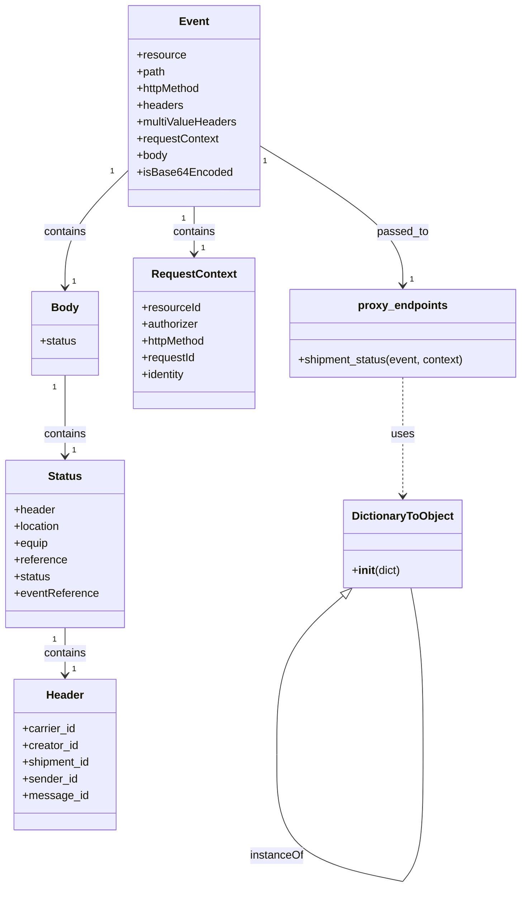
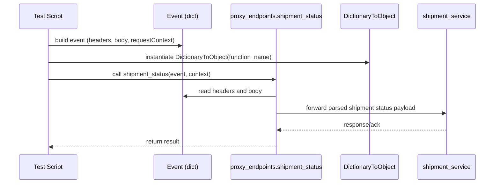

# Diagram: tools/ide_local_testing/localTest/test/shipment/postShipmentStatusViaLambda.py

> Auto-generated by Obscura crawlers

## Diagram 1

### SVG

<svg id="container" width="750.26953125" xmlns="http://www.w3.org/2000/svg" class="classDiagram" height="1272.1500244140625" viewBox="0 0 750.26953125 1272.1500244140625" role="graphics-document document" aria-roledescription="class"><g><defs><marker id="container_class-aggregationStart" class="marker aggregation class" refX="18" refY="7" markerWidth="190" markerHeight="240" orient="auto"><path d="M 18,7 L9,13 L1,7 L9,1 Z"></path></marker></defs><defs><marker id="container_class-aggregationEnd" class="marker aggregation class" refX="1" refY="7" markerWidth="20" markerHeight="28" orient="auto"><path d="M 18,7 L9,13 L1,7 L9,1 Z"></path></marker></defs><defs><marker id="container_class-extensionStart" class="marker extension class" refX="18" refY="7" markerWidth="190" markerHeight="240" orient="auto"><path d="M 1,7 L18,13 V 1 Z"></path></marker></defs><defs><marker id="container_class-extensionEnd" class="marker extension class" refX="1" refY="7" markerWidth="20" markerHeight="28" orient="auto"><path d="M 1,1 V 13 L18,7 Z"></path></marker></defs><defs><marker id="container_class-compositionStart" class="marker composition class" refX="18" refY="7" markerWidth="190" markerHeight="240" orient="auto"><path d="M 18,7 L9,13 L1,7 L9,1 Z"></path></marker></defs><defs><marker id="container_class-compositionEnd" class="marker composition class" refX="1" refY="7" markerWidth="20" markerHeight="28" orient="auto"><path d="M 18,7 L9,13 L1,7 L9,1 Z"></path></marker></defs><defs><marker id="container_class-dependencyStart" class="marker dependency class" refX="6" refY="7" markerWidth="190" markerHeight="240" orient="auto"><path d="M 5,7 L9,13 L1,7 L9,1 Z"></path></marker></defs><defs><marker id="container_class-dependencyEnd" class="marker dependency class" refX="13" refY="7" markerWidth="20" markerHeight="28" orient="auto"><path d="M 18,7 L9,13 L14,7 L9,1 Z"></path></marker></defs><defs><marker id="container_class-lollipopStart" class="marker lollipop class" refX="13" refY="7" markerWidth="190" markerHeight="240" orient="auto"><circle stroke="black" fill="transparent" cx="7" cy="7" r="6"></circle></marker></defs><defs><marker id="container_class-lollipopEnd" class="marker lollipop class" refX="1" refY="7" markerWidth="190" markerHeight="240" orient="auto"><circle stroke="black" fill="transparent" cx="7" cy="7" r="6"></circle></marker></defs><g class="root"><g class="clusters"></g><g class="edgePaths"><path d="M182.457,244.548L167.359,259.29C152.26,274.032,122.064,303.516,106.965,331.425C91.867,359.333,91.867,385.667,91.867,398.833L91.867,412" id="id_Event_Body_1" class="edge-thickness-normal edge-pattern-solid relation" style=";;;" data-edge="true" data-et="edge" data-id="id_Event_Body_1" data-points="W3sieCI6MTgyLjQ1NzAzMTI1LCJ5IjoyNDQuNTQ4MTQ5ODY1MTM4Mn0seyJ4Ijo5MS44NjcxODc1LCJ5IjozMzN9LHsieCI6OTEuODY3MTg3NSwieSI6NDE4fV0=" marker-end="url(#container_class-dependencyEnd)"></path><path d="M91.867,538L91.867,552.167C91.867,566.333,91.867,594.667,91.867,614C91.867,633.333,91.867,643.667,91.867,648.833L91.867,654" id="id_Body_Status_2" class="edge-thickness-normal edge-pattern-solid relation" style=";;;" data-edge="true" data-et="edge" data-id="id_Body_Status_2" data-points="W3sieCI6OTEuODY3MTg3NSwieSI6NTM4fSx7IngiOjkxLjg2NzE4NzUsInkiOjYyM30seyJ4Ijo5MS44NjcxODc1LCJ5Ijo2NjB9XQ==" marker-end="url(#container_class-dependencyEnd)"></path><path d="M91.867,900L91.867,906.167C91.867,912.333,91.867,924.667,91.867,936C91.867,947.333,91.867,957.667,91.867,962.833L91.867,968" id="id_Status_Header_3" class="edge-thickness-normal edge-pattern-solid relation" style=";;;" data-edge="true" data-et="edge" data-id="id_Status_Header_3" data-points="W3sieCI6OTEuODY3MTg3NSwieSI6OTAwfSx7IngiOjkxLjg2NzE4NzUsInkiOjkzN30seyJ4Ijo5MS44NjcxODc1LCJ5Ijo5NzR9XQ==" marker-end="url(#container_class-dependencyEnd)"></path><path d="M277.242,296L277.242,302.167C277.242,308.333,277.242,320.667,277.242,332C277.242,343.333,277.242,353.667,277.242,358.833L277.242,364" id="id_Event_RequestContext_4" class="edge-thickness-normal edge-pattern-solid relation" style=";;;" data-edge="true" data-et="edge" data-id="id_Event_RequestContext_4" data-points="W3sieCI6Mjc3LjI0MjE4NzUsInkiOjI5Nn0seyJ4IjoyNzcuMjQyMTg3NSwieSI6MzMzfSx7IngiOjI3Ny4yNDIxODc1LCJ5IjozNzB9XQ==" marker-end="url(#container_class-dependencyEnd)"></path><path d="M372.027,208.909L406.474,229.591C440.921,250.273,509.814,291.636,544.26,324.985C578.707,358.333,578.707,383.667,578.707,396.333L578.707,409" id="id_Event_proxy_endpoints_5" class="edge-thickness-normal edge-pattern-solid relation" style=";;;" data-edge="true" data-et="edge" data-id="id_Event_proxy_endpoints_5" data-points="W3sieCI6MzcyLjAyNzM0Mzc1LCJ5IjoyMDguOTA5MTY3NDc2NTE0NDN9LHsieCI6NTc4LjcwNzAzMTI1LCJ5IjozMzN9LHsieCI6NTc4LjcwNzAzMTI1LCJ5Ijo0MTV9XQ==" marker-end="url(#container_class-dependencyEnd)"></path><path d="M493.018,854.301L477.122,868.084C461.226,881.867,429.434,909.434,413.538,947.375C397.642,985.317,397.642,1033.633,397.642,1057.792L397.642,1081.95" id="DictionaryToObject-cyclic-special-1" class="edge-thickness-normal edge-pattern-solid relation" style=";;;" data-edge="true" data-et="edge" data-id="DictionaryToObject-cyclic-special-1" data-points="W3sieCI6NTA2LjA1MDQzNzg5ODIzODY3LCJ5Ijo4NDN9LHsieCI6Mzk3LjY0MjE4NzUwMDM3MjUzLCJ5Ijo5Mzd9LHsieCI6Mzk3LjY0MjE4NzUwMDM3MjUzLCJ5IjoxMDgxLjk0OTk5OTk5OTI1NX1d" marker-start="url(#container_class-extensionStart)"></path><path d="M397.642,1082.05L397.642,1106.208C397.642,1130.367,397.642,1178.683,427.811,1209.015C457.98,1239.347,518.319,1251.693,548.488,1257.866L578.657,1264.04" id="DictionaryToObject-cyclic-special-mid" class="edge-thickness-normal edge-pattern-solid relation" style=";;;" data-edge="true" data-et="edge" data-id="DictionaryToObject-cyclic-special-mid" data-points="W3sieCI6Mzk3LjY0MjE4NzUwMDM3MjUzLCJ5IjoxMDgyLjA1MDAwMDAwMDc0NX0seyJ4IjozOTcuNjQyMTg3NTAwMzcyNTMsInkiOjEyMjd9LHsieCI6NTc4LjY1NzAzMTI0OTI1NDksInkiOjEyNjQuMDM5NzY4ODU5Mjk3M31d"></path><path d="M578.747,1264L583.64,1257.833C588.533,1251.667,598.319,1239.333,603.212,1209C608.105,1178.667,608.105,1130.333,608.105,1082C608.105,1033.667,608.105,985.333,605.172,945.5C602.238,905.667,596.371,874.333,593.437,858.667L590.504,843" id="DictionaryToObject-cyclic-special-2" class="edge-thickness-normal edge-pattern-solid relation" style=";;;" data-edge="true" data-et="edge" data-id="DictionaryToObject-cyclic-special-2" data-points="W3sieCI6NTc4Ljc0NjcwNTI1NTMxMzcsInkiOjEyNjR9LHsieCI6NjA4LjEwNTQ2ODc1LCJ5IjoxMjI3fSx7IngiOjYwOC4xMDU0Njg3NSwieSI6MTA4Mn0seyJ4Ijo2MDguMTA1NDY4NzUsInkiOjkzN30seyJ4Ijo1OTAuNTAzODU2NDg4ODUzNiwieSI6ODQzfV0="></path><path d="M578.707,541L578.707,554.667C578.707,568.333,578.707,595.667,578.707,624C578.707,652.333,578.707,681.667,578.707,696.333L578.707,711" id="id_proxy_endpoints_DictionaryToObject_7" class="edge-thickness-normal edge-pattern-dashed relation" style=";;;" data-edge="true" data-et="edge" data-id="id_proxy_endpoints_DictionaryToObject_7" data-points="W3sieCI6NTc4LjcwNzAzMTI1LCJ5Ijo1NDF9LHsieCI6NTc4LjcwNzAzMTI1LCJ5Ijo2MjN9LHsieCI6NTc4LjcwNzAzMTI1LCJ5Ijo3MTd9XQ==" marker-end="url(#container_class-dependencyEnd)"></path></g><g class="edgeLabels"><g class="edgeLabel" transform="translate(91.8671875, 333)"><g class="label" data-id="id_Event_Body_1" transform="translate(-30.890625, -12)"><foreignObject width="61.78125" height="24">

contains

</foreignObject></g></g><g class="edgeLabel" transform="translate(91.8671875, 623)"><g class="label" data-id="id_Body_Status_2" transform="translate(-30.890625, -12)"><foreignObject width="61.78125" height="24">

contains

</foreignObject></g></g><g class="edgeLabel" transform="translate(91.8671875, 937)"><g class="label" data-id="id_Status_Header_3" transform="translate(-30.890625, -12)"><foreignObject width="61.78125" height="24">

contains

</foreignObject></g></g><g class="edgeLabel" transform="translate(277.2421875, 333)"><g class="label" data-id="id_Event_RequestContext_4" transform="translate(-30.890625, -12)"><foreignObject width="61.78125" height="24">

contains

</foreignObject></g></g><g class="edgeLabel" transform="translate(578.70703125, 333)"><g class="label" data-id="id_Event_proxy_endpoints_5" transform="translate(-36.921875, -12)"><foreignObject width="73.84375" height="24">

passed_to

</foreignObject></g></g><g class="edgeLabel"><g class="label" data-id="DictionaryToObject-cyclic-special-1" transform="translate(0, 0)"><foreignObject width="0" height="0">

</foreignObject></g></g><g class="edgeLabel" transform="translate(397.64218750037253, 1227)"><g class="label" data-id="DictionaryToObject-cyclic-special-mid" transform="translate(-38.796875, -12)"><foreignObject width="77.59375" height="24">

instanceOf

</foreignObject></g></g><g class="edgeLabel"><g class="label" data-id="DictionaryToObject-cyclic-special-2" transform="translate(0, 0)"><foreignObject width="0" height="0">

</foreignObject></g></g><g class="edgeLabel" transform="translate(578.70703125, 623)"><g class="label" data-id="id_proxy_endpoints_DictionaryToObject_7" transform="translate(-16.4921875, -12)"><foreignObject width="32.984375" height="24">

uses

</foreignObject></g></g><g class="edgeTerminals" transform="translate(159.45659244008442, 246.04138696023213)"><g class="inner" transform="translate(0, 0)"><foreignObject style="width: 9px; height: 12px;">
1
</foreignObject></g></g><g class="edgeTerminals" transform="translate(76.86718875000004, 555.5000010714285)"><g class="inner" transform="translate(0, 0)"><foreignObject style="width: 9px; height: 12px;">
1
</foreignObject></g></g><g class="edgeTerminals" transform="translate(76.86718875000004, 917.5000010714285)"><g class="inner" transform="translate(0, 0)"><foreignObject style="width: 9px; height: 12px;">
1
</foreignObject></g></g><g class="edgeTerminals" transform="translate(262.24218875, 313.5000010714286)"><g class="inner" transform="translate(0, 0)"><foreignObject style="width: 9px; height: 12px;">
1
</foreignObject></g></g><g class="edgeTerminals" transform="translate(379.30957836750116, 230.77738855588916)"><g class="inner" transform="translate(0, 0)"><foreignObject style="width: 9px; height: 12px;">
1
</foreignObject></g></g><g class="edgeTerminals" transform="translate(101.86718874999995, 395.5000010714286)"><g class="inner" transform="translate(0, 0)"></g><foreignObject style="width: 9px; height: 12px;">
1
</foreignObject></g><g class="edgeTerminals" transform="translate(101.86718874999995, 637.5000010714285)"><g class="inner" transform="translate(0, 0)"></g><foreignObject style="width: 9px; height: 12px;">
1
</foreignObject></g><g class="edgeTerminals" transform="translate(101.86718874999995, 951.5000010714285)"><g class="inner" transform="translate(0, 0)"></g><foreignObject style="width: 9px; height: 12px;">
1
</foreignObject></g><g class="edgeTerminals" transform="translate(287.2421887499999, 347.5000010714286)"><g class="inner" transform="translate(0, 0)"></g><foreignObject style="width: 9px; height: 12px;">
1
</foreignObject></g><g class="edgeTerminals" transform="translate(588.707030625, 392.49999946428574)"><g class="inner" transform="translate(0, 0)"></g><foreignObject style="width: 9px; height: 12px;">
1
</foreignObject></g></g><g class="nodes"><g class="node default" id="classId-Event-0" transform="translate(277.2421875, 152)"><g class="basic label-container"><path d="M-94.78515625 -144 L94.78515625 -144 L94.78515625 144 L-94.78515625 144" stroke="none" stroke-width="0" fill="#ECECFF" style=""></path><path d="M-94.78515625 -144 C-26.22172699725381 -144, 42.34170225549238 -144, 94.78515625 -144 M-94.78515625 -144 C-25.60862967921595 -144, 43.5678968915681 -144, 94.78515625 -144 M94.78515625 -144 C94.78515625 -56.79248530897577, 94.78515625 30.41502938204846, 94.78515625 144 M94.78515625 -144 C94.78515625 -61.123611554531394, 94.78515625 21.752776890937213, 94.78515625 144 M94.78515625 144 C33.5945524745764 144, -27.596051300847193 144, -94.78515625 144 M94.78515625 144 C28.226641089528783 144, -38.33187407094243 144, -94.78515625 144 M-94.78515625 144 C-94.78515625 63.43851058218215, -94.78515625 -17.122978835635706, -94.78515625 -144 M-94.78515625 144 C-94.78515625 46.945855511740334, -94.78515625 -50.10828897651933, -94.78515625 -144" stroke="#9370DB" stroke-width="1.3" fill="none" stroke-dasharray="0 0" style=""></path></g><g class="annotation-group text" transform="translate(0, -120)"></g><g class="label-group text" transform="translate(-20.2109375, -120)"><g class="label" style="font-weight: bolder" transform="translate(0,-12)"><foreignObject width="40.421875" height="24">

Event

</foreignObject></g></g><g class="members-group text" transform="translate(-82.78515625, -72)"><g class="label" style="" transform="translate(0,-12)"><foreignObject width="70.28125" height="24">

+resource

</foreignObject></g><g class="label" style="" transform="translate(0,12)"><foreignObject width="41.1875" height="24">

+path

</foreignObject></g><g class="label" style="" transform="translate(0,36)"><foreignObject width="93.65625" height="24">

+httpMethod

</foreignObject></g><g class="label" style="" transform="translate(0,60)"><foreignObject width="66.328125" height="24">

+headers

</foreignObject></g><g class="label" style="" transform="translate(0,84)"><foreignObject width="145.359375" height="24">

+multiValueHeaders

</foreignObject></g><g class="label" style="" transform="translate(0,108)"><foreignObject width="118.265625" height="24">

+requestContext

</foreignObject></g><g class="label" style="" transform="translate(0,132)"><foreignObject width="44.28125" height="24">

+body

</foreignObject></g><g class="label" style="" transform="translate(0,156)"><foreignObject width="133.78125" height="24">

+isBase64Encoded

</foreignObject></g></g><g class="methods-group text" transform="translate(-82.78515625, 144)"></g><g class="divider" style=""><path d="M-94.78515625 -96 C-29.34258466770072 -96, 36.09998691459856 -96, 94.78515625 -96 M-94.78515625 -96 C-43.15172165024024 -96, 8.481712949519519 -96, 94.78515625 -96" stroke="#9370DB" stroke-width="1.3" fill="none" stroke-dasharray="0 0" style=""></path></g><g class="divider" style=""><path d="M-94.78515625 120 C-22.424197995342425 120, 49.93676025931515 120, 94.78515625 120 M-94.78515625 120 C-37.78927982885068 120, 19.206596592298638 120, 94.78515625 120" stroke="#9370DB" stroke-width="1.3" fill="none" stroke-dasharray="0 0" style=""></path></g></g><g class="node default" id="classId-Body-1" transform="translate(91.8671875, 478)"><g class="basic label-container"><path d="M-47.47265625 -60 L47.47265625 -60 L47.47265625 60 L-47.47265625 60" stroke="none" stroke-width="0" fill="#ECECFF" style=""></path><path d="M-47.47265625 -60 C-13.286197975917574 -60, 20.900260298164852 -60, 47.47265625 -60 M-47.47265625 -60 C-26.90703078005361 -60, -6.34140531010722 -60, 47.47265625 -60 M47.47265625 -60 C47.47265625 -22.391495301846184, 47.47265625 15.217009396307631, 47.47265625 60 M47.47265625 -60 C47.47265625 -18.43118559637047, 47.47265625 23.137628807259063, 47.47265625 60 M47.47265625 60 C20.375564064437178 60, -6.721528121125644 60, -47.47265625 60 M47.47265625 60 C17.45884480607879 60, -12.55496663784242 60, -47.47265625 60 M-47.47265625 60 C-47.47265625 13.207272117857507, -47.47265625 -33.58545576428499, -47.47265625 -60 M-47.47265625 60 C-47.47265625 18.499126622428548, -47.47265625 -23.001746755142904, -47.47265625 -60" stroke="#9370DB" stroke-width="1.3" fill="none" stroke-dasharray="0 0" style=""></path></g><g class="annotation-group text" transform="translate(0, -36)"></g><g class="label-group text" transform="translate(-18.5546875, -36)"><g class="label" style="font-weight: bolder" transform="translate(0,-12)"><foreignObject width="37.109375" height="24">

Body

</foreignObject></g></g><g class="members-group text" transform="translate(-35.47265625, 12)"><g class="label" style="" transform="translate(0,-12)"><foreignObject width="52.390625" height="24">

+status

</foreignObject></g></g><g class="methods-group text" transform="translate(-35.47265625, 60)"></g><g class="divider" style=""><path d="M-47.47265625 -12 C-27.558738044667408 -12, -7.644819839334815 -12, 47.47265625 -12 M-47.47265625 -12 C-19.777909813183896 -12, 7.916836623632207 -12, 47.47265625 -12" stroke="#9370DB" stroke-width="1.3" fill="none" stroke-dasharray="0 0" style=""></path></g><g class="divider" style=""><path d="M-47.47265625 36 C-14.196674943846425 36, 19.07930636230715 36, 47.47265625 36 M-47.47265625 36 C-15.0311697719305 36, 17.410316706139 36, 47.47265625 36" stroke="#9370DB" stroke-width="1.3" fill="none" stroke-dasharray="0 0" style=""></path></g></g><g class="node default" id="classId-Status-2" transform="translate(91.8671875, 780)"><g class="basic label-container"><path d="M-83.8671875 -120 L83.8671875 -120 L83.8671875 120 L-83.8671875 120" stroke="none" stroke-width="0" fill="#ECECFF" style=""></path><path d="M-83.8671875 -120 C-28.20722460157412 -120, 27.452738296851763 -120, 83.8671875 -120 M-83.8671875 -120 C-44.366004776144266 -120, -4.864822052288531 -120, 83.8671875 -120 M83.8671875 -120 C83.8671875 -46.51824346162083, 83.8671875 26.963513076758346, 83.8671875 120 M83.8671875 -120 C83.8671875 -55.33136941543847, 83.8671875 9.337261169123053, 83.8671875 120 M83.8671875 120 C18.53312445519444 120, -46.80093858961112 120, -83.8671875 120 M83.8671875 120 C44.96163752133135 120, 6.056087542662695 120, -83.8671875 120 M-83.8671875 120 C-83.8671875 61.784762890616, -83.8671875 3.5695257812320023, -83.8671875 -120 M-83.8671875 120 C-83.8671875 40.407792910305645, -83.8671875 -39.18441417938871, -83.8671875 -120" stroke="#9370DB" stroke-width="1.3" fill="none" stroke-dasharray="0 0" style=""></path></g><g class="annotation-group text" transform="translate(0, -96)"></g><g class="label-group text" transform="translate(-23.484375, -96)"><g class="label" style="font-weight: bolder" transform="translate(0,-12)"><foreignObject width="46.96875" height="24">

Status

</foreignObject></g></g><g class="members-group text" transform="translate(-71.8671875, -48)"><g class="label" style="" transform="translate(0,-12)"><foreignObject width="59.09375" height="24">

+header

</foreignObject></g><g class="label" style="" transform="translate(0,12)"><foreignObject width="67.140625" height="24">

+location

</foreignObject></g><g class="label" style="" transform="translate(0,36)"><foreignObject width="49.609375" height="24">

+equip

</foreignObject></g><g class="label" style="" transform="translate(0,60)"><foreignObject width="76.171875" height="24">

+reference

</foreignObject></g><g class="label" style="" transform="translate(0,84)"><foreignObject width="52.390625" height="24">

+status

</foreignObject></g><g class="label" style="" transform="translate(0,108)"><foreignObject width="120.25" height="24">

+eventReference

</foreignObject></g></g><g class="methods-group text" transform="translate(-71.8671875, 120)"></g><g class="divider" style=""><path d="M-83.8671875 -72 C-49.81059025402028 -72, -15.753993008040567 -72, 83.8671875 -72 M-83.8671875 -72 C-26.590059299028596 -72, 30.68706890194281 -72, 83.8671875 -72" stroke="#9370DB" stroke-width="1.3" fill="none" stroke-dasharray="0 0" style=""></path></g><g class="divider" style=""><path d="M-83.8671875 96 C-18.874576853390792 96, 46.118033793218416 96, 83.8671875 96 M-83.8671875 96 C-27.198866060124324 96, 29.469455379751352 96, 83.8671875 96" stroke="#9370DB" stroke-width="1.3" fill="none" stroke-dasharray="0 0" style=""></path></g></g><g class="node default" id="classId-Header-3" transform="translate(91.8671875, 1082)"><g class="basic label-container"><path d="M-74.66015625 -108 L74.66015625 -108 L74.66015625 108 L-74.66015625 108" stroke="none" stroke-width="0" fill="#ECECFF" style=""></path><path d="M-74.66015625 -108 C-34.7564343850423 -108, 5.147287479915406 -108, 74.66015625 -108 M-74.66015625 -108 C-29.739278693270023 -108, 15.181598863459953 -108, 74.66015625 -108 M74.66015625 -108 C74.66015625 -41.903373942074495, 74.66015625 24.19325211585101, 74.66015625 108 M74.66015625 -108 C74.66015625 -39.573512455933624, 74.66015625 28.85297508813275, 74.66015625 108 M74.66015625 108 C42.495173280565375 108, 10.33019031113075 108, -74.66015625 108 M74.66015625 108 C39.9352444626769 108, 5.210332675353797 108, -74.66015625 108 M-74.66015625 108 C-74.66015625 63.68907949937325, -74.66015625 19.3781589987465, -74.66015625 -108 M-74.66015625 108 C-74.66015625 49.67404411770495, -74.66015625 -8.651911764590096, -74.66015625 -108" stroke="#9370DB" stroke-width="1.3" fill="none" stroke-dasharray="0 0" style=""></path></g><g class="annotation-group text" transform="translate(0, -84)"></g><g class="label-group text" transform="translate(-26.4765625, -84)"><g class="label" style="font-weight: bolder" transform="translate(0,-12)"><foreignObject width="52.953125" height="24">

Header

</foreignObject></g></g><g class="members-group text" transform="translate(-62.66015625, -36)"><g class="label" style="" transform="translate(0,-12)"><foreignObject width="77.0625" height="24">

+carrier_id

</foreignObject></g><g class="label" style="" transform="translate(0,12)"><foreignObject width="80.78125" height="24">

+creator_id

</foreignObject></g><g class="label" style="" transform="translate(0,36)"><foreignObject width="98.84375" height="24">

+shipment_id

</foreignObject></g><g class="label" style="" transform="translate(0,60)"><foreignObject width="79.140625" height="24">

+sender_id

</foreignObject></g><g class="label" style="" transform="translate(0,84)"><foreignObject width="92.453125" height="24">

+message_id

</foreignObject></g></g><g class="methods-group text" transform="translate(-62.66015625, 108)"></g><g class="divider" style=""><path d="M-74.66015625 -60 C-28.313459845640473 -60, 18.033236558719054 -60, 74.66015625 -60 M-74.66015625 -60 C-25.92678319645364 -60, 22.806589857092717 -60, 74.66015625 -60" stroke="#9370DB" stroke-width="1.3" fill="none" stroke-dasharray="0 0" style=""></path></g><g class="divider" style=""><path d="M-74.66015625 84 C-37.19124216339994 84, 0.277671923200117 84, 74.66015625 84 M-74.66015625 84 C-19.447023537895184 84, 35.76610917420963 84, 74.66015625 84" stroke="#9370DB" stroke-width="1.3" fill="none" stroke-dasharray="0 0" style=""></path></g></g><g class="node default" id="classId-RequestContext-4" transform="translate(277.2421875, 478)"><g class="basic label-container"><path d="M-87.90234375 -108 L87.90234375 -108 L87.90234375 108 L-87.90234375 108" stroke="none" stroke-width="0" fill="#ECECFF" style=""></path><path d="M-87.90234375 -108 C-36.653940763833106 -108, 14.594462222333789 -108, 87.90234375 -108 M-87.90234375 -108 C-24.761965060057406 -108, 38.37841362988519 -108, 87.90234375 -108 M87.90234375 -108 C87.90234375 -38.66174096175406, 87.90234375 30.676518076491874, 87.90234375 108 M87.90234375 -108 C87.90234375 -38.39115333271076, 87.90234375 31.217693334578485, 87.90234375 108 M87.90234375 108 C41.42201918379332 108, -5.058305382413366 108, -87.90234375 108 M87.90234375 108 C38.72058503771083 108, -10.461173674578333 108, -87.90234375 108 M-87.90234375 108 C-87.90234375 34.63440839433375, -87.90234375 -38.73118321133251, -87.90234375 -108 M-87.90234375 108 C-87.90234375 47.770217248527125, -87.90234375 -12.45956550294575, -87.90234375 -108" stroke="#9370DB" stroke-width="1.3" fill="none" stroke-dasharray="0 0" style=""></path></g><g class="annotation-group text" transform="translate(0, -84)"></g><g class="label-group text" transform="translate(-58.1484375, -84)"><g class="label" style="font-weight: bolder" transform="translate(0,-12)"><foreignObject width="116.296875" height="24">

RequestContext

</foreignObject></g></g><g class="members-group text" transform="translate(-75.90234375, -36)"><g class="label" style="" transform="translate(0,-12)"><foreignObject width="84.5625" height="24">

+resourceId

</foreignObject></g><g class="label" style="" transform="translate(0,12)"><foreignObject width="82.734375" height="24">

+authorizer

</foreignObject></g><g class="label" style="" transform="translate(0,36)"><foreignObject width="93.65625" height="24">

+httpMethod

</foreignObject></g><g class="label" style="" transform="translate(0,60)"><foreignObject width="77.546875" height="24">

+requestId

</foreignObject></g><g class="label" style="" transform="translate(0,84)"><foreignObject width="64.03125" height="24">

+identity

</foreignObject></g></g><g class="methods-group text" transform="translate(-75.90234375, 108)"></g><g class="divider" style=""><path d="M-87.90234375 -60 C-36.20093336598396 -60, 15.500477018032086 -60, 87.90234375 -60 M-87.90234375 -60 C-30.858774028130753 -60, 26.184795693738494 -60, 87.90234375 -60" stroke="#9370DB" stroke-width="1.3" fill="none" stroke-dasharray="0 0" style=""></path></g><g class="divider" style=""><path d="M-87.90234375 84 C-39.56552440716371 84, 8.771294935672586 84, 87.90234375 84 M-87.90234375 84 C-23.235732313609546 84, 41.43087912278091 84, 87.90234375 84" stroke="#9370DB" stroke-width="1.3" fill="none" stroke-dasharray="0 0" style=""></path></g></g><g class="node default" id="classId-DictionaryToObject-5" transform="translate(578.70703125, 780)"><g class="basic label-container"><path d="M-82.203125 -63 L82.203125 -63 L82.203125 63 L-82.203125 63" stroke="none" stroke-width="0" fill="#ECECFF" style=""></path><path d="M-82.203125 -63 C-21.530312572490914 -63, 39.14249985501817 -63, 82.203125 -63 M-82.203125 -63 C-18.76959041681623 -63, 44.66394416636754 -63, 82.203125 -63 M82.203125 -63 C82.203125 -34.52614690089929, 82.203125 -6.052293801798577, 82.203125 63 M82.203125 -63 C82.203125 -21.481801101828125, 82.203125 20.03639779634375, 82.203125 63 M82.203125 63 C45.75979976769145 63, 9.316474535382895 63, -82.203125 63 M82.203125 63 C17.250653593643406 63, -47.70181781271319 63, -82.203125 63 M-82.203125 63 C-82.203125 31.606276891267495, -82.203125 0.21255378253498947, -82.203125 -63 M-82.203125 63 C-82.203125 21.74588978978983, -82.203125 -19.508220420420344, -82.203125 -63" stroke="#9370DB" stroke-width="1.3" fill="none" stroke-dasharray="0 0" style=""></path></g><g class="annotation-group text" transform="translate(0, -39)"></g><g class="label-group text" transform="translate(-70.109375, -39)"><g class="label" style="font-weight: bolder" transform="translate(0,-12)"><foreignObject width="140.21875" height="24">

DictionaryToObject

</foreignObject></g></g><g class="members-group text" transform="translate(-70.203125, 9)"></g><g class="methods-group text" transform="translate(-70.203125, 39)"><g class="label" style="" transform="translate(0,-12)"><foreignObject width="70.296875" height="24">

+<strong>init</strong>(dict)

</foreignObject></g></g><g class="divider" style=""><path d="M-82.203125 -15 C-34.45099496619738 -15, 13.301135067605244 -15, 82.203125 -15 M-82.203125 -15 C-44.471617817088266 -15, -6.740110634176531 -15, 82.203125 -15" stroke="#9370DB" stroke-width="1.3" fill="none" stroke-dasharray="0 0" style=""></path></g><g class="divider" style=""><path d="M-82.203125 9 C-25.806119987291794 9, 30.590885025416412 9, 82.203125 9 M-82.203125 9 C-26.157457786522123 9, 29.888209426955754 9, 82.203125 9" stroke="#9370DB" stroke-width="1.3" fill="none" stroke-dasharray="0 0" style=""></path></g></g><g class="node default" id="classId-proxy_endpoints-6" transform="translate(578.70703125, 478)"><g class="basic label-container"><path d="M-163.5625 -63 L163.5625 -63 L163.5625 63 L-163.5625 63" stroke="none" stroke-width="0" fill="#ECECFF" style=""></path><path d="M-163.5625 -63 C-42.718280217982084 -63, 78.12593956403583 -63, 163.5625 -63 M-163.5625 -63 C-69.08499208386262 -63, 25.392515832274768 -63, 163.5625 -63 M163.5625 -63 C163.5625 -14.688393239371791, 163.5625 33.62321352125642, 163.5625 63 M163.5625 -63 C163.5625 -22.119047581511687, 163.5625 18.761904836976626, 163.5625 63 M163.5625 63 C79.36895221174272 63, -4.824595576514554 63, -163.5625 63 M163.5625 63 C57.468539318817164 63, -48.62542136236567 63, -163.5625 63 M-163.5625 63 C-163.5625 36.607140416349736, -163.5625 10.21428083269948, -163.5625 -63 M-163.5625 63 C-163.5625 37.44569283299653, -163.5625 11.891385665993056, -163.5625 -63" stroke="#9370DB" stroke-width="1.3" fill="none" stroke-dasharray="0 0" style=""></path></g><g class="annotation-group text" transform="translate(0, -39)"></g><g class="label-group text" transform="translate(-61.421875, -39)"><g class="label" style="font-weight: bolder" transform="translate(0,-12)"><foreignObject width="122.84375" height="24">

proxy_endpoints

</foreignObject></g></g><g class="members-group text" transform="translate(-151.5625, 9)"></g><g class="methods-group text" transform="translate(-151.5625, 39)"><g class="label" style="" transform="translate(0,-12)"><foreignObject width="241.703125" height="24">

+shipment_status(event, context)

</foreignObject></g></g><g class="divider" style=""><path d="M-163.5625 -15 C-71.36837526325671 -15, 20.82574947348658 -15, 163.5625 -15 M-163.5625 -15 C-51.412576720573966 -15, 60.73734655885207 -15, 163.5625 -15" stroke="#9370DB" stroke-width="1.3" fill="none" stroke-dasharray="0 0" style=""></path></g><g class="divider" style=""><path d="M-163.5625 9 C-73.96865572024592 9, 15.62518855950816 9, 163.5625 9 M-163.5625 9 C-80.19657130965577 9, 3.169357380688467 9, 163.5625 9" stroke="#9370DB" stroke-width="1.3" fill="none" stroke-dasharray="0 0" style=""></path></g></g><g class="label edgeLabel" id="DictionaryToObject---DictionaryToObject---1" transform="translate(397.64218750037253, 1082)"><rect width="0.1" height="0.1"></rect><g class="label" style="" transform="translate(0, 0)"><rect></rect><foreignObject width="0" height="0">

</foreignObject></g></g><g class="label edgeLabel" id="DictionaryToObject---DictionaryToObject---2" transform="translate(578.70703125, 1264.050000000745)"><rect width="0.1" height="0.1"></rect><g class="label" style="" transform="translate(0, 0)"><rect></rect><foreignObject width="0" height="0">

</foreignObject></g></g></g></g></g></svg>

## Diagram 2

### SVG

<svg id="container" width="1361" xmlns="http://www.w3.org/2000/svg" height="507" viewBox="-50 -10 1361 507" role="graphics-document document" aria-roledescription="sequence"><g><rect x="1111" y="421" fill="#eaeaea" stroke="#666" width="150" height="65" name="Service" rx="3" ry="3" class="actor actor-bottom"></rect><text x="1186" y="453.5" dominant-baseline="central" alignment-baseline="central" class="actor actor-box" style="text-anchor: middle; font-size: 16px; font-weight: 400;"><tspan x="1186" dy="0">shipment_service</tspan></text></g><g><rect x="903" y="421" fill="#eaeaea" stroke="#666" width="158" height="65" name="Context" rx="3" ry="3" class="actor actor-bottom"></rect><text x="982" y="453.5" dominant-baseline="central" alignment-baseline="central" class="actor actor-box" style="text-anchor: middle; font-size: 16px; font-weight: 400;"><tspan x="982" dy="0">DictionaryToObject</tspan></text></g><g><rect x="587" y="421" fill="#eaeaea" stroke="#666" width="266" height="65" name="Proxy" rx="3" ry="3" class="actor actor-bottom"></rect><text x="720" y="453.5" dominant-baseline="central" alignment-baseline="central" class="actor actor-box" style="text-anchor: middle; font-size: 16px; font-weight: 400;"><tspan x="720" dy="0">proxy_endpoints.shipment_status</tspan></text></g><g><rect x="387" y="421" fill="#eaeaea" stroke="#666" width="150" height="65" name="EventObj" rx="3" ry="3" class="actor actor-bottom"></rect><text x="462" y="453.5" dominant-baseline="central" alignment-baseline="central" class="actor actor-box" style="text-anchor: middle; font-size: 16px; font-weight: 400;"><tspan x="462" dy="0">Event (dict)</tspan></text></g><g><rect x="0" y="421" fill="#eaeaea" stroke="#666" width="150" height="65" name="Tester" rx="3" ry="3" class="actor actor-bottom"></rect><text x="75" y="453.5" dominant-baseline="central" alignment-baseline="central" class="actor actor-box" style="text-anchor: middle; font-size: 16px; font-weight: 400;"><tspan x="75" dy="0">Test Script</tspan></text></g><g><line id="actor4" x1="1186" y1="65" x2="1186" y2="421" class="actor-line 200" stroke-width="0.5px" stroke="#999" name="Service"></line><g id="root-4"><rect x="1111" y="0" fill="#eaeaea" stroke="#666" width="150" height="65" name="Service" rx="3" ry="3" class="actor actor-top"></rect><text x="1186" y="32.5" dominant-baseline="central" alignment-baseline="central" class="actor actor-box" style="text-anchor: middle; font-size: 16px; font-weight: 400;"><tspan x="1186" dy="0">shipment_service</tspan></text></g></g><g><line id="actor3" x1="982" y1="65" x2="982" y2="421" class="actor-line 200" stroke-width="0.5px" stroke="#999" name="Context"></line><g id="root-3"><rect x="903" y="0" fill="#eaeaea" stroke="#666" width="158" height="65" name="Context" rx="3" ry="3" class="actor actor-top"></rect><text x="982" y="32.5" dominant-baseline="central" alignment-baseline="central" class="actor actor-box" style="text-anchor: middle; font-size: 16px; font-weight: 400;"><tspan x="982" dy="0">DictionaryToObject</tspan></text></g></g><g><line id="actor2" x1="720" y1="65" x2="720" y2="421" class="actor-line 200" stroke-width="0.5px" stroke="#999" name="Proxy"></line><g id="root-2"><rect x="587" y="0" fill="#eaeaea" stroke="#666" width="266" height="65" name="Proxy" rx="3" ry="3" class="actor actor-top"></rect><text x="720" y="32.5" dominant-baseline="central" alignment-baseline="central" class="actor actor-box" style="text-anchor: middle; font-size: 16px; font-weight: 400;"><tspan x="720" dy="0">proxy_endpoints.shipment_status</tspan></text></g></g><g><line id="actor1" x1="462" y1="65" x2="462" y2="421" class="actor-line 200" stroke-width="0.5px" stroke="#999" name="EventObj"></line><g id="root-1"><rect x="387" y="0" fill="#eaeaea" stroke="#666" width="150" height="65" name="EventObj" rx="3" ry="3" class="actor actor-top"></rect><text x="462" y="32.5" dominant-baseline="central" alignment-baseline="central" class="actor actor-box" style="text-anchor: middle; font-size: 16px; font-weight: 400;"><tspan x="462" dy="0">Event (dict)</tspan></text></g></g><g><line id="actor0" x1="75" y1="65" x2="75" y2="421" class="actor-line 200" stroke-width="0.5px" stroke="#999" name="Tester"></line><g id="root-0"><rect x="0" y="0" fill="#eaeaea" stroke="#666" width="150" height="65" name="Tester" rx="3" ry="3" class="actor actor-top"></rect><text x="75" y="32.5" dominant-baseline="central" alignment-baseline="central" class="actor actor-box" style="text-anchor: middle; font-size: 16px; font-weight: 400;"><tspan x="75" dy="0">Test Script</tspan></text></g></g><g></g><defs><symbol id="computer" width="24" height="24"><path transform="scale(.5)" d="M2 2v13h20v-13h-20zm18 11h-16v-9h16v9zm-10.228 6l.466-1h3.524l.467 1h-4.457zm14.228 3h-24l2-6h2.104l-1.33 4h18.45l-1.297-4h2.073l2 6zm-5-10h-14v-7h14v7z"></path></symbol></defs><defs><symbol id="database" fill-rule="evenodd" clip-rule="evenodd"><path transform="scale(.5)" d="M12.258.001l.256.004.255.005.253.008.251.01.249.012.247.015.246.016.242.019.241.02.239.023.236.024.233.027.231.028.229.031.225.032.223.034.22.036.217.038.214.04.211.041.208.043.205.045.201.046.198.048.194.05.191.051.187.053.183.054.18.056.175.057.172.059.168.06.163.061.16.063.155.064.15.066.074.033.073.033.071.034.07.034.069.035.068.035.067.035.066.035.064.036.064.036.062.036.06.036.06.037.058.037.058.037.055.038.055.038.053.038.052.038.051.039.05.039.048.039.047.039.045.04.044.04.043.04.041.04.04.041.039.041.037.041.036.041.034.041.033.042.032.042.03.042.029.042.027.042.026.043.024.043.023.043.021.043.02.043.018.044.017.043.015.044.013.044.012.044.011.045.009.044.007.045.006.045.004.045.002.045.001.045v17l-.001.045-.002.045-.004.045-.006.045-.007.045-.009.044-.011.045-.012.044-.013.044-.015.044-.017.043-.018.044-.02.043-.021.043-.023.043-.024.043-.026.043-.027.042-.029.042-.03.042-.032.042-.033.042-.034.041-.036.041-.037.041-.039.041-.04.041-.041.04-.043.04-.044.04-.045.04-.047.039-.048.039-.05.039-.051.039-.052.038-.053.038-.055.038-.055.038-.058.037-.058.037-.06.037-.06.036-.062.036-.064.036-.064.036-.066.035-.067.035-.068.035-.069.035-.07.034-.071.034-.073.033-.074.033-.15.066-.155.064-.16.063-.163.061-.168.06-.172.059-.175.057-.18.056-.183.054-.187.053-.191.051-.194.05-.198.048-.201.046-.205.045-.208.043-.211.041-.214.04-.217.038-.22.036-.223.034-.225.032-.229.031-.231.028-.233.027-.236.024-.239.023-.241.02-.242.019-.246.016-.247.015-.249.012-.251.01-.253.008-.255.005-.256.004-.258.001-.258-.001-.256-.004-.255-.005-.253-.008-.251-.01-.249-.012-.247-.015-.245-.016-.243-.019-.241-.02-.238-.023-.236-.024-.234-.027-.231-.028-.228-.031-.226-.032-.223-.034-.22-.036-.217-.038-.214-.04-.211-.041-.208-.043-.204-.045-.201-.046-.198-.048-.195-.05-.19-.051-.187-.053-.184-.054-.179-.056-.176-.057-.172-.059-.167-.06-.164-.061-.159-.063-.155-.064-.151-.066-.074-.033-.072-.033-.072-.034-.07-.034-.069-.035-.068-.035-.067-.035-.066-.035-.064-.036-.063-.036-.062-.036-.061-.036-.06-.037-.058-.037-.057-.037-.056-.038-.055-.038-.053-.038-.052-.038-.051-.039-.049-.039-.049-.039-.046-.039-.046-.04-.044-.04-.043-.04-.041-.04-.04-.041-.039-.041-.037-.041-.036-.041-.034-.041-.033-.042-.032-.042-.03-.042-.029-.042-.027-.042-.026-.043-.024-.043-.023-.043-.021-.043-.02-.043-.018-.044-.017-.043-.015-.044-.013-.044-.012-.044-.011-.045-.009-.044-.007-.045-.006-.045-.004-.045-.002-.045-.001-.045v-17l.001-.045.002-.045.004-.045.006-.045.007-.045.009-.044.011-.045.012-.044.013-.044.015-.044.017-.043.018-.044.02-.043.021-.043.023-.043.024-.043.026-.043.027-.042.029-.042.03-.042.032-.042.033-.042.034-.041.036-.041.037-.041.039-.041.04-.041.041-.04.043-.04.044-.04.046-.04.046-.039.049-.039.049-.039.051-.039.052-.038.053-.038.055-.038.056-.038.057-.037.058-.037.06-.037.061-.036.062-.036.063-.036.064-.036.066-.035.067-.035.068-.035.069-.035.07-.034.072-.034.072-.033.074-.033.151-.066.155-.064.159-.063.164-.061.167-.06.172-.059.176-.057.179-.056.184-.054.187-.053.19-.051.195-.05.198-.048.201-.046.204-.045.208-.043.211-.041.214-.04.217-.038.22-.036.223-.034.226-.032.228-.031.231-.028.234-.027.236-.024.238-.023.241-.02.243-.019.245-.016.247-.015.249-.012.251-.01.253-.008.255-.005.256-.004.258-.001.258.001zm-9.258 20.499v.01l.001.021.003.021.004.022.005.021.006.022.007.022.009.023.01.022.011.023.012.023.013.023.015.023.016.024.017.023.018.024.019.024.021.024.022.025.023.024.024.025.052.049.056.05.061.051.066.051.07.051.075.051.079.052.084.052.088.052.092.052.097.052.102.051.105.052.11.052.114.051.119.051.123.051.127.05.131.05.135.05.139.048.144.049.147.047.152.047.155.047.16.045.163.045.167.043.171.043.176.041.178.041.183.039.187.039.19.037.194.035.197.035.202.033.204.031.209.03.212.029.216.027.219.025.222.024.226.021.23.02.233.018.236.016.24.015.243.012.246.01.249.008.253.005.256.004.259.001.26-.001.257-.004.254-.005.25-.008.247-.011.244-.012.241-.014.237-.016.233-.018.231-.021.226-.021.224-.024.22-.026.216-.027.212-.028.21-.031.205-.031.202-.034.198-.034.194-.036.191-.037.187-.039.183-.04.179-.04.175-.042.172-.043.168-.044.163-.045.16-.046.155-.046.152-.047.148-.048.143-.049.139-.049.136-.05.131-.05.126-.05.123-.051.118-.052.114-.051.11-.052.106-.052.101-.052.096-.052.092-.052.088-.053.083-.051.079-.052.074-.052.07-.051.065-.051.06-.051.056-.05.051-.05.023-.024.023-.025.021-.024.02-.024.019-.024.018-.024.017-.024.015-.023.014-.024.013-.023.012-.023.01-.023.01-.022.008-.022.006-.022.006-.022.004-.022.004-.021.001-.021.001-.021v-4.127l-.077.055-.08.053-.083.054-.085.053-.087.052-.09.052-.093.051-.095.05-.097.05-.1.049-.102.049-.105.048-.106.047-.109.047-.111.046-.114.045-.115.045-.118.044-.12.043-.122.042-.124.042-.126.041-.128.04-.13.04-.132.038-.134.038-.135.037-.138.037-.139.035-.142.035-.143.034-.144.033-.147.032-.148.031-.15.03-.151.03-.153.029-.154.027-.156.027-.158.026-.159.025-.161.024-.162.023-.163.022-.165.021-.166.02-.167.019-.169.018-.169.017-.171.016-.173.015-.173.014-.175.013-.175.012-.177.011-.178.01-.179.008-.179.008-.181.006-.182.005-.182.004-.184.003-.184.002h-.37l-.184-.002-.184-.003-.182-.004-.182-.005-.181-.006-.179-.008-.179-.008-.178-.01-.176-.011-.176-.012-.175-.013-.173-.014-.172-.015-.171-.016-.17-.017-.169-.018-.167-.019-.166-.02-.165-.021-.163-.022-.162-.023-.161-.024-.159-.025-.157-.026-.156-.027-.155-.027-.153-.029-.151-.03-.15-.03-.148-.031-.146-.032-.145-.033-.143-.034-.141-.035-.14-.035-.137-.037-.136-.037-.134-.038-.132-.038-.13-.04-.128-.04-.126-.041-.124-.042-.122-.042-.12-.044-.117-.043-.116-.045-.113-.045-.112-.046-.109-.047-.106-.047-.105-.048-.102-.049-.1-.049-.097-.05-.095-.05-.093-.052-.09-.051-.087-.052-.085-.053-.083-.054-.08-.054-.077-.054v4.127zm0-5.654v.011l.001.021.003.021.004.021.005.022.006.022.007.022.009.022.01.022.011.023.012.023.013.023.015.024.016.023.017.024.018.024.019.024.021.024.022.024.023.025.024.024.052.05.056.05.061.05.066.051.07.051.075.052.079.051.084.052.088.052.092.052.097.052.102.052.105.052.11.051.114.051.119.052.123.05.127.051.131.05.135.049.139.049.144.048.147.048.152.047.155.046.16.045.163.045.167.044.171.042.176.042.178.04.183.04.187.038.19.037.194.036.197.034.202.033.204.032.209.03.212.028.216.027.219.025.222.024.226.022.23.02.233.018.236.016.24.014.243.012.246.01.249.008.253.006.256.003.259.001.26-.001.257-.003.254-.006.25-.008.247-.01.244-.012.241-.015.237-.016.233-.018.231-.02.226-.022.224-.024.22-.025.216-.027.212-.029.21-.03.205-.032.202-.033.198-.035.194-.036.191-.037.187-.039.183-.039.179-.041.175-.042.172-.043.168-.044.163-.045.16-.045.155-.047.152-.047.148-.048.143-.048.139-.05.136-.049.131-.05.126-.051.123-.051.118-.051.114-.052.11-.052.106-.052.101-.052.096-.052.092-.052.088-.052.083-.052.079-.052.074-.051.07-.052.065-.051.06-.05.056-.051.051-.049.023-.025.023-.024.021-.025.02-.024.019-.024.018-.024.017-.024.015-.023.014-.023.013-.024.012-.022.01-.023.01-.023.008-.022.006-.022.006-.022.004-.021.004-.022.001-.021.001-.021v-4.139l-.077.054-.08.054-.083.054-.085.052-.087.053-.09.051-.093.051-.095.051-.097.05-.1.049-.102.049-.105.048-.106.047-.109.047-.111.046-.114.045-.115.044-.118.044-.12.044-.122.042-.124.042-.126.041-.128.04-.13.039-.132.039-.134.038-.135.037-.138.036-.139.036-.142.035-.143.033-.144.033-.147.033-.148.031-.15.03-.151.03-.153.028-.154.028-.156.027-.158.026-.159.025-.161.024-.162.023-.163.022-.165.021-.166.02-.167.019-.169.018-.169.017-.171.016-.173.015-.173.014-.175.013-.175.012-.177.011-.178.009-.179.009-.179.007-.181.007-.182.005-.182.004-.184.003-.184.002h-.37l-.184-.002-.184-.003-.182-.004-.182-.005-.181-.007-.179-.007-.179-.009-.178-.009-.176-.011-.176-.012-.175-.013-.173-.014-.172-.015-.171-.016-.17-.017-.169-.018-.167-.019-.166-.02-.165-.021-.163-.022-.162-.023-.161-.024-.159-.025-.157-.026-.156-.027-.155-.028-.153-.028-.151-.03-.15-.03-.148-.031-.146-.033-.145-.033-.143-.033-.141-.035-.14-.036-.137-.036-.136-.037-.134-.038-.132-.039-.13-.039-.128-.04-.126-.041-.124-.042-.122-.043-.12-.043-.117-.044-.116-.044-.113-.046-.112-.046-.109-.046-.106-.047-.105-.048-.102-.049-.1-.049-.097-.05-.095-.051-.093-.051-.09-.051-.087-.053-.085-.052-.083-.054-.08-.054-.077-.054v4.139zm0-5.666v.011l.001.02.003.022.004.021.005.022.006.021.007.022.009.023.01.022.011.023.012.023.013.023.015.023.016.024.017.024.018.023.019.024.021.025.022.024.023.024.024.025.052.05.056.05.061.05.066.051.07.051.075.052.079.051.084.052.088.052.092.052.097.052.102.052.105.051.11.052.114.051.119.051.123.051.127.05.131.05.135.05.139.049.144.048.147.048.152.047.155.046.16.045.163.045.167.043.171.043.176.042.178.04.183.04.187.038.19.037.194.036.197.034.202.033.204.032.209.03.212.028.216.027.219.025.222.024.226.021.23.02.233.018.236.017.24.014.243.012.246.01.249.008.253.006.256.003.259.001.26-.001.257-.003.254-.006.25-.008.247-.01.244-.013.241-.014.237-.016.233-.018.231-.02.226-.022.224-.024.22-.025.216-.027.212-.029.21-.03.205-.032.202-.033.198-.035.194-.036.191-.037.187-.039.183-.039.179-.041.175-.042.172-.043.168-.044.163-.045.16-.045.155-.047.152-.047.148-.048.143-.049.139-.049.136-.049.131-.051.126-.05.123-.051.118-.052.114-.051.11-.052.106-.052.101-.052.096-.052.092-.052.088-.052.083-.052.079-.052.074-.052.07-.051.065-.051.06-.051.056-.05.051-.049.023-.025.023-.025.021-.024.02-.024.019-.024.018-.024.017-.024.015-.023.014-.024.013-.023.012-.023.01-.022.01-.023.008-.022.006-.022.006-.022.004-.022.004-.021.001-.021.001-.021v-4.153l-.077.054-.08.054-.083.053-.085.053-.087.053-.09.051-.093.051-.095.051-.097.05-.1.049-.102.048-.105.048-.106.048-.109.046-.111.046-.114.046-.115.044-.118.044-.12.043-.122.043-.124.042-.126.041-.128.04-.13.039-.132.039-.134.038-.135.037-.138.036-.139.036-.142.034-.143.034-.144.033-.147.032-.148.032-.15.03-.151.03-.153.028-.154.028-.156.027-.158.026-.159.024-.161.024-.162.023-.163.023-.165.021-.166.02-.167.019-.169.018-.169.017-.171.016-.173.015-.173.014-.175.013-.175.012-.177.01-.178.01-.179.009-.179.007-.181.006-.182.006-.182.004-.184.003-.184.001-.185.001-.185-.001-.184-.001-.184-.003-.182-.004-.182-.006-.181-.006-.179-.007-.179-.009-.178-.01-.176-.01-.176-.012-.175-.013-.173-.014-.172-.015-.171-.016-.17-.017-.169-.018-.167-.019-.166-.02-.165-.021-.163-.023-.162-.023-.161-.024-.159-.024-.157-.026-.156-.027-.155-.028-.153-.028-.151-.03-.15-.03-.148-.032-.146-.032-.145-.033-.143-.034-.141-.034-.14-.036-.137-.036-.136-.037-.134-.038-.132-.039-.13-.039-.128-.041-.126-.041-.124-.041-.122-.043-.12-.043-.117-.044-.116-.044-.113-.046-.112-.046-.109-.046-.106-.048-.105-.048-.102-.048-.1-.05-.097-.049-.095-.051-.093-.051-.09-.052-.087-.052-.085-.053-.083-.053-.08-.054-.077-.054v4.153zm8.74-8.179l-.257.004-.254.005-.25.008-.247.011-.244.012-.241.014-.237.016-.233.018-.231.021-.226.022-.224.023-.22.026-.216.027-.212.028-.21.031-.205.032-.202.033-.198.034-.194.036-.191.038-.187.038-.183.04-.179.041-.175.042-.172.043-.168.043-.163.045-.16.046-.155.046-.152.048-.148.048-.143.048-.139.049-.136.05-.131.05-.126.051-.123.051-.118.051-.114.052-.11.052-.106.052-.101.052-.096.052-.092.052-.088.052-.083.052-.079.052-.074.051-.07.052-.065.051-.06.05-.056.05-.051.05-.023.025-.023.024-.021.024-.02.025-.019.024-.018.024-.017.023-.015.024-.014.023-.013.023-.012.023-.01.023-.01.022-.008.022-.006.023-.006.021-.004.022-.004.021-.001.021-.001.021.001.021.001.021.004.021.004.022.006.021.006.023.008.022.01.022.01.023.012.023.013.023.014.023.015.024.017.023.018.024.019.024.02.025.021.024.023.024.023.025.051.05.056.05.06.05.065.051.07.052.074.051.079.052.083.052.088.052.092.052.096.052.101.052.106.052.11.052.114.052.118.051.123.051.126.051.131.05.136.05.139.049.143.048.148.048.152.048.155.046.16.046.163.045.168.043.172.043.175.042.179.041.183.04.187.038.191.038.194.036.198.034.202.033.205.032.21.031.212.028.216.027.22.026.224.023.226.022.231.021.233.018.237.016.241.014.244.012.247.011.25.008.254.005.257.004.26.001.26-.001.257-.004.254-.005.25-.008.247-.011.244-.012.241-.014.237-.016.233-.018.231-.021.226-.022.224-.023.22-.026.216-.027.212-.028.21-.031.205-.032.202-.033.198-.034.194-.036.191-.038.187-.038.183-.04.179-.041.175-.042.172-.043.168-.043.163-.045.16-.046.155-.046.152-.048.148-.048.143-.048.139-.049.136-.05.131-.05.126-.051.123-.051.118-.051.114-.052.11-.052.106-.052.101-.052.096-.052.092-.052.088-.052.083-.052.079-.052.074-.051.07-.052.065-.051.06-.05.056-.05.051-.05.023-.025.023-.024.021-.024.02-.025.019-.024.018-.024.017-.023.015-.024.014-.023.013-.023.012-.023.01-.023.01-.022.008-.022.006-.023.006-.021.004-.022.004-.021.001-.021.001-.021-.001-.021-.001-.021-.004-.021-.004-.022-.006-.021-.006-.023-.008-.022-.01-.022-.01-.023-.012-.023-.013-.023-.014-.023-.015-.024-.017-.023-.018-.024-.019-.024-.02-.025-.021-.024-.023-.024-.023-.025-.051-.05-.056-.05-.06-.05-.065-.051-.07-.052-.074-.051-.079-.052-.083-.052-.088-.052-.092-.052-.096-.052-.101-.052-.106-.052-.11-.052-.114-.052-.118-.051-.123-.051-.126-.051-.131-.05-.136-.05-.139-.049-.143-.048-.148-.048-.152-.048-.155-.046-.16-.046-.163-.045-.168-.043-.172-.043-.175-.042-.179-.041-.183-.04-.187-.038-.191-.038-.194-.036-.198-.034-.202-.033-.205-.032-.21-.031-.212-.028-.216-.027-.22-.026-.224-.023-.226-.022-.231-.021-.233-.018-.237-.016-.241-.014-.244-.012-.247-.011-.25-.008-.254-.005-.257-.004-.26-.001-.26.001z"></path></symbol></defs><defs><symbol id="clock" width="24" height="24"><path transform="scale(.5)" d="M12 2c5.514 0 10 4.486 10 10s-4.486 10-10 10-10-4.486-10-10 4.486-10 10-10zm0-2c-6.627 0-12 5.373-12 12s5.373 12 12 12 12-5.373 12-12-5.373-12-12-12zm5.848 12.459c.202.038.202.333.001.372-1.907.361-6.045 1.111-6.547 1.111-.719 0-1.301-.582-1.301-1.301 0-.512.77-5.447 1.125-7.445.034-.192.312-.181.343.014l.985 6.238 5.394 1.011z"></path></symbol></defs><defs><marker id="arrowhead" refX="7.9" refY="5" markerUnits="userSpaceOnUse" markerWidth="12" markerHeight="12" orient="auto-start-reverse"><path d="M -1 0 L 10 5 L 0 10 z"></path></marker></defs><defs><marker id="crosshead" markerWidth="15" markerHeight="8" orient="auto" refX="4" refY="4.5"><path fill="none" stroke="#000000" stroke-width="1pt" d="M 1,2 L 6,7 M 6,2 L 1,7" style="stroke-dasharray: 0, 0;"></path></marker></defs><defs><marker id="filled-head" refX="15.5" refY="7" markerWidth="20" markerHeight="28" orient="auto"><path d="M 18,7 L9,13 L14,7 L9,1 Z"></path></marker></defs><defs><marker id="sequencenumber" refX="15" refY="15" markerWidth="60" markerHeight="40" orient="auto"><circle cx="15" cy="15" r="6"></circle></marker></defs><text x="267" y="80" text-anchor="middle" dominant-baseline="middle" alignment-baseline="middle" class="messageText" dy="1em" style="font-size: 16px; font-weight: 400;">build event (headers, body, requestContext)</text><line x1="76" y1="113" x2="458" y2="113" class="messageLine0" stroke-width="2" stroke="none" marker-end="url(#arrowhead)" style="fill: none;"></line><text x="527" y="128" text-anchor="middle" dominant-baseline="middle" alignment-baseline="middle" class="messageText" dy="1em" style="font-size: 16px; font-weight: 400;">instantiate DictionaryToObject(function_name)</text><line x1="76" y1="161" x2="978" y2="161" class="messageLine0" stroke-width="2" stroke="none" marker-end="url(#arrowhead)" style="fill: none;"></line><text x="396" y="176" text-anchor="middle" dominant-baseline="middle" alignment-baseline="middle" class="messageText" dy="1em" style="font-size: 16px; font-weight: 400;">call shipment_status(event, context)</text><line x1="76" y1="209" x2="716" y2="209" class="messageLine0" stroke-width="2" stroke="none" marker-end="url(#arrowhead)" style="fill: none;"></line><text x="593" y="224" text-anchor="middle" dominant-baseline="middle" alignment-baseline="middle" class="messageText" dy="1em" style="font-size: 16px; font-weight: 400;">read headers and body</text><line x1="719" y1="257" x2="466" y2="257" class="messageLine0" stroke-width="2" stroke="none" marker-end="url(#arrowhead)" style="fill: none;"></line><text x="952" y="272" text-anchor="middle" dominant-baseline="middle" alignment-baseline="middle" class="messageText" dy="1em" style="font-size: 16px; font-weight: 400;">forward parsed shipment status payload</text><line x1="721" y1="305" x2="1182" y2="305" class="messageLine0" stroke-width="2" stroke="none" marker-end="url(#arrowhead)" style="fill: none;"></line><text x="955" y="320" text-anchor="middle" dominant-baseline="middle" alignment-baseline="middle" class="messageText" dy="1em" style="font-size: 16px; font-weight: 400;">response/ack</text><line x1="1185" y1="353" x2="724" y2="353" class="messageLine1" stroke-width="2" stroke="none" marker-end="url(#arrowhead)" style="stroke-dasharray: 3, 3; fill: none;"></line><text x="399" y="368" text-anchor="middle" dominant-baseline="middle" alignment-baseline="middle" class="messageText" dy="1em" style="font-size: 16px; font-weight: 400;">return result</text><line x1="719" y1="401" x2="79" y2="401" class="messageLine1" stroke-width="2" stroke="none" marker-end="url(#arrowhead)" style="stroke-dasharray: 3, 3; fill: none;"></line></svg>
