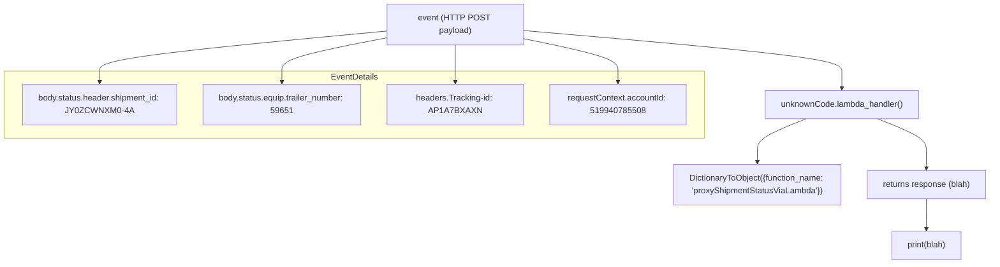

# Diagram: tools/ide_local_testing/localTest/test/shipment/proxyShipmentStatus.py

> Auto-generated by Obscura crawlers

## Mermaid

### SVG

<svg id="container" width="1909.63671875" xmlns="http://www.w3.org/2000/svg" class="flowchart" height="480" viewBox="0 0 1909.63671875 480" role="graphics-document document" aria-roledescription="flowchart-v2"><g><marker id="container_flowchart-v2-pointEnd" class="marker flowchart-v2" viewBox="0 0 10 10" refX="5" refY="5" markerUnits="userSpaceOnUse" markerWidth="8" markerHeight="8" orient="auto"><path d="M 0 0 L 10 5 L 0 10 z" class="arrowMarkerPath" style="stroke-width: 1; stroke-dasharray: 1, 0;"></path></marker><marker id="container_flowchart-v2-pointStart" class="marker flowchart-v2" viewBox="0 0 10 10" refX="4.5" refY="5" markerUnits="userSpaceOnUse" markerWidth="8" markerHeight="8" orient="auto"><path d="M 0 5 L 10 10 L 10 0 z" class="arrowMarkerPath" style="stroke-width: 1; stroke-dasharray: 1, 0;"></path></marker><marker id="container_flowchart-v2-circleEnd" class="marker flowchart-v2" viewBox="0 0 10 10" refX="11" refY="5" markerUnits="userSpaceOnUse" markerWidth="11" markerHeight="11" orient="auto"><circle cx="5" cy="5" r="5" class="arrowMarkerPath" style="stroke-width: 1; stroke-dasharray: 1, 0;"></circle></marker><marker id="container_flowchart-v2-circleStart" class="marker flowchart-v2" viewBox="0 0 10 10" refX="-1" refY="5" markerUnits="userSpaceOnUse" markerWidth="11" markerHeight="11" orient="auto"><circle cx="5" cy="5" r="5" class="arrowMarkerPath" style="stroke-width: 1; stroke-dasharray: 1, 0;"></circle></marker><marker id="container_flowchart-v2-crossEnd" class="marker cross flowchart-v2" viewBox="0 0 11 11" refX="12" refY="5.2" markerUnits="userSpaceOnUse" markerWidth="11" markerHeight="11" orient="auto"><path d="M 1,1 l 9,9 M 10,1 l -9,9" class="arrowMarkerPath" style="stroke-width: 2; stroke-dasharray: 1, 0;"></path></marker><marker id="container_flowchart-v2-crossStart" class="marker cross flowchart-v2" viewBox="0 0 11 11" refX="-1" refY="5.2" markerUnits="userSpaceOnUse" markerWidth="11" markerHeight="11" orient="auto"><path d="M 1,1 l 9,9 M 10,1 l -9,9" class="arrowMarkerPath" style="stroke-width: 2; stroke-dasharray: 1, 0;"></path></marker><g class="root"><g class="clusters"><g class="cluster" id="EventDetails" data-look="classic"><rect style="" x="8" y="112" width="1349.09375" height="128"></rect><g class="cluster-label" transform="translate(637.5546875, 112)"><foreignObject width="89.984375" height="24">

EventDetails

</foreignObject></g></g></g><g class="edgePaths"><path d="M1009.547,43.949L1111.739,51.124C1213.931,58.299,1418.315,72.65,1520.507,83.991C1622.699,95.333,1622.699,103.667,1622.699,113.333C1622.699,123,1622.699,134,1622.699,139.5L1622.699,145" id="L_Event_UnknownHandler_0" class="edge-thickness-normal edge-pattern-solid edge-thickness-normal edge-pattern-solid flowchart-link" style=";" data-edge="true" data-et="edge" data-id="L_Event_UnknownHandler_0" data-points="W3sieCI6MTAwOS41NDY4NzUsInkiOjQzLjk0ODg0MzU4NzY0NzM1fSx7IngiOjE2MjIuNjk5MjE4NzUsInkiOjg3fSx7IngiOjE2MjIuNjk5MjE4NzUsInkiOjExMn0seyJ4IjoxNjIyLjY5OTIxODc1LCJ5IjoxNDl9XQ==" marker-end="url(#container_flowchart-v2-pointEnd)"></path><path d="M1553.512,203L1537.71,209.167C1521.908,215.333,1490.303,227.667,1474.501,238C1458.699,248.333,1458.699,256.667,1458.699,264.333C1458.699,272,1458.699,279,1458.699,282.5L1458.699,286" id="L_UnknownHandler_DictObj_0" class="edge-thickness-normal edge-pattern-solid edge-thickness-normal edge-pattern-solid flowchart-link" style=";" data-edge="true" data-et="edge" data-id="L_UnknownHandler_DictObj_0" data-points="W3sieCI6MTU1My41MTE3MTg3NSwieSI6MjAzfSx7IngiOjE0NTguNjk5MjE4NzUsInkiOjI0MH0seyJ4IjoxNDU4LjY5OTIxODc1LCJ5IjoyNjV9LHsieCI6MTQ1OC42OTkyMTg3NSwieSI6MjkwfV0=" marker-end="url(#container_flowchart-v2-pointEnd)"></path><path d="M1691.887,203L1707.689,209.167C1723.491,215.333,1755.095,227.667,1770.897,238C1786.699,248.333,1786.699,256.667,1786.699,266.333C1786.699,276,1786.699,287,1786.699,292.5L1786.699,298" id="L_UnknownHandler_Blah_0" class="edge-thickness-normal edge-pattern-solid edge-thickness-normal edge-pattern-solid flowchart-link" style=";" data-edge="true" data-et="edge" data-id="L_UnknownHandler_Blah_0" data-points="W3sieCI6MTY5MS44ODY3MTg3NSwieSI6MjAzfSx7IngiOjE3ODYuNjk5MjE4NzUsInkiOjI0MH0seyJ4IjoxNzg2LjY5OTIxODc1LCJ5IjoyNjV9LHsieCI6MTc4Ni42OTkyMTg3NSwieSI6MzAyfV0=" marker-end="url(#container_flowchart-v2-pointEnd)"></path><path d="M1786.699,356L1786.699,362.167C1786.699,368.333,1786.699,380.667,1786.699,390.333C1786.699,400,1786.699,407,1786.699,410.5L1786.699,414" id="L_Blah_Print_0" class="edge-thickness-normal edge-pattern-solid edge-thickness-normal edge-pattern-solid flowchart-link" style=";" data-edge="true" data-et="edge" data-id="L_Blah_Print_0" data-points="W3sieCI6MTc4Ni42OTkyMTg3NSwieSI6MzU2fSx7IngiOjE3ODYuNjk5MjE4NzUsInkiOjM5M30seyJ4IjoxNzg2LjY5OTIxODc1LCJ5Ijo0MTh9XQ==" marker-end="url(#container_flowchart-v2-pointEnd)"></path><path d="M754.641,44.621L661.072,51.684C567.503,58.747,380.365,72.874,286.796,84.103C193.227,95.333,193.227,103.667,193.227,111.333C193.227,119,193.227,126,193.227,129.5L193.227,133" id="L_Event_E1_0" class="edge-thickness-normal edge-pattern-solid edge-thickness-normal edge-pattern-solid flowchart-link" style=";" data-edge="true" data-et="edge" data-id="L_Event_E1_0" data-points="W3sieCI6NzU0LjY0MDYyNSwieSI6NDQuNjIwOTU4MzIxNTE5NzF9LHsieCI6MTkzLjIyNjU2MjUsInkiOjg3fSx7IngiOjE5My4yMjY1NjI1LCJ5IjoxMTJ9LHsieCI6MTkzLjIyNjU2MjUsInkiOjEzN31d" marker-end="url(#container_flowchart-v2-pointEnd)"></path><path d="M754.641,54.824L720.163,60.187C685.685,65.549,616.729,76.275,582.251,85.804C547.773,95.333,547.773,103.667,547.773,111.333C547.773,119,547.773,126,547.773,129.5L547.773,133" id="L_Event_E2_0" class="edge-thickness-normal edge-pattern-solid edge-thickness-normal edge-pattern-solid flowchart-link" style=";" data-edge="true" data-et="edge" data-id="L_Event_E2_0" data-points="W3sieCI6NzU0LjY0MDYyNSwieSI6NTQuODIzOTg5OTA0ODkwOTg2fSx7IngiOjU0Ny43NzM0Mzc1LCJ5Ijo4N30seyJ4Ijo1NDcuNzczNDM3NSwieSI6MTEyfSx7IngiOjU0Ny43NzM0Mzc1LCJ5IjoxMzd9XQ==" marker-end="url(#container_flowchart-v2-pointEnd)"></path><path d="M882.094,62L882.094,66.167C882.094,70.333,882.094,78.667,882.094,87C882.094,95.333,882.094,103.667,882.094,111.333C882.094,119,882.094,126,882.094,129.5L882.094,133" id="L_Event_E3_0" class="edge-thickness-normal edge-pattern-solid edge-thickness-normal edge-pattern-solid flowchart-link" style=";" data-edge="true" data-et="edge" data-id="L_Event_E3_0" data-points="W3sieCI6ODgyLjA5Mzc1LCJ5Ijo2Mn0seyJ4Ijo4ODIuMDkzNzUsInkiOjg3fSx7IngiOjg4Mi4wOTM3NSwieSI6MTEyfSx7IngiOjg4Mi4wOTM3NSwieSI6MTM3fV0=" marker-end="url(#container_flowchart-v2-pointEnd)"></path><path d="M1009.547,56.379L1039.971,61.483C1070.396,66.586,1131.245,76.793,1161.669,86.063C1192.094,95.333,1192.094,103.667,1192.094,111.333C1192.094,119,1192.094,126,1192.094,129.5L1192.094,133" id="L_Event_E4_0" class="edge-thickness-normal edge-pattern-solid edge-thickness-normal edge-pattern-solid flowchart-link" style=";" data-edge="true" data-et="edge" data-id="L_Event_E4_0" data-points="W3sieCI6MTAwOS41NDY4NzUsInkiOjU2LjM3OTIzMzg3MDk2Nzc0fSx7IngiOjExOTIuMDkzNzUsInkiOjg3fSx7IngiOjExOTIuMDkzNzUsInkiOjExMn0seyJ4IjoxMTkyLjA5Mzc1LCJ5IjoxMzd9XQ==" marker-end="url(#container_flowchart-v2-pointEnd)"></path></g><g class="edgeLabels"><g class="edgeLabel"><g class="label" data-id="L_Event_UnknownHandler_0" transform="translate(0, 0)"><foreignObject width="0" height="0">

</foreignObject></g></g><g class="edgeLabel"><g class="label" data-id="L_UnknownHandler_DictObj_0" transform="translate(0, 0)"><foreignObject width="0" height="0">

</foreignObject></g></g><g class="edgeLabel"><g class="label" data-id="L_UnknownHandler_Blah_0" transform="translate(0, 0)"><foreignObject width="0" height="0">

</foreignObject></g></g><g class="edgeLabel"><g class="label" data-id="L_Blah_Print_0" transform="translate(0, 0)"><foreignObject width="0" height="0">

</foreignObject></g></g><g class="edgeLabel"><g class="label" data-id="L_Event_E1_0" transform="translate(0, 0)"><foreignObject width="0" height="0">

</foreignObject></g></g><g class="edgeLabel"><g class="label" data-id="L_Event_E2_0" transform="translate(0, 0)"><foreignObject width="0" height="0">

</foreignObject></g></g><g class="edgeLabel"><g class="label" data-id="L_Event_E3_0" transform="translate(0, 0)"><foreignObject width="0" height="0">

</foreignObject></g></g><g class="edgeLabel"><g class="label" data-id="L_Event_E4_0" transform="translate(0, 0)"><foreignObject width="0" height="0">

</foreignObject></g></g></g><g class="nodes"><g class="node default" id="flowchart-Event-0" transform="translate(882.09375, 35)"><rect class="basic label-container" style="" x="-127.453125" y="-27" width="254.90625" height="54"></rect><g class="label" style="" transform="translate(-97.453125, -12)"><rect></rect><foreignObject width="194.90625" height="24">

event (HTTP POST payload)

</foreignObject></g></g><g class="node default" id="flowchart-UnknownHandler-1" transform="translate(1622.69921875, 176)"><rect class="basic label-container" style="" x="-148.2109375" y="-27" width="296.421875" height="54"></rect><g class="label" style="" transform="translate(-118.2109375, -12)"><rect></rect><foreignObject width="236.421875" height="24">

unknownCode.lambda_handler()

</foreignObject></g></g><g class="node default" id="flowchart-DictObj-3" transform="translate(1458.69921875, 329)"><rect class="basic label-container" style="" x="-163.0625" y="-39" width="326.125" height="78"></rect><g class="label" style="" transform="translate(-133.0625, -24)"><rect></rect><foreignObject width="266.125" height="48">

DictionaryToObject({function_name: 'proxyShipmentStatusViaLambda'})

</foreignObject></g></g><g class="node default" id="flowchart-Blah-5" transform="translate(1786.69921875, 329)"><rect class="basic label-container" style="" x="-114.9375" y="-27" width="229.875" height="54"></rect><g class="label" style="" transform="translate(-84.9375, -12)"><rect></rect><foreignObject width="169.875" height="24">

returns response (blah)

</foreignObject></g></g><g class="node default" id="flowchart-Print-7" transform="translate(1786.69921875, 445)"><rect class="basic label-container" style="" x="-68.953125" y="-27" width="137.90625" height="54"></rect><g class="label" style="" transform="translate(-38.953125, -12)"><rect></rect><foreignObject width="77.90625" height="24">

print(blah)

</foreignObject></g></g><g class="node default" id="flowchart-E1-8" transform="translate(193.2265625, 176)"><rect class="basic label-container" style="" x="-150.2265625" y="-39" width="300.453125" height="78"></rect><g class="label" style="" transform="translate(-120.2265625, -24)"><rect></rect><foreignObject width="240.453125" height="48">

body.status.header.shipment_id: JY0ZCWNXM0-4A

</foreignObject></g></g><g class="node default" id="flowchart-E2-9" transform="translate(547.7734375, 176)"><rect class="basic label-container" style="" x="-154.3203125" y="-39" width="308.640625" height="78"></rect><g class="label" style="" transform="translate(-124.3203125, -24)"><rect></rect><foreignObject width="248.640625" height="48">

body.status.equip.trailer_number: 59651

</foreignObject></g></g><g class="node default" id="flowchart-E3-10" transform="translate(882.09375, 176)"><rect class="basic label-container" style="" x="-130" y="-39" width="260" height="78"></rect><g class="label" style="" transform="translate(-100, -24)"><rect></rect><foreignObject width="200" height="48">

headers.Tracking-id: AP1A7BXAXN

</foreignObject></g></g><g class="node default" id="flowchart-E4-11" transform="translate(1192.09375, 176)"><rect class="basic label-container" style="" x="-130" y="-39" width="260" height="78"></rect><g class="label" style="" transform="translate(-100, -24)"><rect></rect><foreignObject width="200" height="48">

requestContext.accountId: 519940785508

</foreignObject></g></g></g></g></g></svg>
