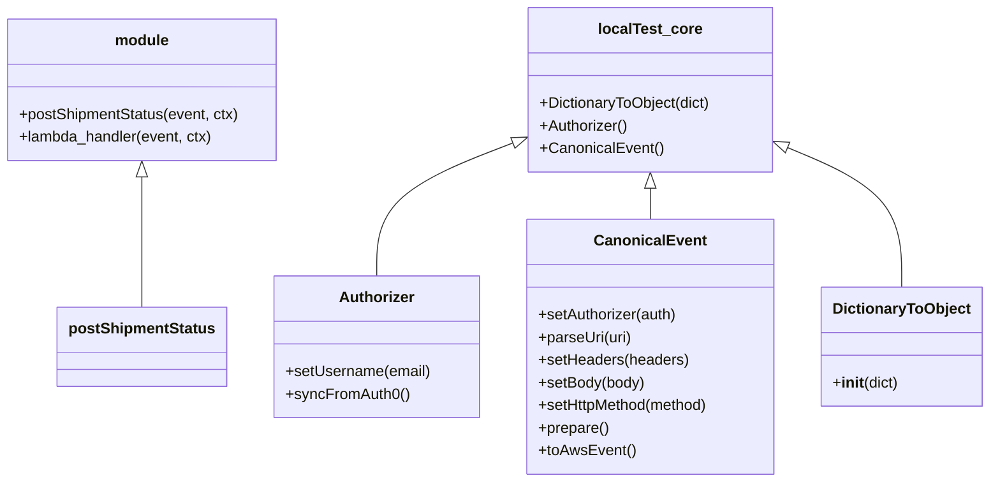

# Diagram: tools/ide_local_testing/localTest/test/shipment/statusUpdateAssetAssignment.py


> Auto-generated by Obscura crawlers

## Diagram 1



### SVG

<svg id="container" width="1041.046875" xmlns="http://www.w3.org/2000/svg" class="classDiagram" height="510" viewBox="0 0 1041.046875 510" role="graphics-document document" aria-roledescription="class"><style>#container{font-family:"trebuchet ms",verdana,arial,sans-serif;font-size:16px;fill:#333;}@keyframes edge-animation-frame{from{stroke-dashoffset:0;}}@keyframes dash{to{stroke-dashoffset:0;}}#container .edge-animation-slow{stroke-dasharray:9,5!important;stroke-dashoffset:900;animation:dash 50s linear infinite;stroke-linecap:round;}#container .edge-animation-fast{stroke-dasharray:9,5!important;stroke-dashoffset:900;animation:dash 20s linear infinite;stroke-linecap:round;}#container .error-icon{fill:#552222;}#container .error-text{fill:#552222;stroke:#552222;}#container .edge-thickness-normal{stroke-width:1px;}#container .edge-thickness-thick{stroke-width:3.5px;}#container .edge-pattern-solid{stroke-dasharray:0;}#container .edge-thickness-invisible{stroke-width:0;fill:none;}#container .edge-pattern-dashed{stroke-dasharray:3;}#container .edge-pattern-dotted{stroke-dasharray:2;}#container .marker{fill:#333333;stroke:#333333;}#container .marker.cross{stroke:#333333;}#container svg{font-family:"trebuchet ms",verdana,arial,sans-serif;font-size:16px;}#container p{margin:0;}#container g.classGroup text{fill:#9370DB;stroke:none;font-family:"trebuchet ms",verdana,arial,sans-serif;font-size:10px;}#container g.classGroup text .title{font-weight:bolder;}#container .nodeLabel,#container .edgeLabel{color:#131300;}#container .edgeLabel .label rect{fill:#ECECFF;}#container .label text{fill:#131300;}#container .labelBkg{background:#ECECFF;}#container .edgeLabel .label span{background:#ECECFF;}#container .classTitle{font-weight:bolder;}#container .node rect,#container .node circle,#container .node ellipse,#container .node polygon,#container .node path{fill:#ECECFF;stroke:#9370DB;stroke-width:1px;}#container .divider{stroke:#9370DB;stroke-width:1;}#container g.clickable{cursor:pointer;}#container g.classGroup rect{fill:#ECECFF;stroke:#9370DB;}#container g.classGroup line{stroke:#9370DB;stroke-width:1;}#container .classLabel .box{stroke:none;stroke-width:0;fill:#ECECFF;opacity:0.5;}#container .classLabel .label{fill:#9370DB;font-size:10px;}#container .relation{stroke:#333333;stroke-width:1;fill:none;}#container .dashed-line{stroke-dasharray:3;}#container .dotted-line{stroke-dasharray:1 2;}#container #compositionStart,#container .composition{fill:#333333!important;stroke:#333333!important;stroke-width:1;}#container #compositionEnd,#container .composition{fill:#333333!important;stroke:#333333!important;stroke-width:1;}#container #dependencyStart,#container .dependency{fill:#333333!important;stroke:#333333!important;stroke-width:1;}#container #dependencyStart,#container .dependency{fill:#333333!important;stroke:#333333!important;stroke-width:1;}#container #extensionStart,#container .extension{fill:transparent!important;stroke:#333333!important;stroke-width:1;}#container #extensionEnd,#container .extension{fill:transparent!important;stroke:#333333!important;stroke-width:1;}#container #aggregationStart,#container .aggregation{fill:transparent!important;stroke:#333333!important;stroke-width:1;}#container #aggregationEnd,#container .aggregation{fill:transparent!important;stroke:#333333!important;stroke-width:1;}#container #lollipopStart,#container .lollipop{fill:#ECECFF!important;stroke:#333333!important;stroke-width:1;}#container #lollipopEnd,#container .lollipop{fill:#ECECFF!important;stroke:#333333!important;stroke-width:1;}#container .edgeTerminals{font-size:11px;line-height:initial;}#container .classTitleText{text-anchor:middle;font-size:18px;fill:#333;}#container .label-icon{display:inline-block;height:1em;overflow:visible;vertical-align:-0.125em;}#container .node .label-icon path{fill:currentColor;stroke:revert;stroke-width:revert;}#container :root{--mermaid-font-family:"trebuchet ms",verdana,arial,sans-serif;}</style><g><defs><marker id="container_class-aggregationStart" class="marker aggregation class" refX="18" refY="7" markerWidth="190" markerHeight="240" orient="auto"><path d="M 18,7 L9,13 L1,7 L9,1 Z"></path></marker></defs><defs><marker id="container_class-aggregationEnd" class="marker aggregation class" refX="1" refY="7" markerWidth="20" markerHeight="28" orient="auto"><path d="M 18,7 L9,13 L1,7 L9,1 Z"></path></marker></defs><defs><marker id="container_class-extensionStart" class="marker extension class" refX="18" refY="7" markerWidth="190" markerHeight="240" orient="auto"><path d="M 1,7 L18,13 V 1 Z"></path></marker></defs><defs><marker id="container_class-extensionEnd" class="marker extension class" refX="1" refY="7" markerWidth="20" markerHeight="28" orient="auto"><path d="M 1,1 V 13 L18,7 Z"></path></marker></defs><defs><marker id="container_class-compositionStart" class="marker composition class" refX="18" refY="7" markerWidth="190" markerHeight="240" orient="auto"><path d="M 18,7 L9,13 L1,7 L9,1 Z"></path></marker></defs><defs><marker id="container_class-compositionEnd" class="marker composition class" refX="1" refY="7" markerWidth="20" markerHeight="28" orient="auto"><path d="M 18,7 L9,13 L1,7 L9,1 Z"></path></marker></defs><defs><marker id="container_class-dependencyStart" class="marker dependency class" refX="6" refY="7" markerWidth="190" markerHeight="240" orient="auto"><path d="M 5,7 L9,13 L1,7 L9,1 Z"></path></marker></defs><defs><marker id="container_class-dependencyEnd" class="marker dependency class" refX="13" refY="7" markerWidth="20" markerHeight="28" orient="auto"><path d="M 18,7 L9,13 L14,7 L9,1 Z"></path></marker></defs><defs><marker id="container_class-lollipopStart" class="marker lollipop class" refX="13" refY="7" markerWidth="190" markerHeight="240" orient="auto"><circle stroke="black" fill="transparent" cx="7" cy="7" r="6"></circle></marker></defs><defs><marker id="container_class-lollipopEnd" class="marker lollipop class" refX="1" refY="7" markerWidth="190" markerHeight="240" orient="auto"><circle stroke="black" fill="transparent" cx="7" cy="7" r="6"></circle></marker></defs><g class="root"><g class="clusters"></g><g class="edgePaths"><path d="M151.516,187.25L151.516,190.542C151.516,193.833,151.516,200.417,151.516,223.375C151.516,246.333,151.516,285.667,151.516,305.333L151.516,325" id="id_module_postShipmentStatus_1" class="edge-thickness-normal edge-pattern-solid relation" style=";;;" data-edge="true" data-et="edge" data-id="id_module_postShipmentStatus_1" data-points="W3sieCI6MTUxLjUxNTYyNSwieSI6MTcwfSx7IngiOjE1MS41MTU2MjUsInkiOjIwN30seyJ4IjoxNTEuNTE1NjI1LCJ5IjozMjV9XQ==" marker-start="url(#container_class-extensionStart)"></path><path d="M540.466,151.496L516.508,160.746C492.549,169.997,444.632,188.499,420.673,211.916C396.715,235.333,396.715,263.667,396.715,277.833L396.715,292" id="id_localTest_core_Authorizer_2" class="edge-thickness-normal edge-pattern-solid relation" style=";;;" data-edge="true" data-et="edge" data-id="id_localTest_core_Authorizer_2" data-points="W3sieCI6NTU2LjU1ODU5Mzc1LCJ5IjoxNDUuMjgyMjA1Mjg0Mjc5MTR9LHsieCI6Mzk2LjcxNDg0Mzc1LCJ5IjoyMDd9LHsieCI6Mzk2LjcxNDg0Mzc1LCJ5IjoyOTJ9XQ==" marker-start="url(#container_class-extensionStart)"></path><path d="M686.785,199.25L686.785,200.542C686.785,201.833,686.785,204.417,686.785,209.875C686.785,215.333,686.785,223.667,686.785,227.833L686.785,232" id="id_localTest_core_CanonicalEvent_3" class="edge-thickness-normal edge-pattern-solid relation" style=";;;" data-edge="true" data-et="edge" data-id="id_localTest_core_CanonicalEvent_3" data-points="W3sieCI6Njg2Ljc4NTE1NjI1LCJ5IjoxODJ9LHsieCI6Njg2Ljc4NTE1NjI1LCJ5IjoyMDd9LHsieCI6Njg2Ljc4NTE1NjI1LCJ5IjoyMzJ9XQ==" marker-start="url(#container_class-extensionStart)"></path><path d="M832.892,156.971L852.551,165.309C872.209,173.647,911.527,190.324,931.185,214.829C950.844,239.333,950.844,271.667,950.844,287.833L950.844,304" id="id_localTest_core_DictionaryToObject_4" class="edge-thickness-normal edge-pattern-solid relation" style=";;;" data-edge="true" data-et="edge" data-id="id_localTest_core_DictionaryToObject_4" data-points="W3sieCI6ODE3LjAxMTcxODc1LCJ5IjoxNTAuMjM1MzczMzA0MzM4ODJ9LHsieCI6OTUwLjg0Mzc1LCJ5IjoyMDd9LHsieCI6OTUwLjg0Mzc1LCJ5IjozMDR9XQ==" marker-start="url(#container_class-extensionStart)"></path></g><g class="edgeLabels"><g class="edgeLabel"><g class="label" data-id="id_module_postShipmentStatus_1" transform="translate(0, 0)"><foreignObject width="0" height="0"><div xmlns="http://www.w3.org/1999/xhtml" class="labelBkg" style="display: table-cell; white-space: nowrap; line-height: 1.5; max-width: 200px; text-align: center;"><span class="edgeLabel"></span></div></foreignObject></g></g><g class="edgeLabel"><g class="label" data-id="id_localTest_core_Authorizer_2" transform="translate(0, 0)"><foreignObject width="0" height="0"><div xmlns="http://www.w3.org/1999/xhtml" class="labelBkg" style="display: table-cell; white-space: nowrap; line-height: 1.5; max-width: 200px; text-align: center;"><span class="edgeLabel"></span></div></foreignObject></g></g><g class="edgeLabel"><g class="label" data-id="id_localTest_core_CanonicalEvent_3" transform="translate(0, 0)"><foreignObject width="0" height="0"><div xmlns="http://www.w3.org/1999/xhtml" class="labelBkg" style="display: table-cell; white-space: nowrap; line-height: 1.5; max-width: 200px; text-align: center;"><span class="edgeLabel"></span></div></foreignObject></g></g><g class="edgeLabel"><g class="label" data-id="id_localTest_core_DictionaryToObject_4" transform="translate(0, 0)"><foreignObject width="0" height="0"><div xmlns="http://www.w3.org/1999/xhtml" class="labelBkg" style="display: table-cell; white-space: nowrap; line-height: 1.5; max-width: 200px; text-align: center;"><span class="edgeLabel"></span></div></foreignObject></g></g></g><g class="nodes"><g class="node default" id="classId-module-0" transform="translate(151.515625, 95)"><g class="basic label-container"><path d="M-143.515625 -75 L143.515625 -75 L143.515625 75 L-143.515625 75" stroke="none" stroke-width="0" fill="#ECECFF" style=""></path><path d="M-143.515625 -75 C-29.413682085927675 -75, 84.68826082814465 -75, 143.515625 -75 M-143.515625 -75 C-34.766960641695064 -75, 73.98170371660987 -75, 143.515625 -75 M143.515625 -75 C143.515625 -27.337111121817486, 143.515625 20.325777756365028, 143.515625 75 M143.515625 -75 C143.515625 -34.05057549112006, 143.515625 6.898849017759886, 143.515625 75 M143.515625 75 C41.98728881614235 75, -59.541047367715294 75, -143.515625 75 M143.515625 75 C84.87504401769124 75, 26.23446303538249 75, -143.515625 75 M-143.515625 75 C-143.515625 41.212626700503485, -143.515625 7.4252534010069695, -143.515625 -75 M-143.515625 75 C-143.515625 15.631376240006482, -143.515625 -43.73724751998704, -143.515625 -75" stroke="#9370DB" stroke-width="1.3" fill="none" stroke-dasharray="0 0" style=""></path></g><g class="annotation-group text" transform="translate(0, -51)"></g><g class="label-group text" transform="translate(-27.5625, -51)"><g class="label" style="font-weight: bolder" transform="translate(0,-12)"><foreignObject width="55.125" height="24"><div xmlns="http://www.w3.org/1999/xhtml" style="display: table-cell; white-space: nowrap; line-height: 1.5; max-width: 105px; text-align: center;"><span class="nodeLabel markdown-node-label" style=""><p>module</p></span></div></foreignObject></g></g><g class="members-group text" transform="translate(-131.515625, -3)"></g><g class="methods-group text" transform="translate(-131.515625, 27)"><g class="label" style="" transform="translate(0,-12)"><foreignObject width="235.46875" height="24"><div xmlns="http://www.w3.org/1999/xhtml" style="display: table-cell; white-space: nowrap; line-height: 1.5; max-width: 293px; text-align: center;"><span class="nodeLabel markdown-node-label" style=""><p>+postShipmentStatus(event, ctx)</p></span></div></foreignObject></g><g class="label" style="" transform="translate(0,12)"><foreignObject width="207.671875" height="24"><div xmlns="http://www.w3.org/1999/xhtml" style="display: table-cell; white-space: nowrap; line-height: 1.5; max-width: 265px; text-align: center;"><span class="nodeLabel markdown-node-label" style=""><p>+lambda_handler(event, ctx)</p></span></div></foreignObject></g></g><g class="divider" style=""><path d="M-143.515625 -27 C-57.326412110399076 -27, 28.862800779201848 -27, 143.515625 -27 M-143.515625 -27 C-40.20750169079696 -27, 63.10062161840608 -27, 143.515625 -27" stroke="#9370DB" stroke-width="1.3" fill="none" stroke-dasharray="0 0" style=""></path></g><g class="divider" style=""><path d="M-143.515625 -3 C-63.70876790873203 -3, 16.098089182535944 -3, 143.515625 -3 M-143.515625 -3 C-67.2350604082383 -3, 9.045504183523406 -3, 143.515625 -3" stroke="#9370DB" stroke-width="1.3" fill="none" stroke-dasharray="0 0" style=""></path></g></g><g class="node default" id="classId-localTest_core-1" transform="translate(686.78515625, 95)"><g class="basic label-container"><path d="M-130.2265625 -87 L130.2265625 -87 L130.2265625 87 L-130.2265625 87" stroke="none" stroke-width="0" fill="#ECECFF" style=""></path><path d="M-130.2265625 -87 C-58.34989448914324 -87, 13.526773521713523 -87, 130.2265625 -87 M-130.2265625 -87 C-38.11687212555856 -87, 53.992818248882884 -87, 130.2265625 -87 M130.2265625 -87 C130.2265625 -35.834171301444854, 130.2265625 15.331657397110291, 130.2265625 87 M130.2265625 -87 C130.2265625 -35.8423528599101, 130.2265625 15.315294280179799, 130.2265625 87 M130.2265625 87 C70.49559737605213 87, 10.76463225210425 87, -130.2265625 87 M130.2265625 87 C29.943980148405757 87, -70.33860220318849 87, -130.2265625 87 M-130.2265625 87 C-130.2265625 50.80853485461019, -130.2265625 14.617069709220374, -130.2265625 -87 M-130.2265625 87 C-130.2265625 43.04192033955317, -130.2265625 -0.9161593208936551, -130.2265625 -87" stroke="#9370DB" stroke-width="1.3" fill="none" stroke-dasharray="0 0" style=""></path></g><g class="annotation-group text" transform="translate(0, -63)"></g><g class="label-group text" transform="translate(-52.421875, -63)"><g class="label" style="font-weight: bolder" transform="translate(0,-12)"><foreignObject width="104.84375" height="24"><div xmlns="http://www.w3.org/1999/xhtml" style="display: table-cell; white-space: nowrap; line-height: 1.5; max-width: 153px; text-align: center;"><span class="nodeLabel markdown-node-label" style=""><p>localTest_core</p></span></div></foreignObject></g></g><g class="members-group text" transform="translate(-118.2265625, -15)"></g><g class="methods-group text" transform="translate(-118.2265625, 15)"><g class="label" style="" transform="translate(0,-12)"><foreignObject width="184.03125" height="24"><div xmlns="http://www.w3.org/1999/xhtml" style="display: table-cell; white-space: nowrap; line-height: 1.5; max-width: 241px; text-align: center;"><span class="nodeLabel markdown-node-label" style=""><p>+DictionaryToObject(dict)</p></span></div></foreignObject></g><g class="label" style="" transform="translate(0,12)"><foreignObject width="93.640625" height="24"><div xmlns="http://www.w3.org/1999/xhtml" style="display: table-cell; white-space: nowrap; line-height: 1.5; max-width: 151px; text-align: center;"><span class="nodeLabel markdown-node-label" style=""><p>+Authorizer()</p></span></div></foreignObject></g><g class="label" style="" transform="translate(0,36)"><foreignObject width="129.109375" height="24"><div xmlns="http://www.w3.org/1999/xhtml" style="display: table-cell; white-space: nowrap; line-height: 1.5; max-width: 186px; text-align: center;"><span class="nodeLabel markdown-node-label" style=""><p>+CanonicalEvent()</p></span></div></foreignObject></g></g><g class="divider" style=""><path d="M-130.2265625 -39 C-27.029273359202506 -39, 76.16801578159499 -39, 130.2265625 -39 M-130.2265625 -39 C-35.4154462971899 -39, 59.395669905620196 -39, 130.2265625 -39" stroke="#9370DB" stroke-width="1.3" fill="none" stroke-dasharray="0 0" style=""></path></g><g class="divider" style=""><path d="M-130.2265625 -15 C-29.488196258272637 -15, 71.25016998345473 -15, 130.2265625 -15 M-130.2265625 -15 C-55.26156783646012 -15, 19.703426827079767 -15, 130.2265625 -15" stroke="#9370DB" stroke-width="1.3" fill="none" stroke-dasharray="0 0" style=""></path></g></g><g class="node default" id="classId-Authorizer-2" transform="translate(396.71484375, 367)"><g class="basic label-container"><path d="M-108.21484375 -75 L108.21484375 -75 L108.21484375 75 L-108.21484375 75" stroke="none" stroke-width="0" fill="#ECECFF" style=""></path><path d="M-108.21484375 -75 C-25.573972011394503 -75, 57.066899727210995 -75, 108.21484375 -75 M-108.21484375 -75 C-62.37193049167756 -75, -16.52901723335512 -75, 108.21484375 -75 M108.21484375 -75 C108.21484375 -43.87019246726595, 108.21484375 -12.74038493453191, 108.21484375 75 M108.21484375 -75 C108.21484375 -40.780714142709655, 108.21484375 -6.561428285419311, 108.21484375 75 M108.21484375 75 C54.8550844900904 75, 1.4953252301807964 75, -108.21484375 75 M108.21484375 75 C63.635547742316426 75, 19.056251734632852 75, -108.21484375 75 M-108.21484375 75 C-108.21484375 18.464627283541212, -108.21484375 -38.070745432917576, -108.21484375 -75 M-108.21484375 75 C-108.21484375 16.216096613889015, -108.21484375 -42.56780677222197, -108.21484375 -75" stroke="#9370DB" stroke-width="1.3" fill="none" stroke-dasharray="0 0" style=""></path></g><g class="annotation-group text" transform="translate(0, -51)"></g><g class="label-group text" transform="translate(-38.3671875, -51)"><g class="label" style="font-weight: bolder" transform="translate(0,-12)"><foreignObject width="76.734375" height="24"><div xmlns="http://www.w3.org/1999/xhtml" style="display: table-cell; white-space: nowrap; line-height: 1.5; max-width: 126px; text-align: center;"><span class="nodeLabel markdown-node-label" style=""><p>Authorizer</p></span></div></foreignObject></g></g><g class="members-group text" transform="translate(-96.21484375, -3)"></g><g class="methods-group text" transform="translate(-96.21484375, 27)"><g class="label" style="" transform="translate(0,-12)"><foreignObject width="154.0625" height="24"><div xmlns="http://www.w3.org/1999/xhtml" style="display: table-cell; white-space: nowrap; line-height: 1.5; max-width: 211px; text-align: center;"><span class="nodeLabel markdown-node-label" style=""><p>+setUsername(email)</p></span></div></foreignObject></g><g class="label" style="" transform="translate(0,12)"><foreignObject width="129.0625" height="24"><div xmlns="http://www.w3.org/1999/xhtml" style="display: table-cell; white-space: nowrap; line-height: 1.5; max-width: 186px; text-align: center;"><span class="nodeLabel markdown-node-label" style=""><p>+syncFromAuth0()</p></span></div></foreignObject></g></g><g class="divider" style=""><path d="M-108.21484375 -27 C-59.079530343401615 -27, -9.94421693680323 -27, 108.21484375 -27 M-108.21484375 -27 C-51.68985578056874 -27, 4.8351321888625165 -27, 108.21484375 -27" stroke="#9370DB" stroke-width="1.3" fill="none" stroke-dasharray="0 0" style=""></path></g><g class="divider" style=""><path d="M-108.21484375 -3 C-32.99405724149982 -3, 42.226729267000366 -3, 108.21484375 -3 M-108.21484375 -3 C-40.50982899781363 -3, 27.195185754372744 -3, 108.21484375 -3" stroke="#9370DB" stroke-width="1.3" fill="none" stroke-dasharray="0 0" style=""></path></g></g><g class="node default" id="classId-CanonicalEvent-3" transform="translate(686.78515625, 367)"><g class="basic label-container"><path d="M-131.85546875 -135 L131.85546875 -135 L131.85546875 135 L-131.85546875 135" stroke="none" stroke-width="0" fill="#ECECFF" style=""></path><path d="M-131.85546875 -135 C-60.69681937216906 -135, 10.46183000566188 -135, 131.85546875 -135 M-131.85546875 -135 C-60.86878885462731 -135, 10.117891040745377 -135, 131.85546875 -135 M131.85546875 -135 C131.85546875 -55.61631046564244, 131.85546875 23.767379068715115, 131.85546875 135 M131.85546875 -135 C131.85546875 -34.11502813133977, 131.85546875 66.76994373732046, 131.85546875 135 M131.85546875 135 C54.00676022880357 135, -23.841948292392857 135, -131.85546875 135 M131.85546875 135 C53.70467517329257 135, -24.446118403414857 135, -131.85546875 135 M-131.85546875 135 C-131.85546875 79.99046031379332, -131.85546875 24.98092062758664, -131.85546875 -135 M-131.85546875 135 C-131.85546875 39.80381403556913, -131.85546875 -55.392371928861735, -131.85546875 -135" stroke="#9370DB" stroke-width="1.3" fill="none" stroke-dasharray="0 0" style=""></path></g><g class="annotation-group text" transform="translate(0, -111)"></g><g class="label-group text" transform="translate(-55.7109375, -111)"><g class="label" style="font-weight: bolder" transform="translate(0,-12)"><foreignObject width="111.421875" height="24"><div xmlns="http://www.w3.org/1999/xhtml" style="display: table-cell; white-space: nowrap; line-height: 1.5; max-width: 161px; text-align: center;"><span class="nodeLabel markdown-node-label" style=""><p>CanonicalEvent</p></span></div></foreignObject></g></g><g class="members-group text" transform="translate(-119.85546875, -63)"></g><g class="methods-group text" transform="translate(-119.85546875, -33)"><g class="label" style="" transform="translate(0,-12)"><foreignObject width="148.9375" height="24"><div xmlns="http://www.w3.org/1999/xhtml" style="display: table-cell; white-space: nowrap; line-height: 1.5; max-width: 206px; text-align: center;"><span class="nodeLabel markdown-node-label" style=""><p>+setAuthorizer(auth)</p></span></div></foreignObject></g><g class="label" style="" transform="translate(0,12)"><foreignObject width="99.8125" height="24"><div xmlns="http://www.w3.org/1999/xhtml" style="display: table-cell; white-space: nowrap; line-height: 1.5; max-width: 157px; text-align: center;"><span class="nodeLabel markdown-node-label" style=""><p>+parseUri(uri)</p></span></div></foreignObject></g><g class="label" style="" transform="translate(0,36)"><foreignObject width="158.5" height="24"><div xmlns="http://www.w3.org/1999/xhtml" style="display: table-cell; white-space: nowrap; line-height: 1.5; max-width: 216px; text-align: center;"><span class="nodeLabel markdown-node-label" style=""><p>+setHeaders(headers)</p></span></div></foreignObject></g><g class="label" style="" transform="translate(0,60)"><foreignObject width="113.125" height="24"><div xmlns="http://www.w3.org/1999/xhtml" style="display: table-cell; white-space: nowrap; line-height: 1.5; max-width: 170px; text-align: center;"><span class="nodeLabel markdown-node-label" style=""><p>+setBody(body)</p></span></div></foreignObject></g><g class="label" style="" transform="translate(0,84)"><foreignObject width="184" height="24"><div xmlns="http://www.w3.org/1999/xhtml" style="display: table-cell; white-space: nowrap; line-height: 1.5; max-width: 241px; text-align: center;"><span class="nodeLabel markdown-node-label" style=""><p>+setHttpMethod(method)</p></span></div></foreignObject></g><g class="label" style="" transform="translate(0,108)"><foreignObject width="74.75" height="24"><div xmlns="http://www.w3.org/1999/xhtml" style="display: table-cell; white-space: nowrap; line-height: 1.5; max-width: 132px; text-align: center;"><span class="nodeLabel markdown-node-label" style=""><p>+prepare()</p></span></div></foreignObject></g><g class="label" style="" transform="translate(0,132)"><foreignObject width="101.1875" height="24"><div xmlns="http://www.w3.org/1999/xhtml" style="display: table-cell; white-space: nowrap; line-height: 1.5; max-width: 159px; text-align: center;"><span class="nodeLabel markdown-node-label" style=""><p>+toAwsEvent()</p></span></div></foreignObject></g></g><g class="divider" style=""><path d="M-131.85546875 -87 C-78.11658936317994 -87, -24.377709976359867 -87, 131.85546875 -87 M-131.85546875 -87 C-48.582770421823255 -87, 34.68992790635349 -87, 131.85546875 -87" stroke="#9370DB" stroke-width="1.3" fill="none" stroke-dasharray="0 0" style=""></path></g><g class="divider" style=""><path d="M-131.85546875 -63 C-64.60858685332867 -63, 2.6382950433426515 -63, 131.85546875 -63 M-131.85546875 -63 C-68.11139927608545 -63, -4.3673298021709 -63, 131.85546875 -63" stroke="#9370DB" stroke-width="1.3" fill="none" stroke-dasharray="0 0" style=""></path></g></g><g class="node default" id="classId-DictionaryToObject-4" transform="translate(950.84375, 367)"><g class="basic label-container"><path d="M-82.203125 -63 L82.203125 -63 L82.203125 63 L-82.203125 63" stroke="none" stroke-width="0" fill="#ECECFF" style=""></path><path d="M-82.203125 -63 C-21.100893957273655 -63, 40.00133708545269 -63, 82.203125 -63 M-82.203125 -63 C-39.89776604104068 -63, 2.4075929179186346 -63, 82.203125 -63 M82.203125 -63 C82.203125 -27.933096093691695, 82.203125 7.13380781261661, 82.203125 63 M82.203125 -63 C82.203125 -30.893591263761458, 82.203125 1.2128174724770844, 82.203125 63 M82.203125 63 C33.099474415741284 63, -16.004176168517432 63, -82.203125 63 M82.203125 63 C37.34661135705807 63, -7.509902285883854 63, -82.203125 63 M-82.203125 63 C-82.203125 21.73608851133789, -82.203125 -19.52782297732422, -82.203125 -63 M-82.203125 63 C-82.203125 34.365259995825696, -82.203125 5.730519991651384, -82.203125 -63" stroke="#9370DB" stroke-width="1.3" fill="none" stroke-dasharray="0 0" style=""></path></g><g class="annotation-group text" transform="translate(0, -39)"></g><g class="label-group text" transform="translate(-70.109375, -39)"><g class="label" style="font-weight: bolder" transform="translate(0,-12)"><foreignObject width="140.21875" height="24"><div xmlns="http://www.w3.org/1999/xhtml" style="display: table-cell; white-space: nowrap; line-height: 1.5; max-width: 188px; text-align: center;"><span class="nodeLabel markdown-node-label" style=""><p>DictionaryToObject</p></span></div></foreignObject></g></g><g class="members-group text" transform="translate(-70.203125, 9)"></g><g class="methods-group text" transform="translate(-70.203125, 39)"><g class="label" style="" transform="translate(0,-12)"><foreignObject width="70.296875" height="24"><div xmlns="http://www.w3.org/1999/xhtml" style="display: table-cell; white-space: nowrap; line-height: 1.5; max-width: 159px; text-align: center;"><span class="nodeLabel markdown-node-label" style=""><p>+<strong>init</strong>(dict)</p></span></div></foreignObject></g></g><g class="divider" style=""><path d="M-82.203125 -15 C-31.578603348398374 -15, 19.04591830320325 -15, 82.203125 -15 M-82.203125 -15 C-27.83846643622556 -15, 26.52619212754888 -15, 82.203125 -15" stroke="#9370DB" stroke-width="1.3" fill="none" stroke-dasharray="0 0" style=""></path></g><g class="divider" style=""><path d="M-82.203125 9 C-42.89416405082748 9, -3.5852031016549546 9, 82.203125 9 M-82.203125 9 C-26.039128357368774 9, 30.12486828526245 9, 82.203125 9" stroke="#9370DB" stroke-width="1.3" fill="none" stroke-dasharray="0 0" style=""></path></g></g><g class="node default" id="classId-postShipmentStatus-5" transform="translate(151.515625, 367)"><g class="basic label-container"><path d="M-86.984375 -42 L86.984375 -42 L86.984375 42 L-86.984375 42" stroke="none" stroke-width="0" fill="#ECECFF" style=""></path><path d="M-86.984375 -42 C-43.24844733521332 -42, 0.4874803295733585 -42, 86.984375 -42 M-86.984375 -42 C-29.493586710896317 -42, 27.997201578207367 -42, 86.984375 -42 M86.984375 -42 C86.984375 -19.58787055870287, 86.984375 2.8242588825942576, 86.984375 42 M86.984375 -42 C86.984375 -14.958138188392756, 86.984375 12.083723623214489, 86.984375 42 M86.984375 42 C17.559587469098844 42, -51.86520006180231 42, -86.984375 42 M86.984375 42 C40.478811528329594 42, -6.0267519433408125 42, -86.984375 42 M-86.984375 42 C-86.984375 23.322971181362334, -86.984375 4.645942362724668, -86.984375 -42 M-86.984375 42 C-86.984375 15.356134083716015, -86.984375 -11.287731832567971, -86.984375 -42" stroke="#9370DB" stroke-width="1.3" fill="none" stroke-dasharray="0 0" style=""></path></g><g class="annotation-group text" transform="translate(0, -18)"></g><g class="label-group text" transform="translate(-74.984375, -18)"><g class="label" style="font-weight: bolder" transform="translate(0,-12)"><foreignObject width="149.96875" height="24"><div xmlns="http://www.w3.org/1999/xhtml" style="display: table-cell; white-space: nowrap; line-height: 1.5; max-width: 197px; text-align: center;"><span class="nodeLabel markdown-node-label" style=""><p>postShipmentStatus</p></span></div></foreignObject></g></g><g class="members-group text" transform="translate(-74.984375, 30)"></g><g class="methods-group text" transform="translate(-74.984375, 60)"></g><g class="divider" style=""><path d="M-86.984375 6 C-20.154804496811167 6, 46.674766006377666 6, 86.984375 6 M-86.984375 6 C-17.547272959190437 6, 51.889829081619126 6, 86.984375 6" stroke="#9370DB" stroke-width="1.3" fill="none" stroke-dasharray="0 0" style=""></path></g><g class="divider" style=""><path d="M-86.984375 24 C-50.1926529342035 24, -13.400930868407002 24, 86.984375 24 M-86.984375 24 C-32.481238605117376 24, 22.021897789765248 24, 86.984375 24" stroke="#9370DB" stroke-width="1.3" fill="none" stroke-dasharray="0 0" style=""></path></g></g></g></g></g></svg>

## Diagram 2

```mermaid
flowchart TD
    A[Start script] --> B[Construct payload body]
    B --> C[Create Authorizer and syncFromAuth0]
    C --> D[Build CanonicalEvent with:\nuri, headers, body, method]
    D --> E[Convert to AWS event JSON]
    E --> F[Call postShipmentStatus(event, context)]
    F --> G[Print retval]
    style A fill:#f9f,stroke:#333,stroke-width:1px
    style F fill:#ffb,stroke:#333,stroke-width:1px
```

> SVG rendering failed for this diagram.
