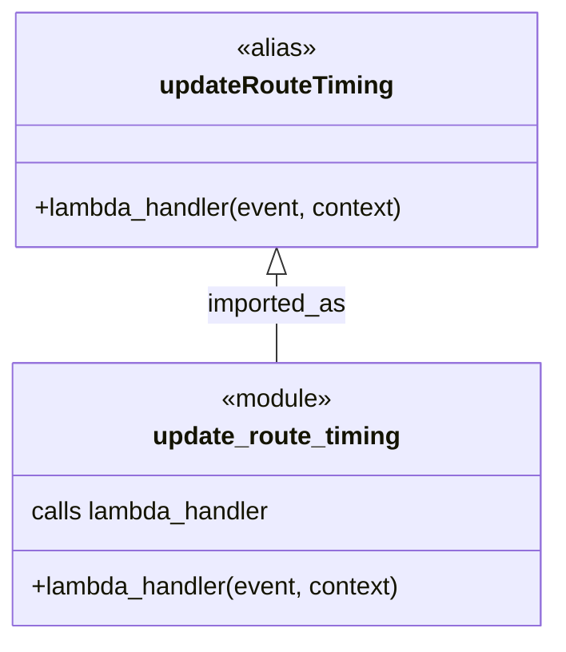
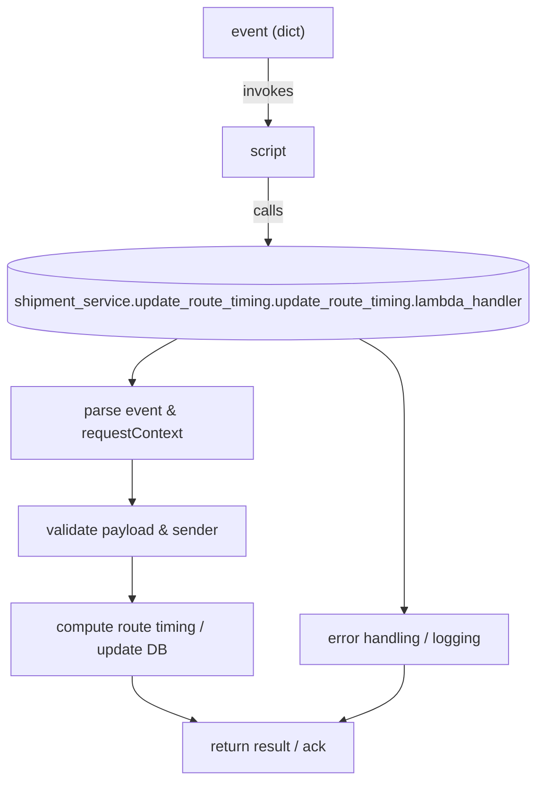

# Diagram: tools/ide_local_testing/localTest/test/shipment/updateRouteTiming.py

> Auto-generated by Obscura crawlers

## Diagram 1

### SVG

<svg id="container" width="356.890625" xmlns="http://www.w3.org/2000/svg" class="classDiagram" height="408" viewBox="0 0 356.890625 408" role="graphics-document document" aria-roledescription="class"><g><defs><marker id="container_class-aggregationStart" class="marker aggregation class" refX="18" refY="7" markerWidth="190" markerHeight="240" orient="auto"><path d="M 18,7 L9,13 L1,7 L9,1 Z"></path></marker></defs><defs><marker id="container_class-aggregationEnd" class="marker aggregation class" refX="1" refY="7" markerWidth="20" markerHeight="28" orient="auto"><path d="M 18,7 L9,13 L1,7 L9,1 Z"></path></marker></defs><defs><marker id="container_class-extensionStart" class="marker extension class" refX="18" refY="7" markerWidth="190" markerHeight="240" orient="auto"><path d="M 1,7 L18,13 V 1 Z"></path></marker></defs><defs><marker id="container_class-extensionEnd" class="marker extension class" refX="1" refY="7" markerWidth="20" markerHeight="28" orient="auto"><path d="M 1,1 V 13 L18,7 Z"></path></marker></defs><defs><marker id="container_class-compositionStart" class="marker composition class" refX="18" refY="7" markerWidth="190" markerHeight="240" orient="auto"><path d="M 18,7 L9,13 L1,7 L9,1 Z"></path></marker></defs><defs><marker id="container_class-compositionEnd" class="marker composition class" refX="1" refY="7" markerWidth="20" markerHeight="28" orient="auto"><path d="M 18,7 L9,13 L1,7 L9,1 Z"></path></marker></defs><defs><marker id="container_class-dependencyStart" class="marker dependency class" refX="6" refY="7" markerWidth="190" markerHeight="240" orient="auto"><path d="M 5,7 L9,13 L1,7 L9,1 Z"></path></marker></defs><defs><marker id="container_class-dependencyEnd" class="marker dependency class" refX="13" refY="7" markerWidth="20" markerHeight="28" orient="auto"><path d="M 18,7 L9,13 L14,7 L9,1 Z"></path></marker></defs><defs><marker id="container_class-lollipopStart" class="marker lollipop class" refX="13" refY="7" markerWidth="190" markerHeight="240" orient="auto"><circle stroke="black" fill="transparent" cx="7" cy="7" r="6"></circle></marker></defs><defs><marker id="container_class-lollipopEnd" class="marker lollipop class" refX="1" refY="7" markerWidth="190" markerHeight="240" orient="auto"><circle stroke="black" fill="transparent" cx="7" cy="7" r="6"></circle></marker></defs><g class="root"><g class="clusters"></g><g class="edgePaths"><path d="M178.445,175.25L178.445,178.542C178.445,181.833,178.445,188.417,178.445,197.875C178.445,207.333,178.445,219.667,178.445,225.833L178.445,232" id="id_updateRouteTiming_update_route_timing_1" class="edge-thickness-normal edge-pattern-solid relation" style=";;;" data-edge="true" data-et="edge" data-id="id_updateRouteTiming_update_route_timing_1" data-points="W3sieCI6MTc4LjQ0NTMxMjUsInkiOjE1OH0seyJ4IjoxNzguNDQ1MzEyNSwieSI6MTk1fSx7IngiOjE3OC40NDUzMTI1LCJ5IjoyMzJ9XQ==" marker-start="url(#container_class-extensionStart)"></path></g><g class="edgeLabels"><g class="edgeLabel" transform="translate(178.4453125, 195)"><g class="label" data-id="id_updateRouteTiming_update_route_timing_1" transform="translate(-45.546875, -12)"><foreignObject width="91.09375" height="24">

imported_as

</foreignObject></g></g></g><g class="nodes"><g class="node default" id="classId-update_route_timing-0" transform="translate(178.4453125, 316)"><g class="basic label-container"><path d="M-170.4453125 -84 L170.4453125 -84 L170.4453125 84 L-170.4453125 84" stroke="none" stroke-width="0" fill="#ECECFF" style=""></path><path d="M-170.4453125 -84 C-48.37861436410385 -84, 73.6880837717923 -84, 170.4453125 -84 M-170.4453125 -84 C-97.1834298775579 -84, -23.921547255115797 -84, 170.4453125 -84 M170.4453125 -84 C170.4453125 -32.89114979741139, 170.4453125 18.217700405177226, 170.4453125 84 M170.4453125 -84 C170.4453125 -18.86115196371682, 170.4453125 46.27769607256636, 170.4453125 84 M170.4453125 84 C86.53065144782622 84, 2.6159903956524317 84, -170.4453125 84 M170.4453125 84 C49.61827338760416 84, -71.20876572479168 84, -170.4453125 84 M-170.4453125 84 C-170.4453125 26.43249975958299, -170.4453125 -31.135000480834023, -170.4453125 -84 M-170.4453125 84 C-170.4453125 41.9371123915185, -170.4453125 -0.12577521696300664, -170.4453125 -84" stroke="#9370DB" stroke-width="1.3" fill="none" stroke-dasharray="0 0" style=""></path></g><g class="annotation-group text" transform="translate(-36.6015625, -60)"><g class="label" style="" transform="translate(0,-12)"><foreignObject width="73.203125" height="24">

«module»

</foreignObject></g></g><g class="label-group text" transform="translate(-76.703125, -36)"><g class="label" style="font-weight: bolder" transform="translate(0,-12)"><foreignObject width="153.40625" height="24">

update_route_timing

</foreignObject></g></g><g class="members-group text" transform="translate(-158.4453125, 12)"><g class="label" style="" transform="translate(0,-12)"><foreignObject width="156.78125" height="24">

calls lambda_handler

</foreignObject></g></g><g class="methods-group text" transform="translate(-158.4453125, 60)"><g class="label" style="" transform="translate(0,-12)"><foreignObject width="240.1875" height="24">

+lambda_handler(event, context)

</foreignObject></g></g><g class="divider" style=""><path d="M-170.4453125 -12 C-56.18481864698232 -12, 58.075675206035356 -12, 170.4453125 -12 M-170.4453125 -12 C-73.95994155167847 -12, 22.525429396643062 -12, 170.4453125 -12" stroke="#9370DB" stroke-width="1.3" fill="none" stroke-dasharray="0 0" style=""></path></g><g class="divider" style=""><path d="M-170.4453125 36 C-74.28999069568677 36, 21.865331108626464 36, 170.4453125 36 M-170.4453125 36 C-78.96056502327093 36, 12.524182453458138 36, 170.4453125 36" stroke="#9370DB" stroke-width="1.3" fill="none" stroke-dasharray="0 0" style=""></path></g></g><g class="node default" id="classId-updateRouteTiming-1" transform="translate(178.4453125, 83)"><g class="basic label-container"><path d="M-168.0625 -75 L168.0625 -75 L168.0625 75 L-168.0625 75" stroke="none" stroke-width="0" fill="#ECECFF" style=""></path><path d="M-168.0625 -75 C-35.89206527848731 -75, 96.27836944302538 -75, 168.0625 -75 M-168.0625 -75 C-69.60254805042727 -75, 28.857403899145453 -75, 168.0625 -75 M168.0625 -75 C168.0625 -41.65985753772907, 168.0625 -8.319715075458134, 168.0625 75 M168.0625 -75 C168.0625 -19.351350521825765, 168.0625 36.29729895634847, 168.0625 75 M168.0625 75 C34.01097682187566 75, -100.04054635624868 75, -168.0625 75 M168.0625 75 C46.19288753191944 75, -75.67672493616112 75, -168.0625 75 M-168.0625 75 C-168.0625 21.909634928639534, -168.0625 -31.180730142720932, -168.0625 -75 M-168.0625 75 C-168.0625 28.075587464281142, -168.0625 -18.848825071437716, -168.0625 -75" stroke="#9370DB" stroke-width="1.3" fill="none" stroke-dasharray="0 0" style=""></path></g><g class="annotation-group text" transform="translate(-25.890625, -51)"><g class="label" style="" transform="translate(0,-12)"><foreignObject width="51.78125" height="24">

«alias»

</foreignObject></g></g><g class="label-group text" transform="translate(-71.9375, -27)"><g class="label" style="font-weight: bolder" transform="translate(0,-12)"><foreignObject width="143.875" height="24">

updateRouteTiming

</foreignObject></g></g><g class="members-group text" transform="translate(-156.0625, 21)"></g><g class="methods-group text" transform="translate(-156.0625, 51)"><g class="label" style="" transform="translate(0,-12)"><foreignObject width="240.1875" height="24">

+lambda_handler(event, context)

</foreignObject></g></g><g class="divider" style=""><path d="M-168.0625 -3 C-65.48231270737273 -3, 37.097874585254544 -3, 168.0625 -3 M-168.0625 -3 C-35.69935391370376 -3, 96.66379217259248 -3, 168.0625 -3" stroke="#9370DB" stroke-width="1.3" fill="none" stroke-dasharray="0 0" style=""></path></g><g class="divider" style=""><path d="M-168.0625 21 C-90.94333329310739 21, -13.824166586214773 21, 168.0625 21 M-168.0625 21 C-84.15992937138446 21, -0.257358742768929 21, 168.0625 21" stroke="#9370DB" stroke-width="1.3" fill="none" stroke-dasharray="0 0" style=""></path></g></g></g></g></g></svg>

## Diagram 2

### SVG

<svg id="container" width="592.9375" xmlns="http://www.w3.org/2000/svg" class="flowchart" height="836.6441040039062" viewBox="0 0 592.9375 836.6441040039062" role="graphics-document document" aria-roledescription="flowchart-v2"><g><marker id="container_flowchart-v2-pointEnd" class="marker flowchart-v2" viewBox="0 0 10 10" refX="5" refY="5" markerUnits="userSpaceOnUse" markerWidth="8" markerHeight="8" orient="auto"><path d="M 0 0 L 10 5 L 0 10 z" class="arrowMarkerPath" style="stroke-width: 1; stroke-dasharray: 1, 0;"></path></marker><marker id="container_flowchart-v2-pointStart" class="marker flowchart-v2" viewBox="0 0 10 10" refX="4.5" refY="5" markerUnits="userSpaceOnUse" markerWidth="8" markerHeight="8" orient="auto"><path d="M 0 5 L 10 10 L 10 0 z" class="arrowMarkerPath" style="stroke-width: 1; stroke-dasharray: 1, 0;"></path></marker><marker id="container_flowchart-v2-circleEnd" class="marker flowchart-v2" viewBox="0 0 10 10" refX="11" refY="5" markerUnits="userSpaceOnUse" markerWidth="11" markerHeight="11" orient="auto"><circle cx="5" cy="5" r="5" class="arrowMarkerPath" style="stroke-width: 1; stroke-dasharray: 1, 0;"></circle></marker><marker id="container_flowchart-v2-circleStart" class="marker flowchart-v2" viewBox="0 0 10 10" refX="-1" refY="5" markerUnits="userSpaceOnUse" markerWidth="11" markerHeight="11" orient="auto"><circle cx="5" cy="5" r="5" class="arrowMarkerPath" style="stroke-width: 1; stroke-dasharray: 1, 0;"></circle></marker><marker id="container_flowchart-v2-crossEnd" class="marker cross flowchart-v2" viewBox="0 0 11 11" refX="12" refY="5.2" markerUnits="userSpaceOnUse" markerWidth="11" markerHeight="11" orient="auto"><path d="M 1,1 l 9,9 M 10,1 l -9,9" class="arrowMarkerPath" style="stroke-width: 2; stroke-dasharray: 1, 0;"></path></marker><marker id="container_flowchart-v2-crossStart" class="marker cross flowchart-v2" viewBox="0 0 11 11" refX="-1" refY="5.2" markerUnits="userSpaceOnUse" markerWidth="11" markerHeight="11" orient="auto"><path d="M 1,1 l 9,9 M 10,1 l -9,9" class="arrowMarkerPath" style="stroke-width: 2; stroke-dasharray: 1, 0;"></path></marker><g class="root"><g class="clusters"></g><g class="edgePaths"><path d="M296.469,62L296.469,68.167C296.469,74.333,296.469,86.667,296.469,98.333C296.469,110,296.469,121,296.469,126.5L296.469,132" id="L_Event_Caller_0" class="edge-thickness-normal edge-pattern-solid edge-thickness-normal edge-pattern-solid flowchart-link" style=";" data-edge="true" data-et="edge" data-id="L_Event_Caller_0" data-points="W3sieCI6Mjk2LjQ2ODc1LCJ5Ijo2Mn0seyJ4IjoyOTYuNDY4NzUsInkiOjk5fSx7IngiOjI5Ni40Njg3NSwieSI6MTM2fV0=" marker-end="url(#container_flowchart-v2-pointEnd)"></path><path d="M296.469,190L296.469,196.167C296.469,202.333,296.469,214.667,296.469,226.333C296.469,238,296.469,249,296.469,254.5L296.469,260" id="L_Caller_Lambda_0" class="edge-thickness-normal edge-pattern-solid edge-thickness-normal edge-pattern-solid flowchart-link" style=";" data-edge="true" data-et="edge" data-id="L_Caller_Lambda_0" data-points="W3sieCI6Mjk2LjQ2ODc1LCJ5IjoxOTB9LHsieCI6Mjk2LjQ2ODc1LCJ5IjoyMjd9LHsieCI6Mjk2LjQ2ODc1LCJ5IjoyNjR9XQ==" marker-end="url(#container_flowchart-v2-pointEnd)"></path><path d="M197.278,363.391L189.065,367.767C180.852,372.142,164.426,380.893,156.213,388.769C148,396.644,148,403.644,148,407.144L148,410.644" id="L_Lambda_Parse_0" class="edge-thickness-normal edge-pattern-solid edge-thickness-normal edge-pattern-solid flowchart-link" style=";" data-edge="true" data-et="edge" data-id="L_Lambda_Parse_0" data-points="W3sieCI6MTk3LjI3Nzk3NzM3MDMyNzQsInkiOjM2My4zOTExNzM1ODQzMDA5M30seyJ4IjoxNDgsInkiOjM4OS42NDQxMTkyNjI2OTUzfSx7IngiOjE0OCwieSI6NDE0LjY0NDExOTI2MjY5NTN9XQ==" marker-end="url(#container_flowchart-v2-pointEnd)"></path><path d="M148,492.644L148,496.811C148,500.977,148,509.311,148,516.977C148,524.644,148,531.644,148,535.144L148,538.644" id="L_Parse_Validate_0" class="edge-thickness-normal edge-pattern-solid edge-thickness-normal edge-pattern-solid flowchart-link" style=";" data-edge="true" data-et="edge" data-id="L_Parse_Validate_0" data-points="W3sieCI6MTQ4LCJ5Ijo0OTIuNjQ0MTE5MjYyNjk1M30seyJ4IjoxNDgsInkiOjUxNy42NDQxMTkyNjI2OTUzfSx7IngiOjE0OCwieSI6NTQyLjY0NDExOTI2MjY5NTN9XQ==" marker-end="url(#container_flowchart-v2-pointEnd)"></path><path d="M148,596.644L148,600.811C148,604.977,148,613.311,148,620.977C148,628.644,148,635.644,148,639.144L148,642.644" id="L_Validate_Update_0" class="edge-thickness-normal edge-pattern-solid edge-thickness-normal edge-pattern-solid flowchart-link" style=";" data-edge="true" data-et="edge" data-id="L_Validate_Update_0" data-points="W3sieCI6MTQ4LCJ5Ijo1OTYuNjQ0MTE5MjYyNjk1M30seyJ4IjoxNDgsInkiOjYyMS42NDQxMTkyNjI2OTUzfSx7IngiOjE0OCwieSI6NjQ2LjY0NDExOTI2MjY5NTN9XQ==" marker-end="url(#container_flowchart-v2-pointEnd)"></path><path d="M148,724.644L148,728.811C148,732.977,148,741.311,159.267,749.424C170.535,757.537,193.069,765.429,204.337,769.376L215.604,773.322" id="L_Update_Respond_0" class="edge-thickness-normal edge-pattern-solid edge-thickness-normal edge-pattern-solid flowchart-link" style=";" data-edge="true" data-et="edge" data-id="L_Update_Respond_0" data-points="W3sieCI6MTQ4LCJ5Ijo3MjQuNjQ0MTE5MjYyNjk1M30seyJ4IjoxNDgsInkiOjc0OS42NDQxMTkyNjI2OTUzfSx7IngiOjIxOS4zNzkyMDY3MzA3NjkyMywieSI6Nzc0LjY0NDExOTI2MjY5NTN9XQ==" marker-end="url(#container_flowchart-v2-pointEnd)"></path><path d="M395.66,363.391L403.873,367.767C412.086,372.142,428.512,380.893,436.725,395.935C444.938,410.977,444.938,432.311,444.938,453.644C444.938,474.977,444.938,496.311,444.938,515.644C444.938,534.977,444.938,552.311,444.938,569.644C444.938,586.977,444.938,604.311,444.938,618.477C444.938,632.644,444.938,643.644,444.938,649.144L444.938,654.644" id="L_Lambda_Error_0" class="edge-thickness-normal edge-pattern-solid edge-thickness-normal edge-pattern-solid flowchart-link" style=";" data-edge="true" data-et="edge" data-id="L_Lambda_Error_0" data-points="W3sieCI6Mzk1LjY1OTUyMjYyOTY3MjYsInkiOjM2My4zOTExNzM1ODQzMDA5M30seyJ4Ijo0NDQuOTM3NSwieSI6Mzg5LjY0NDExOTI2MjY5NTN9LHsieCI6NDQ0LjkzNzUsInkiOjQ1My42NDQxMTkyNjI2OTUzfSx7IngiOjQ0NC45Mzc1LCJ5Ijo1MTcuNjQ0MTE5MjYyNjk1M30seyJ4Ijo0NDQuOTM3NSwieSI6NTY5LjY0NDExOTI2MjY5NTN9LHsieCI6NDQ0LjkzNzUsInkiOjYyMS42NDQxMTkyNjI2OTUzfSx7IngiOjQ0NC45Mzc1LCJ5Ijo2NTguNjQ0MTE5MjYyNjk1M31d" marker-end="url(#container_flowchart-v2-pointEnd)"></path><path d="M444.938,712.644L444.938,718.811C444.938,724.977,444.938,737.311,433.67,747.424C422.403,757.537,399.868,765.429,388.601,769.376L377.333,773.322" id="L_Error_Respond_0" class="edge-thickness-normal edge-pattern-solid edge-thickness-normal edge-pattern-solid flowchart-link" style=";" data-edge="true" data-et="edge" data-id="L_Error_Respond_0" data-points="W3sieCI6NDQ0LjkzNzUsInkiOjcxMi42NDQxMTkyNjI2OTUzfSx7IngiOjQ0NC45Mzc1LCJ5Ijo3NDkuNjQ0MTE5MjYyNjk1M30seyJ4IjozNzMuNTU4MjkzMjY5MjMwOCwieSI6Nzc0LjY0NDExOTI2MjY5NTN9XQ==" marker-end="url(#container_flowchart-v2-pointEnd)"></path></g><g class="edgeLabels"><g class="edgeLabel" transform="translate(296.46875, 99)"><g class="label" data-id="L_Event_Caller_0" transform="translate(-27.5859375, -12)"><foreignObject width="55.171875" height="24">

invokes

</foreignObject></g></g><g class="edgeLabel" transform="translate(296.46875, 227)"><g class="label" data-id="L_Caller_Lambda_0" transform="translate(-16.4453125, -12)"><foreignObject width="32.890625" height="24">

calls

</foreignObject></g></g><g class="edgeLabel"><g class="label" data-id="L_Lambda_Parse_0" transform="translate(0, 0)"><foreignObject width="0" height="0">

</foreignObject></g></g><g class="edgeLabel"><g class="label" data-id="L_Parse_Validate_0" transform="translate(0, 0)"><foreignObject width="0" height="0">

</foreignObject></g></g><g class="edgeLabel"><g class="label" data-id="L_Validate_Update_0" transform="translate(0, 0)"><foreignObject width="0" height="0">

</foreignObject></g></g><g class="edgeLabel"><g class="label" data-id="L_Update_Respond_0" transform="translate(0, 0)"><foreignObject width="0" height="0">

</foreignObject></g></g><g class="edgeLabel"><g class="label" data-id="L_Lambda_Error_0" transform="translate(0, 0)"><foreignObject width="0" height="0">

</foreignObject></g></g><g class="edgeLabel"><g class="label" data-id="L_Error_Respond_0" transform="translate(0, 0)"><foreignObject width="0" height="0">

</foreignObject></g></g></g><g class="nodes"><g class="node default" id="flowchart-Event-0" transform="translate(296.46875, 35)"><rect class="basic label-container" style="" x="-71.2265625" y="-27" width="142.453125" height="54"></rect><g class="label" style="" transform="translate(-41.2265625, -12)"><rect></rect><foreignObject width="82.453125" height="24">

event (dict)

</foreignObject></g></g><g class="node default" id="flowchart-Caller-1" transform="translate(296.46875, 163)"><rect class="basic label-container" style="" x="-50.546875" y="-27" width="101.09375" height="54"></rect><g class="label" style="" transform="translate(-20.546875, -12)"><rect></rect><foreignObject width="41.09375" height="24">

script

</foreignObject></g></g><g class="node default" id="flowchart-Lambda-3" transform="translate(296.46875, 314.32205963134766)"><path d="M0,20.54803668417772 a288.46875,20.54803668417772 0,0,0 576.9375,0 a288.46875,20.54803668417772 0,0,0 -576.9375,0 l0,59.54803668417772 a288.46875,20.54803668417772 0,0,0 576.9375,0 l0,-59.54803668417772" class="basic label-container" style="" transform="translate(-288.46875, -50.32205502626658)"></path><g class="label" style="" transform="translate(-280.96875, -2)"><rect></rect><foreignObject width="561.9375" height="24">

shipment_service.update_route_timing.update_route_timing.lambda_handler

</foreignObject></g></g><g class="node default" id="flowchart-Parse-5" transform="translate(148, 453.6441192626953)"><rect class="basic label-container" style="" x="-130" y="-39" width="260" height="78"></rect><g class="label" style="" transform="translate(-100, -24)"><rect></rect><foreignObject width="200" height="48">

parse event &amp; requestContext

</foreignObject></g></g><g class="node default" id="flowchart-Validate-7" transform="translate(148, 569.6441192626953)"><rect class="basic label-container" style="" x="-125.03125" y="-27" width="250.0625" height="54"></rect><g class="label" style="" transform="translate(-95.03125, -12)"><rect></rect><foreignObject width="190.0625" height="24">

validate payload &amp; sender

</foreignObject></g></g><g class="node default" id="flowchart-Update-9" transform="translate(148, 685.6441192626953)"><rect class="basic label-container" style="" x="-130" y="-39" width="260" height="78"></rect><g class="label" style="" transform="translate(-100, -24)"><rect></rect><foreignObject width="200" height="48">

compute route timing / update DB

</foreignObject></g></g><g class="node default" id="flowchart-Respond-11" transform="translate(296.46875, 801.6441192626953)"><rect class="basic label-container" style="" x="-96.15625" y="-27" width="192.3125" height="54"></rect><g class="label" style="" transform="translate(-66.15625, -12)"><rect></rect><foreignObject width="132.3125" height="24">

return result / ack

</foreignObject></g></g><g class="node default" id="flowchart-Error-13" transform="translate(444.9375, 685.6441192626953)"><rect class="basic label-container" style="" x="-116.9375" y="-27" width="233.875" height="54"></rect><g class="label" style="" transform="translate(-86.9375, -12)"><rect></rect><foreignObject width="173.875" height="24">

error handling / logging

</foreignObject></g></g></g></g></g></svg>
