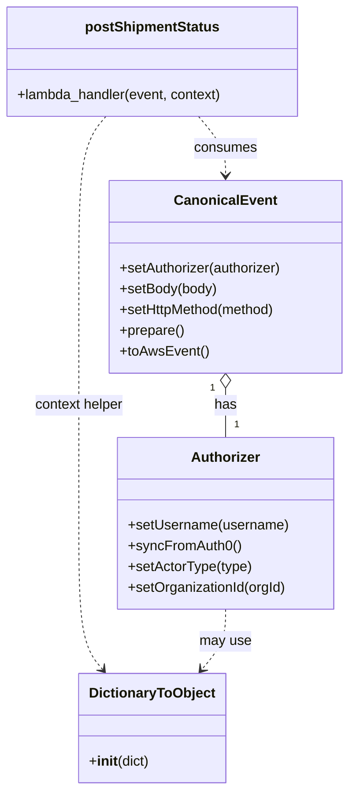

# Diagram: tools/ide_local_testing/localTest/test/shipment/v2PostShipmentStatusViaLambda.py


> Auto-generated by Obscura crawlers

## Diagram 1

```mermaid
flowchart TD
    subgraph Imports
        A1[shipment_service.v2.post_shipment_status.lambda_handler\n(postShipmentStatus)]
        A2[localTest.core.CanonicalEvent\n(CanonicalEvent)]
        A3[localTest.core.Authorizer\n(Authorizer)]
        A4[localTest.core.DictionaryToObject\n(DictionaryToObject)]
    end
    EventPayload[[Incoming HTTP Event JSON]]
    EventPayload -->|body,path,headers| A2_prepare[(CanonicalEvent.prepare())]
    A3 -->|setUsername / syncFromAuth0 / setActorType| AuthConfigured[(Authorizer instance)]
    A2_prepare -->|setAuthorizer( AuthConfigured )| A2_setAuth[(CanonicalEvent)]
    A2_setAuth -->|setBody / setHttpMethod / prepare / toAwsEvent| AwsEvent[(prepared AWS event)]
    AwsEvent -->|event["body"]=body| AwsEventFinal[(final AWS event)]
    AwsEventFinal -->|invoke| A1
```

> SVG rendering failed for this diagram.

## Diagram 2



### SVG

<svg id="container" width="405.931640625" xmlns="http://www.w3.org/2000/svg" class="classDiagram" height="910" viewBox="0 0 405.931640625 910" role="graphics-document document" aria-roledescription="class"><style>#container{font-family:"trebuchet ms",verdana,arial,sans-serif;font-size:16px;fill:#333;}@keyframes edge-animation-frame{from{stroke-dashoffset:0;}}@keyframes dash{to{stroke-dashoffset:0;}}#container .edge-animation-slow{stroke-dasharray:9,5!important;stroke-dashoffset:900;animation:dash 50s linear infinite;stroke-linecap:round;}#container .edge-animation-fast{stroke-dasharray:9,5!important;stroke-dashoffset:900;animation:dash 20s linear infinite;stroke-linecap:round;}#container .error-icon{fill:#552222;}#container .error-text{fill:#552222;stroke:#552222;}#container .edge-thickness-normal{stroke-width:1px;}#container .edge-thickness-thick{stroke-width:3.5px;}#container .edge-pattern-solid{stroke-dasharray:0;}#container .edge-thickness-invisible{stroke-width:0;fill:none;}#container .edge-pattern-dashed{stroke-dasharray:3;}#container .edge-pattern-dotted{stroke-dasharray:2;}#container .marker{fill:#333333;stroke:#333333;}#container .marker.cross{stroke:#333333;}#container svg{font-family:"trebuchet ms",verdana,arial,sans-serif;font-size:16px;}#container p{margin:0;}#container g.classGroup text{fill:#9370DB;stroke:none;font-family:"trebuchet ms",verdana,arial,sans-serif;font-size:10px;}#container g.classGroup text .title{font-weight:bolder;}#container .nodeLabel,#container .edgeLabel{color:#131300;}#container .edgeLabel .label rect{fill:#ECECFF;}#container .label text{fill:#131300;}#container .labelBkg{background:#ECECFF;}#container .edgeLabel .label span{background:#ECECFF;}#container .classTitle{font-weight:bolder;}#container .node rect,#container .node circle,#container .node ellipse,#container .node polygon,#container .node path{fill:#ECECFF;stroke:#9370DB;stroke-width:1px;}#container .divider{stroke:#9370DB;stroke-width:1;}#container g.clickable{cursor:pointer;}#container g.classGroup rect{fill:#ECECFF;stroke:#9370DB;}#container g.classGroup line{stroke:#9370DB;stroke-width:1;}#container .classLabel .box{stroke:none;stroke-width:0;fill:#ECECFF;opacity:0.5;}#container .classLabel .label{fill:#9370DB;font-size:10px;}#container .relation{stroke:#333333;stroke-width:1;fill:none;}#container .dashed-line{stroke-dasharray:3;}#container .dotted-line{stroke-dasharray:1 2;}#container #compositionStart,#container .composition{fill:#333333!important;stroke:#333333!important;stroke-width:1;}#container #compositionEnd,#container .composition{fill:#333333!important;stroke:#333333!important;stroke-width:1;}#container #dependencyStart,#container .dependency{fill:#333333!important;stroke:#333333!important;stroke-width:1;}#container #dependencyStart,#container .dependency{fill:#333333!important;stroke:#333333!important;stroke-width:1;}#container #extensionStart,#container .extension{fill:transparent!important;stroke:#333333!important;stroke-width:1;}#container #extensionEnd,#container .extension{fill:transparent!important;stroke:#333333!important;stroke-width:1;}#container #aggregationStart,#container .aggregation{fill:transparent!important;stroke:#333333!important;stroke-width:1;}#container #aggregationEnd,#container .aggregation{fill:transparent!important;stroke:#333333!important;stroke-width:1;}#container #lollipopStart,#container .lollipop{fill:#ECECFF!important;stroke:#333333!important;stroke-width:1;}#container #lollipopEnd,#container .lollipop{fill:#ECECFF!important;stroke:#333333!important;stroke-width:1;}#container .edgeTerminals{font-size:11px;line-height:initial;}#container .classTitleText{text-anchor:middle;font-size:18px;fill:#333;}#container .label-icon{display:inline-block;height:1em;overflow:visible;vertical-align:-0.125em;}#container .node .label-icon path{fill:currentColor;stroke:revert;stroke-width:revert;}#container :root{--mermaid-font-family:"trebuchet ms",verdana,arial,sans-serif;}</style><g><defs><marker id="container_class-aggregationStart" class="marker aggregation class" refX="18" refY="7" markerWidth="190" markerHeight="240" orient="auto"><path d="M 18,7 L9,13 L1,7 L9,1 Z"></path></marker></defs><defs><marker id="container_class-aggregationEnd" class="marker aggregation class" refX="1" refY="7" markerWidth="20" markerHeight="28" orient="auto"><path d="M 18,7 L9,13 L1,7 L9,1 Z"></path></marker></defs><defs><marker id="container_class-extensionStart" class="marker extension class" refX="18" refY="7" markerWidth="190" markerHeight="240" orient="auto"><path d="M 1,7 L18,13 V 1 Z"></path></marker></defs><defs><marker id="container_class-extensionEnd" class="marker extension class" refX="1" refY="7" markerWidth="20" markerHeight="28" orient="auto"><path d="M 1,1 V 13 L18,7 Z"></path></marker></defs><defs><marker id="container_class-compositionStart" class="marker composition class" refX="18" refY="7" markerWidth="190" markerHeight="240" orient="auto"><path d="M 18,7 L9,13 L1,7 L9,1 Z"></path></marker></defs><defs><marker id="container_class-compositionEnd" class="marker composition class" refX="1" refY="7" markerWidth="20" markerHeight="28" orient="auto"><path d="M 18,7 L9,13 L1,7 L9,1 Z"></path></marker></defs><defs><marker id="container_class-dependencyStart" class="marker dependency class" refX="6" refY="7" markerWidth="190" markerHeight="240" orient="auto"><path d="M 5,7 L9,13 L1,7 L9,1 Z"></path></marker></defs><defs><marker id="container_class-dependencyEnd" class="marker dependency class" refX="13" refY="7" markerWidth="20" markerHeight="28" orient="auto"><path d="M 18,7 L9,13 L14,7 L9,1 Z"></path></marker></defs><defs><marker id="container_class-lollipopStart" class="marker lollipop class" refX="13" refY="7" markerWidth="190" markerHeight="240" orient="auto"><circle stroke="black" fill="transparent" cx="7" cy="7" r="6"></circle></marker></defs><defs><marker id="container_class-lollipopEnd" class="marker lollipop class" refX="1" refY="7" markerWidth="190" markerHeight="240" orient="auto"><circle stroke="black" fill="transparent" cx="7" cy="7" r="6"></circle></marker></defs><g class="root"><g class="clusters"></g><g class="edgePaths"><path d="M262.701,447.25L262.701,450.542C262.701,453.833,262.701,460.417,262.701,469.875C262.701,479.333,262.701,491.667,262.701,497.833L262.701,504" id="id_CanonicalEvent_Authorizer_1" class="edge-thickness-normal edge-pattern-solid relation" style=";;;" data-edge="true" data-et="edge" data-id="id_CanonicalEvent_Authorizer_1" data-points="W3sieCI6MjYyLjcwMTE3MTg3NSwieSI6NDMwfSx7IngiOjI2Mi43MDExNzE4NzUsInkiOjQ2N30seyJ4IjoyNjIuNzAxMTcxODc1LCJ5Ijo1MDR9XQ==" marker-start="url(#container_class-aggregationStart)"></path><path d="M231.209,134L236.457,140.167C241.706,146.333,252.204,158.667,257.452,170C262.701,181.333,262.701,191.667,262.701,196.833L262.701,202" id="id_postShipmentStatus_CanonicalEvent_2" class="edge-thickness-normal edge-pattern-dashed relation" style=";;;" data-edge="true" data-et="edge" data-id="id_postShipmentStatus_CanonicalEvent_2" data-points="W3sieCI6MjMxLjIwODUzNTE1NjI1LCJ5IjoxMzR9LHsieCI6MjYyLjcwMTE3MTg3NSwieSI6MTcxfSx7IngiOjI2Mi43MDExNzE4NzUsInkiOjIwOH1d" marker-end="url(#container_class-dependencyEnd)"></path><path d="M123.963,134L118.715,140.167C113.466,146.333,102.968,158.667,97.719,189.5C92.471,220.333,92.471,269.667,92.471,319C92.471,368.333,92.471,417.667,92.471,465C92.471,512.333,92.471,557.667,92.471,603C92.471,648.333,92.471,693.667,97.071,721.738C101.672,749.81,110.873,760.621,115.474,766.026L120.074,771.431" id="id_postShipmentStatus_DictionaryToObject_3" class="edge-thickness-normal edge-pattern-dashed relation" style=";;;" data-edge="true" data-et="edge" data-id="id_postShipmentStatus_DictionaryToObject_3" data-points="W3sieCI6MTIzLjk2MzMzOTg0Mzc0OTk5LCJ5IjoxMzR9LHsieCI6OTIuNDcwNzAzMTI1LCJ5IjoxNzF9LHsieCI6OTIuNDcwNzAzMTI1LCJ5IjozMTl9LHsieCI6OTIuNDcwNzAzMTI1LCJ5Ijo0Njd9LHsieCI6OTIuNDcwNzAzMTI1LCJ5Ijo2MDN9LHsieCI6OTIuNDcwNzAzMTI1LCJ5Ijo3Mzl9LHsieCI6MTIzLjk2MzMzOTg0Mzc0OTk5LCJ5Ijo3NzZ9XQ==" marker-end="url(#container_class-dependencyEnd)"></path><path d="M262.701,702L262.701,708.167C262.701,714.333,262.701,726.667,258.101,738.238C253.5,749.81,244.299,760.621,239.698,766.026L235.097,771.431" id="id_Authorizer_DictionaryToObject_4" class="edge-thickness-normal edge-pattern-dashed relation" style=";;;" data-edge="true" data-et="edge" data-id="id_Authorizer_DictionaryToObject_4" data-points="W3sieCI6MjYyLjcwMTE3MTg3NSwieSI6NzAyfSx7IngiOjI2Mi43MDExNzE4NzUsInkiOjczOX0seyJ4IjoyMzEuMjA4NTM1MTU2MjUsInkiOjc3Nn1d" marker-end="url(#container_class-dependencyEnd)"></path></g><g class="edgeLabels"><g class="edgeLabel" transform="translate(262.701171875, 467)"><g class="label" data-id="id_CanonicalEvent_Authorizer_1" transform="translate(-12.703125, -12)"><foreignObject width="25.40625" height="24"><div xmlns="http://www.w3.org/1999/xhtml" class="labelBkg" style="display: table-cell; white-space: nowrap; line-height: 1.5; max-width: 200px; text-align: center;"><span class="edgeLabel"><p>has</p></span></div></foreignObject></g></g><g class="edgeLabel" transform="translate(262.701171875, 171)"><g class="label" data-id="id_postShipmentStatus_CanonicalEvent_2" transform="translate(-36.375, -12)"><foreignObject width="72.75" height="24"><div xmlns="http://www.w3.org/1999/xhtml" class="labelBkg" style="display: table-cell; white-space: nowrap; line-height: 1.5; max-width: 200px; text-align: center;"><span class="edgeLabel"><p>consumes</p></span></div></foreignObject></g></g><g class="edgeLabel" transform="translate(92.470703125, 467)"><g class="label" data-id="id_postShipmentStatus_DictionaryToObject_3" transform="translate(-52.5625, -12)"><foreignObject width="105.125" height="24"><div xmlns="http://www.w3.org/1999/xhtml" class="labelBkg" style="display: table-cell; white-space: nowrap; line-height: 1.5; max-width: 200px; text-align: center;"><span class="edgeLabel"><p>context helper</p></span></div></foreignObject></g></g><g class="edgeLabel" transform="translate(262.701171875, 739)"><g class="label" data-id="id_Authorizer_DictionaryToObject_4" transform="translate(-29.8984375, -12)"><foreignObject width="59.796875" height="24"><div xmlns="http://www.w3.org/1999/xhtml" class="labelBkg" style="display: table-cell; white-space: nowrap; line-height: 1.5; max-width: 200px; text-align: center;"><span class="edgeLabel"><p>may use</p></span></div></foreignObject></g></g><g class="edgeTerminals" transform="translate(247.70117093750005, 447.4999991964286)"><g class="inner" transform="translate(0, 0)"><foreignObject style="width: 9px; height: 12px;"><div xmlns="http://www.w3.org/1999/xhtml" style="display: inline-block; padding-right: 1px; white-space: nowrap;"><span class="edgeLabel">1</span></div></foreignObject></g></g><g class="edgeTerminals" transform="translate(272.7011709375, 481.4999991964286)"><g class="inner" transform="translate(0, 0)"></g><foreignObject style="width: 9px; height: 12px;"><div xmlns="http://www.w3.org/1999/xhtml" style="display: inline-block; padding-right: 1px; white-space: nowrap;"><span class="edgeLabel">1</span></div></foreignObject></g></g><g class="nodes"><g class="node default" id="classId-CanonicalEvent-0" transform="translate(262.701171875, 319)"><g class="basic label-container"><path d="M-135.23046875 -111 L135.23046875 -111 L135.23046875 111 L-135.23046875 111" stroke="none" stroke-width="0" fill="#ECECFF" style=""></path><path d="M-135.23046875 -111 C-56.89825455168693 -111, 21.433959646626136 -111, 135.23046875 -111 M-135.23046875 -111 C-58.895243595041634 -111, 17.43998155991673 -111, 135.23046875 -111 M135.23046875 -111 C135.23046875 -65.10943389618114, 135.23046875 -19.218867792362303, 135.23046875 111 M135.23046875 -111 C135.23046875 -62.97825674292848, 135.23046875 -14.95651348585696, 135.23046875 111 M135.23046875 111 C70.05438448385051 111, 4.878300217701025 111, -135.23046875 111 M135.23046875 111 C30.1070193960863 111, -75.0164299578274 111, -135.23046875 111 M-135.23046875 111 C-135.23046875 44.6062211118705, -135.23046875 -21.787557776259007, -135.23046875 -111 M-135.23046875 111 C-135.23046875 33.97473584756813, -135.23046875 -43.05052830486375, -135.23046875 -111" stroke="#9370DB" stroke-width="1.3" fill="none" stroke-dasharray="0 0" style=""></path></g><g class="annotation-group text" transform="translate(0, -87)"></g><g class="label-group text" transform="translate(-55.7109375, -87)"><g class="label" style="font-weight: bolder" transform="translate(0,-12)"><foreignObject width="111.421875" height="24"><div xmlns="http://www.w3.org/1999/xhtml" style="display: table-cell; white-space: nowrap; line-height: 1.5; max-width: 161px; text-align: center;"><span class="nodeLabel markdown-node-label" style=""><p>CanonicalEvent</p></span></div></foreignObject></g></g><g class="members-group text" transform="translate(-123.23046875, -39)"></g><g class="methods-group text" transform="translate(-123.23046875, -9)"><g class="label" style="" transform="translate(0,-12)"><foreignObject width="190.75" height="24"><div xmlns="http://www.w3.org/1999/xhtml" style="display: table-cell; white-space: nowrap; line-height: 1.5; max-width: 248px; text-align: center;"><span class="nodeLabel markdown-node-label" style=""><p>+setAuthorizer(authorizer)</p></span></div></foreignObject></g><g class="label" style="" transform="translate(0,12)"><foreignObject width="113.125" height="24"><div xmlns="http://www.w3.org/1999/xhtml" style="display: table-cell; white-space: nowrap; line-height: 1.5; max-width: 170px; text-align: center;"><span class="nodeLabel markdown-node-label" style=""><p>+setBody(body)</p></span></div></foreignObject></g><g class="label" style="" transform="translate(0,36)"><foreignObject width="184" height="24"><div xmlns="http://www.w3.org/1999/xhtml" style="display: table-cell; white-space: nowrap; line-height: 1.5; max-width: 241px; text-align: center;"><span class="nodeLabel markdown-node-label" style=""><p>+setHttpMethod(method)</p></span></div></foreignObject></g><g class="label" style="" transform="translate(0,60)"><foreignObject width="74.75" height="24"><div xmlns="http://www.w3.org/1999/xhtml" style="display: table-cell; white-space: nowrap; line-height: 1.5; max-width: 132px; text-align: center;"><span class="nodeLabel markdown-node-label" style=""><p>+prepare()</p></span></div></foreignObject></g><g class="label" style="" transform="translate(0,84)"><foreignObject width="101.1875" height="24"><div xmlns="http://www.w3.org/1999/xhtml" style="display: table-cell; white-space: nowrap; line-height: 1.5; max-width: 159px; text-align: center;"><span class="nodeLabel markdown-node-label" style=""><p>+toAwsEvent()</p></span></div></foreignObject></g></g><g class="divider" style=""><path d="M-135.23046875 -63 C-71.23154280227851 -63, -7.232616854557008 -63, 135.23046875 -63 M-135.23046875 -63 C-50.40799744877954 -63, 34.41447385244092 -63, 135.23046875 -63" stroke="#9370DB" stroke-width="1.3" fill="none" stroke-dasharray="0 0" style=""></path></g><g class="divider" style=""><path d="M-135.23046875 -39 C-69.390997674116 -39, -3.5515265982319875 -39, 135.23046875 -39 M-135.23046875 -39 C-73.95281138358466 -39, -12.67515401716932 -39, 135.23046875 -39" stroke="#9370DB" stroke-width="1.3" fill="none" stroke-dasharray="0 0" style=""></path></g></g><g class="node default" id="classId-Authorizer-1" transform="translate(262.701171875, 603)"><g class="basic label-container"><path d="M-124.13671875 -99 L124.13671875 -99 L124.13671875 99 L-124.13671875 99" stroke="none" stroke-width="0" fill="#ECECFF" style=""></path><path d="M-124.13671875 -99 C-68.85916700480591 -99, -13.581615259611823 -99, 124.13671875 -99 M-124.13671875 -99 C-47.400041798383995 -99, 29.33663515323201 -99, 124.13671875 -99 M124.13671875 -99 C124.13671875 -38.84713161530672, 124.13671875 21.305736769386556, 124.13671875 99 M124.13671875 -99 C124.13671875 -41.8784247879588, 124.13671875 15.243150424082401, 124.13671875 99 M124.13671875 99 C51.205115575758896 99, -21.72648759848221 99, -124.13671875 99 M124.13671875 99 C66.62208981190585 99, 9.107460873811718 99, -124.13671875 99 M-124.13671875 99 C-124.13671875 25.228542951756495, -124.13671875 -48.54291409648701, -124.13671875 -99 M-124.13671875 99 C-124.13671875 58.539987954064834, -124.13671875 18.07997590812967, -124.13671875 -99" stroke="#9370DB" stroke-width="1.3" fill="none" stroke-dasharray="0 0" style=""></path></g><g class="annotation-group text" transform="translate(0, -75)"></g><g class="label-group text" transform="translate(-38.3671875, -75)"><g class="label" style="font-weight: bolder" transform="translate(0,-12)"><foreignObject width="76.734375" height="24"><div xmlns="http://www.w3.org/1999/xhtml" style="display: table-cell; white-space: nowrap; line-height: 1.5; max-width: 126px; text-align: center;"><span class="nodeLabel markdown-node-label" style=""><p>Authorizer</p></span></div></foreignObject></g></g><g class="members-group text" transform="translate(-112.13671875, -27)"></g><g class="methods-group text" transform="translate(-112.13671875, 3)"><g class="label" style="" transform="translate(0,-12)"><foreignObject width="185.90625" height="24"><div xmlns="http://www.w3.org/1999/xhtml" style="display: table-cell; white-space: nowrap; line-height: 1.5; max-width: 243px; text-align: center;"><span class="nodeLabel markdown-node-label" style=""><p>+setUsername(username)</p></span></div></foreignObject></g><g class="label" style="" transform="translate(0,12)"><foreignObject width="129.0625" height="24"><div xmlns="http://www.w3.org/1999/xhtml" style="display: table-cell; white-space: nowrap; line-height: 1.5; max-width: 186px; text-align: center;"><span class="nodeLabel markdown-node-label" style=""><p>+syncFromAuth0()</p></span></div></foreignObject></g><g class="label" style="" transform="translate(0,36)"><foreignObject width="143.71875" height="24"><div xmlns="http://www.w3.org/1999/xhtml" style="display: table-cell; white-space: nowrap; line-height: 1.5; max-width: 201px; text-align: center;"><span class="nodeLabel markdown-node-label" style=""><p>+setActorType(type)</p></span></div></foreignObject></g><g class="label" style="" transform="translate(0,60)"><foreignObject width="184.578125" height="24"><div xmlns="http://www.w3.org/1999/xhtml" style="display: table-cell; white-space: nowrap; line-height: 1.5; max-width: 242px; text-align: center;"><span class="nodeLabel markdown-node-label" style=""><p>+setOrganizationId(orgId)</p></span></div></foreignObject></g></g><g class="divider" style=""><path d="M-124.13671875 -51 C-50.103010457929855 -51, 23.93069783414029 -51, 124.13671875 -51 M-124.13671875 -51 C-55.04165428642048 -51, 14.053410177159037 -51, 124.13671875 -51" stroke="#9370DB" stroke-width="1.3" fill="none" stroke-dasharray="0 0" style=""></path></g><g class="divider" style=""><path d="M-124.13671875 -27 C-45.09676999505655 -27, 33.943178759886905 -27, 124.13671875 -27 M-124.13671875 -27 C-66.07757479374108 -27, -8.018430837482157 -27, 124.13671875 -27" stroke="#9370DB" stroke-width="1.3" fill="none" stroke-dasharray="0 0" style=""></path></g></g><g class="node default" id="classId-DictionaryToObject-2" transform="translate(177.5859375, 839)"><g class="basic label-container"><path d="M-82.203125 -63 L82.203125 -63 L82.203125 63 L-82.203125 63" stroke="none" stroke-width="0" fill="#ECECFF" style=""></path><path d="M-82.203125 -63 C-23.111134511452555 -63, 35.98085597709489 -63, 82.203125 -63 M-82.203125 -63 C-21.546566807061538 -63, 39.109991385876924 -63, 82.203125 -63 M82.203125 -63 C82.203125 -21.439446934268197, 82.203125 20.121106131463605, 82.203125 63 M82.203125 -63 C82.203125 -26.068184831074944, 82.203125 10.863630337850111, 82.203125 63 M82.203125 63 C41.217725123955645 63, 0.23232524791129094 63, -82.203125 63 M82.203125 63 C21.2862301544915 63, -39.630664691017 63, -82.203125 63 M-82.203125 63 C-82.203125 36.83522676186651, -82.203125 10.670453523733016, -82.203125 -63 M-82.203125 63 C-82.203125 19.395170544667344, -82.203125 -24.20965891066531, -82.203125 -63" stroke="#9370DB" stroke-width="1.3" fill="none" stroke-dasharray="0 0" style=""></path></g><g class="annotation-group text" transform="translate(0, -39)"></g><g class="label-group text" transform="translate(-70.109375, -39)"><g class="label" style="font-weight: bolder" transform="translate(0,-12)"><foreignObject width="140.21875" height="24"><div xmlns="http://www.w3.org/1999/xhtml" style="display: table-cell; white-space: nowrap; line-height: 1.5; max-width: 188px; text-align: center;"><span class="nodeLabel markdown-node-label" style=""><p>DictionaryToObject</p></span></div></foreignObject></g></g><g class="members-group text" transform="translate(-70.203125, 9)"></g><g class="methods-group text" transform="translate(-70.203125, 39)"><g class="label" style="" transform="translate(0,-12)"><foreignObject width="70.296875" height="24"><div xmlns="http://www.w3.org/1999/xhtml" style="display: table-cell; white-space: nowrap; line-height: 1.5; max-width: 159px; text-align: center;"><span class="nodeLabel markdown-node-label" style=""><p>+<strong>init</strong>(dict)</p></span></div></foreignObject></g></g><g class="divider" style=""><path d="M-82.203125 -15 C-19.964696974665607 -15, 42.273731050668786 -15, 82.203125 -15 M-82.203125 -15 C-20.78774244813355 -15, 40.6276401037329 -15, 82.203125 -15" stroke="#9370DB" stroke-width="1.3" fill="none" stroke-dasharray="0 0" style=""></path></g><g class="divider" style=""><path d="M-82.203125 9 C-33.82217481718499 9, 14.558775365630026 9, 82.203125 9 M-82.203125 9 C-18.984272765888228 9, 44.234579468223544 9, 82.203125 9" stroke="#9370DB" stroke-width="1.3" fill="none" stroke-dasharray="0 0" style=""></path></g></g><g class="node default" id="classId-postShipmentStatus-3" transform="translate(177.5859375, 71)"><g class="basic label-container"><path d="M-169.5859375 -63 L169.5859375 -63 L169.5859375 63 L-169.5859375 63" stroke="none" stroke-width="0" fill="#ECECFF" style=""></path><path d="M-169.5859375 -63 C-50.05226430080167 -63, 69.48140889839667 -63, 169.5859375 -63 M-169.5859375 -63 C-68.63081414167932 -63, 32.32430921664135 -63, 169.5859375 -63 M169.5859375 -63 C169.5859375 -21.097747082415417, 169.5859375 20.804505835169167, 169.5859375 63 M169.5859375 -63 C169.5859375 -22.89747081775765, 169.5859375 17.2050583644847, 169.5859375 63 M169.5859375 63 C41.143148413976434 63, -87.29964067204713 63, -169.5859375 63 M169.5859375 63 C72.22630224244034 63, -25.13333301511932 63, -169.5859375 63 M-169.5859375 63 C-169.5859375 28.712965315074563, -169.5859375 -5.574069369850875, -169.5859375 -63 M-169.5859375 63 C-169.5859375 21.45806611134018, -169.5859375 -20.08386777731964, -169.5859375 -63" stroke="#9370DB" stroke-width="1.3" fill="none" stroke-dasharray="0 0" style=""></path></g><g class="annotation-group text" transform="translate(0, -39)"></g><g class="label-group text" transform="translate(-74.984375, -39)"><g class="label" style="font-weight: bolder" transform="translate(0,-12)"><foreignObject width="149.96875" height="24"><div xmlns="http://www.w3.org/1999/xhtml" style="display: table-cell; white-space: nowrap; line-height: 1.5; max-width: 197px; text-align: center;"><span class="nodeLabel markdown-node-label" style=""><p>postShipmentStatus</p></span></div></foreignObject></g></g><g class="members-group text" transform="translate(-157.5859375, 9)"></g><g class="methods-group text" transform="translate(-157.5859375, 39)"><g class="label" style="" transform="translate(0,-12)"><foreignObject width="240.1875" height="24"><div xmlns="http://www.w3.org/1999/xhtml" style="display: table-cell; white-space: nowrap; line-height: 1.5; max-width: 298px; text-align: center;"><span class="nodeLabel markdown-node-label" style=""><p>+lambda_handler(event, context)</p></span></div></foreignObject></g></g><g class="divider" style=""><path d="M-169.5859375 -15 C-80.0644352194502 -15, 9.457067061099593 -15, 169.5859375 -15 M-169.5859375 -15 C-94.14405960700341 -15, -18.702181714006826 -15, 169.5859375 -15" stroke="#9370DB" stroke-width="1.3" fill="none" stroke-dasharray="0 0" style=""></path></g><g class="divider" style=""><path d="M-169.5859375 9 C-37.92650857852357 9, 93.73292034295287 9, 169.5859375 9 M-169.5859375 9 C-37.42256571759208 9, 94.74080606481584 9, 169.5859375 9" stroke="#9370DB" stroke-width="1.3" fill="none" stroke-dasharray="0 0" style=""></path></g></g></g></g></g></svg>
