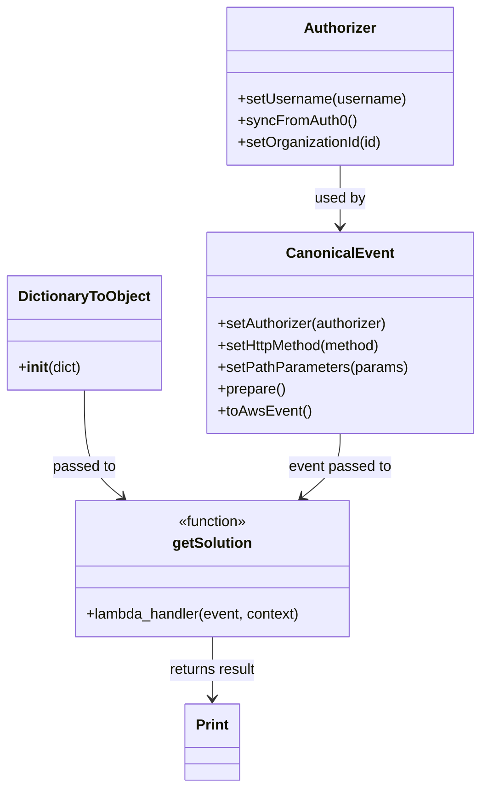

# Diagram: tools/ide_local_testing/localTest/test/solution/getSolutionByOrganizationAndFeature.py


> Auto-generated by Obscura crawlers

## Diagram 1

```mermaid
flowchart TD
    Start[Script start] --> InitAuth[Create Authorizer]
    InitAuth --> SetUser[setUsername("shipper-org-admin@yopmail.com")]
    SetUser --> SyncAuth[syncFromAuth0()]
    SyncAuth --> SetOrg[setOrganizationId(137)]
    Start --> PrepareEvent[Prepare CanonicalEvent]
    PrepareEvent --> SetAuthorizer[setAuthorizer(authorizer)]
    SetAuthorizer --> SetMethod[setHttpMethod("GET")]
    SetMethod --> SetPath[setPathParameters({...})]
    SetPath --> Prepare[prepare()]
    Prepare --> ToAWS[toAwsEvent()]
    ToAWS --> CallLambda[getSolution(lambda_event, config)]
    CallLambda --> Print[print(result)]
    Print --> End[Script end]
```

> SVG rendering failed for this diagram.

## Diagram 2



### SVG

<svg id="container" width="517.8046875" xmlns="http://www.w3.org/2000/svg" class="classDiagram" height="868" viewBox="0 0 517.8046875 868" role="graphics-document document" aria-roledescription="class"><style>#container{font-family:"trebuchet ms",verdana,arial,sans-serif;font-size:16px;fill:#333;}@keyframes edge-animation-frame{from{stroke-dashoffset:0;}}@keyframes dash{to{stroke-dashoffset:0;}}#container .edge-animation-slow{stroke-dasharray:9,5!important;stroke-dashoffset:900;animation:dash 50s linear infinite;stroke-linecap:round;}#container .edge-animation-fast{stroke-dasharray:9,5!important;stroke-dashoffset:900;animation:dash 20s linear infinite;stroke-linecap:round;}#container .error-icon{fill:#552222;}#container .error-text{fill:#552222;stroke:#552222;}#container .edge-thickness-normal{stroke-width:1px;}#container .edge-thickness-thick{stroke-width:3.5px;}#container .edge-pattern-solid{stroke-dasharray:0;}#container .edge-thickness-invisible{stroke-width:0;fill:none;}#container .edge-pattern-dashed{stroke-dasharray:3;}#container .edge-pattern-dotted{stroke-dasharray:2;}#container .marker{fill:#333333;stroke:#333333;}#container .marker.cross{stroke:#333333;}#container svg{font-family:"trebuchet ms",verdana,arial,sans-serif;font-size:16px;}#container p{margin:0;}#container g.classGroup text{fill:#9370DB;stroke:none;font-family:"trebuchet ms",verdana,arial,sans-serif;font-size:10px;}#container g.classGroup text .title{font-weight:bolder;}#container .nodeLabel,#container .edgeLabel{color:#131300;}#container .edgeLabel .label rect{fill:#ECECFF;}#container .label text{fill:#131300;}#container .labelBkg{background:#ECECFF;}#container .edgeLabel .label span{background:#ECECFF;}#container .classTitle{font-weight:bolder;}#container .node rect,#container .node circle,#container .node ellipse,#container .node polygon,#container .node path{fill:#ECECFF;stroke:#9370DB;stroke-width:1px;}#container .divider{stroke:#9370DB;stroke-width:1;}#container g.clickable{cursor:pointer;}#container g.classGroup rect{fill:#ECECFF;stroke:#9370DB;}#container g.classGroup line{stroke:#9370DB;stroke-width:1;}#container .classLabel .box{stroke:none;stroke-width:0;fill:#ECECFF;opacity:0.5;}#container .classLabel .label{fill:#9370DB;font-size:10px;}#container .relation{stroke:#333333;stroke-width:1;fill:none;}#container .dashed-line{stroke-dasharray:3;}#container .dotted-line{stroke-dasharray:1 2;}#container #compositionStart,#container .composition{fill:#333333!important;stroke:#333333!important;stroke-width:1;}#container #compositionEnd,#container .composition{fill:#333333!important;stroke:#333333!important;stroke-width:1;}#container #dependencyStart,#container .dependency{fill:#333333!important;stroke:#333333!important;stroke-width:1;}#container #dependencyStart,#container .dependency{fill:#333333!important;stroke:#333333!important;stroke-width:1;}#container #extensionStart,#container .extension{fill:transparent!important;stroke:#333333!important;stroke-width:1;}#container #extensionEnd,#container .extension{fill:transparent!important;stroke:#333333!important;stroke-width:1;}#container #aggregationStart,#container .aggregation{fill:transparent!important;stroke:#333333!important;stroke-width:1;}#container #aggregationEnd,#container .aggregation{fill:transparent!important;stroke:#333333!important;stroke-width:1;}#container #lollipopStart,#container .lollipop{fill:#ECECFF!important;stroke:#333333!important;stroke-width:1;}#container #lollipopEnd,#container .lollipop{fill:#ECECFF!important;stroke:#333333!important;stroke-width:1;}#container .edgeTerminals{font-size:11px;line-height:initial;}#container .classTitleText{text-anchor:middle;font-size:18px;fill:#333;}#container .label-icon{display:inline-block;height:1em;overflow:visible;vertical-align:-0.125em;}#container .node .label-icon path{fill:currentColor;stroke:revert;stroke-width:revert;}#container :root{--mermaid-font-family:"trebuchet ms",verdana,arial,sans-serif;}</style><g><defs><marker id="container_class-aggregationStart" class="marker aggregation class" refX="18" refY="7" markerWidth="190" markerHeight="240" orient="auto"><path d="M 18,7 L9,13 L1,7 L9,1 Z"></path></marker></defs><defs><marker id="container_class-aggregationEnd" class="marker aggregation class" refX="1" refY="7" markerWidth="20" markerHeight="28" orient="auto"><path d="M 18,7 L9,13 L1,7 L9,1 Z"></path></marker></defs><defs><marker id="container_class-extensionStart" class="marker extension class" refX="18" refY="7" markerWidth="190" markerHeight="240" orient="auto"><path d="M 1,7 L18,13 V 1 Z"></path></marker></defs><defs><marker id="container_class-extensionEnd" class="marker extension class" refX="1" refY="7" markerWidth="20" markerHeight="28" orient="auto"><path d="M 1,1 V 13 L18,7 Z"></path></marker></defs><defs><marker id="container_class-compositionStart" class="marker composition class" refX="18" refY="7" markerWidth="190" markerHeight="240" orient="auto"><path d="M 18,7 L9,13 L1,7 L9,1 Z"></path></marker></defs><defs><marker id="container_class-compositionEnd" class="marker composition class" refX="1" refY="7" markerWidth="20" markerHeight="28" orient="auto"><path d="M 18,7 L9,13 L1,7 L9,1 Z"></path></marker></defs><defs><marker id="container_class-dependencyStart" class="marker dependency class" refX="6" refY="7" markerWidth="190" markerHeight="240" orient="auto"><path d="M 5,7 L9,13 L1,7 L9,1 Z"></path></marker></defs><defs><marker id="container_class-dependencyEnd" class="marker dependency class" refX="13" refY="7" markerWidth="20" markerHeight="28" orient="auto"><path d="M 18,7 L9,13 L14,7 L9,1 Z"></path></marker></defs><defs><marker id="container_class-lollipopStart" class="marker lollipop class" refX="13" refY="7" markerWidth="190" markerHeight="240" orient="auto"><circle stroke="black" fill="transparent" cx="7" cy="7" r="6"></circle></marker></defs><defs><marker id="container_class-lollipopEnd" class="marker lollipop class" refX="1" refY="7" markerWidth="190" markerHeight="240" orient="auto"><circle stroke="black" fill="transparent" cx="7" cy="7" r="6"></circle></marker></defs><g class="root"><g class="clusters"></g><g class="edgePaths"><path d="M366.105,182L366.105,188.167C366.105,194.333,366.105,206.667,366.105,218C366.105,229.333,366.105,239.667,366.105,244.833L366.105,250" id="id_Authorizer_CanonicalEvent_1" class="edge-thickness-normal edge-pattern-solid relation" style=";;;" data-edge="true" data-et="edge" data-id="id_Authorizer_CanonicalEvent_1" data-points="W3sieCI6MzY2LjEwNTQ2ODc1LCJ5IjoxODJ9LHsieCI6MzY2LjEwNTQ2ODc1LCJ5IjoyMTl9LHsieCI6MzY2LjEwNTQ2ODc1LCJ5IjoyNTZ9XQ==" marker-end="url(#container_class-dependencyEnd)"></path><path d="M90.203,430L90.203,444.167C90.203,458.333,90.203,486.667,97.022,506.37C103.841,526.073,117.48,537.145,124.299,542.682L131.118,548.218" id="id_DictionaryToObject_getSolution_2" class="edge-thickness-normal edge-pattern-solid relation" style=";;;" data-edge="true" data-et="edge" data-id="id_DictionaryToObject_getSolution_2" data-points="W3sieCI6OTAuMjAzMTI1LCJ5Ijo0MzB9LHsieCI6OTAuMjAzMTI1LCJ5Ijo1MTV9LHsieCI6MTM1Ljc3NjI3OTk5NDQxOTY0LCJ5Ijo1NTJ9XQ==" marker-end="url(#container_class-dependencyEnd)"></path><path d="M366.105,478L366.105,484.167C366.105,490.333,366.105,502.667,359.286,514.37C352.467,526.073,338.829,537.145,332.01,542.682L325.19,548.218" id="id_CanonicalEvent_getSolution_3" class="edge-thickness-normal edge-pattern-solid relation" style=";;;" data-edge="true" data-et="edge" data-id="id_CanonicalEvent_getSolution_3" data-points="W3sieCI6MzY2LjEwNTQ2ODc1LCJ5Ijo0Nzh9LHsieCI6MzY2LjEwNTQ2ODc1LCJ5Ijo1MTV9LHsieCI6MzIwLjUzMjMxMzc1NTU4MDQsInkiOjU1Mn1d" marker-end="url(#container_class-dependencyEnd)"></path><path d="M228.154,702L228.154,708.167C228.154,714.333,228.154,726.667,228.154,738C228.154,749.333,228.154,759.667,228.154,764.833L228.154,770" id="id_getSolution_Print_4" class="edge-thickness-normal edge-pattern-solid relation" style=";;;" data-edge="true" data-et="edge" data-id="id_getSolution_Print_4" data-points="W3sieCI6MjI4LjE1NDI5Njg3NSwieSI6NzAyfSx7IngiOjIyOC4xNTQyOTY4NzUsInkiOjczOX0seyJ4IjoyMjguMTU0Mjk2ODc1LCJ5Ijo3NzZ9XQ==" marker-end="url(#container_class-dependencyEnd)"></path></g><g class="edgeLabels"><g class="edgeLabel" transform="translate(366.10546875, 219)"><g class="label" data-id="id_Authorizer_CanonicalEvent_1" transform="translate(-28.3125, -12)"><foreignObject width="56.625" height="24"><div xmlns="http://www.w3.org/1999/xhtml" class="labelBkg" style="display: table-cell; white-space: nowrap; line-height: 1.5; max-width: 200px; text-align: center;"><span class="edgeLabel"><p>used by</p></span></div></foreignObject></g></g><g class="edgeLabel" transform="translate(90.203125, 515)"><g class="label" data-id="id_DictionaryToObject_getSolution_2" transform="translate(-35.046875, -12)"><foreignObject width="70.09375" height="24"><div xmlns="http://www.w3.org/1999/xhtml" class="labelBkg" style="display: table-cell; white-space: nowrap; line-height: 1.5; max-width: 200px; text-align: center;"><span class="edgeLabel"><p>passed to</p></span></div></foreignObject></g></g><g class="edgeLabel" transform="translate(366.10546875, 515)"><g class="label" data-id="id_CanonicalEvent_getSolution_3" transform="translate(-57.328125, -12)"><foreignObject width="114.65625" height="24"><div xmlns="http://www.w3.org/1999/xhtml" class="labelBkg" style="display: table-cell; white-space: nowrap; line-height: 1.5; max-width: 200px; text-align: center;"><span class="edgeLabel"><p>event passed to</p></span></div></foreignObject></g></g><g class="edgeLabel" transform="translate(228.154296875, 739)"><g class="label" data-id="id_getSolution_Print_4" transform="translate(-49.21875, -12)"><foreignObject width="98.4375" height="24"><div xmlns="http://www.w3.org/1999/xhtml" class="labelBkg" style="display: table-cell; white-space: nowrap; line-height: 1.5; max-width: 200px; text-align: center;"><span class="edgeLabel"><p>returns result</p></span></div></foreignObject></g></g></g><g class="nodes"><g class="node default" id="classId-Authorizer-0" transform="translate(366.10546875, 95)"><g class="basic label-container"><path d="M-124.13671875 -87 L124.13671875 -87 L124.13671875 87 L-124.13671875 87" stroke="none" stroke-width="0" fill="#ECECFF" style=""></path><path d="M-124.13671875 -87 C-64.54143326786192 -87, -4.946147785723838 -87, 124.13671875 -87 M-124.13671875 -87 C-25.59012667841364 -87, 72.95646539317272 -87, 124.13671875 -87 M124.13671875 -87 C124.13671875 -43.10165612535242, 124.13671875 0.7966877492951596, 124.13671875 87 M124.13671875 -87 C124.13671875 -39.39930330502755, 124.13671875 8.201393389944897, 124.13671875 87 M124.13671875 87 C42.79102699577541 87, -38.55466475844918 87, -124.13671875 87 M124.13671875 87 C52.065653011709216 87, -20.005412726581568 87, -124.13671875 87 M-124.13671875 87 C-124.13671875 27.530141513095877, -124.13671875 -31.939716973808245, -124.13671875 -87 M-124.13671875 87 C-124.13671875 27.670622720008836, -124.13671875 -31.658754559982327, -124.13671875 -87" stroke="#9370DB" stroke-width="1.3" fill="none" stroke-dasharray="0 0" style=""></path></g><g class="annotation-group text" transform="translate(0, -63)"></g><g class="label-group text" transform="translate(-38.3671875, -63)"><g class="label" style="font-weight: bolder" transform="translate(0,-12)"><foreignObject width="76.734375" height="24"><div xmlns="http://www.w3.org/1999/xhtml" style="display: table-cell; white-space: nowrap; line-height: 1.5; max-width: 126px; text-align: center;"><span class="nodeLabel markdown-node-label" style=""><p>Authorizer</p></span></div></foreignObject></g></g><g class="members-group text" transform="translate(-112.13671875, -15)"></g><g class="methods-group text" transform="translate(-112.13671875, 15)"><g class="label" style="" transform="translate(0,-12)"><foreignObject width="185.90625" height="24"><div xmlns="http://www.w3.org/1999/xhtml" style="display: table-cell; white-space: nowrap; line-height: 1.5; max-width: 243px; text-align: center;"><span class="nodeLabel markdown-node-label" style=""><p>+setUsername(username)</p></span></div></foreignObject></g><g class="label" style="" transform="translate(0,12)"><foreignObject width="129.0625" height="24"><div xmlns="http://www.w3.org/1999/xhtml" style="display: table-cell; white-space: nowrap; line-height: 1.5; max-width: 186px; text-align: center;"><span class="nodeLabel markdown-node-label" style=""><p>+syncFromAuth0()</p></span></div></foreignObject></g><g class="label" style="" transform="translate(0,36)"><foreignObject width="160.78125" height="24"><div xmlns="http://www.w3.org/1999/xhtml" style="display: table-cell; white-space: nowrap; line-height: 1.5; max-width: 218px; text-align: center;"><span class="nodeLabel markdown-node-label" style=""><p>+setOrganizationId(id)</p></span></div></foreignObject></g></g><g class="divider" style=""><path d="M-124.13671875 -39 C-54.90791521691324 -39, 14.320888316173523 -39, 124.13671875 -39 M-124.13671875 -39 C-62.61112319107625 -39, -1.0855276321525054 -39, 124.13671875 -39" stroke="#9370DB" stroke-width="1.3" fill="none" stroke-dasharray="0 0" style=""></path></g><g class="divider" style=""><path d="M-124.13671875 -15 C-27.333569989902358 -15, 69.46957877019528 -15, 124.13671875 -15 M-124.13671875 -15 C-39.13158268861075 -15, 45.8735533727785 -15, 124.13671875 -15" stroke="#9370DB" stroke-width="1.3" fill="none" stroke-dasharray="0 0" style=""></path></g></g><g class="node default" id="classId-CanonicalEvent-1" transform="translate(366.10546875, 367)"><g class="basic label-container"><path d="M-143.69921875 -111 L143.69921875 -111 L143.69921875 111 L-143.69921875 111" stroke="none" stroke-width="0" fill="#ECECFF" style=""></path><path d="M-143.69921875 -111 C-41.03638222276214 -111, 61.626454304475715 -111, 143.69921875 -111 M-143.69921875 -111 C-75.96986657222982 -111, -8.240514394459638 -111, 143.69921875 -111 M143.69921875 -111 C143.69921875 -27.032480108635227, 143.69921875 56.93503978272955, 143.69921875 111 M143.69921875 -111 C143.69921875 -48.7638927376383, 143.69921875 13.472214524723398, 143.69921875 111 M143.69921875 111 C52.416305347104554 111, -38.86660805579089 111, -143.69921875 111 M143.69921875 111 C36.013320028642326 111, -71.67257869271535 111, -143.69921875 111 M-143.69921875 111 C-143.69921875 58.86508115340262, -143.69921875 6.730162306805241, -143.69921875 -111 M-143.69921875 111 C-143.69921875 37.37571702789002, -143.69921875 -36.24856594421996, -143.69921875 -111" stroke="#9370DB" stroke-width="1.3" fill="none" stroke-dasharray="0 0" style=""></path></g><g class="annotation-group text" transform="translate(0, -87)"></g><g class="label-group text" transform="translate(-55.7109375, -87)"><g class="label" style="font-weight: bolder" transform="translate(0,-12)"><foreignObject width="111.421875" height="24"><div xmlns="http://www.w3.org/1999/xhtml" style="display: table-cell; white-space: nowrap; line-height: 1.5; max-width: 161px; text-align: center;"><span class="nodeLabel markdown-node-label" style=""><p>CanonicalEvent</p></span></div></foreignObject></g></g><g class="members-group text" transform="translate(-131.69921875, -39)"></g><g class="methods-group text" transform="translate(-131.69921875, -9)"><g class="label" style="" transform="translate(0,-12)"><foreignObject width="190.75" height="24"><div xmlns="http://www.w3.org/1999/xhtml" style="display: table-cell; white-space: nowrap; line-height: 1.5; max-width: 248px; text-align: center;"><span class="nodeLabel markdown-node-label" style=""><p>+setAuthorizer(authorizer)</p></span></div></foreignObject></g><g class="label" style="" transform="translate(0,12)"><foreignObject width="184" height="24"><div xmlns="http://www.w3.org/1999/xhtml" style="display: table-cell; white-space: nowrap; line-height: 1.5; max-width: 241px; text-align: center;"><span class="nodeLabel markdown-node-label" style=""><p>+setHttpMethod(method)</p></span></div></foreignObject></g><g class="label" style="" transform="translate(0,36)"><foreignObject width="207.6875" height="24"><div xmlns="http://www.w3.org/1999/xhtml" style="display: table-cell; white-space: nowrap; line-height: 1.5; max-width: 265px; text-align: center;"><span class="nodeLabel markdown-node-label" style=""><p>+setPathParameters(params)</p></span></div></foreignObject></g><g class="label" style="" transform="translate(0,60)"><foreignObject width="74.75" height="24"><div xmlns="http://www.w3.org/1999/xhtml" style="display: table-cell; white-space: nowrap; line-height: 1.5; max-width: 132px; text-align: center;"><span class="nodeLabel markdown-node-label" style=""><p>+prepare()</p></span></div></foreignObject></g><g class="label" style="" transform="translate(0,84)"><foreignObject width="101.1875" height="24"><div xmlns="http://www.w3.org/1999/xhtml" style="display: table-cell; white-space: nowrap; line-height: 1.5; max-width: 159px; text-align: center;"><span class="nodeLabel markdown-node-label" style=""><p>+toAwsEvent()</p></span></div></foreignObject></g></g><g class="divider" style=""><path d="M-143.69921875 -63 C-66.17599741771528 -63, 11.34722391456944 -63, 143.69921875 -63 M-143.69921875 -63 C-51.5530472852012 -63, 40.593124179597595 -63, 143.69921875 -63" stroke="#9370DB" stroke-width="1.3" fill="none" stroke-dasharray="0 0" style=""></path></g><g class="divider" style=""><path d="M-143.69921875 -39 C-53.727837571177616 -39, 36.24354360764477 -39, 143.69921875 -39 M-143.69921875 -39 C-47.54987249506476 -39, 48.59947375987048 -39, 143.69921875 -39" stroke="#9370DB" stroke-width="1.3" fill="none" stroke-dasharray="0 0" style=""></path></g></g><g class="node default" id="classId-DictionaryToObject-2" transform="translate(90.203125, 367)"><g class="basic label-container"><path d="M-82.203125 -63 L82.203125 -63 L82.203125 63 L-82.203125 63" stroke="none" stroke-width="0" fill="#ECECFF" style=""></path><path d="M-82.203125 -63 C-41.761918260749916 -63, -1.320711521499831 -63, 82.203125 -63 M-82.203125 -63 C-38.196864494064826 -63, 5.809396011870348 -63, 82.203125 -63 M82.203125 -63 C82.203125 -31.150443227089898, 82.203125 0.6991135458202038, 82.203125 63 M82.203125 -63 C82.203125 -33.00077949840405, 82.203125 -3.0015589968081002, 82.203125 63 M82.203125 63 C23.33389862330737 63, -35.53532775338526 63, -82.203125 63 M82.203125 63 C44.16644416285758 63, 6.12976332571516 63, -82.203125 63 M-82.203125 63 C-82.203125 16.50122814179742, -82.203125 -29.99754371640516, -82.203125 -63 M-82.203125 63 C-82.203125 35.69141090036018, -82.203125 8.382821800720372, -82.203125 -63" stroke="#9370DB" stroke-width="1.3" fill="none" stroke-dasharray="0 0" style=""></path></g><g class="annotation-group text" transform="translate(0, -39)"></g><g class="label-group text" transform="translate(-70.109375, -39)"><g class="label" style="font-weight: bolder" transform="translate(0,-12)"><foreignObject width="140.21875" height="24"><div xmlns="http://www.w3.org/1999/xhtml" style="display: table-cell; white-space: nowrap; line-height: 1.5; max-width: 188px; text-align: center;"><span class="nodeLabel markdown-node-label" style=""><p>DictionaryToObject</p></span></div></foreignObject></g></g><g class="members-group text" transform="translate(-70.203125, 9)"></g><g class="methods-group text" transform="translate(-70.203125, 39)"><g class="label" style="" transform="translate(0,-12)"><foreignObject width="70.296875" height="24"><div xmlns="http://www.w3.org/1999/xhtml" style="display: table-cell; white-space: nowrap; line-height: 1.5; max-width: 159px; text-align: center;"><span class="nodeLabel markdown-node-label" style=""><p>+<strong>init</strong>(dict)</p></span></div></foreignObject></g></g><g class="divider" style=""><path d="M-82.203125 -15 C-29.589085653399835 -15, 23.02495369320033 -15, 82.203125 -15 M-82.203125 -15 C-44.034059085025085 -15, -5.86499317005017 -15, 82.203125 -15" stroke="#9370DB" stroke-width="1.3" fill="none" stroke-dasharray="0 0" style=""></path></g><g class="divider" style=""><path d="M-82.203125 9 C-36.93140251613389 9, 8.340319967732214 9, 82.203125 9 M-82.203125 9 C-46.556961083701474 9, -10.910797167402947 9, 82.203125 9" stroke="#9370DB" stroke-width="1.3" fill="none" stroke-dasharray="0 0" style=""></path></g></g><g class="node default" id="classId-getSolution-3" transform="translate(228.154296875, 627)"><g class="basic label-container"><path d="M-153.37890625 -75 L153.37890625 -75 L153.37890625 75 L-153.37890625 75" stroke="none" stroke-width="0" fill="#ECECFF" style=""></path><path d="M-153.37890625 -75 C-33.94122978247532 -75, 85.49644668504936 -75, 153.37890625 -75 M-153.37890625 -75 C-60.12011816724669 -75, 33.138669915506625 -75, 153.37890625 -75 M153.37890625 -75 C153.37890625 -21.974595319228825, 153.37890625 31.05080936154235, 153.37890625 75 M153.37890625 -75 C153.37890625 -32.58193326291813, 153.37890625 9.836133474163745, 153.37890625 75 M153.37890625 75 C41.077679935781504 75, -71.22354637843699 75, -153.37890625 75 M153.37890625 75 C69.86363887387577 75, -13.651628502248457 75, -153.37890625 75 M-153.37890625 75 C-153.37890625 27.442736728312234, -153.37890625 -20.114526543375533, -153.37890625 -75 M-153.37890625 75 C-153.37890625 44.26659953347148, -153.37890625 13.533199066942956, -153.37890625 -75" stroke="#9370DB" stroke-width="1.3" fill="none" stroke-dasharray="0 0" style=""></path></g><g class="annotation-group text" transform="translate(-39.484375, -51)"><g class="label" style="" transform="translate(0,-12)"><foreignObject width="78.96875" height="24"><div xmlns="http://www.w3.org/1999/xhtml" style="display: table-cell; white-space: nowrap; line-height: 1.5; max-width: 129px; text-align: center;"><span class="nodeLabel markdown-node-label" style=""><p>«function»</p></span></div></foreignObject></g></g><g class="label-group text" transform="translate(-42.5703125, -27)"><g class="label" style="font-weight: bolder" transform="translate(0,-12)"><foreignObject width="85.140625" height="24"><div xmlns="http://www.w3.org/1999/xhtml" style="display: table-cell; white-space: nowrap; line-height: 1.5; max-width: 134px; text-align: center;"><span class="nodeLabel markdown-node-label" style=""><p>getSolution</p></span></div></foreignObject></g></g><g class="members-group text" transform="translate(-141.37890625, 21)"></g><g class="methods-group text" transform="translate(-141.37890625, 51)"><g class="label" style="" transform="translate(0,-12)"><foreignObject width="240.1875" height="24"><div xmlns="http://www.w3.org/1999/xhtml" style="display: table-cell; white-space: nowrap; line-height: 1.5; max-width: 298px; text-align: center;"><span class="nodeLabel markdown-node-label" style=""><p>+lambda_handler(event, context)</p></span></div></foreignObject></g></g><g class="divider" style=""><path d="M-153.37890625 -3 C-30.676794657953124 -3, 92.02531693409375 -3, 153.37890625 -3 M-153.37890625 -3 C-65.30280077858805 -3, 22.7733046928239 -3, 153.37890625 -3" stroke="#9370DB" stroke-width="1.3" fill="none" stroke-dasharray="0 0" style=""></path></g><g class="divider" style=""><path d="M-153.37890625 21 C-67.47262310305507 21, 18.43366004388986 21, 153.37890625 21 M-153.37890625 21 C-74.5704019981453 21, 4.2381022537094 21, 153.37890625 21" stroke="#9370DB" stroke-width="1.3" fill="none" stroke-dasharray="0 0" style=""></path></g></g><g class="node default" id="classId-Print-4" transform="translate(228.154296875, 818)"><g class="basic label-container"><path d="M-29.8125 -42 L29.8125 -42 L29.8125 42 L-29.8125 42" stroke="none" stroke-width="0" fill="#ECECFF" style=""></path><path d="M-29.8125 -42 C-14.648208038504508 -42, 0.5160839229909833 -42, 29.8125 -42 M-29.8125 -42 C-6.225353693417034 -42, 17.36179261316593 -42, 29.8125 -42 M29.8125 -42 C29.8125 -13.611240606736917, 29.8125 14.777518786526166, 29.8125 42 M29.8125 -42 C29.8125 -16.963690561290825, 29.8125 8.07261887741835, 29.8125 42 M29.8125 42 C13.567528780736591 42, -2.6774424385268176 42, -29.8125 42 M29.8125 42 C9.342805877292985 42, -11.12688824541403 42, -29.8125 42 M-29.8125 42 C-29.8125 20.62556975276759, -29.8125 -0.7488604944648216, -29.8125 -42 M-29.8125 42 C-29.8125 14.744367839232844, -29.8125 -12.511264321534313, -29.8125 -42" stroke="#9370DB" stroke-width="1.3" fill="none" stroke-dasharray="0 0" style=""></path></g><g class="annotation-group text" transform="translate(0, -18)"></g><g class="label-group text" transform="translate(-17.8125, -18)"><g class="label" style="font-weight: bolder" transform="translate(0,-12)"><foreignObject width="35.625" height="24"><div xmlns="http://www.w3.org/1999/xhtml" style="display: table-cell; white-space: nowrap; line-height: 1.5; max-width: 85px; text-align: center;"><span class="nodeLabel markdown-node-label" style=""><p>Print</p></span></div></foreignObject></g></g><g class="members-group text" transform="translate(-17.8125, 30)"></g><g class="methods-group text" transform="translate(-17.8125, 60)"></g><g class="divider" style=""><path d="M-29.8125 6 C-12.488167207785828 6, 4.836165584428343 6, 29.8125 6 M-29.8125 6 C-14.037695137153165 6, 1.7371097256936707 6, 29.8125 6" stroke="#9370DB" stroke-width="1.3" fill="none" stroke-dasharray="0 0" style=""></path></g><g class="divider" style=""><path d="M-29.8125 24 C-17.096077630456683 24, -4.379655260913363 24, 29.8125 24 M-29.8125 24 C-8.955807632195516 24, 11.900884735608969 24, 29.8125 24" stroke="#9370DB" stroke-width="1.3" fill="none" stroke-dasharray="0 0" style=""></path></g></g></g></g></g></svg>
