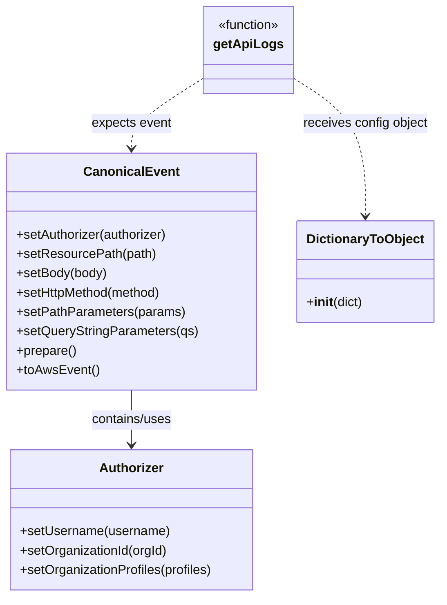

# Diagram: tools/ide_local_testing/localTest/test/support_services/getApiLogs.py


> Auto-generated by Obscura crawlers

## Diagram 1

```mermaid
flowchart LR
    Start((Start))
    QP[QueryStringParameters {"ts","type","orgName","pageSize","pageNumber"}]
    AuthSetup[Authorizer setup\n.setUsername()\n.setOrganizationId()\n.setOrganizationProfiles()]
    CEBuilder[CanonicalEvent builder\n.setAuthorizer()\n.setResourcePath()\n.setBody()\n.setHttpMethod()\n.setPathParameters()\n.setQueryStringParameters()\n.prepare()\n.toAwsEvent()]
    JSONDump[json.dumps(event)]
    Time1[print(datetime.now())]
    Invoke[getApiLogs(event, DictionaryToObject({"function_name":"getEventsByLambda"}))]
    Time2[print(datetime.now())]
    PrintRetval[print(retval)]
    End((End))

    Start --> QP
    QP --> AuthSetup
    AuthSetup --> CEBuilder
    CEBuilder --> JSONDump
    JSONDump --> Time1
    Time1 --> Invoke
    Invoke --> Time2
    Time2 --> PrintRetval
    PrintRetval --> End
```

> SVG rendering failed for this diagram.

## Diagram 2



### SVG

<svg id="container" width="535.0390625" xmlns="http://www.w3.org/2000/svg" class="classDiagram" height="740" viewBox="0 0 535.0390625 740" role="graphics-document document" aria-roledescription="class"><style>#container{font-family:"trebuchet ms",verdana,arial,sans-serif;font-size:16px;fill:#333;}@keyframes edge-animation-frame{from{stroke-dashoffset:0;}}@keyframes dash{to{stroke-dashoffset:0;}}#container .edge-animation-slow{stroke-dasharray:9,5!important;stroke-dashoffset:900;animation:dash 50s linear infinite;stroke-linecap:round;}#container .edge-animation-fast{stroke-dasharray:9,5!important;stroke-dashoffset:900;animation:dash 20s linear infinite;stroke-linecap:round;}#container .error-icon{fill:#552222;}#container .error-text{fill:#552222;stroke:#552222;}#container .edge-thickness-normal{stroke-width:1px;}#container .edge-thickness-thick{stroke-width:3.5px;}#container .edge-pattern-solid{stroke-dasharray:0;}#container .edge-thickness-invisible{stroke-width:0;fill:none;}#container .edge-pattern-dashed{stroke-dasharray:3;}#container .edge-pattern-dotted{stroke-dasharray:2;}#container .marker{fill:#333333;stroke:#333333;}#container .marker.cross{stroke:#333333;}#container svg{font-family:"trebuchet ms",verdana,arial,sans-serif;font-size:16px;}#container p{margin:0;}#container g.classGroup text{fill:#9370DB;stroke:none;font-family:"trebuchet ms",verdana,arial,sans-serif;font-size:10px;}#container g.classGroup text .title{font-weight:bolder;}#container .nodeLabel,#container .edgeLabel{color:#131300;}#container .edgeLabel .label rect{fill:#ECECFF;}#container .label text{fill:#131300;}#container .labelBkg{background:#ECECFF;}#container .edgeLabel .label span{background:#ECECFF;}#container .classTitle{font-weight:bolder;}#container .node rect,#container .node circle,#container .node ellipse,#container .node polygon,#container .node path{fill:#ECECFF;stroke:#9370DB;stroke-width:1px;}#container .divider{stroke:#9370DB;stroke-width:1;}#container g.clickable{cursor:pointer;}#container g.classGroup rect{fill:#ECECFF;stroke:#9370DB;}#container g.classGroup line{stroke:#9370DB;stroke-width:1;}#container .classLabel .box{stroke:none;stroke-width:0;fill:#ECECFF;opacity:0.5;}#container .classLabel .label{fill:#9370DB;font-size:10px;}#container .relation{stroke:#333333;stroke-width:1;fill:none;}#container .dashed-line{stroke-dasharray:3;}#container .dotted-line{stroke-dasharray:1 2;}#container #compositionStart,#container .composition{fill:#333333!important;stroke:#333333!important;stroke-width:1;}#container #compositionEnd,#container .composition{fill:#333333!important;stroke:#333333!important;stroke-width:1;}#container #dependencyStart,#container .dependency{fill:#333333!important;stroke:#333333!important;stroke-width:1;}#container #dependencyStart,#container .dependency{fill:#333333!important;stroke:#333333!important;stroke-width:1;}#container #extensionStart,#container .extension{fill:transparent!important;stroke:#333333!important;stroke-width:1;}#container #extensionEnd,#container .extension{fill:transparent!important;stroke:#333333!important;stroke-width:1;}#container #aggregationStart,#container .aggregation{fill:transparent!important;stroke:#333333!important;stroke-width:1;}#container #aggregationEnd,#container .aggregation{fill:transparent!important;stroke:#333333!important;stroke-width:1;}#container #lollipopStart,#container .lollipop{fill:#ECECFF!important;stroke:#333333!important;stroke-width:1;}#container #lollipopEnd,#container .lollipop{fill:#ECECFF!important;stroke:#333333!important;stroke-width:1;}#container .edgeTerminals{font-size:11px;line-height:initial;}#container .classTitleText{text-anchor:middle;font-size:18px;fill:#333;}#container .label-icon{display:inline-block;height:1em;overflow:visible;vertical-align:-0.125em;}#container .node .label-icon path{fill:currentColor;stroke:revert;stroke-width:revert;}#container :root{--mermaid-font-family:"trebuchet ms",verdana,arial,sans-serif;}</style><g><defs><marker id="container_class-aggregationStart" class="marker aggregation class" refX="18" refY="7" markerWidth="190" markerHeight="240" orient="auto"><path d="M 18,7 L9,13 L1,7 L9,1 Z"></path></marker></defs><defs><marker id="container_class-aggregationEnd" class="marker aggregation class" refX="1" refY="7" markerWidth="20" markerHeight="28" orient="auto"><path d="M 18,7 L9,13 L1,7 L9,1 Z"></path></marker></defs><defs><marker id="container_class-extensionStart" class="marker extension class" refX="18" refY="7" markerWidth="190" markerHeight="240" orient="auto"><path d="M 1,7 L18,13 V 1 Z"></path></marker></defs><defs><marker id="container_class-extensionEnd" class="marker extension class" refX="1" refY="7" markerWidth="20" markerHeight="28" orient="auto"><path d="M 1,1 V 13 L18,7 Z"></path></marker></defs><defs><marker id="container_class-compositionStart" class="marker composition class" refX="18" refY="7" markerWidth="190" markerHeight="240" orient="auto"><path d="M 18,7 L9,13 L1,7 L9,1 Z"></path></marker></defs><defs><marker id="container_class-compositionEnd" class="marker composition class" refX="1" refY="7" markerWidth="20" markerHeight="28" orient="auto"><path d="M 18,7 L9,13 L1,7 L9,1 Z"></path></marker></defs><defs><marker id="container_class-dependencyStart" class="marker dependency class" refX="6" refY="7" markerWidth="190" markerHeight="240" orient="auto"><path d="M 5,7 L9,13 L1,7 L9,1 Z"></path></marker></defs><defs><marker id="container_class-dependencyEnd" class="marker dependency class" refX="13" refY="7" markerWidth="20" markerHeight="28" orient="auto"><path d="M 18,7 L9,13 L14,7 L9,1 Z"></path></marker></defs><defs><marker id="container_class-lollipopStart" class="marker lollipop class" refX="13" refY="7" markerWidth="190" markerHeight="240" orient="auto"><circle stroke="black" fill="transparent" cx="7" cy="7" r="6"></circle></marker></defs><defs><marker id="container_class-lollipopEnd" class="marker lollipop class" refX="1" refY="7" markerWidth="190" markerHeight="240" orient="auto"><circle stroke="black" fill="transparent" cx="7" cy="7" r="6"></circle></marker></defs><g class="root"><g class="clusters"></g><g class="edgePaths"><path d="M160.316,484L160.316,490.167C160.316,496.333,160.316,508.667,160.316,520C160.316,531.333,160.316,541.667,160.316,546.833L160.316,552" id="id_CanonicalEvent_Authorizer_1" class="edge-thickness-normal edge-pattern-solid relation" style=";;;" data-edge="true" data-et="edge" data-id="id_CanonicalEvent_Authorizer_1" data-points="W3sieCI6MTYwLjMxNjQwNjI1LCJ5Ijo0ODR9LHsieCI6MTYwLjMxNjQwNjI1LCJ5Ijo1MjF9LHsieCI6MTYwLjMxNjQwNjI1LCJ5Ijo1NTh9XQ==" marker-end="url(#container_class-dependencyEnd)"></path><path d="M250.311,95.433L235.312,105.028C220.313,114.622,190.314,133.811,175.315,148.572C160.316,163.333,160.316,173.667,160.316,178.833L160.316,184" id="id_getApiLogs_CanonicalEvent_2" class="edge-thickness-normal edge-pattern-dashed relation" style=";;;" data-edge="true" data-et="edge" data-id="id_getApiLogs_CanonicalEvent_2" data-points="W3sieCI6MjUwLjMxMDU0Njg3NSwieSI6OTUuNDMzMDA3OTQ5MjU2NTZ9LHsieCI6MTYwLjMxNjQwNjI1LCJ5IjoxNTN9LHsieCI6MTYwLjMxNjQwNjI1LCJ5IjoxOTB9XQ==" marker-end="url(#container_class-dependencyEnd)"></path><path d="M354.842,95.433L369.841,105.028C384.84,114.622,414.838,133.811,429.837,162.572C444.836,191.333,444.836,229.667,444.836,248.833L444.836,268" id="id_getApiLogs_DictionaryToObject_3" class="edge-thickness-normal edge-pattern-dashed relation" style=";;;" data-edge="true" data-et="edge" data-id="id_getApiLogs_DictionaryToObject_3" data-points="W3sieCI6MzU0Ljg0MTc5Njg3NSwieSI6OTUuNDMzMDA3OTQ5MjU2NTZ9LHsieCI6NDQ0LjgzNTkzNzUsInkiOjE1M30seyJ4Ijo0NDQuODM1OTM3NSwieSI6Mjc0fV0=" marker-end="url(#container_class-dependencyEnd)"></path></g><g class="edgeLabels"><g class="edgeLabel" transform="translate(160.31640625, 521)"><g class="label" data-id="id_CanonicalEvent_Authorizer_1" transform="translate(-51.296875, -12)"><foreignObject width="102.59375" height="24"><div xmlns="http://www.w3.org/1999/xhtml" class="labelBkg" style="display: table-cell; white-space: nowrap; line-height: 1.5; max-width: 200px; text-align: center;"><span class="edgeLabel"><p>contains/uses</p></span></div></foreignObject></g></g><g class="edgeLabel" transform="translate(160.31640625, 153)"><g class="label" data-id="id_getApiLogs_CanonicalEvent_2" transform="translate(-50.0234375, -12)"><foreignObject width="100.046875" height="24"><div xmlns="http://www.w3.org/1999/xhtml" class="labelBkg" style="display: table-cell; white-space: nowrap; line-height: 1.5; max-width: 200px; text-align: center;"><span class="edgeLabel"><p>expects event</p></span></div></foreignObject></g></g><g class="edgeLabel" transform="translate(444.8359375, 153)"><g class="label" data-id="id_getApiLogs_DictionaryToObject_3" transform="translate(-78.25, -12)"><foreignObject width="156.5" height="24"><div xmlns="http://www.w3.org/1999/xhtml" class="labelBkg" style="display: table-cell; white-space: nowrap; line-height: 1.5; max-width: 200px; text-align: center;"><span class="edgeLabel"><p>receives config object</p></span></div></foreignObject></g></g></g><g class="nodes"><g class="node default" id="classId-Authorizer-0" transform="translate(160.31640625, 645)"><g class="basic label-container"><path d="M-151.66796875 -87 L151.66796875 -87 L151.66796875 87 L-151.66796875 87" stroke="none" stroke-width="0" fill="#ECECFF" style=""></path><path d="M-151.66796875 -87 C-34.009475954519075 -87, 83.64901684096185 -87, 151.66796875 -87 M-151.66796875 -87 C-73.45068835795738 -87, 4.7665920340852495 -87, 151.66796875 -87 M151.66796875 -87 C151.66796875 -36.9635222024619, 151.66796875 13.072955595076195, 151.66796875 87 M151.66796875 -87 C151.66796875 -35.12785779770952, 151.66796875 16.744284404580966, 151.66796875 87 M151.66796875 87 C46.56007374165712 87, -58.54782126668576 87, -151.66796875 87 M151.66796875 87 C67.39332091746142 87, -16.881326915077153 87, -151.66796875 87 M-151.66796875 87 C-151.66796875 46.44126148468861, -151.66796875 5.88252296937722, -151.66796875 -87 M-151.66796875 87 C-151.66796875 43.58648017195185, -151.66796875 0.1729603439036964, -151.66796875 -87" stroke="#9370DB" stroke-width="1.3" fill="none" stroke-dasharray="0 0" style=""></path></g><g class="annotation-group text" transform="translate(0, -63)"></g><g class="label-group text" transform="translate(-38.3671875, -63)"><g class="label" style="font-weight: bolder" transform="translate(0,-12)"><foreignObject width="76.734375" height="24"><div xmlns="http://www.w3.org/1999/xhtml" style="display: table-cell; white-space: nowrap; line-height: 1.5; max-width: 126px; text-align: center;"><span class="nodeLabel markdown-node-label" style=""><p>Authorizer</p></span></div></foreignObject></g></g><g class="members-group text" transform="translate(-139.66796875, -15)"></g><g class="methods-group text" transform="translate(-139.66796875, 15)"><g class="label" style="" transform="translate(0,-12)"><foreignObject width="185.90625" height="24"><div xmlns="http://www.w3.org/1999/xhtml" style="display: table-cell; white-space: nowrap; line-height: 1.5; max-width: 243px; text-align: center;"><span class="nodeLabel markdown-node-label" style=""><p>+setUsername(username)</p></span></div></foreignObject></g><g class="label" style="" transform="translate(0,12)"><foreignObject width="184.578125" height="24"><div xmlns="http://www.w3.org/1999/xhtml" style="display: table-cell; white-space: nowrap; line-height: 1.5; max-width: 242px; text-align: center;"><span class="nodeLabel markdown-node-label" style=""><p>+setOrganizationId(orgId)</p></span></div></foreignObject></g><g class="label" style="" transform="translate(0,36)"><foreignObject width="240.96875" height="24"><div xmlns="http://www.w3.org/1999/xhtml" style="display: table-cell; white-space: nowrap; line-height: 1.5; max-width: 298px; text-align: center;"><span class="nodeLabel markdown-node-label" style=""><p>+setOrganizationProfiles(profiles)</p></span></div></foreignObject></g></g><g class="divider" style=""><path d="M-151.66796875 -39 C-31.919798932311878 -39, 87.82837088537624 -39, 151.66796875 -39 M-151.66796875 -39 C-35.623468853400624 -39, 80.42103104319875 -39, 151.66796875 -39" stroke="#9370DB" stroke-width="1.3" fill="none" stroke-dasharray="0 0" style=""></path></g><g class="divider" style=""><path d="M-151.66796875 -15 C-44.435699743107804 -15, 62.79656926378439 -15, 151.66796875 -15 M-151.66796875 -15 C-37.83057774045626 -15, 76.00681326908747 -15, 151.66796875 -15" stroke="#9370DB" stroke-width="1.3" fill="none" stroke-dasharray="0 0" style=""></path></g></g><g class="node default" id="classId-CanonicalEvent-1" transform="translate(160.31640625, 337)"><g class="basic label-container"><path d="M-152.31640625 -147 L152.31640625 -147 L152.31640625 147 L-152.31640625 147" stroke="none" stroke-width="0" fill="#ECECFF" style=""></path><path d="M-152.31640625 -147 C-88.46948440014785 -147, -24.622562550295697 -147, 152.31640625 -147 M-152.31640625 -147 C-87.34047149488012 -147, -22.36453673976024 -147, 152.31640625 -147 M152.31640625 -147 C152.31640625 -47.409190104142624, 152.31640625 52.18161979171475, 152.31640625 147 M152.31640625 -147 C152.31640625 -55.87963131837871, 152.31640625 35.24073736324257, 152.31640625 147 M152.31640625 147 C51.87622540662568 147, -48.56395543674864 147, -152.31640625 147 M152.31640625 147 C49.984418338742756 147, -52.34756957251449 147, -152.31640625 147 M-152.31640625 147 C-152.31640625 59.361753959553965, -152.31640625 -28.27649208089207, -152.31640625 -147 M-152.31640625 147 C-152.31640625 46.69435841477535, -152.31640625 -53.6112831704493, -152.31640625 -147" stroke="#9370DB" stroke-width="1.3" fill="none" stroke-dasharray="0 0" style=""></path></g><g class="annotation-group text" transform="translate(0, -123)"></g><g class="label-group text" transform="translate(-55.7109375, -123)"><g class="label" style="font-weight: bolder" transform="translate(0,-12)"><foreignObject width="111.421875" height="24"><div xmlns="http://www.w3.org/1999/xhtml" style="display: table-cell; white-space: nowrap; line-height: 1.5; max-width: 161px; text-align: center;"><span class="nodeLabel markdown-node-label" style=""><p>CanonicalEvent</p></span></div></foreignObject></g></g><g class="members-group text" transform="translate(-140.31640625, -75)"></g><g class="methods-group text" transform="translate(-140.31640625, -45)"><g class="label" style="" transform="translate(0,-12)"><foreignObject width="190.75" height="24"><div xmlns="http://www.w3.org/1999/xhtml" style="display: table-cell; white-space: nowrap; line-height: 1.5; max-width: 248px; text-align: center;"><span class="nodeLabel markdown-node-label" style=""><p>+setAuthorizer(authorizer)</p></span></div></foreignObject></g><g class="label" style="" transform="translate(0,12)"><foreignObject width="171.828125" height="24"><div xmlns="http://www.w3.org/1999/xhtml" style="display: table-cell; white-space: nowrap; line-height: 1.5; max-width: 229px; text-align: center;"><span class="nodeLabel markdown-node-label" style=""><p>+setResourcePath(path)</p></span></div></foreignObject></g><g class="label" style="" transform="translate(0,36)"><foreignObject width="113.125" height="24"><div xmlns="http://www.w3.org/1999/xhtml" style="display: table-cell; white-space: nowrap; line-height: 1.5; max-width: 170px; text-align: center;"><span class="nodeLabel markdown-node-label" style=""><p>+setBody(body)</p></span></div></foreignObject></g><g class="label" style="" transform="translate(0,60)"><foreignObject width="184" height="24"><div xmlns="http://www.w3.org/1999/xhtml" style="display: table-cell; white-space: nowrap; line-height: 1.5; max-width: 241px; text-align: center;"><span class="nodeLabel markdown-node-label" style=""><p>+setHttpMethod(method)</p></span></div></foreignObject></g><g class="label" style="" transform="translate(0,84)"><foreignObject width="207.6875" height="24"><div xmlns="http://www.w3.org/1999/xhtml" style="display: table-cell; white-space: nowrap; line-height: 1.5; max-width: 265px; text-align: center;"><span class="nodeLabel markdown-node-label" style=""><p>+setPathParameters(params)</p></span></div></foreignObject></g><g class="label" style="" transform="translate(0,108)"><foreignObject width="224.921875" height="24"><div xmlns="http://www.w3.org/1999/xhtml" style="display: table-cell; white-space: nowrap; line-height: 1.5; max-width: 282px; text-align: center;"><span class="nodeLabel markdown-node-label" style=""><p>+setQueryStringParameters(qs)</p></span></div></foreignObject></g><g class="label" style="" transform="translate(0,132)"><foreignObject width="74.75" height="24"><div xmlns="http://www.w3.org/1999/xhtml" style="display: table-cell; white-space: nowrap; line-height: 1.5; max-width: 132px; text-align: center;"><span class="nodeLabel markdown-node-label" style=""><p>+prepare()</p></span></div></foreignObject></g><g class="label" style="" transform="translate(0,156)"><foreignObject width="101.1875" height="24"><div xmlns="http://www.w3.org/1999/xhtml" style="display: table-cell; white-space: nowrap; line-height: 1.5; max-width: 159px; text-align: center;"><span class="nodeLabel markdown-node-label" style=""><p>+toAwsEvent()</p></span></div></foreignObject></g></g><g class="divider" style=""><path d="M-152.31640625 -99 C-83.3113133156886 -99, -14.306220381377187 -99, 152.31640625 -99 M-152.31640625 -99 C-32.887503890013875 -99, 86.54139846997225 -99, 152.31640625 -99" stroke="#9370DB" stroke-width="1.3" fill="none" stroke-dasharray="0 0" style=""></path></g><g class="divider" style=""><path d="M-152.31640625 -75 C-47.81681936787848 -75, 56.68276751424304 -75, 152.31640625 -75 M-152.31640625 -75 C-32.11138244523062 -75, 88.09364135953876 -75, 152.31640625 -75" stroke="#9370DB" stroke-width="1.3" fill="none" stroke-dasharray="0 0" style=""></path></g></g><g class="node default" id="classId-DictionaryToObject-2" transform="translate(444.8359375, 337)"><g class="basic label-container"><path d="M-82.203125 -63 L82.203125 -63 L82.203125 63 L-82.203125 63" stroke="none" stroke-width="0" fill="#ECECFF" style=""></path><path d="M-82.203125 -63 C-44.6420284444882 -63, -7.080931888976394 -63, 82.203125 -63 M-82.203125 -63 C-29.652972538015092 -63, 22.897179923969816 -63, 82.203125 -63 M82.203125 -63 C82.203125 -12.671467126008281, 82.203125 37.65706574798344, 82.203125 63 M82.203125 -63 C82.203125 -12.613501931394858, 82.203125 37.772996137210285, 82.203125 63 M82.203125 63 C47.88632646683223 63, 13.56952793366446 63, -82.203125 63 M82.203125 63 C22.61917730786513 63, -36.96477038426974 63, -82.203125 63 M-82.203125 63 C-82.203125 20.886225794385396, -82.203125 -21.227548411229208, -82.203125 -63 M-82.203125 63 C-82.203125 23.424788729730416, -82.203125 -16.150422540539168, -82.203125 -63" stroke="#9370DB" stroke-width="1.3" fill="none" stroke-dasharray="0 0" style=""></path></g><g class="annotation-group text" transform="translate(0, -39)"></g><g class="label-group text" transform="translate(-70.109375, -39)"><g class="label" style="font-weight: bolder" transform="translate(0,-12)"><foreignObject width="140.21875" height="24"><div xmlns="http://www.w3.org/1999/xhtml" style="display: table-cell; white-space: nowrap; line-height: 1.5; max-width: 188px; text-align: center;"><span class="nodeLabel markdown-node-label" style=""><p>DictionaryToObject</p></span></div></foreignObject></g></g><g class="members-group text" transform="translate(-70.203125, 9)"></g><g class="methods-group text" transform="translate(-70.203125, 39)"><g class="label" style="" transform="translate(0,-12)"><foreignObject width="70.296875" height="24"><div xmlns="http://www.w3.org/1999/xhtml" style="display: table-cell; white-space: nowrap; line-height: 1.5; max-width: 159px; text-align: center;"><span class="nodeLabel markdown-node-label" style=""><p>+<strong>init</strong>(dict)</p></span></div></foreignObject></g></g><g class="divider" style=""><path d="M-82.203125 -15 C-42.65682195410528 -15, -3.1105189082105653 -15, 82.203125 -15 M-82.203125 -15 C-44.03288992744268 -15, -5.862654854885363 -15, 82.203125 -15" stroke="#9370DB" stroke-width="1.3" fill="none" stroke-dasharray="0 0" style=""></path></g><g class="divider" style=""><path d="M-82.203125 9 C-34.56213492742255 9, 13.078855145154904 9, 82.203125 9 M-82.203125 9 C-25.76238455836502 9, 30.67835588326996 9, 82.203125 9" stroke="#9370DB" stroke-width="1.3" fill="none" stroke-dasharray="0 0" style=""></path></g></g><g class="node default" id="classId-getApiLogs-3" transform="translate(302.576171875, 62)"><g class="basic label-container"><path d="M-52.265625 -54 L52.265625 -54 L52.265625 54 L-52.265625 54" stroke="none" stroke-width="0" fill="#ECECFF" style=""></path><path d="M-52.265625 -54 C-18.96705737659338 -54, 14.331510246813238 -54, 52.265625 -54 M-52.265625 -54 C-29.457455420282944 -54, -6.649285840565888 -54, 52.265625 -54 M52.265625 -54 C52.265625 -23.28166274929841, 52.265625 7.436674501403182, 52.265625 54 M52.265625 -54 C52.265625 -30.18015591057234, 52.265625 -6.360311821144677, 52.265625 54 M52.265625 54 C18.533435252719272 54, -15.198754494561456 54, -52.265625 54 M52.265625 54 C13.767223142096057 54, -24.731178715807886 54, -52.265625 54 M-52.265625 54 C-52.265625 11.23953536039788, -52.265625 -31.52092927920424, -52.265625 -54 M-52.265625 54 C-52.265625 25.86698786288811, -52.265625 -2.2660242742237813, -52.265625 -54" stroke="#9370DB" stroke-width="1.3" fill="none" stroke-dasharray="0 0" style=""></path></g><g class="annotation-group text" transform="translate(-39.484375, -30)"><g class="label" style="" transform="translate(0,-12)"><foreignObject width="78.96875" height="24"><div xmlns="http://www.w3.org/1999/xhtml" style="display: table-cell; white-space: nowrap; line-height: 1.5; max-width: 129px; text-align: center;"><span class="nodeLabel markdown-node-label" style=""><p>«function»</p></span></div></foreignObject></g></g><g class="label-group text" transform="translate(-40.265625, -6)"><g class="label" style="font-weight: bolder" transform="translate(0,-12)"><foreignObject width="80.53125" height="24"><div xmlns="http://www.w3.org/1999/xhtml" style="display: table-cell; white-space: nowrap; line-height: 1.5; max-width: 128px; text-align: center;"><span class="nodeLabel markdown-node-label" style=""><p>getApiLogs</p></span></div></foreignObject></g></g><g class="members-group text" transform="translate(-40.265625, 42)"></g><g class="methods-group text" transform="translate(-40.265625, 72)"></g><g class="divider" style=""><path d="M-52.265625 18 C-25.314423480876883 18, 1.6367780382462342 18, 52.265625 18 M-52.265625 18 C-14.60042349778734 18, 23.06477800442532 18, 52.265625 18" stroke="#9370DB" stroke-width="1.3" fill="none" stroke-dasharray="0 0" style=""></path></g><g class="divider" style=""><path d="M-52.265625 36 C-25.63262041117953 36, 1.0003841776409388 36, 52.265625 36 M-52.265625 36 C-30.505198304646157 36, -8.744771609292314 36, 52.265625 36" stroke="#9370DB" stroke-width="1.3" fill="none" stroke-dasharray="0 0" style=""></path></g></g></g></g></g></svg>
