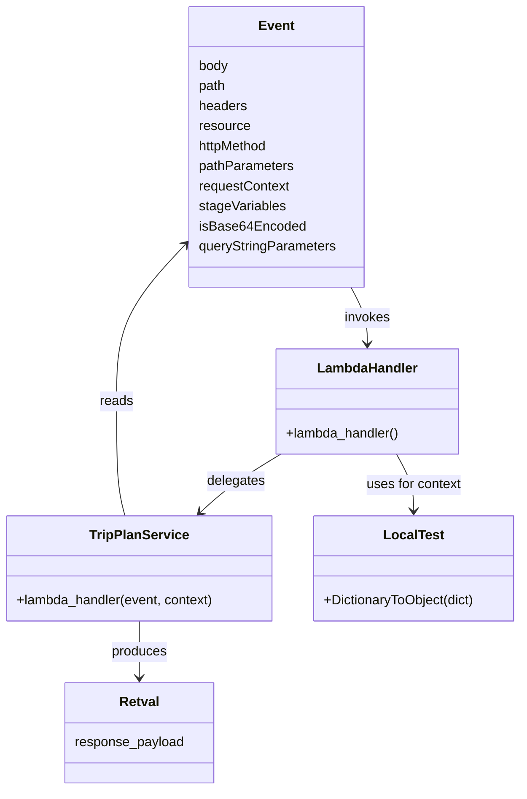

# Diagram: tools/ide_local_testing/localTest/test/tripPlanService/getShipmentTripPlan.py


> Auto-generated by Obscura crawlers

## Diagram 1

```mermaid
flowchart TD
    Event["HTTP Event\n(path=/trip_plan/get_shipment_trip_plan\nquery: shipmentId=6446088)"] -->|invokes| LambdaHandler[lambda_handler()]
    LambdaHandler -->|calls| TripPlanService["fv_shipment_trip_plan_service.trip_plan.get_shipment_trip_plan.lambda_handler(event, context)"]
    TripPlanService -->|returns| Retval["retval (response)"]
    Retval -->|printed to stdout| Print["print(retval)"]
    LambdaHandler -->|constructs context| Context["localTest.core.DictionaryToObject(function_name)"]
```

> SVG rendering failed for this diagram.

## Diagram 2



### SVG

<svg id="container" width="629.5078125" xmlns="http://www.w3.org/2000/svg" class="classDiagram" height="946" viewBox="0 0 629.5078125 946" role="graphics-document document" aria-roledescription="class"><style>#container{font-family:"trebuchet ms",verdana,arial,sans-serif;font-size:16px;fill:#333;}@keyframes edge-animation-frame{from{stroke-dashoffset:0;}}@keyframes dash{to{stroke-dashoffset:0;}}#container .edge-animation-slow{stroke-dasharray:9,5!important;stroke-dashoffset:900;animation:dash 50s linear infinite;stroke-linecap:round;}#container .edge-animation-fast{stroke-dasharray:9,5!important;stroke-dashoffset:900;animation:dash 20s linear infinite;stroke-linecap:round;}#container .error-icon{fill:#552222;}#container .error-text{fill:#552222;stroke:#552222;}#container .edge-thickness-normal{stroke-width:1px;}#container .edge-thickness-thick{stroke-width:3.5px;}#container .edge-pattern-solid{stroke-dasharray:0;}#container .edge-thickness-invisible{stroke-width:0;fill:none;}#container .edge-pattern-dashed{stroke-dasharray:3;}#container .edge-pattern-dotted{stroke-dasharray:2;}#container .marker{fill:#333333;stroke:#333333;}#container .marker.cross{stroke:#333333;}#container svg{font-family:"trebuchet ms",verdana,arial,sans-serif;font-size:16px;}#container p{margin:0;}#container g.classGroup text{fill:#9370DB;stroke:none;font-family:"trebuchet ms",verdana,arial,sans-serif;font-size:10px;}#container g.classGroup text .title{font-weight:bolder;}#container .nodeLabel,#container .edgeLabel{color:#131300;}#container .edgeLabel .label rect{fill:#ECECFF;}#container .label text{fill:#131300;}#container .labelBkg{background:#ECECFF;}#container .edgeLabel .label span{background:#ECECFF;}#container .classTitle{font-weight:bolder;}#container .node rect,#container .node circle,#container .node ellipse,#container .node polygon,#container .node path{fill:#ECECFF;stroke:#9370DB;stroke-width:1px;}#container .divider{stroke:#9370DB;stroke-width:1;}#container g.clickable{cursor:pointer;}#container g.classGroup rect{fill:#ECECFF;stroke:#9370DB;}#container g.classGroup line{stroke:#9370DB;stroke-width:1;}#container .classLabel .box{stroke:none;stroke-width:0;fill:#ECECFF;opacity:0.5;}#container .classLabel .label{fill:#9370DB;font-size:10px;}#container .relation{stroke:#333333;stroke-width:1;fill:none;}#container .dashed-line{stroke-dasharray:3;}#container .dotted-line{stroke-dasharray:1 2;}#container #compositionStart,#container .composition{fill:#333333!important;stroke:#333333!important;stroke-width:1;}#container #compositionEnd,#container .composition{fill:#333333!important;stroke:#333333!important;stroke-width:1;}#container #dependencyStart,#container .dependency{fill:#333333!important;stroke:#333333!important;stroke-width:1;}#container #dependencyStart,#container .dependency{fill:#333333!important;stroke:#333333!important;stroke-width:1;}#container #extensionStart,#container .extension{fill:transparent!important;stroke:#333333!important;stroke-width:1;}#container #extensionEnd,#container .extension{fill:transparent!important;stroke:#333333!important;stroke-width:1;}#container #aggregationStart,#container .aggregation{fill:transparent!important;stroke:#333333!important;stroke-width:1;}#container #aggregationEnd,#container .aggregation{fill:transparent!important;stroke:#333333!important;stroke-width:1;}#container #lollipopStart,#container .lollipop{fill:#ECECFF!important;stroke:#333333!important;stroke-width:1;}#container #lollipopEnd,#container .lollipop{fill:#ECECFF!important;stroke:#333333!important;stroke-width:1;}#container .edgeTerminals{font-size:11px;line-height:initial;}#container .classTitleText{text-anchor:middle;font-size:18px;fill:#333;}#container .label-icon{display:inline-block;height:1em;overflow:visible;vertical-align:-0.125em;}#container .node .label-icon path{fill:currentColor;stroke:revert;stroke-width:revert;}#container :root{--mermaid-font-family:"trebuchet ms",verdana,arial,sans-serif;}</style><g><defs><marker id="container_class-aggregationStart" class="marker aggregation class" refX="18" refY="7" markerWidth="190" markerHeight="240" orient="auto"><path d="M 18,7 L9,13 L1,7 L9,1 Z"></path></marker></defs><defs><marker id="container_class-aggregationEnd" class="marker aggregation class" refX="1" refY="7" markerWidth="20" markerHeight="28" orient="auto"><path d="M 18,7 L9,13 L1,7 L9,1 Z"></path></marker></defs><defs><marker id="container_class-extensionStart" class="marker extension class" refX="18" refY="7" markerWidth="190" markerHeight="240" orient="auto"><path d="M 1,7 L18,13 V 1 Z"></path></marker></defs><defs><marker id="container_class-extensionEnd" class="marker extension class" refX="1" refY="7" markerWidth="20" markerHeight="28" orient="auto"><path d="M 1,1 V 13 L18,7 Z"></path></marker></defs><defs><marker id="container_class-compositionStart" class="marker composition class" refX="18" refY="7" markerWidth="190" markerHeight="240" orient="auto"><path d="M 18,7 L9,13 L1,7 L9,1 Z"></path></marker></defs><defs><marker id="container_class-compositionEnd" class="marker composition class" refX="1" refY="7" markerWidth="20" markerHeight="28" orient="auto"><path d="M 18,7 L9,13 L1,7 L9,1 Z"></path></marker></defs><defs><marker id="container_class-dependencyStart" class="marker dependency class" refX="6" refY="7" markerWidth="190" markerHeight="240" orient="auto"><path d="M 5,7 L9,13 L1,7 L9,1 Z"></path></marker></defs><defs><marker id="container_class-dependencyEnd" class="marker dependency class" refX="13" refY="7" markerWidth="20" markerHeight="28" orient="auto"><path d="M 18,7 L9,13 L14,7 L9,1 Z"></path></marker></defs><defs><marker id="container_class-lollipopStart" class="marker lollipop class" refX="13" refY="7" markerWidth="190" markerHeight="240" orient="auto"><circle stroke="black" fill="transparent" cx="7" cy="7" r="6"></circle></marker></defs><defs><marker id="container_class-lollipopEnd" class="marker lollipop class" refX="1" refY="7" markerWidth="190" markerHeight="240" orient="auto"><circle stroke="black" fill="transparent" cx="7" cy="7" r="6"></circle></marker></defs><g class="root"><g class="clusters"></g><g class="edgePaths"><path d="M424.132,344L427.422,350.167C430.713,356.333,437.294,368.667,440.584,380C443.875,391.333,443.875,401.667,443.875,406.833L443.875,412" id="id_Event_LambdaHandler_1" class="edge-thickness-normal edge-pattern-solid relation" style=";;;" data-edge="true" data-et="edge" data-id="id_Event_LambdaHandler_1" data-points="W3sieCI6NDI0LjEzMTY3ODczNDc1NjA2LCJ5IjozNDR9LHsieCI6NDQzLjg3NSwieSI6MzgxfSx7IngiOjQ0My44NzUsInkiOjQxOH1d" marker-end="url(#container_class-dependencyEnd)"></path><path d="M339.373,544L329.143,550.167C318.914,556.333,298.456,568.667,282.22,580.325C265.983,591.984,253.968,602.968,247.96,608.46L241.953,613.952" id="id_LambdaHandler_TripPlanService_2" class="edge-thickness-normal edge-pattern-solid relation" style=";;;" data-edge="true" data-et="edge" data-id="id_LambdaHandler_TripPlanService_2" data-points="W3sieCI6MzM5LjM3MjUxOTUzMTI1LCJ5Ijo1NDR9LHsieCI6Mjc3Ljk5ODA0Njg3NSwieSI6NTgxfSx7IngiOjIzNy41MjQyMzgyODEyNSwieSI6NjE4fV0=" marker-end="url(#container_class-dependencyEnd)"></path><path d="M479.463,544L482.946,550.167C486.43,556.333,493.396,568.667,496.88,580C500.363,591.333,500.363,601.667,500.363,606.833L500.363,612" id="id_LambdaHandler_LocalTest_3" class="edge-thickness-normal edge-pattern-solid relation" style=";;;" data-edge="true" data-et="edge" data-id="id_LambdaHandler_LocalTest_3" data-points="W3sieCI6NDc5LjQ2MjYxNzE4NzUsInkiOjU0NH0seyJ4Ijo1MDAuMzYzMjgxMjUsInkiOjU4MX0seyJ4Ijo1MDAuMzYzMjgxMjUsInkiOjYxOH1d" marker-end="url(#container_class-dependencyEnd)"></path><path d="M151.272,618L149.575,611.833C147.878,605.667,144.484,593.333,142.787,570.5C141.09,547.667,141.09,514.333,141.09,481C141.09,447.667,141.09,414.333,155.112,382.803C169.135,351.272,197.18,321.545,211.202,306.681L225.224,291.817" id="id_TripPlanService_Event_4" class="edge-thickness-normal edge-pattern-solid relation" style=";;;" data-edge="true" data-et="edge" data-id="id_TripPlanService_Event_4" data-points="W3sieCI6MTUxLjI3MjA3MDMxMjUsInkiOjYxOH0seyJ4IjoxNDEuMDg5ODQzNzUsInkiOjU4MX0seyJ4IjoxNDEuMDg5ODQzNzUsInkiOjQ4MX0seyJ4IjoxNDEuMDg5ODQzNzUsInkiOjM4MX0seyJ4IjoyMjkuMzQxNzk2ODc1LCJ5IjoyODcuNDUzMDU0NDY0Mjk0N31d" marker-end="url(#container_class-dependencyEnd)"></path><path d="M168.609,744L168.609,750.167C168.609,756.333,168.609,768.667,168.609,780C168.609,791.333,168.609,801.667,168.609,806.833L168.609,812" id="id_TripPlanService_Retval_5" class="edge-thickness-normal edge-pattern-solid relation" style=";;;" data-edge="true" data-et="edge" data-id="id_TripPlanService_Retval_5" data-points="W3sieCI6MTY4LjYwOTM3NSwieSI6NzQ0fSx7IngiOjE2OC42MDkzNzUsInkiOjc4MX0seyJ4IjoxNjguNjA5Mzc1LCJ5Ijo4MTh9XQ==" marker-end="url(#container_class-dependencyEnd)"></path></g><g class="edgeLabels"><g class="edgeLabel" transform="translate(443.875, 381)"><g class="label" data-id="id_Event_LambdaHandler_1" transform="translate(-27.5859375, -12)"><foreignObject width="55.171875" height="24"><div xmlns="http://www.w3.org/1999/xhtml" class="labelBkg" style="display: table-cell; white-space: nowrap; line-height: 1.5; max-width: 200px; text-align: center;"><span class="edgeLabel"><p>invokes</p></span></div></foreignObject></g></g><g class="edgeLabel" transform="translate(285.20363, 576.65607)"><g class="label" data-id="id_LambdaHandler_TripPlanService_2" transform="translate(-35.0390625, -12)"><foreignObject width="70.078125" height="24"><div xmlns="http://www.w3.org/1999/xhtml" class="labelBkg" style="display: table-cell; white-space: nowrap; line-height: 1.5; max-width: 200px; text-align: center;"><span class="edgeLabel"><p>delegates</p></span></div></foreignObject></g></g><g class="edgeLabel" transform="translate(500.36328125, 581)"><g class="label" data-id="id_LambdaHandler_LocalTest_3" transform="translate(-57.9375, -12)"><foreignObject width="115.875" height="24"><div xmlns="http://www.w3.org/1999/xhtml" class="labelBkg" style="display: table-cell; white-space: nowrap; line-height: 1.5; max-width: 200px; text-align: center;"><span class="edgeLabel"><p>uses for context</p></span></div></foreignObject></g></g><g class="edgeLabel" transform="translate(141.08984375, 481)"><g class="label" data-id="id_TripPlanService_Event_4" transform="translate(-20.0078125, -12)"><foreignObject width="40.015625" height="24"><div xmlns="http://www.w3.org/1999/xhtml" class="labelBkg" style="display: table-cell; white-space: nowrap; line-height: 1.5; max-width: 200px; text-align: center;"><span class="edgeLabel"><p>reads</p></span></div></foreignObject></g></g><g class="edgeLabel" transform="translate(168.609375, 781)"><g class="label" data-id="id_TripPlanService_Retval_5" transform="translate(-33.4765625, -12)"><foreignObject width="66.953125" height="24"><div xmlns="http://www.w3.org/1999/xhtml" class="labelBkg" style="display: table-cell; white-space: nowrap; line-height: 1.5; max-width: 200px; text-align: center;"><span class="edgeLabel"><p>produces</p></span></div></foreignObject></g></g></g><g class="nodes"><g class="node default" id="classId-Event-0" transform="translate(334.486328125, 176)"><g class="basic label-container"><path d="M-105.14453125 -168 L105.14453125 -168 L105.14453125 168 L-105.14453125 168" stroke="none" stroke-width="0" fill="#ECECFF" style=""></path><path d="M-105.14453125 -168 C-39.746141282013454 -168, 25.652248685973092 -168, 105.14453125 -168 M-105.14453125 -168 C-44.36617499953225 -168, 16.412181250935504 -168, 105.14453125 -168 M105.14453125 -168 C105.14453125 -99.81697035759183, 105.14453125 -31.633940715183655, 105.14453125 168 M105.14453125 -168 C105.14453125 -55.646921304191736, 105.14453125 56.70615739161653, 105.14453125 168 M105.14453125 168 C45.64444795758949 168, -13.855635334821017 168, -105.14453125 168 M105.14453125 168 C34.62692177625583 168, -35.890687697488346 168, -105.14453125 168 M-105.14453125 168 C-105.14453125 95.68915629367167, -105.14453125 23.378312587343345, -105.14453125 -168 M-105.14453125 168 C-105.14453125 94.97634139581123, -105.14453125 21.952682791622465, -105.14453125 -168" stroke="#9370DB" stroke-width="1.3" fill="none" stroke-dasharray="0 0" style=""></path></g><g class="annotation-group text" transform="translate(0, -144)"></g><g class="label-group text" transform="translate(-20.2109375, -144)"><g class="label" style="font-weight: bolder" transform="translate(0,-12)"><foreignObject width="40.421875" height="24"><div xmlns="http://www.w3.org/1999/xhtml" style="display: table-cell; white-space: nowrap; line-height: 1.5; max-width: 90px; text-align: center;"><span class="nodeLabel markdown-node-label" style=""><p>Event</p></span></div></foreignObject></g></g><g class="members-group text" transform="translate(-93.14453125, -96)"><g class="label" style="" transform="translate(0,-12)"><foreignObject width="36.296875" height="24"><div xmlns="http://www.w3.org/1999/xhtml" style="display: table-cell; white-space: nowrap; line-height: 1.5; max-width: 86px; text-align: center;"><span class="nodeLabel markdown-node-label" style=""><p>body</p></span></div></foreignObject></g><g class="label" style="" transform="translate(0,12)"><foreignObject width="33.203125" height="24"><div xmlns="http://www.w3.org/1999/xhtml" style="display: table-cell; white-space: nowrap; line-height: 1.5; max-width: 83px; text-align: center;"><span class="nodeLabel markdown-node-label" style=""><p>path</p></span></div></foreignObject></g><g class="label" style="" transform="translate(0,36)"><foreignObject width="58.34375" height="24"><div xmlns="http://www.w3.org/1999/xhtml" style="display: table-cell; white-space: nowrap; line-height: 1.5; max-width: 108px; text-align: center;"><span class="nodeLabel markdown-node-label" style=""><p>headers</p></span></div></foreignObject></g><g class="label" style="" transform="translate(0,60)"><foreignObject width="62.296875" height="24"><div xmlns="http://www.w3.org/1999/xhtml" style="display: table-cell; white-space: nowrap; line-height: 1.5; max-width: 112px; text-align: center;"><span class="nodeLabel markdown-node-label" style=""><p>resource</p></span></div></foreignObject></g><g class="label" style="" transform="translate(0,84)"><foreignObject width="85.671875" height="24"><div xmlns="http://www.w3.org/1999/xhtml" style="display: table-cell; white-space: nowrap; line-height: 1.5; max-width: 136px; text-align: center;"><span class="nodeLabel markdown-node-label" style=""><p>httpMethod</p></span></div></foreignObject></g><g class="label" style="" transform="translate(0,108)"><foreignObject width="114.75" height="24"><div xmlns="http://www.w3.org/1999/xhtml" style="display: table-cell; white-space: nowrap; line-height: 1.5; max-width: 165px; text-align: center;"><span class="nodeLabel markdown-node-label" style=""><p>pathParameters</p></span></div></foreignObject></g><g class="label" style="" transform="translate(0,132)"><foreignObject width="110.28125" height="24"><div xmlns="http://www.w3.org/1999/xhtml" style="display: table-cell; white-space: nowrap; line-height: 1.5; max-width: 160px; text-align: center;"><span class="nodeLabel markdown-node-label" style=""><p>requestContext</p></span></div></foreignObject></g><g class="label" style="" transform="translate(0,156)"><foreignObject width="105.125" height="24"><div xmlns="http://www.w3.org/1999/xhtml" style="display: table-cell; white-space: nowrap; line-height: 1.5; max-width: 155px; text-align: center;"><span class="nodeLabel markdown-node-label" style=""><p>stageVariables</p></span></div></foreignObject></g><g class="label" style="" transform="translate(0,180)"><foreignObject width="125.796875" height="24"><div xmlns="http://www.w3.org/1999/xhtml" style="display: table-cell; white-space: nowrap; line-height: 1.5; max-width: 176px; text-align: center;"><span class="nodeLabel markdown-node-label" style=""><p>isBase64Encoded</p></span></div></foreignObject></g><g class="label" style="" transform="translate(0,204)"><foreignObject width="166.078125" height="24"><div xmlns="http://www.w3.org/1999/xhtml" style="display: table-cell; white-space: nowrap; line-height: 1.5; max-width: 216px; text-align: center;"><span class="nodeLabel markdown-node-label" style=""><p>queryStringParameters</p></span></div></foreignObject></g></g><g class="methods-group text" transform="translate(-93.14453125, 168)"></g><g class="divider" style=""><path d="M-105.14453125 -120 C-34.68438063740871 -120, 35.775769975182584 -120, 105.14453125 -120 M-105.14453125 -120 C-52.90160593865256 -120, -0.6586806273051167 -120, 105.14453125 -120" stroke="#9370DB" stroke-width="1.3" fill="none" stroke-dasharray="0 0" style=""></path></g><g class="divider" style=""><path d="M-105.14453125 144 C-56.95261713826472 144, -8.760703026529441 144, 105.14453125 144 M-105.14453125 144 C-46.46088413721493 144, 12.222762975570134 144, 105.14453125 144" stroke="#9370DB" stroke-width="1.3" fill="none" stroke-dasharray="0 0" style=""></path></g></g><g class="node default" id="classId-LambdaHandler-1" transform="translate(443.875, 481)"><g class="basic label-container"><path d="M-110.1171875 -63 L110.1171875 -63 L110.1171875 63 L-110.1171875 63" stroke="none" stroke-width="0" fill="#ECECFF" style=""></path><path d="M-110.1171875 -63 C-27.808848364440138 -63, 54.499490771119724 -63, 110.1171875 -63 M-110.1171875 -63 C-23.36224098622354 -63, 63.39270552755292 -63, 110.1171875 -63 M110.1171875 -63 C110.1171875 -18.59153725465793, 110.1171875 25.81692549068414, 110.1171875 63 M110.1171875 -63 C110.1171875 -21.392650330866374, 110.1171875 20.214699338267252, 110.1171875 63 M110.1171875 63 C37.85698974511783 63, -34.40320800976434 63, -110.1171875 63 M110.1171875 63 C38.93962200840316 63, -32.237943483193675 63, -110.1171875 63 M-110.1171875 63 C-110.1171875 29.440251635189377, -110.1171875 -4.119496729621247, -110.1171875 -63 M-110.1171875 63 C-110.1171875 14.132241475305392, -110.1171875 -34.735517049389216, -110.1171875 -63" stroke="#9370DB" stroke-width="1.3" fill="none" stroke-dasharray="0 0" style=""></path></g><g class="annotation-group text" transform="translate(0, -39)"></g><g class="label-group text" transform="translate(-58.21875, -39)"><g class="label" style="font-weight: bolder" transform="translate(0,-12)"><foreignObject width="116.4375" height="24"><div xmlns="http://www.w3.org/1999/xhtml" style="display: table-cell; white-space: nowrap; line-height: 1.5; max-width: 167px; text-align: center;"><span class="nodeLabel markdown-node-label" style=""><p>LambdaHandler</p></span></div></foreignObject></g></g><g class="members-group text" transform="translate(-98.1171875, 9)"></g><g class="methods-group text" transform="translate(-98.1171875, 39)"><g class="label" style="" transform="translate(0,-12)"><foreignObject width="138.015625" height="24"><div xmlns="http://www.w3.org/1999/xhtml" style="display: table-cell; white-space: nowrap; line-height: 1.5; max-width: 195px; text-align: center;"><span class="nodeLabel markdown-node-label" style=""><p>+lambda_handler()</p></span></div></foreignObject></g></g><g class="divider" style=""><path d="M-110.1171875 -15 C-28.768336469374788 -15, 52.580514561250425 -15, 110.1171875 -15 M-110.1171875 -15 C-64.29119024706927 -15, -18.465192994138533 -15, 110.1171875 -15" stroke="#9370DB" stroke-width="1.3" fill="none" stroke-dasharray="0 0" style=""></path></g><g class="divider" style=""><path d="M-110.1171875 9 C-64.24568603111209 9, -18.374184562224187 9, 110.1171875 9 M-110.1171875 9 C-31.069025791135942 9, 47.979135917728115 9, 110.1171875 9" stroke="#9370DB" stroke-width="1.3" fill="none" stroke-dasharray="0 0" style=""></path></g></g><g class="node default" id="classId-TripPlanService-2" transform="translate(168.609375, 681)"><g class="basic label-container"><path d="M-160.609375 -63 L160.609375 -63 L160.609375 63 L-160.609375 63" stroke="none" stroke-width="0" fill="#ECECFF" style=""></path><path d="M-160.609375 -63 C-44.98896263469524 -63, 70.63144973060952 -63, 160.609375 -63 M-160.609375 -63 C-43.53348311702365 -63, 73.5424087659527 -63, 160.609375 -63 M160.609375 -63 C160.609375 -36.569475343003376, 160.609375 -10.138950686006744, 160.609375 63 M160.609375 -63 C160.609375 -16.15346754830309, 160.609375 30.693064903393818, 160.609375 63 M160.609375 63 C36.85950425370217 63, -86.89036649259566 63, -160.609375 63 M160.609375 63 C52.97512425802759 63, -54.65912648394482 63, -160.609375 63 M-160.609375 63 C-160.609375 18.923031914385717, -160.609375 -25.153936171228565, -160.609375 -63 M-160.609375 63 C-160.609375 28.762457698500263, -160.609375 -5.475084602999473, -160.609375 -63" stroke="#9370DB" stroke-width="1.3" fill="none" stroke-dasharray="0 0" style=""></path></g><g class="annotation-group text" transform="translate(0, -39)"></g><g class="label-group text" transform="translate(-57.03125, -39)"><g class="label" style="font-weight: bolder" transform="translate(0,-12)"><foreignObject width="114.0625" height="24"><div xmlns="http://www.w3.org/1999/xhtml" style="display: table-cell; white-space: nowrap; line-height: 1.5; max-width: 162px; text-align: center;"><span class="nodeLabel markdown-node-label" style=""><p>TripPlanService</p></span></div></foreignObject></g></g><g class="members-group text" transform="translate(-148.609375, 9)"></g><g class="methods-group text" transform="translate(-148.609375, 39)"><g class="label" style="" transform="translate(0,-12)"><foreignObject width="240.1875" height="24"><div xmlns="http://www.w3.org/1999/xhtml" style="display: table-cell; white-space: nowrap; line-height: 1.5; max-width: 298px; text-align: center;"><span class="nodeLabel markdown-node-label" style=""><p>+lambda_handler(event, context)</p></span></div></foreignObject></g></g><g class="divider" style=""><path d="M-160.609375 -15 C-85.01156375255894 -15, -9.413752505117884 -15, 160.609375 -15 M-160.609375 -15 C-32.58581476841596 -15, 95.43774546316808 -15, 160.609375 -15" stroke="#9370DB" stroke-width="1.3" fill="none" stroke-dasharray="0 0" style=""></path></g><g class="divider" style=""><path d="M-160.609375 9 C-33.192667527733406 9, 94.22403994453319 9, 160.609375 9 M-160.609375 9 C-46.219281103584734 9, 68.17081279283053 9, 160.609375 9" stroke="#9370DB" stroke-width="1.3" fill="none" stroke-dasharray="0 0" style=""></path></g></g><g class="node default" id="classId-LocalTest-3" transform="translate(500.36328125, 681)"><g class="basic label-container"><path d="M-121.14453125 -63 L121.14453125 -63 L121.14453125 63 L-121.14453125 63" stroke="none" stroke-width="0" fill="#ECECFF" style=""></path><path d="M-121.14453125 -63 C-41.618489772994806 -63, 37.90755170401039 -63, 121.14453125 -63 M-121.14453125 -63 C-34.89438683336411 -63, 51.35575758327178 -63, 121.14453125 -63 M121.14453125 -63 C121.14453125 -33.18322078250138, 121.14453125 -3.3664415650027593, 121.14453125 63 M121.14453125 -63 C121.14453125 -35.42059585297682, 121.14453125 -7.841191705953634, 121.14453125 63 M121.14453125 63 C70.77891803407937 63, 20.41330481815875 63, -121.14453125 63 M121.14453125 63 C69.42588747410156 63, 17.7072436982031 63, -121.14453125 63 M-121.14453125 63 C-121.14453125 37.59895020376502, -121.14453125 12.197900407530042, -121.14453125 -63 M-121.14453125 63 C-121.14453125 28.61932760785711, -121.14453125 -5.761344784285782, -121.14453125 -63" stroke="#9370DB" stroke-width="1.3" fill="none" stroke-dasharray="0 0" style=""></path></g><g class="annotation-group text" transform="translate(0, -39)"></g><g class="label-group text" transform="translate(-34.2578125, -39)"><g class="label" style="font-weight: bolder" transform="translate(0,-12)"><foreignObject width="68.515625" height="24"><div xmlns="http://www.w3.org/1999/xhtml" style="display: table-cell; white-space: nowrap; line-height: 1.5; max-width: 117px; text-align: center;"><span class="nodeLabel markdown-node-label" style=""><p>LocalTest</p></span></div></foreignObject></g></g><g class="members-group text" transform="translate(-109.14453125, 9)"></g><g class="methods-group text" transform="translate(-109.14453125, 39)"><g class="label" style="" transform="translate(0,-12)"><foreignObject width="184.03125" height="24"><div xmlns="http://www.w3.org/1999/xhtml" style="display: table-cell; white-space: nowrap; line-height: 1.5; max-width: 241px; text-align: center;"><span class="nodeLabel markdown-node-label" style=""><p>+DictionaryToObject(dict)</p></span></div></foreignObject></g></g><g class="divider" style=""><path d="M-121.14453125 -15 C-53.59578229319537 -15, 13.95296666360926 -15, 121.14453125 -15 M-121.14453125 -15 C-37.71128147837007 -15, 45.72196829325986 -15, 121.14453125 -15" stroke="#9370DB" stroke-width="1.3" fill="none" stroke-dasharray="0 0" style=""></path></g><g class="divider" style=""><path d="M-121.14453125 9 C-51.15947361238739 9, 18.825584025225226 9, 121.14453125 9 M-121.14453125 9 C-24.770287267276572 9, 71.60395671544686 9, 121.14453125 9" stroke="#9370DB" stroke-width="1.3" fill="none" stroke-dasharray="0 0" style=""></path></g></g><g class="node default" id="classId-Retval-4" transform="translate(168.609375, 878)"><g class="basic label-container"><path d="M-89.4765625 -60 L89.4765625 -60 L89.4765625 60 L-89.4765625 60" stroke="none" stroke-width="0" fill="#ECECFF" style=""></path><path d="M-89.4765625 -60 C-24.477169536946533 -60, 40.52222342610693 -60, 89.4765625 -60 M-89.4765625 -60 C-18.890218717669185 -60, 51.69612506466163 -60, 89.4765625 -60 M89.4765625 -60 C89.4765625 -26.81888069834632, 89.4765625 6.362238603307361, 89.4765625 60 M89.4765625 -60 C89.4765625 -16.3560710163773, 89.4765625 27.2878579672454, 89.4765625 60 M89.4765625 60 C41.26587927795887 60, -6.944803944082267 60, -89.4765625 60 M89.4765625 60 C45.371739964230024 60, 1.2669174284600473 60, -89.4765625 60 M-89.4765625 60 C-89.4765625 20.414174135659152, -89.4765625 -19.171651728681695, -89.4765625 -60 M-89.4765625 60 C-89.4765625 17.859986859954113, -89.4765625 -24.280026280091775, -89.4765625 -60" stroke="#9370DB" stroke-width="1.3" fill="none" stroke-dasharray="0 0" style=""></path></g><g class="annotation-group text" transform="translate(0, -36)"></g><g class="label-group text" transform="translate(-22.890625, -36)"><g class="label" style="font-weight: bolder" transform="translate(0,-12)"><foreignObject width="45.78125" height="24"><div xmlns="http://www.w3.org/1999/xhtml" style="display: table-cell; white-space: nowrap; line-height: 1.5; max-width: 95px; text-align: center;"><span class="nodeLabel markdown-node-label" style=""><p>Retval</p></span></div></foreignObject></g></g><g class="members-group text" transform="translate(-77.4765625, 12)"><g class="label" style="" transform="translate(0,-12)"><foreignObject width="132.0625" height="24"><div xmlns="http://www.w3.org/1999/xhtml" style="display: table-cell; white-space: nowrap; line-height: 1.5; max-width: 182px; text-align: center;"><span class="nodeLabel markdown-node-label" style=""><p>response_payload</p></span></div></foreignObject></g></g><g class="methods-group text" transform="translate(-77.4765625, 60)"></g><g class="divider" style=""><path d="M-89.4765625 -12 C-19.456902317128865 -12, 50.56275786574227 -12, 89.4765625 -12 M-89.4765625 -12 C-36.006818670872974 -12, 17.462925158254052 -12, 89.4765625 -12" stroke="#9370DB" stroke-width="1.3" fill="none" stroke-dasharray="0 0" style=""></path></g><g class="divider" style=""><path d="M-89.4765625 36 C-31.54597591188888 36, 26.384610676222238 36, 89.4765625 36 M-89.4765625 36 C-18.291433664906336 36, 52.89369517018733 36, 89.4765625 36" stroke="#9370DB" stroke-width="1.3" fill="none" stroke-dasharray="0 0" style=""></path></g></g></g></g></g></svg>
