# Diagram: tools/ide_local_testing/localTest/test/updateRouteTiming/updateRouteTiming.py

> Auto-generated by Obscura crawlers

## Mermaid

```mermaid
flowchart LR
  Event["Incoming event (TRUCK_UPDATE)"]
  Lambda["lambda_handler(function_name=updateRouteTiming)"]
  Parse["Parse event body & requestContext"]
  Extract["Extract keys: shipment_id, carrier_id, coordinates"]
  ShipmentObj["current_shipment (id:62576962)\nstatus_details, shipment_stops"]
  Geofence["Geofence & location lookup\n(stop locations, buffers)"]
  Compute["Compute remaining_miles & ETA update"]
  UpdateDB["Update shipment record\n(status_details, remaining_distance)"]
  Response["HTTP Response / Lambda result"]

  Event --> Lambda
  Lambda --> Parse
  Parse --> Extract
  Extract --> ShipmentObj
  ShipmentObj --> Geofence
  Geofence --> Compute
  Compute --> UpdateDB
  UpdateDB --> Response
  Compute --> Response
  Lambda --> Response
```

### SVG

<svg id="container" width="2964.984375" xmlns="http://www.w3.org/2000/svg" class="flowchart" height="206" viewBox="0 0 2964.984375 206" role="graphics-document document" aria-roledescription="flowchart-v2"><g><marker id="container_flowchart-v2-pointEnd" class="marker flowchart-v2" viewBox="0 0 10 10" refX="5" refY="5" markerUnits="userSpaceOnUse" markerWidth="8" markerHeight="8" orient="auto"><path d="M 0 0 L 10 5 L 0 10 z" class="arrowMarkerPath" style="stroke-width: 1; stroke-dasharray: 1, 0;"></path></marker><marker id="container_flowchart-v2-pointStart" class="marker flowchart-v2" viewBox="0 0 10 10" refX="4.5" refY="5" markerUnits="userSpaceOnUse" markerWidth="8" markerHeight="8" orient="auto"><path d="M 0 5 L 10 10 L 10 0 z" class="arrowMarkerPath" style="stroke-width: 1; stroke-dasharray: 1, 0;"></path></marker><marker id="container_flowchart-v2-circleEnd" class="marker flowchart-v2" viewBox="0 0 10 10" refX="11" refY="5" markerUnits="userSpaceOnUse" markerWidth="11" markerHeight="11" orient="auto"><circle cx="5" cy="5" r="5" class="arrowMarkerPath" style="stroke-width: 1; stroke-dasharray: 1, 0;"></circle></marker><marker id="container_flowchart-v2-circleStart" class="marker flowchart-v2" viewBox="0 0 10 10" refX="-1" refY="5" markerUnits="userSpaceOnUse" markerWidth="11" markerHeight="11" orient="auto"><circle cx="5" cy="5" r="5" class="arrowMarkerPath" style="stroke-width: 1; stroke-dasharray: 1, 0;"></circle></marker><marker id="container_flowchart-v2-crossEnd" class="marker cross flowchart-v2" viewBox="0 0 11 11" refX="12" refY="5.2" markerUnits="userSpaceOnUse" markerWidth="11" markerHeight="11" orient="auto"><path d="M 1,1 l 9,9 M 10,1 l -9,9" class="arrowMarkerPath" style="stroke-width: 2; stroke-dasharray: 1, 0;"></path></marker><marker id="container_flowchart-v2-crossStart" class="marker cross flowchart-v2" viewBox="0 0 11 11" refX="-1" refY="5.2" markerUnits="userSpaceOnUse" markerWidth="11" markerHeight="11" orient="auto"><path d="M 1,1 l 9,9 M 10,1 l -9,9" class="arrowMarkerPath" style="stroke-width: 2; stroke-dasharray: 1, 0;"></path></marker><g class="root"><g class="clusters"></g><g class="edgePaths"><path d="M268,145L272.167,145C276.333,145,284.667,145,292.333,145C300,145,307,145,310.5,145L314,145" id="L_Event_Lambda_0" class="edge-thickness-normal edge-pattern-solid edge-thickness-normal edge-pattern-solid flowchart-link" style=";" data-edge="true" data-et="edge" data-id="L_Event_Lambda_0" data-points="W3sieCI6MjY4LCJ5IjoxNDV9LHsieCI6MjkzLCJ5IjoxNDV9LHsieCI6MzE4LCJ5IjoxNDV9XQ==" marker-end="url(#container_flowchart-v2-pointEnd)"></path><path d="M699.939,118L715.441,115.333C730.943,112.667,761.948,107.333,780.951,104.667C799.953,102,806.953,102,810.453,102L813.953,102" id="L_Lambda_Parse_0" class="edge-thickness-normal edge-pattern-solid edge-thickness-normal edge-pattern-solid flowchart-link" style=";" data-edge="true" data-et="edge" data-id="L_Lambda_Parse_0" data-points="W3sieCI6Njk5LjkzODU5MDExNjI3OTEsInkiOjExOH0seyJ4Ijo3OTIuOTUzMTI1LCJ5IjoxMDJ9LHsieCI6ODE3Ljk1MzEyNSwieSI6MTAyfV0=" marker-end="url(#container_flowchart-v2-pointEnd)"></path><path d="M1077.953,102L1082.12,102C1086.286,102,1094.62,102,1102.286,102C1109.953,102,1116.953,102,1120.453,102L1123.953,102" id="L_Parse_Extract_0" class="edge-thickness-normal edge-pattern-solid edge-thickness-normal edge-pattern-solid flowchart-link" style=";" data-edge="true" data-et="edge" data-id="L_Parse_Extract_0" data-points="W3sieCI6MTA3Ny45NTMxMjUsInkiOjEwMn0seyJ4IjoxMTAyLjk1MzEyNSwieSI6MTAyfSx7IngiOjExMjcuOTUzMTI1LCJ5IjoxMDJ9XQ==" marker-end="url(#container_flowchart-v2-pointEnd)"></path><path d="M1387.953,102L1392.12,102C1396.286,102,1404.62,102,1412.286,102C1419.953,102,1426.953,102,1430.453,102L1433.953,102" id="L_Extract_ShipmentObj_0" class="edge-thickness-normal edge-pattern-solid edge-thickness-normal edge-pattern-solid flowchart-link" style=";" data-edge="true" data-et="edge" data-id="L_Extract_ShipmentObj_0" data-points="W3sieCI6MTM4Ny45NTMxMjUsInkiOjEwMn0seyJ4IjoxNDEyLjk1MzEyNSwieSI6MTAyfSx7IngiOjE0MzcuOTUzMTI1LCJ5IjoxMDJ9XQ==" marker-end="url(#container_flowchart-v2-pointEnd)"></path><path d="M1716.984,102L1721.151,102C1725.318,102,1733.651,102,1741.318,102C1748.984,102,1755.984,102,1759.484,102L1762.984,102" id="L_ShipmentObj_Geofence_0" class="edge-thickness-normal edge-pattern-solid edge-thickness-normal edge-pattern-solid flowchart-link" style=";" data-edge="true" data-et="edge" data-id="L_ShipmentObj_Geofence_0" data-points="W3sieCI6MTcxNi45ODQzNzUsInkiOjEwMn0seyJ4IjoxNzQxLjk4NDM3NSwieSI6MTAyfSx7IngiOjE3NjYuOTg0Mzc1LCJ5IjoxMDJ9XQ==" marker-end="url(#container_flowchart-v2-pointEnd)"></path><path d="M2026.984,102L2031.151,102C2035.318,102,2043.651,102,2051.318,102C2058.984,102,2065.984,102,2069.484,102L2072.984,102" id="L_Geofence_Compute_0" class="edge-thickness-normal edge-pattern-solid edge-thickness-normal edge-pattern-solid flowchart-link" style=";" data-edge="true" data-et="edge" data-id="L_Geofence_Compute_0" data-points="W3sieCI6MjAyNi45ODQzNzUsInkiOjEwMn0seyJ4IjoyMDUxLjk4NDM3NSwieSI6MTAyfSx7IngiOjIwNzYuOTg0Mzc1LCJ5IjoxMDJ9XQ==" marker-end="url(#container_flowchart-v2-pointEnd)"></path><path d="M2336.984,65.935L2341.151,64.78C2345.318,63.624,2353.651,61.312,2361.318,60.156C2368.984,59,2375.984,59,2379.484,59L2382.984,59" id="L_Compute_UpdateDB_0" class="edge-thickness-normal edge-pattern-solid edge-thickness-normal edge-pattern-solid flowchart-link" style=";" data-edge="true" data-et="edge" data-id="L_Compute_UpdateDB_0" data-points="W3sieCI6MjMzNi45ODQzNzUsInkiOjY1LjkzNTQ4Mzg3MDk2Nzc0fSx7IngiOjIzNjEuOTg0Mzc1LCJ5Ijo1OX0seyJ4IjoyMzg2Ljk4NDM3NSwieSI6NTl9XQ==" marker-end="url(#container_flowchart-v2-pointEnd)"></path><path d="M2646.984,59L2651.151,59C2655.318,59,2663.651,59,2681.353,66.51C2699.055,74.02,2726.125,89.04,2739.661,96.549L2753.196,104.059" id="L_UpdateDB_Response_0" class="edge-thickness-normal edge-pattern-solid edge-thickness-normal edge-pattern-solid flowchart-link" style=";" data-edge="true" data-et="edge" data-id="L_UpdateDB_Response_0" data-points="W3sieCI6MjY0Ni45ODQzNzUsInkiOjU5fSx7IngiOjI2NzEuOTg0Mzc1LCJ5Ijo1OX0seyJ4IjoyNzU2LjY5MzY3NzMyNTU4MTYsInkiOjEwNn1d" marker-end="url(#container_flowchart-v2-pointEnd)"></path><path d="M2336.984,138.065L2341.151,139.22C2345.318,140.376,2353.651,142.688,2383.651,143.844C2413.651,145,2465.318,145,2516.984,145C2568.651,145,2620.318,145,2649.651,145C2678.984,145,2685.984,145,2689.484,145L2692.984,145" id="L_Compute_Response_0" class="edge-thickness-normal edge-pattern-solid edge-thickness-normal edge-pattern-solid flowchart-link" style=";" data-edge="true" data-et="edge" data-id="L_Compute_Response_0" data-points="W3sieCI6MjMzNi45ODQzNzUsInkiOjEzOC4wNjQ1MTYxMjkwMzIyNn0seyJ4IjoyMzYxLjk4NDM3NSwieSI6MTQ1fSx7IngiOjI1MTYuOTg0Mzc1LCJ5IjoxNDV9LHsieCI6MjY3MS45ODQzNzUsInkiOjE0NX0seyJ4IjoyNjk2Ljk4NDM3NSwieSI6MTQ1fV0=" marker-end="url(#container_flowchart-v2-pointEnd)"></path><path d="M670.323,172L690.761,176.333C711.2,180.667,752.076,189.333,798.348,193.667C844.62,198,896.286,198,947.953,198C999.62,198,1051.286,198,1102.953,198C1154.62,198,1206.286,198,1257.953,198C1309.62,198,1361.286,198,1414.539,198C1467.792,198,1522.63,198,1577.469,198C1632.307,198,1687.146,198,1740.398,198C1793.651,198,1845.318,198,1896.984,198C1948.651,198,2000.318,198,2051.984,198C2103.651,198,2155.318,198,2206.984,198C2258.651,198,2310.318,198,2361.984,198C2413.651,198,2465.318,198,2516.984,198C2568.651,198,2620.318,198,2652.344,195.882C2684.371,193.765,2696.757,189.529,2702.95,187.412L2709.143,185.294" id="L_Lambda_Response_0" class="edge-thickness-normal edge-pattern-solid edge-thickness-normal edge-pattern-solid flowchart-link" style=";" data-edge="true" data-et="edge" data-id="L_Lambda_Response_0" data-points="W3sieCI6NjcwLjMyMzExMzIwNzU0NzIsInkiOjE3Mn0seyJ4Ijo3OTIuOTUzMTI1LCJ5IjoxOTh9LHsieCI6OTQ3Ljk1MzEyNSwieSI6MTk4fSx7IngiOjExMDIuOTUzMTI1LCJ5IjoxOTh9LHsieCI6MTI1Ny45NTMxMjUsInkiOjE5OH0seyJ4IjoxNDEyLjk1MzEyNSwieSI6MTk4fSx7IngiOjE1NzcuNDY4NzUsInkiOjE5OH0seyJ4IjoxNzQxLjk4NDM3NSwieSI6MTk4fSx7IngiOjE4OTYuOTg0Mzc1LCJ5IjoxOTh9LHsieCI6MjA1MS45ODQzNzUsInkiOjE5OH0seyJ4IjoyMjA2Ljk4NDM3NSwieSI6MTk4fSx7IngiOjIzNjEuOTg0Mzc1LCJ5IjoxOTh9LHsieCI6MjUxNi45ODQzNzUsInkiOjE5OH0seyJ4IjoyNjcxLjk4NDM3NSwieSI6MTk4fSx7IngiOjI3MTIuOTI3NzcxMjI2NDE1LCJ5IjoxODR9XQ==" marker-end="url(#container_flowchart-v2-pointEnd)"></path></g><g class="edgeLabels"><g class="edgeLabel"><g class="label" data-id="L_Event_Lambda_0" transform="translate(0, 0)"><foreignObject width="0" height="0">

</foreignObject></g></g><g class="edgeLabel"><g class="label" data-id="L_Lambda_Parse_0" transform="translate(0, 0)"><foreignObject width="0" height="0">

</foreignObject></g></g><g class="edgeLabel"><g class="label" data-id="L_Parse_Extract_0" transform="translate(0, 0)"><foreignObject width="0" height="0">

</foreignObject></g></g><g class="edgeLabel"><g class="label" data-id="L_Extract_ShipmentObj_0" transform="translate(0, 0)"><foreignObject width="0" height="0">

</foreignObject></g></g><g class="edgeLabel"><g class="label" data-id="L_ShipmentObj_Geofence_0" transform="translate(0, 0)"><foreignObject width="0" height="0">

</foreignObject></g></g><g class="edgeLabel"><g class="label" data-id="L_Geofence_Compute_0" transform="translate(0, 0)"><foreignObject width="0" height="0">

</foreignObject></g></g><g class="edgeLabel"><g class="label" data-id="L_Compute_UpdateDB_0" transform="translate(0, 0)"><foreignObject width="0" height="0">

</foreignObject></g></g><g class="edgeLabel"><g class="label" data-id="L_UpdateDB_Response_0" transform="translate(0, 0)"><foreignObject width="0" height="0">

</foreignObject></g></g><g class="edgeLabel"><g class="label" data-id="L_Compute_Response_0" transform="translate(0, 0)"><foreignObject width="0" height="0">

</foreignObject></g></g><g class="edgeLabel"><g class="label" data-id="L_Lambda_Response_0" transform="translate(0, 0)"><foreignObject width="0" height="0">

</foreignObject></g></g></g><g class="nodes"><g class="node default" id="flowchart-Event-0" transform="translate(138, 145)"><rect class="basic label-container" style="" x="-130" y="-39" width="260" height="78"></rect><g class="label" style="" transform="translate(-100, -24)"><rect></rect><foreignObject width="200" height="48">

Incoming event (TRUCK_UPDATE)

</foreignObject></g></g><g class="node default" id="flowchart-Lambda-1" transform="translate(542.9765625, 145)"><rect class="basic label-container" style="" x="-224.9765625" y="-27" width="449.953125" height="54"></rect><g class="label" style="" transform="translate(-194.9765625, -12)"><rect></rect><foreignObject width="389.953125" height="24">

lambda_handler(function_name=updateRouteTiming)

</foreignObject></g></g><g class="node default" id="flowchart-Parse-2" transform="translate(947.953125, 102)"><rect class="basic label-container" style="" x="-130" y="-39" width="260" height="78"></rect><g class="label" style="" transform="translate(-100, -24)"><rect></rect><foreignObject width="200" height="48">

Parse event body &amp; requestContext

</foreignObject></g></g><g class="node default" id="flowchart-Extract-3" transform="translate(1257.953125, 102)"><rect class="basic label-container" style="" x="-130" y="-39" width="260" height="78"></rect><g class="label" style="" transform="translate(-100, -24)"><rect></rect><foreignObject width="200" height="48">

Extract keys: shipment_id, carrier_id, coordinates

</foreignObject></g></g><g class="node default" id="flowchart-ShipmentObj-4" transform="translate(1577.46875, 102)"><rect class="basic label-container" style="" x="-139.515625" y="-51" width="279.03125" height="102"></rect><g class="label" style="" transform="translate(-109.515625, -36)"><rect></rect><foreignObject width="219.03125" height="72">

current_shipment (id:62576962)\nstatus_details, shipment_stops

</foreignObject></g></g><g class="node default" id="flowchart-Geofence-5" transform="translate(1896.984375, 102)"><rect class="basic label-container" style="" x="-130" y="-51" width="260" height="102"></rect><g class="label" style="" transform="translate(-100, -36)"><rect></rect><foreignObject width="200" height="72">

Geofence &amp; location lookup\n(stop locations, buffers)

</foreignObject></g></g><g class="node default" id="flowchart-Compute-6" transform="translate(2206.984375, 102)"><rect class="basic label-container" style="" x="-130" y="-39" width="260" height="78"></rect><g class="label" style="" transform="translate(-100, -24)"><rect></rect><foreignObject width="200" height="48">

Compute remaining_miles &amp; ETA update

</foreignObject></g></g><g class="node default" id="flowchart-UpdateDB-7" transform="translate(2516.984375, 59)"><rect class="basic label-container" style="" x="-130" y="-51" width="260" height="102"></rect><g class="label" style="" transform="translate(-100, -36)"><rect></rect><foreignObject width="200" height="72">

Update shipment record\n(status_details, remaining_distance)

</foreignObject></g></g><g class="node default" id="flowchart-Response-8" transform="translate(2826.984375, 145)"><rect class="basic label-container" style="" x="-130" y="-39" width="260" height="78"></rect><g class="label" style="" transform="translate(-100, -24)"><rect></rect><foreignObject width="200" height="48">

HTTP Response / Lambda result

</foreignObject></g></g></g></g></g></svg>
