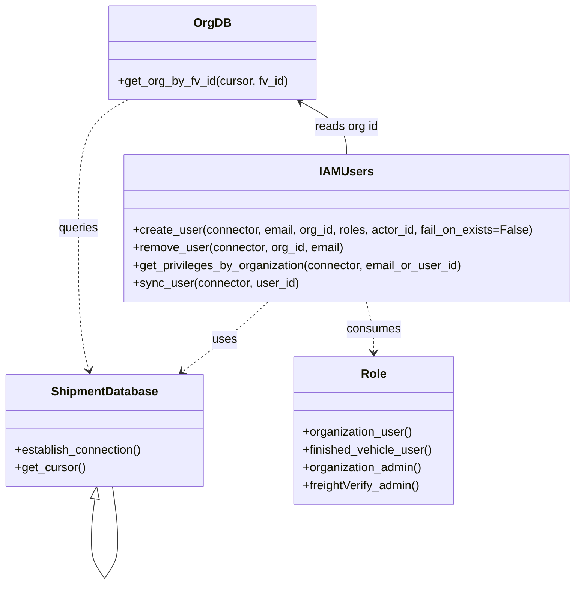

# Diagram: tools/ide_local_testing/localTest/test/user/createUser.py


> Auto-generated by Obscura crawlers

## Diagram 1



### SVG

<svg id="container" width="773.3359375" xmlns="http://www.w3.org/2000/svg" class="classDiagram" height="786.25" viewBox="0 0 773.3359375 786.25" role="graphics-document document" aria-roledescription="class"><style>#container{font-family:"trebuchet ms",verdana,arial,sans-serif;font-size:16px;fill:#333;}@keyframes edge-animation-frame{from{stroke-dashoffset:0;}}@keyframes dash{to{stroke-dashoffset:0;}}#container .edge-animation-slow{stroke-dasharray:9,5!important;stroke-dashoffset:900;animation:dash 50s linear infinite;stroke-linecap:round;}#container .edge-animation-fast{stroke-dasharray:9,5!important;stroke-dashoffset:900;animation:dash 20s linear infinite;stroke-linecap:round;}#container .error-icon{fill:#552222;}#container .error-text{fill:#552222;stroke:#552222;}#container .edge-thickness-normal{stroke-width:1px;}#container .edge-thickness-thick{stroke-width:3.5px;}#container .edge-pattern-solid{stroke-dasharray:0;}#container .edge-thickness-invisible{stroke-width:0;fill:none;}#container .edge-pattern-dashed{stroke-dasharray:3;}#container .edge-pattern-dotted{stroke-dasharray:2;}#container .marker{fill:#333333;stroke:#333333;}#container .marker.cross{stroke:#333333;}#container svg{font-family:"trebuchet ms",verdana,arial,sans-serif;font-size:16px;}#container p{margin:0;}#container g.classGroup text{fill:#9370DB;stroke:none;font-family:"trebuchet ms",verdana,arial,sans-serif;font-size:10px;}#container g.classGroup text .title{font-weight:bolder;}#container .nodeLabel,#container .edgeLabel{color:#131300;}#container .edgeLabel .label rect{fill:#ECECFF;}#container .label text{fill:#131300;}#container .labelBkg{background:#ECECFF;}#container .edgeLabel .label span{background:#ECECFF;}#container .classTitle{font-weight:bolder;}#container .node rect,#container .node circle,#container .node ellipse,#container .node polygon,#container .node path{fill:#ECECFF;stroke:#9370DB;stroke-width:1px;}#container .divider{stroke:#9370DB;stroke-width:1;}#container g.clickable{cursor:pointer;}#container g.classGroup rect{fill:#ECECFF;stroke:#9370DB;}#container g.classGroup line{stroke:#9370DB;stroke-width:1;}#container .classLabel .box{stroke:none;stroke-width:0;fill:#ECECFF;opacity:0.5;}#container .classLabel .label{fill:#9370DB;font-size:10px;}#container .relation{stroke:#333333;stroke-width:1;fill:none;}#container .dashed-line{stroke-dasharray:3;}#container .dotted-line{stroke-dasharray:1 2;}#container #compositionStart,#container .composition{fill:#333333!important;stroke:#333333!important;stroke-width:1;}#container #compositionEnd,#container .composition{fill:#333333!important;stroke:#333333!important;stroke-width:1;}#container #dependencyStart,#container .dependency{fill:#333333!important;stroke:#333333!important;stroke-width:1;}#container #dependencyStart,#container .dependency{fill:#333333!important;stroke:#333333!important;stroke-width:1;}#container #extensionStart,#container .extension{fill:transparent!important;stroke:#333333!important;stroke-width:1;}#container #extensionEnd,#container .extension{fill:transparent!important;stroke:#333333!important;stroke-width:1;}#container #aggregationStart,#container .aggregation{fill:transparent!important;stroke:#333333!important;stroke-width:1;}#container #aggregationEnd,#container .aggregation{fill:transparent!important;stroke:#333333!important;stroke-width:1;}#container #lollipopStart,#container .lollipop{fill:#ECECFF!important;stroke:#333333!important;stroke-width:1;}#container #lollipopEnd,#container .lollipop{fill:#ECECFF!important;stroke:#333333!important;stroke-width:1;}#container .edgeTerminals{font-size:11px;line-height:initial;}#container .classTitleText{text-anchor:middle;font-size:18px;fill:#333;}#container .label-icon{display:inline-block;height:1em;overflow:visible;vertical-align:-0.125em;}#container .node .label-icon path{fill:currentColor;stroke:revert;stroke-width:revert;}#container :root{--mermaid-font-family:"trebuchet ms",verdana,arial,sans-serif;}</style><g><defs><marker id="container_class-aggregationStart" class="marker aggregation class" refX="18" refY="7" markerWidth="190" markerHeight="240" orient="auto"><path d="M 18,7 L9,13 L1,7 L9,1 Z"></path></marker></defs><defs><marker id="container_class-aggregationEnd" class="marker aggregation class" refX="1" refY="7" markerWidth="20" markerHeight="28" orient="auto"><path d="M 18,7 L9,13 L1,7 L9,1 Z"></path></marker></defs><defs><marker id="container_class-extensionStart" class="marker extension class" refX="18" refY="7" markerWidth="190" markerHeight="240" orient="auto"><path d="M 1,7 L18,13 V 1 Z"></path></marker></defs><defs><marker id="container_class-extensionEnd" class="marker extension class" refX="1" refY="7" markerWidth="20" markerHeight="28" orient="auto"><path d="M 1,1 V 13 L18,7 Z"></path></marker></defs><defs><marker id="container_class-compositionStart" class="marker composition class" refX="18" refY="7" markerWidth="190" markerHeight="240" orient="auto"><path d="M 18,7 L9,13 L1,7 L9,1 Z"></path></marker></defs><defs><marker id="container_class-compositionEnd" class="marker composition class" refX="1" refY="7" markerWidth="20" markerHeight="28" orient="auto"><path d="M 18,7 L9,13 L1,7 L9,1 Z"></path></marker></defs><defs><marker id="container_class-dependencyStart" class="marker dependency class" refX="6" refY="7" markerWidth="190" markerHeight="240" orient="auto"><path d="M 5,7 L9,13 L1,7 L9,1 Z"></path></marker></defs><defs><marker id="container_class-dependencyEnd" class="marker dependency class" refX="13" refY="7" markerWidth="20" markerHeight="28" orient="auto"><path d="M 18,7 L9,13 L14,7 L9,1 Z"></path></marker></defs><defs><marker id="container_class-lollipopStart" class="marker lollipop class" refX="13" refY="7" markerWidth="190" markerHeight="240" orient="auto"><circle stroke="black" fill="transparent" cx="7" cy="7" r="6"></circle></marker></defs><defs><marker id="container_class-lollipopEnd" class="marker lollipop class" refX="1" refY="7" markerWidth="190" markerHeight="240" orient="auto"><circle stroke="black" fill="transparent" cx="7" cy="7" r="6"></circle></marker></defs><g class="root"><g class="clusters"></g><g class="edgePaths"><path d="M128.256,671.08L127.504,676.4C126.752,681.72,125.248,692.36,124.496,701.847C123.745,711.333,123.745,719.667,123.745,723.833L123.745,728" id="ShipmentDatabase-cyclic-special-1" class="edge-thickness-normal edge-pattern-solid relation" style=";;;" data-edge="true" data-et="edge" data-id="ShipmentDatabase-cyclic-special-1" data-points="W3sieCI6MTMwLjY2OTczMjg2MjY3NzksInkiOjY1NH0seyJ4IjoxMjMuNzQ0NTMxMjQ5NjI3NDcsInkiOjcwM30seyJ4IjoxMjMuNzQ0NTMxMjQ5NjI3NDcsInkiOjcyOH1d" marker-start="url(#container_class-extensionStart)"></path><path d="M123.745,728.1L123.745,732.267C123.745,736.433,123.745,744.767,126.66,753.1C129.575,761.433,135.405,769.767,138.32,773.933L141.235,778.1" id="ShipmentDatabase-cyclic-special-mid" class="edge-thickness-normal edge-pattern-solid relation" style=";;;" data-edge="true" data-et="edge" data-id="ShipmentDatabase-cyclic-special-mid" data-points="W3sieCI6MTIzLjc0NDUzMTI0OTYyNzQ3LCJ5Ijo3MjguMTAwMDAwMDAxNDkwMX0seyJ4IjoxMjMuNzQ0NTMxMjQ5NjI3NDcsInkiOjc1My4xMDAwMDAwMDE0OTAxfSx7IngiOjE0MS4yMzQ1NTEyMDk1NTg5LCJ5Ijo3NzguMTAwMDAwMDAxNDkwMX1d"></path><path d="M141.305,778.1L144.22,773.933C147.135,769.767,152.965,761.433,155.88,753.092C158.795,744.75,158.795,736.4,158.795,728.05C158.795,719.7,158.795,711.35,157.64,699.008C156.486,686.667,154.178,670.333,153.024,662.167L151.869,654" id="ShipmentDatabase-cyclic-special-2" class="edge-thickness-normal edge-pattern-solid relation" style=";;;" data-edge="true" data-et="edge" data-id="ShipmentDatabase-cyclic-special-2" data-points="W3sieCI6MTQxLjMwNDUxMTI5MDQ0MTEsInkiOjc3OC4xMDAwMDAwMDE0OTAxfSx7IngiOjE1OC43OTQ1MzEyNTAzNzI1MywieSI6NzUzLjEwMDAwMDAwMTQ5MDF9LHsieCI6MTU4Ljc5NDUzMTI1MDM3MjUzLCJ5Ijo3MjguMDUwMDAwMDAwNzQ1MX0seyJ4IjoxNTguNzk0NTMxMjUwMzcyNTMsInkiOjcwM30seyJ4IjoxNTEuODY5MzI5NjM3MzIyMSwieSI6NjU0fV0="></path><path d="M361.128,406L354.534,412.167C347.939,418.333,334.751,430.667,315.477,446.398C296.204,462.129,270.845,481.258,258.165,490.822L245.486,500.387" id="id_IAMUsers_ShipmentDatabase_2" class="edge-thickness-normal edge-pattern-dashed relation" style=";;;" data-edge="true" data-et="edge" data-id="id_IAMUsers_ShipmentDatabase_2" data-points="W3sieCI6MzYxLjEyNzkyOTY4NzUsInkiOjQwNn0seyJ4IjozMjEuNTYyNSwieSI6NDQzfSx7IngiOjI0MC42OTU4MDA3ODEyNSwieSI6NTA0fV0=" marker-end="url(#container_class-dependencyEnd)"></path><path d="M493.514,406L495.166,412.167C496.818,418.333,500.122,430.667,501.774,442C503.426,453.333,503.426,463.667,503.426,468.833L503.426,474" id="id_IAMUsers_Role_3" class="edge-thickness-normal edge-pattern-dashed relation" style=";;;" data-edge="true" data-et="edge" data-id="id_IAMUsers_Role_3" data-points="W3sieCI6NDkzLjUxMzcwMDU5NzQyNjQ2LCJ5Ijo0MDZ9LHsieCI6NTAzLjQyNTc4MTI1LCJ5Ijo0NDN9LHsieCI6NTAzLjQyNTc4MTI1LCJ5Ijo0ODB9XQ==" marker-end="url(#container_class-dependencyEnd)"></path><path d="M173.115,134L161.997,140.167C150.879,146.333,128.642,158.667,117.524,187.5C106.406,216.333,106.406,261.667,106.406,307C106.406,352.333,106.406,397.667,108.764,429.531C111.122,461.396,115.838,479.792,118.196,488.99L120.554,498.188" id="id_OrgDB_ShipmentDatabase_4" class="edge-thickness-normal edge-pattern-dashed relation" style=";;;" data-edge="true" data-et="edge" data-id="id_OrgDB_ShipmentDatabase_4" data-points="W3sieCI6MTczLjExNDY0ODQzNzUsInkiOjEzNH0seyJ4IjoxMDYuNDA2MjUsInkiOjE3MX0seyJ4IjoxMDYuNDA2MjUsInkiOjMwN30seyJ4IjoxMDYuNDA2MjUsInkiOjQ0M30seyJ4IjoxMjIuMDQzNDU3MDMxMjUsInkiOjUwNH1d" marker-end="url(#container_class-dependencyEnd)"></path><path d="M405.531,136.91L415.774,142.592C426.018,148.273,446.505,159.637,456.749,171.485C466.992,183.333,466.992,195.667,466.992,201.833L466.992,208" id="id_OrgDB_IAMUsers_5" class="edge-thickness-normal edge-pattern-solid relation" style=";;;" data-edge="true" data-et="edge" data-id="id_OrgDB_IAMUsers_5" data-points="W3sieCI6NDAwLjI4Mzc4OTA2MjUsInkiOjEzNH0seyJ4Ijo0NjYuOTkyMTg3NSwieSI6MTcxfSx7IngiOjQ2Ni45OTIxODc1LCJ5IjoyMDh9XQ==" marker-start="url(#container_class-dependencyStart)"></path></g><g class="edgeLabels"><g class="edgeLabel"><g class="label" data-id="ShipmentDatabase-cyclic-special-1" transform="translate(0, 0)"><foreignObject width="0" height="0"><div xmlns="http://www.w3.org/1999/xhtml" class="labelBkg" style="display: table-cell; white-space: nowrap; line-height: 1.5; max-width: 200px; text-align: center;"><span class="edgeLabel"></span></div></foreignObject></g></g><g class="edgeLabel"><g class="label" data-id="ShipmentDatabase-cyclic-special-mid" transform="translate(0, 0)"><foreignObject width="0" height="0"><div xmlns="http://www.w3.org/1999/xhtml" class="labelBkg" style="display: table-cell; white-space: nowrap; line-height: 1.5; max-width: 200px; text-align: center;"><span class="edgeLabel"></span></div></foreignObject></g></g><g class="edgeLabel"><g class="label" data-id="ShipmentDatabase-cyclic-special-2" transform="translate(0, 0)"><foreignObject width="0" height="0"><div xmlns="http://www.w3.org/1999/xhtml" class="labelBkg" style="display: table-cell; white-space: nowrap; line-height: 1.5; max-width: 200px; text-align: center;"><span class="edgeLabel"></span></div></foreignObject></g></g><g class="edgeLabel" transform="translate(302.75228, 457.18908)"><g class="label" data-id="id_IAMUsers_ShipmentDatabase_2" transform="translate(-16.4921875, -12)"><foreignObject width="32.984375" height="24"><div xmlns="http://www.w3.org/1999/xhtml" class="labelBkg" style="display: table-cell; white-space: nowrap; line-height: 1.5; max-width: 200px; text-align: center;"><span class="edgeLabel"><p>uses</p></span></div></foreignObject></g></g><g class="edgeLabel" transform="translate(503.42578125, 443)"><g class="label" data-id="id_IAMUsers_Role_3" transform="translate(-36.375, -12)"><foreignObject width="72.75" height="24"><div xmlns="http://www.w3.org/1999/xhtml" class="labelBkg" style="display: table-cell; white-space: nowrap; line-height: 1.5; max-width: 200px; text-align: center;"><span class="edgeLabel"><p>consumes</p></span></div></foreignObject></g></g><g class="edgeLabel" transform="translate(106.40625, 307)"><g class="label" data-id="id_OrgDB_ShipmentDatabase_4" transform="translate(-27.2421875, -12)"><foreignObject width="54.484375" height="24"><div xmlns="http://www.w3.org/1999/xhtml" class="labelBkg" style="display: table-cell; white-space: nowrap; line-height: 1.5; max-width: 200px; text-align: center;"><span class="edgeLabel"><p>queries</p></span></div></foreignObject></g></g><g class="edgeLabel" transform="translate(466.9921875, 171)"><g class="label" data-id="id_OrgDB_IAMUsers_5" transform="translate(-43.0859375, -12)"><foreignObject width="86.171875" height="24"><div xmlns="http://www.w3.org/1999/xhtml" class="labelBkg" style="display: table-cell; white-space: nowrap; line-height: 1.5; max-width: 200px; text-align: center;"><span class="edgeLabel"><p>reads org id</p></span></div></foreignObject></g></g></g><g class="nodes"><g class="node default" id="classId-ShipmentDatabase-0" transform="translate(141.26953125, 579)"><g class="basic label-container"><path d="M-133.26953125 -75 L133.26953125 -75 L133.26953125 75 L-133.26953125 75" stroke="none" stroke-width="0" fill="#ECECFF" style=""></path><path d="M-133.26953125 -75 C-71.09289883201475 -75, -8.916266414029494 -75, 133.26953125 -75 M-133.26953125 -75 C-28.63366892101591 -75, 76.00219340796818 -75, 133.26953125 -75 M133.26953125 -75 C133.26953125 -19.0092457160333, 133.26953125 36.9815085679334, 133.26953125 75 M133.26953125 -75 C133.26953125 -29.11554722491175, 133.26953125 16.7689055501765, 133.26953125 75 M133.26953125 75 C46.17788787203142 75, -40.91375550593716 75, -133.26953125 75 M133.26953125 75 C71.84719126996859 75, 10.424851289937166 75, -133.26953125 75 M-133.26953125 75 C-133.26953125 26.720499827412333, -133.26953125 -21.559000345175335, -133.26953125 -75 M-133.26953125 75 C-133.26953125 33.53090123600543, -133.26953125 -7.938197527989146, -133.26953125 -75" stroke="#9370DB" stroke-width="1.3" fill="none" stroke-dasharray="0 0" style=""></path></g><g class="annotation-group text" transform="translate(0, -51)"></g><g class="label-group text" transform="translate(-69.2734375, -51)"><g class="label" style="font-weight: bolder" transform="translate(0,-12)"><foreignObject width="138.546875" height="24"><div xmlns="http://www.w3.org/1999/xhtml" style="display: table-cell; white-space: nowrap; line-height: 1.5; max-width: 187px; text-align: center;"><span class="nodeLabel markdown-node-label" style=""><p>ShipmentDatabase</p></span></div></foreignObject></g></g><g class="members-group text" transform="translate(-121.26953125, -3)"></g><g class="methods-group text" transform="translate(-121.26953125, 27)"><g class="label" style="" transform="translate(0,-12)"><foreignObject width="173.265625" height="24"><div xmlns="http://www.w3.org/1999/xhtml" style="display: table-cell; white-space: nowrap; line-height: 1.5; max-width: 231px; text-align: center;"><span class="nodeLabel markdown-node-label" style=""><p>+establish_connection()</p></span></div></foreignObject></g><g class="label" style="" transform="translate(0,12)"><foreignObject width="94.640625" height="24"><div xmlns="http://www.w3.org/1999/xhtml" style="display: table-cell; white-space: nowrap; line-height: 1.5; max-width: 152px; text-align: center;"><span class="nodeLabel markdown-node-label" style=""><p>+get_cursor()</p></span></div></foreignObject></g></g><g class="divider" style=""><path d="M-133.26953125 -27 C-74.42291474687875 -27, -15.576298243757478 -27, 133.26953125 -27 M-133.26953125 -27 C-45.15220974842077 -27, 42.96511175315845 -27, 133.26953125 -27" stroke="#9370DB" stroke-width="1.3" fill="none" stroke-dasharray="0 0" style=""></path></g><g class="divider" style=""><path d="M-133.26953125 -3 C-52.849500943234744 -3, 27.57052936353051 -3, 133.26953125 -3 M-133.26953125 -3 C-41.66748526037331 -3, 49.93456072925338 -3, 133.26953125 -3" stroke="#9370DB" stroke-width="1.3" fill="none" stroke-dasharray="0 0" style=""></path></g></g><g class="node default" id="classId-Role-1" transform="translate(503.42578125, 579)"><g class="basic label-container"><path d="M-107.58984375 -99 L107.58984375 -99 L107.58984375 99 L-107.58984375 99" stroke="none" stroke-width="0" fill="#ECECFF" style=""></path><path d="M-107.58984375 -99 C-24.898051631340934 -99, 57.79374048731813 -99, 107.58984375 -99 M-107.58984375 -99 C-49.65629458280158 -99, 8.277254584396843 -99, 107.58984375 -99 M107.58984375 -99 C107.58984375 -24.42120730587952, 107.58984375 50.15758538824096, 107.58984375 99 M107.58984375 -99 C107.58984375 -34.040797216328286, 107.58984375 30.918405567343427, 107.58984375 99 M107.58984375 99 C63.58284668582794 99, 19.575849621655877 99, -107.58984375 99 M107.58984375 99 C62.74753280355807 99, 17.905221857116146 99, -107.58984375 99 M-107.58984375 99 C-107.58984375 40.065411283472834, -107.58984375 -18.869177433054332, -107.58984375 -99 M-107.58984375 99 C-107.58984375 35.29765120858643, -107.58984375 -28.40469758282714, -107.58984375 -99" stroke="#9370DB" stroke-width="1.3" fill="none" stroke-dasharray="0 0" style=""></path></g><g class="annotation-group text" transform="translate(0, -75)"></g><g class="label-group text" transform="translate(-16.2421875, -75)"><g class="label" style="font-weight: bolder" transform="translate(0,-12)"><foreignObject width="32.484375" height="24"><div xmlns="http://www.w3.org/1999/xhtml" style="display: table-cell; white-space: nowrap; line-height: 1.5; max-width: 82px; text-align: center;"><span class="nodeLabel markdown-node-label" style=""><p>Role</p></span></div></foreignObject></g></g><g class="members-group text" transform="translate(-95.58984375, -27)"></g><g class="methods-group text" transform="translate(-95.58984375, 3)"><g class="label" style="" transform="translate(0,-12)"><foreignObject width="148.390625" height="24"><div xmlns="http://www.w3.org/1999/xhtml" style="display: table-cell; white-space: nowrap; line-height: 1.5; max-width: 206px; text-align: center;"><span class="nodeLabel markdown-node-label" style=""><p>+organization_user()</p></span></div></foreignObject></g><g class="label" style="" transform="translate(0,12)"><foreignObject width="174.9375" height="24"><div xmlns="http://www.w3.org/1999/xhtml" style="display: table-cell; white-space: nowrap; line-height: 1.5; max-width: 232px; text-align: center;"><span class="nodeLabel markdown-node-label" style=""><p>+finished_vehicle_user()</p></span></div></foreignObject></g><g class="label" style="" transform="translate(0,36)"><foreignObject width="162.578125" height="24"><div xmlns="http://www.w3.org/1999/xhtml" style="display: table-cell; white-space: nowrap; line-height: 1.5; max-width: 220px; text-align: center;"><span class="nodeLabel markdown-node-label" style=""><p>+organization_admin()</p></span></div></foreignObject></g><g class="label" style="" transform="translate(0,60)"><foreignObject width="160.40625" height="24"><div xmlns="http://www.w3.org/1999/xhtml" style="display: table-cell; white-space: nowrap; line-height: 1.5; max-width: 218px; text-align: center;"><span class="nodeLabel markdown-node-label" style=""><p>+freightVerify_admin()</p></span></div></foreignObject></g></g><g class="divider" style=""><path d="M-107.58984375 -51 C-61.77171673780559 -51, -15.953589725611181 -51, 107.58984375 -51 M-107.58984375 -51 C-25.687189913550696 -51, 56.21546392289861 -51, 107.58984375 -51" stroke="#9370DB" stroke-width="1.3" fill="none" stroke-dasharray="0 0" style=""></path></g><g class="divider" style=""><path d="M-107.58984375 -27 C-40.81256656967341 -27, 25.964710610653185 -27, 107.58984375 -27 M-107.58984375 -27 C-38.36894166240832 -27, 30.851960425183364 -27, 107.58984375 -27" stroke="#9370DB" stroke-width="1.3" fill="none" stroke-dasharray="0 0" style=""></path></g></g><g class="node default" id="classId-IAMUsers-2" transform="translate(466.9921875, 307)"><g class="basic label-container"><path d="M-298.34375 -99 L298.34375 -99 L298.34375 99 L-298.34375 99" stroke="none" stroke-width="0" fill="#ECECFF" style=""></path><path d="M-298.34375 -99 C-136.43712732339355 -99, 25.469495353212892 -99, 298.34375 -99 M-298.34375 -99 C-91.66695652714611 -99, 115.00983694570778 -99, 298.34375 -99 M298.34375 -99 C298.34375 -56.03325998548516, 298.34375 -13.066519970970319, 298.34375 99 M298.34375 -99 C298.34375 -24.78182021050594, 298.34375 49.43635957898812, 298.34375 99 M298.34375 99 C65.33383031856198 99, -167.67608936287604 99, -298.34375 99 M298.34375 99 C82.72843649090166 99, -132.88687701819669 99, -298.34375 99 M-298.34375 99 C-298.34375 41.25430612823051, -298.34375 -16.49138774353898, -298.34375 -99 M-298.34375 99 C-298.34375 49.04366150438026, -298.34375 -0.9126769912394792, -298.34375 -99" stroke="#9370DB" stroke-width="1.3" fill="none" stroke-dasharray="0 0" style=""></path></g><g class="annotation-group text" transform="translate(0, -75)"></g><g class="label-group text" transform="translate(-33.78125, -75)"><g class="label" style="font-weight: bolder" transform="translate(0,-12)"><foreignObject width="67.5625" height="24"><div xmlns="http://www.w3.org/1999/xhtml" style="display: table-cell; white-space: nowrap; line-height: 1.5; max-width: 116px; text-align: center;"><span class="nodeLabel markdown-node-label" style=""><p>IAMUsers</p></span></div></foreignObject></g></g><g class="members-group text" transform="translate(-286.34375, -27)"></g><g class="methods-group text" transform="translate(-286.34375, 3)"><g class="label" style="" transform="translate(0,-12)"><foreignObject width="538.90625" height="24"><div xmlns="http://www.w3.org/1999/xhtml" style="display: table-cell; white-space: nowrap; line-height: 1.5; max-width: 596px; text-align: center;"><span class="nodeLabel markdown-node-label" style=""><p>+create_user(connector, email, org_id, roles, actor_id, fail_on_exists=False)</p></span></div></foreignObject></g><g class="label" style="" transform="translate(0,12)"><foreignObject width="285.78125" height="24"><div xmlns="http://www.w3.org/1999/xhtml" style="display: table-cell; white-space: nowrap; line-height: 1.5; max-width: 343px; text-align: center;"><span class="nodeLabel markdown-node-label" style=""><p>+remove_user(connector, org_id, email)</p></span></div></foreignObject></g><g class="label" style="" transform="translate(0,36)"><foreignObject width="445.609375" height="24"><div xmlns="http://www.w3.org/1999/xhtml" style="display: table-cell; white-space: nowrap; line-height: 1.5; max-width: 503px; text-align: center;"><span class="nodeLabel markdown-node-label" style=""><p>+get_privileges_by_organization(connector, email_or_user_id)</p></span></div></foreignObject></g><g class="label" style="" transform="translate(0,60)"><foreignObject width="222.578125" height="24"><div xmlns="http://www.w3.org/1999/xhtml" style="display: table-cell; white-space: nowrap; line-height: 1.5; max-width: 280px; text-align: center;"><span class="nodeLabel markdown-node-label" style=""><p>+sync_user(connector, user_id)</p></span></div></foreignObject></g></g><g class="divider" style=""><path d="M-298.34375 -51 C-73.26360994100474 -51, 151.8165301179905 -51, 298.34375 -51 M-298.34375 -51 C-160.12652141690438 -51, -21.909292833808763 -51, 298.34375 -51" stroke="#9370DB" stroke-width="1.3" fill="none" stroke-dasharray="0 0" style=""></path></g><g class="divider" style=""><path d="M-298.34375 -27 C-68.05981342663367 -27, 162.22412314673267 -27, 298.34375 -27 M-298.34375 -27 C-125.43833920107264 -27, 47.467071597854726 -27, 298.34375 -27" stroke="#9370DB" stroke-width="1.3" fill="none" stroke-dasharray="0 0" style=""></path></g></g><g class="node default" id="classId-OrgDB-3" transform="translate(286.69921875, 71)"><g class="basic label-container"><path d="M-137.87890625 -63 L137.87890625 -63 L137.87890625 63 L-137.87890625 63" stroke="none" stroke-width="0" fill="#ECECFF" style=""></path><path d="M-137.87890625 -63 C-55.97578719622858 -63, 25.92733185754284 -63, 137.87890625 -63 M-137.87890625 -63 C-69.0363574355964 -63, -0.19380862119280096 -63, 137.87890625 -63 M137.87890625 -63 C137.87890625 -28.920661745186358, 137.87890625 5.158676509627284, 137.87890625 63 M137.87890625 -63 C137.87890625 -12.952924721518052, 137.87890625 37.094150556963896, 137.87890625 63 M137.87890625 63 C77.93066731444159 63, 17.9824283788832 63, -137.87890625 63 M137.87890625 63 C79.96672001137566 63, 22.054533772751313 63, -137.87890625 63 M-137.87890625 63 C-137.87890625 24.85398774826924, -137.87890625 -13.29202450346152, -137.87890625 -63 M-137.87890625 63 C-137.87890625 13.801992930243102, -137.87890625 -35.396014139513795, -137.87890625 -63" stroke="#9370DB" stroke-width="1.3" fill="none" stroke-dasharray="0 0" style=""></path></g><g class="annotation-group text" transform="translate(0, -39)"></g><g class="label-group text" transform="translate(-23.1953125, -39)"><g class="label" style="font-weight: bolder" transform="translate(0,-12)"><foreignObject width="46.390625" height="24"><div xmlns="http://www.w3.org/1999/xhtml" style="display: table-cell; white-space: nowrap; line-height: 1.5; max-width: 96px; text-align: center;"><span class="nodeLabel markdown-node-label" style=""><p>OrgDB</p></span></div></foreignObject></g></g><g class="members-group text" transform="translate(-125.87890625, 9)"></g><g class="methods-group text" transform="translate(-125.87890625, 39)"><g class="label" style="" transform="translate(0,-12)"><foreignObject width="228.5625" height="24"><div xmlns="http://www.w3.org/1999/xhtml" style="display: table-cell; white-space: nowrap; line-height: 1.5; max-width: 286px; text-align: center;"><span class="nodeLabel markdown-node-label" style=""><p>+get_org_by_fv_id(cursor, fv_id)</p></span></div></foreignObject></g></g><g class="divider" style=""><path d="M-137.87890625 -15 C-79.691514181688 -15, -21.504122113376013 -15, 137.87890625 -15 M-137.87890625 -15 C-45.27631478823757 -15, 47.32627667352486 -15, 137.87890625 -15" stroke="#9370DB" stroke-width="1.3" fill="none" stroke-dasharray="0 0" style=""></path></g><g class="divider" style=""><path d="M-137.87890625 9 C-29.428005091100673 9, 79.02289606779865 9, 137.87890625 9 M-137.87890625 9 C-31.150429453074224 9, 75.57804734385155 9, 137.87890625 9" stroke="#9370DB" stroke-width="1.3" fill="none" stroke-dasharray="0 0" style=""></path></g></g><g class="label edgeLabel" id="ShipmentDatabase---ShipmentDatabase---1" transform="translate(123.74453124962747, 728.0500000007451)"><rect width="0.1" height="0.1"></rect><g class="label" style="" transform="translate(0, 0)"><rect></rect><foreignObject width="0" height="0"><div xmlns="http://www.w3.org/1999/xhtml" style="display: table-cell; white-space: nowrap; line-height: 1.5; max-width: 10px; text-align: center;"><span class="nodeLabel"></span></div></foreignObject></g></g><g class="label edgeLabel" id="ShipmentDatabase---ShipmentDatabase---2" transform="translate(141.26953125, 778.1500000022352)"><rect width="0.1" height="0.1"></rect><g class="label" style="" transform="translate(0, 0)"><rect></rect><foreignObject width="0" height="0"><div xmlns="http://www.w3.org/1999/xhtml" style="display: table-cell; white-space: nowrap; line-height: 1.5; max-width: 10px; text-align: center;"><span class="nodeLabel"></span></div></foreignObject></g></g></g></g></g></svg>

## Diagram 2

```mermaid
flowchart TD
    Start([Start])
    Conn[Create ShipmentDatabase("createUsers.test")]
    Connect[establish_connection()]
    GetOrg[get_org_by_fv_id(cursor,"FV001") -> fv_organization_id]
    CheckRemove{remove_user(userEmail) exists?}
    Remove[remove_user(connector, freightVerify_organization_id, email)]
    Create1[create_user(connector, userEmail, freightVerify_organization_id, roles, actor_id)]
    GetPriv1[get_privileges_by_organization(connector, email=userEmail)]
    GetPriv2[get_privileges_by_organization(connector, email="alligator.shoes@mailinator.com")]
    Sync[sync_user(connector, user_id)]
    CreateConflict{create_user same email in org -> Conflict?}
    ConflictHandler[handle ConflictError -> print message]
    CreateOther[create_user(connector, test_shipper_organization_id, roles, actor_id)]
    RemoveFromTest[remove_user(connector, test_shipper_organization_id, email)]
    RecreateTest[create_user(connector, test_shipper_organization_id, roles, actor_id)]
    AppMeta[get_privileges_by_organization(connector, user_id) -> app_metadata]
    FinalCreate[create_user(connector, userEmail, organization_id, admin & roles, actor_id, fail_on_exists=True)]
    End([End])

    Start --> Conn --> Connect --> GetOrg --> CheckRemove
    CheckRemove -- exists --> Remove --> Create1
    CheckRemove -- not exists --> Create1
    Create1 --> GetPriv1 --> GetPriv2 --> Sync
    Sync --> CreateConflict
    CreateConflict -- ConflictError --> ConflictHandler --> CreateOther
    CreateConflict -- success --> RemoveFromTest
    CreateOther -- ConflictError --> RemoveFromTest --> RecreateTest
    RecreateTest --> AppMeta --> FinalCreate
    FinalCreate -- ConflictError --> ConflictHandler --> End
    FinalCreate -- success --> End
```

> SVG rendering failed for this diagram.
