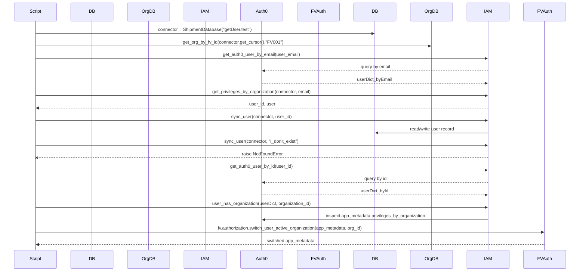
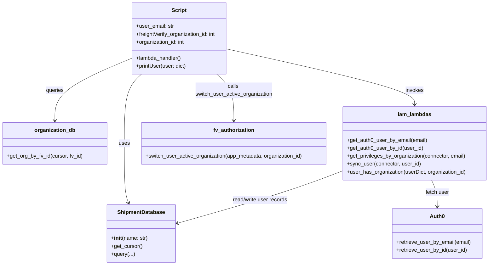

# Diagram: tools/ide_local_testing/localTest/test/user/getUserWithSync.py

> Auto-generated by Obscura crawlers

## Diagram 1

### SVG

<svg id="container" width="2050" xmlns="http://www.w3.org/2000/svg" height="1035" viewBox="-50 -10 2050 1035" role="graphics-document document" aria-roledescription="sequence"><g><rect x="1800" y="949" fill="#eaeaea" stroke="#666" width="150" height="65" name="FVAuth" rx="3" ry="3" class="actor actor-bottom"></rect><text x="1875" y="981.5" dominant-baseline="central" alignment-baseline="central" class="actor actor-box" style="text-anchor: middle; font-size: 16px; font-weight: 400;"><tspan x="1875" dy="0">FVAuth</tspan></text></g><g><rect x="1600" y="949" fill="#eaeaea" stroke="#666" width="150" height="65" name="IAM" rx="3" ry="3" class="actor actor-bottom"></rect><text x="1675" y="981.5" dominant-baseline="central" alignment-baseline="central" class="actor actor-box" style="text-anchor: middle; font-size: 16px; font-weight: 400;"><tspan x="1675" dy="0">IAM</tspan></text></g><g><rect x="1400" y="949" fill="#eaeaea" stroke="#666" width="150" height="65" name="OrgDB" rx="3" ry="3" class="actor actor-bottom"></rect><text x="1475" y="981.5" dominant-baseline="central" alignment-baseline="central" class="actor actor-box" style="text-anchor: middle; font-size: 16px; font-weight: 400;"><tspan x="1475" dy="0">OrgDB</tspan></text></g><g><rect x="1200" y="949" fill="#eaeaea" stroke="#666" width="150" height="65" name="DB" rx="3" ry="3" class="actor actor-bottom"></rect><text x="1275" y="981.5" dominant-baseline="central" alignment-baseline="central" class="actor actor-box" style="text-anchor: middle; font-size: 16px; font-weight: 400;"><tspan x="1275" dy="0">DB</tspan></text></g><g><rect x="1000" y="949" fill="#eaeaea" stroke="#666" width="150" height="65" name="FV_Authorization" rx="3" ry="3" class="actor actor-bottom"></rect><text x="1075" y="981.5" dominant-baseline="central" alignment-baseline="central" class="actor actor-box" style="text-anchor: middle; font-size: 16px; font-weight: 400;"><tspan x="1075" dy="0">FVAuth</tspan></text></g><g><rect x="800" y="949" fill="#eaeaea" stroke="#666" width="150" height="65" name="Auth0" rx="3" ry="3" class="actor actor-bottom"></rect><text x="875" y="981.5" dominant-baseline="central" alignment-baseline="central" class="actor actor-box" style="text-anchor: middle; font-size: 16px; font-weight: 400;"><tspan x="875" dy="0">Auth0</tspan></text></g><g><rect x="600" y="949" fill="#eaeaea" stroke="#666" width="150" height="65" name="IAM_Lambdas" rx="3" ry="3" class="actor actor-bottom"></rect><text x="675" y="981.5" dominant-baseline="central" alignment-baseline="central" class="actor actor-box" style="text-anchor: middle; font-size: 16px; font-weight: 400;"><tspan x="675" dy="0">IAM</tspan></text></g><g><rect x="400" y="949" fill="#eaeaea" stroke="#666" width="150" height="65" name="OrganizationDB" rx="3" ry="3" class="actor actor-bottom"></rect><text x="475" y="981.5" dominant-baseline="central" alignment-baseline="central" class="actor actor-box" style="text-anchor: middle; font-size: 16px; font-weight: 400;"><tspan x="475" dy="0">OrgDB</tspan></text></g><g><rect x="200" y="949" fill="#eaeaea" stroke="#666" width="150" height="65" name="ShipmentDatabase" rx="3" ry="3" class="actor actor-bottom"></rect><text x="275" y="981.5" dominant-baseline="central" alignment-baseline="central" class="actor actor-box" style="text-anchor: middle; font-size: 16px; font-weight: 400;"><tspan x="275" dy="0">DB</tspan></text></g><g><rect x="0" y="949" fill="#eaeaea" stroke="#666" width="150" height="65" name="Script" rx="3" ry="3" class="actor actor-bottom"></rect><text x="75" y="981.5" dominant-baseline="central" alignment-baseline="central" class="actor actor-box" style="text-anchor: middle; font-size: 16px; font-weight: 400;"><tspan x="75" dy="0">Script</tspan></text></g><g><line id="actor9" x1="1875" y1="65" x2="1875" y2="949" class="actor-line 200" stroke-width="0.5px" stroke="#999" name="FVAuth"></line><g id="root-9"><rect x="1800" y="0" fill="#eaeaea" stroke="#666" width="150" height="65" name="FVAuth" rx="3" ry="3" class="actor actor-top"></rect><text x="1875" y="32.5" dominant-baseline="central" alignment-baseline="central" class="actor actor-box" style="text-anchor: middle; font-size: 16px; font-weight: 400;"><tspan x="1875" dy="0">FVAuth</tspan></text></g></g><g><line id="actor8" x1="1675" y1="65" x2="1675" y2="949" class="actor-line 200" stroke-width="0.5px" stroke="#999" name="IAM"></line><g id="root-8"><rect x="1600" y="0" fill="#eaeaea" stroke="#666" width="150" height="65" name="IAM" rx="3" ry="3" class="actor actor-top"></rect><text x="1675" y="32.5" dominant-baseline="central" alignment-baseline="central" class="actor actor-box" style="text-anchor: middle; font-size: 16px; font-weight: 400;"><tspan x="1675" dy="0">IAM</tspan></text></g></g><g><line id="actor7" x1="1475" y1="65" x2="1475" y2="949" class="actor-line 200" stroke-width="0.5px" stroke="#999" name="OrgDB"></line><g id="root-7"><rect x="1400" y="0" fill="#eaeaea" stroke="#666" width="150" height="65" name="OrgDB" rx="3" ry="3" class="actor actor-top"></rect><text x="1475" y="32.5" dominant-baseline="central" alignment-baseline="central" class="actor actor-box" style="text-anchor: middle; font-size: 16px; font-weight: 400;"><tspan x="1475" dy="0">OrgDB</tspan></text></g></g><g><line id="actor6" x1="1275" y1="65" x2="1275" y2="949" class="actor-line 200" stroke-width="0.5px" stroke="#999" name="DB"></line><g id="root-6"><rect x="1200" y="0" fill="#eaeaea" stroke="#666" width="150" height="65" name="DB" rx="3" ry="3" class="actor actor-top"></rect><text x="1275" y="32.5" dominant-baseline="central" alignment-baseline="central" class="actor actor-box" style="text-anchor: middle; font-size: 16px; font-weight: 400;"><tspan x="1275" dy="0">DB</tspan></text></g></g><g><line id="actor5" x1="1075" y1="65" x2="1075" y2="949" class="actor-line 200" stroke-width="0.5px" stroke="#999" name="FV_Authorization"></line><g id="root-5"><rect x="1000" y="0" fill="#eaeaea" stroke="#666" width="150" height="65" name="FV_Authorization" rx="3" ry="3" class="actor actor-top"></rect><text x="1075" y="32.5" dominant-baseline="central" alignment-baseline="central" class="actor actor-box" style="text-anchor: middle; font-size: 16px; font-weight: 400;"><tspan x="1075" dy="0">FVAuth</tspan></text></g></g><g><line id="actor4" x1="875" y1="65" x2="875" y2="949" class="actor-line 200" stroke-width="0.5px" stroke="#999" name="Auth0"></line><g id="root-4"><rect x="800" y="0" fill="#eaeaea" stroke="#666" width="150" height="65" name="Auth0" rx="3" ry="3" class="actor actor-top"></rect><text x="875" y="32.5" dominant-baseline="central" alignment-baseline="central" class="actor actor-box" style="text-anchor: middle; font-size: 16px; font-weight: 400;"><tspan x="875" dy="0">Auth0</tspan></text></g></g><g><line id="actor3" x1="675" y1="65" x2="675" y2="949" class="actor-line 200" stroke-width="0.5px" stroke="#999" name="IAM_Lambdas"></line><g id="root-3"><rect x="600" y="0" fill="#eaeaea" stroke="#666" width="150" height="65" name="IAM_Lambdas" rx="3" ry="3" class="actor actor-top"></rect><text x="675" y="32.5" dominant-baseline="central" alignment-baseline="central" class="actor actor-box" style="text-anchor: middle; font-size: 16px; font-weight: 400;"><tspan x="675" dy="0">IAM</tspan></text></g></g><g><line id="actor2" x1="475" y1="65" x2="475" y2="949" class="actor-line 200" stroke-width="0.5px" stroke="#999" name="OrganizationDB"></line><g id="root-2"><rect x="400" y="0" fill="#eaeaea" stroke="#666" width="150" height="65" name="OrganizationDB" rx="3" ry="3" class="actor actor-top"></rect><text x="475" y="32.5" dominant-baseline="central" alignment-baseline="central" class="actor actor-box" style="text-anchor: middle; font-size: 16px; font-weight: 400;"><tspan x="475" dy="0">OrgDB</tspan></text></g></g><g><line id="actor1" x1="275" y1="65" x2="275" y2="949" class="actor-line 200" stroke-width="0.5px" stroke="#999" name="ShipmentDatabase"></line><g id="root-1"><rect x="200" y="0" fill="#eaeaea" stroke="#666" width="150" height="65" name="ShipmentDatabase" rx="3" ry="3" class="actor actor-top"></rect><text x="275" y="32.5" dominant-baseline="central" alignment-baseline="central" class="actor actor-box" style="text-anchor: middle; font-size: 16px; font-weight: 400;"><tspan x="275" dy="0">DB</tspan></text></g></g><g><line id="actor0" x1="75" y1="65" x2="75" y2="949" class="actor-line 200" stroke-width="0.5px" stroke="#999" name="Script"></line><g id="root-0"><rect x="0" y="0" fill="#eaeaea" stroke="#666" width="150" height="65" name="Script" rx="3" ry="3" class="actor actor-top"></rect><text x="75" y="32.5" dominant-baseline="central" alignment-baseline="central" class="actor actor-box" style="text-anchor: middle; font-size: 16px; font-weight: 400;"><tspan x="75" dy="0">Script</tspan></text></g></g><g></g><defs><symbol id="computer" width="24" height="24"><path transform="scale(.5)" d="M2 2v13h20v-13h-20zm18 11h-16v-9h16v9zm-10.228 6l.466-1h3.524l.467 1h-4.457zm14.228 3h-24l2-6h2.104l-1.33 4h18.45l-1.297-4h2.073l2 6zm-5-10h-14v-7h14v7z"></path></symbol></defs><defs><symbol id="database" fill-rule="evenodd" clip-rule="evenodd"><path transform="scale(.5)" d="M12.258.001l.256.004.255.005.253.008.251.01.249.012.247.015.246.016.242.019.241.02.239.023.236.024.233.027.231.028.229.031.225.032.223.034.22.036.217.038.214.04.211.041.208.043.205.045.201.046.198.048.194.05.191.051.187.053.183.054.18.056.175.057.172.059.168.06.163.061.16.063.155.064.15.066.074.033.073.033.071.034.07.034.069.035.068.035.067.035.066.035.064.036.064.036.062.036.06.036.06.037.058.037.058.037.055.038.055.038.053.038.052.038.051.039.05.039.048.039.047.039.045.04.044.04.043.04.041.04.04.041.039.041.037.041.036.041.034.041.033.042.032.042.03.042.029.042.027.042.026.043.024.043.023.043.021.043.02.043.018.044.017.043.015.044.013.044.012.044.011.045.009.044.007.045.006.045.004.045.002.045.001.045v17l-.001.045-.002.045-.004.045-.006.045-.007.045-.009.044-.011.045-.012.044-.013.044-.015.044-.017.043-.018.044-.02.043-.021.043-.023.043-.024.043-.026.043-.027.042-.029.042-.03.042-.032.042-.033.042-.034.041-.036.041-.037.041-.039.041-.04.041-.041.04-.043.04-.044.04-.045.04-.047.039-.048.039-.05.039-.051.039-.052.038-.053.038-.055.038-.055.038-.058.037-.058.037-.06.037-.06.036-.062.036-.064.036-.064.036-.066.035-.067.035-.068.035-.069.035-.07.034-.071.034-.073.033-.074.033-.15.066-.155.064-.16.063-.163.061-.168.06-.172.059-.175.057-.18.056-.183.054-.187.053-.191.051-.194.05-.198.048-.201.046-.205.045-.208.043-.211.041-.214.04-.217.038-.22.036-.223.034-.225.032-.229.031-.231.028-.233.027-.236.024-.239.023-.241.02-.242.019-.246.016-.247.015-.249.012-.251.01-.253.008-.255.005-.256.004-.258.001-.258-.001-.256-.004-.255-.005-.253-.008-.251-.01-.249-.012-.247-.015-.245-.016-.243-.019-.241-.02-.238-.023-.236-.024-.234-.027-.231-.028-.228-.031-.226-.032-.223-.034-.22-.036-.217-.038-.214-.04-.211-.041-.208-.043-.204-.045-.201-.046-.198-.048-.195-.05-.19-.051-.187-.053-.184-.054-.179-.056-.176-.057-.172-.059-.167-.06-.164-.061-.159-.063-.155-.064-.151-.066-.074-.033-.072-.033-.072-.034-.07-.034-.069-.035-.068-.035-.067-.035-.066-.035-.064-.036-.063-.036-.062-.036-.061-.036-.06-.037-.058-.037-.057-.037-.056-.038-.055-.038-.053-.038-.052-.038-.051-.039-.049-.039-.049-.039-.046-.039-.046-.04-.044-.04-.043-.04-.041-.04-.04-.041-.039-.041-.037-.041-.036-.041-.034-.041-.033-.042-.032-.042-.03-.042-.029-.042-.027-.042-.026-.043-.024-.043-.023-.043-.021-.043-.02-.043-.018-.044-.017-.043-.015-.044-.013-.044-.012-.044-.011-.045-.009-.044-.007-.045-.006-.045-.004-.045-.002-.045-.001-.045v-17l.001-.045.002-.045.004-.045.006-.045.007-.045.009-.044.011-.045.012-.044.013-.044.015-.044.017-.043.018-.044.02-.043.021-.043.023-.043.024-.043.026-.043.027-.042.029-.042.03-.042.032-.042.033-.042.034-.041.036-.041.037-.041.039-.041.04-.041.041-.04.043-.04.044-.04.046-.04.046-.039.049-.039.049-.039.051-.039.052-.038.053-.038.055-.038.056-.038.057-.037.058-.037.06-.037.061-.036.062-.036.063-.036.064-.036.066-.035.067-.035.068-.035.069-.035.07-.034.072-.034.072-.033.074-.033.151-.066.155-.064.159-.063.164-.061.167-.06.172-.059.176-.057.179-.056.184-.054.187-.053.19-.051.195-.05.198-.048.201-.046.204-.045.208-.043.211-.041.214-.04.217-.038.22-.036.223-.034.226-.032.228-.031.231-.028.234-.027.236-.024.238-.023.241-.02.243-.019.245-.016.247-.015.249-.012.251-.01.253-.008.255-.005.256-.004.258-.001.258.001zm-9.258 20.499v.01l.001.021.003.021.004.022.005.021.006.022.007.022.009.023.01.022.011.023.012.023.013.023.015.023.016.024.017.023.018.024.019.024.021.024.022.025.023.024.024.025.052.049.056.05.061.051.066.051.07.051.075.051.079.052.084.052.088.052.092.052.097.052.102.051.105.052.11.052.114.051.119.051.123.051.127.05.131.05.135.05.139.048.144.049.147.047.152.047.155.047.16.045.163.045.167.043.171.043.176.041.178.041.183.039.187.039.19.037.194.035.197.035.202.033.204.031.209.03.212.029.216.027.219.025.222.024.226.021.23.02.233.018.236.016.24.015.243.012.246.01.249.008.253.005.256.004.259.001.26-.001.257-.004.254-.005.25-.008.247-.011.244-.012.241-.014.237-.016.233-.018.231-.021.226-.021.224-.024.22-.026.216-.027.212-.028.21-.031.205-.031.202-.034.198-.034.194-.036.191-.037.187-.039.183-.04.179-.04.175-.042.172-.043.168-.044.163-.045.16-.046.155-.046.152-.047.148-.048.143-.049.139-.049.136-.05.131-.05.126-.05.123-.051.118-.052.114-.051.11-.052.106-.052.101-.052.096-.052.092-.052.088-.053.083-.051.079-.052.074-.052.07-.051.065-.051.06-.051.056-.05.051-.05.023-.024.023-.025.021-.024.02-.024.019-.024.018-.024.017-.024.015-.023.014-.024.013-.023.012-.023.01-.023.01-.022.008-.022.006-.022.006-.022.004-.022.004-.021.001-.021.001-.021v-4.127l-.077.055-.08.053-.083.054-.085.053-.087.052-.09.052-.093.051-.095.05-.097.05-.1.049-.102.049-.105.048-.106.047-.109.047-.111.046-.114.045-.115.045-.118.044-.12.043-.122.042-.124.042-.126.041-.128.04-.13.04-.132.038-.134.038-.135.037-.138.037-.139.035-.142.035-.143.034-.144.033-.147.032-.148.031-.15.03-.151.03-.153.029-.154.027-.156.027-.158.026-.159.025-.161.024-.162.023-.163.022-.165.021-.166.02-.167.019-.169.018-.169.017-.171.016-.173.015-.173.014-.175.013-.175.012-.177.011-.178.01-.179.008-.179.008-.181.006-.182.005-.182.004-.184.003-.184.002h-.37l-.184-.002-.184-.003-.182-.004-.182-.005-.181-.006-.179-.008-.179-.008-.178-.01-.176-.011-.176-.012-.175-.013-.173-.014-.172-.015-.171-.016-.17-.017-.169-.018-.167-.019-.166-.02-.165-.021-.163-.022-.162-.023-.161-.024-.159-.025-.157-.026-.156-.027-.155-.027-.153-.029-.151-.03-.15-.03-.148-.031-.146-.032-.145-.033-.143-.034-.141-.035-.14-.035-.137-.037-.136-.037-.134-.038-.132-.038-.13-.04-.128-.04-.126-.041-.124-.042-.122-.042-.12-.044-.117-.043-.116-.045-.113-.045-.112-.046-.109-.047-.106-.047-.105-.048-.102-.049-.1-.049-.097-.05-.095-.05-.093-.052-.09-.051-.087-.052-.085-.053-.083-.054-.08-.054-.077-.054v4.127zm0-5.654v.011l.001.021.003.021.004.021.005.022.006.022.007.022.009.022.01.022.011.023.012.023.013.023.015.024.016.023.017.024.018.024.019.024.021.024.022.024.023.025.024.024.052.05.056.05.061.05.066.051.07.051.075.052.079.051.084.052.088.052.092.052.097.052.102.052.105.052.11.051.114.051.119.052.123.05.127.051.131.05.135.049.139.049.144.048.147.048.152.047.155.046.16.045.163.045.167.044.171.042.176.042.178.04.183.04.187.038.19.037.194.036.197.034.202.033.204.032.209.03.212.028.216.027.219.025.222.024.226.022.23.02.233.018.236.016.24.014.243.012.246.01.249.008.253.006.256.003.259.001.26-.001.257-.003.254-.006.25-.008.247-.01.244-.012.241-.015.237-.016.233-.018.231-.02.226-.022.224-.024.22-.025.216-.027.212-.029.21-.03.205-.032.202-.033.198-.035.194-.036.191-.037.187-.039.183-.039.179-.041.175-.042.172-.043.168-.044.163-.045.16-.045.155-.047.152-.047.148-.048.143-.048.139-.05.136-.049.131-.05.126-.051.123-.051.118-.051.114-.052.11-.052.106-.052.101-.052.096-.052.092-.052.088-.052.083-.052.079-.052.074-.051.07-.052.065-.051.06-.05.056-.051.051-.049.023-.025.023-.024.021-.025.02-.024.019-.024.018-.024.017-.024.015-.023.014-.023.013-.024.012-.022.01-.023.01-.023.008-.022.006-.022.006-.022.004-.021.004-.022.001-.021.001-.021v-4.139l-.077.054-.08.054-.083.054-.085.052-.087.053-.09.051-.093.051-.095.051-.097.05-.1.049-.102.049-.105.048-.106.047-.109.047-.111.046-.114.045-.115.044-.118.044-.12.044-.122.042-.124.042-.126.041-.128.04-.13.039-.132.039-.134.038-.135.037-.138.036-.139.036-.142.035-.143.033-.144.033-.147.033-.148.031-.15.03-.151.03-.153.028-.154.028-.156.027-.158.026-.159.025-.161.024-.162.023-.163.022-.165.021-.166.02-.167.019-.169.018-.169.017-.171.016-.173.015-.173.014-.175.013-.175.012-.177.011-.178.009-.179.009-.179.007-.181.007-.182.005-.182.004-.184.003-.184.002h-.37l-.184-.002-.184-.003-.182-.004-.182-.005-.181-.007-.179-.007-.179-.009-.178-.009-.176-.011-.176-.012-.175-.013-.173-.014-.172-.015-.171-.016-.17-.017-.169-.018-.167-.019-.166-.02-.165-.021-.163-.022-.162-.023-.161-.024-.159-.025-.157-.026-.156-.027-.155-.028-.153-.028-.151-.03-.15-.03-.148-.031-.146-.033-.145-.033-.143-.033-.141-.035-.14-.036-.137-.036-.136-.037-.134-.038-.132-.039-.13-.039-.128-.04-.126-.041-.124-.042-.122-.043-.12-.043-.117-.044-.116-.044-.113-.046-.112-.046-.109-.046-.106-.047-.105-.048-.102-.049-.1-.049-.097-.05-.095-.051-.093-.051-.09-.051-.087-.053-.085-.052-.083-.054-.08-.054-.077-.054v4.139zm0-5.666v.011l.001.02.003.022.004.021.005.022.006.021.007.022.009.023.01.022.011.023.012.023.013.023.015.023.016.024.017.024.018.023.019.024.021.025.022.024.023.024.024.025.052.05.056.05.061.05.066.051.07.051.075.052.079.051.084.052.088.052.092.052.097.052.102.052.105.051.11.052.114.051.119.051.123.051.127.05.131.05.135.05.139.049.144.048.147.048.152.047.155.046.16.045.163.045.167.043.171.043.176.042.178.04.183.04.187.038.19.037.194.036.197.034.202.033.204.032.209.03.212.028.216.027.219.025.222.024.226.021.23.02.233.018.236.017.24.014.243.012.246.01.249.008.253.006.256.003.259.001.26-.001.257-.003.254-.006.25-.008.247-.01.244-.013.241-.014.237-.016.233-.018.231-.02.226-.022.224-.024.22-.025.216-.027.212-.029.21-.03.205-.032.202-.033.198-.035.194-.036.191-.037.187-.039.183-.039.179-.041.175-.042.172-.043.168-.044.163-.045.16-.045.155-.047.152-.047.148-.048.143-.049.139-.049.136-.049.131-.051.126-.05.123-.051.118-.052.114-.051.11-.052.106-.052.101-.052.096-.052.092-.052.088-.052.083-.052.079-.052.074-.052.07-.051.065-.051.06-.051.056-.05.051-.049.023-.025.023-.025.021-.024.02-.024.019-.024.018-.024.017-.024.015-.023.014-.024.013-.023.012-.023.01-.022.01-.023.008-.022.006-.022.006-.022.004-.022.004-.021.001-.021.001-.021v-4.153l-.077.054-.08.054-.083.053-.085.053-.087.053-.09.051-.093.051-.095.051-.097.05-.1.049-.102.048-.105.048-.106.048-.109.046-.111.046-.114.046-.115.044-.118.044-.12.043-.122.043-.124.042-.126.041-.128.04-.13.039-.132.039-.134.038-.135.037-.138.036-.139.036-.142.034-.143.034-.144.033-.147.032-.148.032-.15.03-.151.03-.153.028-.154.028-.156.027-.158.026-.159.024-.161.024-.162.023-.163.023-.165.021-.166.02-.167.019-.169.018-.169.017-.171.016-.173.015-.173.014-.175.013-.175.012-.177.01-.178.01-.179.009-.179.007-.181.006-.182.006-.182.004-.184.003-.184.001-.185.001-.185-.001-.184-.001-.184-.003-.182-.004-.182-.006-.181-.006-.179-.007-.179-.009-.178-.01-.176-.01-.176-.012-.175-.013-.173-.014-.172-.015-.171-.016-.17-.017-.169-.018-.167-.019-.166-.02-.165-.021-.163-.023-.162-.023-.161-.024-.159-.024-.157-.026-.156-.027-.155-.028-.153-.028-.151-.03-.15-.03-.148-.032-.146-.032-.145-.033-.143-.034-.141-.034-.14-.036-.137-.036-.136-.037-.134-.038-.132-.039-.13-.039-.128-.041-.126-.041-.124-.041-.122-.043-.12-.043-.117-.044-.116-.044-.113-.046-.112-.046-.109-.046-.106-.048-.105-.048-.102-.048-.1-.05-.097-.049-.095-.051-.093-.051-.09-.052-.087-.052-.085-.053-.083-.053-.08-.054-.077-.054v4.153zm8.74-8.179l-.257.004-.254.005-.25.008-.247.011-.244.012-.241.014-.237.016-.233.018-.231.021-.226.022-.224.023-.22.026-.216.027-.212.028-.21.031-.205.032-.202.033-.198.034-.194.036-.191.038-.187.038-.183.04-.179.041-.175.042-.172.043-.168.043-.163.045-.16.046-.155.046-.152.048-.148.048-.143.048-.139.049-.136.05-.131.05-.126.051-.123.051-.118.051-.114.052-.11.052-.106.052-.101.052-.096.052-.092.052-.088.052-.083.052-.079.052-.074.051-.07.052-.065.051-.06.05-.056.05-.051.05-.023.025-.023.024-.021.024-.02.025-.019.024-.018.024-.017.023-.015.024-.014.023-.013.023-.012.023-.01.023-.01.022-.008.022-.006.023-.006.021-.004.022-.004.021-.001.021-.001.021.001.021.001.021.004.021.004.022.006.021.006.023.008.022.01.022.01.023.012.023.013.023.014.023.015.024.017.023.018.024.019.024.02.025.021.024.023.024.023.025.051.05.056.05.06.05.065.051.07.052.074.051.079.052.083.052.088.052.092.052.096.052.101.052.106.052.11.052.114.052.118.051.123.051.126.051.131.05.136.05.139.049.143.048.148.048.152.048.155.046.16.046.163.045.168.043.172.043.175.042.179.041.183.04.187.038.191.038.194.036.198.034.202.033.205.032.21.031.212.028.216.027.22.026.224.023.226.022.231.021.233.018.237.016.241.014.244.012.247.011.25.008.254.005.257.004.26.001.26-.001.257-.004.254-.005.25-.008.247-.011.244-.012.241-.014.237-.016.233-.018.231-.021.226-.022.224-.023.22-.026.216-.027.212-.028.21-.031.205-.032.202-.033.198-.034.194-.036.191-.038.187-.038.183-.04.179-.041.175-.042.172-.043.168-.043.163-.045.16-.046.155-.046.152-.048.148-.048.143-.048.139-.049.136-.05.131-.05.126-.051.123-.051.118-.051.114-.052.11-.052.106-.052.101-.052.096-.052.092-.052.088-.052.083-.052.079-.052.074-.051.07-.052.065-.051.06-.05.056-.05.051-.05.023-.025.023-.024.021-.024.02-.025.019-.024.018-.024.017-.023.015-.024.014-.023.013-.023.012-.023.01-.023.01-.022.008-.022.006-.023.006-.021.004-.022.004-.021.001-.021.001-.021-.001-.021-.001-.021-.004-.021-.004-.022-.006-.021-.006-.023-.008-.022-.01-.022-.01-.023-.012-.023-.013-.023-.014-.023-.015-.024-.017-.023-.018-.024-.019-.024-.02-.025-.021-.024-.023-.024-.023-.025-.051-.05-.056-.05-.06-.05-.065-.051-.07-.052-.074-.051-.079-.052-.083-.052-.088-.052-.092-.052-.096-.052-.101-.052-.106-.052-.11-.052-.114-.052-.118-.051-.123-.051-.126-.051-.131-.05-.136-.05-.139-.049-.143-.048-.148-.048-.152-.048-.155-.046-.16-.046-.163-.045-.168-.043-.172-.043-.175-.042-.179-.041-.183-.04-.187-.038-.191-.038-.194-.036-.198-.034-.202-.033-.205-.032-.21-.031-.212-.028-.216-.027-.22-.026-.224-.023-.226-.022-.231-.021-.233-.018-.237-.016-.241-.014-.244-.012-.247-.011-.25-.008-.254-.005-.257-.004-.26-.001-.26.001z"></path></symbol></defs><defs><symbol id="clock" width="24" height="24"><path transform="scale(.5)" d="M12 2c5.514 0 10 4.486 10 10s-4.486 10-10 10-10-4.486-10-10 4.486-10 10-10zm0-2c-6.627 0-12 5.373-12 12s5.373 12 12 12 12-5.373 12-12-5.373-12-12-12zm5.848 12.459c.202.038.202.333.001.372-1.907.361-6.045 1.111-6.547 1.111-.719 0-1.301-.582-1.301-1.301 0-.512.77-5.447 1.125-7.445.034-.192.312-.181.343.014l.985 6.238 5.394 1.011z"></path></symbol></defs><defs><marker id="arrowhead" refX="7.9" refY="5" markerUnits="userSpaceOnUse" markerWidth="12" markerHeight="12" orient="auto-start-reverse"><path d="M -1 0 L 10 5 L 0 10 z"></path></marker></defs><defs><marker id="crosshead" markerWidth="15" markerHeight="8" orient="auto" refX="4" refY="4.5"><path fill="none" stroke="#000000" stroke-width="1pt" d="M 1,2 L 6,7 M 6,2 L 1,7" style="stroke-dasharray: 0, 0;"></path></marker></defs><defs><marker id="filled-head" refX="15.5" refY="7" markerWidth="20" markerHeight="28" orient="auto"><path d="M 18,7 L9,13 L14,7 L9,1 Z"></path></marker></defs><defs><marker id="sequencenumber" refX="15" refY="15" markerWidth="60" markerHeight="40" orient="auto"><circle cx="15" cy="15" r="6"></circle></marker></defs><text x="674" y="80" text-anchor="middle" dominant-baseline="middle" alignment-baseline="middle" class="messageText" dy="1em" style="font-size: 16px; font-weight: 400;">connector = ShipmentDatabase("getUser.test")</text><line x1="76" y1="113" x2="1271" y2="113" class="messageLine0" stroke-width="2" stroke="none" marker-end="url(#arrowhead)" style="fill: none;"></line><text x="774" y="128" text-anchor="middle" dominant-baseline="middle" alignment-baseline="middle" class="messageText" dy="1em" style="font-size: 16px; font-weight: 400;">get_org_by_fv_id(connector.get_cursor(),"FV001")</text><line x1="76" y1="161" x2="1471" y2="161" class="messageLine0" stroke-width="2" stroke="none" marker-end="url(#arrowhead)" style="fill: none;"></line><text x="874" y="176" text-anchor="middle" dominant-baseline="middle" alignment-baseline="middle" class="messageText" dy="1em" style="font-size: 16px; font-weight: 400;">get_auth0_user_by_email(user_email)</text><line x1="76" y1="209" x2="1671" y2="209" class="messageLine0" stroke-width="2" stroke="none" marker-end="url(#arrowhead)" style="fill: none;"></line><text x="1277" y="224" text-anchor="middle" dominant-baseline="middle" alignment-baseline="middle" class="messageText" dy="1em" style="font-size: 16px; font-weight: 400;">query by email</text><line x1="1674" y1="257" x2="879" y2="257" class="messageLine1" stroke-width="2" stroke="none" marker-end="url(#arrowhead)" style="stroke-dasharray: 3, 3; fill: none;"></line><text x="1274" y="272" text-anchor="middle" dominant-baseline="middle" alignment-baseline="middle" class="messageText" dy="1em" style="font-size: 16px; font-weight: 400;">userDict_byEmail</text><line x1="876" y1="305" x2="1671" y2="305" class="messageLine1" stroke-width="2" stroke="none" marker-end="url(#arrowhead)" style="stroke-dasharray: 3, 3; fill: none;"></line><text x="874" y="320" text-anchor="middle" dominant-baseline="middle" alignment-baseline="middle" class="messageText" dy="1em" style="font-size: 16px; font-weight: 400;">get_privileges_by_organization(connector, email)</text><line x1="76" y1="353" x2="1671" y2="353" class="messageLine0" stroke-width="2" stroke="none" marker-end="url(#arrowhead)" style="fill: none;"></line><text x="877" y="368" text-anchor="middle" dominant-baseline="middle" alignment-baseline="middle" class="messageText" dy="1em" style="font-size: 16px; font-weight: 400;">user_id, user</text><line x1="1674" y1="401" x2="79" y2="401" class="messageLine1" stroke-width="2" stroke="none" marker-end="url(#arrowhead)" style="stroke-dasharray: 3, 3; fill: none;"></line><text x="874" y="416" text-anchor="middle" dominant-baseline="middle" alignment-baseline="middle" class="messageText" dy="1em" style="font-size: 16px; font-weight: 400;">sync_user(connector, user_id)</text><line x1="76" y1="449" x2="1671" y2="449" class="messageLine0" stroke-width="2" stroke="none" marker-end="url(#arrowhead)" style="fill: none;"></line><text x="1477" y="464" text-anchor="middle" dominant-baseline="middle" alignment-baseline="middle" class="messageText" dy="1em" style="font-size: 16px; font-weight: 400;">read/write user record</text><line x1="1674" y1="497" x2="1279" y2="497" class="messageLine0" stroke-width="2" stroke="none" marker-end="url(#arrowhead)" style="fill: none;"></line><text x="874" y="512" text-anchor="middle" dominant-baseline="middle" alignment-baseline="middle" class="messageText" dy="1em" style="font-size: 16px; font-weight: 400;">sync_user(connector, "I_don't_exist")</text><line x1="76" y1="545" x2="1671" y2="545" class="messageLine0" stroke-width="2" stroke="none" marker-end="url(#arrowhead)" style="fill: none;"></line><text x="877" y="560" text-anchor="middle" dominant-baseline="middle" alignment-baseline="middle" class="messageText" dy="1em" style="font-size: 16px; font-weight: 400;">raise NotFoundError</text><line x1="1674" y1="593" x2="79" y2="593" class="messageLine1" stroke-width="2" stroke="none" marker-end="url(#crosshead)" style="stroke-dasharray: 3, 3; fill: none;"></line><text x="874" y="608" text-anchor="middle" dominant-baseline="middle" alignment-baseline="middle" class="messageText" dy="1em" style="font-size: 16px; font-weight: 400;">get_auth0_user_by_id(user_id)</text><line x1="76" y1="641" x2="1671" y2="641" class="messageLine0" stroke-width="2" stroke="none" marker-end="url(#arrowhead)" style="fill: none;"></line><text x="1277" y="656" text-anchor="middle" dominant-baseline="middle" alignment-baseline="middle" class="messageText" dy="1em" style="font-size: 16px; font-weight: 400;">query by id</text><line x1="1674" y1="689" x2="879" y2="689" class="messageLine1" stroke-width="2" stroke="none" marker-end="url(#arrowhead)" style="stroke-dasharray: 3, 3; fill: none;"></line><text x="1274" y="704" text-anchor="middle" dominant-baseline="middle" alignment-baseline="middle" class="messageText" dy="1em" style="font-size: 16px; font-weight: 400;">userDict_byId</text><line x1="876" y1="737" x2="1671" y2="737" class="messageLine1" stroke-width="2" stroke="none" marker-end="url(#arrowhead)" style="stroke-dasharray: 3, 3; fill: none;"></line><text x="874" y="752" text-anchor="middle" dominant-baseline="middle" alignment-baseline="middle" class="messageText" dy="1em" style="font-size: 16px; font-weight: 400;">user_has_organization(userDict, organization_id)</text><line x1="76" y1="785" x2="1671" y2="785" class="messageLine0" stroke-width="2" stroke="none" marker-end="url(#arrowhead)" style="fill: none;"></line><text x="1277" y="800" text-anchor="middle" dominant-baseline="middle" alignment-baseline="middle" class="messageText" dy="1em" style="font-size: 16px; font-weight: 400;">inspect app_metadata.privileges_by_organization</text><line x1="1674" y1="833" x2="879" y2="833" class="messageLine0" stroke-width="2" stroke="none" marker-end="url(#arrowhead)" style="fill: none;"></line><text x="974" y="848" text-anchor="middle" dominant-baseline="middle" alignment-baseline="middle" class="messageText" dy="1em" style="font-size: 16px; font-weight: 400;">fv.authorization.switch_user_active_organization(app_metadata, org_id)</text><line x1="76" y1="881" x2="1871" y2="881" class="messageLine0" stroke-width="2" stroke="none" marker-end="url(#arrowhead)" style="fill: none;"></line><text x="977" y="896" text-anchor="middle" dominant-baseline="middle" alignment-baseline="middle" class="messageText" dy="1em" style="font-size: 16px; font-weight: 400;">switched app_metadata</text><line x1="1874" y1="929" x2="79" y2="929" class="messageLine1" stroke-width="2" stroke="none" marker-end="url(#arrowhead)" style="stroke-dasharray: 3, 3; fill: none;"></line></svg>

## Diagram 2

### SVG

<svg id="container" width="1478.1640625" xmlns="http://www.w3.org/2000/svg" class="classDiagram" height="800" viewBox="0 0 1478.1640625 800" role="graphics-document document" aria-roledescription="class"><g><defs><marker id="container_class-aggregationStart" class="marker aggregation class" refX="18" refY="7" markerWidth="190" markerHeight="240" orient="auto"><path d="M 18,7 L9,13 L1,7 L9,1 Z"></path></marker></defs><defs><marker id="container_class-aggregationEnd" class="marker aggregation class" refX="1" refY="7" markerWidth="20" markerHeight="28" orient="auto"><path d="M 18,7 L9,13 L1,7 L9,1 Z"></path></marker></defs><defs><marker id="container_class-extensionStart" class="marker extension class" refX="18" refY="7" markerWidth="190" markerHeight="240" orient="auto"><path d="M 1,7 L18,13 V 1 Z"></path></marker></defs><defs><marker id="container_class-extensionEnd" class="marker extension class" refX="1" refY="7" markerWidth="20" markerHeight="28" orient="auto"><path d="M 1,1 V 13 L18,7 Z"></path></marker></defs><defs><marker id="container_class-compositionStart" class="marker composition class" refX="18" refY="7" markerWidth="190" markerHeight="240" orient="auto"><path d="M 18,7 L9,13 L1,7 L9,1 Z"></path></marker></defs><defs><marker id="container_class-compositionEnd" class="marker composition class" refX="1" refY="7" markerWidth="20" markerHeight="28" orient="auto"><path d="M 18,7 L9,13 L1,7 L9,1 Z"></path></marker></defs><defs><marker id="container_class-dependencyStart" class="marker dependency class" refX="6" refY="7" markerWidth="190" markerHeight="240" orient="auto"><path d="M 5,7 L9,13 L1,7 L9,1 Z"></path></marker></defs><defs><marker id="container_class-dependencyEnd" class="marker dependency class" refX="13" refY="7" markerWidth="20" markerHeight="28" orient="auto"><path d="M 18,7 L9,13 L14,7 L9,1 Z"></path></marker></defs><defs><marker id="container_class-lollipopStart" class="marker lollipop class" refX="13" refY="7" markerWidth="190" markerHeight="240" orient="auto"><circle stroke="black" fill="transparent" cx="7" cy="7" r="6"></circle></marker></defs><defs><marker id="container_class-lollipopEnd" class="marker lollipop class" refX="1" refY="7" markerWidth="190" markerHeight="240" orient="auto"><circle stroke="black" fill="transparent" cx="7" cy="7" r="6"></circle></marker></defs><g class="root"><g class="clusters"></g><g class="edgePaths"><path d="M423.349,224L414.702,232.167C406.056,240.333,388.762,256.667,380.115,291.5C371.469,326.333,371.469,379.667,371.469,431C371.469,482.333,371.469,531.667,373.7,561.58C375.931,591.493,380.393,601.986,382.625,607.232L384.856,612.479" id="id_Script_ShipmentDatabase_1" class="edge-thickness-normal edge-pattern-solid relation" style=";;;" data-edge="true" data-et="edge" data-id="id_Script_ShipmentDatabase_1" data-points="W3sieCI6NDIzLjM0ODk4NzM2MDY2ODgsInkiOjIyNH0seyJ4IjozNzEuNDY4NzUsInkiOjI3M30seyJ4IjozNzEuNDY4NzUsInkiOjQzM30seyJ4IjozNzEuNDY4NzUsInkiOjU4MX0seyJ4IjozODcuMjA0MDA3MDU2NDUxNiwieSI6NjE4fV0=" marker-end="url(#container_class-dependencyEnd)"></path><path d="M392.49,177.003L354.407,193.003C316.323,209.002,240.156,241.001,202.072,272.167C163.988,303.333,163.988,333.667,163.988,348.833L163.988,364" id="id_Script_organization_db_2" class="edge-thickness-normal edge-pattern-solid relation" style=";;;" data-edge="true" data-et="edge" data-id="id_Script_organization_db_2" data-points="W3sieCI6MzkyLjQ5MDIzNDM3NSwieSI6MTc3LjAwMzM2MDUyNzY0OTg3fSx7IngiOjE2My45ODgyODEyNSwieSI6MjczfSx7IngiOjE2My45ODgyODEyNSwieSI6MzcwfV0=" marker-end="url(#container_class-dependencyEnd)"></path><path d="M682.904,147.892L777.841,168.744C872.779,189.595,1062.653,231.297,1157.59,259.315C1252.527,287.333,1252.527,301.667,1252.527,308.833L1252.527,316" id="id_Script_iam_lambdas_3" class="edge-thickness-normal edge-pattern-solid relation" style=";;;" data-edge="true" data-et="edge" data-id="id_Script_iam_lambdas_3" data-points="W3sieCI6NjgyLjkwNDI5Njg3NSwieSI6MTQ3Ljg5MjIwMDEyNDA0NjF9LHsieCI6MTI1Mi41MjczNDM3NSwieSI6MjczfSx7IngiOjEyNTIuNTI3MzQzNzUsInkiOjMyMn1d" marker-end="url(#container_class-dependencyEnd)"></path><path d="M1305.654,544L1308.606,550.167C1311.557,556.333,1317.46,568.667,1320.412,582C1323.363,595.333,1323.363,609.667,1323.363,616.833L1323.363,624" id="id_iam_lambdas_Auth0_4" class="edge-thickness-normal edge-pattern-solid relation" style=";;;" data-edge="true" data-et="edge" data-id="id_iam_lambdas_Auth0_4" data-points="W3sieCI6MTMwNS42NTQyOTY4NzUsInkiOjU0NH0seyJ4IjoxMzIzLjM2MzI4MTI1LCJ5Ijo1ODF9LHsieCI6MTMyMy4zNjMyODEyNSwieSI6NjMwfV0=" marker-end="url(#container_class-dependencyEnd)"></path><path d="M1034.891,516.06L1006.531,526.883C978.171,537.707,921.452,559.353,837.64,585.785C753.829,612.217,642.925,643.434,587.473,659.043L532.022,674.651" id="id_iam_lambdas_ShipmentDatabase_5" class="edge-thickness-normal edge-pattern-solid relation" style=";;;" data-edge="true" data-et="edge" data-id="id_iam_lambdas_ShipmentDatabase_5" data-points="W3sieCI6MTAzNC44OTA2MjUsInkiOjUxNi4wNTk5Njk0Nzg4NzQ1fSx7IngiOjg2NC43MzI0MjE4NzUsInkiOjU4MX0seyJ4Ijo1MjYuMjQ2MDkzNzUsInkiOjY3Ni4yNzY5ODgzNTI5NjY4fV0=" marker-end="url(#container_class-dependencyEnd)"></path><path d="M652.046,224L660.692,232.167C669.339,240.333,686.632,256.667,695.279,280C703.926,303.333,703.926,333.667,703.926,348.833L703.926,364" id="id_Script_fv_authorization_6" class="edge-thickness-normal edge-pattern-solid relation" style=";;;" data-edge="true" data-et="edge" data-id="id_Script_fv_authorization_6" data-points="W3sieCI6NjUyLjA0NTU0Mzg4OTMzMTIsInkiOjIyNH0seyJ4Ijo3MDMuOTI1NzgxMjUsInkiOjI3M30seyJ4Ijo3MDMuOTI1NzgxMjUsInkiOjM3MH1d" marker-end="url(#container_class-dependencyEnd)"></path></g><g class="edgeLabels"><g class="edgeLabel" transform="translate(371.46875, 433)"><g class="label" data-id="id_Script_ShipmentDatabase_1" transform="translate(-16.4921875, -12)"><foreignObject width="32.984375" height="24">

uses

</foreignObject></g></g><g class="edgeLabel" transform="translate(163.98828125, 273)"><g class="label" data-id="id_Script_organization_db_2" transform="translate(-27.2421875, -12)"><foreignObject width="54.484375" height="24">

queries

</foreignObject></g></g><g class="edgeLabel" transform="translate(1252.52734375, 273)"><g class="label" data-id="id_Script_iam_lambdas_3" transform="translate(-27.5859375, -12)"><foreignObject width="55.171875" height="24">

invokes

</foreignObject></g></g><g class="edgeLabel" transform="translate(1323.36328125, 581)"><g class="label" data-id="id_iam_lambdas_Auth0_4" transform="translate(-36.203125, -12)"><foreignObject width="72.40625" height="24">

fetch user

</foreignObject></g></g><g class="edgeLabel" transform="translate(783.1474, 603.96452)"><g class="label" data-id="id_iam_lambdas_ShipmentDatabase_5" transform="translate(-85.46875, -12)"><foreignObject width="170.9375" height="24">

read/write user records

</foreignObject></g></g><g class="edgeLabel" transform="translate(703.92578125, 273)"><g class="label" data-id="id_Script_fv_authorization_6" transform="translate(-116.75, -24)"><foreignObject width="233.5" height="48">

calls switch_user_active_organization

</foreignObject></g></g></g><g class="nodes"><g class="node default" id="classId-Script-0" transform="translate(537.697265625, 116)"><g class="basic label-container"><path d="M-145.20703125 -108 L145.20703125 -108 L145.20703125 108 L-145.20703125 108" stroke="none" stroke-width="0" fill="#ECECFF" style=""></path><path d="M-145.20703125 -108 C-62.42449849034473 -108, 20.358034269310537 -108, 145.20703125 -108 M-145.20703125 -108 C-44.76755728468994 -108, 55.671916680620114 -108, 145.20703125 -108 M145.20703125 -108 C145.20703125 -24.87120645879706, 145.20703125 58.25758708240588, 145.20703125 108 M145.20703125 -108 C145.20703125 -22.712663944118916, 145.20703125 62.57467211176217, 145.20703125 108 M145.20703125 108 C68.77745867795828 108, -7.652113894083442 108, -145.20703125 108 M145.20703125 108 C46.32680468110118 108, -52.55342188779764 108, -145.20703125 108 M-145.20703125 108 C-145.20703125 23.1728011664581, -145.20703125 -61.6543976670838, -145.20703125 -108 M-145.20703125 108 C-145.20703125 25.537625064596355, -145.20703125 -56.92474987080729, -145.20703125 -108" stroke="#9370DB" stroke-width="1.3" fill="none" stroke-dasharray="0 0" style=""></path></g><g class="annotation-group text" transform="translate(0, -84)"></g><g class="label-group text" transform="translate(-21.7421875, -84)"><g class="label" style="font-weight: bolder" transform="translate(0,-12)"><foreignObject width="43.484375" height="24">

Script

</foreignObject></g></g><g class="members-group text" transform="translate(-133.20703125, -36)"><g class="label" style="" transform="translate(0,-12)"><foreignObject width="114.390625" height="24">

+user_email: str

</foreignObject></g><g class="label" style="" transform="translate(0,12)"><foreignObject width="244.671875" height="24">

+freightVerify_organization_id: int

</foreignObject></g><g class="label" style="" transform="translate(0,36)"><foreignObject width="148.484375" height="24">

+organization_id: int

</foreignObject></g></g><g class="methods-group text" transform="translate(-133.20703125, 60)"><g class="label" style="" transform="translate(0,-12)"><foreignObject width="138.015625" height="24">

+lambda_handler()

</foreignObject></g><g class="label" style="" transform="translate(0,12)"><foreignObject width="154.015625" height="24">

+printUser(user: dict)

</foreignObject></g></g><g class="divider" style=""><path d="M-145.20703125 -60 C-29.231814460095734 -60, 86.74340232980853 -60, 145.20703125 -60 M-145.20703125 -60 C-71.23482778408838 -60, 2.737375681823238 -60, 145.20703125 -60" stroke="#9370DB" stroke-width="1.3" fill="none" stroke-dasharray="0 0" style=""></path></g><g class="divider" style=""><path d="M-145.20703125 36 C-45.593637889629406 36, 54.01975547074119 36, 145.20703125 36 M-145.20703125 36 C-64.56329237746425 36, 16.0804464950715 36, 145.20703125 36" stroke="#9370DB" stroke-width="1.3" fill="none" stroke-dasharray="0 0" style=""></path></g></g><g class="node default" id="classId-ShipmentDatabase-1" transform="translate(424.203125, 705)"><g class="basic label-container"><path d="M-102.04296875 -87 L102.04296875 -87 L102.04296875 87 L-102.04296875 87" stroke="none" stroke-width="0" fill="#ECECFF" style=""></path><path d="M-102.04296875 -87 C-41.182315086176665 -87, 19.67833857764667 -87, 102.04296875 -87 M-102.04296875 -87 C-35.5494011001135 -87, 30.944166549773 -87, 102.04296875 -87 M102.04296875 -87 C102.04296875 -45.05835172016431, 102.04296875 -3.116703440328621, 102.04296875 87 M102.04296875 -87 C102.04296875 -39.10302309485943, 102.04296875 8.793953810281138, 102.04296875 87 M102.04296875 87 C43.54590376171727 87, -14.95116122656546 87, -102.04296875 87 M102.04296875 87 C45.28472211511888 87, -11.473524519762236 87, -102.04296875 87 M-102.04296875 87 C-102.04296875 29.750542903426634, -102.04296875 -27.49891419314673, -102.04296875 -87 M-102.04296875 87 C-102.04296875 48.10534366685872, -102.04296875 9.210687333717445, -102.04296875 -87" stroke="#9370DB" stroke-width="1.3" fill="none" stroke-dasharray="0 0" style=""></path></g><g class="annotation-group text" transform="translate(0, -63)"></g><g class="label-group text" transform="translate(-69.2734375, -63)"><g class="label" style="font-weight: bolder" transform="translate(0,-12)"><foreignObject width="138.546875" height="24">

ShipmentDatabase

</foreignObject></g></g><g class="members-group text" transform="translate(-90.04296875, -15)"></g><g class="methods-group text" transform="translate(-90.04296875, 15)"><g class="label" style="" transform="translate(0,-12)"><foreignObject width="110.8125" height="24">

+<strong>init</strong>(name: str)

</foreignObject></g><g class="label" style="" transform="translate(0,12)"><foreignObject width="94.640625" height="24">

+get_cursor()

</foreignObject></g><g class="label" style="" transform="translate(0,36)"><foreignObject width="71.53125" height="24">

+query(...)

</foreignObject></g></g><g class="divider" style=""><path d="M-102.04296875 -39 C-44.58760691809053 -39, 12.867754913818942 -39, 102.04296875 -39 M-102.04296875 -39 C-45.43593048717084 -39, 11.171107775658314 -39, 102.04296875 -39" stroke="#9370DB" stroke-width="1.3" fill="none" stroke-dasharray="0 0" style=""></path></g><g class="divider" style=""><path d="M-102.04296875 -15 C-50.06715945271711 -15, 1.9086498445657867 -15, 102.04296875 -15 M-102.04296875 -15 C-57.78779625801363 -15, -13.532623766027257 -15, 102.04296875 -15" stroke="#9370DB" stroke-width="1.3" fill="none" stroke-dasharray="0 0" style=""></path></g></g><g class="node default" id="classId-organization_db-2" transform="translate(163.98828125, 433)"><g class="basic label-container"><path d="M-155.98828125 -63 L155.98828125 -63 L155.98828125 63 L-155.98828125 63" stroke="none" stroke-width="0" fill="#ECECFF" style=""></path><path d="M-155.98828125 -63 C-82.03309383271042 -63, -8.077906415420841 -63, 155.98828125 -63 M-155.98828125 -63 C-39.518644555278726 -63, 76.95099213944255 -63, 155.98828125 -63 M155.98828125 -63 C155.98828125 -18.107069399015593, 155.98828125 26.785861201968814, 155.98828125 63 M155.98828125 -63 C155.98828125 -19.622325377640806, 155.98828125 23.75534924471839, 155.98828125 63 M155.98828125 63 C89.65896955288275 63, 23.329657855765504 63, -155.98828125 63 M155.98828125 63 C32.75313827412461 63, -90.48200470175078 63, -155.98828125 63 M-155.98828125 63 C-155.98828125 33.21328991941145, -155.98828125 3.426579838822896, -155.98828125 -63 M-155.98828125 63 C-155.98828125 25.12585919679976, -155.98828125 -12.748281606400482, -155.98828125 -63" stroke="#9370DB" stroke-width="1.3" fill="none" stroke-dasharray="0 0" style=""></path></g><g class="annotation-group text" transform="translate(0, -39)"></g><g class="label-group text" transform="translate(-59.4140625, -39)"><g class="label" style="font-weight: bolder" transform="translate(0,-12)"><foreignObject width="118.828125" height="24">

organization_db

</foreignObject></g></g><g class="members-group text" transform="translate(-143.98828125, 9)"></g><g class="methods-group text" transform="translate(-143.98828125, 39)"><g class="label" style="" transform="translate(0,-12)"><foreignObject width="228.5625" height="24">

+get_org_by_fv_id(cursor, fv_id)

</foreignObject></g></g><g class="divider" style=""><path d="M-155.98828125 -15 C-53.191201584938796 -15, 49.60587808012241 -15, 155.98828125 -15 M-155.98828125 -15 C-51.55299965207716 -15, 52.882281945845676 -15, 155.98828125 -15" stroke="#9370DB" stroke-width="1.3" fill="none" stroke-dasharray="0 0" style=""></path></g><g class="divider" style=""><path d="M-155.98828125 9 C-64.98282446102932 9, 26.022632327941352 9, 155.98828125 9 M-155.98828125 9 C-67.50952008605817 9, 20.96924107788365 9, 155.98828125 9" stroke="#9370DB" stroke-width="1.3" fill="none" stroke-dasharray="0 0" style=""></path></g></g><g class="node default" id="classId-iam_lambdas-3" transform="translate(1252.52734375, 433)"><g class="basic label-container"><path d="M-217.63671875 -111 L217.63671875 -111 L217.63671875 111 L-217.63671875 111" stroke="none" stroke-width="0" fill="#ECECFF" style=""></path><path d="M-217.63671875 -111 C-86.72665713711024 -111, 44.183404475779525 -111, 217.63671875 -111 M-217.63671875 -111 C-117.26092185519394 -111, -16.885124960387884 -111, 217.63671875 -111 M217.63671875 -111 C217.63671875 -62.29218268144052, 217.63671875 -13.584365362881044, 217.63671875 111 M217.63671875 -111 C217.63671875 -59.627728513437674, 217.63671875 -8.255457026875348, 217.63671875 111 M217.63671875 111 C85.26428071291474 111, -47.10815732417052 111, -217.63671875 111 M217.63671875 111 C55.58930576705637 111, -106.45810721588725 111, -217.63671875 111 M-217.63671875 111 C-217.63671875 45.04778535477044, -217.63671875 -20.90442929045912, -217.63671875 -111 M-217.63671875 111 C-217.63671875 30.274964769118228, -217.63671875 -50.450070461763545, -217.63671875 -111" stroke="#9370DB" stroke-width="1.3" fill="none" stroke-dasharray="0 0" style=""></path></g><g class="annotation-group text" transform="translate(0, -87)"></g><g class="label-group text" transform="translate(-48.7109375, -87)"><g class="label" style="font-weight: bolder" transform="translate(0,-12)"><foreignObject width="97.421875" height="24">

iam_lambdas

</foreignObject></g></g><g class="members-group text" transform="translate(-205.63671875, -39)"></g><g class="methods-group text" transform="translate(-205.63671875, -9)"><g class="label" style="" transform="translate(0,-12)"><foreignObject width="242.765625" height="24">

+get_auth0_user_by_email(email)

</foreignObject></g><g class="label" style="" transform="translate(0,12)"><foreignObject width="229.28125" height="24">

+get_auth0_user_by_id(user_id)

</foreignObject></g><g class="label" style="" transform="translate(0,36)"><foreignObject width="362.5625" height="24">

+get_privileges_by_organization(connector, email)

</foreignObject></g><g class="label" style="" transform="translate(0,60)"><foreignObject width="222.578125" height="24">

+sync_user(connector, user_id)

</foreignObject></g><g class="label" style="" transform="translate(0,84)"><foreignObject width="361.328125" height="24">

+user_has_organization(userDict, organization_id)

</foreignObject></g></g><g class="divider" style=""><path d="M-217.63671875 -63 C-76.65763084305166 -63, 64.32145706389667 -63, 217.63671875 -63 M-217.63671875 -63 C-117.01466850385297 -63, -16.392618257705948 -63, 217.63671875 -63" stroke="#9370DB" stroke-width="1.3" fill="none" stroke-dasharray="0 0" style=""></path></g><g class="divider" style=""><path d="M-217.63671875 -39 C-47.34832500454581 -39, 122.94006874090837 -39, 217.63671875 -39 M-217.63671875 -39 C-86.53819375248133 -39, 44.56033124503733 -39, 217.63671875 -39" stroke="#9370DB" stroke-width="1.3" fill="none" stroke-dasharray="0 0" style=""></path></g></g><g class="node default" id="classId-fv_authorization-4" transform="translate(703.92578125, 433)"><g class="basic label-container"><path d="M-280.96484375 -63 L280.96484375 -63 L280.96484375 63 L-280.96484375 63" stroke="none" stroke-width="0" fill="#ECECFF" style=""></path><path d="M-280.96484375 -63 C-157.36322986309335 -63, -33.761615976186675 -63, 280.96484375 -63 M-280.96484375 -63 C-134.05455753346376 -63, 12.85572868307247 -63, 280.96484375 -63 M280.96484375 -63 C280.96484375 -14.071648040831661, 280.96484375 34.85670391833668, 280.96484375 63 M280.96484375 -63 C280.96484375 -36.16808275090723, 280.96484375 -9.336165501814463, 280.96484375 63 M280.96484375 63 C100.72430401686276 63, -79.51623571627448 63, -280.96484375 63 M280.96484375 63 C128.47317068366496 63, -24.01850238267008 63, -280.96484375 63 M-280.96484375 63 C-280.96484375 19.108893630542724, -280.96484375 -24.782212738914552, -280.96484375 -63 M-280.96484375 63 C-280.96484375 29.532294766913125, -280.96484375 -3.9354104661737495, -280.96484375 -63" stroke="#9370DB" stroke-width="1.3" fill="none" stroke-dasharray="0 0" style=""></path></g><g class="annotation-group text" transform="translate(0, -39)"></g><g class="label-group text" transform="translate(-60.0859375, -39)"><g class="label" style="font-weight: bolder" transform="translate(0,-12)"><foreignObject width="120.171875" height="24">

fv_authorization

</foreignObject></g></g><g class="members-group text" transform="translate(-268.96484375, 9)"></g><g class="methods-group text" transform="translate(-268.96484375, 39)"><g class="label" style="" transform="translate(0,-12)"><foreignObject width="477.84375" height="24">

+switch_user_active_organization(app_metadata, organization_id)

</foreignObject></g></g><g class="divider" style=""><path d="M-280.96484375 -15 C-145.69775857823547 -15, -10.43067340647093 -15, 280.96484375 -15 M-280.96484375 -15 C-97.06947323149944 -15, 86.82589728700111 -15, 280.96484375 -15" stroke="#9370DB" stroke-width="1.3" fill="none" stroke-dasharray="0 0" style=""></path></g><g class="divider" style=""><path d="M-280.96484375 9 C-161.12377671488525 9, -41.282709679770505 9, 280.96484375 9 M-280.96484375 9 C-91.76714787223628 9, 97.43054800552744 9, 280.96484375 9" stroke="#9370DB" stroke-width="1.3" fill="none" stroke-dasharray="0 0" style=""></path></g></g><g class="node default" id="classId-Auth0-5" transform="translate(1323.36328125, 705)"><g class="basic label-container"><path d="M-136.0078125 -75 L136.0078125 -75 L136.0078125 75 L-136.0078125 75" stroke="none" stroke-width="0" fill="#ECECFF" style=""></path><path d="M-136.0078125 -75 C-80.53492607946282 -75, -25.06203965892564 -75, 136.0078125 -75 M-136.0078125 -75 C-54.63806753772218 -75, 26.73167742455564 -75, 136.0078125 -75 M136.0078125 -75 C136.0078125 -33.483905469245904, 136.0078125 8.032189061508191, 136.0078125 75 M136.0078125 -75 C136.0078125 -39.0735601226537, 136.0078125 -3.1471202453074056, 136.0078125 75 M136.0078125 75 C46.366495423273264 75, -43.27482165345347 75, -136.0078125 75 M136.0078125 75 C33.462232221733856 75, -69.08334805653229 75, -136.0078125 75 M-136.0078125 75 C-136.0078125 36.709215527167096, -136.0078125 -1.5815689456658077, -136.0078125 -75 M-136.0078125 75 C-136.0078125 42.0371430593031, -136.0078125 9.074286118606196, -136.0078125 -75" stroke="#9370DB" stroke-width="1.3" fill="none" stroke-dasharray="0 0" style=""></path></g><g class="annotation-group text" transform="translate(0, -51)"></g><g class="label-group text" transform="translate(-21.6875, -51)"><g class="label" style="font-weight: bolder" transform="translate(0,-12)"><foreignObject width="43.375" height="24">

Auth0

</foreignObject></g></g><g class="members-group text" transform="translate(-124.0078125, -3)"></g><g class="methods-group text" transform="translate(-124.0078125, 27)"><g class="label" style="" transform="translate(0,-12)"><foreignObject width="226.328125" height="24">

+retrieve_user_by_email(email)

</foreignObject></g><g class="label" style="" transform="translate(0,12)"><foreignObject width="212.859375" height="24">

+retrieve_user_by_id(user_id)

</foreignObject></g></g><g class="divider" style=""><path d="M-136.0078125 -27 C-62.641080976536244 -27, 10.725650546927511 -27, 136.0078125 -27 M-136.0078125 -27 C-55.74201442100268 -27, 24.52378365799464 -27, 136.0078125 -27" stroke="#9370DB" stroke-width="1.3" fill="none" stroke-dasharray="0 0" style=""></path></g><g class="divider" style=""><path d="M-136.0078125 -3 C-58.208909031081674 -3, 19.58999443783665 -3, 136.0078125 -3 M-136.0078125 -3 C-28.942973097016107 -3, 78.12186630596779 -3, 136.0078125 -3" stroke="#9370DB" stroke-width="1.3" fill="none" stroke-dasharray="0 0" style=""></path></g></g></g></g></g></svg>
