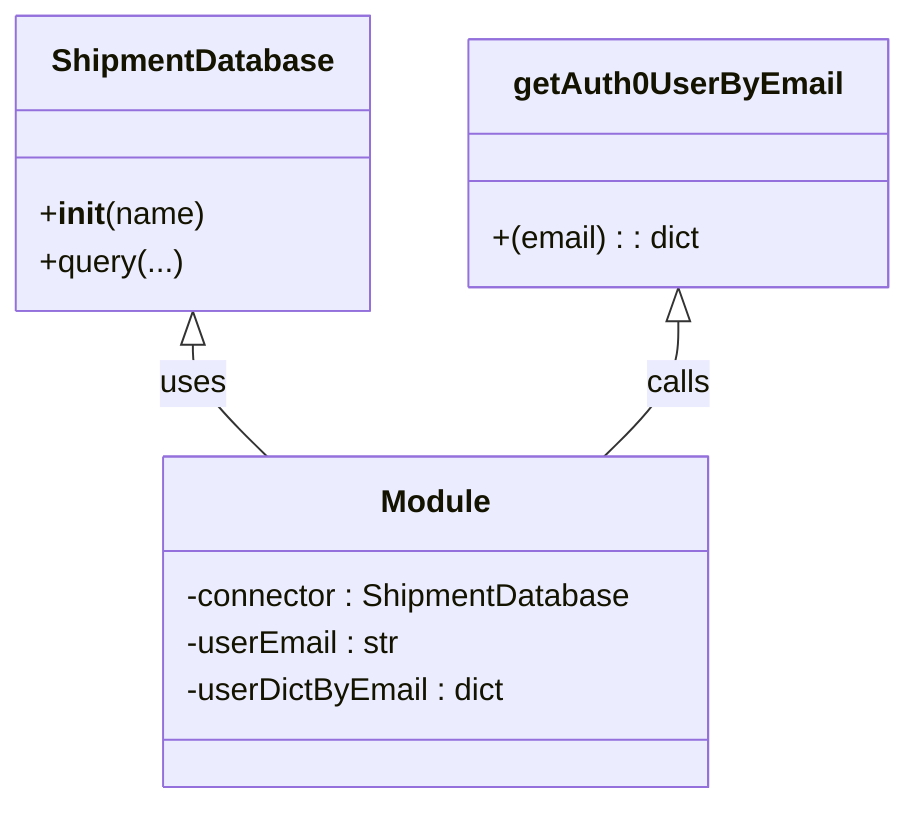

# Diagram: tools/ide_local_testing/localTest/test/user/guiGetUser.py


> Auto-generated by Obscura crawlers

## Diagram 1



### SVG

<svg id="container" width="452.2421875" xmlns="http://www.w3.org/2000/svg" class="classDiagram" height="408" viewBox="0 0 452.2421875 408" role="graphics-document document" aria-roledescription="class"><style>#container{font-family:"trebuchet ms",verdana,arial,sans-serif;font-size:16px;fill:#333;}@keyframes edge-animation-frame{from{stroke-dashoffset:0;}}@keyframes dash{to{stroke-dashoffset:0;}}#container .edge-animation-slow{stroke-dasharray:9,5!important;stroke-dashoffset:900;animation:dash 50s linear infinite;stroke-linecap:round;}#container .edge-animation-fast{stroke-dasharray:9,5!important;stroke-dashoffset:900;animation:dash 20s linear infinite;stroke-linecap:round;}#container .error-icon{fill:#552222;}#container .error-text{fill:#552222;stroke:#552222;}#container .edge-thickness-normal{stroke-width:1px;}#container .edge-thickness-thick{stroke-width:3.5px;}#container .edge-pattern-solid{stroke-dasharray:0;}#container .edge-thickness-invisible{stroke-width:0;fill:none;}#container .edge-pattern-dashed{stroke-dasharray:3;}#container .edge-pattern-dotted{stroke-dasharray:2;}#container .marker{fill:#333333;stroke:#333333;}#container .marker.cross{stroke:#333333;}#container svg{font-family:"trebuchet ms",verdana,arial,sans-serif;font-size:16px;}#container p{margin:0;}#container g.classGroup text{fill:#9370DB;stroke:none;font-family:"trebuchet ms",verdana,arial,sans-serif;font-size:10px;}#container g.classGroup text .title{font-weight:bolder;}#container .nodeLabel,#container .edgeLabel{color:#131300;}#container .edgeLabel .label rect{fill:#ECECFF;}#container .label text{fill:#131300;}#container .labelBkg{background:#ECECFF;}#container .edgeLabel .label span{background:#ECECFF;}#container .classTitle{font-weight:bolder;}#container .node rect,#container .node circle,#container .node ellipse,#container .node polygon,#container .node path{fill:#ECECFF;stroke:#9370DB;stroke-width:1px;}#container .divider{stroke:#9370DB;stroke-width:1;}#container g.clickable{cursor:pointer;}#container g.classGroup rect{fill:#ECECFF;stroke:#9370DB;}#container g.classGroup line{stroke:#9370DB;stroke-width:1;}#container .classLabel .box{stroke:none;stroke-width:0;fill:#ECECFF;opacity:0.5;}#container .classLabel .label{fill:#9370DB;font-size:10px;}#container .relation{stroke:#333333;stroke-width:1;fill:none;}#container .dashed-line{stroke-dasharray:3;}#container .dotted-line{stroke-dasharray:1 2;}#container #compositionStart,#container .composition{fill:#333333!important;stroke:#333333!important;stroke-width:1;}#container #compositionEnd,#container .composition{fill:#333333!important;stroke:#333333!important;stroke-width:1;}#container #dependencyStart,#container .dependency{fill:#333333!important;stroke:#333333!important;stroke-width:1;}#container #dependencyStart,#container .dependency{fill:#333333!important;stroke:#333333!important;stroke-width:1;}#container #extensionStart,#container .extension{fill:transparent!important;stroke:#333333!important;stroke-width:1;}#container #extensionEnd,#container .extension{fill:transparent!important;stroke:#333333!important;stroke-width:1;}#container #aggregationStart,#container .aggregation{fill:transparent!important;stroke:#333333!important;stroke-width:1;}#container #aggregationEnd,#container .aggregation{fill:transparent!important;stroke:#333333!important;stroke-width:1;}#container #lollipopStart,#container .lollipop{fill:#ECECFF!important;stroke:#333333!important;stroke-width:1;}#container #lollipopEnd,#container .lollipop{fill:#ECECFF!important;stroke:#333333!important;stroke-width:1;}#container .edgeTerminals{font-size:11px;line-height:initial;}#container .classTitleText{text-anchor:middle;font-size:18px;fill:#333;}#container .label-icon{display:inline-block;height:1em;overflow:visible;vertical-align:-0.125em;}#container .node .label-icon path{fill:currentColor;stroke:revert;stroke-width:revert;}#container :root{--mermaid-font-family:"trebuchet ms",verdana,arial,sans-serif;}</style><g><defs><marker id="container_class-aggregationStart" class="marker aggregation class" refX="18" refY="7" markerWidth="190" markerHeight="240" orient="auto"><path d="M 18,7 L9,13 L1,7 L9,1 Z"></path></marker></defs><defs><marker id="container_class-aggregationEnd" class="marker aggregation class" refX="1" refY="7" markerWidth="20" markerHeight="28" orient="auto"><path d="M 18,7 L9,13 L1,7 L9,1 Z"></path></marker></defs><defs><marker id="container_class-extensionStart" class="marker extension class" refX="18" refY="7" markerWidth="190" markerHeight="240" orient="auto"><path d="M 1,7 L18,13 V 1 Z"></path></marker></defs><defs><marker id="container_class-extensionEnd" class="marker extension class" refX="1" refY="7" markerWidth="20" markerHeight="28" orient="auto"><path d="M 1,1 V 13 L18,7 Z"></path></marker></defs><defs><marker id="container_class-compositionStart" class="marker composition class" refX="18" refY="7" markerWidth="190" markerHeight="240" orient="auto"><path d="M 18,7 L9,13 L1,7 L9,1 Z"></path></marker></defs><defs><marker id="container_class-compositionEnd" class="marker composition class" refX="1" refY="7" markerWidth="20" markerHeight="28" orient="auto"><path d="M 18,7 L9,13 L1,7 L9,1 Z"></path></marker></defs><defs><marker id="container_class-dependencyStart" class="marker dependency class" refX="6" refY="7" markerWidth="190" markerHeight="240" orient="auto"><path d="M 5,7 L9,13 L1,7 L9,1 Z"></path></marker></defs><defs><marker id="container_class-dependencyEnd" class="marker dependency class" refX="13" refY="7" markerWidth="20" markerHeight="28" orient="auto"><path d="M 18,7 L9,13 L14,7 L9,1 Z"></path></marker></defs><defs><marker id="container_class-lollipopStart" class="marker lollipop class" refX="13" refY="7" markerWidth="190" markerHeight="240" orient="auto"><circle stroke="black" fill="transparent" cx="7" cy="7" r="6"></circle></marker></defs><defs><marker id="container_class-lollipopEnd" class="marker lollipop class" refX="1" refY="7" markerWidth="190" markerHeight="240" orient="auto"><circle stroke="black" fill="transparent" cx="7" cy="7" r="6"></circle></marker></defs><g class="root"><g class="clusters"></g><g class="edgePaths"><path d="M96.293,175.25L96.293,178.542C96.293,181.833,96.293,188.417,102.488,197.875C108.683,207.333,121.074,219.667,127.269,225.833L133.464,232" id="id_ShipmentDatabase_Module_1" class="edge-thickness-normal edge-pattern-solid relation" style=";;;" data-edge="true" data-et="edge" data-id="id_ShipmentDatabase_Module_1" data-points="W3sieCI6OTYuMjkyOTY4NzUsInkiOjE1OH0seyJ4Ijo5Ni4yOTI5Njg3NSwieSI6MTk1fSx7IngiOjEzMy40NjQzNzU2NDU2NjExNiwieSI6MjMyfV0=" marker-start="url(#container_class-extensionStart)"></path><path d="M339.414,163.25L339.414,168.542C339.414,173.833,339.414,184.417,333.219,195.875C327.024,207.333,314.633,219.667,308.438,225.833L302.243,232" id="id_getAuth0UserByEmail_Module_2" class="edge-thickness-normal edge-pattern-solid relation" style=";;;" data-edge="true" data-et="edge" data-id="id_getAuth0UserByEmail_Module_2" data-points="W3sieCI6MzM5LjQxNDA2MjUsInkiOjE0Nn0seyJ4IjozMzkuNDE0MDYyNSwieSI6MTk1fSx7IngiOjMwMi4yNDI2NTU2MDQzMzg4NCwieSI6MjMyfV0=" marker-start="url(#container_class-extensionStart)"></path></g><g class="edgeLabels"><g class="edgeLabel" transform="translate(96.29296875, 195)"><g class="label" data-id="id_ShipmentDatabase_Module_1" transform="translate(-16.4921875, -12)"><foreignObject width="32.984375" height="24"><div xmlns="http://www.w3.org/1999/xhtml" class="labelBkg" style="display: table-cell; white-space: nowrap; line-height: 1.5; max-width: 200px; text-align: center;"><span class="edgeLabel"><p>uses</p></span></div></foreignObject></g></g><g class="edgeLabel" transform="translate(339.4140625, 195)"><g class="label" data-id="id_getAuth0UserByEmail_Module_2" transform="translate(-16.4453125, -12)"><foreignObject width="32.890625" height="24"><div xmlns="http://www.w3.org/1999/xhtml" class="labelBkg" style="display: table-cell; white-space: nowrap; line-height: 1.5; max-width: 200px; text-align: center;"><span class="edgeLabel"><p>calls</p></span></div></foreignObject></g></g></g><g class="nodes"><g class="node default" id="classId-ShipmentDatabase-0" transform="translate(96.29296875, 83)"><g class="basic label-container"><path d="M-88.29296875 -75 L88.29296875 -75 L88.29296875 75 L-88.29296875 75" stroke="none" stroke-width="0" fill="#ECECFF" style=""></path><path d="M-88.29296875 -75 C-31.084963459166403 -75, 26.123041831667194 -75, 88.29296875 -75 M-88.29296875 -75 C-46.28319659827021 -75, -4.273424446540417 -75, 88.29296875 -75 M88.29296875 -75 C88.29296875 -15.903026121809233, 88.29296875 43.19394775638153, 88.29296875 75 M88.29296875 -75 C88.29296875 -41.9255898459437, 88.29296875 -8.851179691887396, 88.29296875 75 M88.29296875 75 C25.458143506738182 75, -37.376681736523636 75, -88.29296875 75 M88.29296875 75 C35.760904591684415 75, -16.77115956663117 75, -88.29296875 75 M-88.29296875 75 C-88.29296875 35.71010763463113, -88.29296875 -3.5797847307377424, -88.29296875 -75 M-88.29296875 75 C-88.29296875 29.0836739477245, -88.29296875 -16.832652104551002, -88.29296875 -75" stroke="#9370DB" stroke-width="1.3" fill="none" stroke-dasharray="0 0" style=""></path></g><g class="annotation-group text" transform="translate(0, -51)"></g><g class="label-group text" transform="translate(-69.2734375, -51)"><g class="label" style="font-weight: bolder" transform="translate(0,-12)"><foreignObject width="138.546875" height="24"><div xmlns="http://www.w3.org/1999/xhtml" style="display: table-cell; white-space: nowrap; line-height: 1.5; max-width: 187px; text-align: center;"><span class="nodeLabel markdown-node-label" style=""><p>ShipmentDatabase</p></span></div></foreignObject></g></g><g class="members-group text" transform="translate(-76.29296875, -3)"></g><g class="methods-group text" transform="translate(-76.29296875, 27)"><g class="label" style="" transform="translate(0,-12)"><foreignObject width="83.3125" height="24"><div xmlns="http://www.w3.org/1999/xhtml" style="display: table-cell; white-space: nowrap; line-height: 1.5; max-width: 172px; text-align: center;"><span class="nodeLabel markdown-node-label" style=""><p>+<strong>init</strong>(name)</p></span></div></foreignObject></g><g class="label" style="" transform="translate(0,12)"><foreignObject width="71.53125" height="24"><div xmlns="http://www.w3.org/1999/xhtml" style="display: table-cell; white-space: nowrap; line-height: 1.5; max-width: 129px; text-align: center;"><span class="nodeLabel markdown-node-label" style=""><p>+query(...)</p></span></div></foreignObject></g></g><g class="divider" style=""><path d="M-88.29296875 -27 C-27.48871881812064 -27, 33.31553111375872 -27, 88.29296875 -27 M-88.29296875 -27 C-29.289754201576038 -27, 29.713460346847924 -27, 88.29296875 -27" stroke="#9370DB" stroke-width="1.3" fill="none" stroke-dasharray="0 0" style=""></path></g><g class="divider" style=""><path d="M-88.29296875 -3 C-33.4763170920317 -3, 21.3403345659366 -3, 88.29296875 -3 M-88.29296875 -3 C-22.03198109957887 -3, 44.22900655084226 -3, 88.29296875 -3" stroke="#9370DB" stroke-width="1.3" fill="none" stroke-dasharray="0 0" style=""></path></g></g><g class="node default" id="classId-getAuth0UserByEmail-1" transform="translate(339.4140625, 83)"><g class="basic label-container"><path d="M-104.828125 -63 L104.828125 -63 L104.828125 63 L-104.828125 63" stroke="none" stroke-width="0" fill="#ECECFF" style=""></path><path d="M-104.828125 -63 C-61.847234676279655 -63, -18.86634435255931 -63, 104.828125 -63 M-104.828125 -63 C-29.393703511114836 -63, 46.04071797777033 -63, 104.828125 -63 M104.828125 -63 C104.828125 -16.78026650242537, 104.828125 29.43946699514926, 104.828125 63 M104.828125 -63 C104.828125 -33.0425316043625, 104.828125 -3.0850632087250034, 104.828125 63 M104.828125 63 C28.171472530814185 63, -48.48517993837163 63, -104.828125 63 M104.828125 63 C28.986017051629204 63, -46.85609089674159 63, -104.828125 63 M-104.828125 63 C-104.828125 17.692307431846714, -104.828125 -27.61538513630657, -104.828125 -63 M-104.828125 63 C-104.828125 19.211472459823206, -104.828125 -24.57705508035359, -104.828125 -63" stroke="#9370DB" stroke-width="1.3" fill="none" stroke-dasharray="0 0" style=""></path></g><g class="annotation-group text" transform="translate(0, -39)"></g><g class="label-group text" transform="translate(-79.0625, -39)"><g class="label" style="font-weight: bolder" transform="translate(0,-12)"><foreignObject width="158.125" height="24"><div xmlns="http://www.w3.org/1999/xhtml" style="display: table-cell; white-space: nowrap; line-height: 1.5; max-width: 206px; text-align: center;"><span class="nodeLabel markdown-node-label" style=""><p>getAuth0UserByEmail</p></span></div></foreignObject></g></g><g class="members-group text" transform="translate(-92.828125, 9)"></g><g class="methods-group text" transform="translate(-92.828125, 39)"><g class="label" style="" transform="translate(0,-12)"><foreignObject width="106.59375" height="24"><div xmlns="http://www.w3.org/1999/xhtml" style="display: table-cell; white-space: nowrap; line-height: 1.5; max-width: 157px; text-align: center;"><span class="nodeLabel markdown-node-label" style=""><p>+(email) : : dict</p></span></div></foreignObject></g></g><g class="divider" style=""><path d="M-104.828125 -15 C-61.71553222652447 -15, -18.602939453048947 -15, 104.828125 -15 M-104.828125 -15 C-59.11535555343351 -15, -13.40258610686702 -15, 104.828125 -15" stroke="#9370DB" stroke-width="1.3" fill="none" stroke-dasharray="0 0" style=""></path></g><g class="divider" style=""><path d="M-104.828125 9 C-62.896773759506196 9, -20.965422519012392 9, 104.828125 9 M-104.828125 9 C-29.959192135581873 9, 44.909740728836255 9, 104.828125 9" stroke="#9370DB" stroke-width="1.3" fill="none" stroke-dasharray="0 0" style=""></path></g></g><g class="node default" id="classId-Module-2" transform="translate(217.853515625, 316)"><g class="basic label-container"><path d="M-139.8515625 -84 L139.8515625 -84 L139.8515625 84 L-139.8515625 84" stroke="none" stroke-width="0" fill="#ECECFF" style=""></path><path d="M-139.8515625 -84 C-60.64758918525753 -84, 18.55638412948494 -84, 139.8515625 -84 M-139.8515625 -84 C-46.32973664938628 -84, 47.192089201227446 -84, 139.8515625 -84 M139.8515625 -84 C139.8515625 -21.19221178468974, 139.8515625 41.61557643062052, 139.8515625 84 M139.8515625 -84 C139.8515625 -22.979926656262826, 139.8515625 38.04014668747435, 139.8515625 84 M139.8515625 84 C58.12101721460499 84, -23.60952807079002 84, -139.8515625 84 M139.8515625 84 C53.45057557917596 84, -32.95041134164808 84, -139.8515625 84 M-139.8515625 84 C-139.8515625 43.63709435364891, -139.8515625 3.2741887072978244, -139.8515625 -84 M-139.8515625 84 C-139.8515625 41.72287505075634, -139.8515625 -0.5542498984873134, -139.8515625 -84" stroke="#9370DB" stroke-width="1.3" fill="none" stroke-dasharray="0 0" style=""></path></g><g class="annotation-group text" transform="translate(0, -60)"></g><g class="label-group text" transform="translate(-27.09375, -60)"><g class="label" style="font-weight: bolder" transform="translate(0,-12)"><foreignObject width="54.1875" height="24"><div xmlns="http://www.w3.org/1999/xhtml" style="display: table-cell; white-space: nowrap; line-height: 1.5; max-width: 104px; text-align: center;"><span class="nodeLabel markdown-node-label" style=""><p>Module</p></span></div></foreignObject></g></g><g class="members-group text" transform="translate(-127.8515625, -12)"><g class="label" style="" transform="translate(0,-12)"><foreignObject width="228.609375" height="24"><div xmlns="http://www.w3.org/1999/xhtml" style="display: table-cell; white-space: nowrap; line-height: 1.5; max-width: 286px; text-align: center;"><span class="nodeLabel markdown-node-label" style=""><p>-connector : ShipmentDatabase</p></span></div></foreignObject></g><g class="label" style="" transform="translate(0,12)"><foreignObject width="109.890625" height="24"><div xmlns="http://www.w3.org/1999/xhtml" style="display: table-cell; white-space: nowrap; line-height: 1.5; max-width: 168px; text-align: center;"><span class="nodeLabel markdown-node-label" style=""><p>-userEmail : str</p></span></div></foreignObject></g><g class="label" style="" transform="translate(0,36)"><foreignObject width="163.8125" height="24"><div xmlns="http://www.w3.org/1999/xhtml" style="display: table-cell; white-space: nowrap; line-height: 1.5; max-width: 221px; text-align: center;"><span class="nodeLabel markdown-node-label" style=""><p>-userDictByEmail : dict</p></span></div></foreignObject></g></g><g class="methods-group text" transform="translate(-127.8515625, 84)"></g><g class="divider" style=""><path d="M-139.8515625 -36 C-34.59161323767378 -36, 70.66833602465243 -36, 139.8515625 -36 M-139.8515625 -36 C-64.56098886605405 -36, 10.729584767891907 -36, 139.8515625 -36" stroke="#9370DB" stroke-width="1.3" fill="none" stroke-dasharray="0 0" style=""></path></g><g class="divider" style=""><path d="M-139.8515625 60 C-40.0023972761595 60, 59.846767947681 60, 139.8515625 60 M-139.8515625 60 C-57.83206379159316 60, 24.187434916813686 60, 139.8515625 60" stroke="#9370DB" stroke-width="1.3" fill="none" stroke-dasharray="0 0" style=""></path></g></g></g></g></g></svg>

## Diagram 2

```mermaid
flowchart TD
    A[Start: script imported] --> B[Instantiate ShipmentDatabase\nconnector = ShipmentDatabase(...)]
    B --> C[Set userEmail variable\n(multiple assignments, last wins)]
    C --> D[Call getAuth0UserByEmail(userEmail)]
    D --> E[Assign result to userDictByEmail]
    E --> F[Print userDictByEmail]
    F --> G[End]
```

> SVG rendering failed for this diagram.
