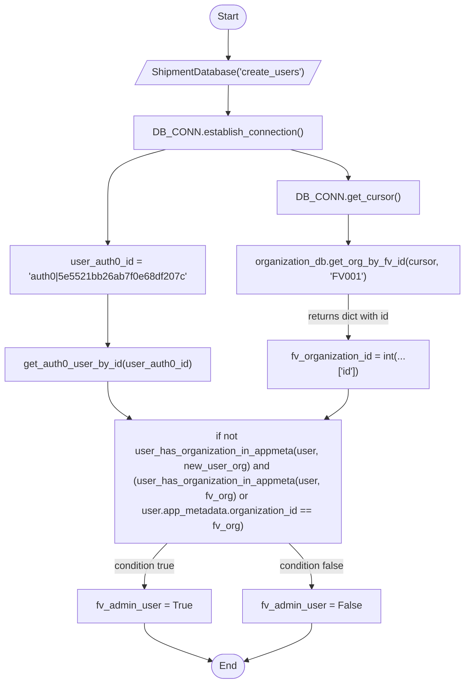
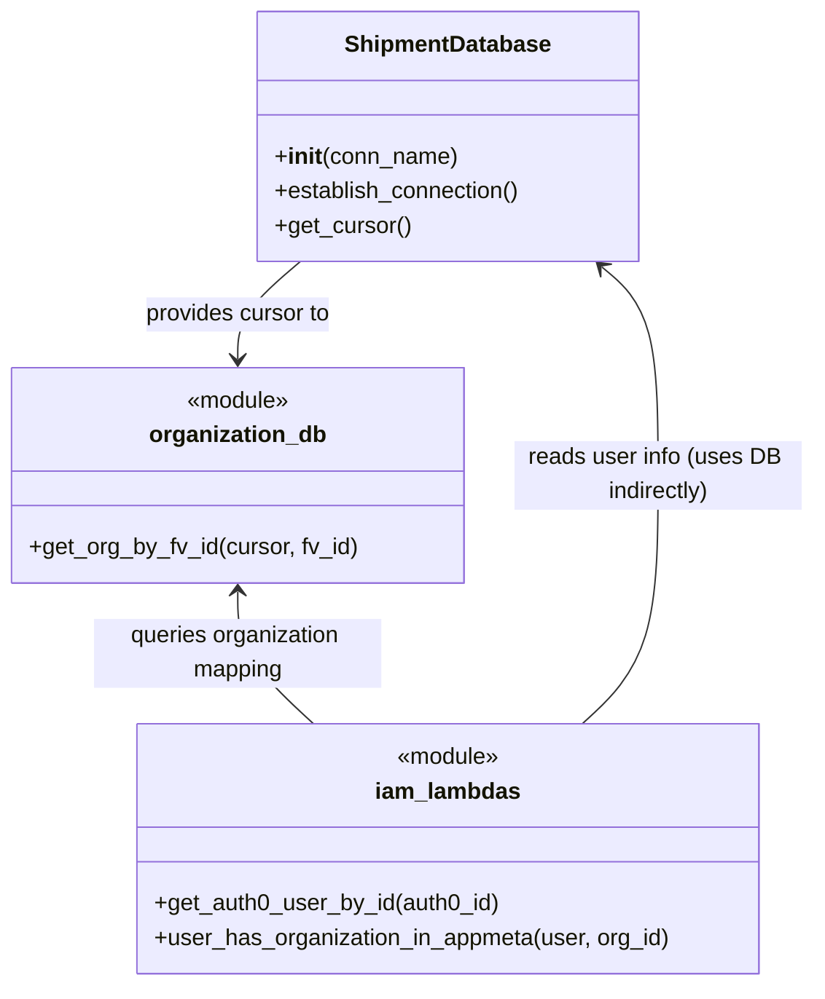

# Diagram: tools/ide_local_testing/localTest/test/user/temp.py

> Auto-generated by Obscura crawlers

## Diagram 1

### SVG

<svg id="container" width="746.796875" xmlns="http://www.w3.org/2000/svg" class="flowchart" height="1097" viewBox="0 0 746.796875 1097" role="graphics-document document" aria-roledescription="flowchart-v2"><g><marker id="container_flowchart-v2-pointEnd" class="marker flowchart-v2" viewBox="0 0 10 10" refX="5" refY="5" markerUnits="userSpaceOnUse" markerWidth="8" markerHeight="8" orient="auto"><path d="M 0 0 L 10 5 L 0 10 z" class="arrowMarkerPath" style="stroke-width: 1; stroke-dasharray: 1, 0;"></path></marker><marker id="container_flowchart-v2-pointStart" class="marker flowchart-v2" viewBox="0 0 10 10" refX="4.5" refY="5" markerUnits="userSpaceOnUse" markerWidth="8" markerHeight="8" orient="auto"><path d="M 0 5 L 10 10 L 10 0 z" class="arrowMarkerPath" style="stroke-width: 1; stroke-dasharray: 1, 0;"></path></marker><marker id="container_flowchart-v2-circleEnd" class="marker flowchart-v2" viewBox="0 0 10 10" refX="11" refY="5" markerUnits="userSpaceOnUse" markerWidth="11" markerHeight="11" orient="auto"><circle cx="5" cy="5" r="5" class="arrowMarkerPath" style="stroke-width: 1; stroke-dasharray: 1, 0;"></circle></marker><marker id="container_flowchart-v2-circleStart" class="marker flowchart-v2" viewBox="0 0 10 10" refX="-1" refY="5" markerUnits="userSpaceOnUse" markerWidth="11" markerHeight="11" orient="auto"><circle cx="5" cy="5" r="5" class="arrowMarkerPath" style="stroke-width: 1; stroke-dasharray: 1, 0;"></circle></marker><marker id="container_flowchart-v2-crossEnd" class="marker cross flowchart-v2" viewBox="0 0 11 11" refX="12" refY="5.2" markerUnits="userSpaceOnUse" markerWidth="11" markerHeight="11" orient="auto"><path d="M 1,1 l 9,9 M 10,1 l -9,9" class="arrowMarkerPath" style="stroke-width: 2; stroke-dasharray: 1, 0;"></path></marker><marker id="container_flowchart-v2-crossStart" class="marker cross flowchart-v2" viewBox="0 0 11 11" refX="-1" refY="5.2" markerUnits="userSpaceOnUse" markerWidth="11" markerHeight="11" orient="auto"><path d="M 1,1 l 9,9 M 10,1 l -9,9" class="arrowMarkerPath" style="stroke-width: 2; stroke-dasharray: 1, 0;"></path></marker><g class="root"><g class="clusters"></g><g class="edgePaths"><path d="M366.332,47.5L366.249,51.583C366.165,55.667,365.999,63.833,365.986,71.5C365.973,79.167,366.113,86.334,366.183,89.917L366.254,93.501" id="L_Start_InitDB_0" class="edge-thickness-normal edge-pattern-solid edge-thickness-normal edge-pattern-solid flowchart-link" style=";" data-edge="true" data-et="edge" data-id="L_Start_InitDB_0" data-points="W3sieCI6MzY2LjMzMjAzMTI1LCJ5Ijo0Ny41fSx7IngiOjM2NS44MzIwMzEyNSwieSI6NzJ9LHsieCI6MzY2LjMzMjAzMTI1LCJ5Ijo5Ny41fV0=" marker-end="url(#container_flowchart-v2-pointEnd)"></path><path d="M366.332,136.5L366.249,140.583C366.165,144.667,365.999,152.833,365.915,160.417C365.832,168,365.832,175,365.832,178.5L365.832,182" id="L_InitDB_EstablishConn_0" class="edge-thickness-normal edge-pattern-solid edge-thickness-normal edge-pattern-solid flowchart-link" style=";" data-edge="true" data-et="edge" data-id="L_InitDB_EstablishConn_0" data-points="W3sieCI6MzY2LjMzMjAzMTI1LCJ5IjoxMzYuNX0seyJ4IjozNjUuODMyMDMxMjUsInkiOjE2MX0seyJ4IjozNjUuODMyMDMxMjUsInkiOjE4Nn1d" marker-end="url(#container_flowchart-v2-pointEnd)"></path><path d="M465.717,240L481.131,244.167C496.546,248.333,527.374,256.667,542.789,264.333C558.203,272,558.203,279,558.203,282.5L558.203,286" id="L_EstablishConn_GetCursor_0" class="edge-thickness-normal edge-pattern-solid edge-thickness-normal edge-pattern-solid flowchart-link" style=";" data-edge="true" data-et="edge" data-id="L_EstablishConn_GetCursor_0" data-points="W3sieCI6NDY1LjcxNzAyMjIzNTU3NjksInkiOjI0MH0seyJ4Ijo1NTguMjAzMTI1LCJ5IjoyNjV9LHsieCI6NTU4LjIwMzEyNSwieSI6MjkwfV0=" marker-end="url(#container_flowchart-v2-pointEnd)"></path><path d="M558.203,472L558.203,478.167C558.203,484.333,558.203,496.667,558.203,508.333C558.203,520,558.203,531,558.203,536.5L558.203,542" id="L_GetOrg_ParseOrg_0" class="edge-thickness-normal edge-pattern-solid edge-thickness-normal edge-pattern-solid flowchart-link" style=";" data-edge="true" data-et="edge" data-id="L_GetOrg_ParseOrg_0" data-points="W3sieCI6NTU4LjIwMzEyNSwieSI6NDcyfSx7IngiOjU1OC4yMDMxMjUsInkiOjUwOX0seyJ4Ijo1NTguMjAzMTI1LCJ5Ijo1NDZ9XQ==" marker-end="url(#container_flowchart-v2-pointEnd)"></path><path d="M558.203,344L558.203,348.167C558.203,352.333,558.203,360.667,558.203,368.333C558.203,376,558.203,383,558.203,386.5L558.203,390" id="L_GetCursor_GetOrg_0" class="edge-thickness-normal edge-pattern-solid edge-thickness-normal edge-pattern-solid flowchart-link" style=";" data-edge="true" data-et="edge" data-id="L_GetCursor_GetOrg_0" data-points="W3sieCI6NTU4LjIwMzEyNSwieSI6MzQ0fSx7IngiOjU1OC4yMDMxMjUsInkiOjM2OX0seyJ4Ijo1NTguMjAzMTI1LCJ5IjozOTR9XQ==" marker-end="url(#container_flowchart-v2-pointEnd)"></path><path d="M173.461,472L173.461,478.167C173.461,484.333,173.461,496.667,173.461,510.333C173.461,524,173.461,539,173.461,546.5L173.461,554" id="L_Auth0ID_GetUser_0" class="edge-thickness-normal edge-pattern-solid edge-thickness-normal edge-pattern-solid flowchart-link" style=";" data-edge="true" data-et="edge" data-id="L_Auth0ID_GetUser_0" data-points="W3sieCI6MTczLjQ2MDkzNzUsInkiOjQ3Mn0seyJ4IjoxNzMuNDYwOTM3NSwieSI6NTA5fSx7IngiOjE3My40NjA5Mzc1LCJ5Ijo1NTh9XQ==" marker-end="url(#container_flowchart-v2-pointEnd)"></path><path d="M265.947,240L250.533,244.167C235.118,248.333,204.29,256.667,188.875,269.5C173.461,282.333,173.461,299.667,173.461,317C173.461,334.333,173.461,351.667,173.461,363.833C173.461,376,173.461,383,173.461,386.5L173.461,390" id="L_EstablishConn_Auth0ID_0" class="edge-thickness-normal edge-pattern-solid edge-thickness-normal edge-pattern-solid flowchart-link" style=";" data-edge="true" data-et="edge" data-id="L_EstablishConn_Auth0ID_0" data-points="W3sieCI6MjY1Ljk0NzA0MDI2NDQyMzEsInkiOjI0MH0seyJ4IjoxNzMuNDYwOTM3NSwieSI6MjY1fSx7IngiOjE3My40NjA5Mzc1LCJ5IjozMTd9LHsieCI6MTczLjQ2MDkzNzUsInkiOjM2OX0seyJ4IjoxNzMuNDYwOTM3NSwieSI6Mzk0fV0=" marker-end="url(#container_flowchart-v2-pointEnd)"></path><path d="M173.461,612L173.461,618.167C173.461,624.333,173.461,636.667,179.365,646.639C185.268,656.611,197.076,664.222,202.98,668.027L208.883,671.833" id="L_GetUser_CheckMeta_0" class="edge-thickness-normal edge-pattern-solid edge-thickness-normal edge-pattern-solid flowchart-link" style=";" data-edge="true" data-et="edge" data-id="L_GetUser_CheckMeta_0" data-points="W3sieCI6MTczLjQ2MDkzNzUsInkiOjYxMn0seyJ4IjoxNzMuNDYwOTM3NSwieSI6NjQ5fSx7IngiOjIxMi4yNDU0MzIyMDc2NjEyOCwieSI6Njc0fV0=" marker-end="url(#container_flowchart-v2-pointEnd)"></path><path d="M558.203,624L558.203,628.167C558.203,632.333,558.203,640.667,552.299,648.639C546.396,656.611,534.588,664.222,528.684,668.027L522.781,671.833" id="L_ParseOrg_CheckMeta_0" class="edge-thickness-normal edge-pattern-solid edge-thickness-normal edge-pattern-solid flowchart-link" style=";" data-edge="true" data-et="edge" data-id="L_ParseOrg_CheckMeta_0" data-points="W3sieCI6NTU4LjIwMzEyNSwieSI6NjI0fSx7IngiOjU1OC4yMDMxMjUsInkiOjY0OX0seyJ4Ijo1MTkuNDE4NjMwMjkyMzM4OCwieSI6Njc0fV0=" marker-end="url(#container_flowchart-v2-pointEnd)"></path><path d="M268.669,872L262.617,878.167C256.564,884.333,244.46,896.667,238.408,908.333C232.355,920,232.355,931,232.355,936.5L232.355,942" id="L_CheckMeta_TrueBranch_0" class="edge-thickness-normal edge-pattern-solid edge-thickness-normal edge-pattern-solid flowchart-link" style=";" data-edge="true" data-et="edge" data-id="L_CheckMeta_TrueBranch_0" data-points="W3sieCI6MjY4LjY2ODk0NTMxMjUsInkiOjg3Mn0seyJ4IjoyMzIuMzU1NDY4NzUsInkiOjkwOX0seyJ4IjoyMzIuMzU1NDY4NzUsInkiOjk0Nn1d" marker-end="url(#container_flowchart-v2-pointEnd)"></path><path d="M462.995,872L469.047,878.167C475.1,884.333,487.204,896.667,493.256,908.333C499.309,920,499.309,931,499.309,936.5L499.309,942" id="L_CheckMeta_FalseBranch_0" class="edge-thickness-normal edge-pattern-solid edge-thickness-normal edge-pattern-solid flowchart-link" style=";" data-edge="true" data-et="edge" data-id="L_CheckMeta_FalseBranch_0" data-points="W3sieCI6NDYyLjk5NTExNzE4NzUsInkiOjg3Mn0seyJ4Ijo0OTkuMzA4NTkzNzUsInkiOjkwOX0seyJ4Ijo0OTkuMzA4NTkzNzUsInkiOjk0Nn1d" marker-end="url(#container_flowchart-v2-pointEnd)"></path><path d="M232.355,1000L232.355,1004.167C232.355,1008.333,232.355,1016.667,250.005,1026.771C267.655,1036.876,302.954,1048.752,320.604,1054.689L338.253,1060.627" id="L_TrueBranch_End_0" class="edge-thickness-normal edge-pattern-solid edge-thickness-normal edge-pattern-solid flowchart-link" style=";" data-edge="true" data-et="edge" data-id="L_TrueBranch_End_0" data-points="W3sieCI6MjMyLjM1NTQ2ODc1LCJ5IjoxMDAwfSx7IngiOjIzMi4zNTU0Njg3NSwieSI6MTAyNX0seyJ4IjozNDIuMDQ0NTI5ODAzMzI2OSwieSI6MTA2MS45MDI3NDQ2MTU3MzAyfV0=" marker-end="url(#container_flowchart-v2-pointEnd)"></path><path d="M499.309,1000L499.309,1004.167C499.309,1008.333,499.309,1016.667,481.825,1026.769C464.341,1036.872,429.374,1048.744,411.891,1054.681L394.407,1060.617" id="L_FalseBranch_End_0" class="edge-thickness-normal edge-pattern-solid edge-thickness-normal edge-pattern-solid flowchart-link" style=";" data-edge="true" data-et="edge" data-id="L_FalseBranch_End_0" data-points="W3sieCI6NDk5LjMwODU5Mzc1LCJ5IjoxMDAwfSx7IngiOjQ5OS4zMDg1OTM3NSwieSI6MTAyNX0seyJ4IjozOTAuNjE5NTMzNTg5ODQ1MzMsInkiOjEwNjEuOTAyNzQ0MzE3OTUzNn1d" marker-end="url(#container_flowchart-v2-pointEnd)"></path></g><g class="edgeLabels"><g class="edgeLabel"><g class="label" data-id="L_Start_InitDB_0" transform="translate(0, 0)"><foreignObject width="0" height="0">

</foreignObject></g></g><g class="edgeLabel"><g class="label" data-id="L_InitDB_EstablishConn_0" transform="translate(0, 0)"><foreignObject width="0" height="0">

</foreignObject></g></g><g class="edgeLabel"><g class="label" data-id="L_EstablishConn_GetCursor_0" transform="translate(0, 0)"><foreignObject width="0" height="0">

</foreignObject></g></g><g class="edgeLabel" transform="translate(558.203125, 509)"><g class="label" data-id="L_GetOrg_ParseOrg_0" transform="translate(-68.984375, -12)"><foreignObject width="137.96875" height="24">

returns dict with id

</foreignObject></g></g><g class="edgeLabel"><g class="label" data-id="L_GetCursor_GetOrg_0" transform="translate(0, 0)"><foreignObject width="0" height="0">

</foreignObject></g></g><g class="edgeLabel"><g class="label" data-id="L_Auth0ID_GetUser_0" transform="translate(0, 0)"><foreignObject width="0" height="0">

</foreignObject></g></g><g class="edgeLabel"><g class="label" data-id="L_EstablishConn_Auth0ID_0" transform="translate(0, 0)"><foreignObject width="0" height="0">

</foreignObject></g></g><g class="edgeLabel"><g class="label" data-id="L_GetUser_CheckMeta_0" transform="translate(0, 0)"><foreignObject width="0" height="0">

</foreignObject></g></g><g class="edgeLabel"><g class="label" data-id="L_ParseOrg_CheckMeta_0" transform="translate(0, 0)"><foreignObject width="0" height="0">

</foreignObject></g></g><g class="edgeLabel" transform="translate(232.35546875, 909)"><g class="label" data-id="L_CheckMeta_TrueBranch_0" transform="translate(-51.6875, -12)"><foreignObject width="103.375" height="24">

condition true

</foreignObject></g></g><g class="edgeLabel" transform="translate(499.30859375, 909)"><g class="label" data-id="L_CheckMeta_FalseBranch_0" transform="translate(-53.90625, -12)"><foreignObject width="107.8125" height="24">

condition false

</foreignObject></g></g><g class="edgeLabel"><g class="label" data-id="L_TrueBranch_End_0" transform="translate(0, 0)"><foreignObject width="0" height="0">

</foreignObject></g></g><g class="edgeLabel"><g class="label" data-id="L_FalseBranch_End_0" transform="translate(0, 0)"><foreignObject width="0" height="0">

</foreignObject></g></g></g><g class="nodes"><g class="node default" id="flowchart-Start-0" transform="translate(365.83203125, 27.5)"><g class="basic label-container outer-path"><path d="M-10.3984375 -19.5 C-4.07609201966036 -19.5, 2.2462534606792808 -19.5, 10.3984375 -19.5 C10.3984375 -19.5, 10.398437499999998 -19.5, 10.398437499999998 -19.5 C10.83410507352825 -19.48602898889244, 11.269772647056499 -19.472057977784875, 11.6478067896239 -19.45993515863156 C11.943598760873686 -19.431400462906986, 12.23939073212347 -19.40286576718241, 12.892042152847864 -19.3399052695533 C13.314753484961608 -19.27156457955249, 13.737464817075352 -19.20322388955168, 14.126030759676757 -19.140403561325776 C14.495507173172136 -19.05607298100438, 14.864983586667515 -18.97174240068298, 15.34470188623539 -18.862249829261074 C15.817545108917535 -18.72191244277374, 16.290388331599683 -18.581575056286404, 16.543047751460602 -18.50658706670804 C16.883335097182346 -18.381358177900697, 17.22362244290409 -18.25612928909335, 17.716144095147794 -18.074876768247425 C17.94476350872259 -17.97367373561181, 18.173382922297385 -17.872470702976194, 18.85917041279238 -17.568892924097174 C19.195133999311143 -17.393620936205284, 19.531097585829905 -17.218348948313395, 19.967429764076783 -16.990714730406097 C20.238235999383786 -16.826550399128905, 20.509042234690792 -16.662386067851713, 21.036368073605697 -16.342718045390892 C21.36981750474521 -16.110118157021194, 21.703266935884727 -15.877518268651494, 22.061592844578712 -15.627565626425154 C22.44841691742928 -15.319083722147715, 22.835240990279853 -15.010601817870278, 23.03889120850187 -14.848196188198123 C23.290882299639225 -14.61934454654609, 23.54287339077658 -14.390492904894057, 23.964247236767985 -14.007812326905688 C24.18131402369596 -13.78367304788791, 24.398380810623934 -13.559533768870134, 24.833858442968648 -13.10986736009568 C24.99966079380021 -12.915106484387902, 25.165463144631772 -12.720345608680123, 25.644151408126582 -12.158051136245305 C25.87645460405906 -11.846786016952302, 26.108757799991537 -11.5355208976593, 26.391796464640635 -11.156274872382312 C26.643065028367516 -10.77025888344106, 26.8943335920944 -10.38424289449981, 27.073721378604247 -10.108655082055241 C27.216981280972643 -9.854282618761994, 27.36024118334104 -9.599910155468745, 27.6871239742735 -9.019496659696287 C27.817048004432653 -8.749706631141901, 27.946972034591802 -8.479916602587513, 28.22948364880834 -7.893275190886684 C28.37342505808371 -7.537737127058692, 28.517366467359082 -7.182199063230701, 28.698571729970325 -6.734618561215508 C28.77894849326133 -6.492536556481105, 28.859325256552335 -6.250454551746701, 29.09246063421488 -5.548287939305138 C29.158340792017473 -5.297058344962845, 29.224220949820065 -5.045828750620552, 29.40953178754556 -4.339158212148133 C29.497951352940387 -3.885142431327472, 29.58637091833521 -3.4311266505068114, 29.648482276581777 -3.1121979531509023 C29.69773582367861 -2.730197168080857, 29.74698937077544 -2.3481963830108126, 29.808330202509367 -1.872449005199798 C29.83086864124483 -1.521394629194647, 29.853407079980293 -1.170340253189496, 29.888418715913414 -0.6250057626472757 C29.888418715913414 -0.32916116067249584, 29.888418715913414 -0.03331655869771599, 29.888418715913414 0.625005762647271 C29.861951337376578 1.037256547441939, 29.835483958839742 1.449507332236607, 29.808330202509367 1.8724490051997846 C29.74658772465994 2.3513114709686342, 29.68484524681051 2.8301739367374843, 29.648482276581777 3.1121979531508885 C29.599080513504955 3.365865565484049, 29.549678750428132 3.6195331778172086, 29.40953178754556 4.339158212148129 C29.288578947592704 4.8004038121808055, 29.167626107639848 5.261649412213482, 29.092460634214884 5.548287939305125 C29.00337671028111 5.816594524597902, 28.914292786347335 6.084901109890679, 28.69857172997033 6.734618561215495 C28.516227208130434 7.185013055551535, 28.33388268629054 7.6354075498875735, 28.229483648808344 7.893275190886679 C28.041815438862756 8.282972244295125, 27.854147228917164 8.672669297703571, 27.687123974273504 9.019496659696284 C27.534518085767765 9.290463867760106, 27.38191219726202 9.56143107582393, 27.07372137860425 10.108655082055236 C26.860472458091387 10.436262689316058, 26.647223537578522 10.763870296576881, 26.39179646464064 11.156274872382301 C26.10833109279246 11.536092646432232, 25.824865720944285 11.915910420482163, 25.644151408126582 12.158051136245302 C25.467952935949327 12.365023887641795, 25.291754463772072 12.57199663903829, 24.83385844296866 13.10986736009567 C24.55752779554911 13.395201440724431, 24.28119714812956 13.680535521353193, 23.96424723676799 14.007812326905684 C23.60405687514855 14.334927683213724, 23.243866513529113 14.662043039521762, 23.038891208501887 14.848196188198111 C22.710347964322878 15.110200682527964, 22.381804720143872 15.372205176857817, 22.061592844578715 15.627565626425152 C21.666038099253736 15.903487493474913, 21.270483353928757 16.179409360524673, 21.036368073605708 16.34271804539089 C20.62768044129513 16.590466889812674, 20.218992808984552 16.83821573423446, 19.967429764076787 16.990714730406093 C19.659356895854497 17.15143614842757, 19.351284027632207 17.312157566449052, 18.859170412792388 17.56889292409717 C18.613786750776526 17.677516992223882, 18.368403088760665 17.786141060350598, 17.716144095147804 18.07487676824742 C17.24785949849824 18.247209828589817, 16.77957490184868 18.419542888932217, 16.543047751460616 18.506587066708033 C16.256051725420008 18.591765980764006, 15.969055699379396 18.676944894819975, 15.344701886235413 18.86224982926107 C14.981073544406742 18.945245625386775, 14.617445202578072 19.02824142151248, 14.126030759676766 19.140403561325773 C13.820950511531342 19.189726569913265, 13.515870263385915 19.239049578500758, 12.892042152847878 19.3399052695533 C12.603638294141133 19.36772724294635, 12.315234435434387 19.395549216339404, 11.6478067896239 19.45993515863156 C11.371846121481001 19.468784680134046, 11.095885453338102 19.477634201636533, 10.398437500000004 19.5 C10.398437500000002 19.5, 10.398437500000002 19.5, 10.3984375 19.5 C2.875264882220266 19.5, -4.647907735559468 19.5, -10.398437499999996 19.5 C-10.676041344094633 19.49109778504299, -10.953645188189268 19.482195570085977, -11.647806789623893 19.45993515863156 C-12.019418052645655 19.42408626701578, -12.391029315667415 19.388237375400003, -12.892042152847871 19.3399052695533 C-13.311680398449168 19.27206141234768, -13.731318644050464 19.20421755514206, -14.126030759676759 19.140403561325773 C-14.4928113362146 19.056688288197954, -14.859591912752443 18.972973015070135, -15.344701886235388 18.862249829261074 C-15.647144821488336 18.772486353633365, -15.949587756741282 18.682722878005652, -16.54304775146059 18.506587066708043 C-16.9570655041849 18.354224706567347, -17.371083256909206 18.201862346426648, -17.716144095147797 18.074876768247425 C-17.983271228836873 17.95662751020815, -18.25039836252595 17.838378252168873, -18.85917041279238 17.568892924097174 C-19.08904327406228 17.448968399613264, -19.318916135332177 17.32904387512935, -19.96742976407678 16.990714730406097 C-20.21538172398705 16.840404795181037, -20.46333368389732 16.690094859955973, -21.036368073605686 16.3427180453909 C-21.258586871869905 16.187707831418514, -21.480805670134124 16.032697617446132, -22.061592844578712 15.627565626425156 C-22.295731623785624 15.440846180702232, -22.529870402992533 15.254126734979307, -23.03889120850187 14.848196188198125 C-23.244950327453495 14.661058748391785, -23.451009446405116 14.473921308585446, -23.964247236767974 14.007812326905697 C-24.288206220891016 13.673298078271415, -24.61216520501406 13.338783829637133, -24.833858442968655 13.109867360095677 C-25.042547019008396 12.864729883963026, -25.251235595048136 12.619592407830373, -25.64415140812658 12.158051136245307 C-25.800745548636502 11.94822925398169, -25.957339689146426 11.738407371718072, -26.391796464640635 11.156274872382316 C-26.59162068071154 10.849291216182241, -26.79144489678244 10.542307559982165, -27.073721378604244 10.108655082055249 C-27.199263615499394 9.885742127917926, -27.324805852394544 9.662829173780603, -27.6871239742735 9.019496659696289 C-27.80922207225074 8.765957346765765, -27.93132017022798 8.51241803383524, -28.22948364880834 7.893275190886686 C-28.351361698571672 7.592234051619466, -28.473239748335004 7.291192912352248, -28.698571729970325 6.73461856121551 C-28.796310864017048 6.440243862082981, -28.894049998063775 6.145869162950452, -29.09246063421488 5.5482879393051325 C-29.156362446084955 5.304602635424083, -29.22026425795503 5.060917331543034, -29.409531787545557 4.339158212148136 C-29.471600676001874 4.020447588189176, -29.53366956445819 3.701736964230217, -29.648482276581777 3.112197953150904 C-29.68372841672684 2.8388358503234143, -29.718974556871903 2.5654737474959246, -29.808330202509364 1.872449005199809 C-29.834547548713157 1.4640926758147454, -29.860764894916954 1.0557363464296818, -29.888418715913414 0.6250057626472781 C-29.888418715913414 0.1437636239675964, -29.888418715913414 -0.33747851471208534, -29.888418715913414 -0.6250057626472687 C-29.858643859152387 -1.0887731905320788, -29.828869002391357 -1.5525406184168886, -29.808330202509367 -1.8724490051997822 C-29.751763227416742 -2.3111712936054847, -29.69519625232412 -2.749893582011187, -29.648482276581777 -3.112197953150895 C-29.57325154649729 -3.498491852114305, -29.4980208164128 -3.8847857510777146, -29.40953178754556 -4.339158212148126 C-29.313204570702695 -4.7064956384498355, -29.216877353859832 -5.073833064751544, -29.092460634214884 -5.548287939305123 C-29.004571942146598 -5.81299467665339, -28.91668325007831 -6.077701414001657, -28.698571729970332 -6.734618561215485 C-28.593075187761137 -6.995197060109086, -28.48757864555194 -7.255775559002687, -28.229483648808344 -7.893275190886676 C-28.04736733157524 -8.271443620286172, -27.865251014342135 -8.649612049685668, -27.687123974273504 -9.019496659696282 C-27.52237293070279 -9.312028820408273, -27.357621887132076 -9.604560981120263, -27.073721378604247 -10.108655082055243 C-26.883732123437856 -10.400529597249205, -26.69374286827146 -10.692404112443167, -26.39179646464064 -11.156274872382308 C-26.180642380287537 -11.439202108882652, -25.969488295934433 -11.722129345382996, -25.644151408126586 -12.158051136245302 C-25.408693954114653 -12.434632859636396, -25.17323650010272 -12.711214583027491, -24.833858442968662 -13.10986736009567 C-24.52787638557946 -13.42581895594413, -24.221894328190256 -13.741770551792591, -23.964247236767996 -14.007812326905677 C-23.66362277727652 -14.280831506928509, -23.362998317785042 -14.55385068695134, -23.038891208501887 -14.848196188198107 C-22.80917184476296 -15.0313912676909, -22.579452481024035 -15.214586347183692, -22.06159284457872 -15.627565626425149 C-21.71072396155005 -15.872316570356805, -21.359855078521377 -16.11706751428846, -21.03636807360571 -16.342718045390885 C-20.795814259339767 -16.488543181250026, -20.555260445073827 -16.634368317109164, -19.96742976407679 -16.99071473040609 C-19.542024790916983 -17.212648232418672, -19.116619817757176 -17.434581734431255, -18.859170412792388 -17.56889292409717 C-18.55370533207448 -17.704113254031316, -18.248240251356574 -17.839333583965463, -17.716144095147804 -18.07487676824742 C-17.33688519640562 -18.21444754881537, -16.957626297663438 -18.354018329383326, -16.54304775146062 -18.506587066708033 C-16.246346947372448 -18.594646307947098, -15.94964614328428 -18.682705549186167, -15.344701886235413 -18.862249829261067 C-14.974859735315304 -18.946663886762998, -14.605017584395195 -19.031077944264933, -14.126030759676768 -19.140403561325773 C-13.781840107889114 -19.19604963666843, -13.43764945610146 -19.251695712011088, -12.89204215284788 -19.3399052695533 C-12.479477044595011 -19.379704929364316, -12.066911936342143 -19.419504589175332, -11.647806789623903 -19.45993515863156 C-11.3427938373272 -19.46971633034002, -11.037780885030497 -19.479497502048478, -10.398437500000005 -19.5 C-10.398437500000004 -19.5, -10.398437500000002 -19.5, -10.3984375 -19.5" stroke="none" stroke-width="0" fill="#ECECFF" style=""></path><path d="M-10.3984375 -19.5 C-2.4096302702612107 -19.5, 5.579176959477579 -19.5, 10.3984375 -19.5 M-10.3984375 -19.5 C-3.5736533521702434 -19.5, 3.2511307956595132 -19.5, 10.3984375 -19.5 M10.3984375 -19.5 C10.3984375 -19.5, 10.3984375 -19.5, 10.398437499999998 -19.5 M10.3984375 -19.5 C10.3984375 -19.5, 10.3984375 -19.5, 10.398437499999998 -19.5 M10.398437499999998 -19.5 C10.750844784886777 -19.48869898429285, 11.103252069773557 -19.4773979685857, 11.6478067896239 -19.45993515863156 M10.398437499999998 -19.5 C10.71409263189635 -19.489877554305526, 11.029747763792702 -19.47975510861105, 11.6478067896239 -19.45993515863156 M11.6478067896239 -19.45993515863156 C11.981395350508233 -19.42775427136199, 12.314983911392567 -19.39557338409242, 12.892042152847864 -19.3399052695533 M11.6478067896239 -19.45993515863156 C12.102288279111315 -19.41609187593467, 12.55676976859873 -19.372248593237778, 12.892042152847864 -19.3399052695533 M12.892042152847864 -19.3399052695533 C13.169739316937594 -19.29500934563694, 13.447436481027323 -19.250113421720588, 14.126030759676757 -19.140403561325776 M12.892042152847864 -19.3399052695533 C13.188712491858364 -19.291941909854923, 13.485382830868865 -19.243978550156545, 14.126030759676757 -19.140403561325776 M14.126030759676757 -19.140403561325776 C14.489155067173419 -19.05752280774722, 14.852279374670081 -18.974642054168665, 15.34470188623539 -18.862249829261074 M14.126030759676757 -19.140403561325776 C14.596952827089455 -19.03291867249251, 15.067874894502152 -18.92543378365924, 15.34470188623539 -18.862249829261074 M15.34470188623539 -18.862249829261074 C15.75579287832104 -18.740240180670703, 16.166883870406693 -18.618230532080336, 16.543047751460602 -18.50658706670804 M15.34470188623539 -18.862249829261074 C15.765896784150602 -18.737241394456976, 16.187091682065812 -18.612232959652875, 16.543047751460602 -18.50658706670804 M16.543047751460602 -18.50658706670804 C16.92030687365403 -18.36775222239576, 17.297565995847457 -18.228917378083484, 17.716144095147794 -18.074876768247425 M16.543047751460602 -18.50658706670804 C16.987282046157937 -18.343104739802616, 17.43151634085527 -18.179622412897192, 17.716144095147794 -18.074876768247425 M17.716144095147794 -18.074876768247425 C17.997618765695314 -17.950276281245475, 18.279093436242835 -17.825675794243526, 18.85917041279238 -17.568892924097174 M17.716144095147794 -18.074876768247425 C18.103857613353583 -17.903247494850604, 18.49157113155937 -17.731618221453786, 18.85917041279238 -17.568892924097174 M18.85917041279238 -17.568892924097174 C19.088986182782268 -17.448998184097476, 19.318801952772155 -17.32910344409778, 19.967429764076783 -16.990714730406097 M18.85917041279238 -17.568892924097174 C19.14778028957847 -17.41832533624132, 19.43639016636456 -17.267757748385467, 19.967429764076783 -16.990714730406097 M19.967429764076783 -16.990714730406097 C20.230192578518093 -16.831426368126078, 20.492955392959402 -16.672138005846058, 21.036368073605697 -16.342718045390892 M19.967429764076783 -16.990714730406097 C20.299097376828534 -16.789655874460745, 20.63076498958029 -16.588597018515394, 21.036368073605697 -16.342718045390892 M21.036368073605697 -16.342718045390892 C21.367156585695838 -16.111974298960707, 21.69794509778598 -15.881230552530523, 22.061592844578712 -15.627565626425154 M21.036368073605697 -16.342718045390892 C21.370184186632006 -16.10986237561037, 21.70400029965832 -15.877006705829844, 22.061592844578712 -15.627565626425154 M22.061592844578712 -15.627565626425154 C22.345641238142953 -15.401044591402876, 22.629689631707194 -15.1745235563806, 23.03889120850187 -14.848196188198123 M22.061592844578712 -15.627565626425154 C22.38136582865395 -15.372555181141635, 22.701138812729187 -15.117544735858115, 23.03889120850187 -14.848196188198123 M23.03889120850187 -14.848196188198123 C23.3974193375844 -14.522590427499843, 23.755947466666928 -14.19698466680156, 23.964247236767985 -14.007812326905688 M23.03889120850187 -14.848196188198123 C23.339214109122214 -14.575450875963245, 23.639537009742554 -14.302705563728368, 23.964247236767985 -14.007812326905688 M23.964247236767985 -14.007812326905688 C24.286564115000818 -13.674993687422445, 24.60888099323365 -13.342175047939204, 24.833858442968648 -13.10986736009568 M23.964247236767985 -14.007812326905688 C24.201875989918495 -13.762441129594322, 24.439504743069005 -13.517069932282954, 24.833858442968648 -13.10986736009568 M24.833858442968648 -13.10986736009568 C25.119507092771823 -12.774328202168249, 25.405155742574998 -12.438789044240817, 25.644151408126582 -12.158051136245305 M24.833858442968648 -13.10986736009568 C25.086013512371135 -12.813671667545607, 25.338168581773626 -12.517475974995536, 25.644151408126582 -12.158051136245305 M25.644151408126582 -12.158051136245305 C25.86055038653766 -11.868096219526954, 26.07694936494874 -11.578141302808604, 26.391796464640635 -11.156274872382312 M25.644151408126582 -12.158051136245305 C25.829578181115714 -11.909596153166405, 26.015004954104846 -11.661141170087502, 26.391796464640635 -11.156274872382312 M26.391796464640635 -11.156274872382312 C26.535164399845645 -10.936023224226354, 26.67853233505065 -10.715771576070395, 27.073721378604247 -10.108655082055241 M26.391796464640635 -11.156274872382312 C26.597743902907848 -10.839884302573322, 26.803691341175057 -10.523493732764335, 27.073721378604247 -10.108655082055241 M27.073721378604247 -10.108655082055241 C27.267611227546528 -9.764384021782037, 27.461501076488805 -9.420112961508835, 27.6871239742735 -9.019496659696287 M27.073721378604247 -10.108655082055241 C27.24511465085654 -9.80432897172052, 27.41650792310883 -9.500002861385802, 27.6871239742735 -9.019496659696287 M27.6871239742735 -9.019496659696287 C27.90233733176432 -8.57260151803843, 28.11755068925514 -8.125706376380574, 28.22948364880834 -7.893275190886684 M27.6871239742735 -9.019496659696287 C27.85384872200427 -8.673289153695224, 28.020573469735034 -8.327081647694161, 28.22948364880834 -7.893275190886684 M28.22948364880834 -7.893275190886684 C28.33547695602579 -7.631469672818401, 28.441470263243236 -7.369664154750119, 28.698571729970325 -6.734618561215508 M28.22948364880834 -7.893275190886684 C28.335280823213143 -7.6319541246576055, 28.441077997617946 -7.370633058428528, 28.698571729970325 -6.734618561215508 M28.698571729970325 -6.734618561215508 C28.80329871503345 -6.419197568184451, 28.90802570009657 -6.103776575153394, 29.09246063421488 -5.548287939305138 M28.698571729970325 -6.734618561215508 C28.777746546644526 -6.496156628186732, 28.856921363318726 -6.257694695157955, 29.09246063421488 -5.548287939305138 M29.09246063421488 -5.548287939305138 C29.16170343336383 -5.2842351361312065, 29.230946232512782 -5.020182332957274, 29.40953178754556 -4.339158212148133 M29.09246063421488 -5.548287939305138 C29.174271315654263 -5.236308354003154, 29.25608199709364 -4.92432876870117, 29.40953178754556 -4.339158212148133 M29.40953178754556 -4.339158212148133 C29.49180986958711 -3.9166776503435665, 29.574087951628663 -3.4941970885390004, 29.648482276581777 -3.1121979531509023 M29.40953178754556 -4.339158212148133 C29.48797773661383 -3.936354843239792, 29.566423685682093 -3.5335514743314507, 29.648482276581777 -3.1121979531509023 M29.648482276581777 -3.1121979531509023 C29.70175622532998 -2.699015726790921, 29.755030174078186 -2.2858335004309396, 29.808330202509367 -1.872449005199798 M29.648482276581777 -3.1121979531509023 C29.70413205647005 -2.6805892496294685, 29.759781836358325 -2.2489805461080348, 29.808330202509367 -1.872449005199798 M29.808330202509367 -1.872449005199798 C29.839634032676056 -1.3848665823566737, 29.870937862842748 -0.8972841595135492, 29.888418715913414 -0.6250057626472757 M29.808330202509367 -1.872449005199798 C29.839836156798725 -1.3817183359944527, 29.871342111088083 -0.8909876667891073, 29.888418715913414 -0.6250057626472757 M29.888418715913414 -0.6250057626472757 C29.888418715913414 -0.25702732221925106, 29.888418715913414 0.11095111820877357, 29.888418715913414 0.625005762647271 M29.888418715913414 -0.6250057626472757 C29.888418715913414 -0.22485698669949955, 29.888418715913414 0.1752917892482766, 29.888418715913414 0.625005762647271 M29.888418715913414 0.625005762647271 C29.866050190786815 0.9734135970425439, 29.843681665660217 1.321821431437817, 29.808330202509367 1.8724490051997846 M29.888418715913414 0.625005762647271 C29.867141312594743 0.9564184941464267, 29.84586390927607 1.2878312256455824, 29.808330202509367 1.8724490051997846 M29.808330202509367 1.8724490051997846 C29.76312201642839 2.22307476907774, 29.717913830347413 2.5737005329556952, 29.648482276581777 3.1121979531508885 M29.808330202509367 1.8724490051997846 C29.76713899965283 2.1919198404320466, 29.725947796796294 2.511390675664309, 29.648482276581777 3.1121979531508885 M29.648482276581777 3.1121979531508885 C29.596483047444224 3.379203004731261, 29.54448381830667 3.6462080563116332, 29.40953178754556 4.339158212148129 M29.648482276581777 3.1121979531508885 C29.557340066150164 3.5801939408042247, 29.46619785571855 4.048189928457561, 29.40953178754556 4.339158212148129 M29.40953178754556 4.339158212148129 C29.298207530178267 4.763685853727971, 29.18688327281097 5.188213495307814, 29.092460634214884 5.548287939305125 M29.40953178754556 4.339158212148129 C29.304647921949524 4.7391258486207155, 29.199764056353487 5.139093485093303, 29.092460634214884 5.548287939305125 M29.092460634214884 5.548287939305125 C28.98270703258909 5.878848300540366, 28.872953430963292 6.209408661775605, 28.69857172997033 6.734618561215495 M29.092460634214884 5.548287939305125 C28.957101923306922 5.955966810078114, 28.821743212398957 6.363645680851103, 28.69857172997033 6.734618561215495 M28.69857172997033 6.734618561215495 C28.552436126003318 7.095576328353712, 28.406300522036304 7.456534095491929, 28.229483648808344 7.893275190886679 M28.69857172997033 6.734618561215495 C28.548924252457166 7.104250723910166, 28.399276774944 7.473882886604836, 28.229483648808344 7.893275190886679 M28.229483648808344 7.893275190886679 C28.051260638538306 8.263359085073944, 27.87303762826827 8.633442979261208, 27.687123974273504 9.019496659696284 M28.229483648808344 7.893275190886679 C28.103268817317225 8.155362989042757, 27.97705398582611 8.417450787198835, 27.687123974273504 9.019496659696284 M27.687123974273504 9.019496659696284 C27.516565777270653 9.322340009365085, 27.3460075802678 9.625183359033889, 27.07372137860425 10.108655082055236 M27.687123974273504 9.019496659696284 C27.532858830026044 9.293410044347391, 27.378593685778583 9.567323428998499, 27.07372137860425 10.108655082055236 M27.07372137860425 10.108655082055236 C26.92361968748595 10.339251587560655, 26.77351799636765 10.569848093066074, 26.39179646464064 11.156274872382301 M27.07372137860425 10.108655082055236 C26.866254551721923 10.427379840790014, 26.658787724839595 10.746104599524791, 26.39179646464064 11.156274872382301 M26.39179646464064 11.156274872382301 C26.228415907351756 11.375189934874443, 26.065035350062868 11.594104997366584, 25.644151408126582 12.158051136245302 M26.39179646464064 11.156274872382301 C26.10171509200024 11.54495748476374, 25.811633719359836 11.933640097145178, 25.644151408126582 12.158051136245302 M25.644151408126582 12.158051136245302 C25.464748021309273 12.368788562742814, 25.285344634491963 12.579525989240326, 24.83385844296866 13.10986736009567 M25.644151408126582 12.158051136245302 C25.431109564698957 12.408302207959693, 25.218067721271336 12.658553279674084, 24.83385844296866 13.10986736009567 M24.83385844296866 13.10986736009567 C24.561145203348214 13.39146617017715, 24.288431963727774 13.673064980258632, 23.96424723676799 14.007812326905684 M24.83385844296866 13.10986736009567 C24.560668953441816 13.391957937306353, 24.287479463914973 13.674048514517034, 23.96424723676799 14.007812326905684 M23.96424723676799 14.007812326905684 C23.769264348402736 14.184890627154482, 23.574281460037486 14.36196892740328, 23.038891208501887 14.848196188198111 M23.96424723676799 14.007812326905684 C23.73643788283803 14.214702754639665, 23.508628528908073 14.421593182373645, 23.038891208501887 14.848196188198111 M23.038891208501887 14.848196188198111 C22.798621399872715 15.039804966731742, 22.558351591243547 15.231413745265375, 22.061592844578715 15.627565626425152 M23.038891208501887 14.848196188198111 C22.769987765463195 15.062639528200323, 22.501084322424504 15.277082868202534, 22.061592844578715 15.627565626425152 M22.061592844578715 15.627565626425152 C21.80124382562516 15.809173831719768, 21.540894806671606 15.990782037014384, 21.036368073605708 16.34271804539089 M22.061592844578715 15.627565626425152 C21.79264260017035 15.815173674255997, 21.52369235576198 16.00278172208684, 21.036368073605708 16.34271804539089 M21.036368073605708 16.34271804539089 C20.614847119877155 16.598246524673222, 20.193326166148598 16.85377500395555, 19.967429764076787 16.990714730406093 M21.036368073605708 16.34271804539089 C20.64282083445743 16.58128869450286, 20.249273595309155 16.819859343614834, 19.967429764076787 16.990714730406093 M19.967429764076787 16.990714730406093 C19.59510202439223 17.18495787371223, 19.222774284707672 17.379201017018364, 18.859170412792388 17.56889292409717 M19.967429764076787 16.990714730406093 C19.569681766353117 17.19821960604878, 19.171933768629447 17.40572448169147, 18.859170412792388 17.56889292409717 M18.859170412792388 17.56889292409717 C18.48549782650539 17.73430669344299, 18.111825240218398 17.899720462788807, 17.716144095147804 18.07487676824742 M18.859170412792388 17.56889292409717 C18.56598975367117 17.698675304994882, 18.272809094549952 17.828457685892594, 17.716144095147804 18.07487676824742 M17.716144095147804 18.07487676824742 C17.357472879566537 18.2068710911017, 16.99880166398527 18.338865413955975, 16.543047751460616 18.506587066708033 M17.716144095147804 18.07487676824742 C17.352030263877126 18.20887402398639, 16.987916432606443 18.342871279725358, 16.543047751460616 18.506587066708033 M16.543047751460616 18.506587066708033 C16.29079696259464 18.581453776752046, 16.038546173728665 18.656320486796055, 15.344701886235413 18.86224982926107 M16.543047751460616 18.506587066708033 C16.168196042534195 18.617841086280624, 15.79334433360777 18.729095105853215, 15.344701886235413 18.86224982926107 M15.344701886235413 18.86224982926107 C14.919811897679232 18.959228196482723, 14.49492190912305 19.05620656370438, 14.126030759676766 19.140403561325773 M15.344701886235413 18.86224982926107 C14.901753343907899 18.963349943537953, 14.458804801580383 19.064450057814838, 14.126030759676766 19.140403561325773 M14.126030759676766 19.140403561325773 C13.673630388002413 19.213544145000803, 13.221230016328063 19.28668472867583, 12.892042152847878 19.3399052695533 M14.126030759676766 19.140403561325773 C13.649264643466184 19.21748340961825, 13.172498527255602 19.294563257910724, 12.892042152847878 19.3399052695533 M12.892042152847878 19.3399052695533 C12.602631572877728 19.367824360135874, 12.313220992907576 19.395743450718445, 11.6478067896239 19.45993515863156 M12.892042152847878 19.3399052695533 C12.548320668146683 19.373063667796856, 12.204599183445488 19.406222066040417, 11.6478067896239 19.45993515863156 M11.6478067896239 19.45993515863156 C11.247916170304212 19.47275887245327, 10.848025550984525 19.48558258627498, 10.398437500000004 19.5 M11.6478067896239 19.45993515863156 C11.312967260759843 19.470672810596625, 10.978127731895786 19.48141046256169, 10.398437500000004 19.5 M10.398437500000004 19.5 C10.398437500000002 19.5, 10.398437500000002 19.5, 10.3984375 19.5 M10.398437500000004 19.5 C10.398437500000002 19.5, 10.398437500000002 19.5, 10.3984375 19.5 M10.3984375 19.5 C3.530764500047443 19.5, -3.336908499905114 19.5, -10.398437499999996 19.5 M10.3984375 19.5 C5.658017684011412 19.5, 0.9175978680228241 19.5, -10.398437499999996 19.5 M-10.398437499999996 19.5 C-10.833769789868905 19.486039740786804, -11.269102079737811 19.472079481573605, -11.647806789623893 19.45993515863156 M-10.398437499999996 19.5 C-10.812423107229556 19.48672428735025, -11.226408714459113 19.473448574700498, -11.647806789623893 19.45993515863156 M-11.647806789623893 19.45993515863156 C-11.990829317384796 19.42684418792341, -12.333851845145697 19.393753217215266, -12.892042152847871 19.3399052695533 M-11.647806789623893 19.45993515863156 C-11.917336770671074 19.433933925517167, -12.186866751718254 19.40793269240277, -12.892042152847871 19.3399052695533 M-12.892042152847871 19.3399052695533 C-13.295540012852735 19.27467086472035, -13.699037872857598 19.209436459887403, -14.126030759676759 19.140403561325773 M-12.892042152847871 19.3399052695533 C-13.158702590789945 19.296793677929404, -13.42536302873202 19.253682086305513, -14.126030759676759 19.140403561325773 M-14.126030759676759 19.140403561325773 C-14.383550544564317 19.081626350898834, -14.641070329451875 19.02284914047189, -15.344701886235388 18.862249829261074 M-14.126030759676759 19.140403561325773 C-14.440189457794547 19.06869888855748, -14.754348155912338 18.996994215789194, -15.344701886235388 18.862249829261074 M-15.344701886235388 18.862249829261074 C-15.61607614526112 18.781707373654793, -15.88745040428685 18.70116491804851, -16.54304775146059 18.506587066708043 M-15.344701886235388 18.862249829261074 C-15.772117220756643 18.73539520152404, -16.199532555277898 18.608540573787007, -16.54304775146059 18.506587066708043 M-16.54304775146059 18.506587066708043 C-16.929279148804095 18.364450342201735, -17.3155105461476 18.222313617695427, -17.716144095147797 18.074876768247425 M-16.54304775146059 18.506587066708043 C-16.8953507326936 18.376936312961238, -17.24765371392661 18.247285559214433, -17.716144095147797 18.074876768247425 M-17.716144095147797 18.074876768247425 C-17.999293091699833 17.949535106790393, -18.282442088251866 17.82419344533336, -18.85917041279238 17.568892924097174 M-17.716144095147797 18.074876768247425 C-18.011379180562578 17.944184953771945, -18.306614265977355 17.81349313929646, -18.85917041279238 17.568892924097174 M-18.85917041279238 17.568892924097174 C-19.252418692623383 17.363735548396885, -19.64566697245439 17.158578172696593, -19.96742976407678 16.990714730406097 M-18.85917041279238 17.568892924097174 C-19.089101545998933 17.448937999181236, -19.31903267920549 17.328983074265295, -19.96742976407678 16.990714730406097 M-19.96742976407678 16.990714730406097 C-20.23658143593238 16.82755340521644, -20.50573310778798 16.664392080026786, -21.036368073605686 16.3427180453909 M-19.96742976407678 16.990714730406097 C-20.20579777772207 16.846214639728387, -20.444165791367357 16.701714549050678, -21.036368073605686 16.3427180453909 M-21.036368073605686 16.3427180453909 C-21.386099472218724 16.098760561346683, -21.735830870831762 15.854803077302467, -22.061592844578712 15.627565626425156 M-21.036368073605686 16.3427180453909 C-21.274491156941362 16.176613690638074, -21.512614240277035 16.010509335885246, -22.061592844578712 15.627565626425156 M-22.061592844578712 15.627565626425156 C-22.27564990537698 15.456860816736153, -22.489706966175252 15.28615600704715, -23.03889120850187 14.848196188198125 M-22.061592844578712 15.627565626425156 C-22.340804814160375 15.404901510826337, -22.620016783742035 15.182237395227517, -23.03889120850187 14.848196188198125 M-23.03889120850187 14.848196188198125 C-23.375692589368104 14.542322085371627, -23.712493970234338 14.236447982545128, -23.964247236767974 14.007812326905697 M-23.03889120850187 14.848196188198125 C-23.284652243434035 14.625002518753393, -23.5304132783662 14.40180884930866, -23.964247236767974 14.007812326905697 M-23.964247236767974 14.007812326905697 C-24.187455611106163 13.777331354653175, -24.410663985444348 13.54685038240065, -24.833858442968655 13.109867360095677 M-23.964247236767974 14.007812326905697 C-24.265722656565156 13.696514204372825, -24.567198076362338 13.385216081839955, -24.833858442968655 13.109867360095677 M-24.833858442968655 13.109867360095677 C-25.135852634488003 12.755127798780753, -25.437846826007352 12.40038823746583, -25.64415140812658 12.158051136245307 M-24.833858442968655 13.109867360095677 C-25.11560875992959 12.778907405746159, -25.397359076890524 12.44794745139664, -25.64415140812658 12.158051136245307 M-25.64415140812658 12.158051136245307 C-25.89590605502601 11.820722844720228, -26.14766070192544 11.483394553195147, -26.391796464640635 11.156274872382316 M-25.64415140812658 12.158051136245307 C-25.89116457610022 11.827075994523167, -26.138177744073865 11.496100852801028, -26.391796464640635 11.156274872382316 M-26.391796464640635 11.156274872382316 C-26.594239330399013 10.84526826705638, -26.79668219615739 10.534261661730442, -27.073721378604244 10.108655082055249 M-26.391796464640635 11.156274872382316 C-26.595660128130366 10.843085540203413, -26.799523791620093 10.52989620802451, -27.073721378604244 10.108655082055249 M-27.073721378604244 10.108655082055249 C-27.264082136480585 9.770650280328843, -27.454442894356923 9.432645478602437, -27.6871239742735 9.019496659696289 M-27.073721378604244 10.108655082055249 C-27.237243900379294 9.81830428619278, -27.400766422154344 9.527953490330312, -27.6871239742735 9.019496659696289 M-27.6871239742735 9.019496659696289 C-27.844437941384204 8.692830841011236, -28.001751908494906 8.366165022326184, -28.22948364880834 7.893275190886686 M-27.6871239742735 9.019496659696289 C-27.824981629071225 8.73323228982753, -27.96283928386895 8.446967919958773, -28.22948364880834 7.893275190886686 M-28.22948364880834 7.893275190886686 C-28.394496315828036 7.4856907130451535, -28.559508982847735 7.078106235203621, -28.698571729970325 6.73461856121551 M-28.22948364880834 7.893275190886686 C-28.36128689163393 7.567718632865135, -28.49309013445952 7.242162074843582, -28.698571729970325 6.73461856121551 M-28.698571729970325 6.73461856121551 C-28.8442574129584 6.295836495916783, -28.989943095946472 5.857054430618055, -29.09246063421488 5.5482879393051325 M-28.698571729970325 6.73461856121551 C-28.7785609560372 6.493703756854512, -28.858550182104075 6.252788952493516, -29.09246063421488 5.5482879393051325 M-29.09246063421488 5.5482879393051325 C-29.166467888776264 5.266066202715552, -29.240475143337648 4.983844466125972, -29.409531787545557 4.339158212148136 M-29.09246063421488 5.5482879393051325 C-29.166613301921853 5.265511679368969, -29.240765969628825 4.982735419432805, -29.409531787545557 4.339158212148136 M-29.409531787545557 4.339158212148136 C-29.504244427224226 3.8528288249216653, -29.598957066902894 3.366499437695195, -29.648482276581777 3.112197953150904 M-29.409531787545557 4.339158212148136 C-29.489104770846655 3.9305677606529805, -29.568677754147753 3.5219773091578257, -29.648482276581777 3.112197953150904 M-29.648482276581777 3.112197953150904 C-29.70093357944569 2.7053960058196944, -29.753384882309597 2.298594058488485, -29.808330202509364 1.872449005199809 M-29.648482276581777 3.112197953150904 C-29.6976709482408 2.730700329165411, -29.74685961989982 2.349202705179918, -29.808330202509364 1.872449005199809 M-29.808330202509364 1.872449005199809 C-29.826166963493527 1.5946270552971284, -29.84400372447769 1.3168051053944478, -29.888418715913414 0.6250057626472781 M-29.808330202509364 1.872449005199809 C-29.824579001708802 1.61936084187391, -29.84082780090824 1.3662726785480113, -29.888418715913414 0.6250057626472781 M-29.888418715913414 0.6250057626472781 C-29.888418715913414 0.37470342633779136, -29.888418715913414 0.12440109002830457, -29.888418715913414 -0.6250057626472687 M-29.888418715913414 0.6250057626472781 C-29.888418715913414 0.33150433724736295, -29.888418715913414 0.03800291184744775, -29.888418715913414 -0.6250057626472687 M-29.888418715913414 -0.6250057626472687 C-29.867274878086917 -0.9543381037936816, -29.846131040260417 -1.2836704449400944, -29.808330202509367 -1.8724490051997822 M-29.888418715913414 -0.6250057626472687 C-29.861839652898468 -1.038996123338553, -29.835260589883525 -1.4529864840298372, -29.808330202509367 -1.8724490051997822 M-29.808330202509367 -1.8724490051997822 C-29.747478839140896 -2.3444001630247917, -29.686627475772426 -2.816351320849801, -29.648482276581777 -3.112197953150895 M-29.808330202509367 -1.8724490051997822 C-29.75685100469826 -2.271711497705299, -29.705371806887154 -2.670973990210816, -29.648482276581777 -3.112197953150895 M-29.648482276581777 -3.112197953150895 C-29.569077329206884 -3.5199255756793977, -29.48967238183199 -3.9276531982079, -29.40953178754556 -4.339158212148126 M-29.648482276581777 -3.112197953150895 C-29.567956355681385 -3.5256815378150055, -29.48743043478099 -3.9391651224791158, -29.40953178754556 -4.339158212148126 M-29.40953178754556 -4.339158212148126 C-29.29546214451407 -4.774155199123223, -29.181392501482577 -5.209152186098321, -29.092460634214884 -5.548287939305123 M-29.40953178754556 -4.339158212148126 C-29.3373287585824 -4.6144996545753605, -29.26512572961924 -4.889841097002595, -29.092460634214884 -5.548287939305123 M-29.092460634214884 -5.548287939305123 C-28.95584403688373 -5.959755363567778, -28.819227439552577 -6.371222787830434, -28.698571729970332 -6.734618561215485 M-29.092460634214884 -5.548287939305123 C-28.996169883995076 -5.838300337119605, -28.899879133775265 -6.128312734934088, -28.698571729970332 -6.734618561215485 M-28.698571729970332 -6.734618561215485 C-28.53228690725945 -7.1453452882097, -28.366002084548573 -7.556072015203916, -28.229483648808344 -7.893275190886676 M-28.698571729970332 -6.734618561215485 C-28.54580950667675 -7.111944206207302, -28.393047283383165 -7.489269851199119, -28.229483648808344 -7.893275190886676 M-28.229483648808344 -7.893275190886676 C-28.08410044087406 -8.19516653286454, -27.93871723293978 -8.497057874842403, -27.687123974273504 -9.019496659696282 M-28.229483648808344 -7.893275190886676 C-28.049893442607573 -8.26619809667742, -27.870303236406798 -8.639121002468162, -27.687123974273504 -9.019496659696282 M-27.687123974273504 -9.019496659696282 C-27.53151565234666 -9.295794992328629, -27.375907330419814 -9.572093324960974, -27.073721378604247 -10.108655082055243 M-27.687123974273504 -9.019496659696282 C-27.453771558712692 -9.433837503018873, -27.22041914315188 -9.848178346341465, -27.073721378604247 -10.108655082055243 M-27.073721378604247 -10.108655082055243 C-26.883952807625636 -10.400190567074768, -26.69418423664703 -10.691726052094292, -26.39179646464064 -11.156274872382308 M-27.073721378604247 -10.108655082055243 C-26.82727413503936 -10.48726422852193, -26.580826891474477 -10.865873374988615, -26.39179646464064 -11.156274872382308 M-26.39179646464064 -11.156274872382308 C-26.227859829596568 -11.375935028406673, -26.063923194552498 -11.595595184431037, -25.644151408126586 -12.158051136245302 M-26.39179646464064 -11.156274872382308 C-26.11718964964713 -11.524222987278117, -25.842582834653616 -11.892171102173926, -25.644151408126586 -12.158051136245302 M-25.644151408126586 -12.158051136245302 C-25.420468991225974 -12.420801231026847, -25.196786574325362 -12.683551325808391, -24.833858442968662 -13.10986736009567 M-25.644151408126586 -12.158051136245302 C-25.348817888580687 -12.50496669325724, -25.053484369034788 -12.85188225026918, -24.833858442968662 -13.10986736009567 M-24.833858442968662 -13.10986736009567 C-24.617470294463846 -13.333305889224283, -24.40108214595903 -13.556744418352894, -23.964247236767996 -14.007812326905677 M-24.833858442968662 -13.10986736009567 C-24.516331729468547 -13.437739761212542, -24.198805015968432 -13.765612162329415, -23.964247236767996 -14.007812326905677 M-23.964247236767996 -14.007812326905677 C-23.756316416647895 -14.196649596190728, -23.548385596527794 -14.385486865475778, -23.038891208501887 -14.848196188198107 M-23.964247236767996 -14.007812326905677 C-23.735670523261405 -14.215399650303933, -23.507093809754814 -14.42298697370219, -23.038891208501887 -14.848196188198107 M-23.038891208501887 -14.848196188198107 C-22.77080508977419 -15.061987733812218, -22.502718971046487 -15.275779279426327, -22.06159284457872 -15.627565626425149 M-23.038891208501887 -14.848196188198107 C-22.65164486539255 -15.15701484176983, -22.264398522283212 -15.465833495341553, -22.06159284457872 -15.627565626425149 M-22.06159284457872 -15.627565626425149 C-21.81744095863325 -15.797875412895912, -21.57328907268778 -15.968185199366676, -21.03636807360571 -16.342718045390885 M-22.06159284457872 -15.627565626425149 C-21.666591152516936 -15.903101707459793, -21.271589460455154 -16.178637788494438, -21.03636807360571 -16.342718045390885 M-21.03636807360571 -16.342718045390885 C-20.68573862376619 -16.555271678410964, -20.335109173926675 -16.767825311431043, -19.96742976407679 -16.99071473040609 M-21.03636807360571 -16.342718045390885 C-20.71386487244793 -16.53822138117191, -20.391361671290152 -16.733724716952935, -19.96742976407679 -16.99071473040609 M-19.96742976407679 -16.99071473040609 C-19.678001565712066 -17.14170923610536, -19.388573367347337 -17.292703741804626, -18.859170412792388 -17.56889292409717 M-19.96742976407679 -16.99071473040609 C-19.536355792686212 -17.2156057451645, -19.105281821295634 -17.440496759922908, -18.859170412792388 -17.56889292409717 M-18.859170412792388 -17.56889292409717 C-18.473218610105466 -17.739742338293222, -18.087266807418544 -17.910591752489275, -17.716144095147804 -18.07487676824742 M-18.859170412792388 -17.56889292409717 C-18.422907737642213 -17.7620134691137, -17.986645062492038 -17.955134014130227, -17.716144095147804 -18.07487676824742 M-17.716144095147804 -18.07487676824742 C-17.474901399806196 -18.163656310156163, -17.233658704464585 -18.252435852064906, -16.54304775146062 -18.506587066708033 M-17.716144095147804 -18.07487676824742 C-17.41874650533222 -18.184321830412742, -17.121348915516634 -18.29376689257806, -16.54304775146062 -18.506587066708033 M-16.54304775146062 -18.506587066708033 C-16.103454765576267 -18.63705595744784, -15.663861779691912 -18.767524848187644, -15.344701886235413 -18.862249829261067 M-16.54304775146062 -18.506587066708033 C-16.16804369795799 -18.617886301351167, -15.793039644455364 -18.7291855359943, -15.344701886235413 -18.862249829261067 M-15.344701886235413 -18.862249829261067 C-14.99893210613828 -18.941169525209556, -14.65316232604115 -19.02008922115804, -14.126030759676768 -19.140403561325773 M-15.344701886235413 -18.862249829261067 C-14.965927108694238 -18.948702700498423, -14.587152331153064 -19.035155571735775, -14.126030759676768 -19.140403561325773 M-14.126030759676768 -19.140403561325773 C-13.639536808980914 -19.219056130457343, -13.15304285828506 -19.297708699588917, -12.89204215284788 -19.3399052695533 M-14.126030759676768 -19.140403561325773 C-13.677945669349981 -19.212846483778034, -13.229860579023192 -19.285289406230294, -12.89204215284788 -19.3399052695533 M-12.89204215284788 -19.3399052695533 C-12.457747013242289 -19.381801199354726, -12.023451873636695 -19.423697129156157, -11.647806789623903 -19.45993515863156 M-12.89204215284788 -19.3399052695533 C-12.514497224910658 -19.376326574687194, -12.136952296973433 -19.41274787982109, -11.647806789623903 -19.45993515863156 M-11.647806789623903 -19.45993515863156 C-11.16592564920507 -19.47538814888005, -10.684044508786235 -19.490841139128545, -10.398437500000005 -19.5 M-11.647806789623903 -19.45993515863156 C-11.159021299768986 -19.475609557927967, -10.67023580991407 -19.491283957224372, -10.398437500000005 -19.5 M-10.398437500000005 -19.5 C-10.398437500000004 -19.5, -10.398437500000002 -19.5, -10.3984375 -19.5 M-10.398437500000005 -19.5 C-10.398437500000004 -19.5, -10.398437500000002 -19.5, -10.3984375 -19.5" stroke="#9370DB" stroke-width="1.3" fill="none" stroke-dasharray="0 0" style=""></path></g><g class="label" style="" transform="translate(-17.5234375, -12)"><rect></rect><foreignObject width="35.046875" height="24">

Start

</foreignObject></g></g><g class="node default" id="flowchart-InitDB-1" transform="translate(365.83203125, 116.5)"><polygon points="-19.5,0 260.4375,0 279.9375,-39 0,-39" class="label-container" transform="translate(-130.21875,19.5)"></polygon><g class="label" style="" transform="translate(-122.71875, -12)"><rect></rect><foreignObject width="245.4375" height="24">

ShipmentDatabase('create_users')

</foreignObject></g></g><g class="node default" id="flowchart-EstablishConn-3" transform="translate(365.83203125, 213)"><rect class="basic label-container" style="" x="-148.9609375" y="-27" width="297.921875" height="54"></rect><g class="label" style="" transform="translate(-118.9609375, -12)"><rect></rect><foreignObject width="237.921875" height="24">

DB_CONN.establish_connection()

</foreignObject></g></g><g class="node default" id="flowchart-GetCursor-5" transform="translate(558.203125, 317)"><rect class="basic label-container" style="" x="-109.6484375" y="-27" width="219.296875" height="54"></rect><g class="label" style="" transform="translate(-79.6484375, -12)"><rect></rect><foreignObject width="159.296875" height="24">

DB_CONN.get_cursor()

</foreignObject></g></g><g class="node default" id="flowchart-GetOrg-6" transform="translate(558.203125, 433)"><rect class="basic label-container" style="" x="-180.59375" y="-39" width="361.1875" height="78"></rect><g class="label" style="" transform="translate(-150.59375, -24)"><rect></rect><foreignObject width="301.1875" height="48">

organization_db.get_org_by_fv_id(cursor, 'FV001')

</foreignObject></g></g><g class="node default" id="flowchart-ParseOrg-7" transform="translate(558.203125, 585)"><rect class="basic label-container" style="" x="-130" y="-39" width="260" height="78"></rect><g class="label" style="" transform="translate(-100, -24)"><rect></rect><foreignObject width="200" height="48">

fv_organization_id = int(...['id'])

</foreignObject></g></g><g class="node default" id="flowchart-Auth0ID-10" transform="translate(173.4609375, 433)"><rect class="basic label-container" style="" x="-154.1484375" y="-39" width="308.296875" height="78"></rect><g class="label" style="" transform="translate(-124.1484375, -24)"><rect></rect><foreignObject width="248.296875" height="48">

user_auth0_id = 'auth0|5e5521bb26ab7f0e68df207c'

</foreignObject></g></g><g class="node default" id="flowchart-GetUser-11" transform="translate(173.4609375, 585)"><rect class="basic label-container" style="" x="-165.4609375" y="-27" width="330.921875" height="54"></rect><g class="label" style="" transform="translate(-135.4609375, -12)"><rect></rect><foreignObject width="270.921875" height="24">

get_auth0_user_by_id(user_auth0_id)

</foreignObject></g></g><g class="node default" id="flowchart-CheckMeta-15" transform="translate(365.83203125, 773)"><rect class="basic label-container" style="" x="-182.859375" y="-99" width="365.71875" height="198"></rect><g class="label" style="" transform="translate(-152.859375, -84)"><rect></rect><foreignObject width="305.71875" height="168">

if not user_has_organization_in_appmeta(user, new_user_org) and (user_has_organization_in_appmeta(user, fv_org) or user.app_metadata.organization_id == fv_org)

</foreignObject></g></g><g class="node default" id="flowchart-TrueBranch-19" transform="translate(232.35546875, 973)"><rect class="basic label-container" style="" x="-107.3984375" y="-27" width="214.796875" height="54"></rect><g class="label" style="" transform="translate(-77.3984375, -12)"><rect></rect><foreignObject width="154.796875" height="24">

fv_admin_user = True

</foreignObject></g></g><g class="node default" id="flowchart-FalseBranch-21" transform="translate(499.30859375, 973)"><rect class="basic label-container" style="" x="-109.5546875" y="-27" width="219.109375" height="54"></rect><g class="label" style="" transform="translate(-79.5546875, -12)"><rect></rect><foreignObject width="159.109375" height="24">

fv_admin_user = False

</foreignObject></g></g><g class="node default" id="flowchart-End-23" transform="translate(365.83203125, 1069.5)"><g class="basic label-container outer-path"><path d="M-6.5546875 -19.5 C-3.605105376514351 -19.5, -0.6555232530287016 -19.5, 6.5546875 -19.5 C6.5546875 -19.5, 6.554687499999999 -19.5, 6.554687499999999 -19.5 C6.9574519232112575 -19.48708412888101, 7.360216346422516 -19.474168257762013, 7.8040567896239 -19.45993515863156 C8.072501110507226 -19.434038657847474, 8.340945431390551 -19.40814215706339, 9.048292152847864 -19.3399052695533 C9.405499640574865 -19.28215473312304, 9.762707128301864 -19.224404196692777, 10.282280759676757 -19.140403561325776 C10.52625301113793 -19.08471848699749, 10.770225262599103 -19.029033412669204, 11.50095188623539 -18.862249829261074 C11.902321043317182 -18.743125570268898, 12.303690200398973 -18.624001311276718, 12.699297751460602 -18.50658706670804 C13.013573630351301 -18.390930638141885, 13.327849509242002 -18.275274209575727, 13.872394095147794 -18.074876768247425 C14.199663840626522 -17.930004160036063, 14.526933586105251 -17.785131551824698, 15.015420412792382 -17.568892924097174 C15.339282204354426 -17.399934434882635, 15.66314399591647 -17.230975945668092, 16.123679764076783 -16.990714730406097 C16.537826914466258 -16.739656294041193, 16.951974064855733 -16.48859785767629, 17.192618073605697 -16.342718045390892 C17.456140954089825 -16.1588958916868, 17.719663834573954 -15.975073737982708, 18.217842844578712 -15.627565626425154 C18.493943569507756 -15.407382645643102, 18.770044294436797 -15.187199664861048, 19.19514120850187 -14.848196188198123 C19.393752966578077 -14.667822244492466, 19.592364724654285 -14.48744830078681, 20.120497236767985 -14.007812326905688 C20.314076722874738 -13.807925614329083, 20.50765620898149 -13.608038901752478, 20.990108442968648 -13.10986736009568 C21.239024271737716 -12.817476663911638, 21.487940100506783 -12.525085967727597, 21.800401408126582 -12.158051136245305 C22.04727630362857 -11.827261267038296, 22.294151199130564 -11.496471397831286, 22.548046464640635 -11.156274872382312 C22.813192079153737 -10.748940006923531, 23.07833769366684 -10.34160514146475, 23.229971378604247 -10.108655082055241 C23.427180820230273 -9.75848974882684, 23.624390261856295 -9.408324415598438, 23.8433739742735 -9.019496659696287 C23.958119120761808 -8.78122590786049, 24.072864267250115 -8.542955156024693, 24.38573364880834 -7.893275190886684 C24.502492998675844 -7.604877339325492, 24.619252348543345 -7.316479487764301, 24.854821729970325 -6.734618561215508 C24.94092261875651 -6.475296402505162, 25.027023507542697 -6.2159742437948164, 25.24871063421488 -5.548287939305138 C25.315538456880198 -5.293444488120725, 25.382366279545515 -5.038601036936313, 25.56578178754556 -4.339158212148133 C25.645825434355103 -3.928151003011879, 25.725869081164646 -3.5171437938756247, 25.804732276581777 -3.1121979531509023 C25.850868626184457 -2.754373536285241, 25.897004975787134 -2.3965491194195794, 25.964580202509367 -1.872449005199798 C25.996202176679034 -1.3799112327090728, 26.0278241508487 -0.8873734602183475, 26.044668715913414 -0.6250057626472757 C26.044668715913414 -0.2831987238917235, 26.044668715913414 0.05860831486382867, 26.044668715913414 0.625005762647271 C26.015721548775797 1.0758812565484321, 25.986774381638178 1.526756750449593, 25.964580202509367 1.8724490051997846 C25.92175880778021 2.2045632866782796, 25.878937413051055 2.536677568156774, 25.804732276581777 3.1121979531508885 C25.717144155257458 3.5619444443952837, 25.629556033933135 4.011690935639678, 25.56578178754556 4.339158212148129 C25.474808281540973 4.68607961871054, 25.383834775536382 5.033001025272951, 25.248710634214884 5.548287939305125 C25.14745453439763 5.85325517898608, 25.046198434580383 6.158222418667035, 24.85482172997033 6.734618561215495 C24.679926658614235 7.166612768831218, 24.505031587258145 7.598606976446941, 24.385733648808344 7.893275190886679 C24.25005143549999 8.175022209955765, 24.114369222191637 8.456769229024852, 23.843373974273504 9.019496659696284 C23.685668715626353 9.2995183158134, 23.5279634569792 9.579539971930515, 23.22997137860425 10.108655082055236 C23.008990955832566 10.448140352984659, 22.78801053306088 10.787625623914082, 22.54804646464064 11.156274872382301 C22.315241239615556 11.468212664923605, 22.08243601459047 11.780150457464911, 21.800401408126582 12.158051136245302 C21.490289935645364 12.522325717664408, 21.18017846316415 12.886600299083515, 20.99010844296866 13.10986736009567 C20.646042778802375 13.465143406663731, 20.301977114636095 13.820419453231793, 20.12049723676799 14.007812326905684 C19.8520812709901 14.251580605127879, 19.583665305212218 14.495348883350072, 19.195141208501887 14.848196188198111 C18.903970621795825 15.080396982721474, 18.61280003508976 15.312597777244838, 18.217842844578715 15.627565626425152 C17.83418338243717 15.895189858864658, 17.450523920295627 16.162814091304163, 17.192618073605708 16.34271804539089 C16.77061428062118 16.598539224667668, 16.348610487636655 16.854360403944447, 16.123679764076787 16.990714730406093 C15.795178723358063 17.162093512934092, 15.46667768263934 17.33347229546209, 15.015420412792386 17.56889292409717 C14.765925012157874 17.679337136939967, 14.516429611523364 17.789781349782764, 13.872394095147804 18.07487676824742 C13.478665907389514 18.219772380925942, 13.084937719631224 18.36466799360446, 12.699297751460616 18.506587066708033 C12.234652240019154 18.6444914155298, 11.770006728577691 18.78239576435157, 11.500951886235413 18.86224982926107 C11.223229997223669 18.925638038123306, 10.945508108211927 18.989026246985542, 10.282280759676766 19.140403561325773 C9.875240531550713 19.20621066876508, 9.468200303424657 19.272017776204386, 9.048292152847878 19.3399052695533 C8.785813895619176 19.365226231351862, 8.523335638390474 19.390547193150425, 7.804056789623901 19.45993515863156 C7.370520290410196 19.47383783033374, 6.936983791196493 19.48774050203592, 6.5546875000000036 19.5 C6.554687500000003 19.5, 6.554687500000001 19.5, 6.5546875 19.5 C2.4175791174159107 19.5, -1.7195292651681786 19.5, -6.5546874999999964 19.5 C-6.831534677253845 19.49112204987581, -7.108381854507693 19.482244099751618, -7.8040567896238935 19.45993515863156 C-8.140635041315214 19.42746585948547, -8.477213293006535 19.39499656033938, -9.048292152847871 19.3399052695533 C-9.541470148025285 19.260172075945487, -10.034648143202698 19.180438882337675, -10.282280759676759 19.140403561325773 C-10.600462293311013 19.067780702602306, -10.918643826945267 18.995157843878836, -11.500951886235388 18.862249829261074 C-11.979850763702773 18.72011515622026, -12.458749641170158 18.577980483179445, -12.699297751460593 18.506587066708043 C-13.163430866611197 18.335781789933137, -13.627563981761803 18.16497651315823, -13.872394095147797 18.074876768247425 C-14.277132940786101 17.895710887434625, -14.681871786424406 17.71654500662182, -15.01542041279238 17.568892924097174 C-15.294609987881836 17.42323990160246, -15.573799562971292 17.27758687910775, -16.12367976407678 16.990714730406097 C-16.395375438753618 16.826011215755987, -16.667071113430456 16.661307701105876, -17.192618073605686 16.3427180453909 C-17.542228424935285 16.098844998691558, -17.891838776264883 15.854971951992217, -18.217842844578712 15.627565626425156 C-18.543616715138473 15.367769633860524, -18.869390585698238 15.107973641295892, -19.19514120850187 14.848196188198125 C-19.40416131001316 14.658369662374403, -19.613181411524447 14.46854313655068, -20.120497236767974 14.007812326905697 C-20.363672893601155 13.756713496132713, -20.606848550434336 13.50561466535973, -20.990108442968655 13.109867360095677 C-21.18561974274718 12.880208662467712, -21.3811310425257 12.650549964839747, -21.80040140812658 12.158051136245307 C-22.085843683394625 11.775584491712362, -22.37128595866267 11.393117847179415, -22.548046464640635 11.156274872382316 C-22.76095750967025 10.829186332596034, -22.973868554699866 10.502097792809753, -23.229971378604244 10.108655082055249 C-23.43390839831348 9.746544252698953, -23.637845418022714 9.384433423342658, -23.8433739742735 9.019496659696289 C-24.056976428369225 8.575946593406158, -24.27057888246495 8.132396527116027, -24.38573364880834 7.893275190886686 C-24.53716183312106 7.5192446479694866, -24.688590017433786 7.145214105052286, -24.854821729970325 6.73461856121551 C-25.00671193631063 6.277149460136402, -25.15860214265094 5.819680359057295, -25.24871063421488 5.5482879393051325 C-25.36233250571963 5.114998499226919, -25.475954377224376 4.681709059148705, -25.565781787545557 4.339158212148136 C-25.616188601777537 4.080329874550875, -25.66659541600952 3.8215015369536136, -25.804732276581777 3.112197953150904 C-25.848784370052204 2.7705386152640497, -25.892836463522634 2.4288792773771957, -25.964580202509364 1.872449005199809 C-25.984732161245233 1.5585659815203101, -26.004884119981106 1.2446829578408114, -26.044668715913414 0.6250057626472781 C-26.044668715913414 0.16634533639835813, -26.044668715913414 -0.29231508985056187, -26.044668715913414 -0.6250057626472687 C-26.02280666192601 -0.9655249002334922, -26.0009446079386 -1.3060440378197158, -25.964580202509367 -1.8724490051997822 C-25.918964861091478 -2.226232585468926, -25.87334951967359 -2.58001616573807, -25.804732276581777 -3.112197953150895 C-25.727844807775256 -3.506998855300104, -25.65095733896873 -3.901799757449313, -25.56578178754556 -4.339158212148126 C-25.466087902916797 -4.719334201840522, -25.36639401828803 -5.099510191532918, -25.248710634214884 -5.548287939305123 C-25.104609993905648 -5.982296108597444, -24.960509353596414 -6.416304277889765, -24.854821729970332 -6.734618561215485 C-24.714156938881256 -7.082063314774226, -24.573492147792184 -7.429508068332967, -24.385733648808344 -7.893275190886676 C-24.222794093758377 -8.231622663295905, -24.059854538708414 -8.569970135705134, -23.843373974273504 -9.019496659696282 C-23.701784638400678 -9.270902863013447, -23.56019530252785 -9.522309066330612, -23.229971378604247 -10.108655082055243 C-23.046271234976984 -10.39086783306219, -22.86257109134972 -10.673080584069135, -22.54804646464064 -11.156274872382308 C-22.335478967677307 -11.44109595301582, -22.122911470713976 -11.725917033649331, -21.800401408126586 -12.158051136245302 C-21.496303414426944 -12.515261943310936, -21.192205420727298 -12.87247275037657, -20.990108442968662 -13.10986736009567 C-20.725076414782215 -13.383534688732361, -20.46004438659577 -13.657202017369052, -20.120497236767996 -14.007812326905677 C-19.84490632041095 -14.258096705405073, -19.569315404053906 -14.50838108390447, -19.195141208501887 -14.848196188198107 C-18.875330034985442 -15.103237088544725, -18.555518861469 -15.358277988891343, -18.21784284457872 -15.627565626425149 C-17.82675911732609 -15.90036870481489, -17.435675390073463 -16.17317178320463, -17.19261807360571 -16.342718045390885 C-16.913644582642945 -16.51183341504272, -16.634671091680183 -16.680948784694554, -16.12367976407679 -16.99071473040609 C-15.745671495833134 -17.187921401822955, -15.367663227589478 -17.38512807323982, -15.01542041279239 -17.56889292409717 C-14.616342323475596 -17.745552956006808, -14.217264234158803 -17.922212987916446, -13.872394095147806 -18.07487676824742 C-13.566133422747663 -18.187583526733295, -13.259872750347522 -18.300290285219166, -12.699297751460618 -18.506587066708033 C-12.227370782880294 -18.646652513787465, -11.75544381429997 -18.7867179608669, -11.500951886235413 -18.862249829261067 C-11.219021047419847 -18.92659870345006, -10.937090208604284 -18.990947577639055, -10.282280759676768 -19.140403561325773 C-9.807723711031228 -19.217126264705907, -9.333166662385688 -19.293848968086042, -9.04829215284788 -19.3399052695533 C-8.585871838813778 -19.384514401106376, -8.123451524779675 -19.42912353265945, -7.804056789623903 -19.45993515863156 C-7.468692246165897 -19.470689646792774, -7.133327702707891 -19.481444134953986, -6.554687500000006 -19.5 C-6.554687500000004 -19.5, -6.554687500000002 -19.5, -6.5546875 -19.5" stroke="none" stroke-width="0" fill="#ECECFF" style=""></path><path d="M-6.5546875 -19.5 C-2.6939563887115137 -19.5, 1.1667747225769727 -19.5, 6.5546875 -19.5 M-6.5546875 -19.5 C-2.1916676290773207 -19.5, 2.1713522418453586 -19.5, 6.5546875 -19.5 M6.5546875 -19.5 C6.5546875 -19.5, 6.554687499999999 -19.5, 6.554687499999999 -19.5 M6.5546875 -19.5 C6.5546875 -19.5, 6.5546875 -19.5, 6.554687499999999 -19.5 M6.554687499999999 -19.5 C6.968566371796389 -19.486727710147843, 7.3824452435927785 -19.473455420295686, 7.8040567896239 -19.45993515863156 M6.554687499999999 -19.5 C7.025416024198696 -19.48490465244644, 7.496144548397394 -19.469809304892873, 7.8040567896239 -19.45993515863156 M7.8040567896239 -19.45993515863156 C8.078956078498178 -19.433415954848623, 8.353855367372457 -19.406896751065688, 9.048292152847864 -19.3399052695533 M7.8040567896239 -19.45993515863156 C8.064209769091518 -19.43483851358205, 8.324362748559137 -19.409741868532542, 9.048292152847864 -19.3399052695533 M9.048292152847864 -19.3399052695533 C9.363768633288203 -19.28890147875235, 9.679245113728541 -19.237897687951403, 10.282280759676757 -19.140403561325776 M9.048292152847864 -19.3399052695533 C9.42391142226649 -19.279178059044636, 9.799530691685117 -19.218450848535973, 10.282280759676757 -19.140403561325776 M10.282280759676757 -19.140403561325776 C10.617758269729677 -19.063833008851542, 10.953235779782595 -18.987262456377305, 11.50095188623539 -18.862249829261074 M10.282280759676757 -19.140403561325776 C10.52743367007994 -19.084449009298496, 10.772586580483125 -19.028494457271215, 11.50095188623539 -18.862249829261074 M11.50095188623539 -18.862249829261074 C11.883764999471644 -18.748632906679592, 12.266578112707897 -18.635015984098107, 12.699297751460602 -18.50658706670804 M11.50095188623539 -18.862249829261074 C11.963971643047058 -18.72482799587967, 12.426991399858728 -18.58740616249827, 12.699297751460602 -18.50658706670804 M12.699297751460602 -18.50658706670804 C13.120295425157252 -18.35165603112784, 13.541293098853902 -18.196724995547637, 13.872394095147794 -18.074876768247425 M12.699297751460602 -18.50658706670804 C12.94066616212972 -18.417761260396674, 13.18203457279884 -18.328935454085308, 13.872394095147794 -18.074876768247425 M13.872394095147794 -18.074876768247425 C14.214770507913007 -17.9233168865517, 14.557146920678221 -17.77175700485597, 15.015420412792382 -17.568892924097174 M13.872394095147794 -18.074876768247425 C14.191859460964732 -17.93345892740364, 14.511324826781673 -17.792041086559852, 15.015420412792382 -17.568892924097174 M15.015420412792382 -17.568892924097174 C15.372176068793078 -17.382773726874515, 15.728931724793773 -17.196654529651855, 16.123679764076783 -16.990714730406097 M15.015420412792382 -17.568892924097174 C15.346799567326785 -17.396012631435056, 15.678178721861189 -17.223132338772935, 16.123679764076783 -16.990714730406097 M16.123679764076783 -16.990714730406097 C16.427045521674806 -16.8068126253751, 16.730411279272833 -16.622910520344096, 17.192618073605697 -16.342718045390892 M16.123679764076783 -16.990714730406097 C16.44494329831097 -16.795962887999245, 16.766206832545155 -16.601211045592393, 17.192618073605697 -16.342718045390892 M17.192618073605697 -16.342718045390892 C17.411092320695047 -16.19031986821909, 17.629566567784394 -16.037921691047288, 18.217842844578712 -15.627565626425154 M17.192618073605697 -16.342718045390892 C17.561174262586736 -16.085629202497998, 17.929730451567778 -15.828540359605105, 18.217842844578712 -15.627565626425154 M18.217842844578712 -15.627565626425154 C18.513430828472277 -15.391842075196633, 18.809018812365846 -15.156118523968114, 19.19514120850187 -14.848196188198123 M18.217842844578712 -15.627565626425154 C18.436703140772778 -15.453030364327466, 18.655563436966844 -15.278495102229778, 19.19514120850187 -14.848196188198123 M19.19514120850187 -14.848196188198123 C19.559568849063215 -14.517232647267301, 19.923996489624564 -14.186269106336479, 20.120497236767985 -14.007812326905688 M19.19514120850187 -14.848196188198123 C19.51139448234039 -14.560983332501076, 19.82764775617891 -14.27377047680403, 20.120497236767985 -14.007812326905688 M20.120497236767985 -14.007812326905688 C20.391678999894218 -13.727794892041036, 20.662860763020454 -13.447777457176382, 20.990108442968648 -13.10986736009568 M20.120497236767985 -14.007812326905688 C20.384953036235217 -13.73474000173084, 20.649408835702452 -13.461667676555994, 20.990108442968648 -13.10986736009568 M20.990108442968648 -13.10986736009568 C21.303718062433003 -12.74148365617998, 21.617327681897358 -12.373099952264278, 21.800401408126582 -12.158051136245305 M20.990108442968648 -13.10986736009568 C21.211370342570653 -12.849960542664416, 21.43263224217266 -12.590053725233151, 21.800401408126582 -12.158051136245305 M21.800401408126582 -12.158051136245305 C22.068016162209187 -11.79947174598026, 22.33563091629179 -11.440892355715214, 22.548046464640635 -11.156274872382312 M21.800401408126582 -12.158051136245305 C22.078369939751 -11.785598627322766, 22.35633847137542 -11.413146118400228, 22.548046464640635 -11.156274872382312 M22.548046464640635 -11.156274872382312 C22.74921521275804 -10.847225653901406, 22.950383960875442 -10.538176435420501, 23.229971378604247 -10.108655082055241 M22.548046464640635 -11.156274872382312 C22.72523513795469 -10.884065488351055, 22.902423811268747 -10.611856104319799, 23.229971378604247 -10.108655082055241 M23.229971378604247 -10.108655082055241 C23.362412985803676 -9.87349159730567, 23.494854593003105 -9.638328112556096, 23.8433739742735 -9.019496659696287 M23.229971378604247 -10.108655082055241 C23.461639881220474 -9.697304196680438, 23.6933083838367 -9.285953311305633, 23.8433739742735 -9.019496659696287 M23.8433739742735 -9.019496659696287 C23.952719604645523 -8.792438118607095, 24.062065235017545 -8.565379577517902, 24.38573364880834 -7.893275190886684 M23.8433739742735 -9.019496659696287 C24.01167141668692 -8.670023419536424, 24.179968859100338 -8.32055017937656, 24.38573364880834 -7.893275190886684 M24.38573364880834 -7.893275190886684 C24.562038746668957 -7.457798190543783, 24.738343844529574 -7.0223211902008815, 24.854821729970325 -6.734618561215508 M24.38573364880834 -7.893275190886684 C24.534805101624038 -7.525065820331438, 24.68387655443974 -7.156856449776191, 24.854821729970325 -6.734618561215508 M24.854821729970325 -6.734618561215508 C24.959435676121544 -6.419538023376804, 25.064049622272762 -6.1044574855380995, 25.24871063421488 -5.548287939305138 M24.854821729970325 -6.734618561215508 C24.988324359994728 -6.332529910337476, 25.12182699001913 -5.930441259459443, 25.24871063421488 -5.548287939305138 M25.24871063421488 -5.548287939305138 C25.322720506640724 -5.266056219663784, 25.396730379066568 -4.98382450002243, 25.56578178754556 -4.339158212148133 M25.24871063421488 -5.548287939305138 C25.36844157592413 -5.09170196684938, 25.48817251763338 -4.6351159943936215, 25.56578178754556 -4.339158212148133 M25.56578178754556 -4.339158212148133 C25.636320563005544 -3.97695650853659, 25.706859338465527 -3.6147548049250475, 25.804732276581777 -3.1121979531509023 M25.56578178754556 -4.339158212148133 C25.65052575110297 -3.904015869923879, 25.73526971466038 -3.4688735276996243, 25.804732276581777 -3.1121979531509023 M25.804732276581777 -3.1121979531509023 C25.860597300102157 -2.678919862523525, 25.916462323622532 -2.245641771896148, 25.964580202509367 -1.872449005199798 M25.804732276581777 -3.1121979531509023 C25.856930809120794 -2.707356442544431, 25.90912934165981 -2.30251493193796, 25.964580202509367 -1.872449005199798 M25.964580202509367 -1.872449005199798 C25.994117172359974 -1.4123868579636156, 26.023654142210585 -0.9523247107274333, 26.044668715913414 -0.6250057626472757 M25.964580202509367 -1.872449005199798 C25.987511184657297 -1.5152804486901612, 26.010442166805223 -1.1581118921805247, 26.044668715913414 -0.6250057626472757 M26.044668715913414 -0.6250057626472757 C26.044668715913414 -0.15243766286333393, 26.044668715913414 0.32013043692060783, 26.044668715913414 0.625005762647271 M26.044668715913414 -0.6250057626472757 C26.044668715913414 -0.18961137926747845, 26.044668715913414 0.2457830041123188, 26.044668715913414 0.625005762647271 M26.044668715913414 0.625005762647271 C26.019741729989587 1.0132636891117683, 25.99481474406576 1.4015216155762658, 25.964580202509367 1.8724490051997846 M26.044668715913414 0.625005762647271 C26.028207350823514 0.8814048112971806, 26.01174598573362 1.1378038599470903, 25.964580202509367 1.8724490051997846 M25.964580202509367 1.8724490051997846 C25.90340564935968 2.346906759146869, 25.842231096209993 2.821364513093953, 25.804732276581777 3.1121979531508885 M25.964580202509367 1.8724490051997846 C25.927268660813855 2.161829954592903, 25.88995711911834 2.4512109039860213, 25.804732276581777 3.1121979531508885 M25.804732276581777 3.1121979531508885 C25.756569989412796 3.359501118660607, 25.708407702243818 3.606804284170325, 25.56578178754556 4.339158212148129 M25.804732276581777 3.1121979531508885 C25.748845613235062 3.3991641577857847, 25.69295894988835 3.6861303624206814, 25.56578178754556 4.339158212148129 M25.56578178754556 4.339158212148129 C25.45325621610685 4.76826698493508, 25.340730644668145 5.197375757722031, 25.248710634214884 5.548287939305125 M25.56578178754556 4.339158212148129 C25.454459016996697 4.763680183844902, 25.343136246447834 5.188202155541676, 25.248710634214884 5.548287939305125 M25.248710634214884 5.548287939305125 C25.166938679963454 5.794572036918844, 25.08516672571202 6.040856134532562, 24.85482172997033 6.734618561215495 M25.248710634214884 5.548287939305125 C25.160295624695028 5.8145798609602215, 25.07188061517517 6.080871782615317, 24.85482172997033 6.734618561215495 M24.85482172997033 6.734618561215495 C24.743516390662933 7.009544901247109, 24.632211051355533 7.284471241278722, 24.385733648808344 7.893275190886679 M24.85482172997033 6.734618561215495 C24.70479623044907 7.105184445578722, 24.554770730927807 7.475750329941949, 24.385733648808344 7.893275190886679 M24.385733648808344 7.893275190886679 C24.229163054793084 8.21839737943341, 24.072592460777823 8.543519567980141, 23.843373974273504 9.019496659696284 M24.385733648808344 7.893275190886679 C24.200416339602103 8.278090548608647, 24.015099030395866 8.662905906330614, 23.843373974273504 9.019496659696284 M23.843373974273504 9.019496659696284 C23.619695054398065 9.416661231881841, 23.396016134522622 9.8138258040674, 23.22997137860425 10.108655082055236 M23.843373974273504 9.019496659696284 C23.598915345314655 9.453557709533149, 23.354456716355802 9.887618759370014, 23.22997137860425 10.108655082055236 M23.22997137860425 10.108655082055236 C22.970322234927337 10.507545892300548, 22.710673091250424 10.906436702545863, 22.54804646464064 11.156274872382301 M23.22997137860425 10.108655082055236 C23.043760816785795 10.394724509545528, 22.85755025496734 10.68079393703582, 22.54804646464064 11.156274872382301 M22.54804646464064 11.156274872382301 C22.26374666081663 11.537210709261531, 21.979446856992617 11.918146546140761, 21.800401408126582 12.158051136245302 M22.54804646464064 11.156274872382301 C22.361260783714844 11.406550668297278, 22.174475102789042 11.656826464212255, 21.800401408126582 12.158051136245302 M21.800401408126582 12.158051136245302 C21.55578082250359 12.445396395423709, 21.311160236880596 12.732741654602114, 20.99010844296866 13.10986736009567 M21.800401408126582 12.158051136245302 C21.512150608251442 12.496646927713801, 21.223899808376302 12.8352427191823, 20.99010844296866 13.10986736009567 M20.99010844296866 13.10986736009567 C20.783389629745255 13.323321506679036, 20.576670816521847 13.536775653262405, 20.12049723676799 14.007812326905684 M20.99010844296866 13.10986736009567 C20.751708227624825 13.356035155459868, 20.51330801228099 13.602202950824063, 20.12049723676799 14.007812326905684 M20.12049723676799 14.007812326905684 C19.876452650341538 14.229447163232267, 19.632408063915086 14.45108199955885, 19.195141208501887 14.848196188198111 M20.12049723676799 14.007812326905684 C19.871182891612193 14.234233018680081, 19.621868546456398 14.46065371045448, 19.195141208501887 14.848196188198111 M19.195141208501887 14.848196188198111 C18.939374602356907 15.0521632503635, 18.683607996211922 15.256130312528892, 18.217842844578715 15.627565626425152 M19.195141208501887 14.848196188198111 C18.980487862310856 15.019376519620021, 18.765834516119824 15.190556851041931, 18.217842844578715 15.627565626425152 M18.217842844578715 15.627565626425152 C18.007173896949894 15.77451916457926, 17.796504949321072 15.921472702733366, 17.192618073605708 16.34271804539089 M18.217842844578715 15.627565626425152 C17.907983367843478 15.843710183795096, 17.59812389110824 16.05985474116504, 17.192618073605708 16.34271804539089 M17.192618073605708 16.34271804539089 C16.945781850382847 16.492351614479244, 16.69894562715999 16.641985183567602, 16.123679764076787 16.990714730406093 M17.192618073605708 16.34271804539089 C16.80672585201117 16.57664817787591, 16.42083363041663 16.810578310360928, 16.123679764076787 16.990714730406093 M16.123679764076787 16.990714730406093 C15.792650144551422 17.163412670877886, 15.461620525026055 17.336110611349678, 15.015420412792386 17.56889292409717 M16.123679764076787 16.990714730406093 C15.725458382941913 17.198466569871186, 15.32723700180704 17.406218409336283, 15.015420412792386 17.56889292409717 M15.015420412792386 17.56889292409717 C14.70546119220889 17.70610267643589, 14.395501971625393 17.843312428774613, 13.872394095147804 18.07487676824742 M15.015420412792386 17.56889292409717 C14.597145896568884 17.754050644756635, 14.178871380345383 17.939208365416103, 13.872394095147804 18.07487676824742 M13.872394095147804 18.07487676824742 C13.520369603711579 18.20442503517468, 13.168345112275354 18.333973302101935, 12.699297751460616 18.506587066708033 M13.872394095147804 18.07487676824742 C13.533168376205252 18.199714968586452, 13.1939426572627 18.32455316892548, 12.699297751460616 18.506587066708033 M12.699297751460616 18.506587066708033 C12.27379956714189 18.632872694328285, 11.848301382823161 18.75915832194854, 11.500951886235413 18.86224982926107 M12.699297751460616 18.506587066708033 C12.335499324117931 18.61456053032643, 11.971700896775248 18.722533993944825, 11.500951886235413 18.86224982926107 M11.500951886235413 18.86224982926107 C11.015558182546053 18.973037774638232, 10.530164478856696 19.083825720015394, 10.282280759676766 19.140403561325773 M11.500951886235413 18.86224982926107 C11.088212486367365 18.95645490390466, 10.675473086499316 19.050659978548246, 10.282280759676766 19.140403561325773 M10.282280759676766 19.140403561325773 C9.842063247532572 19.21157451475145, 9.401845735388378 19.282745468177133, 9.048292152847878 19.3399052695533 M10.282280759676766 19.140403561325773 C9.937397994459097 19.196161532200374, 9.592515229241428 19.25191950307498, 9.048292152847878 19.3399052695533 M9.048292152847878 19.3399052695533 C8.550616259889132 19.387915464404198, 8.052940366930386 19.435925659255098, 7.804056789623901 19.45993515863156 M9.048292152847878 19.3399052695533 C8.590533849295825 19.38406466256206, 8.132775545743772 19.42822405557082, 7.804056789623901 19.45993515863156 M7.804056789623901 19.45993515863156 C7.30986477417994 19.475782934680442, 6.815672758735978 19.491630710729325, 6.5546875000000036 19.5 M7.804056789623901 19.45993515863156 C7.521124653044115 19.469008241557678, 7.23819251646433 19.478081324483796, 6.5546875000000036 19.5 M6.5546875000000036 19.5 C6.554687500000003 19.5, 6.554687500000001 19.5, 6.5546875 19.5 M6.5546875000000036 19.5 C6.554687500000003 19.5, 6.554687500000002 19.5, 6.5546875 19.5 M6.5546875 19.5 C3.84277868220708 19.5, 1.1308698644141604 19.5, -6.5546874999999964 19.5 M6.5546875 19.5 C2.4923873535957375 19.5, -1.569912792808525 19.5, -6.5546874999999964 19.5 M-6.5546874999999964 19.5 C-7.032521837124178 19.484676782856543, -7.5103561742483596 19.469353565713085, -7.8040567896238935 19.45993515863156 M-6.5546874999999964 19.5 C-6.9960094744789165 19.485847663259573, -7.437331448957837 19.471695326519146, -7.8040567896238935 19.45993515863156 M-7.8040567896238935 19.45993515863156 C-8.235977892788652 19.41826824927038, -8.667898995953411 19.376601339909204, -9.048292152847871 19.3399052695533 M-7.8040567896238935 19.45993515863156 C-8.238658082244696 19.418009694616956, -8.673259374865497 19.376084230602352, -9.048292152847871 19.3399052695533 M-9.048292152847871 19.3399052695533 C-9.382728948791035 19.285836121981294, -9.717165744734201 19.231766974409293, -10.282280759676759 19.140403561325773 M-9.048292152847871 19.3399052695533 C-9.371020365401954 19.28772907494222, -9.693748577956036 19.235552880331145, -10.282280759676759 19.140403561325773 M-10.282280759676759 19.140403561325773 C-10.634590718213303 19.059991112327143, -10.986900676749846 18.979578663328514, -11.500951886235388 18.862249829261074 M-10.282280759676759 19.140403561325773 C-10.530699232505537 19.083703665984636, -10.779117705334315 19.027003770643503, -11.500951886235388 18.862249829261074 M-11.500951886235388 18.862249829261074 C-11.765254212218114 18.78380628626062, -12.029556538200838 18.70536274326017, -12.699297751460593 18.506587066708043 M-11.500951886235388 18.862249829261074 C-11.972024041451762 18.722438086301057, -12.443096196668137 18.58262634334104, -12.699297751460593 18.506587066708043 M-12.699297751460593 18.506587066708043 C-13.063692262231024 18.372486518318592, -13.428086773001455 18.23838596992914, -13.872394095147797 18.074876768247425 M-12.699297751460593 18.506587066708043 C-13.012657491119981 18.39126778584771, -13.32601723077937 18.275948504987372, -13.872394095147797 18.074876768247425 M-13.872394095147797 18.074876768247425 C-14.21244476657468 17.92434642325151, -14.552495438001564 17.773816078255596, -15.01542041279238 17.568892924097174 M-13.872394095147797 18.074876768247425 C-14.248471430455748 17.908398487844376, -14.624548765763699 17.741920207441325, -15.01542041279238 17.568892924097174 M-15.01542041279238 17.568892924097174 C-15.390340210027318 17.3732975060273, -15.765260007262256 17.177702087957424, -16.12367976407678 16.990714730406097 M-15.01542041279238 17.568892924097174 C-15.26879585005094 17.436707120774095, -15.522171287309503 17.30452131745102, -16.12367976407678 16.990714730406097 M-16.12367976407678 16.990714730406097 C-16.54995329993228 16.73230520790914, -16.976226835787777 16.47389568541218, -17.192618073605686 16.3427180453909 M-16.12367976407678 16.990714730406097 C-16.4085510246779 16.81802409814035, -16.693422285279023 16.6453334658746, -17.192618073605686 16.3427180453909 M-17.192618073605686 16.3427180453909 C-17.4139646345445 16.188316266418173, -17.63531119548331 16.03391448744545, -18.217842844578712 15.627565626425156 M-17.192618073605686 16.3427180453909 C-17.44248226647668 16.168423600890673, -17.692346459347675 15.994129156390448, -18.217842844578712 15.627565626425156 M-18.217842844578712 15.627565626425156 C-18.536129957828038 15.37374012358462, -18.85441707107736 15.119914620744083, -19.19514120850187 14.848196188198125 M-18.217842844578712 15.627565626425156 C-18.441749716235382 15.449005854691054, -18.665656587892048 15.270446082956953, -19.19514120850187 14.848196188198125 M-19.19514120850187 14.848196188198125 C-19.523194686775177 14.550266699049702, -19.851248165048485 14.252337209901278, -20.120497236767974 14.007812326905697 M-19.19514120850187 14.848196188198125 C-19.40265062786996 14.659741623926397, -19.610160047238047 14.47128705965467, -20.120497236767974 14.007812326905697 M-20.120497236767974 14.007812326905697 C-20.352497526272916 13.768252980413841, -20.58449781577786 13.528693633921984, -20.990108442968655 13.109867360095677 M-20.120497236767974 14.007812326905697 C-20.38063601578619 13.73919767977843, -20.640774794804408 13.470583032651165, -20.990108442968655 13.109867360095677 M-20.990108442968655 13.109867360095677 C-21.193967975788564 12.87040235290938, -21.397827508608476 12.630937345723085, -21.80040140812658 12.158051136245307 M-20.990108442968655 13.109867360095677 C-21.162046642935252 12.907898966854177, -21.33398484290185 12.705930573612678, -21.80040140812658 12.158051136245307 M-21.80040140812658 12.158051136245307 C-22.01934450923968 11.864687326880594, -22.23828761035278 11.57132351751588, -22.548046464640635 11.156274872382316 M-21.80040140812658 12.158051136245307 C-22.05148398362808 11.821623359166487, -22.302566559129584 11.485195582087668, -22.548046464640635 11.156274872382316 M-22.548046464640635 11.156274872382316 C-22.80876717096452 10.755737854156392, -23.069487877288406 10.355200835930468, -23.229971378604244 10.108655082055249 M-22.548046464640635 11.156274872382316 C-22.697291772339216 10.92699400178073, -22.8465370800378 10.697713131179144, -23.229971378604244 10.108655082055249 M-23.229971378604244 10.108655082055249 C-23.356609166658053 9.883796865899143, -23.48324695471186 9.658938649743037, -23.8433739742735 9.019496659696289 M-23.229971378604244 10.108655082055249 C-23.403639230376843 9.800290225456068, -23.577307082149446 9.491925368856888, -23.8433739742735 9.019496659696289 M-23.8433739742735 9.019496659696289 C-24.028561277489526 8.63495126219468, -24.213748580705555 8.250405864693072, -24.38573364880834 7.893275190886686 M-23.8433739742735 9.019496659696289 C-23.987938274838864 8.7193057963918, -24.132502575404224 8.419114933087313, -24.38573364880834 7.893275190886686 M-24.38573364880834 7.893275190886686 C-24.50853579593468 7.589951513266634, -24.631337943061016 7.2866278356465815, -24.854821729970325 6.73461856121551 M-24.38573364880834 7.893275190886686 C-24.51457695875256 7.575029724308533, -24.643420268696776 7.25678425773038, -24.854821729970325 6.73461856121551 M-24.854821729970325 6.73461856121551 C-24.9564384299443 6.4285652513163365, -25.058055129918273 6.122511941417163, -25.24871063421488 5.5482879393051325 M-24.854821729970325 6.73461856121551 C-24.99088920717572 6.324804999281231, -25.126956684381113 5.914991437346953, -25.24871063421488 5.5482879393051325 M-25.24871063421488 5.5482879393051325 C-25.324759284661397 5.258281475458973, -25.400807935107913 4.968275011612812, -25.565781787545557 4.339158212148136 M-25.24871063421488 5.5482879393051325 C-25.33583359998535 5.216050311490112, -25.422956565755822 4.883812683675091, -25.565781787545557 4.339158212148136 M-25.565781787545557 4.339158212148136 C-25.64523221424419 3.931197062904305, -25.724682640942817 3.523235913660474, -25.804732276581777 3.112197953150904 M-25.565781787545557 4.339158212148136 C-25.623131266182206 4.04468076016555, -25.680480744818855 3.750203308182963, -25.804732276581777 3.112197953150904 M-25.804732276581777 3.112197953150904 C-25.86816238405332 2.620246565293079, -25.931592491524864 2.128295177435253, -25.964580202509364 1.872449005199809 M-25.804732276581777 3.112197953150904 C-25.849985710124948 2.7612212588913, -25.895239143668114 2.4102445646316957, -25.964580202509364 1.872449005199809 M-25.964580202509364 1.872449005199809 C-25.99225696307984 1.4413611190356237, -26.019933723650315 1.0102732328714383, -26.044668715913414 0.6250057626472781 M-25.964580202509364 1.872449005199809 C-25.985542277357613 1.5459477691560388, -26.006504352205866 1.2194465331122684, -26.044668715913414 0.6250057626472781 M-26.044668715913414 0.6250057626472781 C-26.044668715913414 0.23347547632186694, -26.044668715913414 -0.15805481000354427, -26.044668715913414 -0.6250057626472687 M-26.044668715913414 0.6250057626472781 C-26.044668715913414 0.14257168727248015, -26.044668715913414 -0.33986238810231784, -26.044668715913414 -0.6250057626472687 M-26.044668715913414 -0.6250057626472687 C-26.018694344979558 -1.0295775560769362, -25.992719974045702 -1.4341493495066038, -25.964580202509367 -1.8724490051997822 M-26.044668715913414 -0.6250057626472687 C-26.026276977484102 -0.9114719342278464, -26.007885239054794 -1.1979381058084242, -25.964580202509367 -1.8724490051997822 M-25.964580202509367 -1.8724490051997822 C-25.906292000184923 -2.3245207921207123, -25.848003797860482 -2.7765925790416426, -25.804732276581777 -3.112197953150895 M-25.964580202509367 -1.8724490051997822 C-25.926848374289108 -2.1650896138838567, -25.889116546068852 -2.457730222567931, -25.804732276581777 -3.112197953150895 M-25.804732276581777 -3.112197953150895 C-25.742239660774178 -3.433084327503885, -25.679747044966582 -3.7539707018568746, -25.56578178754556 -4.339158212148126 M-25.804732276581777 -3.112197953150895 C-25.756824180679708 -3.3581959002283694, -25.708916084777638 -3.6041938473058437, -25.56578178754556 -4.339158212148126 M-25.56578178754556 -4.339158212148126 C-25.462994092032655 -4.7311322436078695, -25.36020639651975 -5.123106275067612, -25.248710634214884 -5.548287939305123 M-25.56578178754556 -4.339158212148126 C-25.47374608575832 -4.690130231588341, -25.381710383971086 -5.041102251028556, -25.248710634214884 -5.548287939305123 M-25.248710634214884 -5.548287939305123 C-25.105147512583518 -5.980677187981679, -24.961584390952147 -6.413066436658236, -24.854821729970332 -6.734618561215485 M-25.248710634214884 -5.548287939305123 C-25.114619778509088 -5.952148232214484, -24.980528922803288 -6.356008525123847, -24.854821729970332 -6.734618561215485 M-24.854821729970332 -6.734618561215485 C-24.696986666685206 -7.124474219063104, -24.53915160340008 -7.514329876910723, -24.385733648808344 -7.893275190886676 M-24.854821729970332 -6.734618561215485 C-24.668831109926696 -7.194018988607281, -24.48284048988306 -7.653419415999077, -24.385733648808344 -7.893275190886676 M-24.385733648808344 -7.893275190886676 C-24.255840122541265 -8.163001877456493, -24.12594659627419 -8.432728564026311, -23.843373974273504 -9.019496659696282 M-24.385733648808344 -7.893275190886676 C-24.22003466661543 -8.237352672800524, -24.054335684422515 -8.58143015471437, -23.843373974273504 -9.019496659696282 M-23.843373974273504 -9.019496659696282 C-23.63243880549236 -9.39403341136919, -23.421503636711215 -9.768570163042098, -23.229971378604247 -10.108655082055243 M-23.843373974273504 -9.019496659696282 C-23.616559112675883 -9.422229413958107, -23.389744251078262 -9.82496216821993, -23.229971378604247 -10.108655082055243 M-23.229971378604247 -10.108655082055243 C-22.95871319674282 -10.525380492415213, -22.68745501488139 -10.94210590277518, -22.54804646464064 -11.156274872382308 M-23.229971378604247 -10.108655082055243 C-23.03685959382516 -10.405326641250909, -22.84374780904607 -10.701998200446575, -22.54804646464064 -11.156274872382308 M-22.54804646464064 -11.156274872382308 C-22.287081629440596 -11.505943977164797, -22.02611679424055 -11.855613081947284, -21.800401408126586 -12.158051136245302 M-22.54804646464064 -11.156274872382308 C-22.37644130764811 -11.386210149200883, -22.204836150655584 -11.616145426019457, -21.800401408126586 -12.158051136245302 M-21.800401408126586 -12.158051136245302 C-21.499033439156726 -12.512055100920524, -21.19766547018687 -12.866059065595744, -20.990108442968662 -13.10986736009567 M-21.800401408126586 -12.158051136245302 C-21.47854346907637 -12.536123785689234, -21.15668553002616 -12.914196435133167, -20.990108442968662 -13.10986736009567 M-20.990108442968662 -13.10986736009567 C-20.755335573628347 -13.352289622900587, -20.520562704288036 -13.594711885705502, -20.120497236767996 -14.007812326905677 M-20.990108442968662 -13.10986736009567 C-20.667668544355468 -13.442813028221794, -20.345228645742278 -13.775758696347918, -20.120497236767996 -14.007812326905677 M-20.120497236767996 -14.007812326905677 C-19.870580290815287 -14.234780284779887, -19.620663344862578 -14.461748242654098, -19.195141208501887 -14.848196188198107 M-20.120497236767996 -14.007812326905677 C-19.83406768020702 -14.267940071663578, -19.547638123646045 -14.528067816421478, -19.195141208501887 -14.848196188198107 M-19.195141208501887 -14.848196188198107 C-18.95168171282344 -15.0423486572724, -18.708222217144996 -15.236501126346692, -18.21784284457872 -15.627565626425149 M-19.195141208501887 -14.848196188198107 C-18.914960280083708 -15.07163302268397, -18.634779351665532 -15.295069857169835, -18.21784284457872 -15.627565626425149 M-18.21784284457872 -15.627565626425149 C-17.91955227462808 -15.83564021523206, -17.621261704677444 -16.04371480403897, -17.19261807360571 -16.342718045390885 M-18.21784284457872 -15.627565626425149 C-17.836198182899842 -15.893784421281204, -17.454553521220962 -16.16000321613726, -17.19261807360571 -16.342718045390885 M-17.19261807360571 -16.342718045390885 C-16.82802832316643 -16.56373449467437, -16.46343857272715 -16.78475094395786, -16.12367976407679 -16.99071473040609 M-17.19261807360571 -16.342718045390885 C-16.810694270529563 -16.57424249924904, -16.42877046745342 -16.805766953107195, -16.12367976407679 -16.99071473040609 M-16.12367976407679 -16.99071473040609 C-15.805386341070147 -17.156768205311987, -15.487092918063501 -17.32282168021789, -15.01542041279239 -17.56889292409717 M-16.12367976407679 -16.99071473040609 C-15.721368376098445 -17.20060032382165, -15.319056988120101 -17.41048591723721, -15.01542041279239 -17.56889292409717 M-15.01542041279239 -17.56889292409717 C-14.59545538654099 -17.75479898339879, -14.175490360289592 -17.940705042700404, -13.872394095147806 -18.07487676824742 M-15.01542041279239 -17.56889292409717 C-14.773696094603167 -17.675897109262408, -14.531971776413947 -17.782901294427646, -13.872394095147806 -18.07487676824742 M-13.872394095147806 -18.07487676824742 C-13.489922426703504 -18.21562987776427, -13.107450758259203 -18.35638298728112, -12.699297751460618 -18.506587066708033 M-13.872394095147806 -18.07487676824742 C-13.583609468394508 -18.18115218038846, -13.29482484164121 -18.2874275925295, -12.699297751460618 -18.506587066708033 M-12.699297751460618 -18.506587066708033 C-12.459122164021386 -18.57786992035261, -12.218946576582153 -18.64915277399719, -11.500951886235413 -18.862249829261067 M-12.699297751460618 -18.506587066708033 C-12.40554913782599 -18.593770113316854, -12.11180052419136 -18.68095315992567, -11.500951886235413 -18.862249829261067 M-11.500951886235413 -18.862249829261067 C-11.230894089050414 -18.923888759176723, -10.960836291865416 -18.985527689092375, -10.282280759676768 -19.140403561325773 M-11.500951886235413 -18.862249829261067 C-11.123443997599873 -18.948413541372933, -10.745936108964335 -19.034577253484798, -10.282280759676768 -19.140403561325773 M-10.282280759676768 -19.140403561325773 C-9.810129621363123 -19.21673729578156, -9.337978483049477 -19.293071030237346, -9.04829215284788 -19.3399052695533 M-10.282280759676768 -19.140403561325773 C-9.86562756627222 -19.207764818441646, -9.44897437286767 -19.275126075557523, -9.04829215284788 -19.3399052695533 M-9.04829215284788 -19.3399052695533 C-8.773678745705524 -19.36639689466938, -8.49906533856317 -19.39288851978546, -7.804056789623903 -19.45993515863156 M-9.04829215284788 -19.3399052695533 C-8.6391537969029 -19.379374354690448, -8.230015440957917 -19.418843439827597, -7.804056789623903 -19.45993515863156 M-7.804056789623903 -19.45993515863156 C-7.328837341541363 -19.475174521373024, -6.853617893458823 -19.49041388411449, -6.554687500000006 -19.5 M-7.804056789623903 -19.45993515863156 C-7.5334136563210174 -19.46861415714168, -7.262770523018132 -19.477293155651804, -6.554687500000006 -19.5 M-6.554687500000006 -19.5 C-6.554687500000004 -19.5, -6.554687500000003 -19.5, -6.5546875 -19.5 M-6.554687500000006 -19.5 C-6.554687500000004 -19.5, -6.554687500000003 -19.5, -6.5546875 -19.5" stroke="#9370DB" stroke-width="1.3" fill="none" stroke-dasharray="0 0" style=""></path></g><g class="label" style="" transform="translate(-13.6796875, -12)"><rect></rect><foreignObject width="27.359375" height="24">

End

</foreignObject></g></g></g></g></g></svg>

## Diagram 2

### SVG

<svg id="container" width="562.9765625" xmlns="http://www.w3.org/2000/svg" class="classDiagram" height="686" viewBox="0 0 562.9765625 686" role="graphics-document document" aria-roledescription="class"><g><defs><marker id="container_class-aggregationStart" class="marker aggregation class" refX="18" refY="7" markerWidth="190" markerHeight="240" orient="auto"><path d="M 18,7 L9,13 L1,7 L9,1 Z"></path></marker></defs><defs><marker id="container_class-aggregationEnd" class="marker aggregation class" refX="1" refY="7" markerWidth="20" markerHeight="28" orient="auto"><path d="M 18,7 L9,13 L1,7 L9,1 Z"></path></marker></defs><defs><marker id="container_class-extensionStart" class="marker extension class" refX="18" refY="7" markerWidth="190" markerHeight="240" orient="auto"><path d="M 1,7 L18,13 V 1 Z"></path></marker></defs><defs><marker id="container_class-extensionEnd" class="marker extension class" refX="1" refY="7" markerWidth="20" markerHeight="28" orient="auto"><path d="M 1,1 V 13 L18,7 Z"></path></marker></defs><defs><marker id="container_class-compositionStart" class="marker composition class" refX="18" refY="7" markerWidth="190" markerHeight="240" orient="auto"><path d="M 18,7 L9,13 L1,7 L9,1 Z"></path></marker></defs><defs><marker id="container_class-compositionEnd" class="marker composition class" refX="1" refY="7" markerWidth="20" markerHeight="28" orient="auto"><path d="M 18,7 L9,13 L1,7 L9,1 Z"></path></marker></defs><defs><marker id="container_class-dependencyStart" class="marker dependency class" refX="6" refY="7" markerWidth="190" markerHeight="240" orient="auto"><path d="M 5,7 L9,13 L1,7 L9,1 Z"></path></marker></defs><defs><marker id="container_class-dependencyEnd" class="marker dependency class" refX="13" refY="7" markerWidth="20" markerHeight="28" orient="auto"><path d="M 18,7 L9,13 L14,7 L9,1 Z"></path></marker></defs><defs><marker id="container_class-lollipopStart" class="marker lollipop class" refX="13" refY="7" markerWidth="190" markerHeight="240" orient="auto"><circle stroke="black" fill="transparent" cx="7" cy="7" r="6"></circle></marker></defs><defs><marker id="container_class-lollipopEnd" class="marker lollipop class" refX="1" refY="7" markerWidth="190" markerHeight="240" orient="auto"><circle stroke="black" fill="transparent" cx="7" cy="7" r="6"></circle></marker></defs><g class="root"><g class="clusters"></g><g class="edgePaths"><path d="M207.402,182L200.166,188.167C192.931,194.333,178.459,206.667,171.224,218C163.988,229.333,163.988,239.667,163.988,244.833L163.988,250" id="id_ShipmentDatabase_organization_db_1" class="edge-thickness-normal edge-pattern-solid relation" style=";;;" data-edge="true" data-et="edge" data-id="id_ShipmentDatabase_organization_db_1" data-points="W3sieCI6MjA3LjQwMTg1NTQ2ODc1LCJ5IjoxODJ9LHsieCI6MTYzLjk4ODI4MTI1LCJ5IjoyMTl9LHsieCI6MTYzLjk4ODI4MTI1LCJ5IjoyNTZ9XQ==" marker-end="url(#container_class-dependencyEnd)"></path><path d="M402.556,504L411.293,495.833C420.029,487.667,437.503,471.333,446.24,442.5C454.977,413.667,454.977,372.333,454.977,333C454.977,293.667,454.977,256.333,448.502,232.149C442.028,207.964,429.079,196.928,422.604,191.41L416.13,185.892" id="id_iam_lambdas_ShipmentDatabase_2" class="edge-thickness-normal edge-pattern-solid relation" style=";;;" data-edge="true" data-et="edge" data-id="id_iam_lambdas_ShipmentDatabase_2" data-points="W3sieCI6NDAyLjU1NTg3OTQ4MDY5ODU0LCJ5Ijo1MDR9LHsieCI6NDU0Ljk3NjU2MjUsInkiOjQ1NX0seyJ4Ijo0NTQuOTc2NTYyNSwieSI6MzMxfSx7IngiOjQ1NC45NzY1NjI1LCJ5IjoyMTl9LHsieCI6NDExLjU2Mjk4ODI4MTI1LCJ5IjoxODJ9XQ==" marker-end="url(#container_class-dependencyEnd)"></path><path d="M163.988,412L163.988,419.167C163.988,426.333,163.988,440.667,172.725,456C181.462,471.333,198.935,487.667,207.672,495.833L216.409,504" id="id_organization_db_iam_lambdas_3" class="edge-thickness-normal edge-pattern-solid relation" style=";;;" data-edge="true" data-et="edge" data-id="id_organization_db_iam_lambdas_3" data-points="W3sieCI6MTYzLjk4ODI4MTI1LCJ5Ijo0MDZ9LHsieCI6MTYzLjk4ODI4MTI1LCJ5Ijo0NTV9LHsieCI6MjE2LjQwODk2NDI2OTMwMTQ2LCJ5Ijo1MDR9XQ==" marker-start="url(#container_class-dependencyStart)"></path></g><g class="edgeLabels"><g class="edgeLabel" transform="translate(163.98828125, 219)"><g class="label" data-id="id_ShipmentDatabase_organization_db_1" transform="translate(-65.859375, -12)"><foreignObject width="131.71875" height="24">

provides cursor to

</foreignObject></g></g><g class="edgeLabel" transform="translate(454.9765625, 331)"><g class="label" data-id="id_iam_lambdas_ShipmentDatabase_2" transform="translate(-100, -24)"><foreignObject width="200" height="48">

reads user info (uses DB indirectly)

</foreignObject></g></g><g class="edgeLabel" transform="translate(163.98828125, 455)"><g class="label" data-id="id_organization_db_iam_lambdas_3" transform="translate(-100, -24)"><foreignObject width="200" height="48">

queries organization mapping

</foreignObject></g></g></g><g class="nodes"><g class="node default" id="classId-ShipmentDatabase-0" transform="translate(309.482421875, 95)"><g class="basic label-container"><path d="M-133.26953125 -87 L133.26953125 -87 L133.26953125 87 L-133.26953125 87" stroke="none" stroke-width="0" fill="#ECECFF" style=""></path><path d="M-133.26953125 -87 C-56.49394313802691 -87, 20.281644973946186 -87, 133.26953125 -87 M-133.26953125 -87 C-37.55380437948632 -87, 58.161922491027354 -87, 133.26953125 -87 M133.26953125 -87 C133.26953125 -32.61668991637512, 133.26953125 21.766620167249755, 133.26953125 87 M133.26953125 -87 C133.26953125 -47.5351807096421, 133.26953125 -8.070361419284197, 133.26953125 87 M133.26953125 87 C39.38182303115282 87, -54.50588518769436 87, -133.26953125 87 M133.26953125 87 C68.65022434117549 87, 4.030917432350975 87, -133.26953125 87 M-133.26953125 87 C-133.26953125 43.460988589641595, -133.26953125 -0.07802282071681077, -133.26953125 -87 M-133.26953125 87 C-133.26953125 34.922636918925946, -133.26953125 -17.15472616214811, -133.26953125 -87" stroke="#9370DB" stroke-width="1.3" fill="none" stroke-dasharray="0 0" style=""></path></g><g class="annotation-group text" transform="translate(0, -63)"></g><g class="label-group text" transform="translate(-69.2734375, -63)"><g class="label" style="font-weight: bolder" transform="translate(0,-12)"><foreignObject width="138.546875" height="24">

ShipmentDatabase

</foreignObject></g></g><g class="members-group text" transform="translate(-121.26953125, -15)"></g><g class="methods-group text" transform="translate(-121.26953125, 15)"><g class="label" style="" transform="translate(0,-12)"><foreignObject width="127.046875" height="24">

+<strong>init</strong>(conn_name)

</foreignObject></g><g class="label" style="" transform="translate(0,12)"><foreignObject width="173.265625" height="24">

+establish_connection()

</foreignObject></g><g class="label" style="" transform="translate(0,36)"><foreignObject width="94.640625" height="24">

+get_cursor()

</foreignObject></g></g><g class="divider" style=""><path d="M-133.26953125 -39 C-41.560916496768655 -39, 50.14769825646269 -39, 133.26953125 -39 M-133.26953125 -39 C-30.476754674665727 -39, 72.31602190066855 -39, 133.26953125 -39" stroke="#9370DB" stroke-width="1.3" fill="none" stroke-dasharray="0 0" style=""></path></g><g class="divider" style=""><path d="M-133.26953125 -15 C-68.53176160344142 -15, -3.7939919568828486 -15, 133.26953125 -15 M-133.26953125 -15 C-70.00368510784722 -15, -6.737838965694451 -15, 133.26953125 -15" stroke="#9370DB" stroke-width="1.3" fill="none" stroke-dasharray="0 0" style=""></path></g></g><g class="node default" id="classId-organization_db-1" transform="translate(163.98828125, 331)"><g class="basic label-container"><path d="M-155.98828125 -75 L155.98828125 -75 L155.98828125 75 L-155.98828125 75" stroke="none" stroke-width="0" fill="#ECECFF" style=""></path><path d="M-155.98828125 -75 C-32.230870181103256 -75, 91.52654088779349 -75, 155.98828125 -75 M-155.98828125 -75 C-48.58934556392752 -75, 58.809590122144954 -75, 155.98828125 -75 M155.98828125 -75 C155.98828125 -37.19450487768657, 155.98828125 0.610990244626862, 155.98828125 75 M155.98828125 -75 C155.98828125 -22.074321748937898, 155.98828125 30.851356502124204, 155.98828125 75 M155.98828125 75 C64.83225727654828 75, -26.323766696903448 75, -155.98828125 75 M155.98828125 75 C64.31566866475755 75, -27.356943920484895 75, -155.98828125 75 M-155.98828125 75 C-155.98828125 29.60549961101679, -155.98828125 -15.789000777966422, -155.98828125 -75 M-155.98828125 75 C-155.98828125 36.89362410006005, -155.98828125 -1.2127517998798965, -155.98828125 -75" stroke="#9370DB" stroke-width="1.3" fill="none" stroke-dasharray="0 0" style=""></path></g><g class="annotation-group text" transform="translate(-36.6015625, -51)"><g class="label" style="" transform="translate(0,-12)"><foreignObject width="73.203125" height="24">

«module»

</foreignObject></g></g><g class="label-group text" transform="translate(-59.4140625, -27)"><g class="label" style="font-weight: bolder" transform="translate(0,-12)"><foreignObject width="118.828125" height="24">

organization_db

</foreignObject></g></g><g class="members-group text" transform="translate(-143.98828125, 21)"></g><g class="methods-group text" transform="translate(-143.98828125, 51)"><g class="label" style="" transform="translate(0,-12)"><foreignObject width="228.5625" height="24">

+get_org_by_fv_id(cursor, fv_id)

</foreignObject></g></g><g class="divider" style=""><path d="M-155.98828125 -3 C-91.62144964670942 -3, -27.254618043418844 -3, 155.98828125 -3 M-155.98828125 -3 C-61.952805814120026 -3, 32.08266962175995 -3, 155.98828125 -3" stroke="#9370DB" stroke-width="1.3" fill="none" stroke-dasharray="0 0" style=""></path></g><g class="divider" style=""><path d="M-155.98828125 21 C-78.95102326640932 21, -1.9137652828186447 21, 155.98828125 21 M-155.98828125 21 C-80.06672508506925 21, -4.145168920138502 21, 155.98828125 21" stroke="#9370DB" stroke-width="1.3" fill="none" stroke-dasharray="0 0" style=""></path></g></g><g class="node default" id="classId-iam_lambdas-2" transform="translate(309.482421875, 591)"><g class="basic label-container"><path d="M-216.23828125 -87 L216.23828125 -87 L216.23828125 87 L-216.23828125 87" stroke="none" stroke-width="0" fill="#ECECFF" style=""></path><path d="M-216.23828125 -87 C-104.57770717045366 -87, 7.082866909092672 -87, 216.23828125 -87 M-216.23828125 -87 C-96.70674377082503 -87, 22.824793708349944 -87, 216.23828125 -87 M216.23828125 -87 C216.23828125 -23.86599518460688, 216.23828125 39.26800963078624, 216.23828125 87 M216.23828125 -87 C216.23828125 -26.114276098903552, 216.23828125 34.771447802192895, 216.23828125 87 M216.23828125 87 C129.10256277179684 87, 41.96684429359368 87, -216.23828125 87 M216.23828125 87 C78.91576588043904 87, -58.40674948912192 87, -216.23828125 87 M-216.23828125 87 C-216.23828125 22.96034866944707, -216.23828125 -41.07930266110586, -216.23828125 -87 M-216.23828125 87 C-216.23828125 31.63131890244992, -216.23828125 -23.73736219510016, -216.23828125 -87" stroke="#9370DB" stroke-width="1.3" fill="none" stroke-dasharray="0 0" style=""></path></g><g class="annotation-group text" transform="translate(-36.6015625, -63)"><g class="label" style="" transform="translate(0,-12)"><foreignObject width="73.203125" height="24">

«module»

</foreignObject></g></g><g class="label-group text" transform="translate(-48.7109375, -39)"><g class="label" style="font-weight: bolder" transform="translate(0,-12)"><foreignObject width="97.421875" height="24">

iam_lambdas

</foreignObject></g></g><g class="members-group text" transform="translate(-204.23828125, 9)"></g><g class="methods-group text" transform="translate(-204.23828125, 39)"><g class="label" style="" transform="translate(0,-12)"><foreignObject width="240.5" height="24">

+get_auth0_user_by_id(auth0_id)

</foreignObject></g><g class="label" style="" transform="translate(0,12)"><foreignObject width="359.765625" height="24">

+user_has_organization_in_appmeta(user, org_id)

</foreignObject></g></g><g class="divider" style=""><path d="M-216.23828125 -15 C-127.48736048907153 -15, -38.73643972814307 -15, 216.23828125 -15 M-216.23828125 -15 C-55.36804137845559 -15, 105.50219849308883 -15, 216.23828125 -15" stroke="#9370DB" stroke-width="1.3" fill="none" stroke-dasharray="0 0" style=""></path></g><g class="divider" style=""><path d="M-216.23828125 9 C-77.53459573460268 9, 61.16908978079465 9, 216.23828125 9 M-216.23828125 9 C-58.43391413973882 9, 99.37045297052236 9, 216.23828125 9" stroke="#9370DB" stroke-width="1.3" fill="none" stroke-dasharray="0 0" style=""></path></g></g></g></g></g></svg>
