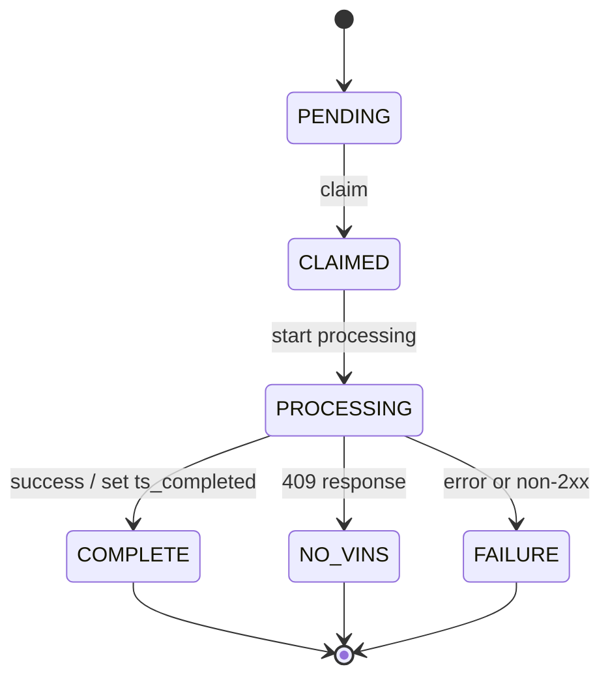

# Diagram: tools/ide_local_testing/localTest/utility/finishedVehicleNotificationTool.py


> Auto-generated by Obscura crawlers

## Diagram 1

```mermaid
flowchart LR
  Start([Start]) --> ConnectDB[/"Connect to DB (FvDatabaseConnector)"/]
  ConnectDB --> Query>Execute selectQuery]
  Query --> Fetch[Fetch results]
  Fetch --> ForEach{For each row}
  ForEach --> Process[Call process_message(solutionId, organizationId, payload, targetService, syncType)]
  Process --> HTTPCode{httpCode}
  HTTPCode --> |200-299| ChangeComplete[change_state(rowId, COMPLETE)]
  HTTPCode --> |409| ChangeNoVins[change_state(rowId, NO_VINS)]
  HTTPCode --> |other| ChangeFailure[change_state(rowId, FAILURE)]
  ChangeComplete --> UpdateDB[Update finished_vehicle_notification (state=COMPLETE, ts_completed=now())]
  ChangeNoVins --> UpdateDB2[Update finished_vehicle_notification (state=NO_VINS)]
  ChangeFailure --> UpdateDB3[Update finished_vehicle_notification (state=FAILURE)]
  UpdateDB --> NextRow([Next row])
  UpdateDB2 --> NextRow
  UpdateDB3 --> NextRow
  NextRow --> ForEach
  ForEach --> End([End])
```

> SVG rendering failed for this diagram.

## Diagram 2



### SVG

<svg id="container" width="465.28125" xmlns="http://www.w3.org/2000/svg" class="statediagram" height="526" viewBox="0 0 465.28125 526" role="graphics-document document" aria-roledescription="stateDiagram"><style>#container{font-family:"trebuchet ms",verdana,arial,sans-serif;font-size:16px;fill:#333;}@keyframes edge-animation-frame{from{stroke-dashoffset:0;}}@keyframes dash{to{stroke-dashoffset:0;}}#container .edge-animation-slow{stroke-dasharray:9,5!important;stroke-dashoffset:900;animation:dash 50s linear infinite;stroke-linecap:round;}#container .edge-animation-fast{stroke-dasharray:9,5!important;stroke-dashoffset:900;animation:dash 20s linear infinite;stroke-linecap:round;}#container .error-icon{fill:#552222;}#container .error-text{fill:#552222;stroke:#552222;}#container .edge-thickness-normal{stroke-width:1px;}#container .edge-thickness-thick{stroke-width:3.5px;}#container .edge-pattern-solid{stroke-dasharray:0;}#container .edge-thickness-invisible{stroke-width:0;fill:none;}#container .edge-pattern-dashed{stroke-dasharray:3;}#container .edge-pattern-dotted{stroke-dasharray:2;}#container .marker{fill:#333333;stroke:#333333;}#container .marker.cross{stroke:#333333;}#container svg{font-family:"trebuchet ms",verdana,arial,sans-serif;font-size:16px;}#container p{margin:0;}#container defs #statediagram-barbEnd{fill:#333333;stroke:#333333;}#container g.stateGroup text{fill:#9370DB;stroke:none;font-size:10px;}#container g.stateGroup text{fill:#333;stroke:none;font-size:10px;}#container g.stateGroup .state-title{font-weight:bolder;fill:#131300;}#container g.stateGroup rect{fill:#ECECFF;stroke:#9370DB;}#container g.stateGroup line{stroke:#333333;stroke-width:1;}#container .transition{stroke:#333333;stroke-width:1;fill:none;}#container .stateGroup .composit{fill:white;border-bottom:1px;}#container .stateGroup .alt-composit{fill:#e0e0e0;border-bottom:1px;}#container .state-note{stroke:#aaaa33;fill:#fff5ad;}#container .state-note text{fill:black;stroke:none;font-size:10px;}#container .stateLabel .box{stroke:none;stroke-width:0;fill:#ECECFF;opacity:0.5;}#container .edgeLabel .label rect{fill:#ECECFF;opacity:0.5;}#container .edgeLabel{background-color:rgba(232,232,232, 0.8);text-align:center;}#container .edgeLabel p{background-color:rgba(232,232,232, 0.8);}#container .edgeLabel rect{opacity:0.5;background-color:rgba(232,232,232, 0.8);fill:rgba(232,232,232, 0.8);}#container .edgeLabel .label text{fill:#333;}#container .label div .edgeLabel{color:#333;}#container .stateLabel text{fill:#131300;font-size:10px;font-weight:bold;}#container .node circle.state-start{fill:#333333;stroke:#333333;}#container .node .fork-join{fill:#333333;stroke:#333333;}#container .node circle.state-end{fill:#9370DB;stroke:white;stroke-width:1.5;}#container .end-state-inner{fill:white;stroke-width:1.5;}#container .node rect{fill:#ECECFF;stroke:#9370DB;stroke-width:1px;}#container .node polygon{fill:#ECECFF;stroke:#9370DB;stroke-width:1px;}#container #statediagram-barbEnd{fill:#333333;}#container .statediagram-cluster rect{fill:#ECECFF;stroke:#9370DB;stroke-width:1px;}#container .cluster-label,#container .nodeLabel{color:#131300;}#container .statediagram-cluster rect.outer{rx:5px;ry:5px;}#container .statediagram-state .divider{stroke:#9370DB;}#container .statediagram-state .title-state{rx:5px;ry:5px;}#container .statediagram-cluster.statediagram-cluster .inner{fill:white;}#container .statediagram-cluster.statediagram-cluster-alt .inner{fill:#f0f0f0;}#container .statediagram-cluster .inner{rx:0;ry:0;}#container .statediagram-state rect.basic{rx:5px;ry:5px;}#container .statediagram-state rect.divider{stroke-dasharray:10,10;fill:#f0f0f0;}#container .note-edge{stroke-dasharray:5;}#container .statediagram-note rect{fill:#fff5ad;stroke:#aaaa33;stroke-width:1px;rx:0;ry:0;}#container .statediagram-note rect{fill:#fff5ad;stroke:#aaaa33;stroke-width:1px;rx:0;ry:0;}#container .statediagram-note text{fill:black;}#container .statediagram-note .nodeLabel{color:black;}#container .statediagram .edgeLabel{color:red;}#container #dependencyStart,#container #dependencyEnd{fill:#333333;stroke:#333333;stroke-width:1;}#container .statediagramTitleText{text-anchor:middle;font-size:18px;fill:#333;}#container :root{--mermaid-font-family:"trebuchet ms",verdana,arial,sans-serif;}</style><g><defs><marker id="container_stateDiagram-barbEnd" refX="19" refY="7" markerWidth="20" markerHeight="14" markerUnits="userSpaceOnUse" orient="auto"><path d="M 19,7 L9,13 L14,7 L9,1 Z"></path></marker></defs><g class="root"><g class="clusters"></g><g class="edgePaths"><path d="M272.039,22L272.039,26.167C272.039,30.333,272.039,38.667,272.122,47.083C272.206,55.5,272.372,64,272.456,68.25L272.539,72.5" id="edge0" class="edge-thickness-normal edge-pattern-solid transition" style="fill:none;;;fill:none" data-edge="true" data-et="edge" data-id="edge0" data-points="W3sieCI6MjcyLjAzOTA2MjUsInkiOjIyfSx7IngiOjI3Mi4wMzkwNjI1LCJ5Ijo0N30seyJ4IjoyNzIuNTM5MDYyNSwieSI6NzIuNX1d" marker-end="url(#container_stateDiagram-barbEnd)"></path><path d="M272.539,112.5L272.456,118.583C272.372,124.667,272.206,136.833,272.206,149.167C272.206,161.5,272.372,174,272.456,180.25L272.539,186.5" id="edge1" class="edge-thickness-normal edge-pattern-solid transition" style="fill:none;;;fill:none" data-edge="true" data-et="edge" data-id="edge1" data-points="W3sieCI6MjcyLjUzOTA2MjUsInkiOjExMi41fSx7IngiOjI3Mi4wMzkwNjI1LCJ5IjoxNDl9LHsieCI6MjcyLjUzOTA2MjUsInkiOjE4Ni41fV0=" marker-end="url(#container_stateDiagram-barbEnd)"></path><path d="M272.539,226.5L272.456,232.583C272.372,238.667,272.206,250.833,272.206,263.167C272.206,275.5,272.372,288,272.456,294.25L272.539,300.5" id="edge2" class="edge-thickness-normal edge-pattern-solid transition" style="fill:none;;;fill:none" data-edge="true" data-et="edge" data-id="edge2" data-points="W3sieCI6MjcyLjUzOTA2MjUsInkiOjIyNi41fSx7IngiOjI3Mi4wMzkwNjI1LCJ5IjoyNjN9LHsieCI6MjcyLjUzOTA2MjUsInkiOjMwMC41fV0=" marker-end="url(#container_stateDiagram-barbEnd)"></path><path d="M220.348,338.413L201.283,344.844C182.219,351.275,144.09,364.138,125.109,376.819C106.128,389.5,106.294,402,106.378,408.25L106.461,414.5" id="edge3" class="edge-thickness-normal edge-pattern-solid transition" style="fill:none;;;fill:none" data-edge="true" data-et="edge" data-id="edge3" data-points="W3sieCI6MjIwLjM0NzUyMTg0MDcxOTQyLCJ5IjozMzguNDEyNzYxMzQzOTY5ODZ9LHsieCI6MTA1Ljk2MDkzNzUsInkiOjM3N30seyJ4IjoxMDYuNDYwOTM3NSwieSI6NDE0LjV9XQ==" marker-end="url(#container_stateDiagram-barbEnd)"></path><path d="M272.539,340.5L272.456,346.583C272.372,352.667,272.206,364.833,272.206,377.167C272.206,389.5,272.372,402,272.456,408.25L272.539,414.5" id="edge4" class="edge-thickness-normal edge-pattern-solid transition" style="fill:none;;;fill:none" data-edge="true" data-et="edge" data-id="edge4" data-points="W3sieCI6MjcyLjUzOTA2MjUsInkiOjM0MC41fSx7IngiOjI3Mi4wMzkwNjI1LCJ5IjozNzd9LHsieCI6MjcyLjUzOTA2MjUsInkiOjQxNC41fV0=" marker-end="url(#container_stateDiagram-barbEnd)"></path><path d="M316.988,340.5L330.61,346.583C344.232,352.667,371.475,364.833,385.18,377.167C398.885,389.5,399.052,402,399.135,408.25L399.219,414.5" id="edge5" class="edge-thickness-normal edge-pattern-solid transition" style="fill:none;;;fill:none" data-edge="true" data-et="edge" data-id="edge5" data-points="W3sieCI6MzE2Ljk4ODA3NTY1Nzg5NDc0LCJ5IjozNDAuNX0seyJ4IjozOTguNzE4NzUsInkiOjM3N30seyJ4IjozOTkuMjE4NzUsInkiOjQxNC41fV0=" marker-end="url(#container_stateDiagram-barbEnd)"></path><path d="M106.461,454.5L106.378,458.583C106.294,462.667,106.128,470.833,132.578,480.029C159.029,489.225,212.097,499.45,238.631,504.563L265.165,509.676" id="edge6" class="edge-thickness-normal edge-pattern-solid transition" style="fill:none;;;fill:none" data-edge="true" data-et="edge" data-id="edge6" data-points="W3sieCI6MTA2LjQ2MDkzNzUsInkiOjQ1NC41fSx7IngiOjEwNS45NjA5Mzc1LCJ5Ijo0Nzl9LHsieCI6MjY1LjE2NTQ5MjkwODYyNzgsInkiOjUwOS42NzU1OTc4NDMzNDA4fV0=" marker-end="url(#container_stateDiagram-barbEnd)"></path><path d="M272.539,454.5L272.456,458.583C272.372,462.667,272.206,470.833,272.122,479.083C272.039,487.333,272.039,495.667,272.039,499.833L272.039,504" id="edge7" class="edge-thickness-normal edge-pattern-solid transition" style="fill:none;;;fill:none" data-edge="true" data-et="edge" data-id="edge7" data-points="W3sieCI6MjcyLjUzOTA2MjUsInkiOjQ1NC41fSx7IngiOjI3Mi4wMzkwNjI1LCJ5Ijo0Nzl9LHsieCI6MjcyLjAzOTA2MjUsInkiOjUwNH1d" marker-end="url(#container_stateDiagram-barbEnd)"></path><path d="M399.219,454.5L399.135,458.583C399.052,462.667,398.885,470.833,378.82,479.964C358.754,489.095,318.79,499.19,298.808,504.238L278.826,509.286" id="edge8" class="edge-thickness-normal edge-pattern-solid transition" style="fill:none;;;fill:none" data-edge="true" data-et="edge" data-id="edge8" data-points="W3sieCI6Mzk5LjIxODc1LCJ5Ijo0NTQuNX0seyJ4IjozOTguNzE4NzUsInkiOjQ3OX0seyJ4IjoyNzguODI1ODc4NzA5MTI2MywieSI6NTA5LjI4NTYxMjEzNzM2Nzc2fV0=" marker-end="url(#container_stateDiagram-barbEnd)"></path></g><g class="edgeLabels"><g class="edgeLabel"><g class="label" data-id="edge0" transform="translate(0, 0)"><foreignObject width="0" height="0"><div xmlns="http://www.w3.org/1999/xhtml" class="labelBkg" style="display: table-cell; white-space: nowrap; line-height: 1.5; max-width: 200px; text-align: center;"><span class="edgeLabel"></span></div></foreignObject></g></g><g class="edgeLabel" transform="translate(272.0390625, 149)"><g class="label" data-id="edge1" transform="translate(-19.59375, -12)"><foreignObject width="39.1875" height="24"><div xmlns="http://www.w3.org/1999/xhtml" class="labelBkg" style="display: table-cell; white-space: nowrap; line-height: 1.5; max-width: 200px; text-align: center;"><span class="edgeLabel"><p>claim</p></span></div></foreignObject></g></g><g class="edgeLabel" transform="translate(272.0390625, 263)"><g class="label" data-id="edge2" transform="translate(-57.8125, -12)"><foreignObject width="115.625" height="24"><div xmlns="http://www.w3.org/1999/xhtml" class="labelBkg" style="display: table-cell; white-space: nowrap; line-height: 1.5; max-width: 200px; text-align: center;"><span class="edgeLabel"><p>start processing</p></span></div></foreignObject></g></g><g class="edgeLabel" transform="translate(105.9609375, 377)"><g class="label" data-id="edge3" transform="translate(-97.9609375, -12)"><foreignObject width="195.921875" height="24"><div xmlns="http://www.w3.org/1999/xhtml" class="labelBkg" style="display: table-cell; white-space: nowrap; line-height: 1.5; max-width: 200px; text-align: center;"><span class="edgeLabel"><p>success / set ts_completed</p></span></div></foreignObject></g></g><g class="edgeLabel" transform="translate(272.0390625, 377)"><g class="label" data-id="edge4" transform="translate(-48.1171875, -12)"><foreignObject width="96.234375" height="24"><div xmlns="http://www.w3.org/1999/xhtml" class="labelBkg" style="display: table-cell; white-space: nowrap; line-height: 1.5; max-width: 200px; text-align: center;"><span class="edgeLabel"><p>409 response</p></span></div></foreignObject></g></g><g class="edgeLabel" transform="translate(398.71875, 377)"><g class="label" data-id="edge5" transform="translate(-58.5625, -12)"><foreignObject width="117.125" height="24"><div xmlns="http://www.w3.org/1999/xhtml" class="labelBkg" style="display: table-cell; white-space: nowrap; line-height: 1.5; max-width: 200px; text-align: center;"><span class="edgeLabel"><p>error or non-2xx</p></span></div></foreignObject></g></g><g class="edgeLabel"><g class="label" data-id="edge6" transform="translate(0, 0)"><foreignObject width="0" height="0"><div xmlns="http://www.w3.org/1999/xhtml" class="labelBkg" style="display: table-cell; white-space: nowrap; line-height: 1.5; max-width: 200px; text-align: center;"><span class="edgeLabel"></span></div></foreignObject></g></g><g class="edgeLabel"><g class="label" data-id="edge7" transform="translate(0, 0)"><foreignObject width="0" height="0"><div xmlns="http://www.w3.org/1999/xhtml" class="labelBkg" style="display: table-cell; white-space: nowrap; line-height: 1.5; max-width: 200px; text-align: center;"><span class="edgeLabel"></span></div></foreignObject></g></g><g class="edgeLabel"><g class="label" data-id="edge8" transform="translate(0, 0)"><foreignObject width="0" height="0"><div xmlns="http://www.w3.org/1999/xhtml" class="labelBkg" style="display: table-cell; white-space: nowrap; line-height: 1.5; max-width: 200px; text-align: center;"><span class="edgeLabel"></span></div></foreignObject></g></g></g><g class="nodes"><g class="node default" id="state-root_start-0" transform="translate(272.0390625, 15)"><circle class="state-start" r="7" width="14" height="14"></circle></g><g class="node  statediagram-state" id="state-PENDING-1" transform="translate(272.0390625, 92)"><g class="basic label-container outer-path"><path d="M-35.421875 -20 C-13.947660233449088 -20, 7.526554533101823 -20, 35.421875 -20 C35.421875 -20, 35.421875 -20, 35.421875 -20 C35.535339897910696 -19.99530705710859, 35.6488047958214 -19.990614114217184, 35.83477172736166 -19.982922465033347 C35.940337724317935 -19.969763677235605, 36.04590372127421 -19.956604889437862, 36.24484795140367 -19.931806517013612 C36.37681806067545 -19.904135294981316, 36.50878816994722 -19.876464072949016, 36.649302435703994 -19.847001329696653 C36.764457929063006 -19.81271805393715, 36.87961342242202 -19.778434778177644, 37.04537234602342 -19.729086208503173 C37.146253106799 -19.689722413498245, 37.24713386757459 -19.650358618493318, 37.430352123264846 -19.578866633275286 C37.56990828492748 -19.510641783081688, 37.709464446590104 -19.442416932888094, 37.801611965185366 -19.397368756032446 C37.90270392756997 -19.337131021412198, 38.00379588995458 -19.27689328679195, 38.156615790612136 -19.185832391312644 C38.23578520761599 -19.129306514041335, 38.314954624619844 -19.072780636770027, 38.49293856344834 -18.94570254698197 C38.5987833130152 -18.856056616962725, 38.70462806258205 -18.766410686943477, 38.808282858128706 -18.678619553365657 C38.91505434464295 -18.57184806685142, 39.02182583115718 -18.465076580337183, 39.10049455336566 -18.386407858128706 C39.195650714385785 -18.274057191112853, 39.29080687540591 -18.161706524097, 39.36757754698197 -18.07106356344834 C39.42044138189615 -17.997023155890307, 39.47330521681032 -17.922982748332274, 39.607707391312644 -17.734740790612136 C39.68684598947114 -17.601929086476115, 39.765984587629625 -17.469117382340094, 39.81924375603245 -17.37973696518537 C39.869893991185315 -17.27613025318549, 39.92054422633817 -17.172523541185605, 40.00074163327529 -17.008477123264846 C40.05107471665992 -16.879484485654913, 40.10140780004455 -16.750491848044977, 40.150961208503176 -16.623497346023417 C40.19262180633056 -16.483561864650593, 40.23428240415794 -16.34362638327777, 40.26887632969665 -16.227427435703994 C40.29202436987543 -16.117029369863054, 40.31517241005421 -16.006631304022115, 40.35368151701361 -15.82297295140367 C40.366591661078765 -15.719401691646672, 40.379501805143924 -15.615830431889675, 40.40479746503335 -15.412896727361662 C40.40986689492221 -15.290329213092921, 40.414936324811066 -15.16776169882418, 40.421875 -15 C40.421875 -15, 40.421875 -15, 40.421875 -15 C40.421875 -7.120984959124235, 40.421875 0.7580300817515297, 40.421875 15 C40.421875 15, 40.421875 15, 40.421875 15 C40.416574995382966 15.128142297213808, 40.411274990765925 15.256284594427614, 40.40479746503335 15.412896727361662 C40.38495463821056 15.572085235313546, 40.36511181138778 15.731273743265428, 40.35368151701361 15.822972951403669 C40.32295014783899 15.969537571618577, 40.29221877866437 16.116102191833487, 40.26887632969665 16.227427435703994 C40.23203755920333 16.35116668456273, 40.19519878871001 16.47490593342147, 40.150961208503176 16.623497346023417 C40.095890658152626 16.764631070934797, 40.040820107802084 16.905764795846174, 40.00074163327529 17.008477123264846 C39.954264726540075 17.103547155540678, 39.90778781980485 17.198617187816506, 39.81924375603245 17.379736965185366 C39.754567229885104 17.48827818091456, 39.68989070373776 17.596819396643752, 39.607707391312644 17.734740790612133 C39.55433091562779 17.809499196243024, 39.50095443994293 17.884257601873916, 39.36757754698197 18.07106356344834 C39.302093550447644 18.148380372056657, 39.23660955391332 18.225697180664973, 39.10049455336566 18.386407858128706 C39.03169675952651 18.455205651967848, 38.96289896568737 18.52400344580699, 38.808282858128706 18.678619553365657 C38.695178462863666 18.774414089649145, 38.582074067598626 18.870208625932637, 38.49293856344834 18.94570254698197 C38.3770201441151 19.02846670759712, 38.26110172478187 19.11123086821227, 38.156615790612136 19.185832391312644 C38.038771994160754 19.256052052399784, 37.920928197709365 19.326271713486925, 37.801611965185366 19.397368756032446 C37.67746743980317 19.458059316346294, 37.55332291442099 19.51874987666014, 37.430352123264846 19.578866633275286 C37.322501529318465 19.6209500656228, 37.21465093537209 19.66303349797031, 37.04537234602342 19.729086208503173 C36.94777124704829 19.7581433146211, 36.850170148073154 19.787200420739026, 36.649302435703994 19.847001329696653 C36.55138759029569 19.867531913800146, 36.453472744887385 19.888062497903636, 36.24484795140367 19.931806517013612 C36.08100384568443 19.952229663492904, 35.91715973996519 19.972652809972196, 35.83477172736166 19.982922465033347 C35.746648150844706 19.986567283118905, 35.65852457432776 19.99021210120446, 35.421875 20 C35.421875 20, 35.421875 20, 35.421875 20 C19.308345241505677 20, 3.1948154830113538 20, -35.421875 20 C-35.421875 20, -35.421875 20, -35.421875 20 C-35.53753013983309 19.99521646803259, -35.65318527966617 19.990432936065183, -35.83477172736166 19.982922465033347 C-35.92326022679498 19.971892385081883, -36.011748726228305 19.96086230513042, -36.24484795140367 19.931806517013612 C-36.32978359385591 19.913997385584377, -36.41471923630814 19.896188254155142, -36.649302435703994 19.847001329696653 C-36.75034621492798 19.816919293261634, -36.851389994151965 19.786837256826615, -37.04537234602342 19.729086208503173 C-37.16334612494731 19.683052697119894, -37.2813199038712 19.637019185736616, -37.430352123264846 19.578866633275286 C-37.54007278350897 19.525227470954427, -37.64979344375309 19.47158830863357, -37.801611965185366 19.397368756032446 C-37.88433079493861 19.34807903212921, -37.96704962469186 19.298789308225974, -38.156615790612136 19.185832391312644 C-38.24274989503857 19.12433382280044, -38.328883999465006 19.062835254288235, -38.49293856344834 18.94570254698197 C-38.59952274111825 18.855430353305323, -38.70610691878815 18.76515815962868, -38.808282858128706 18.67861955336566 C-38.91628535711347 18.570617054380897, -39.02428785609823 18.46261455539613, -39.10049455336566 18.386407858128706 C-39.17521215102016 18.29818895727866, -39.24992974867466 18.209970056428617, -39.36757754698197 18.07106356344834 C-39.422279197478026 17.99444913501346, -39.47698084797408 17.91783470657858, -39.607707391312644 17.734740790612133 C-39.65686874366804 17.65223739611334, -39.70603009602343 17.569734001614545, -39.81924375603244 17.37973696518537 C-39.8779740509543 17.25960222675281, -39.93670434587615 17.139467488320253, -40.00074163327528 17.00847712326485 C-40.03408755335106 16.92301885417305, -40.067433473426824 16.837560585081253, -40.150961208503176 16.623497346023417 C-40.18948875518868 16.494085597927803, -40.22801630187418 16.36467384983219, -40.26887632969665 16.227427435703994 C-40.29711490484826 16.09275149533218, -40.32535347999987 15.958075554960365, -40.35368151701361 15.82297295140367 C-40.36991592759706 15.692732859034859, -40.386150338180514 15.562492766666045, -40.40479746503335 15.412896727361664 C-40.4101030353407 15.284619864162728, -40.41540860564805 15.15634300096379, -40.421875 15 C-40.421875 15, -40.421875 15, -40.421875 15 C-40.421875 6.757284195982502, -40.421875 -1.4854316080349967, -40.421875 -15 C-40.421875 -15, -40.421875 -15, -40.421875 -15 C-40.41557253310287 -15.152379600522636, -40.40927006620574 -15.304759201045272, -40.40479746503335 -15.41289672736166 C-40.39108867971896 -15.52287506358965, -40.37737989440457 -15.63285339981764, -40.35368151701361 -15.822972951403669 C-40.32684183708773 -15.950977254520607, -40.30000215716185 -16.078981557637547, -40.26887632969665 -16.227427435703994 C-40.228873109648404 -16.361795883250274, -40.18886988960015 -16.496164330796553, -40.150961208503176 -16.623497346023417 C-40.11223438748778 -16.722745682368117, -40.07350756647239 -16.821994018712818, -40.00074163327529 -17.008477123264846 C-39.963498836740506 -17.084658481219137, -39.92625604020573 -17.16083983917343, -39.81924375603245 -17.379736965185366 C-39.76128342412337 -17.477006952678924, -39.70332309221429 -17.574276940172478, -39.607707391312644 -17.734740790612133 C-39.55226529219944 -17.812392281860898, -39.49682319308625 -17.890043773109664, -39.36757754698197 -18.07106356344834 C-39.2966006323203 -18.154865848234497, -39.22562371765863 -18.238668133020653, -39.10049455336566 -18.386407858128706 C-38.98414738757407 -18.50275502392029, -38.86780022178249 -18.619102189711878, -38.808282858128706 -18.678619553365657 C-38.73485942883913 -18.740806025824632, -38.66143599954955 -18.802992498283608, -38.49293856344834 -18.945702546981966 C-38.37657289987878 -19.028786033844163, -38.26020723630921 -19.111869520706364, -38.156615790612136 -19.185832391312644 C-38.07491750275997 -19.234514004236964, -37.99321921490781 -19.283195617161283, -37.801611965185366 -19.397368756032446 C-37.69237342000929 -19.45077222665828, -37.583134874833206 -19.504175697284115, -37.430352123264846 -19.578866633275286 C-37.3295017289242 -19.61821857926053, -37.228651334583546 -19.65757052524578, -37.04537234602342 -19.729086208503173 C-36.94868274841312 -19.75787194890737, -36.85199315080281 -19.78665768931156, -36.649302435703994 -19.847001329696653 C-36.53536635255618 -19.87089121409298, -36.421430269408376 -19.894781098489307, -36.24484795140367 -19.931806517013612 C-36.126662399102045 -19.946538330744698, -36.00847684680042 -19.961270144475783, -35.83477172736166 -19.982922465033347 C-35.726845205925734 -19.98738633897933, -35.618918684489806 -19.991850212925314, -35.421875 -20 C-35.421875 -20, -35.421875 -20, -35.421875 -20" stroke="none" stroke-width="0" fill="#ECECFF" style=""></path><path d="M-35.421875 -20 C-14.418703943239468 -20, 6.584467113521065 -20, 35.421875 -20 M-35.421875 -20 C-12.423584472918392 -20, 10.574706054163215 -20, 35.421875 -20 M35.421875 -20 C35.421875 -20, 35.421875 -20, 35.421875 -20 M35.421875 -20 C35.421875 -20, 35.421875 -20, 35.421875 -20 M35.421875 -20 C35.568241523958115 -19.993946235789238, 35.71460804791623 -19.98789247157848, 35.83477172736166 -19.982922465033347 M35.421875 -20 C35.54819182689383 -19.99477549739389, 35.67450865378766 -19.989550994787777, 35.83477172736166 -19.982922465033347 M35.83477172736166 -19.982922465033347 C35.92649536133263 -19.971489125982313, 36.018218995303585 -19.960055786931274, 36.24484795140367 -19.931806517013612 M35.83477172736166 -19.982922465033347 C35.96337376289588 -19.96689223802139, 36.09197579843009 -19.950862011009434, 36.24484795140367 -19.931806517013612 M36.24484795140367 -19.931806517013612 C36.39153165734937 -19.90105017818703, 36.538215363295066 -19.87029383936045, 36.649302435703994 -19.847001329696653 M36.24484795140367 -19.931806517013612 C36.37459364636404 -19.904601705615075, 36.50433934132441 -19.877396894216535, 36.649302435703994 -19.847001329696653 M36.649302435703994 -19.847001329696653 C36.73920915327156 -19.820234940173304, 36.829115870839125 -19.793468550649955, 37.04537234602342 -19.729086208503173 M36.649302435703994 -19.847001329696653 C36.743819556570095 -19.818862363641905, 36.83833667743619 -19.79072339758716, 37.04537234602342 -19.729086208503173 M37.04537234602342 -19.729086208503173 C37.147108507067976 -19.689388635277542, 37.24884466811253 -19.649691062051907, 37.430352123264846 -19.578866633275286 M37.04537234602342 -19.729086208503173 C37.13232367070571 -19.695157696328142, 37.219274995388 -19.661229184153115, 37.430352123264846 -19.578866633275286 M37.430352123264846 -19.578866633275286 C37.505486863124105 -19.542135497149424, 37.58062160298336 -19.50540436102356, 37.801611965185366 -19.397368756032446 M37.430352123264846 -19.578866633275286 C37.56288708837471 -19.514074236921676, 37.69542205348456 -19.449281840568062, 37.801611965185366 -19.397368756032446 M37.801611965185366 -19.397368756032446 C37.930171346061385 -19.320763992552926, 38.058730726937405 -19.24415922907341, 38.156615790612136 -19.185832391312644 M37.801611965185366 -19.397368756032446 C37.93165168239858 -19.319881903558656, 38.0616913996118 -19.242395051084866, 38.156615790612136 -19.185832391312644 M38.156615790612136 -19.185832391312644 C38.27390052177212 -19.10209270280357, 38.391185252932104 -19.018353014294494, 38.49293856344834 -18.94570254698197 M38.156615790612136 -19.185832391312644 C38.26708648755927 -19.106957829720187, 38.377557184506394 -19.02808326812773, 38.49293856344834 -18.94570254698197 M38.49293856344834 -18.94570254698197 C38.58670399681905 -18.866287275912097, 38.68046943018975 -18.786872004842223, 38.808282858128706 -18.678619553365657 M38.49293856344834 -18.94570254698197 C38.59835223720977 -18.856421719545935, 38.7037659109712 -18.767140892109904, 38.808282858128706 -18.678619553365657 M38.808282858128706 -18.678619553365657 C38.91188719246584 -18.57501521902852, 39.01549152680298 -18.471410884691384, 39.10049455336566 -18.386407858128706 M38.808282858128706 -18.678619553365657 C38.91895711837235 -18.567945293122015, 39.02963137861599 -18.457271032878378, 39.10049455336566 -18.386407858128706 M39.10049455336566 -18.386407858128706 C39.19546768095766 -18.274273298273076, 39.29044080854966 -18.16213873841745, 39.36757754698197 -18.07106356344834 M39.10049455336566 -18.386407858128706 C39.1877725198941 -18.28335895777234, 39.275050486422536 -18.180310057415973, 39.36757754698197 -18.07106356344834 M39.36757754698197 -18.07106356344834 C39.44306005694647 -17.965343730402775, 39.518542566910966 -17.85962389735721, 39.607707391312644 -17.734740790612136 M39.36757754698197 -18.07106356344834 C39.46180201209402 -17.93909398897157, 39.55602647720606 -17.807124414494805, 39.607707391312644 -17.734740790612136 M39.607707391312644 -17.734740790612136 C39.68739261568742 -17.601011729320444, 39.7670778400622 -17.467282668028755, 39.81924375603245 -17.37973696518537 M39.607707391312644 -17.734740790612136 C39.66054891858924 -17.646061265701924, 39.71339044586584 -17.557381740791712, 39.81924375603245 -17.37973696518537 M39.81924375603245 -17.37973696518537 C39.859254659138934 -17.297893354736214, 39.899265562245425 -17.216049744287055, 40.00074163327529 -17.008477123264846 M39.81924375603245 -17.37973696518537 C39.860136512285635 -17.29608949529271, 39.90102926853882 -17.212442025400044, 40.00074163327529 -17.008477123264846 M40.00074163327529 -17.008477123264846 C40.045774386149404 -16.893068068594417, 40.09080713902351 -16.777659013923987, 40.150961208503176 -16.623497346023417 M40.00074163327529 -17.008477123264846 C40.03234675271275 -16.927480143861448, 40.0639518721502 -16.84648316445805, 40.150961208503176 -16.623497346023417 M40.150961208503176 -16.623497346023417 C40.188001380676155 -16.499081600847724, 40.22504155284914 -16.374665855672028, 40.26887632969665 -16.227427435703994 M40.150961208503176 -16.623497346023417 C40.19517887750014 -16.474972813996473, 40.239396546497105 -16.32644828196953, 40.26887632969665 -16.227427435703994 M40.26887632969665 -16.227427435703994 C40.300745616504464 -16.075435837446022, 40.33261490331227 -15.923444239188054, 40.35368151701361 -15.82297295140367 M40.26887632969665 -16.227427435703994 C40.29634695086455 -16.096414035823774, 40.32381757203246 -15.96540063594355, 40.35368151701361 -15.82297295140367 M40.35368151701361 -15.82297295140367 C40.36669488320714 -15.718573595088174, 40.379708249400664 -15.614174238772678, 40.40479746503335 -15.412896727361662 M40.35368151701361 -15.82297295140367 C40.36891716727467 -15.700745385019365, 40.38415281753573 -15.578517818635058, 40.40479746503335 -15.412896727361662 M40.40479746503335 -15.412896727361662 C40.40910050527081 -15.308858806477751, 40.41340354550827 -15.204820885593838, 40.421875 -15 M40.40479746503335 -15.412896727361662 C40.410704824573685 -15.270069941978507, 40.41661218411403 -15.127243156595352, 40.421875 -15 M40.421875 -15 C40.421875 -15, 40.421875 -15, 40.421875 -15 M40.421875 -15 C40.421875 -15, 40.421875 -15, 40.421875 -15 M40.421875 -15 C40.421875 -3.3324382623031816, 40.421875 8.335123475393637, 40.421875 15 M40.421875 -15 C40.421875 -8.292591080156448, 40.421875 -1.5851821603128986, 40.421875 15 M40.421875 15 C40.421875 15, 40.421875 15, 40.421875 15 M40.421875 15 C40.421875 15, 40.421875 15, 40.421875 15 M40.421875 15 C40.41827605946199 15.087014359684519, 40.41467711892398 15.174028719369037, 40.40479746503335 15.412896727361662 M40.421875 15 C40.41614992854084 15.138419465924983, 40.41042485708168 15.276838931849966, 40.40479746503335 15.412896727361662 M40.40479746503335 15.412896727361662 C40.39404739084453 15.499138888610842, 40.38329731665571 15.58538104986002, 40.35368151701361 15.822972951403669 M40.40479746503335 15.412896727361662 C40.38926011169437 15.537544698018356, 40.3737227583554 15.66219266867505, 40.35368151701361 15.822972951403669 M40.35368151701361 15.822972951403669 C40.333432689460096 15.919544038207992, 40.31318386190658 16.016115125012316, 40.26887632969665 16.227427435703994 M40.35368151701361 15.822972951403669 C40.336582662529615 15.90452112777409, 40.319483808045625 15.986069304144515, 40.26887632969665 16.227427435703994 M40.26887632969665 16.227427435703994 C40.22486603986419 16.37525539339632, 40.18085575003173 16.523083351088648, 40.150961208503176 16.623497346023417 M40.26887632969665 16.227427435703994 C40.23050657973598 16.356309153944064, 40.192136829775315 16.485190872184134, 40.150961208503176 16.623497346023417 M40.150961208503176 16.623497346023417 C40.11605063346803 16.712965482116957, 40.08114005843287 16.802433618210497, 40.00074163327529 17.008477123264846 M40.150961208503176 16.623497346023417 C40.119984595027354 16.70288360269154, 40.089007981551525 16.78226985935966, 40.00074163327529 17.008477123264846 M40.00074163327529 17.008477123264846 C39.960245191921686 17.09131391807301, 39.91974875056808 17.174150712881175, 39.81924375603245 17.379736965185366 M40.00074163327529 17.008477123264846 C39.94609564486977 17.12025727918303, 39.891449656464246 17.232037435101212, 39.81924375603245 17.379736965185366 M39.81924375603245 17.379736965185366 C39.77218968569117 17.458703884160183, 39.725135615349885 17.537670803134997, 39.607707391312644 17.734740790612133 M39.81924375603245 17.379736965185366 C39.758742799008466 17.481270671760804, 39.698241841984476 17.582804378336238, 39.607707391312644 17.734740790612133 M39.607707391312644 17.734740790612133 C39.51796151105795 17.860437716714834, 39.42821563080325 17.986134642817536, 39.36757754698197 18.07106356344834 M39.607707391312644 17.734740790612133 C39.531093022959396 17.842045889965696, 39.45447865460615 17.949350989319264, 39.36757754698197 18.07106356344834 M39.36757754698197 18.07106356344834 C39.26259937624436 18.195011055423972, 39.15762120550676 18.318958547399607, 39.10049455336566 18.386407858128706 M39.36757754698197 18.07106356344834 C39.298631563347485 18.15246793250186, 39.229685579713 18.23387230155538, 39.10049455336566 18.386407858128706 M39.10049455336566 18.386407858128706 C38.99844068590633 18.488461725588035, 38.896386818447 18.59051559304736, 38.808282858128706 18.678619553365657 M39.10049455336566 18.386407858128706 C39.0196373762095 18.467265035284864, 38.93878019905334 18.54812221244102, 38.808282858128706 18.678619553365657 M38.808282858128706 18.678619553365657 C38.688312112780835 18.78022959151893, 38.56834136743297 18.881839629672204, 38.49293856344834 18.94570254698197 M38.808282858128706 18.678619553365657 C38.734184143928566 18.741377962969207, 38.66008542972843 18.804136372572753, 38.49293856344834 18.94570254698197 M38.49293856344834 18.94570254698197 C38.380827050668174 19.02574862856173, 38.26871553788801 19.105794710141485, 38.156615790612136 19.185832391312644 M38.49293856344834 18.94570254698197 C38.38386775771607 19.023577605458215, 38.274796951983795 19.101452663934456, 38.156615790612136 19.185832391312644 M38.156615790612136 19.185832391312644 C38.035017681186034 19.25828913736003, 37.91341957175993 19.330745883407417, 37.801611965185366 19.397368756032446 M38.156615790612136 19.185832391312644 C38.07571412725996 19.23403931906823, 37.99481246390778 19.282246246823817, 37.801611965185366 19.397368756032446 M37.801611965185366 19.397368756032446 C37.71410050350654 19.440150502765302, 37.62658904182773 19.48293224949816, 37.430352123264846 19.578866633275286 M37.801611965185366 19.397368756032446 C37.68677787318646 19.453507722814024, 37.57194378118755 19.509646689595606, 37.430352123264846 19.578866633275286 M37.430352123264846 19.578866633275286 C37.346229337274124 19.61169144622796, 37.262106551283395 19.64451625918064, 37.04537234602342 19.729086208503173 M37.430352123264846 19.578866633275286 C37.3204606834399 19.62174640615575, 37.210569243614955 19.664626179036215, 37.04537234602342 19.729086208503173 M37.04537234602342 19.729086208503173 C36.916638307480156 19.76741199231319, 36.7879042689369 19.805737776123205, 36.649302435703994 19.847001329696653 M37.04537234602342 19.729086208503173 C36.908253699649855 19.76990819821702, 36.771135053276296 19.810730187930872, 36.649302435703994 19.847001329696653 M36.649302435703994 19.847001329696653 C36.56649539620384 19.864364140021582, 36.48368835670369 19.88172695034651, 36.24484795140367 19.931806517013612 M36.649302435703994 19.847001329696653 C36.526404769802994 19.872770260397424, 36.403507103901994 19.898539191098198, 36.24484795140367 19.931806517013612 M36.24484795140367 19.931806517013612 C36.13753012996179 19.94518366950576, 36.0302123085199 19.95856082199791, 35.83477172736166 19.982922465033347 M36.24484795140367 19.931806517013612 C36.15794865547471 19.942638502954843, 36.071049359545746 19.953470488896077, 35.83477172736166 19.982922465033347 M35.83477172736166 19.982922465033347 C35.71212609111711 19.987995126071027, 35.58948045487257 19.99306778710871, 35.421875 20 M35.83477172736166 19.982922465033347 C35.72583193712453 19.98742824808695, 35.6168921468874 19.991934031140552, 35.421875 20 M35.421875 20 C35.421875 20, 35.421875 20, 35.421875 20 M35.421875 20 C35.421875 20, 35.421875 20, 35.421875 20 M35.421875 20 C10.070559799908025 20, -15.28075540018395 20, -35.421875 20 M35.421875 20 C19.48276867205604 20, 3.543662344112075 20, -35.421875 20 M-35.421875 20 C-35.421875 20, -35.421875 20, -35.421875 20 M-35.421875 20 C-35.421875 20, -35.421875 20, -35.421875 20 M-35.421875 20 C-35.532650747472644 19.995418281193437, -35.64342649494529 19.990836562386875, -35.83477172736166 19.982922465033347 M-35.421875 20 C-35.514225599861476 19.996180350935685, -35.60657619972295 19.99236070187137, -35.83477172736166 19.982922465033347 M-35.83477172736166 19.982922465033347 C-35.9177001249985 19.97258545104804, -36.000628522635324 19.962248437062733, -36.24484795140367 19.931806517013612 M-35.83477172736166 19.982922465033347 C-35.92570592042911 19.97158752968831, -36.016640113496564 19.960252594343277, -36.24484795140367 19.931806517013612 M-36.24484795140367 19.931806517013612 C-36.37154142583511 19.90524168895989, -36.49823490026655 19.878676860906168, -36.649302435703994 19.847001329696653 M-36.24484795140367 19.931806517013612 C-36.37973877495144 19.903522885598086, -36.514629598499205 19.87523925418256, -36.649302435703994 19.847001329696653 M-36.649302435703994 19.847001329696653 C-36.75374222641198 19.81590825683782, -36.858182017119965 19.784815183978985, -37.04537234602342 19.729086208503173 M-36.649302435703994 19.847001329696653 C-36.77903443917666 19.80837843885444, -36.90876644264932 19.769755548012228, -37.04537234602342 19.729086208503173 M-37.04537234602342 19.729086208503173 C-37.129978668559886 19.69607271900486, -37.21458499109636 19.66305922950655, -37.430352123264846 19.578866633275286 M-37.04537234602342 19.729086208503173 C-37.17702835782609 19.677713873283622, -37.308684369628764 19.626341538064068, -37.430352123264846 19.578866633275286 M-37.430352123264846 19.578866633275286 C-37.52285182892642 19.53364628265423, -37.615351534588 19.488425932033174, -37.801611965185366 19.397368756032446 M-37.430352123264846 19.578866633275286 C-37.514104605989004 19.53792253937701, -37.59785708871316 19.49697844547874, -37.801611965185366 19.397368756032446 M-37.801611965185366 19.397368756032446 C-37.91325597163508 19.330843367922228, -38.024899978084804 19.264317979812013, -38.156615790612136 19.185832391312644 M-37.801611965185366 19.397368756032446 C-37.9174243713735 19.328359540807682, -38.03323677756163 19.259350325582915, -38.156615790612136 19.185832391312644 M-38.156615790612136 19.185832391312644 C-38.23679457329218 19.12858584080041, -38.31697335597222 19.071339290288183, -38.49293856344834 18.94570254698197 M-38.156615790612136 19.185832391312644 C-38.25190175826905 19.11779951804808, -38.34718772592596 19.049766644783517, -38.49293856344834 18.94570254698197 M-38.49293856344834 18.94570254698197 C-38.565088761713255 18.884594446192843, -38.63723895997817 18.82348634540372, -38.808282858128706 18.67861955336566 M-38.49293856344834 18.94570254698197 C-38.56220007733291 18.88704103706171, -38.63146159121749 18.828379527141454, -38.808282858128706 18.67861955336566 M-38.808282858128706 18.67861955336566 C-38.90397976033029 18.58292265116408, -38.99967666253186 18.4872257489625, -39.10049455336566 18.386407858128706 M-38.808282858128706 18.67861955336566 C-38.92071455636127 18.566187855133094, -39.03314625459384 18.453756156900525, -39.10049455336566 18.386407858128706 M-39.10049455336566 18.386407858128706 C-39.159542677931704 18.316689869194416, -39.21859080249775 18.24697188026013, -39.36757754698197 18.07106356344834 M-39.10049455336566 18.386407858128706 C-39.181980904746375 18.29019710485572, -39.26346725612709 18.193986351582737, -39.36757754698197 18.07106356344834 M-39.36757754698197 18.07106356344834 C-39.43780532524502 17.97270344006846, -39.508033103508076 17.874343316688584, -39.607707391312644 17.734740790612133 M-39.36757754698197 18.07106356344834 C-39.41568676999071 18.003682404199296, -39.463795992999444 17.93630124495025, -39.607707391312644 17.734740790612133 M-39.607707391312644 17.734740790612133 C-39.65536267427603 17.654764906672714, -39.70301795723942 17.574789022733295, -39.81924375603244 17.37973696518537 M-39.607707391312644 17.734740790612133 C-39.66713164956811 17.63501401771527, -39.72655590782358 17.53528724481841, -39.81924375603244 17.37973696518537 M-39.81924375603244 17.37973696518537 C-39.87885345270514 17.257803381719686, -39.938463149377824 17.135869798254006, -40.00074163327528 17.00847712326485 M-39.81924375603244 17.37973696518537 C-39.87696295297933 17.261670460718147, -39.93468214992623 17.143603956250928, -40.00074163327528 17.00847712326485 M-40.00074163327528 17.00847712326485 C-40.03701986826868 16.91550397508971, -40.073298103262076 16.82253082691457, -40.150961208503176 16.623497346023417 M-40.00074163327528 17.00847712326485 C-40.06036833554778 16.855666981685875, -40.11999503782028 16.7028568401069, -40.150961208503176 16.623497346023417 M-40.150961208503176 16.623497346023417 C-40.1753691569285 16.541512492460516, -40.199777105353824 16.45952763889761, -40.26887632969665 16.227427435703994 M-40.150961208503176 16.623497346023417 C-40.18060514349436 16.523925123609214, -40.21024907848555 16.42435290119501, -40.26887632969665 16.227427435703994 M-40.26887632969665 16.227427435703994 C-40.29115387728957 16.12118093937244, -40.31343142488248 16.01493444304089, -40.35368151701361 15.82297295140367 M-40.26887632969665 16.227427435703994 C-40.293587251778376 16.109575644282387, -40.3182981738601 15.991723852860781, -40.35368151701361 15.82297295140367 M-40.35368151701361 15.82297295140367 C-40.36547935055106 15.72832517089014, -40.377277184088506 15.633677390376608, -40.40479746503335 15.412896727361664 M-40.35368151701361 15.82297295140367 C-40.365893070307926 15.725006116029993, -40.37810462360223 15.627039280656314, -40.40479746503335 15.412896727361664 M-40.40479746503335 15.412896727361664 C-40.40968839053069 15.294645051369393, -40.41457931602804 15.17639337537712, -40.421875 15 M-40.40479746503335 15.412896727361664 C-40.41027525194246 15.28045605062618, -40.41575303885158 15.148015373890697, -40.421875 15 M-40.421875 15 C-40.421875 15, -40.421875 15, -40.421875 15 M-40.421875 15 C-40.421875 15, -40.421875 15, -40.421875 15 M-40.421875 15 C-40.421875 3.727627742590844, -40.421875 -7.544744514818312, -40.421875 -15 M-40.421875 15 C-40.421875 4.264443655609977, -40.421875 -6.471112688780046, -40.421875 -15 M-40.421875 -15 C-40.421875 -15, -40.421875 -15, -40.421875 -15 M-40.421875 -15 C-40.421875 -15, -40.421875 -15, -40.421875 -15 M-40.421875 -15 C-40.41596620494111 -15.142861493021844, -40.41005740988221 -15.28572298604369, -40.40479746503335 -15.41289672736166 M-40.421875 -15 C-40.41588651307507 -15.144788264698596, -40.409898026150145 -15.289576529397191, -40.40479746503335 -15.41289672736166 M-40.40479746503335 -15.41289672736166 C-40.38675299262176 -15.557657988729996, -40.36870852021017 -15.702419250098332, -40.35368151701361 -15.822972951403669 M-40.40479746503335 -15.41289672736166 C-40.38996938645367 -15.5318545616447, -40.375141307873996 -15.65081239592774, -40.35368151701361 -15.822972951403669 M-40.35368151701361 -15.822972951403669 C-40.33285261132022 -15.922310557713935, -40.31202370562683 -16.0216481640242, -40.26887632969665 -16.227427435703994 M-40.35368151701361 -15.822972951403669 C-40.33561691560671 -15.90912698604797, -40.317552314199794 -15.995281020692271, -40.26887632969665 -16.227427435703994 M-40.26887632969665 -16.227427435703994 C-40.24065470674204 -16.32222219620261, -40.21243308378743 -16.41701695670123, -40.150961208503176 -16.623497346023417 M-40.26887632969665 -16.227427435703994 C-40.23481518619057 -16.341836799976246, -40.20075404268449 -16.456246164248494, -40.150961208503176 -16.623497346023417 M-40.150961208503176 -16.623497346023417 C-40.117119440357705 -16.71022636481032, -40.083277672212226 -16.79695538359723, -40.00074163327529 -17.008477123264846 M-40.150961208503176 -16.623497346023417 C-40.09356971247872 -16.770579144926984, -40.03617821645427 -16.91766094383055, -40.00074163327529 -17.008477123264846 M-40.00074163327529 -17.008477123264846 C-39.92993390267629 -17.153316651243248, -39.859126172077296 -17.298156179221646, -39.81924375603245 -17.379736965185366 M-40.00074163327529 -17.008477123264846 C-39.942694763437494 -17.127213893343583, -39.88464789359969 -17.24595066342232, -39.81924375603245 -17.379736965185366 M-39.81924375603245 -17.379736965185366 C-39.76903009056061 -17.46400636895816, -39.718816425088775 -17.54827577273095, -39.607707391312644 -17.734740790612133 M-39.81924375603245 -17.379736965185366 C-39.736295377415495 -17.518942305888707, -39.65334699879854 -17.65814764659205, -39.607707391312644 -17.734740790612133 M-39.607707391312644 -17.734740790612133 C-39.53781170859579 -17.832635785239457, -39.46791602587894 -17.930530779866782, -39.36757754698197 -18.07106356344834 M-39.607707391312644 -17.734740790612133 C-39.55171676210348 -17.81316054606135, -39.49572613289431 -17.891580301510572, -39.36757754698197 -18.07106356344834 M-39.36757754698197 -18.07106356344834 C-39.30187309064456 -18.14864066845429, -39.236168634307155 -18.226217773460238, -39.10049455336566 -18.386407858128706 M-39.36757754698197 -18.07106356344834 C-39.29654515222573 -18.15493135345837, -39.225512757469495 -18.238799143468402, -39.10049455336566 -18.386407858128706 M-39.10049455336566 -18.386407858128706 C-39.00798685547173 -18.47891555602263, -38.915479157577806 -18.57142325391656, -38.808282858128706 -18.678619553365657 M-39.10049455336566 -18.386407858128706 C-39.0228628253493 -18.464039586145066, -38.945231097332936 -18.541671314161423, -38.808282858128706 -18.678619553365657 M-38.808282858128706 -18.678619553365657 C-38.730978709599654 -18.744092827359804, -38.65367456107061 -18.809566101353948, -38.49293856344834 -18.945702546981966 M-38.808282858128706 -18.678619553365657 C-38.696107009454614 -18.773627650803075, -38.58393116078052 -18.868635748240496, -38.49293856344834 -18.945702546981966 M-38.49293856344834 -18.945702546981966 C-38.38967896475504 -19.0194284833816, -38.28641936606174 -19.09315441978123, -38.156615790612136 -19.185832391312644 M-38.49293856344834 -18.945702546981966 C-38.38764708379392 -19.02087921850363, -38.282355604139504 -19.09605589002529, -38.156615790612136 -19.185832391312644 M-38.156615790612136 -19.185832391312644 C-38.05407341862184 -19.246934382465827, -37.951531046631544 -19.30803637361901, -37.801611965185366 -19.397368756032446 M-38.156615790612136 -19.185832391312644 C-38.02865387491403 -19.262081142820655, -37.90069195921592 -19.338329894328666, -37.801611965185366 -19.397368756032446 M-37.801611965185366 -19.397368756032446 C-37.72609268423614 -19.43428788284208, -37.65057340328693 -19.471207009651717, -37.430352123264846 -19.578866633275286 M-37.801611965185366 -19.397368756032446 C-37.67326362269321 -19.460114437303705, -37.54491528020106 -19.52286011857496, -37.430352123264846 -19.578866633275286 M-37.430352123264846 -19.578866633275286 C-37.32547650589878 -19.619789226158947, -37.22060088853271 -19.660711819042607, -37.04537234602342 -19.729086208503173 M-37.430352123264846 -19.578866633275286 C-37.348890049321504 -19.610653233165383, -37.26742797537816 -19.64243983305548, -37.04537234602342 -19.729086208503173 M-37.04537234602342 -19.729086208503173 C-36.926876093993314 -19.764364071211386, -36.80837984196321 -19.7996419339196, -36.649302435703994 -19.847001329696653 M-37.04537234602342 -19.729086208503173 C-36.95282099506934 -19.75663993949872, -36.86026964411525 -19.784193670494265, -36.649302435703994 -19.847001329696653 M-36.649302435703994 -19.847001329696653 C-36.550830171377406 -19.86764879225647, -36.45235790705081 -19.88829625481629, -36.24484795140367 -19.931806517013612 M-36.649302435703994 -19.847001329696653 C-36.48808231974966 -19.880805633180692, -36.32686220379532 -19.914609936664736, -36.24484795140367 -19.931806517013612 M-36.24484795140367 -19.931806517013612 C-36.12686986321612 -19.946512470369846, -36.00889177502857 -19.96121842372608, -35.83477172736166 -19.982922465033347 M-36.24484795140367 -19.931806517013612 C-36.15029382008083 -19.943592677191614, -36.055739688758 -19.955378837369615, -35.83477172736166 -19.982922465033347 M-35.83477172736166 -19.982922465033347 C-35.71384611349742 -19.98792398541915, -35.592920499633166 -19.99292550580495, -35.421875 -20 M-35.83477172736166 -19.982922465033347 C-35.7491334941923 -19.986464488557672, -35.663495261022945 -19.990006512081997, -35.421875 -20 M-35.421875 -20 C-35.421875 -20, -35.421875 -20, -35.421875 -20 M-35.421875 -20 C-35.421875 -20, -35.421875 -20, -35.421875 -20" stroke="#9370DB" stroke-width="1.3" fill="none" stroke-dasharray="0 0" style=""></path></g><g class="label" style="" transform="translate(-32.421875, -12)"><rect></rect><foreignObject width="64.84375" height="24"><div xmlns="http://www.w3.org/1999/xhtml" style="display: table-cell; white-space: nowrap; line-height: 1.5; max-width: 200px; text-align: center;"><span class="nodeLabel"><p>PENDING</p></span></div></foreignObject></g></g><g class="node  statediagram-state" id="state-CLAIMED-2" transform="translate(272.0390625, 206)"><g class="basic label-container outer-path"><path d="M-34.0703125 -20 C-20.292324685727763 -20, -6.5143368714555265 -20, 34.0703125 -20 C34.0703125 -20, 34.0703125 -20, 34.0703125 -20 C34.20242888039339 -19.99453562608681, 34.33454526078679 -19.989071252173623, 34.48320922736166 -19.982922465033347 C34.602433048024686 -19.968061231285983, 34.72165686868771 -19.953199997538615, 34.89328545140367 -19.931806517013612 C35.015978309569654 -19.906080529978954, 35.13867116773564 -19.880354542944296, 35.297739935703994 -19.847001329696653 C35.407780199443096 -19.814240923776158, 35.51782046318219 -19.781480517855663, 35.69380984602342 -19.729086208503173 C35.78766992026359 -19.69246189388528, 35.88152999450376 -19.655837579267388, 36.078789623264846 -19.578866633275286 C36.176064418486014 -19.531311883613853, 36.27333921370718 -19.48375713395242, 36.450049465185366 -19.397368756032446 C36.54876754739478 -19.33854554696537, 36.64748562960419 -19.2797223378983, 36.805053290612136 -19.185832391312644 C36.90856644862611 -19.11192541703773, 37.01207960664009 -19.03801844276282, 37.14137606344834 -18.94570254698197 C37.22288188792442 -18.876670634987804, 37.3043877124005 -18.80763872299364, 37.456720358128706 -18.678619553365657 C37.54960174979891 -18.585738161695453, 37.642483141469114 -18.49285677002525, 37.74893205336566 -18.386407858128706 C37.8378428459135 -18.281431083734194, 37.926753638461335 -18.17645430933968, 38.01601504698197 -18.07106356344834 C38.07192885584137 -17.992751401593388, 38.12784266470078 -17.91443923973844, 38.256144891312644 -17.734740790612136 C38.31606238589651 -17.634186260352372, 38.375979880480365 -17.53363173009261, 38.46768125603245 -17.37973696518537 C38.51270910125774 -17.287631035604733, 38.55773694648304 -17.195525106024093, 38.64917913327529 -17.008477123264846 C38.69745523388152 -16.884756080722447, 38.74573133448774 -16.761035038180044, 38.799398708503176 -16.623497346023417 C38.83336238076171 -16.509415381900382, 38.86732605302025 -16.395333417777344, 38.91731382969665 -16.227427435703994 C38.93784489376091 -16.12951030125785, 38.95837595782516 -16.031593166811707, 39.00211901701361 -15.82297295140367 C39.01785284968482 -15.696748730950466, 39.03358668235603 -15.570524510497261, 39.05323496503335 -15.412896727361662 C39.05825602475796 -15.291498695840868, 39.06327708448257 -15.170100664320072, 39.0703125 -15 C39.0703125 -15, 39.0703125 -15, 39.0703125 -15 C39.0703125 -5.798422759882175, 39.0703125 3.4031544802356493, 39.0703125 15 C39.0703125 15, 39.0703125 15, 39.0703125 15 C39.06521825550733 15.12316747607373, 39.06012401101466 15.24633495214746, 39.05323496503335 15.412896727361662 C39.03873039930203 15.529259189115654, 39.024225833570725 15.645621650869648, 39.00211901701361 15.822972951403669 C38.97590730486906 15.94798233884162, 38.94969559272451 16.072991726279568, 38.91731382969665 16.227427435703994 C38.87818398625344 16.35886226294669, 38.83905414281023 16.49029709018939, 38.799398708503176 16.623497346023417 C38.754448486765426 16.73869489151841, 38.70949826502767 16.853892437013403, 38.64917913327529 17.008477123264846 C38.578875936060285 17.152284611710723, 38.508572738845274 17.296092100156596, 38.46768125603245 17.379736965185366 C38.40026722430854 17.492872308042983, 38.33285319258463 17.6060076509006, 38.256144891312644 17.734740790612133 C38.161291921899235 17.86759064013328, 38.06643895248582 18.00044048965443, 38.01601504698197 18.07106356344834 C37.947362965664375 18.15212092269202, 37.87871088434679 18.2331782819357, 37.74893205336566 18.386407858128706 C37.66321750023109 18.472122411263275, 37.57750294709652 18.55783696439784, 37.456720358128706 18.678619553365657 C37.356867504001414 18.76319060681846, 37.25701464987412 18.847761660271264, 37.14137606344834 18.94570254698197 C37.069078799751274 18.99732180110118, 36.996781536054215 19.048941055220393, 36.805053290612136 19.185832391312644 C36.669506896277284 19.266600511132204, 36.533960501942424 19.347368630951767, 36.450049465185366 19.397368756032446 C36.365715857139925 19.438596944789133, 36.281382249094484 19.47982513354582, 36.078789623264846 19.578866633275286 C35.9350275567279 19.634962765710625, 35.791265490190966 19.691058898145965, 35.69380984602342 19.729086208503173 C35.567317313847894 19.766744666954406, 35.44082478167236 19.80440312540564, 35.297739935703994 19.847001329696653 C35.205271829017384 19.866389852788362, 35.112803722330774 19.885778375880072, 34.89328545140367 19.931806517013612 C34.766602308847766 19.947597554265265, 34.63991916629186 19.963388591516917, 34.48320922736166 19.982922465033347 C34.32256645059241 19.9895666994281, 34.16192367382317 19.99621093382285, 34.0703125 20 C34.0703125 20, 34.0703125 20, 34.0703125 20 C18.65807193030477 20, 3.245831360609543 20, -34.0703125 20 C-34.0703125 20, -34.0703125 20, -34.0703125 20 C-34.226943347940754 19.993521700209016, -34.383574195881515 19.987043400418035, -34.48320922736166 19.982922465033347 C-34.64203474441937 19.963124884978335, -34.80086026147707 19.943327304923322, -34.89328545140367 19.931806517013612 C-34.9771843398632 19.914214770036683, -35.06108322832273 19.896623023059757, -35.297739935703994 19.847001329696653 C-35.40523457739797 19.814998788294876, -35.512729219091945 19.782996246893102, -35.69380984602342 19.729086208503173 C-35.798994936134825 19.68804285897956, -35.90418002624623 19.64699950945595, -36.078789623264846 19.578866633275286 C-36.22686105796335 19.506478919756212, -36.37493249266185 19.434091206237134, -36.450049465185366 19.397368756032446 C-36.52184311037657 19.354589029094367, -36.59363675556777 19.311809302156288, -36.805053290612136 19.185832391312644 C-36.90948029809001 19.111272941061586, -37.01390730556788 19.036713490810524, -37.14137606344834 18.94570254698197 C-37.26246877253324 18.843142254016193, -37.383561481618145 18.74058196105042, -37.456720358128706 18.67861955336566 C-37.533196457705614 18.60214345378875, -37.60967255728253 18.525667354211837, -37.74893205336566 18.386407858128706 C-37.84842870948136 18.268932378237484, -37.947925365597065 18.151456898346257, -38.01601504698197 18.07106356344834 C-38.0808226284963 17.980294897952128, -38.14563021001064 17.88952623245591, -38.256144891312644 17.734740790612133 C-38.30993076799442 17.644476442913543, -38.3637166446762 17.554212095214954, -38.46768125603244 17.37973696518537 C-38.51098950295328 17.291148530158267, -38.55429774987412 17.20256009513116, -38.64917913327528 17.00847712326485 C-38.70715547031267 16.859896505299005, -38.76513180735005 16.711315887333164, -38.799398708503176 16.623497346023417 C-38.843712139984106 16.474651153482945, -38.88802557146503 16.325804960942477, -38.91731382969665 16.227427435703994 C-38.94537615479598 16.093592070375514, -38.9734384798953 15.959756705047033, -39.00211901701361 15.82297295140367 C-39.01713386947654 15.702516729009714, -39.03214872193946 15.58206050661576, -39.05323496503335 15.412896727361664 C-39.059196449660746 15.268761318025494, -39.06515793428815 15.124625908689325, -39.0703125 15 C-39.0703125 15, -39.0703125 15, -39.0703125 15 C-39.0703125 7.75678332369309, -39.0703125 0.5135666473861793, -39.0703125 -15 C-39.0703125 -15, -39.0703125 -15, -39.0703125 -15 C-39.06661508386106 -15.089395280199673, -39.06291766772211 -15.178790560399348, -39.05323496503335 -15.41289672736166 C-39.033072910116545 -15.574646233523982, -39.012910855199735 -15.736395739686303, -39.00211901701361 -15.822972951403669 C-38.98277207162689 -15.915242764922581, -38.963425126240175 -16.007512578441496, -38.91731382969665 -16.227427435703994 C-38.87293399031236 -16.37649668845984, -38.82855415092807 -16.52556594121569, -38.799398708503176 -16.623497346023417 C-38.7454958980101 -16.761638410161233, -38.69159308751703 -16.89977947429905, -38.64917913327529 -17.008477123264846 C-38.61059444914529 -17.08740335616778, -38.572009765015295 -17.166329589070713, -38.46768125603245 -17.379736965185366 C-38.42355890097039 -17.45378383109713, -38.379436545908334 -17.52783069700889, -38.256144891312644 -17.734740790612133 C-38.18006084747845 -17.841303124262218, -38.10397680364425 -17.947865457912304, -38.01601504698197 -18.07106356344834 C-37.94177943270849 -18.158713387595746, -37.86754381843502 -18.246363211743155, -37.74893205336566 -18.386407858128706 C-37.641870663605765 -18.493469247888594, -37.53480927384588 -18.600530637648486, -37.456720358128706 -18.678619553365657 C-37.37481495209355 -18.747989893677037, -37.2929095460584 -18.817360233988413, -37.14137606344834 -18.945702546981966 C-37.06205233456164 -19.002338600819954, -36.982728605674936 -19.05897465465794, -36.805053290612136 -19.185832391312644 C-36.67363181974128 -19.264142590254107, -36.54221034887042 -19.34245278919557, -36.450049465185366 -19.397368756032446 C-36.3710209722733 -19.43600343203468, -36.29199247936124 -19.474638108036917, -36.078789623264846 -19.578866633275286 C-35.98519214997113 -19.615388480685905, -35.89159467667741 -19.651910328096527, -35.69380984602342 -19.729086208503173 C-35.5690048255902 -19.766242272941568, -35.44419980515698 -19.803398337379964, -35.297739935703994 -19.847001329696653 C-35.141208137769276 -19.8798225962673, -34.984676339834564 -19.912643862837946, -34.89328545140367 -19.931806517013612 C-34.805728384008994 -19.94272049408254, -34.718171316614324 -19.953634471151467, -34.48320922736166 -19.982922465033347 C-34.375417652040774 -19.987380757566726, -34.267626076719885 -19.991839050100104, -34.0703125 -20 C-34.0703125 -20, -34.0703125 -20, -34.0703125 -20" stroke="none" stroke-width="0" fill="#ECECFF" style=""></path><path d="M-34.0703125 -20 C-14.308584577673045 -20, 5.45314334465391 -20, 34.0703125 -20 M-34.0703125 -20 C-17.10959142978558 -20, -0.14887035957116268 -20, 34.0703125 -20 M34.0703125 -20 C34.0703125 -20, 34.0703125 -20, 34.0703125 -20 M34.0703125 -20 C34.0703125 -20, 34.0703125 -20, 34.0703125 -20 M34.0703125 -20 C34.224081174490344 -19.99364008057859, 34.37784984898068 -19.987280161157177, 34.48320922736166 -19.982922465033347 M34.0703125 -20 C34.18127717562175 -19.995410467067387, 34.2922418512435 -19.990820934134778, 34.48320922736166 -19.982922465033347 M34.48320922736166 -19.982922465033347 C34.63514429896512 -19.963983778108496, 34.78707937056858 -19.945045091183644, 34.89328545140367 -19.931806517013612 M34.48320922736166 -19.982922465033347 C34.64075998925989 -19.963283783043252, 34.79831075115811 -19.94364510105316, 34.89328545140367 -19.931806517013612 M34.89328545140367 -19.931806517013612 C35.033826267977744 -19.90233820664029, 35.174367084551825 -19.872869896266973, 35.297739935703994 -19.847001329696653 M34.89328545140367 -19.931806517013612 C35.038380754030804 -19.90138323133935, 35.183476056657945 -19.87095994566509, 35.297739935703994 -19.847001329696653 M35.297739935703994 -19.847001329696653 C35.42899930486026 -19.807923722388995, 35.56025867401653 -19.76884611508134, 35.69380984602342 -19.729086208503173 M35.297739935703994 -19.847001329696653 C35.42476731855403 -19.8091836393006, 35.55179470140408 -19.771365948904542, 35.69380984602342 -19.729086208503173 M35.69380984602342 -19.729086208503173 C35.813719684359484 -19.68229724439301, 35.93362952269555 -19.635508280282846, 36.078789623264846 -19.578866633275286 M35.69380984602342 -19.729086208503173 C35.777205993003236 -19.696544930972394, 35.86060213998305 -19.66400365344162, 36.078789623264846 -19.578866633275286 M36.078789623264846 -19.578866633275286 C36.19192180668562 -19.523559678899343, 36.3050539901064 -19.468252724523396, 36.450049465185366 -19.397368756032446 M36.078789623264846 -19.578866633275286 C36.2122653026827 -19.513614349719465, 36.345740982100565 -19.448362066163643, 36.450049465185366 -19.397368756032446 M36.450049465185366 -19.397368756032446 C36.56918944180379 -19.326376739210186, 36.68832941842222 -19.255384722387923, 36.805053290612136 -19.185832391312644 M36.450049465185366 -19.397368756032446 C36.53833399917961 -19.344762592254707, 36.626618533173854 -19.292156428476968, 36.805053290612136 -19.185832391312644 M36.805053290612136 -19.185832391312644 C36.88838161540727 -19.126337110952498, 36.97170994020241 -19.066841830592352, 37.14137606344834 -18.94570254698197 M36.805053290612136 -19.185832391312644 C36.92765375830793 -19.0982973398667, 37.05025422600374 -19.010762288420754, 37.14137606344834 -18.94570254698197 M37.14137606344834 -18.94570254698197 C37.26613429228558 -18.840037717149254, 37.390892521122815 -18.73437288731654, 37.456720358128706 -18.678619553365657 M37.14137606344834 -18.94570254698197 C37.226217716402914 -18.873845332385997, 37.31105936935748 -18.801988117790025, 37.456720358128706 -18.678619553365657 M37.456720358128706 -18.678619553365657 C37.54273843565838 -18.592601475835984, 37.62875651318805 -18.50658339830631, 37.74893205336566 -18.386407858128706 M37.456720358128706 -18.678619553365657 C37.56795957898044 -18.567380332513924, 37.67919879983217 -18.45614111166219, 37.74893205336566 -18.386407858128706 M37.74893205336566 -18.386407858128706 C37.8160054022538 -18.307214504742205, 37.88307875114194 -18.22802115135571, 38.01601504698197 -18.07106356344834 M37.74893205336566 -18.386407858128706 C37.83854592488176 -18.280600959964993, 37.92815979639786 -18.174794061801276, 38.01601504698197 -18.07106356344834 M38.01601504698197 -18.07106356344834 C38.06980411144981 -17.995727291272285, 38.12359317591765 -17.92039101909623, 38.256144891312644 -17.734740790612136 M38.01601504698197 -18.07106356344834 C38.084223171468444 -17.975532141183066, 38.15243129595492 -17.880000718917795, 38.256144891312644 -17.734740790612136 M38.256144891312644 -17.734740790612136 C38.33486599830796 -17.602629727050154, 38.413587105303286 -17.47051866348817, 38.46768125603245 -17.37973696518537 M38.256144891312644 -17.734740790612136 C38.314598036525254 -17.63664375568299, 38.373051181737864 -17.538546720753843, 38.46768125603245 -17.37973696518537 M38.46768125603245 -17.37973696518537 C38.517868445243565 -17.27707742879848, 38.56805563445468 -17.17441789241159, 38.64917913327529 -17.008477123264846 M38.46768125603245 -17.37973696518537 C38.53510546722082 -17.241818536784578, 38.6025296784092 -17.103900108383787, 38.64917913327529 -17.008477123264846 M38.64917913327529 -17.008477123264846 C38.69506892072938 -16.89087167720408, 38.740958708183484 -16.77326623114331, 38.799398708503176 -16.623497346023417 M38.64917913327529 -17.008477123264846 C38.70893178325227 -16.8553442053823, 38.768684433229254 -16.702211287499754, 38.799398708503176 -16.623497346023417 M38.799398708503176 -16.623497346023417 C38.844229836321134 -16.472912242139728, 38.88906096413909 -16.322327138256036, 38.91731382969665 -16.227427435703994 M38.799398708503176 -16.623497346023417 C38.842060962181094 -16.48019736195682, 38.884723215859005 -16.33689737789022, 38.91731382969665 -16.227427435703994 M38.91731382969665 -16.227427435703994 C38.944180329388416 -16.099295223258373, 38.97104682908018 -15.971163010812754, 39.00211901701361 -15.82297295140367 M38.91731382969665 -16.227427435703994 C38.938783135188714 -16.1250356227053, 38.960252440680776 -16.022643809706608, 39.00211901701361 -15.82297295140367 M39.00211901701361 -15.82297295140367 C39.01818563179691 -15.694078996019543, 39.03425224658021 -15.565185040635415, 39.05323496503335 -15.412896727361662 M39.00211901701361 -15.82297295140367 C39.02103016958411 -15.67125877336677, 39.039941322154604 -15.519544595329867, 39.05323496503335 -15.412896727361662 M39.05323496503335 -15.412896727361662 C39.059062567054106 -15.271998301011738, 39.064890169074864 -15.131099874661812, 39.0703125 -15 M39.05323496503335 -15.412896727361662 C39.05699488631992 -15.3219902120247, 39.06075480760649 -15.231083696687737, 39.0703125 -15 M39.0703125 -15 C39.0703125 -15, 39.0703125 -15, 39.0703125 -15 M39.0703125 -15 C39.0703125 -15, 39.0703125 -15, 39.0703125 -15 M39.0703125 -15 C39.0703125 -4.203498089928242, 39.0703125 6.593003820143515, 39.0703125 15 M39.0703125 -15 C39.0703125 -4.596766025486797, 39.0703125 5.8064679490264055, 39.0703125 15 M39.0703125 15 C39.0703125 15, 39.0703125 15, 39.0703125 15 M39.0703125 15 C39.0703125 15, 39.0703125 15, 39.0703125 15 M39.0703125 15 C39.066178753482525 15.099944776113185, 39.06204500696506 15.19988955222637, 39.05323496503335 15.412896727361662 M39.0703125 15 C39.06637160270531 15.095282111793228, 39.06243070541062 15.190564223586456, 39.05323496503335 15.412896727361662 M39.05323496503335 15.412896727361662 C39.03957438247702 15.52248835834835, 39.02591379992069 15.632079989335034, 39.00211901701361 15.822972951403669 M39.05323496503335 15.412896727361662 C39.04107825884871 15.510423553374176, 39.028921552664066 15.60795037938669, 39.00211901701361 15.822972951403669 M39.00211901701361 15.822972951403669 C38.97883784567771 15.934005948847293, 38.95555667434181 16.045038946290916, 38.91731382969665 16.227427435703994 M39.00211901701361 15.822972951403669 C38.97537420076391 15.950524828903234, 38.948629384514206 16.078076706402797, 38.91731382969665 16.227427435703994 M38.91731382969665 16.227427435703994 C38.87554519038365 16.367725822029893, 38.833776551070635 16.50802420835579, 38.799398708503176 16.623497346023417 M38.91731382969665 16.227427435703994 C38.87595967743537 16.36633358456498, 38.834605525174084 16.505239733425963, 38.799398708503176 16.623497346023417 M38.799398708503176 16.623497346023417 C38.74248789600331 16.76934725863027, 38.68557708350345 16.91519717123712, 38.64917913327529 17.008477123264846 M38.799398708503176 16.623497346023417 C38.756196568225484 16.734214942683032, 38.712994427947784 16.84493253934265, 38.64917913327529 17.008477123264846 M38.64917913327529 17.008477123264846 C38.58839660939599 17.13280976312688, 38.527614085516696 17.257142402988915, 38.46768125603245 17.379736965185366 M38.64917913327529 17.008477123264846 C38.59779184042141 17.11359151089005, 38.546404547567526 17.218705898515257, 38.46768125603245 17.379736965185366 M38.46768125603245 17.379736965185366 C38.384038413772906 17.52010776625797, 38.30039557151336 17.66047856733057, 38.256144891312644 17.734740790612133 M38.46768125603245 17.379736965185366 C38.40655330010826 17.482322911683745, 38.345425344184065 17.584908858182125, 38.256144891312644 17.734740790612133 M38.256144891312644 17.734740790612133 C38.181480388892034 17.83931493280812, 38.10681588647142 17.943889075004105, 38.01601504698197 18.07106356344834 M38.256144891312644 17.734740790612133 C38.186689135921945 17.832019628682197, 38.117233380531246 17.92929846675226, 38.01601504698197 18.07106356344834 M38.01601504698197 18.07106356344834 C37.94494273126854 18.15497848804346, 37.87387041555511 18.238893412638582, 37.74893205336566 18.386407858128706 M38.01601504698197 18.07106356344834 C37.92440401320563 18.179228506636896, 37.8327929794293 18.28739344982545, 37.74893205336566 18.386407858128706 M37.74893205336566 18.386407858128706 C37.64730722635476 18.4880326851396, 37.54568239934387 18.5896575121505, 37.456720358128706 18.678619553365657 M37.74893205336566 18.386407858128706 C37.64201306728228 18.493326844212085, 37.5350940811989 18.60024583029546, 37.456720358128706 18.678619553365657 M37.456720358128706 18.678619553365657 C37.37689819835649 18.746225474095855, 37.29707603858429 18.813831394826057, 37.14137606344834 18.94570254698197 M37.456720358128706 18.678619553365657 C37.33779742218971 18.779342142218653, 37.21887448625071 18.88006473107165, 37.14137606344834 18.94570254698197 M37.14137606344834 18.94570254698197 C37.00910225724379 19.040144229372576, 36.87682845103924 19.134585911763182, 36.805053290612136 19.185832391312644 M37.14137606344834 18.94570254698197 C37.012058794372415 19.03803330243632, 36.882741525296495 19.130364057890677, 36.805053290612136 19.185832391312644 M36.805053290612136 19.185832391312644 C36.67893305064286 19.260983742283628, 36.55281281067359 19.33613509325461, 36.450049465185366 19.397368756032446 M36.805053290612136 19.185832391312644 C36.728161259876565 19.231650096623767, 36.651269229141 19.27746780193489, 36.450049465185366 19.397368756032446 M36.450049465185366 19.397368756032446 C36.301734975977595 19.469875291660745, 36.153420486769825 19.542381827289045, 36.078789623264846 19.578866633275286 M36.450049465185366 19.397368756032446 C36.33544893403069 19.453393541874835, 36.22084840287601 19.509418327717224, 36.078789623264846 19.578866633275286 M36.078789623264846 19.578866633275286 C35.97010249771652 19.621276481266783, 35.86141537216819 19.663686329258283, 35.69380984602342 19.729086208503173 M36.078789623264846 19.578866633275286 C35.99263298874234 19.612485056387722, 35.90647635421985 19.646103479500162, 35.69380984602342 19.729086208503173 M35.69380984602342 19.729086208503173 C35.61164955459626 19.753546387043652, 35.529489263169104 19.778006565584132, 35.297739935703994 19.847001329696653 M35.69380984602342 19.729086208503173 C35.6141701702303 19.75279596725607, 35.534530494437185 19.776505726008967, 35.297739935703994 19.847001329696653 M35.297739935703994 19.847001329696653 C35.13658963600925 19.880790994250475, 34.975439336314494 19.914580658804297, 34.89328545140367 19.931806517013612 M35.297739935703994 19.847001329696653 C35.1895260447756 19.86969139655635, 35.08131215384721 19.89238146341605, 34.89328545140367 19.931806517013612 M34.89328545140367 19.931806517013612 C34.78707597065975 19.945045514981835, 34.68086648991582 19.958284512950062, 34.48320922736166 19.982922465033347 M34.89328545140367 19.931806517013612 C34.81013456829873 19.9421712637836, 34.72698368519379 19.952536010553583, 34.48320922736166 19.982922465033347 M34.48320922736166 19.982922465033347 C34.394487030397705 19.986592042243736, 34.30576483343374 19.990261619454124, 34.0703125 20 M34.48320922736166 19.982922465033347 C34.39895842310002 19.986407104073574, 34.31470761883837 19.989891743113805, 34.0703125 20 M34.0703125 20 C34.0703125 20, 34.0703125 20, 34.0703125 20 M34.0703125 20 C34.0703125 20, 34.0703125 20, 34.0703125 20 M34.0703125 20 C20.150512160413953 20, 6.230711820827906 20, -34.0703125 20 M34.0703125 20 C10.66695877943176 20, -12.736394941136481 20, -34.0703125 20 M-34.0703125 20 C-34.0703125 20, -34.0703125 20, -34.0703125 20 M-34.0703125 20 C-34.0703125 20, -34.0703125 20, -34.0703125 20 M-34.0703125 20 C-34.189673129383365 19.99506320785112, -34.309033758766724 19.990126415702246, -34.48320922736166 19.982922465033347 M-34.0703125 20 C-34.156188827732755 19.99644812881169, -34.24206515546552 19.99289625762338, -34.48320922736166 19.982922465033347 M-34.48320922736166 19.982922465033347 C-34.61269898027425 19.966781584165574, -34.74218873318684 19.9506407032978, -34.89328545140367 19.931806517013612 M-34.48320922736166 19.982922465033347 C-34.57747712529456 19.971171983810194, -34.67174502322745 19.959421502587038, -34.89328545140367 19.931806517013612 M-34.89328545140367 19.931806517013612 C-35.03129214569662 19.90286955620638, -35.16929883998957 19.873932595399147, -35.297739935703994 19.847001329696653 M-34.89328545140367 19.931806517013612 C-35.052156441739356 19.898494773374633, -35.211027432075035 19.86518302973565, -35.297739935703994 19.847001329696653 M-35.297739935703994 19.847001329696653 C-35.38751781510116 19.82027329695851, -35.47729569449832 19.79354526422037, -35.69380984602342 19.729086208503173 M-35.297739935703994 19.847001329696653 C-35.408810759396005 19.81393411278502, -35.519881583088015 19.780866895873388, -35.69380984602342 19.729086208503173 M-35.69380984602342 19.729086208503173 C-35.8028372027415 19.68654360189727, -35.91186455945958 19.64400099529137, -36.078789623264846 19.578866633275286 M-35.69380984602342 19.729086208503173 C-35.78686271443866 19.692776866575564, -35.8799155828539 19.656467524647955, -36.078789623264846 19.578866633275286 M-36.078789623264846 19.578866633275286 C-36.19865271872422 19.52026913651104, -36.31851581418359 19.461671639746797, -36.450049465185366 19.397368756032446 M-36.078789623264846 19.578866633275286 C-36.18406787166388 19.527399233770335, -36.28934612006291 19.47593183426538, -36.450049465185366 19.397368756032446 M-36.450049465185366 19.397368756032446 C-36.55534199891819 19.334628024179196, -36.66063453265101 19.27188729232595, -36.805053290612136 19.185832391312644 M-36.450049465185366 19.397368756032446 C-36.53141534376536 19.348885216041424, -36.61278122234535 19.300401676050402, -36.805053290612136 19.185832391312644 M-36.805053290612136 19.185832391312644 C-36.91892953329588 19.104526316799735, -37.03280577597962 19.023220242286826, -37.14137606344834 18.94570254698197 M-36.805053290612136 19.185832391312644 C-36.89948695522094 19.11840805072798, -36.993920619829744 19.050983710143317, -37.14137606344834 18.94570254698197 M-37.14137606344834 18.94570254698197 C-37.22214351823311 18.877296002216188, -37.30291097301789 18.8088894574504, -37.456720358128706 18.67861955336566 M-37.14137606344834 18.94570254698197 C-37.21483032745895 18.883489958846447, -37.288284591469555 18.821277370710927, -37.456720358128706 18.67861955336566 M-37.456720358128706 18.67861955336566 C-37.56192542781066 18.57341448368371, -37.6671304974926 18.468209414001763, -37.74893205336566 18.386407858128706 M-37.456720358128706 18.67861955336566 C-37.51641592798183 18.618923983512534, -37.57611149783495 18.55922841365941, -37.74893205336566 18.386407858128706 M-37.74893205336566 18.386407858128706 C-37.848794450792305 18.26850054828765, -37.948656848218945 18.150593238446593, -38.01601504698197 18.07106356344834 M-37.74893205336566 18.386407858128706 C-37.852974799066644 18.263564820406813, -37.95701754476762 18.140721782684917, -38.01601504698197 18.07106356344834 M-38.01601504698197 18.07106356344834 C-38.078590325322295 17.983421433078924, -38.14116560366263 17.895779302709506, -38.256144891312644 17.734740790612133 M-38.01601504698197 18.07106356344834 C-38.08093234361949 17.980141232361106, -38.145849640257005 17.889218901273868, -38.256144891312644 17.734740790612133 M-38.256144891312644 17.734740790612133 C-38.31248920885705 17.640182825149218, -38.36883352640146 17.545624859686303, -38.46768125603244 17.37973696518537 M-38.256144891312644 17.734740790612133 C-38.314997786901124 17.635972887991578, -38.373850682489596 17.537204985371023, -38.46768125603244 17.37973696518537 M-38.46768125603244 17.37973696518537 C-38.5276569501565 17.25705472196675, -38.587632644280546 17.13437247874813, -38.64917913327528 17.00847712326485 M-38.46768125603244 17.37973696518537 C-38.538758871683385 17.23434537850941, -38.60983648733432 17.08895379183345, -38.64917913327528 17.00847712326485 M-38.64917913327528 17.00847712326485 C-38.684474353964696 16.918023224842603, -38.7197695746541 16.82756932642036, -38.799398708503176 16.623497346023417 M-38.64917913327528 17.00847712326485 C-38.68064230336395 16.92784392886478, -38.71210547345263 16.847210734464714, -38.799398708503176 16.623497346023417 M-38.799398708503176 16.623497346023417 C-38.82936096758733 16.52285589182897, -38.85932322667147 16.422214437634523, -38.91731382969665 16.227427435703994 M-38.799398708503176 16.623497346023417 C-38.83950388706868 16.488786425854663, -38.879609065634185 16.354075505685906, -38.91731382969665 16.227427435703994 M-38.91731382969665 16.227427435703994 C-38.94157075556052 16.11174085152944, -38.96582768142439 15.996054267354886, -39.00211901701361 15.82297295140367 M-38.91731382969665 16.227427435703994 C-38.93880438577444 16.124934274014706, -38.960294941852226 16.022441112325414, -39.00211901701361 15.82297295140367 M-39.00211901701361 15.82297295140367 C-39.013556114609834 15.731219164611971, -39.024993212206056 15.639465377820272, -39.05323496503335 15.412896727361664 M-39.00211901701361 15.82297295140367 C-39.02008647078857 15.678829569834411, -39.03805392456352 15.534686188265152, -39.05323496503335 15.412896727361664 M-39.05323496503335 15.412896727361664 C-39.057335712024404 15.313749806236828, -39.06143645901546 15.214602885111992, -39.0703125 15 M-39.05323496503335 15.412896727361664 C-39.059211509098034 15.268397214401388, -39.06518805316273 15.123897701441111, -39.0703125 15 M-39.0703125 15 C-39.0703125 15, -39.0703125 15, -39.0703125 15 M-39.0703125 15 C-39.0703125 15, -39.0703125 15, -39.0703125 15 M-39.0703125 15 C-39.0703125 7.228719663399495, -39.0703125 -0.5425606732010095, -39.0703125 -15 M-39.0703125 15 C-39.0703125 8.6794229786326, -39.0703125 2.358845957265199, -39.0703125 -15 M-39.0703125 -15 C-39.0703125 -15, -39.0703125 -15, -39.0703125 -15 M-39.0703125 -15 C-39.0703125 -15, -39.0703125 -15, -39.0703125 -15 M-39.0703125 -15 C-39.06613052187383 -15.101110908896754, -39.061948543747654 -15.20222181779351, -39.05323496503335 -15.41289672736166 M-39.0703125 -15 C-39.06590250668005 -15.106623808005752, -39.06149251336009 -15.213247616011502, -39.05323496503335 -15.41289672736166 M-39.05323496503335 -15.41289672736166 C-39.03396243812545 -15.567510020635392, -39.014689911217545 -15.722123313909123, -39.00211901701361 -15.822972951403669 M-39.05323496503335 -15.41289672736166 C-39.035936146796935 -15.551675999537878, -39.01863732856053 -15.690455271714095, -39.00211901701361 -15.822972951403669 M-39.00211901701361 -15.822972951403669 C-38.97468777267058 -15.953798554594817, -38.947256528327536 -16.084624157785964, -38.91731382969665 -16.227427435703994 M-39.00211901701361 -15.822972951403669 C-38.971203794406925 -15.970414408842888, -38.94028857180023 -16.117855866282106, -38.91731382969665 -16.227427435703994 M-38.91731382969665 -16.227427435703994 C-38.887391739000414 -16.32793396666184, -38.85746964830417 -16.428440497619683, -38.799398708503176 -16.623497346023417 M-38.91731382969665 -16.227427435703994 C-38.889216800558835 -16.321803692949224, -38.861119771421016 -16.416179950194458, -38.799398708503176 -16.623497346023417 M-38.799398708503176 -16.623497346023417 C-38.76045529908581 -16.723300750871115, -38.721511889668456 -16.82310415571881, -38.64917913327529 -17.008477123264846 M-38.799398708503176 -16.623497346023417 C-38.759683065391435 -16.72527981621722, -38.719967422279694 -16.827062286411024, -38.64917913327529 -17.008477123264846 M-38.64917913327529 -17.008477123264846 C-38.61232093799394 -17.083871766780813, -38.575462742712595 -17.159266410296784, -38.46768125603245 -17.379736965185366 M-38.64917913327529 -17.008477123264846 C-38.60717280050117 -17.094402450339146, -38.56516646772704 -17.18032777741345, -38.46768125603245 -17.379736965185366 M-38.46768125603245 -17.379736965185366 C-38.40471384665377 -17.4854099128899, -38.3417464372751 -17.591082860594433, -38.256144891312644 -17.734740790612133 M-38.46768125603245 -17.379736965185366 C-38.42317798296242 -17.454423093997303, -38.37867470989239 -17.529109222809243, -38.256144891312644 -17.734740790612133 M-38.256144891312644 -17.734740790612133 C-38.20045749456642 -17.81273584257214, -38.1447700978202 -17.890730894532144, -38.01601504698197 -18.07106356344834 M-38.256144891312644 -17.734740790612133 C-38.160176154170465 -17.869153370069768, -38.06420741702829 -18.003565949527403, -38.01601504698197 -18.07106356344834 M-38.01601504698197 -18.07106356344834 C-37.935580525975645 -18.166032422944994, -37.85514600496931 -18.261001282441647, -37.74893205336566 -18.386407858128706 M-38.01601504698197 -18.07106356344834 C-37.9382007677329 -18.16293870934816, -37.860386488483826 -18.254813855247978, -37.74893205336566 -18.386407858128706 M-37.74893205336566 -18.386407858128706 C-37.669975120325 -18.46536479116936, -37.59101818728435 -18.54432172421002, -37.456720358128706 -18.678619553365657 M-37.74893205336566 -18.386407858128706 C-37.654140508402214 -18.48119940309215, -37.55934896343877 -18.575990948055594, -37.456720358128706 -18.678619553365657 M-37.456720358128706 -18.678619553365657 C-37.36352350949644 -18.757553257726922, -37.27032666086417 -18.836486962088188, -37.14137606344834 -18.945702546981966 M-37.456720358128706 -18.678619553365657 C-37.37356143707893 -18.749051566738178, -37.29040251602916 -18.8194835801107, -37.14137606344834 -18.945702546981966 M-37.14137606344834 -18.945702546981966 C-37.02027284254298 -19.032168584766776, -36.89916962163762 -19.11863462255159, -36.805053290612136 -19.185832391312644 M-37.14137606344834 -18.945702546981966 C-37.06907144492291 -18.997327052347696, -36.99676682639748 -19.04895155771343, -36.805053290612136 -19.185832391312644 M-36.805053290612136 -19.185832391312644 C-36.732207557189206 -19.229239026762585, -36.659361823766275 -19.272645662212526, -36.450049465185366 -19.397368756032446 M-36.805053290612136 -19.185832391312644 C-36.69863250135264 -19.24924541753427, -36.59221171209315 -19.312658443755897, -36.450049465185366 -19.397368756032446 M-36.450049465185366 -19.397368756032446 C-36.33734172202665 -19.452468214207933, -36.22463397886794 -19.50756767238342, -36.078789623264846 -19.578866633275286 M-36.450049465185366 -19.397368756032446 C-36.30372694173893 -19.46890147893876, -36.157404418292494 -19.54043420184508, -36.078789623264846 -19.578866633275286 M-36.078789623264846 -19.578866633275286 C-35.942672415548486 -19.63197973254215, -35.80655520783212 -19.68509283180901, -35.69380984602342 -19.729086208503173 M-36.078789623264846 -19.578866633275286 C-35.97507553181287 -19.619335997340848, -35.87136144036089 -19.65980536140641, -35.69380984602342 -19.729086208503173 M-35.69380984602342 -19.729086208503173 C-35.53837769319662 -19.775360365313404, -35.38294554036982 -19.821634522123638, -35.297739935703994 -19.847001329696653 M-35.69380984602342 -19.729086208503173 C-35.58084595415032 -19.762717016230933, -35.467882062277226 -19.79634782395869, -35.297739935703994 -19.847001329696653 M-35.297739935703994 -19.847001329696653 C-35.15666731578109 -19.876581147506194, -35.0155946958582 -19.906160965315735, -34.89328545140367 -19.931806517013612 M-35.297739935703994 -19.847001329696653 C-35.13828918450812 -19.880434636404548, -34.97883843331224 -19.913867943112443, -34.89328545140367 -19.931806517013612 M-34.89328545140367 -19.931806517013612 C-34.73833203824433 -19.95112143982104, -34.583378625085 -19.97043636262847, -34.48320922736166 -19.982922465033347 M-34.89328545140367 -19.931806517013612 C-34.80083986421122 -19.94332984743986, -34.70839427701876 -19.954853177866102, -34.48320922736166 -19.982922465033347 M-34.48320922736166 -19.982922465033347 C-34.37834213463899 -19.987259800071737, -34.27347504191631 -19.99159713511013, -34.0703125 -20 M-34.48320922736166 -19.982922465033347 C-34.38200496271636 -19.98710830438184, -34.280800698071054 -19.991294143730332, -34.0703125 -20 M-34.0703125 -20 C-34.0703125 -20, -34.0703125 -20, -34.0703125 -20 M-34.0703125 -20 C-34.0703125 -20, -34.0703125 -20, -34.0703125 -20" stroke="#9370DB" stroke-width="1.3" fill="none" stroke-dasharray="0 0" style=""></path></g><g class="label" style="" transform="translate(-31.0703125, -12)"><rect></rect><foreignObject width="62.140625" height="24"><div xmlns="http://www.w3.org/1999/xhtml" style="display: table-cell; white-space: nowrap; line-height: 1.5; max-width: 200px; text-align: center;"><span class="nodeLabel"><p>CLAIMED</p></span></div></foreignObject></g></g><g class="node  statediagram-state" id="state-PROCESSING-5" transform="translate(272.0390625, 320)"><g class="basic label-container outer-path"><path d="M-48.1328125 -20 C-10.726717497998386 -20, 26.679377504003227 -20, 48.1328125 -20 C48.1328125 -20, 48.1328125 -20, 48.1328125 -20 C48.25650300810056 -19.994884122742683, 48.38019351620112 -19.989768245485365, 48.54570922736166 -19.982922465033347 C48.70750009932585 -19.962755253874718, 48.869290971290035 -19.942588042716086, 48.95578545140367 -19.931806517013612 C49.0765331130357 -19.906488394801407, 49.19728077466774 -19.881170272589205, 49.360239935703994 -19.847001329696653 C49.44968538229291 -19.820372266493564, 49.53913082888183 -19.79374320329048, 49.75630984602342 -19.729086208503173 C49.84618404348118 -19.694017187832028, 49.93605824093894 -19.658948167160887, 50.141289623264846 -19.578866633275286 C50.225723209131715 -19.537589568339943, 50.31015679499859 -19.4963125034046, 50.512549465185366 -19.397368756032446 C50.6512406541864 -19.314726745331075, 50.78993184318744 -19.23208473462971, 50.867553290612136 -19.185832391312644 C50.94297102811757 -19.131985161717605, 51.018388765622994 -19.07813793212257, 51.20387606344834 -18.94570254698197 C51.27662246038778 -18.884089491673393, 51.349368857327214 -18.822476436364816, 51.519220358128706 -18.678619553365657 C51.607127590519674 -18.590712320974692, 51.695034822910635 -18.502805088583724, 51.81143205336566 -18.386407858128706 C51.8901975888775 -18.29340956608176, 51.96896312438934 -18.200411274034813, 52.07851504698197 -18.07106356344834 C52.15749192649135 -17.960449561342173, 52.23646880600074 -17.849835559236006, 52.318644891312644 -17.734740790612136 C52.395909260538666 -17.60507444846451, 52.47317362976469 -17.47540810631688, 52.53018125603245 -17.37973696518537 C52.59972180763274 -17.237489493278876, 52.66926235923303 -17.09524202137238, 52.71167913327529 -17.008477123264846 C52.75896848720684 -16.887284895721642, 52.806257841138404 -16.766092668178434, 52.861898708503176 -16.623497346023417 C52.899562042976186 -16.496988435579453, 52.93722537744919 -16.370479525135494, 52.97981382969665 -16.227427435703994 C53.01283872898011 -16.069924468829598, 53.04586362826356 -15.912421501955205, 53.06461901701361 -15.82297295140367 C53.08143138332926 -15.688096225782314, 53.098243749644915 -15.553219500160957, 53.11573496503335 -15.412896727361662 C53.12144512580629 -15.274837768591478, 53.12715528657924 -15.136778809821292, 53.1328125 -15 C53.1328125 -15, 53.1328125 -15, 53.1328125 -15 C53.1328125 -6.7915723489556346, 53.1328125 1.416855302088731, 53.1328125 15 C53.1328125 15, 53.1328125 15, 53.1328125 15 C53.12682331834928 15.144805061619634, 53.120834136698555 15.289610123239267, 53.11573496503335 15.412896727361662 C53.10299116177077 15.515133522810205, 53.09024735850819 15.617370318258747, 53.06461901701361 15.822972951403669 C53.035035147763985 15.964064893530356, 53.00545127851435 16.105156835657045, 52.97981382969665 16.227427435703994 C52.954700073205046 16.311783056770548, 52.92958631671345 16.396138677837097, 52.861898708503176 16.623497346023417 C52.8107530898645 16.754572333025106, 52.75960747122581 16.885647320026795, 52.71167913327529 17.008477123264846 C52.653534749492 17.127413361307273, 52.59539036570872 17.2463495993497, 52.53018125603245 17.379736965185366 C52.47972007949373 17.46442174612366, 52.42925890295502 17.54910652706195, 52.318644891312644 17.734740790612133 C52.247592554649266 17.8342557798869, 52.176540217985895 17.933770769161665, 52.07851504698197 18.07106356344834 C52.005768024906075 18.156955810109224, 51.93302100283018 18.24284805677011, 51.81143205336566 18.386407858128706 C51.75111016334264 18.44672974815172, 51.690788273319626 18.50705163817474, 51.519220358128706 18.678619553365657 C51.43992448154356 18.74577973497369, 51.360628604958414 18.812939916581726, 51.20387606344834 18.94570254698197 C51.12418537658615 19.002600603778564, 51.044494689723955 19.059498660575162, 50.867553290612136 19.185832391312644 C50.746750953213734 19.257814960154526, 50.625948615815325 19.329797528996405, 50.512549465185366 19.397368756032446 C50.421854847868914 19.44170665273341, 50.33116023055246 19.48604454943437, 50.141289623264846 19.578866633275286 C50.04378376784461 19.616913536124095, 49.94627791242437 19.6549604389729, 49.75630984602342 19.729086208503173 C49.66384716186411 19.756613542250204, 49.57138447770481 19.78414087599723, 49.360239935703994 19.847001329696653 C49.20260731211187 19.88005341513494, 49.04497468851975 19.91310550057323, 48.95578545140367 19.931806517013612 C48.820033251399856 19.94872801109723, 48.68428105139604 19.96564950518085, 48.54570922736166 19.982922465033347 C48.40393749036454 19.988786187449655, 48.26216575336743 19.994649909865966, 48.1328125 20 C48.1328125 20, 48.1328125 20, 48.1328125 20 C21.40415085287095 20, -5.324510794258103 20, -48.1328125 20 C-48.1328125 20, -48.1328125 20, -48.1328125 20 C-48.275232135680945 19.994109480295908, -48.41765177136189 19.988218960591816, -48.54570922736166 19.982922465033347 C-48.68842647385451 19.96513277881028, -48.83114372034737 19.947343092587207, -48.95578545140367 19.931806517013612 C-49.052113269806306 19.911608697479974, -49.14844108820893 19.89141087794633, -49.360239935703994 19.847001329696653 C-49.50840980920605 19.802889247117275, -49.656579682708106 19.758777164537896, -49.75630984602342 19.729086208503173 C-49.87273604755227 19.683656563693305, -49.98916224908112 19.638226918883436, -50.141289623264846 19.578866633275286 C-50.23651236823814 19.532315069851446, -50.33173511321142 19.485763506427602, -50.512549465185366 19.397368756032446 C-50.63006460414669 19.327344932301713, -50.747579743108005 19.257321108570977, -50.867553290612136 19.185832391312644 C-50.956994289178404 19.121972745766257, -51.04643528774467 19.058113100219874, -51.20387606344834 18.94570254698197 C-51.3297978934389 18.839052197244037, -51.45571972342946 18.732401847506104, -51.519220358128706 18.67861955336566 C-51.61959935410469 18.57824055738967, -51.71997835008069 18.47786156141368, -51.81143205336566 18.386407858128706 C-51.89191692632511 18.291379548193333, -51.97240179928456 18.196351238257964, -52.07851504698197 18.07106356344834 C-52.167863676122884 17.945923022148502, -52.2572123052638 17.820782480848663, -52.318644891312644 17.734740790612133 C-52.39269968948453 17.610460803683875, -52.466754487656424 17.486180816755617, -52.53018125603244 17.37973696518537 C-52.570848482150936 17.296550824556867, -52.61151570826943 17.21336468392836, -52.71167913327528 17.00847712326485 C-52.77163504589511 16.85482328787308, -52.83159095851494 16.701169452481313, -52.861898708503176 16.623497346023417 C-52.89399512385955 16.51568738727423, -52.926091539215925 16.407877428525044, -52.97981382969665 16.227427435703994 C-53.00193357232531 16.12193354575723, -53.024053314953974 16.016439655810462, -53.06461901701361 15.82297295140367 C-53.075679582324526 15.734239884050247, -53.08674014763544 15.645506816696825, -53.11573496503335 15.412896727361664 C-53.12061872417856 15.294818317789183, -53.12550248332377 15.176739908216701, -53.1328125 15 C-53.1328125 15, -53.1328125 15, -53.1328125 15 C-53.1328125 5.040134242055339, -53.1328125 -4.919731515889321, -53.1328125 -15 C-53.1328125 -15, -53.1328125 -15, -53.1328125 -15 C-53.12765088772398 -15.124796278903199, -53.12248927544796 -15.249592557806396, -53.11573496503335 -15.41289672736166 C-53.09573184549159 -15.57337117904505, -53.07572872594984 -15.733845630728442, -53.06461901701361 -15.822972951403669 C-53.03249019745512 -15.976202318106687, -53.000361377896624 -16.129431684809703, -52.97981382969665 -16.227427435703994 C-52.94908199873981 -16.33065383625237, -52.91835016778297 -16.43388023680075, -52.861898708503176 -16.623497346023417 C-52.81751344189625 -16.737247035604234, -52.77312817528933 -16.850996725185052, -52.71167913327529 -17.008477123264846 C-52.67378708072167 -17.085986555632914, -52.63589502816804 -17.16349598800098, -52.53018125603245 -17.379736965185366 C-52.474100359666 -17.473852852871264, -52.418019463299544 -17.56796874055716, -52.318644891312644 -17.734740790612133 C-52.24436856792546 -17.838771254244364, -52.17009224453828 -17.942801717876595, -52.07851504698197 -18.07106356344834 C-52.00687231668974 -18.155651975264018, -51.9352295863975 -18.240240387079698, -51.81143205336566 -18.386407858128706 C-51.71671221528016 -18.481127696214198, -51.62199237719467 -18.57584753429969, -51.519220358128706 -18.678619553365657 C-51.40498413743799 -18.77537269688587, -51.29074791674727 -18.87212584040608, -51.20387606344834 -18.945702546981966 C-51.12019592569486 -19.005449016966324, -51.03651578794137 -19.06519548695068, -50.867553290612136 -19.185832391312644 C-50.79448998166899 -19.229368673632006, -50.72142667272584 -19.27290495595137, -50.512549465185366 -19.397368756032446 C-50.393849223576694 -19.45539776818938, -50.27514898196802 -19.513426780346308, -50.141289623264846 -19.578866633275286 C-50.01374652298686 -19.628634105437836, -49.88620342270886 -19.678401577600386, -49.75630984602342 -19.729086208503173 C-49.64324584396895 -19.762746820323244, -49.53018184191448 -19.796407432143315, -49.360239935703994 -19.847001329696653 C-49.20954563133179 -19.878598602581366, -49.05885132695959 -19.91019587546608, -48.95578545140367 -19.931806517013612 C-48.81295521402874 -19.949610287535442, -48.67012497665382 -19.967414058057276, -48.54570922736166 -19.982922465033347 C-48.45282841132187 -19.986764044001013, -48.35994759528208 -19.99060562296868, -48.1328125 -20 C-48.1328125 -20, -48.1328125 -20, -48.1328125 -20" stroke="none" stroke-width="0" fill="#ECECFF" style=""></path><path d="M-48.1328125 -20 C-15.381574338537845 -20, 17.36966382292431 -20, 48.1328125 -20 M-48.1328125 -20 C-10.244797922523887 -20, 27.643216654952226 -20, 48.1328125 -20 M48.1328125 -20 C48.1328125 -20, 48.1328125 -20, 48.1328125 -20 M48.1328125 -20 C48.1328125 -20, 48.1328125 -20, 48.1328125 -20 M48.1328125 -20 C48.217730928432594 -19.996487747819806, 48.30264935686519 -19.992975495639612, 48.54570922736166 -19.982922465033347 M48.1328125 -20 C48.290664507329154 -19.993471192683106, 48.44851651465831 -19.986942385366213, 48.54570922736166 -19.982922465033347 M48.54570922736166 -19.982922465033347 C48.65713141222585 -19.969033704174148, 48.76855359709004 -19.95514494331495, 48.95578545140367 -19.931806517013612 M48.54570922736166 -19.982922465033347 C48.6485853768894 -19.97009896636791, 48.751461526417145 -19.957275467702473, 48.95578545140367 -19.931806517013612 M48.95578545140367 -19.931806517013612 C49.10623786079756 -19.90025996417217, 49.25669027019146 -19.868713411330734, 49.360239935703994 -19.847001329696653 M48.95578545140367 -19.931806517013612 C49.054246493021516 -19.91116140760836, 49.15270753463936 -19.89051629820311, 49.360239935703994 -19.847001329696653 M49.360239935703994 -19.847001329696653 C49.491758177154566 -19.8078466527678, 49.62327641860513 -19.768691975838944, 49.75630984602342 -19.729086208503173 M49.360239935703994 -19.847001329696653 C49.47282500724038 -19.81348330166952, 49.58541007877677 -19.779965273642393, 49.75630984602342 -19.729086208503173 M49.75630984602342 -19.729086208503173 C49.86186686288025 -19.687897732713154, 49.96742387973708 -19.64670925692313, 50.141289623264846 -19.578866633275286 M49.75630984602342 -19.729086208503173 C49.90215443698282 -19.672177472516587, 50.047999027942225 -19.615268736530005, 50.141289623264846 -19.578866633275286 M50.141289623264846 -19.578866633275286 C50.2487919830226 -19.526311931981184, 50.35629434278036 -19.47375723068708, 50.512549465185366 -19.397368756032446 M50.141289623264846 -19.578866633275286 C50.288787859673874 -19.506759139324913, 50.436286096082895 -19.43465164537454, 50.512549465185366 -19.397368756032446 M50.512549465185366 -19.397368756032446 C50.61728131937728 -19.334962116668805, 50.72201317356918 -19.27255547730517, 50.867553290612136 -19.185832391312644 M50.512549465185366 -19.397368756032446 C50.606136179235484 -19.341603178711033, 50.6997228932856 -19.285837601389623, 50.867553290612136 -19.185832391312644 M50.867553290612136 -19.185832391312644 C50.99980391590392 -19.091407259775632, 51.13205454119571 -18.996982128238624, 51.20387606344834 -18.94570254698197 M50.867553290612136 -19.185832391312644 C50.99456347143414 -19.095148865210618, 51.12157365225614 -19.004465339108588, 51.20387606344834 -18.94570254698197 M51.20387606344834 -18.94570254698197 C51.3271826409665 -18.84126720310009, 51.45048921848466 -18.736831859218213, 51.519220358128706 -18.678619553365657 M51.20387606344834 -18.94570254698197 C51.279792424178645 -18.881404669296067, 51.35570878490895 -18.81710679161016, 51.519220358128706 -18.678619553365657 M51.519220358128706 -18.678619553365657 C51.58936533964794 -18.608474571846422, 51.659510321167176 -18.538329590327187, 51.81143205336566 -18.386407858128706 M51.519220358128706 -18.678619553365657 C51.632986702882405 -18.564853208611957, 51.746753047636105 -18.451086863858258, 51.81143205336566 -18.386407858128706 M51.81143205336566 -18.386407858128706 C51.879034572295915 -18.306589714854095, 51.94663709122617 -18.226771571579487, 52.07851504698197 -18.07106356344834 M51.81143205336566 -18.386407858128706 C51.91639117285546 -18.262482859918844, 52.021350292345275 -18.138557861708982, 52.07851504698197 -18.07106356344834 M52.07851504698197 -18.07106356344834 C52.13459509380616 -17.992518570837074, 52.19067514063036 -17.913973578225807, 52.318644891312644 -17.734740790612136 M52.07851504698197 -18.07106356344834 C52.16062937372976 -17.956055293075394, 52.242743700477554 -17.841047022702448, 52.318644891312644 -17.734740790612136 M52.318644891312644 -17.734740790612136 C52.36403088259682 -17.6585732694958, 52.409416873881 -17.58240574837946, 52.53018125603245 -17.37973696518537 M52.318644891312644 -17.734740790612136 C52.39876050306803 -17.600289446101034, 52.47887611482342 -17.465838101589927, 52.53018125603245 -17.37973696518537 M52.53018125603245 -17.37973696518537 C52.566999245229624 -17.304424564529103, 52.6038172344268 -17.229112163872838, 52.71167913327529 -17.008477123264846 M52.53018125603245 -17.37973696518537 C52.6026870551626 -17.23142398250864, 52.675192854292746 -17.08311099983191, 52.71167913327529 -17.008477123264846 M52.71167913327529 -17.008477123264846 C52.76981519765775 -16.85948715919591, 52.82795126204021 -16.71049719512698, 52.861898708503176 -16.623497346023417 M52.71167913327529 -17.008477123264846 C52.75889817708608 -16.887465085118315, 52.80611722089688 -16.76645304697178, 52.861898708503176 -16.623497346023417 M52.861898708503176 -16.623497346023417 C52.8910895408542 -16.525447068549237, 52.92028037320524 -16.427396791075058, 52.97981382969665 -16.227427435703994 M52.861898708503176 -16.623497346023417 C52.88811154363612 -16.53544998487718, 52.914324378769074 -16.447402623730945, 52.97981382969665 -16.227427435703994 M52.97981382969665 -16.227427435703994 C53.007651740044494 -16.094662353402434, 53.035489650392336 -15.961897271100877, 53.06461901701361 -15.82297295140367 M52.97981382969665 -16.227427435703994 C53.0015635467438 -16.123698278676056, 53.02331326379096 -16.01996912164812, 53.06461901701361 -15.82297295140367 M53.06461901701361 -15.82297295140367 C53.079717937530134 -15.701842295465617, 53.094816858046656 -15.580711639527564, 53.11573496503335 -15.412896727361662 M53.06461901701361 -15.82297295140367 C53.07540161750765 -15.736469848805589, 53.08618421800169 -15.64996674620751, 53.11573496503335 -15.412896727361662 M53.11573496503335 -15.412896727361662 C53.12209738350351 -15.259067631443353, 53.12845980197366 -15.105238535525043, 53.1328125 -15 M53.11573496503335 -15.412896727361662 C53.11955508083379 -15.320534842860958, 53.12337519663424 -15.228172958360252, 53.1328125 -15 M53.1328125 -15 C53.1328125 -15, 53.1328125 -15, 53.1328125 -15 M53.1328125 -15 C53.1328125 -15, 53.1328125 -15, 53.1328125 -15 M53.1328125 -15 C53.1328125 -7.434328977097306, 53.1328125 0.131342045805388, 53.1328125 15 M53.1328125 -15 C53.1328125 -6.098867211985537, 53.1328125 2.802265576028926, 53.1328125 15 M53.1328125 15 C53.1328125 15, 53.1328125 15, 53.1328125 15 M53.1328125 15 C53.1328125 15, 53.1328125 15, 53.1328125 15 M53.1328125 15 C53.1265333032997 15.151816979035669, 53.120254106599404 15.30363395807134, 53.11573496503335 15.412896727361662 M53.1328125 15 C53.128932853899784 15.093801194448025, 53.125053207799574 15.18760238889605, 53.11573496503335 15.412896727361662 M53.11573496503335 15.412896727361662 C53.098105448052664 15.554329020710345, 53.08047593107198 15.695761314059027, 53.06461901701361 15.822972951403669 M53.11573496503335 15.412896727361662 C53.10010734199741 15.538268884068133, 53.08447971896147 15.663641040774605, 53.06461901701361 15.822972951403669 M53.06461901701361 15.822972951403669 C53.03175020593007 15.979731499517882, 52.99888139484652 16.136490047632098, 52.97981382969665 16.227427435703994 M53.06461901701361 15.822972951403669 C53.03269778022438 15.975212310483931, 53.00077654343516 16.12745166956419, 52.97981382969665 16.227427435703994 M52.97981382969665 16.227427435703994 C52.950756022418865 16.325030889833595, 52.92169821514107 16.422634343963193, 52.861898708503176 16.623497346023417 M52.97981382969665 16.227427435703994 C52.93275992609954 16.385478711819022, 52.885706022502426 16.54352998793405, 52.861898708503176 16.623497346023417 M52.861898708503176 16.623497346023417 C52.80754899705775 16.76278371914526, 52.753199285612325 16.902070092267106, 52.71167913327529 17.008477123264846 M52.861898708503176 16.623497346023417 C52.831387051878586 16.701692020404444, 52.800875395253996 16.779886694785475, 52.71167913327529 17.008477123264846 M52.71167913327529 17.008477123264846 C52.64147610829598 17.1520797061275, 52.571273083316676 17.295682288990147, 52.53018125603245 17.379736965185366 M52.71167913327529 17.008477123264846 C52.64774205408771 17.139262509147247, 52.583804974900126 17.27004789502965, 52.53018125603245 17.379736965185366 M52.53018125603245 17.379736965185366 C52.455798909705024 17.504566648844865, 52.381416563377606 17.62939633250436, 52.318644891312644 17.734740790612133 M52.53018125603245 17.379736965185366 C52.473799763070616 17.474357319048572, 52.417418270108776 17.568977672911778, 52.318644891312644 17.734740790612133 M52.318644891312644 17.734740790612133 C52.244515327068186 17.83856570527582, 52.17038576282373 17.942390619939506, 52.07851504698197 18.07106356344834 M52.318644891312644 17.734740790612133 C52.26444063799027 17.810658570960143, 52.210236384667894 17.88657635130815, 52.07851504698197 18.07106356344834 M52.07851504698197 18.07106356344834 C52.01164558594666 18.15001618690189, 51.94477612491135 18.22896881035544, 51.81143205336566 18.386407858128706 M52.07851504698197 18.07106356344834 C52.0207449005894 18.13927264640447, 51.96297475419683 18.2074817293606, 51.81143205336566 18.386407858128706 M51.81143205336566 18.386407858128706 C51.74594514721224 18.451894764282123, 51.68045824105882 18.51738167043554, 51.519220358128706 18.678619553365657 M51.81143205336566 18.386407858128706 C51.70592990864638 18.491910002847977, 51.600427763927115 18.597412147567248, 51.519220358128706 18.678619553365657 M51.519220358128706 18.678619553365657 C51.403987173807046 18.776217082008962, 51.28875398948538 18.87381461065227, 51.20387606344834 18.94570254698197 M51.519220358128706 18.678619553365657 C51.4499620321352 18.73727836327991, 51.380703706141695 18.795937173194165, 51.20387606344834 18.94570254698197 M51.20387606344834 18.94570254698197 C51.077784850224546 19.03572994283019, 50.95169363700075 19.125757338678408, 50.867553290612136 19.185832391312644 M51.20387606344834 18.94570254698197 C51.07043903403433 19.040974754780812, 50.93700200462032 19.136246962579655, 50.867553290612136 19.185832391312644 M50.867553290612136 19.185832391312644 C50.7335883625594 19.26565816177063, 50.599623434506675 19.345483932228618, 50.512549465185366 19.397368756032446 M50.867553290612136 19.185832391312644 C50.752722222386055 19.25425685603562, 50.63789115415998 19.322681320758598, 50.512549465185366 19.397368756032446 M50.512549465185366 19.397368756032446 C50.433243966791146 19.436138851763182, 50.353938468396926 19.474908947493915, 50.141289623264846 19.578866633275286 M50.512549465185366 19.397368756032446 C50.418595489350096 19.443300056020117, 50.32464151351482 19.48923135600779, 50.141289623264846 19.578866633275286 M50.141289623264846 19.578866633275286 C50.013023669750154 19.628916163646057, 49.884757716235455 19.678965694016828, 49.75630984602342 19.729086208503173 M50.141289623264846 19.578866633275286 C50.03694952784692 19.61958026484635, 49.932609432429004 19.660293896417414, 49.75630984602342 19.729086208503173 M49.75630984602342 19.729086208503173 C49.61662933359099 19.770670898788165, 49.47694882115856 19.812255589073153, 49.360239935703994 19.847001329696653 M49.75630984602342 19.729086208503173 C49.676798547876196 19.752757747574947, 49.59728724972898 19.77642928664672, 49.360239935703994 19.847001329696653 M49.360239935703994 19.847001329696653 C49.23148627421228 19.87399813355071, 49.102732612720565 19.900994937404764, 48.95578545140367 19.931806517013612 M49.360239935703994 19.847001329696653 C49.2001449321611 19.880569721916242, 49.04004992861821 19.914138114135827, 48.95578545140367 19.931806517013612 M48.95578545140367 19.931806517013612 C48.838208134089115 19.946462514332627, 48.720630816774566 19.961118511651637, 48.54570922736166 19.982922465033347 M48.95578545140367 19.931806517013612 C48.86198771067378 19.94349839320253, 48.76818996994389 19.955190269391448, 48.54570922736166 19.982922465033347 M48.54570922736166 19.982922465033347 C48.429402472552326 19.98773294799553, 48.31309571774298 19.992543430957713, 48.1328125 20 M48.54570922736166 19.982922465033347 C48.40113881841911 19.988901941377556, 48.25656840947656 19.99488141772176, 48.1328125 20 M48.1328125 20 C48.1328125 20, 48.1328125 20, 48.1328125 20 M48.1328125 20 C48.1328125 20, 48.1328125 20, 48.1328125 20 M48.1328125 20 C9.950136755661518 20, -28.232538988676964 20, -48.1328125 20 M48.1328125 20 C19.335511830460373 20, -9.461788839079254 20, -48.1328125 20 M-48.1328125 20 C-48.1328125 20, -48.1328125 20, -48.1328125 20 M-48.1328125 20 C-48.1328125 20, -48.1328125 20, -48.1328125 20 M-48.1328125 20 C-48.275377673816784 19.994103460794083, -48.41794284763357 19.988206921588166, -48.54570922736166 19.982922465033347 M-48.1328125 20 C-48.26737977454454 19.994434256354886, -48.401947049089074 19.98886851270977, -48.54570922736166 19.982922465033347 M-48.54570922736166 19.982922465033347 C-48.684527957707104 19.965618728341273, -48.82334668805255 19.948314991649198, -48.95578545140367 19.931806517013612 M-48.54570922736166 19.982922465033347 C-48.67860522059572 19.966356996752292, -48.81150121382978 19.949791528471234, -48.95578545140367 19.931806517013612 M-48.95578545140367 19.931806517013612 C-49.05775573709058 19.910425596504343, -49.15972602277749 19.889044675995077, -49.360239935703994 19.847001329696653 M-48.95578545140367 19.931806517013612 C-49.086519654408065 19.9043944372744, -49.21725385741246 19.876982357535194, -49.360239935703994 19.847001329696653 M-49.360239935703994 19.847001329696653 C-49.49591727540454 19.806608435570723, -49.63159461510509 19.766215541444794, -49.75630984602342 19.729086208503173 M-49.360239935703994 19.847001329696653 C-49.449081313559375 19.8205521055474, -49.53792269141476 19.794102881398146, -49.75630984602342 19.729086208503173 M-49.75630984602342 19.729086208503173 C-49.84142252974632 19.695875136256795, -49.92653521346922 19.662664064010418, -50.141289623264846 19.578866633275286 M-49.75630984602342 19.729086208503173 C-49.868987237966465 19.685119353732887, -49.98166462990951 19.641152498962605, -50.141289623264846 19.578866633275286 M-50.141289623264846 19.578866633275286 C-50.21747460352754 19.54162206590183, -50.293659583790244 19.504377498528374, -50.512549465185366 19.397368756032446 M-50.141289623264846 19.578866633275286 C-50.25213415222482 19.524678045018213, -50.362978681184785 19.47048945676114, -50.512549465185366 19.397368756032446 M-50.512549465185366 19.397368756032446 C-50.59242809430498 19.34977142436299, -50.67230672342458 19.302174092693537, -50.867553290612136 19.185832391312644 M-50.512549465185366 19.397368756032446 C-50.594144360810795 19.34874875150279, -50.67573925643622 19.300128746973133, -50.867553290612136 19.185832391312644 M-50.867553290612136 19.185832391312644 C-50.97041532320217 19.112390311654806, -51.0732773557922 19.03894823199697, -51.20387606344834 18.94570254698197 M-50.867553290612136 19.185832391312644 C-50.961298271091124 19.118899761745613, -51.05504325157012 19.051967132178586, -51.20387606344834 18.94570254698197 M-51.20387606344834 18.94570254698197 C-51.32388090304554 18.84406363247251, -51.443885742642735 18.742424717963043, -51.519220358128706 18.67861955336566 M-51.20387606344834 18.94570254698197 C-51.29903968795802 18.86510306842414, -51.3942033124677 18.784503589866308, -51.519220358128706 18.67861955336566 M-51.519220358128706 18.67861955336566 C-51.58856252722223 18.609277384272133, -51.65790469631576 18.539935215178605, -51.81143205336566 18.386407858128706 M-51.519220358128706 18.67861955336566 C-51.62729343690308 18.570546474591282, -51.735366515677455 18.462473395816904, -51.81143205336566 18.386407858128706 M-51.81143205336566 18.386407858128706 C-51.88026470971101 18.305137294352626, -51.949097366056364 18.223866730576546, -52.07851504698197 18.07106356344834 M-51.81143205336566 18.386407858128706 C-51.888044496729634 18.295951717177026, -51.96465694009362 18.20549557622535, -52.07851504698197 18.07106356344834 M-52.07851504698197 18.07106356344834 C-52.138612093995626 17.98689241201467, -52.19870914100928 17.902721260580996, -52.318644891312644 17.734740790612133 M-52.07851504698197 18.07106356344834 C-52.14014868652989 17.98474028026577, -52.20178232607781 17.898416997083196, -52.318644891312644 17.734740790612133 M-52.318644891312644 17.734740790612133 C-52.36872429425563 17.65069670843555, -52.418803697198605 17.566652626258964, -52.53018125603244 17.37973696518537 M-52.318644891312644 17.734740790612133 C-52.39090005811999 17.613480974800158, -52.46315522492734 17.492221158988183, -52.53018125603244 17.37973696518537 M-52.53018125603244 17.37973696518537 C-52.566961787350195 17.30450118584614, -52.60374231866795 17.229265406506908, -52.71167913327528 17.00847712326485 M-52.53018125603244 17.37973696518537 C-52.58972846765725 17.257931196928055, -52.64927567928207 17.13612542867074, -52.71167913327528 17.00847712326485 M-52.71167913327528 17.00847712326485 C-52.75479308221157 16.897985541643013, -52.79790703114786 16.787493960021173, -52.861898708503176 16.623497346023417 M-52.71167913327528 17.00847712326485 C-52.76732193125704 16.86587685336256, -52.822964729238784 16.723276583460272, -52.861898708503176 16.623497346023417 M-52.861898708503176 16.623497346023417 C-52.89874994218867 16.49971623404012, -52.93560117587416 16.37593512205683, -52.97981382969665 16.227427435703994 M-52.861898708503176 16.623497346023417 C-52.90661968747661 16.473282225586544, -52.95134066645005 16.323067105149672, -52.97981382969665 16.227427435703994 M-52.97981382969665 16.227427435703994 C-53.009928519579525 16.083803893892593, -53.0400432094624 15.940180352081194, -53.06461901701361 15.82297295140367 M-52.97981382969665 16.227427435703994 C-52.998317514365674 16.139179316959872, -53.016821199034695 16.050931198215746, -53.06461901701361 15.82297295140367 M-53.06461901701361 15.82297295140367 C-53.08112324398611 15.69056826480757, -53.097627470958614 15.558163578211468, -53.11573496503335 15.412896727361664 M-53.06461901701361 15.82297295140367 C-53.08236720471623 15.68058862559862, -53.100115392418836 15.538204299793568, -53.11573496503335 15.412896727361664 M-53.11573496503335 15.412896727361664 C-53.12129311464202 15.278513059690113, -53.126851264250696 15.144129392018561, -53.1328125 15 M-53.11573496503335 15.412896727361664 C-53.11968738333899 15.317336063205403, -53.123639801644636 15.221775399049141, -53.1328125 15 M-53.1328125 15 C-53.1328125 15, -53.1328125 15, -53.1328125 15 M-53.1328125 15 C-53.1328125 15, -53.1328125 15, -53.1328125 15 M-53.1328125 15 C-53.1328125 8.444250812459742, -53.1328125 1.8885016249194866, -53.1328125 -15 M-53.1328125 15 C-53.1328125 3.4153927299032425, -53.1328125 -8.169214540193515, -53.1328125 -15 M-53.1328125 -15 C-53.1328125 -15, -53.1328125 -15, -53.1328125 -15 M-53.1328125 -15 C-53.1328125 -15, -53.1328125 -15, -53.1328125 -15 M-53.1328125 -15 C-53.1285200409099 -15.103782092327688, -53.12422758181979 -15.207564184655377, -53.11573496503335 -15.41289672736166 M-53.1328125 -15 C-53.128429911570144 -15.105961218852432, -53.12404732314028 -15.211922437704866, -53.11573496503335 -15.41289672736166 M-53.11573496503335 -15.41289672736166 C-53.09638435715614 -15.568136422967786, -53.07703374927893 -15.723376118573913, -53.06461901701361 -15.822972951403669 M-53.11573496503335 -15.41289672736166 C-53.10357329957791 -15.51046333898161, -53.09141163412248 -15.608029950601559, -53.06461901701361 -15.822972951403669 M-53.06461901701361 -15.822972951403669 C-53.04389051409483 -15.921831714924823, -53.02316201117605 -16.020690478445974, -52.97981382969665 -16.227427435703994 M-53.06461901701361 -15.822972951403669 C-53.03931257140107 -15.943664924778366, -53.014006125788526 -16.064356898153065, -52.97981382969665 -16.227427435703994 M-52.97981382969665 -16.227427435703994 C-52.939749168070506 -16.362002261872473, -52.89968450644435 -16.49657708804095, -52.861898708503176 -16.623497346023417 M-52.97981382969665 -16.227427435703994 C-52.93578168977977 -16.37532878653614, -52.891749549862894 -16.523230137368284, -52.861898708503176 -16.623497346023417 M-52.861898708503176 -16.623497346023417 C-52.80528300609767 -16.768590956276114, -52.74866730369215 -16.91368456652881, -52.71167913327529 -17.008477123264846 M-52.861898708503176 -16.623497346023417 C-52.82151827198023 -16.72698353571562, -52.78113783545729 -16.830469725407823, -52.71167913327529 -17.008477123264846 M-52.71167913327529 -17.008477123264846 C-52.65759329959603 -17.119111464376363, -52.60350746591677 -17.229745805487884, -52.53018125603245 -17.379736965185366 M-52.71167913327529 -17.008477123264846 C-52.645850806676506 -17.143131117560642, -52.58002248007772 -17.277785111856442, -52.53018125603245 -17.379736965185366 M-52.53018125603245 -17.379736965185366 C-52.46706240476021 -17.485664065180046, -52.403943553487984 -17.591591165174727, -52.318644891312644 -17.734740790612133 M-52.53018125603245 -17.379736965185366 C-52.47981911401281 -17.46425554475602, -52.42945697199317 -17.548774124326677, -52.318644891312644 -17.734740790612133 M-52.318644891312644 -17.734740790612133 C-52.26053180918109 -17.81613322633799, -52.202418727049526 -17.897525662063842, -52.07851504698197 -18.07106356344834 M-52.318644891312644 -17.734740790612133 C-52.233777708832406 -17.853604675332956, -52.14891052635216 -17.972468560053784, -52.07851504698197 -18.07106356344834 M-52.07851504698197 -18.07106356344834 C-51.98851210957059 -18.177329830846574, -51.898509172159216 -18.283596098244804, -51.81143205336566 -18.386407858128706 M-52.07851504698197 -18.07106356344834 C-51.97876536984166 -18.188837784698812, -51.87901569270135 -18.30661200594928, -51.81143205336566 -18.386407858128706 M-51.81143205336566 -18.386407858128706 C-51.74226116305481 -18.455578748439553, -51.67309027274396 -18.524749638750396, -51.519220358128706 -18.678619553365657 M-51.81143205336566 -18.386407858128706 C-51.737333743612744 -18.460506167881622, -51.663235433859825 -18.534604477634538, -51.519220358128706 -18.678619553365657 M-51.519220358128706 -18.678619553365657 C-51.41446369453121 -18.767343921577982, -51.30970703093371 -18.856068289790308, -51.20387606344834 -18.945702546981966 M-51.519220358128706 -18.678619553365657 C-51.4193657603605 -18.76319208360698, -51.31951116259229 -18.84776461384831, -51.20387606344834 -18.945702546981966 M-51.20387606344834 -18.945702546981966 C-51.12299935122897 -19.003447409607354, -51.04212263900959 -19.061192272232738, -50.867553290612136 -19.185832391312644 M-51.20387606344834 -18.945702546981966 C-51.12810520585273 -18.999801899475408, -51.052334348257105 -19.05390125196885, -50.867553290612136 -19.185832391312644 M-50.867553290612136 -19.185832391312644 C-50.77967553403326 -19.238196168362315, -50.691797777454376 -19.290559945411985, -50.512549465185366 -19.397368756032446 M-50.867553290612136 -19.185832391312644 C-50.73042133997784 -19.26754529761511, -50.59328938934354 -19.349258203917575, -50.512549465185366 -19.397368756032446 M-50.512549465185366 -19.397368756032446 C-50.416456828473926 -19.444345583613835, -50.320364191762486 -19.491322411195224, -50.141289623264846 -19.578866633275286 M-50.512549465185366 -19.397368756032446 C-50.427374567022234 -19.439008226466452, -50.3421996688591 -19.480647696900462, -50.141289623264846 -19.578866633275286 M-50.141289623264846 -19.578866633275286 C-49.99437267003729 -19.63619380631736, -49.84745571680973 -19.693520979359437, -49.75630984602342 -19.729086208503173 M-50.141289623264846 -19.578866633275286 C-50.03862728873707 -19.618925600515517, -49.93596495420929 -19.658984567755752, -49.75630984602342 -19.729086208503173 M-49.75630984602342 -19.729086208503173 C-49.67361412450558 -19.75370579148814, -49.59091840298774 -19.77832537447311, -49.360239935703994 -19.847001329696653 M-49.75630984602342 -19.729086208503173 C-49.67008815876957 -19.754755516969055, -49.58386647151573 -19.780424825434938, -49.360239935703994 -19.847001329696653 M-49.360239935703994 -19.847001329696653 C-49.19853145226886 -19.880908033073133, -49.03682296883373 -19.91481473644961, -48.95578545140367 -19.931806517013612 M-49.360239935703994 -19.847001329696653 C-49.2454392959156 -19.87107249255742, -49.13063865612721 -19.89514365541819, -48.95578545140367 -19.931806517013612 M-48.95578545140367 -19.931806517013612 C-48.82949390744453 -19.947548741551085, -48.70320236348538 -19.963290966088554, -48.54570922736166 -19.982922465033347 M-48.95578545140367 -19.931806517013612 C-48.84760162198495 -19.9452916172875, -48.73941779256623 -19.958776717561385, -48.54570922736166 -19.982922465033347 M-48.54570922736166 -19.982922465033347 C-48.39189696228485 -19.98928418737475, -48.23808469720803 -19.995645909716156, -48.1328125 -20 M-48.54570922736166 -19.982922465033347 C-48.44182331025611 -19.98721921834803, -48.33793739315057 -19.99151597166271, -48.1328125 -20 M-48.1328125 -20 C-48.1328125 -20, -48.1328125 -20, -48.1328125 -20 M-48.1328125 -20 C-48.1328125 -20, -48.1328125 -20, -48.1328125 -20" stroke="#9370DB" stroke-width="1.3" fill="none" stroke-dasharray="0 0" style=""></path></g><g class="label" style="" transform="translate(-45.1328125, -12)"><rect></rect><foreignObject width="90.265625" height="24"><div xmlns="http://www.w3.org/1999/xhtml" style="display: table-cell; white-space: nowrap; line-height: 1.5; max-width: 200px; text-align: center;"><span class="nodeLabel"><p>PROCESSING</p></span></div></foreignObject></g></g><g class="node  statediagram-state" id="state-COMPLETE-6" transform="translate(105.9609375, 434)"><g class="basic label-container outer-path"><path d="M-40.359375 -20 C-12.470816979174241 -20, 15.417741041651517 -20, 40.359375 -20 C40.359375 -20, 40.359375 -20, 40.359375 -20 C40.46219920203765 -19.99574715954535, 40.565023404075305 -19.9914943190907, 40.77227172736166 -19.982922465033347 C40.90194730630511 -19.966758420974983, 41.03162288524856 -19.95059437691662, 41.18234795140367 -19.931806517013612 C41.30227340169483 -19.906660794390195, 41.422198851985996 -19.88151507176678, 41.586802435703994 -19.847001329696653 C41.71226104270454 -19.809650684106575, 41.837719649705086 -19.772300038516498, 41.98287234602342 -19.729086208503173 C42.109596844024885 -19.67963815594012, 42.23632134202635 -19.63019010337706, 42.367852123264846 -19.578866633275286 C42.46260707400856 -19.532543760515146, 42.55736202475227 -19.486220887755007, 42.739111965185366 -19.397368756032446 C42.848561265371146 -19.332151128998163, 42.95801056555693 -19.26693350196388, 43.094115790612136 -19.185832391312644 C43.1792451303705 -19.12505121098471, 43.26437447012886 -19.06427003065678, 43.43043856344834 -18.94570254698197 C43.50617529196647 -18.881556810019035, 43.58191202048461 -18.8174110730561, 43.745782858128706 -18.678619553365657 C43.825442704405944 -18.598959707088422, 43.905102550683175 -18.519299860811184, 44.03799455336566 -18.386407858128706 C44.10259418515109 -18.310135217006323, 44.167193816936525 -18.23386257588394, 44.30507754698197 -18.07106356344834 C44.39858281082149 -17.940101293027755, 44.492088074661005 -17.80913902260717, 44.545207391312644 -17.734740790612136 C44.61774034771547 -17.613014783707257, 44.69027330411829 -17.49128877680238, 44.75674375603245 -17.37973696518537 C44.800087484040695 -17.291075952433925, 44.84343121204894 -17.202414939682477, 44.93824163327529 -17.008477123264846 C44.97288608064994 -16.919691013913162, 45.007530528024596 -16.830904904561475, 45.088461208503176 -16.623497346023417 C45.12748365397359 -16.4924232622123, 45.16650609944401 -16.36134917840118, 45.20637632969665 -16.227427435703994 C45.236435199454824 -16.084070112274535, 45.266494069213 -15.940712788845074, 45.29118151701361 -15.82297295140367 C45.30374897373533 -15.722150891011372, 45.31631643045706 -15.621328830619074, 45.34229746503335 -15.412896727361662 C45.348313625194244 -15.267439385504678, 45.35432978535515 -15.121982043647694, 45.359375 -15 C45.359375 -15, 45.359375 -15, 45.359375 -15 C45.359375 -7.131276003656067, 45.359375 0.7374479926878656, 45.359375 15 C45.359375 15, 45.359375 15, 45.359375 15 C45.353985835296136 15.130297989363477, 45.348596670592265 15.260595978726952, 45.34229746503335 15.412896727361662 C45.32680811728425 15.5371595745531, 45.31131876953516 15.661422421744534, 45.29118151701361 15.822972951403669 C45.26231599403386 15.96063894307468, 45.233450471054105 16.09830493474569, 45.20637632969665 16.227427435703994 C45.16579544109009 16.363736237733804, 45.125214552483534 16.500045039763613, 45.088461208503176 16.623497346023417 C45.033924151470714 16.76326384473645, 44.97938709443825 16.903030343449483, 44.93824163327529 17.008477123264846 C44.89355845021808 17.099878035112035, 44.84887526716087 17.191278946959223, 44.75674375603245 17.379736965185366 C44.69648002841409 17.48087254944923, 44.636216300795745 17.5820081337131, 44.545207391312644 17.734740790612133 C44.47346355833848 17.83522428072984, 44.401719725364316 17.93570777084755, 44.30507754698197 18.07106356344834 C44.25114013700955 18.13474734306433, 44.19720272703712 18.198431122680315, 44.03799455336566 18.386407858128706 C43.961443911097156 18.46295850039721, 43.88489326882865 18.53950914266571, 43.745782858128706 18.678619553365657 C43.62425530156696 18.781548143357387, 43.50272774500522 18.884476733349114, 43.43043856344834 18.94570254698197 C43.335861944348515 19.013228955111412, 43.24128532524868 19.080755363240854, 43.094115790612136 19.185832391312644 C42.98116581048338 19.253135970824463, 42.86821583035463 19.320439550336282, 42.739111965185366 19.397368756032446 C42.62400988829752 19.453638732643217, 42.50890781140968 19.50990870925399, 42.367852123264846 19.578866633275286 C42.26559107873884 19.61876901667093, 42.16333003421282 19.658671400066577, 41.98287234602342 19.729086208503173 C41.835520414236235 19.772954779283435, 41.68816848244905 19.816823350063693, 41.586802435703994 19.847001329696653 C41.448526047952626 19.875994839275496, 41.310249660201265 19.90498834885434, 41.18234795140367 19.931806517013612 C41.06562710469511 19.946355755382925, 40.94890625798654 19.960904993752234, 40.77227172736166 19.982922465033347 C40.63146875455796 19.98874611906623, 40.490665781754245 19.994569773099112, 40.359375 20 C40.359375 20, 40.359375 20, 40.359375 20 C11.901595748471983 20, -16.556183503056033 20, -40.359375 20 C-40.359375 20, -40.359375 20, -40.359375 20 C-40.44702440193668 19.996374793920154, -40.53467380387336 19.992749587840308, -40.77227172736166 19.982922465033347 C-40.89532977399559 19.96758329551713, -41.01838782062951 19.952244126000917, -41.18234795140367 19.931806517013612 C-41.28253347585128 19.910799821583037, -41.3827190002989 19.88979312615246, -41.586802435703994 19.847001329696653 C-41.74347619609771 19.8003575302983, -41.90014995649143 19.753713730899943, -41.98287234602342 19.729086208503173 C-42.08227102545427 19.690300723433523, -42.18166970488511 19.65151523836387, -42.367852123264846 19.578866633275286 C-42.45505392079738 19.536236272118952, -42.54225571832991 19.49360591096262, -42.739111965185366 19.397368756032446 C-42.880708636438165 19.312995453696242, -43.02230530769096 19.22862215136004, -43.094115790612136 19.185832391312644 C-43.213984522543754 19.100247761713764, -43.33385325447538 19.014663132114883, -43.43043856344834 18.94570254698197 C-43.508300771583414 18.87975662061165, -43.58616297971849 18.81381069424133, -43.745782858128706 18.67861955336566 C-43.81745115189409 18.606951259600276, -43.88911944565947 18.535282965834895, -44.03799455336566 18.386407858128706 C-44.09957464188146 18.313700385007945, -44.161154730397264 18.240992911887183, -44.30507754698197 18.07106356344834 C-44.37202772703418 17.977294001985435, -44.4389779070864 17.883524440522525, -44.545207391312644 17.734740790612133 C-44.61685302885405 17.614503896893982, -44.68849866639545 17.494267003175832, -44.75674375603244 17.37973696518537 C-44.79733170231814 17.296712994046878, -44.83791964860384 17.213689022908387, -44.93824163327528 17.00847712326485 C-44.98928055537143 16.877675576066963, -45.04031947746758 16.74687402886908, -45.088461208503176 16.623497346023417 C-45.13480678390575 16.467825302373633, -45.18115235930833 16.312153258723853, -45.20637632969665 16.227427435703994 C-45.23827494331275 16.075295971483822, -45.27017355692885 15.923164507263651, -45.29118151701361 15.82297295140367 C-45.3043532121186 15.71730340594596, -45.317524907223586 15.61163386048825, -45.34229746503335 15.412896727361664 C-45.34625144345548 15.317298343066483, -45.35020542187761 15.221699958771302, -45.359375 15 C-45.359375 15, -45.359375 15, -45.359375 15 C-45.359375 6.52794064363715, -45.359375 -1.9441187127257002, -45.359375 -15 C-45.359375 -15, -45.359375 -15, -45.359375 -15 C-45.352997868285236 -15.154184829375055, -45.34662073657047 -15.30836965875011, -45.34229746503335 -15.41289672736166 C-45.32472347121289 -15.553883587753013, -45.307149477392436 -15.694870448144366, -45.29118151701361 -15.822972951403669 C-45.26733624024988 -15.936696290996421, -45.24349096348615 -16.05041963058917, -45.20637632969665 -16.227427435703994 C-45.17446640418829 -16.334610986095818, -45.142556478679914 -16.44179453648764, -45.088461208503176 -16.623497346023417 C-45.05654169271465 -16.705300054220928, -45.02462217692612 -16.78710276241844, -44.93824163327529 -17.008477123264846 C-44.89620312697076 -17.094468262347494, -44.85416462066623 -17.18045940143014, -44.75674375603245 -17.379736965185366 C-44.68184600723017 -17.50543160580132, -44.60694825842789 -17.631126246417274, -44.545207391312644 -17.734740790612133 C-44.453067719946574 -17.8637904297706, -44.36092804858051 -17.992840068929066, -44.30507754698197 -18.07106356344834 C-44.198578830503294 -18.196806360388003, -44.09208011402461 -18.322549157327664, -44.03799455336566 -18.386407858128706 C-43.94438655954384 -18.48001585195053, -43.85077856572201 -18.57362384577235, -43.745782858128706 -18.678619553365657 C-43.64547389868934 -18.76357690831244, -43.54516493924997 -18.848534263259225, -43.43043856344834 -18.945702546981966 C-43.339335584920036 -19.01074882341332, -43.24823260639174 -19.07579509984467, -43.094115790612136 -19.185832391312644 C-42.98357867344845 -19.251698216570453, -42.87304155628476 -19.317564041828263, -42.739111965185366 -19.397368756032446 C-42.628610689034645 -19.451389538216247, -42.51810941288392 -19.50541032040005, -42.367852123264846 -19.578866633275286 C-42.24196358605444 -19.627988492925457, -42.11607504884404 -19.677110352575625, -41.98287234602342 -19.729086208503173 C-41.89185178806754 -19.75618420267751, -41.80083123011166 -19.783282196851847, -41.586802435703994 -19.847001329696653 C-41.471012089428896 -19.8712800121851, -41.35522174315379 -19.895558694673543, -41.18234795140367 -19.931806517013612 C-41.064021436079884 -19.946555901767084, -40.94569492075609 -19.96130528652056, -40.77227172736166 -19.982922465033347 C-40.64210291576466 -19.98830628690527, -40.51193410416766 -19.993690108777194, -40.359375 -20 C-40.359375 -20, -40.359375 -20, -40.359375 -20" stroke="none" stroke-width="0" fill="#ECECFF" style=""></path><path d="M-40.359375 -20 C-23.86101560283907 -20, -7.362656205678142 -20, 40.359375 -20 M-40.359375 -20 C-13.770400461981279 -20, 12.818574076037443 -20, 40.359375 -20 M40.359375 -20 C40.359375 -20, 40.359375 -20, 40.359375 -20 M40.359375 -20 C40.359375 -20, 40.359375 -20, 40.359375 -20 M40.359375 -20 C40.47844098086747 -19.995075394603887, 40.59750696173494 -19.99015078920777, 40.77227172736166 -19.982922465033347 M40.359375 -20 C40.48629156079388 -19.994750692216297, 40.61320812158776 -19.989501384432597, 40.77227172736166 -19.982922465033347 M40.77227172736166 -19.982922465033347 C40.87990766013878 -19.969505660004614, 40.98754359291589 -19.95608885497588, 41.18234795140367 -19.931806517013612 M40.77227172736166 -19.982922465033347 C40.88676301739381 -19.968651140613925, 41.00125430742596 -19.9543798161945, 41.18234795140367 -19.931806517013612 M41.18234795140367 -19.931806517013612 C41.30770001563752 -19.905522953100828, 41.433052079871366 -19.879239389188047, 41.586802435703994 -19.847001329696653 M41.18234795140367 -19.931806517013612 C41.340417434096494 -19.898662831854452, 41.498486916789325 -19.865519146695295, 41.586802435703994 -19.847001329696653 M41.586802435703994 -19.847001329696653 C41.674509322762646 -19.82088985809134, 41.7622162098213 -19.79477838648603, 41.98287234602342 -19.729086208503173 M41.586802435703994 -19.847001329696653 C41.718403654242636 -19.80782194941836, 41.85000487278128 -19.76864256914007, 41.98287234602342 -19.729086208503173 M41.98287234602342 -19.729086208503173 C42.08054433129556 -19.690974481585, 42.1782163165677 -19.65286275466682, 42.367852123264846 -19.578866633275286 M41.98287234602342 -19.729086208503173 C42.11923109449544 -19.675878859740987, 42.25558984296746 -19.622671510978805, 42.367852123264846 -19.578866633275286 M42.367852123264846 -19.578866633275286 C42.45194718899817 -19.537755060749046, 42.53604225473149 -19.49664348822281, 42.739111965185366 -19.397368756032446 M42.367852123264846 -19.578866633275286 C42.49363818760028 -19.517373573467054, 42.61942425193572 -19.455880513658823, 42.739111965185366 -19.397368756032446 M42.739111965185366 -19.397368756032446 C42.860280167886465 -19.325168178790186, 42.981448370587565 -19.252967601547926, 43.094115790612136 -19.185832391312644 M42.739111965185366 -19.397368756032446 C42.87398754902519 -19.317000352507108, 43.00886313286501 -19.236631948981774, 43.094115790612136 -19.185832391312644 M43.094115790612136 -19.185832391312644 C43.19750644343611 -19.11201288406221, 43.300897096260094 -19.038193376811773, 43.43043856344834 -18.94570254698197 M43.094115790612136 -19.185832391312644 C43.17755415581902 -19.126258543608632, 43.260992521025905 -19.06668469590462, 43.43043856344834 -18.94570254698197 M43.43043856344834 -18.94570254698197 C43.52913174628226 -18.86211368501279, 43.62782492911618 -18.778524823043615, 43.745782858128706 -18.678619553365657 M43.43043856344834 -18.94570254698197 C43.52120760139798 -18.86882509337896, 43.61197663934763 -18.79194763977595, 43.745782858128706 -18.678619553365657 M43.745782858128706 -18.678619553365657 C43.81591738934342 -18.608485022150944, 43.88605192055813 -18.538350490936235, 44.03799455336566 -18.386407858128706 M43.745782858128706 -18.678619553365657 C43.857115469741245 -18.567286941753117, 43.968448081353785 -18.455954330140575, 44.03799455336566 -18.386407858128706 M44.03799455336566 -18.386407858128706 C44.09598384520736 -18.317940030629714, 44.153973137049064 -18.249472203130725, 44.30507754698197 -18.07106356344834 M44.03799455336566 -18.386407858128706 C44.09607502711775 -18.31783237235155, 44.15415550086984 -18.249256886574397, 44.30507754698197 -18.07106356344834 M44.30507754698197 -18.07106356344834 C44.37606779299782 -17.971635537536255, 44.447058039013676 -17.87220751162417, 44.545207391312644 -17.734740790612136 M44.30507754698197 -18.07106356344834 C44.37882217292424 -17.967777788421895, 44.45256679886651 -17.86449201339545, 44.545207391312644 -17.734740790612136 M44.545207391312644 -17.734740790612136 C44.603666303844875 -17.63663407687183, 44.662125216377106 -17.538527363131525, 44.75674375603245 -17.37973696518537 M44.545207391312644 -17.734740790612136 C44.61436874180246 -17.618673068506357, 44.68353009229227 -17.50260534640058, 44.75674375603245 -17.37973696518537 M44.75674375603245 -17.37973696518537 C44.795400339501434 -17.300663659833816, 44.83405692297041 -17.221590354482267, 44.93824163327529 -17.008477123264846 M44.75674375603245 -17.37973696518537 C44.82446936494731 -17.241202017880937, 44.892194973862175 -17.1026670705765, 44.93824163327529 -17.008477123264846 M44.93824163327529 -17.008477123264846 C44.973960016884746 -16.916938751221583, 45.009678400494195 -16.82540037917832, 45.088461208503176 -16.623497346023417 M44.93824163327529 -17.008477123264846 C44.98975993801413 -16.87644702364482, 45.04127824275297 -16.744416924024794, 45.088461208503176 -16.623497346023417 M45.088461208503176 -16.623497346023417 C45.12083819366836 -16.514744969899002, 45.15321517883355 -16.405992593774588, 45.20637632969665 -16.227427435703994 M45.088461208503176 -16.623497346023417 C45.117403289015535 -16.526282611246707, 45.14634536952789 -16.429067876469993, 45.20637632969665 -16.227427435703994 M45.20637632969665 -16.227427435703994 C45.23881702709521 -16.072710655377374, 45.271257724493765 -15.917993875050756, 45.29118151701361 -15.82297295140367 M45.20637632969665 -16.227427435703994 C45.23061180462743 -16.11184315572046, 45.2548472795582 -15.996258875736931, 45.29118151701361 -15.82297295140367 M45.29118151701361 -15.82297295140367 C45.304635258632416 -15.715040695894158, 45.31808900025123 -15.607108440384645, 45.34229746503335 -15.412896727361662 M45.29118151701361 -15.82297295140367 C45.305237418265804 -15.710209887539916, 45.319293319517996 -15.597446823676162, 45.34229746503335 -15.412896727361662 M45.34229746503335 -15.412896727361662 C45.34619688007223 -15.318617564044391, 45.3500962951111 -15.22433840072712, 45.359375 -15 M45.34229746503335 -15.412896727361662 C45.34598330436699 -15.323781348507826, 45.34966914370064 -15.234665969653987, 45.359375 -15 M45.359375 -15 C45.359375 -15, 45.359375 -15, 45.359375 -15 M45.359375 -15 C45.359375 -15, 45.359375 -15, 45.359375 -15 M45.359375 -15 C45.359375 -3.4247721284463797, 45.359375 8.15045574310724, 45.359375 15 M45.359375 -15 C45.359375 -6.263941270313785, 45.359375 2.4721174593724307, 45.359375 15 M45.359375 15 C45.359375 15, 45.359375 15, 45.359375 15 M45.359375 15 C45.359375 15, 45.359375 15, 45.359375 15 M45.359375 15 C45.35273571426836 15.160523129126396, 45.346096428536725 15.32104625825279, 45.34229746503335 15.412896727361662 M45.359375 15 C45.35284858412728 15.157794187539908, 45.34632216825456 15.315588375079816, 45.34229746503335 15.412896727361662 M45.34229746503335 15.412896727361662 C45.3219117079754 15.576440877522622, 45.30152595091746 15.739985027683582, 45.29118151701361 15.822972951403669 M45.34229746503335 15.412896727361662 C45.329024675153484 15.519377302745612, 45.31575188527362 15.625857878129562, 45.29118151701361 15.822972951403669 M45.29118151701361 15.822972951403669 C45.261557429440124 15.964256703512152, 45.231933341866636 16.105540455620634, 45.20637632969665 16.227427435703994 M45.29118151701361 15.822972951403669 C45.25842286091248 15.979206146317035, 45.225664204811345 16.135439341230402, 45.20637632969665 16.227427435703994 M45.20637632969665 16.227427435703994 C45.17999336908595 16.316046238256863, 45.153610408475245 16.404665040809732, 45.088461208503176 16.623497346023417 M45.20637632969665 16.227427435703994 C45.18110903885654 16.312298769556396, 45.15584174801643 16.397170103408797, 45.088461208503176 16.623497346023417 M45.088461208503176 16.623497346023417 C45.03861153256819 16.751251116515007, 44.988761856633204 16.8790048870066, 44.93824163327529 17.008477123264846 M45.088461208503176 16.623497346023417 C45.04463099559247 16.735824554892236, 45.000800782681765 16.848151763761052, 44.93824163327529 17.008477123264846 M44.93824163327529 17.008477123264846 C44.87178493066014 17.14441648124669, 44.80532822804499 17.280355839228537, 44.75674375603245 17.379736965185366 M44.93824163327529 17.008477123264846 C44.89965945278984 17.08739823488099, 44.8610772723044 17.166319346497136, 44.75674375603245 17.379736965185366 M44.75674375603245 17.379736965185366 C44.71213941583207 17.454592706526796, 44.66753507563169 17.529448447868226, 44.545207391312644 17.734740790612133 M44.75674375603245 17.379736965185366 C44.674738387932564 17.517359730044504, 44.59273301983267 17.654982494903642, 44.545207391312644 17.734740790612133 M44.545207391312644 17.734740790612133 C44.48032131636493 17.82561939300202, 44.415435241417214 17.91649799539191, 44.30507754698197 18.07106356344834 M44.545207391312644 17.734740790612133 C44.464687803530495 17.847515490091922, 44.384168215748346 17.960290189571715, 44.30507754698197 18.07106356344834 M44.30507754698197 18.07106356344834 C44.2373010315778 18.1510871439715, 44.16952451617363 18.231110724494656, 44.03799455336566 18.386407858128706 M44.30507754698197 18.07106356344834 C44.23147595181704 18.157964802648838, 44.1578743566521 18.24486604184933, 44.03799455336566 18.386407858128706 M44.03799455336566 18.386407858128706 C43.96483408568467 18.45956832580969, 43.891673618003686 18.532728793490673, 43.745782858128706 18.678619553365657 M44.03799455336566 18.386407858128706 C43.94921499346094 18.47518741803342, 43.860435433556226 18.56396697793814, 43.745782858128706 18.678619553365657 M43.745782858128706 18.678619553365657 C43.6571464047964 18.753690799932905, 43.568509951464094 18.828762046500156, 43.43043856344834 18.94570254698197 M43.745782858128706 18.678619553365657 C43.63147986232471 18.775429252521903, 43.517176866520714 18.87223895167815, 43.43043856344834 18.94570254698197 M43.43043856344834 18.94570254698197 C43.30071059384725 19.038326536975106, 43.17098262424616 19.130950526968245, 43.094115790612136 19.185832391312644 M43.43043856344834 18.94570254698197 C43.31865831724446 19.025512108772347, 43.20687807104058 19.105321670562724, 43.094115790612136 19.185832391312644 M43.094115790612136 19.185832391312644 C42.98346396225 19.251766569608293, 42.872812133887855 19.317700747903945, 42.739111965185366 19.397368756032446 M43.094115790612136 19.185832391312644 C42.97966328372476 19.254031282439854, 42.86521077683739 19.322230173567064, 42.739111965185366 19.397368756032446 M42.739111965185366 19.397368756032446 C42.6117695428589 19.45962267290009, 42.48442712053244 19.521876589767732, 42.367852123264846 19.578866633275286 M42.739111965185366 19.397368756032446 C42.65250289193421 19.439709351944295, 42.56589381868306 19.482049947856144, 42.367852123264846 19.578866633275286 M42.367852123264846 19.578866633275286 C42.278557375833415 19.613709551844536, 42.189262628401984 19.648552470413787, 41.98287234602342 19.729086208503173 M42.367852123264846 19.578866633275286 C42.22831455581659 19.633314361051035, 42.08877698836833 19.687762088826787, 41.98287234602342 19.729086208503173 M41.98287234602342 19.729086208503173 C41.895370111753195 19.75513675233356, 41.80786787748298 19.781187296163946, 41.586802435703994 19.847001329696653 M41.98287234602342 19.729086208503173 C41.836155538070166 19.772765694725635, 41.68943873011691 19.816445180948094, 41.586802435703994 19.847001329696653 M41.586802435703994 19.847001329696653 C41.476810181548665 19.870064280112924, 41.36681792739334 19.893127230529196, 41.18234795140367 19.931806517013612 M41.586802435703994 19.847001329696653 C41.49037667033461 19.867219686549532, 41.39395090496523 19.887438043402412, 41.18234795140367 19.931806517013612 M41.18234795140367 19.931806517013612 C41.09709729008024 19.942433000865577, 41.01184662875681 19.95305948471754, 40.77227172736166 19.982922465033347 M41.18234795140367 19.931806517013612 C41.02240812565429 19.95174299550219, 40.862468299904904 19.97167947399077, 40.77227172736166 19.982922465033347 M40.77227172736166 19.982922465033347 C40.63648101717521 19.988538810350914, 40.50069030698875 19.99415515566848, 40.359375 20 M40.77227172736166 19.982922465033347 C40.61340167950074 19.989493378818096, 40.454531631639824 19.996064292602846, 40.359375 20 M40.359375 20 C40.359375 20, 40.359375 20, 40.359375 20 M40.359375 20 C40.359375 20, 40.359375 20, 40.359375 20 M40.359375 20 C21.754999797724025 20, 3.1506245954480505 20, -40.359375 20 M40.359375 20 C21.536551679960986 20, 2.713728359921973 20, -40.359375 20 M-40.359375 20 C-40.359375 20, -40.359375 20, -40.359375 20 M-40.359375 20 C-40.359375 20, -40.359375 20, -40.359375 20 M-40.359375 20 C-40.52180889985945 19.993281684206256, -40.684242799718895 19.98656336841251, -40.77227172736166 19.982922465033347 M-40.359375 20 C-40.488692981748166 19.99465136871093, -40.618010963496324 19.98930273742186, -40.77227172736166 19.982922465033347 M-40.77227172736166 19.982922465033347 C-40.873062296250055 19.970358933723492, -40.973852865138454 19.957795402413637, -41.18234795140367 19.931806517013612 M-40.77227172736166 19.982922465033347 C-40.891390419128825 19.968074335589183, -41.010509110895995 19.953226206145022, -41.18234795140367 19.931806517013612 M-41.18234795140367 19.931806517013612 C-41.34183884299396 19.898364793750087, -41.50132973458425 19.86492307048656, -41.586802435703994 19.847001329696653 M-41.18234795140367 19.931806517013612 C-41.34352054011642 19.898012178944178, -41.504693128829174 19.864217840874744, -41.586802435703994 19.847001329696653 M-41.586802435703994 19.847001329696653 C-41.6994292378477 19.81347087792944, -41.81205603999141 19.77994042616223, -41.98287234602342 19.729086208503173 M-41.586802435703994 19.847001329696653 C-41.6809219186897 19.818980745568016, -41.7750414016754 19.79096016143938, -41.98287234602342 19.729086208503173 M-41.98287234602342 19.729086208503173 C-42.066590867939 19.696419139882117, -42.15030938985458 19.663752071261058, -42.367852123264846 19.578866633275286 M-41.98287234602342 19.729086208503173 C-42.12108915243767 19.67515384328212, -42.259305958851925 19.621221478061067, -42.367852123264846 19.578866633275286 M-42.367852123264846 19.578866633275286 C-42.461302944656644 19.533181310506546, -42.554753766048435 19.487495987737805, -42.739111965185366 19.397368756032446 M-42.367852123264846 19.578866633275286 C-42.4562252015571 19.535663667846848, -42.54459827984936 19.492460702418406, -42.739111965185366 19.397368756032446 M-42.739111965185366 19.397368756032446 C-42.8355708961303 19.33989170892649, -42.932029827075226 19.282414661820532, -43.094115790612136 19.185832391312644 M-42.739111965185366 19.397368756032446 C-42.830326649802736 19.34301660146108, -42.921541334420105 19.28866444688972, -43.094115790612136 19.185832391312644 M-43.094115790612136 19.185832391312644 C-43.21687456537724 19.09818431079172, -43.33963334014234 19.010536230270795, -43.43043856344834 18.94570254698197 M-43.094115790612136 19.185832391312644 C-43.19101957218713 19.116644421112394, -43.287923353762125 19.04745645091214, -43.43043856344834 18.94570254698197 M-43.43043856344834 18.94570254698197 C-43.54162624368035 18.851531385522662, -43.65281392391235 18.75736022406335, -43.745782858128706 18.67861955336566 M-43.43043856344834 18.94570254698197 C-43.510608374382095 18.877802180737692, -43.59077818531584 18.809901814493415, -43.745782858128706 18.67861955336566 M-43.745782858128706 18.67861955336566 C-43.846872540911484 18.577529870582882, -43.947962223694255 18.476440187800108, -44.03799455336566 18.386407858128706 M-43.745782858128706 18.67861955336566 C-43.81135140494774 18.61305100654662, -43.87691995176678 18.547482459727583, -44.03799455336566 18.386407858128706 M-44.03799455336566 18.386407858128706 C-44.11431949449322 18.29629117042612, -44.19064443562079 18.206174482723533, -44.30507754698197 18.07106356344834 M-44.03799455336566 18.386407858128706 C-44.120846740280975 18.2885844658873, -44.2036989271963 18.19076107364589, -44.30507754698197 18.07106356344834 M-44.30507754698197 18.07106356344834 C-44.392158207277035 17.949099510156763, -44.4792388675721 17.827135456865186, -44.545207391312644 17.734740790612133 M-44.30507754698197 18.07106356344834 C-44.35325312022419 18.003589474915284, -44.40142869346641 17.936115386382227, -44.545207391312644 17.734740790612133 M-44.545207391312644 17.734740790612133 C-44.59008897018432 17.659419782747875, -44.634970549055986 17.584098774883618, -44.75674375603244 17.37973696518537 M-44.545207391312644 17.734740790612133 C-44.60418447314241 17.635764476587788, -44.663161554972184 17.536788162563443, -44.75674375603244 17.37973696518537 M-44.75674375603244 17.37973696518537 C-44.80120141935564 17.288797361327394, -44.84565908267885 17.197857757469414, -44.93824163327528 17.00847712326485 M-44.75674375603244 17.37973696518537 C-44.80718773117823 17.276552164773562, -44.85763170632402 17.173367364361756, -44.93824163327528 17.00847712326485 M-44.93824163327528 17.00847712326485 C-44.99661692364828 16.858874075525513, -45.05499221402128 16.709271027786176, -45.088461208503176 16.623497346023417 M-44.93824163327528 17.00847712326485 C-44.97599454033852 16.9117247144701, -45.01374744740176 16.814972305675354, -45.088461208503176 16.623497346023417 M-45.088461208503176 16.623497346023417 C-45.11277030190679 16.541844540625206, -45.137079395310415 16.460191735226992, -45.20637632969665 16.227427435703994 M-45.088461208503176 16.623497346023417 C-45.12249085382662 16.509193782281645, -45.15652049915006 16.39489021853987, -45.20637632969665 16.227427435703994 M-45.20637632969665 16.227427435703994 C-45.23255272467944 16.102586483534015, -45.25872911966221 15.977745531364036, -45.29118151701361 15.82297295140367 M-45.20637632969665 16.227427435703994 C-45.22657946966492 16.13107424298509, -45.24678260963319 16.034721050266185, -45.29118151701361 15.82297295140367 M-45.29118151701361 15.82297295140367 C-45.30912279033263 15.67903960178983, -45.32706406365164 15.535106252175988, -45.34229746503335 15.412896727361664 M-45.29118151701361 15.82297295140367 C-45.30934251148382 15.677276895168642, -45.32750350595403 15.531580838933614, -45.34229746503335 15.412896727361664 M-45.34229746503335 15.412896727361664 C-45.34767313197928 15.282925083696664, -45.353048798925215 15.152953440031665, -45.359375 15 M-45.34229746503335 15.412896727361664 C-45.34584570278627 15.327108247997172, -45.349393940539194 15.241319768632678, -45.359375 15 M-45.359375 15 C-45.359375 15, -45.359375 15, -45.359375 15 M-45.359375 15 C-45.359375 15, -45.359375 15, -45.359375 15 M-45.359375 15 C-45.359375 5.576281492512781, -45.359375 -3.847437014974439, -45.359375 -15 M-45.359375 15 C-45.359375 8.055029221581371, -45.359375 1.1100584431627407, -45.359375 -15 M-45.359375 -15 C-45.359375 -15, -45.359375 -15, -45.359375 -15 M-45.359375 -15 C-45.359375 -15, -45.359375 -15, -45.359375 -15 M-45.359375 -15 C-45.354963352252796 -15.106663808368676, -45.3505517045056 -15.21332761673735, -45.34229746503335 -15.41289672736166 M-45.359375 -15 C-45.35307465500494 -15.15232829766062, -45.34677431000988 -15.304656595321243, -45.34229746503335 -15.41289672736166 M-45.34229746503335 -15.41289672736166 C-45.331666310173865 -15.498184861708665, -45.321035155314384 -15.58347299605567, -45.29118151701361 -15.822972951403669 M-45.34229746503335 -15.41289672736166 C-45.32331213546003 -15.565205988272037, -45.30432680588671 -15.717515249182414, -45.29118151701361 -15.822972951403669 M-45.29118151701361 -15.822972951403669 C-45.273370125218534 -15.90791937403492, -45.255558733423456 -15.992865796666173, -45.20637632969665 -16.227427435703994 M-45.29118151701361 -15.822972951403669 C-45.25940153680727 -15.974538626948863, -45.22762155660092 -16.12610430249406, -45.20637632969665 -16.227427435703994 M-45.20637632969665 -16.227427435703994 C-45.161481260686585 -16.378227314266006, -45.11658619167652 -16.529027192828018, -45.088461208503176 -16.623497346023417 M-45.20637632969665 -16.227427435703994 C-45.17679003690594 -16.326806041379804, -45.14720374411523 -16.42618464705561, -45.088461208503176 -16.623497346023417 M-45.088461208503176 -16.623497346023417 C-45.0367184057255 -16.75610278480846, -44.98497560294783 -16.888708223593504, -44.93824163327529 -17.008477123264846 M-45.088461208503176 -16.623497346023417 C-45.04279257148096 -16.740536032100522, -44.99712393445874 -16.85757471817763, -44.93824163327529 -17.008477123264846 M-44.93824163327529 -17.008477123264846 C-44.8947931587177 -17.097352398507635, -44.851344684160104 -17.186227673750423, -44.75674375603245 -17.379736965185366 M-44.93824163327529 -17.008477123264846 C-44.882176296519305 -17.123160602639082, -44.82611095976333 -17.237844082013314, -44.75674375603245 -17.379736965185366 M-44.75674375603245 -17.379736965185366 C-44.686907712574175 -17.496936968188137, -44.61707166911591 -17.614136971190906, -44.545207391312644 -17.734740790612133 M-44.75674375603245 -17.379736965185366 C-44.69296642676769 -17.48676913383628, -44.62918909750294 -17.59380130248719, -44.545207391312644 -17.734740790612133 M-44.545207391312644 -17.734740790612133 C-44.45128654254703 -17.866285123937413, -44.35736569378142 -17.997829457262693, -44.30507754698197 -18.07106356344834 M-44.545207391312644 -17.734740790612133 C-44.490869818963795 -17.810845295874657, -44.436532246614945 -17.88694980113718, -44.30507754698197 -18.07106356344834 M-44.30507754698197 -18.07106356344834 C-44.223581193256074 -18.16728612646796, -44.14208483953018 -18.263508689487576, -44.03799455336566 -18.386407858128706 M-44.30507754698197 -18.07106356344834 C-44.204929874900564 -18.1893076964378, -44.104782202819166 -18.30755182942726, -44.03799455336566 -18.386407858128706 M-44.03799455336566 -18.386407858128706 C-43.94002038501839 -18.484382026475974, -43.84204621667112 -18.58235619482324, -43.745782858128706 -18.678619553365657 M-44.03799455336566 -18.386407858128706 C-43.92627595879978 -18.49812645269458, -43.814557364233906 -18.609845047260457, -43.745782858128706 -18.678619553365657 M-43.745782858128706 -18.678619553365657 C-43.657576002185145 -18.75332694950475, -43.569369146241584 -18.828034345643847, -43.43043856344834 -18.945702546981966 M-43.745782858128706 -18.678619553365657 C-43.64345587570964 -18.765286086590585, -43.541128893290576 -18.851952619815517, -43.43043856344834 -18.945702546981966 M-43.43043856344834 -18.945702546981966 C-43.30806042886239 -19.033078855638635, -43.18568229427645 -19.1204551642953, -43.094115790612136 -19.185832391312644 M-43.43043856344834 -18.945702546981966 C-43.33652318322837 -19.012756839625602, -43.242607803008404 -19.07981113226924, -43.094115790612136 -19.185832391312644 M-43.094115790612136 -19.185832391312644 C-42.98159813140957 -19.252878363467676, -42.869080472207 -19.319924335622705, -42.739111965185366 -19.397368756032446 M-43.094115790612136 -19.185832391312644 C-42.97737371591064 -19.255395568730563, -42.860631641209146 -19.32495874614848, -42.739111965185366 -19.397368756032446 M-42.739111965185366 -19.397368756032446 C-42.6537585096271 -19.43909551785788, -42.56840505406884 -19.480822279683316, -42.367852123264846 -19.578866633275286 M-42.739111965185366 -19.397368756032446 C-42.63846648890776 -19.44657133125304, -42.537821012630154 -19.495773906473634, -42.367852123264846 -19.578866633275286 M-42.367852123264846 -19.578866633275286 C-42.24483142985238 -19.626869456803004, -42.12181073643991 -19.674872280330725, -41.98287234602342 -19.729086208503173 M-42.367852123264846 -19.578866633275286 C-42.26152979813316 -19.62035373328082, -42.15520747300147 -19.661840833286355, -41.98287234602342 -19.729086208503173 M-41.98287234602342 -19.729086208503173 C-41.82623377510416 -19.775719531541075, -41.669595204184894 -19.822352854578977, -41.586802435703994 -19.847001329696653 M-41.98287234602342 -19.729086208503173 C-41.84802765211629 -19.769231213236132, -41.71318295820917 -19.809376217969096, -41.586802435703994 -19.847001329696653 M-41.586802435703994 -19.847001329696653 C-41.43824683679763 -19.87815016320268, -41.28969123789126 -19.90929899670871, -41.18234795140367 -19.931806517013612 M-41.586802435703994 -19.847001329696653 C-41.45292395228022 -19.875072695709825, -41.319045468856444 -19.903144061723, -41.18234795140367 -19.931806517013612 M-41.18234795140367 -19.931806517013612 C-41.07723174574911 -19.944909238384067, -40.97211554009454 -19.958011959754522, -40.77227172736166 -19.982922465033347 M-41.18234795140367 -19.931806517013612 C-41.064477466325805 -19.94649905765621, -40.94660698124794 -19.96119159829881, -40.77227172736166 -19.982922465033347 M-40.77227172736166 -19.982922465033347 C-40.621415787470255 -19.989161912860617, -40.47055984757885 -19.995401360687882, -40.359375 -20 M-40.77227172736166 -19.982922465033347 C-40.63563118316149 -19.98857395974572, -40.498990638961324 -19.994225454458096, -40.359375 -20 M-40.359375 -20 C-40.359375 -20, -40.359375 -20, -40.359375 -20 M-40.359375 -20 C-40.359375 -20, -40.359375 -20, -40.359375 -20" stroke="#9370DB" stroke-width="1.3" fill="none" stroke-dasharray="0 0" style=""></path></g><g class="label" style="" transform="translate(-37.359375, -12)"><rect></rect><foreignObject width="74.71875" height="24"><div xmlns="http://www.w3.org/1999/xhtml" style="display: table-cell; white-space: nowrap; line-height: 1.5; max-width: 200px; text-align: center;"><span class="nodeLabel"><p>COMPLETE</p></span></div></foreignObject></g></g><g class="node  statediagram-state" id="state-NO_VINS-7" transform="translate(272.0390625, 434)"><g class="basic label-container outer-path"><path d="M-34.078125 -20 C-17.79234401985701 -20, -1.5065630397140168 -20, 34.078125 -20 C34.078125 -20, 34.078125 -20, 34.078125 -20 C34.233138312941556 -19.99358860195146, 34.38815162588311 -19.987177203902917, 34.49102172736166 -19.982922465033347 C34.61298104405559 -19.967720252061326, 34.73494036074952 -19.952518039089302, 34.90109795140367 -19.931806517013612 C35.04354827006071 -19.901937826157162, 35.185998588717744 -19.872069135300716, 35.305552435703994 -19.847001329696653 C35.46124404156585 -19.80064993037121, 35.6169356474277 -19.754298531045766, 35.70162234602342 -19.729086208503173 C35.814407155319785 -19.68507743935156, 35.92719196461614 -19.641068670199946, 36.086602123264846 -19.578866633275286 C36.21156032332554 -19.517778291649698, 36.33651852338624 -19.45668995002411, 36.457861965185366 -19.397368756032446 C36.5295063826432 -19.354677949522745, 36.60115080010103 -19.311987143013045, 36.812865790612136 -19.185832391312644 C36.92099755977088 -19.108627792063174, 37.02912932892962 -19.031423192813705, 37.14918856344834 -18.94570254698197 C37.2680105193535 -18.84506548385494, 37.386832475258664 -18.74442842072791, 37.464532858128706 -18.678619553365657 C37.55607867526181 -18.587073736232554, 37.64762449239491 -18.49552791909945, 37.75674455336566 -18.386407858128706 C37.834409305162644 -18.29470925895796, 37.912074056959625 -18.20301065978721, 38.02382754698197 -18.07106356344834 C38.09618837029447 -17.969715924594848, 38.16854919360697 -17.868368285741358, 38.263957391312644 -17.734740790612136 C38.31219617458565 -17.653785666803834, 38.36043495785866 -17.57283054299553, 38.47549375603245 -17.37973696518537 C38.537774516185294 -17.252339634041387, 38.600055276338146 -17.124942302897406, 38.65699163327529 -17.008477123264846 C38.699236142001084 -16.900213725939583, 38.74148065072687 -16.79195032861432, 38.807211208503176 -16.623497346023417 C38.85317583775235 -16.469104877947025, 38.89914046700153 -16.314712409870637, 38.92512632969665 -16.227427435703994 C38.95805396324555 -16.070388350388708, 38.990981596794434 -15.913349265073425, 39.00993151701361 -15.82297295140367 C39.02922906150566 -15.66815895528007, 39.04852660599771 -15.513344959156472, 39.06104746503335 -15.412896727361662 C39.06658474079291 -15.279017742830947, 39.07212201655248 -15.145138758300229, 39.078125 -15 C39.078125 -15, 39.078125 -15, 39.078125 -15 C39.078125 -6.1418654060550235, 39.078125 2.716269187889953, 39.078125 15 C39.078125 15, 39.078125 15, 39.078125 15 C39.07324491047033 15.117989686448741, 39.06836482094066 15.23597937289748, 39.06104746503335 15.412896727361662 C39.04070201397622 15.576117523789327, 39.020356562919105 15.73933832021699, 39.00993151701361 15.822972951403669 C38.97899900976 15.970496843104026, 38.948066502506386 16.118020734804382, 38.92512632969665 16.227427435703994 C38.894681068266486 16.329691266180095, 38.86423580683631 16.431955096656193, 38.807211208503176 16.623497346023417 C38.76403087838003 16.734159048047296, 38.72085054825688 16.844820750071175, 38.65699163327529 17.008477123264846 C38.619863596593106 17.084423736188604, 38.58273555991093 17.160370349112362, 38.47549375603245 17.379736965185366 C38.42893329288116 17.457875504411206, 38.38237282972987 17.536014043637042, 38.263957391312644 17.734740790612133 C38.16794284071639 17.869217535804562, 38.07192829012014 18.003694280996992, 38.02382754698197 18.07106356344834 C37.94455740500001 18.16465764322874, 37.865287263018054 18.258251723009135, 37.75674455336566 18.386407858128706 C37.67788123034719 18.465271181147173, 37.59901790732872 18.54413450416564, 37.464532858128706 18.678619553365657 C37.375565986997096 18.75397064953371, 37.28659911586549 18.82932174570176, 37.14918856344834 18.94570254698197 C37.05722016372097 19.01136672227298, 36.96525176399359 19.07703089756399, 36.812865790612136 19.185832391312644 C36.73063956821859 19.234828584942, 36.64841334582505 19.283824778571358, 36.457861965185366 19.397368756032446 C36.33108417947291 19.45934663887948, 36.20430639376045 19.521324521726516, 36.086602123264846 19.578866633275286 C35.98574703432066 19.61822041110052, 35.88489194537647 19.657574188925754, 35.70162234602342 19.729086208503173 C35.61941789294147 19.753559534537924, 35.53721343985952 19.778032860572672, 35.305552435703994 19.847001329696653 C35.196932680431495 19.869776497360185, 35.088312925158995 19.892551665023714, 34.90109795140367 19.931806517013612 C34.798388386374015 19.944609250943017, 34.69567882134436 19.957411984872426, 34.49102172736166 19.982922465033347 C34.393373452925 19.98696122753888, 34.29572517848833 19.99099999004441, 34.078125 20 C34.078125 20, 34.078125 20, 34.078125 20 C19.775754542234854 20, 5.473384084469707 20, -34.078125 20 C-34.078125 20, -34.078125 20, -34.078125 20 C-34.19522576837115 19.99515667639398, -34.31232653674231 19.990313352787954, -34.49102172736166 19.982922465033347 C-34.647163394032376 19.96345942658019, -34.803305060703096 19.943996388127033, -34.90109795140367 19.931806517013612 C-35.01029057739565 19.908911230991748, -35.11948320338764 19.886015944969888, -35.305552435703994 19.847001329696653 C-35.40145285399859 19.818450538154337, -35.497353272293196 19.789899746612022, -35.70162234602342 19.729086208503173 C-35.807474616575796 19.687782524363644, -35.91332688712817 19.64647884022412, -36.086602123264846 19.578866633275286 C-36.185818853867886 19.530362529254035, -36.28503558447092 19.481858425232783, -36.457861965185366 19.397368756032446 C-36.57830877973043 19.32559803282879, -36.6987555942755 19.253827309625137, -36.812865790612136 19.185832391312644 C-36.92224223709185 19.107739109537142, -37.031618683571565 19.029645827761637, -37.14918856344834 18.94570254698197 C-37.25614042918425 18.85511893739883, -37.36309229492016 18.764535327815693, -37.464532858128706 18.67861955336566 C-37.53361338675873 18.609539024735632, -37.60269391538876 18.540458496105604, -37.75674455336566 18.386407858128706 C-37.8414578438608 18.286387065042863, -37.926171134355954 18.186366271957016, -38.02382754698197 18.07106356344834 C-38.074456701298715 18.000153020805794, -38.12508585561545 17.929242478163243, -38.263957391312644 17.734740790612133 C-38.3296745353574 17.624453192718917, -38.39539167940215 17.514165594825702, -38.47549375603244 17.37973696518537 C-38.53842943939865 17.250999967195934, -38.60136512276486 17.1222629692065, -38.65699163327528 17.00847712326485 C-38.702281699002995 16.89240863226656, -38.747571764730715 16.776340141268268, -38.807211208503176 16.623497346023417 C-38.8423967738744 16.505311115283323, -38.87758233924562 16.387124884543233, -38.92512632969665 16.227427435703994 C-38.954442514638075 16.087612138582838, -38.9837586995795 15.947796841461683, -39.00993151701361 15.82297295140367 C-39.026209450105526 15.692383700961473, -39.04248738319743 15.561794450519276, -39.06104746503335 15.412896727361664 C-39.065611998217484 15.302536489930118, -39.07017653140163 15.192176252498573, -39.078125 15 C-39.078125 15, -39.078125 15, -39.078125 15 C-39.078125 3.801787840974807, -39.078125 -7.396424318050386, -39.078125 -15 C-39.078125 -15, -39.078125 -15, -39.078125 -15 C-39.074384161901506 -15.090445126388277, -39.070643323803004 -15.180890252776551, -39.06104746503335 -15.41289672736166 C-39.0490753715574 -15.508942503224015, -39.037103278081446 -15.604988279086369, -39.00993151701361 -15.822972951403669 C-38.99273308292439 -15.904996044688428, -38.975534648835165 -15.987019137973187, -38.92512632969665 -16.227427435703994 C-38.89191927862766 -16.33896795405098, -38.85871222755867 -16.450508472397964, -38.807211208503176 -16.623497346023417 C-38.77437764778701 -16.707642550610608, -38.74154408707085 -16.791787755197802, -38.65699163327529 -17.008477123264846 C-38.62017991991151 -17.083776686498716, -38.58336820654773 -17.159076249732582, -38.47549375603245 -17.379736965185366 C-38.40373675179985 -17.50016075632634, -38.33197974756724 -17.620584547467317, -38.263957391312644 -17.734740790612133 C-38.215628872829186 -17.80242909228379, -38.16730035434573 -17.87011739395545, -38.02382754698197 -18.07106356344834 C-37.91718473930478 -18.19697648854461, -37.81054193162759 -18.322889413640876, -37.75674455336566 -18.386407858128706 C-37.650325711105175 -18.492826700389188, -37.543906868844694 -18.59924554264967, -37.464532858128706 -18.678619553365657 C-37.35770645554502 -18.769096901079305, -37.25088005296134 -18.859574248792956, -37.14918856344834 -18.945702546981966 C-37.05475303718194 -19.01312821676461, -36.96031751091554 -19.080553886547253, -36.812865790612136 -19.185832391312644 C-36.73766151859441 -19.23064441071808, -36.662457246576686 -19.27545643012352, -36.457861965185366 -19.397368756032446 C-36.3536098868095 -19.448334491581686, -36.24935780843363 -19.499300227130927, -36.086602123264846 -19.578866633275286 C-35.93598272342108 -19.637638505470072, -35.78536332357731 -19.696410377664858, -35.70162234602342 -19.729086208503173 C-35.562732357140426 -19.77043554973056, -35.42384236825744 -19.81178489095795, -35.305552435703994 -19.847001329696653 C-35.204891836159284 -19.868107637899897, -35.10423123661457 -19.88921394610314, -34.90109795140367 -19.931806517013612 C-34.799429618358545 -19.9444794615115, -34.69776128531342 -19.95715240600939, -34.49102172736166 -19.982922465033347 C-34.32824385678208 -19.989655007561314, -34.1654659862025 -19.996387550089278, -34.078125 -20 C-34.078125 -20, -34.078125 -20, -34.078125 -20" stroke="none" stroke-width="0" fill="#ECECFF" style=""></path><path d="M-34.078125 -20 C-13.121400878564671 -20, 7.835323242870658 -20, 34.078125 -20 M-34.078125 -20 C-7.5971846886199685 -20, 18.883755622760063 -20, 34.078125 -20 M34.078125 -20 C34.078125 -20, 34.078125 -20, 34.078125 -20 M34.078125 -20 C34.078125 -20, 34.078125 -20, 34.078125 -20 M34.078125 -20 C34.21165422077437 -19.994477190576404, 34.34518344154874 -19.988954381152812, 34.49102172736166 -19.982922465033347 M34.078125 -20 C34.2201958613794 -19.994123905707724, 34.3622667227588 -19.988247811415448, 34.49102172736166 -19.982922465033347 M34.49102172736166 -19.982922465033347 C34.60787005420682 -19.96835733628158, 34.724718381051986 -19.953792207529812, 34.90109795140367 -19.931806517013612 M34.49102172736166 -19.982922465033347 C34.64104836721122 -19.964221663878536, 34.791075007060776 -19.945520862723725, 34.90109795140367 -19.931806517013612 M34.90109795140367 -19.931806517013612 C35.061052874715934 -19.89826749652968, 35.2210077980282 -19.864728476045748, 35.305552435703994 -19.847001329696653 M34.90109795140367 -19.931806517013612 C34.991358053807204 -19.912880963734555, 35.08161815621074 -19.893955410455497, 35.305552435703994 -19.847001329696653 M35.305552435703994 -19.847001329696653 C35.44972672879502 -19.804078782944483, 35.593901021886055 -19.761156236192313, 35.70162234602342 -19.729086208503173 M35.305552435703994 -19.847001329696653 C35.44212470738305 -19.806342002777026, 35.57869697906211 -19.7656826758574, 35.70162234602342 -19.729086208503173 M35.70162234602342 -19.729086208503173 C35.78900358063609 -19.694989944952756, 35.87638481524877 -19.660893681402342, 36.086602123264846 -19.578866633275286 M35.70162234602342 -19.729086208503173 C35.828831492599086 -19.679449045479636, 35.956040639174745 -19.629811882456096, 36.086602123264846 -19.578866633275286 M36.086602123264846 -19.578866633275286 C36.21050267134769 -19.51829534619524, 36.33440321943053 -19.457724059115193, 36.457861965185366 -19.397368756032446 M36.086602123264846 -19.578866633275286 C36.1633468839623 -19.541348405922598, 36.24009164465974 -19.503830178569913, 36.457861965185366 -19.397368756032446 M36.457861965185366 -19.397368756032446 C36.59604326560244 -19.315030572979506, 36.73422456601952 -19.23269238992657, 36.812865790612136 -19.185832391312644 M36.457861965185366 -19.397368756032446 C36.56420061694228 -19.334004673138917, 36.67053926869919 -19.270640590245385, 36.812865790612136 -19.185832391312644 M36.812865790612136 -19.185832391312644 C36.92149331320138 -19.10827383091719, 37.030120835790626 -19.030715270521743, 37.14918856344834 -18.94570254698197 M36.812865790612136 -19.185832391312644 C36.90305011063097 -19.12144202444998, 36.993234430649814 -19.057051657587316, 37.14918856344834 -18.94570254698197 M37.14918856344834 -18.94570254698197 C37.245464369991765 -18.864161098291717, 37.3417401765352 -18.78261964960146, 37.464532858128706 -18.678619553365657 M37.14918856344834 -18.94570254698197 C37.221892568231326 -18.884125395998417, 37.29459657301431 -18.822548245014865, 37.464532858128706 -18.678619553365657 M37.464532858128706 -18.678619553365657 C37.539639668634656 -18.60351274285971, 37.6147464791406 -18.52840593235376, 37.75674455336566 -18.386407858128706 M37.464532858128706 -18.678619553365657 C37.525019747008905 -18.618132664485458, 37.585506635889104 -18.55764577560526, 37.75674455336566 -18.386407858128706 M37.75674455336566 -18.386407858128706 C37.83083210419761 -18.298932852156362, 37.904919655029566 -18.211457846184018, 38.02382754698197 -18.07106356344834 M37.75674455336566 -18.386407858128706 C37.83075783860211 -18.29902053737928, 37.90477112383856 -18.211633216629856, 38.02382754698197 -18.07106356344834 M38.02382754698197 -18.07106356344834 C38.08906889354375 -17.979687372203205, 38.154310240105524 -17.88831118095807, 38.263957391312644 -17.734740790612136 M38.02382754698197 -18.07106356344834 C38.0792280942559 -17.99347026917146, 38.13462864152983 -17.91587697489458, 38.263957391312644 -17.734740790612136 M38.263957391312644 -17.734740790612136 C38.328905662762004 -17.62574352742328, 38.393853934211364 -17.516746264234424, 38.47549375603245 -17.37973696518537 M38.263957391312644 -17.734740790612136 C38.348315044980396 -17.593170381213522, 38.43267269864815 -17.451599971814908, 38.47549375603245 -17.37973696518537 M38.47549375603245 -17.37973696518537 C38.528728594138755 -17.270843363341378, 38.58196343224506 -17.161949761497386, 38.65699163327529 -17.008477123264846 M38.47549375603245 -17.37973696518537 C38.526787483185736 -17.274813969259835, 38.57808121033902 -17.1698909733343, 38.65699163327529 -17.008477123264846 M38.65699163327529 -17.008477123264846 C38.71158810644032 -16.868558354054148, 38.766184579605344 -16.72863958484345, 38.807211208503176 -16.623497346023417 M38.65699163327529 -17.008477123264846 C38.715367940859295 -16.858871468637123, 38.77374424844329 -16.7092658140094, 38.807211208503176 -16.623497346023417 M38.807211208503176 -16.623497346023417 C38.84116401168973 -16.509451890469624, 38.87511681487628 -16.39540643491583, 38.92512632969665 -16.227427435703994 M38.807211208503176 -16.623497346023417 C38.84154472467741 -16.50817309808605, 38.875878240851655 -16.392848850148685, 38.92512632969665 -16.227427435703994 M38.92512632969665 -16.227427435703994 C38.9461678382894 -16.127075879672724, 38.96720934688214 -16.026724323641456, 39.00993151701361 -15.82297295140367 M38.92512632969665 -16.227427435703994 C38.945968068196116 -16.128028626935176, 38.96680980669558 -16.02862981816636, 39.00993151701361 -15.82297295140367 M39.00993151701361 -15.82297295140367 C39.02120646571462 -15.732519999464069, 39.03248141441563 -15.642067047524467, 39.06104746503335 -15.412896727361662 M39.00993151701361 -15.82297295140367 C39.02768475434035 -15.680548115134206, 39.045437991667086 -15.538123278864743, 39.06104746503335 -15.412896727361662 M39.06104746503335 -15.412896727361662 C39.06685685250197 -15.272438688279612, 39.072666239970594 -15.13198064919756, 39.078125 -15 M39.06104746503335 -15.412896727361662 C39.06515736768586 -15.313528442752002, 39.06926727033837 -15.21416015814234, 39.078125 -15 M39.078125 -15 C39.078125 -15, 39.078125 -15, 39.078125 -15 M39.078125 -15 C39.078125 -15, 39.078125 -15, 39.078125 -15 M39.078125 -15 C39.078125 -4.712966132827274, 39.078125 5.574067734345451, 39.078125 15 M39.078125 -15 C39.078125 -5.149566726607588, 39.078125 4.700866546784823, 39.078125 15 M39.078125 15 C39.078125 15, 39.078125 15, 39.078125 15 M39.078125 15 C39.078125 15, 39.078125 15, 39.078125 15 M39.078125 15 C39.07222083279306 15.142749601877764, 39.066316665586115 15.28549920375553, 39.06104746503335 15.412896727361662 M39.078125 15 C39.07215697848112 15.14429345680053, 39.066188956962236 15.288586913601058, 39.06104746503335 15.412896727361662 M39.06104746503335 15.412896727361662 C39.05019368863763 15.499970836585549, 39.03933991224191 15.587044945809435, 39.00993151701361 15.822972951403669 M39.06104746503335 15.412896727361662 C39.04942596076889 15.506129911349875, 39.03780445650444 15.599363095338086, 39.00993151701361 15.822972951403669 M39.00993151701361 15.822972951403669 C38.9929649986605 15.903889987825432, 38.97599848030738 15.984807024247194, 38.92512632969665 16.227427435703994 M39.00993151701361 15.822972951403669 C38.991124709061005 15.912666731377017, 38.972317901108404 16.002360511350368, 38.92512632969665 16.227427435703994 M38.92512632969665 16.227427435703994 C38.88600848348873 16.358821964943715, 38.8468906372808 16.49021649418344, 38.807211208503176 16.623497346023417 M38.92512632969665 16.227427435703994 C38.87886825180231 16.38280558040437, 38.83261017390796 16.53818372510474, 38.807211208503176 16.623497346023417 M38.807211208503176 16.623497346023417 C38.7495230498561 16.77133942607009, 38.691834891209034 16.91918150611676, 38.65699163327529 17.008477123264846 M38.807211208503176 16.623497346023417 C38.762459180366655 16.738186964849486, 38.71770715223013 16.85287658367556, 38.65699163327529 17.008477123264846 M38.65699163327529 17.008477123264846 C38.59996522321191 17.12512650951138, 38.54293881314853 17.241775895757907, 38.47549375603245 17.379736965185366 M38.65699163327529 17.008477123264846 C38.61995687191587 17.084232938466293, 38.582922110556446 17.159988753667736, 38.47549375603245 17.379736965185366 M38.47549375603245 17.379736965185366 C38.43058372546052 17.4551057211635, 38.38567369488859 17.530474477141627, 38.263957391312644 17.734740790612133 M38.47549375603245 17.379736965185366 C38.41437566991493 17.482306348010965, 38.353257583797415 17.584875730836565, 38.263957391312644 17.734740790612133 M38.263957391312644 17.734740790612133 C38.17952795033348 17.8529915802142, 38.095098509354315 17.97124236981627, 38.02382754698197 18.07106356344834 M38.263957391312644 17.734740790612133 C38.20508235652169 17.817200407436996, 38.14620732173074 17.899660024261856, 38.02382754698197 18.07106356344834 M38.02382754698197 18.07106356344834 C37.96665742458806 18.138564199407956, 37.909487302194144 18.206064835367574, 37.75674455336566 18.386407858128706 M38.02382754698197 18.07106356344834 C37.952589240843146 18.155174472568387, 37.88135093470432 18.23928538168843, 37.75674455336566 18.386407858128706 M37.75674455336566 18.386407858128706 C37.67006902616398 18.47308338533038, 37.58339349896231 18.559758912532057, 37.464532858128706 18.678619553365657 M37.75674455336566 18.386407858128706 C37.64962157939298 18.493530832101385, 37.5424986054203 18.600653806074064, 37.464532858128706 18.678619553365657 M37.464532858128706 18.678619553365657 C37.37031687624671 18.75841641955932, 37.27610089436471 18.838213285752982, 37.14918856344834 18.94570254698197 M37.464532858128706 18.678619553365657 C37.367822000463285 18.76052947156051, 37.27111114279786 18.842439389755366, 37.14918856344834 18.94570254698197 M37.14918856344834 18.94570254698197 C37.06862406697875 19.003224491846655, 36.98805957050916 19.06074643671134, 36.812865790612136 19.185832391312644 M37.14918856344834 18.94570254698197 C37.07903703346464 18.995789776676492, 37.00888550348093 19.045877006371015, 36.812865790612136 19.185832391312644 M36.812865790612136 19.185832391312644 C36.68176080242814 19.263954007505756, 36.55065581424413 19.342075623698864, 36.457861965185366 19.397368756032446 M36.812865790612136 19.185832391312644 C36.69629156330674 19.255295553391417, 36.57971733600133 19.324758715470193, 36.457861965185366 19.397368756032446 M36.457861965185366 19.397368756032446 C36.37217531333849 19.43925840759779, 36.2864886614916 19.481148059163132, 36.086602123264846 19.578866633275286 M36.457861965185366 19.397368756032446 C36.36424566072647 19.443134978543114, 36.27062935626757 19.48890120105378, 36.086602123264846 19.578866633275286 M36.086602123264846 19.578866633275286 C35.9972930949098 19.613715124278222, 35.90798406655476 19.648563615281155, 35.70162234602342 19.729086208503173 M36.086602123264846 19.578866633275286 C35.94898478738307 19.632565084368704, 35.81136745150129 19.686263535462125, 35.70162234602342 19.729086208503173 M35.70162234602342 19.729086208503173 C35.565044603348 19.769747164208987, 35.42846686067258 19.8104081199148, 35.305552435703994 19.847001329696653 M35.70162234602342 19.729086208503173 C35.621048597702384 19.7530740526962, 35.54047484938135 19.777061896889226, 35.305552435703994 19.847001329696653 M35.305552435703994 19.847001329696653 C35.210242367186495 19.86698574952031, 35.114932298669004 19.886970169343968, 34.90109795140367 19.931806517013612 M35.305552435703994 19.847001329696653 C35.17269244735173 19.874859139750694, 35.03983245899946 19.90271694980473, 34.90109795140367 19.931806517013612 M34.90109795140367 19.931806517013612 C34.799239382515644 19.94450317438459, 34.69738081362762 19.957199831755563, 34.49102172736166 19.982922465033347 M34.90109795140367 19.931806517013612 C34.73768149326971 19.95217635727699, 34.574265035135745 19.972546197540368, 34.49102172736166 19.982922465033347 M34.49102172736166 19.982922465033347 C34.38625971111159 19.987255454076685, 34.28149769486153 19.99158844312002, 34.078125 20 M34.49102172736166 19.982922465033347 C34.40666392260909 19.986411529646617, 34.32230611785652 19.989900594259886, 34.078125 20 M34.078125 20 C34.078125 20, 34.078125 20, 34.078125 20 M34.078125 20 C34.078125 20, 34.078125 20, 34.078125 20 M34.078125 20 C8.5835935850649 20, -16.9109378298702 20, -34.078125 20 M34.078125 20 C14.578267330219315 20, -4.921590339561369 20, -34.078125 20 M-34.078125 20 C-34.078125 20, -34.078125 20, -34.078125 20 M-34.078125 20 C-34.078125 20, -34.078125 20, -34.078125 20 M-34.078125 20 C-34.20810258251277 19.994624087421506, -34.338080165025545 19.98924817484301, -34.49102172736166 19.982922465033347 M-34.078125 20 C-34.161235428156075 19.996562527264388, -34.24434585631215 19.99312505452878, -34.49102172736166 19.982922465033347 M-34.49102172736166 19.982922465033347 C-34.60500992258328 19.968713851316657, -34.7189981178049 19.954505237599967, -34.90109795140367 19.931806517013612 M-34.49102172736166 19.982922465033347 C-34.61017060793323 19.96807057255864, -34.729319488504785 19.953218680083936, -34.90109795140367 19.931806517013612 M-34.90109795140367 19.931806517013612 C-34.98607676404969 19.913988333746623, -35.07105557669571 19.896170150479634, -35.305552435703994 19.847001329696653 M-34.90109795140367 19.931806517013612 C-35.049422511270365 19.900706127299895, -35.197747071137066 19.869605737586177, -35.305552435703994 19.847001329696653 M-35.305552435703994 19.847001329696653 C-35.43884472265693 19.807318496538393, -35.572137009609875 19.767635663380137, -35.70162234602342 19.729086208503173 M-35.305552435703994 19.847001329696653 C-35.455490249811604 19.8023629083944, -35.605428063919206 19.757724487092148, -35.70162234602342 19.729086208503173 M-35.70162234602342 19.729086208503173 C-35.855321673596826 19.669112544778987, -36.00902100117023 19.609138881054804, -36.086602123264846 19.578866633275286 M-35.70162234602342 19.729086208503173 C-35.78505601676135 19.696530289156545, -35.86848968749928 19.663974369809914, -36.086602123264846 19.578866633275286 M-36.086602123264846 19.578866633275286 C-36.21475315325478 19.516217412208615, -36.34290418324471 19.45356819114194, -36.457861965185366 19.397368756032446 M-36.086602123264846 19.578866633275286 C-36.19545267633401 19.525652840432613, -36.30430322940317 19.472439047589944, -36.457861965185366 19.397368756032446 M-36.457861965185366 19.397368756032446 C-36.57480104391325 19.327688189694772, -36.69174012264112 19.258007623357095, -36.812865790612136 19.185832391312644 M-36.457861965185366 19.397368756032446 C-36.539331427320995 19.348823493639483, -36.62080088945662 19.300278231246523, -36.812865790612136 19.185832391312644 M-36.812865790612136 19.185832391312644 C-36.906997454167026 19.118623675336007, -37.001129117721916 19.05141495935937, -37.14918856344834 18.94570254698197 M-36.812865790612136 19.185832391312644 C-36.92862853710084 19.103179378972136, -37.044391283589555 19.020526366631625, -37.14918856344834 18.94570254698197 M-37.14918856344834 18.94570254698197 C-37.27012911449126 18.84327112530399, -37.39106966553418 18.74083970362601, -37.464532858128706 18.67861955336566 M-37.14918856344834 18.94570254698197 C-37.25088491933604 18.859570127183837, -37.352581275223734 18.773437707385703, -37.464532858128706 18.67861955336566 M-37.464532858128706 18.67861955336566 C-37.54440851345972 18.59874389803464, -37.624284168790744 18.518868242703622, -37.75674455336566 18.386407858128706 M-37.464532858128706 18.67861955336566 C-37.5749783422782 18.568174069216163, -37.685423826427694 18.457728585066665, -37.75674455336566 18.386407858128706 M-37.75674455336566 18.386407858128706 C-37.85754430847236 18.267393812166116, -37.95834406357907 18.148379766203526, -38.02382754698197 18.07106356344834 M-37.75674455336566 18.386407858128706 C-37.8402770007555 18.28778128386275, -37.923809448145334 18.189154709596792, -38.02382754698197 18.07106356344834 M-38.02382754698197 18.07106356344834 C-38.09757756723171 17.967770233224204, -38.17132758748145 17.86447690300007, -38.263957391312644 17.734740790612133 M-38.02382754698197 18.07106356344834 C-38.1030234850908 17.96014275068403, -38.182219423199626 17.84922193791972, -38.263957391312644 17.734740790612133 M-38.263957391312644 17.734740790612133 C-38.343484179221804 17.60127762001709, -38.423010967130956 17.467814449422047, -38.47549375603244 17.37973696518537 M-38.263957391312644 17.734740790612133 C-38.34810396359743 17.593524621481034, -38.43225053588221 17.45230845234994, -38.47549375603244 17.37973696518537 M-38.47549375603244 17.37973696518537 C-38.51765003645453 17.29350491529466, -38.559806316876625 17.20727286540395, -38.65699163327528 17.00847712326485 M-38.47549375603244 17.37973696518537 C-38.52290704535873 17.28275153170475, -38.570320334685015 17.18576609822413, -38.65699163327528 17.00847712326485 M-38.65699163327528 17.00847712326485 C-38.700577844549976 16.89677523699687, -38.744164055824676 16.78507335072889, -38.807211208503176 16.623497346023417 M-38.65699163327528 17.00847712326485 C-38.69087005502862 16.921654169331546, -38.72474847678196 16.834831215398246, -38.807211208503176 16.623497346023417 M-38.807211208503176 16.623497346023417 C-38.85055263216532 16.477916070193555, -38.89389405582745 16.33233479436369, -38.92512632969665 16.227427435703994 M-38.807211208503176 16.623497346023417 C-38.85434966083109 16.465162075727765, -38.901488113159004 16.306826805432113, -38.92512632969665 16.227427435703994 M-38.92512632969665 16.227427435703994 C-38.95631238421834 16.07869432163409, -38.98749843874004 15.929961207564187, -39.00993151701361 15.82297295140367 M-38.92512632969665 16.227427435703994 C-38.94920512052928 16.112590416449677, -38.9732839113619 15.997753397195357, -39.00993151701361 15.82297295140367 M-39.00993151701361 15.82297295140367 C-39.023555432933456 15.71367547745447, -39.0371793488533 15.604378003505268, -39.06104746503335 15.412896727361664 M-39.00993151701361 15.82297295140367 C-39.02269426070445 15.720584206913745, -39.035457004395276 15.618195462423818, -39.06104746503335 15.412896727361664 M-39.06104746503335 15.412896727361664 C-39.06509347090704 15.315073324429363, -39.069139476780734 15.217249921497062, -39.078125 15 M-39.06104746503335 15.412896727361664 C-39.06531807100038 15.309642994836473, -39.0695886769674 15.206389262311284, -39.078125 15 M-39.078125 15 C-39.078125 15, -39.078125 15, -39.078125 15 M-39.078125 15 C-39.078125 15, -39.078125 15, -39.078125 15 M-39.078125 15 C-39.078125 8.17298663873409, -39.078125 1.345973277468179, -39.078125 -15 M-39.078125 15 C-39.078125 8.994752988087864, -39.078125 2.9895059761757263, -39.078125 -15 M-39.078125 -15 C-39.078125 -15, -39.078125 -15, -39.078125 -15 M-39.078125 -15 C-39.078125 -15, -39.078125 -15, -39.078125 -15 M-39.078125 -15 C-39.07329346805708 -15.116815672242597, -39.068461936114154 -15.233631344485193, -39.06104746503335 -15.41289672736166 M-39.078125 -15 C-39.072042106066 -15.147070815731896, -39.06595921213201 -15.294141631463791, -39.06104746503335 -15.41289672736166 M-39.06104746503335 -15.41289672736166 C-39.04423939025002 -15.547739024288278, -39.02743131546669 -15.682581321214897, -39.00993151701361 -15.822972951403669 M-39.06104746503335 -15.41289672736166 C-39.04591366674556 -15.53430718921734, -39.030779868457785 -15.655717651073019, -39.00993151701361 -15.822972951403669 M-39.00993151701361 -15.822972951403669 C-38.99049734153471 -15.915658784308478, -38.971063166055814 -16.008344617213286, -38.92512632969665 -16.227427435703994 M-39.00993151701361 -15.822972951403669 C-38.984562093198505 -15.943965281599052, -38.9591926693834 -16.064957611794433, -38.92512632969665 -16.227427435703994 M-38.92512632969665 -16.227427435703994 C-38.892507675087934 -16.336991565179957, -38.85988902047921 -16.446555694655924, -38.807211208503176 -16.623497346023417 M-38.92512632969665 -16.227427435703994 C-38.887833003942006 -16.35269350877125, -38.85053967818736 -16.477959581838505, -38.807211208503176 -16.623497346023417 M-38.807211208503176 -16.623497346023417 C-38.75538424434836 -16.75631847193295, -38.70355728019355 -16.88913959784248, -38.65699163327529 -17.008477123264846 M-38.807211208503176 -16.623497346023417 C-38.770830321564155 -16.716733568588836, -38.734449434625134 -16.809969791154256, -38.65699163327529 -17.008477123264846 M-38.65699163327529 -17.008477123264846 C-38.599726468107775 -17.125614890882908, -38.54246130294026 -17.24275265850097, -38.47549375603245 -17.379736965185366 M-38.65699163327529 -17.008477123264846 C-38.61214671398362 -17.10020887186755, -38.56730179469194 -17.19194062047026, -38.47549375603245 -17.379736965185366 M-38.47549375603245 -17.379736965185366 C-38.41250904008653 -17.48543895705724, -38.34952432414062 -17.591140948929116, -38.263957391312644 -17.734740790612133 M-38.47549375603245 -17.379736965185366 C-38.405035857987194 -17.497980574839552, -38.334577959941946 -17.61622418449374, -38.263957391312644 -17.734740790612133 M-38.263957391312644 -17.734740790612133 C-38.21015456472632 -17.810096337834413, -38.15635173813999 -17.885451885056693, -38.02382754698197 -18.07106356344834 M-38.263957391312644 -17.734740790612133 C-38.17188594312135 -17.863694877269094, -38.07981449493006 -17.99264896392605, -38.02382754698197 -18.07106356344834 M-38.02382754698197 -18.07106356344834 C-37.936571010331555 -18.174087161595534, -37.84931447368114 -18.27711075974273, -37.75674455336566 -18.386407858128706 M-38.02382754698197 -18.07106356344834 C-37.950201547066754 -18.157993617283047, -37.87657554715154 -18.24492367111775, -37.75674455336566 -18.386407858128706 M-37.75674455336566 -18.386407858128706 C-37.646089371011776 -18.497063040482583, -37.5354341886579 -18.60771822283646, -37.464532858128706 -18.678619553365657 M-37.75674455336566 -18.386407858128706 C-37.658556333612545 -18.484596077881818, -37.56036811385943 -18.582784297634927, -37.464532858128706 -18.678619553365657 M-37.464532858128706 -18.678619553365657 C-37.343190097056414 -18.781391629561632, -37.221847335984116 -18.884163705757608, -37.14918856344834 -18.945702546981966 M-37.464532858128706 -18.678619553365657 C-37.35204462367513 -18.77389222806214, -37.239556389221555 -18.869164902758627, -37.14918856344834 -18.945702546981966 M-37.14918856344834 -18.945702546981966 C-37.027351614815494 -19.032692456295003, -36.90551466618265 -19.11968236560804, -36.812865790612136 -19.185832391312644 M-37.14918856344834 -18.945702546981966 C-37.07332531235014 -18.9998678671683, -36.99746206125195 -19.054033187354637, -36.812865790612136 -19.185832391312644 M-36.812865790612136 -19.185832391312644 C-36.71037879370832 -19.24690138607635, -36.60789179680451 -19.30797038084005, -36.457861965185366 -19.397368756032446 M-36.812865790612136 -19.185832391312644 C-36.736654297430945 -19.231244584260246, -36.660442804249755 -19.276656777207847, -36.457861965185366 -19.397368756032446 M-36.457861965185366 -19.397368756032446 C-36.383396105891165 -19.433772896375356, -36.308930246596965 -19.47017703671827, -36.086602123264846 -19.578866633275286 M-36.457861965185366 -19.397368756032446 C-36.33747808472866 -19.456220849068206, -36.217094204271945 -19.51507294210397, -36.086602123264846 -19.578866633275286 M-36.086602123264846 -19.578866633275286 C-35.94292738498817 -19.63492869011773, -35.79925264671149 -19.690990746960175, -35.70162234602342 -19.729086208503173 M-36.086602123264846 -19.578866633275286 C-35.94647198526054 -19.633545582799513, -35.80634184725623 -19.68822453232374, -35.70162234602342 -19.729086208503173 M-35.70162234602342 -19.729086208503173 C-35.621175923199104 -19.753036146253457, -35.540729500374795 -19.77698608400374, -35.305552435703994 -19.847001329696653 M-35.70162234602342 -19.729086208503173 C-35.605176901305555 -19.75779926144197, -35.50873145658769 -19.786512314380765, -35.305552435703994 -19.847001329696653 M-35.305552435703994 -19.847001329696653 C-35.16178939044499 -19.8771452703765, -35.01802634518599 -19.907289211056344, -34.90109795140367 -19.931806517013612 M-35.305552435703994 -19.847001329696653 C-35.19101795082549 -19.871016685741413, -35.07648346594699 -19.895032041786177, -34.90109795140367 -19.931806517013612 M-34.90109795140367 -19.931806517013612 C-34.81306161649956 -19.94278023471529, -34.72502528159544 -19.953753952416967, -34.49102172736166 -19.982922465033347 M-34.90109795140367 -19.931806517013612 C-34.784490614253 -19.946341606431286, -34.667883277102334 -19.960876695848963, -34.49102172736166 -19.982922465033347 M-34.49102172736166 -19.982922465033347 C-34.36333321468865 -19.988203700982943, -34.23564470201564 -19.99348493693254, -34.078125 -20 M-34.49102172736166 -19.982922465033347 C-34.37630254728903 -19.987667285418713, -34.26158336721639 -19.99241210580408, -34.078125 -20 M-34.078125 -20 C-34.078125 -20, -34.078125 -20, -34.078125 -20 M-34.078125 -20 C-34.078125 -20, -34.078125 -20, -34.078125 -20" stroke="#9370DB" stroke-width="1.3" fill="none" stroke-dasharray="0 0" style=""></path></g><g class="label" style="" transform="translate(-31.078125, -12)"><rect></rect><foreignObject width="62.15625" height="24"><div xmlns="http://www.w3.org/1999/xhtml" style="display: table-cell; white-space: nowrap; line-height: 1.5; max-width: 200px; text-align: center;"><span class="nodeLabel"><p>NO_VINS</p></span></div></foreignObject></g></g><g class="node  statediagram-state" id="state-FAILURE-8" transform="translate(398.71875, 434)"><g class="basic label-container outer-path"><path d="M-31.6796875 -20 C-12.120076098873394 -20, 7.439535302253212 -20, 31.6796875 -20 C31.6796875 -20, 31.6796875 -20, 31.6796875 -20 C31.766460818031543 -19.996411029018503, 31.853234136063083 -19.992822058037007, 32.09258422736166 -19.982922465033347 C32.193157542317365 -19.97038601439796, 32.293730857273076 -19.957849563762576, 32.50266045140367 -19.931806517013612 C32.65947527406916 -19.898925906397494, 32.81629009673465 -19.866045295781372, 32.907114935703994 -19.847001329696653 C32.99686416957986 -19.8202818250997, 33.08661340345572 -19.793562320502748, 33.30318484602342 -19.729086208503173 C33.453431265693865 -19.67045987362364, 33.6036776853643 -19.6118335387441, 33.688164623264846 -19.578866633275286 C33.80473178420945 -19.521880420712606, 33.92129894515406 -19.464894208149925, 34.059424465185366 -19.397368756032446 C34.1827991919793 -19.323853375816714, 34.30617391877324 -19.250337995600983, 34.414428290612136 -19.185832391312644 C34.525405790544525 -19.106595979343744, 34.63638329047692 -19.027359567374845, 34.75075106344834 -18.94570254698197 C34.83618399192611 -18.873344547563015, 34.921616920403885 -18.800986548144063, 35.066095358128706 -18.678619553365657 C35.17456325988118 -18.570151651613184, 35.28303116163365 -18.46168374986071, 35.35830705336566 -18.386407858128706 C35.422865373524004 -18.31018399355225, 35.48742369368236 -18.233960128975795, 35.62539004698197 -18.07106356344834 C35.677461984102436 -17.99813227775946, 35.729533921222895 -17.92520099207058, 35.865519891312644 -17.734740790612136 C35.92815284843861 -17.629629126208904, 35.99078580556457 -17.52451746180567, 36.07705625603245 -17.37973696518537 C36.13638227561708 -17.258383652478063, 36.195708295201705 -17.137030339770757, 36.25855413327529 -17.008477123264846 C36.29905527128307 -16.904681602177753, 36.33955640929086 -16.800886081090656, 36.408773708503176 -16.623497346023417 C36.442404754872136 -16.510532652568646, 36.4760358012411 -16.397567959113875, 36.52668882969665 -16.227427435703994 C36.55822606120526 -16.07701948178486, 36.58976329271386 -15.926611527865722, 36.61149401701361 -15.82297295140367 C36.63098324566151 -15.666621174648292, 36.65047247430941 -15.51026939789291, 36.66260996503335 -15.412896727361662 C36.667487740778114 -15.29496298307415, 36.67236551652288 -15.17702923878664, 36.6796875 -15 C36.6796875 -15, 36.6796875 -15, 36.6796875 -15 C36.6796875 -4.304808759184915, 36.6796875 6.390382481630169, 36.6796875 15 C36.6796875 15, 36.6796875 15, 36.6796875 15 C36.67517396430306 15.109127231871208, 36.670660428606126 15.218254463742417, 36.66260996503335 15.412896727361662 C36.64866669438705 15.524756215426349, 36.63472342374076 15.636615703491035, 36.61149401701361 15.822972951403669 C36.588700839629766 15.931678598970887, 36.56590766224592 16.040384246538107, 36.52668882969665 16.227427435703994 C36.49777437380349 16.32454938102048, 36.46885991791033 16.421671326336966, 36.408773708503176 16.623497346023417 C36.37271196274141 16.715915679847352, 36.33665021697965 16.80833401367129, 36.25855413327529 17.008477123264846 C36.215703048749475 17.09613041766614, 36.17285196422366 17.183783712067434, 36.07705625603245 17.379736965185366 C36.02253589979171 17.471233928625807, 35.96801554355097 17.562730892066252, 35.865519891312644 17.734740790612133 C35.78410245663984 17.848773002904167, 35.702685021967035 17.962805215196198, 35.62539004698197 18.07106356344834 C35.52918419277135 18.184653600872263, 35.43297833856073 18.29824363829618, 35.35830705336566 18.386407858128706 C35.241997173223126 18.50271773827124, 35.12568729308059 18.61902761841377, 35.066095358128706 18.678619553365657 C34.98132819884815 18.750413675038125, 34.8965610395676 18.82220779671059, 34.75075106344834 18.94570254698197 C34.682761592724034 18.994246096035976, 34.61477212199972 19.04278964508998, 34.414428290612136 19.185832391312644 C34.326229898951105 19.238387225401205, 34.23803150729007 19.290942059489765, 34.059424465185366 19.397368756032446 C33.94418988036504 19.453703511824123, 33.82895529554471 19.5100382676158, 33.688164623264846 19.578866633275286 C33.60182291914353 19.612557270769273, 33.51548121502221 19.646247908263256, 33.30318484602342 19.729086208503173 C33.18492226064755 19.764294505634364, 33.06665967527167 19.799502802765556, 32.907114935703994 19.847001329696653 C32.77683107523804 19.874318982535403, 32.64654721477209 19.90163663537415, 32.50266045140367 19.931806517013612 C32.34578282241977 19.95136129307344, 32.188905193435865 19.970916069133263, 32.09258422736166 19.982922465033347 C31.969453757755492 19.988015178927196, 31.84632328814932 19.993107892821047, 31.6796875 20 C31.6796875 20, 31.6796875 20, 31.6796875 20 C9.41791456806752 20, -12.84385836386496 20, -31.6796875 20 C-31.6796875 20, -31.6796875 20, -31.6796875 20 C-31.83589476408843 19.993539219766742, -31.99210202817686 19.987078439533484, -32.09258422736166 19.982922465033347 C-32.18101495144706 19.971899586771492, -32.26944567553247 19.960876708509634, -32.50266045140367 19.931806517013612 C-32.61589722950224 19.908063261466747, -32.7291340076008 19.884320005919886, -32.907114935703994 19.847001329696653 C-33.0369198032792 19.808356746271244, -33.1667246708544 19.769712162845835, -33.30318484602342 19.729086208503173 C-33.398093901814775 19.69205258001386, -33.49300295760612 19.65501895152455, -33.688164623264846 19.578866633275286 C-33.80939491010788 19.519600757370878, -33.93062519695093 19.460334881466466, -34.059424465185366 19.397368756032446 C-34.18615311478421 19.32185487161229, -34.312881764383064 19.246340987192138, -34.414428290612136 19.185832391312644 C-34.52812989511973 19.10465100606088, -34.64183149962734 19.023469620809113, -34.75075106344834 18.94570254698197 C-34.85123865217645 18.860593900745034, -34.951726240904556 18.775485254508098, -35.066095358128706 18.67861955336566 C-35.164830002038364 18.579884909456, -35.26356464594803 18.481150265546336, -35.35830705336566 18.386407858128706 C-35.44950819488809 18.278726873809838, -35.540709336410515 18.171045889490966, -35.62539004698197 18.07106356344834 C-35.709545438115306 17.95319660453713, -35.79370082924864 17.83532964562592, -35.865519891312644 17.734740790612133 C-35.93272927746257 17.62194888734097, -35.9999386636125 17.509156984069808, -36.07705625603244 17.37973696518537 C-36.1488607175394 17.23285859154691, -36.22066517904636 17.085980217908453, -36.25855413327528 17.00847712326485 C-36.28951727805811 16.929125383898622, -36.32048042284095 16.849773644532394, -36.408773708503176 16.623497346023417 C-36.449155675110276 16.487856711211595, -36.48953764171738 16.352216076399777, -36.52668882969665 16.227427435703994 C-36.560598091822634 16.06570674903292, -36.594507353948615 15.903986062361847, -36.61149401701361 15.82297295140367 C-36.62585567103947 15.707756994699778, -36.64021732506532 15.592541037995886, -36.66260996503335 15.412896727361664 C-36.669090669239836 15.256207746013748, -36.675571373446324 15.099518764665833, -36.6796875 15 C-36.6796875 15, -36.6796875 15, -36.6796875 15 C-36.6796875 5.119820821362884, -36.6796875 -4.760358357274232, -36.6796875 -15 C-36.6796875 -15, -36.6796875 -15, -36.6796875 -15 C-36.67568400566699 -15.096795568642653, -36.671680511333975 -15.193591137285308, -36.66260996503335 -15.41289672736166 C-36.64706646573568 -15.537594003795329, -36.63152296643802 -15.662291280228997, -36.61149401701361 -15.822972951403669 C-36.587918517466065 -15.935409664455065, -36.56434301791851 -16.04784637750646, -36.52668882969665 -16.227427435703994 C-36.48814065870387 -16.356908459626602, -36.44959248771109 -16.48638948354921, -36.408773708503176 -16.623497346023417 C-36.35744995246178 -16.755028860062367, -36.30612619642037 -16.886560374101318, -36.25855413327529 -17.008477123264846 C-36.21354945525077 -17.10053566357886, -36.168544777226245 -17.19259420389287, -36.07705625603245 -17.379736965185366 C-36.03336570676105 -17.45305916747851, -35.98967515748966 -17.526381369771656, -35.865519891312644 -17.734740790612133 C-35.78148332035903 -17.85244133150719, -35.697446749405415 -17.970141872402248, -35.62539004698197 -18.07106356344834 C-35.52238308916726 -18.192683648723833, -35.41937613135255 -18.314303733999324, -35.35830705336566 -18.386407858128706 C-35.27341282849883 -18.47130208299554, -35.18851860363199 -18.55619630786237, -35.066095358128706 -18.678619553365657 C-34.96529696708916 -18.763991435732635, -34.864498576049606 -18.849363318099613, -34.75075106344834 -18.945702546981966 C-34.63215668406908 -19.030377306346846, -34.51356230468982 -19.115052065711726, -34.414428290612136 -19.185832391312644 C-34.27297413710915 -19.270120771502818, -34.13151998360617 -19.35440915169299, -34.059424465185366 -19.397368756032446 C-33.95768230008975 -19.447107469746864, -33.85594013499413 -19.496846183461283, -33.688164623264846 -19.578866633275286 C-33.56257716997551 -19.62787100961489, -33.436989716686185 -19.676875385954492, -33.30318484602342 -19.729086208503173 C-33.21692214689656 -19.754767726732663, -33.130659447769695 -19.780449244962153, -32.907114935703994 -19.847001329696653 C-32.74686830624208 -19.880601514528177, -32.586621676780155 -19.9142016993597, -32.50266045140367 -19.931806517013612 C-32.408803642654924 -19.943505756023402, -32.31494683390618 -19.95520499503319, -32.09258422736166 -19.982922465033347 C-31.95195816491627 -19.988738801999684, -31.81133210247088 -19.994555138966025, -31.6796875 -20 C-31.6796875 -20, -31.6796875 -20, -31.6796875 -20" stroke="none" stroke-width="0" fill="#ECECFF" style=""></path><path d="M-31.6796875 -20 C-14.471000420787117 -20, 2.7376866584257655 -20, 31.6796875 -20 M-31.6796875 -20 C-9.231981438615296 -20, 13.215724622769407 -20, 31.6796875 -20 M31.6796875 -20 C31.6796875 -20, 31.6796875 -20, 31.6796875 -20 M31.6796875 -20 C31.6796875 -20, 31.6796875 -20, 31.6796875 -20 M31.6796875 -20 C31.821451273449554 -19.994136606958453, 31.96321504689911 -19.98827321391691, 32.09258422736166 -19.982922465033347 M31.6796875 -20 C31.804006686947965 -19.994858120393214, 31.92832587389593 -19.98971624078643, 32.09258422736166 -19.982922465033347 M32.09258422736166 -19.982922465033347 C32.252661609308284 -19.962968840182665, 32.41273899125491 -19.943015215331982, 32.50266045140367 -19.931806517013612 M32.09258422736166 -19.982922465033347 C32.18534033471566 -19.971360428309332, 32.27809644206965 -19.959798391585313, 32.50266045140367 -19.931806517013612 M32.50266045140367 -19.931806517013612 C32.59185912231472 -19.913103522514437, 32.681057793225776 -19.89440052801526, 32.907114935703994 -19.847001329696653 M32.50266045140367 -19.931806517013612 C32.632183804596465 -19.9046483257812, 32.76170715778926 -19.877490134548783, 32.907114935703994 -19.847001329696653 M32.907114935703994 -19.847001329696653 C33.00544378752004 -19.817727562170727, 33.103772639336086 -19.788453794644802, 33.30318484602342 -19.729086208503173 M32.907114935703994 -19.847001329696653 C33.06302193566112 -19.800585804770687, 33.21892893561824 -19.754170279844722, 33.30318484602342 -19.729086208503173 M33.30318484602342 -19.729086208503173 C33.40258606841234 -19.690299731168203, 33.50198729080126 -19.651513253833233, 33.688164623264846 -19.578866633275286 M33.30318484602342 -19.729086208503173 C33.40234160924513 -19.69039511943125, 33.501498372466834 -19.65170403035933, 33.688164623264846 -19.578866633275286 M33.688164623264846 -19.578866633275286 C33.787337617685104 -19.530383910570936, 33.88651061210536 -19.481901187866587, 34.059424465185366 -19.397368756032446 M33.688164623264846 -19.578866633275286 C33.78121289525608 -19.53337810491692, 33.87426116724731 -19.48788957655856, 34.059424465185366 -19.397368756032446 M34.059424465185366 -19.397368756032446 C34.14361782398484 -19.347200403529257, 34.22781118278432 -19.297032051026065, 34.414428290612136 -19.185832391312644 M34.059424465185366 -19.397368756032446 C34.16476469917857 -19.334599600993435, 34.270104933171766 -19.271830445954425, 34.414428290612136 -19.185832391312644 M34.414428290612136 -19.185832391312644 C34.50569807615213 -19.1206670169641, 34.596967861692114 -19.055501642615553, 34.75075106344834 -18.94570254698197 M34.414428290612136 -19.185832391312644 C34.5313681667434 -19.10233892456151, 34.64830804287467 -19.018845457810375, 34.75075106344834 -18.94570254698197 M34.75075106344834 -18.94570254698197 C34.86949233612021 -18.84513381906774, 34.98823360879208 -18.744565091153515, 35.066095358128706 -18.678619553365657 M34.75075106344834 -18.94570254698197 C34.819502277319074 -18.887473239126685, 34.88825349118981 -18.829243931271403, 35.066095358128706 -18.678619553365657 M35.066095358128706 -18.678619553365657 C35.132384432550715 -18.612330478943647, 35.198673506972725 -18.546041404521638, 35.35830705336566 -18.386407858128706 M35.066095358128706 -18.678619553365657 C35.17870563899823 -18.566009272496128, 35.29131591986776 -18.453398991626603, 35.35830705336566 -18.386407858128706 M35.35830705336566 -18.386407858128706 C35.46301776066256 -18.262776159640783, 35.56772846795946 -18.13914446115286, 35.62539004698197 -18.07106356344834 M35.35830705336566 -18.386407858128706 C35.42635636613416 -18.306062186366113, 35.494405678902666 -18.22571651460352, 35.62539004698197 -18.07106356344834 M35.62539004698197 -18.07106356344834 C35.69455582599954 -17.974190862558522, 35.7637216050171 -17.877318161668704, 35.865519891312644 -17.734740790612136 M35.62539004698197 -18.07106356344834 C35.68313292458634 -17.990189631423885, 35.7408758021907 -17.90931569939943, 35.865519891312644 -17.734740790612136 M35.865519891312644 -17.734740790612136 C35.938896972826804 -17.61159815898621, 36.01227405434096 -17.488455527360287, 36.07705625603245 -17.37973696518537 M35.865519891312644 -17.734740790612136 C35.911409430249186 -17.657728207498483, 35.957298969185736 -17.58071562438483, 36.07705625603245 -17.37973696518537 M36.07705625603245 -17.37973696518537 C36.13955563278448 -17.251892446640145, 36.202055009536515 -17.124047928094924, 36.25855413327529 -17.008477123264846 M36.07705625603245 -17.37973696518537 C36.14606853425197 -17.238570093750987, 36.215080812471484 -17.097403222316608, 36.25855413327529 -17.008477123264846 M36.25855413327529 -17.008477123264846 C36.29170475876438 -16.923519351304403, 36.324855384253475 -16.838561579343963, 36.408773708503176 -16.623497346023417 M36.25855413327529 -17.008477123264846 C36.28912979289625 -16.93011842326168, 36.319705452517205 -16.85175972325851, 36.408773708503176 -16.623497346023417 M36.408773708503176 -16.623497346023417 C36.44942981310669 -16.48693589791339, 36.4900859177102 -16.350374449803365, 36.52668882969665 -16.227427435703994 M36.408773708503176 -16.623497346023417 C36.4431843392897 -16.507914074669337, 36.47759497007623 -16.39233080331526, 36.52668882969665 -16.227427435703994 M36.52668882969665 -16.227427435703994 C36.55367132895296 -16.098741995967202, 36.58065382820927 -15.970056556230409, 36.61149401701361 -15.82297295140367 M36.52668882969665 -16.227427435703994 C36.55650207968134 -16.08524152668872, 36.58631532966602 -15.943055617673446, 36.61149401701361 -15.82297295140367 M36.61149401701361 -15.82297295140367 C36.62548710816629 -15.71071377975823, 36.639480199318974 -15.598454608112789, 36.66260996503335 -15.412896727361662 M36.61149401701361 -15.82297295140367 C36.623728229798125 -15.72482433092101, 36.635962442582645 -15.62667571043835, 36.66260996503335 -15.412896727361662 M36.66260996503335 -15.412896727361662 C36.66902238221438 -15.25785877406824, 36.67543479939542 -15.102820820774818, 36.6796875 -15 M36.66260996503335 -15.412896727361662 C36.66650745603974 -15.318664082860929, 36.67040494704614 -15.224431438360195, 36.6796875 -15 M36.6796875 -15 C36.6796875 -15, 36.6796875 -15, 36.6796875 -15 M36.6796875 -15 C36.6796875 -15, 36.6796875 -15, 36.6796875 -15 M36.6796875 -15 C36.6796875 -6.332536129615837, 36.6796875 2.3349277407683253, 36.6796875 15 M36.6796875 -15 C36.6796875 -5.091976919748122, 36.6796875 4.816046160503756, 36.6796875 15 M36.6796875 15 C36.6796875 15, 36.6796875 15, 36.6796875 15 M36.6796875 15 C36.6796875 15, 36.6796875 15, 36.6796875 15 M36.6796875 15 C36.67422036285873 15.13218318908876, 36.66875322571747 15.26436637817752, 36.66260996503335 15.412896727361662 M36.6796875 15 C36.67479833904017 15.118209013408464, 36.669909178080346 15.23641802681693, 36.66260996503335 15.412896727361662 M36.66260996503335 15.412896727361662 C36.65135696411157 15.503173603873103, 36.640103963189794 15.593450480384545, 36.61149401701361 15.822972951403669 M36.66260996503335 15.412896727361662 C36.64606897396209 15.545596352883535, 36.62952798289083 15.67829597840541, 36.61149401701361 15.822972951403669 M36.61149401701361 15.822972951403669 C36.59200047878131 15.915941898261442, 36.57250694054901 16.008910845119214, 36.52668882969665 16.227427435703994 M36.61149401701361 15.822972951403669 C36.58582892715773 15.945375377606512, 36.56016383730185 16.067777803809356, 36.52668882969665 16.227427435703994 M36.52668882969665 16.227427435703994 C36.480270305825115 16.38334450894174, 36.43385178195357 16.53926158217948, 36.408773708503176 16.623497346023417 M36.52668882969665 16.227427435703994 C36.49669496028217 16.328175067126384, 36.46670109086769 16.428922698548774, 36.408773708503176 16.623497346023417 M36.408773708503176 16.623497346023417 C36.348976618154154 16.776744154818676, 36.289179527805125 16.929990963613935, 36.25855413327529 17.008477123264846 M36.408773708503176 16.623497346023417 C36.36934884067611 16.724534623028163, 36.32992397284905 16.82557190003291, 36.25855413327529 17.008477123264846 M36.25855413327529 17.008477123264846 C36.20356539777571 17.120958379569945, 36.14857666227613 17.23343963587504, 36.07705625603245 17.379736965185366 M36.25855413327529 17.008477123264846 C36.22103990667204 17.08521370029852, 36.18352568006878 17.161950277332195, 36.07705625603245 17.379736965185366 M36.07705625603245 17.379736965185366 C36.000370679975155 17.508431967065793, 35.92368510391787 17.637126968946216, 35.865519891312644 17.734740790612133 M36.07705625603245 17.379736965185366 C36.028828188004304 17.460674106492544, 35.98060011997616 17.54161124779972, 35.865519891312644 17.734740790612133 M35.865519891312644 17.734740790612133 C35.79627964457959 17.831717790026897, 35.72703939784654 17.92869478944166, 35.62539004698197 18.07106356344834 M35.865519891312644 17.734740790612133 C35.792023110192545 17.83767943736696, 35.71852632907245 17.94061808412178, 35.62539004698197 18.07106356344834 M35.62539004698197 18.07106356344834 C35.52107236677525 18.19423121572776, 35.416754686568524 18.31739886800718, 35.35830705336566 18.386407858128706 M35.62539004698197 18.07106356344834 C35.52017734484411 18.195287966124994, 35.41496464270625 18.319512368801647, 35.35830705336566 18.386407858128706 M35.35830705336566 18.386407858128706 C35.27685890700004 18.46785600449432, 35.19541076063443 18.549304150859932, 35.066095358128706 18.678619553365657 M35.35830705336566 18.386407858128706 C35.28277292857265 18.461941982921715, 35.20723880377964 18.537476107714728, 35.066095358128706 18.678619553365657 M35.066095358128706 18.678619553365657 C34.995522764810296 18.738391490923153, 34.924950171491886 18.79816342848065, 34.75075106344834 18.94570254698197 M35.066095358128706 18.678619553365657 C34.960206506586324 18.768302835852815, 34.85431765504394 18.857986118339973, 34.75075106344834 18.94570254698197 M34.75075106344834 18.94570254698197 C34.68013450129036 18.996121803267126, 34.60951793913238 19.046541059552283, 34.414428290612136 19.185832391312644 M34.75075106344834 18.94570254698197 C34.67018528092791 19.003225410069305, 34.58961949840748 19.06074827315664, 34.414428290612136 19.185832391312644 M34.414428290612136 19.185832391312644 C34.311562847932436 19.247126890811625, 34.20869740525273 19.308421390310606, 34.059424465185366 19.397368756032446 M34.414428290612136 19.185832391312644 C34.3108582860282 19.24754671858042, 34.20728828144426 19.309261045848192, 34.059424465185366 19.397368756032446 M34.059424465185366 19.397368756032446 C33.9668773431395 19.44261228711129, 33.87433022109363 19.48785581819014, 33.688164623264846 19.578866633275286 M34.059424465185366 19.397368756032446 C33.984396712172426 19.43404758947618, 33.90936895915948 19.47072642291991, 33.688164623264846 19.578866633275286 M33.688164623264846 19.578866633275286 C33.566559863021176 19.626316957966075, 33.444955102777506 19.673767282656865, 33.30318484602342 19.729086208503173 M33.688164623264846 19.578866633275286 C33.55344048818982 19.63143615391071, 33.4187163531148 19.684005674546135, 33.30318484602342 19.729086208503173 M33.30318484602342 19.729086208503173 C33.165597654723555 19.770047690085324, 33.02801046342369 19.81100917166748, 32.907114935703994 19.847001329696653 M33.30318484602342 19.729086208503173 C33.164426785352916 19.770396272999967, 33.02566872468241 19.811706337496762, 32.907114935703994 19.847001329696653 M32.907114935703994 19.847001329696653 C32.748611099708974 19.880236089165987, 32.590107263713946 19.91347084863532, 32.50266045140367 19.931806517013612 M32.907114935703994 19.847001329696653 C32.7792675462016 19.873808108297442, 32.6514201566992 19.90061488689823, 32.50266045140367 19.931806517013612 M32.50266045140367 19.931806517013612 C32.41823176285377 19.942330542066205, 32.33380307430387 19.9528545671188, 32.09258422736166 19.982922465033347 M32.50266045140367 19.931806517013612 C32.40761797846132 19.943653548911005, 32.31257550551897 19.955500580808398, 32.09258422736166 19.982922465033347 M32.09258422736166 19.982922465033347 C31.96728196482477 19.988105004947258, 31.841979702287883 19.993287544861165, 31.6796875 20 M32.09258422736166 19.982922465033347 C31.936955113786347 19.989359332784502, 31.78132600021103 19.995796200535658, 31.6796875 20 M31.6796875 20 C31.6796875 20, 31.6796875 20, 31.6796875 20 M31.6796875 20 C31.6796875 20, 31.6796875 20, 31.6796875 20 M31.6796875 20 C16.685657044293748 20, 1.6916265885875 20, -31.6796875 20 M31.6796875 20 C18.391543277616172 20, 5.103399055232348 20, -31.6796875 20 M-31.6796875 20 C-31.6796875 20, -31.6796875 20, -31.6796875 20 M-31.6796875 20 C-31.6796875 20, -31.6796875 20, -31.6796875 20 M-31.6796875 20 C-31.81967933589364 19.99420989483788, -31.959671171787278 19.98841978967576, -32.09258422736166 19.982922465033347 M-31.6796875 20 C-31.77618238164988 19.996008942173003, -31.87267726329976 19.992017884346, -32.09258422736166 19.982922465033347 M-32.09258422736166 19.982922465033347 C-32.23050698828037 19.965730410813844, -32.36842974919908 19.948538356594344, -32.50266045140367 19.931806517013612 M-32.09258422736166 19.982922465033347 C-32.212913664660306 19.967923416316076, -32.33324310195895 19.9529243675988, -32.50266045140367 19.931806517013612 M-32.50266045140367 19.931806517013612 C-32.65215317337706 19.900461189463574, -32.801645895350454 19.869115861913535, -32.907114935703994 19.847001329696653 M-32.50266045140367 19.931806517013612 C-32.59677060206017 19.912073693507754, -32.690880752716666 19.89234087000189, -32.907114935703994 19.847001329696653 M-32.907114935703994 19.847001329696653 C-33.00295946286338 19.81846717766623, -33.098803990022766 19.789933025635804, -33.30318484602342 19.729086208503173 M-32.907114935703994 19.847001329696653 C-33.03834145626968 19.80793350183813, -33.16956797683535 19.7688656739796, -33.30318484602342 19.729086208503173 M-33.30318484602342 19.729086208503173 C-33.40908942642106 19.687762112998684, -33.51499400681871 19.646438017494194, -33.688164623264846 19.578866633275286 M-33.30318484602342 19.729086208503173 C-33.390865704479125 19.69487303136641, -33.47854656293483 19.660659854229646, -33.688164623264846 19.578866633275286 M-33.688164623264846 19.578866633275286 C-33.794721125340715 19.526774333625674, -33.901277627416576 19.47468203397606, -34.059424465185366 19.397368756032446 M-33.688164623264846 19.578866633275286 C-33.801584506206346 19.523419031173948, -33.91500438914785 19.467971429072612, -34.059424465185366 19.397368756032446 M-34.059424465185366 19.397368756032446 C-34.14433877330065 19.346770810982665, -34.22925308141595 19.296172865932885, -34.414428290612136 19.185832391312644 M-34.059424465185366 19.397368756032446 C-34.15062768360301 19.34302343383311, -34.24183090202065 19.288678111633775, -34.414428290612136 19.185832391312644 M-34.414428290612136 19.185832391312644 C-34.50202344387537 19.123290653981446, -34.58961859713861 19.060748916650244, -34.75075106344834 18.94570254698197 M-34.414428290612136 19.185832391312644 C-34.51156640654798 19.1164771095946, -34.60870452248381 19.04712182787656, -34.75075106344834 18.94570254698197 M-34.75075106344834 18.94570254698197 C-34.87485554776893 18.840591410510804, -34.99896003208952 18.735480274039638, -35.066095358128706 18.67861955336566 M-34.75075106344834 18.94570254698197 C-34.87314899806662 18.842036784379737, -34.995546932684896 18.738371021777507, -35.066095358128706 18.67861955336566 M-35.066095358128706 18.67861955336566 C-35.13771573948068 18.606999172013687, -35.20933612083265 18.53537879066171, -35.35830705336566 18.386407858128706 M-35.066095358128706 18.67861955336566 C-35.16156501422917 18.583149897265198, -35.257034670329624 18.48768024116474, -35.35830705336566 18.386407858128706 M-35.35830705336566 18.386407858128706 C-35.416441437524945 18.31776872045406, -35.47457582168423 18.249129582779407, -35.62539004698197 18.07106356344834 M-35.35830705336566 18.386407858128706 C-35.45625199504984 18.270764484004786, -35.55419693673402 18.155121109880863, -35.62539004698197 18.07106356344834 M-35.62539004698197 18.07106356344834 C-35.69079986499799 17.979451413250274, -35.75620968301401 17.88783926305221, -35.865519891312644 17.734740790612133 M-35.62539004698197 18.07106356344834 C-35.6860852866953 17.98605459100993, -35.746780526408635 17.90104561857152, -35.865519891312644 17.734740790612133 M-35.865519891312644 17.734740790612133 C-35.94766542356904 17.59688279994766, -36.02981095582543 17.459024809283193, -36.07705625603244 17.37973696518537 M-35.865519891312644 17.734740790612133 C-35.94537432772045 17.60072775488837, -36.02522876412826 17.466714719164607, -36.07705625603244 17.37973696518537 M-36.07705625603244 17.37973696518537 C-36.11786367707216 17.296264051261875, -36.158671098111874 17.21279113733838, -36.25855413327528 17.00847712326485 M-36.07705625603244 17.37973696518537 C-36.13806882332261 17.254933764005187, -36.19908139061279 17.130130562825002, -36.25855413327528 17.00847712326485 M-36.25855413327528 17.00847712326485 C-36.31071787764927 16.87479290362363, -36.36288162202326 16.741108683982407, -36.408773708503176 16.623497346023417 M-36.25855413327528 17.00847712326485 C-36.29171513816131 16.923492751189784, -36.32487614304734 16.83850837911472, -36.408773708503176 16.623497346023417 M-36.408773708503176 16.623497346023417 C-36.434110150927474 16.538393736094218, -36.459446593351764 16.45329012616502, -36.52668882969665 16.227427435703994 M-36.408773708503176 16.623497346023417 C-36.438231307337574 16.524551015726875, -36.46768890617198 16.425604685430333, -36.52668882969665 16.227427435703994 M-36.52668882969665 16.227427435703994 C-36.54457384546057 16.14212988426457, -36.562458861224485 16.05683233282515, -36.61149401701361 15.82297295140367 M-36.52668882969665 16.227427435703994 C-36.557281188586444 16.081525785937515, -36.58787354747623 15.93562413617104, -36.61149401701361 15.82297295140367 M-36.61149401701361 15.82297295140367 C-36.628611632516474 15.685647372950008, -36.64572924801934 15.548321794496344, -36.66260996503335 15.412896727361664 M-36.61149401701361 15.82297295140367 C-36.628228028485445 15.68872482526512, -36.64496203995728 15.554476699126571, -36.66260996503335 15.412896727361664 M-36.66260996503335 15.412896727361664 C-36.66766712060772 15.290625978656214, -36.67272427618209 15.168355229950762, -36.6796875 15 M-36.66260996503335 15.412896727361664 C-36.66928607816433 15.25148319381222, -36.675962191295326 15.090069660262776, -36.6796875 15 M-36.6796875 15 C-36.6796875 15, -36.6796875 15, -36.6796875 15 M-36.6796875 15 C-36.6796875 15, -36.6796875 15, -36.6796875 15 M-36.6796875 15 C-36.6796875 6.717908336722001, -36.6796875 -1.5641833265559981, -36.6796875 -15 M-36.6796875 15 C-36.6796875 3.0244164456243148, -36.6796875 -8.95116710875137, -36.6796875 -15 M-36.6796875 -15 C-36.6796875 -15, -36.6796875 -15, -36.6796875 -15 M-36.6796875 -15 C-36.6796875 -15, -36.6796875 -15, -36.6796875 -15 M-36.6796875 -15 C-36.67592931629221 -15.090864504555265, -36.672171132584424 -15.181729009110528, -36.66260996503335 -15.41289672736166 M-36.6796875 -15 C-36.674396667336325 -15.127920539827082, -36.66910583467265 -15.255841079654164, -36.66260996503335 -15.41289672736166 M-36.66260996503335 -15.41289672736166 C-36.64727089459432 -15.535953979151678, -36.631931824155295 -15.659011230941696, -36.61149401701361 -15.822972951403669 M-36.66260996503335 -15.41289672736166 C-36.65204453904554 -15.497657553724567, -36.64147911305773 -15.582418380087473, -36.61149401701361 -15.822972951403669 M-36.61149401701361 -15.822972951403669 C-36.5895151924854 -15.927794772112115, -36.567536367957196 -16.03261659282056, -36.52668882969665 -16.227427435703994 M-36.61149401701361 -15.822972951403669 C-36.59317578984457 -15.910336582772826, -36.574857562675525 -15.997700214141982, -36.52668882969665 -16.227427435703994 M-36.52668882969665 -16.227427435703994 C-36.50165006576278 -16.311531161209444, -36.47661130182891 -16.395634886714895, -36.408773708503176 -16.623497346023417 M-36.52668882969665 -16.227427435703994 C-36.49364740243133 -16.338411633501064, -36.460605975166004 -16.44939583129813, -36.408773708503176 -16.623497346023417 M-36.408773708503176 -16.623497346023417 C-36.36951617476632 -16.72410578250806, -36.33025864102945 -16.824714218992703, -36.25855413327529 -17.008477123264846 M-36.408773708503176 -16.623497346023417 C-36.37733704901143 -16.704062599586326, -36.345900389519684 -16.78462785314924, -36.25855413327529 -17.008477123264846 M-36.25855413327529 -17.008477123264846 C-36.20187332495951 -17.12441956983732, -36.145192516643725 -17.24036201640979, -36.07705625603245 -17.379736965185366 M-36.25855413327529 -17.008477123264846 C-36.20205913216612 -17.12403949512127, -36.14556413105696 -17.239601866977697, -36.07705625603245 -17.379736965185366 M-36.07705625603245 -17.379736965185366 C-36.002757581603554 -17.504426229281083, -35.92845890717466 -17.629115493376805, -35.865519891312644 -17.734740790612133 M-36.07705625603245 -17.379736965185366 C-36.01714206774466 -17.480285946764386, -35.95722787945687 -17.580834928343407, -35.865519891312644 -17.734740790612133 M-35.865519891312644 -17.734740790612133 C-35.78477881103177 -17.84782570963811, -35.7040377307509 -17.960910628664084, -35.62539004698197 -18.07106356344834 M-35.865519891312644 -17.734740790612133 C-35.77589315725919 -17.860270842077128, -35.68626642320574 -17.98580089354212, -35.62539004698197 -18.07106356344834 M-35.62539004698197 -18.07106356344834 C-35.52649089540851 -18.18783357105962, -35.427591743835045 -18.3046035786709, -35.35830705336566 -18.386407858128706 M-35.62539004698197 -18.07106356344834 C-35.546069500252656 -18.16471715600149, -35.466748953523336 -18.25837074855464, -35.35830705336566 -18.386407858128706 M-35.35830705336566 -18.386407858128706 C-35.25822017772436 -18.48649473377, -35.158133302083066 -18.5865816094113, -35.066095358128706 -18.678619553365657 M-35.35830705336566 -18.386407858128706 C-35.298928677479225 -18.44578623401514, -35.239550301592786 -18.505164609901573, -35.066095358128706 -18.678619553365657 M-35.066095358128706 -18.678619553365657 C-34.96489013778547 -18.76433600257641, -34.86368491744223 -18.850052451787164, -34.75075106344834 -18.945702546981966 M-35.066095358128706 -18.678619553365657 C-34.95060197797752 -18.776437456635197, -34.83510859782633 -18.87425535990474, -34.75075106344834 -18.945702546981966 M-34.75075106344834 -18.945702546981966 C-34.650241016004614 -19.017465341522453, -34.54973096856089 -19.089228136062935, -34.414428290612136 -19.185832391312644 M-34.75075106344834 -18.945702546981966 C-34.65353178892515 -19.015115774817613, -34.55631251440195 -19.08452900265326, -34.414428290612136 -19.185832391312644 M-34.414428290612136 -19.185832391312644 C-34.314873513550715 -19.245154162295666, -34.21531873648929 -19.304475933278688, -34.059424465185366 -19.397368756032446 M-34.414428290612136 -19.185832391312644 C-34.285765940144046 -19.26249851135123, -34.15710358967595 -19.339164631389814, -34.059424465185366 -19.397368756032446 M-34.059424465185366 -19.397368756032446 C-33.97111697056089 -19.44053965955938, -33.88280947593642 -19.483710563086316, -33.688164623264846 -19.578866633275286 M-34.059424465185366 -19.397368756032446 C-33.972044898345594 -19.44008602330751, -33.88466533150582 -19.482803290582577, -33.688164623264846 -19.578866633275286 M-33.688164623264846 -19.578866633275286 C-33.60722360415238 -19.61044991693946, -33.52628258503992 -19.642033200603635, -33.30318484602342 -19.729086208503173 M-33.688164623264846 -19.578866633275286 C-33.53815614481194 -19.63740012320363, -33.38814766635904 -19.69593361313197, -33.30318484602342 -19.729086208503173 M-33.30318484602342 -19.729086208503173 C-33.21815048785803 -19.754402033784107, -33.133116129692645 -19.779717859065038, -32.907114935703994 -19.847001329696653 M-33.30318484602342 -19.729086208503173 C-33.18442565306319 -19.76444235211795, -33.065666460102946 -19.79979849573273, -32.907114935703994 -19.847001329696653 M-32.907114935703994 -19.847001329696653 C-32.806114536608305 -19.868178886373308, -32.70511413751261 -19.889356443049966, -32.50266045140367 -19.931806517013612 M-32.907114935703994 -19.847001329696653 C-32.75865026577228 -19.87813109740164, -32.61018559584057 -19.909260865106628, -32.50266045140367 -19.931806517013612 M-32.50266045140367 -19.931806517013612 C-32.40210389231069 -19.94434087903289, -32.30154733321771 -19.956875241052163, -32.09258422736166 -19.982922465033347 M-32.50266045140367 -19.931806517013612 C-32.39296724843835 -19.945479760503872, -32.283274045473036 -19.959153003994135, -32.09258422736166 -19.982922465033347 M-32.09258422736166 -19.982922465033347 C-31.99178795695096 -19.987091429615475, -31.89099168654026 -19.9912603941976, -31.6796875 -20 M-32.09258422736166 -19.982922465033347 C-32.00926849230945 -19.986368429324994, -31.92595275725725 -19.989814393616644, -31.6796875 -20 M-31.6796875 -20 C-31.6796875 -20, -31.6796875 -20, -31.6796875 -20 M-31.6796875 -20 C-31.6796875 -20, -31.6796875 -20, -31.6796875 -20" stroke="#9370DB" stroke-width="1.3" fill="none" stroke-dasharray="0 0" style=""></path></g><g class="label" style="" transform="translate(-28.6796875, -12)"><rect></rect><foreignObject width="57.359375" height="24"><div xmlns="http://www.w3.org/1999/xhtml" style="display: table-cell; white-space: nowrap; line-height: 1.5; max-width: 200px; text-align: center;"><span class="nodeLabel"><p>FAILURE</p></span></div></foreignObject></g></g><g class="node default" id="state-root_end-8" transform="translate(272.0390625, 511)"><g><path d="M7 0 C7 0.40517908122283747, 6.964012880168563 0.816513743121899, 6.893654271085456 1.2155372436685123 C6.823295662002349 1.6145607442151257, 6.716427752933756 2.013397210557766, 6.5778483455013586 2.394141003279681 C6.439268938068961 2.7748847960015954, 6.26476736710249 3.149104622578984, 6.062177826491071 3.4999999999999996 C5.859588285879653 3.8508953774210153, 5.622755194947063 4.189128084166967, 5.362311101832846 4.499513267805774 C5.10186700871863 4.809898451444582, 4.809898451444583 5.10186700871863, 4.499513267805775 5.362311101832846 C4.189128084166968 5.622755194947063, 3.8508953774210166 5.859588285879652, 3.500000000000001 6.06217782649107 C3.149104622578985 6.264767367102489, 2.7748847960015963 6.439268938068961, 2.3941410032796817 6.5778483455013586 C2.013397210557767 6.716427752933756, 1.6145607442151264 6.823295662002349, 1.2155372436685128 6.893654271085456 C0.8165137431218992 6.964012880168563, 0.4051790812228379 7, 4.286263797015736e-16 7 C-0.405179081222837 7, -0.8165137431218985 6.964012880168563, -1.2155372436685121 6.893654271085456 C-1.6145607442151257 6.823295662002349, -2.0133972105577667 6.716427752933756, -2.394141003279681 6.5778483455013586 C-2.774884796001595 6.439268938068961, -3.149104622578983 6.26476736710249, -3.4999999999999982 6.062177826491071 C-3.8508953774210135 5.859588285879653, -4.189128084166966 5.6227551949470636, -4.499513267805773 5.362311101832848 C-4.809898451444581 5.101867008718632, -5.101867008718628 4.809898451444586, -5.3623111018328435 4.499513267805779 C-5.622755194947059 4.189128084166971, -5.859588285879649 3.8508953774210206, -6.062177826491068 3.5000000000000053 C-6.264767367102486 3.14910462257899, -6.439268938068958 2.774884796001602, -6.577848345501356 2.394141003279688 C-6.716427752933754 2.0133972105577738, -6.823295662002347 1.614560744215134, -6.893654271085454 1.215537243668521 C-6.9640128801685615 0.816513743121908, -6.999999999999999 0.4051790812228472, -7 1.0183126166254463e-14 C-7.000000000000001 -0.40517908122282686, -6.964012880168565 -0.8165137431218878, -6.893654271085459 -1.215537243668501 C-6.823295662002352 -1.6145607442151142, -6.716427752933759 -2.0133972105577542, -6.577848345501363 -2.394141003279669 C-6.439268938068967 -2.7748847960015834, -6.264767367102496 -3.149104622578972, -6.062177826491078 -3.4999999999999876 C-5.859588285879661 -3.8508953774210033, -5.6227551949470715 -4.1891280841669545, -5.362311101832856 -4.499513267805763 C-5.10186700871864 -4.809898451444571, -4.809898451444594 -5.10186700871862, -4.499513267805787 -5.362311101832836 C-4.189128084166979 -5.622755194947053, -3.850895377421028 -5.859588285879643, -3.5000000000000133 -6.062177826491062 C-3.1491046225789985 -6.264767367102482, -2.774884796001611 -6.439268938068954, -2.3941410032796973 -6.577848345501353 C-2.0133972105577835 -6.716427752933752, -1.6145607442151435 -6.823295662002345, -1.2155372436685306 -6.893654271085453 C-0.8165137431219176 -6.9640128801685615, -0.40517908122285695 -6.999999999999999, -1.9937625952807352e-14 -7 C0.4051790812228171 -7.000000000000001, 0.8165137431218781 -6.964012880168565, 1.2155372436684913 -6.89365427108546 C1.6145607442151044 -6.823295662002354, 2.013397210557745 -6.716427752933763, 2.3941410032796595 -6.5778483455013665 C2.774884796001574 -6.43926893806897, 3.149104622578963 -6.2647673671025, 3.499999999999979 -6.062177826491083 C3.8508953774209953 -5.859588285879665, 4.189128084166947 -5.622755194947077, 4.499513267805756 -5.362311101832862 C4.809898451444564 -5.1018670087186475, 5.101867008718613 -4.809898451444602, 5.362311101832829 -4.499513267805796 C5.622755194947046 -4.189128084166989, 5.859588285879637 -3.8508953774210393, 6.062177826491056 -3.500000000000025 C6.2647673671024755 -3.1491046225790105, 6.439268938068949 -2.774884796001623, 6.577848345501348 -2.3941410032797092 C6.716427752933747 -2.0133972105577955, 6.823295662002342 -1.6145607442151562, 6.893654271085451 -1.2155372436685434 C6.96401288016856 -0.8165137431219307, 6.982275711847575 -0.2025895406114567, 7 -3.2800750208310675e-14 C7.017724288152425 0.2025895406113911, 7.017724288152424 -0.2025895406114242, 7 0" stroke="none" stroke-width="0" fill="#ECECFF" style=""></path><path d="M7 0 C7 0.40517908122283747, 6.964012880168563 0.816513743121899, 6.893654271085456 1.2155372436685123 C6.823295662002349 1.6145607442151257, 6.716427752933756 2.013397210557766, 6.5778483455013586 2.394141003279681 C6.439268938068961 2.7748847960015954, 6.26476736710249 3.149104622578984, 6.062177826491071 3.4999999999999996 C5.859588285879653 3.8508953774210153, 5.622755194947063 4.189128084166967, 5.362311101832846 4.499513267805774 C5.10186700871863 4.809898451444582, 4.809898451444583 5.10186700871863, 4.499513267805775 5.362311101832846 C4.189128084166968 5.622755194947063, 3.8508953774210166 5.859588285879652, 3.500000000000001 6.06217782649107 C3.149104622578985 6.264767367102489, 2.7748847960015963 6.439268938068961, 2.3941410032796817 6.5778483455013586 C2.013397210557767 6.716427752933756, 1.6145607442151264 6.823295662002349, 1.2155372436685128 6.893654271085456 C0.8165137431218992 6.964012880168563, 0.4051790812228379 7, 4.286263797015736e-16 7 C-0.405179081222837 7, -0.8165137431218985 6.964012880168563, -1.2155372436685121 6.893654271085456 C-1.6145607442151257 6.823295662002349, -2.0133972105577667 6.716427752933756, -2.394141003279681 6.5778483455013586 C-2.774884796001595 6.439268938068961, -3.149104622578983 6.26476736710249, -3.4999999999999982 6.062177826491071 C-3.8508953774210135 5.859588285879653, -4.189128084166966 5.6227551949470636, -4.499513267805773 5.362311101832848 C-4.809898451444581 5.101867008718632, -5.101867008718628 4.809898451444586, -5.3623111018328435 4.499513267805779 C-5.622755194947059 4.189128084166971, -5.859588285879649 3.8508953774210206, -6.062177826491068 3.5000000000000053 C-6.264767367102486 3.14910462257899, -6.439268938068958 2.774884796001602, -6.577848345501356 2.394141003279688 C-6.716427752933754 2.0133972105577738, -6.823295662002347 1.614560744215134, -6.893654271085454 1.215537243668521 C-6.9640128801685615 0.816513743121908, -6.999999999999999 0.4051790812228472, -7 1.0183126166254463e-14 C-7.000000000000001 -0.40517908122282686, -6.964012880168565 -0.8165137431218878, -6.893654271085459 -1.215537243668501 C-6.823295662002352 -1.6145607442151142, -6.716427752933759 -2.0133972105577542, -6.577848345501363 -2.394141003279669 C-6.439268938068967 -2.7748847960015834, -6.264767367102496 -3.149104622578972, -6.062177826491078 -3.4999999999999876 C-5.859588285879661 -3.8508953774210033, -5.6227551949470715 -4.1891280841669545, -5.362311101832856 -4.499513267805763 C-5.10186700871864 -4.809898451444571, -4.809898451444594 -5.10186700871862, -4.499513267805787 -5.362311101832836 C-4.189128084166979 -5.622755194947053, -3.850895377421028 -5.859588285879643, -3.5000000000000133 -6.062177826491062 C-3.1491046225789985 -6.264767367102482, -2.774884796001611 -6.439268938068954, -2.3941410032796973 -6.577848345501353 C-2.0133972105577835 -6.716427752933752, -1.6145607442151435 -6.823295662002345, -1.2155372436685306 -6.893654271085453 C-0.8165137431219176 -6.9640128801685615, -0.40517908122285695 -6.999999999999999, -1.9937625952807352e-14 -7 C0.4051790812228171 -7.000000000000001, 0.8165137431218781 -6.964012880168565, 1.2155372436684913 -6.89365427108546 C1.6145607442151044 -6.823295662002354, 2.013397210557745 -6.716427752933763, 2.3941410032796595 -6.5778483455013665 C2.774884796001574 -6.43926893806897, 3.149104622578963 -6.2647673671025, 3.499999999999979 -6.062177826491083 C3.8508953774209953 -5.859588285879665, 4.189128084166947 -5.622755194947077, 4.499513267805756 -5.362311101832862 C4.809898451444564 -5.1018670087186475, 5.101867008718613 -4.809898451444602, 5.362311101832829 -4.499513267805796 C5.622755194947046 -4.189128084166989, 5.859588285879637 -3.8508953774210393, 6.062177826491056 -3.500000000000025 C6.2647673671024755 -3.1491046225790105, 6.439268938068949 -2.774884796001623, 6.577848345501348 -2.3941410032797092 C6.716427752933747 -2.0133972105577955, 6.823295662002342 -1.6145607442151562, 6.893654271085451 -1.2155372436685434 C6.96401288016856 -0.8165137431219307, 6.982275711847575 -0.2025895406114567, 7 -3.2800750208310675e-14 C7.017724288152425 0.2025895406113911, 7.017724288152424 -0.2025895406114242, 7 0" stroke="#333333" stroke-width="2" fill="none" stroke-dasharray="0 0" style=""></path><g><path d="M2.5 0 C2.5 0.14470681472244193, 2.487147457203058 0.29161205111496386, 2.46201938253052 0.4341204441673258 C2.436891307857982 0.5766288372196877, 2.3987241974763416 0.7190704323420595, 2.3492315519647713 0.8550503583141718 C2.299738906453201 0.991030284286284, 2.2374169168223177 1.124680222349637, 2.165063509461097 1.2499999999999998 C2.092710102099876 1.3753197776503625, 2.0081268553382365 1.496117172916774, 1.915111107797445 1.6069690242163481 C1.8220953602566536 1.7178208755159223, 1.7178208755159226 1.8220953602566536, 1.6069690242163484 1.915111107797445 C1.4961171729167742 2.0081268553382365, 1.375319777650363 2.0927101020998755, 1.2500000000000002 2.1650635094610964 C1.1246802223496375 2.2374169168223172, 0.9910302842862845 2.2997389064532, 0.8550503583141721 2.349231551964771 C0.7190704323420597 2.3987241974763416, 0.576628837219688 2.436891307857982, 0.43412044416732604 2.46201938253052 C0.291612051114964 2.487147457203058, 0.14470681472244212 2.5, 1.5308084989341916e-16 2.5 C-0.1447068147224418 2.5, -0.2916120511149638 2.487147457203058, -0.43412044416732576 2.46201938253052 C-0.5766288372196877 2.436891307857982, -0.7190704323420595 2.3987241974763416, -0.8550503583141718 2.3492315519647713 C-0.991030284286284 2.299738906453201, -1.124680222349637 2.2374169168223177, -1.2499999999999996 2.165063509461097 C-1.375319777650362 2.092710102099876, -1.4961171729167733 2.008126855338237, -1.6069690242163475 1.9151111077974459 C-1.7178208755159217 1.8220953602566548, -1.822095360256653 1.7178208755159234, -1.9151111077974443 1.6069690242163495 C-2.0081268553382357 1.4961171729167755, -2.0927101020998746 1.3753197776503645, -2.1650635094610955 1.250000000000002 C-2.2374169168223164 1.1246802223496395, -2.2997389064531992 0.9910302842862865, -2.34923155196477 0.8550503583141743 C-2.3987241974763407 0.7190704323420621, -2.436891307857981 0.5766288372196907, -2.4620193825305194 0.434120444167329 C-2.487147457203058 0.29161205111496724, -2.5 0.14470681472244545, -2.5 3.636830773662308e-15 C-2.5 -0.14470681472243818, -2.4871474572030587 -0.2916120511149599, -2.4620193825305208 -0.4341204441673218 C-2.436891307857983 -0.5766288372196837, -2.398724197476343 -0.7190704323420553, -2.3492315519647726 -0.8550503583141675 C-2.2997389064532023 -0.9910302842862798, -2.23741691682232 -1.1246802223496328, -2.165063509461099 -1.2499999999999956 C-2.092710102099878 -1.3753197776503583, -2.00812685533824 -1.4961171729167695, -1.9151111077974488 -1.606969024216344 C-1.8220953602566576 -1.7178208755159183, -1.7178208755159263 -1.82209536025665, -1.6069690242163523 -1.9151111077974416 C-1.4961171729167784 -2.0081268553382334, -1.3753197776503672 -2.0927101020998724, -1.2500000000000047 -2.1650635094610937 C-1.1246802223496422 -2.237416916822315, -0.9910302842862897 -2.299738906453198, -0.8550503583141776 -2.3492315519647686 C-0.7190704323420656 -2.3987241974763394, -0.5766288372196942 -2.4368913078579806, -0.43412044416733236 -2.462019382530519 C-0.29161205111497057 -2.4871474572030574, -0.1447068147224489 -2.4999999999999996, -7.120580697431198e-15 -2.5 C0.14470681472243463 -2.5000000000000004, 0.29161205111495647 -2.487147457203059, 0.4341204441673183 -2.4620193825305217 C0.5766288372196802 -2.436891307857984, 0.7190704323420518 -2.3987241974763442, 0.8550503583141642 -2.349231551964774 C0.9910302842862766 -2.2997389064532037, 1.1246802223496295 -2.2374169168223212, 1.2499999999999925 -2.165063509461101 C1.3753197776503554 -2.0927101020998804, 1.4961171729167668 -2.008126855338242, 1.6069690242163412 -1.915111107797451 C1.7178208755159157 -1.82209536025666, 1.8220953602566472 -1.7178208755159294, 1.915111107797439 -1.6069690242163557 C2.0081268553382308 -1.496117172916782, 2.09271010209987 -1.3753197776503712, 2.1650635094610915 -1.2500000000000089 C2.237416916822313 -1.1246802223496466, 2.299738906453196 -0.9910302842862939, 2.3492315519647673 -0.855050358314182 C2.3987241974763385 -0.71907043234207, 2.4368913078579792 -0.5766288372196986, 2.462019382530518 -0.4341204441673369 C2.487147457203057 -0.29161205111497523, 2.4936698970884197 -0.07235340736123454, 2.5 -1.1714553645825241e-14 C2.5063301029115803 0.07235340736121111, 2.50633010291158 -0.07235340736122292, 2.5 0" stroke="none" stroke-width="0" fill="#9370DB" style=""></path><path d="M2.5 0 C2.5 0.14470681472244193, 2.487147457203058 0.29161205111496386, 2.46201938253052 0.4341204441673258 C2.436891307857982 0.5766288372196877, 2.3987241974763416 0.7190704323420595, 2.3492315519647713 0.8550503583141718 C2.299738906453201 0.991030284286284, 2.2374169168223177 1.124680222349637, 2.165063509461097 1.2499999999999998 C2.092710102099876 1.3753197776503625, 2.0081268553382365 1.496117172916774, 1.915111107797445 1.6069690242163481 C1.8220953602566536 1.7178208755159223, 1.7178208755159226 1.8220953602566536, 1.6069690242163484 1.915111107797445 C1.4961171729167742 2.0081268553382365, 1.375319777650363 2.0927101020998755, 1.2500000000000002 2.1650635094610964 C1.1246802223496375 2.2374169168223172, 0.9910302842862845 2.2997389064532, 0.8550503583141721 2.349231551964771 C0.7190704323420597 2.3987241974763416, 0.576628837219688 2.436891307857982, 0.43412044416732604 2.46201938253052 C0.291612051114964 2.487147457203058, 0.14470681472244212 2.5, 1.5308084989341916e-16 2.5 C-0.1447068147224418 2.5, -0.2916120511149638 2.487147457203058, -0.43412044416732576 2.46201938253052 C-0.5766288372196877 2.436891307857982, -0.7190704323420595 2.3987241974763416, -0.8550503583141718 2.3492315519647713 C-0.991030284286284 2.299738906453201, -1.124680222349637 2.2374169168223177, -1.2499999999999996 2.165063509461097 C-1.375319777650362 2.092710102099876, -1.4961171729167733 2.008126855338237, -1.6069690242163475 1.9151111077974459 C-1.7178208755159217 1.8220953602566548, -1.822095360256653 1.7178208755159234, -1.9151111077974443 1.6069690242163495 C-2.0081268553382357 1.4961171729167755, -2.0927101020998746 1.3753197776503645, -2.1650635094610955 1.250000000000002 C-2.2374169168223164 1.1246802223496395, -2.2997389064531992 0.9910302842862865, -2.34923155196477 0.8550503583141743 C-2.3987241974763407 0.7190704323420621, -2.436891307857981 0.5766288372196907, -2.4620193825305194 0.434120444167329 C-2.487147457203058 0.29161205111496724, -2.5 0.14470681472244545, -2.5 3.636830773662308e-15 C-2.5 -0.14470681472243818, -2.4871474572030587 -0.2916120511149599, -2.4620193825305208 -0.4341204441673218 C-2.436891307857983 -0.5766288372196837, -2.398724197476343 -0.7190704323420553, -2.3492315519647726 -0.8550503583141675 C-2.2997389064532023 -0.9910302842862798, -2.23741691682232 -1.1246802223496328, -2.165063509461099 -1.2499999999999956 C-2.092710102099878 -1.3753197776503583, -2.00812685533824 -1.4961171729167695, -1.9151111077974488 -1.606969024216344 C-1.8220953602566576 -1.7178208755159183, -1.7178208755159263 -1.82209536025665, -1.6069690242163523 -1.9151111077974416 C-1.4961171729167784 -2.0081268553382334, -1.3753197776503672 -2.0927101020998724, -1.2500000000000047 -2.1650635094610937 C-1.1246802223496422 -2.237416916822315, -0.9910302842862897 -2.299738906453198, -0.8550503583141776 -2.3492315519647686 C-0.7190704323420656 -2.3987241974763394, -0.5766288372196942 -2.4368913078579806, -0.43412044416733236 -2.462019382530519 C-0.29161205111497057 -2.4871474572030574, -0.1447068147224489 -2.4999999999999996, -7.120580697431198e-15 -2.5 C0.14470681472243463 -2.5000000000000004, 0.29161205111495647 -2.487147457203059, 0.4341204441673183 -2.4620193825305217 C0.5766288372196802 -2.436891307857984, 0.7190704323420518 -2.3987241974763442, 0.8550503583141642 -2.349231551964774 C0.9910302842862766 -2.2997389064532037, 1.1246802223496295 -2.2374169168223212, 1.2499999999999925 -2.165063509461101 C1.3753197776503554 -2.0927101020998804, 1.4961171729167668 -2.008126855338242, 1.6069690242163412 -1.915111107797451 C1.7178208755159157 -1.82209536025666, 1.8220953602566472 -1.7178208755159294, 1.915111107797439 -1.6069690242163557 C2.0081268553382308 -1.496117172916782, 2.09271010209987 -1.3753197776503712, 2.1650635094610915 -1.2500000000000089 C2.237416916822313 -1.1246802223496466, 2.299738906453196 -0.9910302842862939, 2.3492315519647673 -0.855050358314182 C2.3987241974763385 -0.71907043234207, 2.4368913078579792 -0.5766288372196986, 2.462019382530518 -0.4341204441673369 C2.487147457203057 -0.29161205111497523, 2.4936698970884197 -0.07235340736123454, 2.5 -1.1714553645825241e-14 C2.5063301029115803 0.07235340736121111, 2.50633010291158 -0.07235340736122292, 2.5 0" stroke="#9370DB" stroke-width="2" fill="none" stroke-dasharray="0 0" style=""></path></g></g></g></g></g></g></svg>
