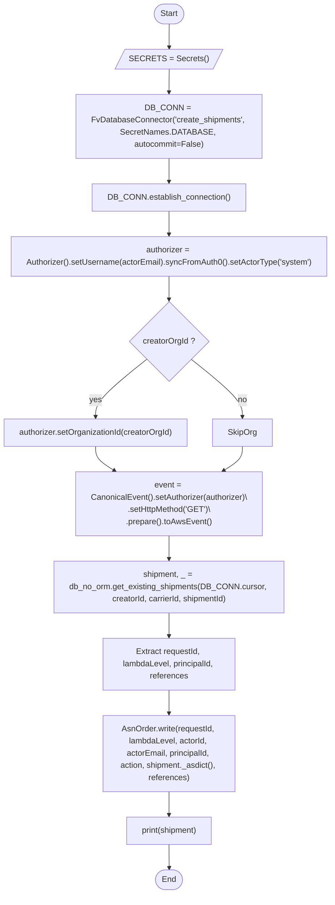
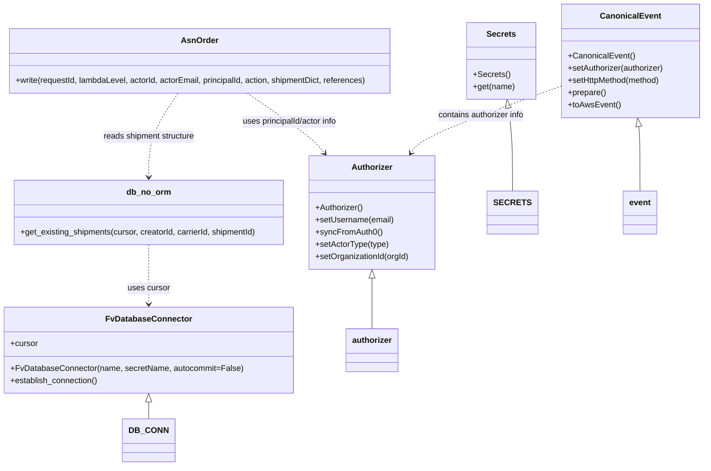

# Diagram: tools/ide_local_testing/localTest/utility/postShipmentToAsnOrder.py

> Auto-generated by Obscura crawlers

## Diagram 1

### SVG

<svg id="container" width="743.90625" xmlns="http://www.w3.org/2000/svg" class="flowchart" height="1711.875" viewBox="0 0 743.90625 1711.875" role="graphics-document document" aria-roledescription="flowchart-v2"><g><marker id="container_flowchart-v2-pointEnd" class="marker flowchart-v2" viewBox="0 0 10 10" refX="5" refY="5" markerUnits="userSpaceOnUse" markerWidth="8" markerHeight="8" orient="auto"><path d="M 0 0 L 10 5 L 0 10 z" class="arrowMarkerPath" style="stroke-width: 1; stroke-dasharray: 1, 0;"></path></marker><marker id="container_flowchart-v2-pointStart" class="marker flowchart-v2" viewBox="0 0 10 10" refX="4.5" refY="5" markerUnits="userSpaceOnUse" markerWidth="8" markerHeight="8" orient="auto"><path d="M 0 5 L 10 10 L 10 0 z" class="arrowMarkerPath" style="stroke-width: 1; stroke-dasharray: 1, 0;"></path></marker><marker id="container_flowchart-v2-circleEnd" class="marker flowchart-v2" viewBox="0 0 10 10" refX="11" refY="5" markerUnits="userSpaceOnUse" markerWidth="11" markerHeight="11" orient="auto"><circle cx="5" cy="5" r="5" class="arrowMarkerPath" style="stroke-width: 1; stroke-dasharray: 1, 0;"></circle></marker><marker id="container_flowchart-v2-circleStart" class="marker flowchart-v2" viewBox="0 0 10 10" refX="-1" refY="5" markerUnits="userSpaceOnUse" markerWidth="11" markerHeight="11" orient="auto"><circle cx="5" cy="5" r="5" class="arrowMarkerPath" style="stroke-width: 1; stroke-dasharray: 1, 0;"></circle></marker><marker id="container_flowchart-v2-crossEnd" class="marker cross flowchart-v2" viewBox="0 0 11 11" refX="12" refY="5.2" markerUnits="userSpaceOnUse" markerWidth="11" markerHeight="11" orient="auto"><path d="M 1,1 l 9,9 M 10,1 l -9,9" class="arrowMarkerPath" style="stroke-width: 2; stroke-dasharray: 1, 0;"></path></marker><marker id="container_flowchart-v2-crossStart" class="marker cross flowchart-v2" viewBox="0 0 11 11" refX="-1" refY="5.2" markerUnits="userSpaceOnUse" markerWidth="11" markerHeight="11" orient="auto"><path d="M 1,1 l 9,9 M 10,1 l -9,9" class="arrowMarkerPath" style="stroke-width: 2; stroke-dasharray: 1, 0;"></path></marker><g class="root"><g class="clusters"></g><g class="edgePaths"><path d="M372.453,47.5L372.37,51.583C372.286,55.667,372.12,63.833,372.107,71.5C372.094,79.167,372.234,86.334,372.304,89.917L372.375,93.501" id="L_Start_InitSecrets_0" class="edge-thickness-normal edge-pattern-solid edge-thickness-normal edge-pattern-solid flowchart-link" style=";" data-edge="true" data-et="edge" data-id="L_Start_InitSecrets_0" data-points="W3sieCI6MzcyLjQ1MzEyNSwieSI6NDcuNX0seyJ4IjozNzEuOTUzMTI1LCJ5Ijo3Mn0seyJ4IjozNzIuNDUzMTI1LCJ5Ijo5Ny41fV0=" marker-end="url(#container_flowchart-v2-pointEnd)"></path><path d="M372.453,136.5L372.37,140.583C372.286,144.667,372.12,152.833,372.036,160.417C371.953,168,371.953,175,371.953,178.5L371.953,182" id="L_InitSecrets_DBConn_0" class="edge-thickness-normal edge-pattern-solid edge-thickness-normal edge-pattern-solid flowchart-link" style=";" data-edge="true" data-et="edge" data-id="L_InitSecrets_DBConn_0" data-points="W3sieCI6MzcyLjQ1MzEyNSwieSI6MTM2LjV9LHsieCI6MzcxLjk1MzEyNSwieSI6MTYxfSx7IngiOjM3MS45NTMxMjUsInkiOjE4Nn1d" marker-end="url(#container_flowchart-v2-pointEnd)"></path><path d="M371.953,312L371.953,316.167C371.953,320.333,371.953,328.667,371.953,336.333C371.953,344,371.953,351,371.953,354.5L371.953,358" id="L_DBConn_EstablishConn_0" class="edge-thickness-normal edge-pattern-solid edge-thickness-normal edge-pattern-solid flowchart-link" style=";" data-edge="true" data-et="edge" data-id="L_DBConn_EstablishConn_0" data-points="W3sieCI6MzcxLjk1MzEyNSwieSI6MzEyfSx7IngiOjM3MS45NTMxMjUsInkiOjMzN30seyJ4IjozNzEuOTUzMTI1LCJ5IjozNjJ9XQ==" marker-end="url(#container_flowchart-v2-pointEnd)"></path><path d="M371.953,416L371.953,420.167C371.953,424.333,371.953,432.667,371.953,440.333C371.953,448,371.953,455,371.953,458.5L371.953,462" id="L_EstablishConn_AuthorizerCreate_0" class="edge-thickness-normal edge-pattern-solid edge-thickness-normal edge-pattern-solid flowchart-link" style=";" data-edge="true" data-et="edge" data-id="L_EstablishConn_AuthorizerCreate_0" data-points="W3sieCI6MzcxLjk1MzEyNSwieSI6NDE2fSx7IngiOjM3MS45NTMxMjUsInkiOjQ0MX0seyJ4IjozNzEuOTUzMTI1LCJ5Ijo0NjZ9XQ==" marker-end="url(#container_flowchart-v2-pointEnd)"></path><path d="M371.953,544L371.953,548.167C371.953,552.333,371.953,560.667,371.953,568.333C371.953,576,371.953,583,371.953,586.5L371.953,590" id="L_AuthorizerCreate_MaybeSetOrg_0" class="edge-thickness-normal edge-pattern-solid edge-thickness-normal edge-pattern-solid flowchart-link" style=";" data-edge="true" data-et="edge" data-id="L_AuthorizerCreate_MaybeSetOrg_0" data-points="W3sieCI6MzcxLjk1MzEyNSwieSI6NTQ0fSx7IngiOjM3MS45NTMxMjUsInkiOjU2OX0seyJ4IjozNzEuOTUzMTI1LCJ5Ijo1OTR9XQ==" marker-end="url(#container_flowchart-v2-pointEnd)"></path><path d="M328.154,707.076L311.127,720.543C294.099,734.009,260.044,760.942,243.016,779.909C225.988,798.875,225.988,809.875,225.988,815.375L225.988,820.875" id="L_MaybeSetOrg_SetOrg_0" class="edge-thickness-normal edge-pattern-solid edge-thickness-normal edge-pattern-solid flowchart-link" style=";" data-edge="true" data-et="edge" data-id="L_MaybeSetOrg_SetOrg_0" data-points="W3sieCI6MzI4LjE1NDI5MjY0Mjk3MTM3LCJ5Ijo3MDcuMDc2MTY3NjQyOTcxM30seyJ4IjoyMjUuOTg4MjgxMjUsInkiOjc4Ny44NzV9LHsieCI6MjI1Ljk4ODI4MTI1LCJ5Ijo4MjQuODc1fV0=" marker-end="url(#container_flowchart-v2-pointEnd)"></path><path d="M415.752,707.076L432.78,720.543C449.807,734.009,483.863,760.942,500.89,779.909C517.918,798.875,517.918,809.875,517.918,815.375L517.918,820.875" id="L_MaybeSetOrg_SkipOrg_0" class="edge-thickness-normal edge-pattern-solid edge-thickness-normal edge-pattern-solid flowchart-link" style=";" data-edge="true" data-et="edge" data-id="L_MaybeSetOrg_SkipOrg_0" data-points="W3sieCI6NDE1Ljc1MTk1NzM1NzAyODYzLCJ5Ijo3MDcuMDc2MTY3NjQyOTcxM30seyJ4Ijo1MTcuOTE3OTY4NzUsInkiOjc4Ny44NzV9LHsieCI6NTE3LjkxNzk2ODc1LCJ5Ijo4MjQuODc1fV0=" marker-end="url(#container_flowchart-v2-pointEnd)"></path><path d="M225.988,878.875L225.988,883.042C225.988,887.208,225.988,895.542,234.881,903.607C243.773,911.673,261.558,919.471,270.45,923.37L279.342,927.269" id="L_SetOrg_EventPrep_0" class="edge-thickness-normal edge-pattern-solid edge-thickness-normal edge-pattern-solid flowchart-link" style=";" data-edge="true" data-et="edge" data-id="L_SetOrg_EventPrep_0" data-points="W3sieCI6MjI1Ljk4ODI4MTI1LCJ5Ijo4NzguODc1fSx7IngiOjIyNS45ODgyODEyNSwieSI6OTAzLjg3NX0seyJ4IjoyODMuMDA1Nzk4MzM5ODQzNzUsInkiOjkyOC44NzV9XQ==" marker-end="url(#container_flowchart-v2-pointEnd)"></path><path d="M517.918,878.875L517.918,883.042C517.918,887.208,517.918,895.542,509.026,903.607C500.133,911.673,482.349,919.471,473.456,923.37L464.564,927.269" id="L_SkipOrg_EventPrep_0" class="edge-thickness-normal edge-pattern-solid edge-thickness-normal edge-pattern-solid flowchart-link" style=";" data-edge="true" data-et="edge" data-id="L_SkipOrg_EventPrep_0" data-points="W3sieCI6NTE3LjkxNzk2ODc1LCJ5Ijo4NzguODc1fSx7IngiOjUxNy45MTc5Njg3NSwieSI6OTAzLjg3NX0seyJ4Ijo0NjAuOTAwNDUxNjYwMTU2MjUsInkiOjkyOC44NzV9XQ==" marker-end="url(#container_flowchart-v2-pointEnd)"></path><path d="M371.953,1006.875L371.953,1011.042C371.953,1015.208,371.953,1023.542,371.953,1031.208C371.953,1038.875,371.953,1045.875,371.953,1049.375L371.953,1052.875" id="L_EventPrep_FetchShipment_0" class="edge-thickness-normal edge-pattern-solid edge-thickness-normal edge-pattern-solid flowchart-link" style=";" data-edge="true" data-et="edge" data-id="L_EventPrep_FetchShipment_0" data-points="W3sieCI6MzcxLjk1MzEyNSwieSI6MTAwNi44NzV9LHsieCI6MzcxLjk1MzEyNSwieSI6MTAzMS44NzV9LHsieCI6MzcxLjk1MzEyNSwieSI6MTA1Ni44NzV9XQ==" marker-end="url(#container_flowchart-v2-pointEnd)"></path><path d="M371.953,1158.875L371.953,1163.042C371.953,1167.208,371.953,1175.542,371.953,1183.208C371.953,1190.875,371.953,1197.875,371.953,1201.375L371.953,1204.875" id="L_FetchShipment_ComputeParams_0" class="edge-thickness-normal edge-pattern-solid edge-thickness-normal edge-pattern-solid flowchart-link" style=";" data-edge="true" data-et="edge" data-id="L_FetchShipment_ComputeParams_0" data-points="W3sieCI6MzcxLjk1MzEyNSwieSI6MTE1OC44NzV9LHsieCI6MzcxLjk1MzEyNSwieSI6MTE4My44NzV9LHsieCI6MzcxLjk1MzEyNSwieSI6MTIwOC44NzV9XQ==" marker-end="url(#container_flowchart-v2-pointEnd)"></path><path d="M371.953,1310.875L371.953,1315.042C371.953,1319.208,371.953,1327.542,371.953,1335.208C371.953,1342.875,371.953,1349.875,371.953,1353.375L371.953,1356.875" id="L_ComputeParams_WriteAsn_0" class="edge-thickness-normal edge-pattern-solid edge-thickness-normal edge-pattern-solid flowchart-link" style=";" data-edge="true" data-et="edge" data-id="L_ComputeParams_WriteAsn_0" data-points="W3sieCI6MzcxLjk1MzEyNSwieSI6MTMxMC44NzV9LHsieCI6MzcxLjk1MzEyNSwieSI6MTMzNS44NzV9LHsieCI6MzcxLjk1MzEyNSwieSI6MTM2MC44NzV9XQ==" marker-end="url(#container_flowchart-v2-pointEnd)"></path><path d="M371.953,1510.875L371.953,1515.042C371.953,1519.208,371.953,1527.542,371.953,1535.208C371.953,1542.875,371.953,1549.875,371.953,1553.375L371.953,1556.875" id="L_WriteAsn_PrintShipment_0" class="edge-thickness-normal edge-pattern-solid edge-thickness-normal edge-pattern-solid flowchart-link" style=";" data-edge="true" data-et="edge" data-id="L_WriteAsn_PrintShipment_0" data-points="W3sieCI6MzcxLjk1MzEyNSwieSI6MTUxMC44NzV9LHsieCI6MzcxLjk1MzEyNSwieSI6MTUzNS44NzV9LHsieCI6MzcxLjk1MzEyNSwieSI6MTU2MC44NzV9XQ==" marker-end="url(#container_flowchart-v2-pointEnd)"></path><path d="M371.953,1614.875L371.953,1619.042C371.953,1623.208,371.953,1631.542,372.023,1639.292C372.094,1647.042,372.234,1654.209,372.304,1657.792L372.375,1661.376" id="L_PrintShipment_End_0" class="edge-thickness-normal edge-pattern-solid edge-thickness-normal edge-pattern-solid flowchart-link" style=";" data-edge="true" data-et="edge" data-id="L_PrintShipment_End_0" data-points="W3sieCI6MzcxLjk1MzEyNSwieSI6MTYxNC44NzV9LHsieCI6MzcxLjk1MzEyNSwieSI6MTYzOS44NzV9LHsieCI6MzcyLjQ1MzEyNSwieSI6MTY2NS4zNzV9XQ==" marker-end="url(#container_flowchart-v2-pointEnd)"></path></g><g class="edgeLabels"><g class="edgeLabel"><g class="label" data-id="L_Start_InitSecrets_0" transform="translate(0, 0)"><foreignObject width="0" height="0">

</foreignObject></g></g><g class="edgeLabel"><g class="label" data-id="L_InitSecrets_DBConn_0" transform="translate(0, 0)"><foreignObject width="0" height="0">

</foreignObject></g></g><g class="edgeLabel"><g class="label" data-id="L_DBConn_EstablishConn_0" transform="translate(0, 0)"><foreignObject width="0" height="0">

</foreignObject></g></g><g class="edgeLabel"><g class="label" data-id="L_EstablishConn_AuthorizerCreate_0" transform="translate(0, 0)"><foreignObject width="0" height="0">

</foreignObject></g></g><g class="edgeLabel"><g class="label" data-id="L_AuthorizerCreate_MaybeSetOrg_0" transform="translate(0, 0)"><foreignObject width="0" height="0">

</foreignObject></g></g><g class="edgeLabel" transform="translate(225.98828125, 787.875)"><g class="label" data-id="L_MaybeSetOrg_SetOrg_0" transform="translate(-12.0078125, -12)"><foreignObject width="24.015625" height="24">

yes

</foreignObject></g></g><g class="edgeLabel" transform="translate(517.91796875, 787.875)"><g class="label" data-id="L_MaybeSetOrg_SkipOrg_0" transform="translate(-9.3671875, -12)"><foreignObject width="18.734375" height="24">

no

</foreignObject></g></g><g class="edgeLabel"><g class="label" data-id="L_SetOrg_EventPrep_0" transform="translate(0, 0)"><foreignObject width="0" height="0">

</foreignObject></g></g><g class="edgeLabel"><g class="label" data-id="L_SkipOrg_EventPrep_0" transform="translate(0, 0)"><foreignObject width="0" height="0">

</foreignObject></g></g><g class="edgeLabel"><g class="label" data-id="L_EventPrep_FetchShipment_0" transform="translate(0, 0)"><foreignObject width="0" height="0">

</foreignObject></g></g><g class="edgeLabel"><g class="label" data-id="L_FetchShipment_ComputeParams_0" transform="translate(0, 0)"><foreignObject width="0" height="0">

</foreignObject></g></g><g class="edgeLabel"><g class="label" data-id="L_ComputeParams_WriteAsn_0" transform="translate(0, 0)"><foreignObject width="0" height="0">

</foreignObject></g></g><g class="edgeLabel"><g class="label" data-id="L_WriteAsn_PrintShipment_0" transform="translate(0, 0)"><foreignObject width="0" height="0">

</foreignObject></g></g><g class="edgeLabel"><g class="label" data-id="L_PrintShipment_End_0" transform="translate(0, 0)"><foreignObject width="0" height="0">

</foreignObject></g></g></g><g class="nodes"><g class="node default" id="flowchart-Start-0" transform="translate(371.953125, 27.5)"><g class="basic label-container outer-path"><path d="M-10.3984375 -19.5 C-3.366112964069967 -19.5, 3.6662115718600656 -19.5, 10.3984375 -19.5 C10.3984375 -19.5, 10.3984375 -19.5, 10.398437499999998 -19.5 C10.760516604117234 -19.488388827875184, 11.122595708234467 -19.476777655750364, 11.6478067896239 -19.45993515863156 C12.00124793409604 -19.4258391164995, 12.354689078568184 -19.391743074367437, 12.892042152847864 -19.3399052695533 C13.223236797747806 -19.28636028781871, 13.554431442647749 -19.232815306084117, 14.126030759676757 -19.140403561325776 C14.5238376312959 -19.049606738811146, 14.921644502915042 -18.958809916296516, 15.34470188623539 -18.862249829261074 C15.605568930516881 -18.784825859837387, 15.866435974798371 -18.7074018904137, 16.543047751460602 -18.50658706670804 C17.006816569110992 -18.33591585478074, 17.470585386761382 -18.16524464285344, 17.716144095147794 -18.074876768247425 C18.040105412667188 -17.93146870295263, 18.364066730186586 -17.788060637657836, 18.85917041279238 -17.568892924097174 C19.1337655132189 -17.425636836091215, 19.408360613645417 -17.28238074808526, 19.967429764076783 -16.990714730406097 C20.186055100542355 -16.85818276665558, 20.404680437007926 -16.725650802905065, 21.036368073605697 -16.342718045390892 C21.324587263942977 -16.141668815019266, 21.612806454280253 -15.94061958464764, 22.061592844578712 -15.627565626425154 C22.43345117051999 -15.331018507052626, 22.805309496461266 -15.034471387680098, 23.03889120850187 -14.848196188198123 C23.232950544510082 -14.671956633764133, 23.427009880518295 -14.495717079330142, 23.964247236767985 -14.007812326905688 C24.17899837399711 -13.786064146320347, 24.39374951122624 -13.564315965735007, 24.833858442968648 -13.10986736009568 C25.131188435979034 -12.760606631749798, 25.42851842898942 -12.411345903403916, 25.644151408126582 -12.158051136245305 C25.858484302005742 -11.870864584575552, 26.072817195884905 -11.583678032905796, 26.391796464640635 -11.156274872382312 C26.564538637399792 -10.890896507255963, 26.737280810158946 -10.625518142129613, 27.073721378604247 -10.108655082055241 C27.299902151820906 -9.707048215922228, 27.526082925037564 -9.305441349789216, 27.6871239742735 -9.019496659696287 C27.79727431956424 -8.79076711086023, 27.907424664854986 -8.562037562024173, 28.22948364880834 -7.893275190886684 C28.358326774786107 -7.575030178709222, 28.487169900763874 -7.256785166531759, 28.698571729970325 -6.734618561215508 C28.796269276099153 -6.4403691182655525, 28.89396682222798 -6.146119675315598, 29.09246063421488 -5.548287939305138 C29.213292874918086 -5.087502236479426, 29.33412511562129 -4.626716533653714, 29.40953178754556 -4.339158212148133 C29.470376952925772 -4.026731147551006, 29.531222118305983 -3.714304082953878, 29.648482276581777 -3.1121979531509023 C29.694117784941557 -2.7582579620628707, 29.739753293301337 -2.404317970974839, 29.808330202509367 -1.872449005199798 C29.829675015493528 -1.5399863137485301, 29.851019828477693 -1.207523622297262, 29.888418715913414 -0.6250057626472757 C29.888418715913414 -0.3473015022636572, 29.888418715913414 -0.06959724188003868, 29.888418715913414 0.625005762647271 C29.871042057153673 0.8956612490167415, 29.853665398393932 1.1663167353862118, 29.808330202509367 1.8724490051997846 C29.77382348124917 2.1400763211710214, 29.739316759988974 2.407703637142258, 29.648482276581777 3.1121979531508885 C29.58370953303877 3.444792301520033, 29.518936789495765 3.777386649889178, 29.40953178754556 4.339158212148129 C29.296951826675443 4.76847439540957, 29.18437186580533 5.197790578671013, 29.092460634214884 5.548287939305125 C28.982275697414256 5.880147413363039, 28.872090760613624 6.212006887420952, 28.69857172997033 6.734618561215495 C28.55102168320807 7.099070029404365, 28.403471636445808 7.463521497593236, 28.229483648808344 7.893275190886679 C28.04535728281807 8.275617529538595, 27.861230916827793 8.65795986819051, 27.687123974273504 9.019496659696284 C27.55790166836851 9.248943949007986, 27.42867936246351 9.47839123831969, 27.07372137860425 10.108655082055236 C26.91338446946532 10.354975630981212, 26.75304756032639 10.60129617990719, 26.39179646464064 11.156274872382301 C26.207802480153813 11.402810049397836, 26.023808495666984 11.649345226413368, 25.644151408126582 12.158051136245302 C25.43226269020781 12.406947681122295, 25.22037397228904 12.655844225999289, 24.83385844296866 13.10986736009567 C24.589410801085545 13.362279619864626, 24.344963159202432 13.61469187963358, 23.96424723676799 14.007812326905684 C23.599074170616138 14.339452843634923, 23.233901104464287 14.671093360364164, 23.038891208501887 14.848196188198111 C22.663291629147743 15.147726857608465, 22.287692049793602 15.447257527018818, 22.061592844578715 15.627565626425152 C21.66514541447574 15.90411019173234, 21.268697984372768 16.180654757039527, 21.036368073605708 16.34271804539089 C20.739683108045085 16.52257021502812, 20.442998142484463 16.702422384665358, 19.967429764076787 16.990714730406093 C19.540264651288073 17.213566496135652, 19.113099538499362 17.43641826186521, 18.859170412792388 17.56889292409717 C18.417163217684745 17.76455639769374, 17.9751560225771 17.96021987129031, 17.716144095147804 18.07487676824742 C17.324765139947715 18.218907841628457, 16.933386184747626 18.36293891500949, 16.543047751460616 18.506587066708033 C16.296901869077733 18.57964187255317, 16.05075598669485 18.65269667839831, 15.344701886235413 18.86224982926107 C14.971356938189535 18.94746337734907, 14.598011990143657 19.032676925437073, 14.126030759676766 19.140403561325773 C13.875826837855218 19.180854591045488, 13.62562291603367 19.221305620765204, 12.892042152847878 19.3399052695533 C12.464405245921442 19.381158887655864, 12.036768338995007 19.422412505758434, 11.6478067896239 19.45993515863156 C11.23056451116149 19.473315306389022, 10.813322232699079 19.486695454146485, 10.398437500000004 19.5 C10.398437500000004 19.5, 10.398437500000002 19.5, 10.3984375 19.5 C4.560690557821178 19.5, -1.2770563843576443 19.5, -10.398437499999996 19.5 C-10.716233561645524 19.489808898855536, -11.034029623291053 19.479617797711075, -11.647806789623893 19.45993515863156 C-12.088612437214943 19.417411167954803, -12.529418084805993 19.37488717727805, -12.892042152847871 19.3399052695533 C-13.152835446704774 19.297742232284715, -13.413628740561679 19.25557919501613, -14.126030759676759 19.140403561325773 C-14.39289438654755 19.079493679940427, -14.659758013418342 19.01858379855508, -15.344701886235388 18.862249829261074 C-15.690463206337013 18.75962968439312, -16.036224526438637 18.657009539525163, -16.54304775146059 18.506587066708043 C-16.9744619129023 18.3478226673487, -17.40587607434401 18.189058267989363, -17.716144095147797 18.074876768247425 C-18.082319148579124 17.9127819342904, -18.44849420201045 17.750687100333376, -18.85917041279238 17.568892924097174 C-19.109665407619442 17.438209845745597, -19.360160402446503 17.307526767394023, -19.96742976407678 16.990714730406097 C-20.294450807177373 16.792472652289554, -20.621471850277963 16.59423057417301, -21.036368073605686 16.3427180453909 C-21.408705052113152 16.08299188739211, -21.78104203062062 15.823265729393325, -22.061592844578712 15.627565626425156 C-22.451754901670117 15.316421768543144, -22.84191695876152 15.00527791066113, -23.03889120850187 14.848196188198125 C-23.23196187229538 14.672854519710695, -23.425032536088885 14.497512851223263, -23.964247236767974 14.007812326905697 C-24.237127962122603 13.726040574052835, -24.510008687477235 13.444268821199973, -24.833858442968655 13.109867360095677 C-25.059201862511436 12.845166157096912, -25.284545282054214 12.580464954098149, -25.64415140812658 12.158051136245307 C-25.90325218698153 11.810879697146218, -26.16235296583648 11.46370825804713, -26.391796464640635 11.156274872382316 C-26.535906640250875 10.934882943644466, -26.680016815861116 10.713491014906614, -27.073721378604244 10.108655082055249 C-27.276302449669565 9.748951876820911, -27.478883520734886 9.389248671586573, -27.6871239742735 9.019496659696289 C-27.849736621043977 8.681828019324135, -28.012349267814454 8.344159378951982, -28.22948364880834 7.893275190886686 C-28.41283105038654 7.440403564207671, -28.596178451964743 6.987531937528655, -28.698571729970325 6.73461856121551 C-28.82459809747617 6.355047221862707, -28.950624464982013 5.975475882509904, -29.09246063421488 5.5482879393051325 C-29.16850811655294 5.2582859299627795, -29.244555598890997 4.968283920620427, -29.409531787545557 4.339158212148136 C-29.4670287965676 4.0439232228171145, -29.52452580558964 3.7486882334860936, -29.648482276581777 3.112197953150904 C-29.681748036073234 2.854195291602385, -29.71501379556469 2.596192630053866, -29.808330202509364 1.872449005199809 C-29.82964333838994 1.5404797102062004, -29.850956474270514 1.2085104152125918, -29.888418715913414 0.6250057626472781 C-29.888418715913414 0.36707375662241204, -29.888418715913414 0.10914175059754594, -29.888418715913414 -0.6250057626472687 C-29.863493338337573 -1.0132386377936204, -29.838567960761736 -1.4014715129399724, -29.808330202509367 -1.8724490051997822 C-29.762225449881107 -2.2300283621713817, -29.716120697252848 -2.587607719142981, -29.648482276581777 -3.112197953150895 C-29.57197426739946 -3.5050504103286166, -29.495466258217146 -3.897902867506338, -29.40953178754556 -4.339158212148126 C-29.306449315012316 -4.732256356143598, -29.203366842479067 -5.1253545001390695, -29.092460634214884 -5.548287939305123 C-29.012187492027813 -5.790057853784266, -28.93191434984074 -6.031827768263409, -28.698571729970332 -6.734618561215485 C-28.579502478690657 -7.028721913923653, -28.46043322741098 -7.322825266631821, -28.229483648808344 -7.893275190886676 C-28.05061649686771 -8.264696659035359, -27.871749344927075 -8.636118127184039, -27.687123974273504 -9.019496659696282 C-27.466352161780893 -9.411499368347084, -27.245580349288282 -9.803502076997884, -27.073721378604247 -10.108655082055243 C-26.861480951281504 -10.434713372957702, -26.64924052395876 -10.760771663860162, -26.39179646464064 -11.156274872382308 C-26.198282964378198 -11.415565333291438, -26.004769464115753 -11.674855794200568, -25.644151408126586 -12.158051136245302 C-25.43716581638245 -12.401188190121786, -25.23018022463831 -12.64432524399827, -24.833858442968662 -13.10986736009567 C-24.516014282530374 -13.438067551239085, -24.198170122092083 -13.7662677423825, -23.964247236767996 -14.007812326905677 C-23.770029914395913 -14.184195360375245, -23.57581259202383 -14.360578393844813, -23.038891208501887 -14.848196188198107 C-22.816391360011355 -15.025633896399674, -22.593891511520823 -15.20307160460124, -22.06159284457872 -15.627565626425149 C-21.722176658281267 -15.86432766489636, -21.38276047198381 -16.10108970336757, -21.03636807360571 -16.342718045390885 C-20.779298825447135 -16.498554934331203, -20.52222957728856 -16.654391823271517, -19.96742976407679 -16.99071473040609 C-19.5694886950114 -17.198320331244084, -19.171547625946012 -17.405925932082077, -18.859170412792388 -17.56889292409717 C-18.40317710128315 -17.770747636541323, -17.94718378977391 -17.97260234898548, -17.716144095147804 -18.07487676824742 C-17.443354925552434 -18.17526570429396, -17.170565755957067 -18.275654640340495, -16.54304775146062 -18.506587066708033 C-16.197621711598366 -18.609107702160866, -15.852195671736112 -18.7116283376137, -15.344701886235413 -18.862249829261067 C-14.982468010449763 -18.944927347612193, -14.620234134664114 -19.027604865963323, -14.126030759676768 -19.140403561325773 C-13.747942804766625 -19.20152988975976, -13.369854849856482 -19.262656218193754, -12.89204215284788 -19.3399052695533 C-12.571839990488982 -19.37079478705662, -12.251637828130084 -19.40168430455994, -11.647806789623903 -19.45993515863156 C-11.28723529401938 -19.471497984685755, -10.92666379841486 -19.483060810739953, -10.398437500000005 -19.5 C-10.398437500000004 -19.5, -10.398437500000004 -19.5, -10.3984375 -19.5" stroke="none" stroke-width="0" fill="#ECECFF" style=""></path><path d="M-10.3984375 -19.5 C-4.01412899952463 -19.5, 2.3701795009507407 -19.5, 10.3984375 -19.5 M-10.3984375 -19.5 C-4.477084884531922 -19.5, 1.444267730936156 -19.5, 10.3984375 -19.5 M10.3984375 -19.5 C10.3984375 -19.5, 10.398437499999998 -19.5, 10.398437499999998 -19.5 M10.3984375 -19.5 C10.3984375 -19.5, 10.3984375 -19.5, 10.398437499999998 -19.5 M10.398437499999998 -19.5 C10.815465606976874 -19.48662672030522, 11.232493713953751 -19.47325344061044, 11.6478067896239 -19.45993515863156 M10.398437499999998 -19.5 C10.83923363502525 -19.485864525907367, 11.280029770050502 -19.471729051814737, 11.6478067896239 -19.45993515863156 M11.6478067896239 -19.45993515863156 C12.122273439916807 -19.414163931507435, 12.596740090209714 -19.36839270438331, 12.892042152847864 -19.3399052695533 M11.6478067896239 -19.45993515863156 C11.907668294868614 -19.434866631749784, 12.167529800113329 -19.409798104868013, 12.892042152847864 -19.3399052695533 M12.892042152847864 -19.3399052695533 C13.354584178943417 -19.265125061841157, 13.81712620503897 -19.190344854129012, 14.126030759676757 -19.140403561325776 M12.892042152847864 -19.3399052695533 C13.158257625038951 -19.296865616541265, 13.424473097230038 -19.25382596352923, 14.126030759676757 -19.140403561325776 M14.126030759676757 -19.140403561325776 C14.558388213577745 -19.041720793868937, 14.990745667478732 -18.943038026412093, 15.34470188623539 -18.862249829261074 M14.126030759676757 -19.140403561325776 C14.419129380739104 -19.073505713715544, 14.71222800180145 -19.006607866105313, 15.34470188623539 -18.862249829261074 M15.34470188623539 -18.862249829261074 C15.623842446706622 -18.779402376151914, 15.902983007177854 -18.696554923042754, 16.543047751460602 -18.50658706670804 M15.34470188623539 -18.862249829261074 C15.647484906903856 -18.77238541806718, 15.950267927572321 -18.68252100687329, 16.543047751460602 -18.50658706670804 M16.543047751460602 -18.50658706670804 C16.955620466052565 -18.35475649395783, 17.36819318064453 -18.202925921207623, 17.716144095147794 -18.074876768247425 M16.543047751460602 -18.50658706670804 C16.912188892890914 -18.37073971435838, 17.28133003432123 -18.23489236200872, 17.716144095147794 -18.074876768247425 M17.716144095147794 -18.074876768247425 C18.082235945562445 -17.912818765797752, 18.4483277959771 -17.750760763348083, 18.85917041279238 -17.568892924097174 M17.716144095147794 -18.074876768247425 C18.12875120918689 -17.892227838417483, 18.54135832322599 -17.709578908587538, 18.85917041279238 -17.568892924097174 M18.85917041279238 -17.568892924097174 C19.10771544578554 -17.439227139585334, 19.3562604787787 -17.309561355073495, 19.967429764076783 -16.990714730406097 M18.85917041279238 -17.568892924097174 C19.243723504674897 -17.368271822380077, 19.62827659655741 -17.16765072066298, 19.967429764076783 -16.990714730406097 M19.967429764076783 -16.990714730406097 C20.229782013781502 -16.831675254882146, 20.492134263486218 -16.672635779358192, 21.036368073605697 -16.342718045390892 M19.967429764076783 -16.990714730406097 C20.31493903335279 -16.780052569179837, 20.662448302628793 -16.569390407953573, 21.036368073605697 -16.342718045390892 M21.036368073605697 -16.342718045390892 C21.39060404792633 -16.095618364332996, 21.744840022246965 -15.8485186832751, 22.061592844578712 -15.627565626425154 M21.036368073605697 -16.342718045390892 C21.24954233116381 -16.19401691148323, 21.462716588721918 -16.04531577757557, 22.061592844578712 -15.627565626425154 M22.061592844578712 -15.627565626425154 C22.388809693514066 -15.366618897005255, 22.716026542449423 -15.105672167585356, 23.03889120850187 -14.848196188198123 M22.061592844578712 -15.627565626425154 C22.29987112374255 -15.4375450396433, 22.53814940290639 -15.247524452861445, 23.03889120850187 -14.848196188198123 M23.03889120850187 -14.848196188198123 C23.230581084093444 -14.674108515022036, 23.42227095968502 -14.500020841845949, 23.964247236767985 -14.007812326905688 M23.03889120850187 -14.848196188198123 C23.394224583067736 -14.525491819023303, 23.749557957633602 -14.202787449848481, 23.964247236767985 -14.007812326905688 M23.964247236767985 -14.007812326905688 C24.287992284106757 -13.673518985565698, 24.61173733144553 -13.33922564422571, 24.833858442968648 -13.10986736009568 M23.964247236767985 -14.007812326905688 C24.152435784430835 -13.813492200876688, 24.34062433209369 -13.61917207484769, 24.833858442968648 -13.10986736009568 M24.833858442968648 -13.10986736009568 C25.116187815022858 -12.778227214684435, 25.398517187077072 -12.446587069273189, 25.644151408126582 -12.158051136245305 M24.833858442968648 -13.10986736009568 C24.996685129979983 -12.918601868431207, 25.15951181699132 -12.727336376766731, 25.644151408126582 -12.158051136245305 M25.644151408126582 -12.158051136245305 C25.8558053812139 -11.874454094381912, 26.067459354301224 -11.590857052518519, 26.391796464640635 -11.156274872382312 M25.644151408126582 -12.158051136245305 C25.932896775900506 -11.771158648672401, 26.22164214367443 -11.384266161099497, 26.391796464640635 -11.156274872382312 M26.391796464640635 -11.156274872382312 C26.55945459581999 -10.898706960378856, 26.727112726999344 -10.6411390483754, 27.073721378604247 -10.108655082055241 M26.391796464640635 -11.156274872382312 C26.535008795265263 -10.936262274647497, 26.67822112588989 -10.716249676912682, 27.073721378604247 -10.108655082055241 M27.073721378604247 -10.108655082055241 C27.31543873193833 -9.67946144467441, 27.55715608527241 -9.250267807293579, 27.6871239742735 -9.019496659696287 M27.073721378604247 -10.108655082055241 C27.207196193552047 -9.87165703232481, 27.340671008499843 -9.63465898259438, 27.6871239742735 -9.019496659696287 M27.6871239742735 -9.019496659696287 C27.87254313815848 -8.634469798554575, 28.05796230204346 -8.249442937412862, 28.22948364880834 -7.893275190886684 M27.6871239742735 -9.019496659696287 C27.855821476587746 -8.66919268659245, 28.024518978901988 -8.31888871348861, 28.22948364880834 -7.893275190886684 M28.22948364880834 -7.893275190886684 C28.36108601722031 -7.56821479655042, 28.492688385632277 -7.243154402214155, 28.698571729970325 -6.734618561215508 M28.22948364880834 -7.893275190886684 C28.326975749838844 -7.652467816459797, 28.424467850869345 -7.411660442032911, 28.698571729970325 -6.734618561215508 M28.698571729970325 -6.734618561215508 C28.854246470064446 -6.2657510474534845, 29.009921210158566 -5.796883533691462, 29.09246063421488 -5.548287939305138 M28.698571729970325 -6.734618561215508 C28.842735229281978 -6.300421070623133, 28.986898728593626 -5.866223580030758, 29.09246063421488 -5.548287939305138 M29.09246063421488 -5.548287939305138 C29.164849056475795 -5.272239511883607, 29.23723747873671 -4.996191084462078, 29.40953178754556 -4.339158212148133 M29.09246063421488 -5.548287939305138 C29.191215839342213 -5.1716915413779745, 29.289971044469546 -4.795095143450812, 29.40953178754556 -4.339158212148133 M29.40953178754556 -4.339158212148133 C29.478825401507745 -3.9833501496628054, 29.548119015469933 -3.627542087177478, 29.648482276581777 -3.1121979531509023 M29.40953178754556 -4.339158212148133 C29.45770704392623 -4.091788452477439, 29.5058823003069 -3.844418692806744, 29.648482276581777 -3.1121979531509023 M29.648482276581777 -3.1121979531509023 C29.71147577115176 -2.6236328487386222, 29.77446926572174 -2.135067744326342, 29.808330202509367 -1.872449005199798 M29.648482276581777 -3.1121979531509023 C29.691765428004455 -2.7765023779416143, 29.735048579427133 -2.440806802732326, 29.808330202509367 -1.872449005199798 M29.808330202509367 -1.872449005199798 C29.826103580997803 -1.59561428882951, 29.843876959486238 -1.318779572459222, 29.888418715913414 -0.6250057626472757 M29.808330202509367 -1.872449005199798 C29.836866088245465 -1.4279795511076916, 29.865401973981562 -0.9835100970155853, 29.888418715913414 -0.6250057626472757 M29.888418715913414 -0.6250057626472757 C29.888418715913414 -0.20274406760909874, 29.888418715913414 0.2195176274290782, 29.888418715913414 0.625005762647271 M29.888418715913414 -0.6250057626472757 C29.888418715913414 -0.2217472659796021, 29.888418715913414 0.1815112306880715, 29.888418715913414 0.625005762647271 M29.888418715913414 0.625005762647271 C29.86243943433659 1.029654043304971, 29.836460152759766 1.434302323962671, 29.808330202509367 1.8724490051997846 M29.888418715913414 0.625005762647271 C29.863313865834375 1.0160340668985484, 29.83820901575534 1.4070623711498258, 29.808330202509367 1.8724490051997846 M29.808330202509367 1.8724490051997846 C29.753323108155914 2.299073166625778, 29.698316013802458 2.725697328051771, 29.648482276581777 3.1121979531508885 M29.808330202509367 1.8724490051997846 C29.7498065404125 2.3263469716188525, 29.69128287831563 2.78024493803792, 29.648482276581777 3.1121979531508885 M29.648482276581777 3.1121979531508885 C29.59165255259144 3.404006574874844, 29.534822828601108 3.695815196598799, 29.40953178754556 4.339158212148129 M29.648482276581777 3.1121979531508885 C29.554880983865882 3.592820808606799, 29.461279691149983 4.07344366406271, 29.40953178754556 4.339158212148129 M29.40953178754556 4.339158212148129 C29.337497937065255 4.613854503697817, 29.26546408658495 4.888550795247505, 29.092460634214884 5.548287939305125 M29.40953178754556 4.339158212148129 C29.307143797029894 4.729607995220162, 29.204755806514225 5.120057778292195, 29.092460634214884 5.548287939305125 M29.092460634214884 5.548287939305125 C28.969040544917704 5.920009583947467, 28.845620455620526 6.291731228589807, 28.69857172997033 6.734618561215495 M29.092460634214884 5.548287939305125 C28.968279869668546 5.922300616600788, 28.84409910512221 6.296313293896452, 28.69857172997033 6.734618561215495 M28.69857172997033 6.734618561215495 C28.518208108412303 7.1801201935572205, 28.337844486854276 7.625621825898947, 28.229483648808344 7.893275190886679 M28.69857172997033 6.734618561215495 C28.526639277273162 7.159295043465339, 28.35470682457599 7.583971525715183, 28.229483648808344 7.893275190886679 M28.229483648808344 7.893275190886679 C28.035498314638545 8.296089887911501, 27.841512980468746 8.698904584936322, 27.687123974273504 9.019496659696284 M28.229483648808344 7.893275190886679 C28.068651454966805 8.227246682656302, 27.90781926112527 8.561218174425925, 27.687123974273504 9.019496659696284 M27.687123974273504 9.019496659696284 C27.480446070699706 9.386474205898693, 27.273768167125912 9.753451752101103, 27.07372137860425 10.108655082055236 M27.687123974273504 9.019496659696284 C27.483904025108657 9.380334257689752, 27.280684075943807 9.741171855683222, 27.07372137860425 10.108655082055236 M27.07372137860425 10.108655082055236 C26.851161568913223 10.45056671541754, 26.628601759222196 10.792478348779845, 26.39179646464064 11.156274872382301 M27.07372137860425 10.108655082055236 C26.93142419969768 10.327261760998468, 26.78912702079111 10.5458684399417, 26.39179646464064 11.156274872382301 M26.39179646464064 11.156274872382301 C26.144695154138677 11.487368117062447, 25.89759384363671 11.818461361742592, 25.644151408126582 12.158051136245302 M26.39179646464064 11.156274872382301 C26.21562323269249 11.39233095348122, 26.03945000074434 11.62838703458014, 25.644151408126582 12.158051136245302 M25.644151408126582 12.158051136245302 C25.329338180161315 12.527848667193437, 25.01452495219605 12.897646198141574, 24.83385844296866 13.10986736009567 M25.644151408126582 12.158051136245302 C25.456569885758704 12.378395066109608, 25.268988363390825 12.598738995973914, 24.83385844296866 13.10986736009567 M24.83385844296866 13.10986736009567 C24.53526310544955 13.41819156121728, 24.236667767930438 13.726515762338892, 23.96424723676799 14.007812326905684 M24.83385844296866 13.10986736009567 C24.626846661110108 13.323624020847996, 24.41983487925156 13.537380681600322, 23.96424723676799 14.007812326905684 M23.96424723676799 14.007812326905684 C23.628871043625296 14.312392111950066, 23.2934948504826 14.616971896994448, 23.038891208501887 14.848196188198111 M23.96424723676799 14.007812326905684 C23.663454069759485 14.280984722631723, 23.36266090275098 14.554157118357763, 23.038891208501887 14.848196188198111 M23.038891208501887 14.848196188198111 C22.66313439654172 15.147852246427632, 22.28737758458156 15.447508304657152, 22.061592844578715 15.627565626425152 M23.038891208501887 14.848196188198111 C22.81597544183879 15.025965580074251, 22.59305967517569 15.203734971950391, 22.061592844578715 15.627565626425152 M22.061592844578715 15.627565626425152 C21.768282931937755 15.832165924302013, 21.474973019296794 16.036766222178873, 21.036368073605708 16.34271804539089 M22.061592844578715 15.627565626425152 C21.744337031275276 15.848869548002824, 21.427081217971836 16.070173469580496, 21.036368073605708 16.34271804539089 M21.036368073605708 16.34271804539089 C20.67610033063355 16.56111446834887, 20.315832587661394 16.779510891306852, 19.967429764076787 16.990714730406093 M21.036368073605708 16.34271804539089 C20.81368142572408 16.47771199998873, 20.590994777842454 16.612705954586577, 19.967429764076787 16.990714730406093 M19.967429764076787 16.990714730406093 C19.74488940382452 17.106813893805796, 19.522349043572255 17.2229130572055, 18.859170412792388 17.56889292409717 M19.967429764076787 16.990714730406093 C19.56668283320889 17.199784147549213, 19.165935902340994 17.408853564692336, 18.859170412792388 17.56889292409717 M18.859170412792388 17.56889292409717 C18.43483050418526 17.756735614041396, 18.01049059557813 17.944578303985622, 17.716144095147804 18.07487676824742 M18.859170412792388 17.56889292409717 C18.427710985323536 17.759887213848458, 17.996251557854684 17.950881503599746, 17.716144095147804 18.07487676824742 M17.716144095147804 18.07487676824742 C17.421072224767478 18.18346594416185, 17.126000354387152 18.292055120076277, 16.543047751460616 18.506587066708033 M17.716144095147804 18.07487676824742 C17.314230108694506 18.222784830514396, 16.91231612224121 18.370692892781374, 16.543047751460616 18.506587066708033 M16.543047751460616 18.506587066708033 C16.210196738582983 18.605375500159496, 15.877345725705352 18.704163933610957, 15.344701886235413 18.86224982926107 M16.543047751460616 18.506587066708033 C16.132549802001 18.62842070335994, 15.722051852541384 18.75025434001185, 15.344701886235413 18.86224982926107 M15.344701886235413 18.86224982926107 C14.978281995003956 18.945882778321398, 14.611862103772499 19.029515727381728, 14.126030759676766 19.140403561325773 M15.344701886235413 18.86224982926107 C14.910694751710496 18.96130912555515, 14.47668761718558 19.06036842184923, 14.126030759676766 19.140403561325773 M14.126030759676766 19.140403561325773 C13.688675466988476 19.211111773306666, 13.251320174300185 19.28181998528756, 12.892042152847878 19.3399052695533 M14.126030759676766 19.140403561325773 C13.758413388127401 19.199837087042578, 13.390796016578037 19.259270612759387, 12.892042152847878 19.3399052695533 M12.892042152847878 19.3399052695533 C12.524861882463764 19.375326708638372, 12.157681612079648 19.410748147723442, 11.6478067896239 19.45993515863156 M12.892042152847878 19.3399052695533 C12.429056350323428 19.38456895310094, 11.966070547798976 19.429232636648578, 11.6478067896239 19.45993515863156 M11.6478067896239 19.45993515863156 C11.244533749935599 19.47286734009101, 10.841260710247298 19.485799521550458, 10.398437500000004 19.5 M11.6478067896239 19.45993515863156 C11.277028711306292 19.471825289927455, 10.906250632988684 19.483715421223355, 10.398437500000004 19.5 M10.398437500000004 19.5 C10.398437500000002 19.5, 10.398437500000002 19.5, 10.3984375 19.5 M10.398437500000004 19.5 C10.398437500000004 19.5, 10.398437500000002 19.5, 10.3984375 19.5 M10.3984375 19.5 C3.147338859258931 19.5, -4.103759781482138 19.5, -10.398437499999996 19.5 M10.3984375 19.5 C5.022670070280062 19.5, -0.3530973594398752 19.5, -10.398437499999996 19.5 M-10.398437499999996 19.5 C-10.738222102081995 19.489103769161837, -11.078006704163993 19.478207538323673, -11.647806789623893 19.45993515863156 M-10.398437499999996 19.5 C-10.788335791757277 19.48749672067433, -11.178234083514557 19.47499344134866, -11.647806789623893 19.45993515863156 M-11.647806789623893 19.45993515863156 C-11.953131966462115 19.430480806029227, -12.258457143300335 19.40102645342689, -12.892042152847871 19.3399052695533 M-11.647806789623893 19.45993515863156 C-12.04336010466252 19.421776606052244, -12.438913419701146 19.38361805347293, -12.892042152847871 19.3399052695533 M-12.892042152847871 19.3399052695533 C-13.328021099418311 19.269419574539015, -13.764000045988752 19.198933879524734, -14.126030759676759 19.140403561325773 M-12.892042152847871 19.3399052695533 C-13.1952632671413 19.290882831309197, -13.498484381434727 19.241860393065096, -14.126030759676759 19.140403561325773 M-14.126030759676759 19.140403561325773 C-14.440425684708202 19.068644971305964, -14.754820609739646 18.99688638128616, -15.344701886235388 18.862249829261074 M-14.126030759676759 19.140403561325773 C-14.427357528819524 19.07162769260987, -14.728684297962289 19.002851823893966, -15.344701886235388 18.862249829261074 M-15.344701886235388 18.862249829261074 C-15.800088228891429 18.727093553132452, -16.25547457154747 18.591937277003833, -16.54304775146059 18.506587066708043 M-15.344701886235388 18.862249829261074 C-15.592192972303836 18.78879577402318, -15.839684058372287 18.715341718785286, -16.54304775146059 18.506587066708043 M-16.54304775146059 18.506587066708043 C-16.946439763060305 18.35813507752447, -17.34983177466002 18.209683088340896, -17.716144095147797 18.074876768247425 M-16.54304775146059 18.506587066708043 C-16.796965450520627 18.41314300626447, -17.050883149580663 18.319698945820896, -17.716144095147797 18.074876768247425 M-17.716144095147797 18.074876768247425 C-18.13793964153727 17.88816039198113, -18.55973518792674 17.70144401571484, -18.85917041279238 17.568892924097174 M-17.716144095147797 18.074876768247425 C-18.143906265902764 17.88551914436815, -18.57166843665773 17.696161520488875, -18.85917041279238 17.568892924097174 M-18.85917041279238 17.568892924097174 C-19.108287013234285 17.43892895321343, -19.35740361367619 17.308964982329687, -19.96742976407678 16.990714730406097 M-18.85917041279238 17.568892924097174 C-19.251689329883575 17.36411605647106, -19.644208246974774 17.15933918884495, -19.96742976407678 16.990714730406097 M-19.96742976407678 16.990714730406097 C-20.353264047249045 16.756819720533144, -20.73909833042131 16.522924710660188, -21.036368073605686 16.3427180453909 M-19.96742976407678 16.990714730406097 C-20.294391647214578 16.79250851540666, -20.62135353035238 16.594302300407225, -21.036368073605686 16.3427180453909 M-21.036368073605686 16.3427180453909 C-21.380767015100986 16.102480252593672, -21.725165956596282 15.862242459796441, -22.061592844578712 15.627565626425156 M-21.036368073605686 16.3427180453909 C-21.431502682415708 16.06708924738656, -21.82663729122573 15.79146044938222, -22.061592844578712 15.627565626425156 M-22.061592844578712 15.627565626425156 C-22.370190454676838 15.381467244499191, -22.678788064774967 15.135368862573227, -23.03889120850187 14.848196188198125 M-22.061592844578712 15.627565626425156 C-22.3883190070507 15.367010206402075, -22.715045169522693 15.106454786378993, -23.03889120850187 14.848196188198125 M-23.03889120850187 14.848196188198125 C-23.25837847021601 14.648863664424056, -23.47786573193015 14.449531140649986, -23.964247236767974 14.007812326905697 M-23.03889120850187 14.848196188198125 C-23.26969535621933 14.638585967984236, -23.50049950393679 14.428975747770348, -23.964247236767974 14.007812326905697 M-23.964247236767974 14.007812326905697 C-24.142073859944006 13.824191738639163, -24.319900483120037 13.64057115037263, -24.833858442968655 13.109867360095677 M-23.964247236767974 14.007812326905697 C-24.259932741762647 13.702492766767262, -24.55561824675732 13.397173206628828, -24.833858442968655 13.109867360095677 M-24.833858442968655 13.109867360095677 C-25.078407816913177 12.822605750206863, -25.322957190857696 12.535344140318047, -25.64415140812658 12.158051136245307 M-24.833858442968655 13.109867360095677 C-25.000589904264803 12.914015098368312, -25.167321365560948 12.718162836640946, -25.64415140812658 12.158051136245307 M-25.64415140812658 12.158051136245307 C-25.879207515676796 11.84309736617994, -26.114263623227018 11.528143596114573, -26.391796464640635 11.156274872382316 M-25.64415140812658 12.158051136245307 C-25.806233912760156 11.940875346056252, -25.968316417393734 11.723699555867197, -26.391796464640635 11.156274872382316 M-26.391796464640635 11.156274872382316 C-26.53214425206271 10.940662982244172, -26.67249203948479 10.72505109210603, -27.073721378604244 10.108655082055249 M-26.391796464640635 11.156274872382316 C-26.57771281499662 10.870657432705219, -26.763629165352604 10.585039993028122, -27.073721378604244 10.108655082055249 M-27.073721378604244 10.108655082055249 C-27.2108393649564 9.865188212585275, -27.34795735130855 9.621721343115304, -27.6871239742735 9.019496659696289 M-27.073721378604244 10.108655082055249 C-27.262048524490968 9.774261164341945, -27.450375670377696 9.439867246628642, -27.6871239742735 9.019496659696289 M-27.6871239742735 9.019496659696289 C-27.831329754004667 8.72005027257513, -27.97553553373583 8.420603885453968, -28.22948364880834 7.893275190886686 M-27.6871239742735 9.019496659696289 C-27.879664448768377 8.61968224470149, -28.07220492326325 8.219867829706692, -28.22948364880834 7.893275190886686 M-28.22948364880834 7.893275190886686 C-28.36696154580447 7.553702127351924, -28.504439442800603 7.214129063817163, -28.698571729970325 6.73461856121551 M-28.22948364880834 7.893275190886686 C-28.416730141585706 7.430772733561931, -28.603976634363075 6.9682702762371775, -28.698571729970325 6.73461856121551 M-28.698571729970325 6.73461856121551 C-28.849014520992746 6.281508844459559, -28.999457312015167 5.828399127703609, -29.09246063421488 5.5482879393051325 M-28.698571729970325 6.73461856121551 C-28.80888905289925 6.4023603612320406, -28.91920637582817 6.07010216124857, -29.09246063421488 5.5482879393051325 M-29.09246063421488 5.5482879393051325 C-29.18713131746953 5.187267593521491, -29.281802000724177 4.826247247737848, -29.409531787545557 4.339158212148136 M-29.09246063421488 5.5482879393051325 C-29.203999326714715 5.12294256362814, -29.31553801921455 4.697597187951148, -29.409531787545557 4.339158212148136 M-29.409531787545557 4.339158212148136 C-29.47859145823025 3.9845513989487977, -29.547651128914946 3.6299445857494597, -29.648482276581777 3.112197953150904 M-29.409531787545557 4.339158212148136 C-29.473747925669127 4.009421914969216, -29.537964063792693 3.6796856177902963, -29.648482276581777 3.112197953150904 M-29.648482276581777 3.112197953150904 C-29.71210096623754 2.6187839591120388, -29.775719655893305 2.1253699650731734, -29.808330202509364 1.872449005199809 M-29.648482276581777 3.112197953150904 C-29.693301489418204 2.7645889889462265, -29.738120702254626 2.416980024741549, -29.808330202509364 1.872449005199809 M-29.808330202509364 1.872449005199809 C-29.836273643696003 1.43720735317816, -29.86421708488264 1.0019657011565106, -29.888418715913414 0.6250057626472781 M-29.808330202509364 1.872449005199809 C-29.828683899374855 1.555423747311401, -29.849037596240343 1.238398489422993, -29.888418715913414 0.6250057626472781 M-29.888418715913414 0.6250057626472781 C-29.888418715913414 0.21608599037326892, -29.888418715913414 -0.1928337819007403, -29.888418715913414 -0.6250057626472687 M-29.888418715913414 0.6250057626472781 C-29.888418715913414 0.2065810542227297, -29.888418715913414 -0.21184365420181872, -29.888418715913414 -0.6250057626472687 M-29.888418715913414 -0.6250057626472687 C-29.85973584046914 -1.0717647000922175, -29.831052965024863 -1.5185236375371662, -29.808330202509367 -1.8724490051997822 M-29.888418715913414 -0.6250057626472687 C-29.866598903677218 -0.9648669508614283, -29.844779091441026 -1.3047281390755878, -29.808330202509367 -1.8724490051997822 M-29.808330202509367 -1.8724490051997822 C-29.754091785607432 -2.2931114561043295, -29.699853368705497 -2.713773907008877, -29.648482276581777 -3.112197953150895 M-29.808330202509367 -1.8724490051997822 C-29.76281418094802 -2.2254622802745, -29.717298159386676 -2.5784755553492174, -29.648482276581777 -3.112197953150895 M-29.648482276581777 -3.112197953150895 C-29.573480790882787 -3.4973147306456034, -29.498479305183793 -3.882431508140311, -29.40953178754556 -4.339158212148126 M-29.648482276581777 -3.112197953150895 C-29.565586922441426 -3.5378480767222906, -29.482691568301078 -3.963498200293686, -29.40953178754556 -4.339158212148126 M-29.40953178754556 -4.339158212148126 C-29.285590974648976 -4.811798248010906, -29.16165016175239 -5.284438283873686, -29.092460634214884 -5.548287939305123 M-29.40953178754556 -4.339158212148126 C-29.31186366879895 -4.711609078559388, -29.214195550052334 -5.084059944970649, -29.092460634214884 -5.548287939305123 M-29.092460634214884 -5.548287939305123 C-28.96887297261132 -5.920514285035284, -28.84528531100775 -6.292740630765445, -28.698571729970332 -6.734618561215485 M-29.092460634214884 -5.548287939305123 C-28.950389790357264 -5.976182685089326, -28.808318946499643 -6.404077430873531, -28.698571729970332 -6.734618561215485 M-28.698571729970332 -6.734618561215485 C-28.56997060859613 -7.052265817343302, -28.44136948722193 -7.369913073471119, -28.229483648808344 -7.893275190886676 M-28.698571729970332 -6.734618561215485 C-28.55304355390068 -7.094075969703405, -28.40751537783103 -7.453533378191325, -28.229483648808344 -7.893275190886676 M-28.229483648808344 -7.893275190886676 C-28.0478679813338 -8.270404010350338, -27.866252313859253 -8.647532829814002, -27.687123974273504 -9.019496659696282 M-28.229483648808344 -7.893275190886676 C-28.03366047848519 -8.299906194007336, -27.837837308162033 -8.706537197127997, -27.687123974273504 -9.019496659696282 M-27.687123974273504 -9.019496659696282 C-27.468739637728333 -9.407260163044246, -27.250355301183166 -9.79502366639221, -27.073721378604247 -10.108655082055243 M-27.687123974273504 -9.019496659696282 C-27.51606556389515 -9.323228188865384, -27.345007153516796 -9.626959718034485, -27.073721378604247 -10.108655082055243 M-27.073721378604247 -10.108655082055243 C-26.86233015314485 -10.43340877085297, -26.650938927685456 -10.7581624596507, -26.39179646464064 -11.156274872382308 M-27.073721378604247 -10.108655082055243 C-26.81102194684577 -10.512231953910877, -26.548322515087296 -10.91580882576651, -26.39179646464064 -11.156274872382308 M-26.39179646464064 -11.156274872382308 C-26.175076094961323 -11.446660424120752, -25.958355725282004 -11.737045975859196, -25.644151408126586 -12.158051136245302 M-26.39179646464064 -11.156274872382308 C-26.16934812779655 -11.454335378293006, -25.946899790952454 -11.752395884203706, -25.644151408126586 -12.158051136245302 M-25.644151408126586 -12.158051136245302 C-25.46706826462436 -12.366063072919333, -25.28998512112213 -12.574075009593365, -24.833858442968662 -13.10986736009567 M-25.644151408126586 -12.158051136245302 C-25.36856307284654 -12.481772876285756, -25.092974737566493 -12.805494616326211, -24.833858442968662 -13.10986736009567 M-24.833858442968662 -13.10986736009567 C-24.64336057848769 -13.306572045337813, -24.45286271400672 -13.503276730579955, -23.964247236767996 -14.007812326905677 M-24.833858442968662 -13.10986736009567 C-24.55870076301613 -13.393990255512318, -24.283543083063595 -13.678113150928963, -23.964247236767996 -14.007812326905677 M-23.964247236767996 -14.007812326905677 C-23.739389643026705 -14.212022044135603, -23.514532049285418 -14.41623176136553, -23.038891208501887 -14.848196188198107 M-23.964247236767996 -14.007812326905677 C-23.65247929459305 -14.29095172306124, -23.340711352418104 -14.574091119216803, -23.038891208501887 -14.848196188198107 M-23.038891208501887 -14.848196188198107 C-22.724390004195467 -15.099002529403947, -22.409888799889046 -15.349808870609786, -22.06159284457872 -15.627565626425149 M-23.038891208501887 -14.848196188198107 C-22.7615343139873 -15.069380930796555, -22.484177419472715 -15.290565673395003, -22.06159284457872 -15.627565626425149 M-22.06159284457872 -15.627565626425149 C-21.754284653849314 -15.841930517120815, -21.44697646311991 -16.05629540781648, -21.03636807360571 -16.342718045390885 M-22.06159284457872 -15.627565626425149 C-21.78089528046346 -15.823368095950244, -21.500197716348207 -16.01917056547534, -21.03636807360571 -16.342718045390885 M-21.03636807360571 -16.342718045390885 C-20.723885031441366 -16.5321471019051, -20.411401989277024 -16.72157615841931, -19.96742976407679 -16.99071473040609 M-21.03636807360571 -16.342718045390885 C-20.75904258657707 -16.51083438537311, -20.48171709954843 -16.67895072535533, -19.96742976407679 -16.99071473040609 M-19.96742976407679 -16.99071473040609 C-19.732216032018957 -17.113425583759074, -19.497002299961128 -17.23613643711206, -18.859170412792388 -17.56889292409717 M-19.96742976407679 -16.99071473040609 C-19.554207838827914 -17.206292344127153, -19.140985913579037 -17.421869957848216, -18.859170412792388 -17.56889292409717 M-18.859170412792388 -17.56889292409717 C-18.516332718415217 -17.72065700147908, -18.173495024038047 -17.872421078860985, -17.716144095147804 -18.07487676824742 M-18.859170412792388 -17.56889292409717 C-18.460387280681378 -17.7454223872014, -18.06160414857037 -17.921951850305636, -17.716144095147804 -18.07487676824742 M-17.716144095147804 -18.07487676824742 C-17.258873665380452 -18.243156513363324, -16.8016032356131 -18.411436258479224, -16.54304775146062 -18.506587066708033 M-17.716144095147804 -18.07487676824742 C-17.371166480688252 -18.201831719306647, -17.0261888662287 -18.328786670365872, -16.54304775146062 -18.506587066708033 M-16.54304775146062 -18.506587066708033 C-16.292951802540784 -18.580814231567015, -16.04285585362095 -18.655041396425997, -15.344701886235413 -18.862249829261067 M-16.54304775146062 -18.506587066708033 C-16.19379696189231 -18.6102428677971, -15.844546172324002 -18.713898668886173, -15.344701886235413 -18.862249829261067 M-15.344701886235413 -18.862249829261067 C-14.889280818447617 -18.966196716083427, -14.433859750659819 -19.070143602905787, -14.126030759676768 -19.140403561325773 M-15.344701886235413 -18.862249829261067 C-14.970728531086722 -18.947606807169546, -14.596755175938034 -19.032963785078024, -14.126030759676768 -19.140403561325773 M-14.126030759676768 -19.140403561325773 C-13.655084211524004 -19.216542546986084, -13.18413766337124 -19.292681532646398, -12.89204215284788 -19.3399052695533 M-14.126030759676768 -19.140403561325773 C-13.70140150526231 -19.209054326130452, -13.276772250847856 -19.277705090935132, -12.89204215284788 -19.3399052695533 M-12.89204215284788 -19.3399052695533 C-12.40827203296846 -19.386573991199374, -11.92450191308904 -19.43324271284545, -11.647806789623903 -19.45993515863156 M-12.89204215284788 -19.3399052695533 C-12.439381191435501 -19.383572928096296, -11.98672023002312 -19.427240586639293, -11.647806789623903 -19.45993515863156 M-11.647806789623903 -19.45993515863156 C-11.254163211254497 -19.47255854200912, -10.86051963288509 -19.485181925386684, -10.398437500000005 -19.5 M-11.647806789623903 -19.45993515863156 C-11.162587708621217 -19.475495190137668, -10.677368627618531 -19.491055221643776, -10.398437500000005 -19.5 M-10.398437500000005 -19.5 C-10.398437500000004 -19.5, -10.398437500000002 -19.5, -10.3984375 -19.5 M-10.398437500000005 -19.5 C-10.398437500000004 -19.5, -10.398437500000002 -19.5, -10.3984375 -19.5" stroke="#9370DB" stroke-width="1.3" fill="none" stroke-dasharray="0 0" style=""></path></g><g class="label" style="" transform="translate(-17.5234375, -12)"><rect></rect><foreignObject width="35.046875" height="24">

Start

</foreignObject></g></g><g class="node default" id="flowchart-InitSecrets-1" transform="translate(371.953125, 116.5)"><polygon points="-19.5,0 155.5625,0 175.0625,-39 0,-39" class="label-container" transform="translate(-77.78125,19.5)"></polygon><g class="label" style="" transform="translate(-70.28125, -12)"><rect></rect><foreignObject width="140.5625" height="24">

SECRETS = Secrets()

</foreignObject></g></g><g class="node default" id="flowchart-DBConn-3" transform="translate(371.953125, 249)"><rect class="basic label-container" style="" x="-181.8359375" y="-63" width="363.671875" height="126"></rect><g class="label" style="" transform="translate(-151.8359375, -48)"><rect></rect><foreignObject width="303.671875" height="96">

DB_CONN = FvDatabaseConnector('create_shipments', SecretNames.DATABASE, autocommit=False)

</foreignObject></g></g><g class="node default" id="flowchart-EstablishConn-5" transform="translate(371.953125, 389)"><rect class="basic label-container" style="" x="-148.9609375" y="-27" width="297.921875" height="54"></rect><g class="label" style="" transform="translate(-118.9609375, -12)"><rect></rect><foreignObject width="237.921875" height="24">

DB_CONN.establish_connection()

</foreignObject></g></g><g class="node default" id="flowchart-AuthorizerCreate-7" transform="translate(371.953125, 505)"><rect class="basic label-container" style="" x="-311.3828125" y="-39" width="622.765625" height="78"></rect><g class="label" style="" transform="translate(-281.3828125, -24)"><rect></rect><foreignObject width="562.765625" height="48">

authorizer = Authorizer().setUsername(actorEmail).syncFromAuth0().setActorType('system')

</foreignObject></g></g><g class="node default" id="flowchart-MaybeSetOrg-9" transform="translate(371.953125, 672.4375)"><polygon points="78.4375,0 156.875,-78.4375 78.4375,-156.875 0,-78.4375" class="label-container" transform="translate(-77.9375, 78.4375)"></polygon><g class="label" style="" transform="translate(-51.4375, -12)"><rect></rect><foreignObject width="102.875" height="24">

creatorOrgId ?

</foreignObject></g></g><g class="node default" id="flowchart-SetOrg-11" transform="translate(225.98828125, 851.875)"><rect class="basic label-container" style="" x="-183.796875" y="-27" width="367.59375" height="54"></rect><g class="label" style="" transform="translate(-153.796875, -12)"><rect></rect><foreignObject width="307.59375" height="24">

authorizer.setOrganizationId(creatorOrgId)

</foreignObject></g></g><g class="node default" id="flowchart-SkipOrg-13" transform="translate(517.91796875, 851.875)"><rect class="basic label-container" style="" x="-58.1328125" y="-27" width="116.265625" height="54"></rect><g class="label" style="" transform="translate(-28.1328125, -12)"><rect></rect><foreignObject width="56.265625" height="24">

SkipOrg

</foreignObject></g></g><g class="node default" id="flowchart-EventPrep-15" transform="translate(371.953125, 967.875)"><rect class="basic label-container" style="" x="-363.953125" y="-39" width="727.90625" height="78"></rect><g class="label" style="" transform="translate(-333.953125, -24)"><rect></rect><foreignObject width="667.90625" height="48">

event = CanonicalEvent().setAuthorizer(authorizer)\n.setHttpMethod('GET')\n.prepare().toAwsEvent()

</foreignObject></g></g><g class="node default" id="flowchart-FetchShipment-19" transform="translate(371.953125, 1107.875)"><rect class="basic label-container" style="" x="-223.953125" y="-51" width="447.90625" height="102"></rect><g class="label" style="" transform="translate(-193.953125, -36)"><rect></rect><foreignObject width="387.90625" height="72">

shipment, _ = db_no_orm.get_existing_shipments(DB_CONN.cursor, creatorId, carrierId, shipmentId)

</foreignObject></g></g><g class="node default" id="flowchart-ComputeParams-21" transform="translate(371.953125, 1259.875)"><rect class="basic label-container" style="" x="-130" y="-51" width="260" height="102"></rect><g class="label" style="" transform="translate(-100, -36)"><rect></rect><foreignObject width="200" height="72">

Extract requestId, lambdaLevel, principalId, references

</foreignObject></g></g><g class="node default" id="flowchart-WriteAsn-23" transform="translate(371.953125, 1435.875)"><rect class="basic label-container" style="" x="-130" y="-75" width="260" height="150"></rect><g class="label" style="" transform="translate(-100, -60)"><rect></rect><foreignObject width="200" height="120">

AsnOrder.write(requestId, lambdaLevel, actorId, actorEmail, principalId, action, shipment._asdict(), references)

</foreignObject></g></g><g class="node default" id="flowchart-PrintShipment-25" transform="translate(371.953125, 1587.875)"><rect class="basic label-container" style="" x="-87.0859375" y="-27" width="174.171875" height="54"></rect><g class="label" style="" transform="translate(-57.0859375, -12)"><rect></rect><foreignObject width="114.171875" height="24">

print(shipment)

</foreignObject></g></g><g class="node default" id="flowchart-End-27" transform="translate(371.953125, 1684.375)"><g class="basic label-container outer-path"><path d="M-6.5546875 -19.5 C-1.7068594688292116 -19.5, 3.140968562341577 -19.5, 6.5546875 -19.5 C6.5546875 -19.5, 6.554687499999999 -19.5, 6.554687499999999 -19.5 C6.850538546254147 -19.49051263278576, 7.146389592508294 -19.481025265571514, 7.8040567896239 -19.45993515863156 C8.297884236579382 -19.41229621873816, 8.791711683534864 -19.364657278844764, 9.048292152847864 -19.3399052695533 C9.455233712615094 -19.274114114049063, 9.862175272382325 -19.208322958544827, 10.282280759676757 -19.140403561325776 C10.641594325287127 -19.058392584715353, 11.000907890897494 -18.976381608104926, 11.50095188623539 -18.862249829261074 C11.840664848141566 -18.761424805357045, 12.180377810047743 -18.66059978145302, 12.699297751460602 -18.50658706670804 C13.131476849835153 -18.347541163486415, 13.563655948209702 -18.188495260264787, 13.872394095147794 -18.074876768247425 C14.120748466347715 -17.964937655287887, 14.369102837547635 -17.854998542328346, 15.015420412792382 -17.568892924097174 C15.238903256070648 -17.452302067906498, 15.462386099348912 -17.335711211715818, 16.123679764076783 -16.990714730406097 C16.39008814833933 -16.829216402276696, 16.656496532601878 -16.667718074147295, 17.192618073605697 -16.342718045390892 C17.410952045031948 -16.190417718449233, 17.6292860164582 -16.03811739150757, 18.217842844578712 -15.627565626425154 C18.6013160153443 -15.321755977389241, 18.984789186109886 -15.015946328353326, 19.19514120850187 -14.848196188198123 C19.474178920074046 -14.594781521481549, 19.75321663164622 -14.341366854764974, 20.120497236767985 -14.007812326905688 C20.466672709043287 -13.650357730246597, 20.812848181318586 -13.292903133587506, 20.990108442968648 -13.10986736009568 C21.205691500757553 -12.856631233393339, 21.421274558546454 -12.603395106690995, 21.800401408126582 -12.158051136245305 C22.085204093497293 -11.776441483906948, 22.370006778868007 -11.39483183156859, 22.548046464640635 -11.156274872382312 C22.744805479257202 -10.854000188737933, 22.941564493873774 -10.551725505093554, 23.229971378604247 -10.108655082055241 C23.454363721819597 -9.710223754487732, 23.678756065034943 -9.31179242692022, 23.8433739742735 -9.019496659696287 C23.976651841525292 -8.742742316658411, 24.109929708777088 -8.465987973620537, 24.38573364880834 -7.893275190886684 C24.500325252039687 -7.610231715427331, 24.61491685527103 -7.3271882399679775, 24.854821729970325 -6.734618561215508 C24.998002558687887 -6.303380717885238, 25.141183387405444 -5.872142874554968, 25.24871063421488 -5.548287939305138 C25.337124901823504 -5.211126017927482, 25.425539169432128 -4.873964096549827, 25.56578178754556 -4.339158212148133 C25.643487694411068 -3.940154803542981, 25.72119360127658 -3.5411513949378297, 25.804732276581777 -3.1121979531509023 C25.85319724374976 -2.7363132382862743, 25.90166221091775 -2.360428523421646, 25.964580202509367 -1.872449005199798 C25.994775758327233 -1.402128849922541, 26.024971314145102 -0.931808694645284, 26.044668715913414 -0.6250057626472757 C26.044668715913414 -0.3230613394466861, 26.044668715913414 -0.021116916246096462, 26.044668715913414 0.625005762647271 C26.02651450758219 0.9077722112193035, 26.008360299250967 1.1905386597913359, 25.964580202509367 1.8724490051997846 C25.925058003870056 2.1789753733054003, 25.885535805230745 2.4855017414110163, 25.804732276581777 3.1121979531508885 C25.742530051418665 3.4315932329185257, 25.680327826255553 3.750988512686163, 25.56578178754556 4.339158212148129 C25.445295082319277 4.798626238444318, 25.324808377092992 5.2580942647405085, 25.248710634214884 5.548287939305125 C25.120066090179986 5.935744809213662, 24.991421546145084 6.3232016791221985, 24.85482172997033 6.734618561215495 C24.72935716731452 7.044518456667644, 24.60389260465871 7.354418352119793, 24.385733648808344 7.893275190886679 C24.25145935624557 8.172098632402893, 24.117185063682797 8.450922073919106, 23.843373974273504 9.019496659696284 C23.611814970708537 9.430653118417597, 23.38025596714357 9.84180957713891, 23.22997137860425 10.108655082055236 C23.062504884773368 10.365928587629607, 22.895038390942485 10.623202093203977, 22.54804646464064 11.156274872382301 C22.38042997881312 11.380865693215185, 22.212813492985596 11.60545651404807, 21.800401408126582 12.158051136245302 C21.524863624119206 12.481713495884431, 21.249325840111826 12.805375855523561, 20.99010844296866 13.10986736009567 C20.735706159687 13.372558604399883, 20.48130387640534 13.635249848704094, 20.12049723676799 14.007812326905684 C19.929232310844498 14.181514072036771, 19.737967384921006 14.355215817167858, 19.195141208501887 14.848196188198111 C18.935094248147966 15.05557671894012, 18.675047287794047 15.26295724968213, 18.217842844578715 15.627565626425152 C17.853360812683572 15.881812513702343, 17.48887878078843 16.136059400979534, 17.192618073605708 16.34271804539089 C16.81874286931304 16.56936339136768, 16.444867665020375 16.796008737344472, 16.123679764076787 16.990714730406093 C15.73508798797059 17.193442811095785, 15.346496211864393 17.396170891785474, 15.015420412792386 17.56889292409717 C14.57038518973398 17.765896815844286, 14.125349966675575 17.9629007075914, 13.872394095147804 18.07487676824742 C13.576649715471511 18.183713433799372, 13.280905335795216 18.292550099351327, 12.699297751460616 18.506587066708033 C12.22884524934268 18.646214899881063, 11.758392747224741 18.785842733054093, 11.500951886235413 18.86224982926107 C11.170077018136602 18.937769858744325, 10.839202150037792 19.01328988822758, 10.282280759676766 19.140403561325773 C9.819224465964838 19.215266911837926, 9.356168172252913 19.290130262350083, 9.048292152847878 19.3399052695533 C8.75955516674596 19.367759379345518, 8.470818180644043 19.39561348913774, 7.804056789623901 19.45993515863156 C7.542560013226733 19.46832085127802, 7.281063236829565 19.47670654392448, 6.5546875000000036 19.5 C6.554687500000003 19.5, 6.554687500000001 19.5, 6.5546875 19.5 C1.5828368866817097 19.5, -3.3890137266365805 19.5, -6.5546874999999964 19.5 C-6.904132241895326 19.488793987280346, -7.253576983790656 19.477587974560688, -7.8040567896238935 19.45993515863156 C-8.193904925943192 19.422326977781818, -8.583753062262492 19.384718796932074, -9.048292152847871 19.3399052695533 C-9.346443405660906 19.291702487195984, -9.64459465847394 19.243499704838673, -10.282280759676759 19.140403561325773 C-10.761612918515254 19.030999124005543, -11.240945077353748 18.921594686685314, -11.500951886235388 18.862249829261074 C-11.91662242924021 18.73888099399645, -12.33229297224503 18.615512158731825, -12.699297751460593 18.506587066708043 C-12.93408506490902 18.420183165008886, -13.168872378357449 18.333779263309733, -13.872394095147797 18.074876768247425 C-14.301228495853252 17.885044499975642, -14.730062896558705 17.69521223170386, -15.01542041279238 17.568892924097174 C-15.384014726924377 17.376597506510436, -15.752609041056374 17.1843020889237, -16.12367976407678 16.990714730406097 C-16.394196585481016 16.82672584353755, -16.66471340688525 16.662736956669, -17.192618073605686 16.3427180453909 C-17.517622592334625 16.116008962344452, -17.842627111063564 15.889299879298006, -18.217842844578712 15.627565626425156 C-18.440453096950385 15.450039874066352, -18.663063349322055 15.272514121707546, -19.19514120850187 14.848196188198125 C-19.508100890278925 14.563974485667627, -19.82106057205598 14.279752783137129, -20.120497236767974 14.007812326905697 C-20.309199838334123 13.812961398016935, -20.49790243990027 13.618110469128174, -20.990108442968655 13.109867360095677 C-21.189135169354383 12.876079242341449, -21.388161895740108 12.64229112458722, -21.80040140812658 12.158051136245307 C-21.962002488141227 11.941520411186934, -22.123603568155872 11.72498968612856, -22.548046464640635 11.156274872382316 C-22.804725779987407 10.761946515962663, -23.061405095334184 10.36761815954301, -23.229971378604244 10.108655082055249 C-23.465027320294272 9.691289455589507, -23.7000832619843 9.273923829123765, -23.8433739742735 9.019496659696289 C-24.034915589459672 8.621756397428182, -24.22645720464584 8.224016135160076, -24.38573364880834 7.893275190886686 C-24.563082406951892 7.4552203294671395, -24.74043116509544 7.017165468047593, -24.854821729970325 6.73461856121551 C-24.95245599952335 6.440559697230112, -25.050090269076378 6.146500833244715, -25.24871063421488 5.5482879393051325 C-25.34885085352045 5.166409882047404, -25.448991072826022 4.784531824789675, -25.565781787545557 4.339158212148136 C-25.648016580139775 3.9168999325064036, -25.730251372733992 3.4946416528646713, -25.804732276581777 3.112197953150904 C-25.847658230682473 2.779272729834331, -25.890584184783165 2.446347506517758, -25.964580202509364 1.872449005199809 C-25.986404225244797 1.5325222350613414, -26.00822824798023 1.1925954649228738, -26.044668715913414 0.6250057626472781 C-26.044668715913414 0.2460714133103699, -26.044668715913414 -0.13286293602653831, -26.044668715913414 -0.6250057626472687 C-26.026377983059078 -0.9098986908673903, -26.008087250204742 -1.1947916190875119, -25.964580202509367 -1.8724490051997822 C-25.9024585264472 -2.354252457425463, -25.84033685038504 -2.836055909651144, -25.804732276581777 -3.112197953150895 C-25.736834770981723 -3.4608372942642838, -25.66893726538167 -3.8094766353776723, -25.56578178754556 -4.339158212148126 C-25.46241733015085 -4.733331686633378, -25.359052872756138 -5.127505161118631, -25.248710634214884 -5.548287939305123 C-25.167046331442474 -5.794247807815966, -25.085382028670065 -6.0402076763268076, -24.854821729970332 -6.734618561215485 C-24.7352434544589 -7.029979213617409, -24.615665178947463 -7.325339866019333, -24.385733648808344 -7.893275190886676 C-24.206575346225375 -8.265301239573796, -24.0274170436424 -8.637327288260918, -23.843373974273504 -9.019496659696282 C-23.71943178038111 -9.23956857546029, -23.595489586488714 -9.459640491224299, -23.229971378604247 -10.108655082055243 C-23.032548701499724 -10.411949329499453, -22.835126024395198 -10.715243576943665, -22.54804646464064 -11.156274872382308 C-22.269768934852326 -11.529141410694157, -21.99149140506401 -11.902007949006006, -21.800401408126586 -12.158051136245302 C-21.516534357701868 -12.491497526166924, -21.23266730727715 -12.824943916088548, -20.990108442968662 -13.10986736009567 C-20.69252144664863 -13.41715036614288, -20.394934450328595 -13.724433372190092, -20.120497236767996 -14.007812326905677 C-19.869050491589356 -14.236169607960608, -19.617603746410715 -14.464526889015541, -19.195141208501887 -14.848196188198107 C-18.83163933840476 -15.138079256409556, -18.46813746830763 -15.427962324621006, -18.21784284457872 -15.627565626425149 C-17.992413059898396 -15.784815685520044, -17.766983275218077 -15.94206574461494, -17.19261807360571 -16.342718045390885 C-16.793882459880557 -16.584433917661634, -16.395146846155402 -16.826149789932384, -16.12367976407679 -16.99071473040609 C-15.695721122273017 -17.213980479714525, -15.267762480469244 -17.437246229022964, -15.01542041279239 -17.56889292409717 C-14.77427766325892 -17.67563966607013, -14.53313491372545 -17.782386408043084, -13.872394095147806 -18.07487676824742 C-13.584150899109954 -18.180952928880245, -13.295907703072102 -18.28702908951307, -12.699297751460618 -18.506587066708033 C-12.454713095884925 -18.57917850863184, -12.210128440309232 -18.651769950555654, -11.500951886235413 -18.862249829261067 C-11.045270639536353 -18.966256100222097, -10.589589392837294 -19.070262371183127, -10.282280759676768 -19.140403561325773 C-9.977199842248961 -19.18972667811765, -9.672118924821156 -19.23904979490953, -9.04829215284788 -19.3399052695533 C-8.625431081563319 -19.380698168535275, -8.202570010278757 -19.421491067517255, -7.804056789623903 -19.45993515863156 C-7.438596300140975 -19.47165476520359, -7.073135810658046 -19.483374371775614, -6.554687500000006 -19.5 C-6.554687500000004 -19.5, -6.5546875000000036 -19.5, -6.5546875 -19.5" stroke="none" stroke-width="0" fill="#ECECFF" style=""></path><path d="M-6.5546875 -19.5 C-3.7036791856178626 -19.5, -0.8526708712357252 -19.5, 6.5546875 -19.5 M-6.5546875 -19.5 C-3.028923095121533 -19.5, 0.49684130975693375 -19.5, 6.5546875 -19.5 M6.5546875 -19.5 C6.5546875 -19.5, 6.554687499999999 -19.5, 6.554687499999999 -19.5 M6.5546875 -19.5 C6.5546875 -19.5, 6.554687499999999 -19.5, 6.554687499999999 -19.5 M6.554687499999999 -19.5 C6.809410477024389 -19.491831529915025, 7.064133454048779 -19.48366305983005, 7.8040567896239 -19.45993515863156 M6.554687499999999 -19.5 C6.954684413986248 -19.487172877515224, 7.354681327972498 -19.474345755030445, 7.8040567896239 -19.45993515863156 M7.8040567896239 -19.45993515863156 C8.229805917027635 -19.41886365234916, 8.655555044431368 -19.37779214606676, 9.048292152847864 -19.3399052695533 M7.8040567896239 -19.45993515863156 C8.132440120155911 -19.42825641367387, 8.46082345068792 -19.396577668716187, 9.048292152847864 -19.3399052695533 M9.048292152847864 -19.3399052695533 C9.330221151395657 -19.29432517546013, 9.612150149943451 -19.24874508136696, 10.282280759676757 -19.140403561325776 M9.048292152847864 -19.3399052695533 C9.53726588912242 -19.260851787920387, 10.026239625396977 -19.18179830628748, 10.282280759676757 -19.140403561325776 M10.282280759676757 -19.140403561325776 C10.59750448038112 -19.068455804102022, 10.912728201085484 -18.99650804687827, 11.50095188623539 -18.862249829261074 M10.282280759676757 -19.140403561325776 C10.615818977592939 -19.064275639626686, 10.949357195509121 -18.9881477179276, 11.50095188623539 -18.862249829261074 M11.50095188623539 -18.862249829261074 C11.814784437608052 -18.769105975354346, 12.128616988980713 -18.67596212144762, 12.699297751460602 -18.50658706670804 M11.50095188623539 -18.862249829261074 C11.962956291023314 -18.725129347030627, 12.424960695811238 -18.58800886480018, 12.699297751460602 -18.50658706670804 M12.699297751460602 -18.50658706670804 C13.09512146921437 -18.360920279620316, 13.490945186968139 -18.215253492532593, 13.872394095147794 -18.074876768247425 M12.699297751460602 -18.50658706670804 C13.066768246014076 -18.371354527852347, 13.434238740567553 -18.23612198899665, 13.872394095147794 -18.074876768247425 M13.872394095147794 -18.074876768247425 C14.322696175220242 -17.875541395135954, 14.772998255292693 -17.676206022024488, 15.015420412792382 -17.568892924097174 M13.872394095147794 -18.074876768247425 C14.193421465548786 -17.932767474309497, 14.514448835949779 -17.790658180371572, 15.015420412792382 -17.568892924097174 M15.015420412792382 -17.568892924097174 C15.3914547600854 -17.372716045975903, 15.767489107378417 -17.17653916785463, 16.123679764076783 -16.990714730406097 M15.015420412792382 -17.568892924097174 C15.305822468122907 -17.417390357842635, 15.596224523453433 -17.265887791588092, 16.123679764076783 -16.990714730406097 M16.123679764076783 -16.990714730406097 C16.480474462839844 -16.774423687257542, 16.837269161602904 -16.558132644108987, 17.192618073605697 -16.342718045390892 M16.123679764076783 -16.990714730406097 C16.422604138262855 -16.809505018099888, 16.721528512448927 -16.628295305793678, 17.192618073605697 -16.342718045390892 M17.192618073605697 -16.342718045390892 C17.55015317499984 -16.093317036103425, 17.90768827639398 -15.84391602681596, 18.217842844578712 -15.627565626425154 M17.192618073605697 -16.342718045390892 C17.558204775600267 -16.08770058807274, 17.923791477594836 -15.832683130754589, 18.217842844578712 -15.627565626425154 M18.217842844578712 -15.627565626425154 C18.562978353083807 -15.352329242833944, 18.908113861588898 -15.077092859242736, 19.19514120850187 -14.848196188198123 M18.217842844578712 -15.627565626425154 C18.501318046629663 -15.401501696381457, 18.784793248680614 -15.175437766337762, 19.19514120850187 -14.848196188198123 M19.19514120850187 -14.848196188198123 C19.490402619726293 -14.580047586712949, 19.785664030950716 -14.311898985227776, 20.120497236767985 -14.007812326905688 M19.19514120850187 -14.848196188198123 C19.531404885412844 -14.542810413876925, 19.867668562323818 -14.237424639555728, 20.120497236767985 -14.007812326905688 M20.120497236767985 -14.007812326905688 C20.30502813602744 -13.817269023151717, 20.48955903528689 -13.626725719397745, 20.990108442968648 -13.10986736009568 M20.120497236767985 -14.007812326905688 C20.31060146776246 -13.811514100556263, 20.50070569875693 -13.615215874206836, 20.990108442968648 -13.10986736009568 M20.990108442968648 -13.10986736009568 C21.269308428801867 -12.781903169806734, 21.548508414635084 -12.453938979517787, 21.800401408126582 -12.158051136245305 M20.990108442968648 -13.10986736009568 C21.15408307986071 -12.91725342118111, 21.31805771675277 -12.724639482266538, 21.800401408126582 -12.158051136245305 M21.800401408126582 -12.158051136245305 C22.001569074286145 -11.888504790342894, 22.202736740445708 -11.618958444440484, 22.548046464640635 -11.156274872382312 M21.800401408126582 -12.158051136245305 C22.039603954585626 -11.837541515790466, 22.27880650104467 -11.517031895335627, 22.548046464640635 -11.156274872382312 M22.548046464640635 -11.156274872382312 C22.817323837306446 -10.742592516868559, 23.086601209972255 -10.328910161354806, 23.229971378604247 -10.108655082055241 M22.548046464640635 -11.156274872382312 C22.710225230970295 -10.907124736203468, 22.872403997299955 -10.657974600024621, 23.229971378604247 -10.108655082055241 M23.229971378604247 -10.108655082055241 C23.36678527890961 -9.865728148153398, 23.503599179214973 -9.622801214251554, 23.8433739742735 -9.019496659696287 M23.229971378604247 -10.108655082055241 C23.461851920662962 -9.696927699178977, 23.693732462721677 -9.285200316302713, 23.8433739742735 -9.019496659696287 M23.8433739742735 -9.019496659696287 C23.99135973063488 -8.712201070223943, 24.13934548699626 -8.404905480751598, 24.38573364880834 -7.893275190886684 M23.8433739742735 -9.019496659696287 C23.966540915907032 -8.763737870043887, 24.08970785754056 -8.507979080391484, 24.38573364880834 -7.893275190886684 M24.38573364880834 -7.893275190886684 C24.566500234863284 -7.446778228446786, 24.74726682091823 -7.000281266006888, 24.854821729970325 -6.734618561215508 M24.38573364880834 -7.893275190886684 C24.557689892980058 -7.468539943234733, 24.72964613715177 -7.043804695582782, 24.854821729970325 -6.734618561215508 M24.854821729970325 -6.734618561215508 C24.95448918819009 -6.434436056910513, 25.054156646409858 -6.134253552605516, 25.24871063421488 -5.548287939305138 M24.854821729970325 -6.734618561215508 C24.99756931451938 -6.304685580292685, 25.140316899068438 -5.874752599369863, 25.24871063421488 -5.548287939305138 M25.24871063421488 -5.548287939305138 C25.337965588137596 -5.207920116656096, 25.42722054206031 -4.867552294007055, 25.56578178754556 -4.339158212148133 M25.24871063421488 -5.548287939305138 C25.31711279422349 -5.287440857508632, 25.3855149542321 -5.0265937757121275, 25.56578178754556 -4.339158212148133 M25.56578178754556 -4.339158212148133 C25.655296723820424 -3.879517933365186, 25.74481166009529 -3.4198776545822387, 25.804732276581777 -3.1121979531509023 M25.56578178754556 -4.339158212148133 C25.634149839782854 -3.988102713502587, 25.702517892020147 -3.6370472148570405, 25.804732276581777 -3.1121979531509023 M25.804732276581777 -3.1121979531509023 C25.861414231933185 -2.6725839005634837, 25.918096187284597 -2.232969847976065, 25.964580202509367 -1.872449005199798 M25.804732276581777 -3.1121979531509023 C25.840458719831144 -2.83511071429302, 25.876185163080507 -2.558023475435138, 25.964580202509367 -1.872449005199798 M25.964580202509367 -1.872449005199798 C25.99267019562819 -1.4349246885397995, 26.02076018874701 -0.9974003718798012, 26.044668715913414 -0.6250057626472757 M25.964580202509367 -1.872449005199798 C25.995032436416864 -1.3981308814897566, 26.025484670324357 -0.9238127577797154, 26.044668715913414 -0.6250057626472757 M26.044668715913414 -0.6250057626472757 C26.044668715913414 -0.36625248783949754, 26.044668715913414 -0.10749921303171939, 26.044668715913414 0.625005762647271 M26.044668715913414 -0.6250057626472757 C26.044668715913414 -0.1825976849880963, 26.044668715913414 0.2598103926710831, 26.044668715913414 0.625005762647271 M26.044668715913414 0.625005762647271 C26.024341985318365 0.9416109991068002, 26.004015254723313 1.2582162355663293, 25.964580202509367 1.8724490051997846 M26.044668715913414 0.625005762647271 C26.01351090906855 1.110313754385065, 25.982353102223684 1.595621746122859, 25.964580202509367 1.8724490051997846 M25.964580202509367 1.8724490051997846 C25.924530046361042 2.183070107488329, 25.884479890212713 2.4936912097768733, 25.804732276581777 3.1121979531508885 M25.964580202509367 1.8724490051997846 C25.904415439308803 2.339075027707047, 25.84425067610824 2.8057010502143096, 25.804732276581777 3.1121979531508885 M25.804732276581777 3.1121979531508885 C25.71069381118774 3.5950655979125927, 25.616655345793696 4.0779332426742965, 25.56578178754556 4.339158212148129 M25.804732276581777 3.1121979531508885 C25.718935622947498 3.552745636433755, 25.633138969313215 3.993293319716621, 25.56578178754556 4.339158212148129 M25.56578178754556 4.339158212148129 C25.47437464673556 4.687733256162095, 25.382967505925556 5.03630830017606, 25.248710634214884 5.548287939305125 M25.56578178754556 4.339158212148129 C25.45965680882291 4.743858750874323, 25.35353183010026 5.1485592896005175, 25.248710634214884 5.548287939305125 M25.248710634214884 5.548287939305125 C25.14063786936158 5.87378588798659, 25.03256510450828 6.199283836668053, 24.85482172997033 6.734618561215495 M25.248710634214884 5.548287939305125 C25.12437442430392 5.922768793272191, 25.000038214392955 6.297249647239257, 24.85482172997033 6.734618561215495 M24.85482172997033 6.734618561215495 C24.725276009742952 7.054598994773234, 24.595730289515572 7.374579428330973, 24.385733648808344 7.893275190886679 M24.85482172997033 6.734618561215495 C24.754019455537918 6.983602127942945, 24.653217181105507 7.232585694670395, 24.385733648808344 7.893275190886679 M24.385733648808344 7.893275190886679 C24.21668078108917 8.244317087857459, 24.047627913369997 8.595358984828238, 23.843373974273504 9.019496659696284 M24.385733648808344 7.893275190886679 C24.25510363365052 8.164531212396469, 24.124473618492697 8.43578723390626, 23.843373974273504 9.019496659696284 M23.843373974273504 9.019496659696284 C23.640272299078735 9.380124250279342, 23.43717062388396 9.740751840862403, 23.22997137860425 10.108655082055236 M23.843373974273504 9.019496659696284 C23.629168965842968 9.399839342773852, 23.414963957412432 9.780182025851422, 23.22997137860425 10.108655082055236 M23.22997137860425 10.108655082055236 C22.98961821478535 10.47790208554255, 22.749265050966443 10.847149089029863, 22.54804646464064 11.156274872382301 M23.22997137860425 10.108655082055236 C23.03095586120193 10.414396359934367, 22.831940343799612 10.7201376378135, 22.54804646464064 11.156274872382301 M22.54804646464064 11.156274872382301 C22.267159802904306 11.532637409807686, 21.98627314116797 11.908999947233072, 21.800401408126582 12.158051136245302 M22.54804646464064 11.156274872382301 C22.391315556199636 11.366280011213755, 22.23458464775863 11.576285150045209, 21.800401408126582 12.158051136245302 M21.800401408126582 12.158051136245302 C21.507936689303353 12.501596836689005, 21.215471970480127 12.845142537132709, 20.99010844296866 13.10986736009567 M21.800401408126582 12.158051136245302 C21.550024513402356 12.452158083637283, 21.29964761867813 12.746265031029264, 20.99010844296866 13.10986736009567 M20.99010844296866 13.10986736009567 C20.647272626546386 13.463873487895663, 20.304436810124116 13.817879615695658, 20.12049723676799 14.007812326905684 M20.99010844296866 13.10986736009567 C20.723470902664936 13.385192511808448, 20.45683336236121 13.660517663521228, 20.12049723676799 14.007812326905684 M20.12049723676799 14.007812326905684 C19.838394277357747 14.26401077060678, 19.5562913179475 14.520209214307872, 19.195141208501887 14.848196188198111 M20.12049723676799 14.007812326905684 C19.751189915026906 14.343207465174656, 19.381882593285823 14.678602603443627, 19.195141208501887 14.848196188198111 M19.195141208501887 14.848196188198111 C18.893847313228267 15.088470051911546, 18.592553417954647 15.32874391562498, 18.217842844578715 15.627565626425152 M19.195141208501887 14.848196188198111 C18.95549798586091 15.039305281080313, 18.715854763219927 15.230414373962516, 18.217842844578715 15.627565626425152 M18.217842844578715 15.627565626425152 C18.003476853204884 15.777098062253334, 17.789110861831052 15.926630498081517, 17.192618073605708 16.34271804539089 M18.217842844578715 15.627565626425152 C17.852364941298006 15.882507190470337, 17.486887038017297 16.13744875451552, 17.192618073605708 16.34271804539089 M17.192618073605708 16.34271804539089 C16.936347729640996 16.498070633914004, 16.680077385676285 16.653423222437116, 16.123679764076787 16.990714730406093 M17.192618073605708 16.34271804539089 C16.915056779617778 16.51097733293759, 16.63749548562985 16.679236620484286, 16.123679764076787 16.990714730406093 M16.123679764076787 16.990714730406093 C15.813961816748305 17.15229438514355, 15.504243869419826 17.313874039881004, 15.015420412792386 17.56889292409717 M16.123679764076787 16.990714730406093 C15.876636596322026 17.119596992785052, 15.629593428567265 17.248479255164007, 15.015420412792386 17.56889292409717 M15.015420412792386 17.56889292409717 C14.58789244535902 17.758146873113365, 14.160364477925654 17.947400822129563, 13.872394095147804 18.07487676824742 M15.015420412792386 17.56889292409717 C14.629371364479367 17.739785386047206, 14.243322316166347 17.910677847997245, 13.872394095147804 18.07487676824742 M13.872394095147804 18.07487676824742 C13.516266666792042 18.2059349538882, 13.160139238436281 18.336993139528982, 12.699297751460616 18.506587066708033 M13.872394095147804 18.07487676824742 C13.40394383143365 18.247270795600997, 12.935493567719497 18.419664822954573, 12.699297751460616 18.506587066708033 M12.699297751460616 18.506587066708033 C12.312953623756576 18.621251975848885, 11.926609496052533 18.735916884989734, 11.500951886235413 18.86224982926107 M12.699297751460616 18.506587066708033 C12.382467181871926 18.60062071668436, 12.065636612283235 18.69465436666069, 11.500951886235413 18.86224982926107 M11.500951886235413 18.86224982926107 C11.130651850366446 18.9467683960146, 10.760351814497477 19.03128696276813, 10.282280759676766 19.140403561325773 M11.500951886235413 18.86224982926107 C11.169587832410262 18.937881512194128, 10.83822377858511 19.013513195127185, 10.282280759676766 19.140403561325773 M10.282280759676766 19.140403561325773 C9.91318217194892 19.200076558587313, 9.544083584221072 19.259749555848856, 9.048292152847878 19.3399052695533 M10.282280759676766 19.140403561325773 C9.914288316486632 19.199897725716735, 9.546295873296497 19.259391890107697, 9.048292152847878 19.3399052695533 M9.048292152847878 19.3399052695533 C8.674022989516283 19.376010565615374, 8.299753826184688 19.41211586167745, 7.804056789623901 19.45993515863156 M9.048292152847878 19.3399052695533 C8.723534367553036 19.37123426252231, 8.398776582258193 19.402563255491327, 7.804056789623901 19.45993515863156 M7.804056789623901 19.45993515863156 C7.5309319996529025 19.468693739040777, 7.257807209681904 19.47745231944999, 6.5546875000000036 19.5 M7.804056789623901 19.45993515863156 C7.438495323744557 19.47165800332008, 7.0729338578652134 19.483380848008604, 6.5546875000000036 19.5 M6.5546875000000036 19.5 C6.554687500000003 19.5, 6.554687500000002 19.5, 6.5546875 19.5 M6.5546875000000036 19.5 C6.554687500000003 19.5, 6.554687500000001 19.5, 6.5546875 19.5 M6.5546875 19.5 C3.483518087403171 19.5, 0.4123486748063421 19.5, -6.5546874999999964 19.5 M6.5546875 19.5 C2.1075428634654614 19.5, -2.3396017730690772 19.5, -6.5546874999999964 19.5 M-6.5546874999999964 19.5 C-6.822041981393612 19.491426462155637, -7.089396462787228 19.48285292431127, -7.8040567896238935 19.45993515863156 M-6.5546874999999964 19.5 C-6.916679886444013 19.488391608742177, -7.278672272888029 19.476783217484353, -7.8040567896238935 19.45993515863156 M-7.8040567896238935 19.45993515863156 C-8.151312927415791 19.42643577665538, -8.498569065207688 19.392936394679207, -9.048292152847871 19.3399052695533 M-7.8040567896238935 19.45993515863156 C-8.233976084266791 19.41846136133096, -8.663895378909688 19.376987564030358, -9.048292152847871 19.3399052695533 M-9.048292152847871 19.3399052695533 C-9.343922494427899 19.29211004857418, -9.639552836007926 19.24431482759506, -10.282280759676759 19.140403561325773 M-9.048292152847871 19.3399052695533 C-9.344813574182426 19.291965985709894, -9.641334995516981 19.24402670186649, -10.282280759676759 19.140403561325773 M-10.282280759676759 19.140403561325773 C-10.721105101474333 19.040244768906923, -11.159929443271906 18.940085976488074, -11.500951886235388 18.862249829261074 M-10.282280759676759 19.140403561325773 C-10.729492997565341 19.03833028636029, -11.176705235453925 18.936257011394805, -11.500951886235388 18.862249829261074 M-11.500951886235388 18.862249829261074 C-11.75544538142657 18.786717495751947, -12.009938876617753 18.71118516224282, -12.699297751460593 18.506587066708043 M-11.500951886235388 18.862249829261074 C-11.75663345345685 18.78636488220968, -12.012315020678312 18.710479935158283, -12.699297751460593 18.506587066708043 M-12.699297751460593 18.506587066708043 C-13.029261929386836 18.38515719907576, -13.359226107313077 18.26372733144348, -13.872394095147797 18.074876768247425 M-12.699297751460593 18.506587066708043 C-12.951034631695126 18.413945567751522, -13.20277151192966 18.321304068795005, -13.872394095147797 18.074876768247425 M-13.872394095147797 18.074876768247425 C-14.281004351668786 17.893997128678183, -14.689614608189775 17.713117489108942, -15.01542041279238 17.568892924097174 M-13.872394095147797 18.074876768247425 C-14.182231457408424 17.93772095897344, -14.49206881966905 17.800565149699455, -15.01542041279238 17.568892924097174 M-15.01542041279238 17.568892924097174 C-15.388722247424354 17.37414159608091, -15.762024082056328 17.179390268064648, -16.12367976407678 16.990714730406097 M-15.01542041279238 17.568892924097174 C-15.379283046125828 17.379066021352255, -15.743145679459275 17.189239118607336, -16.12367976407678 16.990714730406097 M-16.12367976407678 16.990714730406097 C-16.353517313129018 16.85138585749527, -16.583354862181256 16.712056984584443, -17.192618073605686 16.3427180453909 M-16.12367976407678 16.990714730406097 C-16.339965888911973 16.85960081049265, -16.556252013747166 16.7284868905792, -17.192618073605686 16.3427180453909 M-17.192618073605686 16.3427180453909 C-17.551633307176626 16.09228455997079, -17.91064854074757 15.841851074550677, -18.217842844578712 15.627565626425156 M-17.192618073605686 16.3427180453909 C-17.60132639496909 16.057620813105867, -18.01003471633249 15.772523580820835, -18.217842844578712 15.627565626425156 M-18.217842844578712 15.627565626425156 C-18.498103403205963 15.404065288966606, -18.778363961833215 15.180564951508057, -19.19514120850187 14.848196188198125 M-18.217842844578712 15.627565626425156 C-18.455084144454055 15.438372003030699, -18.6923254443294 15.249178379636241, -19.19514120850187 14.848196188198125 M-19.19514120850187 14.848196188198125 C-19.446857220093403 14.619594366511404, -19.698573231684932 14.390992544824682, -20.120497236767974 14.007812326905697 M-19.19514120850187 14.848196188198125 C-19.40978604656427 14.653261425461057, -19.62443088462667 14.45832666272399, -20.120497236767974 14.007812326905697 M-20.120497236767974 14.007812326905697 C-20.325406341870337 13.796226852537107, -20.5303154469727 13.584641378168518, -20.990108442968655 13.109867360095677 M-20.120497236767974 14.007812326905697 C-20.34155115609032 13.779556006341076, -20.562605075412666 13.551299685776458, -20.990108442968655 13.109867360095677 M-20.990108442968655 13.109867360095677 C-21.30150477145338 12.74408351370447, -21.612901099938107 12.378299667313264, -21.80040140812658 12.158051136245307 M-20.990108442968655 13.109867360095677 C-21.25085113860755 12.803584153118544, -21.511593834246444 12.49730094614141, -21.80040140812658 12.158051136245307 M-21.80040140812658 12.158051136245307 C-22.07581048249163 11.78902806687897, -22.35121955685668 11.420004997512633, -22.548046464640635 11.156274872382316 M-21.80040140812658 12.158051136245307 C-22.027025550788185 11.854395430962878, -22.25364969344979 11.550739725680447, -22.548046464640635 11.156274872382316 M-22.548046464640635 11.156274872382316 C-22.73722195453543 10.865650519172105, -22.92639744443022 10.575026165961894, -23.229971378604244 10.108655082055249 M-22.548046464640635 11.156274872382316 C-22.733475605543983 10.871405917258528, -22.91890474644733 10.586536962134739, -23.229971378604244 10.108655082055249 M-23.229971378604244 10.108655082055249 C-23.374681434386588 9.85170772453158, -23.519391490168932 9.594760367007915, -23.8433739742735 9.019496659696289 M-23.229971378604244 10.108655082055249 C-23.402355070385354 9.80257038155626, -23.574738762166465 9.49648568105727, -23.8433739742735 9.019496659696289 M-23.8433739742735 9.019496659696289 C-24.057566288003436 8.574721737254745, -24.27175860173337 8.129946814813202, -24.38573364880834 7.893275190886686 M-23.8433739742735 9.019496659696289 C-23.95274997693731 8.79237504989334, -24.062125979601113 8.565253440090393, -24.38573364880834 7.893275190886686 M-24.38573364880834 7.893275190886686 C-24.50861080175445 7.589766247441655, -24.631487954700564 7.286257303996623, -24.854821729970325 6.73461856121551 M-24.38573364880834 7.893275190886686 C-24.51135593622699 7.582985712220914, -24.636978223645645 7.272696233555143, -24.854821729970325 6.73461856121551 M-24.854821729970325 6.73461856121551 C-24.97827822625428 6.3627872645296675, -25.101734722538232 5.990955967843825, -25.24871063421488 5.5482879393051325 M-24.854821729970325 6.73461856121551 C-24.984814740493036 6.3431003250946425, -25.114807751015746 5.951582088973774, -25.24871063421488 5.5482879393051325 M-25.24871063421488 5.5482879393051325 C-25.360825554555344 5.120745157133103, -25.472940474895804 4.693202374961074, -25.565781787545557 4.339158212148136 M-25.24871063421488 5.5482879393051325 C-25.36543083574701 5.1031832240077835, -25.482151037279138 4.6580785087104335, -25.565781787545557 4.339158212148136 M-25.565781787545557 4.339158212148136 C-25.656896894833846 3.871301393407516, -25.748012002122138 3.4034445746668958, -25.804732276581777 3.112197953150904 M-25.565781787545557 4.339158212148136 C-25.65158568447169 3.898573336092487, -25.737389581397824 3.4579884600368382, -25.804732276581777 3.112197953150904 M-25.804732276581777 3.112197953150904 C-25.843357461900123 2.8126286432273635, -25.88198264721847 2.513059333303823, -25.964580202509364 1.872449005199809 M-25.804732276581777 3.112197953150904 C-25.854647463531965 2.725065620033811, -25.90456265048215 2.3379332869167175, -25.964580202509364 1.872449005199809 M-25.964580202509364 1.872449005199809 C-25.981942782297473 1.6020128101778626, -25.999305362085583 1.331576615155916, -26.044668715913414 0.6250057626472781 M-25.964580202509364 1.872449005199809 C-25.98306199879081 1.58458010987886, -26.001543795072255 1.2967112145579114, -26.044668715913414 0.6250057626472781 M-26.044668715913414 0.6250057626472781 C-26.044668715913414 0.1563889793711145, -26.044668715913414 -0.3122278039050491, -26.044668715913414 -0.6250057626472687 M-26.044668715913414 0.6250057626472781 C-26.044668715913414 0.161100570884199, -26.044668715913414 -0.30280462087888016, -26.044668715913414 -0.6250057626472687 M-26.044668715913414 -0.6250057626472687 C-26.014113732588353 -1.1009242914737194, -25.983558749263292 -1.57684282030017, -25.964580202509367 -1.8724490051997822 M-26.044668715913414 -0.6250057626472687 C-26.025381191756296 -0.9254245200036519, -26.00609366759918 -1.2258432773600352, -25.964580202509367 -1.8724490051997822 M-25.964580202509367 -1.8724490051997822 C-25.905638424157253 -2.329589798728141, -25.84669664580514 -2.7867305922564993, -25.804732276581777 -3.112197953150895 M-25.964580202509367 -1.8724490051997822 C-25.91212948124875 -2.27924644173069, -25.859678759988135 -2.6860438782615974, -25.804732276581777 -3.112197953150895 M-25.804732276581777 -3.112197953150895 C-25.728072014404155 -3.5058321972808306, -25.651411752226537 -3.899466441410766, -25.56578178754556 -4.339158212148126 M-25.804732276581777 -3.112197953150895 C-25.75376331424983 -3.373912802431444, -25.70279435191788 -3.6356276517119928, -25.56578178754556 -4.339158212148126 M-25.56578178754556 -4.339158212148126 C-25.444713698033986 -4.800843308697672, -25.323645608522412 -5.2625284052472185, -25.248710634214884 -5.548287939305123 M-25.56578178754556 -4.339158212148126 C-25.445045956997003 -4.799576261269748, -25.32431012644844 -5.259994310391369, -25.248710634214884 -5.548287939305123 M-25.248710634214884 -5.548287939305123 C-25.140493165727428 -5.874221712277268, -25.032275697239967 -6.200155485249413, -24.854821729970332 -6.734618561215485 M-25.248710634214884 -5.548287939305123 C-25.106757410277346 -5.975828432630222, -24.964804186339812 -6.403368925955322, -24.854821729970332 -6.734618561215485 M-24.854821729970332 -6.734618561215485 C-24.71086814924417 -7.090186688762254, -24.56691456851801 -7.445754816309023, -24.385733648808344 -7.893275190886676 M-24.854821729970332 -6.734618561215485 C-24.721785776840452 -7.06321993752147, -24.588749823710568 -7.391821313827457, -24.385733648808344 -7.893275190886676 M-24.385733648808344 -7.893275190886676 C-24.217029767019863 -8.243592411105265, -24.048325885231385 -8.593909631323855, -23.843373974273504 -9.019496659696282 M-24.385733648808344 -7.893275190886676 C-24.254740711968296 -8.165284827034883, -24.12374777512825 -8.43729446318309, -23.843373974273504 -9.019496659696282 M-23.843373974273504 -9.019496659696282 C-23.705603980976086 -9.264121233520433, -23.567833987678668 -9.508745807344583, -23.229971378604247 -10.108655082055243 M-23.843373974273504 -9.019496659696282 C-23.628844518373565 -9.400415432109645, -23.414315062473626 -9.781334204523008, -23.229971378604247 -10.108655082055243 M-23.229971378604247 -10.108655082055243 C-22.973693140489335 -10.502367276142442, -22.717414902374422 -10.896079470229639, -22.54804646464064 -11.156274872382308 M-23.229971378604247 -10.108655082055243 C-23.01680721605738 -10.436132478319598, -22.80364305351051 -10.763609874583953, -22.54804646464064 -11.156274872382308 M-22.54804646464064 -11.156274872382308 C-22.326765972758036 -11.452770572437478, -22.10548548087543 -11.749266272492648, -21.800401408126586 -12.158051136245302 M-22.54804646464064 -11.156274872382308 C-22.299910475838562 -11.488754491723473, -22.051774487036482 -11.821234111064639, -21.800401408126586 -12.158051136245302 M-21.800401408126586 -12.158051136245302 C-21.572901425711972 -12.425285560705223, -21.345401443297362 -12.692519985165147, -20.990108442968662 -13.10986736009567 M-21.800401408126586 -12.158051136245302 C-21.526428357846545 -12.47987547061243, -21.252455307566503 -12.80169980497956, -20.990108442968662 -13.10986736009567 M-20.990108442968662 -13.10986736009567 C-20.646809535593274 -13.46435166732523, -20.303510628217886 -13.818835974554789, -20.120497236767996 -14.007812326905677 M-20.990108442968662 -13.10986736009567 C-20.660474236821173 -13.450241741414589, -20.330840030673684 -13.790616122733505, -20.120497236767996 -14.007812326905677 M-20.120497236767996 -14.007812326905677 C-19.800149519094973 -14.298743648160174, -19.479801801421946 -14.589674969414673, -19.195141208501887 -14.848196188198107 M-20.120497236767996 -14.007812326905677 C-19.754795985226252 -14.339932527631, -19.389094733684505 -14.67205272835632, -19.195141208501887 -14.848196188198107 M-19.195141208501887 -14.848196188198107 C-18.99490132462623 -15.007882166981847, -18.794661440750573 -15.167568145765587, -18.21784284457872 -15.627565626425149 M-19.195141208501887 -14.848196188198107 C-18.98379292040477 -15.01674082374141, -18.772444632307653 -15.185285459284712, -18.21784284457872 -15.627565626425149 M-18.21784284457872 -15.627565626425149 C-17.808985504898004 -15.91276680743744, -17.40012816521729 -16.197967988449733, -17.19261807360571 -16.342718045390885 M-18.21784284457872 -15.627565626425149 C-17.82895347990972 -15.898838012468975, -17.44006411524072 -16.1701103985128, -17.19261807360571 -16.342718045390885 M-17.19261807360571 -16.342718045390885 C-16.851668254700517 -16.54940382925475, -16.510718435795322 -16.75608961311862, -16.12367976407679 -16.99071473040609 M-17.19261807360571 -16.342718045390885 C-16.937903906137898 -16.49712727057647, -16.683189738670087 -16.651536495762056, -16.12367976407679 -16.99071473040609 M-16.12367976407679 -16.99071473040609 C-15.81699407650933 -17.150712457168478, -15.51030838894187 -17.310710183930862, -15.01542041279239 -17.56889292409717 M-16.12367976407679 -16.99071473040609 C-15.778179606092296 -17.17096194152319, -15.432679448107804 -17.351209152640287, -15.01542041279239 -17.56889292409717 M-15.01542041279239 -17.56889292409717 C-14.695423261967228 -17.710546170389254, -14.375426111142067 -17.85219941668134, -13.872394095147806 -18.07487676824742 M-15.01542041279239 -17.56889292409717 C-14.643424511292032 -17.73356447482503, -14.271428609791673 -17.89823602555289, -13.872394095147806 -18.07487676824742 M-13.872394095147806 -18.07487676824742 C-13.612781726767517 -18.170416519641794, -13.353169358387229 -18.265956271036163, -12.699297751460618 -18.506587066708033 M-13.872394095147806 -18.07487676824742 C-13.43677066185139 -18.235190218559374, -13.001147228554974 -18.39550366887133, -12.699297751460618 -18.506587066708033 M-12.699297751460618 -18.506587066708033 C-12.374919704910758 -18.60286076822892, -12.050541658360897 -18.699134469749804, -11.500951886235413 -18.862249829261067 M-12.699297751460618 -18.506587066708033 C-12.390554211635292 -18.598220528700278, -12.081810671809967 -18.689853990692523, -11.500951886235413 -18.862249829261067 M-11.500951886235413 -18.862249829261067 C-11.016793004847939 -18.972755934505795, -10.532634123460465 -19.08326203975052, -10.282280759676768 -19.140403561325773 M-11.500951886235413 -18.862249829261067 C-11.216411215903594 -18.927194380462904, -10.931870545571774 -18.99213893166474, -10.282280759676768 -19.140403561325773 M-10.282280759676768 -19.140403561325773 C-9.916312717952806 -19.19957043618715, -9.550344676228844 -19.25873731104853, -9.04829215284788 -19.3399052695533 M-10.282280759676768 -19.140403561325773 C-9.874554942336257 -19.20632150951245, -9.466829124995746 -19.272239457699126, -9.04829215284788 -19.3399052695533 M-9.04829215284788 -19.3399052695533 C-8.788514999854424 -19.36496565907484, -8.528737846860967 -19.390026048596383, -7.804056789623903 -19.45993515863156 M-9.04829215284788 -19.3399052695533 C-8.719637612587603 -19.371610177787293, -8.390983072327323 -19.40331508602129, -7.804056789623903 -19.45993515863156 M-7.804056789623903 -19.45993515863156 C-7.503874204203853 -19.469561429876023, -7.203691618783802 -19.479187701120487, -6.554687500000006 -19.5 M-7.804056789623903 -19.45993515863156 C-7.34555221837617 -19.474638507806468, -6.887047647128437 -19.489341856981373, -6.554687500000006 -19.5 M-6.554687500000006 -19.5 C-6.5546875000000036 -19.5, -6.554687500000001 -19.5, -6.5546875 -19.5 M-6.554687500000006 -19.5 C-6.5546875000000036 -19.5, -6.554687500000002 -19.5, -6.5546875 -19.5" stroke="#9370DB" stroke-width="1.3" fill="none" stroke-dasharray="0 0" style=""></path></g><g class="label" style="" transform="translate(-13.6796875, -12)"><rect></rect><foreignObject width="27.359375" height="24">

End

</foreignObject></g></g></g></g></g></svg>

## Diagram 2

### SVG

<svg id="container" width="1381.78515625" xmlns="http://www.w3.org/2000/svg" class="classDiagram" height="910" viewBox="0 0 1381.78515625 910" role="graphics-document document" aria-roledescription="class"><g><defs><marker id="container_class-aggregationStart" class="marker aggregation class" refX="18" refY="7" markerWidth="190" markerHeight="240" orient="auto"><path d="M 18,7 L9,13 L1,7 L9,1 Z"></path></marker></defs><defs><marker id="container_class-aggregationEnd" class="marker aggregation class" refX="1" refY="7" markerWidth="20" markerHeight="28" orient="auto"><path d="M 18,7 L9,13 L1,7 L9,1 Z"></path></marker></defs><defs><marker id="container_class-extensionStart" class="marker extension class" refX="18" refY="7" markerWidth="190" markerHeight="240" orient="auto"><path d="M 1,7 L18,13 V 1 Z"></path></marker></defs><defs><marker id="container_class-extensionEnd" class="marker extension class" refX="1" refY="7" markerWidth="20" markerHeight="28" orient="auto"><path d="M 1,1 V 13 L18,7 Z"></path></marker></defs><defs><marker id="container_class-compositionStart" class="marker composition class" refX="18" refY="7" markerWidth="190" markerHeight="240" orient="auto"><path d="M 18,7 L9,13 L1,7 L9,1 Z"></path></marker></defs><defs><marker id="container_class-compositionEnd" class="marker composition class" refX="1" refY="7" markerWidth="20" markerHeight="28" orient="auto"><path d="M 18,7 L9,13 L1,7 L9,1 Z"></path></marker></defs><defs><marker id="container_class-dependencyStart" class="marker dependency class" refX="6" refY="7" markerWidth="190" markerHeight="240" orient="auto"><path d="M 5,7 L9,13 L1,7 L9,1 Z"></path></marker></defs><defs><marker id="container_class-dependencyEnd" class="marker dependency class" refX="13" refY="7" markerWidth="20" markerHeight="28" orient="auto"><path d="M 18,7 L9,13 L14,7 L9,1 Z"></path></marker></defs><defs><marker id="container_class-lollipopStart" class="marker lollipop class" refX="13" refY="7" markerWidth="190" markerHeight="240" orient="auto"><circle stroke="black" fill="transparent" cx="7" cy="7" r="6"></circle></marker></defs><defs><marker id="container_class-lollipopEnd" class="marker lollipop class" refX="1" refY="7" markerWidth="190" markerHeight="240" orient="auto"><circle stroke="black" fill="transparent" cx="7" cy="7" r="6"></circle></marker></defs><g class="root"><g class="clusters"></g><g class="edgePaths"><path d="M1002.023,211.025L1003.544,220.354C1005.064,229.684,1008.105,248.342,1009.626,275.338C1011.146,302.333,1011.146,337.667,1011.146,355.333L1011.146,373" id="id_Secrets_SECRETS_1" class="edge-thickness-normal edge-pattern-solid relation" style=";;;" data-edge="true" data-et="edge" data-id="id_Secrets_SECRETS_1" data-points="W3sieCI6OTk5LjI0Nzk1NDQ5NzQ2NjMsInkiOjE5NH0seyJ4IjoxMDExLjE0NjQ4NDM3NSwieSI6MjY3fSx7IngiOjEwMTEuMTQ2NDg0Mzc1LCJ5IjozNzN9XQ==" marker-start="url(#container_class-extensionStart)"></path><path d="M284.168,785.25L284.168,786.542C284.168,787.833,284.168,790.417,284.168,795.875C284.168,801.333,284.168,809.667,284.168,813.833L284.168,818" id="id_FvDatabaseConnector_DB_CONN_2" class="edge-thickness-normal edge-pattern-solid relation" style=";;;" data-edge="true" data-et="edge" data-id="id_FvDatabaseConnector_DB_CONN_2" data-points="W3sieCI6Mjg0LjE2Nzk2ODc1LCJ5Ijo3Njh9LHsieCI6Mjg0LjE2Nzk2ODc1LCJ5Ijo3OTN9LHsieCI6Mjg0LjE2Nzk2ODc1LCJ5Ijo4MTh9XQ==" marker-start="url(#container_class-extensionStart)"></path><path d="M724.887,543.25L724.887,546.542C724.887,549.833,724.887,556.417,724.887,572.875C724.887,589.333,724.887,615.667,724.887,628.833L724.887,642" id="id_Authorizer_authorizer_3" class="edge-thickness-normal edge-pattern-solid relation" style=";;;" data-edge="true" data-et="edge" data-id="id_Authorizer_authorizer_3" data-points="W3sieCI6NzI0Ljg4NjcxODc1LCJ5Ijo1MjZ9LHsieCI6NzI0Ljg4NjcxODc1LCJ5Ijo1NjN9LHsieCI6NzI0Ljg4NjcxODc1LCJ5Ijo2NDJ9XQ==" marker-start="url(#container_class-extensionStart)"></path><path d="M1249.114,247.192L1249.386,250.493C1249.658,253.795,1250.202,260.397,1250.474,281.365C1250.746,302.333,1250.746,337.667,1250.746,355.333L1250.746,373" id="id_CanonicalEvent_event_4" class="edge-thickness-normal edge-pattern-solid relation" style=";;;" data-edge="true" data-et="edge" data-id="id_CanonicalEvent_event_4" data-points="W3sieCI6MTI0Ny42OTgyNDIxODc1LCJ5IjoyMzB9LHsieCI6MTI1MC43NDYwOTM3NSwieSI6MjY3fSx7IngiOjEyNTAuNzQ2MDkzNzUsInkiOjM3M31d" marker-start="url(#container_class-extensionStart)"></path><path d="M284.168,478L284.168,492.167C284.168,506.333,284.168,534.667,284.168,554C284.168,573.333,284.168,583.667,284.168,588.833L284.168,594" id="id_db_no_orm_FvDatabaseConnector_5" class="edge-thickness-normal edge-pattern-dashed relation" style=";;;" data-edge="true" data-et="edge" data-id="id_db_no_orm_FvDatabaseConnector_5" data-points="W3sieCI6Mjg0LjE2Nzk2ODc1LCJ5Ijo0Nzh9LHsieCI6Mjg0LjE2Nzk2ODc1LCJ5Ijo1NjN9LHsieCI6Mjg0LjE2Nzk2ODc1LCJ5Ijo2MDB9XQ==" marker-end="url(#container_class-dependencyEnd)"></path><path d="M343.934,182L333.973,196.167C324.012,210.333,304.09,238.667,294.129,266C284.168,293.333,284.168,319.667,284.168,332.833L284.168,346" id="id_AsnOrder_db_no_orm_6" class="edge-thickness-normal edge-pattern-dashed relation" style=";;;" data-edge="true" data-et="edge" data-id="id_AsnOrder_db_no_orm_6" data-points="W3sieCI6MzQzLjkzMzU5Mzc1LCJ5IjoxODJ9LHsieCI6Mjg0LjE2Nzk2ODc1LCJ5IjoyNjd9LHsieCI6Mjg0LjE2Nzk2ODc1LCJ5IjozNTJ9XQ==" marker-end="url(#container_class-dependencyEnd)"></path><path d="M482.032,182L503.125,196.167C524.218,210.333,566.404,238.667,591.725,258.214C617.046,277.761,625.501,288.522,629.729,293.902L633.957,299.282" id="id_AsnOrder_Authorizer_7" class="edge-thickness-normal edge-pattern-dashed relation" style=";;;" data-edge="true" data-et="edge" data-id="id_AsnOrder_Authorizer_7" data-points="W3sieCI6NDgyLjAzMjA5NDU5NDU5NDYsInkiOjE4Mn0seyJ4Ijo2MDguNTg5ODQzNzUsInkiOjI2N30seyJ4Ijo2MzcuNjY0MDYyNSwieSI6MzA0fV0=" marker-end="url(#container_class-dependencyEnd)"></path><path d="M1103.324,167.59L1057.214,184.159C1011.103,200.727,918.882,233.863,869.097,255.774C819.312,277.685,811.964,288.371,808.29,293.713L804.617,299.056" id="id_CanonicalEvent_Authorizer_8" class="edge-thickness-normal edge-pattern-dashed relation" style=";;;" data-edge="true" data-et="edge" data-id="id_CanonicalEvent_Authorizer_8" data-points="W3sieCI6MTEwMy4zMjQyMTg3NSwieSI6MTY3LjU5MDM3NDEyODY5MjY3fSx7IngiOjgyNi42NjAxNTYyNSwieSI6MjY3fSx7IngiOjgwMS4yMTY3OTY4NzUsInkiOjMwNH1d" marker-end="url(#container_class-dependencyEnd)"></path></g><g class="edgeLabels"><g class="edgeLabel"><g class="label" data-id="id_Secrets_SECRETS_1" transform="translate(0, 0)"><foreignObject width="0" height="0">

</foreignObject></g></g><g class="edgeLabel"><g class="label" data-id="id_FvDatabaseConnector_DB_CONN_2" transform="translate(0, 0)"><foreignObject width="0" height="0">

</foreignObject></g></g><g class="edgeLabel"><g class="label" data-id="id_Authorizer_authorizer_3" transform="translate(0, 0)"><foreignObject width="0" height="0">

</foreignObject></g></g><g class="edgeLabel"><g class="label" data-id="id_CanonicalEvent_event_4" transform="translate(0, 0)"><foreignObject width="0" height="0">

</foreignObject></g></g><g class="edgeLabel" transform="translate(284.16796875, 563)"><g class="label" data-id="id_db_no_orm_FvDatabaseConnector_5" transform="translate(-41.4765625, -12)"><foreignObject width="82.953125" height="24">

uses cursor

</foreignObject></g></g><g class="edgeLabel" transform="translate(284.16796875, 267)"><g class="label" data-id="id_AsnOrder_db_no_orm_6" transform="translate(-91.4140625, -12)"><foreignObject width="182.828125" height="24">

reads shipment structure

</foreignObject></g></g><g class="edgeLabel" transform="translate(564.84278, 237.61815)"><g class="label" data-id="id_AsnOrder_Authorizer_7" transform="translate(-96.7109375, -12)"><foreignObject width="193.421875" height="24">

uses principalId/actor info

</foreignObject></g></g><g class="edgeLabel" transform="translate(943.8628, 224.8873)"><g class="label" data-id="id_CanonicalEvent_Authorizer_8" transform="translate(-86.8359375, -12)"><foreignObject width="173.671875" height="24">

contains authorizer info

</foreignObject></g></g></g><g class="nodes"><g class="node default" id="classId-Secrets-0" transform="translate(987.0234375, 119)"><g class="basic label-container"><path d="M-66.30078125 -75 L66.30078125 -75 L66.30078125 75 L-66.30078125 75" stroke="none" stroke-width="0" fill="#ECECFF" style=""></path><path d="M-66.30078125 -75 C-31.107678204527694 -75, 4.0854248409446114 -75, 66.30078125 -75 M-66.30078125 -75 C-13.281629741959165 -75, 39.73752176608167 -75, 66.30078125 -75 M66.30078125 -75 C66.30078125 -15.687489153361618, 66.30078125 43.625021693276764, 66.30078125 75 M66.30078125 -75 C66.30078125 -17.09104648974661, 66.30078125 40.81790702050678, 66.30078125 75 M66.30078125 75 C30.59431596909443 75, -5.112149311811137 75, -66.30078125 75 M66.30078125 75 C18.932695066109964 75, -28.43539111778007 75, -66.30078125 75 M-66.30078125 75 C-66.30078125 24.69494709690239, -66.30078125 -25.61010580619522, -66.30078125 -75 M-66.30078125 75 C-66.30078125 21.01659903179298, -66.30078125 -32.96680193641404, -66.30078125 -75" stroke="#9370DB" stroke-width="1.3" fill="none" stroke-dasharray="0 0" style=""></path></g><g class="annotation-group text" transform="translate(0, -51)"></g><g class="label-group text" transform="translate(-27.1640625, -51)"><g class="label" style="font-weight: bolder" transform="translate(0,-12)"><foreignObject width="54.328125" height="24">

Secrets

</foreignObject></g></g><g class="members-group text" transform="translate(-54.30078125, -3)"></g><g class="methods-group text" transform="translate(-54.30078125, 27)"><g class="label" style="" transform="translate(0,-12)"><foreignObject width="70.46875" height="24">

+Secrets()

</foreignObject></g><g class="label" style="" transform="translate(0,12)"><foreignObject width="81.4375" height="24">

+get(name)

</foreignObject></g></g><g class="divider" style=""><path d="M-66.30078125 -27 C-16.33887028900959 -27, 33.62304067198082 -27, 66.30078125 -27 M-66.30078125 -27 C-30.471014404901958 -27, 5.358752440196085 -27, 66.30078125 -27" stroke="#9370DB" stroke-width="1.3" fill="none" stroke-dasharray="0 0" style=""></path></g><g class="divider" style=""><path d="M-66.30078125 -3 C-34.42123052461139 -3, -2.54167979922277 -3, 66.30078125 -3 M-66.30078125 -3 C-35.22037515294477 -3, -4.13996905588953 -3, 66.30078125 -3" stroke="#9370DB" stroke-width="1.3" fill="none" stroke-dasharray="0 0" style=""></path></g></g><g class="node default" id="classId-FvDatabaseConnector-1" transform="translate(284.16796875, 684)"><g class="basic label-container"><path d="M-276.16796875 -84 L276.16796875 -84 L276.16796875 84 L-276.16796875 84" stroke="none" stroke-width="0" fill="#ECECFF" style=""></path><path d="M-276.16796875 -84 C-122.5751202014784 -84, 31.017728347043203 -84, 276.16796875 -84 M-276.16796875 -84 C-110.0931888151134 -84, 55.98159111977321 -84, 276.16796875 -84 M276.16796875 -84 C276.16796875 -34.28084982731649, 276.16796875 15.438300345367026, 276.16796875 84 M276.16796875 -84 C276.16796875 -39.204201981170485, 276.16796875 5.591596037659031, 276.16796875 84 M276.16796875 84 C103.42198724292899 84, -69.32399426414202 84, -276.16796875 84 M276.16796875 84 C80.41550538096442 84, -115.33695798807116 84, -276.16796875 84 M-276.16796875 84 C-276.16796875 48.33806314169871, -276.16796875 12.676126283397423, -276.16796875 -84 M-276.16796875 84 C-276.16796875 43.52291241978785, -276.16796875 3.045824839575701, -276.16796875 -84" stroke="#9370DB" stroke-width="1.3" fill="none" stroke-dasharray="0 0" style=""></path></g><g class="annotation-group text" transform="translate(0, -60)"></g><g class="label-group text" transform="translate(-79.3046875, -60)"><g class="label" style="font-weight: bolder" transform="translate(0,-12)"><foreignObject width="158.609375" height="24">

FvDatabaseConnector

</foreignObject></g></g><g class="members-group text" transform="translate(-264.16796875, -12)"><g class="label" style="" transform="translate(0,-12)"><foreignObject width="53.71875" height="24">

+cursor

</foreignObject></g></g><g class="methods-group text" transform="translate(-264.16796875, 36)"><g class="label" style="" transform="translate(0,-12)"><foreignObject width="449.03125" height="24">

+FvDatabaseConnector(name, secretName, autocommit=False)

</foreignObject></g><g class="label" style="" transform="translate(0,12)"><foreignObject width="173.265625" height="24">

+establish_connection()

</foreignObject></g></g><g class="divider" style=""><path d="M-276.16796875 -36 C-57.911060856451 -36, 160.345847037098 -36, 276.16796875 -36 M-276.16796875 -36 C-87.48401301203731 -36, 101.19994272592538 -36, 276.16796875 -36" stroke="#9370DB" stroke-width="1.3" fill="none" stroke-dasharray="0 0" style=""></path></g><g class="divider" style=""><path d="M-276.16796875 12 C-73.85974360925408 12, 128.44848153149184 12, 276.16796875 12 M-276.16796875 12 C-65.76987246963 12, 144.62822381074 12, 276.16796875 12" stroke="#9370DB" stroke-width="1.3" fill="none" stroke-dasharray="0 0" style=""></path></g></g><g class="node default" id="classId-Authorizer-2" transform="translate(724.88671875, 415)"><g class="basic label-container"><path d="M-123.47265625 -111 L123.47265625 -111 L123.47265625 111 L-123.47265625 111" stroke="none" stroke-width="0" fill="#ECECFF" style=""></path><path d="M-123.47265625 -111 C-29.374220730535896 -111, 64.72421478892821 -111, 123.47265625 -111 M-123.47265625 -111 C-46.59146555851537 -111, 30.289725132969266 -111, 123.47265625 -111 M123.47265625 -111 C123.47265625 -41.745425164559705, 123.47265625 27.50914967088059, 123.47265625 111 M123.47265625 -111 C123.47265625 -38.90916132075965, 123.47265625 33.1816773584807, 123.47265625 111 M123.47265625 111 C64.44365088123132 111, 5.414645512462641 111, -123.47265625 111 M123.47265625 111 C73.05162863435808 111, 22.630601018716163 111, -123.47265625 111 M-123.47265625 111 C-123.47265625 48.57665717745292, -123.47265625 -13.846685645094155, -123.47265625 -111 M-123.47265625 111 C-123.47265625 57.05511564051852, -123.47265625 3.110231281037045, -123.47265625 -111" stroke="#9370DB" stroke-width="1.3" fill="none" stroke-dasharray="0 0" style=""></path></g><g class="annotation-group text" transform="translate(0, -87)"></g><g class="label-group text" transform="translate(-38.3671875, -87)"><g class="label" style="font-weight: bolder" transform="translate(0,-12)"><foreignObject width="76.734375" height="24">

Authorizer

</foreignObject></g></g><g class="members-group text" transform="translate(-111.47265625, -39)"></g><g class="methods-group text" transform="translate(-111.47265625, -9)"><g class="label" style="" transform="translate(0,-12)"><foreignObject width="93.640625" height="24">

+Authorizer()

</foreignObject></g><g class="label" style="" transform="translate(0,12)"><foreignObject width="154.0625" height="24">

+setUsername(email)

</foreignObject></g><g class="label" style="" transform="translate(0,36)"><foreignObject width="129.0625" height="24">

+syncFromAuth0()

</foreignObject></g><g class="label" style="" transform="translate(0,60)"><foreignObject width="143.71875" height="24">

+setActorType(type)

</foreignObject></g><g class="label" style="" transform="translate(0,84)"><foreignObject width="184.578125" height="24">

+setOrganizationId(orgId)

</foreignObject></g></g><g class="divider" style=""><path d="M-123.47265625 -63 C-27.606735799590254 -63, 68.25918465081949 -63, 123.47265625 -63 M-123.47265625 -63 C-33.49660164166886 -63, 56.47945296666228 -63, 123.47265625 -63" stroke="#9370DB" stroke-width="1.3" fill="none" stroke-dasharray="0 0" style=""></path></g><g class="divider" style=""><path d="M-123.47265625 -39 C-63.5708067106133 -39, -3.6689571712265945 -39, 123.47265625 -39 M-123.47265625 -39 C-33.46193680899633 -39, 56.548782632007345 -39, 123.47265625 -39" stroke="#9370DB" stroke-width="1.3" fill="none" stroke-dasharray="0 0" style=""></path></g></g><g class="node default" id="classId-CanonicalEvent-3" transform="translate(1238.5546875, 119)"><g class="basic label-container"><path d="M-135.23046875 -111 L135.23046875 -111 L135.23046875 111 L-135.23046875 111" stroke="none" stroke-width="0" fill="#ECECFF" style=""></path><path d="M-135.23046875 -111 C-36.324455922822196 -111, 62.58155690435561 -111, 135.23046875 -111 M-135.23046875 -111 C-34.803072138774795 -111, 65.62432447245041 -111, 135.23046875 -111 M135.23046875 -111 C135.23046875 -60.64571924891502, 135.23046875 -10.291438497830043, 135.23046875 111 M135.23046875 -111 C135.23046875 -40.48446591508126, 135.23046875 30.031068169837482, 135.23046875 111 M135.23046875 111 C50.619043149459216 111, -33.99238245108157 111, -135.23046875 111 M135.23046875 111 C54.45872094066689 111, -26.313026868666213 111, -135.23046875 111 M-135.23046875 111 C-135.23046875 50.92001528007882, -135.23046875 -9.159969439842357, -135.23046875 -111 M-135.23046875 111 C-135.23046875 50.32976880904848, -135.23046875 -10.340462381903038, -135.23046875 -111" stroke="#9370DB" stroke-width="1.3" fill="none" stroke-dasharray="0 0" style=""></path></g><g class="annotation-group text" transform="translate(0, -87)"></g><g class="label-group text" transform="translate(-55.7109375, -87)"><g class="label" style="font-weight: bolder" transform="translate(0,-12)"><foreignObject width="111.421875" height="24">

CanonicalEvent

</foreignObject></g></g><g class="members-group text" transform="translate(-123.23046875, -39)"></g><g class="methods-group text" transform="translate(-123.23046875, -9)"><g class="label" style="" transform="translate(0,-12)"><foreignObject width="129.109375" height="24">

+CanonicalEvent()

</foreignObject></g><g class="label" style="" transform="translate(0,12)"><foreignObject width="190.75" height="24">

+setAuthorizer(authorizer)

</foreignObject></g><g class="label" style="" transform="translate(0,36)"><foreignObject width="184" height="24">

+setHttpMethod(method)

</foreignObject></g><g class="label" style="" transform="translate(0,60)"><foreignObject width="74.75" height="24">

+prepare()

</foreignObject></g><g class="label" style="" transform="translate(0,84)"><foreignObject width="101.1875" height="24">

+toAwsEvent()

</foreignObject></g></g><g class="divider" style=""><path d="M-135.23046875 -63 C-42.2515841162474 -63, 50.7273005175052 -63, 135.23046875 -63 M-135.23046875 -63 C-68.53846037852942 -63, -1.8464520070588435 -63, 135.23046875 -63" stroke="#9370DB" stroke-width="1.3" fill="none" stroke-dasharray="0 0" style=""></path></g><g class="divider" style=""><path d="M-135.23046875 -39 C-77.21133977263784 -39, -19.1922107952757 -39, 135.23046875 -39 M-135.23046875 -39 C-37.13499688032218 -39, 60.960474989355646 -39, 135.23046875 -39" stroke="#9370DB" stroke-width="1.3" fill="none" stroke-dasharray="0 0" style=""></path></g></g><g class="node default" id="classId-db_no_orm-4" transform="translate(284.16796875, 415)"><g class="basic label-container"><path d="M-267.24609375 -63 L267.24609375 -63 L267.24609375 63 L-267.24609375 63" stroke="none" stroke-width="0" fill="#ECECFF" style=""></path><path d="M-267.24609375 -63 C-112.87894961869947 -63, 41.48819451260107 -63, 267.24609375 -63 M-267.24609375 -63 C-59.055041699359776 -63, 149.13601035128045 -63, 267.24609375 -63 M267.24609375 -63 C267.24609375 -21.219780109003004, 267.24609375 20.560439781993992, 267.24609375 63 M267.24609375 -63 C267.24609375 -14.37500606221331, 267.24609375 34.24998787557338, 267.24609375 63 M267.24609375 63 C121.4638221487931 63, -24.3184494524138 63, -267.24609375 63 M267.24609375 63 C93.22029106900592 63, -80.80551161198815 63, -267.24609375 63 M-267.24609375 63 C-267.24609375 17.53784151206223, -267.24609375 -27.92431697587554, -267.24609375 -63 M-267.24609375 63 C-267.24609375 13.031375545377166, -267.24609375 -36.93724890924567, -267.24609375 -63" stroke="#9370DB" stroke-width="1.3" fill="none" stroke-dasharray="0 0" style=""></path></g><g class="annotation-group text" transform="translate(0, -39)"></g><g class="label-group text" transform="translate(-41.3515625, -39)"><g class="label" style="font-weight: bolder" transform="translate(0,-12)"><foreignObject width="82.703125" height="24">

db_no_orm

</foreignObject></g></g><g class="members-group text" transform="translate(-255.24609375, 9)"></g><g class="methods-group text" transform="translate(-255.24609375, 39)"><g class="label" style="" transform="translate(0,-12)"><foreignObject width="469.140625" height="24">

+get_existing_shipments(cursor, creatorId, carrierId, shipmentId)

</foreignObject></g></g><g class="divider" style=""><path d="M-267.24609375 -15 C-72.33174478641752 -15, 122.58260417716497 -15, 267.24609375 -15 M-267.24609375 -15 C-115.65673078465008 -15, 35.93263218069984 -15, 267.24609375 -15" stroke="#9370DB" stroke-width="1.3" fill="none" stroke-dasharray="0 0" style=""></path></g><g class="divider" style=""><path d="M-267.24609375 9 C-159.68478668753153 9, -52.123479625063055 9, 267.24609375 9 M-267.24609375 9 C-68.87024575708375 9, 129.5056022358325 9, 267.24609375 9" stroke="#9370DB" stroke-width="1.3" fill="none" stroke-dasharray="0 0" style=""></path></g></g><g class="node default" id="classId-AsnOrder-5" transform="translate(388.23046875, 119)"><g class="basic label-container"><path d="M-378.4296875 -63 L378.4296875 -63 L378.4296875 63 L-378.4296875 63" stroke="none" stroke-width="0" fill="#ECECFF" style=""></path><path d="M-378.4296875 -63 C-154.5581994445974 -63, 69.31328861080522 -63, 378.4296875 -63 M-378.4296875 -63 C-214.58436115752576 -63, -50.739034815051525 -63, 378.4296875 -63 M378.4296875 -63 C378.4296875 -20.08683877570592, 378.4296875 22.826322448588158, 378.4296875 63 M378.4296875 -63 C378.4296875 -17.914739645342713, 378.4296875 27.170520709314573, 378.4296875 63 M378.4296875 63 C116.09284481560559 63, -146.24399786878882 63, -378.4296875 63 M378.4296875 63 C89.56017051829991 63, -199.30934646340017 63, -378.4296875 63 M-378.4296875 63 C-378.4296875 24.017228976595092, -378.4296875 -14.965542046809816, -378.4296875 -63 M-378.4296875 63 C-378.4296875 19.969302314019977, -378.4296875 -23.061395371960046, -378.4296875 -63" stroke="#9370DB" stroke-width="1.3" fill="none" stroke-dasharray="0 0" style=""></path></g><g class="annotation-group text" transform="translate(0, -39)"></g><g class="label-group text" transform="translate(-34.125, -39)"><g class="label" style="font-weight: bolder" transform="translate(0,-12)"><foreignObject width="68.25" height="24">

AsnOrder

</foreignObject></g></g><g class="members-group text" transform="translate(-366.4296875, 9)"></g><g class="methods-group text" transform="translate(-366.4296875, 39)"><g class="label" style="" transform="translate(0,-12)"><foreignObject width="698.734375" height="24">

+write(requestId, lambdaLevel, actorId, actorEmail, principalId, action, shipmentDict, references)

</foreignObject></g></g><g class="divider" style=""><path d="M-378.4296875 -15 C-222.05342321569125 -15, -65.67715893138251 -15, 378.4296875 -15 M-378.4296875 -15 C-194.29801468787835 -15, -10.1663418757567 -15, 378.4296875 -15" stroke="#9370DB" stroke-width="1.3" fill="none" stroke-dasharray="0 0" style=""></path></g><g class="divider" style=""><path d="M-378.4296875 9 C-216.82646816872057 9, -55.22324883744113 9, 378.4296875 9 M-378.4296875 9 C-159.82382227571952 9, 58.78204294856096 9, 378.4296875 9" stroke="#9370DB" stroke-width="1.3" fill="none" stroke-dasharray="0 0" style=""></path></g></g><g class="node default" id="classId-SECRETS-6" transform="translate(1011.146484375, 415)"><g class="basic label-container"><path d="M-43.15625 -42 L43.15625 -42 L43.15625 42 L-43.15625 42" stroke="none" stroke-width="0" fill="#ECECFF" style=""></path><path d="M-43.15625 -42 C-14.113007078122557 -42, 14.930235843754886 -42, 43.15625 -42 M-43.15625 -42 C-10.307018109108206 -42, 22.542213781783587 -42, 43.15625 -42 M43.15625 -42 C43.15625 -12.871151273562926, 43.15625 16.257697452874147, 43.15625 42 M43.15625 -42 C43.15625 -9.5311574803196, 43.15625 22.9376850393608, 43.15625 42 M43.15625 42 C23.565940248472078 42, 3.975630496944156 42, -43.15625 42 M43.15625 42 C19.13936468986863 42, -4.877520620262743 42, -43.15625 42 M-43.15625 42 C-43.15625 18.898858194285765, -43.15625 -4.20228361142847, -43.15625 -42 M-43.15625 42 C-43.15625 14.59179391996511, -43.15625 -12.816412160069781, -43.15625 -42" stroke="#9370DB" stroke-width="1.3" fill="none" stroke-dasharray="0 0" style=""></path></g><g class="annotation-group text" transform="translate(0, -18)"></g><g class="label-group text" transform="translate(-31.15625, -18)"><g class="label" style="font-weight: bolder" transform="translate(0,-12)"><foreignObject width="62.3125" height="24">

SECRETS

</foreignObject></g></g><g class="members-group text" transform="translate(-31.15625, 30)"></g><g class="methods-group text" transform="translate(-31.15625, 60)"></g><g class="divider" style=""><path d="M-43.15625 6 C-14.620634266661163 6, 13.914981466677673 6, 43.15625 6 M-43.15625 6 C-19.672205124209885 6, 3.81183975158023 6, 43.15625 6" stroke="#9370DB" stroke-width="1.3" fill="none" stroke-dasharray="0 0" style=""></path></g><g class="divider" style=""><path d="M-43.15625 24 C-12.74927547139761 24, 17.65769905720478 24, 43.15625 24 M-43.15625 24 C-13.598266860578693 24, 15.959716278842613 24, 43.15625 24" stroke="#9370DB" stroke-width="1.3" fill="none" stroke-dasharray="0 0" style=""></path></g></g><g class="node default" id="classId-DB_CONN-7" transform="translate(284.16796875, 860)"><g class="basic label-container"><path d="M-46.40625 -42 L46.40625 -42 L46.40625 42 L-46.40625 42" stroke="none" stroke-width="0" fill="#ECECFF" style=""></path><path d="M-46.40625 -42 C-14.158479169842593 -42, 18.089291660314814 -42, 46.40625 -42 M-46.40625 -42 C-16.846160093023553 -42, 12.713929813952895 -42, 46.40625 -42 M46.40625 -42 C46.40625 -22.242495223329406, 46.40625 -2.484990446658813, 46.40625 42 M46.40625 -42 C46.40625 -10.32776332930026, 46.40625 21.34447334139948, 46.40625 42 M46.40625 42 C25.158367920281812 42, 3.9104858405636236 42, -46.40625 42 M46.40625 42 C22.767038447913585 42, -0.8721731041728304 42, -46.40625 42 M-46.40625 42 C-46.40625 23.26482710563783, -46.40625 4.529654211275663, -46.40625 -42 M-46.40625 42 C-46.40625 21.384787222511058, -46.40625 0.7695744450221156, -46.40625 -42" stroke="#9370DB" stroke-width="1.3" fill="none" stroke-dasharray="0 0" style=""></path></g><g class="annotation-group text" transform="translate(0, -18)"></g><g class="label-group text" transform="translate(-34.40625, -18)"><g class="label" style="font-weight: bolder" transform="translate(0,-12)"><foreignObject width="68.8125" height="24">

DB_CONN

</foreignObject></g></g><g class="members-group text" transform="translate(-34.40625, 30)"></g><g class="methods-group text" transform="translate(-34.40625, 60)"></g><g class="divider" style=""><path d="M-46.40625 6 C-20.253455141140616 6, 5.899339717718767 6, 46.40625 6 M-46.40625 6 C-17.338006923611157 6, 11.730236152777685 6, 46.40625 6" stroke="#9370DB" stroke-width="1.3" fill="none" stroke-dasharray="0 0" style=""></path></g><g class="divider" style=""><path d="M-46.40625 24 C-17.982943646555334 24, 10.440362706889331 24, 46.40625 24 M-46.40625 24 C-27.600691913469323 24, -8.795133826938645 24, 46.40625 24" stroke="#9370DB" stroke-width="1.3" fill="none" stroke-dasharray="0 0" style=""></path></g></g><g class="node default" id="classId-authorizer-8" transform="translate(724.88671875, 684)"><g class="basic label-container"><path d="M-50.03125 -42 L50.03125 -42 L50.03125 42 L-50.03125 42" stroke="none" stroke-width="0" fill="#ECECFF" style=""></path><path d="M-50.03125 -42 C-27.623686743876185 -42, -5.21612348775237 -42, 50.03125 -42 M-50.03125 -42 C-15.896715265594771 -42, 18.237819468810457 -42, 50.03125 -42 M50.03125 -42 C50.03125 -10.546876664191696, 50.03125 20.906246671616607, 50.03125 42 M50.03125 -42 C50.03125 -8.838642352252855, 50.03125 24.32271529549429, 50.03125 42 M50.03125 42 C17.5963023072485 42, -14.838645385503 42, -50.03125 42 M50.03125 42 C14.499549131788953 42, -21.032151736422094 42, -50.03125 42 M-50.03125 42 C-50.03125 24.923337464853706, -50.03125 7.846674929707412, -50.03125 -42 M-50.03125 42 C-50.03125 18.966687402984334, -50.03125 -4.066625194031332, -50.03125 -42" stroke="#9370DB" stroke-width="1.3" fill="none" stroke-dasharray="0 0" style=""></path></g><g class="annotation-group text" transform="translate(0, -18)"></g><g class="label-group text" transform="translate(-38.03125, -18)"><g class="label" style="font-weight: bolder" transform="translate(0,-12)"><foreignObject width="76.0625" height="24">

authorizer

</foreignObject></g></g><g class="members-group text" transform="translate(-38.03125, 30)"></g><g class="methods-group text" transform="translate(-38.03125, 60)"></g><g class="divider" style=""><path d="M-50.03125 6 C-17.620509832127837 6, 14.790230335744326 6, 50.03125 6 M-50.03125 6 C-21.06929938467335 6, 7.8926512306533 6, 50.03125 6" stroke="#9370DB" stroke-width="1.3" fill="none" stroke-dasharray="0 0" style=""></path></g><g class="divider" style=""><path d="M-50.03125 24 C-12.917169069137636 24, 24.19691186172473 24, 50.03125 24 M-50.03125 24 C-25.688031908989917 24, -1.3448138179798335 24, 50.03125 24" stroke="#9370DB" stroke-width="1.3" fill="none" stroke-dasharray="0 0" style=""></path></g></g><g class="node default" id="classId-event-9" transform="translate(1250.74609375, 415)"><g class="basic label-container"><path d="M-32.515625 -42 L32.515625 -42 L32.515625 42 L-32.515625 42" stroke="none" stroke-width="0" fill="#ECECFF" style=""></path><path d="M-32.515625 -42 C-15.900910384613582 -42, 0.713804230772837 -42, 32.515625 -42 M-32.515625 -42 C-8.3723803548869 -42, 15.7708642902262 -42, 32.515625 -42 M32.515625 -42 C32.515625 -11.950439124256548, 32.515625 18.099121751486905, 32.515625 42 M32.515625 -42 C32.515625 -11.285253839792265, 32.515625 19.42949232041547, 32.515625 42 M32.515625 42 C8.91795140315621 42, -14.679722193687581 42, -32.515625 42 M32.515625 42 C11.52067316408268 42, -9.47427867183464 42, -32.515625 42 M-32.515625 42 C-32.515625 10.094432181780466, -32.515625 -21.81113563643907, -32.515625 -42 M-32.515625 42 C-32.515625 12.741763585743612, -32.515625 -16.516472828512775, -32.515625 -42" stroke="#9370DB" stroke-width="1.3" fill="none" stroke-dasharray="0 0" style=""></path></g><g class="annotation-group text" transform="translate(0, -18)"></g><g class="label-group text" transform="translate(-20.515625, -18)"><g class="label" style="font-weight: bolder" transform="translate(0,-12)"><foreignObject width="41.03125" height="24">

event

</foreignObject></g></g><g class="members-group text" transform="translate(-20.515625, 30)"></g><g class="methods-group text" transform="translate(-20.515625, 60)"></g><g class="divider" style=""><path d="M-32.515625 6 C-9.999486320672844 6, 12.516652358654312 6, 32.515625 6 M-32.515625 6 C-10.671242110688596 6, 11.173140778622809 6, 32.515625 6" stroke="#9370DB" stroke-width="1.3" fill="none" stroke-dasharray="0 0" style=""></path></g><g class="divider" style=""><path d="M-32.515625 24 C-6.887519476068928 24, 18.740586047862145 24, 32.515625 24 M-32.515625 24 C-9.87523648514441 24, 12.765152029711182 24, 32.515625 24" stroke="#9370DB" stroke-width="1.3" fill="none" stroke-dasharray="0 0" style=""></path></g></g></g></g></g></svg>
