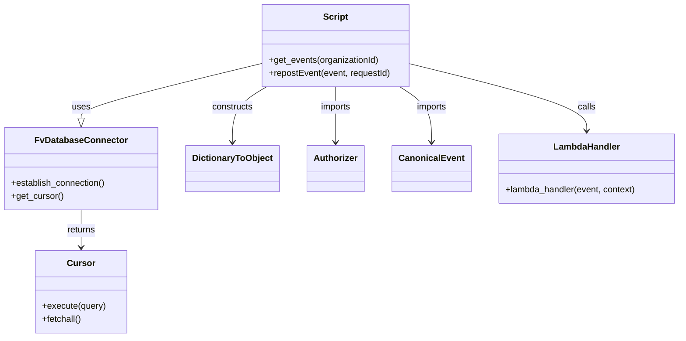

# Diagram: tools/ide_local_testing/localTest/utility/reprocessFailedSupplementalShipments.py


> Auto-generated by Obscura crawlers

## Diagram 1

```mermaid
flowchart TD
    A[Start script] --> B[get_events(organizationId)]
    B --> C[FvDatabaseConnector.establish_connection()]
    C --> D[execute query on event_audit_error]
    D --> E[fetchall results]
    E --> F[for each row: retval.append(row.event)]
    F --> G[return events]
    G --> H[for event in events]
    H --> I[start = time.time()]
    I --> J[repostEvent(event, requestId)]
    J --> K[lambda_handler(event, context)]
    K --> L[response with body?]
    L -- yes --> M[json.loads(response.body)]
    L -- no --> N[Nothing returned]
    M --> O[print pretty JSON]
    N --> P[print "Nothing returned"]
    O --> Q[end = time.time()]
    P --> Q
    Q --> R[print Lambda execution time]
    R --> S[Script end]
```

> SVG rendering failed for this diagram.

## Diagram 2



### SVG

<svg id="container" width="1215.3515625" xmlns="http://www.w3.org/2000/svg" class="classDiagram" height="614" viewBox="0 0 1215.3515625 614" role="graphics-document document" aria-roledescription="class"><style>#container{font-family:"trebuchet ms",verdana,arial,sans-serif;font-size:16px;fill:#333;}@keyframes edge-animation-frame{from{stroke-dashoffset:0;}}@keyframes dash{to{stroke-dashoffset:0;}}#container .edge-animation-slow{stroke-dasharray:9,5!important;stroke-dashoffset:900;animation:dash 50s linear infinite;stroke-linecap:round;}#container .edge-animation-fast{stroke-dasharray:9,5!important;stroke-dashoffset:900;animation:dash 20s linear infinite;stroke-linecap:round;}#container .error-icon{fill:#552222;}#container .error-text{fill:#552222;stroke:#552222;}#container .edge-thickness-normal{stroke-width:1px;}#container .edge-thickness-thick{stroke-width:3.5px;}#container .edge-pattern-solid{stroke-dasharray:0;}#container .edge-thickness-invisible{stroke-width:0;fill:none;}#container .edge-pattern-dashed{stroke-dasharray:3;}#container .edge-pattern-dotted{stroke-dasharray:2;}#container .marker{fill:#333333;stroke:#333333;}#container .marker.cross{stroke:#333333;}#container svg{font-family:"trebuchet ms",verdana,arial,sans-serif;font-size:16px;}#container p{margin:0;}#container g.classGroup text{fill:#9370DB;stroke:none;font-family:"trebuchet ms",verdana,arial,sans-serif;font-size:10px;}#container g.classGroup text .title{font-weight:bolder;}#container .nodeLabel,#container .edgeLabel{color:#131300;}#container .edgeLabel .label rect{fill:#ECECFF;}#container .label text{fill:#131300;}#container .labelBkg{background:#ECECFF;}#container .edgeLabel .label span{background:#ECECFF;}#container .classTitle{font-weight:bolder;}#container .node rect,#container .node circle,#container .node ellipse,#container .node polygon,#container .node path{fill:#ECECFF;stroke:#9370DB;stroke-width:1px;}#container .divider{stroke:#9370DB;stroke-width:1;}#container g.clickable{cursor:pointer;}#container g.classGroup rect{fill:#ECECFF;stroke:#9370DB;}#container g.classGroup line{stroke:#9370DB;stroke-width:1;}#container .classLabel .box{stroke:none;stroke-width:0;fill:#ECECFF;opacity:0.5;}#container .classLabel .label{fill:#9370DB;font-size:10px;}#container .relation{stroke:#333333;stroke-width:1;fill:none;}#container .dashed-line{stroke-dasharray:3;}#container .dotted-line{stroke-dasharray:1 2;}#container #compositionStart,#container .composition{fill:#333333!important;stroke:#333333!important;stroke-width:1;}#container #compositionEnd,#container .composition{fill:#333333!important;stroke:#333333!important;stroke-width:1;}#container #dependencyStart,#container .dependency{fill:#333333!important;stroke:#333333!important;stroke-width:1;}#container #dependencyStart,#container .dependency{fill:#333333!important;stroke:#333333!important;stroke-width:1;}#container #extensionStart,#container .extension{fill:transparent!important;stroke:#333333!important;stroke-width:1;}#container #extensionEnd,#container .extension{fill:transparent!important;stroke:#333333!important;stroke-width:1;}#container #aggregationStart,#container .aggregation{fill:transparent!important;stroke:#333333!important;stroke-width:1;}#container #aggregationEnd,#container .aggregation{fill:transparent!important;stroke:#333333!important;stroke-width:1;}#container #lollipopStart,#container .lollipop{fill:#ECECFF!important;stroke:#333333!important;stroke-width:1;}#container #lollipopEnd,#container .lollipop{fill:#ECECFF!important;stroke:#333333!important;stroke-width:1;}#container .edgeTerminals{font-size:11px;line-height:initial;}#container .classTitleText{text-anchor:middle;font-size:18px;fill:#333;}#container .label-icon{display:inline-block;height:1em;overflow:visible;vertical-align:-0.125em;}#container .node .label-icon path{fill:currentColor;stroke:revert;stroke-width:revert;}#container :root{--mermaid-font-family:"trebuchet ms",verdana,arial,sans-serif;}</style><g><defs><marker id="container_class-aggregationStart" class="marker aggregation class" refX="18" refY="7" markerWidth="190" markerHeight="240" orient="auto"><path d="M 18,7 L9,13 L1,7 L9,1 Z"></path></marker></defs><defs><marker id="container_class-aggregationEnd" class="marker aggregation class" refX="1" refY="7" markerWidth="20" markerHeight="28" orient="auto"><path d="M 18,7 L9,13 L1,7 L9,1 Z"></path></marker></defs><defs><marker id="container_class-extensionStart" class="marker extension class" refX="18" refY="7" markerWidth="190" markerHeight="240" orient="auto"><path d="M 1,7 L18,13 V 1 Z"></path></marker></defs><defs><marker id="container_class-extensionEnd" class="marker extension class" refX="1" refY="7" markerWidth="20" markerHeight="28" orient="auto"><path d="M 1,1 V 13 L18,7 Z"></path></marker></defs><defs><marker id="container_class-compositionStart" class="marker composition class" refX="18" refY="7" markerWidth="190" markerHeight="240" orient="auto"><path d="M 18,7 L9,13 L1,7 L9,1 Z"></path></marker></defs><defs><marker id="container_class-compositionEnd" class="marker composition class" refX="1" refY="7" markerWidth="20" markerHeight="28" orient="auto"><path d="M 18,7 L9,13 L1,7 L9,1 Z"></path></marker></defs><defs><marker id="container_class-dependencyStart" class="marker dependency class" refX="6" refY="7" markerWidth="190" markerHeight="240" orient="auto"><path d="M 5,7 L9,13 L1,7 L9,1 Z"></path></marker></defs><defs><marker id="container_class-dependencyEnd" class="marker dependency class" refX="13" refY="7" markerWidth="20" markerHeight="28" orient="auto"><path d="M 18,7 L9,13 L14,7 L9,1 Z"></path></marker></defs><defs><marker id="container_class-lollipopStart" class="marker lollipop class" refX="13" refY="7" markerWidth="190" markerHeight="240" orient="auto"><circle stroke="black" fill="transparent" cx="7" cy="7" r="6"></circle></marker></defs><defs><marker id="container_class-lollipopEnd" class="marker lollipop class" refX="1" refY="7" markerWidth="190" markerHeight="240" orient="auto"><circle stroke="black" fill="transparent" cx="7" cy="7" r="6"></circle></marker></defs><g class="root"><g class="clusters"></g><g class="edgePaths"><path d="M464.871,116.21L411.773,129.342C358.676,142.473,252.48,168.737,199.383,185.16C146.285,201.583,146.285,208.167,146.285,211.458L146.285,214.75" id="id_Script_FvDatabaseConnector_1" class="edge-thickness-normal edge-pattern-solid relation" style=";;;" data-edge="true" data-et="edge" data-id="id_Script_FvDatabaseConnector_1" data-points="W3sieCI6NDY0Ljg3MTA5Mzc1LCJ5IjoxMTYuMjEwMTk1MzY4MDk0MTl9LHsieCI6MTQ2LjI4NTE1NjI1LCJ5IjoxOTV9LHsieCI6MTQ2LjI4NTE1NjI1LCJ5IjoyMzJ9XQ==" marker-end="url(#container_class-extensionEnd)"></path><path d="M146.285,382L146.285,388.167C146.285,394.333,146.285,406.667,146.285,418C146.285,429.333,146.285,439.667,146.285,444.833L146.285,450" id="id_FvDatabaseConnector_Cursor_2" class="edge-thickness-normal edge-pattern-solid relation" style=";;;" data-edge="true" data-et="edge" data-id="id_FvDatabaseConnector_Cursor_2" data-points="W3sieCI6MTQ2LjI4NTE1NjI1LCJ5IjozODJ9LHsieCI6MTQ2LjI4NTE1NjI1LCJ5Ijo0MTl9LHsieCI6MTQ2LjI4NTE1NjI1LCJ5Ijo0NTZ9XQ==" marker-end="url(#container_class-dependencyEnd)"></path><path d="M476.962,158L466.915,164.167C456.868,170.333,436.774,182.667,426.727,199.5C416.68,216.333,416.68,237.667,416.68,248.333L416.68,259" id="id_Script_DictionaryToObject_3" class="edge-thickness-normal edge-pattern-solid relation" style=";;;" data-edge="true" data-et="edge" data-id="id_Script_DictionaryToObject_3" data-points="W3sieCI6NDc2Ljk2MjEyMzMyNTg5MjksInkiOjE1OH0seyJ4Ijo0MTYuNjc5Njg3NSwieSI6MTk1fSx7IngiOjQxNi42Nzk2ODc1LCJ5IjoyNjV9XQ==" marker-end="url(#container_class-dependencyEnd)"></path><path d="M733.441,116.647L785.559,129.706C837.677,142.765,941.913,168.882,994.031,189.108C1046.148,209.333,1046.148,223.667,1046.148,230.833L1046.148,238" id="id_Script_LambdaHandler_4" class="edge-thickness-normal edge-pattern-solid relation" style=";;;" data-edge="true" data-et="edge" data-id="id_Script_LambdaHandler_4" data-points="W3sieCI6NzMzLjQ0MTQwNjI1LCJ5IjoxMTYuNjQ2OTgwNjg2ODgyODF9LHsieCI6MTA0Ni4xNDg0Mzc1LCJ5IjoxOTV9LHsieCI6MTA0Ni4xNDg0Mzc1LCJ5IjoyNDR9XQ==" marker-end="url(#container_class-dependencyEnd)"></path><path d="M599.156,158L599.156,164.167C599.156,170.333,599.156,182.667,599.156,199.5C599.156,216.333,599.156,237.667,599.156,248.333L599.156,259" id="id_Script_Authorizer_5" class="edge-thickness-normal edge-pattern-solid relation" style=";;;" data-edge="true" data-et="edge" data-id="id_Script_Authorizer_5" data-points="W3sieCI6NTk5LjE1NjI1LCJ5IjoxNTh9LHsieCI6NTk5LjE1NjI1LCJ5IjoxOTV9LHsieCI6NTk5LjE1NjI1LCJ5IjoyNjV9XQ==" marker-end="url(#container_class-dependencyEnd)"></path><path d="M711.709,158L720.963,164.167C730.217,170.333,748.726,182.667,757.98,199.5C767.234,216.333,767.234,237.667,767.234,248.333L767.234,259" id="id_Script_CanonicalEvent_6" class="edge-thickness-normal edge-pattern-solid relation" style=";;;" data-edge="true" data-et="edge" data-id="id_Script_CanonicalEvent_6" data-points="W3sieCI6NzExLjcwODU2NTg0ODIxNDMsInkiOjE1OH0seyJ4Ijo3NjcuMjM0Mzc1LCJ5IjoxOTV9LHsieCI6NzY3LjIzNDM3NSwieSI6MjY1fV0=" marker-end="url(#container_class-dependencyEnd)"></path></g><g class="edgeLabels"><g class="edgeLabel" transform="translate(146.28515625, 195)"><g class="label" data-id="id_Script_FvDatabaseConnector_1" transform="translate(-16.4921875, -12)"><foreignObject width="32.984375" height="24"><div xmlns="http://www.w3.org/1999/xhtml" class="labelBkg" style="display: table-cell; white-space: nowrap; line-height: 1.5; max-width: 200px; text-align: center;"><span class="edgeLabel"><p>uses</p></span></div></foreignObject></g></g><g class="edgeLabel" transform="translate(146.28515625, 419)"><g class="label" data-id="id_FvDatabaseConnector_Cursor_2" transform="translate(-26.265625, -12)"><foreignObject width="52.53125" height="24"><div xmlns="http://www.w3.org/1999/xhtml" class="labelBkg" style="display: table-cell; white-space: nowrap; line-height: 1.5; max-width: 200px; text-align: center;"><span class="edgeLabel"><p>returns</p></span></div></foreignObject></g></g><g class="edgeLabel" transform="translate(416.6796875, 195)"><g class="label" data-id="id_Script_DictionaryToObject_3" transform="translate(-37.84375, -12)"><foreignObject width="75.6875" height="24"><div xmlns="http://www.w3.org/1999/xhtml" class="labelBkg" style="display: table-cell; white-space: nowrap; line-height: 1.5; max-width: 200px; text-align: center;"><span class="edgeLabel"><p>constructs</p></span></div></foreignObject></g></g><g class="edgeLabel" transform="translate(1046.1484375, 195)"><g class="label" data-id="id_Script_LambdaHandler_4" transform="translate(-16.4453125, -12)"><foreignObject width="32.890625" height="24"><div xmlns="http://www.w3.org/1999/xhtml" class="labelBkg" style="display: table-cell; white-space: nowrap; line-height: 1.5; max-width: 200px; text-align: center;"><span class="edgeLabel"><p>calls</p></span></div></foreignObject></g></g><g class="edgeLabel" transform="translate(599.15625, 195)"><g class="label" data-id="id_Script_Authorizer_5" transform="translate(-28.25, -12)"><foreignObject width="56.5" height="24"><div xmlns="http://www.w3.org/1999/xhtml" class="labelBkg" style="display: table-cell; white-space: nowrap; line-height: 1.5; max-width: 200px; text-align: center;"><span class="edgeLabel"><p>imports</p></span></div></foreignObject></g></g><g class="edgeLabel" transform="translate(767.234375, 195)"><g class="label" data-id="id_Script_CanonicalEvent_6" transform="translate(-28.25, -12)"><foreignObject width="56.5" height="24"><div xmlns="http://www.w3.org/1999/xhtml" class="labelBkg" style="display: table-cell; white-space: nowrap; line-height: 1.5; max-width: 200px; text-align: center;"><span class="edgeLabel"><p>imports</p></span></div></foreignObject></g></g></g><g class="nodes"><g class="node default" id="classId-Script-0" transform="translate(599.15625, 83)"><g class="basic label-container"><path d="M-134.28515625 -75 L134.28515625 -75 L134.28515625 75 L-134.28515625 75" stroke="none" stroke-width="0" fill="#ECECFF" style=""></path><path d="M-134.28515625 -75 C-67.52250009836834 -75, -0.7598439467366802 -75, 134.28515625 -75 M-134.28515625 -75 C-57.472385187466514 -75, 19.34038587506697 -75, 134.28515625 -75 M134.28515625 -75 C134.28515625 -42.45596938399787, 134.28515625 -9.911938767995736, 134.28515625 75 M134.28515625 -75 C134.28515625 -40.90222866605043, 134.28515625 -6.804457332100867, 134.28515625 75 M134.28515625 75 C77.1041934016796 75, 19.923230553359204 75, -134.28515625 75 M134.28515625 75 C74.0375333621956 75, 13.789910474391192 75, -134.28515625 75 M-134.28515625 75 C-134.28515625 21.651619490040126, -134.28515625 -31.696761019919748, -134.28515625 -75 M-134.28515625 75 C-134.28515625 16.020804835410047, -134.28515625 -42.958390329179906, -134.28515625 -75" stroke="#9370DB" stroke-width="1.3" fill="none" stroke-dasharray="0 0" style=""></path></g><g class="annotation-group text" transform="translate(0, -51)"></g><g class="label-group text" transform="translate(-21.7421875, -51)"><g class="label" style="font-weight: bolder" transform="translate(0,-12)"><foreignObject width="43.484375" height="24"><div xmlns="http://www.w3.org/1999/xhtml" style="display: table-cell; white-space: nowrap; line-height: 1.5; max-width: 93px; text-align: center;"><span class="nodeLabel markdown-node-label" style=""><p>Script</p></span></div></foreignObject></g></g><g class="members-group text" transform="translate(-122.28515625, -3)"></g><g class="methods-group text" transform="translate(-122.28515625, 27)"><g class="label" style="" transform="translate(0,-12)"><foreignObject width="201.375" height="24"><div xmlns="http://www.w3.org/1999/xhtml" style="display: table-cell; white-space: nowrap; line-height: 1.5; max-width: 259px; text-align: center;"><span class="nodeLabel markdown-node-label" style=""><p>+get_events(organizationId)</p></span></div></foreignObject></g><g class="label" style="" transform="translate(0,12)"><foreignObject width="222.828125" height="24"><div xmlns="http://www.w3.org/1999/xhtml" style="display: table-cell; white-space: nowrap; line-height: 1.5; max-width: 280px; text-align: center;"><span class="nodeLabel markdown-node-label" style=""><p>+repostEvent(event, requestId)</p></span></div></foreignObject></g></g><g class="divider" style=""><path d="M-134.28515625 -27 C-79.3124802241876 -27, -24.33980419837519 -27, 134.28515625 -27 M-134.28515625 -27 C-43.94152232565756 -27, 46.40211159868488 -27, 134.28515625 -27" stroke="#9370DB" stroke-width="1.3" fill="none" stroke-dasharray="0 0" style=""></path></g><g class="divider" style=""><path d="M-134.28515625 -3 C-66.70336277859502 -3, 0.8784306928099568 -3, 134.28515625 -3 M-134.28515625 -3 C-38.85633164099026 -3, 56.572492968019475 -3, 134.28515625 -3" stroke="#9370DB" stroke-width="1.3" fill="none" stroke-dasharray="0 0" style=""></path></g></g><g class="node default" id="classId-FvDatabaseConnector-1" transform="translate(146.28515625, 307)"><g class="basic label-container"><path d="M-138.28515625 -75 L138.28515625 -75 L138.28515625 75 L-138.28515625 75" stroke="none" stroke-width="0" fill="#ECECFF" style=""></path><path d="M-138.28515625 -75 C-53.309169465261945 -75, 31.66681731947611 -75, 138.28515625 -75 M-138.28515625 -75 C-68.42785747741266 -75, 1.4294412951746835 -75, 138.28515625 -75 M138.28515625 -75 C138.28515625 -23.861110994147815, 138.28515625 27.27777801170437, 138.28515625 75 M138.28515625 -75 C138.28515625 -25.694908652316983, 138.28515625 23.610182695366035, 138.28515625 75 M138.28515625 75 C77.4679704835875 75, 16.650784717174986 75, -138.28515625 75 M138.28515625 75 C39.98654546993836 75, -58.31206531012327 75, -138.28515625 75 M-138.28515625 75 C-138.28515625 40.65657913393653, -138.28515625 6.313158267873064, -138.28515625 -75 M-138.28515625 75 C-138.28515625 34.92270083727141, -138.28515625 -5.1545983254571865, -138.28515625 -75" stroke="#9370DB" stroke-width="1.3" fill="none" stroke-dasharray="0 0" style=""></path></g><g class="annotation-group text" transform="translate(0, -51)"></g><g class="label-group text" transform="translate(-79.3046875, -51)"><g class="label" style="font-weight: bolder" transform="translate(0,-12)"><foreignObject width="158.609375" height="24"><div xmlns="http://www.w3.org/1999/xhtml" style="display: table-cell; white-space: nowrap; line-height: 1.5; max-width: 207px; text-align: center;"><span class="nodeLabel markdown-node-label" style=""><p>FvDatabaseConnector</p></span></div></foreignObject></g></g><g class="members-group text" transform="translate(-126.28515625, -3)"></g><g class="methods-group text" transform="translate(-126.28515625, 27)"><g class="label" style="" transform="translate(0,-12)"><foreignObject width="173.265625" height="24"><div xmlns="http://www.w3.org/1999/xhtml" style="display: table-cell; white-space: nowrap; line-height: 1.5; max-width: 231px; text-align: center;"><span class="nodeLabel markdown-node-label" style=""><p>+establish_connection()</p></span></div></foreignObject></g><g class="label" style="" transform="translate(0,12)"><foreignObject width="94.640625" height="24"><div xmlns="http://www.w3.org/1999/xhtml" style="display: table-cell; white-space: nowrap; line-height: 1.5; max-width: 152px; text-align: center;"><span class="nodeLabel markdown-node-label" style=""><p>+get_cursor()</p></span></div></foreignObject></g></g><g class="divider" style=""><path d="M-138.28515625 -27 C-54.7175652787367 -27, 28.8500256925266 -27, 138.28515625 -27 M-138.28515625 -27 C-73.58606557401737 -27, -8.886974898034737 -27, 138.28515625 -27" stroke="#9370DB" stroke-width="1.3" fill="none" stroke-dasharray="0 0" style=""></path></g><g class="divider" style=""><path d="M-138.28515625 -3 C-28.461510615434378 -3, 81.36213501913124 -3, 138.28515625 -3 M-138.28515625 -3 C-81.49602507956044 -3, -24.70689390912088 -3, 138.28515625 -3" stroke="#9370DB" stroke-width="1.3" fill="none" stroke-dasharray="0 0" style=""></path></g></g><g class="node default" id="classId-Cursor-2" transform="translate(146.28515625, 531)"><g class="basic label-container"><path d="M-81.9375 -75 L81.9375 -75 L81.9375 75 L-81.9375 75" stroke="none" stroke-width="0" fill="#ECECFF" style=""></path><path d="M-81.9375 -75 C-48.709663801258046 -75, -15.481827602516091 -75, 81.9375 -75 M-81.9375 -75 C-43.41091666623736 -75, -4.884333332474725 -75, 81.9375 -75 M81.9375 -75 C81.9375 -43.44268851983044, 81.9375 -11.885377039660888, 81.9375 75 M81.9375 -75 C81.9375 -31.442739396723347, 81.9375 12.114521206553306, 81.9375 75 M81.9375 75 C38.27210008048479 75, -5.393299839030419 75, -81.9375 75 M81.9375 75 C25.264850533253927 75, -31.407798933492145 75, -81.9375 75 M-81.9375 75 C-81.9375 17.079509745166987, -81.9375 -40.840980509666025, -81.9375 -75 M-81.9375 75 C-81.9375 23.455796527644715, -81.9375 -28.08840694471057, -81.9375 -75" stroke="#9370DB" stroke-width="1.3" fill="none" stroke-dasharray="0 0" style=""></path></g><g class="annotation-group text" transform="translate(0, -51)"></g><g class="label-group text" transform="translate(-23.90625, -51)"><g class="label" style="font-weight: bolder" transform="translate(0,-12)"><foreignObject width="47.8125" height="24"><div xmlns="http://www.w3.org/1999/xhtml" style="display: table-cell; white-space: nowrap; line-height: 1.5; max-width: 98px; text-align: center;"><span class="nodeLabel markdown-node-label" style=""><p>Cursor</p></span></div></foreignObject></g></g><g class="members-group text" transform="translate(-69.9375, -3)"></g><g class="methods-group text" transform="translate(-69.9375, 27)"><g class="label" style="" transform="translate(0,-12)"><foreignObject width="115.96875" height="24"><div xmlns="http://www.w3.org/1999/xhtml" style="display: table-cell; white-space: nowrap; line-height: 1.5; max-width: 173px; text-align: center;"><span class="nodeLabel markdown-node-label" style=""><p>+execute(query)</p></span></div></foreignObject></g><g class="label" style="" transform="translate(0,12)"><foreignObject width="72.515625" height="24"><div xmlns="http://www.w3.org/1999/xhtml" style="display: table-cell; white-space: nowrap; line-height: 1.5; max-width: 130px; text-align: center;"><span class="nodeLabel markdown-node-label" style=""><p>+fetchall()</p></span></div></foreignObject></g></g><g class="divider" style=""><path d="M-81.9375 -27 C-32.793708052333784 -27, 16.350083895332432 -27, 81.9375 -27 M-81.9375 -27 C-45.63789160648186 -27, -9.338283212963717 -27, 81.9375 -27" stroke="#9370DB" stroke-width="1.3" fill="none" stroke-dasharray="0 0" style=""></path></g><g class="divider" style=""><path d="M-81.9375 -3 C-30.295857662661675 -3, 21.34578467467665 -3, 81.9375 -3 M-81.9375 -3 C-28.062035459456418 -3, 25.813429081087165 -3, 81.9375 -3" stroke="#9370DB" stroke-width="1.3" fill="none" stroke-dasharray="0 0" style=""></path></g></g><g class="node default" id="classId-DictionaryToObject-3" transform="translate(416.6796875, 307)"><g class="basic label-container"><path d="M-82.109375 -42 L82.109375 -42 L82.109375 42 L-82.109375 42" stroke="none" stroke-width="0" fill="#ECECFF" style=""></path><path d="M-82.109375 -42 C-35.117561682438684 -42, 11.874251635122633 -42, 82.109375 -42 M-82.109375 -42 C-33.4963682900493 -42, 15.116638419901406 -42, 82.109375 -42 M82.109375 -42 C82.109375 -11.533397952741506, 82.109375 18.933204094516988, 82.109375 42 M82.109375 -42 C82.109375 -17.63969741809648, 82.109375 6.720605163807043, 82.109375 42 M82.109375 42 C37.42946311502543 42, -7.250448769949145 42, -82.109375 42 M82.109375 42 C47.877296575735144 42, 13.645218151470289 42, -82.109375 42 M-82.109375 42 C-82.109375 14.114049334646996, -82.109375 -13.771901330706008, -82.109375 -42 M-82.109375 42 C-82.109375 22.835274023030976, -82.109375 3.6705480460619526, -82.109375 -42" stroke="#9370DB" stroke-width="1.3" fill="none" stroke-dasharray="0 0" style=""></path></g><g class="annotation-group text" transform="translate(0, -18)"></g><g class="label-group text" transform="translate(-70.109375, -18)"><g class="label" style="font-weight: bolder" transform="translate(0,-12)"><foreignObject width="140.21875" height="24"><div xmlns="http://www.w3.org/1999/xhtml" style="display: table-cell; white-space: nowrap; line-height: 1.5; max-width: 188px; text-align: center;"><span class="nodeLabel markdown-node-label" style=""><p>DictionaryToObject</p></span></div></foreignObject></g></g><g class="members-group text" transform="translate(-70.109375, 30)"></g><g class="methods-group text" transform="translate(-70.109375, 60)"></g><g class="divider" style=""><path d="M-82.109375 6 C-45.24663959717478 6, -8.383904194349554 6, 82.109375 6 M-82.109375 6 C-39.21601002123144 6, 3.677354957537119 6, 82.109375 6" stroke="#9370DB" stroke-width="1.3" fill="none" stroke-dasharray="0 0" style=""></path></g><g class="divider" style=""><path d="M-82.109375 24 C-20.201201664167556 24, 41.70697167166489 24, 82.109375 24 M-82.109375 24 C-23.780053672601298 24, 34.549267654797404 24, 82.109375 24" stroke="#9370DB" stroke-width="1.3" fill="none" stroke-dasharray="0 0" style=""></path></g></g><g class="node default" id="classId-Authorizer-4" transform="translate(599.15625, 307)"><g class="basic label-container"><path d="M-50.3671875 -42 L50.3671875 -42 L50.3671875 42 L-50.3671875 42" stroke="none" stroke-width="0" fill="#ECECFF" style=""></path><path d="M-50.3671875 -42 C-21.72768336670224 -42, 6.911820766595518 -42, 50.3671875 -42 M-50.3671875 -42 C-11.6837522725193 -42, 26.9996829549614 -42, 50.3671875 -42 M50.3671875 -42 C50.3671875 -17.902055716357506, 50.3671875 6.195888567284989, 50.3671875 42 M50.3671875 -42 C50.3671875 -24.66828182247104, 50.3671875 -7.336563644942082, 50.3671875 42 M50.3671875 42 C21.763370594116747 42, -6.840446311766506 42, -50.3671875 42 M50.3671875 42 C20.73315978776141 42, -8.900867924477183 42, -50.3671875 42 M-50.3671875 42 C-50.3671875 22.35870762851328, -50.3671875 2.717415257026559, -50.3671875 -42 M-50.3671875 42 C-50.3671875 21.107530162847805, -50.3671875 0.2150603256956103, -50.3671875 -42" stroke="#9370DB" stroke-width="1.3" fill="none" stroke-dasharray="0 0" style=""></path></g><g class="annotation-group text" transform="translate(0, -18)"></g><g class="label-group text" transform="translate(-38.3671875, -18)"><g class="label" style="font-weight: bolder" transform="translate(0,-12)"><foreignObject width="76.734375" height="24"><div xmlns="http://www.w3.org/1999/xhtml" style="display: table-cell; white-space: nowrap; line-height: 1.5; max-width: 126px; text-align: center;"><span class="nodeLabel markdown-node-label" style=""><p>Authorizer</p></span></div></foreignObject></g></g><g class="members-group text" transform="translate(-38.3671875, 30)"></g><g class="methods-group text" transform="translate(-38.3671875, 60)"></g><g class="divider" style=""><path d="M-50.3671875 6 C-26.05183274985979 6, -1.7364779997195825 6, 50.3671875 6 M-50.3671875 6 C-14.301638690244062 6, 21.763910119511877 6, 50.3671875 6" stroke="#9370DB" stroke-width="1.3" fill="none" stroke-dasharray="0 0" style=""></path></g><g class="divider" style=""><path d="M-50.3671875 24 C-10.329467480914062 24, 29.708252538171877 24, 50.3671875 24 M-50.3671875 24 C-21.305013569071757 24, 7.757160361856485 24, 50.3671875 24" stroke="#9370DB" stroke-width="1.3" fill="none" stroke-dasharray="0 0" style=""></path></g></g><g class="node default" id="classId-CanonicalEvent-5" transform="translate(767.234375, 307)"><g class="basic label-container"><path d="M-67.7109375 -42 L67.7109375 -42 L67.7109375 42 L-67.7109375 42" stroke="none" stroke-width="0" fill="#ECECFF" style=""></path><path d="M-67.7109375 -42 C-32.757114779794065 -42, 2.1967079404118692 -42, 67.7109375 -42 M-67.7109375 -42 C-38.68755347216276 -42, -9.664169444325523 -42, 67.7109375 -42 M67.7109375 -42 C67.7109375 -16.459366161515398, 67.7109375 9.081267676969205, 67.7109375 42 M67.7109375 -42 C67.7109375 -18.94839466151649, 67.7109375 4.1032106769670165, 67.7109375 42 M67.7109375 42 C33.035662870033576 42, -1.6396117599328477 42, -67.7109375 42 M67.7109375 42 C32.13973550885463 42, -3.4314664822907446 42, -67.7109375 42 M-67.7109375 42 C-67.7109375 25.182075482659805, -67.7109375 8.36415096531961, -67.7109375 -42 M-67.7109375 42 C-67.7109375 11.757637452270643, -67.7109375 -18.484725095458714, -67.7109375 -42" stroke="#9370DB" stroke-width="1.3" fill="none" stroke-dasharray="0 0" style=""></path></g><g class="annotation-group text" transform="translate(0, -18)"></g><g class="label-group text" transform="translate(-55.7109375, -18)"><g class="label" style="font-weight: bolder" transform="translate(0,-12)"><foreignObject width="111.421875" height="24"><div xmlns="http://www.w3.org/1999/xhtml" style="display: table-cell; white-space: nowrap; line-height: 1.5; max-width: 161px; text-align: center;"><span class="nodeLabel markdown-node-label" style=""><p>CanonicalEvent</p></span></div></foreignObject></g></g><g class="members-group text" transform="translate(-55.7109375, 30)"></g><g class="methods-group text" transform="translate(-55.7109375, 60)"></g><g class="divider" style=""><path d="M-67.7109375 6 C-15.728760112945658 6, 36.253417274108685 6, 67.7109375 6 M-67.7109375 6 C-21.889577215910734 6, 23.931783068178532 6, 67.7109375 6" stroke="#9370DB" stroke-width="1.3" fill="none" stroke-dasharray="0 0" style=""></path></g><g class="divider" style=""><path d="M-67.7109375 24 C-31.0426475342201 24, 5.625642431559797 24, 67.7109375 24 M-67.7109375 24 C-19.253417631450624 24, 29.204102237098752 24, 67.7109375 24" stroke="#9370DB" stroke-width="1.3" fill="none" stroke-dasharray="0 0" style=""></path></g></g><g class="node default" id="classId-LambdaHandler-6" transform="translate(1046.1484375, 307)"><g class="basic label-container"><path d="M-161.203125 -63 L161.203125 -63 L161.203125 63 L-161.203125 63" stroke="none" stroke-width="0" fill="#ECECFF" style=""></path><path d="M-161.203125 -63 C-41.152957794373364 -63, 78.89720941125327 -63, 161.203125 -63 M-161.203125 -63 C-76.26027672629456 -63, 8.682571547410873 -63, 161.203125 -63 M161.203125 -63 C161.203125 -26.99105075063435, 161.203125 9.017898498731299, 161.203125 63 M161.203125 -63 C161.203125 -15.9887917348791, 161.203125 31.0224165302418, 161.203125 63 M161.203125 63 C90.96072344743682 63, 20.71832189487364 63, -161.203125 63 M161.203125 63 C95.51478606714907 63, 29.82644713429815 63, -161.203125 63 M-161.203125 63 C-161.203125 14.24991207580279, -161.203125 -34.50017584839442, -161.203125 -63 M-161.203125 63 C-161.203125 29.988604081318073, -161.203125 -3.0227918373638545, -161.203125 -63" stroke="#9370DB" stroke-width="1.3" fill="none" stroke-dasharray="0 0" style=""></path></g><g class="annotation-group text" transform="translate(0, -39)"></g><g class="label-group text" transform="translate(-58.21875, -39)"><g class="label" style="font-weight: bolder" transform="translate(0,-12)"><foreignObject width="116.4375" height="24"><div xmlns="http://www.w3.org/1999/xhtml" style="display: table-cell; white-space: nowrap; line-height: 1.5; max-width: 167px; text-align: center;"><span class="nodeLabel markdown-node-label" style=""><p>LambdaHandler</p></span></div></foreignObject></g></g><g class="members-group text" transform="translate(-149.203125, 9)"></g><g class="methods-group text" transform="translate(-149.203125, 39)"><g class="label" style="" transform="translate(0,-12)"><foreignObject width="240.1875" height="24"><div xmlns="http://www.w3.org/1999/xhtml" style="display: table-cell; white-space: nowrap; line-height: 1.5; max-width: 298px; text-align: center;"><span class="nodeLabel markdown-node-label" style=""><p>+lambda_handler(event, context)</p></span></div></foreignObject></g></g><g class="divider" style=""><path d="M-161.203125 -15 C-96.30163252442503 -15, -31.400140048850062 -15, 161.203125 -15 M-161.203125 -15 C-83.56331800319542 -15, -5.923511006390839 -15, 161.203125 -15" stroke="#9370DB" stroke-width="1.3" fill="none" stroke-dasharray="0 0" style=""></path></g><g class="divider" style=""><path d="M-161.203125 9 C-74.92167740672326 9, 11.359770186553476 9, 161.203125 9 M-161.203125 9 C-95.18082850061265 9, -29.158532001225296 9, 161.203125 9" stroke="#9370DB" stroke-width="1.3" fill="none" stroke-dasharray="0 0" style=""></path></g></g></g></g></g></svg>
