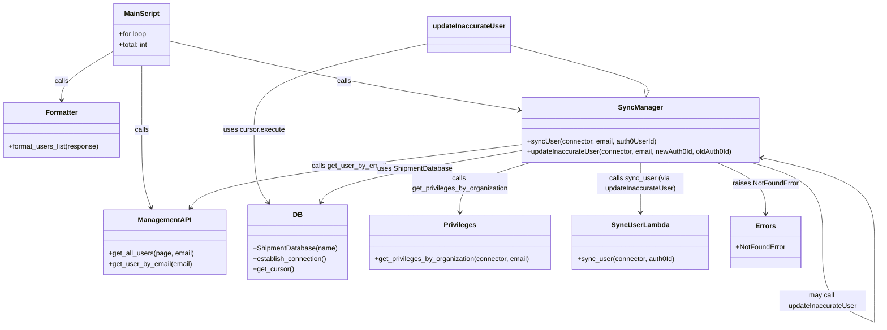

# Diagram: tools/ide_local_testing/localTest/utility/syncUsersFromUserTable.py


> Auto-generated by Obscura crawlers

## Diagram 1

```mermaid
flowchart TD
  Start([Start]) --> Loop{for loop 0..98}
  Loop --> CallGetAll[/"management_api.get_all_users(page, email)"/]
  CallGetAll -->|response length > 0| Format[/"format_users_list(response)"/]
  Format --> ForEachUser{for user in userList}
  ForEachUser --> Extract[userId, email]
  Extract -->|email exists| CreateConn[/"ShipmentDatabase(\"syncUser\")"/]
  CreateConn --> SyncCall[/"syncUser(connector, email, userId)"/]
  SyncCall --> GetByEmail[/"management_api.get_user_by_email(email)"/]
  GetByEmail --> CheckStatus{statusCode 2xx?}
  CheckStatus -- No --> NotFound[/Raise NotFoundError/]
  CheckStatus -- Yes --> Establish[/"connector.establish_connection()"/]
  Establish --> GetPriv[/"get_privileges_by_organization(connector, email) -> (userId, app_metadata)"/]
  GetPriv --> AppMetaCheck{app_metadata empty?}
  AppMetaCheck -- false & mismatch --> UpdateCall[/"updateInaccurateUser(connector, email, auth0UserId, userId)"/]
  UpdateCall --> UpdateDB[/"cursor.mogrify and cursor.execute UPDATE user SET auth0_id"/]
  UpdateCall --> SyncUserCall[/"sync_user(connector, newAuth0Id)"/]
  AppMetaCheck --> Return[/return email, userId, auth0User/]
  ForEachUser --> TotalCount[/"total += len(userList)"/]
  CallGetAll -->|response empty| Break[/break loop/]
  Loop --> End([End]) --> PrintTotal[/"print total users processed"/]
```

> SVG rendering failed for this diagram.

## Diagram 2



### SVG

<svg id="container" width="2026.5523681640625" xmlns="http://www.w3.org/2000/svg" class="classDiagram" height="754.1499633789062" viewBox="0 0 2026.5523681640625 754.1499633789062" role="graphics-document document" aria-roledescription="class"><style>#container{font-family:"trebuchet ms",verdana,arial,sans-serif;font-size:16px;fill:#333;}@keyframes edge-animation-frame{from{stroke-dashoffset:0;}}@keyframes dash{to{stroke-dashoffset:0;}}#container .edge-animation-slow{stroke-dasharray:9,5!important;stroke-dashoffset:900;animation:dash 50s linear infinite;stroke-linecap:round;}#container .edge-animation-fast{stroke-dasharray:9,5!important;stroke-dashoffset:900;animation:dash 20s linear infinite;stroke-linecap:round;}#container .error-icon{fill:#552222;}#container .error-text{fill:#552222;stroke:#552222;}#container .edge-thickness-normal{stroke-width:1px;}#container .edge-thickness-thick{stroke-width:3.5px;}#container .edge-pattern-solid{stroke-dasharray:0;}#container .edge-thickness-invisible{stroke-width:0;fill:none;}#container .edge-pattern-dashed{stroke-dasharray:3;}#container .edge-pattern-dotted{stroke-dasharray:2;}#container .marker{fill:#333333;stroke:#333333;}#container .marker.cross{stroke:#333333;}#container svg{font-family:"trebuchet ms",verdana,arial,sans-serif;font-size:16px;}#container p{margin:0;}#container g.classGroup text{fill:#9370DB;stroke:none;font-family:"trebuchet ms",verdana,arial,sans-serif;font-size:10px;}#container g.classGroup text .title{font-weight:bolder;}#container .nodeLabel,#container .edgeLabel{color:#131300;}#container .edgeLabel .label rect{fill:#ECECFF;}#container .label text{fill:#131300;}#container .labelBkg{background:#ECECFF;}#container .edgeLabel .label span{background:#ECECFF;}#container .classTitle{font-weight:bolder;}#container .node rect,#container .node circle,#container .node ellipse,#container .node polygon,#container .node path{fill:#ECECFF;stroke:#9370DB;stroke-width:1px;}#container .divider{stroke:#9370DB;stroke-width:1;}#container g.clickable{cursor:pointer;}#container g.classGroup rect{fill:#ECECFF;stroke:#9370DB;}#container g.classGroup line{stroke:#9370DB;stroke-width:1;}#container .classLabel .box{stroke:none;stroke-width:0;fill:#ECECFF;opacity:0.5;}#container .classLabel .label{fill:#9370DB;font-size:10px;}#container .relation{stroke:#333333;stroke-width:1;fill:none;}#container .dashed-line{stroke-dasharray:3;}#container .dotted-line{stroke-dasharray:1 2;}#container #compositionStart,#container .composition{fill:#333333!important;stroke:#333333!important;stroke-width:1;}#container #compositionEnd,#container .composition{fill:#333333!important;stroke:#333333!important;stroke-width:1;}#container #dependencyStart,#container .dependency{fill:#333333!important;stroke:#333333!important;stroke-width:1;}#container #dependencyStart,#container .dependency{fill:#333333!important;stroke:#333333!important;stroke-width:1;}#container #extensionStart,#container .extension{fill:transparent!important;stroke:#333333!important;stroke-width:1;}#container #extensionEnd,#container .extension{fill:transparent!important;stroke:#333333!important;stroke-width:1;}#container #aggregationStart,#container .aggregation{fill:transparent!important;stroke:#333333!important;stroke-width:1;}#container #aggregationEnd,#container .aggregation{fill:transparent!important;stroke:#333333!important;stroke-width:1;}#container #lollipopStart,#container .lollipop{fill:#ECECFF!important;stroke:#333333!important;stroke-width:1;}#container #lollipopEnd,#container .lollipop{fill:#ECECFF!important;stroke:#333333!important;stroke-width:1;}#container .edgeTerminals{font-size:11px;line-height:initial;}#container .classTitleText{text-anchor:middle;font-size:18px;fill:#333;}#container .label-icon{display:inline-block;height:1em;overflow:visible;vertical-align:-0.125em;}#container .node .label-icon path{fill:currentColor;stroke:revert;stroke-width:revert;}#container :root{--mermaid-font-family:"trebuchet ms",verdana,arial,sans-serif;}</style><g><defs><marker id="container_class-aggregationStart" class="marker aggregation class" refX="18" refY="7" markerWidth="190" markerHeight="240" orient="auto"><path d="M 18,7 L9,13 L1,7 L9,1 Z"></path></marker></defs><defs><marker id="container_class-aggregationEnd" class="marker aggregation class" refX="1" refY="7" markerWidth="20" markerHeight="28" orient="auto"><path d="M 18,7 L9,13 L1,7 L9,1 Z"></path></marker></defs><defs><marker id="container_class-extensionStart" class="marker extension class" refX="18" refY="7" markerWidth="190" markerHeight="240" orient="auto"><path d="M 1,7 L18,13 V 1 Z"></path></marker></defs><defs><marker id="container_class-extensionEnd" class="marker extension class" refX="1" refY="7" markerWidth="20" markerHeight="28" orient="auto"><path d="M 1,1 V 13 L18,7 Z"></path></marker></defs><defs><marker id="container_class-compositionStart" class="marker composition class" refX="18" refY="7" markerWidth="190" markerHeight="240" orient="auto"><path d="M 18,7 L9,13 L1,7 L9,1 Z"></path></marker></defs><defs><marker id="container_class-compositionEnd" class="marker composition class" refX="1" refY="7" markerWidth="20" markerHeight="28" orient="auto"><path d="M 18,7 L9,13 L1,7 L9,1 Z"></path></marker></defs><defs><marker id="container_class-dependencyStart" class="marker dependency class" refX="6" refY="7" markerWidth="190" markerHeight="240" orient="auto"><path d="M 5,7 L9,13 L1,7 L9,1 Z"></path></marker></defs><defs><marker id="container_class-dependencyEnd" class="marker dependency class" refX="13" refY="7" markerWidth="20" markerHeight="28" orient="auto"><path d="M 18,7 L9,13 L14,7 L9,1 Z"></path></marker></defs><defs><marker id="container_class-lollipopStart" class="marker lollipop class" refX="13" refY="7" markerWidth="190" markerHeight="240" orient="auto"><circle stroke="black" fill="transparent" cx="7" cy="7" r="6"></circle></marker></defs><defs><marker id="container_class-lollipopEnd" class="marker lollipop class" refX="1" refY="7" markerWidth="190" markerHeight="240" orient="auto"><circle stroke="black" fill="transparent" cx="7" cy="7" r="6"></circle></marker></defs><g class="root"><g class="clusters"></g><g class="edgePaths"><path d="M330.273,152L330.273,158.167C330.273,164.333,330.273,176.667,330.273,201.5C330.273,226.333,330.273,263.667,330.273,303C330.273,342.333,330.273,383.667,333.865,413.568C337.457,443.469,344.64,461.939,348.232,471.173L351.823,480.408" id="id_MainScript_ManagementAPI_1" class="edge-thickness-normal edge-pattern-solid relation" style=";;;" data-edge="true" data-et="edge" data-id="id_MainScript_ManagementAPI_1" data-points="W3sieCI6MzMwLjI3MzQzNzUsInkiOjE1Mn0seyJ4IjozMzAuMjczNDM3NSwieSI6MTg5fSx7IngiOjMzMC4yNzM0Mzc1LCJ5IjozMDF9LHsieCI6MzMwLjI3MzQzNzUsInkiOjQyNX0seyJ4IjozNTMuOTk4MTkwNDg3MTMyNCwieSI6NDg2fV0=" marker-end="url(#container_class-dependencyEnd)"></path><path d="M263.836,118.755L243.766,130.462C223.695,142.17,183.555,165.585,163.484,184.459C143.414,203.333,143.414,217.667,143.414,224.833L143.414,232" id="id_MainScript_Formatter_2" class="edge-thickness-normal edge-pattern-solid relation" style=";;;" data-edge="true" data-et="edge" data-id="id_MainScript_Formatter_2" data-points="W3sieCI6MjYzLjgzNTkzNzUsInkiOjExOC43NTQ3NDUzODAwNDg0OX0seyJ4IjoxNDMuNDE0MDYyNSwieSI6MTg5fSx7IngiOjE0My40MTQwNjI1LCJ5IjoyMzh9XQ==" marker-end="url(#container_class-dependencyEnd)"></path><path d="M396.711,95.49L463.555,111.075C530.4,126.66,664.089,157.83,797.714,184.359C931.339,210.888,1064.9,232.777,1131.681,243.721L1198.462,254.665" id="id_MainScript_SyncManager_3" class="edge-thickness-normal edge-pattern-solid relation" style=";;;" data-edge="true" data-et="edge" data-id="id_MainScript_SyncManager_3" data-points="W3sieCI6Mzk2LjcxMDkzNzUsInkiOjk1LjQ5MDExMTIxMjMwNjA1fSx7IngiOjc5Ny43NzczNDM3NSwieSI6MTg5fSx7IngiOjEyMDQuMzgyODEyNSwieSI6MjU1LjYzNTc1NTY4NDM1MTMyfV0=" marker-end="url(#container_class-dependencyEnd)"></path><path d="M1204.383,335.37L1084.075,350.309C963.766,365.247,723.15,395.123,596.003,419.421C468.857,443.718,455.181,462.437,448.343,471.796L441.505,481.155" id="id_SyncManager_ManagementAPI_4" class="edge-thickness-normal edge-pattern-solid relation" style=";;;" data-edge="true" data-et="edge" data-id="id_SyncManager_ManagementAPI_4" data-points="W3sieCI6MTIwNC4zODI4MTI1LCJ5IjozMzUuMzcwMzgzNjk4NDM5MX0seyJ4Ijo0ODIuNTMzMjAzMTI1LCJ5Ijo0MjV9LHsieCI6NDM3Ljk2NDk3MzAwMDkxOTE0LCJ5Ijo0ODZ9XQ==" marker-end="url(#container_class-dependencyEnd)"></path><path d="M1228.567,376L1201.059,384.167C1173.551,392.333,1118.535,408.667,1091.027,428C1063.52,447.333,1063.52,469.667,1063.52,480.833L1063.52,492" id="id_SyncManager_Privileges_5" class="edge-thickness-normal edge-pattern-solid relation" style=";;;" data-edge="true" data-et="edge" data-id="id_SyncManager_Privileges_5" data-points="W3sieCI6MTIyOC41NjcyODgzMDY0NTE3LCJ5IjozNzZ9LHsieCI6MTA2My41MTk1MzEyNSwieSI6NDI1fSx7IngiOjEwNjMuNTE5NTMxMjUsInkiOjQ5OH1d" marker-end="url(#container_class-dependencyEnd)"></path><path d="M1733.567,376L1761.048,384.167C1788.529,392.333,1843.491,408.667,1870.971,439.492C1898.452,470.317,1898.452,515.633,1898.452,538.292L1898.452,560.95" id="SyncManager-cyclic-special-1" class="edge-thickness-normal edge-pattern-solid relation" style=";;;" data-edge="true" data-et="edge" data-id="SyncManager-cyclic-special-1" data-points="W3sieCI6MTczMy41NjY5NzMyODY3NDEsInkiOjM3Nn0seyJ4IjoxODk4LjQ1MjM0Mzc1MDc0NSwieSI6NDI1fSx7IngiOjE4OTguNDUyMzQzNzUwNzQ1LCJ5Ijo1NjAuOTQ5OTk5OTk5MjU0OX1d"></path><path d="M1898.452,561.05L1898.452,583.708C1898.452,606.367,1898.452,651.683,1918.444,682.513C1938.436,713.343,1978.419,729.686,1998.411,737.858L2018.402,746.03" id="SyncManager-cyclic-special-mid" class="edge-thickness-normal edge-pattern-solid relation" style=";;;" data-edge="true" data-et="edge" data-id="SyncManager-cyclic-special-mid" data-points="W3sieCI6MTg5OC40NTIzNDM3NTA3NDUsInkiOjU2MS4wNTAwMDAwMDA3NDUxfSx7IngiOjE4OTguNDUyMzQzNzUwNzQ1LCJ5Ijo2OTd9LHsieCI6MjAxOC40MDIzNDM3NSwieSI6NzQ2LjAyOTU2MjUwMDQ0MDJ9XQ=="></path><path d="M2018.452,746L2018.452,737.833C2018.452,729.667,2018.452,713.333,2018.452,682.5C2018.452,651.667,2018.452,606.333,2018.452,561C2018.452,515.667,2018.452,470.333,1976.018,437.873C1933.584,405.412,1848.715,385.825,1806.281,376.031L1763.846,366.237" id="SyncManager-cyclic-special-2" class="edge-thickness-normal edge-pattern-solid relation" style=";;;" data-edge="true" data-et="edge" data-id="SyncManager-cyclic-special-2" data-points="W3sieCI6MjAxOC40NTIzNDM3NTA3NDUsInkiOjc0Nn0seyJ4IjoyMDE4LjQ1MjM0Mzc1MDc0NSwieSI6Njk3fSx7IngiOjIwMTguNDUyMzQzNzUwNzQ1LCJ5Ijo1NjF9LHsieCI6MjAxOC40NTIzNDM3NTA3NDUsInkiOjQyNX0seyJ4IjoxNzU4LCJ5IjozNjQuODg3NTEzOTIzMjU1Mn1d" marker-end="url(#container_class-dependencyEnd)"></path><path d="M1481.191,376L1481.191,384.167C1481.191,392.333,1481.191,408.667,1481.191,428C1481.191,447.333,1481.191,469.667,1481.191,480.833L1481.191,492" id="id_SyncManager_SyncUserLambda_7" class="edge-thickness-normal edge-pattern-solid relation" style=";;;" data-edge="true" data-et="edge" data-id="id_SyncManager_SyncUserLambda_7" data-points="W3sieCI6MTQ4MS4xOTE0MDYyNSwieSI6Mzc2fSx7IngiOjE0ODEuMTkxNDA2MjUsInkiOjQyNX0seyJ4IjoxNDgxLjE5MTQwNjI1LCJ5Ijo0OTh9XQ==" marker-end="url(#container_class-dependencyEnd)"></path><path d="M1177.01,104.315L1230.744,118.429C1284.478,132.543,1391.946,160.772,1445.138,178.215C1498.331,195.658,1497.248,202.316,1496.706,205.645L1496.164,208.974" id="id_updateInaccurateUser_SyncManager_8" class="edge-thickness-normal edge-pattern-solid relation" style=";;;" data-edge="true" data-et="edge" data-id="id_updateInaccurateUser_SyncManager_8" data-points="W3sieCI6MTE3Ny4wMDk3NjU2MjUsInkiOjEwNC4zMTUxMzU5OTc1OTAyMn0seyJ4IjoxNDk5LjQxNDA2MjUsInkiOjE4OX0seyJ4IjoxNDkzLjM5NDA3Nzg0NTk4MiwieSI6MjI2fV0=" marker-end="url(#container_class-extensionEnd)"></path><path d="M991.869,100.338L924.611,115.115C857.354,129.892,722.838,159.446,655.58,192.89C588.322,226.333,588.322,263.667,588.322,303C588.322,342.333,588.322,383.667,593.699,411.693C599.076,439.718,609.83,454.437,615.206,461.796L620.583,469.155" id="id_updateInaccurateUser_DB_9" class="edge-thickness-normal edge-pattern-solid relation" style=";;;" data-edge="true" data-et="edge" data-id="id_updateInaccurateUser_DB_9" data-points="W3sieCI6OTkxLjg2OTE0MDYyNSwieSI6MTAwLjMzODI2NzQ4MzQyNTk4fSx7IngiOjU4OC4zMjIyNjU2MjUsInkiOjE4OX0seyJ4Ijo1ODguMzIyMjY1NjI1LCJ5IjozMDF9LHsieCI6NTg4LjMyMjI2NTYyNSwieSI6NDI1fSx7IngiOjYyNC4xMjI5NzUwNjg5MzM4LCJ5Ijo0NzR9XQ==" marker-end="url(#container_class-dependencyEnd)"></path><path d="M1204.383,348.992L1131.317,361.66C1058.252,374.328,912.121,399.664,834.853,419.632C757.584,439.6,749.178,454.2,744.975,461.5L740.772,468.8" id="id_SyncManager_DB_10" class="edge-thickness-normal edge-pattern-solid relation" style=";;;" data-edge="true" data-et="edge" data-id="id_SyncManager_DB_10" data-points="W3sieCI6MTIwNC4zODI4MTI1LCJ5IjozNDguOTkyNDYyNzg1MDAwOTV9LHsieCI6NzY1Ljk5MDIzNDM3NSwieSI6NDI1fSx7IngiOjczNy43NzgyMTk3ODQwMDczLCJ5Ijo0NzR9XQ==" marker-end="url(#container_class-dependencyEnd)"></path><path d="M1654.7,376L1673.593,384.167C1692.486,392.333,1730.272,408.667,1749.165,428.5C1768.059,448.333,1768.059,471.667,1768.059,483.333L1768.059,495" id="id_SyncManager_Errors_11" class="edge-thickness-normal edge-pattern-solid relation" style=";;;" data-edge="true" data-et="edge" data-id="id_SyncManager_Errors_11" data-points="W3sieCI6MTY1NC42OTk3ODU3ODYyOTAyLCJ5IjozNzZ9LHsieCI6MTc2OC4wNTg1OTM3NSwieSI6NDI1fSx7IngiOjE3NjguMDU4NTkzNzUsInkiOjUwMX1d" marker-end="url(#container_class-dependencyEnd)"></path></g><g class="edgeLabels"><g class="edgeLabel" transform="translate(330.2734375, 301)"><g class="label" data-id="id_MainScript_ManagementAPI_1" transform="translate(-16.4453125, -12)"><foreignObject width="32.890625" height="24"><div xmlns="http://www.w3.org/1999/xhtml" class="labelBkg" style="display: table-cell; white-space: nowrap; line-height: 1.5; max-width: 200px; text-align: center;"><span class="edgeLabel"><p>calls</p></span></div></foreignObject></g></g><g class="edgeLabel" transform="translate(143.4140625, 189)"><g class="label" data-id="id_MainScript_Formatter_2" transform="translate(-16.4453125, -12)"><foreignObject width="32.890625" height="24"><div xmlns="http://www.w3.org/1999/xhtml" class="labelBkg" style="display: table-cell; white-space: nowrap; line-height: 1.5; max-width: 200px; text-align: center;"><span class="edgeLabel"><p>calls</p></span></div></foreignObject></g></g><g class="edgeLabel" transform="translate(797.77734375, 189)"><g class="label" data-id="id_MainScript_SyncManager_3" transform="translate(-16.4453125, -12)"><foreignObject width="32.890625" height="24"><div xmlns="http://www.w3.org/1999/xhtml" class="labelBkg" style="display: table-cell; white-space: nowrap; line-height: 1.5; max-width: 200px; text-align: center;"><span class="edgeLabel"><p>calls</p></span></div></foreignObject></g></g><g class="edgeLabel" transform="translate(805.97244, 384.83965)"><g class="label" data-id="id_SyncManager_ManagementAPI_4" transform="translate(-85.7890625, -12)"><foreignObject width="171.578125" height="24"><div xmlns="http://www.w3.org/1999/xhtml" class="labelBkg" style="display: table-cell; white-space: nowrap; line-height: 1.5; max-width: 200px; text-align: center;"><span class="edgeLabel"><p>calls get_user_by_email</p></span></div></foreignObject></g></g><g class="edgeLabel" transform="translate(1063.51953125, 425)"><g class="label" data-id="id_SyncManager_Privileges_5" transform="translate(-112.1171875, -24)"><foreignObject width="224.234375" height="48"><div xmlns="http://www.w3.org/1999/xhtml" class="labelBkg" style="display: table; white-space: break-spaces; line-height: 1.5; max-width: 200px; text-align: center; width: 200px;"><span class="edgeLabel"><p>calls get_privileges_by_organization</p></span></div></foreignObject></g></g><g class="edgeLabel"><g class="label" data-id="SyncManager-cyclic-special-1" transform="translate(0, 0)"><foreignObject width="0" height="0"><div xmlns="http://www.w3.org/1999/xhtml" class="labelBkg" style="display: table-cell; white-space: nowrap; line-height: 1.5; max-width: 200px; text-align: center;"><span class="edgeLabel"></span></div></foreignObject></g></g><g class="edgeLabel" transform="translate(1898.452343750745, 697)"><g class="label" data-id="SyncManager-cyclic-special-mid" transform="translate(-100, -24)"><foreignObject width="200" height="48"><div xmlns="http://www.w3.org/1999/xhtml" class="labelBkg" style="display: table; white-space: break-spaces; line-height: 1.5; max-width: 200px; text-align: center; width: 200px;"><span class="edgeLabel"><p>may call updateInaccurateUser</p></span></div></foreignObject></g></g><g class="edgeLabel"><g class="label" data-id="SyncManager-cyclic-special-2" transform="translate(0, 0)"><foreignObject width="0" height="0"><div xmlns="http://www.w3.org/1999/xhtml" class="labelBkg" style="display: table-cell; white-space: nowrap; line-height: 1.5; max-width: 200px; text-align: center;"><span class="edgeLabel"></span></div></foreignObject></g></g><g class="edgeLabel" transform="translate(1481.19140625, 425)"><g class="label" data-id="id_SyncManager_SyncUserLambda_7" transform="translate(-100, -24)"><foreignObject width="200" height="48"><div xmlns="http://www.w3.org/1999/xhtml" class="labelBkg" style="display: table; white-space: break-spaces; line-height: 1.5; max-width: 200px; text-align: center; width: 200px;"><span class="edgeLabel"><p>calls sync_user (via updateInaccurateUser)</p></span></div></foreignObject></g></g><g class="edgeLabel"><g class="label" data-id="id_updateInaccurateUser_SyncManager_8" transform="translate(0, 0)"><foreignObject width="0" height="0"><div xmlns="http://www.w3.org/1999/xhtml" class="labelBkg" style="display: table-cell; white-space: nowrap; line-height: 1.5; max-width: 200px; text-align: center;"><span class="edgeLabel"></span></div></foreignObject></g></g><g class="edgeLabel" transform="translate(588.322265625, 301)"><g class="label" data-id="id_updateInaccurateUser_DB_9" transform="translate(-70.65625, -12)"><foreignObject width="141.3125" height="24"><div xmlns="http://www.w3.org/1999/xhtml" class="labelBkg" style="display: table-cell; white-space: nowrap; line-height: 1.5; max-width: 200px; text-align: center;"><span class="edgeLabel"><p>uses cursor.execute</p></span></div></foreignObject></g></g><g class="edgeLabel" transform="translate(957.33144, 391.82568)"><g class="label" data-id="id_SyncManager_DB_10" transform="translate(-87.109375, -12)"><foreignObject width="174.21875" height="24"><div xmlns="http://www.w3.org/1999/xhtml" class="labelBkg" style="display: table-cell; white-space: nowrap; line-height: 1.5; max-width: 200px; text-align: center;"><span class="edgeLabel"><p>uses ShipmentDatabase</p></span></div></foreignObject></g></g><g class="edgeLabel" transform="translate(1768.05859375, 425)"><g class="label" data-id="id_SyncManager_Errors_11" transform="translate(-76.7421875, -12)"><foreignObject width="153.484375" height="24"><div xmlns="http://www.w3.org/1999/xhtml" class="labelBkg" style="display: table-cell; white-space: nowrap; line-height: 1.5; max-width: 200px; text-align: center;"><span class="edgeLabel"><p>raises NotFoundError</p></span></div></foreignObject></g></g></g><g class="nodes"><g class="node default" id="classId-MainScript-0" transform="translate(330.2734375, 80)"><g class="basic label-container"><path d="M-66.4375 -72 L66.4375 -72 L66.4375 72 L-66.4375 72" stroke="none" stroke-width="0" fill="#ECECFF" style=""></path><path d="M-66.4375 -72 C-17.988379025083148 -72, 30.460741949833704 -72, 66.4375 -72 M-66.4375 -72 C-38.300718925544544 -72, -10.16393785108908 -72, 66.4375 -72 M66.4375 -72 C66.4375 -15.090426513006463, 66.4375 41.819146973987074, 66.4375 72 M66.4375 -72 C66.4375 -21.8276556723661, 66.4375 28.344688655267802, 66.4375 72 M66.4375 72 C20.332795812167063 72, -25.771908375665873 72, -66.4375 72 M66.4375 72 C33.91592588778921 72, 1.3943517755784143 72, -66.4375 72 M-66.4375 72 C-66.4375 23.335647018186677, -66.4375 -25.328705963626646, -66.4375 -72 M-66.4375 72 C-66.4375 21.29442716157176, -66.4375 -29.411145676856478, -66.4375 -72" stroke="#9370DB" stroke-width="1.3" fill="none" stroke-dasharray="0 0" style=""></path></g><g class="annotation-group text" transform="translate(0, -48)"></g><g class="label-group text" transform="translate(-39.28125, -48)"><g class="label" style="font-weight: bolder" transform="translate(0,-12)"><foreignObject width="78.5625" height="24"><div xmlns="http://www.w3.org/1999/xhtml" style="display: table-cell; white-space: nowrap; line-height: 1.5; max-width: 128px; text-align: center;"><span class="nodeLabel markdown-node-label" style=""><p>MainScript</p></span></div></foreignObject></g></g><g class="members-group text" transform="translate(-54.4375, 0)"><g class="label" style="" transform="translate(0,-12)"><foreignObject width="65.515625" height="24"><div xmlns="http://www.w3.org/1999/xhtml" style="display: table-cell; white-space: nowrap; line-height: 1.5; max-width: 123px; text-align: center;"><span class="nodeLabel markdown-node-label" style=""><p>+for loop</p></span></div></foreignObject></g><g class="label" style="" transform="translate(0,12)"><foreignObject width="69.59375" height="24"><div xmlns="http://www.w3.org/1999/xhtml" style="display: table-cell; white-space: nowrap; line-height: 1.5; max-width: 127px; text-align: center;"><span class="nodeLabel markdown-node-label" style=""><p>+total: int</p></span></div></foreignObject></g></g><g class="methods-group text" transform="translate(-54.4375, 72)"></g><g class="divider" style=""><path d="M-66.4375 -24 C-39.736740406713906 -24, -13.035980813427805 -24, 66.4375 -24 M-66.4375 -24 C-15.264471718854672 -24, 35.908556562290656 -24, 66.4375 -24" stroke="#9370DB" stroke-width="1.3" fill="none" stroke-dasharray="0 0" style=""></path></g><g class="divider" style=""><path d="M-66.4375 48 C-17.516021960972907 48, 31.405456078054186 48, 66.4375 48 M-66.4375 48 C-25.83804534501583 48, 14.761409309968343 48, 66.4375 48" stroke="#9370DB" stroke-width="1.3" fill="none" stroke-dasharray="0 0" style=""></path></g></g><g class="node default" id="classId-ManagementAPI-1" transform="translate(383.16796875, 561)"><g class="basic label-container"><path d="M-139.8359375 -75 L139.8359375 -75 L139.8359375 75 L-139.8359375 75" stroke="none" stroke-width="0" fill="#ECECFF" style=""></path><path d="M-139.8359375 -75 C-50.787280320642054 -75, 38.26137685871589 -75, 139.8359375 -75 M-139.8359375 -75 C-71.91909604496139 -75, -4.002254589922785 -75, 139.8359375 -75 M139.8359375 -75 C139.8359375 -31.60389474825142, 139.8359375 11.79221050349716, 139.8359375 75 M139.8359375 -75 C139.8359375 -31.965493600499627, 139.8359375 11.069012799000745, 139.8359375 75 M139.8359375 75 C82.40741718743766 75, 24.978896874875318 75, -139.8359375 75 M139.8359375 75 C47.91026545856053 75, -44.01540658287894 75, -139.8359375 75 M-139.8359375 75 C-139.8359375 41.97766322678737, -139.8359375 8.955326453574742, -139.8359375 -75 M-139.8359375 75 C-139.8359375 37.56033605046455, -139.8359375 0.12067210092909875, -139.8359375 -75" stroke="#9370DB" stroke-width="1.3" fill="none" stroke-dasharray="0 0" style=""></path></g><g class="annotation-group text" transform="translate(0, -51)"></g><g class="label-group text" transform="translate(-58.984375, -51)"><g class="label" style="font-weight: bolder" transform="translate(0,-12)"><foreignObject width="117.96875" height="24"><div xmlns="http://www.w3.org/1999/xhtml" style="display: table-cell; white-space: nowrap; line-height: 1.5; max-width: 167px; text-align: center;"><span class="nodeLabel markdown-node-label" style=""><p>ManagementAPI</p></span></div></foreignObject></g></g><g class="members-group text" transform="translate(-127.8359375, -3)"></g><g class="methods-group text" transform="translate(-127.8359375, 27)"><g class="label" style="" transform="translate(0,-12)"><foreignObject width="196.6875" height="24"><div xmlns="http://www.w3.org/1999/xhtml" style="display: table-cell; white-space: nowrap; line-height: 1.5; max-width: 254px; text-align: center;"><span class="nodeLabel markdown-node-label" style=""><p>+get_all_users(page, email)</p></span></div></foreignObject></g><g class="label" style="" transform="translate(0,12)"><foreignObject width="193.140625" height="24"><div xmlns="http://www.w3.org/1999/xhtml" style="display: table-cell; white-space: nowrap; line-height: 1.5; max-width: 251px; text-align: center;"><span class="nodeLabel markdown-node-label" style=""><p>+get_user_by_email(email)</p></span></div></foreignObject></g></g><g class="divider" style=""><path d="M-139.8359375 -27 C-71.47998295521494 -27, -3.1240284104298723 -27, 139.8359375 -27 M-139.8359375 -27 C-56.08872268585088 -27, 27.658492128298235 -27, 139.8359375 -27" stroke="#9370DB" stroke-width="1.3" fill="none" stroke-dasharray="0 0" style=""></path></g><g class="divider" style=""><path d="M-139.8359375 -3 C-32.04963220281998 -3, 75.73667309436004 -3, 139.8359375 -3 M-139.8359375 -3 C-53.677390512923125 -3, 32.48115647415375 -3, 139.8359375 -3" stroke="#9370DB" stroke-width="1.3" fill="none" stroke-dasharray="0 0" style=""></path></g></g><g class="node default" id="classId-Formatter-2" transform="translate(143.4140625, 301)"><g class="basic label-container"><path d="M-135.4140625 -63 L135.4140625 -63 L135.4140625 63 L-135.4140625 63" stroke="none" stroke-width="0" fill="#ECECFF" style=""></path><path d="M-135.4140625 -63 C-32.282854526111066 -63, 70.84835344777787 -63, 135.4140625 -63 M-135.4140625 -63 C-32.00439663348223 -63, 71.40526923303554 -63, 135.4140625 -63 M135.4140625 -63 C135.4140625 -34.06389257102573, 135.4140625 -5.127785142051472, 135.4140625 63 M135.4140625 -63 C135.4140625 -16.485538485796695, 135.4140625 30.02892302840661, 135.4140625 63 M135.4140625 63 C47.66801898844953 63, -40.078024523100936 63, -135.4140625 63 M135.4140625 63 C36.29545386394483 63, -62.82315477211034 63, -135.4140625 63 M-135.4140625 63 C-135.4140625 36.88189586572486, -135.4140625 10.763791731449722, -135.4140625 -63 M-135.4140625 63 C-135.4140625 32.54995578194149, -135.4140625 2.0999115638829835, -135.4140625 -63" stroke="#9370DB" stroke-width="1.3" fill="none" stroke-dasharray="0 0" style=""></path></g><g class="annotation-group text" transform="translate(0, -39)"></g><g class="label-group text" transform="translate(-36.296875, -39)"><g class="label" style="font-weight: bolder" transform="translate(0,-12)"><foreignObject width="72.59375" height="24"><div xmlns="http://www.w3.org/1999/xhtml" style="display: table-cell; white-space: nowrap; line-height: 1.5; max-width: 122px; text-align: center;"><span class="nodeLabel markdown-node-label" style=""><p>Formatter</p></span></div></foreignObject></g></g><g class="members-group text" transform="translate(-123.4140625, 9)"></g><g class="methods-group text" transform="translate(-123.4140625, 39)"><g class="label" style="" transform="translate(0,-12)"><foreignObject width="210.53125" height="24"><div xmlns="http://www.w3.org/1999/xhtml" style="display: table-cell; white-space: nowrap; line-height: 1.5; max-width: 268px; text-align: center;"><span class="nodeLabel markdown-node-label" style=""><p>+format_users_list(response)</p></span></div></foreignObject></g></g><g class="divider" style=""><path d="M-135.4140625 -15 C-78.44633000264264 -15, -21.478597505285293 -15, 135.4140625 -15 M-135.4140625 -15 C-52.766606593175425 -15, 29.88084931364915 -15, 135.4140625 -15" stroke="#9370DB" stroke-width="1.3" fill="none" stroke-dasharray="0 0" style=""></path></g><g class="divider" style=""><path d="M-135.4140625 9 C-32.91403634047194 9, 69.58598981905612 9, 135.4140625 9 M-135.4140625 9 C-72.09892031718377 9, -8.783778134367523 9, 135.4140625 9" stroke="#9370DB" stroke-width="1.3" fill="none" stroke-dasharray="0 0" style=""></path></g></g><g class="node default" id="classId-SyncManager-3" transform="translate(1481.19140625, 301)"><g class="basic label-container"><path d="M-276.80859375 -75 L276.80859375 -75 L276.80859375 75 L-276.80859375 75" stroke="none" stroke-width="0" fill="#ECECFF" style=""></path><path d="M-276.80859375 -75 C-153.47312317266284 -75, -30.137652595325648 -75, 276.80859375 -75 M-276.80859375 -75 C-69.23909772607465 -75, 138.3303982978507 -75, 276.80859375 -75 M276.80859375 -75 C276.80859375 -15.389472263440823, 276.80859375 44.221055473118355, 276.80859375 75 M276.80859375 -75 C276.80859375 -30.61889039508887, 276.80859375 13.762219209822263, 276.80859375 75 M276.80859375 75 C106.14683523504908 75, -64.51492327990184 75, -276.80859375 75 M276.80859375 75 C57.194564104695104 75, -162.4194655406098 75, -276.80859375 75 M-276.80859375 75 C-276.80859375 39.04406701035068, -276.80859375 3.088134020701361, -276.80859375 -75 M-276.80859375 75 C-276.80859375 28.59193650412049, -276.80859375 -17.81612699175902, -276.80859375 -75" stroke="#9370DB" stroke-width="1.3" fill="none" stroke-dasharray="0 0" style=""></path></g><g class="annotation-group text" transform="translate(0, -51)"></g><g class="label-group text" transform="translate(-48.5390625, -51)"><g class="label" style="font-weight: bolder" transform="translate(0,-12)"><foreignObject width="97.078125" height="24"><div xmlns="http://www.w3.org/1999/xhtml" style="display: table-cell; white-space: nowrap; line-height: 1.5; max-width: 146px; text-align: center;"><span class="nodeLabel markdown-node-label" style=""><p>SyncManager</p></span></div></foreignObject></g></g><g class="members-group text" transform="translate(-264.80859375, -3)"></g><g class="methods-group text" transform="translate(-264.80859375, 27)"><g class="label" style="" transform="translate(0,-12)"><foreignObject width="300.734375" height="24"><div xmlns="http://www.w3.org/1999/xhtml" style="display: table-cell; white-space: nowrap; line-height: 1.5; max-width: 358px; text-align: center;"><span class="nodeLabel markdown-node-label" style=""><p>+syncUser(connector, email, auth0UserId)</p></span></div></foreignObject></g><g class="label" style="" transform="translate(0,12)"><foreignObject width="481.078125" height="24"><div xmlns="http://www.w3.org/1999/xhtml" style="display: table-cell; white-space: nowrap; line-height: 1.5; max-width: 538px; text-align: center;"><span class="nodeLabel markdown-node-label" style=""><p>+updateInaccurateUser(connector, email, newAuth0Id, oldAuth0Id)</p></span></div></foreignObject></g></g><g class="divider" style=""><path d="M-276.80859375 -27 C-111.0910556292472 -27, 54.62648249150561 -27, 276.80859375 -27 M-276.80859375 -27 C-146.17235163843014 -27, -15.536109526860287 -27, 276.80859375 -27" stroke="#9370DB" stroke-width="1.3" fill="none" stroke-dasharray="0 0" style=""></path></g><g class="divider" style=""><path d="M-276.80859375 -3 C-58.13533838291957 -3, 160.53791698416086 -3, 276.80859375 -3 M-276.80859375 -3 C-73.29752507901182 -3, 130.21354359197636 -3, 276.80859375 -3" stroke="#9370DB" stroke-width="1.3" fill="none" stroke-dasharray="0 0" style=""></path></g></g><g class="node default" id="classId-DB-4" transform="translate(687.6875, 561)"><g class="basic label-container"><path d="M-114.68359375 -87 L114.68359375 -87 L114.68359375 87 L-114.68359375 87" stroke="none" stroke-width="0" fill="#ECECFF" style=""></path><path d="M-114.68359375 -87 C-48.68030740686538 -87, 17.322978936269237 -87, 114.68359375 -87 M-114.68359375 -87 C-65.4110157121778 -87, -16.1384376743556 -87, 114.68359375 -87 M114.68359375 -87 C114.68359375 -30.38848801832222, 114.68359375 26.22302396335556, 114.68359375 87 M114.68359375 -87 C114.68359375 -23.81063948537117, 114.68359375 39.37872102925766, 114.68359375 87 M114.68359375 87 C47.54937933971934 87, -19.584835070561326 87, -114.68359375 87 M114.68359375 87 C23.03214563757355 87, -68.6193024748529 87, -114.68359375 87 M-114.68359375 87 C-114.68359375 49.56670148536488, -114.68359375 12.133402970729762, -114.68359375 -87 M-114.68359375 87 C-114.68359375 26.483724885705705, -114.68359375 -34.03255022858859, -114.68359375 -87" stroke="#9370DB" stroke-width="1.3" fill="none" stroke-dasharray="0 0" style=""></path></g><g class="annotation-group text" transform="translate(0, -63)"></g><g class="label-group text" transform="translate(-10.1484375, -63)"><g class="label" style="font-weight: bolder" transform="translate(0,-12)"><foreignObject width="20.296875" height="24"><div xmlns="http://www.w3.org/1999/xhtml" style="display: table-cell; white-space: nowrap; line-height: 1.5; max-width: 70px; text-align: center;"><span class="nodeLabel markdown-node-label" style=""><p>DB</p></span></div></foreignObject></g></g><g class="members-group text" transform="translate(-102.68359375, -15)"></g><g class="methods-group text" transform="translate(-102.68359375, 15)"><g class="label" style="" transform="translate(0,-12)"><foreignObject width="195.21875" height="24"><div xmlns="http://www.w3.org/1999/xhtml" style="display: table-cell; white-space: nowrap; line-height: 1.5; max-width: 253px; text-align: center;"><span class="nodeLabel markdown-node-label" style=""><p>+ShipmentDatabase(name)</p></span></div></foreignObject></g><g class="label" style="" transform="translate(0,12)"><foreignObject width="173.265625" height="24"><div xmlns="http://www.w3.org/1999/xhtml" style="display: table-cell; white-space: nowrap; line-height: 1.5; max-width: 231px; text-align: center;"><span class="nodeLabel markdown-node-label" style=""><p>+establish_connection()</p></span></div></foreignObject></g><g class="label" style="" transform="translate(0,36)"><foreignObject width="94.640625" height="24"><div xmlns="http://www.w3.org/1999/xhtml" style="display: table-cell; white-space: nowrap; line-height: 1.5; max-width: 152px; text-align: center;"><span class="nodeLabel markdown-node-label" style=""><p>+get_cursor()</p></span></div></foreignObject></g></g><g class="divider" style=""><path d="M-114.68359375 -39 C-41.525213562993585 -39, 31.63316662401283 -39, 114.68359375 -39 M-114.68359375 -39 C-44.17522400311243 -39, 26.333145743775134 -39, 114.68359375 -39" stroke="#9370DB" stroke-width="1.3" fill="none" stroke-dasharray="0 0" style=""></path></g><g class="divider" style=""><path d="M-114.68359375 -15 C-50.085738150302575 -15, 14.51211744939485 -15, 114.68359375 -15 M-114.68359375 -15 C-67.49418516091916 -15, -20.304776571838303 -15, 114.68359375 -15" stroke="#9370DB" stroke-width="1.3" fill="none" stroke-dasharray="0 0" style=""></path></g></g><g class="node default" id="classId-Privileges-5" transform="translate(1063.51953125, 561)"><g class="basic label-container"><path d="M-211.1484375 -63 L211.1484375 -63 L211.1484375 63 L-211.1484375 63" stroke="none" stroke-width="0" fill="#ECECFF" style=""></path><path d="M-211.1484375 -63 C-65.12228241043664 -63, 80.90387267912672 -63, 211.1484375 -63 M-211.1484375 -63 C-98.92808115768585 -63, 13.292275184628295 -63, 211.1484375 -63 M211.1484375 -63 C211.1484375 -17.97913608047368, 211.1484375 27.04172783905264, 211.1484375 63 M211.1484375 -63 C211.1484375 -30.43929067773297, 211.1484375 2.12141864453406, 211.1484375 63 M211.1484375 63 C125.95464266953434 63, 40.760847839068674 63, -211.1484375 63 M211.1484375 63 C60.98403956798376 63, -89.18035836403249 63, -211.1484375 63 M-211.1484375 63 C-211.1484375 36.251417254624585, -211.1484375 9.502834509249162, -211.1484375 -63 M-211.1484375 63 C-211.1484375 33.88466014965509, -211.1484375 4.769320299310188, -211.1484375 -63" stroke="#9370DB" stroke-width="1.3" fill="none" stroke-dasharray="0 0" style=""></path></g><g class="annotation-group text" transform="translate(0, -39)"></g><g class="label-group text" transform="translate(-35.734375, -39)"><g class="label" style="font-weight: bolder" transform="translate(0,-12)"><foreignObject width="71.46875" height="24"><div xmlns="http://www.w3.org/1999/xhtml" style="display: table-cell; white-space: nowrap; line-height: 1.5; max-width: 120px; text-align: center;"><span class="nodeLabel markdown-node-label" style=""><p>Privileges</p></span></div></foreignObject></g></g><g class="members-group text" transform="translate(-199.1484375, 9)"></g><g class="methods-group text" transform="translate(-199.1484375, 39)"><g class="label" style="" transform="translate(0,-12)"><foreignObject width="362.5625" height="24"><div xmlns="http://www.w3.org/1999/xhtml" style="display: table-cell; white-space: nowrap; line-height: 1.5; max-width: 420px; text-align: center;"><span class="nodeLabel markdown-node-label" style=""><p>+get_privileges_by_organization(connector, email)</p></span></div></foreignObject></g></g><g class="divider" style=""><path d="M-211.1484375 -15 C-89.79823195449575 -15, 31.551973591008505 -15, 211.1484375 -15 M-211.1484375 -15 C-43.29951866512161 -15, 124.54940016975678 -15, 211.1484375 -15" stroke="#9370DB" stroke-width="1.3" fill="none" stroke-dasharray="0 0" style=""></path></g><g class="divider" style=""><path d="M-211.1484375 9 C-67.15449529521365 9, 76.8394469095727 9, 211.1484375 9 M-211.1484375 9 C-58.510009469209194 9, 94.12841856158161 9, 211.1484375 9" stroke="#9370DB" stroke-width="1.3" fill="none" stroke-dasharray="0 0" style=""></path></g></g><g class="node default" id="classId-SyncUserLambda-6" transform="translate(1481.19140625, 561)"><g class="basic label-container"><path d="M-156.5234375 -63 L156.5234375 -63 L156.5234375 63 L-156.5234375 63" stroke="none" stroke-width="0" fill="#ECECFF" style=""></path><path d="M-156.5234375 -63 C-53.50742062719088 -63, 49.508596245618236 -63, 156.5234375 -63 M-156.5234375 -63 C-84.6920606467077 -63, -12.860683793415404 -63, 156.5234375 -63 M156.5234375 -63 C156.5234375 -33.596610049887644, 156.5234375 -4.193220099775289, 156.5234375 63 M156.5234375 -63 C156.5234375 -28.066315685449048, 156.5234375 6.867368629101904, 156.5234375 63 M156.5234375 63 C45.56930866147685 63, -65.3848201770463 63, -156.5234375 63 M156.5234375 63 C67.35836173454634 63, -21.80671403090733 63, -156.5234375 63 M-156.5234375 63 C-156.5234375 35.08888587815325, -156.5234375 7.177771756306498, -156.5234375 -63 M-156.5234375 63 C-156.5234375 25.199109239066516, -156.5234375 -12.601781521866968, -156.5234375 -63" stroke="#9370DB" stroke-width="1.3" fill="none" stroke-dasharray="0 0" style=""></path></g><g class="annotation-group text" transform="translate(0, -39)"></g><g class="label-group text" transform="translate(-62.875, -39)"><g class="label" style="font-weight: bolder" transform="translate(0,-12)"><foreignObject width="125.75" height="24"><div xmlns="http://www.w3.org/1999/xhtml" style="display: table-cell; white-space: nowrap; line-height: 1.5; max-width: 174px; text-align: center;"><span class="nodeLabel markdown-node-label" style=""><p>SyncUserLambda</p></span></div></foreignObject></g></g><g class="members-group text" transform="translate(-144.5234375, 9)"></g><g class="methods-group text" transform="translate(-144.5234375, 39)"><g class="label" style="" transform="translate(0,-12)"><foreignObject width="226.171875" height="24"><div xmlns="http://www.w3.org/1999/xhtml" style="display: table-cell; white-space: nowrap; line-height: 1.5; max-width: 284px; text-align: center;"><span class="nodeLabel markdown-node-label" style=""><p>+sync_user(connector, auth0Id)</p></span></div></foreignObject></g></g><g class="divider" style=""><path d="M-156.5234375 -15 C-78.42487746708778 -15, -0.32631743417556436 -15, 156.5234375 -15 M-156.5234375 -15 C-71.89072422972382 -15, 12.741989040552369 -15, 156.5234375 -15" stroke="#9370DB" stroke-width="1.3" fill="none" stroke-dasharray="0 0" style=""></path></g><g class="divider" style=""><path d="M-156.5234375 9 C-81.88316739484206 9, -7.242897289684123 9, 156.5234375 9 M-156.5234375 9 C-35.52344111899227 9, 85.47655526201547 9, 156.5234375 9" stroke="#9370DB" stroke-width="1.3" fill="none" stroke-dasharray="0 0" style=""></path></g></g><g class="node default" id="classId-Errors-7" transform="translate(1768.05859375, 561)"><g class="basic label-container"><path d="M-80.34375 -60 L80.34375 -60 L80.34375 60 L-80.34375 60" stroke="none" stroke-width="0" fill="#ECECFF" style=""></path><path d="M-80.34375 -60 C-46.799853105869126 -60, -13.255956211738251 -60, 80.34375 -60 M-80.34375 -60 C-39.66640141917386 -60, 1.0109471616522825 -60, 80.34375 -60 M80.34375 -60 C80.34375 -33.74588449022406, 80.34375 -7.491768980448107, 80.34375 60 M80.34375 -60 C80.34375 -19.810967441759082, 80.34375 20.378065116481835, 80.34375 60 M80.34375 60 C44.01796178564943 60, 7.692173571298866 60, -80.34375 60 M80.34375 60 C23.569981023420603 60, -33.203787953158795 60, -80.34375 60 M-80.34375 60 C-80.34375 29.466060468876485, -80.34375 -1.0678790622470302, -80.34375 -60 M-80.34375 60 C-80.34375 23.715848175743957, -80.34375 -12.568303648512085, -80.34375 -60" stroke="#9370DB" stroke-width="1.3" fill="none" stroke-dasharray="0 0" style=""></path></g><g class="annotation-group text" transform="translate(0, -36)"></g><g class="label-group text" transform="translate(-21.953125, -36)"><g class="label" style="font-weight: bolder" transform="translate(0,-12)"><foreignObject width="43.90625" height="24"><div xmlns="http://www.w3.org/1999/xhtml" style="display: table-cell; white-space: nowrap; line-height: 1.5; max-width: 93px; text-align: center;"><span class="nodeLabel markdown-node-label" style=""><p>Errors</p></span></div></foreignObject></g></g><g class="members-group text" transform="translate(-68.34375, 12)"><g class="label" style="" transform="translate(0,-12)"><foreignObject width="114.734375" height="24"><div xmlns="http://www.w3.org/1999/xhtml" style="display: table-cell; white-space: nowrap; line-height: 1.5; max-width: 173px; text-align: center;"><span class="nodeLabel markdown-node-label" style=""><p>+NotFoundError</p></span></div></foreignObject></g></g><g class="methods-group text" transform="translate(-68.34375, 60)"></g><g class="divider" style=""><path d="M-80.34375 -12 C-38.223134414533654 -12, 3.897481170932693 -12, 80.34375 -12 M-80.34375 -12 C-25.100301576512564 -12, 30.143146846974872 -12, 80.34375 -12" stroke="#9370DB" stroke-width="1.3" fill="none" stroke-dasharray="0 0" style=""></path></g><g class="divider" style=""><path d="M-80.34375 36 C-39.90776517157577 36, 0.5282196568484636 36, 80.34375 36 M-80.34375 36 C-46.16404978866735 36, -11.984349577334697 36, 80.34375 36" stroke="#9370DB" stroke-width="1.3" fill="none" stroke-dasharray="0 0" style=""></path></g></g><g class="node default" id="classId-updateInaccurateUser-8" transform="translate(1084.439453125, 80)"><g class="basic label-container"><path d="M-92.5703125 -42 L92.5703125 -42 L92.5703125 42 L-92.5703125 42" stroke="none" stroke-width="0" fill="#ECECFF" style=""></path><path d="M-92.5703125 -42 C-36.11855777394545 -42, 20.333196952109105 -42, 92.5703125 -42 M-92.5703125 -42 C-54.7571294465064 -42, -16.943946393012794 -42, 92.5703125 -42 M92.5703125 -42 C92.5703125 -17.208601301239025, 92.5703125 7.582797397521951, 92.5703125 42 M92.5703125 -42 C92.5703125 -24.145132495340068, 92.5703125 -6.290264990680136, 92.5703125 42 M92.5703125 42 C42.294591862054595 42, -7.981128775890809 42, -92.5703125 42 M92.5703125 42 C42.48594534514904 42, -7.598421809701918 42, -92.5703125 42 M-92.5703125 42 C-92.5703125 11.165913681344776, -92.5703125 -19.668172637310448, -92.5703125 -42 M-92.5703125 42 C-92.5703125 10.495662195551198, -92.5703125 -21.008675608897605, -92.5703125 -42" stroke="#9370DB" stroke-width="1.3" fill="none" stroke-dasharray="0 0" style=""></path></g><g class="annotation-group text" transform="translate(0, -18)"></g><g class="label-group text" transform="translate(-80.5703125, -18)"><g class="label" style="font-weight: bolder" transform="translate(0,-12)"><foreignObject width="161.140625" height="24"><div xmlns="http://www.w3.org/1999/xhtml" style="display: table-cell; white-space: nowrap; line-height: 1.5; max-width: 211px; text-align: center;"><span class="nodeLabel markdown-node-label" style=""><p>updateInaccurateUser</p></span></div></foreignObject></g></g><g class="members-group text" transform="translate(-80.5703125, 30)"></g><g class="methods-group text" transform="translate(-80.5703125, 60)"></g><g class="divider" style=""><path d="M-92.5703125 6 C-53.02568608102917 6, -13.481059662058342 6, 92.5703125 6 M-92.5703125 6 C-25.996647898438113 6, 40.577016703123775 6, 92.5703125 6" stroke="#9370DB" stroke-width="1.3" fill="none" stroke-dasharray="0 0" style=""></path></g><g class="divider" style=""><path d="M-92.5703125 24 C-50.79019742492862 24, -9.010082349857242 24, 92.5703125 24 M-92.5703125 24 C-35.78401202463654 24, 21.002288450726923 24, 92.5703125 24" stroke="#9370DB" stroke-width="1.3" fill="none" stroke-dasharray="0 0" style=""></path></g></g><g class="label edgeLabel" id="SyncManager---SyncManager---1" transform="translate(1898.452343750745, 561)"><rect width="0.1" height="0.1"></rect><g class="label" style="" transform="translate(0, 0)"><rect></rect><foreignObject width="0" height="0"><div xmlns="http://www.w3.org/1999/xhtml" style="display: table-cell; white-space: nowrap; line-height: 1.5; max-width: 10px; text-align: center;"><span class="nodeLabel"></span></div></foreignObject></g></g><g class="label edgeLabel" id="SyncManager---SyncManager---2" transform="translate(2018.452343750745, 746.0500000007451)"><rect width="0.1" height="0.1"></rect><g class="label" style="" transform="translate(0, 0)"><rect></rect><foreignObject width="0" height="0"><div xmlns="http://www.w3.org/1999/xhtml" style="display: table-cell; white-space: nowrap; line-height: 1.5; max-width: 10px; text-align: center;"><span class="nodeLabel"></span></div></foreignObject></g></g></g></g></g></svg>
