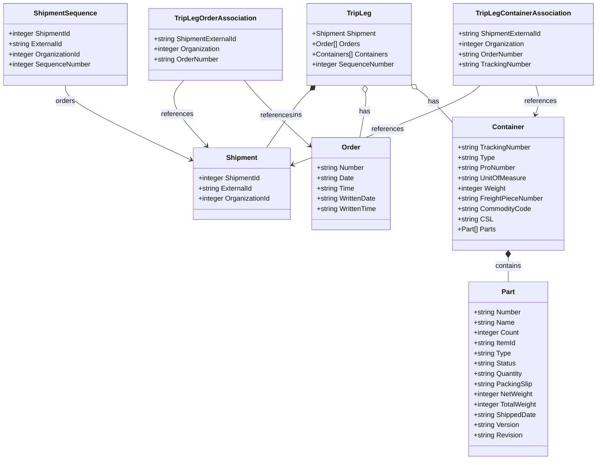

# Diagram: tools/ide_local_testing/resources/PartsTripLeg.yaml

> Auto-generated by Obscura crawlers

## Mermaid

### SVG

<svg id="container" width="1390.888671875" xmlns="http://www.w3.org/2000/svg" class="classDiagram" height="1076" viewBox="0 0 1390.888671875 1076" role="graphics-document document" aria-roledescription="class"><g><defs><marker id="container_class-aggregationStart" class="marker aggregation class" refX="18" refY="7" markerWidth="190" markerHeight="240" orient="auto"><path d="M 18,7 L9,13 L1,7 L9,1 Z"></path></marker></defs><defs><marker id="container_class-aggregationEnd" class="marker aggregation class" refX="1" refY="7" markerWidth="20" markerHeight="28" orient="auto"><path d="M 18,7 L9,13 L1,7 L9,1 Z"></path></marker></defs><defs><marker id="container_class-extensionStart" class="marker extension class" refX="18" refY="7" markerWidth="190" markerHeight="240" orient="auto"><path d="M 1,7 L18,13 V 1 Z"></path></marker></defs><defs><marker id="container_class-extensionEnd" class="marker extension class" refX="1" refY="7" markerWidth="20" markerHeight="28" orient="auto"><path d="M 1,1 V 13 L18,7 Z"></path></marker></defs><defs><marker id="container_class-compositionStart" class="marker composition class" refX="18" refY="7" markerWidth="190" markerHeight="240" orient="auto"><path d="M 18,7 L9,13 L1,7 L9,1 Z"></path></marker></defs><defs><marker id="container_class-compositionEnd" class="marker composition class" refX="1" refY="7" markerWidth="20" markerHeight="28" orient="auto"><path d="M 18,7 L9,13 L1,7 L9,1 Z"></path></marker></defs><defs><marker id="container_class-dependencyStart" class="marker dependency class" refX="6" refY="7" markerWidth="190" markerHeight="240" orient="auto"><path d="M 5,7 L9,13 L1,7 L9,1 Z"></path></marker></defs><defs><marker id="container_class-dependencyEnd" class="marker dependency class" refX="13" refY="7" markerWidth="20" markerHeight="28" orient="auto"><path d="M 18,7 L9,13 L14,7 L9,1 Z"></path></marker></defs><defs><marker id="container_class-lollipopStart" class="marker lollipop class" refX="13" refY="7" markerWidth="190" markerHeight="240" orient="auto"><circle stroke="black" fill="transparent" cx="7" cy="7" r="6"></circle></marker></defs><defs><marker id="container_class-lollipopEnd" class="marker lollipop class" refX="1" refY="7" markerWidth="190" markerHeight="240" orient="auto"><circle stroke="black" fill="transparent" cx="7" cy="7" r="6"></circle></marker></defs><g class="root"><g class="clusters"></g><g class="edgePaths"><path d="M151.375,200L151.375,206.167C151.375,212.333,151.375,224.667,199.536,253.571C247.697,282.475,344.02,327.95,392.181,350.688L440.342,373.426" id="id_ShipmentSequence_Shipment_1" class="edge-thickness-normal edge-pattern-solid relation" style=";;;" data-edge="true" data-et="edge" data-id="id_ShipmentSequence_Shipment_1" data-points="W3sieCI6MTUxLjM3NSwieSI6MjAwfSx7IngiOjE1MS4zNzUsInkiOjIzN30seyJ4Ijo0NDUuNzY3NTc4MTI1LCJ5IjozNzUuOTg3MTA5NzIwMjY0N31d" marker-end="url(#container_class-dependencyEnd)"></path><path d="M719.741,211.642L715.12,215.868C710.499,220.095,701.257,228.547,684.227,250.94C667.196,273.333,642.376,309.667,629.966,327.833L617.556,346" id="id_TripLeg_Shipment_2" class="edge-thickness-normal edge-pattern-solid relation" style=";;;" data-edge="true" data-et="edge" data-id="id_TripLeg_Shipment_2" data-points="W3sieCI6NzMyLjQ2OTcwNDUzNDc3NDUsInkiOjIwMH0seyJ4Ijo2OTIuMDE1NjI1LCJ5IjoyMzd9LHsieCI6NjE3LjU1NTc1MDA4MDk1ODUsInkiOjM0Nn1d" marker-start="url(#container_class-compositionStart)"></path><path d="M850.525,217.136L850.908,220.446C851.292,223.757,852.058,230.379,849.899,247.856C847.741,265.333,842.657,293.667,840.116,307.833L837.574,322" id="id_TripLeg_Order_3" class="edge-thickness-normal edge-pattern-solid relation" style=";;;" data-edge="true" data-et="edge" data-id="id_TripLeg_Order_3" data-points="W3sieCI6ODQ4LjU0MjA3Mjk1NTgyNywieSI6MjAwfSx7IngiOjg1Mi44MjQyMTg3NSwieSI6MjM3fSx7IngiOjgzNy41NzQwMDYyMzM4MDgzLCJ5IjozMjJ9XQ==" marker-start="url(#container_class-aggregationStart)"></path><path d="M972.627,209.685L978.451,214.237C984.275,218.79,995.923,227.895,1009.58,240.987C1023.236,254.078,1038.902,271.156,1046.735,279.695L1054.568,288.235" id="id_TripLeg_Container_4" class="edge-thickness-normal edge-pattern-solid relation" style=";;;" data-edge="true" data-et="edge" data-id="id_TripLeg_Container_4" data-points="W3sieCI6OTU5LjAzNzEwOTM3NSwieSI6MTk5LjA2MDg1MzM5Mzk0NTY1fSx7IngiOjEwMDcuNTcwMzEyNSwieSI6MjM3fSx7IngiOjEwNTQuNTY4MzU5Mzc1LCJ5IjoyODguMjM0NTg1NDcwNzkyN31d" marker-start="url(#container_class-aggregationStart)"></path><path d="M1184.611,603.25L1184.611,606.542C1184.611,609.833,1184.611,616.417,1184.611,625.875C1184.611,635.333,1184.611,647.667,1184.611,653.833L1184.611,660" id="id_Container_Part_5" class="edge-thickness-normal edge-pattern-solid relation" style=";;;" data-edge="true" data-et="edge" data-id="id_Container_Part_5" data-points="W3sieCI6MTE4NC42MTEzMjgxMjUsInkiOjU4Nn0seyJ4IjoxMTg0LjYxMTMyODEyNSwieSI6NjIzfSx7IngiOjExODQuNjExMzI4MTI1LCJ5Ijo2NjB9XQ==" marker-start="url(#container_class-compositionStart)"></path><path d="M425.561,188L418.283,196.167C411.005,204.333,396.449,220.667,405.273,246.265C414.098,271.864,446.303,306.728,462.406,324.161L478.509,341.593" id="id_TripLegOrderAssociation_Shipment_6" class="edge-thickness-normal edge-pattern-solid relation" style=";;;" data-edge="true" data-et="edge" data-id="id_TripLegOrderAssociation_Shipment_6" data-points="W3sieCI6NDI1LjU2MTI2NjQ0NzM2ODQ0LCJ5IjoxODh9LHsieCI6MzgxLjg5MjU3ODEyNSwieSI6MjM3fSx7IngiOjQ4Mi41Nzk5MTYyMDc5MDE1MywieSI6MzQ2fV0=" marker-end="url(#container_class-dependencyEnd)"></path><path d="M565.396,188L571.712,196.167C578.029,204.333,590.663,220.667,616.45,246.319C642.237,271.971,681.176,306.943,700.646,324.429L720.116,341.914" id="id_TripLegOrderAssociation_Order_7" class="edge-thickness-normal edge-pattern-solid relation" style=";;;" data-edge="true" data-et="edge" data-id="id_TripLegOrderAssociation_Order_7" data-points="W3sieCI6NTY1LjM5NTU1OTIxMDUyNjQsInkiOjE4OH0seyJ4Ijo2MDMuMjk2ODc1LCJ5IjoyMzd9LHsieCI6NzI0LjU4MDA3ODEyNSwieSI6MzQ1LjkyMzI5Mjk1MDA0MDQzfV0=" marker-end="url(#container_class-dependencyEnd)"></path><path d="M1117.543,200L1110.969,206.167C1104.396,212.333,1091.249,224.667,1018.359,255.545C945.469,286.424,812.835,335.848,746.519,360.561L680.202,385.273" id="id_TripLegContainerAssociation_Shipment_8" class="edge-thickness-normal edge-pattern-solid relation" style=";;;" data-edge="true" data-et="edge" data-id="id_TripLegContainerAssociation_Shipment_8" data-points="W3sieCI6MTExNy41NDI4MzY1ODM2NDY3LCJ5IjoyMDB9LHsieCI6MTA3OC4xMDE1NjI1LCJ5IjoyMzd9LHsieCI6Njc0LjU4MDA3ODEyNSwieSI6Mzg3LjM2Nzc4NTUzMzU0NTI2fV0=" marker-end="url(#container_class-dependencyEnd)"></path><path d="M1247.375,200L1249.141,206.167C1250.907,212.333,1254.44,224.667,1254.218,236.065C1253.995,247.464,1250.018,257.928,1248.029,263.16L1246.04,268.392" id="id_TripLegContainerAssociation_Container_9" class="edge-thickness-normal edge-pattern-solid relation" style=";;;" data-edge="true" data-et="edge" data-id="id_TripLegContainerAssociation_Container_9" data-points="W3sieCI6MTI0Ny4zNzQ2MDM1MDA5Mzk5LCJ5IjoyMDB9LHsieCI6MTI1Ny45NzI2NTYyNSwieSI6MjM3fSx7IngiOjEyNDMuOTA4NTY3NDM4NDcxNCwieSI6Mjc0fV0=" marker-end="url(#container_class-dependencyEnd)"></path></g><g class="edgeLabels"><g class="edgeLabel" transform="translate(151.375, 237)"><g class="label" data-id="id_ShipmentSequence_Shipment_1" transform="translate(-23.375, -12)"><foreignObject width="46.75" height="24">

orders

</foreignObject></g></g><g class="edgeLabel" transform="translate(670.2476, 268.86568)"><g class="label" data-id="id_TripLeg_Shipment_2" transform="translate(-30.890625, -12)"><foreignObject width="61.78125" height="24">

contains

</foreignObject></g></g><g class="edgeLabel" transform="translate(848.48792, 261.16921)"><g class="label" data-id="id_TripLeg_Order_3" transform="translate(-12.703125, -12)"><foreignObject width="25.40625" height="24">

has

</foreignObject></g></g><g class="edgeLabel" transform="translate(1010.24827, 239.91936)"><g class="label" data-id="id_TripLeg_Container_4" transform="translate(-12.703125, -12)"><foreignObject width="25.40625" height="24">

has

</foreignObject></g></g><g class="edgeLabel" transform="translate(1184.611328125, 623)"><g class="label" data-id="id_Container_Part_5" transform="translate(-30.890625, -12)"><foreignObject width="61.78125" height="24">

contains

</foreignObject></g></g><g class="edgeLabel" transform="translate(409.9682, 267.39352)"><g class="label" data-id="id_TripLegOrderAssociation_Shipment_6" transform="translate(-37.828125, -12)"><foreignObject width="75.65625" height="24">

references

</foreignObject></g></g><g class="edgeLabel" transform="translate(640.89395, 270.76558)"><g class="label" data-id="id_TripLegOrderAssociation_Order_7" transform="translate(-37.828125, -12)"><foreignObject width="75.65625" height="24">

references

</foreignObject></g></g><g class="edgeLabel" transform="translate(901.67864, 302.74204)"><g class="label" data-id="id_TripLegContainerAssociation_Shipment_8" transform="translate(-37.828125, -12)"><foreignObject width="75.65625" height="24">

references

</foreignObject></g></g><g class="edgeLabel" transform="translate(1257.77814, 237.51173)"><g class="label" data-id="id_TripLegContainerAssociation_Container_9" transform="translate(-37.828125, -12)"><foreignObject width="75.65625" height="24">

references

</foreignObject></g></g></g><g class="nodes"><g class="node default" id="classId-ShipmentSequence-0" transform="translate(151.375, 104)"><g class="basic label-container"><path d="M-143.375 -96 L143.375 -96 L143.375 96 L-143.375 96" stroke="none" stroke-width="0" fill="#ECECFF" style=""></path><path d="M-143.375 -96 C-70.41099114452396 -96, 2.5530177109520764 -96, 143.375 -96 M-143.375 -96 C-37.98067317879817 -96, 67.41365364240366 -96, 143.375 -96 M143.375 -96 C143.375 -20.46221591568927, 143.375 55.07556816862146, 143.375 96 M143.375 -96 C143.375 -57.03782162853318, 143.375 -18.07564325706636, 143.375 96 M143.375 96 C56.34159661752814 96, -30.69180676494372 96, -143.375 96 M143.375 96 C52.6512264798 96, -38.072547040399996 96, -143.375 96 M-143.375 96 C-143.375 34.32343358430603, -143.375 -27.35313283138794, -143.375 -96 M-143.375 96 C-143.375 35.29114262637556, -143.375 -25.41771474724888, -143.375 -96" stroke="#9370DB" stroke-width="1.3" fill="none" stroke-dasharray="0 0" style=""></path></g><g class="annotation-group text" transform="translate(0, -72)"></g><g class="label-group text" transform="translate(-70.59375, -72)"><g class="label" style="font-weight: bolder" transform="translate(0,-12)"><foreignObject width="141.1875" height="24">

ShipmentSequence

</foreignObject></g></g><g class="members-group text" transform="translate(-131.375, -24)"><g class="label" style="" transform="translate(0,-12)"><foreignObject width="147.3125" height="24">

+integer ShipmentId

</foreignObject></g><g class="label" style="" transform="translate(0,12)"><foreignObject width="127.515625" height="24">

+string ExternalId

</foreignObject></g><g class="label" style="" transform="translate(0,36)"><foreignObject width="169.703125" height="24">

+integer OrganizationId

</foreignObject></g><g class="label" style="" transform="translate(0,60)"><foreignObject width="192.15625" height="24">

+integer SequenceNumber

</foreignObject></g></g><g class="methods-group text" transform="translate(-131.375, 96)"></g><g class="divider" style=""><path d="M-143.375 -48 C-57.13134807192563 -48, 29.112303856148742 -48, 143.375 -48 M-143.375 -48 C-36.13136585313973 -48, 71.11226829372055 -48, 143.375 -48" stroke="#9370DB" stroke-width="1.3" fill="none" stroke-dasharray="0 0" style=""></path></g><g class="divider" style=""><path d="M-143.375 72 C-38.60178197861177 72, 66.17143604277646 72, 143.375 72 M-143.375 72 C-32.77223876365706 72, 77.83052247268589 72, 143.375 72" stroke="#9370DB" stroke-width="1.3" fill="none" stroke-dasharray="0 0" style=""></path></g></g><g class="node default" id="classId-Shipment-1" transform="translate(560.173828125, 430)"><g class="basic label-container"><path d="M-114.40625 -84 L114.40625 -84 L114.40625 84 L-114.40625 84" stroke="none" stroke-width="0" fill="#ECECFF" style=""></path><path d="M-114.40625 -84 C-41.99671720835485 -84, 30.412815583290296 -84, 114.40625 -84 M-114.40625 -84 C-59.614700924437656 -84, -4.8231518488753125 -84, 114.40625 -84 M114.40625 -84 C114.40625 -28.156499751999583, 114.40625 27.687000496000834, 114.40625 84 M114.40625 -84 C114.40625 -24.735356245912897, 114.40625 34.52928750817421, 114.40625 84 M114.40625 84 C39.43958664833018 84, -35.527076703339645 84, -114.40625 84 M114.40625 84 C29.685276050734274 84, -55.03569789853145 84, -114.40625 84 M-114.40625 84 C-114.40625 29.202667084360066, -114.40625 -25.59466583127987, -114.40625 -84 M-114.40625 84 C-114.40625 32.432381830680434, -114.40625 -19.13523633863913, -114.40625 -84" stroke="#9370DB" stroke-width="1.3" fill="none" stroke-dasharray="0 0" style=""></path></g><g class="annotation-group text" transform="translate(0, -60)"></g><g class="label-group text" transform="translate(-35.109375, -60)"><g class="label" style="font-weight: bolder" transform="translate(0,-12)"><foreignObject width="70.21875" height="24">

Shipment

</foreignObject></g></g><g class="members-group text" transform="translate(-102.40625, -12)"><g class="label" style="" transform="translate(0,-12)"><foreignObject width="147.3125" height="24">

+integer ShipmentId

</foreignObject></g><g class="label" style="" transform="translate(0,12)"><foreignObject width="127.515625" height="24">

+string ExternalId

</foreignObject></g><g class="label" style="" transform="translate(0,36)"><foreignObject width="169.703125" height="24">

+integer OrganizationId

</foreignObject></g></g><g class="methods-group text" transform="translate(-102.40625, 84)"></g><g class="divider" style=""><path d="M-114.40625 -36 C-37.024894633112254 -36, 40.35646073377549 -36, 114.40625 -36 M-114.40625 -36 C-38.63981064513284 -36, 37.12662870973432 -36, 114.40625 -36" stroke="#9370DB" stroke-width="1.3" fill="none" stroke-dasharray="0 0" style=""></path></g><g class="divider" style=""><path d="M-114.40625 60 C-26.846927450594876 60, 60.71239509881025 60, 114.40625 60 M-114.40625 60 C-39.52590534137748 60, 35.35443931724504 60, 114.40625 60" stroke="#9370DB" stroke-width="1.3" fill="none" stroke-dasharray="0 0" style=""></path></g></g><g class="node default" id="classId-Order-2" transform="translate(818.197265625, 430)"><g class="basic label-container"><path d="M-93.6171875 -108 L93.6171875 -108 L93.6171875 108 L-93.6171875 108" stroke="none" stroke-width="0" fill="#ECECFF" style=""></path><path d="M-93.6171875 -108 C-34.40361185359153 -108, 24.809963792816944 -108, 93.6171875 -108 M-93.6171875 -108 C-36.072008397039546 -108, 21.473170705920907 -108, 93.6171875 -108 M93.6171875 -108 C93.6171875 -25.32132071036017, 93.6171875 57.35735857927966, 93.6171875 108 M93.6171875 -108 C93.6171875 -29.699102442337136, 93.6171875 48.60179511532573, 93.6171875 108 M93.6171875 108 C51.379237603113026 108, 9.141287706226052 108, -93.6171875 108 M93.6171875 108 C48.93482590187068 108, 4.2524643037413625 108, -93.6171875 108 M-93.6171875 108 C-93.6171875 48.67768824762003, -93.6171875 -10.644623504759934, -93.6171875 -108 M-93.6171875 108 C-93.6171875 56.267552518621876, -93.6171875 4.535105037243753, -93.6171875 -108" stroke="#9370DB" stroke-width="1.3" fill="none" stroke-dasharray="0 0" style=""></path></g><g class="annotation-group text" transform="translate(0, -84)"></g><g class="label-group text" transform="translate(-20.921875, -84)"><g class="label" style="font-weight: bolder" transform="translate(0,-12)"><foreignObject width="41.84375" height="24">

Order

</foreignObject></g></g><g class="members-group text" transform="translate(-81.6171875, -36)"><g class="label" style="" transform="translate(0,-12)"><foreignObject width="112.21875" height="24">

+string Number

</foreignObject></g><g class="label" style="" transform="translate(0,12)"><foreignObject width="86.96875" height="24">

+string Date

</foreignObject></g><g class="label" style="" transform="translate(0,36)"><foreignObject width="89.078125" height="24">

+string Time

</foreignObject></g><g class="label" style="" transform="translate(0,60)"><foreignObject width="140.203125" height="24">

+string WrittenDate

</foreignObject></g><g class="label" style="" transform="translate(0,84)"><foreignObject width="142.3125" height="24">

+string WrittenTime

</foreignObject></g></g><g class="methods-group text" transform="translate(-81.6171875, 108)"></g><g class="divider" style=""><path d="M-93.6171875 -60 C-19.29382314929387 -60, 55.02954120141226 -60, 93.6171875 -60 M-93.6171875 -60 C-45.27961401215625 -60, 3.057959475687497 -60, 93.6171875 -60" stroke="#9370DB" stroke-width="1.3" fill="none" stroke-dasharray="0 0" style=""></path></g><g class="divider" style=""><path d="M-93.6171875 84 C-22.03208605127351 84, 49.55301539745298 84, 93.6171875 84 M-93.6171875 84 C-41.37663107958991 84, 10.863925340820174 84, 93.6171875 84" stroke="#9370DB" stroke-width="1.3" fill="none" stroke-dasharray="0 0" style=""></path></g></g><g class="node default" id="classId-Part-3" transform="translate(1184.611328125, 864)"><g class="basic label-container"><path d="M-93.90234375 -204 L93.90234375 -204 L93.90234375 204 L-93.90234375 204" stroke="none" stroke-width="0" fill="#ECECFF" style=""></path><path d="M-93.90234375 -204 C-44.87983447361389 -204, 4.14267480277222 -204, 93.90234375 -204 M-93.90234375 -204 C-20.73115880980403 -204, 52.44002613039194 -204, 93.90234375 -204 M93.90234375 -204 C93.90234375 -109.08704734645227, 93.90234375 -14.174094692904532, 93.90234375 204 M93.90234375 -204 C93.90234375 -115.87463117230585, 93.90234375 -27.749262344611708, 93.90234375 204 M93.90234375 204 C28.07449762900039 204, -37.75334849199922 204, -93.90234375 204 M93.90234375 204 C36.49745324394367 204, -20.907437262112666 204, -93.90234375 204 M-93.90234375 204 C-93.90234375 67.03937745627121, -93.90234375 -69.92124508745758, -93.90234375 -204 M-93.90234375 204 C-93.90234375 107.34366011598719, -93.90234375 10.687320231974383, -93.90234375 -204" stroke="#9370DB" stroke-width="1.3" fill="none" stroke-dasharray="0 0" style=""></path></g><g class="annotation-group text" transform="translate(0, -180)"></g><g class="label-group text" transform="translate(-15.0703125, -180)"><g class="label" style="font-weight: bolder" transform="translate(0,-12)"><foreignObject width="30.140625" height="24">

Part

</foreignObject></g></g><g class="members-group text" transform="translate(-81.90234375, -132)"><g class="label" style="" transform="translate(0,-12)"><foreignObject width="112.21875" height="24">

+string Number

</foreignObject></g><g class="label" style="" transform="translate(0,12)"><foreignObject width="95.921875" height="24">

+string Name

</foreignObject></g><g class="label" style="" transform="translate(0,36)"><foreignObject width="105.78125" height="24">

+integer Count

</foreignObject></g><g class="label" style="" transform="translate(0,60)"><foreignObject width="100.84375" height="24">

+string ItemId

</foreignObject></g><g class="label" style="" transform="translate(0,84)"><foreignObject width="87.59375" height="24">

+string Type

</foreignObject></g><g class="label" style="" transform="translate(0,108)"><foreignObject width="99.515625" height="24">

+string Status

</foreignObject></g><g class="label" style="" transform="translate(0,132)"><foreignObject width="116.171875" height="24">

+string Quantity

</foreignObject></g><g class="label" style="" transform="translate(0,156)"><foreignObject width="136.453125" height="24">

+string PackingSlip

</foreignObject></g><g class="label" style="" transform="translate(0,180)"><foreignObject width="138.515625" height="24">

+integer NetWeight

</foreignObject></g><g class="label" style="" transform="translate(0,204)"><foreignObject width="148.734375" height="24">

+integer TotalWeight

</foreignObject></g><g class="label" style="" transform="translate(0,228)"><foreignObject width="146.875" height="24">

+string ShippedDate

</foreignObject></g><g class="label" style="" transform="translate(0,252)"><foreignObject width="107.71875" height="24">

+string Version

</foreignObject></g><g class="label" style="" transform="translate(0,276)"><foreignObject width="115.046875" height="24">

+string Revision

</foreignObject></g></g><g class="methods-group text" transform="translate(-81.90234375, 204)"></g><g class="divider" style=""><path d="M-93.90234375 -156 C-28.46700935261292 -156, 36.96832504477416 -156, 93.90234375 -156 M-93.90234375 -156 C-43.370056948625155 -156, 7.1622298527496895 -156, 93.90234375 -156" stroke="#9370DB" stroke-width="1.3" fill="none" stroke-dasharray="0 0" style=""></path></g><g class="divider" style=""><path d="M-93.90234375 180 C-54.520139789887146 180, -15.137935829774293 180, 93.90234375 180 M-93.90234375 180 C-21.66197947689716 180, 50.57838479620568 180, 93.90234375 180" stroke="#9370DB" stroke-width="1.3" fill="none" stroke-dasharray="0 0" style=""></path></g></g><g class="node default" id="classId-Container-4" transform="translate(1184.611328125, 430)"><g class="basic label-container"><path d="M-130.04296875 -156 L130.04296875 -156 L130.04296875 156 L-130.04296875 156" stroke="none" stroke-width="0" fill="#ECECFF" style=""></path><path d="M-130.04296875 -156 C-43.216036164353056 -156, 43.61089642129389 -156, 130.04296875 -156 M-130.04296875 -156 C-54.212438469602986 -156, 21.618091810794027 -156, 130.04296875 -156 M130.04296875 -156 C130.04296875 -32.063657368364204, 130.04296875 91.87268526327159, 130.04296875 156 M130.04296875 -156 C130.04296875 -54.099708632370266, 130.04296875 47.80058273525947, 130.04296875 156 M130.04296875 156 C49.93903936804304 156, -30.16489001391392 156, -130.04296875 156 M130.04296875 156 C55.177488885692924 156, -19.687990978614152 156, -130.04296875 156 M-130.04296875 156 C-130.04296875 86.6864458759143, -130.04296875 17.372891751828604, -130.04296875 -156 M-130.04296875 156 C-130.04296875 47.98453789159706, -130.04296875 -60.030924216805886, -130.04296875 -156" stroke="#9370DB" stroke-width="1.3" fill="none" stroke-dasharray="0 0" style=""></path></g><g class="annotation-group text" transform="translate(0, -132)"></g><g class="label-group text" transform="translate(-35.6015625, -132)"><g class="label" style="font-weight: bolder" transform="translate(0,-12)"><foreignObject width="71.203125" height="24">

Container

</foreignObject></g></g><g class="members-group text" transform="translate(-118.04296875, -84)"><g class="label" style="" transform="translate(0,-12)"><foreignObject width="172.375" height="24">

+string TrackingNumber

</foreignObject></g><g class="label" style="" transform="translate(0,12)"><foreignObject width="87.59375" height="24">

+string Type

</foreignObject></g><g class="label" style="" transform="translate(0,36)"><foreignObject width="136.234375" height="24">

+string ProNumber

</foreignObject></g><g class="label" style="" transform="translate(0,60)"><foreignObject width="161.296875" height="24">

+string UnitOfMeasure

</foreignObject></g><g class="label" style="" transform="translate(0,84)"><foreignObject width="113.09375" height="24">

+integer Weight

</foreignObject></g><g class="label" style="" transform="translate(0,108)"><foreignObject width="200.484375" height="24">

+string FreightPieceNumber

</foreignObject></g><g class="label" style="" transform="translate(0,132)"><foreignObject width="172.53125" height="24">

+string CommodityCode

</foreignObject></g><g class="label" style="" transform="translate(0,156)"><foreignObject width="79.359375" height="24">

+string CSL

</foreignObject></g><g class="label" style="" transform="translate(0,180)"><foreignObject width="88.15625" height="24">

+Part[] Parts

</foreignObject></g></g><g class="methods-group text" transform="translate(-118.04296875, 156)"></g><g class="divider" style=""><path d="M-130.04296875 -108 C-36.24291261493559 -108, 57.55714352012882 -108, 130.04296875 -108 M-130.04296875 -108 C-58.5017497465612 -108, 13.039469256877595 -108, 130.04296875 -108" stroke="#9370DB" stroke-width="1.3" fill="none" stroke-dasharray="0 0" style=""></path></g><g class="divider" style=""><path d="M-130.04296875 132 C-43.75303432670373 132, 42.53690009659255 132, 130.04296875 132 M-130.04296875 132 C-72.91887532338193 132, -15.794781896763851 132, 130.04296875 132" stroke="#9370DB" stroke-width="1.3" fill="none" stroke-dasharray="0 0" style=""></path></g></g><g class="node default" id="classId-TripLeg-5" transform="translate(837.431640625, 104)"><g class="basic label-container"><path d="M-121.60546875 -96 L121.60546875 -96 L121.60546875 96 L-121.60546875 96" stroke="none" stroke-width="0" fill="#ECECFF" style=""></path><path d="M-121.60546875 -96 C-42.65324649391606 -96, 36.298975762167885 -96, 121.60546875 -96 M-121.60546875 -96 C-69.22550410202507 -96, -16.84553945405014 -96, 121.60546875 -96 M121.60546875 -96 C121.60546875 -25.088848255251847, 121.60546875 45.822303489496306, 121.60546875 96 M121.60546875 -96 C121.60546875 -22.113591079504673, 121.60546875 51.772817840990655, 121.60546875 96 M121.60546875 96 C72.15571138959984 96, 22.705954029199688 96, -121.60546875 96 M121.60546875 96 C29.513978028948827 96, -62.577512692102346 96, -121.60546875 96 M-121.60546875 96 C-121.60546875 40.57974185336343, -121.60546875 -14.84051629327314, -121.60546875 -96 M-121.60546875 96 C-121.60546875 24.468175515585017, -121.60546875 -47.063648968829966, -121.60546875 -96" stroke="#9370DB" stroke-width="1.3" fill="none" stroke-dasharray="0 0" style=""></path></g><g class="annotation-group text" transform="translate(0, -72)"></g><g class="label-group text" transform="translate(-27.0546875, -72)"><g class="label" style="font-weight: bolder" transform="translate(0,-12)"><foreignObject width="54.109375" height="24">

TripLeg

</foreignObject></g></g><g class="members-group text" transform="translate(-109.60546875, -24)"><g class="label" style="" transform="translate(0,-12)"><foreignObject width="150.984375" height="24">

+Shipment Shipment

</foreignObject></g><g class="label" style="" transform="translate(0,12)"><foreignObject width="112.234375" height="24">

+Order[] Orders

</foreignObject></g><g class="label" style="" transform="translate(0,36)"><foreignObject width="178.03125" height="24">

+Containers[] Containers

</foreignObject></g><g class="label" style="" transform="translate(0,60)"><foreignObject width="192.15625" height="24">

+integer SequenceNumber

</foreignObject></g></g><g class="methods-group text" transform="translate(-109.60546875, 96)"></g><g class="divider" style=""><path d="M-121.60546875 -48 C-52.489002334459514 -48, 16.627464081080973 -48, 121.60546875 -48 M-121.60546875 -48 C-46.39168621128172 -48, 28.822096327436554 -48, 121.60546875 -48" stroke="#9370DB" stroke-width="1.3" fill="none" stroke-dasharray="0 0" style=""></path></g><g class="divider" style=""><path d="M-121.60546875 72 C-40.53445066715588 72, 40.53656741568824 72, 121.60546875 72 M-121.60546875 72 C-48.87181179280935 72, 23.861845164381293 72, 121.60546875 72" stroke="#9370DB" stroke-width="1.3" fill="none" stroke-dasharray="0 0" style=""></path></g></g><g class="node default" id="classId-TripLegOrderAssociation-6" transform="translate(500.421875, 104)"><g class="basic label-container"><path d="M-155.671875 -84 L155.671875 -84 L155.671875 84 L-155.671875 84" stroke="none" stroke-width="0" fill="#ECECFF" style=""></path><path d="M-155.671875 -84 C-40.83661771116668 -84, 73.99863957766664 -84, 155.671875 -84 M-155.671875 -84 C-50.9726131155725 -84, 53.726648768855 -84, 155.671875 -84 M155.671875 -84 C155.671875 -27.75334522009826, 155.671875 28.49330955980348, 155.671875 84 M155.671875 -84 C155.671875 -21.763760880573663, 155.671875 40.47247823885267, 155.671875 84 M155.671875 84 C60.15510139834886 84, -35.36167220330228 84, -155.671875 84 M155.671875 84 C49.801348394864505 84, -56.06917821027099 84, -155.671875 84 M-155.671875 84 C-155.671875 30.64425876176726, -155.671875 -22.711482476465477, -155.671875 -84 M-155.671875 84 C-155.671875 17.63230633545608, -155.671875 -48.73538732908784, -155.671875 -84" stroke="#9370DB" stroke-width="1.3" fill="none" stroke-dasharray="0 0" style=""></path></g><g class="annotation-group text" transform="translate(0, -60)"></g><g class="label-group text" transform="translate(-90.140625, -60)"><g class="label" style="font-weight: bolder" transform="translate(0,-12)"><foreignObject width="180.28125" height="24">

TripLegOrderAssociation

</foreignObject></g></g><g class="members-group text" transform="translate(-143.671875, -12)"><g class="label" style="" transform="translate(0,-12)"><foreignObject width="197.203125" height="24">

+string ShipmentExternalId

</foreignObject></g><g class="label" style="" transform="translate(0,12)"><foreignObject width="155.421875" height="24">

+integer Organization

</foreignObject></g><g class="label" style="" transform="translate(0,36)"><foreignObject width="153.453125" height="24">

+string OrderNumber

</foreignObject></g></g><g class="methods-group text" transform="translate(-143.671875, 84)"></g><g class="divider" style=""><path d="M-155.671875 -36 C-76.43010808183324 -36, 2.811658836333521 -36, 155.671875 -36 M-155.671875 -36 C-54.65618070655597 -36, 46.359513586888056 -36, 155.671875 -36" stroke="#9370DB" stroke-width="1.3" fill="none" stroke-dasharray="0 0" style=""></path></g><g class="divider" style=""><path d="M-155.671875 60 C-34.09697876015599 60, 87.47791747968802 60, 155.671875 60 M-155.671875 60 C-76.66035879460084 60, 2.351157410798322 60, 155.671875 60" stroke="#9370DB" stroke-width="1.3" fill="none" stroke-dasharray="0 0" style=""></path></g></g><g class="node default" id="classId-TripLegContainerAssociation-7" transform="translate(1219.876953125, 104)"><g class="basic label-container"><path d="M-163.01171875 -96 L163.01171875 -96 L163.01171875 96 L-163.01171875 96" stroke="none" stroke-width="0" fill="#ECECFF" style=""></path><path d="M-163.01171875 -96 C-83.1960466808102 -96, -3.3803746116203968 -96, 163.01171875 -96 M-163.01171875 -96 C-95.25880364940522 -96, -27.505888548810447 -96, 163.01171875 -96 M163.01171875 -96 C163.01171875 -36.183332896063035, 163.01171875 23.63333420787393, 163.01171875 96 M163.01171875 -96 C163.01171875 -47.254191327739086, 163.01171875 1.4916173445218277, 163.01171875 96 M163.01171875 96 C85.40824581613498 96, 7.804772882269958 96, -163.01171875 96 M163.01171875 96 C47.015359879663805 96, -68.98099899067239 96, -163.01171875 96 M-163.01171875 96 C-163.01171875 30.177825991042482, -163.01171875 -35.644348017915036, -163.01171875 -96 M-163.01171875 96 C-163.01171875 30.779353366537165, -163.01171875 -34.44129326692567, -163.01171875 -96" stroke="#9370DB" stroke-width="1.3" fill="none" stroke-dasharray="0 0" style=""></path></g><g class="annotation-group text" transform="translate(0, -72)"></g><g class="label-group text" transform="translate(-104.8203125, -72)"><g class="label" style="font-weight: bolder" transform="translate(0,-12)"><foreignObject width="209.640625" height="24">

TripLegContainerAssociation

</foreignObject></g></g><g class="members-group text" transform="translate(-151.01171875, -24)"><g class="label" style="" transform="translate(0,-12)"><foreignObject width="197.203125" height="24">

+string ShipmentExternalId

</foreignObject></g><g class="label" style="" transform="translate(0,12)"><foreignObject width="155.421875" height="24">

+integer Organization

</foreignObject></g><g class="label" style="" transform="translate(0,36)"><foreignObject width="153.453125" height="24">

+string OrderNumber

</foreignObject></g><g class="label" style="" transform="translate(0,60)"><foreignObject width="172.375" height="24">

+string TrackingNumber

</foreignObject></g></g><g class="methods-group text" transform="translate(-151.01171875, 96)"></g><g class="divider" style=""><path d="M-163.01171875 -48 C-87.89324274691113 -48, -12.774766743822255 -48, 163.01171875 -48 M-163.01171875 -48 C-91.58142201491103 -48, -20.151125279822054 -48, 163.01171875 -48" stroke="#9370DB" stroke-width="1.3" fill="none" stroke-dasharray="0 0" style=""></path></g><g class="divider" style=""><path d="M-163.01171875 72 C-81.50421645675131 72, 0.003285836497383343 72, 163.01171875 72 M-163.01171875 72 C-63.701336992808024 72, 35.60904476438395 72, 163.01171875 72" stroke="#9370DB" stroke-width="1.3" fill="none" stroke-dasharray="0 0" style=""></path></g></g></g></g></g></svg>
