# FV-Copilot System Design Diagrams

> Full Mermaid design documentation covering architecture, data flow, and every function scope.

---

## Table of Contents

1. [System Architecture Overview](#1-system-architecture-overview)
2. [Vault Directory Structure](#2-vault-directory-structure)
3. [Agent Routing System](#3-agent-routing-system)
4. [File Resolution Priority](#4-file-resolution-priority)
5. [sync.py — Function Scopes](#5-syncpy--function-scopes)
6. [install-launchd-service.sh — Function Scope](#6-install-launchd-servicesh--function-scope)
7. [Git Hooks — Function Scopes](#7-git-hooks--function-scopes)
8. [Sync Modes — State Machine](#8-sync-modes--state-machine)
9. [Data Flow — End to End](#9-data-flow--end-to-end)
10. [Multi-Agent Overlay Merge — Sequence](#10-multi-agent-overlay-merge--sequence)
11. [Runtime Environment](#11-runtime-environment)

---

## 1. System Architecture Overview

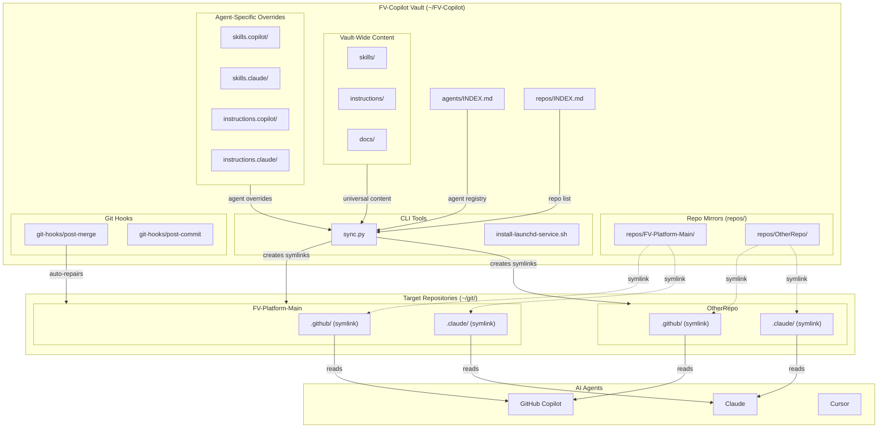

---

## 2. Vault Directory Structure

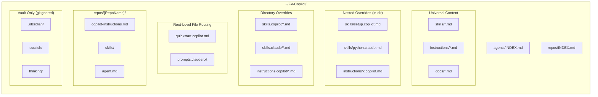

---

## 3. Agent Routing System

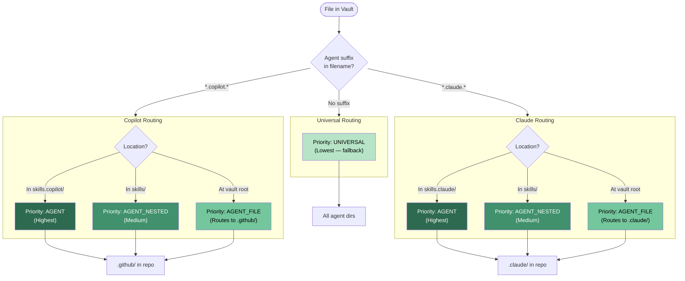

---

## 4. File Resolution Priority

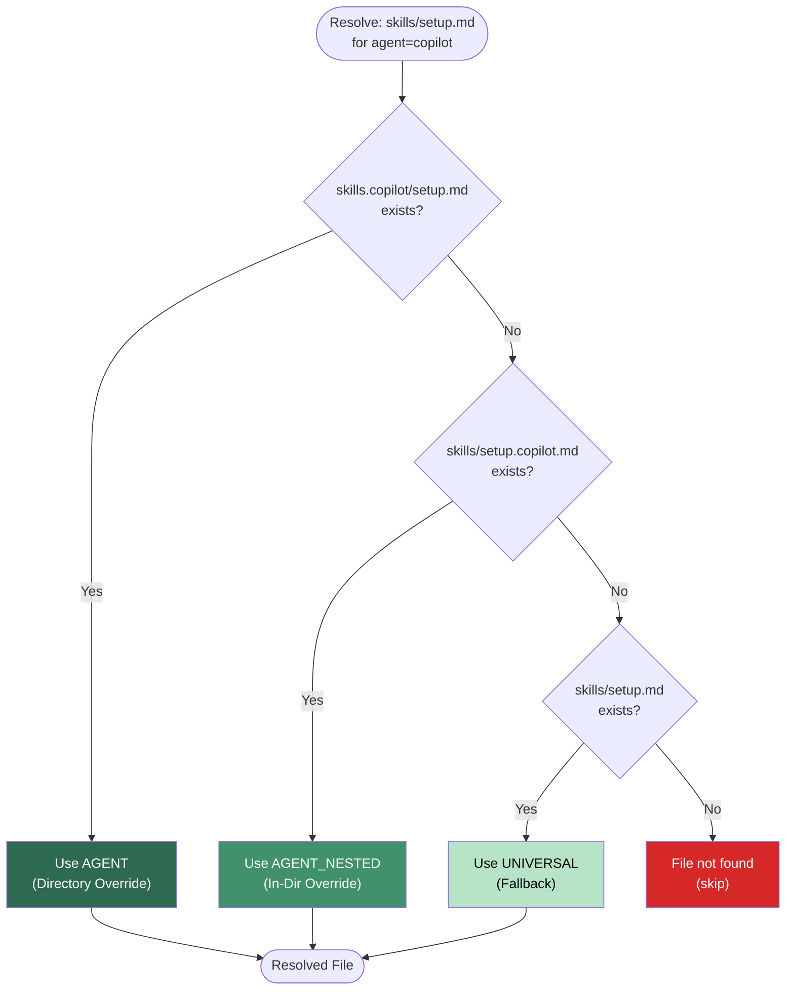

---

## 5. sync.py — Function Scopes

### 5.1 Top-Level Entry Point

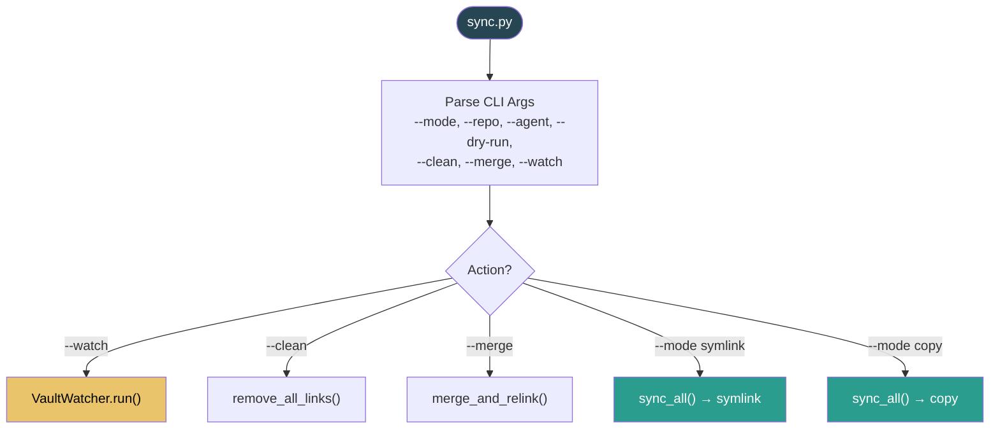

### 5.2 VaultSync.classify_file()

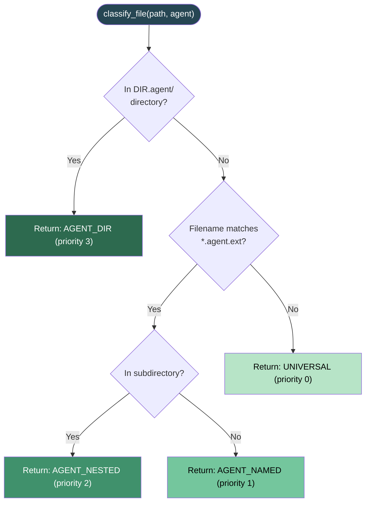

### 5.3 VaultSync.discover_sync_targets()

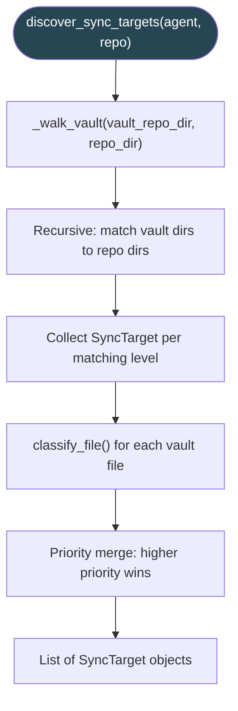

### 5.4 VaultSync.sync_all()

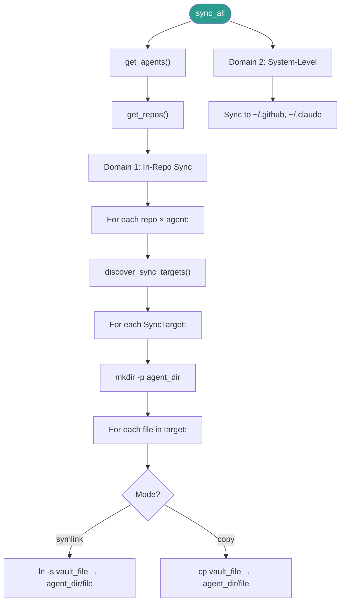

### 5.5 VaultWatcher.run()

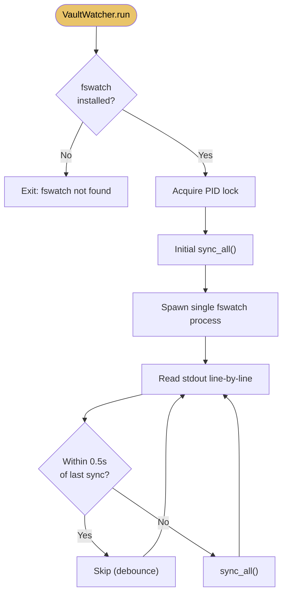

---

## 6. install-launchd-service.sh — Function Scope

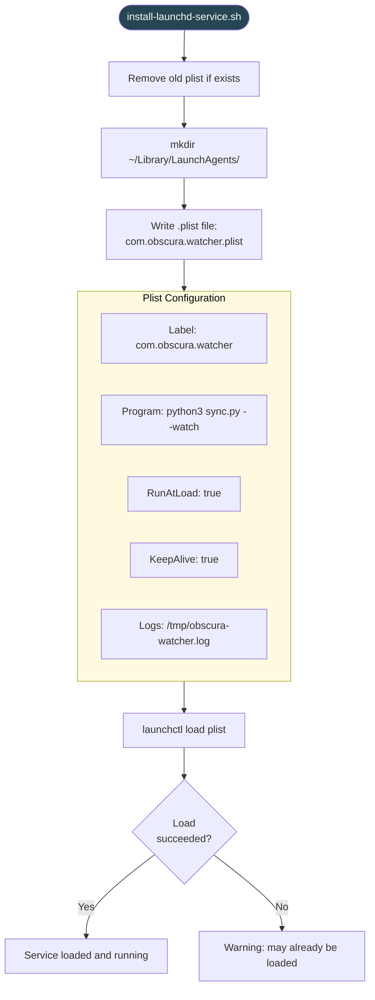

---

## 7. Git Hooks — Function Scopes

### 7.1 post-merge Hook

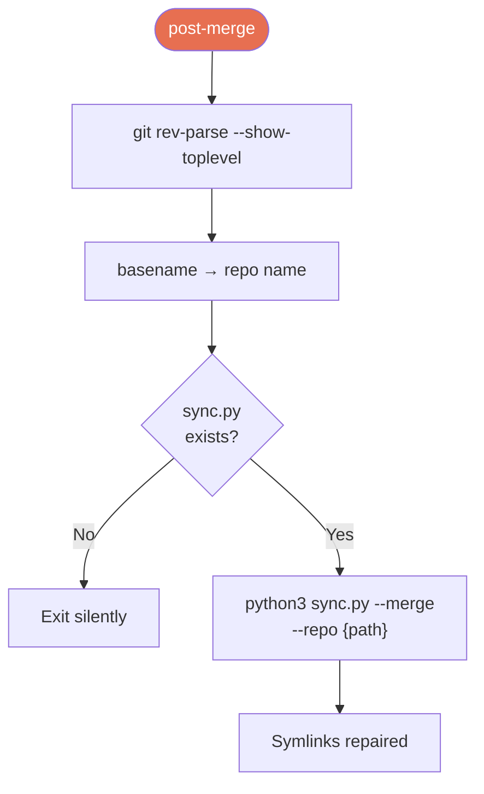

### 7.2 post-commit Hook

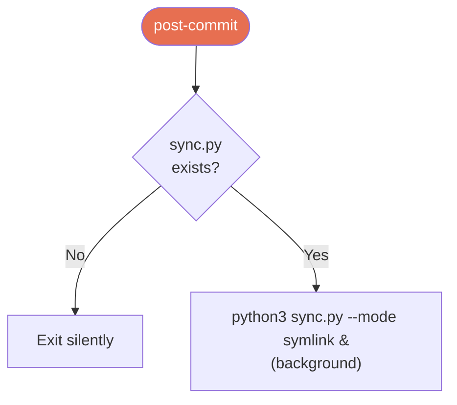

---

## 8. Sync Modes — State Machine

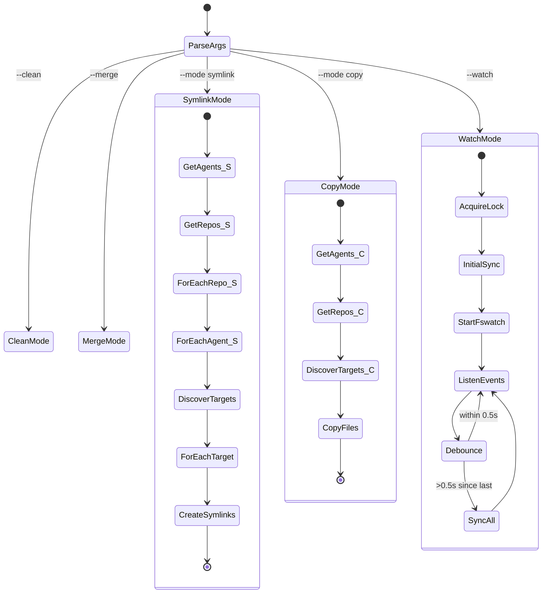

---

## 9. Data Flow — End to End

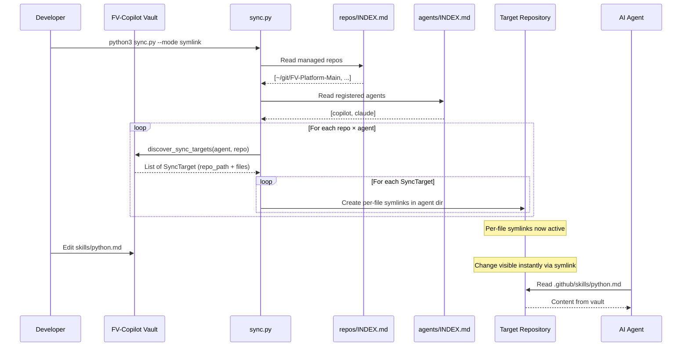

---

## 10. Multi-Agent File Classification — Sequence

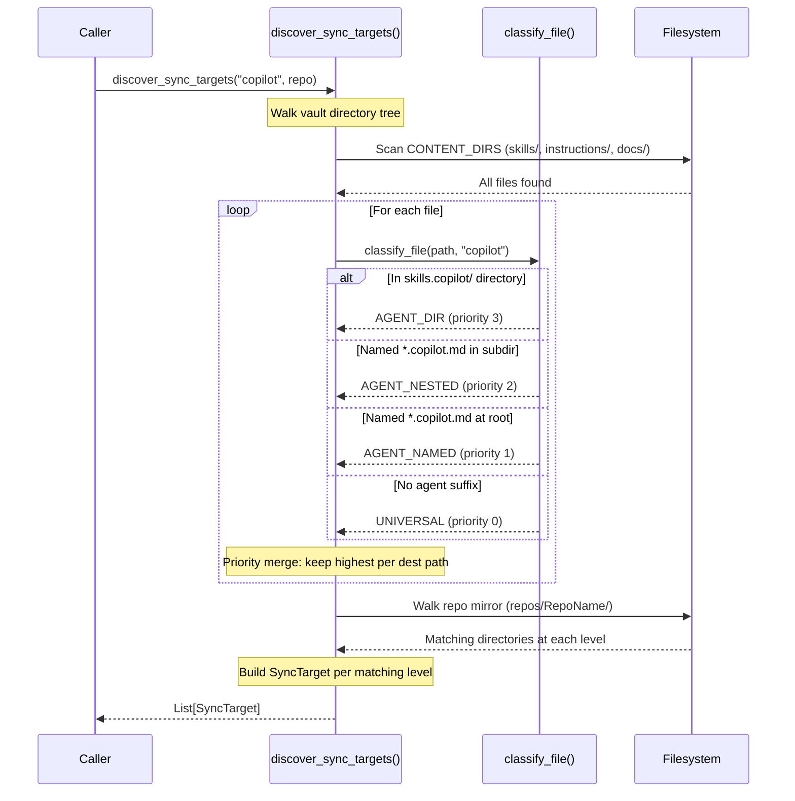

---

## 11. Runtime Environment

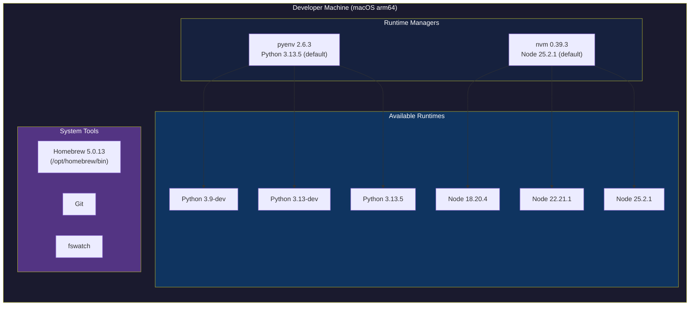

---

## Diagram Index

| # | Diagram | Type | Covers |
|---|---------|------|--------|
| 1 | System Architecture | Graph | Full system overview |
| 2 | Vault Directory Structure | Graph | File/folder layout |
| 3 | Agent Routing System | Flowchart | 3-tier routing logic |
| 4 | File Resolution Priority | Flowchart | Priority cascade |
| 5.1 | sync.py: Entry | Flowchart | CLI parsing, mode dispatch |
| 5.2 | classify_file() | Flowchart | File classification logic |
| 5.3 | discover_sync_targets() | Flowchart | Recursive target discovery |
| 5.4 | sync_all() | Flowchart | Full sync orchestration |
| 5.5 | VaultWatcher.run() | Flowchart | Fswatch event loop |
| 6 | install-launchd-service.sh | Flowchart | Plist install flow |
| 7.1 | post-merge hook | Flowchart | Auto-repair flow |
| 7.2 | post-commit hook | Flowchart | Auto-sync flow |
| 8 | Sync Modes | State Diagram | Mode state machine |
| 9 | Data Flow (E2E) | Sequence | Full sync sequence |
| 10 | File Classification | Sequence | classify_file detail |
| 11 | Runtime Environment | Graph | pyenv, nvm, tools |
