# FV-Copilot System Design Diagrams

> Full Mermaid design documentation covering architecture, data flow, and every function scope.

---

## Table of Contents

1. [System Architecture Overview](#1-system-architecture-overview)
2. [Vault Directory Structure](#2-vault-directory-structure)
3. [Agent Routing System](#3-agent-routing-system)
4. [File Resolution Priority](#4-file-resolution-priority)
5. [watch-and-sync.sh — Function Scopes](#5-watch-and-syncsh--function-scopes)
6. [merge-and-relink.sh — Function Scopes](#6-merge-and-relinksh--function-scopes)
7. [remove-links.sh — Function Scope](#7-remove-linkssh--function-scope)
8. [install-launchd-service.sh — Function Scope](#8-install-launchd-servicesh--function-scope)
9. [Git Hooks — Function Scopes](#9-git-hooks--function-scopes)
10. [Sync Modes — State Machine](#10-sync-modes--state-machine)
11. [Data Flow — End to End](#11-data-flow--end-to-end)
12. [Multi-Agent Overlay Merge — Sequence](#12-multi-agent-overlay-merge--sequence)
13. [TypeScript Rewrite — Target Module Map](#13-typescript-rewrite--target-module-map)
14. [Runtime Environment](#14-runtime-environment)

---

## 1. System Architecture Overview

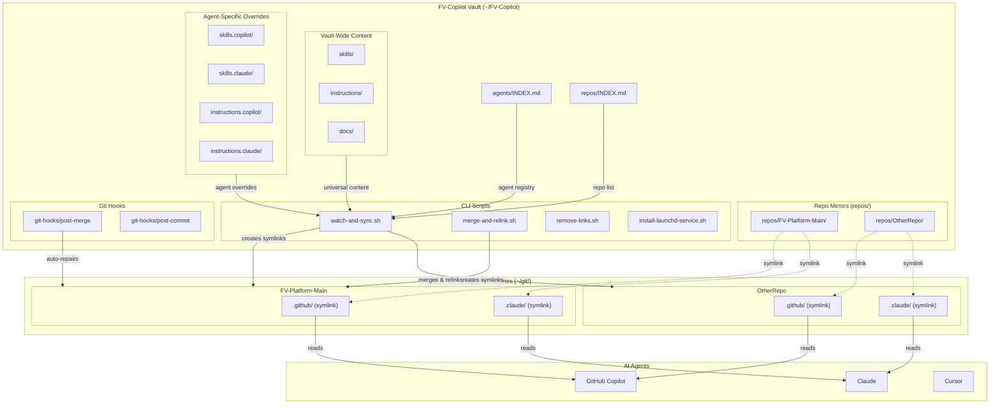

---

## 2. Vault Directory Structure

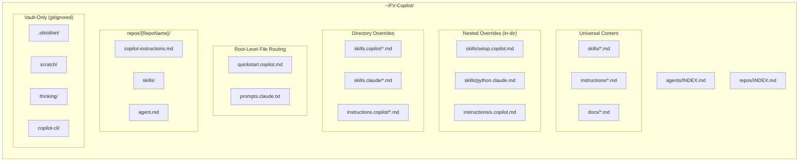

---

## 3. Agent Routing System


---

## 4. File Resolution Priority


---

## 5. watch-and-sync.sh — Function Scopes

### 5.1 Top-Level Entry Point

```mermaid
flowchart TD
    Entry([watch-and-sync.sh]) --> ParseArgs["Parse CLI Args<br/>--mode, --repo, --agent, --dry-run"]
    ParseArgs --> ValidateMode{Mode valid?<br/>symlink|watch|both}
    ValidateMode -->|No| Err1["Exit: Invalid mode"]
    ValidateMode -->|Yes| CheckFswatch{fswatch<br/>installed?}
    CheckFswatch -->|No| Err2["Exit: fswatch not installed"]
    CheckFswatch -->|Yes| CheckIndex{repos/INDEX.md<br/>exists?}
    CheckIndex -->|No| Err3["Exit: INDEX.md not found"]
    CheckIndex -->|Yes| ModeSwitch

    ModeSwitch{Mode?}
    ModeSwitch -->|symlink / both| SymlinkMode["symlink_mode()"]
    ModeSwitch -->|watch / both| WatchMode["watch_mode()"]

    style Entry fill:#264653,color:#fff
    style SymlinkMode fill:#2a9d8f,color:#fff
    style WatchMode fill:#e9c46a,color:#000
```

### 5.2 get_registered_agents()

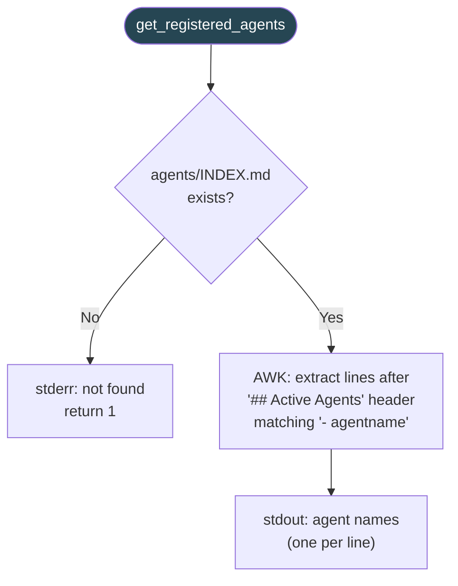

### 5.3 detect_agent_dirs()

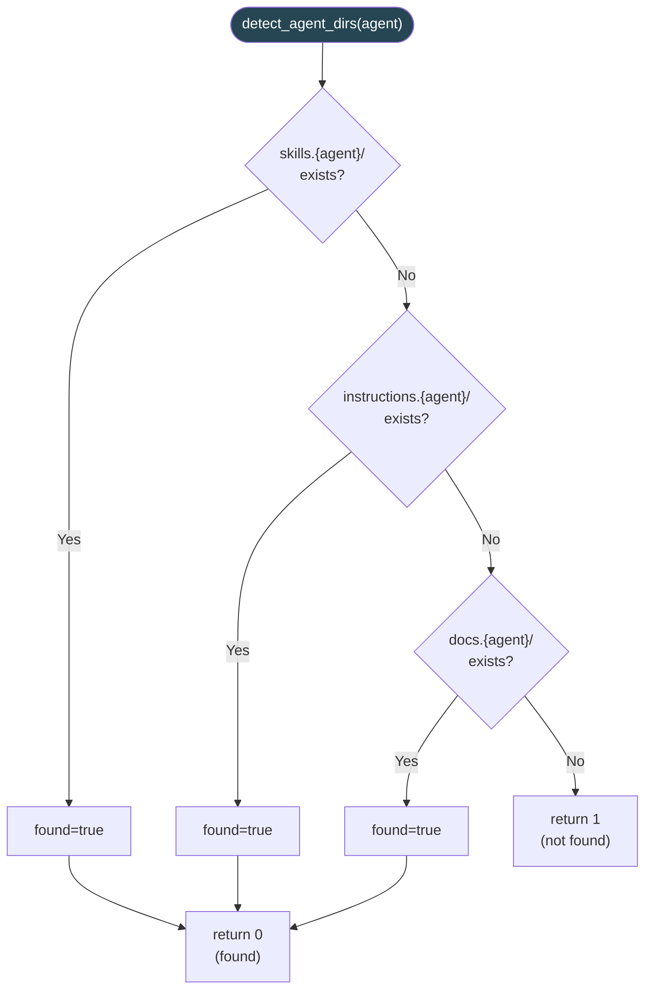

### 5.4 get_agent_target_path()

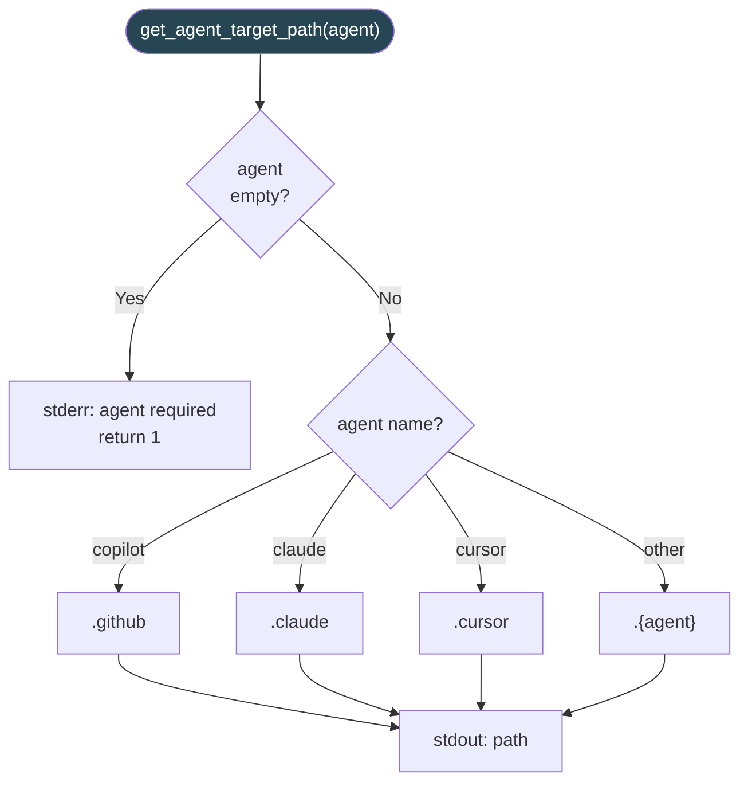

### 5.5 validate_agents()

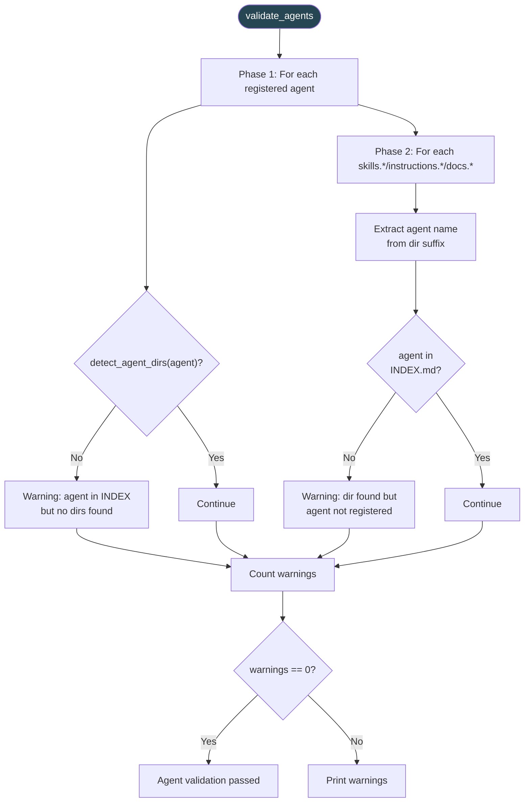

### 5.6 get_managed_repos()

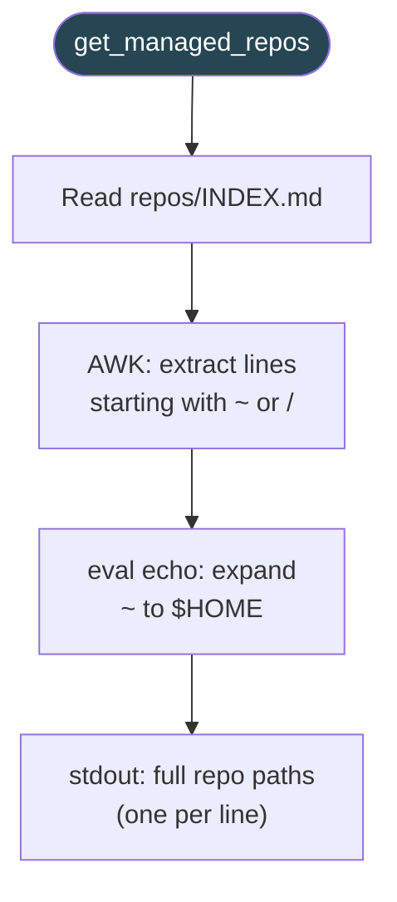

### 5.7 merge_agent_overlay()

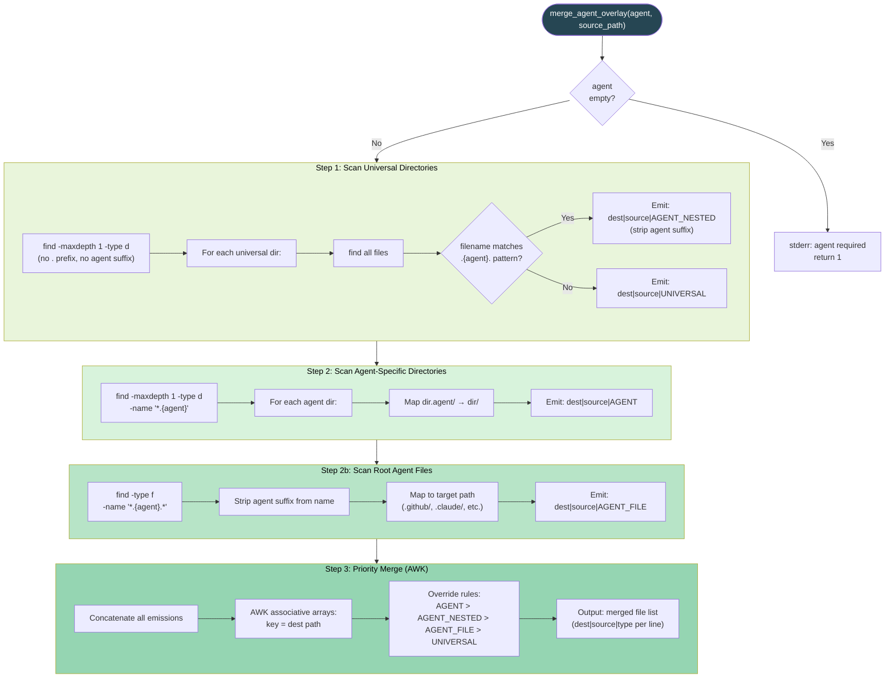

### 5.8 apply_overlay_to_target()

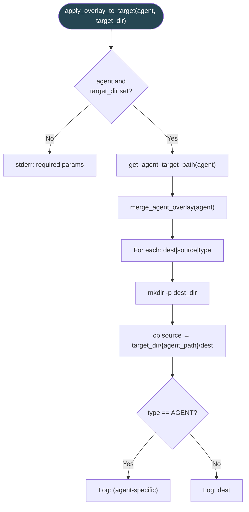

### 5.9 symlink_mode()

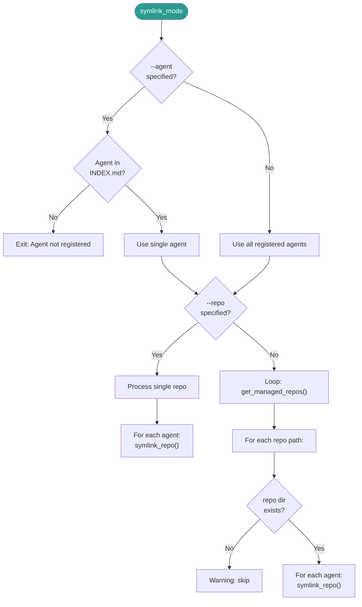

### 5.10 symlink_repo()

```mermaid
flowchart TD
    SR(["symlink_repo(name, path, vault_path, agent)"]) --> CheckAgentParam{agent<br/>param set?}
    CheckAgentParam -->|No| ErrReturn["stderr: agent required"]
    CheckAgentParam -->|Yes| GetTarget["target = get_agent_target_path(agent)<br/>e.g. .github, .claude"]

    GetTarget --> CheckVaultDir{vault repo dir<br/>exists?}
    CheckVaultDir -->|No| SkipWarn["Warning: skip"]
    CheckVaultDir -->|Yes| CheckLink

    CheckLink{repo/{target}<br/>is symlink?}
    CheckLink -->|Yes, correct target| AlreadyOk["Already symlinked correctly"]
    CheckLink -->|Yes, wrong target| WrongTarget["Warning: different target"]
    CheckLink -->|Yes, broken| Repair["Remove broken link"]
    CheckLink -->|No, is directory| DirExists["Warning: real dir exists"]
    CheckLink -->|No, is file| FileExists["Warning: file exists"]
    CheckLink -->|No, nothing| Create

    Repair --> Create["ln -s vault_path → repo/{target}"]
    Create --> Success["Created symlink"]

    style SR fill:#2a9d8f,color:#fff
```

### 5.11 watch_mode()

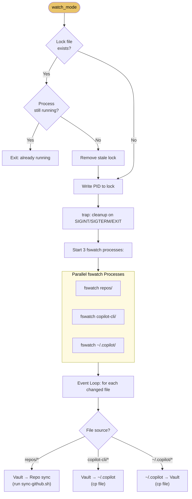

---

## 6. merge-and-relink.sh — Function Scopes

### 6.1 Top-Level Entry Point

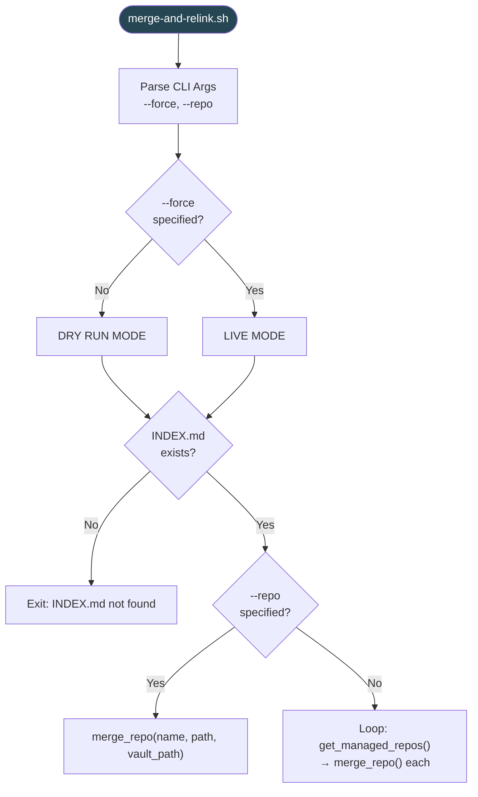

### 6.2 merge_repo()

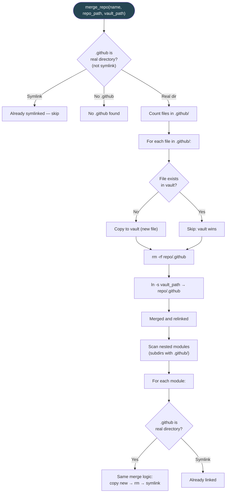

### 6.3 get_managed_repos() (merge-and-relink version)

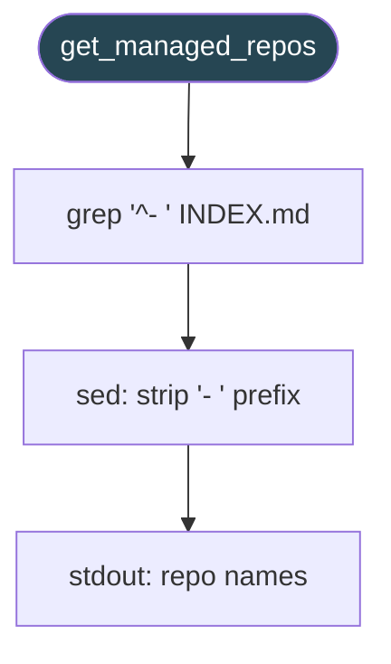

---

## 7. remove-links.sh — Function Scope

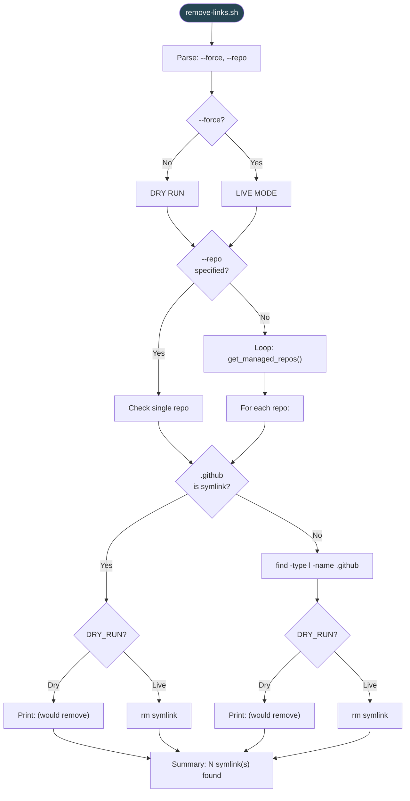

---

## 8. install-launchd-service.sh — Function Scope

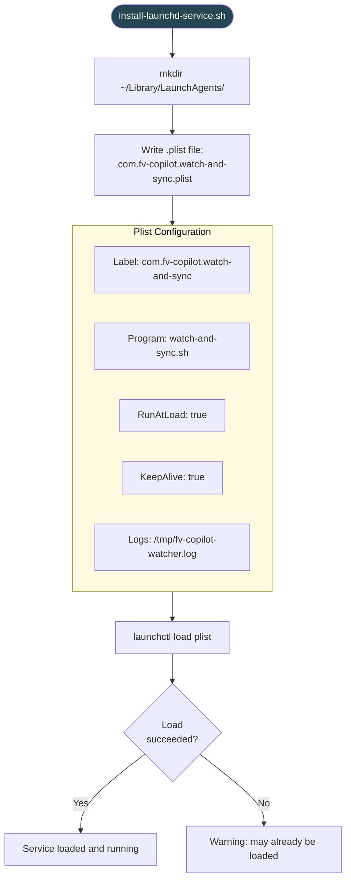

---

## 9. Git Hooks — Function Scopes

### 9.1 post-merge Hook

```mermaid
flowchart TD
    Hook([post-merge]) --> GetRoot["git rev-parse --show-toplevel"]
    GetRoot --> GetName["basename → repo name"]
    GetName --> CheckScript{"merge-and-relink.sh<br/>exists?"}
    CheckScript -->|No| Noop["Exit silently"]
    CheckScript -->|Yes| CheckGithub{".github is<br/>real directory?<br/>(not symlink)"}
    CheckGithub -->|No| Noop2["Exit: nothing to repair"]
    CheckGithub -->|Yes| RunMerge["bash merge-and-relink.sh<br/>--force --repo {name}"]
    RunMerge --> Repaired["Symlinks repaired"]

    style Hook fill:#e76f51,color:#fff
```

### 9.2 post-commit Hook

```mermaid
flowchart TD
    Hook([post-commit]) --> CheckScript{"sync-github.sh<br/>exists?"}
    CheckScript -->|No| Noop["Exit silently"]
    CheckScript -->|Yes| RunAsync["bash sync-github.sh &<br/>(background)"]

    style Hook fill:#e76f51,color:#fff
```

---

## 10. Sync Modes — State Machine

```mermaid
stateDiagram-v2
    [*] --> ParseArgs

    ParseArgs --> SymlinkMode: mode=symlink
    ParseArgs --> WatchMode: mode=watch
    ParseArgs --> BothMode: mode=both

    BothMode --> SymlinkMode: phase 1
    BothMode --> WatchMode: phase 2

    state SymlinkMode {
        [*] --> ValidateAgent
        ValidateAgent --> ResolveRepos
        ResolveRepos --> ForEachRepo
        ForEachRepo --> ForEachAgent
        ForEachAgent --> CheckExisting
        CheckExisting --> CreateSymlink: not linked
        CheckExisting --> Skip: already linked
        CheckExisting --> Repair: broken link
        Repair --> CreateSymlink
        CreateSymlink --> [*]
        Skip --> [*]
    }

    state WatchMode {
        [*] --> AcquireLock
        AcquireLock --> StartFswatch
        StartFswatch --> ListenEvents
        ListenEvents --> RouteEvent
        RouteEvent --> VaultToRepo: repos/* changed
        RouteEvent --> VaultToCopilot: copilot-cli/* changed
        RouteEvent --> CopilotToVault: ~/.copilot/* changed
        VaultToRepo --> ListenEvents
        VaultToCopilot --> ListenEvents
        CopilotToVault --> ListenEvents
    }
```

---

## 11. Data Flow — End to End

```mermaid
sequenceDiagram
    participant User as Developer
    participant Vault as FV-Copilot Vault
    participant Script as watch-and-sync.sh
    participant Index as repos/INDEX.md
    participant AgentIdx as agents/INDEX.md
    participant Overlay as merge_agent_overlay()
    participant Repo as Target Repository
    participant Agent as AI Agent

    User->>Script: ./watch-and-sync.sh --mode symlink
    Script->>Index: Read managed repos
    Index-->>Script: [~/git/FV-Platform-Main, ...]
    Script->>AgentIdx: Read registered agents
    AgentIdx-->>Script: [copilot, claude]

    loop For each repo × agent
        Script->>Overlay: merge_agent_overlay(agent)
        Overlay->>Vault: Scan universal dirs
        Overlay->>Vault: Scan agent-specific dirs
        Overlay->>Vault: Scan nested overrides
        Overlay-->>Script: Merged file list (dest|source|priority)
        Script->>Repo: Create symlink: repo/.github → vault/repos/name
    end

    Note over Repo: Symlinks now active

    User->>Vault: Edit skills/python.md
    Note over Repo: Change visible instantly via symlink
    Agent->>Repo: Read .github/skills/python.md
    Repo-->>Agent: Content from vault
```

---

## 12. Multi-Agent Overlay Merge — Sequence

```mermaid
sequenceDiagram
    participant Caller
    participant MAO as merge_agent_overlay()
    participant FS as Filesystem
    participant AWK as AWK Merge

    Caller->>MAO: merge_agent_overlay("copilot")

    Note over MAO: Step 1: Universal Scan
    MAO->>FS: find dirs (no agent suffix)
    FS-->>MAO: [skills/, instructions/, docs/]

    loop For each universal dir
        MAO->>FS: find all files
        FS-->>MAO: [setup.md, python.md, python.copilot.md, ...]

        alt filename matches .copilot.
            MAO->>MAO: Emit: skills/python.md|path|AGENT_NESTED
        else no agent suffix
            MAO->>MAO: Emit: skills/python.md|path|UNIVERSAL
        end
    end

    Note over MAO: Step 2: Agent Dir Scan
    MAO->>FS: find dirs named *.copilot
    FS-->>MAO: [skills.copilot/, instructions.copilot/]

    loop For each agent dir
        MAO->>FS: find all files
        FS-->>MAO: [setup.md, database.md, ...]
        MAO->>MAO: Emit: skills/setup.md|path|AGENT
    end

    Note over MAO: Step 2b: Root Agent Files
    MAO->>FS: find -name "*.copilot.*"
    FS-->>MAO: [quickstart.copilot.md]
    MAO->>MAO: Emit: .github/quickstart.md|path|AGENT_FILE

    Note over MAO: Step 3: Priority Merge
    MAO->>AWK: All emissions
    AWK->>AWK: For same dest: AGENT > AGENT_NESTED > AGENT_FILE > UNIVERSAL
    AWK-->>Caller: Final merged list
```

---

## 13. TypeScript Rewrite — Target Module Map

```mermaid
graph TD
    subgraph CLI["fv-copilot CLI (TypeScript)"]
        Main["src/index.ts<br/>(CLI entry point)"]

        subgraph Core["src/core/"]
            Config["config.ts<br/>VaultConfig, paths, constants"]
            AgentRegistry["agent-registry.ts<br/>getRegisteredAgents()<br/>detectAgentDirs()<br/>getAgentTargetPath()<br/>validateAgents()"]
            RepoIndex["repo-index.ts<br/>getManagedRepos()"]
            Overlay["overlay.ts<br/>mergeAgentOverlay()<br/>applyOverlayToTarget()"]
        end

        subgraph Commands["src/commands/"]
            Symlink["symlink.ts<br/>symlinkMode()<br/>symlinkRepo()"]
            Watch["watch.ts<br/>watchMode()<br/>startFswatch()"]
            Merge["merge.ts<br/>mergeRepo()<br/>mergeAndRelink()"]
            Remove["remove.ts<br/>removeLinks()"]
            Install["install.ts<br/>installLaunchdService()"]
            Validate["validate.ts<br/>validateAll()"]
        end

        subgraph Hooks["src/hooks/"]
            PostMerge["post-merge.ts"]
            PostCommit["post-commit.ts"]
        end

        subgraph Utils["src/utils/"]
            FS["fs-utils.ts<br/>symlinkSafe(), isSymlink()"]
            Shell["shell.ts<br/>exec(), spawn()"]
            Logger["logger.ts<br/>info(), warn(), error()"]
        end
    end

    Main --> Config
    Main --> Commands
    Symlink --> AgentRegistry
    Symlink --> RepoIndex
    Symlink --> Overlay
    Symlink --> FS
    Watch --> RepoIndex
    Watch --> Shell
    Merge --> RepoIndex
    Merge --> FS
    Remove --> RepoIndex
    Remove --> FS
    Install --> Config
    Validate --> AgentRegistry

    style CLI fill:#1a1a2e,color:#fff
    style Core fill:#16213e,color:#fff
    style Commands fill:#0f3460,color:#fff
    style Hooks fill:#533483,color:#fff
    style Utils fill:#e94560,color:#fff
```

---

## 14. Runtime Environment

```mermaid
graph LR
    subgraph DevMachine["Developer Machine (macOS arm64)"]
        subgraph Runtimes["Runtime Managers"]
            PYENV["pyenv 2.6.3<br/>Python 3.13.5 (default)"]
            NVM["nvm 0.39.3<br/>Node 25.2.1 (default)"]
        end

        subgraph Available["Available Runtimes"]
            PY39["Python 3.9-dev"]
            PY313["Python 3.13-dev"]
            PY3135["Python 3.13.5"]
            N18["Node 18.20.4"]
            N22["Node 22.21.1"]
            N25["Node 25.2.1"]
        end

        subgraph Tools["System Tools"]
            BREW["Homebrew 5.0.13<br/>(/opt/homebrew/bin)"]
            GIT["Git"]
            FSWATCH["fswatch"]
        end

        PYENV --> PY39
        PYENV --> PY313
        PYENV --> PY3135
        NVM --> N18
        NVM --> N22
        NVM --> N25
    end

    style DevMachine fill:#1a1a2e,color:#fff
    style Runtimes fill:#16213e,color:#fff
    style Available fill:#0f3460,color:#fff
    style Tools fill:#533483,color:#fff
```

---

## Diagram Index

| # | Diagram | Type | Covers |
|---|---------|------|--------|
| 1 | System Architecture | Graph | Full system overview |
| 2 | Vault Directory Structure | Graph | File/folder layout |
| 3 | Agent Routing System | Flowchart | 3-tier routing logic |
| 4 | File Resolution Priority | Flowchart | Priority cascade |
| 5.1 | watch-and-sync: Entry | Flowchart | CLI parsing, mode dispatch |
| 5.2 | get_registered_agents() | Flowchart | Agent index parser |
| 5.3 | detect_agent_dirs() | Flowchart | Dir existence checks |
| 5.4 | get_agent_target_path() | Flowchart | Agent→path mapping |
| 5.5 | validate_agents() | Flowchart | Bidirectional validation |
| 5.6 | get_managed_repos() | Flowchart | Repo index parser |
| 5.7 | merge_agent_overlay() | Flowchart | 3-step overlay merge |
| 5.8 | apply_overlay_to_target() | Flowchart | File copy with overlay |
| 5.9 | symlink_mode() | Flowchart | Symlink orchestrator |
| 5.10 | symlink_repo() | Flowchart | Per-repo symlink logic |
| 5.11 | watch_mode() | Flowchart | Fswatch event loop |
| 6.1 | merge-and-relink: Entry | Flowchart | CLI parsing, dispatch |
| 6.2 | merge_repo() | Flowchart | Merge+relink per repo |
| 6.3 | get_managed_repos() (v2) | Flowchart | Repo parser variant |
| 7 | remove-links.sh | Flowchart | Full script flow |
| 8 | install-launchd-service.sh | Flowchart | Plist install flow |
| 9.1 | post-merge hook | Flowchart | Auto-repair flow |
| 9.2 | post-commit hook | Flowchart | Auto-sync flow |
| 10 | Sync Modes | State Diagram | Mode state machine |
| 11 | Data Flow (E2E) | Sequence | Full sync sequence |
| 12 | Overlay Merge | Sequence | merge_agent_overlay detail |
| 13 | TypeScript Module Map | Graph | Rewrite target architecture |
| 14 | Runtime Environment | Graph | pyenv, nvm, tools |
