# Platform Architecture

> Six-layer agent platform: from model access to governed data.

---

## Table of Contents

1. [Overview](#1-overview)
2. [Layer Stack](#2-layer-stack)
3. [Layer 1 — Models (mzd-proxy)](#3-layer-1--models-mzd-proxy)
4. [Layer 2 — Tools (MCP)](#4-layer-2--tools-mcp)
5. [Layer 3 — Context (Obscura)](#5-layer-3--context-obscura)
6. [Layer 4 — Orchestration (OpenClaw)](#6-layer-4--orchestration-openclaw)
7. [Layer 5 — Infrastructure (Gateway)](#7-layer-5--infrastructure-gateway)
8. [Layer 6 — Data (Unified Data Layer)](#8-layer-6--data-unified-data-layer)
9. [Integration Map](#9-integration-map)
10. [Phased Rollout](#10-phased-rollout)
11. [Open Questions](#11-open-questions)

---

## 1. Overview

The platform is a six-layer stack that turns disparate AI models, SaaS tools, and agent frameworks into a governed, auditable agent operating system.

Each layer solves one problem:

| # | Layer | Tool | Problem It Solves |
|---|-------|------|-------------------|
| 1 | **Models** | mzd-proxy | Different LLM APIs, different formats |
| 2 | **Tools** | MCP (via proxy) | Each agent configures tools separately |
| 3 | **Context** | Obscura | Agents lack repo-specific skills/instructions |
| 4 | **Orchestration** | OpenClaw | No unified agent lifecycle or task routing |
| 5 | **Infrastructure** | Gateway (Phase 2) | No secure remote access or multi-tenancy |
| 6 | **Data** | Unified Data Layer | SaaS data is siloed, unauditable, raw |

**Key principle:** Each layer is independent and composable. You can run layers 1-4 locally today. Layers 5-6 are designed now, built when needed.

---

## 2. Layer Stack

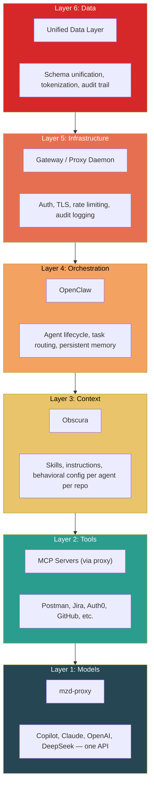
```mermaid
graph TB
    subgraph L6["Layer 6: Data"]
        DATA["Unified Data Layer"]
        DATA_DESC["Schema unification, tokenization, audit trail"]
    end

    subgraph L5["Layer 5: Infrastructure"]
        GW["Gateway / Proxy Daemon"]
        GW_DESC["Auth, TLS, rate limiting, audit logging"]
    end

    subgraph L4["Layer 4: Orchestration"]
        OC["OpenClaw"]
        OC_DESC["Agent lifecycle, task routing, persistent memory"]
    end

    subgraph L3["Layer 3: Context"]
        OBS["Obscura"]
        OBS_DESC["Skills, instructions, behavioral config per agent per repo"]
    end

    subgraph L2["Layer 2: Tools"]
        MCP["MCP Servers (via proxy)"]
        MCP_DESC["Postman, Jira, Auth0, GitHub, etc."]
    end

    subgraph L1["Layer 1: Models"]
        MZD["mzd-proxy"]
        MZD_DESC["Copilot, Claude, OpenAI, DeepSeek — one API"]
    end

    L6 --> L5
    L5 --> L4
    L4 --> L3
    L3 --> L2
    L2 --> L1

    style L6 fill:#d62828,color:#fff
    style L5 fill:#e76f51,color:#fff
    style L4 fill:#f4a261,color:#000
    style L3 fill:#e9c46a,color:#000
    style L2 fill:#2a9d8f,color:#fff
    style L1 fill:#264653,color:#fff
```

---

## 3. Layer 1 — Models (mzd-proxy)

**Repo:** `ModernizedAI/mzd-proxy` (fork of `ericc-ch/copilot-api`)

**Problem:** Every LLM provider has a different API format. Switching models means rewriting integration code.

**Solution:** A proxy that normalizes all LLM access into a single OpenAI/Anthropic-compatible API. Any client sends one format, mzd-proxy routes to the right model.

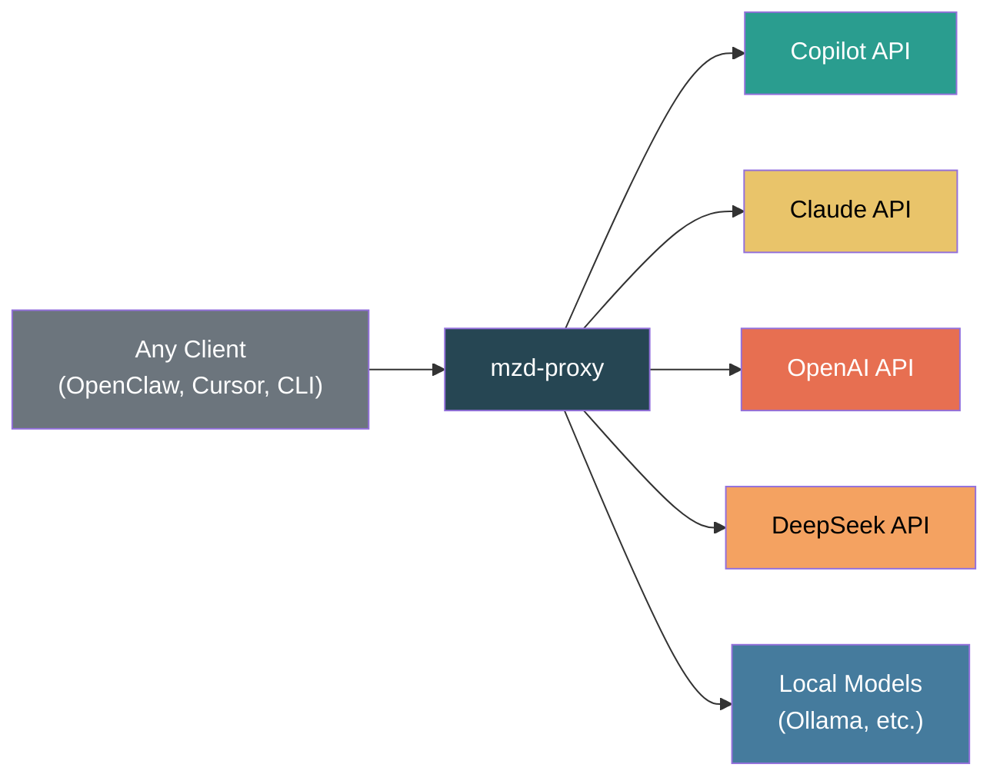
```mermaid
graph LR
    Client["Any Client<br/>(OpenClaw, Cursor, CLI)"] --> MZD["mzd-proxy"]

    MZD --> COP["Copilot API"]
    MZD --> CLA["Claude API"]
    MZD --> OAI["OpenAI API"]
    MZD --> DS["DeepSeek API"]
    MZD --> LOCAL["Local Models<br/>(Ollama, etc.)"]

    style MZD fill:#264653,color:#fff
    style Client fill:#6c757d,color:#fff
    style COP fill:#2a9d8f,color:#fff
    style CLA fill:#e9c46a,color:#000
    style OAI fill:#e76f51,color:#fff
    style DS fill:#f4a261,color:#000
    style LOCAL fill:#457b9d,color:#fff
```

### Model Request Flow

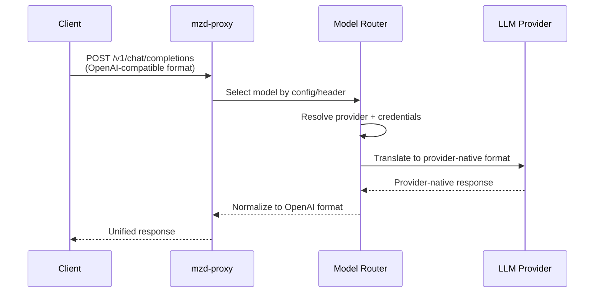
```mermaid
sequenceDiagram
    participant Client
    participant MZD as mzd-proxy
    participant Router as Model Router
    participant Provider as LLM Provider

    Client->>MZD: POST /v1/chat/completions<br/>(OpenAI-compatible format)
    MZD->>Router: Select model by config/header
    Router->>Router: Resolve provider + credentials
    Router->>Provider: Translate to provider-native format
    Provider-->>Router: Provider-native response
    Router-->>MZD: Normalize to OpenAI format
    MZD-->>Client: Unified response
```

**What it owns:**
- Model routing and selection
- API format translation
- Token/auth management per provider
- Rate limiting per model

**What it doesn't own:**
- What the model *knows* (that's Obscura)
- What the model *can do* (that's MCP)
- What the model *should do* (that's OpenClaw)

### Responsibility Boundaries

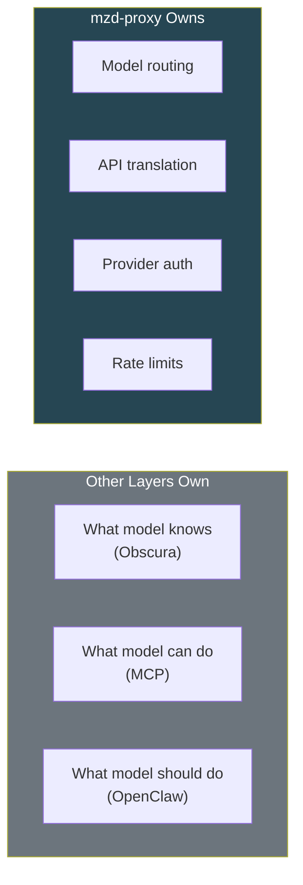
```mermaid
graph TB
    subgraph MZD_Scope["mzd-proxy Owns"]
        R1["Model routing"]
        R2["API translation"]
        R3["Provider auth"]
        R4["Rate limits"]
    end

    subgraph NOT["Other Layers Own"]
        N1["What model knows<br/>(Obscura)"]
        N2["What model can do<br/>(MCP)"]
        N3["What model should do<br/>(OpenClaw)"]
    end

    MZD_Scope ~~~ NOT

    style MZD_Scope fill:#264653,color:#fff
    style NOT fill:#6c757d,color:#fff
```

---

## 4. Layer 2 — Tools (MCP)

**Standard:** Model Context Protocol (open standard)

**Problem:** Each AI agent discovers and configures tools separately. Add Jira to Claude, forget Cursor. Different config formats, different locations.

**Solution:** MCP servers expose tools via a standard protocol. A proxy gateway aggregates them so every agent connects to one endpoint.

**Current MCP servers:**
- Postman (`@postman/postman-mcp-server`)
- Jira (`jira-mcp`)
- Auth0 (`@auth0/auth0-mcp-server`)

**Architecture:**

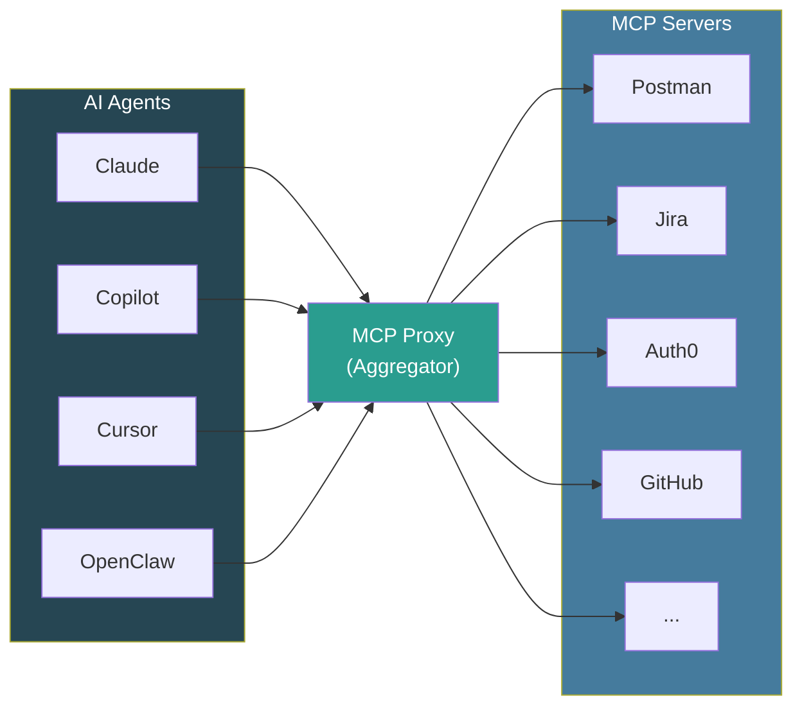
```mermaid
graph LR
    subgraph Agents["AI Agents"]
        A1["Claude"]
        A2["Copilot"]
        A3["Cursor"]
        A4["OpenClaw"]
    end

    PROXY["MCP Proxy<br/>(Aggregator)"]

    subgraph Servers["MCP Servers"]
        S1["Postman"]
        S2["Jira"]
        S3["Auth0"]
        S4["GitHub"]
        S5["..."]
    end

    A1 --> PROXY
    A2 --> PROXY
    A3 --> PROXY
    A4 --> PROXY
    PROXY --> S1
    PROXY --> S2
    PROXY --> S3
    PROXY --> S4
    PROXY --> S5

    style PROXY fill:#2a9d8f,color:#fff
    style Agents fill:#264653,color:#fff
    style Servers fill:#457b9d,color:#fff
```

### MCP Tool Discovery Flow

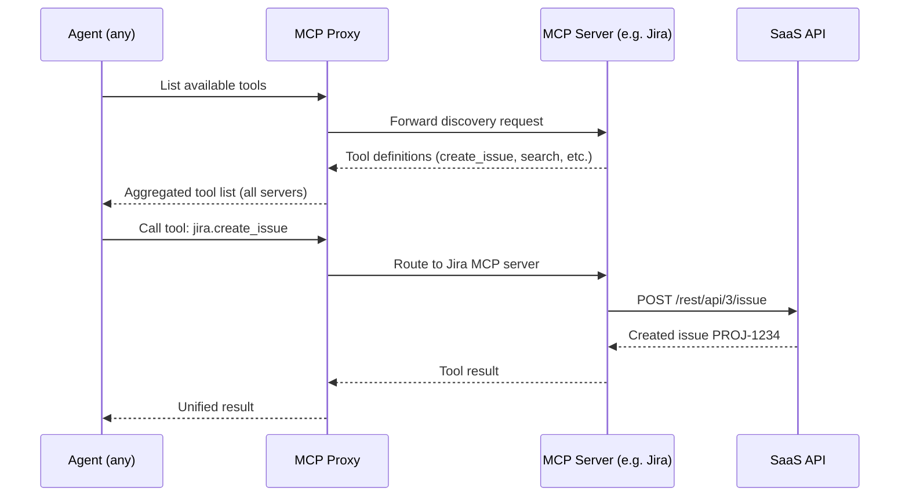
```mermaid
sequenceDiagram
    participant Agent as Agent (any)
    participant Proxy as MCP Proxy
    participant Server as MCP Server (e.g. Jira)
    participant SaaS as SaaS API

    Agent->>Proxy: List available tools
    Proxy->>Server: Forward discovery request
    Server-->>Proxy: Tool definitions (create_issue, search, etc.)
    Proxy-->>Agent: Aggregated tool list (all servers)

    Agent->>Proxy: Call tool: jira.create_issue
    Proxy->>Server: Route to Jira MCP server
    Server->>SaaS: POST /rest/api/3/issue
    SaaS-->>Server: Created issue PROJ-1234
    Server-->>Proxy: Tool result
    Proxy-->>Agent: Unified result
```

### Obscura + MCP Config Sync

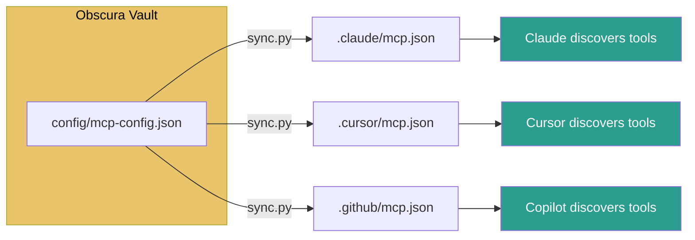
```mermaid
flowchart LR
    subgraph Vault["Obscura Vault"]
        MC["config/mcp-config.json"]
    end

    MC -->|sync.py| C1[".claude/mcp.json"]
    MC -->|sync.py| C2[".cursor/mcp.json"]
    MC -->|sync.py| C3[".github/mcp.json"]

    C1 --> A1["Claude discovers tools"]
    C2 --> A2["Cursor discovers tools"]
    C3 --> A3["Copilot discovers tools"]

    style Vault fill:#e9c46a,color:#000
    style A1 fill:#2a9d8f,color:#fff
    style A2 fill:#2a9d8f,color:#fff
    style A3 fill:#2a9d8f,color:#fff
```

**Integration with Obscura:** Obscura syncs MCP proxy config to each agent's expected location (`.claude/`, `.cursor/`, `.github/`), so every agent in every repo discovers the same tools without manual setup.

---

## 5. Layer 3 — Context (Obscura)

**Repo:** This repository.

**Problem:** AI agents are stateless by default. They don't know your codebase conventions, team workflows, or project-specific instructions unless you configure each one manually, per repo.

**Solution:** A centralized vault of skills, instructions, and behavioral config that syncs to every agent in every repo automatically.

**What Obscura owns:**
- Skills (how to do things)
- Instructions (rules and constraints)
- Agent-specific behavioral overrides
- Model/role variant selection
- Repo-specific context mirrors

### Layer Differentiation

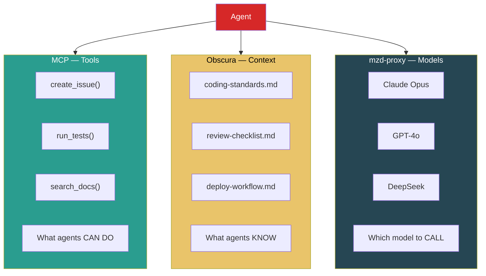
```mermaid
graph TB
    subgraph MCP_Layer["MCP — Tools"]
        T1["create_issue()"]
        T2["run_tests()"]
        T3["search_docs()"]
        T_LABEL["What agents CAN DO"]
    end

    subgraph OBS_Layer["Obscura — Context"]
        C1["coding-standards.md"]
        C2["review-checklist.md"]
        C3["deploy-workflow.md"]
        C_LABEL["What agents KNOW"]
    end

    subgraph MZD_Layer["mzd-proxy — Models"]
        M1["Claude Opus"]
        M2["GPT-4o"]
        M3["DeepSeek"]
        M_LABEL["Which model to CALL"]
    end

    Agent["Agent"] --> MCP_Layer
    Agent --> OBS_Layer
    Agent --> MZD_Layer

    style MCP_Layer fill:#2a9d8f,color:#fff
    style OBS_Layer fill:#e9c46a,color:#000
    style MZD_Layer fill:#264653,color:#fff
    style Agent fill:#d62828,color:#fff
```

### Context Resolution Flow

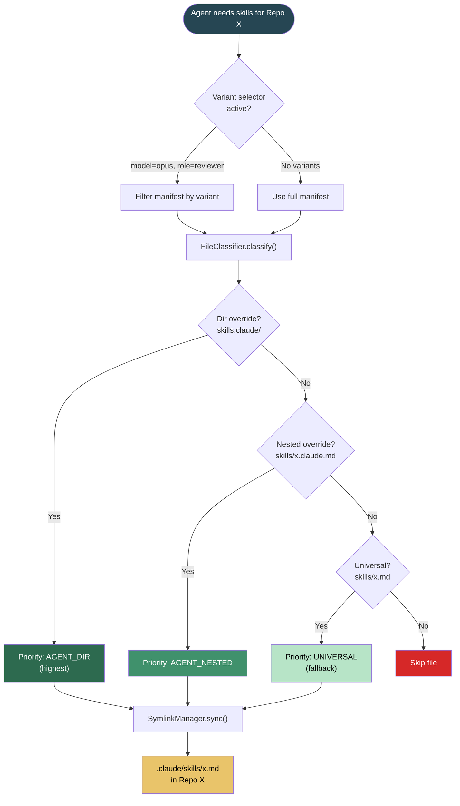
```mermaid
flowchart TD
    Req([Agent needs skills for Repo X]) --> V1{Variant selector<br/>active?}

    V1 -->|"model=opus, role=reviewer"| Filter["Filter manifest by variant"]
    V1 -->|No variants| FullManifest["Use full manifest"]

    Filter --> Classify
    FullManifest --> Classify

    Classify["FileClassifier.classify()"] --> P1{Dir override?<br/>skills.claude/}
    P1 -->|Yes| Use1["Priority: AGENT_DIR<br/>(highest)"]
    P1 -->|No| P2{Nested override?<br/>skills/x.claude.md}
    P2 -->|Yes| Use2["Priority: AGENT_NESTED"]
    P2 -->|No| P3{Universal?<br/>skills/x.md}
    P3 -->|Yes| Use3["Priority: UNIVERSAL<br/>(fallback)"]
    P3 -->|No| Skip["Skip file"]

    Use1 --> Sync["SymlinkManager.sync()"]
    Use2 --> Sync
    Use3 --> Sync

    Sync --> Target[".claude/skills/x.md<br/>in Repo X"]

    style Req fill:#264653,color:#fff
    style Use1 fill:#2d6a4f,color:#fff
    style Use2 fill:#40916c,color:#fff
    style Use3 fill:#b7e4c7,color:#000
    style Skip fill:#d62828,color:#fff
    style Target fill:#e9c46a,color:#000
```

**Key capabilities:**
- Three-tier priority routing (directory > nested file > universal)
- Agent-aware file classification
- Symlink/copy/watch sync modes
- Variant selection by model and role
- Recursive directory discovery

See [DESIGN-DIAGRAMS.md](DESIGN-DIAGRAMS.md) for detailed architecture.

---

## 6. Layer 4 — Orchestration (OpenClaw)

**Project:** OpenClaw (open source, formerly Clawdbot/Moltbot)

**Problem:** Individual agents can answer questions and use tools, but nothing coordinates multi-step workflows, maintains persistent memory, or routes tasks to the right agent.

**Solution:** OpenClaw acts as the orchestration brain — managing agent lifecycles, routing tasks, and maintaining state across interactions.

**What it owns:**
- Agent lifecycle management
- Task routing and delegation
- Persistent memory across sessions
- Multi-channel access (Slack, Discord, WhatsApp, etc.)
- Plugin/skill execution

### Orchestration Flow

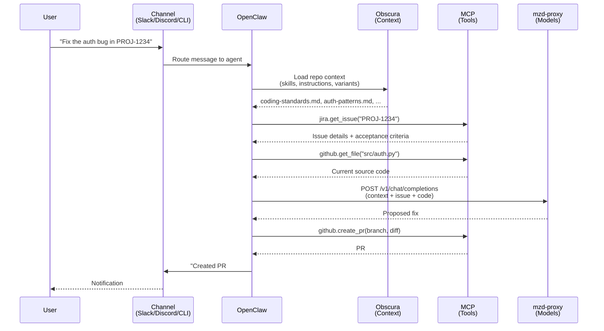
```mermaid
sequenceDiagram
    participant User
    participant Channel as Channel<br/>(Slack/Discord/CLI)
    participant OC as OpenClaw
    participant OBS as Obscura<br/>(Context)
    participant MCP as MCP<br/>(Tools)
    participant MZD as mzd-proxy<br/>(Models)

    User->>Channel: "Fix the auth bug in PROJ-1234"
    Channel->>OC: Route message to agent

    OC->>OBS: Load repo context<br/>(skills, instructions, variants)
    OBS-->>OC: coding-standards.md, auth-patterns.md, ...

    OC->>MCP: jira.get_issue("PROJ-1234")
    MCP-->>OC: Issue details + acceptance criteria

    OC->>MCP: github.get_file("src/auth.py")
    MCP-->>OC: Current source code

    OC->>MZD: POST /v1/chat/completions<br/>(context + issue + code)
    MZD-->>OC: Proposed fix

    OC->>MCP: github.create_pr(branch, diff)
    MCP-->>OC: PR #42 created

    OC->>Channel: "Created PR #42 fixing auth bug"
    Channel-->>User: Notification
```

### Agent Lifecycle — State Machine

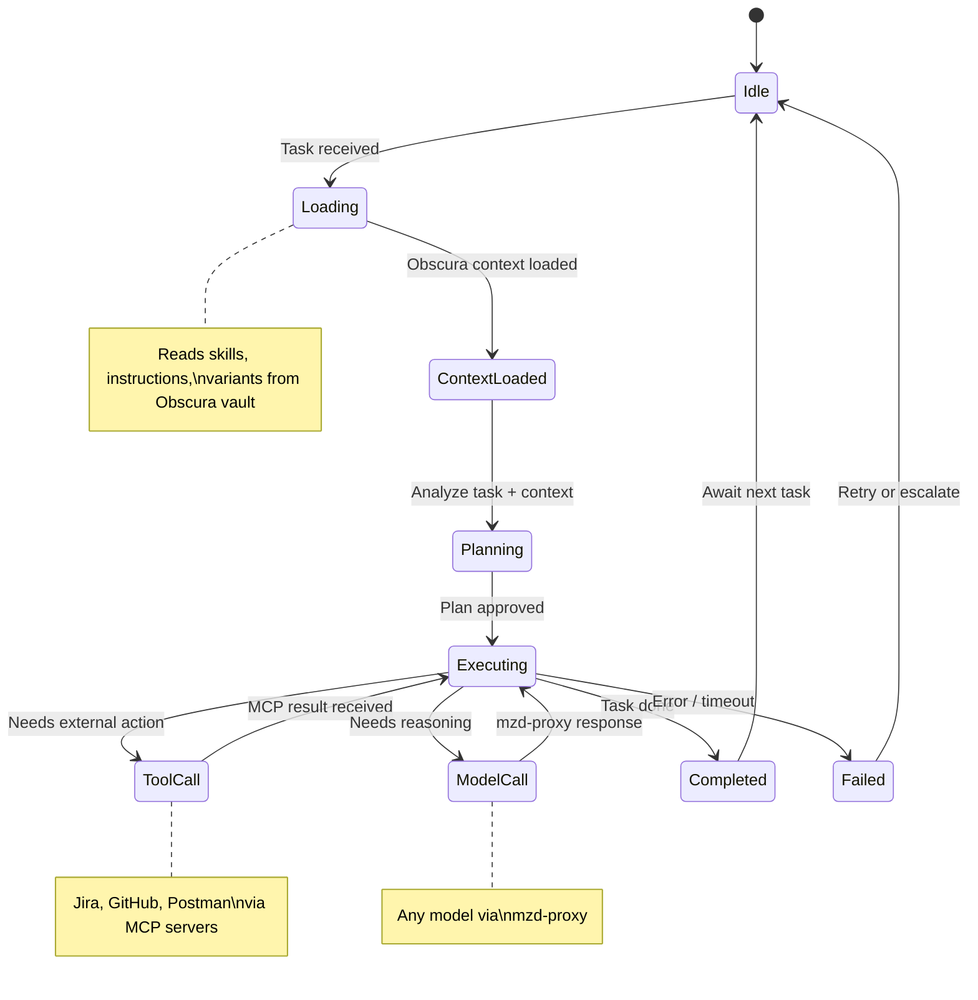
```mermaid
stateDiagram-v2
    [*] --> Idle

    Idle --> Loading: Task received
    Loading --> ContextLoaded: Obscura context loaded
    ContextLoaded --> Planning: Analyze task + context
    Planning --> Executing: Plan approved

    Executing --> ToolCall: Needs external action
    ToolCall --> Executing: MCP result received

    Executing --> ModelCall: Needs reasoning
    ModelCall --> Executing: mzd-proxy response

    Executing --> Completed: Task done
    Executing --> Failed: Error / timeout
    Failed --> Idle: Retry or escalate

    Completed --> Idle: Await next task

    note right of Loading: Reads skills, instructions,\nvariants from Obscura vault
    note right of ToolCall: Jira, GitHub, Postman\nvia MCP servers
    note right of ModelCall: Any model via\nmzd-proxy
```

**Integration points:**
- **With mzd-proxy:** OpenClaw calls models through the unified API
- **With MCP:** OpenClaw uses MCP tools for external actions
- **With Obscura:** OpenClaw agents receive context/skills from the vault

**Security note:** OpenClaw had a critical RCE vulnerability (CVE-2026-25253, CVSS 8.8) patched on 2026-01-30. Pin to version >= 2026.2.2.

---

## 7. Layer 5 — Infrastructure (Gateway)

**Status:** Design phase. Build in Phase 2 when remote/k8s deployment is needed.

**Problem:** Running OpenClaw + MCP + mzd-proxy on k8s exposes agent capabilities over the network. Needs auth, encryption, rate limiting, and audit logging.

**Solution:** An API gateway in front of the cluster that handles cross-cutting infrastructure concerns.

**Responsibilities:**
- **AuthN/AuthZ** — who can access the cluster, what agents they can invoke
- **TLS termination** — secure client connections
- **Rate limiting / quotas** — especially for model API costs and agent system access
- **Audit logging** — every agent action traceable
- **Multi-tenancy** — if multiple clients or teams share the cluster

**Recommended approach:**
- Use off-the-shelf k8s-native gateway (Envoy or Traefik)
- Add thin custom middleware for agent-specific concerns (action approval, audit)
- Don't build custom auth/TLS — use what exists

### Gateway Architecture

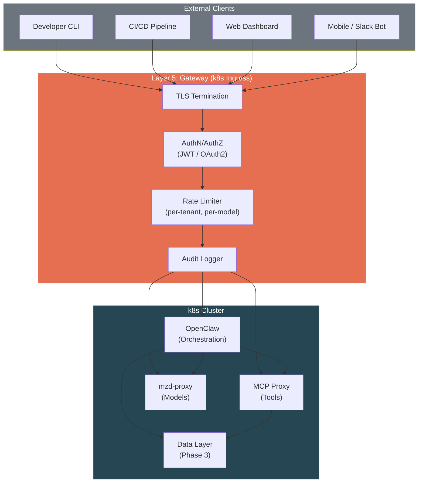
```mermaid
graph TB
    subgraph Clients["External Clients"]
        C1["Developer CLI"]
        C2["CI/CD Pipeline"]
        C3["Web Dashboard"]
        C4["Mobile / Slack Bot"]
    end

    subgraph Gateway["Layer 5: Gateway (k8s Ingress)"]
        TLS["TLS Termination"]
        AUTH["AuthN/AuthZ<br/>(JWT / OAuth2)"]
        RL["Rate Limiter<br/>(per-tenant, per-model)"]
        AUDIT["Audit Logger"]
    end

    subgraph Cluster["k8s Cluster"]
        OC["OpenClaw<br/>(Orchestration)"]
        MCPP["MCP Proxy<br/>(Tools)"]
        MZD["mzd-proxy<br/>(Models)"]
        DL["Data Layer<br/>(Phase 3)"]
    end

    C1 --> TLS
    C2 --> TLS
    C3 --> TLS
    C4 --> TLS
    TLS --> AUTH
    AUTH --> RL
    RL --> AUDIT
    AUDIT --> OC
    AUDIT --> MCPP
    AUDIT --> MZD
    OC --> MCPP
    OC --> MZD
    OC --> DL
    MCPP --> DL

    style Gateway fill:#e76f51,color:#fff
    style Cluster fill:#264653,color:#fff
    style Clients fill:#6c757d,color:#fff
```

### Request Authentication Flow

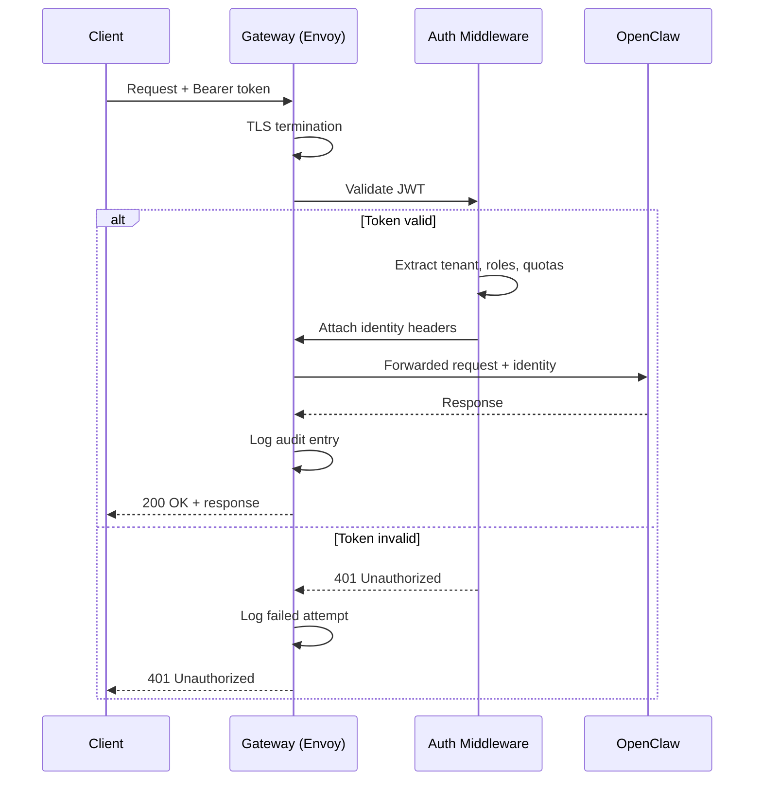
```mermaid
sequenceDiagram
    participant Client
    participant GW as Gateway (Envoy)
    participant Auth as Auth Middleware
    participant OC as OpenClaw

    Client->>GW: Request + Bearer token
    GW->>GW: TLS termination
    GW->>Auth: Validate JWT

    alt Token valid
        Auth->>Auth: Extract tenant, roles, quotas
        Auth->>GW: Attach identity headers
        GW->>OC: Forwarded request + identity
        OC-->>GW: Response
        GW->>GW: Log audit entry
        GW-->>Client: 200 OK + response
    else Token invalid
        Auth-->>GW: 401 Unauthorized
        GW->>GW: Log failed attempt
        GW-->>Client: 401 Unauthorized
    end
```

### k8s Deployment Topology

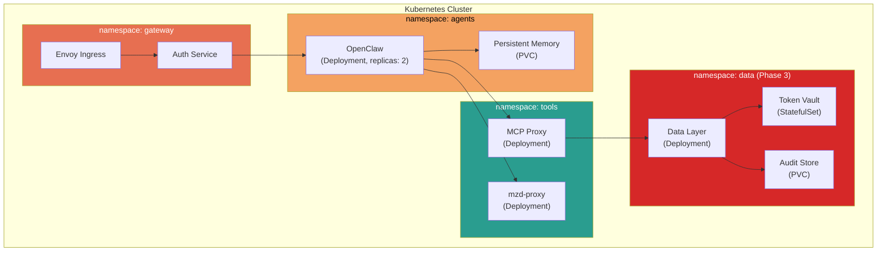
```mermaid
graph TB
    subgraph K8S["Kubernetes Cluster"]
        subgraph NS_GW["namespace: gateway"]
            INGRESS["Envoy Ingress"]
            AUTH_SVC["Auth Service"]
        end

        subgraph NS_AGENTS["namespace: agents"]
            OC_POD["OpenClaw<br/>(Deployment, replicas: 2)"]
            OC_MEM["Persistent Memory<br/>(PVC)"]
        end

        subgraph NS_TOOLS["namespace: tools"]
            MCP_POD["MCP Proxy<br/>(Deployment)"]
            MZD_POD["mzd-proxy<br/>(Deployment)"]
        end

        subgraph NS_DATA["namespace: data (Phase 3)"]
            DL_POD["Data Layer<br/>(Deployment)"]
            TOKEN_VAULT["Token Vault<br/>(StatefulSet)"]
            AUDIT_DB["Audit Store<br/>(PVC)"]
        end
    end

    INGRESS --> AUTH_SVC
    AUTH_SVC --> OC_POD
    OC_POD --> OC_MEM
    OC_POD --> MCP_POD
    OC_POD --> MZD_POD
    MCP_POD --> DL_POD
    DL_POD --> TOKEN_VAULT
    DL_POD --> AUDIT_DB

    style NS_GW fill:#e76f51,color:#fff
    style NS_AGENTS fill:#f4a261,color:#000
    style NS_TOOLS fill:#2a9d8f,color:#fff
    style NS_DATA fill:#d62828,color:#fff
```

**Build this layer when:**
- You need remote access to the agent platform
- Multiple users/teams need isolated access
- You're deploying to k8s

---

## 8. Layer 6 — Data (Unified Data Layer)

**Status:** Design phase. The most valuable and most complex layer.

**Problem:** Agents interact with data from Jira, GitHub, Postman, Slack, Auth0, and more. Each SaaS has its own data model, its own schema, its own way of representing "a task" or "an event." Agents see raw, inconsistent data. Sensitive fields are exposed. Nothing is auditable.

**Solution:** A unified data layer that normalizes, tokenizes, and audits all data before agents touch it.

### 8.1 Schema Unification

Map SaaS-specific data models to canonical types that agents reason over:

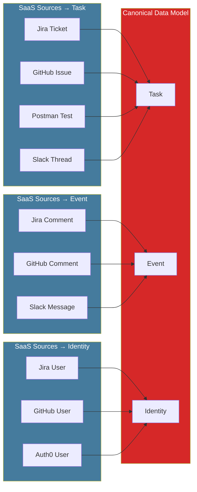
```mermaid
graph LR
    subgraph SaaS_Task["SaaS Sources → Task"]
        JT["Jira Ticket"]
        GI["GitHub Issue"]
        PT["Postman Test"]
        ST["Slack Thread"]
    end

    subgraph SaaS_Event["SaaS Sources → Event"]
        JC["Jira Comment"]
        GC["GitHub Comment"]
        SM["Slack Message"]
    end

    subgraph SaaS_Identity["SaaS Sources → Identity"]
        JU["Jira User"]
        GU["GitHub User"]
        AU["Auth0 User"]
    end

    subgraph Canonical["Canonical Data Model"]
        TASK["Task"]
        EVENT["Event"]
        IDENTITY["Identity"]
    end

    JT --> TASK
    GI --> TASK
    PT --> TASK
    ST --> TASK
    JC --> EVENT
    GC --> EVENT
    SM --> EVENT
    JU --> IDENTITY
    GU --> IDENTITY
    AU --> IDENTITY

    style Canonical fill:#d62828,color:#fff
    style SaaS_Task fill:#457b9d,color:#fff
    style SaaS_Event fill:#457b9d,color:#fff
    style SaaS_Identity fill:#457b9d,color:#fff
```

Agents work with canonical types. The data layer handles translation to/from SaaS-specific formats at the boundary.

### Canonical Schema (Conceptual)

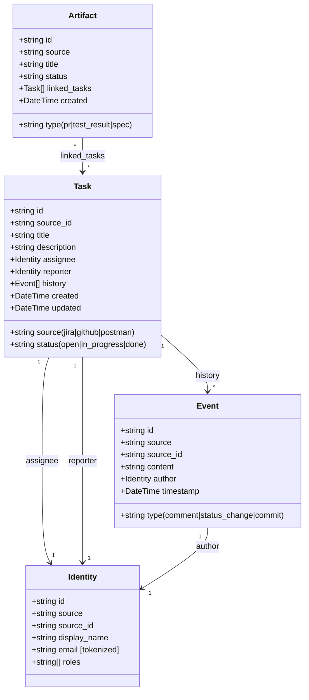
```mermaid
classDiagram
    class Task {
        +string id
        +string source (jira|github|postman)
        +string source_id
        +string title
        +string description
        +string status (open|in_progress|done)
        +Identity assignee
        +Identity reporter
        +Event[] history
        +DateTime created
        +DateTime updated
    }

    class Event {
        +string id
        +string source
        +string source_id
        +string type (comment|status_change|commit)
        +string content
        +Identity author
        +DateTime timestamp
    }

    class Identity {
        +string id
        +string source
        +string source_id
        +string display_name
        +string email [tokenized]
        +string[] roles
    }

    class Artifact {
        +string id
        +string source
        +string type (pr|test_result|spec)
        +string title
        +string status
        +Task[] linked_tasks
        +DateTime created
    }

    Task "1" --> "*" Event : history
    Task "1" --> "1" Identity : assignee
    Task "1" --> "1" Identity : reporter
    Event "1" --> "1" Identity : author
    Artifact "*" --> "*" Task : linked_tasks
```

### 8.2 Tokenization

Sensitive data is tokenized before agents see it:

```
Raw:       "Customer John Smith, SSN 123-45-6789, account #4521"
Tokenized: "Customer [PERSON:t_a3f2], SSN [PII:t_b7c1], account [ACCT:t_d9e4]"
```

### Tokenization Pipeline

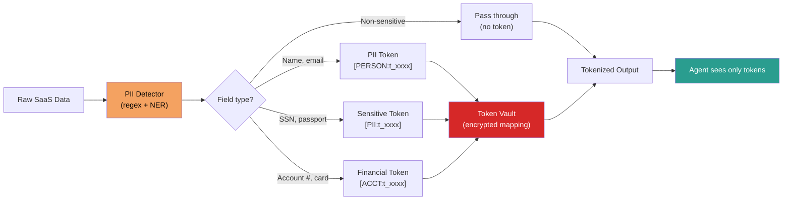
```mermaid
flowchart LR
    RAW["Raw SaaS Data"] --> DETECT["PII Detector<br/>(regex + NER)"]
    DETECT --> CLASSIFY{"Field type?"}

    CLASSIFY -->|Name, email| PII["PII Token<br/>[PERSON:t_xxxx]"]
    CLASSIFY -->|SSN, passport| SENS["Sensitive Token<br/>[PII:t_xxxx]"]
    CLASSIFY -->|Account #, card| FIN["Financial Token<br/>[ACCT:t_xxxx]"]
    CLASSIFY -->|Non-sensitive| PASS["Pass through<br/>(no token)"]

    PII --> VAULT["Token Vault<br/>(encrypted mapping)"]
    SENS --> VAULT
    FIN --> VAULT
    PASS --> OUT["Tokenized Output"]
    VAULT --> OUT

    OUT --> AGENT["Agent sees only tokens"]

    style DETECT fill:#f4a261,color:#000
    style VAULT fill:#d62828,color:#fff
    style AGENT fill:#2a9d8f,color:#fff
```

### Detokenization Authorization

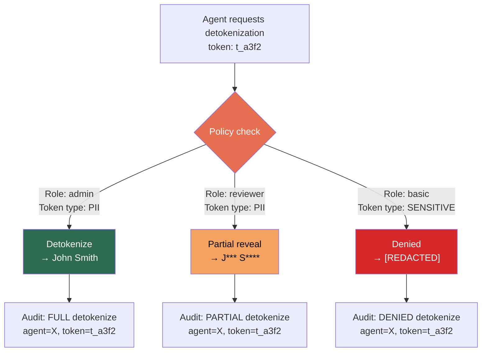
```mermaid
flowchart TD
    REQ["Agent requests detokenization<br/>token: t_a3f2"] --> CHECK{"Policy check"}

    CHECK -->|"Role: admin<br/>Token type: PII"| ALLOW["Detokenize<br/>→ John Smith"]
    CHECK -->|"Role: reviewer<br/>Token type: PII"| MASK["Partial reveal<br/>→ J*** S****"]
    CHECK -->|"Role: basic<br/>Token type: SENSITIVE"| DENY["Denied<br/>→ [REDACTED]"]

    ALLOW --> LOG1["Audit: FULL detokenize<br/>agent=X, token=t_a3f2"]
    MASK --> LOG2["Audit: PARTIAL detokenize<br/>agent=X, token=t_a3f2"]
    DENY --> LOG3["Audit: DENIED detokenize<br/>agent=X, token=t_a3f2"]

    style CHECK fill:#e76f51,color:#fff
    style ALLOW fill:#2d6a4f,color:#fff
    style MASK fill:#f4a261,color:#000
    style DENY fill:#d62828,color:#fff
```

- Agents reason over tokens, never raw PII
- Detokenization happens at the boundary when actions go back to the SaaS
- Token vault maintains the mapping (similar to HashiCorp Vault transit)
- Policies control which agents/roles can detokenize which token types

### 8.3 Audit Trail

Every data interaction is logged:

```
{
  "timestamp": "2026-02-06T14:30:00Z",
  "agent": "openclaw-task-router",
  "model": "claude-opus-4",
  "action": "read",
  "source": "jira",
  "canonical_type": "Task",
  "record_id": "PROJ-1234",
  "tokens_accessed": ["t_a3f2", "t_b7c1"],
  "detokenized": false,
  "context_source": "obscura:skills/jira-workflow.md"
}
```

### Audit Trail Lineage

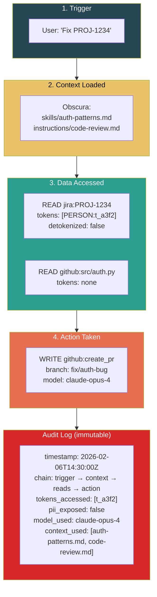
```mermaid
graph TB
    subgraph Trigger["1. Trigger"]
        USER["User: 'Fix PROJ-1234'"]
    end

    subgraph Context["2. Context Loaded"]
        OBS_CTX["Obscura:<br/>skills/auth-patterns.md<br/>instructions/code-review.md"]
    end

    subgraph DataAccess["3. Data Accessed"]
        READ1["READ jira:PROJ-1234<br/>tokens: [PERSON:t_a3f2]<br/>detokenized: false"]
        READ2["READ github:src/auth.py<br/>tokens: none"]
    end

    subgraph Action["4. Action Taken"]
        WRITE1["WRITE github:create_pr<br/>branch: fix/auth-bug<br/>model: claude-opus-4"]
    end

    subgraph AuditLog["Audit Log (immutable)"]
        LOG["timestamp: 2026-02-06T14:30:00Z<br/>chain: trigger → context → reads → action<br/>tokens_accessed: [t_a3f2]<br/>pii_exposed: false<br/>model_used: claude-opus-4<br/>context_used: [auth-patterns.md, code-review.md]"]
    end

    Trigger --> Context --> DataAccess --> Action --> AuditLog

    style Trigger fill:#264653,color:#fff
    style Context fill:#e9c46a,color:#000
    style DataAccess fill:#2a9d8f,color:#fff
    style Action fill:#e76f51,color:#fff
    style AuditLog fill:#d62828,color:#fff
```

You can answer:
- What data did the agent see?
- Why did the agent make that decision?
- Which context (Obscura skills) influenced the action?
- Was any PII exposed, and to which model?

### 8.4 Data Flow

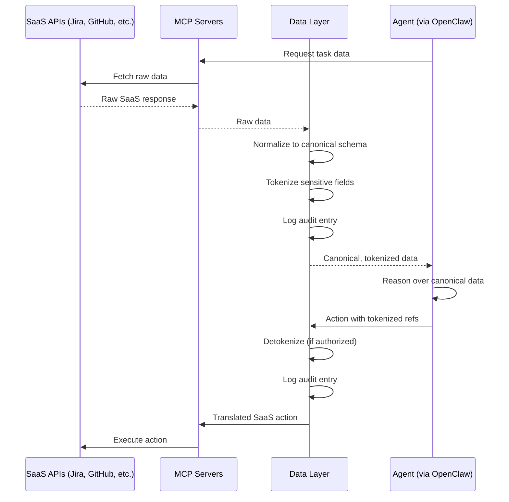
```mermaid
sequenceDiagram
    participant SaaS as SaaS APIs (Jira, GitHub, etc.)
    participant MCP as MCP Servers
    participant DL as Data Layer
    participant Agent as Agent (via OpenClaw)

    Agent->>MCP: Request task data
    MCP->>SaaS: Fetch raw data
    SaaS-->>MCP: Raw SaaS response
    MCP-->>DL: Raw data
    DL->>DL: Normalize to canonical schema
    DL->>DL: Tokenize sensitive fields
    DL->>DL: Log audit entry
    DL-->>Agent: Canonical, tokenized data

    Agent->>Agent: Reason over canonical data
    Agent->>DL: Action with tokenized refs
    DL->>DL: Detokenize (if authorized)
    DL->>DL: Log audit entry
    DL->>MCP: Translated SaaS action
    MCP->>SaaS: Execute action
```

**This layer is the IP.** Schema unification + tokenization + audit across SaaS sources doesn't exist off-the-shelf. Pieces exist (schema registries, tokenization vaults, event sourcing), but the union into an agent-ready canonical data layer is novel.

---

## 9. Integration Map

How the layers connect:

```mermaid
graph LR
    subgraph Owned["Your Code"]
        OBS["Obscura<br/>(Context)"]
        MZD["mzd-proxy<br/>(Models)"]
        DL["Data Layer<br/>(Canonical + Tokenization)"]
    end

    subgraph OpenSource["Open Source"]
        OC["OpenClaw<br/>(Orchestration)"]
        MCP["MCP Servers<br/>(Tools)"]
    end

    subgraph Commodity["Commodity Infra"]
        GW["Envoy/Traefik<br/>(Gateway)"]
        K8S["Kubernetes"]
    end

    OC -->|calls models via| MZD
    OC -->|uses tools via| MCP
    OC -->|receives context from| OBS
    OC -->|reads/writes data via| DL
    MCP -->|raw data flows through| DL
    OBS -->|syncs MCP config to agents| MCP
    GW -->|secures access to| OC
    GW -->|secures access to| MCP
    GW -->|secures access to| MZD
    K8S -->|hosts| OC
    K8S -->|hosts| MCP
    K8S -->|hosts| MZD
    K8S -->|hosts| DL

    style Owned fill:#2d6a4f,color:#fff
    style OpenSource fill:#264653,color:#fff
    style Commodity fill:#6c757d,color:#fff
```

**Ownership breakdown:**

| Category | Layers | Notes |
|----------|--------|-------|
| **Your IP** | Obscura, mzd-proxy, Data Layer | Core differentiators |
| **Open source** | OpenClaw, MCP | Extend and contribute |
| **Commodity** | Gateway, k8s | Buy, don't build |

---

## 10. Phased Rollout

### Rollout Timeline

```mermaid
gantt
    title Platform Rollout Phases
    dateFormat YYYY-MM
    axisFormat %b %Y

    section Phase 1: Local
    Obscura sync working           :done, p1a, 2025-11, 2026-02
    mzd-proxy unified API          :active, p1b, 2026-01, 2026-03
    MCP proxy aggregation          :p1c, 2026-02, 2026-04
    OpenClaw integration           :p1d, 2026-03, 2026-05
    End-to-end validation          :milestone, p1e, 2026-05, 0d

    section Phase 2: Remote
    k8s manifests                  :p2a, 2026-05, 2026-06
    Gateway + auth                 :p2b, 2026-05, 2026-07
    Audit logging                  :p2c, 2026-06, 2026-07
    Multi-tenant access            :p2d, 2026-07, 2026-08
    Remote access live             :milestone, p2e, 2026-08, 0d

    section Phase 3: Data
    Canonical schema design        :p3a, 2026-04, 2026-06
    SaaS translators               :p3b, 2026-06, 2026-09
    Tokenization vault             :p3c, 2026-07, 2026-09
    Audit trail + lineage          :p3d, 2026-08, 2026-10
    Governed data live             :milestone, p3e, 2026-10, 0d
```

### Phase 1 — Local Stack (Now)

Get the four core layers working on your machine.

- [ ] Obscura syncing context to all agents in all repos
- [ ] mzd-proxy serving as unified model API
- [ ] MCP servers accessible through proxy
- [ ] OpenClaw orchestrating agents via mzd-proxy + MCP
- [ ] Verify: OpenClaw agent uses Obscura context + MCP tools + any model

**Exit criteria:** An OpenClaw agent can pick up a Jira ticket (MCP), understand repo conventions (Obscura), call any model (mzd-proxy), and complete a task.

### Phase 2 — Remote Access

Deploy to k8s with secure gateway.

- [ ] k8s manifests for OpenClaw, mzd-proxy, MCP proxy
- [ ] Envoy/Traefik gateway with auth middleware
- [ ] TLS termination and rate limiting
- [ ] Audit logging for all agent actions
- [ ] Multi-tenant access controls

**Exit criteria:** Remote clients can securely invoke agents on the cluster.

### Phase 3 — Governed Data

Build the unified data layer.

- [ ] Canonical schema definitions for Task, Event, Identity, etc.
- [ ] SaaS-to-canonical translators (Jira, GitHub, Postman, Slack)
- [ ] Tokenization vault for PII/sensitive fields
- [ ] Detokenization policies per agent/role
- [ ] Audit trail with full lineage (data source → token → agent → action)
- [ ] Obscura context integration in audit records

**Exit criteria:** Agents never see raw PII. Every data access is logged. You can trace any agent decision back to its data and context sources.

---

## 11. Open Questions

| Question | Layer | Notes |
|----------|-------|-------|
| Does mzd-proxy handle MCP server aggregation, or is that a separate proxy? | 1, 2 | Could be one proxy or two |
| How does OpenClaw discover Obscura context — filesystem or API? | 3, 4 | Filesystem if local, API if k8s |
| What canonical types are needed beyond Task, Event, Identity? | 6 | Discover during Phase 1 by logging raw MCP responses |
| Where does the token vault live — in-cluster or external (Vault/KMS)? | 5, 6 | Depends on security requirements |
| How do variant selectors (model/role) map to OpenClaw agent configs? | 3, 4 | Obscura variants could drive OpenClaw agent selection |
| Should the data layer sit between MCP and agents, or wrap MCP servers? | 2, 6 | Wrapper is simpler; interceptor is more flexible |

---

## 12. Diagram Index

| # | Diagram | Type | Section | Covers |
|---|---------|------|---------|--------|
| 1 | Layer Stack | Graph | 2 | Full six-layer overview |
| 2 | Model Proxy Routing | Graph | 3 | mzd-proxy fan-out to providers |
| 3 | Model Request Flow | Sequence | 3 | API translation lifecycle |
| 4 | Responsibility Boundaries | Graph | 3 | What mzd-proxy owns vs doesn't |
| 5 | MCP Aggregation | Graph | 4 | Multi-agent to multi-server routing |
| 6 | MCP Tool Discovery | Sequence | 4 | Tool listing + invocation flow |
| 7 | Obscura MCP Config Sync | Flowchart | 4 | Vault → agent config distribution |
| 8 | Layer Differentiation | Graph | 5 | Tools vs Context vs Models |
| 9 | Context Resolution Flow | Flowchart | 5 | Priority routing + variant selection |
| 10 | Orchestration Flow | Sequence | 6 | End-to-end task completion |
| 11 | Agent Lifecycle | State Diagram | 6 | OpenClaw agent state machine |
| 12 | Gateway Architecture | Graph | 7 | TLS → Auth → Rate Limit → Cluster |
| 13 | Auth Flow | Sequence | 7 | JWT validation + routing |
| 14 | k8s Topology | Graph | 7 | Namespace layout + pod relationships |
| 15 | Schema Unification | Graph | 8.1 | SaaS → Canonical type mapping |
| 16 | Canonical Schema | Class Diagram | 8.1 | Task, Event, Identity, Artifact |
| 17 | Tokenization Pipeline | Flowchart | 8.2 | PII detection → token vault |
| 18 | Detokenization Auth | Flowchart | 8.2 | Role-based detokenization policies |
| 19 | Audit Lineage | Graph | 8.3 | Trigger → context → data → action chain |
| 20 | Data Flow (E2E) | Sequence | 8.4 | SaaS → normalize → tokenize → agent → action |
| 21 | Integration Map | Graph | 9 | Cross-layer ownership + connections |
| 22 | Rollout Timeline | Gantt | 10 | Phase 1-3 milestones |
