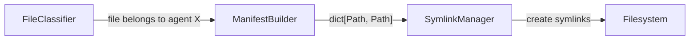
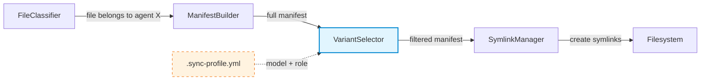
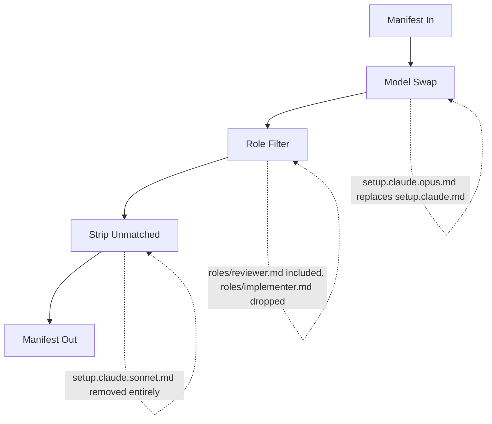
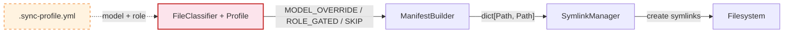
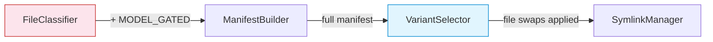

# ADR: Model/Role Override Layer

**Status:** Accepted — implementing Option B
**Date:** 2025-02-05
**Context:** FV-Copilot sync pipeline needs behavioral variants per model (opus/sonnet/haiku) and per role (reviewer/implementer/architect)

---

## Problem

The current sync pipeline has two layers:
1. **What files exist** (vault structure)
2. **Who gets them** (agent classification — UNIVERSAL, AGENT_NAMED, etc.)

Missing is a **behavioral layer** — the same agent may need different files depending on:
- Which **model** is running (opus vs sonnet have different capability profiles)
- Which **role** is active (reviewer vs implementer need different instructions)

## Current Pipeline



## Decision

**Option B: VariantSelector (additive pipeline stage)** — selected.

Option A (classification-level gating) documented below as future extension path.

---

## Option B: VariantSelector

### Architecture



### How It Works

VariantSelector receives the manifest (`dict[Path, Path]`) and performs three operations:



1. **Model swap** — `setup.claude.opus.md` replaces `setup.claude.md` at the same dest path when model=opus
2. **Role filter** — files in `roles/` are included only when matching active role
3. **Strip unmatched** — all variant files for other models/roles are removed

### Sync Profile

```yaml
# vault/.sync-profile.yml (global)
model: opus
role: reviewer
```

```yaml
# vault/repos/MyRepo/.sync-profile.yml (per-repo override)
model: sonnet
# role inherits from global
```

### File Naming Convention

```
setup.claude.md              # base (fallback)
setup.claude.opus.md         # model override (model=opus)
setup.claude.sonnet.md       # model override (model=sonnet)
skills/roles/reviewer.md     # role overlay (role=reviewer)
skills/roles/implementer.md  # role overlay (role=implementer)
```

### Properties

- **Additive** — zero changes to FileClassifier, ManifestBuilder, SymlinkManager
- **Reversible** — remove class + 3 lines in VaultSync to revert
- **Testable** — dict in, dict out, pure function
- **Watch-compatible** — `.sync-profile.yml` changes trigger watcher re-sync

---

## Option A: Classification-Level Gating (Future Extension)

### Architecture



### What It Adds

FileClassifier gains two new classification types:
- `MODEL_OVERRIDE` — file gated by model match
- `ROLE_GATED` — file gated by role match

This handles **directory-level gating** that Option B cannot:

```
vault/
  skills/
    opus-only/           # entire directory gated to model=opus
      deep-analysis.md
    reviewer/            # entire directory gated to role=reviewer
      review-checklist.md
```

### Trade-offs vs Option B

| | Option B | Option A |
|---|---|---|
| Existing code changes | None | FileClassifier, PRIORITY, Classification type |
| Existing test impact | None | 10+ classification tests may need updates |
| Reversibility | Trivial (remove class) | Moderate (revert core logic) |
| Scope | File-level swaps | File + directory-level gating |
| Coupling | Decoupled stage | Classifier coupled to runtime config |

### Hybrid Path

**B now, A later if needed.** Option B handles file-level model/role variants. If directory-level gating becomes necessary, add `MODEL_GATED`/`ROLE_GATED` classification types to FileClassifier. Nothing from Option B gets thrown away — VariantSelector continues handling file swaps, classifier handles directory gating.


